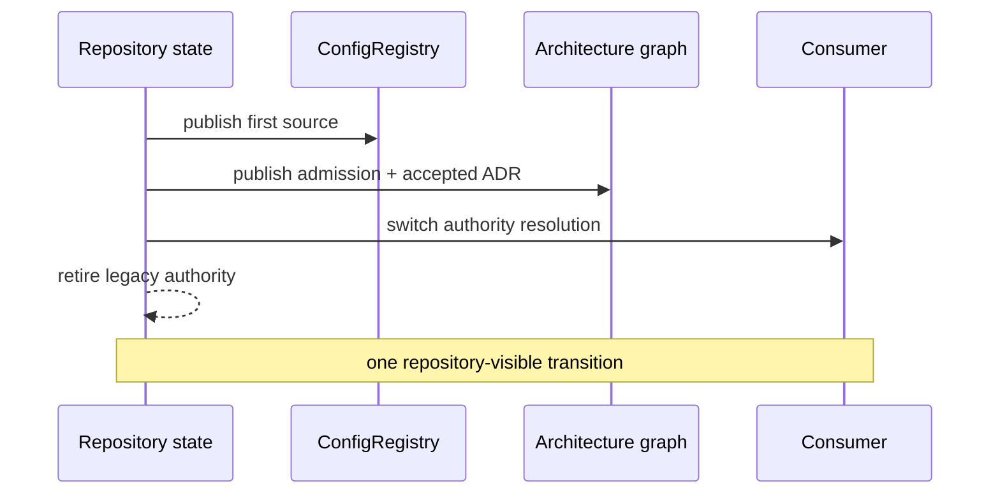

# Design: Atomic Configuration Authority Migration

## Basis

### Sources

| ID | Kind | Locator | Use |
| --- | --- | --- | --- |
| S-001 | prior_design | `AGENTS.md` | Accepted repository ownership direction |
| S-002 | repository | `.agents/skills/architecture-design/references/design-rules.md` | Current design authority rules |
| S-003 | repository | `architecture/architecture_graph.yaml` | Node admission and authority publication rule |

### Source Coverage

| Kind | Sources or none |
| --- | --- |
| prior_design | S-001 |
| research | none |
| plan | none |
| user | none |
| repository | S-002, S-003 |
| other | none |

### Evidence

| ID | Source | Locator | Observed fact |
| --- | --- | --- | --- |
| E-001 | S-002 | `line 1` | The active design rules preserve one durable architecture authority. |
| E-002 | S-003 | `lines 1-2` | Production admission and ownership are published from one architecture graph. |
| E-003 | S-001 | `lines 1-2` | Repository rules require architecture and implementation ownership to remain explicit. |
| E-004 | S-003 | `line 1` | The change introduces no recognizer and claims no fixture-owned or structural negative guarantee. |

### Requirements

| ID | Kind | Statement | Basis | Open shape |
| --- | --- | --- | --- | --- |
| R-001 | outcome | Consumers read one current configuration value from the accepted authority after cutover. | S-001, E-003 | Internal storage encoding inside `ConfigRegistry` remains open. |
| R-002 | repository_rule | Exactly one durable configuration authority is visible in every published repository state. | S-003, E-002 | The implementation mechanism for atomic publication remains open. |
| R-003 | constraint | The first registry source, graph admission, and ADR transition publish atomically. | S-001, S-003, E-002, E-003 | Local transaction and staging mechanics remain open. |
| R-004 | exclusion | No compatibility break or visible dual-write interval is introduced. | S-001, S-002, E-001, E-003 | Private migration helpers remain open. |

## Candidate Analysis

- Comparison: `two_or_three`
- Result: `selected F-001`
- Result basis: F-001, F-002, M-001, M-002, M-003, R-001, R-002, R-003, R-004, E-001, E-002, E-003

### Forms

| ID | Form | Hard constraints | Main trade-off | Basis |
| --- | --- | --- | --- | --- |
| F-001 | Atomically publish `ConfigRegistry`, graph admission, ADR transition, and legacy retirement. | pass | Requires one coordinated publication boundary. | R-001, R-002, R-003, R-004, E-001, E-002, E-003 |
| F-002 | Introduce `ConfigRegistry` through a visible dual-write migration interval. | pass | Simpler local sequencing but creates two observable authorities and drift risk. | R-001, R-004, E-001, E-003 |

### Material-Obligation Delta

| ID | Material obligation | F-001 | F-002 | Independent authority |
| --- | --- | --- | --- | --- |
| M-001 | R-001 | yes | yes | R-001, R-002, E-003 |
| M-002 | Publish source, graph admission, ADR transition, and legacy retirement atomically. | yes | no | R-002, R-003, E-002 |
| M-003 | Maintain a visible dual-write interval. | no | yes | none |

### Future Pressures

| ID | Pressure | Basis | Treatment | Closure refs | Accepted cost or risk |
| --- | --- | --- | --- | --- | --- |
| P-001 | Operators may request rollback after cutover. | S-001, E-003 | deferred | D-002 | Rollback requires a new accepted authority transition; hidden dual authority is not retained as rollback machinery. |

## Decision Register

### D-001 — Configuration ownership and authority
- Concerns: `form`, `owner`, `source_of_truth`, `policy`, `dependency`
- Lock: `ConfigRegistry` becomes the sole durable configuration authority; consumers and policy depend on its owning boundary, and the legacy JSON file cannot remain an authority or mirror.
- Open: Registry-internal storage encoding, helper decomposition, and local adapter shape remain implementation choices.
- Basis: R-001, R-002, E-001, E-002, E-003
- Form: F-001
- Realizes: M-001
- Depends on: none
- Contract targets: `classification`, `owner`, `source_of_truth`, `policy`, `dependency`, `durable_impact`, `unit_family`
- Rationale: One owner satisfies the accepted direction and removes the drift path created by dual authority.

### D-002 — Atomic migration lifecycle
- Concerns: `order`, `state_data`, `migration_retirement`, `temporal`, `atomicity`
- Lock: The first registry source, graph admission, accepted ADR transition, consumer switch, and legacy-authority retirement appear in one repository-visible transition; no published state exposes zero or two authorities.
- Open: Temporary uncommitted staging and the local transaction mechanism remain open if they cannot be observed as a repository state.
- Basis: R-002, R-003, R-004, E-001, E-002, E-003
- Form: F-001
- Realizes: M-002
- Depends on: D-001
- Contract targets: `order`, `state_data`, `migration_retirement`, `temporal`, `atomicity`, `durable_impact`, `unit_family`
- Rationale: The graph admission rule and single-authority requirement prohibit a visible intermediate migration state.

### D-003 — Public compatibility boundary
- Concerns: `in_scope`, `out_of_scope`, `compatibility`
- Lock: Configuration authority and publication lifecycle change; the public read contract remains compatible, and historical replay, a new event API, and visible dual write remain out of scope.
- Open: Private compatibility adapter placement inside the owning boundary remains open.
- Basis: R-001, R-004, E-001, E-003
- Form: F-001
- Realizes: none
- Depends on: D-001, D-002
- Contract targets: `scope`, `compatibility`, `acceptance`, `verification`, `unit_family`
- Rationale: The accepted outcome changes ownership, not consumer-visible configuration semantics.

## Impact Register

### I-001 — Accepted authority ADR and graph admission
- Action: create
- Surface: `ADR-0001`; `architecture/architecture_graph.yaml`; first `ConfigRegistry` source
- Required by: D-001, D-002
- Resulting authority: D-001
- Contract requirement: create ADR-0001 and publish the accepted graph admission and first real registry source under D-001 in the same repository-visible state.

### I-002 — Legacy authority retirement
- Action: retire
- Surface: the legacy design-rule authority route and every production authority-resolution edge that consumes it
- Required by: D-001, D-002
- Resulting authority: D-001
- Contract requirement: Remove the legacy file from production authority resolution in the same state that admits `ConfigRegistry`, while preserving the public read contract.

## Assurance Register

### A-001 — Single-authority consumer behavior
- Verifies: R-001, R-002, R-004, D-001/owner, D-001/source_of_truth, D-001/policy, D-001/dependency, D-003/compatibility, I-002
- Claim: After cutover, consumers read the current value through `ConfigRegistry`, preserve the public format, and cannot observe the legacy JSON file as an authority.
- Failure: A consumer reads a stale or differently shaped value, or any production path still treats the legacy JSON file as authoritative.
- Oracle: Read through the real consumer boundary after cutover and observe the current compatible value while the legacy authority path is absent from production resolution.
- Proxy risk: A registry unit test or copied value can pass while consumers still resolve the legacy authority.
- Evidence constraints: Exercise the real consumer path and authority resolution; do not accept private helper inspection or a second inventory as proof.
- Architecture seam: D-001, D-003

### A-002 — Atomic publication boundary
- Verifies: R-003, D-002/order, D-002/state_data, D-002/migration_retirement, D-002/temporal, D-002/atomicity, I-001, I-002
- Claim: Every repository-visible state has exactly one admitted configuration authority, and the accepted ADR, graph node, first source, consumer switch, and legacy retirement transition together.
- Failure: A commit or observable publication exposes no authority, both authorities, graph admission without source/ADR coverage, or a consumer switch before retirement.
- Oracle: Inspect the parent and resulting repository states and verify the complete authority transition as one atomic state change, then run graph-health validation on the resulting state.
- Proxy risk: A sequence of individually passing commits can still expose an invalid intermediate state.
- Evidence constraints: Evaluate repository-visible states and graph health; do not treat an uncommitted local staging sequence as a published state.
- Architecture seam: D-002

## Stop Conditions

### H-001 — Atomic transition is not representable
- Trigger: Repository evidence shows that ADR publication, graph admission, first source, consumer switch, and legacy retirement cannot be committed as one repository-visible transition.
- Invalidates: D-001, D-002, A-001, A-002, I-001, I-002
- Resolution requires: Re-open architecture selection with the actual publication boundary and choose a form that preserves one visible authority in every state.

## Contract Interface

- Profile: `REFACTOR`
- Obligations: `SOURCE_OF_TRUTH_SINGULARITY`, `SEQUENCED_MIGRATION_AND_RETIREMENT`, `TEMPORAL_SURFACE_CLOSURE`, `ALL_OR_NOTHING_FAILURE_BOUNDARY`
- ADR Impact: create ADR-0001
- Sources: S-001, S-002, S-003
- Requirements: R-001, R-002, R-003, R-004
- Commitments: D-001, D-002, D-003
- Assurance: A-001, A-002
- Impacts: I-001, I-002
- Stops: H-001

## Diagrams

### DG-001 — Atomic cutover sequence
- Type: `sequence`
- Question: In what order do the authority, graph, ADR, consumer, and retirement surfaces become visible, and where is the atomic boundary?
- Supports: D-001, D-002, A-002, I-001, I-002

## Readiness Matrix

### Architecture Closure

| Concern | Status | Support refs |
| --- | --- | --- |
| owner | closed | D-001 |
| in_scope | closed | D-003 |
| out_of_scope | closed | D-003 |
| source_of_truth | closed | D-001 |
| compatibility | closed | D-003 |
| order | closed | D-002 |
| policy | closed | D-001 |
| dependency | closed | D-001 |
| state_data | closed | D-002 |
| migration_retirement | closed | D-002 |
| temporal | closed | D-002 |
| atomicity | closed | D-002 |
| negative_proof_fixture | not_applicable | E-004 |
| recognition | not_applicable | E-004 |

### Gate Closure

| Gate | Status | Support refs |
| --- | --- | --- |
| Owner-Level Fix | pass | D-001, A-001, E-001 |
| Ownership | pass | D-001, A-001 |
| Source-Of-Truth Singularity | pass | D-001, A-001 |
| Source-Truth Minimality | pass | D-001, A-001, M-003 |
| Boundary-Owned Policy | pass | D-001, A-001 |
| Dependency Direction | pass | D-001, A-001 |
| Solution Proportionality | pass | F-001, F-002, M-001, M-002, M-003, R-001, R-002, E-003, R-003, E-002 |
| Outcome-Proof Fit | pass | A-001, A-002 |
| Verification | pass | A-001, A-002 |
| Future Pressure | pass | P-001 |
| Handoff Consumability | pass | CONTRACT, H-001 |
| Negative Proof And Fixture Quarantine | not_applicable | E-004 |
| State/Data Ownership | pass | D-002, A-002 |
| Sequenced Migration And Retirement | pass | D-002, A-002 |
| Temporal Surface Closure | pass | D-002, A-002 |
| All-Or-Nothing Failure Boundary | pass | D-002, A-002 |
| Bounded Recognition Scope | not_applicable | E-004 |

## Open Blockers

None
