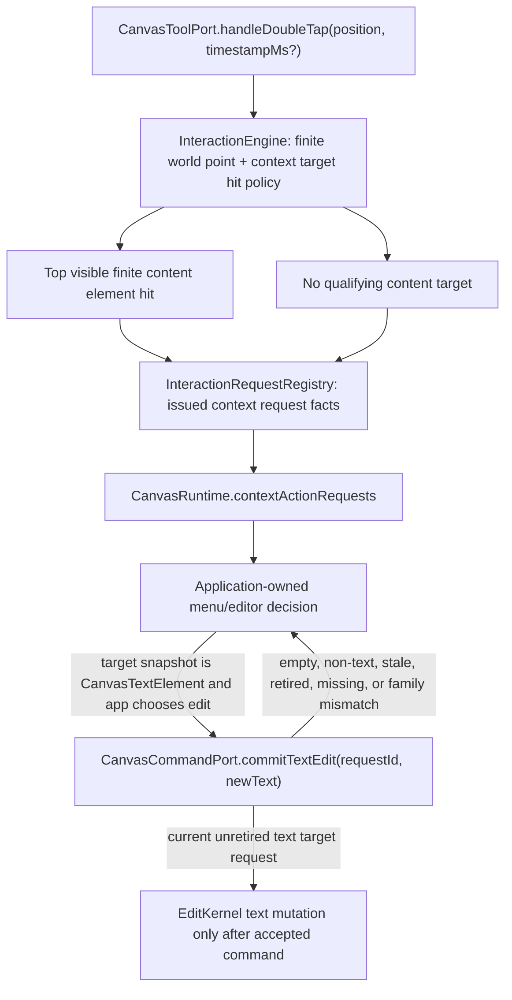
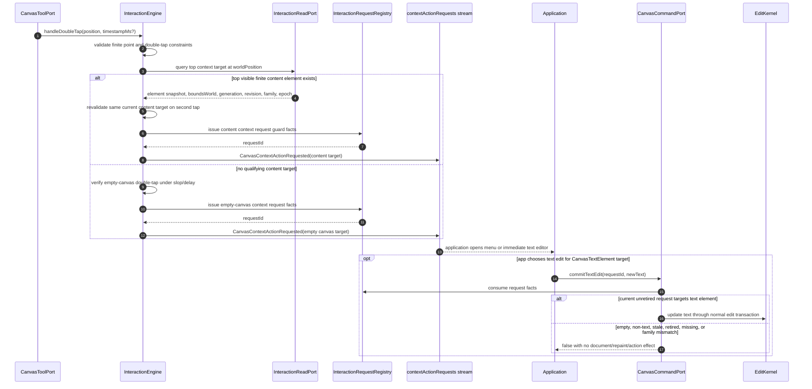
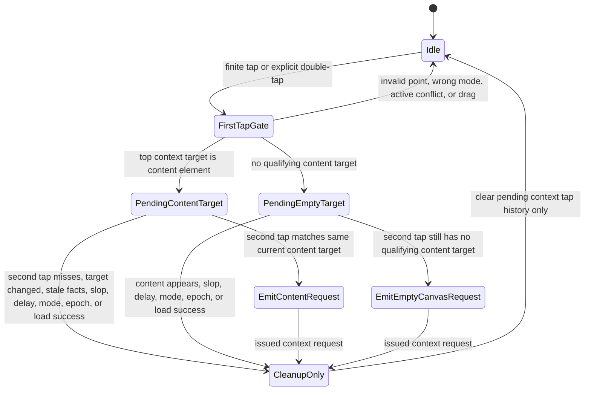

# Design: Double-Tap Context Action

---
date: 2026-05-19
designer: Codex
commit: d93c06d
branch: new-architecture
design_question: "Design the documentation change that makes double-tap a general application-owned context signal for content targets and empty canvas, while preserving text editing as an application choice."
---

## Disposition

READY_FOR_CONTRACT

## Product Outcome

Double-tap becomes one application-facing context request instead of a text-only
edit trigger. A double-tap on any visible content element except background gives
the application a content-target context request. A double-tap on a location with
no content target gives the application an empty-canvas context request. Text is
handled through the same request path: the application may open a menu first, or
it may preserve the old UX by immediately opening its text editor when the
target element snapshot is text.

Non-goals:

- No engine-owned context menu, Flutter overlay, focus, IME, or accessibility
  state.
- No document mutation, selection mutation, preview mutation, repaint, resource
  mutation, or user-action event from request delivery itself.
- No broad change to selection hit eligibility. Context-action target
  eligibility is a separate interaction policy.

## Target Contract Classification

- Profile: `SOURCE_OF_TRUTH_DOCS`
- Obligations: `PUBLIC_API_CHANGE`, `SEAM_MIGRATION`

The next step should update normative docs and registries only. Production code
and tests can follow after the source-of-truth docs are locked.

## Research Inputs

- `.research/2026-05-19-double-tap-docs-current-contract.md` - current
  text-only double-tap contract, affected docs, and open questions.

## Repository Evidence

- `.research/2026-05-19-double-tap-docs-current-contract.md:13` - current docs
  describe double-tap as text-edit request only.
- `.research/2026-05-19-double-tap-docs-current-contract.md:17` - current docs
  explicitly defer a full contextual-action event for shapes, images, lines, and
  empty canvas.
- `.research/2026-05-19-double-tap-docs-current-contract.md:127` - current hit
  eligibility is narrower than "any content node" because it requires
  `element.isSelectable`.
- `.research/2026-05-19-double-tap-docs-current-contract.md:140` - broadening
  double-tap touches registries, phase docs, verification docs, and release
  gates.
- `docs/contracts/interaction_engine.md:215` - current primary section is
  `Text double-tap`.
- `docs/contracts/interaction_engine.md:217` - current target is a visible
  selectable text element.
- `docs/contracts/interaction_engine.md:221` - text request emission records
  issued request guard facts in `InteractionRequestRegistry`.
- `docs/contracts/interaction_engine.md:233` - the registry is not active
  text-input session or preview state.
- `docs/contracts/interaction_engine.md:237` - request-originated text changes
  commit through `CanvasCommandPort.commitTextEdit`.
- `docs/contracts/interaction_engine.md:246` - `CanvasInteractionRequestId` is
  already intentionally compatible with a future contextual-action request API.
- `docs/contracts/interaction_engine.md:248` - the current phase excludes
  contextual-action events for shapes, images, lines, and empty canvas.
- `docs/contracts/public_api_v1.md:263` - `CanvasInteractionRequestId` is a
  public value type.
- `docs/contracts/public_api_v1.md:294` - the engine, not application code,
  generates interaction request ids.
- `docs/contracts/public_api_v1.md:359` - `CanvasRuntime` currently exposes
  `textEditRequests`.
- `docs/contracts/public_api_v1.md:1680` - `CanvasToolPort.handleDoubleTap` is
  already the public double-tap entry boundary.
- `docs/contracts/public_api_v1.md:2212` - `CanvasTextEditRequested` is the
  current public request payload.
- `docs/contracts/public_api_v1.md:2242` - the public text model says the engine
  detects double-tap on text.
- `docs/contracts/public_api_v1.md:2246` - the application owns display of the
  Flutter text editor overlay.
- `docs/contracts/public_api_v1.md:2251` - request-originated text changes
  commit through `CanvasCommandPort.commitTextEdit`.
- `docs/contracts/public_api_v1.md:898` - `CanvasElement` is a public sealed DTO
  with common element facts.
- `docs/contracts/public_api_v1.md:913` - every public element snapshot exposes
  id, kind, revision, transform, visibility, selectability, lock, deletion,
  transformability, and metadata facts.
- `docs/contracts/public_api_v1.md:981` - `CanvasTextElement` is the public text
  element family and can serve as the text snapshot in the generalized target.
- `docs/contracts/public_api_v1.md:1409` - runtime-created timestamp behavior is
  documented as a public contract.
- `docs/contracts/public_api_v1.md:1414` - nullable timestamps on double-tap
  boundaries are hints.
- `docs/contracts/public_api_v1.md:1430` - current timestamp compatibility proof
  names `CanvasTextEditRequested.timestampMs`.
- `docs/contracts/geometry.md:54` - hit eligibility is currently defined as a
  policy.
- `docs/contracts/geometry.md:57` - current point hit eligibility requires
  `element.isSelectable`.
- `docs/contracts/geometry.md:63` - point hit scope is content layers only.
- `docs/contracts/geometry.md:67` - background elements are not
  pointer-selectable in v1.
- `docs/contracts/geometry.md:113` - paint admission is separate from hit
  bounds.
- `docs/contracts/geometry.md:118` - background elements remain paintable even
  though they are excluded from pointer selection.
- `docs/architecture/03_data_model.md:88` - committed element handles record
  `locationKind: background | content`.
- `docs/contracts/operation_matrix.md:84` - the current effect row is text-only
  and emits `textEditRequested`.
- `docs/contracts/operation_matrix.md:110` - current request delivery has no
  document, selection, preview, spatial, projection, repaint, or action effect.
- `docs/architecture/01_runtime_ownership.md:153` - `InteractionRequestRegistry`
  is interaction-owned.
- `docs/architecture/01_runtime_ownership.md:156` - `RuntimeRoot` owns registry
  lifetime and `InteractionEngine` records issued request facts.
- `docs/architecture/01_runtime_ownership.md:159` - the registry is not active
  text-input session, app overlay state, or preview state.
- `docs/architecture/02_package_boundaries.md:92` - the current package-boundary
  map names `text_tap_router.dart` under interaction.
- `docs/architecture/02_package_boundaries.md:247` - the request registry stores
  only engine-issued guard facts and retired status for app-owned interaction
  requests.
- `docs/diagrams/seq_text_edit_request.mmd:33` - no first top hit currently
  produces no edit request.
- `docs/diagrams/seq_text_edit_request.mmd:55` - no second top hit or non-text
  top hit currently finishes without edit request.
- `docs/diagrams/state_pending_text_edit_request.mmd:33` - no first top hit
  currently returns to idle with no request.
- `docs/diagrams/state_pending_text_edit_request.mmd:67` - second no-hit
  currently clears pending state only.
- `docs/implementation/p12_eraser_and_text_request.md:18` - P12 currently scopes
  a text double-tap router.
- `docs/implementation/p12_eraser_and_text_request.md:127` - the P12 exit gate
  currently requires text double-tap on selectable text to emit
  `CanvasTextEditRequested`.
- `docs/implementation/p12_eraser_and_text_request.md:134` - the P12 exit gate
  currently keeps the full contextual-action event API deferred.
- `docs/verification/tests.md:261` - runtime-created timestamp tests currently
  include text edit requests.
- `docs/verification/tests.md:453` - cleanup tests currently mention pending
  text tap cleanup emitting no text request.
- `docs/verification/functional_ledger.md:66` - the functional ledger currently
  has a text edit request row.
- `docs/verification/release_gates.md:200` - release gates currently require
  text edit request and guarded stale text commit integration tests.
- `PLAN.md:5` - the active roadmap is the plan index.
- `docs/README.md:3` - `docs/` is the durable source of truth for the new-engine
  transition and target architecture.
- `docs/README.md:75` - `docs/tool/check_docs.dart` checks documentation
  entrypoints, registries, ids, paths, diagram catalog membership, and phase
  navigation.

## Design Form Candidates

### Candidate A. Replace Text Request With Context Action Request

- Form: replace the text-only public request seam with
  `CanvasContextActionRequested`, emitted through
  `CanvasRuntime.contextActionRequests`. The event carries the double-tap trigger,
  a content-element or empty-canvas target, positions, timestamp, revision facts,
  and an engine-issued `CanvasInteractionRequestId`. Text editing remains guarded
  by `commitTextEdit(requestId, newText)` when the content target snapshot is
  `CanvasTextElement`.
- Why it could work: it matches the product outcome, uses the existing
  `CanvasInteractionRequestId` extension point, keeps application UI ownership,
  preserves text stale guards, and creates one public stream for node and empty
  canvas context menus.
- Gate failures or risks: it is a public API change and requires coordinated
  docs, registries, diagrams, phase gates, and verification updates. The future
  contract must explicitly migrate every `textEditRequests` and
  `CanvasTextEditRequested` reference.

### Candidate B. Add Context Requests But Keep Text Requests

- Form: add `contextActionRequests` for non-text content and empty canvas while
  preserving `textEditRequests` for text double-tap.
- Why it could work: smaller compatibility impact if an existing implementation
  already consumed `textEditRequests`.
- Gate failures or risks: fails the product outcome because text remains a
  special engine-level trigger that can bypass the menu. It creates duplicate
  request streams for the same double-tap gesture and forces applications to
  merge two sources of truth for context behavior.

### Candidate C. Keep Public API And Reword Text Docs

- Form: keep `CanvasTextEditRequested` and describe application menus around it.
- Why it could work: minimal doc churn.
- Gate failures or risks: fails root cause and source-of-truth gates. The
  public payload cannot represent empty canvas or non-text targets, and the
  current docs explicitly defer contextual action for those cases.

### Candidate D. Emit A User Action Or Command Callback

- Form: model double-tap as `CanvasActionCommitted` or a command callback.
- Why it could work: it would reuse an existing public stream shape.
- Gate failures or risks: wrong owner and wrong effect model. A context menu
  request is not a committed document/user action, and current contracts say text
  request delivery has no document, selection, preview, repaint, or action
  effect.

## Known Future Pressures

| Pressure | Evidence | How the selected form responds | Accepted cost or risk |
|---|---|---|---|
| Product wants one menu-oriented double-tap signal for content and empty canvas, not text-only editing. | `.research/2026-05-19-double-tap-docs-current-contract.md:6`; user clarification in this design request. | Replaces text-only request with one context request target union. | Public API docs and downstream implementation must migrate from text-specific names. |
| Current docs already reserved `CanvasInteractionRequestId` for future contextual action but deferred that API. | `docs/contracts/interaction_engine.md:246`; `docs/contracts/interaction_engine.md:248` | Uses the reserved request-id seam now instead of inventing an unrelated identifier. | Registry facts must gain request target kind and non-text/empty mismatch rejection semantics. |
| Current hit eligibility requires selectable elements, but product wants any content node except background. | `docs/contracts/geometry.md:57`; `.research/2026-05-19-double-tap-docs-current-contract.md:127` | Adds a context-action target policy that uses visible finite content geometry and ignores `isSelectable` for this signal. | Future implementation must keep this separate from selection hit testing to avoid selection behavior drift. |
| Background is paintable but must not become a content-target menu subject. | `docs/contracts/geometry.md:67`; `docs/contracts/geometry.md:118`; `docs/architecture/03_data_model.md:88` | Background handles are excluded from content targets. If no content target exists at the point, the request is empty-canvas. | Applications that visually rely on background elements will receive empty-canvas context, not background-element context. |
| Text editing must retain guarded stale commit behavior. | `docs/contracts/interaction_engine.md:237`; `docs/contracts/public_api_v1.md:2251`; `docs/indexes/by_test_area.md:582` | `commitTextEdit` remains and accepts only request ids issued for current text content targets. | The application must retain the original context request id while its menu/editor is open. |
| Timestamp tests and public timestamp docs currently name text edit requests. | `docs/contracts/public_api_v1.md:1430`; `docs/verification/tests.md:261` | Moves the timestamped runtime output proof to `CanvasContextActionRequested.timestampMs`. | Verification docs and tests need wording and fixture updates. |
| P12 phase and registries currently name text request routing. | `docs/implementation/p12_eraser_and_text_request.md:18`; `docs/_registry/sections.yaml:503`; `docs/_registry/sections.yaml:511` | Future docs change must rename route ownership from text tap to context action tap while preserving cleanup coordinator use. | Registry churn is unavoidable but local to docs before code is written. |

## Selected Form

Select Candidate A: replace the text-specific double-tap request seam with a
general context-action request seam.

The public surface should be documented as:

```dart
final class CanvasRuntime {
  Stream<CanvasContextActionRequested> get contextActionRequests;
}

enum CanvasContextActionTrigger { doubleTap }

final class CanvasContextActionRequested {
  CanvasContextActionRequested({
    required this.requestId,
    required this.trigger,
    required this.target,
    required this.controllerEpoch,
    required this.documentRevision,
    required this.timestampMs,
    required this.viewPosition,
    required this.worldPosition,
  });

  final CanvasInteractionRequestId requestId;
  final CanvasContextActionTrigger trigger;
  final CanvasContextActionTarget target;
  final int controllerEpoch;
  final int documentRevision;
  final int timestampMs;
  final Offset viewPosition;
  final Offset worldPosition;
}

sealed class CanvasContextActionTarget {}

final class CanvasContentElementContextActionTarget
    extends CanvasContextActionTarget {
  CanvasContentElementContextActionTarget({
    required this.elementSnapshot,
    required this.boundsWorld,
  });

  final CanvasElement elementSnapshot;
  final Rect boundsWorld;
}

final class CanvasEmptyCanvasContextActionTarget
    extends CanvasContextActionTarget {
  const CanvasEmptyCanvasContextActionTarget();
}
```

The future Change Contract may refine names, but it must preserve these locked
semantics:

- `CanvasRuntime.textEditRequests` and `CanvasTextEditRequested` are retired from
  the target public docs instead of becoming a parallel stream.
- `CanvasToolPort.handleDoubleTap` remains the public input boundary.
- The application owns the context menu, text editor overlay, IME, focus,
  accessibility, text selection, hide/show policy, and menu/editor lifetime.
- The engine emits exactly one context request for a valid double-tap target:
  content element or empty canvas.
- Content target eligibility is: finite point, visible content element, finite
  invertible transform, exact geometry hit, topmost in content paint order.
  `element.isSelectable` does not gate context-action requests.
- Background elements never produce
  `CanvasContentElementContextActionTarget`. A double-tap with no qualifying
  content target, including a point covered only by background elements, emits
  `CanvasEmptyCanvasContextActionTarget`.
- First and second taps must match the same target class. For content, the
  second tap must revalidate the same current element id, generation,
  elementRevision, family, controllerEpoch, visibility, and top-hit status. For
  empty canvas, the second tap must still have no qualifying content target
  within the configured double-tap constraints.
- Request delivery has no document, selection, preview, repaint, spatial,
  projection, resource, or action effect.
- `InteractionRequestRegistry` stores context request guard facts:
  request id, request target kind, controllerEpoch, retired status, and, for
  content targets, target element id, generation, elementRevision, and family.
- `commitTextEdit(requestId, newText)` remains the guarded text mutation seam.
  It accepts only current, unretired context request ids whose target is a text
  content element. It rejects empty-canvas, non-text, stale, retired, missing,
  or family-mismatched request ids without document/repaint/action effects.
- `documentRevision` on the context request is observation and diagnostics only,
  not a stale guard, preserving the current text edit stale-guard model.

This selected form resolves the product request at the owning public interaction
boundary instead of patching only the text editor path. It also avoids a second
source of truth for double-tap behavior: applications subscribe to one request
stream and choose their own menu/editor behavior from the target payload.

## Hard Gate Check

| Gate | Result | Evidence |
|---|---|---|
| Root cause | pass | Current root cause is a text-only request contract, not just missing prose for non-text targets: `docs/contracts/interaction_engine.md:215`, `docs/contracts/public_api_v1.md:2242`, `.research/2026-05-19-double-tap-docs-current-contract.md:125`. |
| Ownership | pass | `InteractionEngine` owns request emission and records issued facts; the application owns overlays and UI: `docs/architecture/01_runtime_ownership.md:156`, `docs/contracts/public_api_v1.md:2246`, `docs/contracts/interaction_engine.md:233`. |
| Source of truth | pass | Replaces the text-specific public stream with one context stream, avoiding parallel text and context streams; docs are the durable source of truth: `docs/README.md:3`, `docs/contracts/public_api_v1.md:359`, `docs/contracts/public_api_v1.md:2212`. |
| Boundary | pass | Input boundary remains `CanvasToolPort.handleDoubleTap`; output boundary becomes the public request stream; guarded text mutation remains `CanvasCommandPort.commitTextEdit`: `docs/contracts/public_api_v1.md:1680`, `docs/contracts/public_api_v1.md:2251`. |
| Dependency direction | pass | Interaction already uses narrow read paths and registry facts, while command-port commits delegate accepted mutations to `EditKernel`: `docs/architecture/01_runtime_ownership.md:153`, `docs/architecture/01_runtime_ownership.md:156`, `docs/architecture/02_package_boundaries.md:247`. |
| State/data | pass | Pending tap history remains interaction state only; registry stores guard facts, not app overlay state; app UI state stays outside the engine: `docs/diagrams/state_pending_text_edit_request.mmd:37`, `docs/architecture/01_runtime_ownership.md:159`, `docs/contracts/interaction_engine.md:233`. |
| Seam | pass | The public request seam migrates from `textEditRequests`/`CanvasTextEditRequested` to `contextActionRequests`/`CanvasContextActionRequested`; `CanvasInteractionRequestId` is the successor id seam already reserved for contextual action: `docs/contracts/public_api_v1.md:359`, `docs/contracts/public_api_v1.md:2212`, `docs/contracts/interaction_engine.md:246`. |
| Verification | pass | Docs checks exist for registries and navigation, and current verification surfaces name the text request rows that must be migrated: `docs/README.md:75`, `docs/verification/tests.md:261`, `docs/verification/release_gates.md:200`. |
| Future pressure | pass | Known future pressure from deferred contextual action, broader hit eligibility, timestamp proof, and P12 phase docs is addressed by one target union and one request stream: `docs/contracts/interaction_engine.md:248`, `.research/2026-05-19-double-tap-docs-current-contract.md:140`. |

## Lock-Required Facts

- Owner: `InteractionEngine` owns double-tap target detection and context request
  emission; `CanvasCommandPort` owns guarded text commit acceptance; the
  application owns menu/editor UI.
- Owning layer/module/document family: `docs/contracts/interaction_engine.md`
  for behavior; `docs/contracts/public_api_v1.md` for public type shape;
  `docs/contracts/geometry.md` for target eligibility; `docs/contracts/operation_matrix.md`
  for effects; diagrams and registries for route/source-of-truth consistency.
- Seam: replace `CanvasRuntime.textEditRequests` with
  `CanvasRuntime.contextActionRequests`; replace `CanvasTextEditRequested` with
  `CanvasContextActionRequested`; keep `CanvasInteractionRequestId` and
  `CanvasCommandPort.commitTextEdit`.
- Dependency/import direction: interaction may use narrow read-only query ports
  and the interaction registry; command-port text commit consumes registry facts
  and delegates accepted changed text to `EditKernel`.
- State/data ownership: pending double-tap target history is interaction state;
  context request guard facts are registry state; context menu and text overlay
  state are application state; committed document and selection are not mutated
  by request delivery.
- Entry boundaries: `CanvasToolPort.handleDoubleTap({required Offset position,
  int? timestampMs})` and normalized finite tap samples from `CanvasSurface`.
- Exit boundaries: `CanvasRuntime.contextActionRequests`; later optional
  `CanvasCommandPort.commitTextEdit` only for text content target request ids.
- File placement basis: future source docs should rename text tap route
  ownership to context action route ownership; the package-boundary map currently
  names `text_tap_router.dart`, so a later implementation contract should decide
  the exact file name after docs are updated.
- Execution order constraints: first tap records candidate target facts; second
  tap revalidates current target facts; request id is issued after target
  revalidation; request delivery happens before cleanup clears pending tap
  history; no commit/effect occurs until a later command.
- Rejected alternatives: parallel text and context streams; prose-only rewording;
  treating request delivery as a committed user action.
- Verification strategy: docs checks for source-of-truth consistency, semantic
  searches for retired text-only references, and later runtime tests for content,
  empty-canvas, text commit guard, non-selectable content eligibility, background
  exclusion, cleanup, operation matrix, and timestamp monotonicity.

## Diagram Need Assessment

| Design question | Needed? | Diagram kind | Reason |
|---|---:|---|---|
| Does the design change ownership, layer, package, or component boundaries? | no | none | Ownership stays with InteractionEngine, registry, command port, and application UI; only the public request seam changes. |
| Does it change data flow, state ownership, cache ownership, resource movement, or lifecycle movement? | yes | data_flow | The public request stream changes from text-only to content-or-empty context request while text commit remains guarded. |
| Does it depend on call order, lifecycle order, sync/async ordering, failure ordering, or migration order? | yes | sequence | Double-tap detection must revalidate the second target before issuing the context request and before optional later text commit. |
| Does it introduce or alter modes, statuses, terminal states, sessions, or transition rules? | yes | state | Pending text tap becomes pending context target, including empty-canvas and non-text content outcomes. |
| Does it create, replace, migrate, or retire a shared seam? | yes | sequence | The public request seam is migrated from text edit request to context action request. |
| Does it change public API consumer flow, payload shape, or compatibility behavior? | yes | sequence | Applications consume one context request stream and decide menu/editor behavior. |
| Does it introduce or change analyzer, guardrail, or structural-recognition pipeline behavior? | no | none | Future verification may update docs checks and tests, but no analyzer pipeline is designed here. |

## Provisional Diagrams







## Source-Of-Truth Impact

A later Change Contract must update these source-of-truth surfaces:

- `docs/contracts/interaction_engine.md`: replace `Text double-tap` with general
  context-action double-tap behavior, request registry facts, text commit guard
  constraints, and removal of the contextual-action deferral.
- `docs/contracts/public_api_v1.md`: replace `textEditRequests` and
  `CanvasTextEditRequested` with `contextActionRequests`,
  `CanvasContextActionRequested`, `CanvasContextActionTrigger`, and
  `CanvasContextActionTarget` variants; update the text editing model and
  timestamp contract.
- `docs/contracts/geometry.md`: add context-action target eligibility separate
  from selection hit eligibility, explicitly excluding background targets and
  not requiring `element.isSelectable`.
- `docs/contracts/operation_matrix.md`: replace the text double-tap request row
  with a context-action request row and preserve no-effect request delivery.
- `docs/architecture/01_runtime_ownership.md` and
  `docs/architecture/02_package_boundaries.md`: update request registry facts
  and route/file ownership from text tap to context action tap.
- `docs/diagrams/seq_text_edit_request.mmd` and
  `docs/diagrams/state_pending_text_edit_request.mmd`: replace or rename durable
  diagrams to describe context-action request flow and pending context target
  state.
- `docs/diagrams/catalog.md` if diagram filenames or titles change.
- `docs/_registry/public_api_v1.yaml`: replace exported public request names.
- `docs/_registry/sections.yaml`: update diagram, guardrail, and test mapping
  from text request to context action request.
- `docs/_registry/donors.yaml` and
  `docs/donors/06_interaction_edit_event_staged_load.md`: rename donor use from
  text double-tap edit-request routing to context-action double-tap routing.
- `docs/implementation/p12_eraser_and_text_request.md`: update purpose, build
  scope, must-read references, and exit gates.
- `docs/verification/tests.md`, `docs/indexes/by_test_area.md`,
  `docs/verification/functional_ledger.md`, `docs/verification/guardrails.md`,
  `docs/indexes/by_guardrail.md`, and `docs/verification/release_gates.md`:
  update proof names and expected behavior.
- `PLAN.md` and future `plan/step_*.md` only in the later Change Contract if the
  roadmap receives a new docs step.

Do not edit these files during this design workflow.

## Verification Impact

Future docs-only verification:

- `dart run docs/tool/generate_context_capsules.dart --check`
- `dart run docs/tool/check_docs.dart`
- Semantic search proving the target docs no longer define
  `CanvasTextEditRequested`/`textEditRequests` as the primary double-tap seam.
- Semantic search proving no source-of-truth doc still says contextual action for
  shapes, images, lines, or empty canvas is deferred.

Future implementation verification after code exists:

- Context request integration test for visible selectable content target.
- Context request integration test for visible non-selectable content target.
- Empty-canvas double-tap request integration test.
- Background-only point produces empty-canvas target, not background target.
- Text target request can drive immediate editor UX through
  `commitTextEdit(requestId, newText)`.
- `commitTextEdit` rejects empty-canvas, non-text, stale, retired, missing, and
  family-mismatched context request ids without document/repaint/action effects.
- Runtime-created timestamp monotonicity covers
  `CanvasContextActionRequested.timestampMs`.
- Operation matrix effects prove request delivery has no document, selection,
  preview, repaint, spatial, projection, resource, or action effect.
- Cleanup tests prove pending context tap cleanup clears input history only.

## Verification Strategy

For the docs Change Contract, verification should be documentation-first:

1. Update all normative docs, registries, phase docs, diagrams, and verification
   indexes in one source-of-truth change.
2. Run the repository docs generators/checkers.
3. Use semantic searches to prove retired text-only request claims do not remain
   as active source of truth.
4. Confirm every public API registry entry and diagram catalog entry matches the
   new names.

For later implementation, verification should be behavior-first:

1. Characterize request emission across content, non-selectable content,
   background-only, empty-canvas, and text targets.
2. Preserve text stale guard behavior by consuming the same
   `CanvasInteractionRequestId` through `commitTextEdit`.
3. Prove request delivery remains effect-only until a later accepted command.
4. Prove timestamp and cleanup behavior moved from text request terminology to
   context request terminology without changing monotonicity or cleanup effects.

## Change Contract Handoff

- Required profile: `SOURCE_OF_TRUTH_DOCS`
- Required obligations: `PUBLIC_API_CHANGE`, `SEAM_MIGRATION`
- Decisions to carry forward:
  - Replace the text-only double-tap request seam with
    `CanvasContextActionRequested` on `CanvasRuntime.contextActionRequests`.
  - Keep `CanvasToolPort.handleDoubleTap` as the input boundary.
  - Use a target union with content-element and empty-canvas variants.
  - Content target snapshot uses existing immutable public `CanvasElement`
    family DTOs plus `boundsWorld`.
  - Text editing is an application choice when the content target snapshot is
    `CanvasTextElement`; the later mutation remains guarded by
    `CanvasCommandPort.commitTextEdit`.
  - Context target eligibility excludes background and does not require
    `element.isSelectable`.
  - Empty-canvas request means no qualifying content target exists at the
    double-tap location.
  - Request delivery is effect-only and app UI-owned.
- Evidence to cite:
  - `docs/contracts/interaction_engine.md:215`
  - `docs/contracts/interaction_engine.md:217`
  - `docs/contracts/interaction_engine.md:221`
  - `docs/contracts/interaction_engine.md:233`
  - `docs/contracts/interaction_engine.md:237`
  - `docs/contracts/interaction_engine.md:246`
  - `docs/contracts/interaction_engine.md:248`
  - `docs/contracts/public_api_v1.md:263`
  - `docs/contracts/public_api_v1.md:294`
  - `docs/contracts/public_api_v1.md:359`
  - `docs/contracts/public_api_v1.md:1680`
  - `docs/contracts/public_api_v1.md:2212`
  - `docs/contracts/public_api_v1.md:2242`
  - `docs/contracts/public_api_v1.md:2246`
  - `docs/contracts/public_api_v1.md:2251`
  - `docs/contracts/public_api_v1.md:898`
  - `docs/contracts/public_api_v1.md:981`
  - `docs/contracts/geometry.md:57`
  - `docs/contracts/geometry.md:63`
  - `docs/contracts/geometry.md:67`
  - `docs/architecture/03_data_model.md:88`
  - `docs/contracts/operation_matrix.md:84`
  - `docs/contracts/operation_matrix.md:110`
  - `docs/architecture/01_runtime_ownership.md:153`
  - `docs/architecture/02_package_boundaries.md:247`
  - `docs/diagrams/seq_text_edit_request.mmd:33`
  - `docs/diagrams/state_pending_text_edit_request.mmd:67`
  - `docs/implementation/p12_eraser_and_text_request.md:127`
  - `docs/verification/tests.md:261`
  - `docs/verification/release_gates.md:200`
- Contract constraints or sequencing facts:
  - Update public API docs and registries before phase/verification docs that
    reference exported names.
  - Update diagrams and section registry together to avoid catalog drift.
  - Preserve no-effect request delivery in operation matrix before updating
    verification/release gates.
  - Keep `commitTextEdit` stale guard semantics tied to text content target
    request ids only.
  - Do not introduce an engine-owned menu/editor or duplicate request stream.

## Open Decisions

None. The design is locked enough for a future docs Change Contract.
