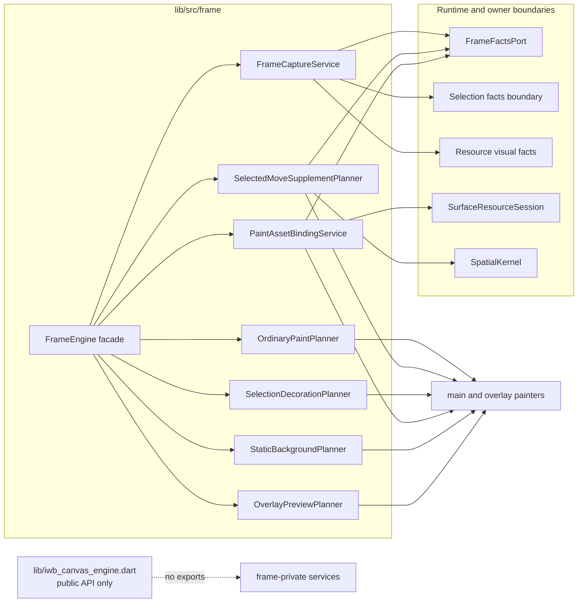
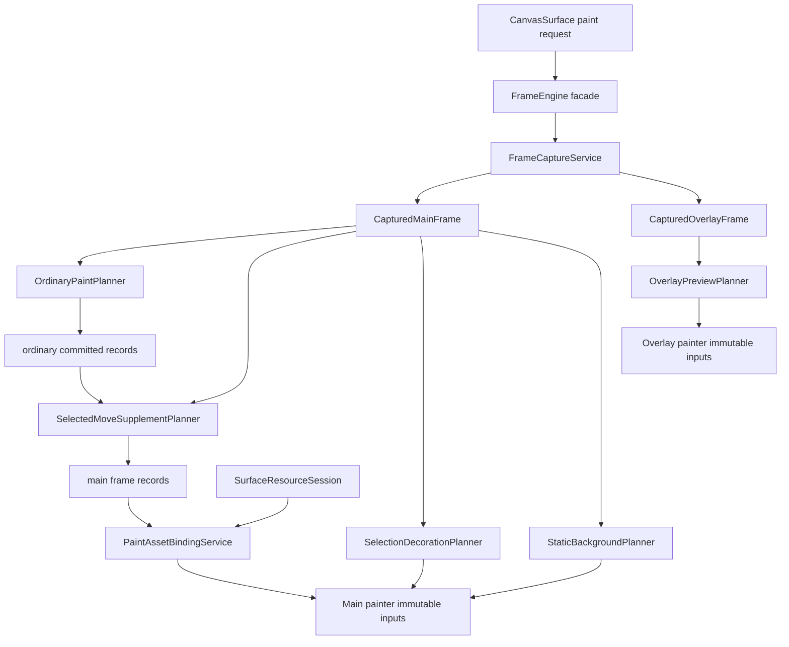
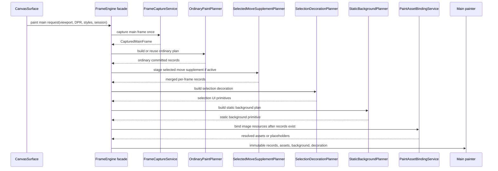
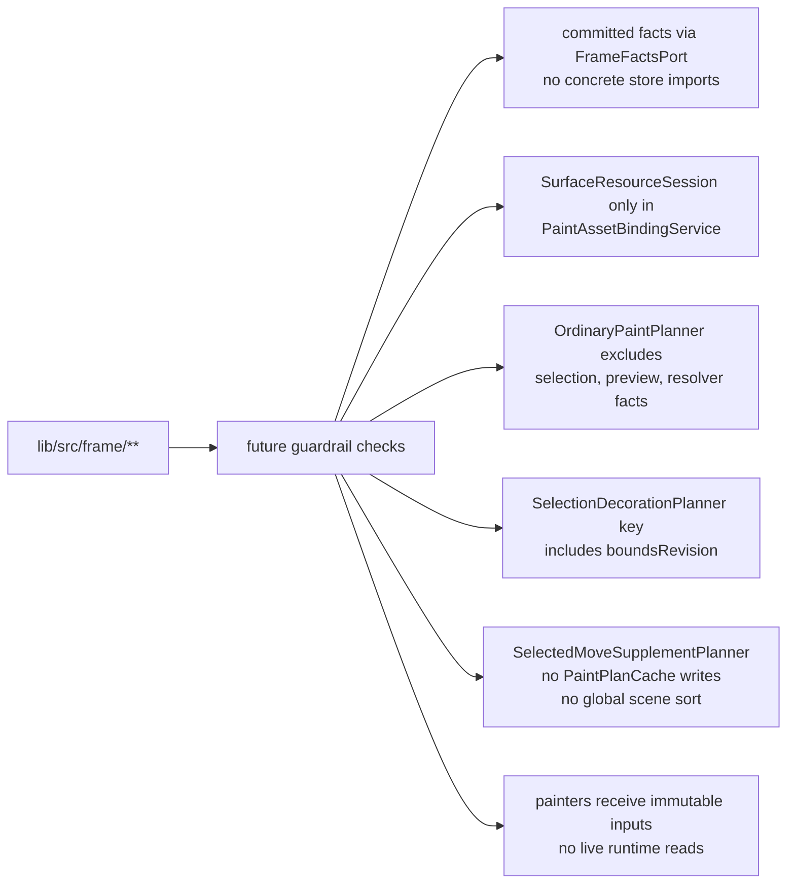

# Design: FrameEngine Internal Split

---
date: 2026-05-19
designer: Codex
commit: 2134214
branch: new-architecture
design_question: "Design an internal split for FrameEngine using the existing research note .research/2026-05-19-frame-engine-internal-split.md, preserving the external FrameEngine/API surface while separating capture, ordinary paint planning, selection decoration, resource image binding, static background planning, and selected move supplement responsibilities."
---

## Disposition

READY_FOR_CONTRACT

## Product Outcome

`FrameEngine` remains the single frame entry point for package internals and no
public API shape changes. Internally, it becomes a narrow orchestration facade
that delegates live-fact capture, ordinary committed record planning, selected
move supplement staging, selection UI decoration, resource asset binding,
static background planning, and overlay preview primitive planning to focused
frame-owned collaborators.

The non-goal is a public service API. The split is not allowed to expose frame
planners through `lib/iwb_canvas_engine.dart`, move store ownership into frame
code, or make painters read runtime, store, or application resolver state.

## Target Contract Classification

- Profile: `REFACTOR`
- Obligations: `BUG_FIX`, `SEAM_MIGRATION`

`REFACTOR` is the primary profile because the public frame behavior and package
consumer API must be preserved while ownership, placement, and dependency shape
inside the frame package change. `BUG_FIX` is required because the future
contract must preserve or repair the selection-decoration invalidation behavior
where selected element bounds changes rebuild decoration even when selection
membership is unchanged. `SEAM_MIGRATION` is required because the overloaded
`FrameEngine` internal responsibility seam is replaced by explicit
frame-private service seams while the `FrameEngine` entry seam remains.

## Research Inputs

- `.research/2026-05-19-frame-engine-internal-split.md` - supplied factual map
  of the current FrameEngine responsibility set, frame/render contracts, cache
  keys, resource resolution boundary, selected move supplement staging, overlay
  capture, painter exclusions, and verification surfaces.

## Repository Evidence

- `docs/architecture/01_runtime_ownership.md:59` - `FrameEngine` currently owns
  captured main/overlay frames, ordinary paint plans, selection
  decoration/staging, and repaint buses, while it must not read concrete store
  internals, export public documents, or own selection.
- `docs/architecture/01_runtime_ownership.md:98` - frame capture uses a narrow
  document boundary.
- `docs/architecture/01_runtime_ownership.md:99` -
  `FrameFactsPort` is the accepted committed-state read seam between
  `FrameEngine` and `DocumentStoreKernel`.
- `docs/architecture/01_runtime_ownership.md:106` - `FrameFactsPort` supplies
  document, structural, bounds, element visual, background, grid, row,
  descriptor, and resource revision facts.
- `docs/architecture/01_runtime_ownership.md:110` - `FrameFactsPort` must not
  return mutable document state or frame-owned render models.
- `docs/architecture/02_package_boundaries.md:92` - the target frame package
  layout places `frame_engine.dart`, captured frame models, `paint_plan.dart`,
  `render_element_record.dart`, and `repaint_bus.dart` under `lib/src/frame/`.
- `docs/architecture/02_package_boundaries.md:152` - the public package barrel
  exports only `src/api/**`.
- `docs/architecture/02_package_boundaries.md:160` - frame code obtains
  committed document facts through `runtime/frame_facts_port.dart`, not concrete
  store files.
- `docs/implementation/p9_frame_rendering_and_caches.md:5` - P9 exists to
  implement frame capture, paint plan construction, painter-safe records,
  resource resolution use in paint, selected-supplement staging, and bounded
  render caches.
- `docs/implementation/p9_frame_rendering_and_caches.md:10` - P9 build scope
  starts with `FrameEngine`, captured frames, records, paint plans, selected
  supplement staging, selection decoration, repaint buses, and caches.
- `docs/implementation/p9_frame_rendering_and_caches.md:32` - P9 scope requires
  resource image resolution only through `SurfaceResourceSession`.
- `docs/implementation/p9_frame_rendering_and_caches.md:33` - P9 scope requires
  committed frame facts, row snapshot resolution, and descriptor lookup only
  through `FrameFactsPort`.
- `docs/implementation/p9_frame_rendering_and_caches.md:82` - P9 names the
  durable diagrams to read or update for frame rendering.
- `docs/implementation/p9_frame_rendering_and_caches.md:102` - P9 names the
  tests and guardrails that prove the frame rendering phase.
- `docs/implementation/p9_frame_rendering_and_caches.md:127` - P9 exit gates
  cover capture once, selected supplement staging, selection decoration
  separation, overlay capture, painter exclusions, port usage, cache keys, and
  ordinary paint-plan invalidation exclusions.
- `docs/contracts/frame_rendering.md:60` - `CapturedMainFrame` includes
  document, structure, bounds, element visual, background, grid, selection,
  resource visual, view camera, viewport, DPR, selection style, selection ids,
  and selected move delta facts.
- `docs/contracts/frame_rendering.md:82` - `CapturedOverlayFrame` includes
  preview, view camera, preview state, and selection style facts.
- `docs/contracts/frame_rendering.md:104` - main paint and overlay paint each
  capture their frame once.
- `docs/contracts/frame_rendering.md:115` - painters do not live-read runtime
  or materialize public documents.
- `docs/contracts/frame_rendering.md:157` - ordinary cached render records do
  not include selection-only state, and selection UI is a separate decoration
  pass.
- `docs/contracts/frame_rendering.md:179` - selected supplement staging starts
  from the ordinary committed paint plan.
- `docs/contracts/frame_rendering.md:181` - the ordinary paint plan cache key is
  structural revision, bounds revision, element visual revision, viewport, and
  DPR.
- `docs/contracts/frame_rendering.md:183` - ordinary paint plan cache identity
  excludes background, grid, camera, selected move, preview, selection, and
  style-only facts.
- `docs/contracts/frame_rendering.md:187` - selected move supplement staging
  reads selected ids through captured selection facts and filters ordinary
  records for the current frame only.
- `docs/contracts/frame_rendering.md:198` - selected supplement records are
  merged by order token and never stored in `PaintPlanCache`.
- `docs/contracts/frame_rendering.md:204` - selection decoration reads captured
  selection facts and is invalidated separately from ordinary paint plans.
- `docs/contracts/frame_rendering.md:206` - selection decoration key includes
  `boundsRevision` because selected element bounds can change without selection
  membership changes.
- `docs/contracts/cache_policy.md:46` - `StaticBackgroundCache` is frame-owned
  and keyed by background, grid, grid stroke width, view camera bucket,
  viewport, and DPR facts.
- `docs/contracts/cache_policy.md:47` - `PaintPlanCache` is frame-owned and
  excludes background, grid, camera, preview, selection-only, and style-only
  changes from invalidation identity.
- `docs/contracts/cache_policy.md:48` - `ImageResolveCache` is owned by
  `SurfaceResourceSession` and keyed by resolver generation, resource id, and
  resource revision.
- `docs/contracts/cache_policy.md:49` - `SelectionDecorationPlan` is
  frame-owned and keyed by selection, structure, bounds, captured selection
  style, and DPR.
- `docs/contracts/resources.md:69` - `SurfaceResourceSession` owns the resolver
  reference, resolver generation, image cache, budget, same-frame suppression,
  and follow-up throttle.
- `docs/contracts/resources.md:78` - paint/resource resolution receives
  descriptor snapshots and `resourceRevision` through `FrameFactsPort`.
- `docs/contracts/resources.md:83` - painters and frame paint code never call
  `CanvasResourceResolver` directly.
- `docs/diagrams/seq_main_paint.mmd:19` - a main paint request supplies
  viewport, DPR, grid style, selection style, and `SurfaceResourceSession`.
- `docs/diagrams/seq_main_paint.mmd:20` - main paint captures committed frame
  facts once.
- `docs/diagrams/seq_main_paint.mmd:28` - main paint captures selected ids and
  `selectionRevision` once.
- `docs/diagrams/seq_main_paint.mmd:35` - ordinary paint plan lookup uses only
  structural, bounds, element visual, viewport, and DPR facts.
- `docs/diagrams/seq_main_paint.mmd:61` - selected move staging is conditional
  on active `selectedMoveDelta`.
- `docs/diagrams/seq_main_paint.mmd:84` - image resource binding begins only
  after records include image resource ids.
- `docs/diagrams/seq_main_paint.mmd:90` - the session resolves paint assets
  from descriptor snapshot facts and resource revision.
- `docs/diagrams/seq_main_paint.mmd:111` - the main painter consumes immutable
  records only and performs no live runtime reads.
- `docs/diagrams/seq_overlay_paint.mmd:13` - overlay paint is entered through a
  paint overlay request with selection style.
- `docs/diagrams/seq_overlay_paint.mmd:21` - overlay preview variants are
  admitted from captured preview state only.
- `docs/diagrams/seq_overlay_paint.mmd:45` - overlay painters consume captured
  facts and immutable primitives only.
- `docs/diagrams/dfd_main_paint_frame.mmd:91` - the ordinary cache key data
  flow uses structure, bounds, element visual, viewport, and DPR facts.
- `docs/diagrams/dfd_main_paint_frame.mmd:108` - selection decoration consumes
  selected ids, selection revision, bounds revision, selection style, and DPR.
- `docs/diagrams/dfd_main_paint_frame.mmd:119` - static background planning
  consumes background, grid, grid stroke, camera bucket, viewport, and DPR.
- `docs/verification/tests.md:288` - planned frame tests include main/overlay
  capture and no-live-read painter checks.
- `docs/verification/tests.md:428` - planned selection-state tests prove
  ordinary paint plan exclusion and selection decoration rebuild behavior.
- `docs/verification/tests.md:450` - planned camera pan tests prove ordinary
  paint plan preservation and static background invalidation separation.
- `docs/verification/guardrails.md:191` - frame guardrails enforce
  `FrameFactsPort` use and ban frame imports of concrete store internals.
- `docs/verification/guardrails.md:201` - resource guardrails enforce resolver
  ownership by `SurfaceResourceSession`.
- `todo.md:24` - the backlog request proposes internal frame services while
  keeping `FrameEngine` outside.
- `todo.md:60` - the backlog request says `OrdinaryPaintPlanner` builds the
  ordinary scene and excludes selection, preview, and resolver inputs.
- `todo.md:83` - the backlog request assigns selection UI to
  `SelectionDecorationPlanner` and calls out the `boundsRevision` fix.
- `todo.md:99` - the backlog request assigns resource image binding to
  `PaintAssetBindingService`.
- `todo.md:118` - the backlog request assigns background/grid planning to
  `StaticBackgroundPlanner`.

## Design Form Candidates

### Candidate A. FrameEngine facade with capture-first internal services

- Form: keep `FrameEngine` as the only frame entry point, then add frame-private
  collaborators: `FrameCaptureService`, `OrdinaryPaintPlanner`,
  `SelectedMoveSupplementPlanner`, `SelectionDecorationPlanner`,
  `PaintAssetBindingService`, `StaticBackgroundPlanner`, and
  `OverlayPreviewPlanner`.
- Why it could work: it matches the documented internal frame package boundary,
  preserves the public barrel, gives each cache/resource/selection concern one
  owner, keeps live runtime capture at the frame boundary, and keeps painters on
  immutable records and primitives.
- Gate failures or risks: the future contract must be explicit that descriptor
  lookup and `SurfaceResourceSession` access belong only to
  `PaintAssetBindingService` after records are known, while live runtime,
  selection, preview, camera, and revision capture belongs only to
  `FrameCaptureService`.

### Candidate B. Five-service split exactly as listed in the backlog

- Form: add only `FrameCaptureService`, `OrdinaryPaintPlanner`,
  `SelectionDecorationPlanner`, `PaintAssetBindingService`, and
  `StaticBackgroundPlanner`.
- Why it could work: it addresses the visible overload in the request and maps
  directly to the backlog wording.
- Gate failures or risks: selected move supplement staging has no owner even
  though it uses `selectedMoveDelta`, captured selection ids, spatial queries,
  row resolution, and merge ordering. Putting it into `OrdinaryPaintPlanner`
  would violate the ordinary planner exclusion for selected move and preview
  facts. Leaving it in `FrameEngine` preserves one of the overload causes.
  Overlay preview admission would also remain in `FrameEngine`.

### Candidate C. Split by cache classes only

- Form: keep capture and planning logic mostly inside `FrameEngine`, but move
  `PaintPlanCache`, `SelectionDecorationPlan`, `StaticBackgroundCache`, and
  `ImageResolveCache` usage behind cache wrappers.
- Why it could work: it is a smaller implementation diff and aligns with the
  existing cache policy table.
- Gate failures or risks: cache wrappers do not own the root cause. Live facts,
  planning, selected move staging, resolver/session work, and overlay preview
  admission would still be coordinated in the monolith, so invalidation and
  dependency coupling remain hidden.

### Candidate D. Public or runtime-level service split

- Form: expose new services outside `lib/src/frame/**` or place them under
  runtime/resource modules as directly reusable components.
- Why it could work: it could make the services discoverable from other
  packages or runtime owners.
- Gate failures or risks: it violates the public barrel rule and the documented
  frame owner. Frame planners would become a second public or cross-owner source
  of truth for render behavior.

## Known Future Pressures

| Pressure | Evidence | How the selected form responds | Accepted cost or risk |
|---|---|---|---|
| The target package layout currently lists only `frame_engine.dart` and frame model/cache files, not the proposed service files. | `docs/architecture/02_package_boundaries.md:92`; `todo.md:24` | The future contract must update source-of-truth docs and diagrams after the design is converted, but this design keeps all new files under `lib/src/frame/**`. | The contract will include source-of-truth docs scope in addition to code and tests. |
| Public API freeze pressure: frame internals must not leak to package consumers. | `docs/architecture/02_package_boundaries.md:152` | `FrameEngine` remains the internal entry facade and no service is exported through the public barrel. | The services stay package-private; tests may need internal test access patterns rather than public API exposure. |
| Selected move supplement staging is not covered by the five-service backlog split. | `docs/contracts/frame_rendering.md:187`; `docs/contracts/frame_rendering.md:198`; `todo.md:27` | Add `SelectedMoveSupplementPlanner` as a sixth frame-private collaborator. It consumes captured facts and ordinary records but does not write `PaintPlanCache`. | Slightly more file count, but avoids smuggling selected move and preview facts into ordinary planning. |
| Overlay preview admission can remain hidden in `FrameEngine` if not assigned. | `docs/diagrams/seq_overlay_paint.mmd:21`; `docs/diagrams/seq_overlay_paint.mmd:45` | Add `OverlayPreviewPlanner` for immutable overlay primitive construction from `CapturedOverlayFrame`. | The split grows beyond the backlog's five named services, but it prevents a leftover monolith path. |
| Resource IDs are only known after ordinary and supplement records are built. | `docs/diagrams/seq_main_paint.mmd:84`; `docs/diagrams/seq_main_paint.mmd:90` | Capture locks revision/resource visual facts; `PaintAssetBindingService` alone performs descriptor-to-asset binding through `FrameFactsPort` descriptor facts and `SurfaceResourceSession` once records exist. | The "only capture reads facts" rule must be stated as "only capture reads live runtime/camera/selection/preview/revision facts"; resource asset binding remains a separate post-record boundary. |
| Selection decoration can become stale on bounds-only changes if the bounds revision is not owned by its key. | `docs/contracts/frame_rendering.md:204`; `docs/contracts/frame_rendering.md:206`; `docs/verification/tests.md:428` | `SelectionDecorationPlanner` owns the decoration key and must include `boundsRevision` with selection revision, structure, style, and DPR. | The future contract must include a regression test for bounds-only selected element movement. |
| Camera/background/grid changes must not invalidate ordinary element paint plans. | `docs/contracts/frame_rendering.md:121`; `docs/contracts/cache_policy.md:46`; `docs/verification/tests.md:450` | `StaticBackgroundPlanner` owns static background identity separately from `OrdinaryPaintPlanner`. | The contract must prove cache identity separation rather than relying on review prose. |
| Resource resolver access must stay session-owned and bounded. | `docs/contracts/resources.md:69`; `docs/contracts/resources.md:83`; `docs/verification/guardrails.md:201` | `PaintAssetBindingService` is the only frame service that receives `SurfaceResourceSession`; painters and ordinary planning never receive resolver access. | Asset binding must expose placeholders and metrics without caching failed budget-exceeded results incorrectly. |

## Selected Form

Use Candidate A: `FrameEngine` becomes a frame-internal facade over focused
collaborators. The split is larger than the backlog's five-service example
because repository evidence shows two additional responsibilities that need
owners: selected move supplement staging and overlay preview primitive
admission.

The selected collaborator ownership is:

| Collaborator | Owns | Must not own |
|---|---|---|
| `FrameCaptureService` | one-time capture of main/overlay live frame facts into `CapturedMainFrame` and `CapturedOverlayFrame` | record planning, resolver/session calls, cache mutation beyond captured-frame construction |
| `OrdinaryPaintPlanner` | ordinary committed `PaintPlanCache` lookup/build using structure, bounds, element visual, viewport, and DPR | selection revision, selection style, selected move delta, preview state, resource resolver/session, static background identity |
| `SelectedMoveSupplementPlanner` | per-frame selected move filtering, shifted candidate lookup, row resolution, and merge by `orderToken` | ordinary paint plan cache writes, overlay rendering, global scene sort |
| `SelectionDecorationPlanner` | selection UI decoration and `SelectionDecorationPlan` key including `boundsRevision` | ordinary record cache identity, selected move supplement records, static background identity |
| `PaintAssetBindingService` | descriptor-to-asset binding for records with image resource ids, using immutable descriptor facts and `SurfaceResourceSession` | ordinary paint plan construction, painter resolver calls, app resolver ownership |
| `StaticBackgroundPlanner` | static background/grid plan and cache identity | selection, preview, resource visual, ordinary element visual identity |
| `OverlayPreviewPlanner` | immutable overlay primitives admitted from `CapturedOverlayFrame` | selected move rendering, resource resolver reads, cache invalidation, repaint scheduling |

`FrameEngine` keeps only orchestration, frame package composition, and repaint bus
coordination. It is the only direct consumer of these services at first, which
makes the migration reversible and keeps the services from becoming a public
extension surface.

## Hard Gate Check

| Gate | Result | Evidence |
|---|---|---|
| Root cause | pass | The root overload is in `FrameEngine` owning capture, ordinary plans, selection decoration/staging, and repaint buses (`docs/architecture/01_runtime_ownership.md:59`). Candidate A assigns each overloaded responsibility to one frame-private collaborator instead of wrapping only caches. |
| Ownership | pass | The selected form keeps `FrameEngine` in `lib/src/frame/**` (`docs/architecture/02_package_boundaries.md:92`) and maps committed facts to `FrameFactsPort` (`docs/architecture/01_runtime_ownership.md:99`), selection decoration to a frame-owned plan (`docs/contracts/cache_policy.md:49`), static background to a frame-owned cache (`docs/contracts/cache_policy.md:46`), and resolver access to `SurfaceResourceSession` (`docs/contracts/resources.md:69`). |
| Source of truth | pass | Captured frames freeze immutable facts once (`docs/contracts/frame_rendering.md:104`), ordinary cache records exclude selection-only state (`docs/contracts/frame_rendering.md:157`), selected supplement records are not cached in `PaintPlanCache` (`docs/contracts/frame_rendering.md:198`), and `FrameFactsPort` must not return frame-owned render models (`docs/architecture/01_runtime_ownership.md:110`). |
| Boundary | pass | Entry boundaries are main/overlay paint requests (`docs/diagrams/seq_main_paint.mmd:19`; `docs/diagrams/seq_overlay_paint.mmd:13`). Committed facts enter through `FrameFactsPort` (`docs/contracts/frame_rendering.md:106`), resource asset binding goes through `SurfaceResourceSession` (`docs/contracts/resources.md:83`), and painters receive immutable outputs only (`docs/diagrams/seq_main_paint.mmd:111`; `docs/diagrams/seq_overlay_paint.mmd:45`). |
| Dependency direction | pass | Frame code obtains committed facts through the runtime port, not store files (`docs/architecture/02_package_boundaries.md:160`), while the public package barrel exports only API files (`docs/architecture/02_package_boundaries.md:152`). |
| State/data | pass | Committed document facts remain store-owned and exposed through `FrameFactsPort` (`docs/architecture/01_runtime_ownership.md:106`), selection facts remain selection-owned (`docs/architecture/01_runtime_ownership.md:56`), resource resolver/cache state remains session-owned (`docs/contracts/resources.md:69`), and frame caches remain frame-owned (`docs/contracts/cache_policy.md:46`; `docs/contracts/cache_policy.md:47`; `docs/contracts/cache_policy.md:49`). |
| Seam | pass | The successor seam is frame-private `FrameEngine -> collaborator` delegation. The public/internal `FrameEngine` entry seam is retained, not retired. Migration order is capture first, ordinary plan, selected supplement, decoration/static background/asset binding, then overlay planner. Retirement gate: no remaining non-orchestration live fact reads, resolver calls, ordinary cache writes, selection decoration key logic, selected move staging, or overlay primitive admission in `FrameEngine`. Negative proof is semantic search plus guardrails for frame facts and resolver boundaries (`docs/verification/guardrails.md:191`; `docs/verification/guardrails.md:201`). |
| Verification | pass | Planned tests already name main/overlay capture and painter no-live-read coverage (`docs/verification/tests.md:288`), selection-state and bounds invalidation behavior (`docs/verification/tests.md:428`), camera/static-background separation (`docs/verification/tests.md:450`), and guardrails for frame facts and resolver ownership (`docs/verification/guardrails.md:191`; `docs/verification/guardrails.md:201`). |
| Future pressure | pass | The selected form absorbs the missing selected move and overlay owners, public API freeze, resource binding order, bounds-only selection decoration invalidation, and cache separation pressures listed above. |

## Lock-Required Facts

- Owner: `FrameEngine` remains the frame entry facade; each selected
  collaborator owns one internal responsibility listed in the selected form.
- Owning layer/module/document family: production implementation belongs under
  `lib/src/frame/**`, with dependency on runtime ports and resource session
  boundaries documented in architecture/contracts.
- Seam: frame-private `FrameEngine -> collaborator` delegation. No new public
  seam.
- Dependency/import direction: frame services may depend on frame models,
  runtime frame/selection facts ports, spatial query interfaces where already
  allowed by frame rendering, and `SurfaceResourceSession` only in asset
  binding. They must not import concrete store internals or public DTO
  projections.
- State/data ownership: committed facts are store-owned through
  `FrameFactsPort`; selection facts are selection-owned through captured
  selection facts; resource resolver/cache state is `SurfaceResourceSession`
  owned; ordinary, selection decoration, selected supplement, static background,
  and overlay primitive outputs are frame-owned derived data.
- Entry boundaries: main paint request with viewport, DPR, grid style,
  selection style, and `SurfaceResourceSession`; overlay paint request with
  selection style.
- Exit boundaries: immutable ordinary/supplement render records, resolved paint
  assets or placeholders, static background primitive, selection UI primitives,
  overlay primitives, and painter inputs.
- File placement basis: service files should be named after their primary
  responsibility, for example `frame_capture_service.dart`,
  `ordinary_paint_planner.dart`, `selected_move_supplement_planner.dart`,
  `selection_decoration_planner.dart`, `paint_asset_binding_service.dart`,
  `static_background_planner.dart`, and `overlay_preview_planner.dart`.
- Execution order constraints: capture main/overlay facts once before planning;
  ordinary plan lookup/build before selected move supplement; selected
  supplement never writes ordinary cache; asset binding after records reveal
  image resource ids; overlay selected move is rejected and stays main-scene
  only.
- Rejected alternatives: exact five-service split, cache-wrapper-only split, and
  public/runtime-level service split.
- Verification strategy: combine characterization tests for behavior
  preservation, focused regression tests for `boundsRevision`, semantic
  searches/guardrails for forbidden imports and resolver access, and standard
  Dart/DCM checks after implementation.

## Diagram Need Assessment

| Design question | Needed? | Diagram kind | Reason |
|---|---:|---|---|
| Does the design change ownership, layer, package, or component boundaries? | yes | c4 | The design adds frame-private collaborators and changes internal ownership while preserving the `FrameEngine` entry facade. |
| Does it change data flow, state ownership, cache ownership, resource movement, or lifecycle movement? | yes | data_flow | The key design choice is capture-first data flow plus post-record asset binding and separated frame caches. |
| Does it depend on call order, lifecycle order, sync/async ordering, failure ordering, or migration order? | yes | sequence | Correctness depends on capture before planning, ordinary before selected supplement, and asset binding after records exist. |
| Does it introduce or alter modes, statuses, terminal states, sessions, or transition rules? | no | none | It uses existing preview variants and `SurfaceResourceSession` lifecycle rules without adding modes or statuses. |
| Does it create, replace, migrate, or retire a shared seam? | yes | c4/data_flow/sequence | It replaces `FrameEngine` internal responsibility ownership with frame-private collaborator seams while retaining the `FrameEngine` entry seam. |
| Does it change public API consumer flow, payload shape, or compatibility behavior? | no | none | The public barrel remains API-only and no public payload shape changes. |
| Does it introduce or change analyzer, guardrail, or structural-recognition pipeline behavior? | yes | data_flow | Future guardrails should recognize that only asset binding receives the session and only capture reads live frame facts. |

## Provisional Diagrams

### Boundary Ownership

This C4-style boundary diagram answers the ownership question: the public barrel
does not expose the services, `FrameEngine` is the only frame entry facade, and
each collaborator stays under `lib/src/frame/**` while using only the documented
runtime/resource/spatial boundaries it needs.

### Main Frame Data Flow

This provisional data-flow diagram answers why resource binding is not part of
capture: image resource ids are known only after ordinary and supplement records
exist, so the selected form keeps live frame capture and resource asset binding
as separate frame-owned boundaries.

### Main Paint Ordering

This sequence diagram answers the call-order question: ordinary committed
planning precedes selected supplement staging, selected supplement records do
not enter the ordinary cache, and resource binding happens only after the record
stream reveals image resource ids.

### Guardrail Recognition

This structural-recognition diagram answers the analyzer/guardrail question for
the future Change Contract: the refactor is complete only when forbidden facts
and imports are mechanically recognizable at the new service boundaries.

## Source-Of-Truth Impact

A future Change Contract should update, at minimum:

- `docs/implementation/p9_frame_rendering_and_caches.md` to make the P9 build
  scope, diagrams-to-update list, tests/guardrails, and exit gates name the new
  frame collaborators instead of treating all frame-side work as
  `FrameEngine`.
- `docs/architecture/01_runtime_ownership.md` to describe `FrameEngine` as an
  orchestration facade over frame-private collaborators while retaining the same
  ownership constraints.
- `docs/architecture/02_package_boundaries.md` to list the new frame service
  files under `lib/src/frame/**`.
- `docs/contracts/frame_rendering.md` to assign capture, ordinary planning,
  selected supplement staging, selection decoration, static background, asset
  binding, and overlay preview responsibilities to their owners.
- `docs/contracts/resources.md` only if the implementation needs more precise
  wording around descriptor binding through `PaintAssetBindingService`.
- `docs/diagrams/c4_component_runtime.mmd`,
  `docs/diagrams/dfd_cache_invalidation.mmd`,
  `docs/diagrams/dfd_main_paint_frame.mmd`,
  `docs/diagrams/dfd_overlay_frame.mmd`,
  `docs/diagrams/seq_main_paint.mmd`,
  `docs/diagrams/seq_overlay_paint.mmd`, and selected-move diagrams when the
  split changes their frame-side owner names.
- `docs/verification/tests.md` and `docs/verification/guardrails.md` to add
  service-level proof and structural recognition for the split.

Do not update those files during the architecture-design phase.

## Verification Impact

The future Change Contract should include:

- Characterization tests proving public frame behavior is unchanged after the
  split.
- `main_overlay_capture_test.dart` coverage that `FrameCaptureService` captures
  main and overlay facts once and downstream services use captured data.
- `paint_plan_excludes_selection_state_test.dart` coverage that
  `OrdinaryPaintPlanner` excludes selection and preview facts, while
  `SelectionDecorationPlanner` rebuilds on `boundsRevision`.
- `camera_pan_preserves_ordinary_paint_plan_test.dart` coverage that
  `StaticBackgroundPlanner` handles camera/background/grid changes without
  ordinary paint plan invalidation.
- `selected_supplement_staging_no_global_sort_test.dart` coverage that
  `SelectedMoveSupplementPlanner` merges by order token and does not cache
  supplement records.
- Resource tests or guardrails proving only `PaintAssetBindingService` receives
  `SurfaceResourceSession`, and painters/ordinary planning do not call the
  resolver.
- Structural guardrails proving `lib/src/frame/**` uses `FrameFactsPort` rather
  than concrete store internals.
- Standard repository checks after code changes: `dart analyze`,
  `dcm analyze .`, and `dcm calculate-metrics .`.

## Verification Strategy

Use a behavior-preserving refactor strategy with owner-specific regression
proof. First characterize current or contract-defined main/overlay frame output
at the `FrameEngine` facade boundary. Then move one responsibility at a time
behind frame-private collaborators while keeping the same captured-frame models,
paint records, asset placeholders, static background outputs, selection
decoration outputs, and overlay primitives.

The strongest proof is not the existence of new service classes. The proof is
that forbidden facts are unavailable to the wrong owner: ordinary planning
cannot see selection/preview/resource resolver inputs, selection decoration must
see `boundsRevision`, selected supplement records cannot enter
`PaintPlanCache`, static background identity cannot invalidate ordinary
records, and painters cannot resolve resources or live-read runtime.

## Change Contract Handoff

- Required profile: `REFACTOR`
- Required obligations: `BUG_FIX`, `SEAM_MIGRATION`
- Decisions to carry forward:
  - Keep `FrameEngine` as the stable frame entry facade.
  - Add seven frame-private collaborators, not only the five named in the
    backlog example, because selected move supplement and overlay preview
    admission need explicit owners.
  - Define "capture-only live facts" as live runtime/camera/selection/preview
    and revision capture. Post-record resource descriptor and asset binding
    belongs only to `PaintAssetBindingService`.
  - Keep `PaintAssetBindingService` as the only frame collaborator that receives
    `SurfaceResourceSession`.
  - Keep `OrdinaryPaintPlanner` free of selection revision, selection style,
    selected move delta, preview state, and resolver/session access.
  - Put the `boundsRevision` selection-decoration fix in
    `SelectionDecorationPlanner`.
- Evidence to cite:
  - Frame ownership and port boundaries:
    `docs/architecture/01_runtime_ownership.md:59`,
    `docs/architecture/01_runtime_ownership.md:99`,
    `docs/architecture/01_runtime_ownership.md:106`,
    `docs/architecture/02_package_boundaries.md:160`.
  - P9 implementation scope, diagrams, tests/guardrails, and exit gates:
    `docs/implementation/p9_frame_rendering_and_caches.md:5`,
    `docs/implementation/p9_frame_rendering_and_caches.md:10`,
    `docs/implementation/p9_frame_rendering_and_caches.md:32`,
    `docs/implementation/p9_frame_rendering_and_caches.md:33`,
    `docs/implementation/p9_frame_rendering_and_caches.md:82`,
    `docs/implementation/p9_frame_rendering_and_caches.md:102`,
    `docs/implementation/p9_frame_rendering_and_caches.md:127`.
  - Public API preservation:
    `docs/architecture/02_package_boundaries.md:152`.
  - Capture and painter exclusions:
    `docs/contracts/frame_rendering.md:60`,
    `docs/contracts/frame_rendering.md:82`,
    `docs/contracts/frame_rendering.md:104`,
    `docs/contracts/frame_rendering.md:115`.
  - Ordinary and selected supplement rules:
    `docs/contracts/frame_rendering.md:157`,
    `docs/contracts/frame_rendering.md:181`,
    `docs/contracts/frame_rendering.md:183`,
    `docs/contracts/frame_rendering.md:187`,
    `docs/contracts/frame_rendering.md:198`.
  - Selection decoration bounds fix:
    `docs/contracts/frame_rendering.md:204`,
    `docs/contracts/frame_rendering.md:206`,
    `docs/contracts/cache_policy.md:49`.
  - Resource and cache ownership:
    `docs/contracts/resources.md:69`,
    `docs/contracts/resources.md:78`,
    `docs/contracts/resources.md:83`,
    `docs/contracts/cache_policy.md:46`,
    `docs/contracts/cache_policy.md:47`,
    `docs/contracts/cache_policy.md:48`.
  - Verification:
    `docs/verification/tests.md:288`,
    `docs/verification/tests.md:428`,
    `docs/verification/tests.md:450`,
    `docs/verification/guardrails.md:191`,
    `docs/verification/guardrails.md:201`.
- Contract constraints or sequencing facts:
  - Update `PLAN.md` and any step contract only in the later Change Contract
    workflow, not in this design workflow.
  - Migrate one owner at a time and keep `FrameEngine` facade tests green after
    each slice.
  - Do not add public exports for the new services.
  - Do not introduce a `ResourceFactsPort` unless a later contract first
    establishes it as a documented repository seam; current evidence assigns
    descriptor snapshots and `resourceRevision` to `FrameFactsPort`.

## Open Decisions

None. The selected form is ready for Change Contract authoring.
