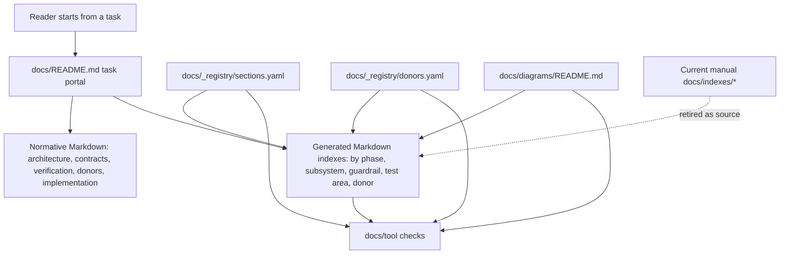
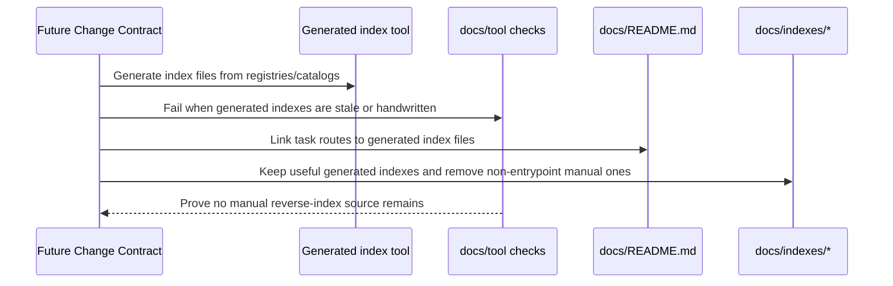

# Design: Docs Documentation Portal

---
date: 2026-05-22
designer: Codex
commit: 5cd78c2f
branch: new-architecture
design_question: "Design a new documentation structure for /Users/blackpika/iwb_canvas_engine/docs that removes excess files, reduces synchronization pressure without losing coverage, and optimizes documentation entrypoints. The user selected option 2: Documentation Portal + generated navigation."
---

## Disposition

READY_FOR_CONTRACT

## Product Outcome

The documentation should become easier to enter by task and harder to let drift. A future Change Contract should redesign `docs/` around a task-oriented documentation portal, keep normative architecture and contract prose in Markdown, and move useful reverse lookup maps, navigation views, and cross-document relationship summaries to checked-in generated Markdown indexes owned by the registries.

Non-goals: do not rewrite the engine architecture, do not change runtime code, do not delete normative contract content, and do not turn all documentation into YAML. The design chooses the documentation architecture only; exact generated output filenames, command flags, and migration slices belong to the later Change Contract.

## Target Contract Classification

- Profile: `SOURCE_OF_TRUTH_DOCS`
- Obligations: `SEAM_MIGRATION`

## Research Inputs

- `.research/2026-05-22-docs-structure-and-entrypoints.md` - maps current `docs/` organization, entrypoints, registry-backed surfaces, manual reverse-index drift risk, donor documentation pressure, and current documentation checks.

## Repository Evidence

- `docs/README.md:3` - `docs/` is the durable source of truth for the new-engine transition and target architecture.
- `docs/README.md:6` - the current root entrypoint routes by role: architecture, implementation, guardrail design, and donor work.
- `docs/README.md:11` - the current layout separates architecture, contracts, implementation, verification, donors, diagrams, indexes, registries, and plan.
- `docs/README.md:35` - role-based files plus `_registry/sections.yaml` are the active documentation source of truth.
- `docs/README.md:72` - documentation checks are expected to run through context capsule generation and `check_docs.dart`.
- `docs/architecture/README.md:10` - the architecture entrypoint defines a manual read path through architecture overview, ownership, boundaries, data model, graph, and diagrams.
- `docs/architecture/README.md:22` - architecture work is routed manually to multiple owning folders and files.
- `docs/_registry/sections.yaml:2` - section registry entries own section ids.
- `docs/_registry/sections.yaml:6` - section registry entries own phase membership.
- `docs/_registry/sections.yaml:9` - section registry entries own must-read links.
- `docs/_registry/sections.yaml:11` - section registry entries own donor links.
- `docs/_registry/sections.yaml:13` - section registry entries own diagram links.
- `docs/_registry/sections.yaml:16` - section registry entries own guardrail ids.
- `docs/_registry/sections.yaml:20` - section registry entries own test ids.
- `docs/tool/generate_context_capsules.dart:5` - context capsule generation reads `docs/_registry/sections.yaml` as its input.
- `docs/tool/generate_context_capsules.dart:121` - the generator renders section registry data into human-readable context blocks.
- `docs/tool/generate_context_capsules.dart:189` - `--check` fails when a context capsule is not generated from the registry.
- `docs/tool/check_docs.dart:1` - `check_docs.dart` is intentionally structural and not a free-form Markdown semantic checker.
- `docs/tool/check_docs.dart:65` - `docs/indexes` is scanned as Markdown, not generated from a registry.
- `docs/tool/check_docs.dart:77` - documentation checks load sections, donors, and diagram catalog before running structural checks.
- `docs/tool/check_docs.dart:162` - current required entrypoints include `docs/README.md`, `docs/architecture/README.md`, both registries, and the diagram catalog.
- `docs/tool/check_docs.dart:190` - section registry loading reads file, title, phases, must-read, donors, diagrams, guardrails, tests, and do-not-assume fields.
- `docs/tool/check_docs.dart:477` - diagram catalog and section registry diagram references are checked bidirectionally.
- `docs/tool/check_docs.dart:596` - Markdown path checks scan roots recursively, including manual index files.
- `docs/tool/check_docs.dart:662` - phase read-first references are validated against section registry phase membership.
- `docs/diagrams/README.md:10` - generated graph-backed Mermaid files already have a declared source of truth in `architecture_graph.yaml`.
- `docs/_registry/public_api_v1.yaml:1` - machine-readable public API inventory can coexist with Markdown semantic ownership.
- `docs/_registry/public_api_v1.yaml:2` - semantic public API rules and signatures remain owned by `docs/contracts/public_api_v1.md`.
- `docs/_registry/donors.yaml:2` - donor records are machine-readable.
- `docs/_registry/donors.yaml:7` - donor records own decision values.
- `docs/_registry/donors.yaml:8` - donor records own target phases.
- `docs/_registry/donors.yaml:11` - donor records own target owners.
- `docs/donors/00_reuse_rules.md:4` - donor reuse rules declare `_registry/donors.yaml` as canonical source.
- `docs/donors/00_reuse_rules.md:6` - donor reuse rules currently feed `docs/indexes/donor_to_phase.md`.
- `docs/verification/guardrails.md:108` - guardrail runner must not become a second source of truth for required guardrails.
- `docs/verification/guardrails.md:144` - executable guardrail metadata has a tool owner, while future mandatory guardrails remain owned by `docs/_registry/sections.yaml` and the guardrails document.
- `docs/verification/guardrails.md:150` - guardrail design guidance lives in `docs/verification/guardrail_design_patterns.md`.
- `.research/2026-05-22-docs-structure-and-entrypoints.md:16` - manual reverse-index views are the highest synchronization pressure, and current tools do not generate them or validate full semantic parity with registries.
- `.research/2026-05-22-docs-structure-and-entrypoints.md:56` - the manual index files claim to list guardrail, test, donor, subsystem, and context relationships.
- `.research/2026-05-22-docs-structure-and-entrypoints.md:59` - current tooling scans index files for paths and section ids but does not provide a generator or semantic parity checker.
- `.research/2026-05-22-docs-structure-and-entrypoints.md:76` - context capsule generation currently detects drift that `check_docs.dart` does not.
- `.research/2026-05-22-docs-structure-and-entrypoints.md:115` - whether indexes should remain static, become generated, or become query commands was left as an open product decision; the user has now selected generated Markdown indexes as the concrete successor navigation surface.

## Design Form Candidates

### Candidate A. Minimal Index Repair

- Form: keep the current folder layout and manually maintained entrypoints, but either generate `docs/indexes/*` or add parity checks for those files.
- Why it could work: the current registries already own most cross-document metadata, and replacing only the highest-drift reverse indexes would be low risk.
- Gate failures or risks: it only treats the visible synchronization symptom. Root entry remains role-folder oriented instead of task-oriented, donor Markdown still feeds a manual donor index, and future documentation consumers still need to learn several independent entrypoints before finding the right source.

### Candidate B. Documentation Portal + Generated Navigation

- Form: make `docs/README.md` the task-oriented portal; keep normative architecture, contracts, verification, donor rules, and diagrams in their owning folders; move reverse lookups, context summaries, phase navigation, donor maps, and test/guardrail lookup views to checked-in generated Markdown indexes owned by structured registries.
- Why it could work: it preserves the existing source-of-truth split between normative Markdown and machine-readable registries, while removing the manually synchronized reverse-index seam identified by research.
- Gate failures or risks: a later Change Contract must sequence the migration so existing readers do not lose discoverability while `docs/indexes/*` is retired or converted to generated output.

### Candidate C. Phase-First Documentation

- Form: make implementation phase pages the primary entrypoint, with generated phase context listing contracts, tests, guardrails, donors, and diagrams for each phase.
- Why it could work: the repository is currently in architecture rebuild mode, and phase files are the working sequence.
- Gate failures or risks: phase-first ownership overfits the rebuild workflow. After the rebuild, phases become historical sequencing, while architecture and contracts remain durable source-of-truth documents. This would make long-term architecture discovery depend on an implementation roadmap.

### Candidate D. Docs-As-Data

- Form: normalize most documentation navigation, phase pages, donor summaries, diagram catalog relationships, test inventories, and guardrail mappings into structured data, with Markdown mostly generated from registries.
- Why it could work: it gives the strongest mechanical consistency and minimizes manual relationship drift.
- Gate failures or risks: it shifts too much semantic architecture content into YAML-like structures, increasing authoring cost and reducing review readability. Existing repository evidence shows a healthier pattern: structured inventories coexist with Markdown semantic owners, as in the public API registry and public API contract.

## Known Future Pressures

| Pressure | Evidence | How the selected form responds | Accepted cost or risk |
|---|---|---|---|
| Rebuild-mode work needs phase-aware entrypoints. | `docs/README.md:41` lists P0-P14 as the working sequence, and `docs/tool/check_docs.dart:662` validates phase read-first references. | The portal keeps implementation phases as a task route, but generated indexes should derive phase context from registries instead of making phase pages the global source of truth. | Phase generated index views must be introduced before manual phase-related reverse maps are retired. |
| Documentation is durable beyond the rebuild phases. | `docs/README.md:3` declares `docs/` as durable source of truth; `docs/architecture/README.md:6` says architecture docs own current system shape. | Normative architecture and contract Markdown remain owners. Generated indexes only project relationships out of those owners and registries. | Some phase-specific convenience pages may remain, but must not become the long-term architecture owner. |
| Folder-level README files are useful local entrypoints. | `docs/architecture/README.md:10` defines a local architecture read path, and `docs/tool/check_docs.dart:162` requires `docs/README.md` and `docs/architecture/README.md` as entrypoints. | The selected form keeps README files when they route within an owned area or explain local boundaries, but forbids them from becoming manually maintained reverse indexes. | Future cleanup must classify README files by role before deleting or rewriting them. |
| Reverse lookups are useful but currently drift-prone. | `.research/2026-05-22-docs-structure-and-entrypoints.md:16` identifies manual reverse views as highest synchronization pressure. | Reverse lookups become checked-in generated Markdown indexes from `_registry/sections.yaml`, `_registry/donors.yaml`, and any future structured proof inventory. | Generated outputs require a clear check/update workflow and migration messaging. |
| Donor decisions need both human explanation and machine ownership. | `docs/donors/00_reuse_rules.md:4` names `_registry/donors.yaml` as canonical source; `docs/_registry/donors.yaml:7` owns decisions. | Donor rules remain human-authored where they explain policy; donor-to-phase and donor summary views should be generated from the donor registry as Markdown indexes. | A future contract must decide whether small donor narrative files remain as editorial evidence or collapse into one donor guide plus generated indexes. |
| Guardrail and test inventories need stronger enforcement without prose parsing. | `docs/verification/guardrails.md:108` warns against a second source of truth; `.research/2026-05-22-docs-structure-and-entrypoints.md:71` shows missing enforced guardrail-to-pattern coverage. | The portal design requires proof inventories to be structured before generated indexes or checks depend on them; free-form guardrail prose is not parsed semantically. | Adding a separate structured proof inventory may be necessary if existing section metadata is not enough for generated guardrail/test indexes. |
| Diagram relationships already mix generated and semantic surfaces. | `docs/diagrams/README.md:10` says graph-backed diagrams are generated from `architecture_graph.yaml`; `docs/diagrams/README.md:19` keeps handwritten semantic diagrams. | The selected form follows the same split: generated topology/navigation views do not replace semantic diagrams or normative docs. | Future docs checks must distinguish generated outputs from handwritten semantic deliverables. |

## Selected Form

Select Candidate B: Documentation Portal + Generated Navigation.

The selected form preserves the current durable documentation owners while replacing manually synchronized relationship views with registry-owned generated Markdown indexes. It is the smallest design that fixes the root synchronization weakness identified in research without overcorrecting into docs-as-data. Markdown remains the place for architecture meaning, contract semantics, verification rationale, and donor policy. Structured registries own relationships and inventories that need reverse lookup, parity checking, or repeated presentation.

The future Change Contract should treat `docs/indexes/*` as the retired manual reverse-index seam. The successor seam is checked-in generated Markdown under `docs/indexes/`, built from `_registry/sections.yaml`, `_registry/donors.yaml`, the diagram catalog, and any explicitly introduced proof inventory for test/guardrail views that cannot be derived safely from existing fields.

The locked generated index set is:

- `docs/indexes/by_phase.md`: task entry by implementation phase.
- `docs/indexes/by_subsystem.md`: task entry by subsystem.
- `docs/indexes/by_guardrail.md`: reverse lookup from guardrail id to related sections, tests, and phases.
- `docs/indexes/by_test_area.md`: reverse lookup from test id or test area to related sections, phases, and guardrails.
- `docs/indexes/donor_to_phase.md`: reverse lookup from donor to target phase and owner.

`docs/indexes/context_coverage.md` should not remain a handwritten documentation entrypoint. Its useful checks should move into `docs/tool/check_docs.dart` or generated diagnostics. A query command may be added later as a convenience over the same registry data, but it is not the selected documentation entrypoint and must not become a second source of truth.

The user has selected this form over the other candidates, so no product gate remains among the compared options.

## Hard Gate Check

| Gate | Result | Evidence |
|---|---|---|
| Root cause | pass | The documented root cause is manual derivative relationship views rather than lack of prose; research identifies manual indexes as highest synchronization pressure at `.research/2026-05-22-docs-structure-and-entrypoints.md:16` and shows they are not generated or semantically checked at `.research/2026-05-22-docs-structure-and-entrypoints.md:59`. |
| Ownership | pass | `docs/README.md:35` already assigns active ownership to role folders and `_registry/sections.yaml`; the selected form keeps normative owners and makes registries own generated relationship views. |
| Source of truth | pass | Existing public API docs demonstrate the intended split: machine-readable inventory in `docs/_registry/public_api_v1.yaml:1`, semantic rules in `docs/_registry/public_api_v1.yaml:2`; selected form applies that split to navigation and reverse lookups. |
| Boundary | pass | Entry boundary is reader/task intent through `docs/README.md`; generation boundary is structured registry input through docs tools, matching `docs/tool/generate_context_capsules.dart:5` and `docs/tool/check_docs.dart:77`. Exit boundary is checked-in generated Markdown indexes plus structural checks, not semantic parsing of free-form Markdown, consistent with `docs/tool/check_docs.dart:1`. |
| Dependency direction | pass | Generated views depend on registries and catalogs; normative docs do not depend on generated reverse maps. This follows the current generated context flow from registry to context capsule at `docs/tool/generate_context_capsules.dart:121`. |
| State/data | pass | Documentation relationship data is committed in registries; generated Markdown indexes are derived state; handwritten Markdown remains committed semantic content. Staleness is checked by generated-output `--check` behavior like `docs/tool/generate_context_capsules.dart:189`. |
| Seam | pass | Retired seam: manually maintained `docs/indexes/*` reverse maps. Successor seam: checked-in generated Markdown indexes owned by registries. Consumer order: add generated index files and checks first, update portal links second, retire or mark manual index files generated third. Negative proof: docs check should reject unowned handwritten reverse-index files or stale generated outputs. |
| Verification | pass | Future proof can extend existing documentation checks: required entrypoints at `docs/tool/check_docs.dart:162`, registry loading at `docs/tool/check_docs.dart:190`, diagram symmetry at `docs/tool/check_docs.dart:477`, phase read-first validation at `docs/tool/check_docs.dart:662`, and generated-output checking at `docs/tool/generate_context_capsules.dart:189`. |
| Future pressure | pass | Phase-aware rebuild work, durable architecture docs, donor decisions, guardrail/test inventories, and diagram generated/semantic split are assessed in `Known Future Pressures`. |

## Lock-Required Facts

- Owner: `docs/` source-of-truth documentation system, with root portal ownership in `docs/README.md`, normative meaning in role folders, and relationship metadata in registries.
- Owning layer/module/document family: `docs/README.md`, `docs/_registry/*`, `docs/tool/*`, and checked-in generated Markdown indexes under `docs/indexes/`.
- Seam: replace manual reverse-index seam under `docs/indexes/*` with registry-owned generated Markdown indexes; do not replace normative Markdown documents.
- Dependency/import direction: generated indexes read registries/catalogs/source docs metadata; role docs and contracts remain semantic owners and must not depend on generated reverse-index files as sources of truth.
- State/data ownership: committed semantic prose remains in role docs; committed relationship metadata remains in `_registry`; generated indexes are derived state; checks enforce generated parity.
- Entry boundaries: reader task categories at `docs/README.md`; local README files when they route within one owned area; generated index files under `docs/indexes/`; command boundary through `docs/tool/*`.
- Exit boundaries: generated Markdown index files; structural docs checks; context capsule checks; no semantic free-form Markdown parser for architecture invariants.
- File placement basis: root portal navigation belongs in `docs/README.md`; local README files may remain as area-specific routers; generated index tooling belongs under `docs/tool/*`; structured facts under `docs/_registry/*`; normative content remains in `architecture/`, `contracts/`, `verification/`, `donors/`, `implementation/`, and `diagrams/`.
- Execution order constraints: add/verify generated Markdown indexes before deleting or demoting manual index files; keep old links until successor route exists; only then update portal and checker requirements.
- Rejected alternatives: minimal index repair, phase-first docs, and radical docs-as-data for the risks listed in candidate comparison.
- Verification strategy: generated-output checks, structural docs checks, semantic searches for retired manual-index ownership, and targeted checks for registry coverage of generated index dimensions.

## Diagram Need Assessment

| Design question | Needed? | Diagram kind | Reason |
|---|---:|---|---|
| Does the design change ownership, layer, package, or component boundaries? | yes | c4 | The future contract changes documentation ownership boundaries between portal, normative docs, registries, generated Markdown indexes, and retired manual indexes. |
| Does it change data flow, state ownership, cache ownership, resource movement, or lifecycle movement? | yes | data_flow | The central decision is data-flow ownership: registries feed generated Markdown indexes, while normative docs retain semantic ownership. |
| Does it depend on call order, lifecycle order, sync/async ordering, failure ordering, or migration order? | yes | sequence | The migration must add successor generated index files before retiring manual indexes. |
| Does it introduce or alter modes, statuses, terminal states, sessions, or transition rules? | no | none | No runtime modes, document statuses, sessions, or state machine rules are introduced. |
| Does it create, replace, migrate, or retire a shared seam? | yes | sequence | Manual reverse indexes are a shared documentation seam that must be migrated to generated Markdown indexes with a retirement gate. |
| Does it change public API consumer flow, payload shape, or compatibility behavior? | no | none | The change is documentation-only and does not alter runtime public API behavior. |
| Does it introduce or change analyzer, guardrail, or structural-recognition pipeline behavior? | yes | data_flow | Future docs checks must recognize generated index parity and stale generated outputs without parsing semantic prose. |

## Provisional Diagrams

This diagram is about ownership and data flow only. Normative Markdown owns
meaning; registries and the diagram catalog own relationship metadata; generated
indexes are derived reading maps.

## Source-Of-Truth Impact

A later Change Contract must update documentation source-of-truth surfaces, not this design artifact:

- `docs/README.md`: convert from folder layout plus role routing into task-oriented portal.
- `docs/architecture/README.md`: keep as architecture-specific entrypoint, but align with portal routing and generated Markdown indexes.
- Other folder-level `README.md` files: keep only when they serve as local routers or boundary summaries for an owned documentation area; do not use README files as manually maintained reverse lookup maps.
- `docs/indexes/*`: retire as manually maintained source files. Keep only useful checked-in generated Markdown index views: by phase, subsystem, guardrail, test area, and donor-to-phase. Move context coverage to checks or generated diagnostics instead of treating it as a documentation entrypoint.
- `docs/_registry/sections.yaml`: remain source for section relationship metadata; add fields only if generated indexes need facts not already represented.
- `docs/_registry/donors.yaml`: remain source for donor decisions, target phases, target owners, tests, and related sections.
- `docs/_registry/public_api_v1.yaml`: keep the inventory/semantic-owner split as precedent; do not absorb public API semantics into generated indexes.
- `docs/diagrams/README.md`: remain catalog for semantic diagrams and generated graph-backed diagrams.
- `docs/tool/generate_context_capsules.dart`: either remain focused on per-section context or share registry loading/rendering primitives with a new generator if the future contract finds duplication.
- `docs/tool/check_docs.dart`: enforce generated index parity, required portal entrypoints, and retirement of manual reverse-index ownership.
- `docs/donors/*.md`: keep policy/narrative donor guidance only where it adds human review value; generated donor maps should come from the registry.
- `docs/verification/guardrails.md`, `docs/verification/tests.md`, and `docs/verification/guardrail_design_patterns.md`: keep normative proof guidance, but route reverse lookup views through structured/generated Markdown indexes.

## Verification Impact

A later Change Contract should prove the migration with documentation-specific checks:

- `dart run docs/tool/generate_context_capsules.dart --check`.
- `dart run docs/tool/check_docs.dart`.
- A generated index `--check` mode that fails on stale generated reverse lookups.
- A structural check that every kept `docs/indexes/*.md` file is generated, and that removed/non-entrypoint index content is covered by checks or diagnostics.
- A path/id check proving portal links target existing docs, generated index files, and commands.
- Registry coverage checks proving every generated index dimension has an owner: phases, sections, donors, tests, guardrails, and subsystems. Diagram lookup can remain in the diagram catalog unless the future contract adds a generated diagram index.
- Semantic searches proving retired manual source claims such as "Feeds indexes" or manually authored reverse-index ownership no longer survive outside generated output.
- Existing graph view check remains relevant when diagram navigation includes generated graph-backed diagrams: `dart run tool/architecture_graph/generate_views.dart --phase P4 --check`.

Do not add runtime tests for this documentation-only design unless the later implementation changes Dart documentation tooling behavior enough to need unit-level coverage.

## Verification Strategy

Use docs-tool verification rather than prose review. The future contract should first characterize the current generated/context behavior, then add generated Markdown indexes and checks, then migrate portal links, and only then retire manual reverse-index files. The core proof is negative as well as positive: positive proof that generated indexes cover the same useful lookup dimensions, and negative proof that no handwritten reverse lookup remains a source of truth.

Because `check_docs.dart` intentionally avoids semantic free-form Markdown checking, any required navigation fact must either live in a registry, a generated output marker, a catalog section with structured fields, or an explicit docs-tool parser for a narrow structural format.

## Change Contract Handoff

- Required profile: `SOURCE_OF_TRUTH_DOCS`.
- Required obligations: `SEAM_MIGRATION`.
- Decisions to carry forward: selected form is Documentation Portal + checked-in Generated Markdown Indexes; manual reverse indexes are the seam to retire; useful reverse views stay as generated Markdown; `context_coverage.md` should move to checks or diagnostics; normative Markdown stays as semantic owner; registries own relationship metadata; generated indexes are derived state.
- Evidence to cite: `docs/README.md:3`, `docs/README.md:35`, `docs/_registry/sections.yaml:2`, `docs/tool/generate_context_capsules.dart:121`, `docs/tool/check_docs.dart:1`, `docs/tool/check_docs.dart:65`, `docs/tool/check_docs.dart:596`, `.research/2026-05-22-docs-structure-and-entrypoints.md:16`, `.research/2026-05-22-docs-structure-and-entrypoints.md:59`, `docs/_registry/public_api_v1.yaml:1`, `docs/_registry/public_api_v1.yaml:2`, `docs/donors/00_reuse_rules.md:4`, `docs/donors/00_reuse_rules.md:6`.
- Contract constraints or sequencing facts: introduce generated Markdown index successor and checks before deleting or demoting manual `docs/indexes/*`; preserve entrypoint discoverability during migration; do not parse semantic free-form Markdown for architecture invariants; do not move normative contract meaning into registry fields; any query command is optional convenience over the same registry data, not the documentation entrypoint.

## Open Decisions

None blocking. The generated navigation output shape is locked as checked-in generated Markdown indexes for the useful reverse lookup views. A future query command may be added only as convenience over the same registry data.
