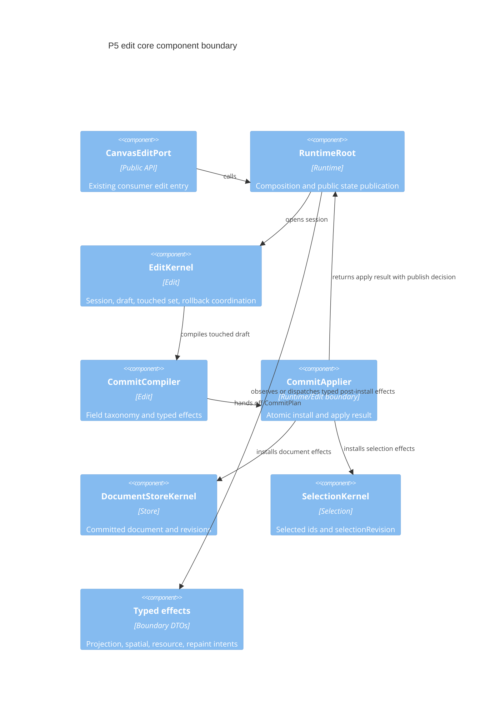
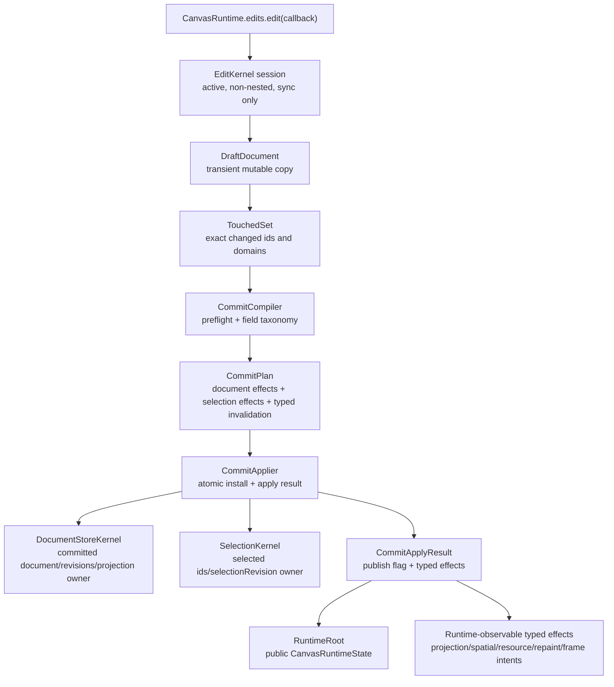
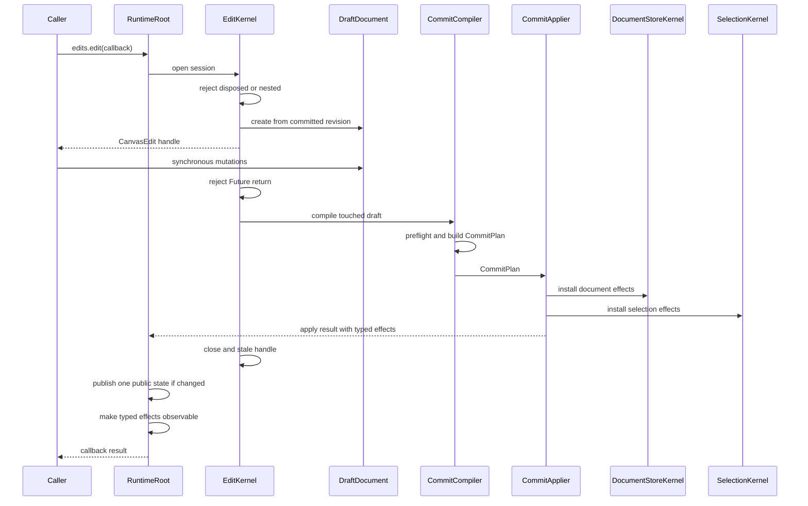
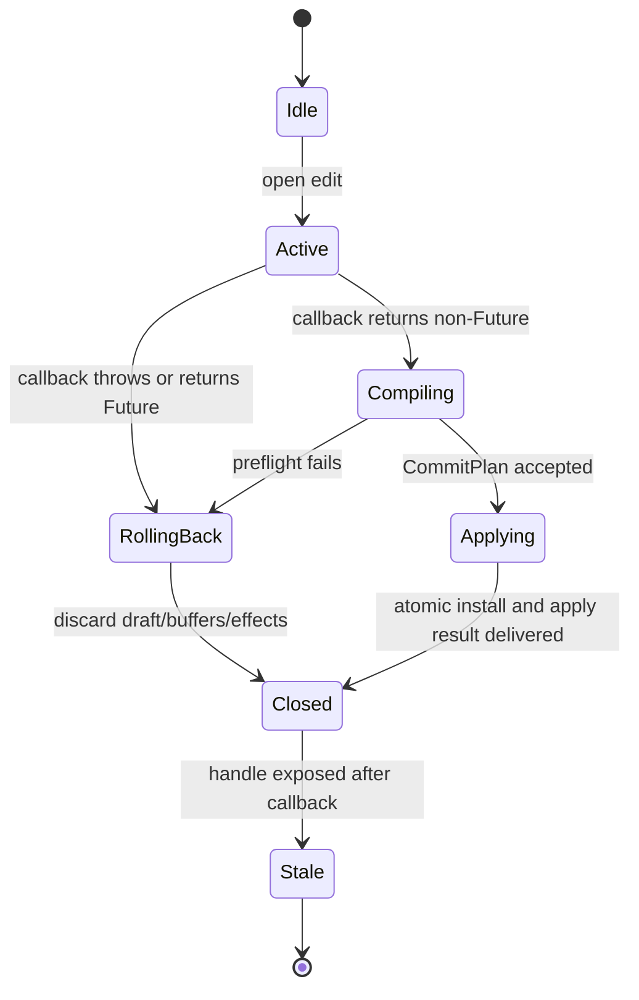

# Design: P5 Edit Core

---
date: 2026-05-24
designer: Codex
commit: 3cd6a2db
branch: new-architecture
design_question: "Repair the P5/P6 edit handoff design after review found under-specified effect delivery, replacement ownership, verification, and seam obligations before a future Change Contract."
---

## Disposition

READY_FOR_CONTRACT

## Product Outcome

P5 should make edits usable as the single synchronous mutation boundary for the
engine. Application code will be able to perform low-level document edits
through the existing public edit API, while the engine guarantees that failed,
nested, asynchronous, or stale edits leave committed runtime state untouched.

Non-goals: do not implement undo/redo, command-owned user action events,
interaction tools, load-document staging, executable draft-document
replacement, frame rendering, resources, spatial indexes, or Flutter surface
behavior in this design. Those future owners should consume typed edit effects
only after P5 defines the atomic commit and effect-delivery boundary.

## Target Contract Classification

- Profile: BEHAVIOR_CHANGE
- Obligations: BUG_FIX, SEAM_MIGRATION

The public edit API shape already exists; P5 repair turns the current edit
surface into contract-complete runtime behavior without changing public
signatures.
It also creates the shared mutation seam that later command, interaction, load,
resource, spatial, and frame owners must consume instead of mutating store or
selection state directly.
Because this artifact is now also the repair input after contract/review
defects exposed under-specified P5/P6 handoff behavior, the future Change
Contract must carry bug-fix proof as well as seam-migration proof.

## Research Inputs

- None provided; direct repository evidence used.

## Repository Evidence

- `docs/implementation/p5_edit_core.md:5` - P5 implements synchronous edit
  sessions and atomic commit/rollback before later features can mutate
  committed state.
- `docs/implementation/p5_edit_core.md:10` - P5 build scope names
  `EditKernel`, `EditSession`, `DraftDocument`, `TouchedSet`,
  `CommitCompiler`, `CommitPlan`, and `CommitApplier`.
- `docs/implementation/p5_edit_core.md:17` - P5 must enforce sync,
  non-nested, Future-return rejection, and stale handle rejection.
- `docs/implementation/p5_edit_core.md:20` - rollback must leave committed
  state, selection owner, revisions, events, repaint, resources, spatial,
  preview, and projection without side effects.
- `docs/implementation/p5_edit_core.md:24` - ordinary edits require exact
  touched invalidation and typed effects without depending on concrete
  `FrameEngine`.
- `docs/implementation/p5_edit_core.md:40` - donor decisions target
  `DocumentStoreKernel`, `SelectionKernel`, and `EditKernel` helpers, plus the
  interaction mutation bridge into `EditKernel`.
- `docs/implementation/p5_edit_core.md:63` - P5 satisfies edit write/rollback
  sequences, operation matrix rows, typed effect boundaries, and cross-owner
  document/selection atomicity.
- `docs/implementation/p5_edit_core.md:93` - exit gates include rollback proof,
  operation matrix effects, coherent runtime state publication, exact touched
  invalidation, typed effect boundaries, and no low-level user action events.
- `docs/implementation/p5_edit_core.md:106` - coupling `CommitCompiler` to
  concrete frame, spatial, or resource owners is a named risk.
- `docs/implementation/p5_edit_core.md:112` - every later state-changing feature
  after P5 must use `EditKernel`.
- `docs/contracts/edit_kernel.md:65` - the write sequence enters through
  `CanvasEditPort.edit`, opens an `EditKernel` session, creates a draft, runs
  synchronous mutations, compiles a plan, atomically applies store and selection
  effects, publishes typed post-install effects, and closes the handle.
- `docs/contracts/edit_kernel.md:27` - EditKernel required tests include
  `test.edit.field_update_nullable_semantics`.
- `docs/contracts/edit_kernel.md:87` - the rollback sequence discards event and
  repaint buffers, closes the handle, and rethrows.
- `docs/contracts/edit_kernel.md:106` - rollback obligations require unchanged
  committed document identity, revisions, projection cache, spatial index,
  resource cache, selection owner, public state, actions, text events, and
  repaint.
- `docs/contracts/edit_kernel.md:123` - the required `TouchedSet` includes
  element, resource, layer, selection, persisted camera, background, grid,
  palette, and document replacement flags.
- `docs/contracts/edit_kernel.md:145` - generic global invalidation is
  forbidden except document replacement.
- `docs/contracts/edit_kernel.md:147` - `CommitCompiler` must produce typed
  `RepaintIntent` and invalidation effects and must not depend on concrete
  `FrameEngine`.
- `docs/contracts/edit_kernel.md:154` - `CommitCompiler` owns the element
  update field-effect taxonomy.
- `docs/contracts/edit_kernel.md:195` - selection normalization effects are
  installed by the selection owner and published atomically with document
  effects.
- `docs/contracts/edit_kernel.md:201` - selection effects are not draft fields
  inside committed document state.
- `docs/contracts/edit_kernel.md:208` - after an accepted edit,
  `RuntimeRoot` publishes exactly one public state snapshot, while no-op edits
  publish none.
- `docs/contracts/operation_matrix.md:44` - P5 closes edit-owned rows and the
  generic executable effect shape.
- `docs/contracts/operation_matrix.md:45` - P6 closes loadDocument
  success/failure rows after the staged load contract.
- `docs/contracts/operation_matrix.md:51` - edit-owned rows cover adding
  content and background elements.
- `docs/contracts/operation_matrix.md:53` - `CanvasEdit.updateElement` effects
  come from the field-effect taxonomy and may include selection-owner pruning.
- `docs/contracts/operation_matrix.md:54` - low-level
  `CanvasEdit.removeElement` removes document state and selection references
  without user events.
- `docs/contracts/operation_matrix.md:64` - low-level
  `CanvasEdit.clearContent` can clear document, selection, and resource state
  without user events.
- `docs/contracts/operation_matrix.md:66` - `CanvasEdit.setCameraOffset`
  changes persisted document camera without immediate runtime view-camera
  repaint.
- `docs/contracts/operation_matrix.md:97` - any row that changes a public
  revision publishes one coherent `CanvasRuntimeState` after success.
- `docs/contracts/operation_matrix.md:104` - selection-only rows do not
  increment document revision, evict projection, or update spatial indexes.
- `docs/contracts/operation_matrix.md:106` - rows that touch document and
  selection publish one atomic runtime snapshot through the runtime/applier
  boundary.
- `docs/contracts/operation_matrix.md:111` - no-op operations publish no public
  state snapshot.
- `docs/contracts/operation_matrix.md:231` - the operation matrix details
  `replaceDraftDocument` as document replacement with selection clear, epoch,
  resource, spatial, projection, repaint, and rollback behavior.
- `docs/contracts/public_api_v1.md:1324` - the public `CanvasEditPort` and
  `CanvasEdit` API is already specified.
- `docs/contracts/public_api_v1.md:1355` - the public edit contract requires a
  synchronous callback, nested edit rejection, Future rejection, atomic draft
  mutations, rollback, post-install notifications, and stale handle rejection.
- `docs/contracts/public_api_v1.md:1370` - low-level `CanvasEdit.removeElement`
  and `CanvasEdit.clearContent` emit no user action event.
- `docs/contracts/public_api_v1.md:1411` - high-level commands use
  `EditKernel` for atomic mutation but own user action event emission.
- `docs/contracts/public_api_v1.md:1474` - command mutations must go through
  `EditKernel` and inherit rollback, stale, and dispose checks.
- `docs/contracts/public_api_v1.md:1769` - resource mutation intentionally
  belongs inside `CanvasEdit` to guarantee atomic resource and element
  operations.
- `docs/architecture/01_runtime_ownership.md:54` - runtime ownership splits
  document, selection, edit, interaction, frame, resource, surface resource,
  spatial, codec, and diagnostics roles.
- `docs/architecture/01_runtime_ownership.md:59` - `DocumentStoreKernel` owns
  committed document state, document revisions, resource descriptors, and public
  document projection cache.
- `docs/architecture/01_runtime_ownership.md:61` - `SelectionKernel` owns
  selected ids, `selectionRevision`, normalization, and content-only filtering.
- `docs/architecture/01_runtime_ownership.md:62` - `EditKernel` owns
  synchronous edit sessions, draft, touched sets, and cross-owner
  commit/rollback coordination.
- `docs/architecture/03_data_model.md:134` - public runtime observation is one
  immutable `CanvasRuntimeState` snapshot published after accepted
  runtime-visible changes reach their owning boundary.
- `docs/architecture/03_data_model.md:142` - selection-only changes increment
  `selectionRevision`, not `documentRevision`, and document operations that
  prune selection publish document and selection effects atomically.
- `docs/architecture/03_data_model.md:149` - runtime view camera and persisted
  document camera are separate, and persisted camera changes are ordinary
  document edits through `CanvasEdit.setCameraOffset`.
- `docs/architecture/03_data_model.md:170` - no-op edits and no-op runtime
  operations do not publish a new public state snapshot.
- `docs/verification/tests.md:263` - verification inventory includes edit
  sync, non-nested, async, stale, rollback, field update, operation matrix,
  exact touched invalidation, and typed-effect tests.
- `docs/_registry/sections.yaml:414` - the section registry binds
  `test.edit.field_update_nullable_semantics` to the EditKernel section tests.
- `docs/verification/tests.md:335` - nullable field update tests prove
  generated and dynamic non-invertible transform updates reject before draft
  mutation.
- `docs/verification/tests.md:478` - runtime state publication tests prove
  ordinary document edits publish one `CanvasRuntimeState` and no-op edits do
  not publish another snapshot.
- `docs/verification/tests.md:508` - selection runtime ownership tests prove
  selection-only changes do not affect document/projection/spatial state and
  document replacement, delete, clear, and eraser paths publish document and
  selection effects atomically.
- `lib/src/api/canvas_runtime.dart:41` - `CanvasRuntime.edits` now delegates to
  `RuntimeRoot.edits`.
- `lib/src/api/canvas_runtime.dart:173` - the current public API declares
  `CanvasEditPort.edit` and `loadDocument`.
- `lib/src/api/canvas_runtime.dart:183` - the current public API declares the
  low-level `CanvasEdit` mutation surface.
- `lib/src/edit/edit_session.dart:126` - the current `replaceDraftDocument`
  edit handle method rejects execution as P6-owned document loading behavior.
- `lib/src/runtime/runtime_root.dart:23` - `RuntimeRoot` is intentionally the
  one place where public runtime behavior, store read facts, and selection
  ownership meet.
- `lib/src/runtime/runtime_root.dart:36` - `RuntimeRoot` composes
  `DocumentStoreKernel`, runtime view camera, `SelectionKernel`, and the public
  state notifier.
- `lib/src/edit/commit_applier.dart:12` - current `CommitApplier.apply` returns
  only a `bool` publish decision, so typed post-install effects stop at the
  plan/applier boundary.
- `lib/src/runtime/runtime_root.dart:268` - selection-owned document mutation is
  currently rejected until later edit phases.
- `lib/src/runtime/runtime_root.dart:315` - current `RuntimeRoot._applyEditCommit`
  consumes only the applier's `bool` publish decision and does not receive typed
  post-install effects from the applier boundary.
- `lib/src/runtime/runtime_root.dart:307` - `RuntimeRoot` publishes public state
  snapshots from store, selection, and view camera facts.
- `lib/src/store/document_store_kernel.dart:13` - `DocumentStoreKernel` is the
  single owner for committed document facts, read projection, id admission, and
  selection normalization inputs.
- `lib/src/store/document_store_kernel.dart:34` - `DocumentStoreKernel` owns the
  committed document and projection cache.
- `lib/src/store/document_store_kernel.dart:98` - store-owned selectable ids are
  the source for selection normalization.
- `lib/src/selection/selection_kernel.dart:7` - `SelectionKernel` is the
  selection facts owner.
- `lib/src/selection/selection_kernel.dart:25` - selection changes normalize
  through the membership port before updating selected ids.
- `lib/src/selection/selection_kernel.dart:60` - selection replacement advances
  `selectionRevision` only when membership changes.

## Design Form Candidates

### Candidate A. Edit-owned transaction seam with runtime/applier boundary

- Form: add an edit-owned transaction subsystem under `lib/src/edit/**`, expose
  it through the existing `CanvasEditPort`, and compose it in `RuntimeRoot`.
  `EditKernel` owns session lifecycle, draft handles, touched collection, stale
  checks, rollback buffers, and handoff to `CommitCompiler`. `CommitCompiler`
  owns field-effect taxonomy, exact invalidation, preflight effects, and typed
  `CommitPlan` construction. `CommitApplier` installs document and selection
  effects at the runtime boundary and returns one immutable apply result to
  `RuntimeRoot`; that result contains the public-state publication decision and
  the typed post-install effects that left the edit owner. `RuntimeRoot` is the
  P5 observation/dispatch seam for those effects without requiring concrete
  frame, spatial, resource, or Flutter owners.
- Why it could work: it matches the documented edit sequence, preserves
  `DocumentStoreKernel` and `SelectionKernel` as committed owners, keeps
  low-level edits event-free, gives future commands and interaction one shared
  mutation seam, and lets downstream owners consume typed effects only after
  atomic install.
- Gate failures or risks: requires careful proof that draft mutation cannot
  leak into committed store state before apply; requires enough typed effect
  structure for future owners without implementing those owners in P5.

### Candidate B. RuntimeRoot-direct mutation methods

- Form: implement public edit operations as direct methods on `RuntimeRoot` that
  mutate `DocumentStoreKernel`, call `SelectionKernel` when needed, and publish
  state inline.
- Why it could work: it is smaller for the first few edit operations and uses
  the existing composition root.
- Gate failures or risks: it makes rollback, touched invalidation, and
  cross-owner atomicity an inline runtime concern instead of the edit owner
  documented at `docs/architecture/01_runtime_ownership.md:62`; it would
  duplicate policy when commands and interaction later need the same mutation
  guarantees; it increases the chance that event, repaint, resource, projection,
  or selection side effects happen before rollback is known to be impossible.

### Candidate C. Command/event journal as the primary mutation owner

- Form: route edit calls through a high-level command/action layer and treat
  action records as the central mutation history.
- Why it could work: it could make future undo/redo or telemetry easier to
  imagine.
- Gate failures or risks: public docs explicitly say command actions are
  user-action notifications, not an undo/redo journal, and low-level
  `CanvasEdit` must remain usable without emitting user action events. This
  form would blur low-level synchronization edits with user intent events and
  would make command-owned behavior a prerequisite for P5.

### Candidate D. Store-owned mutable draft

- Form: teach `DocumentStoreKernel` to expose a mutable draft object and apply
  it directly, with `EditKernel` acting mostly as a facade around store draft
  operations.
- Why it could work: it could reuse store internals and keep document mutation
  near committed document tables.
- Gate failures or risks: selection effects are not draft fields in committed
  document state, and the edit owner must coordinate cross-owner rollback. A
  store-owned draft would pressure `DocumentStoreKernel` to know about
  selection, events, repaint, resources, and typed downstream effects, which is
  outside its committed-state ownership.

## Known Future Pressures

| Pressure | Evidence | How the selected form responds | Accepted cost or risk |
|---|---|---|---|
| P6 load-document success/failure must reuse staged atomic install semantics. | `docs/contracts/operation_matrix.md:45`; `docs/contracts/operation_matrix.md:76` | The selected form keeps `CommitPlan`/`CommitApplier` as the future atomic install boundary rather than embedding edit commit inside one public method. | P5 may reserve document-replacement effect shape in typed effects, but P6 owns executable load staging and load success/failure behavior. |
| `CanvasEdit.replaceDraftDocument` is already described as an executable replacement row, but P5 does not own executable replacement. | `docs/contracts/operation_matrix.md:78`; `docs/contracts/operation_matrix.md:231`; `lib/src/edit/edit_session.dart:126` | P5 owns only the reserved document-replacement effect shape and the `documentReplaced` invalidation exception needed by `CommitPlan`/guardrails. P6 owns making `replaceDraftDocument` execute and proving the full replacement row. | A future P5 repair contract must not count rejected `replaceDraftDocument` as row coverage. It must either keep the method rejection explicit or defer executable row proof to P6. |
| P7 resource descriptors and visual cache changes need atomic element/resource edits. | `docs/contracts/public_api_v1.md:1769`; `docs/contracts/operation_matrix.md:71` | Resource descriptor edits remain inside the draft/commit path while visual dirty operations remain future resource-owner behavior. | P5 may need placeholder typed effects for resource descriptor invalidation without implementing resolver cache behavior. |
| P10-P12 interaction and tools must request committed mutations without importing store or selection internals. | `docs/architecture/01_runtime_ownership.md:96`; `docs/architecture/02_package_boundaries.md:231`; `docs/implementation/p5_edit_core.md:42` | Future interaction code consumes `EditKernel` through a mutation bridge; it does not mutate concrete store or selection owners. | The edit seam must be discoverable and narrow enough for commands/tools without becoming an interaction facade. |
| High-level commands must emit actions only after atomic install while low-level edits stay silent. | `docs/contracts/public_api_v1.md:1411`; `docs/contracts/public_api_v1.md:1474`; `docs/contracts/operation_matrix.md:54`; `docs/contracts/operation_matrix.md:55` | `EditKernel` remains event-neutral for low-level edits; command wrappers later own action buffering and only commit events after the edit plan applies. | P5 should include event buffer/discard shape even if command event production is later-phase work. |
| Frame, spatial, projection, and resource owners will need typed effects but must not become compile-time dependencies of `CommitCompiler`. | `docs/contracts/edit_kernel.md:147`; `docs/implementation/p5_edit_core.md:106` | `CommitCompiler` emits typed effect descriptions in `CommitPlan`; `CommitApplier` must return those effects in an apply result to `RuntimeRoot` after atomic install, making them observable beyond the edit owner. | P5 must define effect DTOs and the applier/runtime delivery seam carefully enough for tests while accepting that later owners may extend dispatch handling. |
| Public smoke coverage should keep growing only through real public user steps. | `docs/verification/tests.md:484`; `docs/verification/tests.md:491` | Once P5 exposes working public edits, a future contract can append one public edit step without reaching into `src/**`. | The smoke test remains coarse and does not replace edit-owned unit tests. |

## Selected Form

Select Candidate A: an edit-owned transaction seam with a runtime/applier
boundary.

The selected form keeps committed state ownership where the architecture already
places it: `DocumentStoreKernel` owns committed document state and revision
facts, `SelectionKernel` owns selected ids and `selectionRevision`, and
`RuntimeRoot` composes owners and publishes public state. `EditKernel` becomes
the one mutation coordinator for low-level edits and future command/tool
mutations. Draft state is transient and edit-owned, not committed store state
and not selection state. Selection pruning/clear effects are explicit
`CommitPlan` effects installed by the selection owner during apply.

`CommitCompiler` is the root-cause owner for exact invalidation. It translates
draft deltas and update fields into typed document, selection, projection,
spatial, resource, repaint, and public-state effects. It does not call concrete
frame, spatial, resource, Flutter, or interaction owners. `CommitApplier`
performs the install boundary: document and selection effects are installed
atomically, then it returns an apply result to `RuntimeRoot`. That result is the
minimum P5 typed-effect delivery seam: it must carry the post-install effects
out of `CommitPlan` and across the runtime/applier boundary, plus the
public-state publication decision. P5 does not need concrete frame, spatial, or
resource consumers, but tests must be able to observe that the effects leave the
edit owner after successful install and are absent on no-op or rollback paths.

Document replacement is only a reserved P5 effect shape. `TouchedSet` and
`CommitPlan` may represent `documentReplaced` so guardrails can forbid generic
global invalidation except replacement, but `CanvasEdit.replaceDraftDocument`
remains non-executable in P5. The operation-matrix row for executable
replacement belongs to P6 together with staged load success/failure behavior.

This is the smallest form that satisfies the P5 contracts without forcing
later features into P5. It rejects direct runtime mutation because that would
turn the composition root into the transaction owner, and it rejects event or
store-owned drafts because those forms either conflict with low-level edit
silence or blur document ownership with cross-owner rollback.

## Hard Gate Check

| Gate | Result | Evidence |
|---|---|---|
| Root cause | pass | The root cause is the missing shared mutation boundary for future state-changing features; P5 exists so every later state-changing feature uses `EditKernel`: `docs/implementation/p5_edit_core.md:112`. |
| Ownership | pass | The selected form preserves documented owners: `DocumentStoreKernel` owns committed document state, `SelectionKernel` owns selection, `EditKernel` owns edit sessions/drafts/touched sets/commit coordination, and `RuntimeRoot` publishes public state: `docs/architecture/01_runtime_ownership.md:59`, `docs/architecture/01_runtime_ownership.md:61`, `docs/architecture/01_runtime_ownership.md:62`, `docs/architecture/03_data_model.md:134`. |
| Source of truth | pass | Draft state is transient and edit-owned; committed document, selection, and runtime public snapshots keep single owners. Selection effects are explicit effects, not draft fields inside committed document state: `docs/contracts/edit_kernel.md:201`. |
| Boundary | pass | Entry boundary is `CanvasEditPort.edit`; exit boundaries are `CommitPlan`, `CommitApplier`, committed store/selection installs, the `CommitApplier -> RuntimeRoot` apply result carrying typed post-install effects, and public `CanvasRuntimeState` publication: `docs/contracts/edit_kernel.md:65`, `docs/contracts/edit_kernel.md:76`, `docs/contracts/edit_kernel.md:77`, `docs/contracts/edit_kernel.md:82`, `docs/contracts/edit_kernel.md:208`. |
| Dependency direction | pass | `CommitCompiler` may emit typed effects but must not depend on concrete `FrameEngine`; interaction later mutates through `EditKernel`, not concrete store/selection internals: `docs/contracts/edit_kernel.md:147`, `docs/architecture/02_package_boundaries.md:231`, `docs/implementation/p5_edit_core.md:42`. |
| State/data | pass | Committed document/revision/projection state stays in `DocumentStoreKernel`; selection state stays in `SelectionKernel`; public state stays in `RuntimeRoot`; draft/session/buffers/touched/effects are edit-owned transient state: `lib/src/store/document_store_kernel.dart:13`, `lib/src/selection/selection_kernel.dart:7`, `lib/src/runtime/runtime_root.dart:307`, `docs/architecture/01_runtime_ownership.md:62`. |
| Seam | pass | The new shared seam is `EditKernel` behind the existing `CanvasEditPort`, with `CommitApplier -> RuntimeRoot` as the post-install effect delivery seam. Future commands and interaction become consumers, direct mutation placeholders such as `rejectSelectionDocumentMutation` retire when their behavior routes through edit commit, and negative proof must show no concrete downstream owner import is required by `CommitCompiler`: `lib/src/api/canvas_runtime.dart:41`, `lib/src/runtime/runtime_root.dart:268`, `docs/contracts/public_api_v1.md:1474`, `docs/contracts/edit_kernel.md:147`. |
| Verification | pass | P5 has focused edit tests and guardrail ids for sync/non-nested/async/stale, rollback, operation matrix effects, exact touched invalidation, typed effects, low-level event silence, runtime publication, and selection owner separation; the future contract must additionally prove typed effects leave `CommitPlan` through the applier/runtime boundary, not only that they exist in the plan: `docs/implementation/p5_edit_core.md:73`, `docs/verification/tests.md:263`, `docs/verification/tests.md:478`, `docs/verification/tests.md:508`. |
| Future pressure | pass | P6/P7/P10-P12 and command/event future pressures are absorbed by the transaction seam while deferring owner-specific behavior to later phases. Replacement pressure is explicitly narrowed: P5 owns only reserved replacement effect shape, while P6 owns executable replacement/load behavior: `docs/contracts/operation_matrix.md:45`, `docs/contracts/operation_matrix.md:231`, `docs/contracts/public_api_v1.md:1769`, `docs/contracts/public_api_v1.md:1411`, `docs/implementation/p5_edit_core.md:112`. |

## Lock-Required Facts

- Owner: `EditKernel` owns synchronous edit sessions, transient draft state,
  touched collection, rollback buffers, commit compilation, stale handle checks,
  and cross-owner commit coordination.
- Owning layer/module/document family: future code belongs under `lib/src/edit/**`
  with composition in `RuntimeRoot` and public exposure through the existing
  `CanvasRuntime.edits` facade.
- Seam: `CanvasEditPort.edit -> EditKernel -> DraftDocument -> CommitCompiler
  -> CommitPlan -> CommitApplier -> DocumentStoreKernel/SelectionKernel
  -> CommitApplier apply result -> RuntimeRoot public state/effect dispatch`.
- Dependency/import direction: edit code may depend on public DTOs and narrow
  store/selection commit boundaries, but `CommitCompiler` must not import
  concrete frame, spatial, resource, Flutter, or interaction owners.
- State/data ownership: committed document tables, projection cache, and
  document revisions remain store-owned; selected ids and selection revision
  remain selection-owned; public state snapshots remain runtime-owned; draft,
  touched set, session active flag, stale token, event/repaint buffers, and
  typed effects remain edit-owned transient data.
- Entry boundaries: public `CanvasRuntime.edits`, `CanvasEditPort.edit`, and
  future command/interaction mutation bridges.
- Exit boundaries: committed document install, selection effect install, one
  public state snapshot when revisions change, no snapshot for no-op edits,
  typed post-install effects returned from `CommitApplier` to `RuntimeRoot`,
  and low-level edits with no user action events.
- File placement basis: production edit implementation under `lib/src/edit/**`;
  runtime facade adapter and composition in `lib/src/runtime/runtime_root.dart`;
  public signatures remain in `lib/src/api/canvas_runtime.dart`.
- Execution order constraints: reject disposed/nested sessions before draft
  creation; create draft from committed revision; run callback synchronously;
  reject Future results; compile/preflight before install; install document and
  selection effects atomically; return typed post-install effects and publish
  public state only after install; close and stale the handle on success or
  rollback. `CanvasEdit.replaceDraftDocument` remains rejection-only in P5 even
  though its reserved replacement effect shape may exist in `TouchedSet` and
  `CommitPlan`.
- Rejected alternatives: direct `RuntimeRoot` mutations, command/action journal
  as primary mutation owner, and store-owned mutable draft.
- Verification strategy: focused edit tests, field-update validation tests,
  runtime/selection publication tests, operation-matrix executable checks,
  import/semantic guardrails for no concrete frame dependency and no global
  invalidation except replacement, explicit tests that typed post-install
  effects leave the edit owner through the applier/runtime result, executable
  operation-matrix checks that exclude P6-owned `replaceDraftDocument`, and
  public API/smoke tests using only the public barrel.

## Diagram Need Assessment

| Design question | Needed? | Diagram kind | Reason |
|---|---:|---|---|
| Does the design change ownership, layer, package, or component boundaries? | yes | c4 | P5 creates the edit-owned transaction subsystem and composes it with existing runtime, store, and selection owners. |
| Does it change data flow, state ownership, cache ownership, resource movement, or lifecycle movement? | yes | data_flow | Draft state, touched effects, committed installs, public state publication, and typed downstream effects need one explicit flow. |
| Does it depend on call order, lifecycle order, sync/async ordering, failure ordering, or migration order? | yes | sequence | Correctness depends on reject/create draft/callback/compile/apply/publish/close order and rollback ordering. |
| Does it introduce or alter modes, statuses, terminal states, sessions, or transition rules? | yes | state | Edit sessions need active, committing, closed, rolled back, and stale handle states. |
| Does it create, replace, migrate, or retire a shared seam? | yes | c4/data_flow/sequence | The shared mutation seam is `EditKernel`; command and interaction consumers must later route through it. |
| Does it change public API consumer flow, payload shape, or compatibility behavior? | yes | sequence | The existing `CanvasRuntime.edits` flow is hardened to synchronous transactional behavior without changing signatures. |
| Does it introduce or change analyzer, guardrail, or structural-recognition pipeline behavior? | no | none | P5 consumes existing guardrail and operation-matrix proof responsibilities; it does not design a new multi-stage recognition pipeline. |

## Provisional Diagrams

## Source-Of-Truth Impact

A later Change Contract should not rewrite the architecture decision unless
implementation evidence contradicts it. It should update only durable sources
whose facts actually change:

- `PLAN.md` and a new `plan/step_*.md` if the P5 implementation is scheduled as
  the next active plan step.
- `docs/diagrams/c4_code_edit_kernel.mmd`,
  `docs/diagrams/c4_component_runtime.mmd`,
  `docs/diagrams/dfd_cache_invalidation.mmd`,
  `docs/diagrams/dfd_public_edit.mmd`,
  `docs/diagrams/seq_edit_success.mmd`,
  `docs/diagrams/seq_edit_rollback.mmd`, and
  `docs/diagrams/state_edit_session.mmd` if implementation changes the durable
  diagram facts named by `docs/implementation/p5_edit_core.md:53`.
- `docs/contracts/operation_matrix.md` must be clarified by the future Change
  Contract so P5 owns the reserved `documentReplaced` invalidation/effect shape
  while P6 owns the executable `CanvasEdit.replaceDraftDocument` replacement
  row and load-document staging behavior.
- `docs/contracts/edit_kernel.md` must be clarified by the future Change
  Contract so the selected `CommitApplier -> RuntimeRoot` apply-result delivery
  seam is the durable contract wording for typed post-install effects.
- `docs/contracts/public_api_v1.md` and `docs/architecture/03_data_model.md`
  should change only if implementation or contract authoring finds an actual
  durable source-of-truth contradiction beyond the P5/P6 split and apply-result
  seam clarified above.
- `docs/verification/tests.md` only if test names, ownership, or proof
  responsibilities differ from the current P5 verification inventory.
- The future Change Contract should reconcile the P5 brief with the EditKernel
  registry before implementation planning: `section_11_edit_kernel` requires
  `test.edit.field_update_nullable_semantics`, while
  `docs/implementation/p5_edit_core.md` does not currently list that proof
  surface.

## Verification Impact

The future Change Contract should include these proof surfaces:

- Focused edit tests:
  `test/edit/low_level_mutations_do_not_emit_actions_test.dart`,
  `test/edit/sync_non_nested_async_stale_test.dart`,
  `test/edit/rollback_test.dart`,
  `test/edit/field_update_nullable_semantics_test.dart`,
  `test/edit/edit_matrix_effects_test.dart`,
  `test/edit/exact_touched_invalidation_test.dart`, and
  `test/edit/typed_effects_no_frame_dependency_test.dart`.
- Existing cross-owner tests:
  `test/runtime/runtime_state_publication_test.dart` and
  `test/selection/runtime_owner_separation_test.dart`.
- Guardrails:
  `edit.sync_non_nested`, `edit.rollback_no_effects`,
  `edit.stale_handle_rejected`, `edit.operation_matrix_complete`,
  `edit.no_global_invalidation_except_replacement`,
  `edit.typed_effects_no_frame_dependency`,
  `events.low_level_edit_no_user_actions`,
  `selection.owner_separate_from_document`, and `core.single_runtime_root`.
- Public consumer proof: append one real public edit step to
  `test/smoke/public_incremental_smoke_test.dart` only through
  `package:iwb_canvas_engine/iwb_canvas_engine.dart`.
- Post-install effect-delivery proof: verify successful commits expose typed
  effects through the `CommitApplier -> RuntimeRoot` apply result after
  atomic install, while no-op, rollback, validation failure, stale, nested, and
  Future-return paths expose none. `CommitPlan.effects` alone is not sufficient
  proof of the P5 boundary.
- P5/P6 replacement split proof: verify P5 keeps `documentReplaced` as the
  reserved invalidation/effect shape and generic-global-invalidation exception,
  while `CanvasEdit.replaceDraftDocument` remains rejection-only and is not
  counted as an executable P5 operation-matrix row.
- Repository checks after Dart changes:
  `dart analyze`, `dcm analyze .`, `dcm calculate-metrics .`, focused tests,
  and architecture graph checks if durable architecture seams or diagrams are
  changed.

## Verification Strategy

Prove behavior at the edit owner first: synchronous callback enforcement,
nested edit rejection, Future-return rollback, stale handle rejection, no-op
silence, and exception rollback. Then prove cross-owner atomicity: document and
selection effects install together, public state publishes exactly once after
success, and no rollback path changes document, selection, projection, resource,
spatial, preview, repaint, event, or runtime state.

Prove update validation and typed-effect boundaries structurally and
semantically. Generated and dynamic nullable field updates must reject invalid
non-invertible transform values before draft mutation. Semantic tests should
then assert operation-matrix effects for P5-owned rows and exact touched
invalidation. Typed-effect proof must cross the runtime/applier boundary:
successful commits return the typed post-install effects from `CommitApplier`
to `RuntimeRoot` after store and selection install; rollback, no-op, stale,
nested, validation-failure, and Future-return paths return or publish no typed
effects. Structural guardrails should ensure `CommitCompiler` does not import
concrete `FrameEngine` or other downstream owners and that generic global
invalidation appears only for the reserved document replacement shape.

Prove the P5/P6 split for document replacement explicitly. P5 may define
`documentReplaced` on `TouchedSet`/`CommitPlan` and may reserve replacement
effect DTOs, but `CanvasEdit.replaceDraftDocument` remains rejection-only and
the executable replacement operation-matrix row is not part of P5 completion.

Finally, prove public compatibility through the existing public API surface:
`CanvasRuntime.edits` should work through the public barrel, low-level
`CanvasEdit.removeElement` and `CanvasEdit.clearContent` should emit no user
action events, and the smoke test should append one public edit step without
using `src/**`.

## Change Contract Handoff

- Required profile: BEHAVIOR_CHANGE
- Required obligations: BUG_FIX, SEAM_MIGRATION
- Decisions to carry forward:
  - implement `EditKernel` as the single transaction coordinator for P5 edits;
  - keep draft/touched/session state edit-owned and transient;
  - keep committed document state in `DocumentStoreKernel`;
  - keep selection effects explicit and installed by `SelectionKernel`;
  - keep public state publication in `RuntimeRoot`;
  - make `CommitCompiler` the owner of field-effect taxonomy and exact typed
    invalidation;
  - require `CommitApplier` to return an apply result to `RuntimeRoot` that
    carries typed post-install effects across the runtime/applier boundary;
  - keep `CommitCompiler` independent of concrete frame, spatial, resource,
    Flutter, and interaction owners;
  - keep `CanvasEdit.replaceDraftDocument` rejection-only in P5 while reserving
    only the document-replacement effect shape for future P6 execution;
  - keep low-level `CanvasEdit` event-free while leaving user action events to
    future command wrappers.
- Evidence to cite:
  - P5 scope and exits: `docs/implementation/p5_edit_core.md:5`,
    `docs/implementation/p5_edit_core.md:10`,
    `docs/implementation/p5_edit_core.md:93`,
    `docs/implementation/p5_edit_core.md:112`;
  - edit sequence and rollback: `docs/contracts/edit_kernel.md:65`,
    `docs/contracts/edit_kernel.md:87`,
    `docs/contracts/edit_kernel.md:106`;
  - typed effects and taxonomy: `docs/contracts/edit_kernel.md:145`,
    `docs/contracts/edit_kernel.md:147`,
    `docs/contracts/edit_kernel.md:154`;
  - cross-owner atomicity: `docs/contracts/edit_kernel.md:195`,
    `docs/contracts/edit_kernel.md:201`,
    `docs/contracts/operation_matrix.md:106`;
  - public API and command relationship:
    `docs/contracts/public_api_v1.md:1324`,
    `docs/contracts/public_api_v1.md:1355`,
    `docs/contracts/public_api_v1.md:1411`,
    `docs/contracts/public_api_v1.md:1474`;
  - current composition and placeholders:
    `lib/src/api/canvas_runtime.dart:41`,
    `lib/src/edit/commit_applier.dart:12`,
    `lib/src/runtime/runtime_root.dart:23`,
    `lib/src/runtime/runtime_root.dart:268`,
    `lib/src/runtime/runtime_root.dart:315`.
- Contract constraints or sequencing facts:
  - implement P5 before any later load, resource, interaction, command, drawing,
    or eraser commits mutate committed state;
  - do not implement P6 load staging or later owner-specific behavior inside
    P5 except where typed effect placeholders are required for P5 tests;
  - do not count `CanvasEdit.replaceDraftDocument` as a P5 executable
    operation-matrix row; P5 only reserves the replacement effect shape and
    keeps the method rejected until P6;
  - do not accept a contract where typed effects are asserted only inside
    `CommitPlan`; the contract must prove post-install delivery through the
    applier/runtime result;
  - no public signature changes are expected;
  - reconcile the P5 brief proof list with the EditKernel registry so
    `test.edit.field_update_nullable_semantics` is not dropped from the future
    implementation contract;
  - update durable diagrams or docs only when implementation evidence changes
    their source-of-truth facts;
  - after code changes, run Dart/DCM checks and focused edit/runtime/selection
    tests.

## Open Decisions

None.
