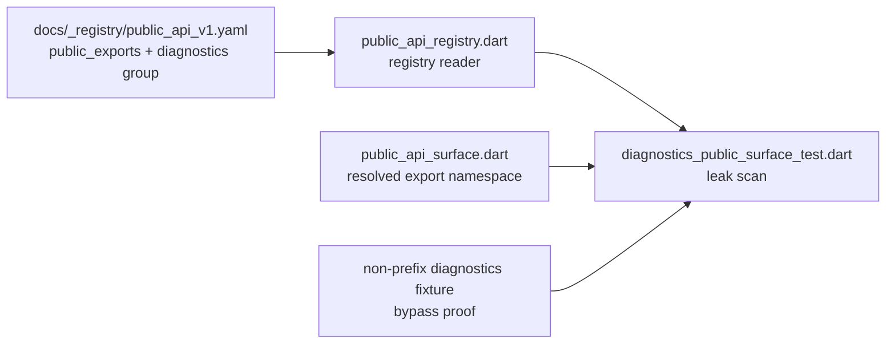

# Design: Diagnostics Public Surface Guard

---
date: 2026-05-25
designer: Codex
commit: cb104484
branch: new-architecture
design_question: "Should the diagnostics public surface guard be fixed by research, design, or direct implementation, and what architecture form should remove the name-based leak-scan weakness?"
---

## Disposition

READY_FOR_CONTRACT

## Product Outcome

Future diagnostics-facing public API cannot silently avoid the sanitizer/leak guard just because its name does not start with the current diagnostics prefixes. The next implementation should make diagnostics surface membership explicit in the public API source of truth and make the guard consume that explicit inventory.

Non-goals: no production runtime behavior change, no public API name addition, no schema migration, and no durable diagram update during this design step.

## Target Contract Classification

- Profile: ANALYZER_RULE
- Obligations: BUG_FIX, SEAM_MIGRATION

## Research Inputs

- `.research/2026-05-25-diagnostics-public-surface-guard.md` - records that the current diagnostics leak guard resolves the public API surface but selects diagnostics declarations through a private name predicate, and that the existing public API registry is a flat exported-name inventory without a diagnostics-specific list (`.research/2026-05-25-diagnostics-public-surface-guard.md:13`, `.research/2026-05-25-diagnostics-public-surface-guard.md:15`).

## Repository Evidence

- `test/diagnostics/diagnostics_public_surface_test.dart:44` - `_diagnosticsRuntimeLeaks` iterates the resolved exported elements.
- `test/diagnostics/diagnostics_public_surface_test.dart:47` - the leak scan skips any exported element that does not match `_isDiagnosticsSurfaceName`.
- `test/diagnostics/diagnostics_public_surface_test.dart:128` - `_isDiagnosticsSurfaceName` is the current name-based diagnostics selector.
- `docs/_registry/public_api_v1.yaml:1` - the current registry is the machine-readable inventory for the Public API v1 exported-name contract.
- `docs/_registry/public_api_v1.yaml:3` - the registry currently exposes a single `public_exports` list.
- `docs/_registry/public_api_v1.yaml:98` - the current registry includes `CanvasDiagnosticPolicy`.
- `docs/_registry/public_api_v1.yaml:103` - the current registry includes `CanvasDataErrorCode`.
- `tool/guardrails/src/public_api_registry.dart:7` - the registry reader entrypoint is `readPublicApiRegistry`.
- `tool/guardrails/src/public_api_registry.dart:10` - the registry reader currently reads only `public_exports`.
- `docs/contracts/public_api_v1.md:87` - the root package exports exactly the names listed in `docs/_registry/public_api_v1.yaml`.
- `docs/contracts/public_api_v1.md:90` - the registry is canonical for exported-name completeness.
- `docs/contracts/public_api_v1.md:91` - `docs/contracts/public_api_v1.md` owns public API semantics, signature rules, and declaration contracts.
- `docs/contracts/public_api_v1.md:2500` - `CanvasDataException` must not expose raw input, application objects, runtime objects, images, handles, closures, canvases, or full document dumps.
- `docs/contracts/public_api_v1.md:2507` - Public API v1 has no public diagnostics stream; diagnostics are projected through `CanvasDataException` and test-only/internal sinks.
- `docs/verification/guardrail_design_patterns.md:85` - `api.public_exports_complete` already uses the `registry_parity` and `resolved_public_surface` patterns.
- `docs/verification/guardrail_design_patterns.md:147` - `diagnostics.sanitized_public_projection` is documented as a behavior proof plus resolved public surface proof.
- `tool/guardrails/src/guardrail_executor.dart:205` - `diagnostics.sanitized_public_projection` routes to diagnostics proof tests.
- `tool/guardrails/src/guardrail_executor.dart:207` - `diagnostics.sanitized_public_projection` includes `test/diagnostics/diagnostics_public_surface_test.dart`.
- `P6_HANDOFF_FINDINGS.md:7` - the handoff records this finding as "Diagnostics public surface guard is name-based."
- `P6_HANDOFF_FINDINGS.md:18` - the suggested work is to bind the check to a registry or contract-owned diagnostics surface inventory.

## Design Form Candidates

### Candidate A. Add diagnostics group to the existing public API registry

- Form: Extend `docs/_registry/public_api_v1.yaml` with a diagnostics public surface inventory, expose it from `tool/guardrails/src/public_api_registry.dart`, and make `test/diagnostics/diagnostics_public_surface_test.dart` iterate that inventory instead of `_isDiagnosticsSurfaceName`.
- Why it could work: The current public API contract already names `docs/_registry/public_api_v1.yaml` as the canonical machine-readable export inventory (`docs/contracts/public_api_v1.md:87`, `docs/contracts/public_api_v1.md:90`), and the repository already uses registry parity plus resolved public surface checks for public API guardrails (`docs/verification/guardrail_design_patterns.md:85`).
- Gate failures or risks: Requires a small registry schema extension and reader update. A future public API author must still classify diagnostics-facing names explicitly, so the Change Contract must add a structural subset check and a negative fixture proving a non-prefix inventory entry is scanned.

### Candidate B. Keep a diagnostics allowlist inside the diagnostics test

- Form: Replace `_isDiagnosticsSurfaceName` with a local `Set<String>` in `test/diagnostics/diagnostics_public_surface_test.dart`.
- Why it could work: It removes prefix matching from the scan and is the smallest code-only change.
- Gate failures or risks: The test file would become a second source of truth beside the public API registry and public API contract. It would not be contract-owned, and the repository already has a machine-readable public API inventory for this class of public surface proof (`docs/_registry/public_api_v1.yaml:1`, `docs/contracts/public_api_v1.md:90`).

### Candidate C. Add a separate diagnostics registry file

- Form: Create a dedicated diagnostics public surface registry and have the diagnostics guard read it.
- Why it could work: It creates an explicit diagnostics inventory without changing the existing public API registry schema.
- Gate failures or risks: It introduces another registry of public names next to the existing public API registry, increasing drift risk. The current contract already points to `docs/_registry/public_api_v1.yaml` for the root export inventory (`docs/contracts/public_api_v1.md:87`, `docs/contracts/public_api_v1.md:90`).

### Candidate D. Infer diagnostics surface from API source files

- Form: Treat names exported from `lib/src/api/canvas_diagnostics.dart` and `lib/src/api/canvas_errors.dart` as diagnostics-facing.
- Why it could work: The current root barrel exports both files (`lib/iwb_canvas_engine.dart:3`, `lib/iwb_canvas_engine.dart:7`), and the current diagnostics types live there.
- Gate failures or risks: File placement is not the public semantic contract. A future diagnostics-facing type could move files, or a file could gain a neighboring non-diagnostics declaration. This keeps the guard tied to incidental placement rather than contract-owned surface membership.

## Known Future Pressures

| Pressure | Evidence | How the selected form responds | Accepted cost or risk |
|---|---|---|---|
| Non-prefix diagnostics names can be added later. | `P6_HANDOFF_FINDINGS.md:13` says a new diagnostics-facing public type with another name could miss the scan. | The selected form makes membership explicit in a registry group instead of deriving it from names. | Future public API additions must update the diagnostics group when they expose diagnostics-facing data. |
| Public API inventory is already centralized. | `docs/contracts/public_api_v1.md:90` makes `docs/_registry/public_api_v1.yaml` canonical for exported-name completeness. | The selected form extends the existing registry rather than creating a second public-name owner. | The registry schema gets slightly richer and its reader must remain backward-compatible only if existing tests require it. |
| Diagnostics projection is intentionally narrow in v1. | `docs/contracts/public_api_v1.md:2507` says no public diagnostics stream is exported in v1. | The selected form can list the current narrow diagnostics public surface and make future expansion explicit. | If v1 later adds a public diagnostics stream, the same inventory must grow and the guard must scan the new names. |
| Guardrail patterns prefer registry parity and resolved public surface. | `docs/verification/guardrail_design_patterns.md:85` and `docs/verification/guardrail_design_patterns.md:147` document those patterns for API and diagnostics checks. | The selected form reuses the existing patterns: registry-owned membership plus analyzer-resolved signatures. | The implementation must add focused negative fixture coverage so the analyzer traversal is proven for non-prefix names. |

## Selected Form

Choose Candidate A: add an explicit diagnostics public surface group to the existing public API registry and make the diagnostics public surface guard consume that group.

The registry should remain the single machine-readable owner for Public API v1 exported names. The diagnostics group should be a classification inside that registry, not a duplicate public export list. The future Change Contract should require a structural check that every diagnostics group entry is also present in `public_exports`, then update the leak scan so it resolves those registry entries to analyzer elements and traverses their public signatures.

The implementation should also add a negative fixture or equivalent targeted test where a non-prefix public name is included in the diagnostics inventory and exposes a forbidden runtime-like type. That proves the new recognition path no longer depends on `CanvasDiagnostic*` or `CanvasDiagnostics*` naming.

## Hard Gate Check

| Gate | Result | Evidence |
|---|---|---|
| Root cause | pass | The defect is the name selector at `test/diagnostics/diagnostics_public_surface_test.dart:128`; selected form replaces that selector with registry-owned membership. |
| Ownership | pass | `docs/contracts/public_api_v1.md:90` makes the registry canonical for exported-name completeness, while `docs/contracts/public_api_v1.md:91` keeps semantics in the contract. |
| Source of truth | pass | The design extends `docs/_registry/public_api_v1.yaml:3` rather than adding a local test-only list or separate public-name registry. |
| Boundary | pass | Entry boundary is the public API registry reader at `tool/guardrails/src/public_api_registry.dart:7`; exit boundary is analyzer-backed public signature traversal through `resolvePublicApiSurface` as used by the current test. |
| Dependency direction | pass | Tests and guardrail tooling already depend on `tool/guardrails/src/public_api_registry.dart:7` and `tool/guardrails/src/public_api_surface.dart:21`; no production code depends on test code. |
| State/data | not applicable | The design adds static registry metadata only; it introduces no runtime, committed, derived, cached, transient, or mutable state. |
| Seam | pass | The seam being migrated is diagnostics surface recognition: retired seam is `_isDiagnosticsSurfaceName`; successor seam is registry-owned diagnostics public surface membership. Negative proof must show a non-prefix diagnostics inventory entry is scanned. |
| Temporal/reentrancy | not applicable | The design affects static guardrail recognition only; it does not alter runtime calls, callbacks, publication order, transactions, rollback, or no-op behavior. |
| Verification | pass | Existing pattern evidence supports registry parity and resolved public surface checks (`docs/verification/guardrail_design_patterns.md:85`, `docs/verification/guardrail_design_patterns.md:147`). Future proof must include diagnostics guard tests and a negative non-prefix fixture. |
| Future pressure | pass | Future public diagnostics growth is absorbed by explicit registry membership; `docs/contracts/public_api_v1.md:2507` keeps v1 narrow until a future public API decision expands it. |

## Lock-Required Facts

- Owner: Public API v1 registry owns machine-readable exported-name inventory; diagnostics contract and public API contract own diagnostics semantics.
- Owning layer/module/document family: `docs/_registry/public_api_v1.yaml`, `tool/guardrails/src/public_api_registry.dart`, and `test/diagnostics/diagnostics_public_surface_test.dart`.
- Seam: diagnostics public surface recognition.
- Dependency/import direction: test/guardrail code may read registry tooling and analyzer-resolved public surface; production API code must not depend on tests or guardrail implementation.
- State/data ownership: static registry metadata only; no runtime state ownership change.
- Entry boundaries: registry YAML parsing through `tool/guardrails/src/public_api_registry.dart`.
- Exit boundaries: diagnostics leak scan over analyzer `Element` and `DartType` data from `resolvePublicApiSurface`.
- File placement basis: registry classification belongs next to `public_exports` because `docs/contracts/public_api_v1.md:90` already makes that registry canonical for machine-readable public export inventory.
- Execution order constraints: future Change Contract should update registry schema/reader and required source-of-truth docs first, then migrate diagnostics test to the reader, then add negative fixture proof.
- Rejected alternatives: local test allowlist, separate diagnostics registry file, and file-based inference.
- Verification strategy: focused diagnostics public surface test, targeted negative fixture with a non-prefix inventory name, public exports registry parity, and required Dart/DCM checks for Dart changes.

## Diagram Need Assessment

| Design question | Needed? | Diagram kind | Reason |
|---|---:|---|---|
| Does the design change ownership, layer, package, or component boundaries? | no | none | Ownership remains in the existing public API registry and diagnostics contracts; no package or layer boundary moves. |
| Does it change data flow, state ownership, cache ownership, resource movement, or lifecycle movement? | no | none | Only static guardrail metadata flow changes; no runtime data, cache, resource, or lifecycle ownership changes. |
| Does it depend on call order, lifecycle order, sync/async ordering, failure ordering, or migration order? | no | none | There is a future implementation order, but no runtime or failure-order design question. |
| Does it introduce or alter modes, statuses, terminal states, sessions, or transition rules? | no | none | No state machine or mode model changes. |
| Does it create, replace, migrate, or retire a shared seam? | yes | data_flow | A small data-flow diagram clarifies the retired name-predicate seam and the successor registry-owned recognition seam. |
| Does it change public API consumer flow, payload shape, or compatibility behavior? | no | none | No public API behavior or payload shape changes. |
| Does it introduce or change analyzer, guardrail, or structural-recognition pipeline behavior? | yes | data_flow | The guardrail recognition path changes from name predicate to registry group plus analyzer-resolved surface. |

## Provisional Diagrams

## Source-Of-Truth Impact

A future Change Contract must update the source-of-truth surfaces needed to make the selected form normative:

- `docs/_registry/public_api_v1.yaml` - add diagnostics public surface membership without duplicating `public_exports`.
- `docs/contracts/public_api_v1.md` - required; clarify that diagnostics-facing public declarations are classified by the registry diagnostics group, while public API semantics remain owned by the contract.
- `docs/verification/guardrails.md` - required; clarify that `diagnostics.sanitized_public_projection` consumes the registry-owned diagnostics public surface inventory.
- `docs/verification/guardrail_design_patterns.md` - update only if the selected proof pattern needs to mention registry-owned diagnostics membership beyond the current resolved public surface wording.

No durable `docs/diagrams/*.mmd` update is required by this design.

## Verification Impact

Future implementation should run:

- `dart test test/diagnostics/diagnostics_public_surface_test.dart`
- a focused negative-fixture test proving a non-prefix diagnostics inventory entry is scanned and rejected when it exposes a runtime-like type, without adding a fake name to the real `docs/_registry/public_api_v1.yaml`
- `dart test test/api_contract/public_exports_complete_test.dart`
- `dart analyze`
- `dcm analyze .`
- `dcm calculate-metrics .`

If future work edits `docs/`, it must also run:

- `dart run docs/tool/sync_generated_docs.dart --check`
- `dart run docs/tool/check_docs.dart`

## Verification Strategy

The proof strategy is analyzer/guardrail focused. First, prove the registry reader exposes both the full public export set and the diagnostics public surface set from the real registry. Second, prove diagnostics group entries must be exported public names. Third, prove the production diagnostics leak scan iterates the registry group, resolves each name to an analyzer element, and traverses public fields, getters, methods, constructors, typedefs, functions, and top-level variables as it does today.

For bypass proof, do not add a fake non-prefix name to the real `docs/_registry/public_api_v1.yaml`. The future contract must parameterize the diagnostics leak-check helper with an explicit diagnostics membership set while using `resolvePublicApiSurface(libraryPath: ...)` for the fixture public surface. The fixture path should contain a public non-prefix diagnostics member that exposes a forbidden runtime-like type, and the test should assert that the helper fails only because the supplied membership selected that name. A separate reader test should cover real registry parsing, the diagnostics group exposure, and the subset relationship.

## Change Contract Handoff

- Required profile: ANALYZER_RULE
- Required obligations: BUG_FIX, SEAM_MIGRATION
- Decisions to carry forward: extend the existing public API registry with diagnostics public surface membership; make the new classification normative in `docs/contracts/public_api_v1.md` and guardrail docs; retire `_isDiagnosticsSurfaceName`; require diagnostics inventory entries to be exported public names; prove non-prefix entries are scanned without polluting the real public API registry with fixture-only names.
- Evidence to cite: `test/diagnostics/diagnostics_public_surface_test.dart:128`, `docs/_registry/public_api_v1.yaml:1`, `docs/_registry/public_api_v1.yaml:3`, `tool/guardrails/src/public_api_registry.dart:7`, `docs/contracts/public_api_v1.md:90`, `docs/contracts/public_api_v1.md:2507`, `docs/verification/guardrail_design_patterns.md:147`, and `P6_HANDOFF_FINDINGS.md:18`.
- Contract constraints or sequencing facts: update registry schema/reader and required docs before migrating the test; keep public API semantics in docs/contracts, not in the registry; do not introduce a separate diagnostics public-name registry; include negative fixture proof for non-prefix names through a parameterized diagnostics leak-check helper and `resolvePublicApiSurface(libraryPath: ...)`; do not add fake diagnostics names to the real `docs/_registry/public_api_v1.yaml`; run Dart/DCM checks for Dart changes and docs checks for docs edits.

## Open Decisions

None blocking. The selected form is ready for future Change Contract authoring.
