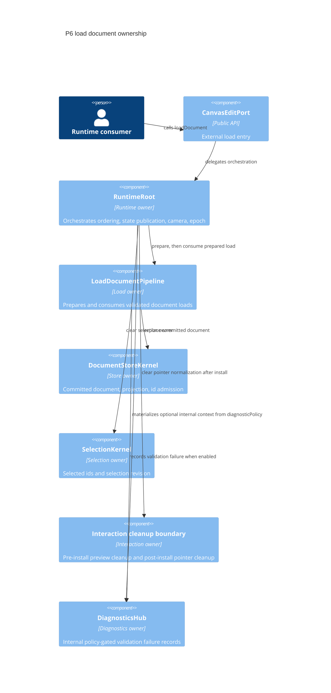
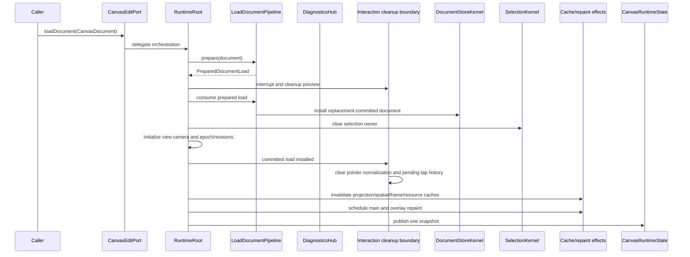
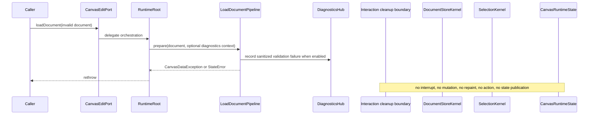

# Design: P6 Load Document

---
date: 2026-05-26
designer: Codex
commit: 324a1193
branch: new-architecture
design_question: "Use Research: P6 Load Document Current State and produce an architecturally clean design through architecture-design-workflow."
---

## Disposition

READY_FOR_CONTRACT

## Product Outcome

P6 should make full document loading reliable for users: a valid replacement
document appears as one committed runtime change, while invalid input leaves the
current document, selection, camera, preview, gesture state, and notifications
unchanged. This design does not implement P6, update the roadmap, or edit durable
architecture docs; it locks the form for a future Change Contract.

## Target Contract Classification

- Profile: BEHAVIOR_CHANGE
- Obligations: SEAM_MIGRATION, PUBLIC_API_CHANGE

## Research Inputs

- `.research/2026-05-26-p6-load-document-current-state.md` - confirms the
  current P6 placeholders, existing P5 edit path, P6 contracts, relevant
  guardrails, and missing P6 staged-load tests.

## Repository Evidence

- `docs/implementation/p6_load_document.md:5` - P6 purpose is staged,
  validated, atomic full document replacement.
- `docs/implementation/p6_load_document.md:10` - P6 build scope includes
  `PreparedDocumentLoad`.
- `docs/implementation/p6_load_document.md:12` - P6 build scope includes
  `CanvasEditPort.loadDocument`.
- `docs/implementation/p6_load_document.md:13` - P6 build scope includes
  `CanvasEdit.replaceDraftDocument`.
- `docs/implementation/p6_load_document.md:14` - the success path validates and
  materializes before interaction interruption.
- `docs/implementation/p6_load_document.md:21` - the failure path leaves
  committed document, selection, preview, pointer normalization, repaint, events,
  and active gesture state unchanged.
- `docs/implementation/p6_load_document.md:24` - replacement uses one atomic
  runtime/applier boundary and selection clear is a selection-owner effect.
- `docs/implementation/p6_load_document.md:45` - donor ownership targets
  `DocumentStoreKernel`, `SelectionKernel`, and `EditKernel` helpers.
- `docs/implementation/p6_load_document.md:46` - the interaction mutation
  boundary is adapted into an interaction-owned bridge into `EditKernel`.
- `docs/implementation/p6_load_document.md:47` - staged load runtime
  materialization targets load-document staged materialization.
- `docs/implementation/p6_load_document.md:52` - scene-controller facades are a
  forbidden donor structure.
- `docs/implementation/p6_load_document.md:90` - exit gates require staged-load
  tests to pass.
- `docs/implementation/p6_load_document.md:94` - successful load must interrupt
  before install and publish one atomic `CanvasRuntimeState`.
- `docs/implementation/p6_load_document.md:97` - `replaceDraftDocument` must be
  rollback-safe inside an edit session.
- `docs/implementation/p6_load_document.md:102` - interrupting before
  validation would destroy user state on bad input.
- `docs/implementation/p6_load_document.md:104` - implementing load as a normal
  edit sequence would risk split selection, epoch, cache, and projection
  updates.
- `docs/contracts/load_document.md:36` - `CanvasEditPort.loadDocument(document)`
  is the next public external document replacement operation.
- `docs/contracts/load_document.md:38` - the public API delegates orchestration
  to `RuntimeRoot`.
- `docs/contracts/load_document.md:39` - the public API must not directly read
  from or install into `DocumentStoreKernel`.
- `docs/contracts/load_document.md:45` - P6 owns only the minimal early
  interaction boundary needed by staged replacement.
- `docs/contracts/load_document.md:49` - `PreparedDocumentLoad success` precedes
  runtime interrupt and preview cleanup.
- `docs/contracts/load_document.md:53` - the interaction cleanup boundary must
  not mutate `DocumentStoreKernel`.
- `docs/contracts/load_document.md:55` - failure before prepared-load success
  must not call the interaction boundary.
- `docs/contracts/load_document.md:61` - the staged-load success ordering begins.
- `docs/contracts/load_document.md:64` - success validates the public
  `CanvasDocument`, metadata, frozen ownership, and invertible transforms.
- `docs/contracts/load_document.md:65` - success materializes
  `PreparedDocumentLoad`.
- `docs/contracts/load_document.md:66` - only successful
  validation/materialization interrupts active interaction.
- `docs/contracts/load_document.md:68` - replacement document install and
  selection clear are atomic through the runtime/applier boundary.
- `docs/contracts/load_document.md:70` - runtime view camera initializes from the
  persisted document camera.
- `docs/contracts/load_document.md:71` - success increments epoch, document,
  selection, view-camera, and optional preview revisions.
- `docs/contracts/load_document.md:76` - success invalidates projection, spatial,
  frame, and resource caches.
- `docs/contracts/load_document.md:78` - success publishes one
  `CanvasRuntimeState` after install.
- `docs/diagrams/seq_load_document_success.mmd:63` - the durable success
  sequence notifies interaction after committed load install.
- `docs/diagrams/seq_load_document_success.mmd:64` - post-install interaction
  cleanup clears pointer normalization and pending tap history.
- `docs/diagrams/dfd_load_document_success_failure.mmd:81` - the durable data
  flow sends the atomic runtime result to post-install cleanup only after
  install.
- `docs/diagrams/dfd_load_document_success_failure.mmd:82` - pending input is
  cleared after atomic install.
- `docs/contracts/load_document.md:81` - `PreparedDocumentLoad` owns replacement
  committed tables, generated id admission state, and replacement revision facts.
- `docs/contracts/load_document.md:90` - the failure ordering begins.
- `docs/contracts/load_document.md:93` - validation/materialization failure
  includes invalid metadata, mutable DTO boundary input, and non-invertible
  element transform input.
- `docs/contracts/load_document.md:94` - failure does not interrupt active
  gesture state.
- `docs/contracts/load_document.md:98` - failure leaves the committed document
  owner unchanged.
- `docs/contracts/load_document.md:99` - failure leaves the selection owner
  unchanged.
- `docs/contracts/load_document.md:102` - failure publishes no public state.
- `docs/contracts/load_document.md:107` - `CanvasEdit.replaceDraftDocument` is
  different from external `loadDocument`.
- `docs/contracts/load_document.md:110` - `replaceDraftDocument` is only valid
  inside an edit callback.
- `docs/contracts/load_document.md:112` - `replaceDraftDocument` must be
  rollback-safe.
- `docs/contracts/load_document.md:113` - `replaceDraftDocument` participates in
  the same atomic edit session.
- `docs/contracts/operation_matrix.md:44` - P5 closes edit-owned rows and the
  generic executable effect shape.
- `docs/contracts/operation_matrix.md:48` - P6 closes `loadDocument`
  success/failure rows.
- `docs/contracts/operation_matrix.md:49` - P6 owns
  `CanvasEdit.replaceDraftDocument` success/failure behavior.
- `docs/contracts/operation_matrix.md:81` - `loadDocument success` touches whole
  document, selection-owner clear, preview cleanup, runtime view camera, epoch,
  cache invalidation, and main plus overlay repaint.
- `docs/contracts/operation_matrix.md:82` - `loadDocument failure` has no state,
  revision, spatial, projection, repaint, or event effects.
- `docs/contracts/operation_matrix.md:83` - `replaceDraftDocument` replaces the
  whole draft, clears selection when needed, rebuilds spatial state, evicts
  projection, repaints main, and emits no event.
- `docs/contracts/diagnostics.md:31` - `DiagnosticsHub` is internal.
- `docs/contracts/public_api_v1.md:489` - public runtime config includes
  `diagnosticPolicy`.
- `docs/contracts/public_api_v1.md:2503` - application code may read or
  pattern-match `CanvasRuntimeConfig.diagnosticPolicy`.
- `docs/contracts/public_api_v1.md:2510` - diagnostic context remains internal
  to `DiagnosticsHub` or projected only through approved public surfaces.
- `docs/contracts/edit_kernel.md:91` - `CommitApplyResult` is the
  runtime/applier seam after document and selection effects install.
- `docs/contracts/edit_kernel.md:99` - `EditKernel` closes and stales the active
  edit handle before `RuntimeRoot` consumes the accepted apply result.
- `docs/contracts/edit_kernel.md:101` - `RuntimeRoot` publishes public state
  before invoking the internal synchronous observer seam.
- `docs/contracts/edit_kernel.md:114` - public runtime mutations attempted
  during observer delivery are rejected.
- `docs/contracts/edit_kernel.md:141` - rollback keeps committed document
  identity unchanged.
- `docs/contracts/edit_kernel.md:146` - rollback keeps the selection owner
  unchanged.
- `docs/contracts/edit_kernel.md:150` - rollback performs no public
  `CanvasRuntimeState` publication.
- `docs/architecture/03_data_model.md:112` - runtime view camera is not stored
  in `CommittedDocument`.
- `docs/architecture/03_data_model.md:113` - runtime view camera is owned by
  `RuntimeRoot` through the camera boundary.
- `docs/architecture/03_data_model.md:114` - construction and `loadDocument`
  initialize runtime view camera from the persisted camera offset.
- `docs/architecture/03_data_model.md:121` - `documentRevision` changes for any
  committed document state change.
- `docs/architecture/03_data_model.md:122` - controller epoch changes for
  `loadDocument` success or full document replacement.
- `docs/architecture/architecture_graph.yaml:36` - P6 is `Load document`.
- `docs/architecture/architecture_graph.yaml:38` - P6 is currently future.
- `docs/architecture/architecture_graph.yaml:288` - the graph declares the
  future `load_document.pipeline` node.
- `docs/architecture/architecture_graph.yaml:291` - the pipeline owner is
  `load_document`.
- `docs/architecture/architecture_graph.yaml:292` - the pipeline is introduced
  in P6.
- `docs/architecture/architecture_graph.yaml:303` - expected declaration is
  `LoadDocumentPipeline`.
- `docs/architecture/architecture_graph.yaml:588` - the graph declares the
  future load-document to store mutation boundary edge.
- `docs/architecture/architecture_graph.yaml:590` - that edge targets
  `store.document_kernel`.
- `docs/architecture/architecture_graph.yaml:597` - the graph says load
  document admits validated documents into runtime state.
- `docs/architecture/architecture_graph.yaml:599` - the graph expects the load
  pipeline's actual composition field to include `DocumentStoreKernel`.
- `docs/contracts/cache_policy.md:42` - `DocumentProjectionCache` is store-owned
  and invalidated by document/projection change.
- `docs/contracts/cache_policy.md:52` - `PreviewStateSnapshot` is
  interaction-owned and invalidated by pointer, tool, load, mode, or dispose.
- `lib/src/api/canvas_runtime.dart:41` - public `CanvasRuntime.edits` delegates
  to `RuntimeRoot.edits`.
- `lib/src/api/canvas_runtime.dart:45` - public camera operations use the
  runtime camera port.
- `lib/src/api/canvas_runtime.dart:47` - public preview is still unimplemented.
- `lib/src/api/canvas_runtime.dart:175` - `CanvasEditPort` declares `edit`.
- `lib/src/api/canvas_runtime.dart:176` - `CanvasEditPort` declares
  `loadDocument`.
- `lib/src/api/canvas_runtime.dart:202` - `CanvasEdit` declares
  `replaceDraftDocument`.
- `lib/src/edit/edit_kernel.dart:40` - `EditKernel.edit` is the synchronous edit
  session entry point.
- `lib/src/edit/edit_kernel.dart:42` - nested edit sessions are rejected.
- `lib/src/edit/edit_kernel.dart:56` - async edit callback results are rejected.
- `lib/src/edit/edit_kernel.dart:61` - accepted edit sessions compile a
  `CommitPlan`.
- `lib/src/edit/edit_kernel.dart:63` - changed plans install the committed
  document through the kernel install seam.
- `lib/src/edit/edit_kernel.dart:67` - the edit session is closed before
  delivery.
- `lib/src/edit/edit_kernel.dart:79` - current `loadDocument` only checks
  runtime activity before throwing.
- `lib/src/edit/edit_kernel.dart:81` - current `loadDocument` throws the P6
  placeholder `UnsupportedError`.
- `lib/src/edit/edit_session.dart:126` - current `replaceDraftDocument` checks
  handle activity before throwing.
- `lib/src/edit/edit_session.dart:128` - current `replaceDraftDocument` throws
  the P6 placeholder `UnsupportedError`.
- `lib/src/runtime/runtime_root.dart:38` - `RuntimeRoot` creates
  `DocumentStoreKernel` from the initial document.
- `lib/src/runtime/runtime_root.dart:40` - `RuntimeRoot` initializes view camera
  from the initial document camera.
- `lib/src/runtime/runtime_root.dart:52` - `RuntimeRoot` creates
  `SelectionKernel`.
- `lib/src/runtime/runtime_root.dart:55` - `RuntimeRoot` owns the state notifier.
- `lib/src/runtime/runtime_root.dart:67` - `RuntimeRoot` owns
  `CommitApplier`.
- `lib/src/runtime/runtime_root.dart:71` - `RuntimeRoot` creates `EditKernel`.
- `lib/src/runtime/runtime_root.dart:79` - `EditKernel` installs commits through
  `_applyEditCommit`.
- `lib/src/runtime/runtime_root.dart:80` - `EditKernel` delivers accepted apply
  results through `_deliverEditCommitResult`.
- `lib/src/runtime/runtime_root.dart:264` - runtime view-camera mutation starts
  in `RuntimeRoot.setCameraOffset`.
- `lib/src/runtime/runtime_root.dart:271` - runtime view-camera mutation replaces
  `_viewCamera`.
- `lib/src/runtime/runtime_root.dart:272` - runtime view-camera mutation
  increments `_viewCameraRevision`.
- `lib/src/runtime/runtime_root.dart:329` - runtime state publication assigns
  the notifier value.
- `lib/src/runtime/runtime_root.dart:337` - edit commit application enters the
  `CommitApplier`.
- `lib/src/runtime/runtime_root.dart:341` - edit commit document install uses
  `_store.installDocument`.
- `lib/src/runtime/runtime_root.dart:342` - edit commit selection install uses
  `_selection.pruneSelection`.
- `lib/src/runtime/runtime_root.dart:346` - accepted apply-result delivery
  begins.
- `lib/src/runtime/runtime_root.dart:349` - delivery publishes state when
  required.
- `lib/src/runtime/runtime_root.dart:352` - delivery invokes the commit-effect
  observer after publication.
- `lib/src/runtime/runtime_root.dart:377` - public runtime state document
  revision comes from the store.
- `lib/src/runtime/runtime_root.dart:378` - public runtime state selection
  revision comes from the selection owner.
- `lib/src/runtime/runtime_root.dart:379` - preview revision is currently
  hard-coded to zero.
- `lib/src/runtime/runtime_root.dart:380` - view-camera revision comes from
  `_viewCameraRevision`.
- `lib/src/runtime/runtime_root.dart:383` - epoch revision is currently
  hard-coded to zero.
- `lib/src/edit/commit_applier.dart:22` - `CommitApplier.apply` is the current
  atomic apply entry.
- `lib/src/edit/commit_applier.dart:32` - `CommitApplier` installs the document
  before selection effects.
- `lib/src/edit/commit_applier.dart:33` - `CommitApplier` then installs selection
  effects.
- `lib/src/edit/commit_applier.dart:37` - publication depends on document or
  selection changes.
- `lib/src/store/document_store_kernel.dart:19` - `DocumentStoreKernel` is the
  single owner for committed document facts, read projection, id admission, and
  selection normalization inputs.
- `lib/src/store/document_store_kernel.dart:40` - committed document storage is
  private to `DocumentStoreKernel`.
- `lib/src/store/document_store_kernel.dart:41` - projection cache is private to
  `DocumentStoreKernel`.
- `lib/src/store/document_store_kernel.dart:46` - document readback uses the
  projection cache.
- `lib/src/store/document_store_kernel.dart:125` - current document install
  accepts a `CanvasDocument` and `StoreRevisionDelta`.
- `lib/src/store/document_store_kernel.dart:129` - current install replaces the
  committed document.
- `lib/src/store/document_store_kernel.dart:133` - install admits replacement
  element ids.
- `lib/src/store/document_store_kernel.dart:134` - install admits replacement
  layer ids.
- `lib/src/store/document_store_kernel.dart:135` - install admits replacement
  resource ids.
- `lib/src/codec/validated_import_draft.dart:9` - `ValidatedImportDraft`
  declaration exists.
- `lib/src/codec/validated_import_draft.dart:10` - import draft materializes from
  a `CanvasDocument`.
- `lib/src/codec/validated_import_draft.dart:12` - import-draft validation
  accepts an optional `DiagnosticsHub`.
- `lib/src/codec/validated_import_draft.dart:20` - the import draft stores the
  public document.
- `lib/src/codec/validated_import_draft.dart:31` - validation rejects duplicate
  resource ids.
- `lib/src/codec/validated_import_draft.dart:52` - validation rejects duplicate
  layer ids.
- `lib/src/codec/validated_import_draft.dart:75` - validation rejects duplicate
  element ids.
- `lib/src/codec/validated_import_draft.dart:85` - validation rejects missing
  image resource references.
- `lib/src/diagnostics/diagnostics_hub.dart:19` - `DiagnosticsHub` is the
  internal diagnostics recorder.
- `lib/src/diagnostics/diagnostics_hub.dart:25` - disabled diagnostics are a
  no-record path.
- `lib/src/diagnostics/diagnostics_hub.dart:29` - diagnostics recording enters
  through `DiagnosticsHub.record`.
- `lib/src/codec/schema_v1_diagnostics.dart:4` - schema validation failures are
  routed through `recordSchemaV1FailureDiagnostic`.
- `lib/src/codec/schema_v1_diagnostics.dart:14` - absent diagnostics hub returns
  the original exception without recording.
- `lib/src/codec/schema_v1_diagnostics.dart:18` - present diagnostics hub records
  validation failure diagnostics.
- `lib/src/runtime/runtime_config.dart:14` - runtime config materializes
  diagnostics from public `CanvasRuntimeConfig.diagnosticPolicy`.
- `test/runtime/fixtures/commit_effect_observer_fixture.dart:73` - observer
  delivery asserts install and publication occurred before observer work.
- `test/runtime/fixtures/commit_effect_observer_fixture.dart:77` - the state
  listener records synchronous publication callbacks.
- `test/runtime/fixtures/commit_effect_observer_fixture.dart:81` - the state
  listener verifies guarded public mutations during publication.
- `test/runtime/fixtures/commit_effect_observer_fixture.dart:96` - observer
  delivery verifies guarded public mutations.
- `test/runtime/fixtures/commit_effect_observer_fixture.dart:102` - the guard
  includes `root.edits.loadDocument(CanvasDocument())`.

## Design Form Candidates

### Candidate A. Runtime-Orchestrated LoadDocumentPipeline

- Form: create the P6 `LoadDocumentPipeline` as the load-document owner that
  prepares a replacement payload before side effects, then lets `RuntimeRoot`
  orchestrate success-only interaction cleanup, atomic document/selection/camera
  install, revision increments, cache/effect output, and single state
  publication.
- Why it could work: it matches the architecture graph owner
  (`docs/architecture/architecture_graph.yaml:288`,
  `docs/architecture/architecture_graph.yaml:291`,
  `docs/architecture/architecture_graph.yaml:303`), the load contract's
  `RuntimeRoot` orchestration rule (`docs/contracts/load_document.md:38`), the
  P6 requirement for preparation before interaction interruption
  (`docs/contracts/load_document.md:64`, `docs/contracts/load_document.md:66`),
  and the existing runtime/applier seam for document plus selection install
  (`docs/contracts/edit_kernel.md:91`, `lib/src/runtime/runtime_root.dart:337`).
- Gate failures or risks: requires extending the current apply result/revision
  path to carry epoch, view-camera, preview cleanup, and load-specific effects;
  this is expected P6 behavior because those revisions are currently hard-coded
  or runtime-owned (`lib/src/runtime/runtime_root.dart:379`,
  `lib/src/runtime/runtime_root.dart:380`,
  `lib/src/runtime/runtime_root.dart:383`).

### Candidate B. Treat External Load as a Normal Edit Session

- Form: implement `CanvasEditPort.loadDocument` by opening an edit session and
  calling `CanvasEdit.replaceDraftDocument`.
- Why it could work: it would reuse the existing synchronous edit session,
  rollback, commit-plan, and delivery path (`lib/src/edit/edit_kernel.dart:40`,
  `lib/src/edit/edit_kernel.dart:61`, `lib/src/runtime/runtime_root.dart:346`).
- Gate failures or risks: the P6 implementation guide explicitly says normal
  edit sequencing risks separate selection, epoch, cache, and projection updates
  (`docs/implementation/p6_load_document.md:104`); external load also has
  success-only interaction interruption and preview cleanup that
  `replaceDraftDocument` must not own (`docs/contracts/load_document.md:107`,
  `docs/contracts/load_document.md:110`). This fails root-cause and boundary
  gates for external load.

### Candidate C. Store-Owned Replacement Install

- Form: put prepared replacement and atomic install behavior primarily in
  `DocumentStoreKernel`, with runtime calling a broad store replacement API.
- Why it could work: `DocumentStoreKernel` already owns committed document,
  projection, id admission, and replacement install of a committed document
  (`lib/src/store/document_store_kernel.dart:19`,
  `lib/src/store/document_store_kernel.dart:125`,
  `lib/src/store/document_store_kernel.dart:129`).
- Gate failures or risks: the load contract says the public API delegates
  orchestration to `RuntimeRoot`, not direct store install
  (`docs/contracts/load_document.md:38`, `docs/contracts/load_document.md:39`);
  selection clear, view-camera initialization, epoch, preview cleanup, repaint,
  and state publication cross owners that the store must not own
  (`docs/contracts/load_document.md:68`, `docs/contracts/load_document.md:70`,
  `docs/contracts/load_document.md:71`). This fails ownership, source-of-truth,
  and state/data gates.

### Candidate D. Interaction-Owned Staged Load Bridge

- Form: route load success through an interaction mutation bridge that performs
  document replacement after interrupting the active gesture.
- Why it could work: P6 has an interaction mutation boundary donor and the
  success path needs interaction interruption (`docs/implementation/p6_load_document.md:46`,
  `docs/contracts/load_document.md:66`).
- Gate failures or risks: P6 owns only the minimal early interaction cleanup
  boundary; that boundary must not mutate `DocumentStoreKernel`
  (`docs/contracts/load_document.md:45`, `docs/contracts/load_document.md:53`).
  Full interaction state machines remain P10-P12-owned
  (`docs/contracts/load_document.md:58`). This fails ownership and dependency
  direction gates if it owns replacement.

## Known Future Pressures

| Pressure | Evidence | How the selected form responds | Accepted cost or risk |
|---|---|---|---|
| P10-P12 interaction features will consume load interrupt ordering but are not P6 prerequisites. | `docs/contracts/load_document.md:58`; `docs/implementation/p10_selection_and_move.md:47` | Keeps P6 interaction scope to a narrow success-only cleanup boundary, with no full pointer-session implementation. | P6 may need a placeholder or minimal internal cleanup adapter that later phases extend without changing load ordering. |
| P7 resources and P9 frame/render caches must react to load invalidation later. | `docs/contracts/load_document.md:76`; `docs/contracts/cache_policy.md:42`; `docs/contracts/cache_policy.md:52` | Emits load-specific typed invalidation/repaint facts from the atomic runtime result instead of requiring those later owners to inspect store state directly. | Some P6 effects will be consumed by future owners; tests must prove shape and delivery even where later owners are still absent. |
| The architecture graph already expects a P6 `LoadDocumentPipeline`. | `docs/architecture/architecture_graph.yaml:288`; `docs/architecture/architecture_graph.yaml:303` | Selects that owner rather than hiding the behavior in `EditKernel`, `RuntimeRoot`, or `DocumentStoreKernel`. | A future contract must update graph status and P6 closure proof when the declaration lands. |
| Public `preview` and epoch revisions are not yet runtime-owned mutable counters. | `lib/src/api/canvas_runtime.dart:47`; `lib/src/runtime/runtime_root.dart:379`; `lib/src/runtime/runtime_root.dart:383`; `docs/contracts/load_document.md:71` | Makes `RuntimeRoot` the revision coordinator for load-owned preview cleanup and epoch publication without moving preview or interaction state into the store. | P6 must add narrowly scoped revision state or apply-result fields; broad preview implementation stays deferred. |
| `replaceDraftDocument` must become executable without proving external load behavior by accident. | `docs/contracts/load_document.md:107`; `docs/contracts/load_document.md:114`; `docs/contracts/operation_matrix.md:49`; `docs/contracts/operation_matrix.md:83` | Implements draft replacement inside the edit transaction path, but shares prepared-document validation/materialization helpers with external load. | Future tests must separately prove external load success/failure and draft replacement rollback. |
| Validation diagnostics must not be lost when load validation moves out of schema decoding. | `lib/src/codec/validated_import_draft.dart:12`; `lib/src/diagnostics/diagnostics_hub.dart:19`; `lib/src/runtime/runtime_config.dart:14`; `docs/contracts/public_api_v1.md:489` | Threads the existing internal diagnostics hub through P6 preparation/materialization when runtime diagnostics are enabled, while keeping exception semantics unchanged. | The pipeline must accept optional diagnostics context without making diagnostics a public load payload or a second validation source of truth. |

## Selected Form

Use Candidate A: a P6 `LoadDocumentPipeline` with `RuntimeRoot` orchestration.

The future implementation should split preparation from commitment:

1. `CanvasEditPort.loadDocument(document)` remains the public external entry and
   delegates into `EditKernel`/runtime-owned P6 orchestration rather than
   directly touching the store.
2. `LoadDocumentPipeline` is composed with `DocumentStoreKernel` as the graph
   expects, but `RuntimeRoot` remains the orchestrator that decides when the
   pipeline may prepare or consume a prepared load.
3. `LoadDocumentPipeline.prepare(document)` validates the public
   `CanvasDocument`, consumes the existing import-draft validation facts, and
   creates a `PreparedDocumentLoad` with committed replacement materialization,
   id-admission facts, and replacement revision facts before any runtime or
   interaction side effect. Preparation must accept the runtime's optional
   internal diagnostics context materialized from
   `CanvasRuntimeConfig.diagnosticPolicy` and route validation failures through
   existing `DiagnosticsHub` helpers when diagnostics are enabled; disabled
   diagnostics pass no effective recording surface. Diagnostics recording must
   not change the thrown `CanvasDataException` or `StateError`.
4. After preparation succeeds, `RuntimeRoot` calls only the minimal interaction
   cleanup boundary allowed by the load contract, then asks the pipeline to
   consume the prepared load through the graph-backed store mutation boundary.
   RuntimeRoot combines that store replacement with selection-owner clear,
   runtime view-camera initialization, epoch and revision increments, and the
   post-install pointer-normalization/pending-tap cleanup before cache/effect
   invalidation, repaint effects, and one public state publication.
5. `CanvasEdit.replaceDraftDocument(document)` becomes an edit-session mutation:
   it uses the same validation/materialization helper but does not interrupt
   interaction or clear preview, and it stays rollback-safe by affecting only the
   draft until the edit callback successfully compiles and applies.

This form fixes the root cause at the load-document owner while preserving
existing owner boundaries: store owns committed document/projection/id admission,
selection owns selected ids, runtime owns view camera/state publication/epoch,
interaction owns preview cleanup, and edit owns transaction rollback.

## Hard Gate Check

| Gate | Result | Evidence |
|---|---|---|
| Root cause | pass | P6 is explicitly about staged, validated, atomic replacement: `docs/implementation/p6_load_document.md:5`; validation before interruption avoids destroying user state on bad input: `docs/implementation/p6_load_document.md:102`; the selected form prepares before side effects and commits once. |
| Ownership | pass | The graph names `load_document.pipeline` with owner `load_document`: `docs/architecture/architecture_graph.yaml:288`, `docs/architecture/architecture_graph.yaml:291`; the graph also expects the pipeline to compose `DocumentStoreKernel` for the replacement mutation boundary: `docs/architecture/architecture_graph.yaml:588`, `docs/architecture/architecture_graph.yaml:599`; `RuntimeRoot` owns orchestration: `docs/contracts/load_document.md:38`; store, selection, runtime camera, and interaction cleanup retain their own responsibilities: `lib/src/store/document_store_kernel.dart:19`, `docs/architecture/03_data_model.md:113`, `docs/contracts/load_document.md:45`. |
| Source of truth | pass | Committed document stays private to `DocumentStoreKernel`: `lib/src/store/document_store_kernel.dart:40`; selection owner stays separate: `docs/contracts/load_document.md:42`; runtime view camera stays runtime-owned, not store-owned: `docs/architecture/03_data_model.md:112`; prepared payload is consumed once as handoff data, not a second durable document source. |
| Boundary | pass | Public load is `CanvasEditPort.loadDocument`: `lib/src/api/canvas_runtime.dart:176`; external load delegates from public runtime to root/edit port: `lib/src/api/canvas_runtime.dart:41`; success crosses the interaction cleanup boundary only after `PreparedDocumentLoad`: `docs/contracts/load_document.md:49`, `docs/contracts/load_document.md:55`; atomic install crosses the runtime/applier boundary: `docs/contracts/load_document.md:68`. |
| Dependency direction | pass | Public API delegates inward to `RuntimeRoot`: `lib/src/api/canvas_runtime.dart:41`; runtime composes store, selection, commit applier, and edit kernel: `lib/src/runtime/runtime_root.dart:38`, `lib/src/runtime/runtime_root.dart:52`, `lib/src/runtime/runtime_root.dart:67`, `lib/src/runtime/runtime_root.dart:71`; the selected form adds the P6 owner and graph-required store mutation edge instead of reversing store or interaction dependencies: `docs/architecture/architecture_graph.yaml:288`, `docs/architecture/architecture_graph.yaml:588`. |
| State/data | pass | Store owns document/projection/id admission: `lib/src/store/document_store_kernel.dart:19`; selection revisions come from selection facts: `lib/src/runtime/runtime_root.dart:378`; view-camera revision is runtime state: `lib/src/runtime/runtime_root.dart:380`; epoch and preview revisions are currently missing mutable runtime state and must be added at runtime orchestration: `lib/src/runtime/runtime_root.dart:379`, `lib/src/runtime/runtime_root.dart:383`. |
| Seam | pass | The existing runtime/applier seam is `CommitApplyResult`: `docs/contracts/edit_kernel.md:91`; P6 adds a load-specific prepared seam (`PreparedDocumentLoad`) and graph-backed owner (`LoadDocumentPipeline`) rather than retiring the edit seam: `docs/contracts/load_document.md:81`, `docs/architecture/architecture_graph.yaml:303`. Draft replacement adopts shared preparation helpers but remains in the edit-session seam: `docs/contracts/load_document.md:110`, `docs/contracts/load_document.md:113`. |
| Temporal/reentrancy | pass | Failure must not call the interaction boundary before preparation succeeds: `docs/contracts/load_document.md:55`; success publishes one state after install: `docs/contracts/load_document.md:78`; `RuntimeRoot` already keeps the delivery guard active across synchronous state publication and commit-effect observer delivery: `lib/src/runtime/runtime_root.dart:346`, `lib/src/runtime/runtime_root.dart:347`, `lib/src/runtime/runtime_root.dart:349`, `lib/src/runtime/runtime_root.dart:352`, `lib/src/runtime/runtime_root.dart:359`; the fixture verifies guarded public mutations during the state listener and observer windows, including `loadDocument`: `test/runtime/fixtures/commit_effect_observer_fixture.dart:77`, `test/runtime/fixtures/commit_effect_observer_fixture.dart:81`, `test/runtime/fixtures/commit_effect_observer_fixture.dart:96`, `test/runtime/fixtures/commit_effect_observer_fixture.dart:102`. |
| Observability | pass | Diagnostics remain internal to `DiagnosticsHub`: `docs/contracts/diagnostics.md:31`; runtime config carries `diagnosticPolicy`: `lib/src/api/canvas_runtime.dart:67`; validation can accept optional diagnostics: `lib/src/codec/validated_import_draft.dart:12`; absent diagnostics must preserve exception behavior without recording: `lib/src/codec/schema_v1_diagnostics.dart:14`. |
| Verification | pass | P6 docs name staged-load and state-publication tests: `docs/implementation/p6_load_document.md:77`, `docs/implementation/p6_load_document.md:78`; exit gates require success/failure proof and operation-matrix closure: `docs/implementation/p6_load_document.md:90`, `docs/implementation/p6_load_document.md:98`; graph closure can prove `LoadDocumentPipeline`: `docs/architecture/architecture_graph.yaml:303`; diagnostics routing tests should cover enabled and disabled policies. |
| Future pressure | pass | Future interaction, resource, frame/cache, graph, preview/epoch, and draft replacement pressures are named above and are absorbed by keeping one load owner plus narrow owner-specific boundaries. |

## Lock-Required Facts

- Owner: `load_document.pipeline` / future `LoadDocumentPipeline` owns P6
  preparation, replacement payload creation, and the graph-backed store
  replacement mutation boundary under `RuntimeRoot` orchestration.
- Owning layer/module/document family: runtime/edit internal implementation,
  with source-of-truth contract family `docs/contracts/load_document.md`,
  `docs/contracts/edit_kernel.md`, and `docs/contracts/operation_matrix.md`.
- Seam: `PreparedDocumentLoad` is the pre-side-effect prepared payload;
  `LoadDocumentPipeline` consumes it once to replace the store document through
  its `DocumentStoreKernel` composition field; the runtime/applier result is the
  atomic post-preparation cross-owner install and publication seam.
- Dependency/import direction: public API -> `RuntimeRoot`/edit port ->
  `LoadDocumentPipeline` preparation -> success-only interaction cleanup ->
  `LoadDocumentPipeline` store replacement plus runtime/applier selection clear
  -> runtime camera/revision state -> post-install pointer normalization and
  pending tap cleanup -> cache/effect/repaint/publication.
- State/data ownership: committed document/projection/id admission remain store
  state; selected ids and selection revision remain selection state; runtime
  view camera and epoch remain runtime state; preview cleanup remains interaction
  state; prepared load is transient handoff data; diagnostics records remain
  internal `DiagnosticsHub` state and are not part of the prepared load's public
  payload.
- Entry boundaries: `CanvasEditPort.loadDocument(CanvasDocument)` for external
  replacement and `CanvasEdit.replaceDraftDocument(CanvasDocument)` for draft
  replacement.
- Exit boundaries: one public `CanvasRuntimeState` publication after successful
  external install; no publication, repaint, action, interruption, or mutation on
  failed external preparation.
- File placement basis: future `LoadDocumentPipeline` belongs under the internal
  load-document owner and is composed by runtime with `DocumentStoreKernel`; it
  does not belong under public API, interaction, or a legacy scene-controller
  facade. `PreparedDocumentLoad` belongs with that pipeline or a focused
  companion file because it is consumed as its handoff payload.
- Execution order constraints: validate/materialize -> interrupt/preview cleanup
  -> atomic install and selection clear -> view-camera/epoch/revision updates ->
  post-install pointer normalization and pending tap cleanup -> cache/effect
  invalidation -> repaint scheduling -> one state publication; on preparation
  failure, none of those side effects run.
- Diagnostics constraints: load preparation must thread optional internal
  diagnostics context from runtime configuration into validation/materialization
  helpers. Diagnostics must be best-effort observation only: disabled diagnostics
  allocate/record nothing, enabled diagnostics record sanitized validation
  failures, and public failure semantics remain `CanvasDataException` or
  `StateError` with no load side effects.
- Reentrancy constraints: `RuntimeRoot` owns the load delivery guard. The guard
  must be active before the public `CanvasRuntimeState` value is assigned, remain
  active through synchronous state listeners and any post-publication effect
  observer delivery, and clear only after those callback surfaces return. Public
  runtime mutations attempted from either callback surface must reject before any
  second load, edit, selection, camera, id generation, dispose, or publication
  begins. Allowed public observation order is installed committed state, one
  state listener snapshot, then post-publication effects/observer work, then
  return to the original public caller.
- Rejected alternatives: external load as normal edit session; store-owned broad
  replacement; interaction-owned document replacement.
- Verification strategy: behavior tests for load success/failure and draft
  replacement rollback, operation-matrix tests for effect/revision rows,
  observer/reentrancy tests for delivery windows, guardrails for owner
  boundaries, architecture graph P6 closure for the new owner and mutation edge,
  and documentation checks only when future docs are updated.

## Diagram Need Assessment

| Design question | Needed? | Diagram kind | Reason |
|---|---:|---|---|
| Does the design change ownership, layer, package, or component boundaries? | yes | c4 | Future implementation creates the graph-declared `LoadDocumentPipeline` owner and must show it between public edit/runtime orchestration and store/selection/interaction boundaries. |
| Does it change data flow, state ownership, cache ownership, resource movement, or lifecycle movement? | yes | data_flow | Prepared payload creation, one-shot consumption, split interaction cleanup, cache invalidation, and state ownership across store/selection/runtime/interaction need a flow view. |
| Does it depend on call order, lifecycle order, sync/async ordering, failure ordering, or migration order? | yes | sequence | Correctness depends on validation before interruption, post-install pointer cleanup before invalidation/repaint, and one publication after install; failure ordering must prove no side effects. |
| Does it introduce or alter modes, statuses, terminal states, sessions, or transition rules? | no | none | The selected form does not add a durable state machine; it consumes the existing runtime lifecycle and edit-session rules. |
| Does it create, replace, migrate, or retire a shared seam? | yes | sequence | It adds `PreparedDocumentLoad` as a pre-side-effect seam and extends the runtime/applier result for load replacement without retiring the edit commit seam. |
| Does it change public API consumer flow, payload shape, or compatibility behavior? | yes | sequence | Existing public placeholders become executable behavior for `loadDocument` and `replaceDraftDocument`, but public method signatures remain the same. |
| Does it introduce or change analyzer, guardrail, or structural-recognition pipeline behavior? | no | none | Future implementation should use existing guardrail patterns and P6 graph closure; this design does not define a new analyzer pipeline. |

## Provisional Diagrams

```mermaid
flowchart LR
  Policy[CanvasRuntimeConfig diagnosticPolicy] --> DiagnosticContext[Optional internal DiagnosticsHub context]
  Input[Public CanvasDocument] --> Validate[Validate DTO metadata ownership transforms and references]
  DiagnosticContext --> Validate
  Validate --> Prepared[PreparedDocumentLoad]
  Prepared --> Cleanup[Success-only interrupt and preview cleanup]
  Cleanup --> StoreReplace[LoadDocumentPipeline replaces store document]
  StoreReplace --> SelectionClear[SelectionKernel clear]
  SelectionClear --> RuntimeFacts[RuntimeRoot sets view camera epoch and revisions]
  RuntimeFacts --> PostInstallCleanup[Interaction clears pointer normalization and pending tap history]
  PostInstallCleanup --> Effects[Projection spatial frame resource invalidation and repaint effects]
  Effects --> Publication[One CanvasRuntimeState publication]

  Validate -. enabled diagnostics .-> Diagnostics[Record sanitized validation failure through DiagnosticsHub]
  Diagnostics -. observational only .-> Failure[Throw CanvasDataException or StateError]
  Validate -. disabled diagnostics or non-diagnostic failure .-> Failure
  Failure -. no side effects .-> ExistingState[Existing document selection camera preview gesture repaint actions and state remain unchanged]
```

## Source-Of-Truth Impact

A future Change Contract should update only after implementation scope is locked:

- `PLAN.md` and a P6 step document for the selected work boundary and checklist.
- `docs/implementation/p6_load_document.md` if implementation discovers a
  source-of-truth correction to the P6 phase guide.
- `docs/contracts/load_document.md`, `docs/contracts/edit_kernel.md`, and
  `docs/contracts/operation_matrix.md` only if implementation evidence requires
  contract clarification rather than code-only fulfillment.
- `docs/architecture/architecture_graph.yaml` and generated graph views to move
  `load_document.pipeline` and its mutation edge from future to implemented P6
  evidence.
- Existing load-related diagrams named by P6 docs:
  `dfd_load_document_success_failure`, `seq_load_document_success`,
  `seq_load_document_failure`, `dfd_public_edit`, `state_runtime_lifecycle`, and
  `state_edit_session`.

## Verification Impact

Future proof should include:

- Add `test/edit/staged_document_load_success_failure_test.dart` or the
  repository-equivalent focused test named by P6 docs.
- Add `test/runtime/load_document_state_publication_test.dart` or the
  repository-equivalent focused test named by P6 docs.
- Add or extend diagnostics routing coverage for P6 load preparation to prove
  enabled diagnostics record validation failures through `DiagnosticsHub`,
  disabled diagnostics do not record, and both modes preserve the same thrown
  exception and no-side-effect failure behavior.
- Extend edit rollback/stale-handle coverage to prove
  `replaceDraftDocument` rollback and stale rejection.
- Extend operation-matrix/effect tests to prove `loadDocument success`,
  `loadDocument failure`, and `CanvasEdit.replaceDraftDocument` rows.
- Extend observer/reentrancy tests to prove load cannot mutate during
  synchronous state-listener publication or post-commit observer delivery and
  cannot split publication windows.
- Run `dart analyze`, `dcm analyze .`, `dcm calculate-metrics .`, focused P6
  tests, `dart run tool/architecture_graph/check.dart --phase P6`, and
  `dart run tool/architecture_graph/generate_views.dart --phase P5 --check` for
  the future code/docs change.
- If future implementation edits docs or generated diagrams, run
  `dart run docs/tool/sync_generated_docs.dart --check` and
  `dart run docs/tool/check_docs.dart`.

## Verification Strategy

Prove behavior at the owner boundaries, not just through public smoke tests.
Preparation-failure tests must assert no interaction interruption, preview
change, committed document change, selection change, view-camera change,
publication, repaint effect, or action event. Success tests must assert exactly
one public state publication after install and cover document, selection,
view-camera, epoch, optional preview, cache/effect, and repaint facts. They must
also assert the load delivery guard covers synchronous state listeners and any
post-publication observer callbacks, with public runtime mutations rejected
before a second mutation or publication can begin. Draft replacement tests must
show rollback and no external interaction cleanup. Diagnostics tests must prove
that P6 validation failures use existing internal `DiagnosticsHub` routing when
enabled, record nothing when disabled, and never change exception type or
side-effect behavior. Structural proof must close the P6 graph owner and
mutation edge and keep store, selection, runtime, diagnostics, and interaction
boundary guardrails green.

## Change Contract Handoff

- Required profile: BEHAVIOR_CHANGE
- Required obligations: SEAM_MIGRATION, PUBLIC_API_CHANGE
- Decisions to carry forward:
  - Implement a graph-backed `LoadDocumentPipeline` owner for P6 preparation and
    the graph-required store replacement mutation boundary.
  - Compose the pipeline with `DocumentStoreKernel` as graph evidence requires,
    while keeping external `loadDocument` orchestration in `RuntimeRoot`; do not
    install from the public API or from interaction.
  - Use `PreparedDocumentLoad` as a transient pre-side-effect payload consumed
    once by `LoadDocumentPipeline` under `RuntimeRoot` orchestration.
  - Share validation/materialization helpers between external load and draft
    replacement, but keep external load side effects out of
    `replaceDraftDocument`.
  - Thread optional internal `DiagnosticsHub` context through load preparation
    and validation/materialization helpers. Do not expose diagnostics through the
    public load payload and do not let diagnostics alter failure semantics.
  - Add runtime-owned epoch and load-time view-camera publication behavior
    without moving camera or preview state into the document store.
- Evidence to cite:
  - `docs/implementation/p6_load_document.md:5`
  - `docs/implementation/p6_load_document.md:24`
  - `docs/contracts/load_document.md:36`
  - `docs/contracts/load_document.md:61`
  - `docs/contracts/load_document.md:81`
  - `docs/contracts/load_document.md:90`
  - `docs/contracts/load_document.md:107`
  - `docs/contracts/operation_matrix.md:48`
  - `docs/contracts/operation_matrix.md:81`
  - `docs/contracts/operation_matrix.md:83`
  - `docs/architecture/architecture_graph.yaml:288`
  - `docs/architecture/architecture_graph.yaml:303`
  - `docs/architecture/architecture_graph.yaml:588`
  - `docs/architecture/architecture_graph.yaml:599`
  - `docs/contracts/diagnostics.md:31`
  - `docs/contracts/public_api_v1.md:489`
  - `lib/src/codec/validated_import_draft.dart:12`
  - `lib/src/diagnostics/diagnostics_hub.dart:19`
  - `lib/src/codec/schema_v1_diagnostics.dart:14`
  - `lib/src/codec/schema_v1_diagnostics.dart:18`
  - `lib/src/edit/edit_kernel.dart:79`
  - `lib/src/edit/edit_session.dart:126`
  - `lib/src/runtime/runtime_root.dart:346`
  - `lib/src/runtime/runtime_root.dart:349`
  - `test/runtime/fixtures/commit_effect_observer_fixture.dart:77`
  - `test/runtime/fixtures/commit_effect_observer_fixture.dart:81`
  - `lib/src/runtime/runtime_root.dart:337`
  - `lib/src/store/document_store_kernel.dart:125`
- Contract constraints or sequencing facts:
  - Prepare and validate before any interaction or runtime side effect.
  - On preparation failure, rethrow `CanvasDataException` or `StateError` with
    no mutation, publication, repaint, event, or interaction cleanup.
  - Diagnostics routing is observational: enabled runtime diagnostics should
    record sanitized validation failure details through internal `DiagnosticsHub`;
    disabled diagnostics should record nothing; neither mode may change the
    thrown exception or no-side-effect guarantees.
  - On success, interaction cleanup runs before install and only after
    preparation success for interrupt/preview cleanup; pointer normalization and
    pending tap history clear after atomic install and before cache invalidation,
    repaint scheduling, or state publication.
  - Atomic install combines document replacement, selection-owner clear,
    runtime view-camera initialization, epoch/revision updates, cache/effect
    invalidation, repaint scheduling, and one public state publication.
  - `RuntimeRoot` must guard the whole load delivery window: public state
    assignment, synchronous state listeners, and post-publication observer/effect
    callbacks. The permitted observation order is installed state, one state
    listener snapshot, post-publication observer/effect callbacks, then return to
    the original caller.
  - `replaceDraftDocument` is edit-session-only, rollback-safe, and separately
    verified from external `loadDocument`.

## Open Decisions

None. The selected architecture is ready for future Change Contract authoring.
