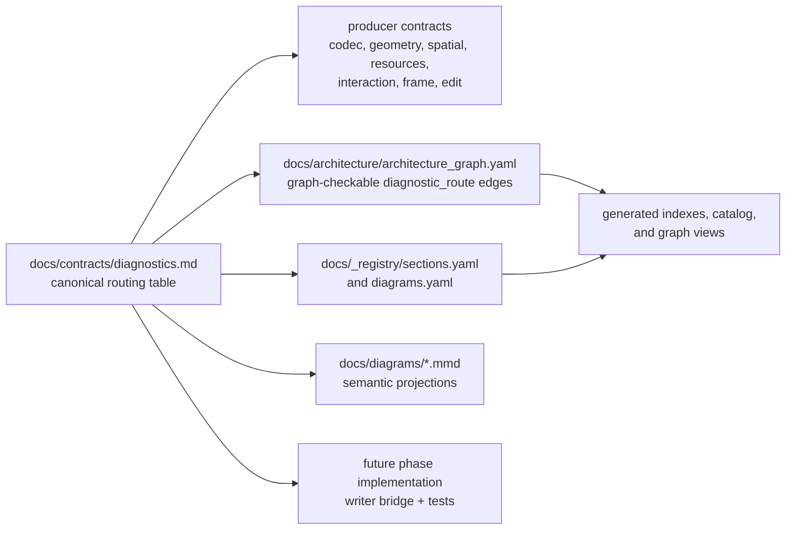
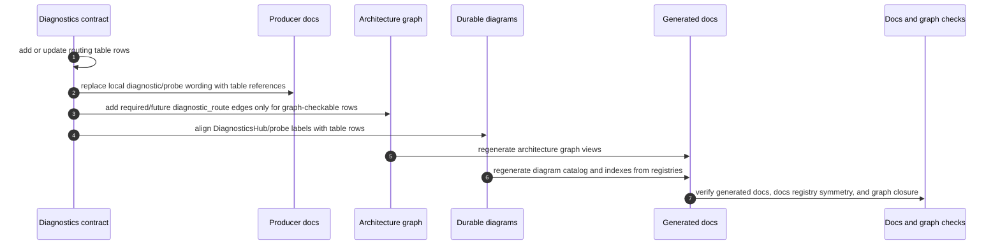

# Design: DiagnosticsHub SSOT Routing Table

---
date: 2026-05-28
designer: Codex
commit: 1f95c12e
branch: new-architecture
design_question: "Update the source-of-truth documents and diagrams so DiagnosticsHub has a clear table of who writes what, how, and when."
---

## Disposition

READY_FOR_CONTRACT

## Product Outcome

Future implementation work should have one durable, reviewable routing map for DiagnosticsHub writes. The map must make each diagnostics producer explicit, including the trigger, diagnostic source, payload shape, timing/policy gate, implementation phase or status, and required proof, so phase work does not forget where diagnostics must be connected.

Non-goals: no production code changes during this design step, no public diagnostics stream, no fake implementation claims for currently missing non-codec writers, and no edits outside `.design/` in this workflow.

## Target Contract Classification

- Profile: SOURCE_OF_TRUTH_DOCS
- Obligations: SEAM_MIGRATION

## Research Inputs

- `.research/2026-05-28-diagnostics-hub-message-routing.md` - records current production DiagnosticsHub writers, distributed diagram claims, docs/diagram drift, and the absence of a dedicated sender/message table (`.research/2026-05-28-diagnostics-hub-message-routing.md:13`, `.research/2026-05-28-diagnostics-hub-message-routing.md:15`, `.research/2026-05-28-diagnostics-hub-message-routing.md:19`, `.research/2026-05-28-diagnostics-hub-message-routing.md:127`, `.research/2026-05-28-diagnostics-hub-message-routing.md:227`).

## Repository Evidence

- `docs/README.md:21` - documentation has a "Source of truth" section for routing task work.
- `docs/README.md:23` - normative architecture is under `docs/architecture/`.
- `docs/README.md:24` - normative contracts are under `docs/contracts/`.
- `docs/README.md:27` - donor policy and evidence are under `docs/donors/`.
- `docs/README.md:28` - structured relationships are under `docs/_registry/`.
- `docs/README.md:29` - generated navigation is under `docs/indexes/` and `docs/diagrams/catalog.md`.
- `docs/contracts/diagnostics.md:29` - `section_20_diagnostics_hub` owns the DiagnosticsHub contract.
- `docs/contracts/diagnostics.md:31` - `DiagnosticsHub` is internal.
- `docs/contracts/diagnostics.md:43` - the contract documents the `DiagnosticRecord` shape.
- `docs/contracts/diagnostics.md:49` - documented `DiagnosticRecord.source` values are `codec`, `edit`, `interaction`, `frame`, `spatial`, `resource`, and `diagnostics`.
- `docs/contracts/diagnostics.md:57` - `DiagnosticRecord.source` is internal provenance only.
- `docs/contracts/diagnostics.md:70` - runtime corruption diagnostics are policy-gated internal records.
- `docs/contracts/diagnostics.md:72` - disabled diagnostics hot paths must stay branch-only with no `DiagnosticRecord` allocation or detail-string interpolation.
- `docs/contracts/diagnostics.md:78` - sanitizer permits only JSON-like primitives and bounded previews.
- `docs/contracts/public_api_v1.md:91` - the public API registry is the canonical machine-readable inventory for exported-name completeness.
- `docs/contracts/public_api_v1.md:95` - the same registry owns `diagnostics_public_surface` membership metadata.
- `docs/contracts/public_api_v1.md:2517` - v1 exports no public diagnostics stream.
- `docs/contracts/public_api_v1.md:2518` - diagnostics project through `CanvasDataException` and test-only/internal sinks.
- `docs/_registry/public_api_v1.yaml:111` - public API registry owns the `diagnostics_public_surface` group.
- `docs/_registry/sections.yaml:785` - registry entry `section_20_diagnostics_hub` points at `docs/contracts/diagnostics.md`.
- `docs/_registry/sections.yaml:800` - `section_20_diagnostics_hub` currently lists only `dfd_diagnostics_error_projection` as a related diagram.
- `docs/_registry/diagrams.yaml:253` - `dfd_diagnostics_error_projection` is the registered diagnostics data-flow diagram.
- `docs/_registry/diagrams.yaml:262` - that diagram is related to `section_06_validation_limits` and `section_20_diagnostics_hub`.
- `docs/architecture/architecture_graph.yaml:213` - the graph defines `diagnostics.hub`.
- `docs/architecture/architecture_graph.yaml:221` - `diagnostics.hub` cites `docs/contracts/diagnostics.md` as source documentation.
- `docs/architecture/architecture_graph.yaml:643` - the graph defines `codec.schema_v1.failures.report_to_diagnostics`.
- `docs/architecture/architecture_graph.yaml:646` - that edge is a `diagnostic_route`.
- `docs/architecture/architecture_graph.yaml:655` - the route is checked through `recordSchemaV1FailureDiagnostic`.
- `docs/architecture/architecture_graph.yaml:249` - the graph defines `runtime.root`.
- `docs/architecture/architecture_graph.yaml:380` - the graph defines `geometry.spatial_index`.
- `docs/architecture/architecture_graph.yaml:412` - the graph defines `interaction.selection_move`.
- `docs/architecture/architecture_graph.yaml:733` - the graph already models geometry/spatial feeding interaction as a future query boundary.
- `docs/architecture/architecture_graph.yaml:1665` - `section_20_diagnostics_hub` source coverage includes `diagnostics.hub`.
- `docs/architecture/architecture_graph.yaml:1669` - `section_20_diagnostics_hub` source coverage includes the codec diagnostics route.
- `tool/architecture_graph/src/architecture_graph.dart:586` - graph edge status allows `required` and `future`.
- `tool/architecture_graph/src/graph_views.dart:12` - graph views render `diagnostic_route` as reporting errors to another node.
- `lib/src/diagnostics/diagnostics_hub.dart:9` - production `DiagnosticSource` enum includes all documented source values.
- `lib/src/diagnostics/diagnostics_hub.dart:29` - `DiagnosticsHub.record` checks disabled policy before recording.
- `lib/src/diagnostics/diagnostics_hub.dart:34` - enabled recording appends a `DiagnosticRecord`.
- `lib/src/diagnostics/diagnostics_hub.dart:62` - `DiagnosticEvent` is the internal write input shape.
- `lib/src/diagnostics/diagnostics_hub.dart:84` - `DiagnosticRecord` is the stored internal record shape.
- `lib/src/codec/schema_v1_diagnostics.dart:4` - `recordSchemaV1FailureDiagnostic` is the schema v1 diagnostics bridge.
- `lib/src/codec/schema_v1_diagnostics.dart:18` - the bridge calls `hub.record`.
- `lib/src/codec/schema_v1_diagnostics.dart:22` - current production diagnostics writes use `DiagnosticSource.codec`.
- `lib/src/codec/schema_v1_diagnostics.dart:24` - the bridge writes the exception message inside `details`.
- `lib/src/edit/staged_document_load.dart:42` - load document maps runtime diagnostic policy to a nullable internal hub.
- `lib/src/edit/staged_document_load.dart:57` - staged load passes diagnostics to `ValidatedImportDraft`.
- `lib/src/edit/staged_document_load.dart:85` - draft replacement without the runtime pipeline calls validation without diagnostics.
- `lib/src/runtime/runtime_root.dart:55` - `RuntimeRoot` passes the public runtime diagnostic policy into runtime composition.
- `lib/src/runtime/runtime_root.dart:86` - `RuntimeRoot` composes `LoadDocumentPipeline` with the diagnostic policy.
- `lib/src/runtime/runtime_root.dart:430` - runtime load uses the load pipeline.
- `lib/src/runtime/runtime_root.dart:473` - commit observer failure comments name a future diagnostics seam.
- `lib/src/runtime/runtime_root.dart:488` - load observer failure comments name a future diagnostics seam.
- `lib/src/runtime/runtime_root.dart:503` - resource dirty observer failure comments name a future diagnostics seam.
- `docs/architecture/01_runtime_ownership.md:68` - `CodecBoundary` owns schema v1 encode/decode, validation, and diagnostics.
- `docs/architecture/01_runtime_ownership.md:69` - `DiagnosticsHub` owns internal diagnostic records and public error projection.
- `docs/architecture/01_runtime_ownership.md:202` - `DiagnosticsHub` is part of `RuntimeRoot` composition.
- `docs/architecture/02_package_boundaries.md:148` - `lib/src/diagnostics/diagnostics_hub.dart` belongs under the diagnostics package area.
- `docs/architecture/02_package_boundaries.md:273` - `lib/src/codec/**` may not import runtime, store, edit, frame, Flutter widgets, or interaction state.
- `docs/architecture/02_package_boundaries.md:274` - diagnostics may not expose runtime objects, images, closures, or full scene dumps as public diagnostic data.
- `test/guardrails/owner_dag_import_boundaries_test.dart:301` - owner DAG allows `edit -> diagnostics`.
- `test/guardrails/owner_dag_import_boundaries_test.dart:318` - owner DAG allows `codec -> diagnostics`.
- `test/guardrails/owner_dag_import_boundaries_test.dart:417` - owner DAG forbids `api -> diagnostics`.
- `test/guardrails/owner_dag_import_boundaries_test.dart:429` - owner DAG forbids `diagnostics -> api`.
- `test/codec/schema_v1/diagnostics_routing_test.dart:19` - codec diagnostics route must have no runtime or store dependency.
- `test/codec/schema_v1/diagnostics_routing_test.dart:314` - codec routing tests assert `DiagnosticSource.codec`.
- `test/diagnostics/disabled_no_alloc_hot_path_test.dart:29` - disabled diagnostics tests assert no records or details are built.
- `test/edit/fixtures/staged_document_load_success_failure_fixture.dart:96` - staged load tests assert failures route only when recording is enabled.
- `docs/diagrams/c4_component_runtime.mmd:42` - runtime component diagram shows `RuntimeRoot -> DiagnosticsHub`.
- `docs/diagrams/c4_component_runtime.mmd:45` - runtime component diagram shows `EditKernel -> DiagnosticsHub`.
- `docs/diagrams/c4_component_runtime.mmd:73` - runtime component diagram shows `CodecBoundary -> DiagnosticsHub`.
- `docs/diagrams/c4_code_edit_kernel.mmd:37` - edit code diagram shows `CommitApplier -> DiagnosticsHub`.
- `docs/diagrams/seq_schema_v1_decode_encode_order.mmd:23` - codec raw failures create codec diagnostics.
- `docs/diagrams/seq_schema_v1_decode_encode_order.mmd:54` - schema validation failures create codec diagnostics.
- `docs/diagrams/seq_schema_v1_decode_encode_order.mmd:80` - encode DTO rejection creates codec diagnostics.
- `docs/diagrams/seq_load_document_failure.mmd:44` - runtime load failure projects to diagnostics.
- `docs/diagrams/seq_hit_test_candidate_resolution.mmd:22` - interaction records a spatial fallback/budget probe.
- `docs/diagrams/seq_hit_test_candidate_resolution.mmd:33` - interaction records stale candidate rejection.
- `docs/diagrams/seq_hit_test_candidate_resolution.mmd:40` - geometry records corrupted-row diagnostics.
- `docs/diagrams/seq_resource_resolution.mmd:75` - resource resolution budget exhaustion records a session probe.
- `docs/diagrams/dfd_diagnostics_error_projection.mmd:50` - validation errors flow to `DiagnosticRecord`.
- `docs/diagrams/dfd_diagnostics_error_projection.mmd:51` - runtime errors flow to `DiagnosticRecord`.
- `docs/diagrams/dfd_diagnostics_error_projection.mmd:52` - internal diagnostics errors flow to `DiagnosticRecord`.
- `docs/diagrams/dfd_spatial_query_budget.mmd:30` - spatial budget exceeded increments a diagnostic counter.
- `docs/contracts/spatial_kernel.md:58` - spatial query tile budget increments a diagnostic counter.
- `docs/contracts/spatial_kernel.md:88` - spatial fallback increments a diagnostic counter whenever query tile or candidate budget is hit.
- `docs/contracts/geometry.md:96` - non-invertible committed hit rows record policy-gated diagnostics and return miss.
- `docs/contracts/geometry.md:174` - eraser budget exceeded increments diagnostic/probe counters.
- `docs/contracts/resources.md:216` - resource missing placeholder diagnostics emit only under verbose diagnostics or schema missing-reference load-time conditions.
- `docs/contracts/resources.md:235` - resource resolver budget-exceeded results increment a diagnostic/probe counter.
- `docs/contracts/cache_policy.md:53` - cache policy documents `DiagnosticFormattingCache`.
- `docs/contracts/cache_policy.md:57` - cache policy requires every cache to declare a metric/probe before implementation.
- `docs/contracts/edit_kernel.md:107` - edit contract says observer failures are contained post-commit notification failures.
- `docs/contracts/validation_limits.md:68` - validation limits define diagnostic verbose preview length.
- `docs/contracts/validation_limits.md:69` - validation limits define diagnostic verbose list entries.
- `docs/architecture/README.md:20` - architecture README routes validation and diagnostics to validation limits and diagnostics contracts.
- `docs/architecture/00_architecture_overview.md:56` - architecture overview names performance probes as scenarios not to lose.
- `docs/_registry/donors.yaml:251` - donor registry targets `CanvasDataException and DiagnosticsHub`.
- `docs/_registry/donors.yaml:818` - donor registry names diagnostic normalization and validation behavior.
- `docs/_registry/donors.yaml:1048` - donor registry targets diagnostic path projection.
- `docs/indexes/donor_to_phase.md:76` - generated donor index projects the DiagnosticsHub donor owner.
- `docs/donors/01_summary_by_decision.md:36` - donor summary references sanitized diagnostics.
- `docs/donors/02_geometry_hit_test_eraser.md:19` - geometry/eraser donor evidence includes debug counters.
- `docs/donors/03_spatial_frame_render_cache.md:16` - spatial/frame donor evidence includes debug counters.
- `docs/donors/04_dto_model_validation_structure.md:19` - DTO/model donor evidence includes diagnostic normalization.
- `docs/donors/05_codec.md:22` - codec donor evidence includes diagnostic paths.
- `docs/implementation/p1_v1_scope_gate_before_public_api_freeze.md:52` - P1 references `dfd_diagnostics_error_projection`.
- `docs/implementation/p2_public_api_v1_freeze.md:51` - P2 donor mapping targets `CanvasDataException and DiagnosticsHub`.
- `docs/implementation/p2_public_api_v1_freeze.md:74` - P2 references `dfd_diagnostics_error_projection`.
- `docs/implementation/p2_public_api_v1_freeze.md:82` - P2 keeps raw maps only at JSON codec boundaries and diagnostic details.
- `docs/implementation/p3_schema_v1_dto_validation_and_codec_skeleton.md:32` - P3 maps `section_20_diagnostics_hub` to `docs/contracts/diagnostics.md`.
- `docs/implementation/p3_schema_v1_dto_validation_and_codec_skeleton.md:66` - P3 references `dfd_diagnostics_error_projection`.
- `docs/implementation/p3_schema_v1_dto_validation_and_codec_skeleton.md:78` - P3 depends on diagnostic projection and disabled hot-path policy foundation from `section_20_diagnostics_hub`.
- `docs/implementation/p7_resources_and_images.md:92` - P7 tests include resolver frame budget.
- `docs/implementation/p8_geometry_and_spatial.md:22` - P8 scope includes fallback query budget and typed budget-exceeded result.
- `docs/implementation/p8_geometry_and_spatial.md:67` - P8 diagrams include `dfd_spatial_query_budget`.
- `docs/implementation/p8_geometry_and_spatial.md:86` - P8 tests include fallback budget enforcement.
- `docs/implementation/p12_eraser_and_text_request.md:15` - P12 scope includes eraser budget-exceeded behavior.
- `docs/implementation/p12_eraser_and_text_request.md:79` - P12 diagrams include `seq_eraser_exact_budget`.
- `docs/implementation/p14_benchmarks_diagrams_and_release_readiness.md:98` - P14 release readiness depends on diagnostics hot-path and sanitizer closure.
- `docs/tool/sync_generated_docs.dart:17` - generated indexes are written from registries.
- `docs/tool/sync_generated_docs.dart:191` - generated architecture graph views are delegated by docs sync.
- `docs/tool/check_docs.dart:132` - docs checks validate section references.
- `docs/tool/check_docs.dart:134` - docs checks validate diagram catalog and registry symmetry.

## Design Form Candidates

### Candidate A. Canonical routing table in the DiagnosticsHub contract, with registries and diagrams as projections

- Form: Add one normative "DiagnosticsHub routing table" to `docs/contracts/diagnostics.md`. The table owns writer identity, trigger, diagnostic source, payload/detail requirements, timing/policy gate, implementation status or phase, and proof surface. Other contracts, phase docs, architecture graph edges, diagram registry entries, durable diagrams, generated catalogs, and tests must either reference the table or project rows from it without redefining routing semantics.
- Why it could work: `section_20_diagnostics_hub` already owns the diagnostics contract (`docs/contracts/diagnostics.md:29`), the graph already treats `diagnostics.hub` and codec reporting as diagnostics obligations (`docs/architecture/architecture_graph.yaml:213`, `docs/architecture/architecture_graph.yaml:643`), and the repository already has registry-driven generated docs and graph views (`docs/tool/sync_generated_docs.dart:17`, `docs/tool/sync_generated_docs.dart:191`).
- Gate failures or risks: The future docs contract must update several SSOT surfaces together and must not let diagrams become a second routing table. Some non-codec rows are currently documented as diagrams/contracts but not implemented; the table must carry an explicit implementation status rather than claiming those writers are already live.

### Candidate B. Add separate routing tables to every producer contract

- Form: Add local diagnostics rows to codec, load, geometry, spatial, resource, interaction, frame, and edit contracts, then update diagrams to match each local table.
- Why it could work: Producers know their own triggers and tests, and nearby tables would be easy for implementers to notice.
- Gate failures or risks: It creates duplicate route ownership. `docs/contracts/diagnostics.md:43` already owns the record shape, `docs/contracts/diagnostics.md:49` already owns source provenance values, and diagram/research evidence shows drift already exists when claims are distributed (`.research/2026-05-28-diagnostics-hub-message-routing.md:19`, `.research/2026-05-28-diagnostics-hub-message-routing.md:227`).

### Candidate C. Make `docs/architecture/architecture_graph.yaml` the only routing table

- Form: Encode every DiagnosticsHub producer as a `diagnostic_route` graph edge, including future edges for not-yet-implemented phases, and rely on generated graph views for readers.
- Why it could work: The graph already supports `diagnostic_route` (`docs/architecture/architecture_graph.yaml:646`) and future edge status (`tool/architecture_graph/src/architecture_graph.dart:586`), with generated views labeling diagnostic routes (`tool/architecture_graph/src/graph_views.dart:12`).
- Gate failures or risks: The graph schema is not expressive enough to carry the full "who, what, how, when" payload table: severity, source, code family, details, path policy, enabled/disabled behavior, and proof surface would become prose in `evidence`. This would make implementer-facing routing harder to scan than a contract table.

### Candidate D. Leave durable docs as-is and rely on implementation tests

- Form: Add or update tests during implementation so missing diagnostics writers fail when phases are built, without changing docs/diagrams now.
- Why it could work: Executable tests are stronger than prose and avoid docs churn.
- Gate failures or risks: It does not solve the user's source-of-truth navigation problem. Current docs already distribute route claims across contracts, C4, sequence, DFD, state, and generated diagrams (`docs/diagrams/c4_component_runtime.mmd:45`, `docs/diagrams/seq_hit_test_candidate_resolution.mmd:22`, `docs/diagrams/dfd_diagnostics_error_projection.mmd:51`, `docs/diagrams/dfd_spatial_query_budget.mmd:30`), so tests alone would not tell future implementers where to wire the hub.

## Known Future Pressures

| Pressure | Evidence | How the selected form responds | Accepted cost or risk |
|---|---|---|---|
| P8 geometry/spatial is the next unimplemented area that already has diagnostic counter requirements. | `PLAN.md:61` shows P7 complete and no later step listed; `docs/implementation/p8_geometry_and_spatial.md:22` includes fallback query budget; `docs/contracts/spatial_kernel.md:88` requires diagnostic counter increments. | The routing table must add P8 rows for spatial budget, stale candidate, and corrupted-row diagnostics before P8 contracts are implemented. | The docs contract must distinguish P8 planned rows from current implemented codec rows until code exists. |
| Resource/session budget docs already mention probes without a clear DiagnosticsHub routing owner. | `docs/contracts/resources.md:235` says budget-exceeded results increment a diagnostic/probe counter; `docs/diagrams/seq_resource_resolution.mmd:75` says the session records a probe. | The selected form classifies resource resolver budget/session probes as resource-owned counters, not DiagnosticsHub writes, because they are frequent protective limits on the paint/resource path. | Future docs must say "not a DiagnosticsHub write" for these counters so probe wording cannot be mistaken for record routing. |
| Existing diagrams claim non-codec hub relationships before production writers exist. | `docs/diagrams/c4_component_runtime.mmd:45` shows `EditKernel -> DiagnosticsHub`; `docs/diagrams/c4_code_edit_kernel.mmd:37` shows `CommitApplier -> DiagnosticsHub`; `.research/2026-05-28-diagnostics-hub-message-routing.md:129` found no current `DiagnosticSource.edit` sender. | The selected form makes diagrams align with the table and forces each diagram edge to be either implemented, planned/future, or removed as drift. | Future docs work must touch multiple diagrams and may expose previously over-broad diagram claims. |
| Public API must stay narrow while diagnostics internals expand. | `docs/contracts/public_api_v1.md:2517` says no public diagnostics stream is exported; `docs/contracts/diagnostics.md:57` says source is internal provenance. | The table records internal routing only and keeps public projection rules in the diagnostics/public API contracts. | Future public diagnostics stream work would require a separate public API decision; this design does not pre-authorize one. |
| The architecture graph can enforce routes, but only when rows map to graph-checkable seams. | `docs/architecture/architecture_graph.yaml:643` has the current codec route; `tool/architecture_graph/src/architecture_graph.dart:586` allows `required` and `future` edge status. | The future contract should add graph edges for route rows only when a route is intended to be graph-checkable, using `future` for later phases and `required` only when implementation is required by the active phase. | Some table rows may remain semantic until the owning implementation seam exists; they still need docs/tests proof, not premature graph failure. |
| Historical phase docs already cite DiagnosticsHub or its core diagram. | `docs/implementation/p1_v1_scope_gate_before_public_api_freeze.md:52`, `docs/implementation/p2_public_api_v1_freeze.md:74`, and `docs/implementation/p3_schema_v1_dto_validation_and_codec_skeleton.md:32` already reference diagnostics SSOT surfaces. | The selected form requires future SSOT work to review and update historical phase docs when the canonical routing table changes their references or diagram meaning. | Some historical phase files may only need wording/cross-reference updates rather than new phase obligations. |
| Generated indexes and diagram catalog can drift if registries are updated manually without regeneration. | `docs/tool/sync_generated_docs.dart:17` lists generated index paths; `docs/tool/check_docs.dart:134` checks diagram catalog registry symmetry. | The handoff requires registry edits, generated sync, docs checks, and architecture graph view checks in the same future docs contract. | Future docs-only work must review generated diffs and avoid hand-editing generated outputs. |

## Selected Form

Choose Candidate A: make `docs/contracts/diagnostics.md` the single normative owner of a DiagnosticsHub routing table, then align all other SSOT documents and diagrams to that table.

The table should be inserted under `section_20_diagnostics_hub`, after the `DiagnosticRecord` field shape and source-provenance rules. It should have these columns:

| Column | Meaning |
|---|---|
| Writer / owner | The architecture owner or component allowed to call a hub bridge or `DiagnosticsHub.record`. |
| Trigger | The concrete failure, budget, corruption, observer, or self-protection condition. |
| Diagnostic source | The required `DiagnosticSource` value, or "not a hub write" when a metric/probe is intentionally outside the hub. |
| Severity and code family | Required severity and public/internal error-code family, including whether the row uses `CanvasDataErrorCode` or a future internal code seam. |
| Path and details | Required path policy and sanitized details keys; message placement must be explicit because current codec diagnostics store message in details. |
| Timing and policy gate | When the writer records, disabled-policy no-allocation rule, rollback/no-op behavior, and whether recording is post-commit, pre-throw, or budget-path only. |
| Phase/status | `implemented`, `planned Px`, `diagram drift to reconcile`, `not a hub write`, or `forbidden`. |
| Proof surface | Focused tests, guardrails, architecture graph edge, docs check, or semantic diagram check that proves the row. |

Rows must start with the implemented codec route and then list non-codec claims from the research in explicit status buckets:

| Row group | Required table posture |
|---|---|
| Codec/schema v1 failures | `implemented`; source `codec`; bridge `recordSchemaV1FailureDiagnostic`; graph edge `codec.schema_v1.failures.report_to_diagnostics`; tests assert source, severity, details, disabled behavior. |
| Runtime staged load validation failures | `implemented through codec bridge`; source remains `codec` unless a future runtime route is explicitly added; table must prevent diagrams from implying a separate `runtime` source for load validation. |
| Edit/commit validation or runtime failures | `diagram drift to reconcile` unless the future docs contract deliberately adds a planned route; current diagrams claim the relationship, but production has no `edit` sender. |
| Spatial/interaction query budget and stale candidates | `planned P8/P10 as applicable`; writer is `InteractionEngine` through the interaction/query boundary; source `interaction`; row records user-facing hit-test selection reliability events, while SpatialKernel remains the query owner. |
| Geometry corrupted committed rows | `planned P8`; writer is `GeometryPolicy` or a geometry-owned bridge; source `spatial`; row records internal geometry/spatial corruption and returns miss without mutating state. |
| Resource resolver budget/session probes | `not a hub write`; owner is `SurfaceResourceSession`; recorded as resource-owned metric/probe counters only, preserving bounded paint/resource behavior without emitting DiagnosticRecords for normal budget protection. |
| Eraser exact-budget probes | `not a hub write`; owner is eraser/geometry budget proof; recorded as metric/probe counters only, preserving no-partial-erase and cleanup/no-op behavior. |
| Runtime observer failure seams | `planned/deferred`; writer is `RuntimeRoot` post-acceptance observer-delivery boundary; source `diagnostics`; recording is failure-contained and must not change commit, load, or dirty acceptance. |
| Diagnostics self-protection | `planned/internal`; writer is DiagnosticsHub or diagnostics-owned fallback boundary; source `diagnostics`; table must forbid unsanitized fallback details and recursive public exposure. |
| Public API diagnostics stream | `forbidden in v1`; not a hub write and no public stream. |

The future Change Contract should treat the table rows above as locked routing posture. It may still refine exact test names or bridge function names, but it must not re-open whether resource/session or eraser budget probes write to DiagnosticsHub, whether interaction reliability diagnostics are `interaction` source, whether geometry corruption diagnostics are `spatial` source, or whether observer failures are post-acceptance `diagnostics` source writes.

## Hard Gate Check

| Gate | Result | Evidence |
|---|---|---|
| Root cause | pass | The drift is distributed route ownership: research found no dedicated sender/message table (`.research/2026-05-28-diagnostics-hub-message-routing.md:227`), while route claims are spread across diagnostics contract, graph, and diagrams (`docs/contracts/diagnostics.md:43`, `docs/architecture/architecture_graph.yaml:643`, `docs/diagrams/seq_hit_test_candidate_resolution.mmd:22`). |
| Ownership | pass | `docs/contracts/diagnostics.md:29` owns the DiagnosticsHub contract, while graph and registries already point `diagnostics.hub` and `section_20_diagnostics_hub` back to that document (`docs/architecture/architecture_graph.yaml:221`, `docs/_registry/sections.yaml:785`). |
| Source of truth | pass | The selected form creates one normative table in the diagnostics contract and treats graph, diagrams, phase docs, and generated docs as projections or references; this avoids duplicating route semantics across producer contracts. |
| Boundary | pass | Entry boundaries are owner-specific writers or bridges into internal `DiagnosticEvent` (`lib/src/diagnostics/diagnostics_hub.dart:62`); exit boundaries are sanitized internal records (`lib/src/diagnostics/diagnostics_hub.dart:84`) and public error projection without a public stream (`docs/contracts/public_api_v1.md:2517`). |
| Dependency direction | pass | Existing allowed edges include `edit -> diagnostics` and `codec -> diagnostics` (`test/guardrails/owner_dag_import_boundaries_test.dart:301`, `test/guardrails/owner_dag_import_boundaries_test.dart:318`), while public API and diagnostics outbound dependencies remain forbidden (`test/guardrails/owner_dag_import_boundaries_test.dart:417`, `test/guardrails/owner_dag_import_boundaries_test.dart:429`). |
| State/data | pass | The design changes static documentation ownership only. Runtime state remains in producer owners; DiagnosticsHub owns internal records (`docs/architecture/01_runtime_ownership.md:69`), and disabled policy avoids record allocation (`lib/src/diagnostics/diagnostics_hub.dart:29`, `docs/contracts/diagnostics.md:72`). |
| Seam | pass | The seam being clarified is DiagnosticsHub message routing. Current codec seam is `recordSchemaV1FailureDiagnostic` (`lib/src/codec/schema_v1_diagnostics.dart:4`); future hub-write rows name an owner/source posture, and frequent budget probes explicitly state "not a hub write". |
| Temporal/reentrancy | pass | The table schema includes timing/policy gate and rollback/no-op behavior. Rows with observer or post-acceptance delivery must preserve existing containment comments (`lib/src/runtime/runtime_root.dart:473`, `lib/src/runtime/runtime_root.dart:488`, `lib/src/runtime/runtime_root.dart:503`) and prove recording does not change acceptance. |
| All-or-nothing behavior | pass | Rows for load, edit, eraser, and budget no-op paths must state whether recording happens before throw, after accepted commit, or on cleanup/no-op, preserving no partial state changes (`docs/contracts/geometry.md:174`, `docs/contracts/spatial_kernel.md:100`, `docs/implementation/p12_eraser_and_text_request.md:130`). |
| Verification | pass | Existing docs checks cover registry/catalog symmetry (`docs/tool/check_docs.dart:132`, `docs/tool/check_docs.dart:134`), generated docs sync delegates graph view generation (`docs/tool/sync_generated_docs.dart:191`), and current codec/disabled tests prove the implemented writer (`test/codec/schema_v1/diagnostics_routing_test.dart:314`, `test/diagnostics/disabled_no_alloc_hot_path_test.dart:29`). |
| Future pressure | pass | The selected form absorbs historical P1/P2/P3 diagnostics references, search-reviewed P4/P13 probe wording, route-adjacent P5/P6/P10/P11 phase docs, and future P7/P8/P9/P12/P14 routing/probe pressure by making table rows and search-review obligations explicit (`docs/implementation/p1_v1_scope_gate_before_public_api_freeze.md:52`, `docs/implementation/p3_schema_v1_dto_validation_and_codec_skeleton.md:32`, `docs/implementation/p8_geometry_and_spatial.md:22`, `docs/contracts/resources.md:235`, `docs/implementation/p12_eraser_and_text_request.md:15`, `docs/implementation/p14_benchmarks_diagrams_and_release_readiness.md:98`). |

## Lock-Required Facts

- Owner: `docs/contracts/diagnostics.md` / `section_20_diagnostics_hub` owns the canonical DiagnosticsHub routing table.
- Owning layer/module/document family: normative contract docs own semantics; `docs/architecture/architecture_graph.yaml` owns graph-checkable route edges; `docs/_registry/sections.yaml` and `docs/_registry/diagrams.yaml` own generated navigation/catalog relationships; durable diagrams are projections; generated files are regenerated outputs.
- Seam: DiagnosticsHub message routing from owner-specific diagnostic writers/bridges to internal `DiagnosticEvent` and `DiagnosticRecord`.
- Dependency/import direction: producer owners may write to diagnostics only when owner DAG allows their dependency; public API must not import diagnostics; diagnostics must not expose runtime objects or public streams.
- State/data ownership: producers own the failure/budget/corruption facts; DiagnosticsHub owns internal record storage and sanitization; public API owns only sanitized exception projection.
- Entry boundaries: `recordSchemaV1FailureDiagnostic` for codec today; `InteractionEngine` boundary for planned hit-test/query reliability records; geometry-owned bridge for planned corrupted-row records; `RuntimeRoot` post-acceptance observer-delivery boundary for planned observer failure records; diagnostics-owned fallback boundary for self-protection records. Resource/session and eraser budget probes are explicitly not DiagnosticsHub writes.
- Exit boundaries: `DiagnosticRecord` list and internal/test sinks; public projection remains `CanvasDataException` and no public stream.
- File placement basis: the routing table belongs in `docs/contracts/diagnostics.md` because that file already owns `DiagnosticRecord`, source provenance, sanitizer policy, and disabled hot-path rules.
- Execution order constraints: future docs contract must update the canonical table first, then source references/registries, then architecture graph edges, then durable diagrams, then generated docs; generated files must be synced rather than hand-edited.
- Rejected alternatives: per-producer duplicate tables, graph-only route table, and tests-only route enforcement.
- Verification strategy: documentation checks, generated-docs sync check, architecture graph phase check for any graph route edits, generated graph view check, focused semantic searches proving no durable diagram contains unclassified DiagnosticsHub writer/probe wording, and existing or future focused tests named in each table row.

## Diagram Need Assessment

| Design question | Needed? | Diagram kind | Reason |
|---|---:|---|---|
| Does the design change ownership, layer, package, or component boundaries? | yes | c4 | The design locks ownership between the diagnostics contract, graph, registries, durable diagrams, generated docs, and future producer implementations. |
| Does it change data flow, state ownership, cache ownership, resource movement, or lifecycle movement? | yes | data_flow | The design changes documentation data flow: route semantics originate in one table and are projected into graph/diagrams/indexes, not redefined locally. |
| Does it depend on call order, lifecycle order, sync/async ordering, failure ordering, or migration order? | yes | sequence | The future docs contract must update canonical table, registries, graph, diagrams, and generated docs in a safe order to avoid drift. |
| Does it introduce or alter modes, statuses, terminal states, sessions, or transition rules? | no | none | Runtime modes do not change; the table includes documentation statuses but no runtime state machine. |
| Does it create, replace, migrate, or retire a shared seam? | yes | c4/data_flow | It migrates routing semantics from distributed prose/diagram claims to a single contract-owned table plus projections. |
| Does it change public API consumer flow, payload shape, or compatibility behavior? | no | none | The design keeps v1 without a public diagnostics stream and does not change public payloads. |
| Does it introduce or change analyzer, guardrail, or structural-recognition pipeline behavior? | yes | data_flow | It requires future structural/docs checks or semantic searches to prove every durable diagram/probe claim is classified by the table. |

## Provisional Diagrams

## Source-Of-Truth Impact

A future SOURCE_OF_TRUTH_DOCS Change Contract must update these durable surfaces together:

- `docs/contracts/diagnostics.md` - add the canonical DiagnosticsHub routing table and row status vocabulary; this is the normative owner.
- `docs/contracts/codec_boundary.md` and `docs/contracts/schema_v1.md` - reference the codec row instead of restating routing semantics, if local codec routing prose exists.
- `docs/contracts/load_document.md` - ensure staged load validation says it records through codec bridge/source today unless a separate runtime route is added.
- `docs/contracts/validation_limits.md` - keep diagnostic verbose limit rows table-backed to DiagnosticsHub policy/sanitizer rules.
- `docs/contracts/cache_policy.md` - classify `DiagnosticFormattingCache` as diagnostics-owned and classify cache metric/probe wording as table-backed, non-hub, or unrelated before leaving it unchanged.
- `docs/contracts/spatial_kernel.md` - replace generic "diagnostic counter" wording with the table-backed `interaction` route for interaction-observed query reliability events, while any purely spatial budget counter that does not affect a user interaction must be classified as not a hub write.
- `docs/contracts/geometry.md` - link non-invertible row and eraser budget probe wording to routing table rows.
- `docs/contracts/resources.md` - classify resolver budget/session probes as non-hub resource-owned metrics/probe counters, then reference the table.
- `docs/contracts/edit_kernel.md` - preserve post-commit observer-failure containment and classify it against the `runtime.root.observer_failures.report_to_diagnostics` planned route; do not imply a separate edit-owned DiagnosticsHub writer unless a future approved contract changes the route.
- `docs/contracts/interaction_engine.md` and `docs/contracts/frame_rendering.md` - add table references only where current/future diagnostics rows apply.
- `docs/contracts/public_api_v1.md` - preserve the no-public-stream rule; update only if wording needs to point readers to the internal routing table.
- `docs/_registry/public_api_v1.yaml` - preserve `diagnostics_public_surface` membership unless routing-table wording requires registry updates; this registry classification must remain a public-surface guard input, not a public diagnostics stream.
- `docs/architecture/README.md`, `docs/architecture/00_architecture_overview.md`, `docs/architecture/01_runtime_ownership.md`, and `docs/architecture/02_package_boundaries.md` - update only to reference the table if owner/boundary/probe wording currently implies extra routing semantics; otherwise classify hits as navigation or unrelated performance-probe wording.
- `docs/architecture/architecture_graph.yaml` - keep `diagnostics.hub`; keep the implemented codec route; add future `diagnostic_route` edges only for table rows that are meant to become graph-checkable, with `status: future` until the owning phase is active. Planned graph edges are:
  - `interaction.selection_move.reliability_events.report_to_diagnostics` from `interaction.selection_move` to `diagnostics.hub`, `kind: diagnostic_route`, `phaseRequiredBy: P10`, `status: future`, for interaction-observed hit-test/query reliability records.
  - `geometry.spatial_index.corrupted_rows.report_to_diagnostics` from `geometry.spatial_index` to `diagnostics.hub`, `kind: diagnostic_route`, `phaseRequiredBy: P8`, `status: future`, for corrupted committed geometry/spatial rows.
  - `runtime.root.observer_failures.report_to_diagnostics` from `runtime.root` to `diagnostics.hub`, `kind: diagnostic_route`, `phaseRequiredBy: P14`, `status: future`, for post-acceptance observer-delivery failures. Only a later approved plan step or Change Contract may move this observer route earlier.
  - Do not add `diagnostic_route` edges for resource resolver budget/session probes or eraser exact-budget probes, because the selected posture classifies them as non-hub metric/probe counters.
- `docs/_registry/sections.yaml` - add every durable diagram that materially depicts DiagnosticsHub routing to `section_20_diagnostics_hub`.
- `docs/_registry/diagrams.yaml` - add `section_20_diagnostics_hub` to related sections for diagnostic/probe diagrams that project table rows.
- `docs/_registry/donors.yaml` - classify donor diagnostics/probe/path-projection references as table-backed, non-hub, or unrelated; do not let donor wording imply additional DiagnosticsHub writers outside the canonical table.
- `docs/donors/*.md` - search-review donor policy/evidence docs and classify diagnostic/probe/counter references as table-backed, non-hub, legacy-only donor context, or unrelated; do not let donor evidence imply additional target DiagnosticsHub writers outside the canonical table.
- Generated donor/navigation indexes, including `docs/indexes/donor_to_phase.md`, must be regenerated from registries rather than hand-edited.
- Durable diagrams to reconcile at minimum: `docs/diagrams/c4_container.mmd`, `docs/diagrams/c4_component_runtime.mmd`, `docs/diagrams/c4_code_edit_kernel.mmd`, `docs/diagrams/seq_schema_v1_decode_encode_order.mmd`, `docs/diagrams/seq_load_document_failure.mmd`, `docs/diagrams/seq_hit_test_candidate_resolution.mmd`, `docs/diagrams/seq_spatial_touched_update.mmd`, `docs/diagrams/seq_eraser_exact_budget.mmd`, `docs/diagrams/seq_resource_resolution.mmd`, `docs/diagrams/dfd_diagnostics_error_projection.mmd`, `docs/diagrams/dfd_schema_v1_decode_encode.mmd`, `docs/diagrams/dfd_load_document_success_failure.mmd`, `docs/diagrams/dfd_public_edit.mmd`, `docs/diagrams/dfd_pointer_preview_commit.mmd`, `docs/diagrams/dfd_spatial_query_budget.mmd`, `docs/diagrams/dfd_cache_invalidation.mmd`, `docs/diagrams/dfd_resource_resolution.mmd`, `docs/diagrams/dfd_main_paint_frame.mmd`, and `docs/diagrams/state_resource_resolution.mmd`. Load/edit/pointer DFDs must be reconciled against codec-bridge routing, planned routing, or diagram drift; cache invalidation must classify the spatial fallback counter as table-backed or explicitly non-hub.
- Generated docs/diagrams: `docs/diagrams/catalog.md`, `docs/indexes/*.md`, and `docs/diagrams/generated/*.mmd` must be regenerated through repository tooling when registries or architecture graph views change. Generated hits are verified by regenerating and checking parity, not by hand-editing generated Markdown.
- All implementation phase docs: the future Change Contract must search-review every `docs/implementation/*.md` file for `DiagnosticsHub`, `diagnostic`, `diagnostics`, `probe`, `counter`, and graph/diagram route implications before declaring phase docs complete. Known phase-doc impacts from current evidence are grouped below; absence from the named groups does not exempt a phase doc from the search-review.
- Historical phase docs to reconcile for existing diagnostics references: `docs/implementation/p1_v1_scope_gate_before_public_api_freeze.md`, `docs/implementation/p2_public_api_v1_freeze.md`, and `docs/implementation/p3_schema_v1_dto_validation_and_codec_skeleton.md`. These may need cross-reference or diagram wording updates even though their implementation phases are complete.
- Route-adjacent phase docs to review even when current text has no direct DiagnosticsHub wording: `docs/implementation/p5_edit_core.md` for edit/commit diagram drift, `docs/implementation/p6_load_document.md` for staged load diagnostics through the codec bridge, `docs/implementation/p10_selection_and_move.md` for interaction-owned reliability diagnostics, and `docs/implementation/p11_draw_tools.md` for interaction/tool preview routes that should remain non-diagnostics unless the table says otherwise.
- Future/current phase docs to reconcile for routing/probe behavior: `docs/implementation/p7_resources_and_images.md`, `docs/implementation/p8_geometry_and_spatial.md`, `docs/implementation/p9_frame_rendering_and_caches.md`, `docs/implementation/p12_eraser_and_text_request.md`, and `docs/implementation/p14_benchmarks_diagrams_and_release_readiness.md` - add `section_20_diagnostics_hub` to read-first or phase obligations only where their scoped implementation must write, prove, or preserve diagnostics routing.
- Search-reviewed generic probe/counter phase docs: `docs/implementation/p4_runtime_spine.md` and `docs/implementation/p13_flutter_surface.md` contain generic probe/counter wording in current search results; future SSOT work must classify those hits as unrelated, non-hub metrics, or table-backed routes before leaving them unchanged.
- `docs/verification/*.md` - search-review verification policy docs and classify diagnostics/probe/counter references as table-backed proof, non-hub probe proof, generated/registry-backed guardrail wording, or unrelated. Known current hits include `docs/verification/tests.md`, `docs/verification/guardrails.md`, `docs/verification/release_gates.md`, `docs/verification/guardrail_design_patterns.md`, and `docs/verification/benchmarks.md`; update only where the routing table changes mandatory proof surfaces.

Do not edit source files, tests, or `PLAN.md` as part of the docs-only contract unless the user explicitly expands the future contract beyond SOURCE_OF_TRUTH_DOCS.

## Verification Impact

Future docs-only implementation should run:

- `dart run docs/tool/sync_generated_docs.dart --check`
- `dart run docs/tool/check_docs.dart`
- `dart run tool/architecture_graph/check.dart --phase Px` when architecture graph routes/source coverage are edited, using the phase required by the future contract/current closure target. Use `P7` only if P7 is still the active closed-phase baseline when that contract runs.
- `dart run tool/architecture_graph/generate_views.dart --phase P6 --check` when generated architecture graph views are affected, per repository instruction.
- A semantic search such as `rg -n -i "DiagnosticsHub|diagnostic|diagnostics|probe|counter" docs` to confirm every durable diagnostic/probe claim is table-backed, explicitly non-hub, generated from a reviewed registry, donor evidence context, or intentionally unrelated. Review generated docs by tracing them back to their registry/source generator instead of hand-editing generated Markdown; review `docs/donors/*.md` as donor evidence docs, not generated outputs.

If the future contract also edits Dart code or tests, it must additionally run the required Dart/DCM checks and focused diagnostics tests for the changed behavior:

- `dart analyze`
- `dcm analyze .`
- `dcm calculate-metrics .`
- focused tests named by the edited table rows.

## Verification Strategy

The proof is documentation and structural consistency first. The future contract should add the table to the diagnostics contract, update every referenced docs/diagram surface, regenerate generated docs, and then use docs checks plus graph checks to prove registry and generated-output consistency.

For semantic proof, the contract should include a bounded search over diagnostics/probe/counter wording in durable docs and diagrams. Each hit should fall into one of three categories:

- points to a routing table row;
- is explicitly marked "not a DiagnosticsHub write";
- is unrelated to DiagnosticsHub routing and does not imply a writer.

For graph proof, only table rows that have a concrete route seam should become graph edges. Codec remains required and implemented. Future rows can be `status: future` until their owning phase, but rows for already-closed phases must not be added as active required graph obligations unless the same contract also implements/proves them.

## Change Contract Handoff

- Required profile: SOURCE_OF_TRUTH_DOCS
- Required obligations: SEAM_MIGRATION
- Decisions to carry forward: One canonical table in `docs/contracts/diagnostics.md`; no duplicate per-producer route tables; diagrams and registries are projections; generated docs are regenerated; public API remains no-stream; resource/session and eraser budget probes are not hub writes; interaction reliability diagnostics are `interaction` source writes; geometry corrupted-row diagnostics are `spatial` source writes; observer failures are post-acceptance `diagnostics` source writes; diagnostics self-protection is an internal `diagnostics` source write.
- Evidence to cite: `docs/contracts/diagnostics.md:29`, `docs/contracts/diagnostics.md:43`, `docs/contracts/diagnostics.md:49`, `docs/architecture/architecture_graph.yaml:213`, `docs/architecture/architecture_graph.yaml:643`, `lib/src/codec/schema_v1_diagnostics.dart:4`, `lib/src/codec/schema_v1_diagnostics.dart:22`, `docs/diagrams/seq_hit_test_candidate_resolution.mmd:22`, `docs/contracts/spatial_kernel.md:88`, `docs/contracts/resources.md:235`, `.research/2026-05-28-diagnostics-hub-message-routing.md:104`, `.research/2026-05-28-diagnostics-hub-message-routing.md:105`, `.research/2026-05-28-diagnostics-hub-message-routing.md:106`, `.research/2026-05-28-diagnostics-hub-message-routing.md:108`, `.research/2026-05-28-diagnostics-hub-message-routing.md:127`, and `.research/2026-05-28-diagnostics-hub-message-routing.md:227`.
- Contract constraints or sequencing facts: docs contract must update canonical table first; then dependent contracts/phase docs; then architecture graph and registries; then durable diagrams; then generated docs; then checks. Do not mark non-codec diagram claims as implemented unless code/tests prove the writer. Do not add required graph edges for already-closed phases without implementation in the same future scope. Do not create a public diagnostics stream or expose hub records through public API.

## Open Decisions

None blocking. The source-of-truth routing posture is locked for future Change Contract authoring.
