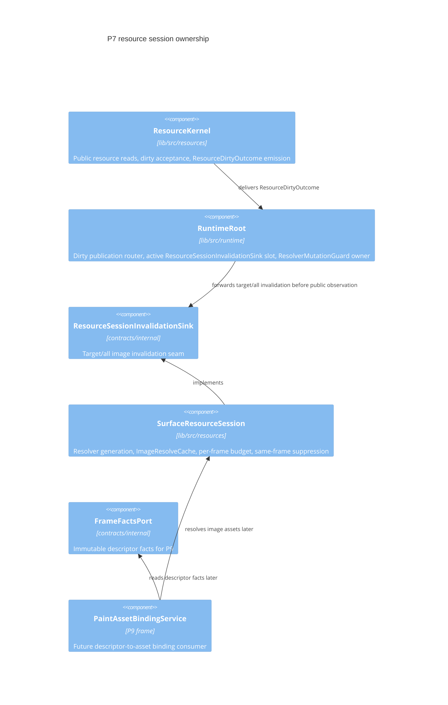
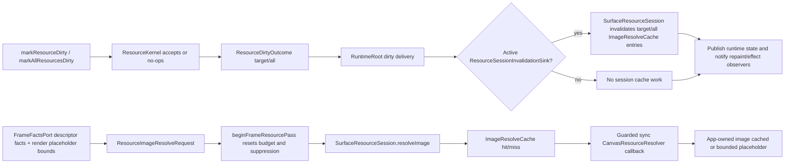
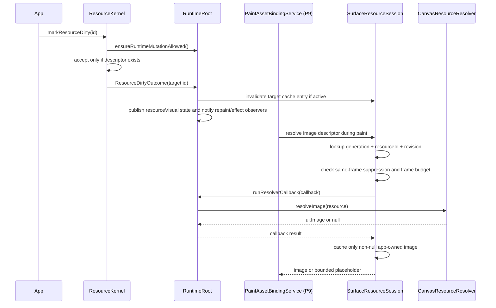
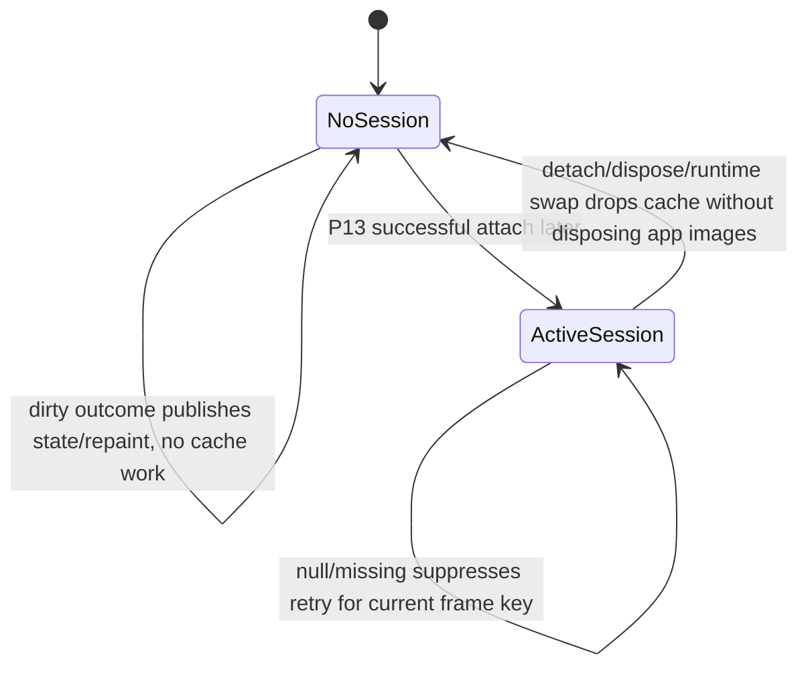

# Design: P7 Resource Session Resolver Lifecycle

---
date: 2026-05-28
designer: Codex
commit: 367acb86
branch: new-architecture
design_question: "Make an architecture design for the remaining P7 resource/session/resolver lifecycle scope based on docs/implementation/p7_resources_and_images.md and fresh P7 resource session research."
---

## Disposition

READY_FOR_CONTRACT

## Product Outcome

The remaining P7 work should make image resources resolve predictably during paint without giving the runtime, frame renderer, or Flutter widget ownership of app images. The app keeps ownership of returned images; the engine owns only a surface-scoped session cache, bounded resolver execution, dirty invalidation routing, and reentrancy rejection.

Non-goals: do not implement frame paint binding, Flutter attachment lifecycle, multi-surface collaboration, async/remote/file/asset loading, or public API expansion in this P7 design.

## Target Contract Classification

- Profile: BEHAVIOR_CHANGE
- Obligations: SEAM_MIGRATION

## Research Inputs

- `.research/2026-05-28-p7-resource-session-resolver-lifecycle.md` - confirms Step 39 implemented only the non-surface resource slice and that full `SurfaceResourceSession` cache, resolver, budget, suppression, frame binding, and Flutter lifecycle behavior remain future work (`.research/2026-05-28-p7-resource-session-resolver-lifecycle.md:13`, `.research/2026-05-28-p7-resource-session-resolver-lifecycle.md:27`).
- Requested `.research/...p7-resource-session-status.md` was not present in the repository; the lifecycle research file above is the only matching fresh P7 resource-session research artifact found.

## Repository Evidence

- `docs/implementation/p7_resources_and_images.md:11` - P7 build scope includes `ResourceKernel`.
- `docs/implementation/p7_resources_and_images.md:12` - P7 build scope includes `SurfaceResourceSession`.
- `docs/implementation/p7_resources_and_images.md:20` - dirty-resource public state revision effects are carried through contract-owned `ResourceDirtyOutcome`.
- `docs/implementation/p7_resources_and_images.md:22` - P7 owns the synchronous app-owned image resolver bridge.
- `docs/implementation/p7_resources_and_images.md:23` - the image resolve cache is surface-scoped and keyed by resolver generation, resource id, and resource revision.
- `docs/implementation/p7_resources_and_images.md:25` - missing/null results are suppressed per frame by the same resource identity without durable null/missing cache writes.
- `docs/implementation/p7_resources_and_images.md:27` - resolver frame budget must produce bounded placeholders without null/missing cache writes.
- `docs/implementation/p7_resources_and_images.md:28` - resolver reentrancy is rejected through contract-owned `ResolverMutationGuard`.
- `docs/implementation/p7_resources_and_images.md:37` - public resource API declarations are owned by `contracts/public/**`.
- `docs/implementation/p7_resources_and_images.md:40` - P4 exposes descriptor facts through `contracts/internal/**`; P7 must not import runtime to read them.
- `docs/implementation/p7_resources_and_images.md:104` - the implemented subset is `CanvasRuntime.resources` backed by `ResourceKernel` for catalog reads and dirty orchestration.
- `docs/implementation/p7_resources_and_images.md:119` - future target dirty must evict the active session cache entry and resolve again on next paint.
- `docs/implementation/p7_resources_and_images.md:122` - future mark-all dirty must clear the active session image cache.
- `docs/implementation/p7_resources_and_images.md:125` - image resolution must be exposed only through `SurfaceResourceSession`; later frame and widget wiring must keep the `lib/src/resources/**` boundary.
- `docs/contracts/resources.md:53` - committed resource descriptors belong to `DocumentStoreKernel`.
- `docs/contracts/resources.md:54` - public resource declarations live in `lib/src/contracts/public/**`.
- `docs/contracts/resources.md:56` - `ResourceCatalogPort`, dirty outcomes, and resolver mutation guard seams live in `lib/src/contracts/internal/**`.
- `docs/contracts/resources.md:60` - frame code must use `FrameFactsPort` for descriptor facts and not the catalog seam for asset binding.
- `docs/contracts/resources.md:63` - each active future `CanvasSurface` owns one `SurfaceResourceSession` under `lib/src/resources/**`.
- `docs/contracts/resources.md:78` - `SurfaceResourceSession` owns resolver reference, resolver generation, cache, per-frame budget, same-frame suppression, and budget follow-up throttle.
- `docs/contracts/resources.md:87` - paint/resource resolution receives immutable descriptor snapshots and `resourceRevision` through `FrameFactsPort`.
- `docs/contracts/resources.md:90` - the resource module must not import, read, or mutate `DocumentStoreKernel` or `RuntimeRoot`.
- `docs/contracts/resources.md:95` - `PaintAssetBindingService` is the only frame collaborator that receives `SurfaceResourceSession`.
- `docs/contracts/resources.md:103` - `CanvasSurface` creates a session only after successful single-active-surface attachment.
- `docs/contracts/resources.md:105` - detach, dispose, and runtime swap drop session cache without disposing app-owned images.
- `docs/contracts/resources.md:112` - `ImageResolveCache` is `SurfaceResourceSession` policy, not runtime-wide state.
- `docs/contracts/resources.md:118` - cache identity and invalidation policy are resolver generation plus resource id plus resource revision with 1024 entries per active session and a sync resolver budget of 128 calls per frame.
- `docs/contracts/resources.md:122` - dirty revision is a repaint observation signal only; dirty calls explicitly invalidate target/all active-session entries.
- `docs/contracts/resources.md:198` - resolver calls are synchronous and app-owned.
- `docs/contracts/resources.md:199` - resolver calls are bounded by `kMaxSyncResourceResolverCallsPerFrame = 128`.
- `docs/contracts/resources.md:200` - reentrant public runtime mutation inside resolver throws `StateError`.
- `docs/contracts/resources.md:209` - missing or unresolved image resources paint bounded placeholders.
- `lib/src/resources/resource_kernel.dart:7` - `ResourceKernel` implements the public resource port.
- `lib/src/resources/resource_kernel.dart:16` - `ResourceKernel` stores `ResourceCatalogPort`.
- `lib/src/resources/resource_kernel.dart:17` - `ResourceKernel` stores `ResolverMutationGuard`.
- `lib/src/resources/resource_kernel.dart:18` - `ResourceKernel` stores `ResourceDirtyOutcomeSink`.
- `lib/src/resources/resource_kernel.dart:32` - target dirty calls guard mutation before reading the catalog.
- `lib/src/resources/resource_kernel.dart:39` - accepted dirty increments `resourceVisualRevision`.
- `lib/src/resources/resource_kernel.dart:40` - accepted target dirty emits `ResourceDirtyOutcome`.
- `lib/src/resources/resource_kernel.dart:46` - mark-all dirty follows the same guarded path.
- `lib/src/runtime/runtime_root.dart:130` - runtime composes a store-backed `ResourceCatalogPort`.
- `lib/src/runtime/runtime_root.dart:133` - runtime composes `ResourceKernel`.
- `lib/src/runtime/runtime_root.dart:135` - runtime passes itself as `ResolverMutationGuard`.
- `lib/src/runtime/runtime_root.dart:136` - runtime passes itself as `ResourceDirtyOutcomeSink`.
- `lib/src/runtime/runtime_root.dart:354` - runtime owns `runResolverCallback`.
- `lib/src/runtime/runtime_root.dart:356` - nested resolver callbacks are rejected.
- `lib/src/runtime/runtime_root.dart:368` - runtime owns `ensureRuntimeMutationAllowed`.
- `lib/src/runtime/runtime_root.dart:371` - public mutations during resolver callbacks are rejected.
- `lib/src/runtime/runtime_root.dart:379` - runtime receives resource dirty outcomes.
- `lib/src/runtime/runtime_root.dart:524` - dirty outcomes currently become resource, repaint, and public-state effects.
- `lib/src/runtime/runtime_root.dart:495` - dirty result delivery has a synchronous delivery window.
- `lib/src/runtime/runtime_root.dart:498` - dirty result delivery publishes runtime state inside that synchronous window.
- `lib/src/runtime/runtime_root.dart:500` - dirty result delivery notifies the commit effect observer inside that synchronous window.
- `lib/src/contracts/internal/resource_dirty_outcome.dart:3` - `ResourceDirtyOutcome` is a contract-owned value.
- `lib/src/contracts/internal/resource_dirty_outcome.dart:15` - `ResourceDirtyOutcomeSink` is the current publication seam.
- `lib/src/contracts/internal/resolver_mutation_guard.dart:1` - `ResolverMutationGuard` is the guard seam.
- `lib/src/contracts/internal/frame_facts_port.dart:124` - frame descriptor facts carry id, app key, resource revision, and metadata.
- `lib/src/contracts/internal/frame_facts_port.dart:138` - `FrameFactsPort` is the descriptor lookup seam for frame consumers.
- `docs/implementation/p9_frame_rendering_and_caches.md:37` - P9 resource image resolution uses only `SurfaceResourceSession`.
- `docs/implementation/p9_frame_rendering_and_caches.md:57` - `PaintAssetBindingService` owns descriptor-to-asset binding using descriptor facts and `SurfaceResourceSession`.
- `docs/implementation/p9_frame_rendering_and_caches.md:96` - P9 depends on P7 for the session boundary and image cache behavior.
- `docs/implementation/p13_flutter_surface.md:16` - P13 owns the synchronous app-owned resource resolver bridge at the widget boundary.
- `docs/implementation/p13_flutter_surface.md:17` - P13 wires session attach, resolver swap, detach, dispose, and runtime swap through the resource session owner.
- `docs/implementation/p13_flutter_surface.md:142` - P13 exit gate requires successful attach to create a session and rejected attach to have no session side effects.
- `lib/src/api/canvas_surface.dart:20` - current public surface already stores a runtime.
- `lib/src/api/canvas_surface.dart:21` - current public surface already stores optional `resourceResolver`.
- `docs/architecture/architecture_graph.yaml:364` - architecture graph has `resource.surface_session` as a required owner.
- `docs/architecture/architecture_graph.yaml:376` - architecture graph states `SurfaceResourceSession` owns resolver generation, cache, budget, suppression, and placeholder policy.
- `docs/architecture/architecture_graph.yaml:741` - architecture graph records the future ResourceKernel to SurfaceResourceSession invalidation edge.
- `docs/architecture/architecture_graph.yaml:755` - architecture graph records the future P9 frame renderer to `SurfaceResourceSession` boundary.
- `docs/verification/tests.md:573` - target dirty active-session cache eviction proof is future.
- `docs/verification/tests.md:578` - mark-all active-session cache clear proof is future.
- `docs/architecture/01_runtime_ownership.md:65` - `ResourceKernel` must not own app assets, resolved image references, or committed descriptors.
- `docs/architecture/01_runtime_ownership.md:66` - `SurfaceResourceSession` must not own committed descriptors, public runtime state, or Flutter widget lifecycle.
- `docs/architecture/02_package_boundaries.md:138` - package layout already reserves `resources/resource_cache.dart`, `resources/resource_resolver_adapter.dart`, and `resources/surface_resource_session.dart`.
- `docs/architecture/02_package_boundaries.md:272` - `lib/src/resources/**` must not import runtime, store, frame, surface, interaction, Flutter, or cache/session owners outside resource-owned seams.
- `docs/contracts/frame_rendering.md:119` - `SurfaceResourceSession` is the only image resolution boundary in paint.

## Design Form Candidates

### Candidate A. Surface-Owned Session Policy With Runtime Handoff

- Form: add/complete `SurfaceResourceSession` under `lib/src/resources/**` as the sole owner of sync resolver lifecycle, resolver generation, image resolve cache, per-frame budget, same-frame missing/null suppression, bounded placeholder results, and app-owned image no-dispose behavior. Keep `ResourceKernel` as the non-surface public resource port owner. Add `ResourceSessionInvalidationSink` under `lib/src/contracts/internal/**` with target/all image invalidation methods; `SurfaceResourceSession` implements it, `RuntimeRoot` stores at most one nullable active sink, and accepted `ResourceDirtyOutcome` is forwarded to that sink before public dirty observation.
- Why it could work: it matches the contract's owner split between committed descriptors, runtime dirty orchestration, and live surface session state (`docs/contracts/resources.md:53`, `docs/contracts/resources.md:72`, `docs/contracts/resources.md:78`). It keeps frame descriptor reads on `FrameFactsPort`, not `ResourceCatalogPort`, and keeps P13 lifecycle wiring responsible only for session attach/drop/resolver replacement (`docs/contracts/resources.md:87`, `docs/contracts/resources.md:95`, `docs/contracts/resources.md:103`).
- Gate failures or risks: requires a small session-invalidation seam from runtime to active session and tests proving that no active session is a no-op for cache invalidation while dirty public-state/repaint behavior still publishes.

### Candidate B. Runtime-Owned Resolver Cache

- Form: move resolver generation and image cache state into `RuntimeRoot` or `ResourceKernel`, then let frame and surface call runtime/resource APIs for image resolution.
- Why it could work: runtime already receives dirty outcomes and publishes repaint/public-state effects (`lib/src/runtime/runtime_root.dart:379`, `lib/src/runtime/runtime_root.dart:524`).
- Gate failures or risks: fails source-of-truth and ownership. The contract says `ImageResolveCache` is `SurfaceResourceSession` policy, not runtime-wide state (`docs/contracts/resources.md:112`), and each active future surface owns one session (`docs/contracts/resources.md:63`). It would also make app image lifetime broader than the attached surface lifecycle and create pressure for sync glue on runtime swap/detach.

### Candidate C. Frame-Owned Resolver Cache And Budget

- Form: let P9 `PaintAssetBindingService` own cache, per-frame budget, and same-frame suppression while it binds descriptors to paint assets.
- Why it could work: P9 is where descriptor-to-asset binding occurs (`docs/implementation/p9_frame_rendering_and_caches.md:57`).
- Gate failures or risks: fails owner fit. P9 depends on P7 for the session boundary and cache behavior (`docs/implementation/p9_frame_rendering_and_caches.md:96`), and `PaintAssetBindingService` must only receive `SurfaceResourceSession`, not own resolver/session policy (`docs/contracts/resources.md:95`).

### Candidate D. Widget-Owned Session Cache

- Form: keep `SurfaceResourceSession` as an implementation detail of `CanvasSurface` state and let the widget own cache, resolver generation, and invalidation.
- Why it could work: P13 wires attach, resolver swap, detach, dispose, and runtime swap (`docs/implementation/p13_flutter_surface.md:17`).
- Gate failures or risks: fails ownership and future pressure. P13 should connect proved resource behavior to Flutter without giving the widget direct ownership of resolver internals (`docs/implementation/p13_flutter_surface.md:5`). The resource contract says the session owner is under `lib/src/resources/**`, while P13 only wires lifecycle (`docs/contracts/resources.md:63`, `docs/contracts/resources.md:115`).

## Known Future Pressures

| Pressure | Evidence | How the selected form responds | Accepted cost or risk |
|---|---|---|---|
| P9 must bind image descriptors without planner/painter resolver access. | `docs/contracts/resources.md:95`; `docs/implementation/p9_frame_rendering_and_caches.md:57` | P7 exposes only `SurfaceResourceSession` resolve/invalidation behavior; P9 later injects it only into `PaintAssetBindingService`. | P7 cannot fully prove frame integration until P9, so P7 tests must use session-level and fake descriptor inputs. |
| P13 must wire session lifecycle to single active surface without owning resource policy. | `docs/contracts/resources.md:103`; `docs/implementation/p13_flutter_surface.md:17` | P7 defines session behavior and attach/drop/resolver-swap methods; P13 later owns when to create, replace resolver, detach, and drop. | P7 must avoid widget dependencies and may need lifecycle tests with direct session construction plus runtime invalidation fakes. |
| Dirty resource calls already publish public state and repaint effects. | `lib/src/runtime/runtime_root.dart:379`; `lib/src/runtime/runtime_root.dart:495`; `lib/src/runtime/runtime_root.dart:498`; `lib/src/runtime/runtime_root.dart:500`; `lib/src/runtime/runtime_root.dart:524` | Runtime remains the dirty outcome router and must invalidate the active session before any synchronous public dirty observation through state listeners or commit-effect observers. | The future contract must preserve existing no-session public-state behavior and add order-sensitive tests. |
| Resolver callbacks can try public runtime mutation. | `docs/contracts/resources.md:200`; `lib/src/runtime/runtime_root.dart:354`; `lib/src/runtime/runtime_root.dart:371` | Session must invoke app resolver only through `ResolverMutationGuard.runResolverCallback`, while public mutation entry points keep using `ensureRuntimeMutationAllowed`. | The guard remains runtime-owned; tests must prove rejected mutation has no cache, repaint, public-state, action, document, selection, or preview effect. |
| Cache invalidation must not make ResourceKernel own app image references. | `docs/architecture/architecture_graph.yaml:741`; `docs/contracts/resources.md:112` | Add `ResourceSessionInvalidationSink` in `contracts/internal`; `RuntimeRoot` holds only the active sink reference and forwards target/all invalidation, while `ResourceKernel` emits only ids/all outcome and never sees cache entries or images. | Runtime has one transient session reference for routing; tests and import guardrails must prove that this reference is not a cache owner. |

## Selected Form

Choose Candidate A: `SurfaceResourceSession` is the resource-owned live-session policy object, and `RuntimeRoot` remains only the coordinator that already bridges public resource dirty calls to effects and guard enforcement.

The selected form separates four sources of truth:

- committed resource descriptors stay in `DocumentStoreKernel` and are exposed to frame code through `FrameFactsPort`;
- public resource reads and dirty acceptance stay in `ResourceKernel`;
- live image resolver state stays in `SurfaceResourceSession`;
- Flutter owns attach/detach/resolver-swap timing later, but not resolver policy.

Dirty outcome handoff must use a concrete internal seam named `ResourceSessionInvalidationSink` in `lib/src/contracts/internal/resource_session_invalidation_sink.dart`. The interface exposes `invalidateResourceImage(CanvasResourceId id)` and `invalidateAllResourceImages()`. `SurfaceResourceSession` implements that sink; `RuntimeRoot` stores a nullable `_activeResourceSessionInvalidationSink` and has internal attach/clear operations for P13 to wire later after single-active-surface attachment succeeds. `ResourceKernel` continues to emit only `ResourceDirtyOutcome`; it never imports the session, stores a sink, or sees cache/image state.

`RuntimeRoot` first forwards target/all invalidation to `_activeResourceSessionInvalidationSink` when present, then exposes the dirty result through synchronous public observation surfaces: runtime-state listeners and commit-effect observers. No session attached means no cache invalidation work, but the existing resource visual revision and repaint intent behavior still occurs. This order is locked because `_deliverResourceDirtyResult` publishes state and invokes the observer in the same synchronous delivery window (`lib/src/runtime/runtime_root.dart:495`, `lib/src/runtime/runtime_root.dart:498`, `lib/src/runtime/runtime_root.dart:500`).

The session frame-pass boundary is also locked: `SurfaceResourceSession.beginFrameResourcePass()` starts the per-main-paint resource pass, resets the 128-call resolver budget, clears current-frame missing/null suppression state, and clears the pending budget follow-up flag for the new pass. P9 later calls this before `PaintAssetBindingService` starts image descriptor binding for a main paint frame; P7 tests may call it directly. Image resolution enters through `SurfaceResourceSession.resolveImage(ResourceImageResolveRequest request)`, where the request is a resource-owned internal value carrying `CanvasResourceId`, immutable app-key descriptor data, `resourceRevision`, and placeholder bounds from the future render record. Missing descriptors are represented explicitly in the request/result path and return a bounded placeholder without resolver calls or cache writes.

Resolver calls must execute through `ResolverMutationGuard.runResolverCallback`. The guard owner remains runtime because runtime owns public mutation admission and already rejects nested resolver callbacks and mutation during resolver callbacks. `SurfaceResourceSession` owns when the resolver is called and what cache/suppression/budget result is returned; it does not own public runtime mutation policy.

## Hard Gate Check

| Gate | Result | Evidence |
|---|---|---|
| Root cause | pass | The remaining gap is live session resolver/cache lifecycle, not public catalog reads; Step 39 left full cache/resolver behavior future (`.research/2026-05-28-p7-resource-session-resolver-lifecycle.md:27`). |
| Ownership | pass | `SurfaceResourceSession` is the documented owner of resolver generation, cache, budget, suppression, and placeholder policy (`docs/contracts/resources.md:78`; `docs/architecture/architecture_graph.yaml:376`). |
| Source of truth | pass | Descriptors stay committed in `DocumentStoreKernel`, public reads stay through `ResourceKernel`, frame descriptor reads stay through `FrameFactsPort`, and cache state stays session-local (`docs/contracts/resources.md:53`; `docs/contracts/resources.md:60`; `docs/contracts/resources.md:112`). |
| Boundary | pass | Entry boundaries are public dirty APIs, `ResourceSessionInvalidationSink`, `beginFrameResourcePass()`, `resolveImage(ResourceImageResolveRequest)`, resolver replacement, and attach/drop lifecycle; exit boundaries are target/all session invalidation, resolved image or bounded placeholder, repaint/public-state effects, and guard rejection (`docs/contracts/resources.md:87`; `docs/contracts/resources.md:122`; `docs/contracts/resources.md:198`; `docs/contracts/frame_rendering.md:119`). |
| Dependency direction | pass | Resource implementation stays under `lib/src/resources/**` and consumes public/internal contracts; resource module must not import `DocumentStoreKernel` or `RuntimeRoot` (`docs/contracts/resources.md:90`; `lib/src/resources/resource_kernel.dart:1`). |
| State/data | pass | Committed descriptors: `DocumentStoreKernel`; resource visual revision: `ResourceKernel`; session cache/budget/suppression/resolver generation: `SurfaceResourceSession`; public runtime state: `RuntimeRoot` publication (`docs/contracts/resources.md:53`; `lib/src/resources/resource_kernel.dart:19`; `docs/contracts/resources.md:78`; `lib/src/runtime/runtime_root.dart:417`). |
| Seam | pass | Existing seams are `ResourceDirtyOutcomeSink`, `ResolverMutationGuard`, and `FrameFactsPort`; the selected new seam is `ResourceSessionInvalidationSink` in `contracts/internal`, consumed by `RuntimeRoot` and implemented by `SurfaceResourceSession`, without replacing descriptor reads with `ResourceCatalogPort` (`lib/src/contracts/internal/resource_dirty_outcome.dart:15`; `lib/src/contracts/internal/resolver_mutation_guard.dart:1`; `lib/src/contracts/internal/frame_facts_port.dart:138`; `docs/contracts/resources.md:60`). |
| Temporal/reentrancy | pass | Dirty handoff must invalidate the active session before synchronous public dirty observation through state listeners or commit-effect observers; resolver calls are synchronous and app-owned, must be wrapped by runtime-owned resolver guard, nested resolver callbacks are rejected, and public mutation during callbacks throws before side effects (`lib/src/runtime/runtime_root.dart:495`; `lib/src/runtime/runtime_root.dart:498`; `lib/src/runtime/runtime_root.dart:500`; `docs/contracts/resources.md:198`; `lib/src/runtime/runtime_root.dart:354`; `lib/src/runtime/runtime_root.dart:371`). |
| All-or-nothing behavior | pass | Dirty acceptance already increments resource visual only after guard/catalog success; future cache invalidation must be failure-contained and must not be required for public-state publication when no session exists (`lib/src/resources/resource_kernel.dart:32`; `lib/src/resources/resource_kernel.dart:39`; `docs/contracts/resources.md:122`). Resolver cache writes happen only after a non-null image result; missing/null/budget results return placeholders without durable cache writes (`docs/contracts/resources.md:120`; `docs/contracts/resources.md:209`). |
| Verification | pass | P7 names resource/session tests and guardrails for resolver, no-dispose, dirty, suppression, cache lifecycle, resolver swap, budget, and reentrancy (`docs/implementation/p7_resources_and_images.md:85`; `docs/implementation/p7_resources_and_images.md:100`). |
| Future pressure | pass | P9 and P13 pressure is absorbed by defining P7 as the session behavior owner while deferring only frame/widget wiring (`docs/implementation/p9_frame_rendering_and_caches.md:96`; `docs/implementation/p13_flutter_surface.md:17`). |

## Lock-Required Facts

- Owner: `SurfaceResourceSession` owns sync resolver lifecycle, resolver generation, `ImageResolveCache`, per-frame resolver-call budget, same-frame missing/null suppression, bounded placeholders, budget-exceeded throttle/probe, and app-owned image no-dispose behavior.
- Owning layer/module/document family: session implementation belongs under `lib/src/resources/**`; public DTOs and resolver interface remain in `contracts/public/**`; guard, dirty outcome, catalog, and frame facts seams remain in `contracts/internal/**`.
- Seam: keep `ResourceDirtyOutcome` as the dirty event value and `ResolverMutationGuard` as the callback/mutation guard; add `ResourceSessionInvalidationSink` in `lib/src/contracts/internal/resource_session_invalidation_sink.dart` with `invalidateResourceImage(CanvasResourceId id)` and `invalidateAllResourceImages()`. Runtime consumes the sink through a nullable active-session slot; `SurfaceResourceSession` implements it; `ResourceKernel` never receives it.
- Dependency/import direction: `SurfaceResourceSession` may depend on public resource contracts and internal guard/invalidation contracts; it must not import runtime, store, frame, Flutter widget, or painters. Frame code may depend on the resource session boundary later; ordinary planners and painters must not call the resolver.
- State/data ownership: committed descriptors are document state; resource visual revision is runtime/resource observation state; resolved images, cache entries, resolver generation, budget counters, and same-frame suppression are transient active-session state; placeholders are derived per resolve.
- Entry boundaries: `SurfaceResourceSession.beginFrameResourcePass()`, `SurfaceResourceSession.resolveImage(ResourceImageResolveRequest request)`, `replaceResolver(CanvasResourceResolver?)`, `ResourceSessionInvalidationSink.invalidateResourceImage(id)`, `ResourceSessionInvalidationSink.invalidateAllResourceImages()`, and session drop/dispose.
- Exit boundaries: resolved app-owned image reference, bounded placeholder result, target/all cache invalidation, at most one throttled follow-up repaint request for budget exhaustion, and no engine disposal of app-owned images.
- File placement basis: session policy goes in `lib/src/resources/surface_resource_session.dart`; cache policy goes in `lib/src/resources/resource_cache.dart`; resolver adapter/request/result value types go in `lib/src/resources/resource_resolver_adapter.dart`; invalidation seam goes in `lib/src/contracts/internal/resource_session_invalidation_sink.dart`.
- Execution order constraints: guard before resolver callback; cache lookup before resolver call; same-frame suppression check before retry; budget gate before callback; cache write only after non-null image result; dirty accepted before public-state/repaint effects; active-session invalidation must occur before `_publishRuntimeState()` and `_commitEffectObserver()` can synchronously expose the dirty result to listeners or repaint/effect observers.
- Rejected alternatives: runtime-owned cache, frame-owned cache, and widget-owned cache are rejected because they contradict documented owner boundaries and create duplicate live image state.
- Verification strategy: focused resource tests with fake resolver/images/descriptor facts plus runtime delivery tests for dirty handoff and guard rejection; later P9/P13 contracts prove integration through `PaintAssetBindingService` and `CanvasSurface` lifecycle.

## Diagram Need Assessment

| Design question | Needed? | Diagram kind | Reason |
|---|---:|---|---|
| Does the design change ownership, layer, package, or component boundaries? | yes | c4 | It locks `SurfaceResourceSession` as the resource owner and rejects runtime/frame/widget ownership. Existing durable architecture graph already names this owner; future contract should update graph status/evidence when implemented. |
| Does it change data flow, state ownership, cache ownership, resource movement, or lifecycle movement? | yes | data_flow | Dirty outcomes must flow from `ResourceKernel` through runtime to active session invalidation while cache state remains session-owned. |
| Does it depend on call order, lifecycle order, sync/async ordering, failure ordering, or migration order? | yes | sequence | Resolver callback guard, budget gate, suppression, cache admission, and dirty invalidation order are correctness-sensitive. |
| Does it introduce or alter modes, statuses, terminal states, sessions, or transition rules? | yes | state | The active/no-session, resolver generation, frame budget, suppression, detach/drop transitions define session correctness. |
| Does it create, replace, migrate, or retire a shared seam? | yes | sequence | It extends the existing `ResourceDirtyOutcome` delivery path with active-session invalidation and uses `ResolverMutationGuard` as the callback guard. |
| Does it change public API consumer flow, payload shape, or compatibility behavior? | no | none | Public `CanvasSurface.resourceResolver` and public resource contracts already exist; the design implements behavior behind existing surfaces. |
| Does it introduce or change analyzer, guardrail, or structural-recognition pipeline behavior? | yes | data_flow | Existing guardrail list requires resource boundary checks; future contract may need structural checks for no frame/widget/runtime cache ownership. |

## Provisional Diagrams

## Source-Of-Truth Impact

A later Change Contract that implements this P7 session/cache behavior must update or explicitly verify these durable source-of-truth artifacts:

- `docs/implementation/p7_resources_and_images.md`: mandatory update when `SurfaceResourceSession`, `ResourceSessionInvalidationSink`, frame-pass boundary, cache policy, budget, suppression, resolver swap, or active-session dirty invalidation is implemented. The exit gate must stop describing those implemented parts as future.
- `docs/contracts/resources.md`: mandatory update to name `ResourceSessionInvalidationSink`, `beginFrameResourcePass()`, and `ResourceImageResolveRequest` if those names are introduced; otherwise the contract author must record why existing wording remains exact.
- `docs/verification/tests.md`: mandatory update when target/all active-session invalidation, cache lifecycle, resolver swap, budget, same-frame suppression, or reentrancy tests are added; future proof notes must become implemented proof notes.
- `docs/architecture/architecture_graph.yaml`: mandatory update when declarations or edges become real. `resource.surface_session` must include the implemented declarations; the existing `resource.kernel.invalidates_surface_session` future edge must be renamed, replaced, or re-evidenced to reflect the selected runtime-routed handoff where `ResourceKernel` emits only `ResourceDirtyOutcome` and `RuntimeRoot` forwards to `ResourceSessionInvalidationSink`; `frame.renderer.uses_surface_resource_session` must remain future until P9 consumes the session.
- `docs/diagrams/seq_resource_resolution.mmd`, `docs/diagrams/state_resource_resolution.mmd`, `docs/diagrams/dfd_resource_resolution.mmd`, and `docs/diagrams/dfd_cache_invalidation.mmd`: mandatory review in the same Change Contract. Update them if the selected seam/API names, cache invalidation route, or observation order are absent or stale; otherwise record a no-op verification that the diagrams already match the implemented sequence/state/data flow.
- Guardrails or architecture import checks: mandatory when implementation introduces `ResourceSessionInvalidationSink` and `SurfaceResourceSession`; they must prove `lib/src/resources/**` does not import runtime/frame/surface and frame planners/painters do not call `CanvasResourceResolver` directly.

## Verification Impact

Future proof should include:

- `test/resources/sync_image_resolver_test.dart` for sync app resolver calls through the session.
- `test/resources/app_owned_image_not_disposed_test.dart` for no engine disposal of app images on cache drop, resolver swap, detach, dispose, and runtime swap.
- `test/resources/resource_dirty_test.dart` for target dirty active-session invalidation plus no document/selection/preview/action side effects.
- `test/resources/mark_all_resources_dirty_test.dart` for all-resource active-session cache clear with unchanged public behavior.
- `test/resources/missing_result_suppressed_per_frame_test.dart` for same-frame null/missing suppression by resolver generation, resource id, and resource revision.
- `test/resources/surface_session_cache_lifecycle_test.dart` for cache key, LRU capacity, descriptor revision changes, dirty invalidation, and detach/drop behavior.
- `test/resources/resolver_swap_starts_fresh_cache_test.dart` for resolver generation increment and stale cache clearing.
- `test/resources/resolver_frame_budget_test.dart` for 128-call per-frame budget, bounded placeholders, no invalid cache writes, and follow-up throttle ownership.
- `test/resources/resolver_reentrancy_rejected_test.dart` for guard rejection before document, selection, preview, cache, repaint, action, or public-state effects.
- Guardrails `resources.resolver_boundary_owned_by_surface_session`, `resources.resolver_frame_budget`, `resources.no_same_frame_missing_retry`, and `resources.resolver_reentrancy_rejected`.

## Verification Strategy

The future contract should prove behavior at the smallest owner that can observe it:

- session-level tests prove cache keying, resolver generation, same-frame suppression, budget, placeholder, no-dispose, and resolver-call guard behavior using fake descriptor facts and fake resolver/image handles;
- runtime delivery tests prove `ResourceDirtyOutcome` target/all handoff to an active session happens before synchronous public dirty observation through runtime-state listeners and commit-effect observers, while preserving existing public-state/repaint/no-document/no-action behavior when no session is attached;
- negative tests prove `ResourceKernel` does not own cache/images and frame planners/painters do not receive resolver APIs;
- later P9 tests prove `PaintAssetBindingService` is the only frame collaborator receiving the session;
- later P13 tests prove `CanvasSurface` creates/drops/replaces resolver session state only at the documented lifecycle points.

## Change Contract Handoff

- Required profile: BEHAVIOR_CHANGE
- Required obligations: SEAM_MIGRATION
- Decisions to carry forward:
  - Implement `SurfaceResourceSession` as the only live resolver/cache/budget/suppression owner under `lib/src/resources/**`.
  - Keep `ResourceKernel` limited to public resource reads, dirty no-op/acceptance, resource visual revision, and `ResourceDirtyOutcome` emission.
  - Add `ResourceSessionInvalidationSink` in `lib/src/contracts/internal/resource_session_invalidation_sink.dart`; `SurfaceResourceSession` implements it, runtime stores at most one active sink, and `ResourceKernel` never imports or owns the sink.
  - Route `ResourceDirtyOutcome` through runtime to `ResourceSessionInvalidationSink` target/all methods; invalidate before runtime-state listeners and commit-effect observers can synchronously observe the dirty result.
  - Add `beginFrameResourcePass()` and `resolveImage(ResourceImageResolveRequest request)` as the P7-owned session entry shape; P9 later calls them from `PaintAssetBindingService`, not from planners or painters.
  - Use `ResolverMutationGuard.runResolverCallback` for every app resolver callback and keep `ensureRuntimeMutationAllowed` on public mutation entry points.
  - Keep P7 independent of P9 frame binding and P13 Flutter lifecycle; expose behavior and seams that those later phases consume.
- Evidence to cite:
  - `docs/contracts/resources.md:53`
  - `docs/contracts/resources.md:78`
  - `docs/contracts/resources.md:87`
  - `docs/contracts/resources.md:95`
  - `docs/contracts/resources.md:103`
  - `docs/contracts/resources.md:112`
  - `docs/contracts/resources.md:122`
  - `docs/contracts/resources.md:198`
  - `docs/implementation/p7_resources_and_images.md:22`
  - `docs/implementation/p7_resources_and_images.md:23`
  - `docs/implementation/p7_resources_and_images.md:119`
  - `docs/implementation/p7_resources_and_images.md:125`
  - `lib/src/resources/resource_kernel.dart:40`
  - `lib/src/runtime/runtime_root.dart:354`
  - `lib/src/runtime/runtime_root.dart:371`
  - `lib/src/runtime/runtime_root.dart:495`
  - `lib/src/runtime/runtime_root.dart:498`
  - `lib/src/runtime/runtime_root.dart:500`
  - `docs/implementation/p9_frame_rendering_and_caches.md:57`
  - `docs/implementation/p13_flutter_surface.md:17`
- Contract constraints or sequencing facts:
  - Introduce `ResourceSessionInvalidationSink` before wiring runtime dirty handoff.
  - Implement session cache/budget/suppression before P9 frame binding consumes the session.
  - Preserve no-session dirty behavior while adding active-session invalidation before public state or commit-effect observer delivery.
  - Put all fallible resolver work before cache admission; cache writes only non-null resolved images.
  - Do not add public API unless implementation finds a contradiction with existing `CanvasSurface.resourceResolver` and public resource contracts.

## Open Decisions

None.
