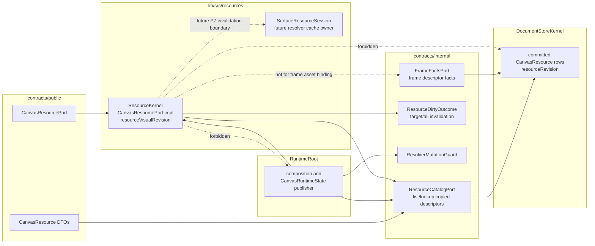
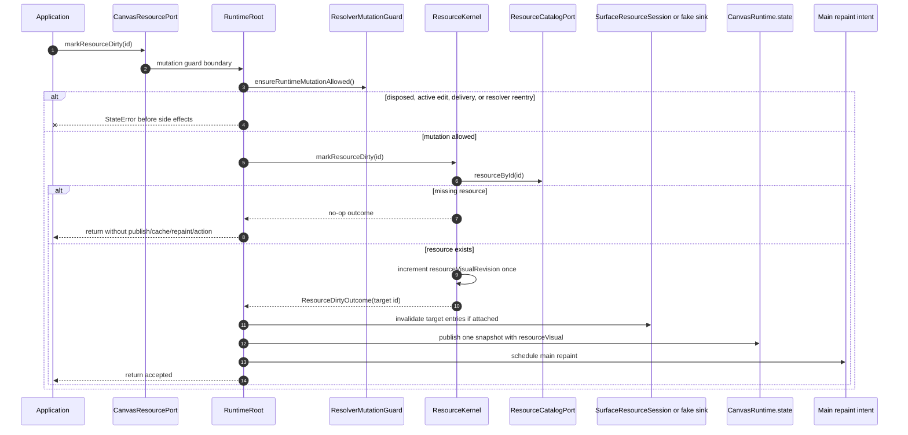
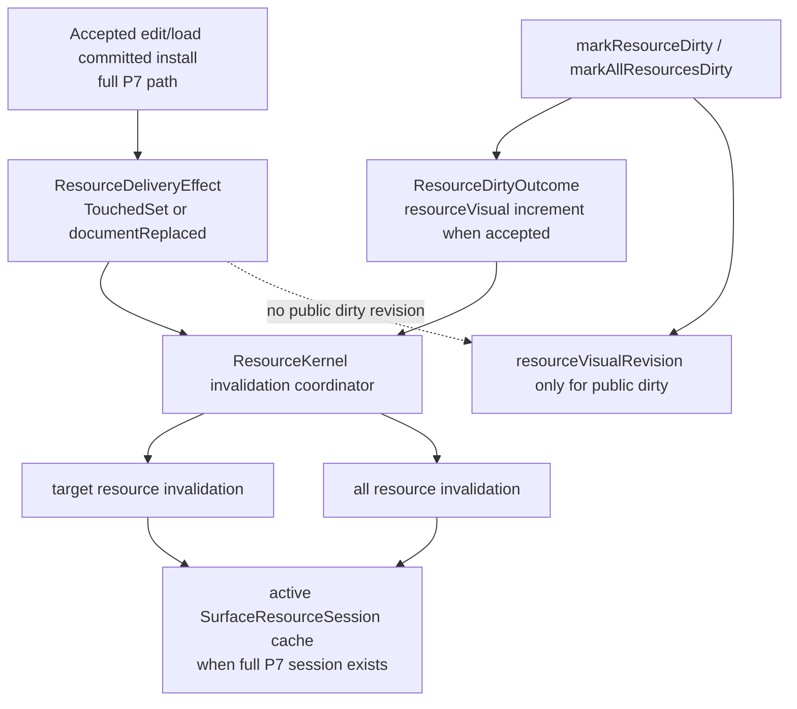

# Design: ResourceKernel read seam and dirty orchestration

---
date: 2026-05-28
designer: Codex
commit: fafff11b
branch: new-architecture
design_question: "Choose the P7 ResourceKernel read seam and dirty orchestration shape before implementation."
---

## Disposition

READY_FOR_CONTRACT

## Product Outcome

Before full P7 implementation, the project needs one small ownership decision:
how the resource owner reads the current resource catalog without taking over the
document store. The narrow result is a resource-catalog read seam that lets the
future `ResourceKernel` own public resource reads and dirty-resource entrypoints
while committed resource descriptors remain owned by the store.

This is not the full P7 resource/image implementation. The next narrow contract
must make the public resource port live for `resources`, `resourceById`, and
dirty visual revision behavior, but it must not absorb synchronous image
resolution, image cache policy, resolver frame budgeting, missing-result
suppression, or surface lifecycle work.

Non-goals: do not implement code, do not change public API declarations, do not
change durable docs or diagrams in this design pass, and do not solve P7
resolver/cache/session behavior, P9 frame rendering, or P13 Flutter surface
lifecycle beyond preserving the seams those phases already require.

## Target Contract Classification

- Profile: BEHAVIOR_CHANGE
- Obligations: SEAM_MIGRATION

## Research Inputs

- None used; direct repository evidence used. Existing resource research predates
  the current P7 docs and was not used as source of truth for this design.

## Repository Evidence

- `docs/contracts/resources.md:53` - `DocumentStoreKernel` owns resource
  descriptors as committed document state.
- `docs/contracts/resources.md:57` - `ResourceKernel` owns the non-surface
  resource implementation API and dirty-resource orchestration.
- `docs/contracts/resources.md:59` - each active `CanvasSurface` owns one
  `SurfaceResourceSession` under `lib/src/resources/**`.
- `docs/contracts/resources.md:82` - paint/resource resolution receives immutable
  descriptor snapshots and `resourceRevision` through `FrameFactsPort`.
- `docs/contracts/resources.md:85` - the resource module must not import, read,
  or mutate `DocumentStoreKernel` or `RuntimeRoot`.
- `docs/contracts/resources.md:117` - public dirty-resource revision is a repaint
  observation signal only.
- `docs/contracts/resources.md:150` - legacy `notifySceneChanged()` is replaced
  by `runtime.resources.markResourceDirty` and `markAllResourcesDirty`.
- `docs/contracts/resources.md:160` - dirty-resource calls do not change document
  revision.
- `docs/contracts/resources.md:161` - dirty-resource calls increment
  `state.revisions.resourceVisual`.
- `docs/contracts/resources.md:162` - dirty-resource calls send target
  invalidation to the active `SurfaceResourceSession` if attached.
- `docs/contracts/resources.md:172` - `resourceVisualRevision` maps to public
  `state.revisions.resourceVisual`.
- `docs/contracts/resources.md:174` - the public resource port delegates revision
  increment to ResourceKernel/RuntimeRoot orchestration.
- `docs/contracts/resources.md:179` - `markAllResourcesDirty` applies the same
  dirty rule to every registered resource and clears the active session cache if
  one exists.
- `docs/contracts/resources.md:214` - resolver callback boundaries reject
  reentrant public runtime mutation with `StateError`.
- `docs/contracts/public_api_v1.md:1773` - `CanvasResourcePort` exposes
  `resources`, `resourceById`, `markResourceDirty`, and
  `markAllResourcesDirty`.
- `docs/contracts/public_api_v1.md:1782` - resource mutation is intentionally not
  on `CanvasResourcePort`; it is inside `CanvasEdit`.
- `docs/contracts/public_api_v1.md:1858` - the runtime stores resource
  descriptors and render cache references, while resolved images live only in an
  active `SurfaceResourceSession`.
- `docs/contracts/operation_matrix.md:510` - `markResourceDirty` has a dedicated
  operation row.
- `docs/contracts/operation_matrix.md:514` - `markResourceDirty` publishes
  `state.revisions.resourceVisual` when target dirty state changes.
- `docs/contracts/operation_matrix.md:523` - `markResourceDirty` marks the
  requested id dirty and sends target invalidation to the active surface resource
  session if attached.
- `docs/contracts/operation_matrix.md:530` - `markResourceDirty` is a no-op when
  the target has no registered resource visual state to dirty.
- `docs/contracts/operation_matrix.md:536` - `markAllResourcesDirty` has a
  dedicated operation row.
- `docs/contracts/operation_matrix.md:549` - `markAllResourcesDirty` clears the
  active surface resource session cache if attached.
- `docs/contracts/operation_matrix.md:556` - `markAllResourcesDirty` is a no-op
  when there is no registered resource visual state to dirty.
- `docs/architecture/01_runtime_ownership.md:59` - `DocumentStoreKernel` stores
  committed document state, document revisions, resource descriptors, and public
  document projection cache.
- `docs/architecture/01_runtime_ownership.md:60` - `FrameFactsPort` owns
  immutable committed frame facts, descriptor snapshots, and `resourceRevision`.
- `docs/architecture/01_runtime_ownership.md:65` - `ResourceKernel` owns resource
  API, dirty resource ids, resource visual state publication, and session
  invalidation events, but not committed descriptors.
- `docs/architecture/01_runtime_ownership.md:71` - `RuntimeRoot` publishes the
  single public `CanvasRuntime.state` snapshot.
- `docs/architecture/01_runtime_ownership.md:164` - committed document facts stay
  store-owned and enter frame code only through `FrameFactsPort`.
- `docs/architecture/01_runtime_ownership.md:168` - resolver/cache state stays
  owned by `SurfaceResourceSession`.
- `docs/architecture/01_runtime_ownership.md:183` - `RuntimeRoot` is the
  composition root that includes `DocumentStoreKernel`, `ResourceKernel`, and the
  active `SurfaceResourceSession`.
- `docs/architecture/03_data_model.md:120` - `resourceRevision` means resource
  descriptor changes.
- `docs/architecture/03_data_model.md:125` - `resourceVisualRevision` means
  `ResourceKernel`/`RuntimeRoot` dirty visual invalidation.
- `docs/architecture/03_data_model.md:134` - public runtime observation is one
  immutable `CanvasRuntimeState` snapshot.
- `docs/architecture/03_data_model.md:179` - resource dirty operations increment
  `state.revisions.resourceVisual`.
- `docs/architecture/03_data_model.md:183` - `resourceVisualRevision` is runtime
  resource state coordinated through contract-owned dirty-resource outcomes, not
  committed store state.
- `docs/architecture/02_package_boundaries.md:214` - `contracts/public/**` is
  declaration-only public DTOs and port interfaces.
- `docs/architecture/02_package_boundaries.md:215` - `contracts/internal/**` is
  declaration-only owner ports, immutable facts, delivery effects, dirty
  outcomes, and resolver mutation guards.
- `docs/architecture/architecture_graph.yaml:347` - `ResourceKernel` is future
  P7 scope.
- `docs/architecture/architecture_graph.yaml:689` - `RuntimeRoot` will compose
  `ResourceKernel`.
- `docs/architecture/architecture_graph.yaml:704` - resource invalidation goes
  from `ResourceKernel` to `SurfaceResourceSession`.
- `docs/architecture/architecture_graph.yaml:1398` - `ResourceKernel` importing
  `RuntimeRoot` is forbidden.
- `docs/architecture/architecture_graph.yaml:1409` - `ResourceKernel` importing
  frame rendering is forbidden.
- `docs/implementation/p7_resources_and_images.md:11` - P7 build scope includes
  `ResourceKernel`.
- `docs/implementation/p7_resources_and_images.md:12` - P7 build scope includes
  `SurfaceResourceSession`.
- `docs/implementation/p7_resources_and_images.md:18` - P7 build scope includes
  `markResourceDirty`.
- `docs/implementation/p7_resources_and_images.md:20` - P7 dirty-resource public
  revision effects go through contract-owned `ResourceDirtyOutcome`.
- `docs/implementation/p7_resources_and_images.md:40` - P4 exposes descriptor
  facts through `contracts/internal/**` seams; P7 must not import runtime to read
  them.
- `docs/implementation/p7_resources_and_images.md:104` - P7 exit requires
  rollback-safe resource descriptor mutation.
- `docs/implementation/p7_resources_and_images.md:105` - P7 exit requires
  `ResourceKernel` resource/session implementation under `lib/src/resources/**`.
- `docs/implementation/p7_resources_and_images.md:111` - P7 exit requires later
  frame descriptor facts through `FrameFactsPort`, not runtime or frame imports.
- `docs/implementation/p7_resources_and_images.md:113` - resource dirty publishes
  `state.revisions.resourceVisual` and schedules main repaint without document
  revision.
- `docs/implementation/p7_resources_and_images.md:115` - target resource dirty
  evicts the target active-session image cache entry.
- `docs/implementation/p7_resources_and_images.md:117` - mark-all resource dirty
  clears the active-session image cache.
- `docs/implementation/p7_resources_and_images.md:130` - resource descriptors
  and resolved images must not be merged into one owner.
- `docs/implementation/p9_frame_rendering_and_caches.md:37` - frame image
  resolution uses `SurfaceResourceSession` under `lib/src/resources/**`.
- `docs/implementation/p9_frame_rendering_and_caches.md:39` - frame descriptor
  lookup uses `FrameFactsPort` under `contracts/internal/**`.
- `docs/implementation/p13_flutter_surface.md:17` - P13 wires
  `SurfaceResourceSession` lifecycle through the `lib/src/resources/**` session
  owner.
- `docs/verification/tests.md:554` - planned resource dirty tests cover
  `state.revisions.resourceVisual` without document revision, projection,
  selection, preview, or action changes.
- `docs/verification/tests.md:562` - planned mark-all tests cover session cache
  clearing while preserving document revision, projection, selection, preview,
  and action behavior.
- `docs/verification/guardrail_design_patterns.md:139` - the
  `resources.dirty_no_document_revision` guardrail proves dirty changes resource
  visual revision and not document revision.
- `docs/verification/guardrail_design_patterns.md:141` - the
  `resources.resolver_boundary_owned_by_surface_session` guardrail blocks direct
  resolver calls from frame/painter code and proves session ownership.
- `lib/src/api/canvas_runtime.dart:38` - `CanvasRuntime.resources` currently
  throws `UnimplementedError`.
- `lib/src/contracts/public/canvas_resource.dart:103` - `CanvasResourcePort` is
  declared in the public contract package.
- `lib/src/contracts/public/canvas_resource.dart:105` - public resource reads
  require a resource list.
- `lib/src/contracts/public/canvas_resource.dart:106` - public resource reads
  require lookup by id.
- `lib/src/contracts/internal/document_facts_port.dart:3` - `DocumentFacts`
  exposes counts and revisions only.
- `lib/src/contracts/internal/document_facts_port.dart:24` - `DocumentFactsPort`
  exposes only `documentFacts`.
- `lib/src/contracts/internal/frame_facts_port.dart:124` - frame descriptor facts
  are a frame-specific appKey descriptor fact object.
- `lib/src/contracts/internal/frame_facts_port.dart:138` - `FrameFactsPort` is
  the frame-facing read seam.
- `lib/src/contracts/internal/frame_facts_port.dart:142` - `FrameFactsPort`
  exposes only a single descriptor lookup by resource id.
- `lib/src/contracts/internal/resource_dirty_outcome.dart:3` -
  `ResourceDirtyOutcome` is already the contract-owned dirty invalidation result
  shape.
- `lib/src/contracts/internal/resolver_mutation_guard.dart:1` -
  `ResolverMutationGuard` is already the contract-owned resolver callback guard
  seam.
- `lib/src/runtime/runtime_root.dart:37` - `RuntimeRoot` currently implements
  `DocumentFactsPort` and `FrameFactsPort`.
- `lib/src/runtime/runtime_root.dart:100` - runtime owns preview/epoch/view-camera
  revisions but has no resource visual revision field yet.
- `lib/src/runtime/runtime_root.dart:254` - current frame descriptor lookup is
  implemented by `RuntimeRoot` reading the store.
- `lib/src/runtime/runtime_root.dart:332` - runtime mutation entrypoints reject
  disposed runtime state.
- `lib/src/runtime/runtime_root.dart:339` - runtime mutation entrypoints reject
  active edit sessions.
- `lib/src/runtime/runtime_root.dart:348` - runtime mutation entrypoints reject
  post-commit effect delivery.
- `lib/src/runtime/runtime_root.dart:443` - load replacement already emits a
  `ResourceDeliveryEffect` for document replacement.
- `lib/src/runtime/runtime_root.dart:463` - public runtime state construction
  currently hardcodes `resourceVisual` to `0`.
- `lib/src/store/document_store_kernel.dart:46` - store read projection is the
  current full public document read path.
- `lib/src/store/document_store_kernel.dart:100` - store exposes a descriptor
  lookup for frame facts.
- `lib/src/store/resource_table.dart:47` - store-owned resource table keeps the
  committed public `CanvasResource` rows.
- `lib/src/store/resource_table.dart:49` - store-owned resource table also keeps
  descriptor facts for resource lookup.
- `test/contracts/internal_seam_shape_test.dart:49` - existing seam-shape tests
  already assert P7 resource handoff seams are declaration-only.
- `test/contracts/internal_seam_shape_test.dart:57` - those tests already forbid
  `ResourceDirtyOutcome` from naming `ResourceKernel`.

## Design Form Candidates

### Candidate A. Add a ResourceCatalogPort and let ResourceKernel own CanvasResourcePort

- Form: add one internal read-only `ResourceCatalogPort` under
  `contracts/internal/**`; `RuntimeRoot` implements it from the committed store;
  `ResourceKernel` under `lib/src/resources/**` implements or owns the concrete
  `CanvasResourcePort`, reads resource descriptors only through
  `ResourceCatalogPort`, owns `resourceVisualRevision`, emits
  `ResourceDirtyOutcome` for public dirty calls, and exposes a future descriptor
  invalidation boundary that full P7 can connect to edit/load
  `ResourceDeliveryEffect`.
- Why it could work: descriptors stay store-owned, public resource behavior is
  resource-owned, runtime remains the composition/public-state publisher, and
  resource code obeys the forbidden runtime/store/frame import constraints.
- Gate failures or risks: introduces one new internal seam, so P7 must add seam
  shape tests and owner import guardrails. The new port must not duplicate
  `FrameFactsPort` descriptor facts, expose store internals, or pull full
  resolver/cache/session behavior into the seam slice.

### Candidate B. Extend DocumentFactsPort with resource list/lookup

- Form: add resource descriptor reads to `DocumentFactsPort` and pass that port
  to `ResourceKernel`.
- Why it could work: `DocumentFactsPort` already bridges runtime/store facts for
  non-store owners.
- Gate failures or risks: `DocumentFactsPort` currently exposes summary facts
  only, not public descriptor payloads. Extending it would mix document summary
  facts with resource catalog ownership and make the port a weak umbrella seam
  instead of an intent-specific boundary.

### Candidate C. Reuse FrameFactsPort for public resource reads

- Form: have `ResourceKernel` consume `FrameFactsPort.resourceDescriptor` or add
  resource-list methods to `FrameFactsPort`.
- Why it could work: `FrameFactsPort` already reads committed descriptor facts and
  resource revisions from the store.
- Gate failures or risks: `FrameFactsPort` is explicitly frame-facing. Its
  descriptor DTO exposes only frame asset-binding facts, not the full
  `CanvasResource` list required by `CanvasResourcePort.resources`. Reusing it
  would tie public resource reads to a frame intent seam and pressure P9 to carry
  non-frame responsibilities.

### Candidate D. Keep the resource port in RuntimeRoot or let ResourceKernel read store/runtime

- Form: implement `CanvasResourcePort` directly in runtime/store code, or let
  `ResourceKernel` import `RuntimeRoot`/`DocumentStoreKernel` to read descriptors.
- Why it could work: shortest implementation path.
- Gate failures or risks: direct `ResourceKernel` imports of runtime/store are
  forbidden, and a runtime-owned resource port would leave dirty orchestration
  outside the P7 resource owner. This would keep the current placeholder gravity
  in `RuntimeRoot` and make future session invalidation drift likely.

## Known Future Pressures

| Pressure | Evidence | How the selected form responds | Accepted cost or risk |
|---|---|---|---|
| P7 must satisfy public resource reads and dirty operations, but descriptors remain committed store state. | `docs/contracts/public_api_v1.md:1773`; `docs/contracts/resources.md:53`; `docs/contracts/resources.md:57`; `lib/src/contracts/public/canvas_resource.dart:105` | Adds a read-only `ResourceCatalogPort` so `ResourceKernel` can own `CanvasResourcePort` behavior without owning descriptors. | One new seam and tests; the port must stay narrow and descriptor-only. |
| Existing frame descriptor lookup is a different intent from public resource catalog reads. | `docs/architecture/01_runtime_ownership.md:60`; `lib/src/contracts/internal/frame_facts_port.dart:124`; `lib/src/contracts/internal/frame_facts_port.dart:142` | Keeps `FrameFactsPort` unchanged for frame asset binding and adds a separate resource intent port. | Two read seams touch resource descriptors, so tests must prove each exposes only its intent-specific facts. |
| Dirty public calls and edit/load descriptor invalidation can become duplicate invalidation sources. | `lib/src/runtime/runtime_root.dart:443`; `docs/implementation/p7_resources_and_images.md:115`; `docs/contracts/resources.md:162` | `ResourceKernel` owns the invalidation boundary. The narrow seam contract proves public dirty behavior and leaves the edit/load-to-real-session cache path for full P7 unless that path is explicitly in scope. | Descriptor-change invalidation must not increment `resourceVisualRevision`; if descriptor delivery is not implemented in the seam slice, full P7 must add that proof when `SurfaceResourceSession` cache exists. |
| Public dirty changes are runtime-visible state, while public state snapshots remain runtime-owned. | `docs/architecture/01_runtime_ownership.md:71`; `docs/architecture/03_data_model.md:134`; `docs/architecture/03_data_model.md:183` | `ResourceKernel` owns `resourceVisualRevision`; `RuntimeRoot` reads that fact during `_runtimeState` publication and remains the only public snapshot publisher. | RuntimeRoot still coordinates publication, so the handoff must lock that ResourceKernel does not own `ValueNotifier<CanvasRuntimeState>`. |
| P9 must resolve image descriptors through `FrameFactsPort` and `SurfaceResourceSession`, not through the public resource read seam. | `docs/implementation/p9_frame_rendering_and_caches.md:37`; `docs/implementation/p9_frame_rendering_and_caches.md:39`; `docs/implementation/p9_frame_rendering_and_caches.md:96` | The selected port is for public resource catalog reads and dirty no-op validation only. Frame descriptor snapshot lookup continues through `FrameFactsPort`. | Future P9 implementers must not reuse `ResourceCatalogPort` for paint asset binding. Add a guardrail or structural test if P9 pressure appears during P7. |
| P13 owns surface session lifecycle and must not turn RuntimeRoot or ResourceKernel into image/cache owners. | `docs/implementation/p13_flutter_surface.md:17`; `docs/implementation/p13_flutter_surface.md:142`; `docs/architecture/01_runtime_ownership.md:168` | `ResourceKernel` emits target/all invalidation to an attached session boundary but does not store app images or cache entries. | P7 may need a small attachable invalidation sink for tests; P13 later wires real surface lifecycle to it. |
| Resolver reentrancy has public mutation ordering pressure. | `docs/contracts/resources.md:214`; `lib/src/contracts/internal/resolver_mutation_guard.dart:1`; `lib/src/runtime/runtime_root.dart:332`; `lib/src/runtime/runtime_root.dart:348` | The narrow seam must not bypass the existing guard seam. Full P7 uses `ResolverMutationGuard` when resolver/session code exists. | Resolver callback tests belong to full P7, not to the catalog-read seam contract, unless that contract introduces resolver execution. |

## Selected Form

Select Candidate A.

Add a narrow `ResourceCatalogPort` under `lib/src/contracts/internal/**` for
public resource catalog reads:

```dart
abstract interface class ResourceCatalogPort {
  List<CanvasResource> get resources;
  CanvasResource? resourceById(CanvasResourceId id);
}
```

`RuntimeRoot` implements this port by reading the committed store and copying
public resource descriptors at the boundary. `DocumentStoreKernel` remains the
single committed descriptor owner. `ResourceKernel` receives the port in its
constructor and owns the concrete `CanvasResourcePort` implementation under
`lib/src/resources/**`.

`ResourceKernel` also owns `resourceVisualRevision` and the resource
invalidation boundary. The full P7 shape has two eventual entry paths:

1. public dirty entrypoints from `CanvasResourcePort`;
2. committed descriptor delivery from edit/load `ResourceDeliveryEffect`.

The narrow seam contract must prove the public dirty path because it wires
`CanvasResourcePort`: accepted public dirty calls increment
`resourceVisualRevision`, missing/empty dirty calls remain no-ops, and no dirty
call changes the document revision. It may use a fake or absent session
invalidation sink. It must not implement real image cache eviction, resolver
calls, frame budget behavior, or missing-result suppression.

The edit/load descriptor delivery path is an explicit future use of the same
boundary. Full P7 must connect descriptor changed ids or document replacement to
target/all `SurfaceResourceSession` invalidation when the real session cache is
implemented. Descriptor changes continue to advance committed `resourceRevision`
through the store/edit/load path and must not change the public resource visual
revision.

`RuntimeRoot` stays the composition and publication owner. It wires
`ResourceKernel`, `ResourceCatalogPort`, `ResolverMutationGuard`, and the active
session invalidation boundary. It reads `ResourceKernel.resourceVisualRevision`
when constructing `CanvasRuntimeState`, but `ResourceKernel` never imports
`RuntimeRoot`, `DocumentStoreKernel`, frame code, or Flutter widget code.

The public dirty operation order is locked:

1. Runtime/resource mutation guards run first: disposed runtime, active edit
   session, post-commit delivery, and resolver reentrancy all reject before any
   resource state or invalidation-sink changes.
2. `ResourceKernel` checks the resource catalog through `ResourceCatalogPort`.
   Missing target resource or empty catalog for mark-all is a no-op: no revision,
   no session invalidation, no repaint, no public state publication, no action.
3. The accepted dirty call increments `resourceVisualRevision` once.
4. The same resource invalidation boundary emits target/all invalidation to the
   attached session or fake sink if one is in scope.
5. `RuntimeRoot` publishes one `CanvasRuntimeState` snapshot with the new
   resource visual revision and emits the main repaint intent. Observer/repaint
   delivery failures after this point must be contained and must not roll back
   the accepted runtime revision.

The committed descriptor delivery order is full-P7 scope unless a later narrow
contract explicitly chooses to include it:

1. Edit/load install succeeds through the existing committed store path.
2. Runtime delivers `ResourceDeliveryEffect` to `ResourceKernel`.
3. `ResourceKernel` maps descriptor changed ids or document replacement to
   target/all session invalidation through the same coordinator used by public
   dirty.
4. Descriptor delivery does not increment `resourceVisualRevision`. The committed
   edit/load path remains responsible for document/resource revisions and public
   document projection invalidation.

## Hard Gate Check

| Gate | Result | Evidence |
|---|---|---|
| Root cause | pass | The gap is a missing committed-resource read seam for P7 public resource behavior. The selected form adds that owner seam instead of patching `RuntimeRoot.resources`: `docs/contracts/public_api_v1.md:1773`; `docs/contracts/resources.md:57`; `lib/src/api/canvas_runtime.dart:38`. |
| Ownership | pass | Store owns descriptors, ResourceKernel owns resource API/dirty orchestration, RuntimeRoot owns public snapshots, and SurfaceResourceSession owns resolved-image cache: `docs/architecture/01_runtime_ownership.md:59`; `docs/architecture/01_runtime_ownership.md:65`; `docs/architecture/01_runtime_ownership.md:71`; `docs/architecture/01_runtime_ownership.md:168`. |
| Source of truth | pass | `ResourceCatalogPort` reads committed descriptors but does not cache or duplicate them. `resourceVisualRevision` is distinct runtime resource state, not store revision: `docs/contracts/resources.md:53`; `docs/architecture/03_data_model.md:120`; `docs/architecture/03_data_model.md:183`. |
| Boundary | pass | Public resource DTO/port declarations stay in `contracts/public/**`; the new resource catalog read seam belongs in `contracts/internal/**`; resource implementation belongs under `lib/src/resources/**`: `docs/architecture/02_package_boundaries.md:214`; `docs/architecture/02_package_boundaries.md:215`; `docs/implementation/p7_resources_and_images.md:105`. |
| Dependency direction | pass | Resource code must not import runtime/store/frame. The selected form passes contract-owned ports into ResourceKernel from RuntimeRoot composition: `docs/contracts/resources.md:85`; `docs/architecture/architecture_graph.yaml:1398`; `docs/architecture/architecture_graph.yaml:1409`; `docs/architecture/architecture_graph.yaml:689`. |
| State/data | pass | Committed resource descriptors remain store-owned; resolved images/cache remain session-owned; `resourceVisualRevision` is ResourceKernel runtime state and maps to public state through RuntimeRoot: `docs/contracts/resources.md:53`; `docs/contracts/public_api_v1.md:1858`; `docs/architecture/03_data_model.md:183`. |
| Seam | pass | Successor seam is `ResourceCatalogPort` for public resource catalog reads. Existing `FrameFactsPort` remains the frame descriptor seam and is not retired. `ResourceDirtyOutcome` remains the dirty invalidation outcome. Negative proof must forbid ResourceKernel importing runtime/store/frame and forbid P9 frame code using `ResourceCatalogPort` for asset binding: `lib/src/contracts/internal/frame_facts_port.dart:138`; `lib/src/contracts/internal/resource_dirty_outcome.dart:3`; `docs/implementation/p9_frame_rendering_and_caches.md:39`. |
| Temporal/reentrancy | pass | Public dirty rejects disposed/runtime-guarded/reentrant mutation before revision increment, emits invalidation after acceptance when an invalidation sink is in scope, then publishes one runtime state snapshot. Resolver reentrancy rejection is already a required guard seam: `docs/contracts/resources.md:214`; `lib/src/contracts/internal/resolver_mutation_guard.dart:1`; `lib/src/runtime/runtime_root.dart:332`; `lib/src/runtime/runtime_root.dart:348`. |
| All-or-nothing behavior | pass | The irreversible point for public dirty is the `resourceVisualRevision` increment after guard and catalog checks. Missing resources and empty mark-all are no-ops before that point. Later session invalidation/repaint delivery must be infallible or failure-contained, matching existing post-delivery containment style: `docs/contracts/operation_matrix.md:530`; `docs/contracts/operation_matrix.md:556`; `lib/src/runtime/runtime_root.dart:417`; `lib/src/runtime/runtime_root.dart:432`. |
| Verification | pass | The narrow seam is provable with declaration-shape, owner-import, public read, and dirty-no-document-revision tests. Mark-all real cache clearing and resolver boundary ownership remain full P7 proof surfaces: `docs/verification/tests.md:554`; `docs/verification/tests.md:562`; `docs/verification/guardrail_design_patterns.md:139`; `test/contracts/internal_seam_shape_test.dart:49`. |
| Future pressure | pass | P9 frame and P13 surface pressures are absorbed by keeping `FrameFactsPort` and `SurfaceResourceSession` distinct from the new public resource catalog seam: `docs/implementation/p9_frame_rendering_and_caches.md:37`; `docs/implementation/p9_frame_rendering_and_caches.md:39`; `docs/implementation/p13_flutter_surface.md:142`. |

## Lock-Required Facts

- Owner: `ResourceKernel` owns `CanvasResourcePort` behavior,
  `resourceVisualRevision`, dirty-resource orchestration, and the resource
  session invalidation boundary. Full P7 owns the real session cache behavior.
- Owning layer/module/document family: implementation under `lib/src/resources/**`;
  public declarations under `lib/src/contracts/public/**`; internal seam under
  `lib/src/contracts/internal/**`; committed descriptor source remains
  `DocumentStoreKernel`.
- Seam: introduce `ResourceCatalogPort` for public resource catalog list/lookup;
  keep `FrameFactsPort` for frame descriptor snapshot lookup; keep
  `ResourceDirtyOutcome` for public dirty target/all invalidation.
- Dependency/import direction: `RuntimeRoot` may import and compose
  `ResourceKernel`; `ResourceKernel` may import public resource DTOs and
  internal contract seams; `ResourceKernel` must not import runtime, store,
  frame, or surface widget owners.
- State/data ownership: store owns committed `CanvasResource` descriptors and
  `resourceRevision`; ResourceKernel owns `resourceVisualRevision`; active
  `SurfaceResourceSession` owns resolver reference, resolver generation, image
  cache, resolver budget, and same-frame suppression; RuntimeRoot owns
  `CanvasRuntimeState` publication.
- Entry boundaries: public `CanvasRuntime.resources` returns the ResourceKernel
  port; public dirty calls enter ResourceKernel after runtime mutation guard
  checks; edit/load descriptor effects enter the same boundary later in full P7
  after successful committed install.
- Exit boundaries: `ResourceCatalogPort` returns copied immutable public
  descriptors for reads; `ResourceDirtyOutcome` carries target/all invalidation;
  active session invalidation is delivered through the resource/session boundary;
  RuntimeRoot publishes the public state snapshot and main repaint intent.
- File placement basis: new read seam belongs to `contracts/internal/**` because
  it is an owner port; concrete resource implementation belongs to
  `lib/src/resources/**`; tests mirror `test/resources/**`,
  `test/runtime/**`, and `test/contracts/**` depending on proof surface.
- Execution order constraints: guard before catalog check; catalog check before
  revision increment; revision increment before public state publication; edit
  and load descriptor invalidation, when implemented in full P7, happens only
  after accepted committed install; descriptor invalidation does not change
  `resourceVisualRevision`.
- Rejected alternatives: extending `DocumentFactsPort`, reusing
  `FrameFactsPort`, implementing resource behavior directly in RuntimeRoot, and
  importing runtime/store/frame from ResourceKernel.
- Verification strategy: focused resource behavior tests, runtime publication
  tests, internal seam shape tests, import guardrails, and semantic checks that
  distinguish public dirty visual revision from committed descriptor revision.

## Diagram Need Assessment

| Design question | Needed? | Diagram kind | Reason |
|---|---:|---|---|
| Does the design change ownership, layer, package, or component boundaries? | yes | c4 | The design introduces `ResourceCatalogPort` and locks ResourceKernel/RuntimeRoot/store/session ownership. |
| Does it change data flow, state ownership, cache ownership, resource movement, or lifecycle movement? | yes | data_flow | Public reads, public dirty, store descriptors, resource visual state, and the future session invalidation boundary need one visible flow. |
| Does it depend on call order, lifecycle order, sync/async ordering, failure ordering, or migration order? | yes | sequence | Public dirty correctness depends on guard, no-op, revision, session invalidation, publication, and failure containment order. |
| Does it introduce or alter modes, statuses, terminal states, sessions, or transition rules? | no | none | It uses existing disposed and resolver callback guard states but does not add a new mode/status machine. |
| Does it create, replace, migrate, or retire a shared seam? | yes | c4/data_flow/sequence | It creates `ResourceCatalogPort` while preserving `FrameFactsPort` and `ResourceDirtyOutcome`. |
| Does it change public API consumer flow, payload shape, or compatibility behavior? | yes | sequence | `CanvasRuntime.resources` changes from placeholder to implemented behavior, but public payload shape is unchanged. |
| Does it introduce or change analyzer, guardrail, or structural-recognition pipeline behavior? | yes | data_flow | The future contract must add structural proof that ResourceKernel does not import store/runtime/frame and that frame code does not use the public catalog seam. |

## Provisional Diagrams







## Source-Of-Truth Impact

A later Change Contract for this design should be a narrow pre-P7 seam contract.
It should not absorb the full resource resolver/cache/surface scope. The
contract's source-of-truth work is limited to files whose meaning changes
because `ResourceCatalogPort` becomes the contract-owned read seam and
`ResourceKernel` becomes the public resource-port owner.

Required for the narrow seam contract:

- `docs/contracts/resources.md` - add `ResourceCatalogPort` as the internal
  public-resource catalog read seam; clarify that `ResourceKernel` reads
  committed descriptors only through this seam for `CanvasResourcePort.resources`,
  `resourceById`, and dirty no-op checks. Keep `FrameFactsPort` as the frame
  descriptor snapshot seam and keep resolver/cache policy in
  `SurfaceResourceSession`: `docs/contracts/resources.md:53`;
  `docs/contracts/resources.md:82`; `docs/contracts/resources.md:85`.
- `docs/architecture/01_runtime_ownership.md` - add the seam to the ownership
  picture: `RuntimeRoot` implements the catalog read boundary from store facts,
  `ResourceKernel` consumes it, and public `CanvasRuntimeState` publication
  stays runtime-owned: `docs/architecture/01_runtime_ownership.md:59`;
  `docs/architecture/01_runtime_ownership.md:65`;
  `docs/architecture/01_runtime_ownership.md:71`.
- `docs/architecture/02_package_boundaries.md` - list the internal seam file and
  lock the boundary rule: declaration-only, depends only on public resource DTO
  and id types, and must not expose store/runtime/frame/surface/session/cache
  classes: `docs/architecture/02_package_boundaries.md:214`;
  `docs/architecture/02_package_boundaries.md:215`.
- `docs/implementation/p7_resources_and_images.md` - add the seam as a P7
  prerequisite/early slice, explicitly separating this pre-P7 seam from the
  later resolver/cache/surface-session implementation. Current P7 scope names
  `ResourceKernel` and `SurfaceResourceSession` but not `ResourceCatalogPort`:
  `docs/implementation/p7_resources_and_images.md:11`;
  `docs/implementation/p7_resources_and_images.md:12`;
  `docs/implementation/p7_resources_and_images.md:40`.
- `docs/architecture/architecture_graph.yaml` - update only the graph entries
  needed to represent the new seam and close the `CanvasRuntime.resources`
  placeholder when the port becomes implemented. Do not expand this seam
  contract into the full P7 resource/session graph closure:
  `docs/architecture/architecture_graph.yaml:347`;
  `docs/architecture/architecture_graph.yaml:689`;
  `docs/architecture/architecture_graph.yaml:880`.
- `tool/guardrails/src/public_api_placeholder_allowlist.dart` - remove
  `CanvasRuntime.resources` from the placeholder allowlist because the narrow
  seam contract makes the public resource port non-placeholder:
  `tool/guardrails/src/public_api_placeholder_allowlist.dart:30`.

Required only if the narrow seam contract updates the durable architecture graph
or durable diagrams:

- generated architecture views under `docs/diagrams/generated/**` after
  `docs/architecture/architecture_graph.yaml` changes:
  `docs/architecture/architecture_graph.yaml:1486`.
- generated docs/indexes after registry updates:
  `docs/diagrams/catalog.md` and `docs/indexes/by_*.md`.

Future P7 inventory, explicitly not required for this seam contract:

- `SurfaceResourceSession` implementation, resolver attachment, resolver
  generation, image resolve cache lifecycle, target/all real cache eviction,
  resolver replacement, detach/dispose/runtime-swap stale-cache handling, and
  Flutter surface lifecycle.
- synchronous app-owned image resolver bridge and app-owned image disposal
  guarantees.
- image resource and image element lifecycle beyond catalog reads.
- resolver frame budget, bounded placeholders, follow-up repaint throttle, and
  no invalid null/missing cache writes.
- missing/null same-frame suppression by resolver generation, resource id, and
  resource revision.
- resolver reentrancy tests around actual resolver callback execution.
- engine no-IO/no-asset-bundle/no-file/no-network enforcement in resolver code.
- P9 frame asset binding diagrams/tests beyond proving they do not consume
  `ResourceCatalogPort`.
- P13 `CanvasSurface` attach/detach/runtime-swap lifecycle.
- Full resource guardrail runner registration for resolver/cache guardrails.
- Resource resolver/cache diagrams such as full `dfd_cache_invalidation`,
  `seq_main_paint`, `dfd_main_paint_frame`, and surface lifecycle diagrams unless
  the narrow seam contract edits those durable source facts.

## Verification Impact

Future Change Contract for this design should prove only the narrow seam and the
minimal public-resource port behavior it unlocks. It should not require the full
P7 resolver/cache suite.

Required focused proof:

- `test/contracts/internal_seam_shape_test.dart` - add `ResourceCatalogPort`
  declaration-shape proof: declaration-only, imports public resource DTO/id types
  only, and does not name ResourceKernel, RuntimeRoot, DocumentStoreKernel,
  frame, surface, session, store table, projection, mutation, or cache classes:
  `test/contracts/internal_seam_shape_test.dart:49`.
- Owner import proof through `test/guardrails/owner_dag_import_boundaries_test.dart`
  or equivalent structural guardrail - keep resource owner imports limited to
  public/internal contracts and explicitly forbid resources -> runtime/store/frame
  for the seam implementation: `tool/guardrails/src/owner_dag_import_checks.dart:367`;
  `tool/guardrails/src/owner_dag_import_checks.dart:368`;
  `test/guardrails/owner_dag_import_boundaries_test.dart:429`.
- Frame-boundary negative proof through the same owner/import guardrail family
  or a focused structural test - frame/P9 asset binding must continue to use
  `FrameFactsPort`, not `ResourceCatalogPort`, for descriptor snapshots:
  `docs/implementation/p9_frame_rendering_and_caches.md:37`;
  `docs/implementation/p9_frame_rendering_and_caches.md:39`;
  `docs/implementation/p9_frame_rendering_and_caches.md:96`.
- Focused resource-port read test under `test/resources/**` or `test/runtime/**`
  - prove `CanvasRuntime.resources.resources` and `resourceById` read copied
  committed descriptors through ResourceKernel/ResourceCatalogPort without
  exposing store state, mutating the document, or reading `CanvasDocument`
  projection as the resource owner.
- Focused dirty-orchestration seam test under `test/resources/**` or
  `test/runtime/**` - prove missing target dirty and empty mark-all no-op before
  `resourceVisualRevision`, and accepted dirty increments only
  `resourceVisualRevision` without document revision. It may use a fake or null
  session invalidation sink; it does not need to implement real resolver cache
  behavior.
- Runtime publication test - prove accepted public dirty publishes real
  `resourceVisual` state through `CanvasRuntime.state` without document revision.
- Placeholder proof - remove `CanvasRuntime.resources` from
  `tool/guardrails/src/public_api_placeholder_allowlist.dart` and keep
  `test/api_contract/public_api_no_unapproved_placeholders_test.dart` green:
  `tool/guardrails/src/public_api_placeholder_allowlist.dart:30`.

Explicitly deferred to the later full P7 implementation:

- `test/resources/sync_image_resolver_test.dart`
- `test/resources/app_owned_image_not_disposed_test.dart`
- `test/resources/missing_result_suppressed_per_frame_test.dart`
- `test/resources/surface_session_cache_lifecycle_test.dart`
- `test/resources/resolver_swap_starts_fresh_cache_test.dart`
- `test/resources/resolver_frame_budget_test.dart`
- `test/resources/resolver_reentrancy_rejected_test.dart`
- full resource guardrail runner registration for resolver/cache guardrails
- P7 smoke extension involving actual image resolution or surface cache behavior

Run-only checks after the narrow seam implementation:

- `dart analyze`
- `dcm analyze .`
- `dcm calculate-metrics .`
- focused resource/runtime/edit/contract/guardrail/smoke tests listed above
- `dart run tool/guardrails/run.dart` after resource guardrails are routed:
  `docs/verification/guardrails.md:103`;
  `docs/verification/release_gates.md:222`.
- `dart run tool/architecture_graph/check.dart --phase P7` and
  `dart run tool/architecture_graph/generate_views.dart --phase P6 --check` if
  graph/docs/architecture-owned seams are changed.
- `dart run docs/tool/sync_generated_docs.dart --check` and
  `dart run docs/tool/check_docs.dart` after docs/registry/diagram changes; run
  `dart run docs/tool/sync_generated_docs.dart` first if generated outputs are
  stale.

## Verification Strategy

Prove behavior at three layers.

First, contract shape tests prove the seams stay declaration-only and owner
direction remains enforceable. The new `ResourceCatalogPort` must expose only
immutable public resource descriptor reads and must not leak store tables,
projection cache, resource session state, mutation APIs, frame models, or runtime
composition classes.

Second, resource behavior tests prove public catalog reads and public dirty no-op
or accepted paths. The accepted dirty path must increment resource visual
revision once, publish one public state snapshot, schedule main repaint, and
avoid document revision/projection/selection/preview/action changes. It may
prove session invalidation with a fake or null sink; real image cache eviction
is full P7 scope. The no-op path must do none of those.

Third, full P7 later adds integration-style runtime tests for edit/load
descriptor delivery sharing the same ResourceKernel invalidation boundary while
preserving distinct revision domains: descriptor changes advance committed
resource/document revision through store/edit/load, while public dirty advances
only `resourceVisualRevision`.

## Change Contract Handoff

- Required profile: BEHAVIOR_CHANGE
- Required obligations: SEAM_MIGRATION
- Decisions to carry forward:
  - Add `ResourceCatalogPort` under `contracts/internal/**` for public resource
    catalog list/lookup.
  - `RuntimeRoot` implements `ResourceCatalogPort` from committed store facts
    and composes `ResourceKernel`.
  - `ResourceKernel` owns the concrete `CanvasResourcePort`, public resource
    dirty behavior, `resourceVisualRevision`, and the resource invalidation
    boundary.
  - `FrameFactsPort` remains the only frame descriptor snapshot seam and must not
    be repurposed for public resource catalog reads.
  - Public dirty uses the boundary in the narrow slice; edit/load descriptor
    delivery converges on the same boundary later in full P7 when real
    `SurfaceResourceSession` cache invalidation exists.
  - Guard and catalog checks happen before the irreversible dirty revision
    increment.
- Evidence to cite:
  - `docs/contracts/resources.md:53`
  - `docs/contracts/resources.md:57`
  - `docs/contracts/resources.md:85`
  - `docs/contracts/resources.md:160`
  - `docs/contracts/resources.md:172`
  - `docs/contracts/public_api_v1.md:1773`
  - `docs/contracts/operation_matrix.md:530`
  - `docs/contracts/operation_matrix.md:556`
  - `docs/architecture/01_runtime_ownership.md:65`
  - `docs/architecture/03_data_model.md:183`
  - `docs/implementation/p7_resources_and_images.md:105`
  - `docs/implementation/p7_resources_and_images.md:111`
  - `docs/verification/tests.md:243`
  - `docs/verification/guardrails.md:218`
  - `tool/guardrails/src/public_api_placeholder_allowlist.dart:30`
  - `lib/src/contracts/internal/frame_facts_port.dart:138`
  - `lib/src/contracts/internal/resource_dirty_outcome.dart:3`
  - `lib/src/runtime/runtime_root.dart:443`
  - `lib/src/runtime/runtime_root.dart:463`
  - `lib/src/store/resource_table.dart:47`
- Contract constraints or sequencing facts:
  - Do not edit files outside the Change Contract scope when implementation
    begins.
  - Add the seam first, then compose ResourceKernel, then implement public reads,
    then public dirty. Route edit/load resource delivery through the same
    invalidation boundary only if the contract explicitly includes that path;
    otherwise leave it to full P7.
  - Update only the source-of-truth docs, generated outputs, tests, and guardrail
    entries that the narrow seam implementation actually changes.
  - Do not leave `CanvasRuntime.resources` in the public placeholder allowlist or
    graph placeholder coverage after the public resource port is implemented.
  - Do not make ResourceKernel import runtime/store/frame/surface.
  - Do not make descriptor invalidation increment `resourceVisualRevision`.
  - Do not include resolver execution, image cache policy, frame budget,
    same-frame missing suppression, app-owned image disposal, or surface
    lifecycle in this narrow contract.
  - Do not add fixture-only data to durable docs, public schemas, or registries.

## Open Decisions

None. The design is ready for future Change Contract authoring.
