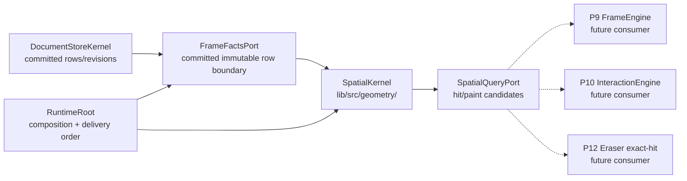
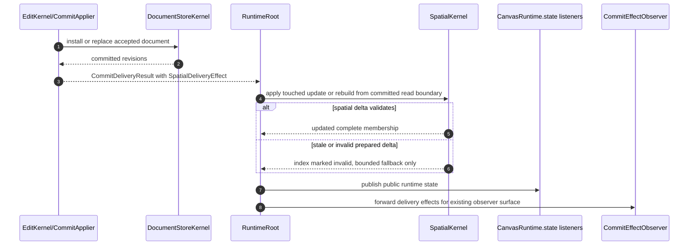

# Design: P8 Geometry And Spatial

---
date: 2026-05-29
designer: Codex
commit: 6daf5b09
branch: new-architecture
design_question: "Design P8 geometry/spatial implementation from .research/2026-05-29-p8-geometry-spatial-readiness.md, including files, diagrams, docs, and smoke test scope."
---

## Disposition

READY_FOR_CONTRACT

## Product Outcome

P8 adds the engine's first bounded geometry and spatial query layer. The user-visible result is that later rendering, selection, marquee, and eraser work can ask for hit or paint candidates without scanning the whole document, without using legacy scene order, and without accepting stale or partial budget-exceeded results.

Non-goals: P8 does not implement frame painting, pointer interaction, selected move, public hit-test APIs, terminal eraser commits, or context-action routing. P8 supplies their geometry primitives, spatial indexes, query results, and update/rebuild seams.

## Target Contract Classification

- Profile: `BEHAVIOR_CHANGE`
- Obligations:
  - `SEAM_MIGRATION`

P8 changes runtime behavior by adding a new derived spatial owner and query/update behavior. It also migrates the existing post-commit spatial delivery effect from a passive observed effect into an owned runtime delivery path, while preserving the existing observer effect surface.

## Research Inputs

- `.research/2026-05-29-p8-geometry-spatial-readiness.md` - confirmed P8 scope, existing read/touched/effect seams, graph metadata, required docs/tests/guardrails, diagnostics routing, and future consumer pressures.

## Repository Evidence

- `docs/implementation/p8_geometry_and_spatial.md:5` - P8 implements geometry, hit-test, paint admission, and spatial candidate lookup before frame/interaction depend on bounded queries.
- `docs/implementation/p8_geometry_and_spatial.md:10` - P8 build scope includes `GeometryPolicy`, `HitTestPolicy`, bounds policy, exact family hit tests, paint admission, eraser primitives, `SpatialKernel`, `TileIndex`, `OutlierIndex`, `SpatialMembership`, touched update, stale rejection, typed budget result, and no global scene traversal.
- `docs/implementation/p8_geometry_and_spatial.md:27` - P8 depends on frozen public geometry/DTOs, P4 committed facts/revisions, P5 touched sets/effects, and P7 resource/image rows.
- `docs/implementation/p8_geometry_and_spatial.md:39` - P8 lists required donors for numeric policy, local bounds, paint admission, transform/math foundations, geometry, hit testing, eraser exact-hit inputs, spatial index/cache behavior, and committed read paths.
- `docs/implementation/p8_geometry_and_spatial.md:81` - P8 proof includes geometry hit policy, no legacy scene order, touched spatial update, no full clone for ordinary update, stale generation rejection, and fallback budget enforcement.
- `docs/implementation/p8_geometry_and_spatial.md:92` - full eraser terminal no-partial proof remains P12; P8 provides primitives and exact-check budget inputs.
- `docs/donors/01_summary_by_decision.md:17` - numeric policy, local bounds, and paint admission are direct-copy donor candidates with proof to port.
- `docs/donors/01_summary_by_decision.md:34` - core geometry is a P8 foundation donor to copy/adapt.
- `docs/donors/02_geometry_hit_test_eraser.md:5` - donor entries are phase-bound implementation inputs, not legacy architecture to copy.
- `docs/donors/02_geometry_hit_test_eraser.md:10` - geometry/hit/eraser donors must be ported as algorithms over new shape structs, not legacy `SceneNode` or `NodeSnapshot` APIs.
- `docs/donors/02_geometry_hit_test_eraser.md:15` - node geometry, hit-test, render geometry builder, interactive geometry, and eraser exact-hit donors preserve algorithms/proofs but carry legacy coupling risks.
- `docs/donors/03_spatial_frame_render_cache.md:5` - spatial/frame/cache donor entries are phase-bound implementation inputs, not legacy architecture to copy.
- `docs/donors/03_spatial_frame_render_cache.md:15` - spatial donors preserve uniform-grid index, hit/paint entries, outlier fallback, structural-revision payloads, lazy build, incremental commit, fallback rebuild, and stale resolve behavior while avoiding legacy shells.
- `docs/contracts/geometry.md:45` - geometry constants include hit slop, path sample cap, spatial cell size, max cells per element, and max query cells.
- `docs/contracts/geometry.md:91` - box/image/text/rect hits use transformed local bounds, inverse transform exact checks, and corrupted non-invertible rows return miss without state mutation until planned diagnostics.
- `docs/contracts/geometry.md:136` - paint bounds are separate from hit bounds and include background plus content elements.
- `docs/contracts/geometry.md:157` - eraser geometry uses a corridor envelope and exact segment-to-family checks while deleting only deletable content in v1.
- `docs/contracts/geometry.md:167` - eraser preview/terminal exact budgets are defined, but P8 owns only primitives and budget foundations.
- `docs/contracts/spatial_kernel.md:41` - `SpatialKernel` owns hit/paint tile indexes, hit/paint outlier indexes, `entriesById`, and `structuralRevision`.
- `docs/contracts/spatial_kernel.md:53` - tile policy defines cell size, outlier threshold, query tile threshold, fallback candidate cap, touched-only ordinary updates, rebuild/reset paths, and no duplicate outlier tiling.
- `docs/contracts/spatial_kernel.md:67` - staged update compiles from `TouchedSet`, validates ids/generations/revisions, applies removals/additions atomically, marks invalid on failure, and returns typed budget-exceeded instead of partial candidates.
- `docs/contracts/spatial_kernel.md:85` - fallback budget behavior is non-hub, returns no partial candidates, schedules rebuild/retry outside hot paths, and may not silently scan the full scene.
- `docs/architecture/03_data_model.md:49` - `DocumentStoreKernel` stores compact committed tables, not live public `CanvasDocument` state.
- `docs/architecture/03_data_model.md:82` - the documented element handle model includes generation, family, location kind, layer id, order token, element revision, structural revision, and bounds revision.
- `docs/architecture/01_runtime_ownership.md:56` - `SpatialKernel` owns coarse candidate lookup and outlier policy and must not be source of truth for the scene.
- `docs/architecture/02_package_boundaries.md:271` - `lib/src/geometry/**` may use only typed geometry/spatial delta/read ports, not concrete store tables or interaction/frame state.
- `docs/architecture/architecture_graph.yaml:48` - P8 is registered as `Geometry and spatial`.
- `docs/architecture/architecture_graph.yaml:380` - `geometry.spatial_index` is a future spatial owner introduced and required by P8.
- `docs/architecture/architecture_graph.yaml:769` - P10 interaction will query the spatial index through a hit-test boundary.
- `docs/architecture/architecture_graph.yaml:840` - P12 eraser/text will consume exact-hit geometry from the spatial owner.
- `docs/architecture/architecture_graph.yaml:1050` - the spatial owner must not depend on the public API facade.
- `docs/architecture/architecture_graph.yaml:1259` - public contracts must not depend on the spatial owner.
- `docs/architecture/architecture_graph.yaml:1402` - internal contracts must not depend on the spatial owner.
- `lib/src/contracts/internal/frame_facts_port.dart:8` - `FrameRevisionFacts` exposes committed document, structural, bounds, visual, background, grid, and resource revisions.
- `lib/src/contracts/internal/frame_facts_port.dart:28` - `FrameElementHandle` currently carries id, structural revision, generation, and order token.
- `lib/src/contracts/internal/frame_facts_port.dart:42` - `FrameElementFacts` carries family, revision, generation, order token, transform, hit padding, visibility/selectability/deletability flags, and family-specific geometry/resource fields.
- `lib/src/contracts/internal/frame_facts_port.dart:144` - `FrameFactsPort` exposes immutable committed row handles, row resolution, and resource descriptor lookup.
- `lib/src/contracts/internal/touched_set.dart:3` - `TouchedSet` exists as the typed post-edit delta input.
- `lib/src/contracts/internal/touched_set.dart:34` - `TouchedSet` distinguishes added, removed, updated, transformed, geometry, visual, resource, layer, background-layer, and replacement changes.
- `lib/src/edit/commit_plan.dart:34` - `SpatialEffect` already carries the touched set in the commit plan.
- `lib/src/contracts/internal/commit_delivery.dart:23` - `SpatialDeliveryEffect` already carries the touched set after commit application.
- `lib/src/edit/commit_compiler.dart:60` - document replacement emits a spatial effect.
- `lib/src/edit/commit_compiler.dart:71` - ordinary bounds changes emit a spatial effect.
- `lib/src/edit/commit_applier.dart:35` - document install/replace is the irreversible committed-state point before delivery effects are materialized.
- `lib/src/runtime/runtime_root.dart:43` - `RuntimeRoot` is the composition point for store/read facts and currently implements `FrameFactsPort`.
- `lib/src/runtime/runtime_root.dart:487` - commit delivery currently publishes state before passing effects to the external observer.
- `lib/src/runtime/runtime_root.dart:507` - load delivery currently publishes state before passing effects to the external observer.
- `lib/src/runtime/runtime_root.dart:429` - public mutations are rejected during post-commit effect delivery.
- `lib/src/store/document_store_kernel.dart:83` - the store emits handles only for the current structural revision.
- `lib/src/store/document_store_kernel.dart:99` - handle resolution rejects stale structural revision or generation.
- `lib/src/store/document_store_kernel.dart:108` - handle resolution rejects order-token/id mismatch.
- `lib/src/store/element_registry.dart:35` - content order is materialized from layer rows.
- `lib/src/store/element_registry.dart:39` - frame order materializes background elements before content order.
- `lib/src/store/element_registry.dart:71` - content element ids are already a committed store fact.
- `lib/src/store/family_tables.dart:312` - common element rows contain transform, opacity, hit padding, visibility, selectability, deletability, transformability, and metadata.
- `docs/diagrams/catalog.md:183` - `dfd_spatial_query_budget` is a registered P8 semantic diagram.
- `docs/diagrams/catalog.md:192` - `seq_spatial_touched_update` is a registered P8 semantic diagram.
- `docs/diagrams/catalog.md:201` - `seq_hit_test_candidate_resolution` is a registered P8/P10 semantic diagram.
- `docs/diagrams/catalog.md:210` - `seq_eraser_exact_budget` is a registered P8/P12 semantic diagram.
- `docs/diagrams/seq_spatial_touched_update.mmd:14` - current spatial touched-update diagram routes post-commit touched ids into `SpatialKernel`.
- `docs/diagrams/seq_spatial_touched_update.mmd:20` - current diagram says spatial reads committed bounds through a typed read port, not concrete store tables.
- `docs/diagrams/dfd_spatial_query_budget.mmd:6` - current spatial budget diagram centers query handling in `SpatialKernel`.
- `docs/diagrams/dfd_spatial_query_budget.mmd:20` - current spatial budget diagram returns candidate handles or typed budget-exceeded results.
- `docs/diagrams/seq_hit_test_candidate_resolution.mmd:17` - future hit-test flow has interaction query `SpatialKernel` and resolve candidate handles through read ports.
- `docs/contracts/diagnostics.md:88` - pure spatial query budget exhaustion is not a DiagnosticsHub write.
- `docs/contracts/diagnostics.md:90` - corrupted committed spatial/hit-test rows are planned P8 geometry/spatial diagnostics.
- `docs/verification/tests.md:162` - verification inventory lists P8 geometry/spatial test ids.
- `docs/verification/tests.md:283` - verification inventory maps those ids to `test/geometry/**` and `test/spatial/**`.
- `docs/verification/tests.md:501` - the existing public incremental smoke test is an external Flutter consumer proof that imports only the root public barrel.
- `docs/verification/tests.md:506` - the smoke test intentionally stays coarse; focused tests own detailed diagnostics.
- `docs/verification/tests.md:508` - the smoke test may expand only by appending the next real public user step after a future phase exposes one.
- `docs/verification/guardrails.md:65` - guardrail inventory includes geometry and spatial guardrail ids.
- `docs/verification/guardrails.md:206` - geometry/spatial guardrail rules forbid legacy scene order, partial eraser budget behavior, full ordinary spatial clones, stale candidates, and unenforced fallback budgets.
- `tool/guardrails/src/guardrail_registry.dart:35` - current blocking guardrail registry exists and must receive P8 guardrail entries.
- `tool/guardrails/src/owner_dag_import_checks.dart:304` - import owner metadata maps `spatial` to `lib/src/geometry/`.
- `tool/architecture_graph/src/phase_closure.dart:16` - architecture graph closure maps the spatial owner to `lib/src/geometry/`.
- `test/smoke/public_incremental_smoke_test.dart:6` - the current smoke test exercises public decode, runtime state, selection, edit, resources, dirty resource, and load flow.

## Design Form Candidates

### Candidate A. Derived SpatialKernel Under Geometry With Existing Committed Read Boundary

- Form: create `SpatialKernel` and geometry policies under `lib/src/geometry/**`; compose the spatial owner in `RuntimeRoot`; feed it existing `SpatialDeliveryEffect`/load effects; use the current `FrameFactsPort` committed immutable row boundary as the typed read boundary, extending it only for missing committed handle facts such as `locationKind`/`layerId` when required by hit/paint scope.
- Why it could work: it keeps `DocumentStoreKernel` as the committed source of truth, keeps spatial indexes derived and rebuildable, uses existing touched-set and delivery seams, follows the `lib/src/geometry/**` owner path, avoids a duplicate read model, and gives P9/P10/P12 a bounded candidate owner.
- Gate failures or risks: the `FrameFactsPort` name is frame-oriented; the future contract must explicitly document that P8 consumes it as the existing committed row read boundary, not as frame engine state. If implementation needs new committed row fields, it must add them to the shared committed read boundary instead of creating a near-duplicate spatial row port.

### Candidate B. SpatialKernel Reads DocumentStoreKernel Directly

- Form: create `SpatialKernel` under `lib/src/geometry/**` but let it read concrete store tables or `DocumentStoreKernel` APIs directly.
- Why it could work: it is mechanically direct and avoids adding fields to the read port.
- Gate failures or risks: fails the package-boundary rule that geometry may use only typed geometry/spatial delta/read ports and not concrete store tables (`docs/architecture/02_package_boundaries.md:271`). It also couples the derived index to the committed store owner and makes future P9/P10/P12 tests prove two responsibilities at once.

### Candidate C. Geometry And Spatial Data Stored In DocumentStoreKernel

- Form: add bounds, hit, paint, tile membership, and query behavior to the store owner.
- Why it could work: it keeps all document-derived facts close to committed rows.
- Gate failures or risks: fails the runtime ownership rule that `SpatialKernel` owns coarse candidate lookup/outlier policy but is not source of truth for the scene (`docs/architecture/01_runtime_ownership.md:67`). It makes the store responsible for query policy, budget behavior, and future interaction/frame query semantics, and it increases migration cost for P9/P10/P12.

### Candidate D. New SpatialFactsPort Parallel To FrameFactsPort

- Form: create a separate `contracts/internal` read port carrying spatial row facts and have `RuntimeRoot` implement both it and `FrameFactsPort`.
- Why it could work: it gives P8 a better-named spatial boundary and can be kept store-independent.
- Gate failures or risks: it duplicates most of the existing committed row shape already exposed by `FrameFactsPort` (`lib/src/contracts/internal/frame_facts_port.dart:42`). Without a stronger missing-field need, it creates drift risk across two immutable row projections. This remains a fallback only if P8 proves `FrameFactsPort` cannot be made a cohesive shared committed read boundary.

## Known Future Pressures

| Pressure | Evidence | How the selected form responds | Accepted cost or risk |
|---|---|---|---|
| P9 needs paint candidates and cache inputs without live runtime/store reads. | `docs/implementation/p9_frame_rendering_and_caches.md:5`, `docs/implementation/p9_frame_rendering_and_caches.md:35`, `docs/contracts/frame_rendering.md:33` | `SpatialKernel` returns bounded paint candidates derived from committed rows; frame remains a consumer through read/query boundaries. | P8 must define paint query results before P9 exists, so query DTOs must stay internal and minimal. |
| P10 needs hit testing and marquee candidates. | `docs/implementation/p10_selection_and_move.md:45`, `docs/architecture/architecture_graph.yaml:769` | P8 exposes a read-only spatial query seam and exact hit policy primitives but leaves pointer/session ownership to P10. | P8 cannot prove full selection UX; it proves deterministic candidate ordering, stale rejection, and exact hit behavior. |
| P12 needs eraser exact-hit and budget primitives but owns terminal no-partial commit. | `docs/implementation/p12_eraser_and_context_action_request.md:37`, `docs/implementation/p12_eraser_and_context_action_request.md:97`, `docs/implementation/p8_geometry_and_spatial.md:92` | P8 implements eraser geometry primitive checks and exact-budget result shapes; P12 later composes them with interaction cleanup and edit commits. | P8 tests must not overclaim P12 terminal behavior; full no-partial erase proof remains P12. |
| Diagnostics routing separates pure spatial budget counters from corrupted-row diagnostics. | `docs/contracts/diagnostics.md:88`, `docs/contracts/diagnostics.md:90` | P8 budget-exceeded paths increment non-hub counters only; corrupted committed row detection is routed through a planned geometry/spatial diagnostics bridge under policy. | P8 may need a small internal diagnostics/counter seam; it must not expose a public diagnostics stream or allocate hub records for pure budget exhaustion. |
| Architecture graph closure expects a `SpatialKernel` declaration under the spatial owner path. | `docs/architecture/architecture_graph.yaml:380`, `tool/architecture_graph/src/phase_closure.dart:16` | P8 creates `SpatialKernel` in `lib/src/geometry/` and updates graph status/docs after implementation. | Graph closure will fail until production and docs are updated in the later Change Contract. |
| Donor code is intended input for P8 but must not drag legacy architecture forward. | `docs/implementation/p8_geometry_and_spatial.md:39`, `docs/donors/02_geometry_hit_test_eraser.md:10`, `docs/donors/03_spatial_frame_render_cache.md:15` | Port/copy/adapt donor algorithms into the selected `lib/src/geometry/**` owners and port their proofs into root tests, while rejecting legacy traversal, controller facades, snapshots, and scene shells. | The future contract must budget explicit donor mapping work; donor parity proof is required, but donor structure is not authoritative. |
| Existing smoke test is the single cross-phase public consumer path, while P8 has no public hit-test API. | `test/smoke/public_incremental_smoke_test.dart:6`, `docs/verification/tests.md:501`, `docs/verification/tests.md:506`, `docs/implementation/p8_geometry_and_spatial.md:115` | Extend the existing smoke only as a public-barrel geometry-rich decode/edit/load scenario, and update `docs/verification/tests.md` to record that P8's smoke contribution is coarse public compatibility coverage. Internal spatial query, rebuild, stale, and budget proof stays in focused tests. | The smoke will not directly prove bounded spatial internals; focused `test/geometry/**`, `test/spatial/**`, and runtime delivery-order tests carry that proof. |

## Selected Form

Use Candidate A: a derived `SpatialKernel` and geometry policy family under `lib/src/geometry/**`, composed by `RuntimeRoot`, fed by existing touched/load delivery effects, and reading committed rows through the existing immutable committed read boundary.

The selected form keeps committed scene truth in `DocumentStoreKernel`; keeps geometry and spatial membership as derived, rebuildable state; and keeps all future consumers on a read-only query seam. The only read-boundary migration allowed in P8 is to extend the existing committed row handle/facts boundary with missing durable handle facts such as `locationKind` and `layerId`, because current docs already model those facts as part of `ElementHandle` while the current implementation carries only id, structural revision, generation, and order token.

Runtime delivery order must change: for accepted commits and loads that carry spatial effects, `RuntimeRoot` applies the spatial touched update or rebuild before public state publication and before the external commit-effect observer. If the spatial update cannot validate its delta, the committed document remains accepted, the spatial index is marked invalid, and subsequent queries return bounded fallback or typed budget-exceeded results until a rebuild/retry runs outside the hot pointer/paint path.

P8 donor use is mandatory and must be mapped before implementation. The future Change Contract must account for every required P8 donor from `docs/implementation/p8_geometry_and_spatial.md`:

| Donor | Required decision | Target owner |
|---|---|---|
| `direct_numeric_policy` | `copy` | `GeometryPolicy` numeric tolerance foundation |
| `direct_local_bounds_policy` | `copy` | `GeometryPolicy` local bounds |
| `direct_paint_admission` | `copy` | paint admission policy |
| `foundation_transform2d` | `copy/adapt` | `CanvasTransform` and geometry math |
| `foundation_core_geometry` | `copy/adapt` | `GeometryPolicy` v1 |
| `geometry_node_geometry` | `adapt` | `GeometryPolicy` and `HitTestPolicy` |
| `geometry_hit_test` | `adapt` | `HitTestPolicy` v1 |
| `render_geometry_builder` | `adapt` | render geometry construction inputs for later `RenderElementRecord` use |
| `geometry_interactive_geometry` | `copy/adapt` | draw and eraser geometry helpers |
| `geometry_eraser_exact_hit` | `adapt` | eraser exact-hit engine inputs |
| `spatial_scene_spatial_index` | `adapt` | `SpatialKernel` tile and outlier indexes |
| `spatial_index_cache` | `adapt` | `SpatialKernel` invalidation/cache behavior |
| `store_scene_controller_read_paths` | `adapt` | committed read and candidate resolve through immutable query ports |

These donors provide algorithms and proof cases, not architecture. The implementation must port them over new P8 shape structs and selected owners, and must reject legacy `SceneNode`, `NodeSnapshot`, scene/controller facades, legacy scene order, and cache shells.

The future Change Contract must also preserve every P8 forbidden donor-structure decision:

| Forbidden donor structure | Required decision |
|---|---|
| `avoid_scene_controller_facades` | `avoid` |
| `avoid_interactive_runtime_whole` | `avoid` |
| `avoid_scene_builder_public_architecture` | `avoid` |
| `avoid_scene_codec_whole` | `avoid` |
| `avoid_scene_store_controller_whole` | `avoid` |

## Hard Gate Check

| Gate | Result | Evidence |
|---|---|---|
| Root cause | pass | P8's missing owner is `geometry.spatial_index`, registered as future and required by P8 (`docs/architecture/architecture_graph.yaml:380`), while current source has no `lib/src/geometry/**` directory. The selected form introduces that owner instead of patching a frame/interaction call site. |
| Ownership | pass | Runtime ownership says `SpatialKernel` owns coarse candidate lookup/outlier policy and is not source of truth for the scene (`docs/architecture/01_runtime_ownership.md:67`). Store remains committed truth (`docs/architecture/03_data_model.md:49`). |
| Source of truth | pass | Spatial entries, tile pages, outlier sets, and counters are derived from committed rows read through `FrameFactsPort` (`lib/src/contracts/internal/frame_facts_port.dart:144`) and touched sets (`lib/src/contracts/internal/touched_set.dart:34`); invalid or stale derived state is discarded/rebuilt rather than treated as committed truth. |
| Boundary | pass | Entry boundaries are commit/load spatial effects (`lib/src/contracts/internal/commit_delivery.dart:23`) and read-only candidate query requests. Exit boundaries are typed candidate results, typed budget/invalid results, and non-hub counters. Geometry must not read concrete store tables (`docs/architecture/02_package_boundaries.md:271`). |
| Dependency direction | pass | `lib/src/geometry/**` is an implementation owner and may consume contracts/internal read facts; contracts/internal must not depend on spatial (`docs/architecture/architecture_graph.yaml:1402`), and spatial must not depend on public API facade (`docs/architecture/architecture_graph.yaml:1050`). |
| State/data | pass | Committed rows and revisions remain in `DocumentStoreKernel`; `SpatialKernel` owns derived `hitIndex`, `paintIndex`, outliers, `entriesById`, invalid flag, structural revision, and non-hub counters as cache-like state (`docs/contracts/spatial_kernel.md:41`). |
| Seam | pass | Successor seam is `SpatialQueryPort`/`SpatialKernel` read-only candidate query plus existing `SpatialDeliveryEffect`; no public API seam is introduced. Existing passive observer delivery remains for tests/observers, but runtime consumes spatial effects before forwarding them. |
| Temporal/reentrancy | pass | The synchronous window is store install/replace (`lib/src/edit/commit_applier.dart:35`) -> runtime spatial update/rebuild -> public state publication -> external effect observer (`lib/src/runtime/runtime_root.dart:487`). Guard owner is `RuntimeRoot`; it already rejects public mutation during post-commit delivery (`lib/src/runtime/runtime_root.dart:429`). Callback surfaces in the window are `ValueNotifier` listeners during `_publishRuntimeState` and `CommitEffectObserver`; both must observe the committed document only after spatial state is updated or marked invalid. |
| All-or-nothing behavior | pass | For document commits, the irreversible point is store install/replace (`lib/src/edit/commit_applier.dart:35`). Spatial delta preparation and validation must happen before publishing new spatial memberships; failed validation discards the prepared delta and marks the index invalid per contract (`docs/contracts/spatial_kernel.md:67`). The accepted document is not rolled back; later spatial failure is failure-contained as invalid-index/bounded fallback state. |
| Verification | pass | Required tests and guardrails are already registered (`docs/verification/tests.md:162`, `docs/verification/guardrails.md:65`). The future contract can create focused geometry, spatial, guardrail, architecture graph, and runtime delivery-order proofs, while the existing smoke remains a public-barrel compatibility proof (`docs/verification/tests.md:501`). |
| Future pressure | pass | P9/P10/P12 consumer pressure is documented and the selected form provides bounded internal query/result primitives without taking over frame, interaction, or eraser terminal commit ownership (`docs/implementation/p9_frame_rendering_and_caches.md:5`, `docs/implementation/p10_selection_and_move.md:45`, `docs/implementation/p12_eraser_and_context_action_request.md:37`). |

## Lock-Required Facts

- Owner: `SpatialKernel` under `lib/src/geometry/**`.
- Owning layer/module/document family: geometry/spatial implementation owner; committed read facts remain under `contracts/internal`; committed state remains under `store`; runtime composition remains under `runtime`.
- Seam: existing `SpatialDeliveryEffect` for post-commit/load update delivery; new internal read-only spatial query seam owned by `SpatialKernel`; existing `FrameFactsPort` as committed immutable row read boundary, extended only for missing durable handle facts.
- Dependency/import direction: geometry may import `contracts/internal` and `contracts/public` DTO value types but not `store`, `runtime`, `frame`, `interaction`, `surface`, or public API facade. Contracts/internal must not import geometry.
- State/data ownership: committed rows/revisions in `DocumentStoreKernel`; derived hit/paint bounds, tile memberships, outliers, entries, invalid flag, structural revision, and budget counters in `SpatialKernel`; no duplicated committed document state.
- Entry boundaries: runtime construction/initial rebuild, accepted edit `SpatialDeliveryEffect`, accepted load replacement/rebuild, read-only hit/paint/marquee/eraser candidate query requests.
- Exit boundaries: typed candidate handles, typed budget-exceeded results, typed invalid-index/rebuild-needed result, non-hub budget counters, planned corrupted-row diagnostics route under policy.
- File placement basis: production geometry/spatial types live under `lib/src/geometry/**`; committed row read boundary changes stay in `lib/src/contracts/internal/frame_facts_port.dart`; store handle materialization changes stay in `lib/src/store/**`; composition/delivery order changes stay in `lib/src/runtime/runtime_root.dart`.
- Execution order constraints: spatial update/rebuild must run after accepted store install/replace and before public state publication or external effect observer delivery. Query hot paths must not mutate indexes. Rebuild/retry after invalid index must run outside pointer/paint hot paths.
- Rejected alternatives: direct store reads from geometry; storing spatial truth in `DocumentStoreKernel`; adding a duplicate `SpatialFactsPort` before proving the existing committed row boundary is insufficient; public API exposure in P8.
- Verification strategy: focused geometry and spatial unit tests, donor parity proof ports, structural guardrail tests, semantic no-legacy/no-full-clone proofs, runtime delivery-order tests, architecture graph P8 closure checks, docs/diagram checks for source-of-truth updates, and the existing cross-phase smoke test extended only with public-barrel P8 compatibility behavior.

## Diagram Need Assessment

| Design question | Needed? | Diagram kind | Reason |
|---|---:|---|---|
| Does the design change ownership, layer, package, or component boundaries? | yes | c4 | P8 creates the concrete `SpatialKernel` owner under `lib/src/geometry/**` and clarifies its read/query boundaries with runtime, store, and future consumers. |
| Does it change data flow, state ownership, cache ownership, resource movement, or lifecycle movement? | yes | data_flow | Spatial membership is derived cache-like state fed by committed rows and touched sets; invalid/budget behavior must be visible. |
| Does it depend on call order, lifecycle order, sync/async ordering, failure ordering, or migration order? | yes | sequence | Commit/load delivery must update or invalidate spatial state before public state publication and external observer callbacks. |
| Does it introduce or alter modes, statuses, terminal states, sessions, or transition rules? | yes | state | `SpatialKernel` has valid, invalid, rebuilding/reset, and budget-exceeded query outcomes. Durable state diagram can be deferred if sequence/data-flow diagrams prove the same transitions. |
| Does it create, replace, migrate, or retire a shared seam? | yes | sequence | The existing passive `SpatialDeliveryEffect` becomes a runtime-consumed delivery seam while preserving observer forwarding. |
| Does it change public API consumer flow, payload shape, or compatibility behavior? | no | none | P8 is internal and must not add a public hit-test API. |
| Does it introduce or change analyzer, guardrail, or structural-recognition pipeline behavior? | yes | data_flow | P8 adds geometry/spatial guardrail runner entries and structural proofs for no legacy scene order, no ordinary full clone, stale rejection, and budget enforcement. |

## Provisional Diagrams

The durable docs already contain the main P8 semantic diagrams. The future Change Contract should update those durable diagrams only where they currently leave the read boundary or delivery ordering ambiguous.

## Source-Of-Truth Impact

Future production files to create:

- `lib/src/geometry/geometry_policy.dart` - constants, bounds, family geometry helpers, paint admission, eraser primitive budget foundations.
- `lib/src/geometry/hit_test_policy.dart` - hit eligibility, content/background scope filtering, exact family hit orchestration, topmost hit resolution over candidate handles.
- `lib/src/geometry/spatial_kernel.dart` - owner for derived spatial state, touched update, rebuild/reset, invalid-index handling, query entrypoints, and counter hooks.
- `lib/src/geometry/spatial_query_port.dart` - internal read-only query/result seam for future frame/interaction/eraser consumers.
- `lib/src/geometry/spatial_query_result.dart` - typed candidate, budget-exceeded, stale/invalid, and rebuild-needed result shapes with no partial candidates.
- `lib/src/geometry/spatial_membership.dart` - previous/current hit/paint membership by element id.
- `lib/src/geometry/tile_index.dart` - tile page membership and touched-page update behavior.
- `lib/src/geometry/outlier_index.dart` - outlier-only membership for large covered-tile elements.
- `lib/src/geometry/spatial_budget_counters.dart` - non-hub counters/probes for pure spatial budget and invalid-index paths.

Future production files to update:

- `lib/src/contracts/internal/frame_facts_port.dart` - extend committed row handles/facts with missing durable scope facts (`locationKind`, and `layerId` if needed) instead of creating a duplicate spatial row port.
- `lib/src/store/element_registry.dart` - materialize committed handle scope/layer facts from background and content order.
- `lib/src/store/document_store_kernel.dart` - emit and validate extended committed handles while preserving stale structural revision/generation/order-token rejection.
- `lib/src/runtime/runtime_root.dart` - compose `SpatialKernel`, run initial/load rebuilds and touched spatial delivery before public state/observer delivery, and expose only internal query seams.
- `lib/src/edit/commit_compiler.dart` and `lib/src/edit/commit_applier.dart` - update only if the existing spatial effect payload is insufficient; the preferred contract should keep current effect types unchanged.

Future test files to create or update:

- `test/geometry/hit_policy_test.dart`
- `test/geometry/no_legacy_scene_order_test.dart`
- `test/geometry/eraser_exact_budget_inputs_test.dart` or the existing registered `test/geometry/eraser_exact_budget_no_partial_commit_test.dart` if the contract deliberately includes the P12-owned terminal proof as a characterization-only foundation.
- `test/spatial/touched_update_test.dart`
- `test/spatial/no_full_clone_for_touched_update_test.dart`
- `test/spatial/stale_generation_rejected_test.dart`
- `test/spatial/fallback_budget_enforced_test.dart`
- `test/spatial/runtime_delivery_order_test.dart`
- `test/smoke/public_incremental_smoke_test.dart`
- `test/guardrails/geometry_no_legacy_scene_order_guardrail_test.dart`
- `test/guardrails/spatial_no_full_clone_ordinary_edit_guardrail_test.dart`
- `test/guardrails/spatial_stale_candidate_rejected_guardrail_test.dart`
- `test/guardrails/spatial_fallback_budget_enforced_guardrail_test.dart`

Future tooling/guardrail files to update:

- `tool/guardrails/src/guardrail_registry.dart` - register P8 geometry/spatial guardrail ids.
- `tool/guardrails/src/owner_dag_import_checks.dart` - should already name `spatial` as `lib/src/geometry/`; update only if new owner paths require fixture coverage.
- Guardrail implementation files under `tool/guardrails/src/**` as needed for semantic searches/structural checks for no legacy imports, no direct store reads from geometry, no ordinary full spatial clone, stale candidate rejection, and typed budget result enforcement.

Future docs and registries to update:

- `PLAN.md` and the future P8 step document - add/complete the P8 implementation step during Change Contract workflow, not during design.
- `docs/implementation/p8_geometry_and_spatial.md` - record selected read-boundary/delivery-order decisions if the implementation changes or clarifies source docs.
- `docs/contracts/geometry.md` - update only for any exact policy wording discovered during implementation; do not move P12 terminal proof into P8.
- `docs/contracts/spatial_kernel.md` - clarify `FrameFactsPort`/committed read boundary naming, runtime delivery ordering, invalid-index result shape, and counter ownership if implementation uses those names.
- `docs/contracts/diagnostics.md` - update only if the corrupted-row diagnostics bridge or counter seam is concretely introduced in P8.
- `docs/architecture/01_runtime_ownership.md` - confirm `SpatialKernel` ownership and non-source-of-truth status after implementation.
- `docs/architecture/02_package_boundaries.md` - update only if new geometry files require more exact import-boundary wording.
- `docs/architecture/03_data_model.md` - align element handle implementation facts if P8 adds `locationKind`/`layerId` to the committed read handle.
- `docs/architecture/architecture_graph.yaml` - move `geometry.spatial_index` from future to required/implemented when P8 closes and ensure actual declaration `SpatialKernel` resolves.
- `docs/verification/tests.md` - ensure P8 focused tests remain mapped to actual files, and update the existing smoke-test description to name P8's coarse public-barrel geometry-rich compatibility coverage; do not register a separate P8 smoke path.
- `docs/verification/guardrails.md` - ensure P8 guardrail descriptions match runner implementation.
- `docs/indexes/by_phase.md`, `docs/indexes/by_test_area.md`, `docs/indexes/by_guardrail.md`, `docs/indexes/by_subsystem.md`, and other generated indexes - update through `dart run docs/tool/sync_generated_docs.dart` after source docs change.

Future durable diagrams to update or verify:

- `docs/diagrams/c4_component_runtime.mmd` - verify `SpatialKernel` owner label and read/query relationships.
- `docs/diagrams/dfd_cache_invalidation.mmd` - align spatial invalidation flow with touched-only update and invalid-index fallback.
- `docs/diagrams/dfd_spatial_query_budget.mmd` - align typed result names and non-hub counter ownership.
- `docs/diagrams/seq_spatial_touched_update.mmd` - replace ambiguous "Typed spatial read port" wording with the selected committed read boundary and show runtime-before-publication ordering if needed.
- `docs/diagrams/seq_hit_test_candidate_resolution.mmd` - align candidate handle fields, stale rejection, and corrupted-row route with implementation.
- `docs/diagrams/seq_eraser_exact_budget.mmd` - keep P8 primitive/budget ownership separate from P12 terminal commit proof.
- `docs/diagrams/catalog.md` - update only if diagram metadata changes.
- `docs/diagrams/generated/current_phase.mmd`, `docs/diagrams/generated/future_target.mmd`, `docs/diagrams/generated/full_architecture.mmd`, `docs/diagrams/generated/actual_vs_expected_diff.mmd`, and `docs/diagrams/generated/release_verification.mmd` - regenerate/check after architecture graph updates.

## Verification Impact

Future automated checks:

- `dart analyze`
- `dcm analyze .`
- `dcm calculate-metrics .`
- Focused geometry tests under `test/geometry/**`.
- Focused spatial tests under `test/spatial/**`.
- Focused runtime delivery-order tests for spatial update before public state/observer callbacks.
- Guardrail tests and guardrail runner coverage for P8 ids.
- `dart test test/smoke/public_incremental_smoke_test.dart`
- `dart run tool/architecture_graph/check.dart --phase P8`
- `dart run tool/architecture_graph/generate_views.dart --phase P8 --check`
- `dart run docs/tool/sync_generated_docs.dart --check`
- `dart run docs/tool/check_docs.dart`

Smoke test scope:

- Extend the existing `test/smoke/public_incremental_smoke_test.dart`; do not create a separate P8 smoke file.
- Keep the smoke as an external Flutter consumer that imports only `package:iwb_canvas_engine/iwb_canvas_engine.dart`.
- Append a geometry-rich public scenario: decode/read a document with background elements and overlapping transformed content elements, perform one public geometry-changing edit, then load a replacement geometry-rich document.
- Assert only public outcomes: runtime summaries/revisions, `readDocument()` geometry-bearing elements, selection/resource/load behavior, and no public API/import leakage.
- Do not assert internal spatial candidates, internal rebuild counters, stale handles, or budget-exceeded result shapes in smoke; those belong to focused P8 tests.

## Verification Strategy

The future Change Contract should prove P8 in layers:

1. Donor mapping proves every P8 donor from `docs/implementation/p8_geometry_and_spatial.md` was either copied, adapted, rejected, or deferred with a reason tied to the new owner model.
2. Geometry policy tests prove constants, finite/invertible rules, bounds, family exact hit behavior, paint admission, marquee inclusion, and eraser primitive/budget inputs, using donor proofs as parity inputs where applicable.
3. Spatial unit tests prove tile/outlier membership, touched-only deltas, full rebuild only for load/replacement/reset paths, stale generation/structural revision rejection, invalid-index fallback, and typed budget-exceeded no-partial behavior, using spatial donor tests as parity inputs where applicable.
4. Runtime tests prove delivery order: after an accepted edit/load, spatial state is updated or marked invalid before `CanvasRuntime.state` listeners and `CommitEffectObserver` can observe the result.
5. Guardrails prove no legacy scene traversal/order logic, no direct geometry imports of store/runtime/frame/interaction internals, no ordinary full spatial clone, stale rejection, and budget enforcement.
6. The existing cross-phase smoke test proves P8 only at the public compatibility level through geometry-rich decode/read/edit/load flow; it must not use internal instrumentation or replace focused P8 proofs.
7. Architecture/docs checks prove `SpatialKernel` closes P8 graph metadata and durable diagrams/docs match the implemented seams.

## Change Contract Handoff

- Required profile: `BEHAVIOR_CHANGE`
- Required obligations:
  - `SEAM_MIGRATION`
- Decisions to carry forward:
  - Implement `SpatialKernel` under `lib/src/geometry/**` as derived state, not committed scene truth.
  - Use the existing committed immutable row boundary (`FrameFactsPort`) for P8 reads; extend it for missing durable handle facts instead of adding a duplicate spatial row port unless implementation evidence proves it cannot remain cohesive.
  - Compose and update/rebuild spatial state in `RuntimeRoot`.
  - Process spatial update/rebuild before public state publication and before forwarding delivery effects to the external observer.
  - Return typed budget/invalid results with no partial candidates; never silently scan the full scene.
  - Use every P8 donor listed in `docs/implementation/p8_geometry_and_spatial.md:41` through `docs/implementation/p8_geometry_and_spatial.md:53` as a mandatory algorithm/proof input, but port them into new shape structs and selected owners rather than copying legacy `SceneNode`, `NodeSnapshot`, controller, scene, or cache-shell architecture.
  - Keep pure spatial budget paths out of DiagnosticsHub; route corrupted committed row diagnostics only through the planned geometry/spatial policy path.
  - Keep full eraser terminal no-partial commit proof in P12; P8 owns primitives and budget input shapes.
  - Extend `test/smoke/public_incremental_smoke_test.dart` only with public-barrel geometry-rich compatibility coverage; do not create a separate P8 smoke test and do not assert internal spatial details in smoke.
- Evidence to cite:
  - P8 scope and proof: `docs/implementation/p8_geometry_and_spatial.md:10`, `docs/implementation/p8_geometry_and_spatial.md:81`, `docs/implementation/p8_geometry_and_spatial.md:92`
  - Donor inputs: `docs/implementation/p8_geometry_and_spatial.md:39`, `docs/donors/01_summary_by_decision.md:17`, `docs/donors/01_summary_by_decision.md:34`, `docs/donors/02_geometry_hit_test_eraser.md:10`, `docs/donors/03_spatial_frame_render_cache.md:15`
  - Geometry policy: `docs/contracts/geometry.md:45`, `docs/contracts/geometry.md:91`, `docs/contracts/geometry.md:136`, `docs/contracts/geometry.md:157`, `docs/contracts/geometry.md:167`
  - Spatial contract: `docs/contracts/spatial_kernel.md:41`, `docs/contracts/spatial_kernel.md:53`, `docs/contracts/spatial_kernel.md:67`, `docs/contracts/spatial_kernel.md:85`
  - Runtime/store/read seams: `lib/src/contracts/internal/frame_facts_port.dart:144`, `lib/src/contracts/internal/touched_set.dart:34`, `lib/src/contracts/internal/commit_delivery.dart:23`, `lib/src/edit/commit_applier.dart:35`, `lib/src/runtime/runtime_root.dart:487`, `lib/src/runtime/runtime_root.dart:507`, `lib/src/store/document_store_kernel.dart:99`
  - Owner/import boundaries: `docs/architecture/01_runtime_ownership.md:67`, `docs/architecture/02_package_boundaries.md:271`, `docs/architecture/architecture_graph.yaml:380`, `tool/architecture_graph/src/phase_closure.dart:16`
  - Tests/guardrails/docs: `docs/verification/tests.md:162`, `docs/verification/tests.md:283`, `docs/verification/guardrails.md:206`, `tool/guardrails/src/guardrail_registry.dart:35`
  - Smoke policy: `docs/verification/tests.md:501`, `docs/verification/tests.md:506`, `docs/verification/tests.md:508`, `test/smoke/public_incremental_smoke_test.dart:6`
- Contract constraints or sequencing facts:
  - Start by extending/confirming committed handle facts needed by geometry scope and ordering.
  - Map each required P8 donor to copy/adapt/reject/defer before implementation, then port algorithms/proofs into new owners without legacy architectural shells.
  - Implement pure geometry policy before spatial indexing so spatial entries can store derived hit/paint bounds from one policy owner.
  - Implement `SpatialKernel` update/rebuild/query result shapes before wiring runtime delivery.
  - Wire runtime delivery before extending the existing cross-phase smoke test, but keep direct spatial update/rebuild/stale/budget assertions in focused tests rather than smoke.
  - Add guardrails after concrete file names and patterns exist, then run architecture graph/docs generation checks.

## Open Decisions

None. The design is ready for future Change Contract authoring.
