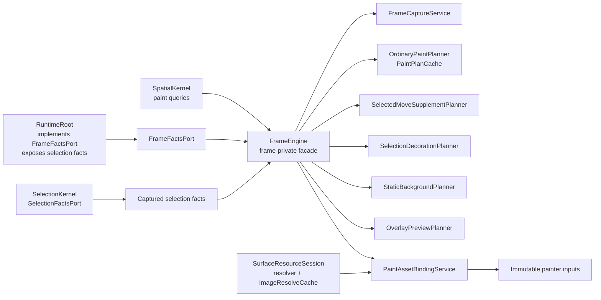
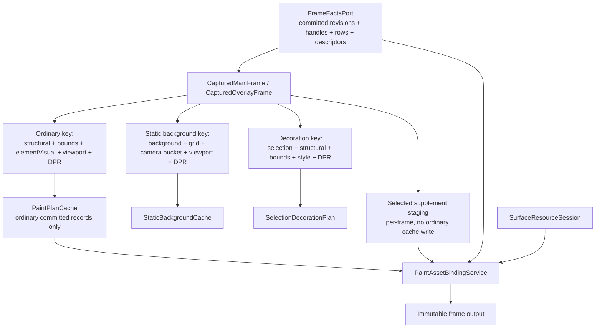
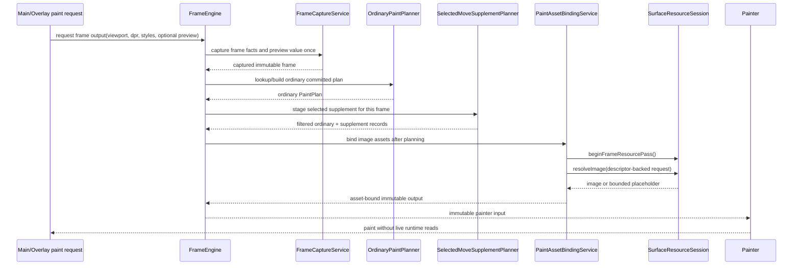

# Design: P9 Frame Rendering And Caches

## Disposition

READY_FOR_CONTRACT

## Product Outcome

P9 should turn the currently documented frame-rendering obligation into an implemented internal frame pipeline that produces immutable painter-safe frame output, closes the public `CanvasRuntime.preview` placeholder enough for frame capture to read public preview state, keeps ordinary paint-plan caches independent from selection, preview, background, grid, and camera churn, and proves the new behavior through focused frame tests plus the public incremental smoke test. It should not expose frame collaborators through the public package barrel, change public DTO shapes, or complete P10 interaction preview producer behavior.

## Target Contract Classification

- Profile: BEHAVIOR_CHANGE
- Obligations:
  - SEAM_MIGRATION: activate documented future frame seams by making frame code consume `FrameFactsPort`, `SelectionFactsPort` facts, `SpatialKernel` paint queries, and `SurfaceResourceSession` without replacing those seam contracts.

## Research Inputs

- `.research/2026-05-29-p9-frame-rendering-and-caches.md` - current P9 state, existing ports, implemented P7/P8 owners, missing frame implementation, graph status, tests, and guardrail gaps.

## Repository Evidence

- `.research/2026-05-29-p9-frame-rendering-and-caches.md:13` - frame-adjacent P9 boundaries already exist: `FrameFactsPort`, `SelectionFactsPort`, `SurfaceResourceSession`, and `SpatialKernel`.
- `.research/2026-05-29-p9-frame-rendering-and-caches.md:15` - P9 frame rendering is still future work, with no current `lib/src/frame/**` or `test/frame/**` files found during research.
- `.research/2026-05-29-p9-frame-rendering-and-caches.md:17` - docs name P9 tests and guardrails, but executable guardrail registry currently has no frame/cache entries.
- `docs/implementation/p9_frame_rendering_and_caches.md:5` - P9 purpose includes frame capture, paint planning, painter-safe records, resource resolution in paint, selected supplement staging, and bounded render caches.
- `docs/implementation/p9_frame_rendering_and_caches.md:12` - P9 build scope names `FrameEngine`, captured frames, records, paint plans, repaint buses, selected supplement staging, and caches.
- `docs/implementation/p9_frame_rendering_and_caches.md:45` - current P9 docs accept `FrameEngine` as the frame-internal facade with seven focused frame-private collaborators.
- `docs/implementation/p9_frame_rendering_and_caches.md:110` - P9 lists required donor decisions and target owners.
- `docs/implementation/p9_frame_rendering_and_caches.md:127` - P9 lists forbidden donor structures to avoid.
- `docs/implementation/p9_frame_rendering_and_caches.md:61` - implementation must keep committed facts behind `FrameFactsPort`, selection facts behind the selection boundary, and resolver/session access isolated to `SurfaceResourceSession`.
- `docs/implementation/p9_frame_rendering_and_caches.md:135` - P9 names diagrams to read or update.
- `docs/implementation/p9_frame_rendering_and_caches.md:155` - P9 names focused tests and guardrails that should prove the phase.
- `docs/contracts/frame_rendering.md:103` - frame rules require main and overlay capture once, committed facts through `FrameFactsPort`, no live runtime reads in painters, no `CanvasDocument` materialization, and image resolution through `SurfaceResourceSession`.
- `docs/contracts/frame_rendering.md:130` - the frame rendering contract accepts the same seven-collaborator internal split.
- `docs/contracts/frame_rendering.md:199` - selected supplement staging requires ordinary cache lookup/build first, per-frame selected filtering, shifted candidate lookup, current row resolution, merge by `orderToken`, no global sort, and no `CanvasDocument`.
- `docs/contracts/cache_policy.md:40` - cache policy ledger names frame-owned TextLayout, PathGeometry, StrokePath, StaticBackground, PaintPlan, SelectionDecorationPlan, and SelectedOrder caches with keys, capacities, eviction, and probes.
- `docs/contracts/cache_policy.md:65` - `PaintPlanCache` stores ordinary committed records only and excludes selected supplement, preview, selection, background, grid, view camera, and style-only inputs from ordinary keys or records.
- `docs/contracts/resources.md:89` - paint resource resolution receives descriptor snapshots through `FrameFactsPort`; `PaintAssetBindingService` is the only target frame collaborator that receives `SurfaceResourceSession`.
- `docs/contracts/resources.md:114` - `ImageResolveCache` remains `SurfaceResourceSession` policy, not frame or runtime-wide state.
- `docs/contracts/spatial_kernel.md:99` - spatial query hot path is revision/generation gated, budgeted, typed, and cannot silently scan the full scene.
- `docs/contracts/frame_rendering.md:41` - frame contract requires the public preview sealed-union API contract proof for P9.
- `docs/contracts/frame_rendering.md:42` - frame contract requires Flutter bridge widget paint proof for P9.
- `docs/contracts/frame_rendering.md:43` - frame contract names preview and API guardrails alongside frame/cache guardrails.
- `docs/contracts/public_api_v1.md:1870` - the public API exposes read-only preview state for application rendering of pending previews.
- `docs/contracts/public_api_v1.md:2052` - preview state is immutable, variants are the only valid payload shapes, and no `CanvasDocument` materialization is allowed in preview getters.
- `lib/src/contracts/public/canvas_preview.dart:16` - the public `CanvasPreviewState` sealed union and variants already exist.
- `lib/src/runtime/runtime_root.dart:115` - `RuntimeRoot` already tracks the public preview revision domain.
- `lib/src/runtime/runtime_root.dart:479` - runtime state publication already includes `previewRevision`.
- `docs/architecture/01_runtime_ownership.md:63` - `InteractionEngine` owns pointer sessions, tools, and preview state producer policy.
- `docs/architecture/01_runtime_ownership.md:71` - `RuntimeRoot` owns public `CanvasRuntime.state` observation after accepted preview changes.
- `docs/architecture/01_runtime_ownership.md:164` - preview and view-camera facts stay runtime/interaction-owned and are captured at frame boundaries.
- `docs/architecture/02_package_boundaries.md:112` - package boundary docs list target `lib/src/frame/**` files, including frame engine, capture service, planners, records, and repaint bus.
- `docs/architecture/02_package_boundaries.md:188` - target frame collaborator files are frame-private implementation details and omitted from the public package barrel.
- `docs/architecture/02_package_boundaries.md:212` - frame code obtains committed facts through `contracts/internal/frame_facts_port.dart`, not concrete store files.
- `docs/architecture/02_package_boundaries.md:270` - frame code may not import public document projection as paint input or `ResourceCatalogPort` as an asset-binding seam.
- `docs/implementation/p13_flutter_surface.md:11` - P13 owns the full `CanvasSurface` widget, active-surface gate, pointer adapter, painters, resource-session lifecycle wiring, and widget paint for empty/populated documents.
- `docs/implementation/p13_flutter_surface.md:32` - P13 depends on P9 frame rendering exposing main and overlay frame/painter inputs.
- `docs/implementation/p13_flutter_surface.md:106` - P13 satisfies painter capture, no-live-runtime-read, and opacity/saveLayer policy from the frame contract.
- `lib/src/api/canvas_surface.dart:30` - current `CanvasSurface` builds `SizedBox.shrink`, so public smoke cannot yet prove frame output exists through the public widget.
- `lib/src/contracts/internal/frame_facts_port.dart:8` - frame revisions include document, structural, bounds, element visual, background, grid, and resource revisions.
- `lib/src/contracts/internal/frame_facts_port.dart:28` - frame element handles carry id, structural revision, generation, and order token.
- `lib/src/contracts/internal/frame_facts_port.dart:130` - resource descriptor facts include descriptor metadata and resource revision for paint binding.
- `lib/src/contracts/internal/frame_facts_port.dart:150` - `FrameFactsPort` exposes frame revisions, structural handle enumeration, handle lookup, handle resolution, and descriptor lookup.
- `lib/src/runtime/runtime_root.dart:44` - `RuntimeRoot` implements `FrameFactsPort`.
- `lib/src/runtime/runtime_root.dart:152` - `RuntimeRoot` exposes immutable selection facts from `SelectionKernel`.
- `lib/src/runtime/runtime_root.dart:155` - runtime exposes `frameFactsPort`.
- `lib/src/selection/selection_kernel.dart:7` - `SelectionKernel` implements `SelectionFactsPort`.
- `lib/src/resources/surface_resource_session.dart:17` - `SurfaceResourceSession` owns resource-session invalidation and resolver/cache policy.
- `lib/src/resources/surface_resource_session.dart:35` - `beginFrameResourcePass` resets per-frame resolver budget and same-frame null suppression state.
- `lib/src/resources/surface_resource_session.dart:41` - image resolution is through `SurfaceResourceSession.resolveImage`.
- `lib/src/geometry/spatial_kernel.dart:35` - `SpatialKernel` rebuilds from `FrameFactsPort`.
- `lib/src/geometry/spatial_kernel.dart:115` - `SpatialKernel` exposes hit and paint query paths.
- `docs/architecture/architecture_graph.yaml:398` - graph has `frame.renderer` as P9 future with stale actual declaration `FrameRenderer`.
- `docs/architecture/architecture_graph.yaml:602` - graph has future `runtime.root.exposes_frame_facts` edge to frame renderer.
- `docs/architecture/architecture_graph.yaml:774` - graph has future `frame.renderer.uses_surface_resource_session` edge to resource session.
- `docs/architecture/architecture_graph.yaml:936` - graph has `api.canvas_runtime.preview.future_placeholder` as a P9 deferred placeholder.
- `docs/architecture/architecture_graph.yaml:1689` - `section_15_frame_render_contract` maps to frame renderer, runtime frame facts, surface resource session use, and the public preview placeholder.
- `lib/src/api/canvas_runtime.dart:39` - `CanvasRuntime.preview` currently throws `UnimplementedError`.
- `docs/verification/tests.md:194` - verification inventory lists Flutter bridge widget paint proof.
- `docs/verification/tests.md:212` - verification inventory lists public preview sealed-union API proof.
- `docs/verification/guardrails.md:211` - mandatory guardrails already define frame/cache proof intent.
- `tool/guardrails/src/guardrail_registry.dart:35` - executable blocking guardrail registry begins.
- `tool/guardrails/src/guardrail_registry.dart:212` - executable blocking guardrail registry currently ends after spatial guardrails, before frame/cache entries.
- `test/smoke/public_incremental_smoke_test.dart:18` - the public smoke source imports only `package:iwb_canvas_engine/iwb_canvas_engine.dart`.
- `test/smoke/public_incremental_smoke_test.dart:25` - current public smoke covers decode, runtime state, selection, resources, dirty resource publication, document load, and geometry-rich edits.

## Design Form Candidates

### Candidate A. Single frame renderer facade with private methods

- Form: implement one large frame owner that captures facts, plans records, resolves assets, owns caches, stages selected move records, and coordinates repaint outputs in `frame_engine.dart`.
- Why it could work: it is the smallest file-count change and would satisfy the graph's current `frame.renderer` label quickly.
- Gate failures or risks: it contradicts the accepted seven-collaborator split in P9 docs and frame contracts (`docs/implementation/p9_frame_rendering_and_caches.md:45`, `docs/contracts/frame_rendering.md:130`), blurs cache ownership, makes negative guardrail proof more brittle, and would force future P10/P13 changes to extract responsibilities after behavior exists.

### Candidate B. Frame-private facade with seven focused collaborators

- Form: implement `FrameEngine` as a frame-internal facade that orchestrates capture, ordinary paint planning, selected supplement staging, selection decoration, asset binding, static background planning, overlay preview admission, repaint bus output, and bounded frame-owned caches through the documented seven collaborators.
- Why it could work: it matches the normative P9 implementation document, frame contract, and package boundary layout; preserves `FrameFactsPort`, `SelectionFactsPort`, `SpatialKernel`, and `SurfaceResourceSession` as owners of their existing facts/policies; gives each cache key and invalidation rule a testable owner.
- Gate failures or risks: larger initial file set than Candidate A, but the files are already documented as target frame-private layout and reduce later extraction risk.

### Candidate C. Surface-first painter wiring

- Form: prioritize `CanvasSurface`, main/overlay painters, and resource-session lifecycle first, then grow frame planning behind that public widget path.
- Why it could work: it would make the public smoke test visibly exercise a widget path early.
- Gate failures or risks: it risks pulling P13 active-surface/session lifecycle forward even though resources docs state P13 wires `SurfaceResourceSession` to `CanvasSurface` (`docs/contracts/resources.md:65`, `docs/contracts/resources.md:105`), and it can leave cache/key semantics hidden behind painter behavior instead of proven at the frame owner.

## Known Future Pressures

| Pressure | Evidence | How the selected form responds | Accepted cost or risk |
|---|---|---|---|
| P10 selected-move previews need frame-side staging but not cached preview records. | `docs/contracts/frame_rendering.md:199`; `docs/implementation/p9_frame_rendering_and_caches.md:22` | `SelectedMoveSupplementPlanner` owns per-frame selected filtering, shifted candidate lookup, row resolution, and `orderToken` merge while ordinary plans remain cacheable committed records. | P9 must create staging types before full P10 interaction preview behavior exists; tests should use frame-level preview fixtures, not public P10 state. |
| P13 surface lifecycle will wire one active `SurfaceResourceSession` to `CanvasSurface`. | `docs/contracts/resources.md:65`; `docs/contracts/resources.md:105` | P9 consumes a supplied `SurfaceResourceSession` only in `PaintAssetBindingService`; it does not own surface attachment, resolver replacement, detach, or runtime-swap lifecycle. | Public smoke can pump/construct surface and exercise no-exception frame path only to the extent existing public surface supports it; deep resolver lifecycle proof remains outside P9. |
| Architecture graph currently names `FrameRenderer` while current docs name `FrameEngine`. | `docs/architecture/architecture_graph.yaml:398`; `docs/implementation/p9_frame_rendering_and_caches.md:12`; `docs/architecture/02_package_boundaries.md:113` | Future graph update must keep node id `frame.renderer` but set actual declaration evidence to `FrameEngine` and implemented collaborators, marking the node/edges required when implemented. | The contract must include graph repair and P9 graph checks; otherwise P9 can pass behavior tests while architecture closure still fails. |
| Public preview placeholder is graph-owned by P9 while full interaction preview production is later P10 scope. | `docs/architecture/architecture_graph.yaml:936`; `lib/src/api/canvas_runtime.dart:39`; `docs/contracts/frame_rendering.md:41`; `docs/architecture/01_runtime_ownership.md:63` | P9 must replace the throwing `CanvasRuntime.preview` placeholder with a readable immutable public preview value, defaulting to `CanvasNoPreview` until P10 introduces interaction-owned preview producers. Frame capture consumes `CanvasPreviewState` values at the boundary, but P9 must not add pointer/session producer policy. | P9 needs API contract and smoke coverage for readable preview state and frame preview admission fixtures without overbuilding P10 state machines. |
| Cache behavior can drift into duplicate truth if cache keys include selection, preview, camera, background, or grid facts. | `docs/contracts/cache_policy.md:65`; `docs/contracts/frame_rendering.md:203` | Ordinary cache key ownership stays in `OrdinaryPaintPlanner`/`PaintPlanCache`; selected, decoration, static background, and resource asset binding have separate owners and keys. | More focused cache tests and guardrails are required, but they prevent hidden sync glue between cache families. |
| Existing public smoke test is runtime-centric and does not prove frame output exists. | `test/smoke/public_incremental_smoke_test.dart:25`; `docs/implementation/p9_frame_rendering_and_caches.md:155` | Future smoke update should add a public-consumer surface/frame exercise without importing `src/**`, while focused `test/frame/**` owns cache and boundary invariants. | Smoke should stay broad and product-facing; it must not become the only proof for frame cache internals. |
| The frame contract names widget paint proof, while P13 owns the full Flutter surface lifecycle. | `docs/contracts/frame_rendering.md:42`; `docs/implementation/p13_flutter_surface.md:11`; `docs/implementation/p13_flutter_surface.md:32`; `lib/src/api/canvas_surface.dart:30` | P9 may introduce only passive painter/frame-output consumption needed to prove immutable painter inputs and public smoke. It must not implement the P13 single-active-surface gate, pointer adapter, resolver attach/detach lifecycle, runtime-swap lifecycle, or interaction routing. | P9 needs a narrow widget-paint proof surface, likely `main_painter`/`overlay_painter` or equivalent passive adapters, and must leave active surface/session lifecycle tests to P13. |

## Selected Form

Choose Candidate B: implement the documented frame-private `FrameEngine` facade with seven collaborators and bounded cache owners. This form is the only one that simultaneously matches the current P9 source-of-truth docs, keeps prior phase owners intact, gives cache and selected-supplement behavior clear proof seams, and avoids pulling later active-surface lifecycle or interaction preview producer scope into P9.

The future contract should treat the graph node id `frame.renderer` as the durable architecture concept, but the implemented declaration should be `FrameEngine`, not `FrameRenderer`. The graph name mismatch is a source-of-truth repair inside P9, not a reason to create a second class solely to satisfy stale graph text.

Preview placeholder scope is locked: P9 closes the public getter by returning a readable immutable `CanvasPreviewState`, with `CanvasNoPreview` as the only production value until P10 adds interaction-owned producers. Frame capture must accept preview state as captured boundary input and prove variant admission with frame-level fixtures, not by adding P10 pointer sessions or preview mutation APIs.

Flutter proof scope is also locked: P9 may add passive main/overlay painter adapters or an equivalent widget-paint proof path that consumes immutable frame output, but it must not implement the P13 single-active-surface gate, pointer adapter, resolver attach/detach lifecycle, runtime-swap lifecycle, or interaction routing.

## Hard Gate Check

| Gate | Result | Evidence |
|---|---|---|
| Root cause | pass | Missing behavior is not one painter call site; research shows `lib/src/frame/**` and `test/frame/**` are absent while frame-adjacent owners already exist (`.research/2026-05-29-p9-frame-rendering-and-caches.md:15`), and the graph maps P9 to an expired preview placeholder (`docs/architecture/architecture_graph.yaml:936`, `docs/architecture/architecture_graph.yaml:1689`). Selected form creates the missing frame owner and closes the preview read placeholder without taking P10 producer behavior. |
| Ownership | pass | P9 docs assign `FrameEngine` orchestration and seven collaborators explicit responsibilities (`docs/implementation/p9_frame_rendering_and_caches.md:45`, `docs/implementation/p9_frame_rendering_and_caches.md:51`). |
| Source of truth | pass | Committed facts remain behind `FrameFactsPort`; selection facts remain behind selection owner; image resolver/cache policy remains `SurfaceResourceSession` owned; ordinary paint cache stores ordinary committed records only (`docs/implementation/p9_frame_rendering_and_caches.md:61`, `docs/contracts/cache_policy.md:65`, `docs/contracts/resources.md:114`). |
| Boundary | pass | Entry boundaries are `FrameFactsPort`, captured selection facts, spatial paint queries, captured `CanvasPreviewState` value plus preview revision, viewport/DPR/style inputs, and `SurfaceResourceSession` through `PaintAssetBindingService`; exit boundaries are immutable captured frames, paint plans, selected supplement records, selection decoration plans, asset-bound painter inputs, passive painter inputs, readable public preview state, and repaint bus notifications (`docs/contracts/frame_rendering.md:93`, `docs/contracts/frame_rendering.md:103`, `docs/contracts/resources.md:89`, `docs/contracts/public_api_v1.md:2052`, `docs/architecture/architecture_graph.yaml:936`). |
| Dependency direction | pass | `lib/src/frame/**` consumes `contracts/internal/frame_facts_port.dart` and must not import store internals, public projection, or `ResourceCatalogPort` as asset seam (`docs/architecture/02_package_boundaries.md:212`, `docs/architecture/02_package_boundaries.md:270`). |
| State/data | pass | Committed state is store-owned via `FrameFactsPort`; selection state is `SelectionKernel` owned; spatial index state is `SpatialKernel` owned; image resolve cache is `SurfaceResourceSession` owned; frame caches are derived bounded caches declared in the cache ledger (`lib/src/contracts/internal/frame_facts_port.dart:150`, `lib/src/selection/selection_kernel.dart:7`, `lib/src/geometry/spatial_kernel.dart:12`, `lib/src/resources/surface_resource_session.dart:17`, `docs/contracts/cache_policy.md:40`). |
| Seam | pass | P9 activates existing internal seams rather than replacing them: `RuntimeRoot` already implements and exposes `FrameFactsPort`, `SelectionKernel` implements `SelectionFactsPort`, and `SurfaceResourceSession` owns resolver/cache policy (`lib/src/runtime/runtime_root.dart:44`, `lib/src/runtime/runtime_root.dart:155`, `lib/src/selection/selection_kernel.dart:7`, `lib/src/resources/surface_resource_session.dart:17`). Negative proof must forbid frame imports of store/projection/catalog resolver seams. |
| Temporal/reentrancy | pass | Frame capture must occur once per main/overlay paint before planning; preview state is captured as an immutable value and not live-read during paint; `beginFrameResourcePass` resets per-frame resolver state before asset binding; resolver callbacks remain guarded by existing runtime mutation guard through `SurfaceResourceSession` (`docs/contracts/frame_rendering.md:93`, `docs/contracts/frame_rendering.md:103`, `lib/src/resources/surface_resource_session.dart:35`, `lib/src/resources/surface_resource_session.dart:41`, `docs/contracts/resources.md:89`). |
| All-or-nothing behavior | pass | Ordinary `PaintPlanCache` writes are the irreversible cache point: key construction and committed row resolution must happen before the write; stale selected candidates are skipped per frame and never written; resolver/cache results are isolated to `SurfaceResourceSession` placeholders or image cache entries after record planning (`docs/contracts/frame_rendering.md:203`, `docs/contracts/cache_policy.md:65`, `docs/contracts/resources.md:97`). |
| Verification | pass | P9 docs and frame contract name behavior tests, API preview proof, Flutter widget paint proof, and guardrails; the current registry gap is known and must be closed by adding executable frame/cache/preview guardrails and running P9 graph/doc/code checks (`docs/implementation/p9_frame_rendering_and_caches.md:155`, `docs/contracts/frame_rendering.md:41`, `docs/contracts/frame_rendering.md:42`, `docs/verification/guardrails.md:211`, `tool/guardrails/src/guardrail_registry.dart:212`). |
| Future pressure | pass | Known P10/P13 pressures are isolated: selected supplement staging is per-frame and not cached; public preview state is readable in P9 but interactive preview production remains P10; passive painter output can be proven in P9 while active `CanvasSurface` lifecycle remains P13; public smoke proves public integration without becoming cache-invariant proof (`docs/contracts/frame_rendering.md:199`, `docs/architecture/architecture_graph.yaml:936`, `docs/contracts/resources.md:105`, `docs/implementation/p13_flutter_surface.md:11`, `test/smoke/public_incremental_smoke_test.dart:18`). |

## Lock-Required Facts

- Owner: `lib/src/frame/**`, with `FrameEngine` as the frame-internal facade.
- Owning layer/module/document family: frame implementation owner under `lib/src/frame/**`, documented by P9 implementation docs, frame rendering contract, cache policy contract, package boundaries, architecture graph, verification docs, and durable diagrams.
- Seam: consume `FrameFactsPort` for committed document/revision/descriptor facts, captured selection facts from `SelectionFactsPort`, `SpatialKernel` paint query results for candidate admission, and `SurfaceResourceSession` only inside `PaintAssetBindingService`.
- Dependency/import direction: frame may import public contract value types and internal contract ports, plus geometry/spatial/resource session seams already permitted by docs; frame must not import store kernels, public document projection as paint input, `ResourceCatalogPort` for asset binding, runtime internals except through explicit composition seams, or public API facade files as type libraries.
- State/data ownership: committed source truth remains store/runtime-backed frame facts; selected ids and selection revision remain selection-owned; spatial index remains geometry-owned; image resolver/cache state remains session-owned; P10 remains the first production owner of interactive preview producers; frame owns only captured immutable frame models, render records, paint plans, repaint buses, and bounded derived frame caches.
- Entry boundaries: main paint capture request, overlay paint capture request, viewport rect, device pixel ratio, captured style inputs, captured immutable `CanvasPreviewState` value plus preview revision, optional selected-move preview facts for staging fixtures, frame facts, selection facts, spatial paint query window, and resource session for post-plan asset binding.
- Exit boundaries: `CapturedMainFrame`, `CapturedOverlayFrame`, `PaintPlan`, `RenderElementRecord`, selection decoration plan, selected supplement records for the current frame, static background plan, overlay preview plan, asset-bound immutable painter input, readable `CanvasRuntime.preview`, passive main/overlay paint output, and repaint bus events.
- File placement basis: use the documented target files under `lib/src/frame/**` from `docs/architecture/02_package_boundaries.md:112`; add extra frame-private cache files only when a cache has a separate stable reason to change and cannot stay cohesive as a private companion to its planner.
- Execution order constraints: capture live facts and the immutable preview value once, build/lookup ordinary committed plan, build separate static background and selection decoration plans, stage selected supplement records per frame without cache writes, bind assets through `PaintAssetBindingService`, then hand immutable output to passive painters/repaint buses. Resolver/session calls must not happen during ordinary plan construction.
- Rejected alternatives: single monolithic renderer; surface-first lifecycle wiring; creating `FrameRenderer` solely to match stale graph actual declaration; storing selected/preview/background/grid/camera facts inside ordinary paint-plan cache keys or records.
- Verification strategy: focused frame tests for capture, cache keys, capacity, preview/selection exclusion, camera/background/grid non-invalidation, selected supplement order merge, and painter no-live-read; API test for readable `CanvasRuntime.preview` defaulting to `CanvasNoPreview`; narrow widget-paint proof for immutable frame output without P13 lifecycle assertions; guardrail tests and registry entries for imports/cache/source boundaries; updated architecture graph and generated views checked for P9; public smoke extended through the public package import only.

## Diagram Need Assessment

| Design question | Needed? | Diagram kind | Reason |
|---|---:|---|---|
| Does the design change ownership, layer, package, or component boundaries? | yes | c4 | The graph moves P9 frame owner/edges from future to implemented and resolves `FrameRenderer` actual declaration to `FrameEngine`. |
| Does it change data flow, state ownership, cache ownership, resource movement, or lifecycle movement? | yes | data_flow | The central design decision is cache/state ownership across frame, selection, spatial, and resource session boundaries. |
| Does it depend on call order, lifecycle order, sync/async ordering, failure ordering, or migration order? | yes | sequence | Frame capture once, plan lookup/build, supplement staging, asset binding, and resolver guard ordering are correctness-sensitive. |
| Does it introduce or alter modes, statuses, terminal states, sessions, or transition rules? | no | none | P9 introduces frame outputs and caches, not new public modes or terminal state machines; P10/P13 own interaction and active-surface lifecycle. |
| Does it create, replace, migrate, or retire a shared seam? | yes | c4/data_flow | Existing future graph seams become required, and negative import proof must show no replacement seams are used. |
| Does it change public API consumer flow, payload shape, or compatibility behavior? | yes | sequence | Public smoke should exercise readable preview and the public import/widget path, but P9 should not change public DTO shapes, expose frame collaborators, or add P10 preview mutation APIs. |
| Does it introduce or change analyzer, guardrail, or structural-recognition pipeline behavior? | yes | data_flow | Executable guardrail registry needs frame/cache entries and structural proof for import/cache/key constraints. |

## Provisional Diagrams

## Source-Of-Truth Impact

A future Change Contract must update these durable sources when implementing P9:

- `docs/architecture/architecture_graph.yaml`: mark `frame.renderer`, `runtime.root.exposes_frame_facts`, `frame.renderer.uses_surface_resource_session`, and `api.canvas_runtime.preview.future_placeholder` closed/required for P9 as appropriate; replace stale actual declaration `FrameRenderer` with `FrameEngine` and implemented collaborators; keep forbidden frame/store/public projection/resource catalog edges.
- `docs/diagrams/c4_component_runtime.mmd`: show frame owner and required runtime/resource/spatial dependencies.
- `docs/diagrams/dfd_main_paint_frame.mmd`: show capture, ordinary plan, static background, selection decoration, asset binding, and immutable painter output.
- `docs/diagrams/dfd_overlay_frame.mmd`: show overlay capture and overlay preview admission without resource resolver/cache ownership.
- `docs/diagrams/dfd_cache_invalidation.mmd`: show ordinary paint-plan keys excluding selection, preview, background, grid, view camera, and style-only inputs; show separate static background, decoration, selected-order, and image resolve cache owners.
- `docs/diagrams/seq_main_paint.mmd`: show main paint ordering, including capture once and post-plan asset binding.
- `docs/diagrams/seq_overlay_paint.mmd`: show overlay capture once and immutable overlay output.
- `docs/diagrams/dfd_pointer_preview_commit.mmd`, `docs/diagrams/seq_selected_move_preview_commit.mmd`, and `docs/diagrams/seq_selected_move_cancel.mmd`: review and update only where they mention the P9 selected-supplement staging seam; do not implement P10 interaction behavior in P9.
- `docs/implementation/p9_frame_rendering_and_caches.md`: update completion/exit evidence if repository convention for completed phase docs requires it.
- `docs/contracts/frame_rendering.md`, `docs/contracts/cache_policy.md`, `docs/contracts/resources.md`, and `docs/contracts/spatial_kernel.md`: update only if implementation discovers a needed normative clarification; do not duplicate behavior already enforced by code/tests.
- `docs/verification/tests.md` and `docs/verification/guardrails.md`: ensure P9 tests and guardrails listed there match executable test files and registry entries.
- `tool/guardrails/src/guardrail_registry.dart` and guardrail checker/test files under `tool/guardrails/**` and `test/guardrails/**`: add executable frame/cache guardrail entries for the documented frame/cache ids.
- `lib/src/api/canvas_runtime.dart`: replace the throwing `CanvasRuntime.preview` placeholder with readable public preview state required by P9 frame capture, without implementing P10 preview producer state machines.
- `lib/src/runtime/runtime_root.dart`: expose the current immutable preview value needed by the public getter and frame capture, defaulting to `CanvasNoPreview`; do not add P10 pointer/session preview producer policy in P9.
- `lib/src/api/canvas_surface.dart` and/or `lib/src/surface/**`: add only the passive widget/painter path needed to prove immutable frame output can be consumed from the public surface; do not add P13 single-active-surface, pointer, resolver attach/detach, runtime-swap, or active session lifecycle behavior.
- `test/smoke/public_incremental_smoke_test.dart`: extend the existing public-only smoke source to exercise the P9 public integration path without importing `src/**`.

Future production/test files expected by this design:

- `lib/src/frame/frame_engine.dart`
- `lib/src/frame/frame_capture_service.dart`
- `lib/src/frame/captured_main_frame.dart`
- `lib/src/frame/captured_overlay_frame.dart`
- `lib/src/frame/ordinary_paint_planner.dart`
- `lib/src/frame/selected_move_supplement_planner.dart`
- `lib/src/frame/selection_decoration_planner.dart`
- `lib/src/frame/paint_asset_binding_service.dart`
- `lib/src/frame/static_background_planner.dart`
- `lib/src/frame/overlay_preview_planner.dart`
- `lib/src/frame/paint_plan.dart`
- `lib/src/frame/render_element_record.dart`
- `lib/src/frame/repaint_bus.dart`
- `lib/src/surface/main_painter.dart` and `lib/src/surface/overlay_painter.dart`, or an equivalent passive painter adapter owned by the future Change Contract, only if the `test.flutter_bridge.widget_paint` proof cannot be written against existing public widget structure without pulling P13 lifecycle forward.
- focused optional frame-private cache files only if they are more cohesive than private companion classes inside planner files.
- `test/frame/main_overlay_capture_test.dart`
- `test/frame/no_live_runtime_read_in_painters_test.dart`
- `test/frame/cache_keys_do_not_use_legacy_snapshot_shape_test.dart`
- `test/frame/cache_capacity_eviction_policy_test.dart`
- `test/frame/paint_plan_excludes_preview_delta_test.dart`
- `test/frame/paint_plan_excludes_selection_state_test.dart`
- `test/frame/camera_pan_preserves_ordinary_paint_plan_test.dart`
- `test/frame/selected_supplement_staging_no_global_sort_test.dart`
- `test/api_contract/preview_state_sealed_union_test.dart`
- `test/flutter_bridge/widget_paint_test.dart`

## Verification Impact

Future verification should include:

- `dart analyze`
- `dcm analyze .`
- `dcm calculate-metrics .`
- focused P9 tests under `test/frame/**`, plus any touched resource/spatial/runtime tests needed by the implementation.
- `test/api_contract/preview_state_sealed_union_test.dart`
- `test/flutter_bridge/widget_paint_test.dart`
- `dart test test/smoke/public_incremental_smoke_test.dart`
- guardrail tests for `frame.committed_facts_via_frame_facts_port`, `frame.no_global_scene_sort`, `frame.paint_plan_excludes_preview_delta`, `frame.paint_plan_excludes_selection_state`, `cache.keys_use_next_revisions_only`, `cache.background_grid_not_element_visual`, and `cache.hot_caches_have_capacity_eviction`.
- preview/API guardrails for `preview.selected_move_main_repaint` and `api.preview_state_sealed_union_publicly_readable`.
- existing resource guardrails that protect resolver/session ownership: `resources.resolver_boundary_owned_by_surface_session`, `resources.resolver_frame_budget`, and `resources.no_same_frame_missing_retry`.
- `dart run tool/architecture_graph/check.dart --phase P9`
- `dart run tool/architecture_graph/generate_views.dart --phase P9 --check`
- documentation checks after docs/diagram changes: `dart run docs/tool/sync_generated_docs.dart --check` and `dart run docs/tool/check_docs.dart`.

The public smoke extension should prove that an external consumer can decode, create a runtime, select/edit/load resources and geometry, and exercise the public P9 surface/frame path with only `package:iwb_canvas_engine/iwb_canvas_engine.dart`. The smoke must include a public observable assertion that passive surface painting reached frame output consumption, not only a no-exception widget pump or preview getter read. Acceptable observable proof is a public-widget assertion such as finding the expected passive paint host (`CustomPaint`, public surface key/semantics, or another public surface-level marker chosen by the implementation) after pumping `CanvasSurface` with a non-empty document. It should not inspect frame-private classes, cache entries, or guardrail-only internals; cache invariants remain focused `test/frame/**` proof.

## Verification Strategy

The future contract should sequence proof from inner ownership to public integration:

1. Close and characterize the public preview read seam: `CanvasRuntime.preview` returns a readable sealed-union state, initially `CanvasNoPreview`, and frame capture can observe injected preview facts without implementing P10 producer transitions.
2. Characterize capture and immutable output before cache behavior: prove main and overlay capture happen once and painters consume immutable frame outputs without live runtime or `CanvasDocument` reads.
3. Prove ordinary cache identity and capacity: cache keys use structural, bounds, element visual, viewport, and DPR only; capacity/eviction is explicit and scan-resistant; background/grid/camera/selection/preview changes do not invalidate ordinary records.
4. Prove separated derived owners: static background, selection decoration, selected order, selected supplement staging, and image asset binding use their own keys or per-frame values, not ordinary paint-plan state.
5. Prove seam boundaries mechanically: frame code uses `FrameFactsPort` for committed facts, `SurfaceResourceSession` for resolver access only through `PaintAssetBindingService`, and no concrete store/public projection/catalog resolver seam.
6. Prove passive Flutter bridge/widget paint and durable architecture closure: update graph and diagrams, run P9 graph checks, and sync docs, while leaving P13 active-surface/session lifecycle assertions out of P9.
7. Prove public integration last through the public smoke test with a public observable passive paint assertion, keeping internals out of the smoke source.

Negative proof should use existing guardrail patterns rather than fixture-only production data. Import-boundary tests can add positive/negative fixtures under test-owned guardrail fixtures; structural guardrails can scan production frame files for forbidden imports, forbidden cache key fields, and forbidden resolver/session ownership.

## Change Contract Handoff

- Required profile: BEHAVIOR_CHANGE
- Required obligations:
  - SEAM_MIGRATION: activate existing frame seams and graph edges without public API exposure or seam replacement.
- Decisions to carry forward:
  - Use `FrameEngine`, not `FrameRenderer`, as the actual frame facade declaration.
  - Keep `frame.renderer` as the architecture graph node id.
  - Close `api.canvas_runtime.preview.future_placeholder` in P9 by making `CanvasRuntime.preview` readable while leaving P10 as owner of interactive preview producer behavior.
  - Treat `CanvasNoPreview` as the only runtime-produced preview value in P9; prove other preview variants by injecting `CanvasPreviewState` values at frame capture boundaries, not by adding pointer/session preview mutation APIs.
  - Add only passive painter/widget proof needed for `test.flutter_bridge.widget_paint`; do not implement P13 single-active-surface or resource-session lifecycle in P9.
  - Implement the seven documented collaborators with cohesive frame-private files.
  - Keep ordinary paint-plan cache independent from selection, preview, background, grid, runtime view camera, resource session, and style-only inputs.
  - Keep selected supplement records per-frame and never write them into `PaintPlanCache`.
  - Keep `PaintAssetBindingService` as the only frame collaborator that receives `SurfaceResourceSession`.
  - Keep painters as immutable-output consumers with no live runtime, store, resolver, or public document projection access.
  - Required donor decisions to carry forward:
    - `direct_local_bounds_policy` - copy into GeometryPolicy local bounds.
    - `direct_paint_admission` - copy into paint admission policy.
    - `direct_scan_resistant_cache` - copy into render cache policy.
    - `render_geometry_builder` - adapt into `RenderElementRecord` geometry construction.
    - `spatial_index_cache` - adapt into `SpatialKernel` invalidation cache.
    - `snapshot_paint_admission_bounds` - adapt into `FrameEngine` paint bounds cache.
    - `snapshot_paint_candidates` - adapt into `FrameEngine` fallback candidate enumeration.
    - `frame_render_state` - adapt into captured frame model.
    - `scene_view_runtime_fast_path` - adapt into `FrameEngine` committed fast path.
    - `paint_candidate_stage` - adapt into `PaintPlan` staging.
    - `scene_painter_frame` - adapt into main and overlay painters.
    - `scene_render_caches` - adapt into render cache owner lifecycle.
    - `static_layer_cache` - adapt into optional static layer cache.
    - `text_stroke_path_metrics_caches` - adapt into render family caches.
  - Forbidden donor structures to carry forward as explicit avoid decisions:
    - `avoid_scene_controller_facades`
    - `avoid_interactive_runtime_whole`
    - `avoid_scene_builder_public_architecture`
    - `avoid_scene_codec_whole`
    - `avoid_scene_store_controller_whole`
- Evidence to cite:
  - P9 build scope and split: `docs/implementation/p9_frame_rendering_and_caches.md:12`, `docs/implementation/p9_frame_rendering_and_caches.md:45`
  - P9 donors and avoid list: `docs/implementation/p9_frame_rendering_and_caches.md:110`, `docs/implementation/p9_frame_rendering_and_caches.md:127`
  - frame rules and split: `docs/contracts/frame_rendering.md:103`, `docs/contracts/frame_rendering.md:130`, `docs/contracts/frame_rendering.md:199`
  - cache rules: `docs/contracts/cache_policy.md:40`, `docs/contracts/cache_policy.md:65`
  - resource boundary: `docs/contracts/resources.md:89`, `docs/contracts/resources.md:114`
  - package boundaries: `docs/architecture/02_package_boundaries.md:112`, `docs/architecture/02_package_boundaries.md:188`, `docs/architecture/02_package_boundaries.md:212`, `docs/architecture/02_package_boundaries.md:270`
  - existing seams: `lib/src/contracts/internal/frame_facts_port.dart:150`, `lib/src/runtime/runtime_root.dart:155`, `lib/src/selection/selection_kernel.dart:7`, `lib/src/resources/surface_resource_session.dart:17`, `lib/src/geometry/spatial_kernel.dart:35`
  - graph edges: `docs/architecture/architecture_graph.yaml:398`, `docs/architecture/architecture_graph.yaml:602`, `docs/architecture/architecture_graph.yaml:774`
  - public preview placeholder and owner split: `docs/architecture/architecture_graph.yaml:936`, `docs/architecture/architecture_graph.yaml:1689`, `lib/src/api/canvas_runtime.dart:39`, `lib/src/contracts/public/canvas_preview.dart:16`, `docs/architecture/01_runtime_ownership.md:63`, `docs/architecture/01_runtime_ownership.md:71`
  - surface lifecycle boundary: `docs/implementation/p13_flutter_surface.md:11`, `docs/implementation/p13_flutter_surface.md:32`, `docs/implementation/p13_flutter_surface.md:106`, `lib/src/api/canvas_surface.dart:30`
  - tests/guardrails: `docs/implementation/p9_frame_rendering_and_caches.md:155`, `docs/contracts/frame_rendering.md:41`, `docs/contracts/frame_rendering.md:42`, `docs/verification/guardrails.md:211`, `tool/guardrails/src/guardrail_registry.dart:212`, `test/smoke/public_incremental_smoke_test.dart:18`
- Contract constraints or sequencing facts:
  - Do not edit implementation before the future Change Contract is authored and validated.
  - Update preview placeholder behavior, frame code, passive painter/widget proof, tests, graph, diagrams, docs, guardrails, and smoke in one contract scope or explicitly split into validated units that preserve graph/docs/test consistency.
  - Run architecture graph checks for P9 when graph/diagram closure is updated.
  - Run documentation checks for any docs/diagram updates and code checks for Dart changes.
  - Do not use metric-only refactors to satisfy DCM; suppress local metrics only with nearby rationale if a cohesive frame collaborator exceeds a threshold.

## Open Decisions

- None. Current repository evidence is sufficient to proceed to future Change Contract authoring.
