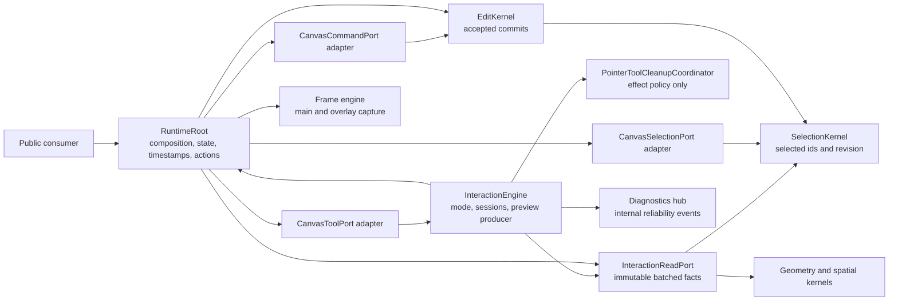
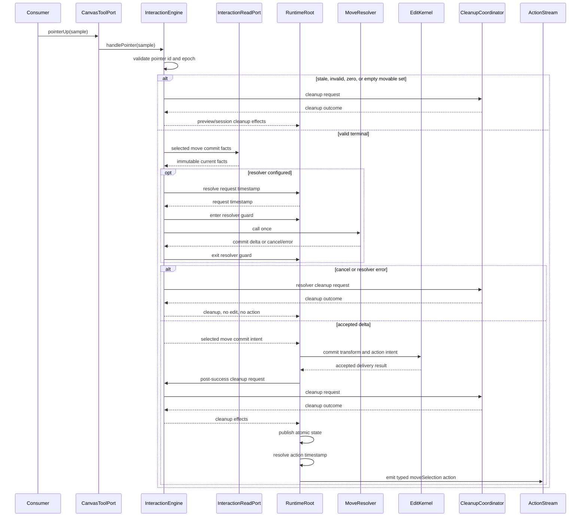
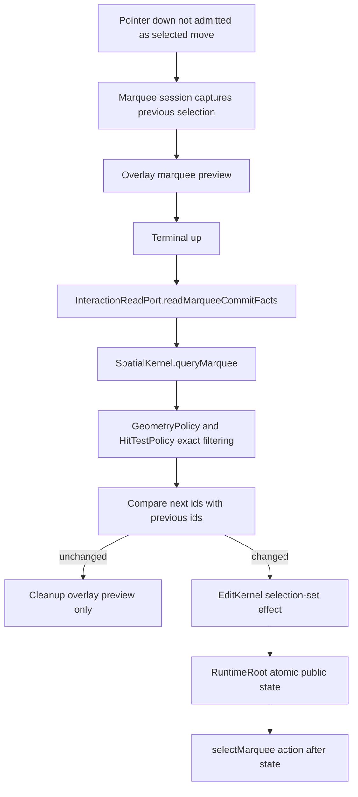
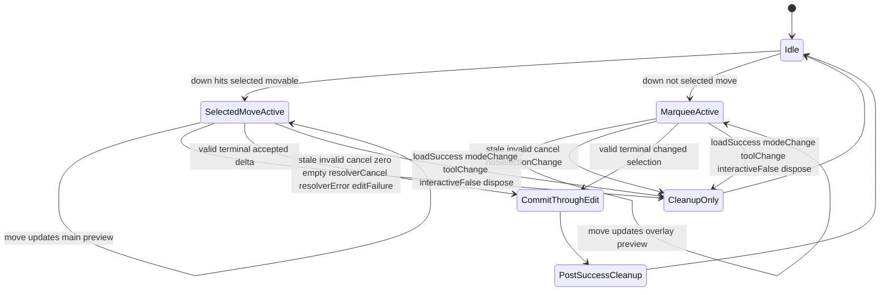
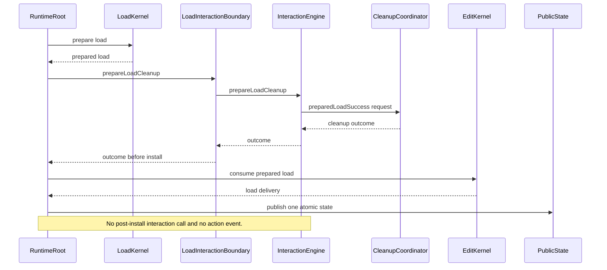
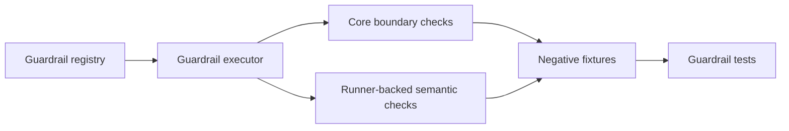

# Design: P10 Selection And Move

---
date: 2026-06-01
designer: Codex
commit: c1ed7b78
branch: new-architecture
design_question: "Create a maximally detailed architecture design for docs/implementation/p10_selection_and_move.md using .research/2026-06-01-p10-selection-and-move-readiness.md."
---

## Disposition

READY_FOR_CONTRACT

P10 can proceed to Change Contract authoring once that contract preserves this design without weakening any locked decision below. The implementation must not treat this artifact as optional guidance: it is the design source for interaction ownership, command routing, cleanup ordering, typed action emission, and selected-move/marquee semantics.

This design intentionally leaves no architectural choices for the implementer. If code evidence contradicts any locked fact, the Change Contract must stop and repair either this design or the source-of-truth document that owns the contradiction before implementation starts.

## Product Outcome

P10 makes selection and move behavior usable through the public runtime surface. A consumer can select elements directly, drag a marquee to replace selection, drag currently selected movable elements with a main-scene preview, commit/cancel safely, and receive typed action events only after accepted state changes. Load, dispose, stale terminal samples, invalid terminal samples, resolver cancellation, resolver failure, edit failure, and post-success cleanup all clear only the interaction-owned preview/session state they own and never perform hidden document mutations.

This matters because P10 is the first production phase where pointer interaction becomes a real runtime subsystem rather than public API placeholders. The user-visible result must be predictable: preview during drag, atomic state after commit, no resolver calls on cancel paths, no action events for no-ops, and no stale terminal sample able to mutate the document.

P10 does not implement draw, line, eraser, text editing, context-action routing, or Flutter raw pointer routing. It must build the reusable interaction spine those later phases will consume without completing their product behavior early.

## Target Contract Classification

Recommended Change Contract classification:

| Field | Required value |
| --- | --- |
| Profile | BEHAVIOR_CHANGE |
| Obligations | SEAM_MIGRATION, PUBLIC_API_CHANGE |
| Non-goal profiles | BUG_FIX, REFACTOR_ONLY, DOCS_ONLY |

Rationale:

- P10 changes externally observable behavior by making selection commands, pointer handling, previews, command mutations, and typed action emission operational instead of placeholder/unsupported paths.
- P10 migrates the existing load interaction boundary and preview ownership into a production `InteractionEngine` and `PointerToolCleanupCoordinator`.
- The public API surface mostly already exists, but the semantics become real: `CanvasRuntime.tools`, `CanvasRuntime.commands`, `CanvasRuntime.preview`, `CanvasRuntime.actions`, and command/selection effects must behave according to the public contracts.
- The work is not a bug fix because the phase is introducing the planned subsystem. It is not refactor-only because public behavior changes.

## Research Inputs

Primary research input:

- `.research/2026-06-01-p10-selection-and-move-readiness.md`

Relevant implementation source:

- `docs/implementation/p10_selection_and_move.md`

Relevant source-of-truth documents:

- `docs/contracts/public_api_v1.md`
- `docs/contracts/interaction_engine.md`
- `docs/contracts/operation_matrix.md`
- `docs/contracts/load_document.md`
- `docs/contracts/geometry.md`
- `docs/contracts/frame_pipeline.md`
- `docs/contracts/diagnostics.md`
- `docs/architecture/01_runtime_ownership.md`
- `docs/architecture/02_package_boundaries.md`
- `docs/architecture/03_data_model.md`
- `docs/architecture/architecture_graph.yaml`
- `docs/verification/tests.md`
- `docs/verification/guardrails.md`

Relevant existing implementation and tests:

- `lib/src/api/canvas_runtime.dart`
- `lib/src/runtime/runtime_root.dart`
- `lib/src/selection/selection_kernel.dart`
- `lib/src/edit/edit_kernel.dart`
- `lib/src/edit/commit_plan.dart`
- `lib/src/edit/commit_compiler.dart`
- `lib/src/edit/commit_applier.dart`
- `lib/src/contracts/internal/commit_delivery.dart`
- `lib/src/contracts/internal/load_interaction_boundary.dart`
- `lib/src/contracts/internal/selection_facts_port.dart`
- `lib/src/contracts/internal/selection_membership_port.dart`
- `lib/src/contracts/public/canvas_actions.dart`
- `lib/src/contracts/public/canvas_pointer.dart`
- `lib/src/frame/frame_capture_service.dart`
- `lib/src/frame/frame_engine.dart`
- `lib/src/frame/selected_move_supplement_planner.dart`
- `lib/src/frame/overlay_preview_planner.dart`
- `lib/src/geometry/spatial_kernel.dart`
- `lib/src/geometry/hit_test_policy.dart`
- `lib/src/geometry/geometry_policy.dart`
- `tool/guardrails/src/core_boundary_checks.dart`
- `tool/guardrails/src/guardrail_registry.dart`
- `tool/guardrails/src/guardrail_executor.dart`
- `test/api/typed_action_payloads_test.dart`
- `test/api_contract/preview_state_sealed_union_test.dart`
- `test/guardrails/core_boundary_negative_fixtures_test.dart`

## Repository Evidence

### Phase Scope

- `docs/implementation/p10_selection_and_move.md:5` states that P10 implements selection APIs, marquee selection, selected move preview/commit/cancel, resolver safety, and typed action events.
- `docs/implementation/p10_selection_and_move.md:11` requires a real `CanvasSelectionPort` backed by `SelectionKernel`, including direct selection set/toggle/clear/selectAll and selected-element move/rotate/flip/delete commands.
- `docs/implementation/p10_selection_and_move.md:14` requires the pointer lifecycle from public `CanvasToolPort.handlePointer` through session admission, sample normalization, cursor hints, preview publication, commit/cancel, cleanup, and stale-session rejection.
- `docs/implementation/p10_selection_and_move.md:18` requires first production introduction of `SelectionKernel`, `InteractionEngine`, `PointerToolCleanupCoordinator`, selected-move and select-marquee state machines, pointer sample normalization, and resolver wiring.
- `docs/implementation/p10_selection_and_move.md:20` requires `CanvasSelectedMovePreview` to remain delta-only, with no public selected ids, pointer ids, or session ids.
- `docs/implementation/p10_selection_and_move.md:22` requires the move resolver to run only for valid terminal selected-move commit and never on cancel paths.
- `docs/implementation/p10_selection_and_move.md:24` requires commits through `EditKernel`, gesture reads through batched immutable query ports, and no direct store or selection mutation in interaction code.
- `docs/implementation/p10_selection_and_move.md:30` requires existing diagram set updates and enough tool/test proof to prevent stale sessions, invalid terminals, or load success from mutating state.
- `docs/implementation/p10_selection_and_move.md:34` says P10 is the first production introduction of `lib/src/interaction/pointer_tool_cleanup_coordinator.dart`.
- `docs/implementation/p10_selection_and_move.md:37` says selected move, marquee, load-success interrupt, dispose, stale/invalid/no-op terminals, resolver cancel/error, edit failure, and post-success cleanup must return typed cleanup requests to `InteractionEngine`.
- `docs/implementation/p10_selection_and_move.md:40` requires `InteractionEngine` to be the only production caller of the cleanup coordinator.
- `docs/implementation/p10_selection_and_move.md:43` requires proof of `PointerCleanupOutcome` for main preview, overlay preview, no-preview, resolver-error cleanup, and pending-line preservation.
- `docs/implementation/p10_selection_and_move.md:47` lists dependencies on P5 edit, P6 load, P8 geometry/spatial, and P9 frame.
- `docs/implementation/p10_selection_and_move.md:115` through `docs/implementation/p10_selection_and_move.md:136` define tests and guardrails for pointer lifecycle, selection commands, cleanup, load, typed actions, timestamps, and stale-session safety.
- `docs/implementation/p10_selection_and_move.md:140` through `docs/implementation/p10_selection_and_move.md:160` define the P10 exit gate.
- `docs/implementation/p10_selection_and_move.md:164` warns that interaction must not mutate stores or selection directly and that selected move must remain separated from draw/eraser behavior.

### Readiness Research

- `.research/2026-06-01-p10-selection-and-move-readiness.md:13` through `.research/2026-06-01-p10-selection-and-move-readiness.md:21` find that public selection, pointer, preview, action, resolver, `SelectionKernel`, and runtime revision surfaces already exist.
- `.research/2026-06-01-p10-selection-and-move-readiness.md:23` through `.research/2026-06-01-p10-selection-and-move-readiness.md:31` find that staged load behavior and P9 frame preview paths already support selected-move main-scene rendering and marquee overlay rendering.
- `.research/2026-06-01-p10-selection-and-move-readiness.md:33` through `.research/2026-06-01-p10-selection-and-move-readiness.md:39` identify the main gap: no production `lib/src/interaction/`, no `InteractionEngine`, no cleanup coordinator, no pointer session/normalizer/state machines, no production action emission, and no `test/interaction/**`.
- `.research/2026-06-01-p10-selection-and-move-readiness.md:43` through `.research/2026-06-01-p10-selection-and-move-readiness.md:56` restate that P10 commits must go through `EditKernel` and reads must go through batched immutable query ports.
- `.research/2026-06-01-p10-selection-and-move-readiness.md:58` through `.research/2026-06-01-p10-selection-and-move-readiness.md:79` confirm existing direct selection API behavior and runtime rejection of document-mutating selection commands.
- `.research/2026-06-01-p10-selection-and-move-readiness.md:81` through `.research/2026-06-01-p10-selection-and-move-readiness.md:101` confirm that selection revision is separate from document/projection/spatial revision domains.
- `.research/2026-06-01-p10-selection-and-move-readiness.md:300` through `.research/2026-06-01-p10-selection-and-move-readiness.md:323` confirm selected-move main-frame and marquee overlay-frame proof already exists in P9.
- `.research/2026-06-01-p10-selection-and-move-readiness.md:325` through `.research/2026-06-01-p10-selection-and-move-readiness.md:358` identify current interaction contract and diagram requirements.
- `.research/2026-06-01-p10-selection-and-move-readiness.md:360` through `.research/2026-06-01-p10-selection-and-move-readiness.md:394` identify legacy donor material and forbidden legacy package structures.
- `.research/2026-06-01-p10-selection-and-move-readiness.md:396` through `.research/2026-06-01-p10-selection-and-move-readiness.md:412` confirm `CanvasRuntime.tools`, `commands`, and `contextActionRequests` are currently placeholders and no production action emission exists.

### Public API Contract

- `docs/contracts/public_api_v1.md:360` through `docs/contracts/public_api_v1.md:382` define the public runtime surface: `selection`, `tools`, `commands`, `preview`, `actions`, and `contextActionRequests`.
- `docs/contracts/public_api_v1.md:472` through `docs/contracts/public_api_v1.md:478` define `CanvasRuntimeState` as one atomic snapshot with separate revision domains.
- `docs/contracts/public_api_v1.md:482` through `docs/contracts/public_api_v1.md:498` define runtime config fields relevant to P10: initial mode, draw-mode selection clearing, and move commit resolver.
- `docs/contracts/public_api_v1.md:523` through `docs/contracts/public_api_v1.md:551` define `CanvasSurface` pointer routing responsibilities, including interactive disablement, active-session cancel, pending preview preservation, and routing samples to `InteractionEngine`.
- `docs/contracts/public_api_v1.md:1429` through `docs/contracts/public_api_v1.md:1466` define timestamp behavior: one runtime cursor starts at `-1`, command/selection/pointer/double-tap/resolver hints are normalized, and no-op/stale/rollback/cancel/load/dispose do not create timestamped outputs.
- `docs/contracts/public_api_v1.md:1470` through `docs/contracts/public_api_v1.md:1515` define `CanvasCommandPort` behavior for remove element, text edit, and clear content.
- `docs/contracts/public_api_v1.md:1517` through `docs/contracts/public_api_v1.md:1551` define `CanvasSelectionPort` behavior, including selection-only revision updates and selected-element transform/delete eligibility.
- `docs/contracts/public_api_v1.md:1560` through `docs/contracts/public_api_v1.md:1735` define pointer/tool API behavior.
- `docs/contracts/public_api_v1.md:1868` through `docs/contracts/public_api_v1.md:2065` define preview state, selected-move delta-only payload, load success/failure preview semantics, and selected move as main-scene preview.
- `docs/contracts/public_api_v1.md:2068` through `docs/contracts/public_api_v1.md:2250` define typed action payloads and action event matrix.
- `docs/contracts/public_api_v1.md:2335` through `docs/contracts/public_api_v1.md:2403` define synchronous move resolver behavior: terminal selected-move only, no preview/zero/empty/cancel/load/mode/dispose calls, reentrant mutation rejection, finite returned delta, cancel without action, and exception cleanup/rethrow behavior.

### Interaction Contract

- `docs/contracts/interaction_engine.md:104` through `docs/contracts/interaction_engine.md:130` define one active routed pointer, token/epoch terminal admission, stale cleanup-only behavior, cleanup-capable machines returning typed cleanup requests, cleanup coordinator caller restriction, read-port reads, `EditKernel` commits, and revision publication.
- `docs/contracts/interaction_engine.md:132` through `docs/contracts/interaction_engine.md:143` define `InteractionReadPort` as batched-by-intent immutable facts with no concrete `exists`/`isVisible` loops and no mutation/draft/store/resource internals.
- `docs/contracts/interaction_engine.md:145` through `docs/contracts/interaction_engine.md:151` define interactive disable behavior and pending-line preservation.
- `docs/contracts/interaction_engine.md:153` through `docs/contracts/interaction_engine.md:202` define the internal cleanup coordinator, its allowed responsibilities, forbidden dependencies, required cleanup reasons, and `PointerCleanupOutcome` effect fields.
- `docs/contracts/interaction_engine.md:204` through `docs/contracts/interaction_engine.md:224` define preview repaint routing: selected move is main-scene only and marquee is overlay only.

### Load Contract

- `docs/contracts/load_document.md:45` through `docs/contracts/load_document.md:59` require load success to request prepared interaction cleanup before document install, without resolver calls, commits, or post-install interaction calls.
- `docs/contracts/load_document.md:64` through `docs/contracts/load_document.md:83` define load success order.
- `docs/contracts/load_document.md:85` through `docs/contracts/load_document.md:94` require one atomic public observation for successful load.
- `docs/contracts/load_document.md:96` through `docs/contracts/load_document.md:110` require load failure to preserve active gesture/preview/pending line/pointer normalizer state and emit no repaint/state/action.

### Operation Matrix

- `docs/contracts/operation_matrix.md:54` through `docs/contracts/operation_matrix.md:82` define rows for direct selection, marquee commit, selected move preview, selected move commit, selected transforms, delete selection, pointer dispatch, and load success/failure.
- `docs/contracts/operation_matrix.md:101` through `docs/contracts/operation_matrix.md:153` define row notes, no-op behavior, pointer dispatcher effects, and timestamp resolver rows.

### Architecture

- `docs/architecture/01_runtime_ownership.md:58` through `docs/architecture/01_runtime_ownership.md:66` assign ownership: `SelectionKernel` owns selected ids/revision, `EditKernel` owns edits, `InteractionEngine` owns pointer sessions/tools/preview state/terminal commit requests/interaction guard facts/cleanup coordinator composition, and frame engines own rendering.
- `docs/architecture/01_runtime_ownership.md:71` through `docs/architecture/01_runtime_ownership.md:76` assign public state snapshot ownership to `RuntimeRoot`.
- `docs/architecture/01_runtime_ownership.md:83` through `docs/architecture/01_runtime_ownership.md:91` define cleanup coordinator as an internal effect-policy collaborator and not a state store, action emitter, resolver, edit layer, resource owner, Flutter bridge, or selection owner.
- `docs/architecture/01_runtime_ownership.md:109` through `docs/architecture/01_runtime_ownership.md:120` require interaction facts through immutable read ports.
- `docs/architecture/02_package_boundaries.md:96` through `docs/architecture/02_package_boundaries.md:111` list target `lib/src/interaction/` files.
- `docs/architecture/02_package_boundaries.md:258` through `docs/architecture/02_package_boundaries.md:279` define forbidden imports, including interaction restrictions.
- `docs/architecture/02_package_boundaries.md:282` through `docs/architecture/02_package_boundaries.md:286` require interaction facts through `InteractionReadPort` and narrow selection facts ports.
- `docs/architecture/02_package_boundaries.md:288` through `docs/architecture/02_package_boundaries.md:303` state that context action router and interaction request registry are later-phase seams and must not be completed by P10.
- `docs/architecture/03_data_model.md:64` through `docs/architecture/03_data_model.md:66` state that selection is runtime state, not committed document content.
- `docs/architecture/03_data_model.md:124` through `docs/architecture/03_data_model.md:153` define revision domains and atomic state behavior.
- `docs/architecture/03_data_model.md:176` through `docs/architecture/03_data_model.md:185` define preview cleanup and interaction revision behavior.
- `docs/architecture/architecture_graph.yaml:61` through `docs/architecture/architecture_graph.yaml:67` list P10 source docs as future graph sources.
- `docs/architecture/architecture_graph.yaml:421` through `docs/architecture/architecture_graph.yaml:436` identify the future `interaction.engine` node.
- `docs/architecture/architecture_graph.yaml:688` through `docs/architecture/architecture_graph.yaml:699` plan an interaction diagnostics route for P10.

### Existing Code

- `lib/src/api/canvas_runtime.dart:37` through `lib/src/api/canvas_runtime.dart:48` currently expose selection but throw for `tools`, `commands`, and `contextActionRequests`.
- `lib/src/runtime/runtime_root.dart:98` through `lib/src/runtime/runtime_root.dart:121` compose selection, action, preview, revision, load, and guard state inside `RuntimeRoot`.
- `lib/src/runtime/runtime_root.dart:136` exposes the selection port; `lib/src/runtime/runtime_root.dart:156` exposes the action stream; `lib/src/runtime/runtime_root.dart:161` exposes preview state.
- `lib/src/runtime/runtime_root.dart:408` through `lib/src/runtime/runtime_root.dart:430` implement direct selection set/toggle/clear/selectAll.
- `lib/src/runtime/runtime_root.dart:449` through `lib/src/runtime/runtime_root.dart:453` currently reject document-mutating selection commands.
- `lib/src/runtime/runtime_root.dart:456` through `lib/src/runtime/runtime_root.dart:465` implement dispose sequencing.
- `lib/src/runtime/runtime_root.dart:468` through `lib/src/runtime/runtime_root.dart:490` implement a resolver mutation guard.
- `lib/src/runtime/runtime_root.dart:560` through `lib/src/runtime/runtime_root.dart:573` implement load success ordering through a minimal load interaction boundary.
- `lib/src/runtime/runtime_root.dart:676` through `lib/src/runtime/runtime_root.dart:700` build public runtime state snapshots.
- `lib/src/runtime/runtime_root.dart:775` through `lib/src/runtime/runtime_root.dart:835` show the selection adapter currently rejects move/rotate/flip/delete.
- `lib/src/selection/selection_kernel.dart:7` through `lib/src/selection/selection_kernel.dart:23` define `SelectionKernel` as owner of selected ids/facts/revision.
- `lib/src/selection/selection_kernel.dart:25` through `lib/src/selection/selection_kernel.dart:65` implement direct selection operations.
- `lib/src/contracts/internal/selection_facts_port.dart:3` through `lib/src/contracts/internal/selection_facts_port.dart:15` define immutable selection facts.
- `lib/src/contracts/internal/selection_membership_port.dart:3` through `lib/src/contracts/internal/selection_membership_port.dart:5` define normalization/select-all selection membership support.
- `lib/src/contracts/internal/load_interaction_boundary.dart:1` through `lib/src/contracts/internal/load_interaction_boundary.dart:10` define the current minimal `PointerCleanupOutcome` with only `previewChanged`.
- `lib/src/edit/edit_kernel.dart:43` through `lib/src/edit/edit_kernel.dart:90` define synchronous edit/load execution.
- `lib/src/edit/commit_plan.dart:4` through `lib/src/edit/commit_plan.dart:24` currently treat `hasChanges` as revision-delta-only and do not carry action intents or selection-set effects.
- `lib/src/edit/commit_compiler.dart:59` through `lib/src/edit/commit_compiler.dart:83` compile current edit effects.
- `lib/src/edit/commit_applier.dart:25` through `lib/src/edit/commit_applier.dart:47` apply document effects and selection pruning.
- `lib/src/contracts/internal/commit_delivery.dart:3` through `lib/src/contracts/internal/commit_delivery.dart:56` define delivery effects without action payload transport.
- `lib/src/contracts/internal/touched_set.dart:3` through `lib/src/contracts/internal/touched_set.dart:50` already contains a selection touched flag.
- `lib/src/contracts/public/canvas_actions.dart:25` through `lib/src/contracts/public/canvas_actions.dart:168` define typed action payloads.
- `lib/src/contracts/public/canvas_actions.dart:220` through `lib/src/contracts/public/canvas_actions.dart:323` define move resolver request/resolution types.
- `lib/src/contracts/public/canvas_pointer.dart:91` through `lib/src/contracts/public/canvas_pointer.dart:103` validate public pointer samples, including offset and timestamp fields.

### Frame And Geometry

- `lib/src/frame/frame_capture_service.dart:28` through `lib/src/frame/frame_capture_service.dart:49` route selected move into main-frame capture and exclude it from overlay capture.
- `lib/src/frame/frame_engine.dart:97` through `lib/src/frame/frame_engine.dart:103` build selected-move supplements after ordinary main-scene planning.
- `lib/src/frame/frame_engine.dart:183` through `lib/src/frame/frame_engine.dart:190` define the main repaint reason for selected-move preview.
- `lib/src/frame/selected_move_supplement_planner.dart:58` through `lib/src/frame/selected_move_supplement_planner.dart:83` trigger shifted spatial queries for selected-move preview.
- `lib/src/frame/selected_move_supplement_planner.dart:91` through `lib/src/frame/selected_move_supplement_planner.dart:123` filter movable selected ids without global sort or cache writes.
- `lib/src/frame/selected_move_supplement_planner.dart:204` through `lib/src/frame/selected_move_supplement_planner.dart:222` apply selected-move preview as `CanvasTransform.translation(delta).multiply(...)`.
- `lib/src/frame/overlay_preview_planner.dart:108` through `lib/src/frame/overlay_preview_planner.dart:154` exclude selected move from overlay and render marquee with captured selection style.
- `lib/src/frame/captured_frame.dart:10` through `lib/src/frame/captured_frame.dart:29` define effective world bounds as viewport bounds shifted by view camera offset.
- `docs/contracts/geometry.md:147` through `docs/contracts/geometry.md:155` define marquee normalization and candidate/visibility/selectability behavior.
- `lib/src/geometry/spatial_kernel.dart:115` through `lib/src/geometry/spatial_kernel.dart:142` expose hit and marquee queries.
- `lib/src/geometry/hit_test_policy.dart:18` through `lib/src/geometry/hit_test_policy.dart:75` define topmost hit and exact marquee filtering.
- `lib/src/geometry/geometry_policy.dart:64` through `lib/src/geometry/geometry_policy.dart:72` define marquee candidate logic.

### Verification And Diagrams

- `docs/verification/tests.md:136` through `docs/verification/tests.md:139` list P10 action and timestamp tests.
- `docs/verification/tests.md:193` through `docs/verification/tests.md:198` list interaction P10 tests.
- `docs/verification/tests.md:331` through `docs/verification/tests.md:336` list expected interaction test file locations.
- `docs/verification/tests.md:629` through `docs/verification/tests.md:636` list selection-owner test responsibilities.
- `docs/verification/tests.md:673` through `docs/verification/tests.md:687` list preview public state and cleanup coordinator outcome responsibilities.
- `docs/verification/guardrails.md:195` through `docs/verification/guardrails.md:204` list guardrails for typed action emission, timestamps, load ordering, selected-move main repaint, interaction boundary safety, resolver cancel prevention, stale-terminal prevention, and cleanup coordinator ownership.
- `tool/guardrails/src/core_boundary_checks.dart:683` through `tool/guardrails/src/core_boundary_checks.dart:714` already contain future interaction import restrictions.
- `test/guardrails/core_boundary_negative_fixtures_test.dart:98` through `test/guardrails/core_boundary_negative_fixtures_test.dart:125` already define negative fixture examples for cleanup/read-port violations.
- `tool/guardrails/src/guardrail_registry.dart:35` through `tool/guardrails/src/guardrail_registry.dart:244` currently lacks the P10 runner-backed interaction/action guardrail registrations beyond existing earlier-phase entries.
- `tool/guardrails/src/guardrail_executor.dart:238` through `tool/guardrails/src/guardrail_executor.dart:262` currently maps earlier runner-backed checks, including load and selected-move main repaint.
- `test/api/typed_action_payloads_test.dart:32` through `test/api/typed_action_payloads_test.dart:123` compile-test current typed payload shape.
- `test/api_contract/preview_state_sealed_union_test.dart:76` through `test/api_contract/preview_state_sealed_union_test.dart:83` require selected-move preview to pattern-match as delta-only.
- `docs/diagrams/state_pointer_session.mmd:17` through `docs/diagrams/state_pointer_session.mmd:144` document pointer admission, terminal gate, resolver decisions, cleanup-only paths, and cleanup outcome order.
- `docs/diagrams/state_selected_move.mmd:16` through `docs/diagrams/state_selected_move.mmd:183` document selected-move start, preview, terminal, resolver, edit commit, cleanup paths, and main-scene cleanup.
- `docs/diagrams/state_select_marquee.mmd:15` through `docs/diagrams/state_select_marquee.mmd:142` document marquee start, overlay drag, candidate query, no-op cleanup, selection commit, and overlay cleanup.
- `docs/diagrams/seq_selected_move_preview_commit.mmd:46` through `docs/diagrams/seq_selected_move_preview_commit.mmd:217` document selected-move preview, terminal no-op, resolver cancel/error, accepted commit, action staging, cleanup, and edit failure.
- `docs/diagrams/seq_marquee_select.mmd:40` through `docs/diagrams/seq_marquee_select.mmd:132` document marquee preview, no-op, selection changed commit, action payload, cleanup, and public state.
- `docs/diagrams/seq_load_document_success.mmd:43` through `docs/diagrams/seq_load_document_success.mmd:72` document prepared cleanup before load install and no post-install interaction call.
- `docs/diagrams/seq_load_document_failure.mmd:50` through `docs/diagrams/seq_load_document_failure.mmd:57` document failure preservation and no public effects.

## Design Form Candidates

### Candidate A: RuntimeRoot-local interaction implementation

Put pointer sessions, preview state, selected move, marquee, cleanup, resolver calls, and command routing directly in `RuntimeRoot`.

Rejected.

This would be the smallest file-count change, but it contradicts the ownership documents. `RuntimeRoot` is the composition and public snapshot owner, not the interaction state machine owner. It would also make future P11/P12 pointer behavior harder to reuse, and it would make cleanup coordinator caller restrictions difficult to enforce because all runtime effects would sit in the same file.

Evidence against:

- `docs/architecture/01_runtime_ownership.md:58` through `docs/architecture/01_runtime_ownership.md:66` assign pointer sessions and cleanup composition to `InteractionEngine`.
- `docs/architecture/02_package_boundaries.md:96` through `docs/architecture/02_package_boundaries.md:111` already define `lib/src/interaction/` as the target owner.
- `docs/contracts/interaction_engine.md:104` through `docs/contracts/interaction_engine.md:130` define an interaction engine, not a runtime-root inline implementation.

### Candidate B: Interaction engine owns sessions but mutates selection/store through direct ports

Introduce `InteractionEngine`, but let it call selection/store mutation APIs for marquee, selected move, and transforms.

Rejected.

This splits files but not responsibilities. The phase explicitly requires interaction to read through immutable query ports and commit through `EditKernel`; direct mutation would leave the core safety requirement unenforced.

Evidence against:

- `docs/implementation/p10_selection_and_move.md:24` requires commits through `EditKernel` and reads through batched immutable query ports.
- `docs/contracts/interaction_engine.md:132` through `docs/contracts/interaction_engine.md:143` forbid mutation/draft/store/resource internals in `InteractionReadPort`.
- `docs/architecture/02_package_boundaries.md:258` through `docs/architecture/02_package_boundaries.md:279` restrict interaction imports.

### Candidate C: Interaction-owned P10 spine with EditKernel-backed mutation bridge

Introduce a production `lib/src/interaction/` subsystem. `InteractionEngine` owns mode state, active pointer session state, selected-move and marquee machines, pointer sample normalization, preview producer state, and cleanup request flow. `PointerToolCleanupCoordinator` remains an internal effect-policy collaborator called only by `InteractionEngine`. RuntimeRoot composes the engine, provides immutable read-port facts, routes accepted mutation intents through `EditKernel`, publishes atomic public state, emits typed actions after accepted commits, and delegates preview/revision state from `InteractionEngine` into public snapshots and frame capture.

Selected.

This is the smallest design that satisfies all source-of-truth constraints and creates the right future seam for P11/P12/P13. It changes more files than Candidate A, but the added boundary is exactly the durable production owner required by the architecture.

### Candidate D: Finish full interaction platform including draw, eraser, text, context actions, and raw Flutter routing

Complete all later interaction behavior while building P10.

Rejected.

This would expand phase scope and likely introduce unstable semantics before P11/P12/P13. P10 must build the reusable spine and implement only selection/move/marquee/command behavior required by its contract.

Evidence against:

- `docs/architecture/02_package_boundaries.md:288` through `docs/architecture/02_package_boundaries.md:303` keep context action routing and interaction request registry as later-phase seams.
- `docs/implementation/p10_selection_and_move.md:164` through `docs/implementation/p10_selection_and_move.md:168` warn that selected move must remain separated from draw/eraser behavior.

## Known Future Pressures

- P11 draw and line must reuse the same pointer session admission, terminal cleanup, preview ownership, timestamp normalization, and cleanup coordinator policy without changing P10 semantics.
- P11 pending-line preservation depends on P10 cleanup outcome fields being explicit rather than collapsed to a preview boolean.
- P12 eraser, text editing, double tap, context-action routing, and `InteractionRequestRegistry` must be able to attach to the P10 interaction spine without letting P10 implement text/context behavior early.
- P13 Flutter `CanvasSurface` routing and raw pointer normalization must consume P10's internal normalizer and interactive-disable cleanup behavior without changing public pointer sample validation semantics.
- Diagnostics graph nodes already plan interaction reliability diagnostics in P10, so P10 must either implement a bounded internal diagnostics route or update architecture docs to remove that planned edge. This design chooses implementation.
- The architecture graph also contains `geometry.spatial_index.corrupted_rows.report_to_diagnostics` with `phaseRequiredBy: P10` and `status: future`, while `docs/contracts/diagnostics.md:90` says that route is deferred. P10 must repair that graph/docs contradiction in Unit 0 before phase closure, because phase-closure treats future P10 edges as required.
- P9 frame capture already distinguishes selected-move main-scene preview from marquee overlay preview; P10 must not merge those paths.
- P6 load success already requires prepared cleanup before document install; P10 must expand the cleanup outcome without changing the atomic load observation contract.
- Existing public constructors validate `CanvasPointerSample` values. P10 must support invalid-terminal cleanup through an internal normalizer seam and tests without assuming consumers can construct invalid public samples.
- Current `CommitPlan.hasChanges` is document-revision-only. P10 must support selection-only accepted commits through `EditKernel` without using fake document edits.
- Current action stream exists but no production action emission exists. P10 must add action intent staging without emitting public events before accepted state install.

## Selected Form

### Summary

Implement P10 as an interaction-owned subsystem with an edit-backed commit bridge:

1. `SelectionKernel` remains the single owner of selected ids and `selectionRevision`.
2. `InteractionEngine` becomes the single owner of pointer mode state, active pointer sessions, preview producer state, selected-move/marquee state machines, pointer sample normalization, cleanup request flow, and interaction revision.
3. `PointerToolCleanupCoordinator` becomes the internal effect-policy owner for cleanup outcomes and is called only by `InteractionEngine`.
4. `RuntimeRoot` remains the composition root, public snapshot owner, action stream owner, timestamp cursor owner, resolver guard owner, and frame invalidation bridge.
5. All document and selection-changing commands that are not direct selection API replacements commit through `EditKernel`.
6. Interaction reads only immutable, batched, intent-specific facts through `InteractionReadPort`.
7. Typed public action events are staged as internal intents and emitted only after an accepted commit has installed atomic public state.

### New Production Owners

The Change Contract must introduce these production files:

| File | Primary responsibility |
| --- | --- |
| `lib/src/interaction/interaction_engine.dart` | Own interaction mode state, active pointer session, preview state producer, public tool port implementation, cleanup request orchestration, and interaction revision. |
| `lib/src/interaction/interaction_read_port.dart` | Define immutable, batched, intent-specific read fact interfaces and value types. No mutation, draft, store, resource, selection-kernel, or frame internals. |
| `lib/src/interaction/pointer_session.dart` | Define active pointer token, controller epoch, session id, pointer id, tool mode, start/current world positions, and session lifecycle value types. |
| `lib/src/interaction/pointer_sample_normalizer.dart` | Normalize accepted public samples and internal/raw terminal facts into finite interaction samples or cleanup-only terminal decisions. This file is a mandatory package-boundary addition in Unit 0. |
| `lib/src/interaction/move_machine.dart` | Own selected-move session state transitions and return mutation intents or cleanup requests. |
| `lib/src/interaction/select_machine.dart` | Own marquee selection session state transitions and return selection intents or cleanup requests. |
| `lib/src/interaction/pointer_tool_cleanup_coordinator.dart` | Convert typed cleanup requests to effect-only cleanup outcomes. It has no resolver, edit, action, frame, store, resource, Flutter, or selection dependencies. |
| `lib/src/contracts/internal/command_facts_port.dart` | Define immutable facts for high-level runtime command reads: selection transforms/delete, remove element, and clear content. This file is a mandatory package-boundary addition in Unit 0 and must not be imported by `lib/src/interaction/**`. |

These file names and responsibilities are fixed for the Change Contract.

### Existing Owners That Must Remain Owners

| Owner | Locked responsibility |
| --- | --- |
| `SelectionKernel` | Selected ids, selected-id normalization, selected-id facts, and `selectionRevision`. It does not know pointer sessions, previews, actions, resolvers, or frame repaint targets. |
| `EditKernel` | Synchronous accepted document/selection-affecting commits and rollback boundaries. It does not call move resolvers, emit public actions, or read pointer sessions. |
| `RuntimeRoot` | Composition, public state snapshots, stream delivery, timestamp cursor, resolver mutation guard, load orchestration, frame invalidation bridge, and public action stream. |
| Frame engine | Rendering and capture decisions. It consumes preview state and revisions; it does not own pointer lifecycle. |
| Geometry/spatial kernels | Hit and marquee query indexes/policies. They do not select, mutate, emit actions, or own sessions. |
| Diagnostics hub | Diagnostic publication. Interaction may route diagnostics into it through a narrow internal sink; diagnostics do not influence commit acceptance. |

### Preview Ownership

P10 must migrate preview source-of-truth from `RuntimeRoot` local fields to `InteractionEngine` owned state.

Locked behavior:

- `InteractionEngine` owns the current `CanvasPreviewState` value and `previewRevision`.
- `RuntimeRoot.preview` delegates to the engine.
- `RuntimeRoot` includes the delegated preview value and revision in `CanvasRuntimeState`.
- Frame capture reads the same delegated preview state.
- Preview revision increments only when the preview value changes or when active preview cleanup clears/replaces a preview.
- Cleanup with no active preview is silent and does not increment preview revision.
- Selected-move preview is `CanvasSelectedMovePreview(delta: delta)` only.
- Marquee preview is overlay-only and carries only public marquee preview data defined by the contract.
- No preview contains pointer id, session id, selected ids, or resolver state.

This migration is required by source-of-truth singularity: interaction owns pointer-session preview production, while `RuntimeRoot` owns publication.

### Public Tool Port Scope

P10 must expose a real `CanvasToolPort` for selection/move pointer handling and tool setting state. It must not leave any public getter/setter as a placeholder.

Locked scope:

- `CanvasRuntime.tools` no longer throws for the P10-supported port.
- `CanvasRuntime.contextActionRequests` no longer throws. It returns a broadcast stream owned by RuntimeRoot, closes on runtime dispose, and emits no events in P10.
- `CanvasToolPort.mode`, `drawStyle`, and `pointerPolicy` return interaction-owned state initialized from `CanvasRuntimeConfig.initialMode`, `initialDrawStyle`, and `pointerPolicy`.
- Runtime construction publishes the configured initial tool state without incrementing `interactionRevision`; later setter changes increment `interactionRevision` only when the effective value changes.
- `setMode(CanvasInteractionMode.move)` switches to move mode. If the mode changed, active pointer/session cleanup uses the cleanup coordinator, preview cleanup is reflected in preview revision/repaint outcome, and one public state is published.
- `setMode(CanvasInteractionMode.draw)` switches to draw mode but does not implement draw behavior in P10. If the mode changed, active pointer/session cleanup uses the cleanup coordinator, `interactionRevision` increments, and `clearSelectionOnDrawModeEnter == true` clears selection through `SelectionKernel` in the same public state. No action or timestamp is emitted.
- `setDrawStyle`, `setDrawTool`, and `setDrawColor` update draw style state and `interactionRevision` when the effective draw style changes. If an active pointer session exists, it is cleaned up through the cleanup coordinator with reason `toolChange`; any owned preview cleanup follows normal main/overlay repaint rules. No document edit, selection change, action, or timestamp is emitted.
- `setPointerPolicy` updates pointer policy and `interactionRevision` when the effective policy changes. If an active pointer session exists, it is cleaned up through the cleanup coordinator with reason `toolChange`; any owned preview cleanup follows normal main/overlay repaint rules. No action or timestamp is emitted.
- Setter no-ops publish no state and do not advance any revision.
- `handlePointer` routes samples into `InteractionEngine`.
- In move mode, P10 supports selected move and marquee behavior.
- In draw mode, P10 `handlePointer` validates/routes cleanup-capable terminal samples, but otherwise returns without draw/line/eraser preview, edit, action, timestamp, or context request until P11/P12/P13 implement those tool rows. This compatibility behavior must be recorded in Unit 0 source-of-truth repair.
- P10 does not complete draw, line, eraser, text, double-tap, or context-action request behavior.
- `handleDoubleTap` is locked as P12-owned for P10 even though `docs/contracts/public_api_v1.md:1716` through `docs/contracts/public_api_v1.md:1724` currently describe full context-action publication. The Change Contract must start with a source-of-truth repair unit that updates the public API/operation-matrix wording before any tool-port code is implemented.
- P10 compatibility behavior after that source-of-truth repair is exact: `handleDoubleTap` throws `UnsupportedError` with a message that names P12 context actions, emits no request, emits no action, changes no preview/session/selection/document state, and advances no timestamp.
- `contextActionRequests` remains P12-owned and must not start emitting P10 events. Double-tap request publication is outside this P10 design and requires a new design before implementation.

### Pointer Coordinates

Public pointer positions are view-space offsets. P10 converts accepted interaction samples to world space using:

`worldPosition = sample.position + runtime.viewCameraOffset`

Evidence:

- `lib/src/frame/captured_frame.dart:10` through `lib/src/frame/captured_frame.dart:29` define effective world bounds by shifting viewport bounds by view camera offset.
- P10 selected move and marquee operate on document world geometry and spatial indexes.

Locked implications:

- Session start and current positions are stored in world space.
- Marquee rectangles are normalized in world space.
- Selected-move preview delta is world-space delta.
- Resolver request proposed delta is world-space delta.
- Action payload transforms use world-space transform values.

### Pointer Admission And Normalization

`PointerSampleNormalizer` must exist as an internal interaction seam even if public `CanvasPointerSample` remains validating.

Locked behavior:

- Public `handlePointer(CanvasPointerSample sample)` receives only constructible public samples.
- The normalizer accepts public valid samples and converts them to `NormalizedPointerSample`.
- Down and move samples with non-finite coordinates are rejected before state-machine admission. Since the public constructor already validates these, this path is mainly for internal/raw bridge tests and future P13.
- Terminal samples for an active route can resolve to cleanup-only terminal decisions if an internal/raw bridge later reports invalid terminal facts.
- Invalid terminal cleanup releases only the active session it owns, clears only owned active preview, emits no resolver call, emits no edit, emits no action, and does not advance timestamp.
- P10 tests must cover invalid-terminal cleanup through the internal normalizer seam or fake bridge inputs, not by depending on impossible public constructor states.
- The normalizer does not read document/selection/spatial state and does not decide selected move vs marquee.

### Pointer Session Model

The active pointer session value must include:

- `sessionId`: internal monotonically increasing id.
- `pointerId`: public pointer id/routing token.
- `controllerEpoch`: runtime/controller epoch captured at admission.
- `toolMode`: current tool mode captured at admission.
- `kind`: `selectedMove` or `marquee` for P10.
- `startWorldPosition`.
- `lastWorldPosition`.
- `lastPreviewValue`.
- `capturedSelectionRevision` when relevant.
- `capturedSelectedIdsInDocumentOrder` for selected move.
- `capturedMovableIdsInDocumentOrder` for selected move.
- `previousSelectionIdsInDocumentOrder` for marquee.

Only one active routed pointer may exist at a time.

Admission rules:

1. A new down sample is admitted only when no active routed pointer exists.
2. The active session captures the current controller epoch.
3. Move/up/cancel samples are accepted only when pointer id and controller epoch match the active session.
4. Stale or mismatched terminal samples can return cleanup-only outcomes for owned active state but cannot commit.
5. Stale or mismatched non-terminal samples are ignored without public state changes.
6. Mode change, interactive disable, load success, and dispose close the active session through typed cleanup requests, not direct field mutation.

### Mode Selection For P10 Pointer Down

P10 selected-move and marquee behavior share the move/select tool path.

On pointer down:

1. Convert view position to world position.
2. Request selected-move start facts through `InteractionReadPort`.
3. Admit selected move only when all of these are true:
   - There is a non-empty selected set.
   - At least one selected element remains movable (`isTransformable == true` and `isLocked == false`).
   - The top visible/selectable hit at the down point is one of the movable selected ids.
4. If selected move is admitted:
   - Capture selected ids and movable ids in document order.
   - Open a selected-move session.
   - Publish `CanvasSelectedMovePreview(delta: Offset.zero)` if current preview is different.
   - Request a main-scene repaint when preview changed.
5. If selected move is not admitted:
   - Open a marquee session.
   - Capture previous selection ids in document order.
   - Publish a zero-area marquee preview anchored at the down world position if current preview is different.
   - Request an overlay repaint when preview changed.

P10 does not add single-click select/toggle semantics unless a separate source-of-truth document is updated before implementation. Pointer down not admitted as selected move starts marquee.

### Selected Move Preview

On selected-move move sample:

1. Validate same active session token.
2. Convert to world position.
3. Compute `delta = currentWorldPosition - startWorldPosition`.
4. If `delta` equals the last preview delta, no preview revision or repaint is emitted.
5. Otherwise publish `CanvasSelectedMovePreview(delta: delta)`, increment preview revision, and request main-scene repaint only.

Selected-move preview never performs a document edit and never emits an action.

### Selected Move Terminal Commit

On selected-move terminal up:

1. Validate same active session token and controller epoch.
2. Compute proposed world delta from terminal position.
3. If proposed delta is zero, cleanup active main preview/session and emit no resolver, edit, action, timestamp, or public state unless preview cleanup changed preview state.
4. Request selected-move commit facts through `InteractionReadPort`, using captured movable ids and proposed delta.
5. If the read facts show no currently movable selected ids, stale captured ids, document mismatch, or no effective transform change, cleanup active main preview/session and emit no resolver, edit, action, or timestamp.
6. If a move resolver is configured:
   - Resolve request timestamp through `RuntimeRoot` timestamp cursor before invoking the resolver, because the resolver request is an output.
   - Build `CanvasMoveCommitRequest` from immutable facts, selected/movable ids in document order, proposed world delta, selection bounds, and request timestamp.
   - Enter the existing resolver mutation guard.
   - Call the resolver exactly once.
   - Exit the guard before continuing.
7. Resolver cancel:
   - Cleanup active main preview/session.
   - Emit no edit, action, or action timestamp.
8. Resolver exception or invalid/non-finite resolver delta:
   - Cleanup active main preview/session.
   - Emit no edit, action, or action timestamp.
   - Rethrow a runtime-safe error after cleanup.
9. Accepted delta:
   - If resolver returned a different finite non-zero delta, use that delta.
   - If final delta is zero, cleanup as no-op without edit/action.
   - Build a selection move edit intent for movable ids in document order.
   - Commit through `EditKernel`.
   - Transform each element as `CanvasTransform.translation(finalDelta).multiply(oldTransform)`, matching selected-move frame preview ordering.
   - Stage an internal action intent that RuntimeRoot must publish as `CanvasActionType.moveSelection` with `CanvasTransformActionPayload(delta: CanvasTransform.translation(finalDelta), operation: CanvasTransformOperation.move, pivotWorld: null)` and `CanvasActionCommitted.elementIds` equal to moved ids in document order.
   - Cleanup active main preview/session after accepted edit and before public action delivery.
   - Publish one atomic public state reflecting document revision, any selection pruning, preview cleanup revision, and interaction/session cleanup.
   - Emit the typed action after the accepted public state is installed.

Timestamp behavior:

- Resolver request timestamp advances the runtime timestamp cursor.
- Action timestamp advances the same cursor after the accepted commit.
- If no resolver is configured, only the action timestamp is produced.
- No-op, stale, cancel, resolver error, edit rollback, load, and dispose paths do not produce action timestamps.

### Marquee Preview

On marquee move sample:

1. Validate same active session token.
2. Convert to world position.
3. Normalize the rectangle from start world position to current world position.
4. If the normalized rect equals the last preview rect, no preview revision or repaint is emitted.
5. Otherwise publish marquee preview and request overlay repaint only.

Marquee preview never mutates selection and never emits an action.

### Marquee Terminal Commit

On marquee terminal up:

1. Validate same active session token and controller epoch.
2. Normalize terminal world rect.
3. Request marquee commit facts through `InteractionReadPort`.
4. The read implementation queries the spatial index and hit-test policy to produce next selected ids in document order.
5. Candidate rules:
   - Use normalized world rect.
   - Use `SpatialKernel.queryMarquee`.
   - Use `GeometryPolicy.isMarqueeCandidate` and `HitTestPolicy.exactMarquee`.
   - Include visible/selectable content only.
   - Locked elements may be selected.
   - Deleted/stale elements are skipped.
   - Output ids are normalized to document order.
6. If next selection equals previous selection:
   - Cleanup active overlay preview/session.
   - Emit no selection revision, edit, action, or timestamp unless preview cleanup changed preview state.
7. If selection changes:
   - Commit the selection replacement through `EditKernel` using a selection-set effect, not by direct `SelectionKernel` mutation from interaction.
   - Stage an internal action intent that RuntimeRoot must publish as `CanvasActionType.selectMarquee` with `CanvasSelectionActionPayload(previousSelection: previousIds, nextSelection: nextIds, marqueeRectWorld: rectWorld)` and `CanvasActionCommitted.elementIds` equal to next selected ids in document order.
   - Cleanup active overlay preview/session after accepted commit and before public action delivery.
   - Publish one atomic public state reflecting selection revision and preview cleanup revision.
   - Emit the typed action after accepted public state install.

Marquee selection is replacement selection, not additive toggle selection.

### Direct Selection API

Direct selection API methods remain direct `SelectionKernel` operations because they are selection-only public commands already owned by `SelectionKernel`:

- `setSelection(ids)`
- `toggleSelection(id)`
- `clearSelection()`
- `selectAll(onlySelectable: true)`

Locked behavior:

- They update only selection and `selectionRevision`.
- They do not change document, projection, spatial, or preview revisions.
- They do not emit public actions in P10.
- They never create timestamped outputs in P10 because these methods emit no public action or request event.
- They preserve existing normalization and no-op behavior.

### Selection Transform Commands

`CanvasSelectionPort.moveSelection`, `rotateSelectionClockwise`, `rotateSelectionCounterClockwise`, `flipSelectionHorizontal`, `flipSelectionVertical`, and `deleteSelection` become real P10 document-mutating selection commands.

Shared rules:

- Read selection and document facts through a runtime-owned immutable query seam, not through interaction machines.
- Eligible transform ids are selected ids in document order where `isTransformable == true` and `isLocked == false`.
- Eligible delete ids are selected ids in document order where `isDeletable == true`.
- No eligible ids means no-op: no edit, no state, no action, no timestamp.
- All mutations commit through `EditKernel`.
- Public action events emit only after accepted commit and atomic state publication.
- Rollback/no-op emits no action.

Move selection command:

- Takes an explicit public delta and does not call the move resolver.
- Validates the public delta by calling `validateOffset(delta, path: 'selection.move.delta')` at the command boundary. Non-finite components throw `CanvasDataException(code: CanvasDataErrorCode.fieldMustBeFinite, path: 'selection.move.delta.dx'/'selection.move.delta.dy')`; out-of-range components throw `CanvasDataException(code: CanvasDataErrorCode.fieldMustBeInRange, path: 'selection.move.delta.dx'/'selection.move.delta.dy')`. A finite in-range zero delta is a no-op with no edit, state, action, or timestamp.
- Applies `CanvasTransform.translation(delta).multiply(oldTransform)`.
- Emits action type `moveSelection` with `CanvasTransformActionPayload(delta: CanvasTransform.translation(delta), operation: CanvasTransformOperation.move, pivotWorld: null)` and element ids in document order.

Rotate selection clockwise:

- Pivot is the center of the union bounds of eligible selected elements in world space.
- Applies `T(pivot) * R(90deg) * T(-pivot) * oldTransform`.
- Emits action type `transformSelection`.
- Payload operation is `rotateClockwise`.
- Payload `pivotWorld` is the pivot.

Rotate selection counterclockwise:

- Pivot is the center of the union bounds of eligible selected elements in world space.
- Applies `T(pivot) * R(-90deg) * T(-pivot) * oldTransform`.
- Emits action type `transformSelection`.
- Payload operation is `rotateCounterClockwise`.
- Payload `pivotWorld` is the pivot.

Flip selection horizontal:

- Pivot is the center of the union bounds of eligible selected elements in world space.
- Mirrors across the vertical axis through the pivot.
- Applies `T(pivot) * Scale(-1, 1) * T(-pivot) * oldTransform`.
- Emits action type `transformSelection`.
- Payload operation is `flipHorizontal`.
- Payload `pivotWorld` is the pivot.

Flip selection vertical:

- Pivot is the center of the union bounds of eligible selected elements in world space.
- Mirrors across the horizontal axis through the pivot.
- Applies `T(pivot) * Scale(1, -1) * T(-pivot) * oldTransform`.
- Emits action type `transformSelection`.
- Payload operation is `flipVertical`.
- Payload `pivotWorld` is the pivot.

Delete selection:

- Removes eligible selected ids through `EditKernel`.
- Selection pruning remains atomic with document commit.
- Emits action type `deleteElements` with removed ids in document order.

### Command Port

P10 must expose `CanvasCommandPort` enough to satisfy public command behavior that is not owned by later phases.

`removeElement(id, timestampHint)`:

- Commits through `EditKernel`.
- Returns false and emits no state/action only when the id is absent.
- If the id exists, removes the element regardless of the element's `isDeletable` flag. The `isDeletable` flag constrains `deleteSelection`, not command `removeElement`.
- On success, prunes selection atomically if needed, publishes state, then emits `CanvasActionType.deleteElements` with `CanvasDeleteActionPayload(removedElementIds: [id])`.

`clearContent(timestampHint)`:

- Commits through `EditKernel`.
- Returns `CanvasClearResult` from accepted edit effects.
- Emits action only when one or more elements were removed.
- If resources were cleared but no elements were removed, no public action event is emitted.
- When emitted, the public event type is `CanvasActionType.clearContent` and the payload is `CanvasClearActionPayload(removedElementIds: removedElementIds, removedResourceIds: removedResourceIds)`.
- Selection pruning is atomic with document clear.

`commitTextEdit(requestId, text, timestampHint)`:

- Text/context editing is P12-owned.
- Until `InteractionRequestRegistry` exists, P10 must treat every request id as unknown.
- It returns false without document, selection, preview, interaction, or action effects.
- It must not create a partial text registry, context action request stream, or double-tap behavior.

### EditKernel Commit Bridge

P10 must extend the edit commit model rather than bypass it.

Required internal commit additions:

- `CommitPlan.hasChanges` must account for selection-set effects as well as document revision deltas.
- Commit planning must represent selection replacement effects separately from selection pruning caused by document deletion.
- Commit delivery must carry accepted internal action intents to `RuntimeRoot`.
- Action intents are not public `CanvasActionCommitted` objects until `RuntimeRoot` assigns ids/timestamps after accepted commit.
- Rollback/no-op plans drop action intents.
- `CommitDeliveryResult` must expose enough accepted facts for `RuntimeRoot` to publish state and then emit actions in contract order.

Required selection effect semantics:

- Marquee selection replacement is a selection-set effect committed through `EditKernel`.
- Document deletion/clear still prunes selection through existing selection effect logic.
- If a document mutation has no document change and no selection-set change, it is no-op.
- If a marquee has only selection-set change, it is an accepted commit even with no document revision delta.
- Direct public selection API remains direct `SelectionKernel` and does not use fake edit plans.

### Public Action Emission

RuntimeRoot owns public action stream emission.

Locked action flow:

1. Command/interaction code builds an internal action intent with no public event id and no action timestamp.
2. The intent is attached to the edit/selection commit request.
3. `EditKernel` accepts or rejects the commit atomically.
4. RuntimeRoot installs public state and revision updates.
5. RuntimeRoot resolves action timestamp using the runtime timestamp cursor and original timestamp hint.
6. RuntimeRoot creates the public typed action event with a runtime-local monotonically increasing action id.
7. RuntimeRoot emits the action event on `actions`.

Action events must not be emitted for:

- Preview-only selected move.
- Preview-only marquee.
- No-op terminal samples.
- Stale terminal samples.
- Invalid terminal samples.
- Resolver cancellation.
- Resolver exception.
- Edit rollback/failure.
- Load success/failure.
- Dispose.
- Command no-op.
- Text edit request ids unknown in P10.

Required action payloads:

| Operation | Public action type | Payload requirements |
| --- | --- | --- |
| Marquee changed selection | `selectMarquee` | `CanvasSelectionActionPayload(previousSelection: previousIds, nextSelection: nextIds, marqueeRectWorld: rectWorld)`; `CanvasActionCommitted.elementIds` equals next selected ids in document order. |
| Selected move terminal accepted | `moveSelection` | `CanvasTransformActionPayload(delta: CanvasTransform.translation(finalDelta), operation: CanvasTransformOperation.move, pivotWorld: null)`; `CanvasActionCommitted.elementIds` equals moved ids in document order. |
| `moveSelection` command accepted | `moveSelection` | `CanvasTransformActionPayload(delta: CanvasTransform.translation(delta), operation: CanvasTransformOperation.move, pivotWorld: null)`; `CanvasActionCommitted.elementIds` equals moved ids in document order. |
| Rotate/flip selection accepted | `transformSelection` | `CanvasTransformActionPayload(delta: commandTransform, operation: rotateClockwise/rotateCounterClockwise/flipHorizontal/flipVertical, pivotWorld: pivot)`; `CanvasActionCommitted.elementIds` equals eligible ids in document order. |
| `deleteSelection` accepted | `deleteElements` | `CanvasDeleteActionPayload(removedElementIds: removedIds)`; `CanvasActionCommitted.elementIds` equals removed ids in document order. |
| `removeElement` accepted | `deleteElements` | `CanvasDeleteActionPayload(removedElementIds: [id])`; `CanvasActionCommitted.elementIds` equals `[id]`. |
| `clearContent` removed elements | `clearContent` | `CanvasClearActionPayload(removedElementIds: removedElementIds, removedResourceIds: removedResourceIds)`; `CanvasActionCommitted.elementIds` equals removed element ids in document order. |

### Resolver Guarding

P10 must use the existing resolver mutation guard pattern in `RuntimeRoot` for move resolver calls.

Locked behavior:

- The move resolver is called only on valid terminal selected-move commit paths.
- The resolver is never called for cancel, stale terminal, invalid terminal, zero delta, empty movable set, load success/failure, dispose, mode change, interactive disable, or preview update.
- Reentrant public mutation during the resolver throws `StateError` through the existing runtime guard path.
- Resolver request timestamp is assigned before resolver invocation.
- Resolver cancel clears active selected-move preview/session and emits no edit/action.
- Resolver exception clears active selected-move preview/session and rethrows after cleanup.
- Resolver returned delta must be finite. Non-finite returned delta is treated as resolver failure with cleanup and rethrow.

### InteractionReadPort

`InteractionReadPort` must be an interface owned under `lib/src/interaction/`, with implementation composed outside interaction by `RuntimeRoot` or a runtime-local adapter.

The interface must expose these intent-specific fact bundles:

| Method | Required facts |
| --- | --- |
| `readSelectedMoveStartFacts(worldPosition)` | Controller epoch, selection revision, selected ids in document order, movable selected ids in document order, top visible/selectable hit id, whether the hit is movable and selected. |
| `readSelectedMoveCommitFacts(session, proposedDelta)` | Current controller epoch, current selection revision, captured movable ids that still exist and remain movable in document order, current element read models, selection bounds, whether final transforms would change. |
| `readMarqueeStartFacts(worldPosition)` | Current selection ids in document order and any hit facts needed only to decide selected move vs marquee. |
| `readMarqueeCommitFacts(session, rectWorld)` | Previous selection ids, next selection ids after spatial query/exact filtering, normalized world rect, controller epoch, stale/deleted candidate handling. |

Forbidden in interaction-facing fact bundles:

- `CanvasDocument` mutable/draft references.
- Store kernels or store internals.
- Resource internals.
- Selection kernel internals.
- Frame cache internals.
- Public runtime streams.
- Resolver callbacks.
- Edit commit callbacks.

### Runtime Command Facts Port

High-level public commands must not use `InteractionReadPort`. They use a runtime-owned `CommandFactsPort` under `lib/src/contracts/internal/command_facts_port.dart`.

Locked behavior:

- `CommandFactsPort` is implemented by `RuntimeRoot` or a runtime-local adapter that can read the current committed document, selection facts, and resource facts.
- It is consumed only by RuntimeRoot-owned public command and selection-command adapters.
- `lib/src/interaction/**` must not import `command_facts_port.dart`.
- It exposes immutable read models only, never mutable documents, drafts, store kernels, selection-kernel internals, resource tables, frame cache internals, resolver callbacks, public streams, or edit sessions.
- It has no preview, pointer, cleanup, mode, or context-action responsibility.

Required fact bundles:

| Method | Required facts |
| --- | --- |
| `readSelectionTransformCommandFacts()` | Selected eligible transform ids in document order, current transforms, union bounds, center pivot, and whether the command would change any transform. |
| `readSelectionDeleteCommandFacts()` | Selected deletable ids in document order and selection-prune facts. |
| `readRemoveElementCommandFacts(id)` | Whether the id exists, removed id in document order when present, and selection-prune facts. It must not apply `isDeletable` filtering. |
| `readClearContentCommandFacts()` | Removed element ids in document order, removed resource ids in document/resource order, and clear result facts. |

### Cleanup Coordinator

`PointerToolCleanupCoordinator` is an infallible policy object. It converts typed cleanup requests into effect-only cleanup outcomes.

Required request shape:

- `reason`: enum.
- `sessionKind`: none, selectedMove, marquee, futureLine, futureEraser, futureContext.
- `activeToken`: optional active pointer/session token.
- `previousPreviewKind`: none, selectedMove, marquee, futureLine, futureEraser.
- `previewOwnership`: ownedByActiveSession, preserveExternalPendingLine, none.
- `pendingLineDisposition`: preserve, clearOwned, notApplicable.
- `pendingContextTapDisposition`: preserve, clearOwned, notApplicable.
- `loadPhase`: none, preparedBeforeInstall.
- `disposePhase`: none, beforeStreamClose.

Required reasons:

- `selectedMoveCancel`
- `marqueeCancel`
- `modeChange`
- `toolChange`
- `interactiveFalse`
- `preparedLoadSuccess`
- `dispose`
- `staleTerminal`
- `invalidTerminal`
- `noOpTerminal`
- `resolverCancel`
- `resolverError`
- `editFailure`
- `postSuccessfulCommit`

Required outcome fields:

- `previousPreviewKind`
- `previewChanged`
- `publicStateNeeded`
- `repaintTarget`: none, main, overlay
- `activeTokenReleased`
- `sessionClosed`
- `pendingLineDisposition`
- `pendingContextTapCleared`
- `loadPreparedBeforeInstall`
- `disposeBeforeStreamClose`

Coordinator restrictions:

- It does not mutate runtime state directly.
- It does not call resolver callbacks.
- It does not call `EditKernel`.
- It does not emit actions.
- It does not emit repaint events directly.
- It does not import store, selection, resource, frame, Flutter, or public runtime implementation internals.
- It is called only by `InteractionEngine`.

### Load Success And Failure

P10 must replace the minimal `noopLoadInteractionBoundary` with a real interaction boundary backed by `InteractionEngine`.

Load success order:

1. RuntimeRoot validates and prepares the load through existing P6 flow.
2. RuntimeRoot calls `LoadInteractionBoundary.prepareLoadCleanup`.
3. The boundary delegates to `InteractionEngine.prepareLoadCleanup`.
4. `InteractionEngine` builds a typed `preparedLoadSuccess` cleanup request.
5. `PointerToolCleanupCoordinator` returns an outcome.
6. `InteractionEngine` applies owned interaction cleanup before document install.
7. RuntimeRoot consumes the prepared document load through `EditKernel`.
8. RuntimeRoot clears selection according to load contract.
9. RuntimeRoot publishes one atomic public state.
10. RuntimeRoot emits no public action.
11. RuntimeRoot never calls interaction again after install for the same load success.

Load failure order:

- RuntimeRoot does not call interaction cleanup.
- Active pointer session, preview, pending line, pointer normalizer state, and public state are preserved.
- No action, state, or repaint is emitted for the failed load.

### Dispose

Dispose order:

1. RuntimeRoot asks `InteractionEngine` for dispose cleanup before closing streams.
2. `InteractionEngine` calls the cleanup coordinator with `dispose`.
3. Active session and owned preview are cleared.
4. If dispose cleanup changed public preview/session state and public state streams are still open, RuntimeRoot publishes that final cleanup state before closing streams; if cleanup changed nothing, no final state is published.
5. RuntimeRoot closes streams.
6. No resolver, edit, or action runs during dispose cleanup.

### Diagnostics

P10 must implement a bounded internal interaction diagnostics route because `docs/architecture/architecture_graph.yaml:688` through `docs/architecture/architecture_graph.yaml:699` already plan it for P10.

Locked scope:

- Interaction diagnostics are internal runtime diagnostics, not public action events.
- Diagnostics must not use public action payloads.
- P10 must implement the internal reliability-code seam already planned by `docs/contracts/diagnostics.md:89`. The exact seam is:
  - add internal `lib/src/diagnostics/diagnostic_code.dart`;
  - define an internal sealed `DiagnosticCode` value type with exactly two factory constructors, `DiagnosticCode.data(CanvasDataErrorCode code)` and `DiagnosticCode.interaction(InteractionDiagnosticCode code)`, backed by exactly two variants, `DiagnosticDataCode` and `DiagnosticInteractionCode`;
  - change internal `DiagnosticEvent.code` and `DiagnosticRecord.code` from `CanvasDataErrorCode` to `DiagnosticCode`;
  - keep codec diagnostics by wrapping their existing public `CanvasDataErrorCode` values as `DiagnosticCode.data(code)`;
  - add internal `InteractionDiagnosticCode` with exactly these P10 values: `hitTestFallbackObserved`, `interactionQueryBudgetExceeded`, `staleCandidateRejected`, `staleTerminalRejected`, `invalidTerminalCleanup`, `selectedMoveStartDeniedNotMovable`, and `resolverReentrantMutationRejected`;
  - export none of `DiagnosticCode` or `InteractionDiagnosticCode` from public API.
- Required P10 diagnostics include only reliability events that help debug selection correctness:
  - interaction-observed hit-test fallback
  - interaction query budget exceeded
  - stale candidate rejected by selected-move or marquee fact resolution
  - stale terminal rejected
  - invalid terminal cleanup
  - selected-move start denied because selected hit is not movable
  - resolver reentrant mutation rejected
- Diagnostics must not alter commit acceptance, timestamps, public actions, or public state.
- Diagnostics must not log document content, text values, resource bytes, or resolver-provided sensitive payloads.

### Guardrail Ownership

P10 must turn important invariants into repository-local checks, not prose-only review rules.

Required guardrail coverage:

- Interaction production code must not import concrete store, selection kernel, resource internals, frame internals, Flutter, or public runtime implementation internals except allowed contracts.
- Interaction production code must not import `lib/src/contracts/internal/command_facts_port.dart`; command facts belong to RuntimeRoot-owned command adapters, not interaction.
- `InteractionReadPort` must not expose mutable document/draft/store/resource/selection internals.
- `PointerToolCleanupCoordinator` must not import resolver callbacks, `EditKernel`, action emitter, frame repaint, store, selection, resource, or Flutter.
- Production coordinator calls must originate only from `InteractionEngine`.
- Resolver callbacks must not be reachable on cancel/no-op/stale/invalid/load/dispose cleanup paths.
- Stale terminal paths must not commit edits or emit actions.
- Action events must not emit before accepted public state install.
- Selected-move preview must remain main-scene only.
- Marquee preview must remain overlay-only.

## Decision Trace

Preserve `Decision Chain Of Custody`: every locked decision maps to the future contract field, execution unit, or proof surface that must carry it forward.

| Decision ID | Decision | Evidence | Contract handoff target |
| --- | --- | --- | --- |
| D-P10-01 | P10 begins with source-of-truth repair for double-tap/P12 scope, transform pivots, cleanup outcome semantics, diagnostics reliability codes, graph placeholder contradictions, the geometry diagnostics graph contradiction, and package-boundary file list additions. Implementation-backed graph closure and generated diagrams are deferred to the units that introduce the corresponding production declarations. | `docs/contracts/public_api_v1.md:1716`; `docs/architecture/02_package_boundaries.md:96`; `docs/architecture/02_package_boundaries.md:288`; `docs/contracts/diagnostics.md:89`; `docs/contracts/diagnostics.md:90`; `docs/architecture/architecture_graph.yaml:700`; `docs/architecture/architecture_graph.yaml:923`; `docs/architecture/architecture_graph.yaml:956` | `Unit 0`; `Boundaries.Source of Truth`; docs checks; targeted graph/doc consistency checks |
| D-P10-02 | Introduce `InteractionEngine` under `lib/src/interaction/` as owner of sessions, modes, preview producer state, and cleanup orchestration. | `docs/architecture/01_runtime_ownership.md:58`; `docs/contracts/interaction_engine.md:104`; `docs/architecture/02_package_boundaries.md:96` | `Boundaries.Owner`; `Unit 1`; interaction import guardrails |
| D-P10-03 | `PointerToolCleanupCoordinator` is effect-policy only and called only by `InteractionEngine`. | `docs/implementation/p10_selection_and_move.md:34`; `docs/contracts/interaction_engine.md:153`; `docs/architecture/01_runtime_ownership.md:83` | `Boundaries.Owner`; `Unit 2`; cleanup coordinator guardrails |
| D-P10-04 | `SelectionKernel` remains the selected-id/revision owner; direct set/toggle/clear/selectAll stay direct selection-owner APIs. | `docs/architecture/01_runtime_ownership.md:58`; `lib/src/selection/selection_kernel.dart:7`; `lib/src/runtime/runtime_root.dart:408` | `Boundaries.State`; direct selection tests |
| D-P10-05 | Marquee selection replacement, selected move commit, selection transforms/delete, remove, and clear commit through `EditKernel`. | `docs/implementation/p10_selection_and_move.md:24`; `docs/contracts/operation_matrix.md:54`; `lib/src/edit/edit_kernel.dart:43` | `Unit 5`; edit bridge tests; stale-terminal guardrail |
| D-P10-06 | Interaction reads immutable batched facts through `InteractionReadPort` only. | `docs/contracts/interaction_engine.md:132`; `docs/architecture/01_runtime_ownership.md:109`; `docs/architecture/02_package_boundaries.md:282` | `Boundaries.Dependency`; `Unit 7`; read-port import guardrails |
| D-P10-07 | Interaction owns preview value/revision; RuntimeRoot publishes delegated state. | `docs/architecture/01_runtime_ownership.md:58`; `docs/architecture/03_data_model.md:176` | `Unit 3`; preview public state tests; frame capture tests |
| D-P10-08 | Selected-move preview uses main-scene path only and remains delta-only. | `lib/src/frame/frame_capture_service.dart:28`; `lib/src/frame/frame_engine.dart:183`; `docs/contracts/public_api_v1.md:1868`; `docs/contracts/interaction_engine.md:204` | `Unit 8`; selected-move main repaint proof |
| D-P10-09 | Marquee preview uses overlay path only. | `lib/src/frame/overlay_preview_planner.dart:108`; `docs/contracts/interaction_engine.md:204` | `Unit 9`; marquee overlay repaint proof |
| D-P10-10 | Convert view pointer coordinates to world coordinates as `sample.position + runtime.viewCameraOffset`. | `lib/src/frame/captured_frame.dart:10` | `Unit 1`; pointer normalizer/session tests |
| D-P10-11 | Selected-move commit transform order is `CanvasTransform.translation(delta).multiply(oldTransform)`. | `lib/src/frame/selected_move_supplement_planner.dart:204` | `Unit 8`; transform math tests |
| D-P10-12 | Rotate/flip selected elements around the center of eligible selected elements' union bounds. | `docs/contracts/public_api_v1.md:1517`; `docs/contracts/public_api_v1.md:2068`; selected form lock in this artifact | `Unit 0`; `Unit 10`; public API/operation matrix docs; command tests |
| D-P10-13 | Move resolver runs exactly once only on valid terminal selected-move commit and uses RuntimeRoot resolver guard. | `docs/contracts/public_api_v1.md:2335`; `docs/diagrams/state_selected_move.mmd:69`; `lib/src/runtime/runtime_root.dart:468` | `Unit 8`; resolver tests; no-resolver-on-cancel guardrail |
| D-P10-14 | Public action events emit only after accepted atomic state install and timestamp assignment in RuntimeRoot. | `docs/contracts/public_api_v1.md:2068`; `docs/diagrams/seq_selected_move_preview_commit.mmd:158`; `docs/diagrams/seq_marquee_select.mmd:89` | `Unit 6`; action-after-state guardrail; action stream tests |
| D-P10-15 | `handleDoubleTap` remains P12-owned in P10 and throws `UnsupportedError` after mandatory source-of-truth repair. | `docs/contracts/public_api_v1.md:1716`; `docs/architecture/02_package_boundaries.md:288` | `Unit 0`; `Unit 10`; public API compatibility tests |
| D-P10-16 | `commitTextEdit` returns false for unknown ids until P12 `InteractionRequestRegistry` exists. | `docs/architecture/02_package_boundaries.md:288`; `docs/contracts/public_api_v1.md:1470` | `Unit 0`; `Unit 10`; command port tests |
| D-P10-17 | Interaction diagnostics use internal `DiagnosticCode.interaction(InteractionDiagnosticCode)` values and cover hit-test fallback, query budget, stale candidate, stale terminal, invalid terminal, selected-move denied, and resolver reentrancy triggers. | `docs/contracts/diagnostics.md:89`; `docs/architecture/architecture_graph.yaml:688`; `lib/src/diagnostics/diagnostics_hub.dart:62` | `Unit 0`; `Unit 11`; diagnostics contract/tests |
| D-P10-18 | Load success uses prepared cleanup before install and never calls interaction after install for that load. | `docs/contracts/load_document.md:45`; `docs/diagrams/seq_load_document_success.mmd:43`; `lib/src/runtime/runtime_root.dart:560` | `Unit 4`; load cleanup tests |
| D-P10-19 | High-level command fact reads use `CommandFactsPort`, not `InteractionReadPort`. | `docs/contracts/interaction_engine.md:132`; `docs/architecture/02_package_boundaries.md:282`; selected form lock in this artifact | `Unit 0`; `Unit 10`; command fact port tests; interaction import guardrails |
| D-P10-20 | `CanvasToolPort` getters/setters are real in P10: settings initialize from config, changed setters increment `interactionRevision`, mode/tool/pointer-policy changes cleanup active sessions, draw-mode pointer input is a no-op compatibility path until later phases, and `contextActionRequests` is an empty broadcast stream. | `docs/contracts/public_api_v1.md:482`; `docs/contracts/public_api_v1.md:1700`; `docs/contracts/operation_matrix.md:79`; `docs/contracts/interaction_engine.md:168`; `docs/diagrams/state_pointer_session.mmd:45` | `Unit 0`; `Unit 1`; `Unit 10`; tool port compatibility tests |
| D-P10-21 | Architecture graph public facade placeholders must be split so graph checks no longer treat the whole `CanvasRuntime.tools` member as P11-deferred or the whole `contextActionRequests` member as P12-deferred. P10 owns non-throwing tool port/settings/move-marquee behavior and an empty request stream; P11/P12 retain only draw-tool and context-event emission placeholders. | `docs/architecture/architecture_graph.yaml:923`; `docs/architecture/architecture_graph.yaml:956`; `docs/contracts/public_api_v1.md:1700`; selected form lock in this artifact | `Unit 0`; `Boundaries.Source of Truth`; graph placeholder tests/checks; `Unit 10` public facade tests |

## Outcome-Proof Fit

| Claim | Direct outcome | Proxy risk | Required proof surface or strategy |
| --- | --- | --- | --- |
| Direct selection works without document mutation. | Selected ids and `selectionRevision` change while document/projection/spatial revisions stay unchanged. | A test that only checks selected ids could miss accidental document revision bumps. | Revision-domain tests plus action-stream silence assertions. |
| Marquee replaces selection with overlay preview. | Drag preview appears in overlay, terminal changed selection commits through `EditKernel`, and action emits after state. | A fake direct `SelectionKernel` call could pass selected-id assertions while bypassing commit ordering. | Marquee machine tests, edit bridge tests, action-after-state guardrail, overlay repaint proof. |
| Selected move previews selected elements in main scene. | Delta-only selected-move preview drives main repaint and never overlay repaint. | A preview-value test could pass while frame routing is wrong. | Preview sealed-union test, selected-move main repaint runner, overlay exclusion test. |
| Selected move commits safely. | Valid terminal commits once through resolver/edit/action path; cancel/stale/invalid/no-op paths do not call resolver/edit/action. | Commit-only tests could miss resolver calls on cleanup paths. | Resolver spy tests, stale terminal semantic guardrail, no-resolver-on-cancel guardrail, timestamp tests. |
| Selection transforms/delete work through commands. | Eligible selected elements mutate/delete in document order with center-pivot transform payloads. | Action payload tests could pass while transform math or eligibility is wrong. | Command tests over locked/transformable/deletable fixtures, transform math assertions, action payload assertions. |
| Public command port works for P10 scope. | `removeElement`/`clearContent` commit and emit typed actions only on removals; `commitTextEdit` returns false for unknown ids. | Exposing the port can accidentally imply P12 text/context behavior. | Public API tests for each command plus source-of-truth P12 scope repair. |
| Cleanup is centralized and effect-only. | Cleanup requests produce outcomes without resolver/edit/action/frame/store/selection dependencies. | Unit tests could pass while production callers bypass the coordinator. | Cleanup coordinator tests plus import and caller-origin guardrails. |
| Load success/failure interact correctly with active pointer state. | Success cleans up before install and failure preserves active interaction state. | A load test that checks final document only could miss active-preview/session corruption. | Load ordering tests with active selected-move/marquee sessions and no post-install interaction spy. |
| Public actions are reliable. | Actions emit only after accepted state and never on rejected paths. | A stream-count test could miss state/action ordering. | Ordered stream tests, action-after-state guardrail, rollback/no-op tests. |
| Later phases can reuse interaction spine. | P10 files contain reusable pointer/session/cleanup seams and no draw/eraser/text/context implementation. | Broad file creation could hide later-phase behavior under generic names. | Boundary guardrails, file cohesion review, and P11/P12 forbidden-behavior tests. |

## Hard Gate Check

| Gate | Result | Evidence |
| --- | --- | --- |
| Owner-Level Fix | pass | The design fixes P10 at the owner level: `InteractionEngine` owns sessions/preview/cleanup orchestration; `SelectionKernel` owns selected ids; `EditKernel` owns accepted commits; `RuntimeRoot` owns public state/actions/timestamps. |
| Ownership | pass | `docs/architecture/01_runtime_ownership.md:58` through `docs/architecture/01_runtime_ownership.md:66` already assign these owners; selected form preserves them. |
| Source-Of-Truth Singularity | pass | Preview source-of-truth migrates to interaction, selection stays in `SelectionKernel`, document mutation stays in `EditKernel`, diagnostics code family moves to an internal diagnostics seam. |
| Boundary-Owned Policy | pass | Pointer admission/cleanup policy belongs to interaction; selection normalization belongs to selection; mutation acceptance belongs to edit; public event ordering belongs to runtime. |
| Negative Proof And Fixture Quarantine | pass | Verification requires negative guardrail fixtures for forbidden imports/calls and forbids fixture-only names or step metadata from production code. |
| Dependency direction | pass | Interaction reads through `InteractionReadPort` and must not import store/selection/resource/frame/Flutter internals; command adapters read through `CommandFactsPort`; cleanup coordinator has stricter dependency bans. |
| State/data | pass | Session state, preview state, selection state, document state, diagnostics state, and public action state each have one owner. |
| Sequenced Migration And Retirement | pass | Unit 0 repairs source-of-truth contradictions; later units retire placeholder `tools`/`commands`, minimal load boundary, runtime-owned preview fields, and missing action intent transport in order. |
| Temporal Surface Closure | pass | Resolver request timestamp, accepted action timestamp, public state publication, cleanup, and action delivery are ordered; no rejected path creates timestamped output. |
| All-Or-Nothing Failure Boundary | pass | Fallible work occurs before accepted commit where possible; after `EditKernel` acceptance, cleanup/public state/action delivery are failure-contained and cannot roll back committed document state. |
| Outcome-Proof Fit | pass | Each product claim maps to a direct proof surface and identifies proxy risks that could otherwise create false confidence. |
| Verification | pass | Required analyzer, DCM, focused tests, guardrails, architecture checks, generated view checks, and docs checks are enumerated. |
| Future pressure | pass | P11 draw/line, P12 text/context/eraser, P13 surface routing, diagnostics, frame, and load pressures are explicitly handled with P10 compatibility behavior and without implementing later-phase behavior. |

## Lock-Required Facts

- Owner: `InteractionEngine` owns pointer sessions, mode state, preview producer state, cleanup request orchestration, and interaction revision; `PointerToolCleanupCoordinator` owns cleanup effect policy only; `RuntimeRoot` owns public state/action/timestamp publication; `SelectionKernel` owns selected ids/revision; `EditKernel` owns accepted commits.
- Owning layer/module/document family: production interaction code lives under `lib/src/interaction/`; source-of-truth changes live in `docs/contracts/`, `docs/architecture/`, `docs/verification/`, `docs/diagrams/`, and architecture graph generated views.
- Seam: `InteractionReadPort` is the only interaction read seam; `CommandFactsPort` is the only high-level command facts seam; `EditKernel` is the only mutation commit seam; `LoadInteractionBoundary` is the prepared load cleanup seam; `DiagnosticCode.interaction(InteractionDiagnosticCode)` is the internal diagnostics code seam.
- Dependency/import direction: interaction may depend on public contract value types and internal interaction contracts; it must not import concrete store, selection kernel, resource internals, frame internals, Flutter, or public runtime implementation internals. Cleanup coordinator has no resolver/edit/action/frame/store/selection/resource/Flutter dependency.
- State/data ownership: one active routed pointer; pointer id and controller epoch gate terminals; stale/invalid terminals are cleanup-only; selected-move preview is delta-only and main-scene only; marquee preview is overlay-only; selection transforms use eligible selected ids in document order; diagnostics details are sanitized bounded facts only.
- Tool state ownership: `InteractionEngine` owns mode, draw style, pointer policy, and interaction revision; initial values come from runtime config; changed setters publish interaction state; draw-mode pointer input is no-op compatibility in P10.
- Entry boundaries: `CanvasToolPort.handlePointer`, direct selection API methods, selection transform/delete commands, command port methods, load success/failure, mode change, interactive disable, dispose, and internal diagnostics writer calls.
- Exit boundaries: atomic public state snapshots, typed public action stream events, frame repaint requests, internal diagnostics records, resolver calls, and load delivery. Rejected paths exit with no resolver/edit/action/timestamp.
- File placement basis: each file is named after its durable responsibility, not the P10 work sequence. No production file or fixture name may encode phase/step metadata unless the phase identifier is a real source-of-truth registry key.
- Execution order constraints: source-of-truth repair first; interaction value types before cleanup coordinator; cleanup coordinator before load/preview migration; preview migration before selected-move/marquee machines; edit/action bridge before terminal commits; public port exposure after behavior and tests exist; guardrails and architecture/docs checks before phase closure.
- `Temporal Surface Closure` invariant, synchronous callback surfaces, guard/boundary owner, public observation order, and expected rejection/no-mutation signal: resolver is the only synchronous P10 user callback and is guarded by RuntimeRoot; resolver request timestamp is assigned before callback; accepted action timestamp is assigned after commit; public state publishes before action; no-op/stale/invalid/cancel/load/dispose paths produce no timestamped outputs and no document/selection mutation.
- `All-Or-Nothing Failure Boundary` irreversible point, fallible-before-irreversible work, later infallible/failure-contained/accepted work, failure projection, and proof surface: validation, read-port facts, resolver call, and edit planning are fallible before accepted commit; `EditKernel` acceptance is the irreversible document/selection point; post-acceptance cleanup/state/action/repaint must be failure-contained and cannot roll back accepted state; proof comes from rollback/no-op tests, resolver error tests, edit failure tests, and action-after-state ordering tests.
- Rejected alternatives: RuntimeRoot-local interaction, interaction direct mutation, and full P11/P12/P13 interaction platform completion are rejected.
- Verification strategy: run analyzer, DCM, focused interaction/edit/runtime/frame/diagnostics/guardrail tests, P10 architecture graph checks, generated view checks, and docs checks as enumerated in `Verification Impact` and `Verification Strategy`.

## Diagram Need Assessment

| Trigger | Applies? | Required diagram type | Reason |
| --- | --- | --- | --- |
| Ownership or layer boundary changes | Yes | C4/container or component | P10 introduces `InteractionEngine`, cleanup coordinator, read port, command/action bridge, and diagnostics route. |
| Data flow, state/cache/lifecycle movement | Yes | Data flow | Preview source-of-truth moves to interaction; selection effects move through edit commit bridge; action intents move to RuntimeRoot. |
| Call order across modules matters | Yes | Sequence | Resolver, edit commit, cleanup, state, action, repaint, and load install ordering are contract-critical. |
| Observer/listener/callback/guard/public-state/reentrancy | Yes | Sequence | Resolver guard, public action timing, state publication, and stream order are critical. |
| Modes/status/sessions | Yes | State | Pointer session and selected-move/marquee terminal paths are state-machine behavior. |
| Shared seam migration | Yes | Component and sequence | Minimal load boundary becomes real interaction cleanup boundary; preview ownership migrates. |
| Public API consumer flow/payload/compat | Yes | Sequence or data flow | Public commands/tools/actions must be visible in order and typed payloads. |
| Analyzer/guardrail pipeline | Yes | Data flow or sequence | P10 must add runner-backed guardrails for interaction boundaries and action ordering. |

## Provisional Diagrams

### P10 Ownership Component Sketch

### Selected Move Terminal Sequence

### Marquee Commit Data Flow

### Pointer Session State Sketch

### Load Success Cleanup Sequence

### Guardrail Pipeline Sketch

## Source-Of-Truth Impact

The Change Contract must separate source-of-truth contradiction repair from implementation-backed graph closure. This design workflow does not edit those files.

Mandatory Unit 0 source-of-truth repair before production interaction code:

- `docs/contracts/public_api_v1.md`: resolve the current double-tap/P12 contradiction by documenting that P10 `handleDoubleTap` remains unsupported and throws `UnsupportedError` until P12 context actions are implemented; document P10 `contextActionRequests` as an empty broadcast stream until P12; document draw-mode `handlePointer` no-op compatibility until draw/line/eraser phases; document tool setting getter/setter effects; document deterministic rotate/flip center-pivot behavior; document `commitTextEdit` unknown-id false behavior until the P12 registry exists; preserve existing public API compatibility notes.
- `docs/contracts/operation_matrix.md`: add/repair P10 rows for unsupported double-tap in P10, empty `contextActionRequests`, draw-mode pointer no-op compatibility, tool setting setter revision/cleanup behavior, selected transform center-pivot behavior, action-after-state ordering, and no-op/stale/cancel timestamp silence.
- `docs/contracts/interaction_engine.md`: make the P10 cleanup request reasons and `PointerCleanupOutcome` fields normative, including main/overlay/no-preview/resolver-error/pending-line preservation outcomes and mode/tool-change cleanup.
- `docs/contracts/load_document.md`: reference the expanded `PointerCleanupOutcome` while preserving prepared cleanup before install, no post-install interaction call, failure preservation, and no action emission.
- `docs/contracts/diagnostics.md`: replace the planned P10 reliability-code placeholder with the internal `DiagnosticCode.interaction(InteractionDiagnosticCode)` seam and exact P10 interaction codes from this design, including hit-test fallback and query-budget triggers.
- `docs/contracts/diagnostics.md` and `docs/architecture/architecture_graph.yaml`: repair the `geometry.spatial_index.corrupted_rows.report_to_diagnostics` contradiction by keeping geometry corrupted-row diagnostics deferred outside P10 and changing the graph edge so P10 phase closure does not require it. P10 must not implement the geometry corrupted-row diagnostics route.
- `docs/architecture/02_package_boundaries.md`: keep `move_machine.dart` and `select_machine.dart` as the interaction machine file names; add `lib/src/interaction/pointer_sample_normalizer.dart`; add `lib/src/contracts/internal/command_facts_port.dart`; add a forbidden dependency rule preventing `lib/src/interaction/**` from importing `command_facts_port.dart`.
- `docs/architecture/architecture_graph.yaml`: split or retire `api.canvas_runtime.tools.future_placeholder` so it no longer says the entire `CanvasRuntime.tools` member is deferred until P11. The repaired graph must make P10 responsible for a non-throwing `CanvasToolPort` with settings, move-mode pointer handling, marquee, selected move, draw-mode no-op compatibility, and cleanup behavior; it must keep only draw/line/eraser production behavior deferred to P11/P12/P13 as separate graph placeholder evidence.
- `docs/architecture/architecture_graph.yaml`: split or retarget `api.canvas_runtime.context_action_requests.future_placeholder` so it no longer says the entire `CanvasRuntime.contextActionRequests` member implementation is deferred until P12. The repaired graph must make P10 responsible for a non-throwing empty broadcast stream and must keep only context request event emission deferred to P12.

Implementation-backed source-of-truth updates during the corresponding units:

- After `InteractionEngine`, pointer session, read port, normalizer, and cleanup coordinator production declarations exist, update `docs/architecture/architecture_graph.yaml` for those actual nodes/edges and regenerate/check generated views.
- After preview ownership is migrated, update architecture graph/frame-preview edges and any affected preview diagrams.
- After edit/action bridge and command/tool ports exist, update architecture graph edges for RuntimeRoot composition, edit bridge, action route, command facts route, tool setting state, and generated views.
- After interaction diagnostics route exists, update the interaction diagnostics graph edge from `future` to implemented/required status with hit-test fallback, query budget, and stale candidate evidence. Do not close or implement the deferred geometry corrupted-row diagnostics route in P10.
- Update `docs/diagrams/state_pointer_session.mmd`, `docs/diagrams/state_selected_move.mmd`, `docs/diagrams/state_select_marquee.mmd`, `docs/diagrams/seq_selected_move_preview_commit.mmd`, `docs/diagrams/seq_marquee_select.mmd`, `docs/diagrams/seq_load_document_success.mmd`, and `docs/diagrams/seq_load_document_failure.mmd` in the same units that make the corresponding production owners/call order real.

Mandatory verification/source-index updates:

- `docs/verification/tests.md`: add or update concrete P10 test paths and responsibilities.
- `docs/verification/guardrails.md`: add concrete P10 guardrail ids.
- `tool/guardrails/src/guardrail_registry.dart` and `tool/guardrails/src/guardrail_executor.dart`: register runner-backed P10 interaction/action guardrails.
- `docs/implementation/p10_selection_and_move.md`: after implementation, update checkboxes and completion status as required by the plan workflow.

No new non-authoritative task-progress artifact should be committed. Tests, guardrails, architecture graph, and contracts are the durable sources of truth.

## Verification Impact

P10 verification must expand production, test, tool, architecture, and documentation checks.

Required focused automated tests:

- `test/api/selection_port_test.dart` for direct selection API revision domains and no action emission.
- `test/api/selection_transform_commands_test.dart` for move/rotate/flip/delete eligibility, transform math, pivot, document order, no-op behavior, selection pruning, and typed actions.
- `test/api/command_port_actions_test.dart` for removeElement exists-only removal, absent-id false behavior, delete action payload, clearContent action payload, and commitTextEdit unknown-id false behavior.
- `test/api/tool_port_settings_test.dart` for initial config state, getter values, setter no-ops, interaction revision increments, mode-change cleanup, pointer-policy cleanup, draw-mode pointer no-op compatibility, double-tap unsupported behavior, and empty P10 `contextActionRequests`.
- `test/api/typed_action_payloads_test.dart` additions for P10 payload construction and pattern safety.
- `test/api/runtime_timestamp_order_test.dart` for resolver request timestamps, action timestamps, and no-op/cancel/load/dispose timestamp silence.
- `test/interaction/pointer_session_test.dart` for one active pointer, token/epoch admission, stale terminal cleanup-only behavior, and mode/interactive cleanup.
- `test/interaction/move_machine_test.dart` for selected-move start admission, delta preview, resolver paths, commit, cancel, stale, invalid, zero, empty, resolver error, edit failure, and post-success cleanup.
- `test/interaction/select_machine_test.dart` for marquee overlay preview, normalized rect, spatial/exact filtering, locked selectable behavior, no-op cleanup, selection replacement, and action payload.
- `test/interaction/pointer_sample_normalizer_test.dart` for finite public sample acceptance and internal invalid-terminal cleanup decisions.
- `test/interaction/pointer_tool_cleanup_coordinator_test.dart` for all required cleanup reasons and outcome fields.
- `test/runtime/command_facts_port_test.dart` for immutable command fact bundles, command document order, center pivot, removed resource ids, and no interaction dependency.
- `test/runtime/load_interaction_cleanup_test.dart` for prepared load success cleanup before install and failure preservation.
- `test/frame/selected_move_main_repaint_test.dart` or existing P9 test expansion to ensure selected move remains main-only and marquee remains overlay-only.
- `test/diagnostics/interaction_diagnostics_test.dart` for bounded internal diagnostics without public action/state effects.

Required guardrail tests:

- Interaction import boundary positive/negative checks.
- Interaction forbidden import check for `command_facts_port.dart`.
- Cleanup coordinator forbidden dependency checks.
- Coordinator caller-origin check.
- Resolver-not-called-on-cancel/stale/invalid/load/dispose semantic check.
- Stale terminal cannot edit/action semantic check.
- Action-after-state semantic check.
- Tool-port P10 compatibility check for unsupported double tap, empty context request stream, and draw-mode pointer no-op behavior.
- Preview route checks for selected move main and marquee overlay.
- Fixture quarantine checks so production sources do not include test-only fixture names or step/phase scheduling metadata.

Required commands after Dart implementation:

- `dart analyze`
- `dcm analyze .`
- `dcm calculate-metrics lib/src/interaction`
- `dcm calculate-metrics test/interaction`
- `dcm calculate-metrics tool/guardrails`
- Focused test commands for the changed production/test/tool areas.

Required commands after architecture/doc changes:

- `dart run tool/architecture_graph/check.dart --phase P10`
- `dart run tool/architecture_graph/generate_views.dart --phase P10 --check`
- `dart run docs/tool/sync_generated_docs.dart --check`
- `dart run docs/tool/check_docs.dart`

If generated docs or architecture views are stale, the implementation must regenerate them, review the diff, and rerun the checks.

## Verification Strategy

The Change Contract should split verification by execution unit rather than waiting until the end:

0. After Unit 0 source-of-truth contradiction repair, run documentation checks and only the architecture graph checks that apply to graph/doc consistency for the repaired deferred geometry edge and public facade placeholder splits. Do not mark interaction nodes/edges actual before the corresponding production declarations exist.
1. After introducing `lib/src/interaction/` value types and ports, run analyzer, DCM, interaction unit tests, and import-boundary guardrails.
2. After adding cleanup coordinator, run cleanup coordinator unit tests and caller/dependency guardrails.
3. After moving preview ownership to `InteractionEngine`, run preview public state tests, selected move main repaint tests, marquee overlay tests, analyzer, DCM, and relevant frame tests.
4. After adding `EditKernel` selection-set/action-intent bridge, run edit kernel tests, selection API tests, action intent tests, and rollback/no-op tests.
5. After adding selected move and marquee machines, run interaction state-machine tests, resolver tests, timestamp tests, load success/failure tests, and focused frame tests.
6. After exposing public command/tool ports, run public API tests, action payload tests, timestamp tests, command tests, `CommandFactsPort` tests, tool-port settings tests, empty-context-stream tests, draw-mode no-op tests, and double-tap unsupported compatibility tests.
7. After adding guardrails and diagnostics, run guardrail tests, diagnostics tests, architecture checks, and docs checks.
8. Before completing P10, run the full required P10 check set from `docs/implementation/p10_selection_and_move.md`.

The final implementation review must confirm that:

- No interaction production file directly mutates store or selection.
- No cleanup coordinator path calls resolver/edit/action/frame.
- No stale/invalid/no-op terminal can reach `EditKernel`.
- No cancel/load/dispose path can call the move resolver.
- No action is emitted before accepted state.
- No public preview includes internal ids or session data.
- No P11/P12/P13 behavior was completed early.

## Change Contract Handoff

The Change Contract should use the selected form above and create execution units in this order:

0. Repair source-of-truth contradictions and normative gaps listed in `Source-Of-Truth Impact`, including the deferred geometry diagnostics graph contradiction and the `CanvasRuntime.tools`/`contextActionRequests` placeholder splits, then run documentation checks and graph/doc consistency checks for that repair only.
1. Add interaction value types, `InteractionReadPort`, pointer session model, and pointer sample normalizer with unit tests and import guardrails.
2. Add `PointerToolCleanupCoordinator`, typed cleanup request/outcome model, cleanup coordinator tests/guardrails, and architecture graph entries for the now-existing interaction value/session/read-port/cleanup declarations.
3. Move preview ownership into `InteractionEngine` while keeping RuntimeRoot as public snapshot/frame publication owner, then update preview/frame graph edges and affected diagrams.
4. Expand `LoadInteractionBoundary` to delegate prepared load cleanup to `InteractionEngine` and update load success/failure tests and load diagrams.
5. Extend the edit commit bridge to support selection-set effects and accepted internal action intents without public action emission inside `EditKernel`.
6. Implement RuntimeRoot action intent finalization: state first, timestamp/action id after accepted commit, typed stream emission after state, then update action-route graph edges.
7. Implement immutable interaction read-port adapter using selection, geometry/spatial, and document read models without exposing internals to interaction, then update read-port graph edges.
8. Implement selected-move state machine, resolver guard integration, selected-move terminal commit, selected-move tests, and selected-move main repaint proof.
9. Implement marquee state machine, marquee commit through edit selection effect, marquee tests, and overlay repaint proof.
10. Implement `CommandFactsPort`, selection transform/delete commands, public command port remove/clear/text-unknown behavior, full P10 `CanvasToolPort` getter/setter compatibility, empty P10 `contextActionRequests`, draw-mode pointer no-op compatibility, and P10 `handleDoubleTap` unsupported compatibility tests, then update command/tool graph edges.
11. Implement bounded interaction diagnostics route with internal `DiagnosticCode.interaction(InteractionDiagnosticCode)` values, then update the interaction diagnostics graph edge to implemented/required with P10 proof.
12. Add P10 guardrail registry/executor entries and negative fixtures.
13. Update `docs/implementation/p10_selection_and_move.md` checklist and any linked plan step completion markers only after implementation proof is complete.
14. Run final analyzer, DCM, focused tests, guardrails, architecture graph checks, generated view checks, and docs checks.

No unit should be committed or marked complete if its review finds contract drift, source-of-truth drift, or proof gaps.

## Open Decisions

None.

If implementation discovers that an existing public contract makes one of these locked decisions incompatible, that is not an implementer choice. It is a design/source-of-truth contradiction and must be resolved by updating this artifact or the owning contract before code changes continue.
