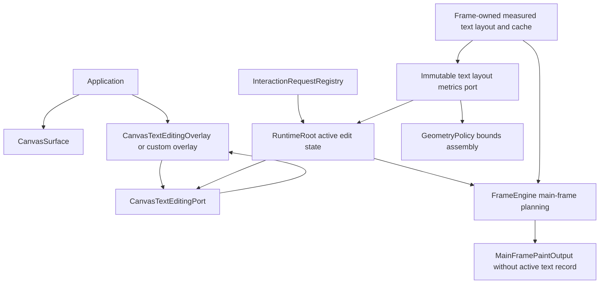
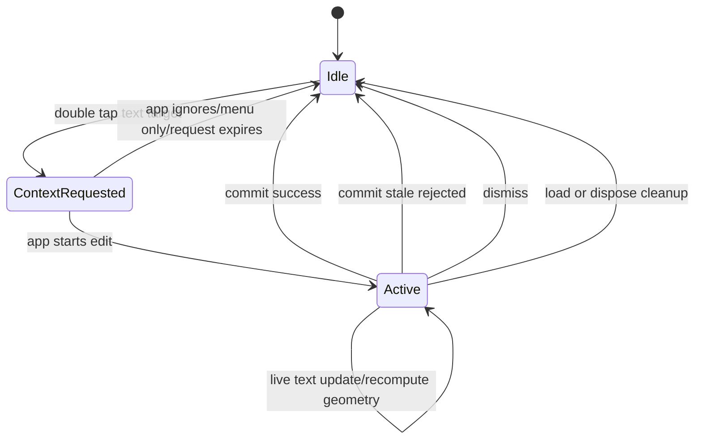
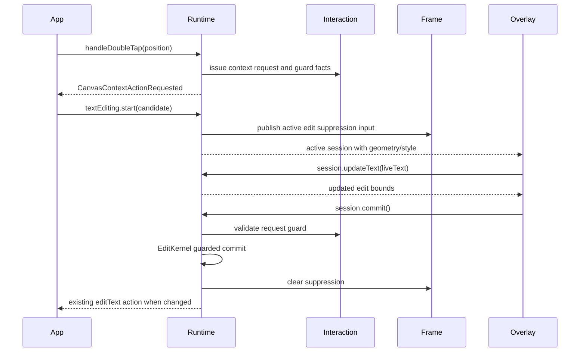

# Design: Inline Text Editing Contract

---
date: 2026-06-04
designer: Codex
commit: d92f890e
branch: new-architecture
design_question: "Design seamless inline editing for text elements in iwb_canvas_engine, with runtime-owned editing contracts, a Flutter-layer EditableText overlay helper, app-replaceable overlay behavior, exact layout-derived geometry, active-edit original text suppression, multiline growth, stale protection, and a proof plan."
---

## Disposition

READY_FOR_CONTRACT

## Product Outcome

Applications get seamless inline text editing by mounting the official text-editing overlay next to `CanvasSurface`. A double tap still emits a context-action request; the engine provides a text-edit candidate, and the application decides whether to start editing immediately, show a menu, open another toolbar, or ignore it.

The recommended default integration is:

```dart
Stack(
  children: [
    CanvasSurface(runtime: runtime),
    CanvasTextEditingOverlay(runtime: runtime),
  ],
)
```

Non-goals:

- Do not put `EditableText`, focus ownership, IME policy, cursor painting, or Flutter widget lifecycle into core runtime, interaction, frame, geometry, or store owners.
- Do not make double tap an unconditional edit command.
- Do not require applications to calculate text geometry, style, bounds, camera placement, or multiline editor growth.
- Do not hide the original canvas text by mutating `CanvasTextElement.isVisible`.
- Do not add a second text layout formula for edit bounds, hit bounds, selection bounds, or overlay placement.
- Do not replace direct programmatic `CanvasEdit.updateElement(CanvasTextElementUpdate)`; request-originated inline editing remains a guarded interaction flow.

## Target Contract Classification

- Profile: BEHAVIOR_CHANGE
- Obligations: BUG_FIX, SEAM_MIGRATION, PUBLIC_API_CHANGE

The future Change Contract must be a behavior-change contract because the runtime will expose a new text-editing port, publish active text-edit session state, suppress original text during an active edit session, and let the official Flutter overlay start or render sessions. It carries BUG_FIX pressure because current text paint and geometry disagree and the example hides text by mutating document visibility. It carries SEAM_MIGRATION because text layout geometry must move to the frame-owned measured text-layout source and the example-owned overlay flow must migrate to the public Flutter integration layer. It carries PUBLIC_API_CHANGE because applications will import exactly these new public symbols: `CanvasTextEditSession`, `CanvasTextEditGeometry`, `CanvasTextEditStyle`, `CanvasTextEditingPort`, and `CanvasTextEditingOverlay`.

## Research Inputs

- `.research/2026-06-04-inline-text-editing-contract.md` - factual repository map supplied by the user. It confirms the current separate text layout and geometry sources, context-action request flow, example-owned overlay/session behavior, visibility mutation problem, existing stale guard behavior, missing public editing symbols, and current multiline overlay tests.

## Repository Evidence

`Evidence Consequence Link`: each fact below states the decision, boundary, unit, proof surface, or review consequence it supports.

- `.research/2026-06-04-inline-text-editing-contract.md:13` - current text rendering layout and geometry bounds have two separate sources -> supports selecting Frame as the measured text-layout owner before adding public edit geometry.
- `.research/2026-06-04-inline-text-editing-contract.md:15` - current double tap emits a context request and the app decides what to do with text targets -> supports preserving double tap as a context-action trigger, not an edit command.
- `.research/2026-06-04-inline-text-editing-contract.md:17` - current example overlay positions and sizes itself from app-owned bounds and a separate `TextPainter` -> supports moving overlay geometry/style into engine-provided session data.
- `lib/src/frame/render_family_caches.dart:104` - production text render currently constructs a `TextPainter` -> supports using Flutter text layout primitives as the measured text layout source.
- `lib/src/frame/render_family_caches.dart:120` - production text layout calls `layout(maxWidth: row.maxWidth ?? double.infinity)` -> supports preserving max-width semantics in the frame-owned measured text layout.
- `lib/src/frame/main_frame_record_painter.dart:140` - production text paint reads the cached text painter -> supports making render paint consume the frame-owned measured layout output.
- `lib/src/frame/main_frame_record_painter.dart:150` - production paint derives local width from `painter.width` -> supports paint bounds coming from the same measured layout.
- `lib/src/frame/main_frame_record_painter.dart:155` - production paint calls `painter.paint` -> supports keeping actual text rendering tied to the shared painter/layout output.
- `lib/src/geometry/geometry_policy.dart:25` - `GeometryPolicy.boundsFor` owns local, hit, and paint bounds derivation -> supports routing text bounds through the geometry boundary instead of app overlay code.
- `lib/src/geometry/geometry_policy.dart:31` - paint bounds are transformed from local bounds -> supports deriving world paint/edit bounds from measured local text layout and element transform.
- `lib/src/geometry/geometry_policy.dart:328` - current `_textBounds` is the formula-based text geometry source -> supports replacing it with measured layout output and adding negative proof that this formula is gone.
- `lib/src/geometry/spatial_entry.dart:41` - paint spatial membership uses `paintBoundsWorld` -> supports making paint admission consume measured text bounds.
- `lib/src/geometry/spatial_entry.dart:65` - hit spatial membership uses `hitBoundsWorld` -> supports making hit candidates consume measured text bounds.
- `lib/src/geometry/spatial_entry.dart:86` - context membership uses hit bounds -> supports making context-action target lookup consume measured text bounds.
- `lib/src/frame/render_element_record.dart:151` - render records are built from `GeometryPolicy.boundsFor` -> supports a single measured geometry handoff into frame records.
- `lib/src/frame/render_element_record.dart:165` - render records store `paintBoundsWorld` -> supports selection and paint output using the same bounds.
- `lib/src/frame/render_element_record.dart:239` - text render rows carry text layout fields -> supports deriving edit style and layout keys from existing row facts.
- `lib/src/frame/frame_cache.dart:193` - `TextLayoutCacheKey` includes text, style, direction, max width, and line height inputs -> supports using one text layout cache key for render and edit geometry.
- `lib/src/frame/frame_cache.dart:295` - current `TextLayoutCacheEntry` stores a `TextPainter` -> supports extending cache entries to store measured layout geometry with the painter.
- `docs/contracts/cache_policy.md:44` - `TextLayoutCache` is owned by Frame and keyed by text/style/font/width/direction/lineHeight -> supports choosing Frame as the sole measured text layout owner instead of a shared geometry/frame owner.
- `lib/src/contracts/public/canvas_element.dart:138` - `CanvasTextElement` is the public text element declaration -> supports exposing session initial text and style from public element facts.
- `lib/src/contracts/public/canvas_element.dart:203` - public text element fields include text, font size, color, align, direction, bold, italic, underline, font family, max width, and line height -> supports the requested `CanvasTextEditStyle` and session fields.
- `lib/src/contracts/public/canvas_element.dart:164` - public text construction validates max text length -> supports session commit using existing text validation before mutation.
- `docs/contracts/public_api_v1.md:286` - `CanvasInteractionRequestId` is the public request id type -> supports carrying request id in candidates and sessions.
- `docs/contracts/public_api_v1.md:317` - applications store engine-generated interaction request ids and pass them back to guarded command seams -> supports session commit delegating to the guarded request id.
- `docs/contracts/public_api_v1.md:88` - the root barrel exports exactly the public names listed in `docs/_registry/public_api_v1.yaml` -> supports updating the machine-readable public export registry for the five new symbols.
- `docs/contracts/public_api_v1.md:505` - `CanvasSurface` is a public `StatefulWidget` -> supports adding an adjacent public Flutter overlay widget rather than core-owned widget code.
- `docs/contracts/public_api_v1.md:538` - `interactive=false` disables pointer routing on `CanvasSurface` only -> supports keeping read-only text editing policy separate from surface interactivity.
- `docs/contracts/public_api_v1.md:1476` - `CanvasCommandPort` already owns command mutations -> supports reusing command guard semantics for session commit.
- `docs/contracts/public_api_v1.md:1493` - command mutations must go through `EditKernel` and inherit rollback, stale, and dispose checks -> supports not committing text directly from the overlay.
- `docs/contracts/public_api_v1.md:1503` - `commitTextEdit` rejects and consumes stale live request ids when the element is missing, generation changed, element revision changed, or family changed -> supports stale protection for sessions.
- `docs/contracts/public_api_v1.md:1512` - `commitTextEdit` validates new text before request consumption and draft mutation -> supports validation order for session commit.
- `docs/contracts/public_api_v1.md:1518` - changed-text commits run through `EditKernel` and emit after atomic install -> supports all-or-nothing session commit.
- `docs/contracts/public_api_v1.md:2359` - engine emits exactly one asynchronous `CanvasContextActionRequested` for accepted context targets -> supports preserving the event as the double-tap surface.
- `docs/contracts/public_api_v1.md:2367` - the application decides whether to show a context menu or text editor for text targets -> supports app/config-owned start policy.
- `docs/contracts/public_api_v1.md:2370` - app overlay may visually cover/hide text but must not mutate the target element to hide it -> supports runtime/frame paint suppression instead of document visibility mutation.
- `docs/contracts/public_api_v1.md:2375` - request-originated text changes commit through `CanvasCommandPort.commitTextEdit` -> supports session `commit` delegating to the command path.
- `docs/contracts/public_api_v1.md:2381` - direct `CanvasEdit.updateElement(CanvasTextElementUpdate)` remains available for programmatic non-request synchronization -> supports preserving non-request edits outside the inline session port.
- `docs/contracts/public_api_v1.md:2386` - current docs say engine does not store active text-input session -> supports a future source-of-truth update because this design intentionally changes that ownership.
- `docs/contracts/public_api_v1.md:2387` - current docs place editor overlay lifetime, IME, focus, accessibility, text selection, and hide/show policy on the application -> supports moving only the contract/session/suppression/geometry into runtime while keeping Flutter widget lifecycle in the integration layer.
- `docs/contracts/interaction_engine.md:377` - content-element targets carry immutable public element snapshots and bounds -> supports adding text-edit candidate data without making the target mutable.
- `docs/contracts/interaction_engine.md:379` - text editing is an application-owned choice after delivery -> supports preserving context action as the decision point.
- `docs/contracts/interaction_engine.md:383` - context request emission records live guard facts in `InteractionRequestRegistry` -> supports session start from a live request id.
- `docs/contracts/interaction_engine.md:390` - `documentRevision` is observation and diagnostics, not the stale commit guard -> supports carrying document revision in the session as a guard/reporting fact while using element guard facts for rejection.
- `docs/contracts/interaction_engine.md:397` - current registry is not an active text-input session -> supports adding a separate active session owner rather than overloading the registry.
- `docs/contracts/interaction_engine.md:401` - request-originated text changes commit through `CanvasCommandPort.commitTextEdit` -> supports session commit handoff to the existing command boundary.
- `lib/src/contracts/public/canvas_actions.dart:175` - `CanvasContextActionRequested` is the public context request value -> supports extending or pairing the request with a text edit candidate.
- `lib/src/contracts/public/canvas_actions.dart:187` - context requests carry `requestId` -> supports candidate/session guard identity.
- `lib/src/contracts/public/canvas_actions.dart:203` - content targets carry an element snapshot -> supports deriving candidate initial text/style from the target text element.
- `lib/src/contracts/public/canvas_actions.dart:211` - content targets currently carry `boundsWorld` -> supports replacing text target bounds with measured layout-derived paint bounds.
- `lib/src/contracts/public/canvas_runtime.dart:183` - `CanvasCommandPort` is the public command seam -> supports keeping commit at the command boundary.
- `lib/src/contracts/public/canvas_runtime.dart:186` - `commitTextEdit` accepts request id and new text -> supports session `commit(String text)` as a thin guarded facade.
- `lib/src/api/canvas_runtime.dart:40` - public runtime exposes `CanvasRuntime.state` -> supports publishing active edit state through a listenable port rather than an app-owned view model.
- `lib/src/api/canvas_runtime.dart:49` - public runtime exposes `contextActionRequests` -> supports official overlay listening for double-tap requests when inline edit is enabled.
- `lib/src/api/canvas_runtime.dart:54` - runtime dispose delegates to root and detaches bridges -> supports clearing active edit sessions on dispose.
- `lib/src/api/canvas_surface.dart:1` - public surface API facade exports surface styles and the surface widget -> supports exporting `CanvasTextEditingOverlay` from the same API facade.
- `lib/iwb_canvas_engine.dart:15` - root barrel exports public runtime API -> supports adding `CanvasRuntime.textEditing` to the root public API path.
- `lib/iwb_canvas_engine.dart:16` - root barrel exports public surface API -> supports adding `CanvasTextEditingOverlay` to the root public API path.
- `docs/_registry/public_api_v1.yaml:1` - the registry is the machine-readable inventory for the Public API v1 exported-name contract -> supports adding `CanvasTextEditSession`, `CanvasTextEditGeometry`, `CanvasTextEditStyle`, `CanvasTextEditingPort`, and `CanvasTextEditingOverlay` there during the future contract.
- `docs/verification/guardrails.md:2` - guardrail documentation is owned by `section_22_guardrails_machine_checks` in `docs/_registry/sections.yaml` -> supports mandatory source-of-truth updates when new structural guardrails are required proof.
- `docs/verification/guardrails.md:106` - guardrails are blocking architecture and release rules executable through the project-owned entrypoint -> supports runner-backed structural guardrail proof for text layout singularity.
- `tool/guardrails/src/guardrail_registry.dart:1` - `GuardrailEntry` is the tool registry shape for guardrail ids and suites -> supports adding new text/surface guardrail ids to the runner inventory.
- `tool/guardrails/src/guardrail_executor.dart:77` - `guardrailRouteFor` maps guardrail ids to proof routes -> supports adding executor routes for new structural checks instead of prose-only guardrails.
- `lib/src/api/canvas_runtime_surface_bridge.dart:29` - `CanvasRuntimeSurfacePort` is the narrow runtime-to-surface bridge -> supports a similar narrow text editing bridge for Flutter overlay helpers without exposing `RuntimeRoot`.
- `lib/src/api/canvas_runtime_surface_bridge.dart:70` - surface bridge builds main frame through token-checked runtime calls -> supports keeping active edit suppression inside runtime/frame, not app overlay code.
- `lib/src/surface/canvas_surface_widget.dart:14` - `CanvasSurface` implementation lives under `lib/src/surface/**` -> supports placing the official overlay widget in the Flutter integration layer, not core.
- `lib/src/surface/canvas_surface_widget.dart:182` - surface asks the runtime port for main frame output -> supports letting runtime/frame exclude the active text record before painting.
- `lib/src/surface/main_painter.dart:59` - main painter consumes immutable `MainFramePaintOutput` records and selection decorations -> supports suppressing active edit text before painter consumption, not inside app overlay code.
- `docs/architecture/01_runtime_ownership.md:56` - architecture assigns distinct owner zones -> supports separating runtime session state, frame layout, geometry bounds, and surface widgets.
- `docs/architecture/01_runtime_ownership.md:63` - `InteractionEngine` owns request guard facts but must not store Flutter text editor session state -> supports keeping guard facts in interaction and active edit session state in runtime/public text-editing port, not in interaction widgets.
- `docs/architecture/01_runtime_ownership.md:71` - `RuntimeRoot` owns public runtime state publication -> supports runtime-owned active session publication.
- `docs/architecture/01_runtime_ownership.md:109` - gesture decisions read committed facts through `InteractionReadPort` -> supports deriving candidates from committed text target facts.
- `docs/architecture/01_runtime_ownership.md:124` - frame capture uses `FrameFactsPort` as the committed-state read seam -> supports feeding measured text bounds to frame without store internals.
- `docs/architecture/01_runtime_ownership.md:174` - `InteractionRequestRegistry` owns issued request guard facts and live request status -> supports reusing request guard facts for session start/commit.
- `docs/architecture/02_package_boundaries.md:184` - root barrel exports only `src/api/**`, with public declarations under `contracts/public` and implementation owners consuming contracts -> supports placing public session/style/geometry declarations in contracts/public and wrapper exports in api.
- `docs/architecture/02_package_boundaries.md:248` - tests mirror production ownership folders -> supports future tests under `test/geometry`, `test/frame`, `test/interaction`, `test/runtime`, `test/surface`, and public smoke/API contract areas.
- `docs/architecture/02_package_boundaries.md:293` - `lib/src/surface/**` must not import the legacy package -> supports guardrail proof for the official overlay.
- `docs/contracts/frame_rendering.md:111` - main paint captures main frame once and committed facts enter FrameEngine through `FrameFactsPort` -> supports single capture with active-edit suppression applied before immutable paint output.
- `docs/contracts/frame_rendering.md:125` - painters do not live-read runtime -> supports not checking active edit sessions inside `CustomPainter.paint`.
- `docs/contracts/frame_rendering.md:145` - `FrameEngine` remains the frame-internal facade for orchestration and painter input assembly -> supports placing original text suppression in frame planning/output, not in surface painter widgets.
- `docs/contracts/frame_rendering.md:200` - painters receive immutable render records, not public `CanvasElement` -> supports adding suppression before render records reach painters.
- `docs/contracts/geometry.md:62` - context-action eligibility is separate from selection hit eligibility -> supports preserving double-tap context actions while text editing start remains app/config-owned.
- `docs/contracts/geometry.md:94` - box/image/text/rect hit uses local bounds -> supports local text bounds coming from measured layout.
- `docs/contracts/geometry.md:139` - paint admission uses paint bounds and invisible elements are not painted -> supports active-edit suppression as a paint-admission exclusion distinct from `isVisible`.
- `example/lib/src/canvas_example_view_model.dart:625` - example currently starts text editing directly from every context request -> supports migrating default behavior into a configurable overlay helper.
- `example/lib/src/canvas_example_view_model.dart:642` - example currently updates document visibility to hide text -> supports replacing this with runtime/frame paint suppression.
- `example/lib/src/canvas_example_view_model.dart:689` - only the example defines `CanvasExampleTextEditSession` -> supports adding public session declarations.
- `example/lib/src/canvas_text_edit_overlay.dart:10` - current overlay is example-owned -> supports moving the official helper to `lib/src/surface/**`.
- `example/lib/src/canvas_text_edit_overlay.dart:63` - example computes view position from target bounds and camera offset -> supports moving placement calculation into official overlay/port.
- `example/lib/src/canvas_text_edit_overlay.dart:87` - current overlay uses a `TextField` -> supports replacing the official helper with lower-level `EditableText`.
- `example/lib/src/canvas_text_edit_overlay.dart:154` - current overlay separately measures editor text height -> supports deleting duplicate overlay layout measurement.
- `test/interaction/fixtures/text_edit_stale_commit_guard_fixture.dart:53` - existing tests cover rejected text edit requests -> supports extending stale proof rather than inventing a new stale guard.
- `test/interaction/fixtures/text_edit_stale_commit_guard_fixture.dart:191` - same-text commits retire the request privately -> supports defining no-op session commit behavior.
- `test/interaction/fixtures/text_edit_stale_commit_guard_fixture.dart:234` - changed text commit publishes an action -> supports preserving existing action semantics.
- `test/interaction/fixtures/text_edit_stale_commit_guard_fixture.dart:328` - validation happens before request consumption -> supports session commit validation order.
- `test/interaction/fixtures/text_edit_stale_commit_guard_fixture.dart:342` - disposed runtime behavior is tested -> supports active session cleanup on dispose.
- `example/test/canvas_example_screen_test.dart:439` - existing widget test covers overlay bounds and multiline growth only in the example -> supports moving proof to public surface/runtime tests.

## Design Form Candidates

### Candidate A. Keep App-Owned Overlay, Improve Example Geometry

- Form: expose more accurate `boundsWorld` on context targets and patch the example overlay to use it.
- Why it could work: smallest visible change for the example, minimal public API expansion.
- Gate failures or risks: fails owner-level fix because every app would still own session lifecycle, stale handling, editor growth, and original text hiding. It also fails source-of-truth singularity because app overlays could still remeasure text or calculate bounds differently.

### Candidate B. Runtime-Owned Session Contract Plus Flutter-Layer Official Overlay

- Form: runtime owns text edit candidates, active session state, stale guards, live layout geometry, commit/dismiss, and original text paint suppression; frame/geometry share one measured text-layout owner; surface layer provides `CanvasTextEditingOverlay` built on `EditableText`; apps may replace the overlay by consuming the same `CanvasTextEditingPort`.
- Why it could work: matches the requested product model, keeps `EditableText` out of core, preserves app choice after double tap, and removes app-owned geometry/style/bounds calculations.
- Gate failures or risks: requires a public API change and source-of-truth docs updates. It also changes current docs that say the engine stores no active text-input session.

### Candidate C. Core-Owned Text Editor Widget And Automatic Double-Tap Editing

- Form: make runtime start editing on double tap and render `EditableText` as part of `CanvasSurface`.
- Why it could work: simplest default for demo behavior.
- Gate failures or risks: fails the requested app/config choice, puts Flutter editor lifecycle into the wrong owner, prevents custom overlay replacement, and mixes context-action routing with edit commands.

## Known Future Pressures

| Pressure | Evidence | How the selected form responds | Accepted cost or risk |
|---|---|---|---|
| Apps need menu-first, toolbar, immediate edit, or no action after double tap. | `docs/contracts/public_api_v1.md:2367` | Preserves double tap as a context action and exposes a startable text edit candidate through the editing port. | The official overlay needs a configurable auto-start policy instead of hard-coded behavior. |
| Apps may replace the overlay but should not calculate geometry. | User request; `example/lib/src/canvas_text_edit_overlay.dart:63` | Custom overlays consume `CanvasTextEditingPort.activeSession` and session geometry/style. | Public session values must be stable and complete enough for custom overlays. |
| Multiline editing must grow without internal scroll unless max height is explicit. | User request; `example/test/canvas_example_screen_test.dart:456` | Live text changes update session geometry through the frame-owned measured text layout; overlay host grows to `editBoundsWorld` unless `maxEditorHeight` is set. | When max height is set, the overlay may scroll internally and must advertise that as app-selected behavior. |
| Existing docs say engine does not store active text-input session. | `docs/contracts/public_api_v1.md:2386` | Future contract must update public API, interaction, frame, geometry, and surface docs to name the new runtime-owned active session state. | Source-of-truth update is mandatory before implementation can be considered complete. |
| Text selection/caret metrics may need exact line boxes later. | User request lists selection bounds; `docs/contracts/geometry.md:94` | Frame-owned measured text layout should include enough line/box metrics for selection bounds even if v1 overlay delegates visible selection to `EditableText`. | Initial API can expose edit bounds and paint bounds; internal metrics should avoid blocking later selection handles. |
| Single active surface currently gates `CanvasSurface`. | `docs/contracts/public_api_v1.md:527` | Text editing overlay attaches through the public runtime port and does not become a second surface. | Overlay needs token-free public access to editing state; paint suppression still belongs to runtime/frame. |
| Programmatic non-request text updates remain available. | `docs/contracts/public_api_v1.md:2381` | Session stale guard rejects if the target changed through any other path, while direct edit APIs remain explicit and outside the session. | Apps must handle false/stale commit results and restart editing if desired. |

## Selected Form

Choose Candidate B: runtime-owned text edit session contract, frame-owned measured text layout, and a Flutter-layer official overlay helper.

The selected form has four owners:

| Layer | Owner | Responsibility |
|---|---|---|
| Public contract | `lib/src/contracts/public/**`, wrapper exported by `lib/src/api/**` | Declare `CanvasTextEditSession`, `CanvasTextEditGeometry`, `CanvasTextEditStyle`, and `CanvasTextEditingPort`; expose the editing port from `CanvasRuntime`. |
| Runtime/interaction | `RuntimeRoot` plus existing `InteractionRequestRegistry`/command path | Produce text edit candidates from context requests, start exactly one active session, own live text/edit geometry state, commit through `CanvasCommandPort.commitTextEdit`, dismiss without mutation, and clear sessions on stale/commit/dismiss/load/dispose. |
| Frame text layout | `lib/src/frame/**` as the sole measured text-layout owner, with `TextLayoutCache` and a typed internal metrics port | Use one measured text layout result for render text, paint bounds, selection bounds, hit bounds, edit bounds, and overlay placement. Geometry consumes immutable measured metrics through a contract-owned typed port; it does not calculate text metrics or import concrete frame state. Frame suppresses the active edit text element from main-frame ordinary paint and selection decoration without mutating the document. |
| Flutter integration | `lib/src/surface/**` exported by `lib/src/api/canvas_surface.dart` | Implement `CanvasTextEditingOverlay` with `EditableText`, focus/cursor/theme hooks, optional auto-start from double tap, optional max editor height, and custom-overlay replacement through the same port. |

### Public API Sketch

The future Change Contract should lock exact names and constructor signatures, but the public shape should be:

```dart
final class CanvasTextEditGeometry {
  const CanvasTextEditGeometry({
    required this.paintBoundsWorld,
    required this.editBoundsWorld,
    required this.transform,
    required this.maxWidth,
  });

  final Rect paintBoundsWorld;
  final Rect editBoundsWorld;
  final CanvasTransform transform;
  final double? maxWidth;
}

final class CanvasTextEditStyle {
  const CanvasTextEditStyle({
    required this.fontSize,
    required this.fontFamily,
    required this.isBold,
    required this.isItalic,
    required this.isUnderline,
    required this.color,
    required this.textAlign,
    required this.textDirection,
    required this.lineHeight,
  });

  final double fontSize;
  final String? fontFamily;
  final bool isBold;
  final bool isItalic;
  final bool isUnderline;
  final Color color;
  final TextAlign textAlign;
  final TextDirection textDirection;
  final double? lineHeight;
}

final class CanvasTextEditSession {
  CanvasTextEditSession._();

  CanvasElementId get elementId;
  CanvasInteractionRequestId get requestId;
  int get documentRevision;
  int get elementRevision;
  int get generation;
  String get initialText;
  String get liveText;
  CanvasTextEditGeometry get geometry;
  CanvasTextEditStyle get style;
  bool get isActive;
  bool get isStale;

  void updateText(String text);
  bool commit({int? timestampMs});
  void dismiss();
}

abstract interface class CanvasTextEditingPort {
  ValueListenable<CanvasTextEditSession?> get activeSession;
  bool get readOnly;

  CanvasTextEditSession? sessionCandidateFor(
    CanvasContextActionRequested request,
  );

  CanvasTextEditSession? start(CanvasTextEditSession session);
  CanvasTextEditSession? startFromContextAction(
    CanvasContextActionRequested request,
  );

  void setReadOnly(bool value);
  void dismissActive();
}

final class CanvasTextEditingOverlay extends StatefulWidget {
  const CanvasTextEditingOverlay({
    required this.runtime,
    this.inlineEditOnDoubleTap = true,
    this.maxEditorHeight,
    this.cursorColor,
    this.selectionColor,
    this.selectionControls,
    super.key,
  });

  final CanvasRuntime runtime;
  final bool inlineEditOnDoubleTap;
  final double? maxEditorHeight;
  final Color? cursorColor;
  final Color? selectionColor;
  final TextSelectionControls? selectionControls;
}
```

There is no public candidate-token type. `CanvasTextEditingPort.sessionCandidateFor(request)` returns a `CanvasTextEditSession?` value populated with request id, element id, revision guard facts, initial text, geometry, style, and inactive candidate state. The same public type becomes active only after `CanvasTextEditingPort.start(session)` or `startFromContextAction(request)` accepts the still-live guard. Candidate lookup must not suppress paint, take focus, consume the request, mutate the document, or publish `activeSession`. `commit` and `dismiss` are meaningful only for the active session; calling them on an inactive or no-longer-current candidate is a no-mutation false/no-op result. This keeps the public symbol set to the five requested names while still giving apps an inspectable text edit session candidate.

Single-active admission is runtime-enforced. If no session is active and `readOnly == false`, `start` may activate a still-live candidate. If the same request id is already active, `start` returns the current active session idempotently. If any different session is active, `start` returns null, leaves the current active session and suppression unchanged, does not consume the new request, and does not mutate the document. The app must commit or dismiss the active session before starting another one; there is no implicit dismiss-and-replace policy.

### Lifecycle And State Table

| State | Owner | Entry | Allowed actions | Exit | Public observation |
|---|---|---|---|---|---|
| `idle` | Runtime text editing port | No active session | Context requests can produce inactive `CanvasTextEditSession` candidates; direct programmatic edits remain available. | App starts a candidate. | `activeSession.value == null`. |
| `context action requested on text` | Interaction request registry plus runtime editing port | Double tap/context request resolves a text element. | App may start inline editing, show menu, show toolbar, or ignore. | Candidate expires when request guard becomes stale, request is consumed, load/dispose happens, or app starts it. | `CanvasContextActionRequested` plus optional candidate lookup. |
| `active text edit session` | Runtime text editing port | App calls `start(candidate)` or overlay auto-starts when enabled and runtime port is not read-only. | Overlay updates live text; runtime recomputes edit geometry; frame suppresses original text. Starting a different session is rejected without changing this session. | Commit, dismiss, stale rejection, read-only enabled, load, or dispose. | `activeSession.value` is non-null and updates with live geometry. |
| `live text changes` | Runtime text editing port plus frame-owned measured text layout | Overlay calls `session.updateText(text)`. | Recompute geometry/style-derived edit bounds from the same layout policy used by paint. | More changes, commit, dismiss, or stale. | Active session geometry changes; document does not mutate. |
| `commit` | Session facade delegates to command port | Overlay calls `session.commit()`. | Validate text, check request/element guard, prepare edit through `EditKernel`, consume request after successful prepare. | Success restores canvas rendering with committed text; stale/failed commit clears suppression without document mutation. | Success emits existing editText action for changed text; stale false emits no document/action effect. |
| `dismiss` | Runtime text editing port | Overlay/app calls `session.dismiss()` or loses policy ownership. | Clear active session and suppression only. | Canvas rendering restored from unchanged committed document. | No action event, no document revision change. |

### Active Edit Suppression

Runtime owns an `ActiveTextEditState` keyed by request id, element id, generation, and element revision. Starting a session does not edit the document. Instead, main-frame planning receives the active edit element id as transient paint suppression input.

Suppression rules:

- suppress only the matching text element while the active session guard still matches current element id, generation, element revision, family, and controller epoch;
- exclude the original text record from ordinary main-frame paint output before `MainFramePainter` receives immutable records;
- exclude selection decoration for that element while the overlay is responsible for editor focus/selection visuals;
- do not mutate `CanvasTextElement.isVisible`;
- do not remove the element from hit/context spatial indexes merely because editing is active;
- restore canvas rendering by clearing active session state on commit, dismiss, stale rejection, successful load, or dispose.

This makes the visible transition: text remains in the same position, the original paint record is removed, `EditableText` appears at the same measured edit bounds, and the user sees only the cursor/focus affordance rather than a text jump or double paint.

### Shared Text Layout

Frame is the sole owner of measured text layout because the existing cache policy already assigns `TextLayoutCache` to Frame. The future implementation should extend the frame-owned text layout cache/policy so each text layout cache entry contains both the render painter and immutable layout metrics. A contract-owned internal metrics port may be declared outside frame so geometry can request or receive `MeasuredTextLayout` values without importing concrete frame state, but the calculation and cache remain frame-owned.

`GeometryPolicy` remains the owner of generic bounds assembly and transform/hit-padding policy. For text elements, it must stop calculating width or height from text length and must consume the frame-owned measured layout metrics instead. If a measured text layout cannot be produced for a text element, the fallback must be explicit, bounded, and tested; it must not silently revive the current approximate formula.

Required layout result:

- local paint bounds;
- local hit bounds;
- local selection bounds;
- local edit bounds;
- world paint bounds after element transform;
- world hit bounds after hit padding and transform;
- world edit bounds after element transform;
- text style values used by render and overlay;
- laid-out `TextPainter` or equivalent measured painter for the render path;
- line metrics or enough line box data to prove multiline growth and future selection bounds.

Required invariant:

```text
For a given text element or live edit text plus style inputs,
render paint, paint bounds, selection bounds, hit bounds, edit bounds,
and overlay placement are all derived from the same measured layout result.
```

The old text-length formula must be retired or unreachable for text elements. A future structural test should fail if text bounds are computed from `text.length * fontSize`, if the example/public overlay constructs a separate `TextPainter` for edit height, or if canvas text is painted from a different text style than the session style.

### Multiline And Scroll Policy

Session live text updates recompute edit bounds. The official overlay sizes itself to the session `editBoundsWorld` by default, so Enter inserts a newline and the editor grows vertically. Internal scrolling is disabled when `maxEditorHeight == null`. If `maxEditorHeight` is provided, the overlay clamps the visible editor height and enables internal scroll as an explicit app-selected trade-off.

Commit uses the session `liveText`. After a successful commit, the committed canvas text must render with the same frame-owned measured layout result as the final editor state before commit, modulo cursor/selection-only visuals.

### Read-Only And Configuration

Read-only policy is runtime-enforced through `CanvasTextEditingPort.readOnly` and `CanvasTextEditingPort.setReadOnly(bool)`. The official overlay only observes this port policy; it does not own a separate overlay-only read-only flag, so custom overlays cannot bypass read-only by skipping the official widget. When `readOnly == true`, `sessionCandidateFor` may still return inspectable candidates for menus/toolbars, but `start` and `startFromContextAction` return null, consume nothing, suppress nothing, and mutate no document state. If `setReadOnly(true)` is called while a session is active, runtime dismisses the active session without commit, clears suppression, and restores canvas rendering from the unchanged committed document. This policy applies to inline text editing only; it does not silently disable every existing programmatic edit API. A future general read-only canvas policy would need its own design.

Configuration obligations:

- `inlineEditOnDoubleTap`: official overlay may auto-start from text context requests when true.
- manual edit from context menu: app can call `runtime.textEditing.start(candidate)` from a menu action.
- read-only mode: app calls `runtime.textEditing.setReadOnly(true)`; start returns null and no suppression occurs.
- custom overlay replacement: app ignores `CanvasTextEditingOverlay` and consumes `CanvasTextEditingPort.activeSession`, session geometry, and session style directly.
- max editor height: official overlay clamps height and enables internal scroll only when explicitly set.
- cursor/theme hooks: official overlay forwards cursor color, selection color, and Flutter SDK `TextSelectionControls`/theme values without changing geometry ownership or adding extra package-exported public types.

## Decision Trace

Preserve `Decision Chain Of Custody`: source inputs and locked decisions must map to the future contract field, execution unit, or proof surface that carries them forward.

| Decision ID | Decision | Evidence | Contract handoff target |
|---|---|---|---|
| D1 | Double tap remains a context-action trigger; text editing start is app/config-owned. | `.research/2026-06-04-inline-text-editing-contract.md:15`, `docs/contracts/public_api_v1.md:2367`, `docs/contracts/interaction_engine.md:379` | `Boundaries.Entry`, public API docs, interaction tests for no automatic edit command. |
| D2 | Runtime owns text edit candidates, active session state, guard identity, live text geometry, commit, dismiss, and cleanup. | `docs/architecture/01_runtime_ownership.md:71`, `docs/architecture/01_runtime_ownership.md:174`, `docs/contracts/public_api_v1.md:1503` | `Boundaries.Owner`, runtime execution unit, stale/load/dispose tests. |
| D3 | `EditableText` lives only in the Flutter surface integration helper. | `lib/src/surface/canvas_surface_widget.dart:14`, `docs/architecture/02_package_boundaries.md:184`, `docs/contracts/public_api_v1.md:2387` | `Boundaries.Dependency direction`, surface execution unit, import guardrail. |
| D4 | Frame owns the single measured text layout source and cache; geometry consumes immutable measured metrics through a typed internal port and no longer computes text metrics. | `.research/2026-06-04-inline-text-editing-contract.md:13`, `lib/src/frame/render_family_caches.dart:104`, `docs/contracts/cache_policy.md:44`, `lib/src/geometry/geometry_policy.dart:328` | `Boundaries.Owner`, `Boundaries.Source of Truth`, frame layout execution unit, geometry consumer execution unit, structural and behavioral layout tests. |
| D5 | Active editing hides original text through runtime/frame paint suppression, not document visibility mutation. | `docs/contracts/public_api_v1.md:2370`, `example/lib/src/canvas_example_view_model.dart:642`, `lib/src/surface/main_painter.dart:59` | frame execution unit, suppression tests, no document revision tests. |
| D6 | Session commit delegates to existing guarded `commitTextEdit`/`EditKernel` path and stale commit rejection never mutates the document. | `docs/contracts/public_api_v1.md:1493`, `docs/contracts/public_api_v1.md:1518`, `test/interaction/fixtures/text_edit_stale_commit_guard_fixture.dart:53` | runtime execution unit, interaction/runtime stale tests. |
| D7 | Official overlay is replaceable; custom overlays consume session geometry/style and do not calculate bounds. | User request, `.research/2026-06-04-inline-text-editing-contract.md:17`, `example/lib/src/canvas_text_edit_overlay.dart:154` | public API docs, surface tests, example migration. |
| D8 | Runtime enforces single-active admission and read-only policy for official and custom overlays: conflicting starts are rejected without replacement, and enabling read-only dismisses active editing without commit. | `docs/architecture/01_runtime_ownership.md:71`, `docs/contracts/public_api_v1.md:538`, `docs/contracts/public_api_v1.md:1493` | `Temporal Surface Closure`, runtime execution unit, read-only/conflicting-start tests. |

## Outcome-Proof Fit

| Claim | Direct outcome | Proxy risk | Required proof surface or strategy |
|---|---|---|---|
| Editing starts only when the app/config chooses it. | Double tap emits context action and no active session appears unless overlay/config or manual menu calls start. | A widget test that happens to start editing immediately could hide a runtime auto-start. | Interaction/runtime tests assert context request alone leaves `activeSession` null; overlay tests assert auto-start only when enabled. |
| Text bounds use one measured layout source. | Render paint, paint bounds, hit bounds, selection bounds, edit bounds, and overlay placement match for varied text/style/maxWidth/lineHeight/multiline inputs. | Snapshot tests may pass for simple strings while formula drift remains. | Geometry/frame golden-free numeric tests, structural search forbidding text-length formula and duplicate overlay `TextPainter` measurement. |
| Original text is not double-painted during editing. | Active session frame output excludes the text record and selection decoration, while overlay renders the editor at identical bounds. | Visual screenshot may look correct if overlay covers the text but document was mutated or double paint remains underneath. | Frame output tests inspect records; runtime tests assert document revision/visibility unchanged; widget test checks no jump with active overlay. |
| Stale commit cannot corrupt the document. | If target is deleted or element revision/generation/family changes, commit returns false, clears suppression, consumes/clears session as specified, and document text remains unchanged. | A false return without document inspection could miss partial mutation. | Runtime/interaction tests inspect document, action stream, request facts, active session state, and repaint/suppression restoration. |
| Conflicting or read-only starts cannot discard or mutate text. | Starting a different session while one is active returns null and leaves current session unchanged; read-only start returns null with no suppression; enabling read-only dismisses active editing without commit. | A UI-only test could miss request consumption, document mutation, or hidden replacement. | Runtime tests inspect active session identity, request facts, document revision/text, suppression state, and action stream. |
| Multiline editor grows without internal scroll by default. | Enter increases live edit geometry height and overlay host height; no scroll controller offset changes unless `maxEditorHeight` is set. | Only checking TextField height in example could still use app remeasurement. | Public surface widget tests with `CanvasTextEditingOverlay`, session geometry assertions, and max-height scroll-specific test. |
| Custom overlays do not calculate geometry. | A consumer can build a replacement overlay from session `geometry` and `style` only. | Example using official overlay only could leave custom app path underspecified. | Public smoke/custom overlay test imports root barrel and uses `CanvasTextEditingPort.activeSession` without geometry helpers. |

## Hard Gate Check

| Gate | Result | Evidence |
|---|---|---|
| Owner-Level Fix | pass | The selected form fixes the frame-owned text layout source, geometry consumer boundary, and session owner, not only the example overlay; see `.research/2026-06-04-inline-text-editing-contract.md:13` and `.research/2026-06-04-inline-text-editing-contract.md:17`. |
| Ownership | pass | Runtime owns public session state (`docs/architecture/01_runtime_ownership.md:71`), interaction retains request guard facts (`docs/architecture/01_runtime_ownership.md:174`), Frame owns `TextLayoutCache` (`docs/contracts/cache_policy.md:44`), geometry owns bounds assembly (`lib/src/geometry/geometry_policy.dart:25`), and surface owns widgets (`lib/src/surface/canvas_surface_widget.dart:14`). |
| Source-Of-Truth Singularity | pass | Frame-owned measured layout retires formula-based text bounds from `lib/src/geometry/geometry_policy.dart:328` and feeds every text bounds consumer through immutable metrics. |
| Boundary-Owned Policy | pass | Start policy belongs to app/config through context-action delivery (`docs/contracts/public_api_v1.md:2367`); commit validation/stale policy stays at command/runtime boundary (`docs/contracts/public_api_v1.md:1493`). |
| Negative Proof And Fixture Quarantine | pass | Future negative proof uses production structural checks and public/surface/runtime tests; no fixture-only names are required in public APIs. |
| Dependency direction | pass | Public declarations live under contracts/public with API wrapper exports (`docs/architecture/02_package_boundaries.md:184`); geometry consumes a typed metrics port and does not import concrete frame state; `EditableText` stays under surface, not runtime/interaction/frame/store. |
| State/data | pass | Active edit state is transient runtime state; document text remains committed store state; frame-owned measured layout metrics are derived cached state; overlay controller text is Flutter widget-local mirror of session live text. |
| Sequenced Migration And Retirement | pass | Migration order is frame-owned measured text layout first, public port/session second, frame suppression third, official overlay fourth, example migration last. Retire app visibility mutation and duplicate overlay measurement only after public overlay proof passes. |
| Temporal Surface Closure | pass | Context request publishes candidate before any suppression; start publishes active session and suppression together only when no different session is active and read-only is false; conflicting start returns null without replacement; read-only enabling dismisses active editing without commit; live updates publish session geometry before overlay rebuild; commit validates and prepares before consuming request and clearing suppression; dismiss clears suppression without mutation. |
| All-Or-Nothing Failure Boundary | pass | Commit irreversible point remains `EditKernel` atomic install. Fallible validation and stale checks occur before install; suppression cleanup is failure-contained because it only clears transient runtime state. |
| Outcome-Proof Fit | pass | Direct outcomes and proxy risks are listed above with required proof surfaces. |
| Verification | pass | Future proof surfaces are executable tests and structural checks across geometry, frame, interaction, runtime, surface, example, API contract, docs, and public smoke. |
| Future pressure | pass | Known pressures are listed and handled without blocking later custom overlay, multiline, read-only, and selection-bound requirements. |

## Lock-Required Facts

- Owner: `RuntimeRoot` owns active text edit sessions and publication through `CanvasTextEditingPort`; `InteractionRequestRegistry` remains the guard fact owner; Frame owns measured text layout calculation/cache; `GeometryPolicy` owns bounds assembly from immutable measured metrics; surface owns `CanvasTextEditingOverlay`.
- Owning layer/module/document family: future public API docs, interaction docs, frame rendering docs, geometry docs, surface docs, architecture graph/docs, and tests must be updated by the Change Contract; this workflow does not edit them.
- Seam: new public `CanvasTextEditingPort` exposed from `CanvasRuntime`, backed by runtime-owned active session state and existing command guard semantics.
- Dependency/import direction: contracts/public -> api wrappers -> runtime/surface implementations; frame-owned text layout may expose immutable metrics through a typed internal port; geometry may consume that port but must not import concrete frame state; surface may import Flutter widgets; core runtime/interaction/frame/geometry must not import surface widgets or `EditableText`.
- State/data ownership: committed text stays in document/store; request guard facts stay in interaction; active edit session/live text/paint suppression stay in runtime; measured layout is frame-owned derived cached state; bounds assembled from metrics are geometry-owned derived state; `EditableText` controller/focus/IME state stays in surface widget.
- Entry boundaries: `CanvasContextActionRequested`, `CanvasTextEditingPort.sessionCandidateFor`, `CanvasTextEditingPort.start`, `CanvasTextEditingPort.startFromContextAction`, `CanvasTextEditingPort.setReadOnly`, and overlay auto-start when enabled.
- Exit boundaries: `CanvasTextEditSession.commit`, `CanvasTextEditSession.dismiss`, stale rejection, `setReadOnly(true)` active-session dismissal, successful load, runtime dispose, and overlay disposal.
- File placement basis: public declarations under `lib/src/contracts/public/**`; API wrappers under `lib/src/api/**`; runtime owner under `lib/src/runtime/**`; measured text layout calculation/cache under `lib/src/frame/**`; immutable metrics port/value declarations under `lib/src/contracts/internal/**` if needed to avoid geometry importing concrete frame state; bounds assembly remains under `lib/src/geometry/**`; widget overlay under `lib/src/surface/**`; tests mirror owners per `docs/architecture/02_package_boundaries.md:248`.
- Execution order constraints: replace duplicate text bounds/layout with frame-owned measured layout first; add public port/session; wire active suppression into frame output; add official overlay; migrate example; update docs/graph/guardrails/tests.
- `Temporal Surface Closure` invariant, synchronous callback surfaces, guard/boundary owner, public observation order, and expected rejection/no-mutation signal: context requests may be observed without active edit state; start publishes active session and suppresses paint before overlay display only when no different session is active and read-only is false; start for the already-active request is idempotent; start for a different active request returns null and does not replace, consume, suppress, or mutate; `setReadOnly(true)` dismisses active editing without commit and restores paint from committed state; live text updates only derived geometry; commit validates guard before mutation; stale commit returns false and clears/restores transient state without document/action effect; dismiss clears/restores transient state without document/action effect.
- `All-Or-Nothing Failure Boundary` irreversible point, fallible-before-irreversible work, later infallible/failure-contained/accepted work, failure projection, and proof surface: text validation, request liveness, element existence, generation, element revision, family, and controller epoch checks occur before `EditKernel` install; after install, action delivery follows existing command behavior; suppression cleanup is transient and failure-contained; proof inspects document/action/session states.
- Rejected alternatives: app-owned overlay patch; core-owned `EditableText`; automatic double-tap editing; visibility mutation to hide text; formula-based edit bounds; duplicate overlay `TextPainter` height measurement.
- Verification strategy: executable focused tests plus structural checks and docs checks; no reliance on screenshots alone.

## Diagram Need Assessment

| Design question | Needed? | Diagram kind | Reason |
|---|---:|---|---|
| Does the design change ownership, layer, package, or component boundaries? | yes | c4 | It moves session ownership to runtime and official editor widget ownership to surface. |
| Does it change data flow, state ownership, cache ownership, resource movement, or lifecycle movement? | yes | data_flow | Live text and layout geometry flow from runtime through the frame-owned measured layout result to overlay. |
| Does it depend on call order, lifecycle order, sync/async ordering, failure ordering, or migration order? | yes | sequence | Start, live update, commit, stale rejection, and suppression restoration are order-sensitive. |
| Does it introduce or alter observer/listener/callback delivery, guard windows, public-state publication, or reentrancy-sensitive ordering? | yes | sequence | Active session publication and commit guard consumption are temporal boundaries. |
| Does it introduce or alter modes, statuses, terminal states, sessions, or transition rules? | yes | state | It introduces active text edit session states. |
| Does it create, replace, migrate, or retire a shared seam under `Sequenced Migration And Retirement`? | yes | c4/data_flow/sequence | It adds `CanvasTextEditingPort` and retires duplicate text bounds/overlay measurement. |
| Does it change public API consumer flow, payload shape, or compatibility behavior? | yes | sequence/data_flow | Apps can mount `CanvasTextEditingOverlay` or consume `CanvasTextEditingPort`. |
| Does it introduce or change analyzer, guardrail, or structural-recognition pipeline behavior? | yes | data_flow | Future structural checks must enforce one text layout path and no duplicate overlay measurement. |

## Provisional Diagrams







## Source-Of-Truth Impact

`Source-Of-Truth Singularity`: durable meaning must have one owning source of truth and a real human or machine consumer. The future Change Contract must update source-of-truth docs and generated/registry outputs, not leave this design only in chat.

Future updates required:

- `docs/contracts/public_api_v1.md`: add `CanvasTextEditSession`, `CanvasTextEditGeometry`, `CanvasTextEditStyle`, `CanvasTextEditingPort`, `CanvasTextEditingOverlay`, candidate/start policy, read-only policy, stale behavior, and replace the current "engine does not store active text-input session" statement.
- `docs/_registry/public_api_v1.yaml`: add exactly the five new exported public names so the machine-readable export inventory stays aligned with `docs/contracts/public_api_v1.md` and `lib/iwb_canvas_engine.dart`.
- `docs/contracts/interaction_engine.md`: preserve context-action request ownership while naming text edit candidate production and active-session separation from request guard facts.
- `docs/contracts/geometry.md`: replace formula-based text bounds contract with frame-measured text layout metrics for paint/hit/context/edit/selection.
- `docs/contracts/frame_rendering.md`: name Frame as the measured text layout/cache owner, name the immutable metrics consumer seam for geometry/runtime editing, and name active-edit paint suppression in frame output.
- `docs/architecture/01_runtime_ownership.md`: add runtime active text edit session ownership without moving Flutter editor lifecycle into interaction.
- `docs/architecture/02_package_boundaries.md`: add text editing public declarations and surface overlay file placement if new files are introduced.
- `docs/architecture/architecture_graph.yaml` and generated graph views, if public text editing introduces new architecture nodes or edges.
- `docs/verification/guardrails.md`: add mandatory guardrail entries for `text.single_measured_layout_source`, `text.no_overlay_textpainter_measurement`, and `surface.editable_text_surface_only`.
- `docs/_registry/sections.yaml`: map those guardrail ids to the owning sections so generated guardrail indexes and context capsules remain authoritative.
- `tool/guardrails/src/guardrail_registry.dart`: add the new guardrail ids to the blocking suite inventory.
- `tool/guardrails/src/guardrail_executor.dart`: add runner-backed routes for the structural checks, with focused check implementations under `tool/guardrails/src/**` or focused tests when a test is the stronger proof.
- `docs/indexes/by_guardrail.md`: regenerate through `dart run docs/tool/sync_generated_docs.dart`; do not edit the generated index by hand.
- `docs/verification/tests.md`: add the focused test/proof ids for text layout equality, overlay measurement exclusion, and surface-only `EditableText` imports.
- Example docs/tests should migrate from example-owned `CanvasExampleTextEditSession` and visibility mutation to the public overlay or custom-port example.

No cache/performance duplication is selected as source of truth. Caches may store measured layout results, but the invariant is that cache entries are derived from the single layout policy and never become independent geometry formulas.

## Verification Impact

Future proof surfaces:

- `test/geometry/**`: measured text bounds replace formula for single-line, multiline, maxWidth, lineHeight, direction, align, transform, and hit padding cases.
- `test/frame/**`: text render records, paint bounds, selection decoration bounds, and active-edit suppression all derive from frame-owned measured layout output.
- `test/interaction/**`: context request alone does not start edit; text candidates are produced only for text targets; stale guard behavior remains intact.
- `test/runtime/**`: active session lifecycle, live text geometry publication, commit/dismiss/load/dispose cleanup, read-only start rejection, and stale no-mutation behavior.
- `test/surface/**`: `CanvasTextEditingOverlay` uses `EditableText`, positions from session geometry, grows multiline height, disables internal scroll by default, enables scroll only with max height, forwards cursor/theme hooks, and does not remeasure text in app code.
- `test/api_contract/**`: public symbols are exported from root barrel and implementation internals remain hidden.
- `test/smoke/**`: public consumer mounts `CanvasSurface` plus `CanvasTextEditingOverlay`, starts inline edit from double tap when enabled, commits text, and custom overlay path consumes session geometry/style without internal imports.
- `example/test/**`: example no longer hides text through `isVisible: false` and uses the public overlay or public custom-overlay port path.
- Structural guardrail: no formula-based text bounds for `CanvasTextElement`; no duplicate overlay `TextPainter` height measurement; no `EditableText` imports outside surface/example/tests; no surface import from core owners.
- Documentation checks after docs changes: `dart run docs/tool/sync_generated_docs.dart --check` and `dart run docs/tool/check_docs.dart`.

## Verification Strategy

The future Change Contract should prove direct outcomes, not proxy signals. The proof sequence should be:

1. Add frame-owned text layout metrics and prove geometry/frame equality before exposing editing UI.
2. Add public text editing port/session declarations and runtime active session state with stale/load/dispose tests.
3. Add frame paint suppression and prove original text is absent from immutable frame output while document visibility/revision remain unchanged.
4. Add the official `CanvasTextEditingOverlay` and prove overlay placement/style/growth from session geometry.
5. Migrate example behavior and prove no app-owned visibility mutation or duplicate measurement remains.
6. Update public API docs/registry, guardrail docs/registry/executor, generated docs, graph if new graph nodes are introduced, and public smoke.

For Dart code changes, run repository-required checks from the root: `dart analyze`, `dcm analyze .`, focused tests, and owner-scoped `dcm calculate-metrics` for changed production/test/tool scopes. For docs/architecture source-of-truth changes, run documentation and architecture graph checks required by `AGENTS.md`.

## Change Contract Handoff

- Required profile: BEHAVIOR_CHANGE
- Required obligations: BUG_FIX, SEAM_MIGRATION, PUBLIC_API_CHANGE
- Decision IDs / Decision Trace rows to preserve: D1, D2, D3, D4, D5, D6, D7, D8
- Evidence to cite: all Repository Evidence rows above, especially `.research/2026-06-04-inline-text-editing-contract.md:13`, `.research/2026-06-04-inline-text-editing-contract.md:17`, `docs/contracts/public_api_v1.md:88`, `docs/contracts/public_api_v1.md:2367`, `docs/contracts/public_api_v1.md:2370`, `docs/contracts/public_api_v1.md:2386`, `docs/_registry/public_api_v1.yaml:1`, `docs/verification/guardrails.md:106`, `tool/guardrails/src/guardrail_registry.dart:1`, `tool/guardrails/src/guardrail_executor.dart:77`, `lib/src/geometry/geometry_policy.dart:328`, `lib/src/frame/render_family_caches.dart:104`, and `example/lib/src/canvas_example_view_model.dart:642`.
- Contract constraints or sequencing facts: frame-owned measured text layout must precede public overlay proof; no visibility mutation; no automatic double-tap edit; no implicit dismiss-and-replace for conflicting sessions; runtime-enforced read-only must apply to official and custom overlays; no `EditableText` outside surface helper; commit through existing guarded command path; stale rejection must restore paint without document mutation.
- Required proof surfaces: frame-owned layout cache/metrics tests, geometry metrics-consumer bounds tests, runtime session lifecycle tests, interaction context/session-candidate tests, frame suppression tests, surface overlay widget tests, custom overlay public smoke, API contract export tests, mandatory structural guardrails (`text.single_measured_layout_source`, `text.no_overlay_textpainter_measurement`, `surface.editable_text_surface_only`), example migration tests, docs checks, guardrail runner checks, and architecture graph checks if graph files change.

## Open Decisions

No blocking product or architecture decisions remain for Change Contract authoring. The text edit candidate is represented by the public `CanvasTextEditSession` type in inactive candidate state; no extra public candidate token is allowed. Context request delivery must not activate editing, and apps must be able to inspect/start a session later without calculating geometry/style/bounds.
