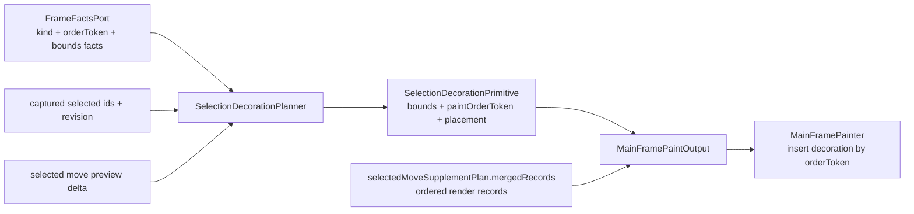
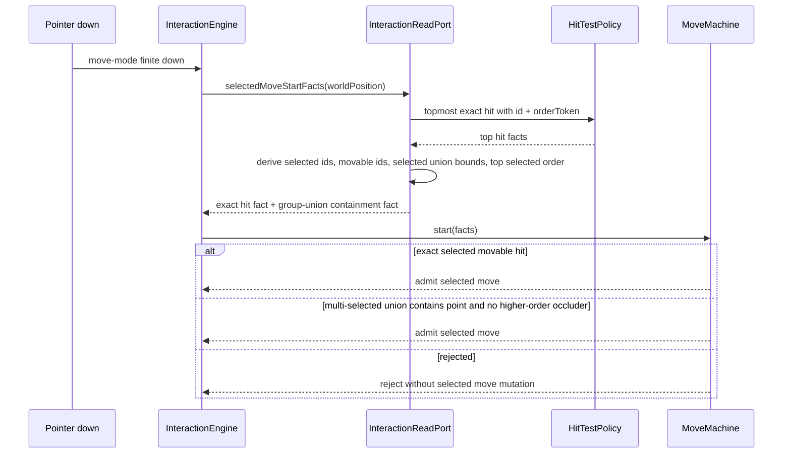
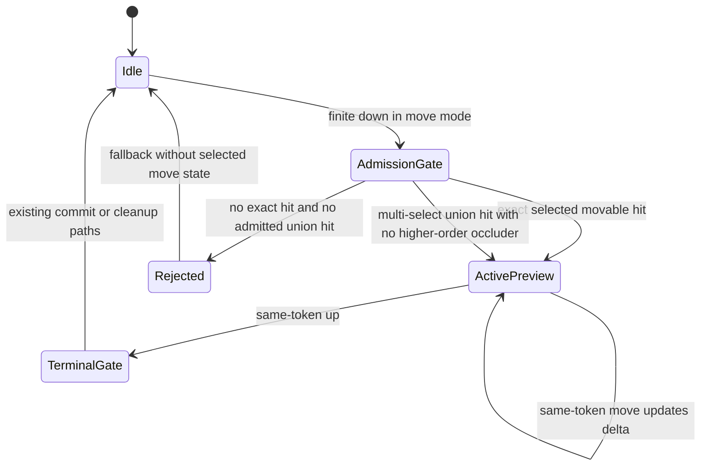

# Design: Selection Chrome And Move Hit Area

---
date: 2026-06-04
designer: Codex
commit: e597f856
branch: new-architecture
design_question: "Design selection chrome and selected-move hit area changes from .research/2026-06-04-selection-chrome-and-move-hit-area.md: unified multi-select chrome, z-order-aware selection decoration, group drag from selection union bounds, and inside frame placement for rect/image chrome."
---

## Disposition

READY_FOR_CONTRACT

## Product Outcome

Selection feedback should look and behave like one selected object when the user selects a group. Multi-select renders one frame around the union of the selected objects instead of one frame per object, single-select keeps a frame around the selected object, upper scene objects can visually cover selection chrome when they are above the selected object or selected group, and a selected group can be dragged from empty space inside the shared selection box.

The change is intentionally internal. It does not add public API fields, change document schema, or make application code compute interaction hit areas. Selection visuals remain frame-owned, and selected-move admission remains interaction-read-boundary-owned.

Non-goals: this design does not implement resize handles, rotate handles, public selection metadata, new context-action behavior, or a line/stroke-specific handle system. It only locks the architecture needed for the requested chrome and move-start behavior.

## Target Contract Classification

- Profile: BEHAVIOR_CHANGE
- Obligations: SEAM_MIGRATION

The future Change Contract changes user-visible rendering and pointer behavior. It also migrates internal seams by extending selection decoration primitives, ordered main-scene painting, selected-move start facts, and hit-test result data. It is not a public API change because the affected types are internal frame, surface, geometry, runtime, and interaction seams.

## Research Inputs

- `.research/2026-06-04-selection-chrome-and-move-hit-area.md` - factual current-state research for selection decoration, selected-move start facts, current tests, diagrams, and legacy evidence.

## Repository Evidence

`Evidence Consequence Link`: each fact below states the decision, boundary, proof surface, or review consequence it supports.

- `.research/2026-06-04-selection-chrome-and-move-hit-area.md:13` - research finds selection decoration is frame-owned and painted as a separate main-scene decoration pass -> keep the visual owner in frame/surface, but change the frame-owned decoration shape and paint placement.
- `.research/2026-06-04-selection-chrome-and-move-hit-area.md:19` - research finds selected-move admission is interaction-owned and currently starts only on topmost selected movable geometry -> put group-box move admission in `InteractionReadPort` facts and `MoveMachine`, not in application or painter code.
- `.research/2026-06-04-selection-chrome-and-move-hit-area.md:25` - research did not find an existing group-selection chrome or bounding-box-interior drag contract -> future contract must update durable source-of-truth docs instead of relying on this design alone.
- `lib/src/frame/selection_decoration_planner.dart:69` - `SelectionDecorationPrimitive` currently carries only bounds, color, stroke width, and halo width -> future seam must add enough immutable paint metadata for order token and stroke placement.
- `lib/src/frame/selection_decoration_planner.dart:113` - `_primitivesFor` iterates selected elements and yields per selected facts row -> selected form must replace per-row primitive emission with single-selection or group-union primitive planning.
- `lib/src/frame/selection_decoration_planner.dart:139` - `SelectionDecorationKey` currently keys selection, bounds, selected-move preview, style, and DPR but not structural order -> future key must account for selected chrome paint order, either by structural revision or by selected top-order token.
- `lib/src/frame/selection_decoration_planner.dart:155` - current decoration bounds come from render paint bounds and selected-move delta -> group union should reuse the same paint-bounds source and delta alignment instead of inventing a second geometry source.
- `lib/src/surface/main_painter.dart:25` - painter iterates main-frame records in paint order -> ordered chrome can be interleaved against the same record stream.
- `lib/src/surface/main_painter.dart:35` - painter currently draws all selection decorations after main records -> this is the root of global-overpaint behavior and must be replaced by order-aware decoration painting.
- `lib/src/surface/main_painter.dart:73` - `_paintSelectionDecorations` receives only primitive bounds and draws centered strokes -> inside-box placement requires primitive-level placement data or shape-specific drawing policy.
- `lib/src/contracts/internal/frame_facts_port.dart:45` - `FrameElementFacts` includes `kind`, `orderToken`, visibility, selectability, lock, transformability, and geometry facts -> selection decoration planning can derive group bounds, top selected order, and family-specific placement from captured frame facts without live runtime reads.
- `lib/src/contracts/internal/frame_facts_port.dart:151` - `FrameFactsPort` owns frame revisions, element handles, handle resolution, and resource descriptors -> frame changes must keep committed facts behind this port.
- `lib/src/frame/render_element_record.dart:122` - immutable render records already include `family`, `orderToken`, `paintBoundsWorld`, and `hitBoundsWorld` -> future decoration primitives can mirror the record data needed by painter without exposing public element objects to the painter.
- `lib/src/frame/render_element_record.dart:151` - `RenderElementRecord.fromFacts` derives family, order token, and bounds from `FrameElementFacts` and `GeometryPolicy` -> selected form should reuse this conversion or the same geometry policy to avoid duplicate geometry truth.
- `docs/contracts/frame_rendering.md:147` - frame contract assigns `SelectionDecorationPlanner` ownership of selection UI decoration and its key -> decoration grouping, key invalidation, order token, and stroke placement belong to this owner.
- `docs/contracts/frame_rendering.md:213` - ordinary render records must not include selection membership or selected-move preview deltas, and selection UI is a separate decoration pass -> selected form must not push selection chrome into ordinary paint records or ordinary cache identity.
- `docs/contracts/frame_rendering.md:279` - selection decoration reads selected ids through captured selection facts and is invalidated separately from ordinary paint plans -> group chrome remains separate derived frame output with its own key and tests.
- `docs/contracts/frame_rendering.md:287` - `selectedOrder` is derived data keyed by selection and structural revision, not stored selection truth -> the new paint-order decision must use captured order tokens, not create a second selection source of truth.
- `lib/src/frame/frame_engine.dart:97` - main frame assembly captures frame facts, ordinary paint, selected-move supplement, static background, selection decoration, selected order, and output -> future execution order can keep the same frame facade and adjust only decoration planning/output/painter order.
- `lib/src/frame/frame_paint_output.dart:12` - `MainFramePaintOutput` stores selection decoration plan separately from records and selected-move supplement -> future output can keep the same separation while carrying order-aware decoration primitives.
- `lib/src/frame/selected_move_supplement_planner.dart:109` - selected-move supplement merges ordinary and preview-shifted selected records by `orderToken` without global sort -> ordered selection chrome should follow the same local ordered-stream principle and must not introduce a global scene sort.
- `lib/src/contracts/internal/frame_facts_port.dart:29` - element handles carry `orderToken` and structural identity -> if hit testing needs topmost hit order, that order is available at the geometry/read boundary.
- `lib/src/geometry/hit_test_policy.dart:21` - `HitTestPolicy.topmostHit` sorts candidates by order token and uses exact geometry hits -> selected-move admission should reuse this policy or an equivalent policy-owned hit result, not duplicate exact hit logic in runtime or app code.
- `lib/src/geometry/hit_test_policy.dart:63` - exact hit delegates by element kind after geometry eligibility and bounds checks -> ordinary geometry hit testing can remain unchanged while selected-move start facts add an additional group-union containment fact.
- `docs/contracts/geometry.md:82` - point hit is content-only, reverse paint order, first exact hit wins, and background is not pointer-selectable -> topmost hit facts must remain available for selection/context decisions even when selected-move group-box admission is added.
- `lib/src/interaction/interaction_read_port.dart:8` - `InteractionReadPort` is the single immutable fact boundary for pointer decisions -> group-box selected-move admission facts must be read here.
- `lib/src/interaction/interaction_read_port.dart:52` - `SelectedMoveStartFacts` currently exposes selected ids, movable selected ids, controller epoch, selection revision, `hitSelectedMovable`, and query facts -> future seam must add or rename immutable facts so `MoveMachine` can distinguish exact selected geometry hit from selected group-box admission.
- `lib/src/runtime/runtime_interaction_read_adapter.dart:41` - runtime read adapter builds selected-move start facts from selection, frame, spatial query, and hit-test policy -> this is the correct owner for computing selected union containment and occlusion-aware admission facts.
- `lib/src/runtime/runtime_interaction_read_adapter.dart:72` - `hitSelectedMovable` currently means topmost hit id is in movable selected ids -> preserving this exact-hit fact lets ordinary hit-test semantics remain observable while adding group-union admission as a second fact.
- `lib/src/interaction/move_machine.dart:15` - `MoveMachine.start` rejects empty selection, empty movable set, or `!hitSelectedMovable` -> future behavior belongs in this admission predicate, using read-port facts instead of application-side checks.
- `lib/src/runtime/runtime_interaction_move_read_models.dart:11` - selected-move read models already derive `selectionBoundsWorld` from moved element reads -> future start-facts union computation should reuse the same concept or a shared runtime read helper to avoid duplicate union semantics.
- `lib/src/runtime/runtime_interaction_move_read_models.dart:70` - union bounds are computed by expanding selected element bounds -> this is the required group chrome and group-hit-area shape, subject to selected-move preview delta for frame decoration only.
- `docs/contracts/interaction_engine.md:159` - selected-related interaction reads must be batched by intent through `InteractionReadPort` and contain immutable selected ids and document facts -> group-box admission cannot live in `CanvasSurface`, app code, or later pointer-move samples.
- `docs/contracts/interaction_engine.md:172` - a move-mode click within pointer slop is a point-selection commit through marquee/select, not direct surface mutation -> future contract must preserve non-move click behavior when a selected-move session is not admitted.
- `docs/diagrams/seq_selected_move_preview_commit.mmd:37` - current sequence documents selected-move start facts from the read port -> durable diagram must be updated to include group-union admission facts.
- `docs/diagrams/state_selected_move.mmd:16` - current state diagram says admission requires a selected target and a movable selected id -> durable state diagram must be updated to include selected group union admission.
- `docs/verification/tests.md:1` - generated tests inventory is sourced from `docs/_registry/sections.yaml` -> future contract must update the registry and regenerate tests docs when it adds new required proof test ids or file-path entries.
- `test/frame/fixtures/selection_decoration_plan_fixture.dart:72` - current tests assert a single selected rect creates one primitive at expected bounds -> future tests must preserve single-select behavior while adding multi-select union and ordered primitive proof.
- `test/interaction/fixtures/interaction_read_port_fixture.dart:33` - current read-port test covers start facts and `hitSelectedMovable` for a point inside selected geometry -> future tests must add selected-union containment, top-hit preservation, and occlusion cases.
- `test/interaction/fixtures/move_machine_fixture.dart:30` - current runtime selected-move admission starts from selected geometry hit -> future tests must add group interior start without exact selected geometry hit.
- `test/interaction/fixtures/move_machine_fixture.dart:163` - current selected-move terminal proof covers resolver commit and action behavior -> future tests must show group-box admission still uses existing terminal commit/cleanup semantics.

## Design Form Candidates

### Candidate A. Planner-only group bounds with existing global post-paint pass

- Form: change `SelectionDecorationPlanner` to emit one union-bounds primitive for multi-select, but keep `MainFramePainter` drawing all decorations after all records.
- Why it could work: smallest visual change; it fixes per-element multi-select chrome count.
- Gate failures or risks: fails the z-order requirement because `lib/src/surface/main_painter.dart:35` would still draw chrome above every later object. It also leaves the primitive without order or placement metadata and does nothing for group-box selected-move admission.

### Candidate B. Ordered frame decoration plus read-boundary group admission

- Form: keep selection chrome as frame-owned derived output, but make `SelectionDecorationPlanner` produce either one single-select primitive or one multi-select union primitive with top selected `orderToken`, selected count, bounds, and stroke placement. Paint that primitive interleaved with main-frame records so records above the chrome order draw over it. Extend selected-move start facts at `InteractionReadPort` with group-union containment and top-hit/order facts, and let `MoveMachine` admit a group move when exact selected geometry is hit or a multi-selected group union contains the down point without being occluded by a higher-order content hit.
- Why it could work: it fixes the shared owner causes, preserves frame/interaction boundaries, keeps ordinary hit-test facts intact, and has direct test seams in frame planner, painter, read adapter, and move machine fixtures.
- Gate failures or risks: more internal seam work than Candidate A. The future contract must update durable frame and interaction docs/diagrams and add focused tests for order, group bounds, and hit admission.

### Candidate C. Surface/app overlay hit box and visual overlay

- Form: compute the selected union rectangle in surface or application-facing code, draw selection chrome above the canvas, and use that overlay rectangle to start drag.
- Why it could work: it might be quick in a Flutter widget or app integration.
- Gate failures or risks: wrong owner. It bypasses `SelectionDecorationPlanner`, ignores `MainFramePaintOutput`, cannot naturally respect scene z-order, and violates the requirement that selected-move group-box admission happen in the interaction read boundary.

## Known Future Pressures

| Pressure | Evidence | How the selected form responds | Accepted cost or risk |
|---|---|---|---|
| Future resize/rotate handles may need one group owner and shape-specific anchors. | User requirement asks for one multi-select chrome and line/stroke-specific decoration; current primitive has only bounds/style (`lib/src/frame/selection_decoration_planner.dart:69`). | Primitive metadata distinguishes group box, single bounds box, and non-box geometry decoration without adding public API. | Future handles can extend frame-owned decoration primitives, but this design does not implement handle placement. |
| Ordinary paint cache must stay free of selection/preview facts. | Frame contract keeps selection UI separate from ordinary records (`docs/contracts/frame_rendering.md:213`) and decoration invalidated separately (`docs/contracts/frame_rendering.md:279`). | Order-aware chrome remains a separate selection decoration plan and painter merge, not ordinary record cache data. | Painter/output code becomes slightly more aware of ordered decorations, but ordinary cache keys remain untouched except for tests that prove non-churn. |
| Z-order fixes can accidentally introduce global scene sorting. | Selected-move supplement explicitly merges by order token and avoids global sort (`lib/src/frame/selected_move_supplement_planner.dart:109`). | Painter consumes already ordered records and inserts at most the small decoration primitive list by order token. | Future implementation must prove no global scene sort and no ordinary cache writes during decoration paint. |
| Group-box drag can conflict with clicking higher-order objects that visually cover the selected group. | Geometry point hit is topmost-first (`docs/contracts/geometry.md:82`), and user requires upper objects to cover selection chrome. | Read adapter computes both topmost exact hit and group-union containment; group union admits only when no higher-order content hit is above the selected chrome order. | This conservative occlusion rule may reject a drag from an area inside the mathematical union when an upper object visually covers that area; that is the cost of respecting z-order. |
| Single-select line/stroke bounds can be much larger than exact geometry. | User requirement says lines/strokes do not have a normal inside rect and should use bounds/outline or line-specific decoration. | Bounds-box interior admission is limited to multi-select group union; single-select movement still requires exact selected movable geometry hit. | Future line/stroke handle design remains separate work. |
| Existing selected-move terminal behavior must not change. | `MoveMachine.terminal` already rejects zero delta, stale selection, empty movable ids, stale epoch, and unavailable changes (`lib/src/interaction/move_machine.dart:43`). | The design changes only pointer-down admission. Pointer move/terminal commit, resolver calls, preview cleanup, and action emission keep existing owner behavior. | New tests must prove group-box start reaches the same terminal paths and does not call resolver on zero-delta cleanup. |
| Durable docs and diagrams currently state selected-target admission. | Sequence and state diagrams name read-port facts and selected target admission (`docs/diagrams/seq_selected_move_preview_commit.mmd:37`, `docs/diagrams/state_selected_move.mmd:16`). | Future contract must update those source-of-truth artifacts in the same change as code. | Contract scope is mixed code/docs; documentation checks and diagram generation checks become mandatory. |

## Selected Form

Choose Candidate B: ordered frame decoration plus read-boundary group admission.

The selected form keeps two responsibilities separate. Frame owns what selection chrome looks like and where it sits in scene paint order. Interaction owns whether a pointer down can start selected move. The shared concept is the selected bounds union, but it is derived independently at each boundary from the owning snapshot: frame derives visual bounds from captured frame facts and selected-move preview delta, while runtime read facts derive move-start containment from the current interaction read snapshot.

The future implementation must make multi-select produce exactly one selection decoration primitive. Its `boundsWorld` is the union of all selected elements' paint bounds, shifted by the selected-move preview delta when active. Its `paintOrderToken` is the maximum selected element order token. Painter output must draw the decoration after records with order token less than or equal to that token and before records with a greater order token, so visually higher objects can cover the chrome. Single-select still produces one primitive for that element with that element's order token.

Stroke placement is primitive-owned. Box chrome for multi-select union, single selected image, and single selected rect uses inside placement so the visible stroke does not protrude outside the selected bounds. Single selected line and stroke do not use inside-rect semantics; they continue through bounds/outline decoration until a later line-specific handle design exists. Text and path keep bounds-outline behavior unless a future product/design decision introduces shape-specific text/path chrome.

Selected-move admission must be extended through `InteractionReadPort`. The read adapter should return exact selected movable hit facts and group-union containment facts from one immutable pointer-down snapshot. `MoveMachine.start` should admit when selected ids and movable selected ids are non-empty and either the exact topmost hit is a movable selected id, or the selection has multiple selected ids and the down point is inside the selected union bounds without a higher-order content hit above the top selected order token. Ordinary topmost hit-test facts remain available for selection and context-action decisions; group-box admission is an additional selected-move start fact, not a replacement for exact geometry hit testing.

## Decision Trace

Preserve `Decision Chain Of Custody`: source inputs and locked decisions must map to the future contract field, execution unit, or proof surface that carries them forward.

| Decision ID | Decision | Evidence | Contract handoff target |
|---|---|---|---|
| D1 | Multi-select selection chrome emits one group primitive from union paint bounds; single-select emits one primitive for the selected element. | `.research/2026-06-04-selection-chrome-and-move-hit-area.md:13`; `lib/src/frame/selection_decoration_planner.dart:113`; `lib/src/runtime/runtime_interaction_move_read_models.dart:70` | `Boundaries.Owner`, `Unit: SelectionDecorationPlanner group primitive`, proof: frame planner fixture |
| D2 | Selection chrome carries paint order and is painted interleaved with main records, not as a global after-pass. | `lib/src/surface/main_painter.dart:25`; `lib/src/surface/main_painter.dart:35`; `lib/src/contracts/internal/frame_facts_port.dart:93`; `docs/contracts/frame_rendering.md:151` | `Execution order`, `Unit: MainFramePainter ordered decoration paint`, proof: painter/order fixture |
| D3 | Selection decoration key must invalidate when selected chrome order can change. | `lib/src/frame/selection_decoration_planner.dart:139`; `docs/contracts/frame_rendering.md:287`; `lib/src/contracts/internal/frame_facts_port.dart:93` | `Boundaries.Source of Truth`, `Unit: SelectionDecorationKey`, proof: structural/order revision fixture |
| D4 | Inside stroke placement applies to box chrome for multi-select union, single rect, and single image; line/stroke stay bounds/outline or later line-specific decoration. | `lib/src/surface/main_painter.dart:73`; `lib/src/contracts/public/canvas_element.dart:11`; `lib/src/frame/render_element_record.dart:10` | `Unit: SelectionDecorationPrimitive paint metadata`, proof: frame/painter geometry fixture |
| D5 | Group-box selected-move admission is computed at `InteractionReadPort` and admitted by `MoveMachine`, not by app/surface code. | `lib/src/interaction/interaction_read_port.dart:8`; `lib/src/runtime/runtime_interaction_read_adapter.dart:41`; `lib/src/interaction/move_machine.dart:15`; `docs/contracts/interaction_engine.md:159` | `Boundaries.Entry`, `Unit: selectedMoveStartFacts`, `Unit: MoveMachine.start`, proof: read-port and runtime interaction tests |
| D6 | Ordinary exact hit-test remains intact and topmost hit/order facts are preserved alongside group-union admission. | `lib/src/geometry/hit_test_policy.dart:21`; `docs/contracts/geometry.md:82`; `lib/src/runtime/runtime_interaction_read_adapter.dart:72` | `Compatibility`, `Unit: HitTestPolicy result seam`, proof: selected move plus context/selection hit tests |
| D7 | Group-box admission respects z-order by rejecting union-only admission when a higher-order content hit is above the top selected order token. | User requirement; `lib/src/geometry/hit_test_policy.dart:21`; `lib/src/contracts/internal/frame_facts_port.dart:29`; `docs/contracts/geometry.md:82` | `Temporal/ordering constraint`, `Unit: RuntimeInteractionReadAdapter selected move start facts`, proof: occluding-object runtime test |
| D8 | Durable frame, interaction, geometry, and selected-move diagram docs must be updated by the future contract. | `.research/2026-06-04-selection-chrome-and-move-hit-area.md:25`; `docs/contracts/frame_rendering.md:147`; `docs/diagrams/state_selected_move.mmd:16`; `docs/diagrams/seq_selected_move_preview_commit.mmd:37` | `Source-Of-Truth Impact`, `Unit: docs/diagrams update`, proof: docs checks and generated-diagram checks |

## Outcome-Proof Fit

| Claim | Direct outcome | Proxy risk | Required proof surface or strategy |
|---|---|---|---|
| Multi-select renders one chrome primitive. | A frame plan for two selected elements has exactly one primitive whose bounds equal the union of selected paint bounds. | Checking `selectedCount == 2` or visual smoke could pass while two primitives still exist. | Focused `SelectionDecorationPlanner` fixture asserts primitive count and union bounds. |
| Single-select behavior remains one-object chrome. | A single selected rect/image/line/stroke still has one primitive based on that element's bounds/order. | Multi-select tests alone could accidentally remove single-select chrome. | Existing selection decoration fixture expanded with single rect/image and line/stroke cases. |
| Z-order is respected. | A higher-order unselected record paints over selection chrome when it overlaps the selected object's or group's chrome. | Checking primitive `orderToken` alone could pass while painter still draws decorations last. | Painter/order fixture or golden-style canvas test with lower selected object, overlapping upper object, and visible occlusion assertion. |
| Decoration order is cache-correct. | Changing selected element order/structural revision rebuilds or updates decoration order even when selected ids and bounds are unchanged. | Bounds/style key tests could pass while stale chrome order remains cached. | Selection decoration key fixture for structural/order-token change. |
| Rect/image box chrome does not protrude outside selected bounds. | Painted stroke for box chrome lies inside primitive bounds. | Bounds equality could pass while centered stroke still spills outward. | Painter-level geometry test that records or inspects stroke rect placement, plus primitive placement assertions. |
| Line/stroke single selection does not gain broad inside-box drag semantics. | Pointer down inside a single selected line/stroke bounding box but outside exact geometry does not start selected move. | A group-union test could pass while single line/stroke becomes too easy to drag from empty bounds. | Interaction runtime test for single selected line/stroke bounds miss. |
| Group-box drag starts from empty union interior. | With two selected movable elements, pointer down inside their union but outside both exact shapes starts selected move and publishes selected-move preview on move. | Only testing direct element hit could pass without group-box admission. | Runtime interaction test with separated selected rects and a down point between them. |
| Higher-order content blocks union-only group move where it visually covers the selected group. | Pointer down inside selected union but over a higher-order unselected exact hit is not admitted by group union and can fall through to ordinary move/select behavior. | A pure rectangle containment test could pass while violating z-order and stealing clicks from upper objects. | Runtime read-port or interaction test with overlapping higher-order content hit. |
| Ordinary hit-test remains available. | Read facts still expose/use topmost exact hit for selected move, marquee point selection, and context-action paths. | Group-union admission could pass while context/selection top-hit behavior regresses. | Existing interaction read/context tests retained, plus a regression where topmost unselected hit is still reported/used. |
| Terminal selected-move semantics remain unchanged. | Group-box admitted session commits, cancels, zero-delta-cleans, resolver-cancels, and resolver-errors through existing selected-move terminal paths. | Preview-start tests could pass while terminal requests omit bounds or call resolver on zero delta. | Existing `move_machine_fixture` terminal tests repeated through group-box admission start path where relevant. |

## Hard Gate Check

| Gate | Result | Evidence |
|---|---|---|
| Owner-Level Fix | pass | Current per-element primitives and global after-paint are owned by selection decoration planner and painter (`lib/src/frame/selection_decoration_planner.dart:113`, `lib/src/surface/main_painter.dart:35`); current selected-move admission is owned by read adapter and move machine (`lib/src/runtime/runtime_interaction_read_adapter.dart:41`, `lib/src/interaction/move_machine.dart:15`). Selected form changes those owners instead of patching app or one downstream call site. |
| Ownership | pass | Frame contract assigns selection UI decoration to `SelectionDecorationPlanner` (`docs/contracts/frame_rendering.md:147`), and interaction contract assigns selected-related reads to `InteractionReadPort` (`docs/contracts/interaction_engine.md:159`). |
| Source-Of-Truth Singularity | pass | Selected ids remain selection facts; order tokens and bounds remain captured frame/geometry facts; group bounds are derived per boundary and not stored as new durable state (`docs/contracts/frame_rendering.md:279`, `lib/src/contracts/internal/frame_facts_port.dart:45`, `lib/src/runtime/runtime_interaction_move_read_models.dart:70`). |
| Boundary-Owned Policy | pass | Visual grouping/order/placement stays in frame output and painter; pointer-down selected-move group-box admission stays in `InteractionReadPort` facts and `MoveMachine.start` (`lib/src/frame/frame_paint_output.dart:12`, `lib/src/interaction/interaction_read_port.dart:8`, `lib/src/interaction/move_machine.dart:15`). |
| Negative Proof And Fixture Quarantine | pass | Required negative cases use focused test fixtures for selected ids, order tokens, occluding elements, and line/stroke misses. Fixture-only ids and geometry stay in tests and do not enter public API registries, schemas, durable docs, or production source-of-truth files. |
| Dependency direction | pass | Frame consumes `FrameFactsPort` and immutable output; painters do not live-read runtime (`docs/contracts/frame_rendering.md:108`). Interaction consumes read-port immutable facts, not concrete selection/store internals (`docs/contracts/interaction_engine.md:159`). |
| State/data | pass | No committed state is added. Decoration plans and union bounds are derived values; ordinary paint cache remains free of selection/preview facts (`docs/contracts/frame_rendering.md:213`, `docs/contracts/frame_rendering.md:279`). |
| Sequenced Migration And Retirement | pass | Successor seams are ordered `SelectionDecorationPrimitive` metadata, order-aware `MainFramePainter` decoration painting, richer selected-move start facts, and policy-owned top-hit result data. Retired behavior is per-selected multi-select primitive output, global after-pass selection paint, and selected-move admission requiring exact selected movable hit only. Consumer order: frame planner/painter first for chrome, then read adapter/move machine for hit area, then docs/diagrams/tests. Retirement gate is all old per-element/global-overpaint/exact-only tests replaced or updated. |
| Temporal Surface Closure | pass | Pointer-down admission still reads one immutable selected-move start snapshot before session creation; pointer move still never re-runs admission; resolver callbacks remain terminal-only. Synchronous callback surfaces in the changed window: none before selected-move session admission. Guard owner: `InteractionEngine` plus `MoveMachine`. Public observation order: no public state on rejected start; admitted session publishes selected-move preview only through existing preview path; zero delta terminal cleans preview without resolver/action. Expected rejection/no-mutation signal: rejected selected move falls through to existing move-mode behavior with no document mutation. |
| All-Or-Nothing Failure Boundary | pass | No new document mutation boundary is introduced. Decoration planning assigns the derived plan only after primitive computation; painter draw has no store mutation. Selected-move group admission only creates a session; irreversible document mutation still occurs later through existing selected-move terminal/edit path. Failure projection: rejected admission or cleanup-only terminal with no resolver/action/document change. Proof surface: interaction terminal regression tests and painter no-live-read/frame-plan tests. |
| Outcome-Proof Fit | pass | Direct outcomes and proxy risks are listed in `Outcome-Proof Fit`; each claim has a future proof surface that would fail if the direct behavior is false. |
| Verification | pass | Existing frame and interaction fixtures cover the nearest seams (`test/frame/fixtures/selection_decoration_plan_fixture.dart:72`, `test/interaction/fixtures/interaction_read_port_fixture.dart:33`, `test/interaction/fixtures/move_machine_fixture.dart:30`) and can be extended with direct behavior assertions. |
| Future pressure | pass | Future handles, cache independence, no global sort, z-order click conflicts, and durable docs/diagram updates are assessed in `Known Future Pressures`. |

## Lock-Required Facts

- Owner: frame owns selection chrome planning/painting; interaction owns selected-move start admission; geometry owns exact topmost hit policy.
- Owning layer/module/document family: `lib/src/frame/**`, `lib/src/surface/main_painter.dart`, `lib/src/interaction/**`, `lib/src/runtime/runtime_interaction_read_adapter.dart`, `lib/src/geometry/hit_test_policy.dart`, and durable contracts under `docs/contracts/**` plus selected-move diagrams under `docs/diagrams/**`.
- Seam: `SelectionDecorationPlan` / `SelectionDecorationPrimitive` for visual chrome; `MainFramePaintOutput` and `MainFramePainter` for ordered painting; `SelectedMoveStartFacts` for pointer-down admission; `HitTestPolicy` or a policy-owned hit-result seam for id plus order token.
- Dependency/import direction: frame/painter may consume frame-owned plans and immutable render records; frame must not import runtime/store/app surfaces. Interaction must consume `InteractionReadPort` immutable facts and public contract values, not concrete selection/store mutation APIs. Runtime read adapter may compose frame facts, selection facts, spatial query, and hit-test policy.
- State/data ownership: selected ids remain selection-owned; order tokens and element facts remain frame facts; exact hit policy remains geometry-owned; group bounds and selected top order are derived per frame/read snapshot; no new committed, cached, or public source of truth is introduced.
- Entry boundaries: main-frame build with captured selection/style/preview/facts; painter receives immutable `MainFramePaintOutput`; selected-move pointer down reads `SelectedMoveStartFacts` from `InteractionReadPort`; hit policy receives spatial candidates and frame resolver.
- Exit boundaries: one ordered selection decoration primitive for single or group selection; ordered main-scene paint result; selected-move start decision admitted/rejected; unchanged selected-move preview/terminal/commit intents after admission.
- File placement basis: extend existing cohesive owners before adding files. Add a small focused internal value type only if needed for hit result or decoration placement metadata; do not add an app/surface overlay helper or broad shared utility.
- Execution order constraints: build ordinary and selected-move supplement records as today; build selection decoration with group bounds/order and key invalidation; paint static background, then ordered main records with decoration inserted at its paint order; on pointer down, read selected ids/movable ids/top hit/group union once before `MoveMachine.start`; do not re-read admission on pointer move.
- `Temporal Surface Closure` invariant, synchronous callback surfaces, guard/boundary owner, public observation order, and expected rejection/no-mutation signal: invariant is "selected-move admission is a single pointer-down immutable fact decision; later pointer samples use only the admitted session." There are no app/resolver callbacks during start. Guard owner is `InteractionEngine` plus `MoveMachine`; read boundary owner is `InteractionReadPort`. Public observation order is unchanged: rejected start has no selected-move preview, admitted start can publish selected-move preview on existing path, zero-delta terminal cleans preview only. Rejected or occluded group-union admission causes no mutation.
- `All-Or-Nothing Failure Boundary` irreversible point, fallible-before-irreversible work, later infallible/failure-contained/accepted work, failure projection, and proof surface: no new committed mutation; selected-move admission is reversible session state until terminal. Any fallible geometry/read work happens before admission. Later document mutation remains existing edit-kernel terminal behavior. Failure projection is rejected start or cleanup-only terminal with no resolver/action/document change. Proof surface is read-port/move-machine/runtime tests.
- Rejected alternatives: planner-only union with global post-paint; app/surface overlay visual and hit box; using `SelectedOrderSnapshot` document order as chrome paint order; adding group bounds as stored selection state; giving single selected line/stroke broad bounds-interior drag.
- Verification strategy: extend frame planner tests for single/multi primitive count, union bounds, key invalidation, and placement metadata; add painter/order tests for higher-order occlusion and inside-box stroke placement; extend interaction read-port/runtime tests for group-union start, occlusion rejection, top-hit preservation, single line/stroke miss, and terminal behavior through existing selected-move paths; add docs/diagram checks when source-of-truth docs are updated.

## Diagram Need Assessment

| Design question | Needed? | Diagram kind | Reason |
|---|---:|---|---|
| Does the design change ownership, layer, package, or component boundaries? | yes | c4 | It keeps ownership split across frame, geometry, runtime read adapter, and interaction machine while changing the seams between them. |
| Does it change data flow, state ownership, cache ownership, resource movement, or lifecycle movement? | yes | data_flow | Selected union bounds and order become derived frame/read facts with no new stored state. |
| Does it depend on call order, lifecycle order, sync/async ordering, failure ordering, or migration order? | yes | sequence | Painter insertion order and pointer-down admission order are correctness-sensitive. |
| Does it introduce or alter observer/listener/callback delivery, guard windows, public-state publication, or reentrancy-sensitive ordering? | yes | sequence | Pointer-down admission must remain callback-free and resolver-free; public preview publication order must remain unchanged. |
| Does it introduce or alter modes, statuses, terminal states, sessions, or transition rules? | yes | state | Selected-move start transition gains group-union admission while terminal states remain unchanged. |
| Does it create, replace, migrate, or retire a shared seam under `Sequenced Migration And Retirement`? | yes | c4/data_flow/sequence | It extends selection decoration primitives, selected-move start facts, and hit-test result data while retiring exact-only group start and global after-pass decoration paint. |
| Does it change public API consumer flow, payload shape, or compatibility behavior? | no | none | Public API payloads and schemas do not change. Behavior changes are internal rendering and pointer semantics. |
| Does it introduce or change analyzer, guardrail, or structural-recognition pipeline behavior? | no | none | No new analyzer pipeline is required by this design; future contract may add a targeted guardrail only if tests cannot enforce boundary placement. |

## Provisional Diagrams

## Source-Of-Truth Impact

`Source-Of-Truth Singularity`: selected union bounds and chrome order remain derived facts, not new durable state. The durable meaning must be recorded in the existing frame, interaction, geometry, diagram, and verification owners.

Future Change Contract must update:

- `docs/contracts/frame_rendering.md` - selection decoration now emits one group primitive for multi-select, carries paint order/placement metadata, includes structural/order invalidation, and paints interleaved instead of global after-pass.
- `docs/contracts/interaction_engine.md` - selected-move start facts admit exact selected geometry hit or occlusion-aware multi-select union containment from `InteractionReadPort`.
- `docs/contracts/geometry.md` - if the implementation adds an id-plus-order hit result seam to `HitTestPolicy`, document that topmost exact hit can expose order without duplicating exact-hit logic.
- `docs/diagrams/seq_selected_move_preview_commit.mmd` - selected-move start read facts must include group union containment and top-hit/order facts.
- `docs/diagrams/state_selected_move.mmd` - selected move admission must include multi-select union containment and occlusion rejection while preserving terminal transitions.
- `docs/_registry/sections.yaml` and generated `docs/verification/tests.md` - mandatory when the future contract adds new required proof test ids or file-path entries for frame, interaction, or surface proof.
- `docs/verification/guardrails.md` - only if the future contract adds a new guardrail rather than proving the behavior through focused tests and existing guardrail scopes.

Do not create a new source-of-truth document for this behavior while these contract and diagram owners exist.

## Verification Impact

Future Change Contract should add or update these proof surfaces:

- Frame planner tests: multi-select produces one union primitive; single-select remains one primitive; selected-move delta shifts group union; order/structural changes invalidate decoration plan; primitive placement metadata distinguishes inside-box from bounds/outline.
- Painter tests: selection chrome is painted at selected/topmost-selected order; higher-order unselected content can cover chrome; inside-box stroke placement does not protrude for box chrome.
- Runtime read adapter tests: selected-move start facts expose exact hit, group-union containment, selected top order, occluding top-hit behavior, and immutable selected/movable id lists.
- Move machine/runtime tests: group interior start admits selected move; occluded union point rejects union-only admission; single line/stroke bounds miss rejects; zero-delta group-box session cleans without resolver/action; terminal commit uses existing selected-move request semantics.
- Compatibility tests: ordinary point selection and context-action top-hit behavior remain driven by exact geometry hit, not by selection union containment.
- Documentation checks: run docs sync/checks after source-of-truth docs and diagrams are updated.
- Code checks: run Dart analysis, DCM analysis, DCM metrics for changed frame, surface, geometry, interaction, runtime, and test owners, plus focused tests.

## Verification Strategy

The proof strategy must target direct user-visible and owner-observable outcomes, not only internal proxy values. Planner tests prove primitive count, bounds, placement, and key invalidation. Painter tests prove z-order and inside stroke placement. Read-port tests prove the interaction boundary computes group admission from immutable facts. Runtime tests prove the new admission path reaches the same selected-move preview/terminal behavior without changing public APIs, ordinary selection, context hit testing, or resolver timing.

Negative proof should use isolated fixtures with synthetic ids/order tokens and must not add fixture-only data to public registries, schemas, durable docs, or production source-of-truth files.

## Change Contract Handoff

- Required profile: BEHAVIOR_CHANGE
- Required obligations: SEAM_MIGRATION
- Decision IDs / Decision Trace rows to preserve: D1, D2, D3, D4, D5, D6, D7, D8
- Evidence to cite: `.research/2026-06-04-selection-chrome-and-move-hit-area.md:13`, `.research/2026-06-04-selection-chrome-and-move-hit-area.md:19`, `.research/2026-06-04-selection-chrome-and-move-hit-area.md:25`, `lib/src/frame/selection_decoration_planner.dart:69`, `lib/src/frame/selection_decoration_planner.dart:113`, `lib/src/frame/selection_decoration_planner.dart:139`, `lib/src/surface/main_painter.dart:25`, `lib/src/surface/main_painter.dart:35`, `lib/src/interaction/interaction_read_port.dart:52`, `lib/src/runtime/runtime_interaction_read_adapter.dart:41`, `lib/src/runtime/runtime_interaction_read_adapter.dart:72`, `lib/src/interaction/move_machine.dart:15`, `lib/src/geometry/hit_test_policy.dart:21`, `docs/contracts/frame_rendering.md:147`, `docs/contracts/interaction_engine.md:159`, `docs/contracts/geometry.md:82`, `docs/diagrams/seq_selected_move_preview_commit.mmd:37`, `docs/diagrams/state_selected_move.mmd:16`.
- Contract constraints or sequencing facts: update source-of-truth docs/diagrams in the same contract as code; implement frame chrome shape/order before painter proof; implement hit result/read facts before move-machine admission; preserve ordinary hit-test behavior; do not add public API or stored selection-union state; do not add app/surface overlay hit logic.
- Required proof surfaces: frame planner fixture, painter/order fixture, runtime read adapter fixture, move machine/runtime selected-move tests, context/selection hit compatibility tests, docs checks, Dart/DCM checks for changed owners.

## Open Decisions

- None. The selected architecture is ready for future Change Contract authoring.
