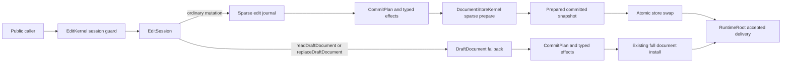
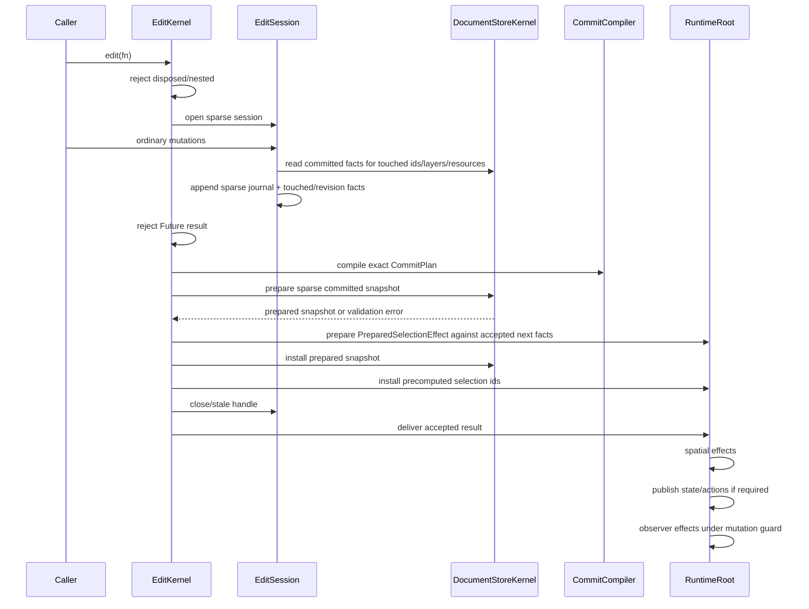
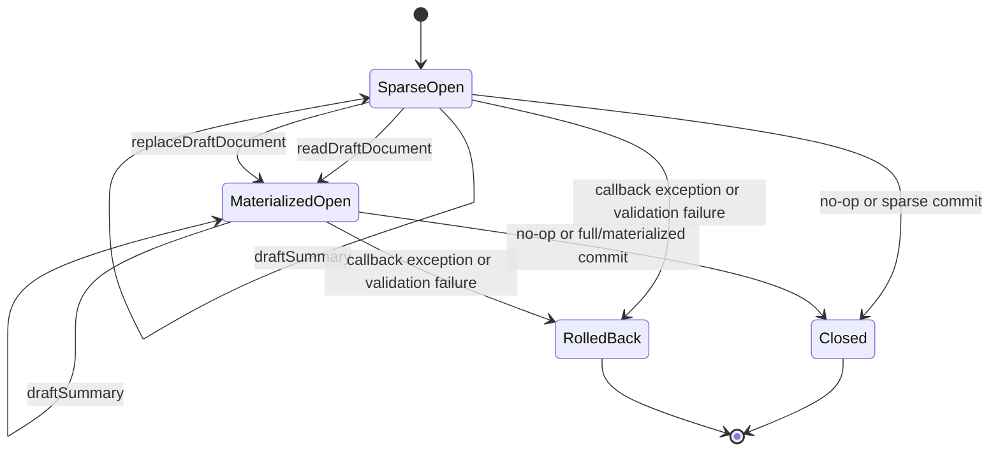

# Design: Incremental Edit Store

---
date: 2026-06-06
designer: Codex
commit: 36b07632
branch: new-architecture
design_question: "Design the most effective, verifiable, architecturally clean optimization track for the Pixel 6 manual baseline edit/store hotspots."
---

## Disposition

READY_FOR_CONTRACT

## Product Outcome

Large-canvas edits that change one element or one small document fact should stop behaving like full-document rewrites. The intended user-visible outcome is at least 2x lower action latency and action memory for the three 100k Pixel 6 edit hotspots while preserving the current public edit API, rollback behavior, revision semantics, invalidation effects, action/event behavior, and explicit draft-read behavior.

Non-goals:

- Do not change `CanvasEditPort`, `CanvasEdit`, `CanvasDocument`, schema v1, or public update DTO shapes.
- Do not optimize `loadDocument` or first `readDocument` in this design; those remain separate bulk-document/projection tracks.
- Do not weaken exact touched-set, rollback, stale-handle, nested-edit, delivery-order, or selection-owner guarantees.
- Do not add benchmark-only shortcuts or fixture-only production paths.

## Target Contract Classification

- Profile: REFACTOR
- Obligations: SEAM_MIGRATION

The future Change Contract should treat this as an internal seam migration with required performance proof. Public semantic behavior is preserved; the changed observable outcome is non-functional performance and allocation behavior.

Performance success is locked to the first optimization track, not left for the contract author to choose:

| Benchmark row | Manual baseline metric | Required first-track cap |
|---|---:|---:|
| `edit.add_element/100k avg_us` | 213060 | <= 106530 |
| `edit.add_element/100k p95_us` | 224456 | <= 112228 |
| `edit.add_element/100k max_us` | 224456 | <= 112228 |
| `edit.add_element/100k allocation_bytes` | 52314112 | <= 26157056 |
| `edit.update_visual/100k avg_us` | 208119 | <= 104059 |
| `edit.update_visual/100k p95_us` | 214994 | <= 107497 |
| `edit.update_visual/100k max_us` | 214994 | <= 107497 |
| `edit.update_visual/100k allocation_bytes` | 59670528 | <= 29835264 |
| `edit.update_transform/100k avg_us` | 211488 | <= 105744 |
| `edit.update_transform/100k p95_us` | 233650 | <= 116825 |
| `edit.update_transform/100k max_us` | 233650 | <= 116825 |
| `edit.update_transform/100k allocation_bytes` | 48775168 | <= 24387584 |

When a future implementation uses a fresh pre-change current report instead of
the pinned manual baseline, the same first-track rule applies as `current <= 50%`
for each listed metric on those rows. The registry absolute caps remain the
release-contour target and must not be relaxed, but reaching those absolute caps
is a follow-up optimization target if the first sparse-store track only proves
the locked 2x improvement.

## Research Inputs

- `.research/2026-06-06-pixel6-manual-baseline-hotspots.md` - identifies the Pixel 6 manual baseline edit/store hotspots, benchmark boundary shape, current full-projection/draft path, and related affected cases.

## Repository Evidence

`Evidence Consequence Link`: each fact below states the decision, boundary, unit, proof surface, or review consequence it supports.

- `.research/2026-06-06-pixel6-manual-baseline-hotspots.md:15` - the top action-time rows include large edit/store rows after lifecycle load; this supports selecting edit/store as the first optimization owner rather than a load-document-only design.
- `.research/2026-06-06-pixel6-manual-baseline-hotspots.md:32` - `edit.add_element/100k`, `edit.update_transform/100k`, and `edit.update_visual/100k` each take about 208-213 ms and allocate about 48-60 MB; this supports a shared root-cause design and required benchmark proof on those cases.
- `.research/2026-06-06-pixel6-manual-baseline-hotspots.md:47` - `EditKernel.edit` currently creates `DraftDocument` from `_readDocument()`, reads the commit plan, materializes the draft, installs committed document changes, and delivers the result; this supports migrating the hot edit seam away from eager public projection and full draft materialization.
- `.research/2026-06-06-pixel6-manual-baseline-hotspots.md:48` - store reads use `DocumentProjectionCache.projectionFor`, while `DraftDocument` copies palette, resources, background elements, and every layer's elements; this supports making explicit projection/materialization an escape hatch rather than the ordinary mutation path.
- `.research/2026-06-06-pixel6-manual-baseline-hotspots.md:49` - the same edit transaction path backs three largest non-load action rows; this supports one owner-level design instead of per-benchmark patches.
- `.research/2026-06-06-pixel6-manual-baseline-hotspots.md:61` - `spatial.touched_update` calls the edit update-transform action before adding spatial metrics; this supports expecting secondary benefit only when typed touched delivery is preserved, not by bypassing spatial correctness.
- `docs/architecture/03_data_model.md:49` - `DocumentStoreKernel` does not store public `CanvasDocument` as live mutable state and stores compact committed tables; this supports making committed-store tables, not public DTOs, the incremental mutation owner.
- `docs/architecture/03_data_model.md:140` - public runtime observation is one immutable `CanvasRuntimeState` snapshot published only after an accepted runtime-visible change reaches its owner; this constrains delivery order and rules out partial public observation of sparse edit state.
- `docs/architecture/03_data_model.md:148` - selection-only changes are owned by `SelectionKernel` and do not evict projection or update spatial indexes; this supports keeping selection pruning as a separate owner effect rather than storing selection in the edit journal.
- `docs/contracts/edit_kernel.md:100` - `EditKernel` closes and stales the active edit handle before `RuntimeRoot` consumes the accepted apply result; this supports preserving the current stale-handle and post-commit delivery window.
- `docs/contracts/edit_kernel.md:107` - observer failures are contained post-commit notification failures and observer delivery is not a reentrant mutation window; this supports keeping sparse store install before public delivery and keeping guard ownership in `RuntimeRoot`.
- `docs/contracts/edit_kernel.md:138` - rollback must leave committed document identity, revisions, projection cache, spatial index, resources, selection, previews, actions, public state, and repaint unchanged; this supports a prepared sparse commit with all fallible validation before the irreversible store swap.
- `docs/contracts/edit_kernel.md:177` - generic global invalidation is forbidden except document replacement; this supports preserving `CommitCompiler` typed deltas and exact touched sets in the new sparse path.
- `docs/contracts/edit_kernel.md:227` - `CommitCompiler` remains the source-of-truth owner for typed invalidation, while resource reference validation is preflighted before draft mutation is accepted; this supports moving mutation storage while keeping effect taxonomy in the edit contract owner.
- `docs/contracts/operation_matrix.md:55` - operation rows define state touched, revisions, spatial, projection, repaint, and events for every edit row; this supports using the existing matrix as semantic parity proof.
- `docs/contracts/operation_matrix.md:103` - rows that change public revisions publish one coherent `CanvasRuntimeState` after success; this supports preserving single-publication behavior after sparse commits.
- `docs/contracts/public_api_v1.md:1351` - the public `CanvasEdit` surface includes `readDraftDocument`, `draftSummary`, ordinary mutations, resource edits, metadata edits, clear, and replacement; this constrains the design to preserve all public methods.
- `docs/contracts/public_api_v1.md:1377` - the public edit contract requires synchronous callbacks, nested-edit rejection, atomic draft mutations, rollback, post-install notifications, stale handles, and `readDraftDocument` materialization limits; this supports a lazy materialization fallback rather than public API change.
- `docs/contracts/public_api_v1.md:1498` - command mutations must go through `EditKernel` and inherit rollback, stale, and dispose checks; this supports keeping `EditKernel` as lifecycle owner for sparse and materialized sessions.
- `docs/_registry/benchmarks.yaml:45` - `incremental_edit` absolute caps are 1000/4000/8000 us for avg/P95/max; this supports performance proof that targets incremental-owner behavior rather than only relative improvement.
- `docs/_registry/benchmarks.yaml:90` - `incremental_owner_update` memory scope is allocation base 262144 bytes plus 512 bytes per reported item and RSS cap 2097152 bytes; this supports allocation proof against the intended incremental memory shape.
- `docs/_registry/benchmarks.yaml:115` - `edit.add_element` is an `incremental_edit` and `allocation_budget` case with action-only timing and per-sample prepared fixtures; this supports using focused benchmark proof for the selected path.
- `docs/_registry/benchmarks.yaml:136` - `edit.update_visual` has the same action-only, incremental edit, and allocation-budget boundary; this supports direct proof for visual-only sparse updates.
- `docs/_registry/benchmarks.yaml:157` - `edit.update_transform` has the same action-only incremental boundary and reports `spatial_touched_pages` plus allocation bytes; this supports direct proof that sparse edit keeps spatial touched semantics.
- `lib/src/runtime/runtime_root.dart:209` - `RuntimeRoot` composes `EditKernel` with `_store.readDocument`, selected ids, commit install, delivery, and load install; this identifies the current seam to migrate.
- `lib/src/edit/edit_kernel.dart:43` - public `edit` enforces mutation admission and non-nested sessions before creating the draft and running the callback; this supports preserving `EditKernel` as session guard owner.
- `lib/src/edit/edit_kernel.dart:50` - the session currently receives a `DraftDocument` built from `_readDocument()` and selected ids; this supports replacing the eager draft dependency with a lazy sparse draft handle.
- `lib/src/edit/edit_kernel.dart:64` - the current commit plan is read after the callback and before install; this supports keeping effect compilation after synchronous mutation collection.
- `lib/src/edit/edit_kernel.dart:66` - the current accepted edit installs `session.readDraftDocument()` with the plan; this supports replacing full-document installation with a prepared sparse install payload when no explicit draft materialization occurred.
- `lib/src/edit/edit_session.dart:36` - `readDraftDocument` delegates to the draft after active-handle checks; this supports preserving stale-handle checks while changing the backing draft mode.
- `lib/src/edit/edit_session.dart:72` - `updateElement` delegates through the same session handle as other public methods; this supports one session abstraction instead of adding per-method public APIs.
- `lib/src/edit/draft_document.dart:31` - `DraftDocument` currently copies from a public `CanvasDocument`; this supports keeping it only for explicit materialized fallback and replacement semantics.
- `lib/src/edit/draft_document.dart:95` - `addElement` performs admission, layer insertion, touched-set updates, and structural marking; this supports migrating admission and touched/revision accounting into a reusable sparse mutation planner.
- `lib/src/edit/draft_document.dart:124` - `updateElement` finds the target, validates update kind, creates an updated element, validates resource references, replaces the target, builds typed touched facts, and merges revision deltas; this identifies the update semantics that sparse mode must preserve exactly.
- `lib/src/edit/draft_document.dart:275` - `replaceDocument` prepares full draft replacement and marks document replacement; this supports keeping replacement on the materialized/full replacement path.
- `lib/src/edit/draft_document.dart:304` - `_materialize` builds a full `CanvasDocument`; this supports isolating this cost to `readDraftDocument`, replacement, and explicit compatibility cases.
- `lib/src/edit/draft_document.dart:447` - `_findElement` scans background and all layers for an id; this supports store-owned indexed element lookup for sparse updates.
- `lib/src/edit/commit_compiler.dart:28` - `compileElementUpdate` computes revision/touched taxonomy from before and after elements; this supports reusing the same pure taxonomy from sparse mode.
- `lib/src/edit/commit_applier.dart:25` - `CommitApplier.apply` owns accepted commit delivery from a document and plan into document installers and selection effects; this supports extending the applier/install seam without changing public edit semantics.
- `lib/src/contracts/internal/selection_membership_port.dart:3` - the existing selection membership port normalizes selected ids against current membership only; this supports adding a small internal prepared-selection seam instead of asking the future contract to invent how pre-swap selection outcomes are computed.
- `lib/src/store/document_store_kernel.dart:21` - `DocumentStoreKernel` is the single owner for committed document facts, read projection, id admission, and selection normalization inputs; this supports placing committed sparse install under the store owner.
- `lib/src/store/document_store_kernel.dart:157` - current selection normalization reads the current committed document; this supports making next-facts selection preparation explicit in the new store/edit handoff.
- `lib/src/store/document_store_kernel.dart:48` - `readDocument` delegates to `DocumentProjectionCache.projectionFor`; this supports a proof that ordinary sparse edits do not call `readDocument`.
- `lib/src/store/document_store_kernel.dart:178` - current `installDocument` rebuilds `CommittedDocument` from a public `CanvasDocument` and admits ids; this supports replacing the hot-path installer with an incremental committed-table installer.
- `lib/src/store/committed_document.dart:20` - committed construction builds a `ResourceTable` and `ElementRegistry` from the whole document; this supports avoiding full committed reconstruction for single-row updates.
- `lib/src/store/element_registry.dart:8` - `ElementRegistry` materializes family rows, layer rows, content order, frame order, and admitted ids in one aligned snapshot; this supports preserving atomic aligned snapshots in any sparse replacement rather than mutating disconnected tables.
- `lib/src/store/family_tables.dart:12` - family tables are the single admission and projection owner for element kinds; this supports store-owned row changes rather than edit-owned duplicate family maps.
- `lib/src/store/document_projection_cache.dart:12` - `projectionFor` caches only by projection revision and builds on misses; this supports keeping public document projection as a read-path cache, not edit live state.
- `lib/src/store/store_revision_delta.dart:85` - revision deltas advance revision state by typed flags; this supports preserving current revision semantics for sparse commits.
- `lib/src/selection/selection_kernel.dart:67` - `SelectionKernel.pruneSelection` normalizes current selected ids through the membership owner; this supports preserving selection pruning as a selection-owner effect after document install.
- `lib/src/selection/selection_kernel.dart:71` - selection replacement increments revision only after membership has already been chosen; this supports a `PreparedSelectionEffect` that carries exact accepted ids and lets post-swap selection install avoid document-membership reads.
- `lib/src/runtime/runtime_root.dart:1566` - runtime delivery enters a guarded commit-effect delivery window; this supports preserving temporal surface closure.
- `lib/src/runtime/runtime_root.dart:1569` - spatial effects are delivered before public state publication; this supports keeping spatial freshness before observers see state.
- `test/store/fixtures/no_projection_hot_path_fixture.dart:6` - existing proof expects projection cache to be touched only by explicit `readDocument`; this supports adding sparse edit no-projection proof to the same boundary family.
- `test/edit/edit_matrix_effects_test.dart:19` - the matrix guard verifies fixture coverage against operation-matrix rows; this supports semantic parity proof for every edit-owned row.
- `test/edit/fixtures/rollback_fixture.dart:9` - rollback tests cover callback throw, validation failure, draft replacement rollback, and live mutation rejection; this supports future regression proof for sparse rollback.
- `test/spatial/fixtures/runtime_delivery_order_fixture.dart:28` - delivery-order tests assert spatial delivery before state and observer callbacks and guarded mutation attempts; this supports preserving runtime delivery order after sparse install.
- `test/benchmarks/benchmark_probe_flutter.dart:841` - benchmark action timing wraps `plan.measure` and records allocation/RSS when not overridden; this supports focused before/after proof through the existing benchmark harness.
- `test/benchmarks/benchmark_probe_flutter.dart:1330` - `edit.add_element`, `edit.update_visual`, and `edit.update_transform` benchmark actions call ordinary `runtime.edits.edit` mutations; this supports proving the actual public route, not a benchmark-only route.
- `test/api_contract/fixtures/app_next_engine_adapter_compile_fixture.dart:73` - compatibility fixtures exercise `readDraftDocument`, `draftSummary`, and every edit method in one callback; this supports preserving materialized fallback and public compile compatibility.
- `docs/diagrams/c4_code_edit_kernel.mmd:12` - the durable component view describes `DraftDocument` as the rollback-safe working copy created from the committed revision; this supports a mandatory diagram update when ordinary edits become sparse.
- `docs/diagrams/dfd_public_edit.mmd:61` - the durable data-flow diagram routes committed snapshot data into `DraftDocument`; this supports a mandatory data-flow diagram update for sparse journal and materialized fallback routing.
- `docs/diagrams/seq_edit_success.mmd:25` - the durable success sequence reads a committed revision snapshot and creates a rollback-safe draft; this supports a mandatory sequence update for sparse open, optional promotion, prepared selection, and store install ordering.
- `docs/diagrams/state_edit_session.mmd:28` - the durable edit-session state diagram creates a rollback-safe draft on session open; this supports a mandatory state diagram update for sparse open and materialized promotion.

## Design Form Candidates

### Candidate A. Tune Benchmarks Or Caps Only

- Form: Leave edit/store architecture unchanged and reinterpret or adjust benchmark caps/manual baseline expectations.
- Why it could work: It has the smallest code surface and avoids touching core edit/store code.
- Gate failures or risks: Fails Owner-Level Fix because the full projection/draft/install path remains under ordinary one-element edits. Fails Verification because benchmark numbers would improve only on paper. Fails Source-Of-Truth Singularity because caps would contradict the `incremental_edit` and `incremental_owner_update` registry meaning in `docs/_registry/benchmarks.yaml:45` and `docs/_registry/benchmarks.yaml:90`.

### Candidate B. Edit-Owned Indexed Draft

- Form: Keep `DraftDocument` as the ordinary transaction owner but add id/layer/resource indexes or copy-on-write lists inside the edit layer.
- Why it could work: It could reduce `_findElement` scans and avoid some list churn while preserving most current `EditSession` code.
- Gate failures or risks: It still starts from a public `CanvasDocument` projection through `DocumentStoreKernel.readDocument` and duplicates committed-table admission/indexing policy outside the store owner. It improves local scans but does not remove the largest projection/materialization/store reconstruction path identified by `.research/2026-06-06-pixel6-manual-baseline-hotspots.md:48`. It risks sync glue between edit-owned indexes and store-owned family/layer/resource tables.

### Candidate C. Store-Owned Sparse Edit Session With Lazy Materialized Fallback

- Form: Keep `EditKernel` as the public session/guard/rollback owner, but replace eager `DraftDocument(_readDocument())` with a session-local sparse edit journal backed by store-owned committed facts. Ordinary mutation methods validate and record changed rows/layer/resource/meta operations without public document projection. At commit, the store prepares and installs an atomic incremental committed-table snapshot from the journal. Calling `readDraftDocument` or `replaceDraftDocument` explicitly promotes the session to the existing materialized draft/full replacement path.
- Why it could work: It fixes the shared owner-level cause, preserves the public API, keeps committed-table policy in `DocumentStoreKernel`, and makes full `CanvasDocument` materialization an explicit user-requested cost. It directly targets all three large edit benchmark rows and preserves exact touched-set delivery for spatial/frame/resource consumers.
- Gate failures or risks: It requires a shared seam migration between edit and store, plus careful proof for mixed-operation callbacks, materialization fallback, rollback, selection prune, and delivery order. The risk is manageable because the existing operation matrix and rollback/delivery tests already define the semantic surface.

### Candidate D. New Public Typed Fast Edit API

- Form: Add public methods such as `runtime.edits.updateElementFast` or command-style update helpers that bypass the callback/draft API.
- Why it could work: It could make benchmark actions fast with a narrow implementation.
- Gate failures or risks: Fails compatibility/minimal-scope pressure because public API v1 already declares the `CanvasEdit` transaction surface in `docs/contracts/public_api_v1.md:1351`. It would split mutation semantics between public APIs and risk bypassing command/edit rollback/stale checks required by `docs/contracts/public_api_v1.md:1498`.

## Known Future Pressures

| Pressure | Evidence | How the selected form responds | Accepted cost or risk |
|---|---|---|---|
| Release benchmark contour expects incremental edit behavior, not full-document rewrite behavior. | `docs/_registry/benchmarks.yaml:45`, `docs/_registry/benchmarks.yaml:90`, `docs/_registry/benchmarks.yaml:115`, `docs/_registry/benchmarks.yaml:136`, `docs/_registry/benchmarks.yaml:157` | Sparse ordinary mutations target the existing benchmark public route and allocation scope. | Future contract must include focused benchmark proof; local unit tests alone are insufficient for the performance claim. |
| Public edit API is already broad and compatibility fixtures exercise materialized draft reads. | `docs/contracts/public_api_v1.md:1351`, `test/api_contract/fixtures/app_next_engine_adapter_compile_fixture.dart:73` | Preserve every public method. Promote to materialized fallback when callers explicitly request a draft document or replacement. | Mixed sparse/materialized sessions need explicit tests; implementation cannot remove or discourage `readDraftDocument`. |
| Store is the committed source of truth and public documents are projections. | `docs/architecture/03_data_model.md:49`, `lib/src/store/document_store_kernel.dart:21`, `lib/src/store/document_projection_cache.dart:12` | Store owns sparse committed-table preparation and install. Edit owns session lifecycle and uncommitted journal only. | A new internal store/edit seam must be documented later so the source-of-truth boundary does not live only in code. |
| Exact typed invalidation and spatial freshness are already contract obligations. | `docs/contracts/edit_kernel.md:177`, `docs/contracts/edit_kernel.md:227`, `lib/src/runtime/runtime_root.dart:1569`, `test/spatial/fixtures/runtime_delivery_order_fixture.dart:28` | Reuse `CommitCompiler` taxonomy and current delivery ordering. Sparse store install emits the same `CommitPlan` effects as materialized path. | The future contract must prove semantic parity for every edit-owned row, not only benchmark rows. |
| Full-document replacement and load remain legitimate bulk operations. | `docs/contracts/load_document.md:64`, `lib/src/edit/staged_document_load.dart:54`, `lib/src/edit/draft_document.dart:275` | Replacement and explicit materialized draft reads remain full paths; the design does not try to make bulk replacement sparse. | First implementation may leave load/projection hotspots untouched; that must be explicit in benchmark interpretation. |

## Selected Form

Choose Candidate C: a store-owned sparse edit session with lazy materialized fallback.

The selected form preserves the current public edit transaction model while changing the internal default path:

1. `EditKernel` remains the entry boundary for synchronous callbacks, nested-edit rejection, mutation guard checks, stale handles, and rollback routing.
2. `EditSession` no longer eagerly receives `DraftDocument(_readDocument())`.
3. A new internal session state records ordinary operations as an uncommitted sparse journal against the current committed-store facts.
4. `DocumentStoreKernel` exposes an internal store-edit seam for sparse lookup, validation, preparation, and atomic install of committed-table snapshots. This seam must not expose mutable store tables or public DTO live state.
5. `CommitCompiler` remains the source of truth for update taxonomy and `CommitPlan` effects. Shared element-update helper code may move out of `DraftDocument`, but the taxonomy owner stays `CommitCompiler`.
6. `readDraftDocument` is an explicit materialization boundary. If it is called after sparse operations, the session materializes the committed projection plus journal into a `DraftDocument`, returns the public draft, and all later mutations in that callback use the materialized path. If it is called before any mutation, it materializes the current committed projection exactly as today.
7. `draftSummary` is not a materialization boundary. In sparse mode it must compute summary from the committed store summary plus the sparse journal's element/layer/resource count deltas, without calling `readDocument`, `DocumentProjectionCache.projectionFor`, or promoting to `DraftDocument`. In materialized mode it delegates to `DraftDocument.summary`.
8. `replaceDraftDocument` remains a full replacement/materialized path because it semantically replaces the whole draft and uses the existing validated replacement behavior.
9. Sparse commit performs all fallible validation, computes the next committed snapshot, and prepares any selection-owner outcome before the irreversible store swap. Rollback before that point discards only uncommitted journal state.
10. The new selection seam is an internal `PreparedSelectionEffect` owned by the edit/runtime boundary and computed from accepted next document facts before store install. It carries either no selection change or exact replacement selected ids. The computation may use store-prepared next membership facts, but it must not call `SelectionKernel.pruneSelection()` against current committed membership after the store swap.
11. After store install, `SelectionKernel` consumes the `PreparedSelectionEffect` through a replacement method that takes the already accepted ids and performs no document-membership validation. Then spatial/resource/projection/repaint effects, public-state publication, action emission, and observer delivery follow the current `CommitApplier`/`RuntimeRoot` order.

The design intentionally does not introduce a long-lived second source of truth. The sparse journal is transient callback state. The committed source of truth remains `DocumentStoreKernel`; public `CanvasDocument` remains a projection.

## Decision Trace

Preserve `Decision Chain Of Custody`: source inputs and locked decisions must map to the future contract field, execution unit, or proof surface that carries them forward.

| Decision ID | Decision | Evidence | Contract handoff target |
|---|---|---|---|
| D1 | Optimize the edit/store transaction owner first, not load/projection first. | `.research/2026-06-06-pixel6-manual-baseline-hotspots.md:15`, `.research/2026-06-06-pixel6-manual-baseline-hotspots.md:32`, `.research/2026-06-06-pixel6-manual-baseline-hotspots.md:49` | `Source Inputs`, `Problem Statement`, benchmark proof surface |
| D2 | Keep `EditKernel` as public lifecycle, guard, rollback, stale-handle, and command-inheritance owner. | `lib/src/edit/edit_kernel.dart:43`, `docs/contracts/edit_kernel.md:100`, `docs/contracts/public_api_v1.md:1498` | `Boundaries.Owner`, first execution unit for session seam migration |
| D3 | Move ordinary edit mutation storage/preparation to a store-owned sparse seam rather than edit-owned full draft state. | `docs/architecture/03_data_model.md:49`, `lib/src/store/document_store_kernel.dart:21`, `lib/src/store/element_registry.dart:8`, `lib/src/store/family_tables.dart:12` | `Boundaries.Source of Truth`, store execution unit |
| D4 | Preserve public `CanvasEdit` API, keep `draftSummary` sparse/non-materializing, and route `readDraftDocument`/`replaceDraftDocument` to materialized fallback. | `docs/contracts/public_api_v1.md:1351`, `docs/contracts/public_api_v1.md:1377`, `test/api_contract/fixtures/app_next_engine_adapter_compile_fixture.dart:73`, `lib/src/edit/draft_document.dart:275` | `Compatibility`, sparse summary unit, materialized fallback unit, compatibility tests |
| D5 | Keep `CommitCompiler` as typed invalidation/effect taxonomy owner for both sparse and materialized paths. | `docs/contracts/edit_kernel.md:177`, `docs/contracts/edit_kernel.md:227`, `lib/src/edit/commit_compiler.dart:28` | `Boundaries.Owner`, proof for operation-matrix and taxonomy parity |
| D6 | Preserve all-or-nothing behavior by preparing sparse committed snapshots and `PreparedSelectionEffect` outcomes before the irreversible store swap, then installing only precomputed accepted state after the swap. | `docs/contracts/edit_kernel.md:138`, `lib/src/edit/commit_applier.dart:25`, `lib/src/contracts/internal/selection_membership_port.dart:3`, `lib/src/store/document_store_kernel.dart:157`, `lib/src/selection/selection_kernel.dart:67`, `lib/src/selection/selection_kernel.dart:71`, `lib/src/store/document_store_kernel.dart:178`, `lib/src/edit/staged_document_load.dart:54` | `Execution Order`, prepared-selection seam unit, rollback proof, all-or-nothing proof surface |
| D7 | Preserve runtime delivery order: spatial effects before public state, then actions/observer under guard. | `lib/src/runtime/runtime_root.dart:1566`, `lib/src/runtime/runtime_root.dart:1569`, `test/spatial/fixtures/runtime_delivery_order_fixture.dart:28` | `Execution Order`, runtime delivery proof surface |
| D8 | Prove optimization through existing action-only public-route benchmarks using the locked 2x caps in `Target Contract Classification`, plus no-projection semantic tests. | `docs/_registry/benchmarks.yaml:115`, `docs/_registry/benchmarks.yaml:136`, `docs/_registry/benchmarks.yaml:157`, `test/benchmarks/benchmark_probe_flutter.dart:1330`, `test/store/fixtures/no_projection_hot_path_fixture.dart:6` | `Verification`, benchmark and semantic proof surfaces |
| D9 | Update normative docs and the four durable edit diagrams because the existing edit-kernel write sequence and diagrams say a draft is created from committed revision. | `docs/contracts/edit_kernel.md:66`, `docs/contracts/edit_kernel.md:69`, `docs/contracts/edit_kernel.md:119`, `docs/diagrams/c4_code_edit_kernel.mmd:12`, `docs/diagrams/dfd_public_edit.mmd:61`, `docs/diagrams/seq_edit_success.mmd:25`, `docs/diagrams/state_edit_session.mmd:28` | `Source-Of-Truth Updates`, future docs/diagram unit |

## Outcome-Proof Fit

| Claim | Direct outcome | Proxy risk | Required proof surface or strategy |
|---|---|---|---|
| Ordinary one-element edits no longer materialize a full public document. | `projectionBuildCount` stays unchanged when `addElement`, visual update, transform update, and no-op update execute without `readDraftDocument`. | Benchmark allocation could improve due to unrelated fixture changes while still calling projection. | Focused runtime/store fixture asserting projection build count remains unchanged across sparse edit actions, plus guardrail/semantic search rejecting projection calls from sparse edit path. |
| `draftSummary` is sparse and non-materializing. | In sparse mode `draftSummary` reflects committed summary plus journal deltas and leaves `projectionBuildCount` unchanged; only `readDraftDocument` and `replaceDraftDocument` promote to materialized mode. | A compatibility test could pass while `draftSummary` silently builds the full public projection and keeps large-edit cost in ordinary app callbacks. | Focused fixture calling `draftSummary` before/after add, remove, resource, clear, no-op, and materialized promotion paths; assert returned counts and unchanged projection build count until explicit `readDraftDocument`/replacement. |
| Sparse path preserves edit semantic parity. | Every operation-matrix row has the same document, revision, touched, selection, repaint, projection, resource, and event effects as before. | Passing three benchmark rows could hide regressions in resources, background, grid, clear, replacement, or no-op rows. | Existing edit operation-matrix fixture expanded to run the public `CanvasEdit` methods through sparse and materialized modes, with existing AST coverage guard still active. |
| Rollback remains all-or-nothing. | Callback throw and validation failure leave committed document, revisions, projection cache, spatial index, resources, selection, public state, actions, and observer effects unchanged; selection mutations use `PreparedSelectionEffect` computed against next document facts before store swap and perform no post-swap document-membership reads. | A unit test that only checks document content could miss revision, cache, or selection-owner mutation after a failed sparse commit. | Rollback fixture extended to sparse validation failures, mixed sparse operations, materialization after sparse operations, selection-prune cases, and replacement fallback, asserting revisions/effects/projection counts and selected ids; add a seam test proving post-swap selection install consumes prepared ids without invoking membership normalization. |
| Store remains the single committed source of truth. | Sparse install prepares and swaps committed store snapshots without retaining public `CanvasDocument` live state or edit-owned duplicate committed indexes after callback. | A fast local edit-owned map could pass behavior tests while reintroducing sync glue. | Store projection/live-state guardrails plus code review against store/edit owner boundaries; no production fields may retain `CanvasDocument` except projection cache read path. |
| Typed invalidation remains exact. | `CommitPlan` effects for sparse updates match `CommitCompiler` taxonomy and operation matrix. | A repaint or spatial effect could be globally invalidated and still pass visual smoke tests. | Existing exact touched invalidation, operation matrix, and taxonomy tests must pass; add sparse-specific assertions for transformed/visual/resource/selection-prune cases. |
| Runtime delivery order remains unchanged. | Spatial effects are delivered before public state and observer callbacks; reentrant mutations in state/observer windows remain rejected. | Checking final document state would miss stale spatial observations during state listeners. | Existing runtime delivery order fixture must run through sparse edit path and still observe spatial freshness plus guarded nested mutation rejection. |
| Performance improvement is real on the public route. | The three 100k public-route rows meet the exact 2x caps listed in `Target Contract Classification`: add <= 106530 avg_us / 112228 p95_us / 112228 max_us / 26157056 allocation bytes; visual <= 104059 / 107497 / 107497 / 29835264; transform <= 105744 / 116825 / 116825 / 24387584. | Microbenchmarks of private helpers could pass while public `runtime.edits.edit` remains slow. | Run existing benchmark cases through `test/benchmarks/benchmark_probe_flutter.dart` or the registered bench runner on the public route, compare against the pinned manual baseline or a fresh pre-change current report, and fail the contract if any listed metric misses the 2x cap without an explicit follow-up design gate. |

## Hard Gate Check

| Gate | Result | Evidence |
|---|---|---|
| Owner-Level Fix | pass | The selected form changes the shared edit/store transaction path identified by `.research/2026-06-06-pixel6-manual-baseline-hotspots.md:47`, not individual benchmark callbacks. |
| Ownership | pass | `EditKernel` keeps session lifecycle ownership from `lib/src/edit/edit_kernel.dart:43`; `DocumentStoreKernel` keeps committed facts/projection/id ownership from `lib/src/store/document_store_kernel.dart:21`; `CommitCompiler` keeps taxonomy ownership from `docs/contracts/edit_kernel.md:227`. |
| Source-Of-Truth Singularity | pass | Committed state remains store-owned per `docs/architecture/03_data_model.md:49`; the sparse journal is transient callback state and not a durable source of truth. |
| Boundary-Owned Policy | pass | Public mutation admission stays at `EditKernel`; committed id/resource/layer validation and install move to store; typed invalidation stays in `CommitCompiler`, matching `docs/contracts/edit_kernel.md:227`. |
| Negative Proof And Fixture Quarantine | pass | Negative proof uses real public `runtime.edits.edit`, existing guardrail fixtures, operation-matrix fixtures, and benchmark cases; no fixture-only ids or benchmark cases enter production APIs or docs. |
| Dependency direction | pass | Edit may depend on store through internal constructor seams already supplied by `RuntimeRoot` at `lib/src/runtime/runtime_root.dart:209`; store must not import runtime, frame, interaction, or test fixtures. |
| State/data | pass | Committed state: `DocumentStoreKernel`; transient journal/materialized draft: `EditSession`; projection cache: store read path; selection state: `SelectionKernel`; delivery state: `RuntimeRoot`. |
| Sequenced Migration And Retirement | pass | Successor seam is the store-owned sparse edit seam. Existing full `DraftDocument` becomes explicit materialized fallback. Migration order: introduce sparse seam and tests, route ordinary methods, preserve fallback, update docs/guardrails, retire eager `DraftDocument(_readDocument())` from ordinary `edit`. |
| Temporal Surface Closure | pass | Invariant: no public observation before accepted install; synchronous surfaces are edit callback, `readDraftDocument`, commit apply, state listeners, action stream, and commit-effect observer; guard owner remains `RuntimeRoot`; reentrant mutation signal remains `StateError`; public order remains spatial delivery before state before observer. |
| All-Or-Nothing Failure Boundary | pass | Irreversible point is the committed-store snapshot swap. Fallible sparse validation, resource/id/kind checks, journal replay, next-snapshot preparation, and `PreparedSelectionEffect` computation against accepted next facts happen before swap. Post-swap selection install consumes precomputed ids and performs no document-membership validation or current-store normalization; spatial/resource/frame observer failures remain contained delivery failures. Failure projection is thrown public error or callback exception with unchanged committed owners, revisions, projection cache, spatial, selection, public state, actions, and observer effects. |
| Outcome-Proof Fit | pass | Direct outcomes and non-sufficient proxies are mapped in `Outcome-Proof Fit`; proof surfaces include projection-count, operation-matrix, rollback, delivery-order, guardrail, and public-route benchmark checks. |
| Verification | pass | Existing tests and benchmark harness provide constructible proof surfaces; future contract must add sparse-specific fixtures and run relevant Dart/DCM/bench checks. |
| Future pressure | pass | Benchmark contours, public API compatibility, store source-of-truth constraints, typed invalidation, and bulk replacement pressure are assessed in `Known Future Pressures`. |

## Lock-Required Facts

- Owner: `EditKernel` owns public edit session lifecycle; `DocumentStoreKernel` owns committed sparse preparation/install; `CommitCompiler` owns typed invalidation; `RuntimeRoot` owns post-install delivery.
- Owning layer/module/document family: edit/store/runtime internal production layers under `lib/src/edit`, `lib/src/store`, and `lib/src/runtime`; normative source-of-truth docs are `docs/contracts/edit_kernel.md`, `docs/architecture/03_data_model.md`, `docs/contracts/operation_matrix.md`, and benchmark registry docs when updated later.
- Seam: replace eager `DraftDocument(_readDocument())` ordinary edit seam with an internal sparse edit journal plus store-owned sparse prepare/install seam; retain `DraftDocument` as materialized fallback.
- Dependency/import direction: edit may use public DTO/update types and internal store/edit contracts; store may use contracts/public DTO row types and store tables; store must not import runtime/frame/interaction; runtime composes seams.
- State/data ownership: committed tables/id admission/projection cache stay in store; pending sparse journal and sparse summary deltas are callback-local edit state; materialized draft is callback-local fallback state; prepared selection ids are transient commit-preparation state under the edit/runtime boundary; selected ids remain in `SelectionKernel`; public state publication remains in `RuntimeRoot`.
- Entry boundaries: public `CanvasEditPort.edit`, command mutations through `EditKernel`, and interaction prepared commits that currently use edit commit planning.
- Exit boundaries: `CommitDeliveryResult`, typed delivery effects, `PreparedSelectionEffect` consumption, spatial/resource/projection/repaint effects, public state publication, action stream, and observer callback.
- File placement basis: sparse store preparation/install belongs under `lib/src/store`; session/journal orchestration belongs under `lib/src/edit`; shared pure element update helpers may live under `lib/src/edit` unless they become store-owned row conversion helpers. Do not place committed-store policy under benchmarks, runtime, frame, or tests.
- Execution order constraints: open guarded synchronous session -> record sparse journal or materialized fallback -> compute `draftSummary` from sparse summary deltas when requested -> reject Future result -> compile exact plan -> preflight and prepare sparse committed snapshot or materialized document plus `PreparedSelectionEffect` before irreversible point -> install committed document -> install precomputed selection ids without membership validation -> close/stale handle -> deliver spatial effects -> publish public state/actions when required -> observer effects under guard.
- `Temporal Surface Closure` invariant, synchronous callback surfaces, guard/boundary owner, public observation order, and expected rejection/no-mutation signal: No public observer may see sparse uncommitted state. Synchronous surfaces are edit callback, explicit draft read, commit apply, state listeners, action stream, and commit-effect observer. `EditKernel` owns callback/nested/stale guard; `RuntimeRoot` owns delivery/reentrancy guard. Reentrant public mutations during callback or delivery throw `StateError` and perform no mutation. Public observation order remains spatial delivery first, then public state publication/action emission, then observer effects.
- `All-Or-Nothing Failure Boundary` irreversible point, fallible-before-irreversible work, later infallible/failure-contained/accepted work, failure projection, and proof surface: Irreversible point is swapping the store committed snapshot. Fallible work before it includes sparse journal validation/replay, duplicate id checks, resource reference checks, update-kind checks, no-op detection, replacement validation, revision/touched planning, next snapshot construction, and building `PreparedSelectionEffect` from accepted next document facts. Later work is accepted commit application and delivery: selection install consumes precomputed ids and performs no membership validation or current-store normalization; spatial/resource/frame observer failures are contained as current delivery failures. Failure projection is the existing public exception/no-op signal with unchanged committed state, selected ids, revisions, projection cache, spatial index, public state, and observer effects. Proof surface is rollback fixture plus delivery-order fixture plus a prepared-selection seam test.
- Rejected alternatives: benchmark/cap tuning only; edit-owned indexed draft; new public typed fast APIs.
- Verification strategy: semantic parity tests, sparse `draftSummary` tests, rollback tests, no-projection hot-path tests, guardrails for public projection/live state, delivery-order tests, command/interaction route tests that inherit `EditKernel`, DCM/analyze/metrics checks, and focused public-route benchmarks against the locked 2x caps.

## Diagram Need Assessment

| Design question | Needed? | Diagram kind | Reason |
|---|---:|---|---|
| Does the design change ownership, layer, package, or component boundaries? | yes | c4 | The design moves ordinary mutation preparation from eager edit-owned public draft to store-owned sparse committed preparation. |
| Does it change data flow, state ownership, cache ownership, resource movement, or lifecycle movement? | yes | data_flow | The key decision is data movement: sparse journal, materialized fallback, committed store snapshot, projection cache avoidance. |
| Does it depend on call order, lifecycle order, sync/async ordering, failure ordering, or migration order? | yes | sequence | All-or-nothing and delivery-order guarantees depend on exact ordering. |
| Does it introduce or alter observer/listener/callback delivery, guard windows, public-state publication, or reentrancy-sensitive ordering? | yes | sequence | It must preserve callback, stale-handle, state listener, action, observer, and reentrant mutation behavior. |
| Does it introduce or alter modes, statuses, terminal states, sessions, or transition rules? | yes | state | The edit session gains sparse and materialized modes with a promotion rule. |
| Does it create, replace, migrate, or retire a shared seam under `Sequenced Migration And Retirement`? | yes | c4/data_flow/sequence | The eager draft seam is retired for ordinary edits and replaced by sparse store prepare/install. |
| Does it change public API consumer flow, payload shape, or compatibility behavior? | no | none | Public API shape and consumer call flow remain unchanged; only internal backing mode changes. |
| Does it introduce or change analyzer, guardrail, or structural-recognition pipeline behavior? | yes | data_flow | Future proof should strengthen projection/live-state guardrails for sparse edit hot paths. |

## Provisional Diagrams

## Source-Of-Truth Impact

`Source-Of-Truth Singularity`: durable meaning must have one owning source of truth and a real human or machine consumer. Cache/performance duplication is allowed only as explicit transient or bounded derived state.

Future Change Contract must update these source-of-truth artifacts after implementation changes the seam:

- `docs/contracts/edit_kernel.md` - write sequence, rollback sequence, touched-set prose, sparse `draftSummary`, `PreparedSelectionEffect`, materialized draft behavior, and seam ownership must describe sparse ordinary edit and materialized fallback instead of eager draft creation.
- `docs/architecture/03_data_model.md` - committed store model must record sparse committed-table prepare/install as store-owned behavior, with public `CanvasDocument` still projection-only.
- `docs/contracts/operation_matrix.md` - operation effects likely remain semantically unchanged, but notes should state that matrix rows are implemented through sparse or materialized paths without changing row outcomes.
- `docs/contracts/cache_policy.md` - document projection cache row must state that ordinary sparse edits invalidate `projectionRevision` without building the public document projection.
- `docs/_registry/benchmarks.yaml` - only update if proof changes required metrics, exact invariants, or caps; do not relax caps to hide failure.
- `docs/diagrams/c4_code_edit_kernel.mmd` - must replace eager `DraftDocument` as the ordinary working copy with sparse session/journal plus materialized fallback, and must show the prepared-selection seam.
- `docs/diagrams/dfd_public_edit.mmd` - must replace committed-snapshot-to-draft ordinary flow with sparse journal/store prepare flow, explicit materialization fallback, and prepared selection outcome.
- `docs/diagrams/seq_edit_success.mmd` - must show sparse session open, optional `readDraftDocument` promotion, sparse prepare, `PreparedSelectionEffect` before store swap, post-swap prepared selection install, and the existing delivery order.
- `docs/diagrams/state_edit_session.mmd` - must show sparse open state, `draftSummary` staying sparse, promotion to materialized mode on `readDraftDocument`/replacement, rollback, and close states.

Do not create new durable docs solely to record this task. Use the existing contract/data-model/cache/operation-matrix owners.

## Verification Impact

Future Change Contract should use these proof surfaces:

- Behavior parity: existing edit matrix fixture and coverage guard in `test/edit/edit_matrix_effects_test.dart`.
- Rollback and all-or-nothing: existing rollback fixture in `test/edit/fixtures/rollback_fixture.dart`, extended for sparse validation failures, mixed sparse/materialized sessions, and `PreparedSelectionEffect` failure/installation boundaries.
- No-projection hot path: existing projection-count fixture in `test/store/fixtures/no_projection_hot_path_fixture.dart`, extended or paired with a focused sparse edit fixture.
- Delivery order/reentrancy: existing runtime delivery fixture in `test/spatial/fixtures/runtime_delivery_order_fixture.dart`.
- Public compatibility: API contract compile fixtures that exercise `readDraftDocument`, `draftSummary`, and all edit methods.
- Guardrails: store projection/live-state checks should reject public projection calls or retained `CanvasDocument` state in sparse hot paths.
- Benchmarks: run the registered public-route cases for `edit.add_element`, `edit.update_visual`, `edit.update_transform`, and a secondary `spatial.touched_update` check where available in this environment. The three 100k primary rows must meet the exact 2x caps listed in `Target Contract Classification`; secondary rows must not regress beyond the repository post-baseline regression policy unless a separate design gate accepts the trade-off.
- Required repository checks after Dart changes: `dart analyze`, `dcm analyze .`, DCM metrics for changed owners, focused tests, and benchmark/tool checks appropriate to changed benchmark code or production paths.

## Verification Strategy

The future implementation should prove correctness before claiming performance:

1. Characterize current public edit behavior through existing edit matrix, rollback, delivery-order, and compatibility fixtures.
2. Add sparse-mode proof that ordinary edit mutations and `draftSummary` do not build a public projection unless `readDraftDocument` or replacement is explicitly invoked.
3. Add materialization fallback proof: mutations before `readDraftDocument` appear in the returned draft, later mutations commit, `draftSummary` delegates to the materialized draft after promotion, replacement remains full, and rollback still restores all owners.
4. Prove exact typed effects through operation matrix/taxonomy fixtures, including visual-only, transform, resource reference, selection-prune, no-op, clear, and replacement paths.
5. Prove all-or-nothing failure by injecting validation failures before sparse install and `PreparedSelectionEffect` preparation, then confirming no public state/effects/projection/spatial/selection changes.
6. Prove temporal closure with delivery-order and reentrant mutation tests.
7. Run focused benchmarks after semantic proof; report action timings and allocation/RSS for the public benchmark route and compare the three 100k rows against the locked 2x caps.

## Change Contract Handoff

- Required profile: REFACTOR
- Required obligations: SEAM_MIGRATION
- Decision IDs / Decision Trace rows to preserve: D1-D9
- Evidence to cite: this design artifact, `.research/2026-06-06-pixel6-manual-baseline-hotspots.md`, `docs/architecture/03_data_model.md`, `docs/contracts/edit_kernel.md`, `docs/contracts/operation_matrix.md`, `docs/contracts/public_api_v1.md`, `docs/_registry/benchmarks.yaml`, and cited production/test files.
- Contract constraints or sequencing facts:
  - Implement sparse semantics behind existing public edit API; no public API shape changes.
  - Keep `EditKernel` guard/session lifecycle owner.
  - Put committed sparse prepare/install under `DocumentStoreKernel`.
  - Add an internal `PreparedSelectionEffect` seam that is computed from accepted next document facts before store swap and consumed by `SelectionKernel` without document-membership reads after swap.
  - Keep `CommitCompiler` taxonomy source of truth.
  - Keep `draftSummary` sparse/non-materializing before promotion; keep `DraftDocument` as materialized fallback and replacement path until every explicit materialization behavior is proven.
  - Prepare selection-owner outcomes before the irreversible store swap; post-swap selection install must consume only precomputed accepted ids and perform no validation.
  - Migrate ordinary mutation methods before retiring eager `DraftDocument(_readDocument())`.
  - Source-of-truth docs and diagrams must be updated in the same future implementation change that changes the seam.
  - Required durable diagram updates: `docs/diagrams/c4_code_edit_kernel.mmd`, `docs/diagrams/dfd_public_edit.mmd`, `docs/diagrams/seq_edit_success.mmd`, and `docs/diagrams/state_edit_session.mmd`.
  - Performance proof cannot precede semantic proof in the completion argument, and performance success means meeting the locked 2x caps unless a later design explicitly opens a new optimization gate.
- Required proof surfaces:
  - sparse no-projection public-route tests;
  - sparse `draftSummary` count/projection tests;
  - edit matrix parity and taxonomy tests;
  - rollback/all-or-nothing tests;
  - prepared-selection seam tests proving next-facts computation before swap and membership-free selection install after swap;
  - materialized fallback tests;
  - delivery order and reentrant mutation tests;
  - guardrail/static checks for projection/live public document state;
  - focused benchmarks for `edit.add_element`, `edit.update_visual`, `edit.update_transform`, and secondary `spatial.touched_update`, with the three 100k rows checked against the exact caps in `Target Contract Classification`;
  - `dart analyze`, `dcm analyze .`, and owner-scoped DCM metrics.

## Open Decisions

None. The design is ready for future Change Contract authoring.
