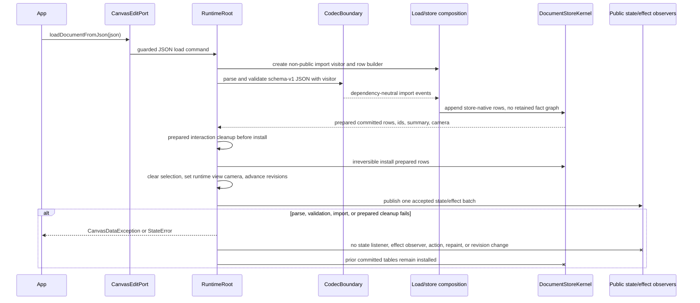

# Design: Canonical Schema V1 JSON Load API

---
date: 2026-06-07
designer: Codex
commit: 3932de38
branch: new-architecture
design_question: "Prepare a new design for canonical public schema-v1 JSON loading into runtime, without using public CanvasDocument as a load input."
---

## Disposition

READY_FOR_CONTRACT

## Product Outcome

Applications load saved canvas documents by passing schema-v1 JSON directly to
an existing runtime. Valid JSON becomes committed engine tables atomically;
invalid JSON leaves the current runtime exactly as it was. `CanvasDocument`
remains only a read/output projection model, not a public or internal load
input.

The product/API owner selected O1-A and O2-A on 2026-06-07: public initial
document construction input is removed entirely, and public
`decodeCanvasDocument*` helpers are removed from Public API v1. The canonical
JSON-to-runtime path is therefore only `runtime.edits.loadDocumentFromJson(json)`.

Non-goals: do not optimize first `readDocument()` projection in this phase; do
not use eager projection as a load-performance fix; do not accept 100k raw JSON
under the current 32 MiB raw JSON limit; do not export internal builder, sink,
or row types; do not introduce a document-sized retained validated fact/DTO
payload between schema validation and store-native rows.

## Target Contract Classification

- Profile: BEHAVIOR_CHANGE
- Obligations: SEAM_MIGRATION, PUBLIC_API_CHANGE

`BEHAVIOR_CHANGE` fits because the runtime load input, validation path, store
installation path, failure boundary, public API contract, and benchmark
acceptance boundary all change. `SEAM_MIGRATION` applies because the current
decode-then-load and `CanvasDocument` load seams must be retired. `PUBLIC_API_CHANGE`
applies because existing public signatures expose `CanvasDocument` as
constructor and `loadDocument` input, and the request explicitly allows breaking
public API because there are no external users yet.

## Research Inputs

- None provided; direct repository evidence used.

## Repository Evidence

`Evidence Consequence Link`: each fact below states the decision, boundary, unit,
proof surface, or review consequence it supports.

- `AGENTS.md:3` - the repository root is the canonical target package for the
  architecture rebuild -> supports treating the root package docs and code as
  the design source, not legacy compatibility.
- User decision, chat on 2026-06-07 (named user-input exception) - O1-A removes
  public initial-document input entirely and O2-A removes public
  `decodeCanvasDocument*` helpers -> closes the previous public API gate and
  supports `READY_FOR_CONTRACT`.
- User performance acceptance update, chat on 2026-06-07 (named user-input
  exception) - 50k public JSON load acceptance must use the Xiaomi measurement
  device rather than Pixel and must have a concrete success threshold; user
  accepted replacing the prior example threshold with a Xiaomi-based gate ->
  supports locking benchmark completion as a measurable pass/fail outcome.
- User codec/store handoff update, chat on 2026-06-07 (named user-input
  exception) - validated facts must not become a document-sized retained
  intermediate payload; the handoff must be event/visitor/sink or otherwise
  store-native without a large intermediate graph -> supports locking the
  non-retained import boundary before Change Contract authoring.
- `docs/contracts/public_api_v1.md:93` - the root public barrel exports exactly
  the names listed in `docs/_registry/public_api_v1.yaml` -> future public API
  migration must update the registry and barrel together.
- `docs/contracts/public_api_v1.md:166` - `dynamic` is allowed only at raw JSON
  or diagnostic projection boundaries -> supports making raw JSON load a named
  boundary instead of leaking untyped maps through normal runtime APIs.
- `docs/contracts/public_api_v1.md:220` - `CanvasDocument` currently uses
  default identity equality as a large runtime-owned snapshot -> supports keeping
  it as a read/output projection instead of making it a canonical import value.
- `docs/contracts/public_api_v1.md:368` - `CanvasRuntime` currently accepts
  `CanvasDocument? initialDocument` -> supports retiring constructor-level
  `CanvasDocument` load input.
- `docs/contracts/public_api_v1.md:374` - `CanvasRuntime.readDocument()` returns
  `CanvasDocument` -> supports preserving `CanvasDocument` as an output/read
  model.
- `docs/contracts/public_api_v1.md:397` - a provided initial document is
  installed during construction and initializes runtime view camera without a
  public state notification -> O1-A intentionally removes this construction load
  route instead of replacing it with JSON construction.
- `docs/contracts/public_api_v1.md:655` - `CanvasDocument` currently owns camera,
  background, palette, resources, background elements, layers, and metadata
  projection fields -> supports the read/output projection scope that must not
  become the load materialization path.
- `docs/contracts/public_api_v1.md:792` - the public codec currently exposes
  `encodeCanvasDocument` and `encodeCanvasDocumentToJson` from `CanvasDocument`
  -> supports keeping encode as a read/output/tooling concern after load input
  changes.
- `docs/contracts/public_api_v1.md:794` - the public codec currently exposes
  `decodeCanvasDocument` and `decodeCanvasDocumentFromJson` returning
  `CanvasDocument` -> supports explicitly demoting decode helpers away from the
  runtime load route.
- `docs/contracts/public_api_v1.md:1346` - `CanvasEditPort` is the current
  public edit/load port -> supports placing the canonical JSON load mutation on
  the existing edit port rather than inventing a second public mutation family.
- `docs/contracts/public_api_v1.md:1348` - `CanvasEditPort.loadDocument`
  currently takes `CanvasDocument` -> supports the required public seam
  migration to JSON input.
- `docs/contracts/public_api_v1.md:1393` - persisted document camera changes are
  document edits, while runtime view camera is separate -> load must initialize
  runtime view camera from validated persisted JSON camera without treating view
  camera as duplicated document state.
- `docs/contracts/public_api_v1.md:1815` - `CanvasCameraPort` owns runtime view
  camera and does not invalidate public document projection on camera pan ->
  supports atomic load updating runtime view camera separately from read
  projection work.
- `docs/contracts/public_api_v1.md:1836` - resource mutation is intentionally
  inside `CanvasEdit` to guarantee atomic resource and element operations ->
  supports keeping JSON resource import inside the load/edit transaction
  boundary.
- `docs/contracts/public_api_v1.md:1857` - `CanvasImageResource` is a public
  resource descriptor type -> supports the requirement that runtime load must not
  materialize this public type for imported resources.
- `docs/contracts/public_api_v1.md:1896` - the public resolver callback accepts
  `CanvasImageResource` -> supports separating load-time internal resource rows
  from read/resolver-facing public projections.
- `docs/contracts/public_api_v1.md:1912` - runtime stores only resource
  descriptors and render cache references -> supports importing resources into
  internal descriptor rows, not app-owned image objects.
- `docs/_registry/public_api_v1.yaml:10` - `CanvasDocument` is currently in the
  public export registry -> future contract must intentionally keep or remove it
  as read/output public API.
- `docs/_registry/public_api_v1.yaml:110` - encode/decode functions are currently
  exported public names -> future contract must intentionally retain them as
  tooling/read helpers or remove them from exports.
- `lib/iwb_canvas_engine.dart:1` - the root barrel exports public facade files
  from `lib/src/api/**` -> future internal builder, sink, and row types must stay
  outside public facade exports.
- `docs/architecture/02_package_boundaries.md:59` - public declarations live in
  `lib/src/contracts/public/**` and internal seams live in
  `lib/src/contracts/internal/**` -> supports keeping load row/sink types under
  internal/store/codec ownership only.
- `docs/architecture/02_package_boundaries.md:298` - `lib/src/codec/**` may not
  import runtime, store, edit, frame, Flutter widgets, or interaction state ->
  supports a return-value or neutral internal seam from codec to load/store
  composition, not a codec-to-store import or store-owned sink.
- `docs/architecture/architecture_graph.yaml:1577` - the architecture graph
  declares `codec.schema_v1.forbidden_store_dependency` from codec to store ->
  supports forbidding `CodecBoundary -> DocumentStoreKernel` implementation
  dependencies.
- `test/guardrails/owner_dag_import_boundaries_test.dart:1158` - guardrail
  fixtures require forbidden codec edges to runtime, store, edit, and frame ->
  supports future negative proof that schema import does not violate owner DAG.
- `docs/architecture/01_runtime_ownership.md:58` - Public API must not expose
  tables, handles, caches, or runtime internals -> supports forbidding public
  export of validated row and store-table builder types.
- `docs/architecture/01_runtime_ownership.md:59` - `DocumentStoreKernel` owns
  committed document state, document revisions, resource descriptors, and public
  projection cache -> supports making the store the owner of installed internal
  rows.
- `docs/architecture/01_runtime_ownership.md:62` - `EditKernel` owns synchronous
  edit sessions and cross-owner commit/rollback coordination -> supports keeping
  external load under the edit mutation guard while replacing only the input
  type.
- `docs/architecture/01_runtime_ownership.md:69` - `CodecBoundary` owns schema
  v1 encode/decode, validation, and diagnostics -> supports keeping JSON parsing
  and schema validation at the codec boundary before store installation.
- `docs/architecture/01_runtime_ownership.md:72` - `RuntimeRoot` owns the single
  public runtime state publication snapshot -> supports one post-install
  publication after accepted JSON load.
- `docs/architecture/03_data_model.md:49` - `DocumentStoreKernel` does not store
  public `CanvasDocument` as live mutable state and stores compact committed
  tables -> supports direct JSON-to-row load as the owner-level fix.
- `docs/architecture/03_data_model.md:68` - sparse public edits prepare and
  install against committed tables before the irreversible swap -> supports
  reusing the prepared-then-swap shape for full JSON import.
- `docs/architecture/03_data_model.md:74` - successful sparse install swaps
  committed tables and revision state directly without creating or retaining a
  public `CanvasDocument` -> supports the target load path avoiding public DTO
  materialization.
- `docs/architecture/03_data_model.md:75` - materialized fallback remains only
  for explicit draft projection requests and whole-draft replacement -> supports
  retiring whole-document public DTO load while leaving read/draft projection
  separate.
- `docs/architecture/03_data_model.md:126` - family tables store
  family-specific fields and public DTOs are projections -> supports importing
  elements as internal family rows.
- `docs/architecture/03_data_model.md:128` - runtime view camera is not stored in
  `CommittedDocument`; construction and load initialize it from persisted camera
  offset -> supports JSON load updating committed camera and runtime view camera
  in one accepted result.
- `docs/architecture/03_data_model.md:150` - public runtime observation is one
  immutable `CanvasRuntimeState` after an accepted change -> supports no public
  state publication on failed JSON load.
- `docs/architecture/03_data_model.md:158` - selection-only state is owned by
  `SelectionKernel` and document replacement may produce a selection-clear effect
  published atomically with the document effect -> supports keeping selection
  clear as part of accepted load, not a post-load sync mutation.
- `docs/architecture/03_data_model.md:211` - `DocumentProjectionCache` policy is
  explicitly lazy -> supports rejecting eager projection as a load-performance
  solution.
- `docs/architecture/03_data_model.md:216` - projection cache is built only by
  explicit read paths, including `readDocument`, encode, tests/tools, or explicit
  draft read -> supports excluding first projection from the JSON load
  performance promise.
- `docs/contracts/schema_v1.md:47` - schema v1 read/write version is 1 ->
  supports the canonical JSON load version check.
- `docs/contracts/schema_v1.md:71` - unknown non-metadata fields are ignored,
  metadata is the only roundtripped extension area, unsupported schema versions
  and unknown element/resource/enum values are rejected -> supports schema
  validation before internal rows are accepted.
- `docs/contracts/schema_v1.md:102` - resource JSON currently describes image
  resources with app-key sources and descriptor fields -> supports mapping
  resources to internal descriptor rows.
- `docs/contracts/schema_v1.md:120` - v1 resource source kind is `appKey` with
  bounded key/hash/byteLength/mimeType rules -> supports internal row validation
  without `CanvasImageResource` construction.
- `docs/contracts/schema_v1.md:129` - every element has common JSON fields
  including id, kind, revision, transform, visibility, lock/select flags, and
  metadata -> supports a schema-to-family-row builder.
- `docs/contracts/schema_v1.md:246` - metadata remains raw JSON at the wire but
  materializes as `CanvasMetadata` in public DTOs -> supports internal load
  storing validated metadata facts while public projection still exposes
  `CanvasMetadata`.
- `docs/contracts/codec_boundary.md:43` - production `CodecBoundary` owns schema
  v1 decode/encode only -> supports keeping the new runtime importer schema-v1
  scoped.
- `docs/contracts/codec_boundary.md:50` - current codec entry points encode and
  decode `CanvasDocument` -> supports changing load acceptance rather than
  treating current codec as canonical runtime loading.
- `docs/contracts/codec_boundary.md:58` - current decode algorithm parses JSON,
  validates schema and fields, validates resources/elements, checks duplicates
  and missing references, then materializes `CanvasDocument` -> supports
  preserving validation order but replacing the materialization target for load.
- `docs/contracts/codec_boundary.md:71` - current decode materializes a public
  `CanvasDocument` DTO -> supports the required seam retirement.
- `docs/contracts/codec_boundary.md:72` - codec calls have no runtime/store side
  effects -> supports keeping decode helpers separate from runtime load.
- `docs/contracts/load_document.md:36` - current load contract names
  `CanvasEditPort.loadDocument(document)` as public external replacement ->
  supports replacing that canonical public operation with a JSON-input
  successor.
- `docs/contracts/load_document.md:19` - load document is related to
  `dfd_load_document_success_failure`, `seq_load_document_success`, and
  `seq_load_document_failure` -> supports mandatory durable diagram updates when
  the load route changes.
- `docs/contracts/load_document.md:40` - `RuntimeRoot` owns atomic cross-owner
  replacement after validation and materialization -> supports keeping
  `RuntimeRoot` as the JSON load orchestrator after internal rows are prepared.
- `docs/contracts/load_document.md:64` - success ordering currently starts with
  validating public `CanvasDocument` and materializing `PreparedDocumentLoad` ->
  supports migrating the first two steps to schema validation and internal row
  preparation.
- `docs/contracts/load_document.md:74` - accepted replacement installs document
  and clears selection atomically through runtime/applier boundary -> supports
  the selected all-or-nothing install point.
- `docs/contracts/load_document.md:77` - load success increments epoch, document,
  selection, viewCamera, and maybe preview revisions in the same atomic result ->
  supports required revision behavior for JSON load success.
- `docs/contracts/load_document.md:97` - load failure leaves active interaction,
  preview, pending line, pointer normalization, committed document, selection,
  runtime view camera, repaint, public state, and actions unchanged -> supports
  the failure proof surface for invalid JSON.
- `docs/contracts/load_document.md:114` - `CanvasEdit.replaceDraftDocument` is a
  distinct rollback-safe edit-session operation -> supports not using draft
  replacement as the public runtime JSON load path.
- `docs/contracts/validation_limits.md:36` - raw JSON length is capped at
  `32 * 1024 * 1024` chars -> supports excluding 100k raw JSON acceptance in this
  phase.
- `docs/contracts/validation_limits.md:71` - validation is applied at public DTO
  construction, schema decode, and `loadDocument` materialization among other
  boundaries -> supports moving load materialization validation to the new JSON
  importer boundary.
- `docs/contracts/resources.md:53` - `DocumentStoreKernel` owns resource
  descriptors as committed document state -> supports store-owned imported
  resource rows.
- `docs/contracts/resources.md:92` - paint/resource resolution receives
  immutable descriptor snapshots and resource revisions through `FrameFactsPort`
  -> supports internal descriptor rows as the installed resource source of truth.
- `docs/contracts/resources.md:138` - resource mutation is inside `CanvasEdit`
  and failures roll back resource and element changes -> supports proving JSON
  resource import and image element references atomically.
- `docs/contracts/resources.md:205` - v1 resource boundary supports app-key
  descriptors, no engine IO, synchronous app resolver, and dirty invalidation ->
  supports keeping load as descriptor import only, not asset loading.
- `docs/verification/benchmarks.md:33` - benchmark manifest is the structured
  source of truth for cases, scales, measurement boundaries, fixtures, metrics,
  budgets, invariants, and profiles -> supports updating benchmark acceptance in
  the manifest later.
- `docs/_registry/sections.yaml:452` - section registry also links the load
  contract to the load success/failure diagrams -> supports treating load diagram
  updates as required source-of-truth work, not optional contract discretion.
- `docs/_registry/benchmarks.yaml:523` - `projection.read_document` is a separate
  projection-split benchmark with first-read and cache-hit metrics -> supports
  excluding projection from the JSON load promise.
- `docs/_registry/benchmarks.yaml:563` - current `load_document.success` covers
  1k/10k/50k/100k lifecycle load with `CanvasDocument` setup -> supports
  replacing this case's subject with the public JSON load API.
- `docs/_registry/benchmarks.yaml:584` - current `load_document.breakdown`
  includes decode, runtime construction, load, and first projection metrics ->
  supports migrating breakdown metrics so projection remains diagnostic, not the
  success acceptance boundary.
- `docs/_registry/benchmarks.yaml:604` - current `load_document.failure`
  requires committed mutation count zero for invalid 1k/10k/50k inputs ->
  supports the future invalid JSON atomicity proof.
- `docs/verification/benchmarks.md:91` - manual device reference reports live
  under `tool/bench/manual/reference_reports/` for named local devices ->
  supports using the Xiaomi manual reference as optimization-gate evidence
  rather than the Ubuntu approved release baseline.
- `docs/verification/benchmarks.md:95` - a manual reference report is valid only
  when `tool/bench/manual/reference_decisions.json` records the accepted run or
  run window -> supports citing the Xiaomi decision log before using its
  numbers.
- `docs/verification/benchmarks.md:99` - the Xiaomi 22081283G Android 14 Flutter
  3.44.0 manual reference report path is
  `tool/bench/manual/reference_reports/xiaomi_22081283g_android14_flutter_3_44_0.json`
  -> supports replacing the Pixel-derived gate with the Xiaomi reference.
- `tool/bench/manual/reference_decisions.json:15` - the accepted Xiaomi reference
  path is recorded in the decision log -> supports treating the Xiaomi report as
  the current manual reference.
- `tool/bench/manual/reference_decisions.json:18` - the Xiaomi reference uses
  `stable_window_median_v1` -> supports preferring the accepted median window
  over one transient run.
- `tool/bench/manual/reference_decisions.json:20` -
  `tool/bench/manual/reference_decisions.json:22` - the accepted Xiaomi window is
  three 2026-06-07 load/projection runs -> supports the gate's device-specific
  provenance.
- `tool/bench/manual/reference_reports/xiaomi_22081283g_android14_flutter_3_44_0.json:33`
  - the accepted report device id is `22081283G` -> supports tying the gate to
  Xiaomi, not Pixel.
- `tool/bench/manual/reference_reports/xiaomi_22081283g_android14_flutter_3_44_0.json:37`
  - the accepted report uses `stable_window_median_v1` -> supports using its
  median metrics.
- `tool/bench/manual/reference_reports/xiaomi_22081283g_android14_flutter_3_44_0.json:3860`
  - the accepted load breakdown 50k case exists -> supports deriving the 50k
  load gate from the correct scale.
- `tool/bench/manual/reference_reports/xiaomi_22081283g_android14_flutter_3_44_0.json:3897`
  - accepted Xiaomi 50k breakdown `decode_us` is 347810, and
  `tool/bench/manual/reference_reports/xiaomi_22081283g_android14_flutter_3_44_0.json:3899`
  records `load_document_us` as 471105 -> supports the derived
  `schema_import_load_us` proxy 818915 us for the old split route. The selected
  design gate rounds this to the strict threshold `schema_import_load_us <
  820000` for the new public JSON route.
- `lib/src/api/canvas_runtime.dart:28` - current public runtime facade accepts
  `CanvasDocument? initialDocument` -> supports the constructor public API
  retirement.
- `lib/src/api/canvas_runtime.dart:40` - public `readDocument()` delegates to
  the root and returns `CanvasDocument` -> supports keeping read projection.
- `lib/src/api/canvas_codec.dart:21` - current `decodeCanvasDocument` delegates
  to `decodeSchemaV1Document` -> supports demoting decode as a helper separate
  from runtime load.
- `lib/src/api/canvas_codec.dart:25` - current `decodeCanvasDocumentFromJson`
  delegates to `decodeSchemaV1DocumentFromJson` -> supports rejecting
  `decodeCanvasDocumentFromJson(json)` as the performance acceptance subject.
- `lib/src/codec/schema_v1_decoder.dart:24` - current schema decoder returns
  `CanvasDocument` -> supports adding a separate load importer instead of
  repurposing this function as the runtime path.
- `lib/src/codec/schema_v1_decoder.dart:65` - current decode constructs
  `CanvasDocument` before reference validation returns -> supports removing this
  public DTO allocation from load.
- `lib/src/codec/schema_v1_decoder.dart:83` - current string decode performs raw
  length check and JSON parse before root object validation -> supports reusing
  this boundary order in the JSON load importer.
- `lib/src/codec/schema_v1_decoder.dart:281` - current resource decode
  constructs `CanvasImageResource` -> supports the requirement to import
  resources as internal rows instead.
- `lib/src/codec/validated_import_draft.dart:10` - current import draft is
  created from `CanvasDocument` -> supports retiring the internal
  `CanvasDocument` load input, not only the public method.
- `lib/src/edit/staged_document_load.dart:54` - current `LoadDocumentPipeline`
  prepares from `CanvasDocument` -> supports replacing the pipeline input with
  raw JSON/imported rows.
- `lib/src/edit/staged_document_load.dart:70` - prepared loads are consumed once
  into store replacement -> supports preserving the consume-once prepared load
  pattern for internal row loads.
- `lib/src/store/document_store_kernel.dart:30` - current store construction
  accepts `CanvasDocument` -> supports replacing constructor/load internals that
  still treat public DTO as committed input.
- `lib/src/store/document_store_kernel.dart:52` - store read creates a
  `CanvasDocument` through projection cache -> supports keeping public projection
  as a read path.
- `lib/src/store/document_store_kernel.dart:272` - current full replacement takes
  `CanvasDocument` and resets id admission -> supports replacing the install
  input while preserving id generator reset semantics.
- `lib/src/store/document_projection_cache.dart:12` - projection is built through
  `projectionFor(CommittedDocument)` -> supports preserving lazy read projection
  after JSON load.
- `lib/src/store/resource_table.dart:7` - current `ResourceTable` is built from
  `Iterable<CanvasResource>` -> supports changing resource table admission to an
  internal descriptor-row input.
- `lib/src/store/resource_table.dart:78` - current resource copies materialize
  `CanvasImageResource` -> supports removing public resource DTO creation from
  load-time resource import.
- `lib/src/runtime/runtime_root.dart:211` - `EditKernel` is wired with
  `installLoadedDocument: _loadDocument` -> supports keeping the existing
  runtime/edit guard path while changing the loaded payload.
- `lib/src/runtime/runtime_root.dart:1504` - current `_loadDocument` takes
  `CanvasDocument` and prepares the load before interaction cleanup -> supports
  changing the prepared input and retaining preparation-before-side-effect
  ordering.
- `lib/src/runtime/runtime_root.dart:1508` - current runtime consumes the
  prepared load into store before selection clear, camera update, revision
  updates, and delivery -> supports defining the irreversible point and
  post-prepare infallibility requirements.
- `lib/src/runtime/runtime_root.dart:1618` - load delivery publishes state and
  observer effects inside post-load delivery -> supports future proof that
  invalid JSON performs no delivery.
- `lib/src/runtime/runtime_root.dart:1626` - observer failures are contained
  post-load notifications -> supports separating post-commit observer failures
  from load-input rollback failures.
- `test/runtime/fixtures/load_document_ordering_fixture.dart:55` - current
  fixture already tests prepared cleanup failure with no side effects -> supports
  adding equivalent JSON import failure and forced-preparation failure proof.
- `test/runtime/fixtures/load_document_ordering_fixture.dart:74` - failed
  prepared cleanup records no state or observer events beyond cleanup attempt ->
  supports direct failure-observation proof rather than proxy-only assertions.
- `test/benchmarks/benchmark_probe_flutter.dart:1512` - current breakdown first
  decodes JSON, then constructs runtime, loads decoded `CanvasDocument`, and
  reads first projection -> supports changing the benchmark to time the new
  public JSON load route directly.
- `test/benchmarks/benchmark_probe_flutter.dart:1534` - current timed decode uses
  `decodeCanvasDocumentFromJson` -> supports forbidding this helper as the load
  route under the new acceptance.
- `test/benchmarks/benchmark_probe_flutter.dart:1555` - current timed load calls
  `runtime.edits.loadDocument(document)` -> supports replacing the measured load
  call with the public JSON API.
- `test/benchmarks/benchmark_probe_flutter.dart:1563` - current first projection
  timing calls `runtime.readDocument()` separately -> supports keeping projection
  as a separate diagnostic/read benchmark.
- `test/benchmarks/benchmark_probe_flutter.dart:1593` - current failure benchmark
  calls `loadDocument(document)` and reports committed mutation count zero ->
  supports migrating the failure case to invalid JSON and unchanged runtime
  facts.
- `lib/src/contracts/public/canvas_contract_limits.dart:1` - raw JSON length is
  `32 * 1024 * 1024` in code -> supports rejecting 100k raw JSON acceptance until
  a streaming/chunked or memory-proof design gate.
- `lib/src/contracts/public/canvas_value_validators.dart:223` - raw JSON length
  validation throws `maxRawJsonLength` before parsing oversized input -> supports
  the 100k deferral and failure-before-mutation boundary.
- `PLAN.md:74` - Step 52 `Legacy example full parity port` remains open ->
  supports routing example JSON workflow migration as an active roadmap conflict,
  not an implementation afterthought.
- `plan/step_52_legacy_example_full_parity_port.md:291` - the active step
  contract requires valid import through `decodeCanvasDocumentFromJson` followed
  by public `runtime.edits.loadDocument` -> supports mandatory repair or
  superseding update before implementing the new canonical JSON load API.
- `example/lib/src/canvas_example_view_model.dart:115` - current example import
  decodes JSON through `decodeCanvasDocumentFromJson` -> supports updating
  example workflow tests and code away from the retired route.
- `example/lib/src/canvas_example_view_model.dart:116` - current example import
  then calls `_runtime.edits.loadDocument(document)` -> supports updating example
  import to call the new public JSON load API directly.
- `docs/diagrams/seq_load_document_success.mmd:20` - the current success sequence
  starts from schema JSON by decoding to a public `CanvasDocument` DTO -> supports
  mandatory diagram repair for the new direct JSON load route.
- `docs/diagrams/seq_load_document_success.mmd:28` - the current success sequence
  calls `loadDocument(document)` -> supports mandatory diagram repair for the
  public load method change.
- `docs/diagrams/dfd_load_document_success_failure.mmd:7` - the current data
  flow names `CanvasEditPort.loadDocument(document)` in the public API boundary
  -> supports mandatory data-flow diagram repair for the new public JSON load
  route.
- `docs/diagrams/dfd_load_document_success_failure.mmd:8` - the current data
  flow includes `CanvasDocument DTO` at the public API boundary -> supports
  mandatory diagram repair to remove public DTO materialization from load.

## Design Form Candidates

### Candidate A. Edit-Port JSON Load Into Store-Owned Prepared Rows

- Form: replace the canonical public external replacement operation with
  `CanvasEditPort.loadDocumentFromJson(String json)` and remove public
  constructor initial-document input entirely. The runtime composes an internal
  schema-v1 importer that parses and validates raw JSON, emits dependency-neutral
  import events through a non-public visitor boundary without importing store,
  lets load/store composition feed those events directly into store-owned row
  builders, produces a consume-once prepared load payload, and atomically
  installs committed store tables through `RuntimeRoot`.
- Why it could work: it keeps the public mutation under the existing edit/load
  port (`docs/contracts/public_api_v1.md:1346`), keeps schema validation at
  `CodecBoundary` (`docs/architecture/01_runtime_ownership.md:69`), keeps
  committed state and resource descriptors in `DocumentStoreKernel`
  (`docs/architecture/01_runtime_ownership.md:59`), and matches the documented
  table/projection split (`docs/architecture/03_data_model.md:49`,
  `docs/architecture/03_data_model.md:211`).
- Gate failures or risks: the future implementation must keep the codec/store
  handoff dependency-neutral and non-retained. Codec must not return a
  document-sized validated fact/list/tree graph, import store, or write to a
  store-owned sink; load/store composition owns the visitor implementation and
  store builder calls. Store row builders must not leak through public facades.
  The row-builder contract must make all post-prepare store installation
  infallible or failure-contained.

### Candidate B. Decode Helper Plus Existing CanvasDocument Load

- Form: keep `decodeCanvasDocumentFromJson(json)` as the recommended public load
  route and call `runtime.edits.loadDocument(decodedDocument)`.
- Why it could work: it uses existing public API and tests.
- Gate failures or risks: rejected. It directly contradicts the requirement that
  decode is not a load route, preserves `CanvasDocument` as a public and
  internal load input (`lib/src/edit/staged_document_load.dart:54`), retains
  public resource DTO creation on the load path
  (`lib/src/codec/schema_v1_decoder.dart:281`), and keeps benchmark acceptance on
  the old route (`test/benchmarks/benchmark_probe_flutter.dart:1534`,
  `test/benchmarks/benchmark_probe_flutter.dart:1555`).

### Candidate C. Public Validated Rows Or Builder API

- Form: add public `CanvasDocumentRows`, `CanvasResourceRow`,
  `CanvasLoadBuilder`, or similar row/sink types and let apps decode JSON into
  them before load.
- Why it could work: it would make performance and validation stages explicit to
  app code.
- Gate failures or risks: rejected. Public API must not expose tables, handles,
  caches, or runtime internals (`docs/architecture/01_runtime_ownership.md:58`);
  the user explicitly requires internal builder/sink/row types to remain
  non-public; it would also create a second durable wire/source-of-truth shape
  beside schema v1 JSON.

### Candidate D. Runtime Facade Load Method Only

- Form: add `CanvasRuntime.loadDocumentFromJson(String json)` and remove load
  from `CanvasEditPort`.
- Why it could work: it makes "JSON -> runtime" visually direct for consumers.
- Gate failures or risks: not selected. The existing public API concentrates
  external document mutation on `CanvasEditPort` (`docs/contracts/public_api_v1.md:1346`),
  while `EditKernel` owns mutation guards and cross-owner commit coordination
  (`docs/architecture/01_runtime_ownership.md:62`). Moving only load to the
  runtime facade would split mutation discoverability and require duplicating
  guard semantics unless it simply delegated to the edit port.

## Known Future Pressures

| Pressure | Evidence | How the selected form responds | Accepted cost or risk |
|---|---|---|---|
| `CanvasDocument` is still public and heavily used as read projection. | `docs/contracts/public_api_v1.md:374`; `docs/architecture/03_data_model.md:211`; `lib/src/api/canvas_runtime.dart:40` | Keeps `CanvasDocument` as read/output projection and encode/tooling input, but removes it from runtime load and construction inputs. | Public docs and compile fixtures must clearly distinguish read/output helpers from load routes. |
| Existing runtime construction accepts a `CanvasDocument` and initializes view camera from it. | `docs/contracts/public_api_v1.md:368`; `docs/contracts/public_api_v1.md:397`; `lib/src/api/canvas_runtime.dart:28` | Removes constructor load input entirely. Runtime construction creates the default empty document, and saved-document loading moves to explicit post-construction `loadDocumentFromJson(String)`. | Breaking constructor migration; no external users per user decision, but internal tests and fixtures must migrate. |
| Current codec decode materializes public DTOs and public resource descriptors. | `docs/contracts/codec_boundary.md:71`; `lib/src/codec/schema_v1_decoder.dart:65`; `lib/src/codec/schema_v1_decoder.dart:281` | Adds a separate runtime importer that reuses schema validation semantics and emits dependency-neutral import events into load/store composition. The importer must not return a document-sized retained validated fact graph; load/store composition converts events directly into store-owned prepared rows. Decode helpers are not called from load acceptance. | Some validation code may need extraction to avoid duplicating schema policy; extraction must preserve one schema source of truth and must not introduce codec-to-store imports or a new retained import graph. |
| Store tables currently still accept public resource/document inputs in key constructors and replacement paths. | `lib/src/store/document_store_kernel.dart:30`; `lib/src/store/document_store_kernel.dart:272`; `lib/src/store/resource_table.dart:7` | Store gains an internal prepared row/snapshot install input; public DTO inputs remain only for projection/draft helper paths until retired or quarantined. | Store constructor and fixtures will need migration; draft replacement may need separate handling if it continues to accept `CanvasDocument`. |
| Resources must import without constructing `CanvasImageResource`, but resolvers still consume public resource projections. | `docs/contracts/public_api_v1.md:1896`; `docs/contracts/resources.md:92`; `lib/src/store/resource_table.dart:78` | Load creates store-owned descriptor rows; read/resource ports and resolver adapter project public `CanvasImageResource` only when explicitly read/resolved. | Projection/resource read performance remains separate from load acceptance. |
| Load atomicity spans document, selection, camera, revisions, effects, observers, and interaction cleanup. | `docs/contracts/load_document.md:74`; `docs/contracts/load_document.md:97`; `lib/src/runtime/runtime_root.dart:1618`; `test/runtime/fixtures/load_document_ordering_fixture.dart:55` | All fallible JSON parse/validation/import and prepared cleanup work occurs before the irreversible install; after prepare, store install, selection clear, camera update, revision advance, cache invalidation, and delivery assembly must be infallible or failure-contained. | Future contract must add forced-failure tests around import and prepared cleanup, not only invalid schema tests. |
| Performance acceptance must measure the new public JSON load API at 50k, while first projection remains separate. | `docs/_registry/benchmarks.yaml:523`; `docs/_registry/benchmarks.yaml:563`; `test/benchmarks/benchmark_probe_flutter.dart:1512`; `test/benchmarks/benchmark_probe_flutter.dart:1563`; `docs/verification/benchmarks.md:99`; `tool/bench/manual/reference_decisions.json:18`; `tool/bench/manual/reference_reports/xiaomi_22081283g_android14_flutter_3_44_0.json:3897`; `tool/bench/manual/reference_reports/xiaomi_22081283g_android14_flutter_3_44_0.json:3899`; user performance acceptance update, 2026-06-07 | Migrates success/failure/breakdown benchmark subjects to `loadDocumentFromJson(String)` and requires the Xiaomi 50k success gate `schema_import_load_us < 820000`, with projection only as separate `projection.read_document` or diagnostic breakdown. | Existing benchmark baselines and report interpretation will be invalidated for load cases; the future contract cannot pass by only recording a slow timing. |
| 100k raw JSON is currently constrained by the 32 MiB raw JSON limit. | `docs/contracts/validation_limits.md:36`; `lib/src/contracts/public/canvas_contract_limits.dart:1` | Limits this phase's raw JSON performance acceptance to 50k and routes 100k to a later streaming/chunked import or raw-limit memory-proof design gate. | 100k load remains unpromised even though other in-memory benchmark cases still use 100k scales. |
| Public API guardrails enforce registry/barrel completeness and prevent internal exports. | `docs/contracts/public_api_v1.md:93`; `docs/verification/guardrails.md:177`; `docs/verification/guardrails.md:178` | Requires future public registry/barrel tests to prove only JSON load names are exported and internal rows/sinks remain hidden. | Contract must include both positive public API compile proof and negative internal export proof. |
| Active Step 52 and the current example import workflow still require the retired decode-then-load route. | `PLAN.md:74`; `plan/step_52_legacy_example_full_parity_port.md:291`; `example/lib/src/canvas_example_view_model.dart:115`; `example/lib/src/canvas_example_view_model.dart:116` | Future Change Contract must either update/supersede Step 52 before implementation or include Step 52/example workflow migration in the same source-of-truth unit before public API removal. The example import action must call `runtime.edits.loadDocumentFromJson(json)` directly and handle invalid JSON without document mutation. | The active roadmap step and example tests must change with the public API; this is intentional churn caused by retiring a now-invalid canonical load route. |

## Selected Form

Use Candidate A as the recommended architecture: edit-port JSON load into
store-owned prepared rows. The internal owner split, atomicity boundary,
resource-row import, projection boundary, benchmark boundary, and mandatory
source-of-truth updates are locked by repository evidence. The prior public API
gate is closed by the user-selected O1-A and O2-A decisions recorded in this
artifact.

The locked public load API is `CanvasEditPort.loadDocumentFromJson(String json)`.
It is the canonical runtime load route for schema-v1 JSON. The future public
constructor must not accept `CanvasDocument? initialDocument` and must not add a
replacement JSON initial-document input in this phase. Runtime construction
creates the default empty document; loading saved JSON is an explicit post-
construction command.

The runtime load flow is:

```text
public JSON string
  -> raw JSON length check and JSON parse
  -> schema v1 root/field validation
  -> dependency-neutral schema-v1 import events
  -> load/store composition feeds store-owned row builders
  -> store-owned prepared committed tables and admitted-id facts
  -> prepared interaction cleanup
  -> atomic runtime install
  -> one public state publication and post-load effects
```

`CanvasDocument` is not a public or internal load input in this flow. It may
remain public only as read/output projection from `readDocument()`, explicit
draft read helpers, and encode/tooling input. Public
`decodeCanvasDocumentFromJson` and `decodeCanvasDocument` are removed from Public
API v1, so no runtime load implementation, benchmark, example, or canonical docs
can pipe their result into a runtime load route.

The internal importer has two owners:

- `CodecBoundary` owns raw JSON parsing, schema-v1 validation policy, diagnostic
  paths, unknown-field policy, metadata validation policy, schema version
  rejection, and dependency-neutral import-event emission. It must not import
  store, edit, runtime, frame, Flutter widgets, or interaction state.
- `DocumentStoreKernel` owns committed row builders, resource descriptor rows,
  family rows, layer/order rows, id admission, reference checks, revision facts,
  projection invalidation facts, and final table install.

The dependency-safe boundary between them is an internal event/visitor boundary,
not an internal retained document graph. Codec validates parsed schema nodes and
synchronously emits dependency-neutral schema-v1 import events to a non-public
visitor interface. Load/store composition implements that visitor and appends
store-owned rows immediately. Exact class names can be chosen by the future
Change Contract, but the architecture is fixed: codec must not call
`DocumentStoreKernel`, must not import store, must not write to a store-owned
sink, and must not return a document-sized retained validated fact/list/tree
payload. Given the current non-streaming raw JSON path, the parsed JSON object
may exist during validation, but this phase forbids a second document-sized
validated import graph between parsed JSON and store rows. No public facade,
root barrel, or public contract exports a builder, sink, prepared row,
committed-table snapshot, resource descriptor row, import-event interface, or
importer implementation type.

Resources import as internal descriptor rows. Schema resource JSON with
`source.kind=appKey` becomes store-owned descriptor facts; load does not
construct `CanvasImageResource`. Public `CanvasImageResource` may be projected
later through read/resource/resolver-facing surfaces that already expose public
resource descriptors.

Load atomicity is all-or-nothing for existing runtime instances. Any
`CanvasDataException`, `FormatException` mapped to `CanvasDataException`, or
pre-install `StateError` from mutation guards or prepared cleanup leaves the
previous committed document, selection, runtime view camera, revision domains,
preview/interaction state, resource visual state, effect observer batches,
action streams, and state listeners unchanged. No effect observer or public
state listener runs for a failed JSON load.

The irreversible point is the runtime install of the already prepared store
tables plus selection clear, runtime view camera initialization, revision
advance, projection/spatial/frame/resource invalidation facts, and prepared
cleanup outcome consumption. All fallible work must happen before that point.
After the irreversible point, state publication and effect observer delivery are
post-commit notifications; existing observer-failure containment remains a
delivery policy and is not a rollback path.

Performance acceptance for this phase measures the new public JSON load API on
50k raw JSON using the Xiaomi 22081283G Android 14 Flutter 3.44.0 manual
reference contour, not the Pixel manual reference. It must include raw JSON
length check, parse, schema validation, internal row import, and runtime install.
It must not include a first `readDocument()` projection as the success acceptance
metric. A breakdown may report first projection separately, and
`projection.read_document` remains the separate read/projection benchmark. Eager
projection is forbidden as a performance solution. The required 50k success gate
is `schema_import_load_us < 820000`, measured on
`runtime.edits.loadDocumentFromJson(json)` and failing the future contract if the
threshold is not met. The Xiaomi accepted old-route proxy is 818915 us
(`decode_us` 347810 + `load_document_us` 471105), so the selected strict gate is
the rounded Xiaomi threshold for the new public JSON route. `schema_import_load_us`
is the public JSON load lifecycle time from raw length validation through atomic
runtime install; it excludes runtime construction, fixture generation, teardown,
and first projection. 100k raw JSON remains outside this phase because the
current raw JSON cap is 32 MiB; supporting it requires a later design gate for
streaming/chunked import or a raw-limit revision backed by memory proof.

## Decision Trace

Preserve `Decision Chain Of Custody`: source inputs and locked decisions must
map to the future contract field, execution unit, or proof surface that carries
them forward.

| Decision ID | Decision | Evidence | Contract handoff target |
|---|---|---|---|
| D1 | Canonical public runtime load is `CanvasEditPort.loadDocumentFromJson(String json)`, not `loadDocument(CanvasDocument)`. | `docs/contracts/public_api_v1.md:1346`; `docs/contracts/public_api_v1.md:1348`; `docs/contracts/load_document.md:36` | `Boundaries.Entry`; public API unit; API compile fixture; migration/retirement checks |
| D2 | `CanvasRuntime(initialDocument: CanvasDocument?)` is retired with no replacement initial-document input; runtime construction creates the default empty document. | `docs/contracts/public_api_v1.md:368`; `docs/contracts/public_api_v1.md:397`; `lib/src/api/canvas_runtime.dart:28`; user decision O1-A, 2026-06-07 | `Boundaries.Entry`; public API constructor unit; compile proof that constructor no longer accepts document or JSON initial-load input |
| D3 | `CanvasDocument` is read/output projection only and is not public or internal load input. | `docs/architecture/03_data_model.md:49`; `docs/architecture/03_data_model.md:211`; `lib/src/codec/validated_import_draft.dart:10`; `lib/src/edit/staged_document_load.dart:54` | `Boundaries.Source of Truth`; seam-retirement unit; semantic search/guardrail proof |
| D4 | Public `decodeCanvasDocument` and `decodeCanvasDocumentFromJson` are removed from Public API v1, so decode helpers cannot be a public runtime load route. | `docs/contracts/codec_boundary.md:72`; `lib/src/api/canvas_codec.dart:25`; `test/benchmarks/benchmark_probe_flutter.dart:1534`; user decision O2-A, 2026-06-07 | `Public API Semantics`; public export registry unit; benchmark migration unit; negative route proof |
| D5 | Schema validation remains codec-owned and emits dependency-neutral import events through a non-public visitor boundary; committed rows and install remain store-owned, codec must not import/call store, and the handoff must not be a document-sized retained validated fact graph. | `docs/architecture/01_runtime_ownership.md:59`; `docs/architecture/01_runtime_ownership.md:69`; `docs/architecture/03_data_model.md:68`; `docs/architecture/02_package_boundaries.md:298`; `docs/architecture/architecture_graph.yaml:1577`; user codec/store handoff update, 2026-06-07 | `Boundaries.Owner`; importer/store execution units; owner-DAG import checks; retained-payload negative proof |
| D6 | Internal builder/sink/row/prepared-table types are not public API exports. | `docs/architecture/01_runtime_ownership.md:58`; `lib/iwb_canvas_engine.dart:1`; `docs/verification/guardrails.md:178` | Public export guardrail; internal export negative fixture; registry update unit |
| D7 | Resources import as store-owned descriptor rows and do not construct `CanvasImageResource` on the load path. | `docs/contracts/resources.md:53`; `docs/contracts/resources.md:92`; `lib/src/codec/schema_v1_decoder.dart:281`; `lib/src/store/resource_table.dart:78` | Resource import unit; resolver/read projection proof; allocation/semantic search proof |
| D8 | JSON load is atomic: all fallible parse/validation/import/prepared-cleanup work occurs before the irreversible install; failure leaves document, selection, camera, revisions, effects, observers, and interaction state unchanged. | `docs/contracts/load_document.md:74`; `docs/contracts/load_document.md:97`; `test/runtime/fixtures/load_document_ordering_fixture.dart:55`; `lib/src/runtime/runtime_root.dart:1618` | `All-Or-Nothing Failure Boundary`; runtime failure fixtures; observer/effect negative proof |
| D9 | Store install preserves id-admission reset and revision behavior without eager projection. | `docs/contracts/public_api_v1.md:326`; `docs/contracts/load_document.md:77`; `lib/src/store/document_store_kernel.dart:272`; `docs/architecture/03_data_model.md:216` | Store install unit; id generator proof; projection build-count proof |
| D10 | Performance acceptance measures the new public JSON load API at 50k on the Xiaomi 22081283G manual reference contour, excludes first projection from the success promise, and gates success on `schema_import_load_us < 820000`. | `docs/_registry/benchmarks.yaml:523`; `docs/_registry/benchmarks.yaml:563`; `test/benchmarks/benchmark_probe_flutter.dart:1512`; `test/benchmarks/benchmark_probe_flutter.dart:1563`; `docs/verification/benchmarks.md:99`; `tool/bench/manual/reference_decisions.json:15`; `tool/bench/manual/reference_decisions.json:18`; `tool/bench/manual/reference_reports/xiaomi_22081283g_android14_flutter_3_44_0.json:3897`; `tool/bench/manual/reference_reports/xiaomi_22081283g_android14_flutter_3_44_0.json:3899`; user performance acceptance update, 2026-06-07 | Benchmark manifest/probe unit; release diff interpretation; numeric acceptance proof |
| D11 | 100k raw JSON is not accepted in this phase under the current 32 MiB raw JSON limit. | `docs/contracts/validation_limits.md:36`; `lib/src/contracts/public/canvas_contract_limits.dart:1`; `lib/src/contracts/public/canvas_value_validators.dart:223` | Scope constraints; benchmark scale migration; future design-gate note |
| D12 | Durable source-of-truth docs, diagrams, registries, guardrails, and benchmarks must be updated by the future Change Contract before implementation is complete. | `docs/contracts/public_api_v1.md:93`; `docs/verification/benchmarks.md:33`; `docs/contracts/load_document.md:36`; `docs/contracts/codec_boundary.md:50` | `Source-Of-Truth Impact`; docs/registry/diagram/benchmark units |

## Outcome-Proof Fit

| Claim | Direct outcome | Proxy risk | Required proof surface or strategy |
|---|---|---|---|
| JSON load is the canonical public runtime load API. | External compile fixture can load a document by importing only the public barrel and calling the JSON load method; no public canonical load signature accepts `CanvasDocument`. | A unit test calling an internal importer could pass while public API remains unchanged. | Public API contract compile fixture, export registry parity, and semantic search rejecting `CanvasEditPort.loadDocument(CanvasDocument)`. |
| `CanvasDocument` is not a load input. | No production load/runtime constructor/import pipeline method accepts `CanvasDocument`; load benchmarks and examples do not decode then load. | Keeping public docs wording only could pass docs checks while code still accepts DTO load. | Static signature guardrail plus production semantic search for `loadDocument(CanvasDocument`, `initialDocument: CanvasDocument`, `PreparedDocumentLoad.prepare(CanvasDocument)`, and `ValidatedImportDraft.fromDocument` on load routes. |
| Decode helpers are removed from Public API v1. | Public export registry and root barrel do not export `decodeCanvasDocument` or `decodeCanvasDocumentFromJson`; runtime load code and benchmarks do not call them as public helpers. | Keeping private/internal decode names could be mistaken as proof that the public API was removed. | Public export registry/barrel proof, public API compile-negative fixture, benchmark probe call-site proof, and public docs/example grep. |
| JSON imports resources without `CanvasImageResource` on the load path. | Instrumented/semantic proof shows schema resource import creates internal descriptor rows and no `CanvasImageResource` allocation before explicit read/resource projection. | A correct final resource descriptor could hide DTO materialization in the middle. | Focused resource import fixture with allocation/construction counter or semantic guardrail around importer/store load files, plus read projection test showing public resource projection still works. |
| Load failure leaves runtime unchanged. | Invalid JSON and forced pre-install failures preserve committed document, selection, camera, revisions, preview/interaction facts, effect batches, action events, and state listener notifications. | Checking only committed document count could miss selection, camera, observer, or preview mutation. | Snapshot-based runtime failure fixture covering all public runtime state domains and observer/effect/action lists. |
| Accepted load installs atomically. | One public state publication observes replacement document summary, cleared selection, runtime view camera initialized from persisted JSON camera, revision increments, and prepared cleanup effects together. | Observing final state only could miss intermediate publications or post-install cleanup. | Ordered listener/effect fixture and load interaction ordering fixture with no intermediate public observations. |
| JSON load does not build public projection eagerly. | Projection build count stays unchanged during successful JSON load and first projection occurs only on explicit `readDocument()`/projection benchmark. | Faster load timings could be achieved by hiding projection in setup or benchmark exclusions. | Store projection build-count fixture and benchmark probe boundary check. |
| 50k performance acceptance measures new public JSON load. | Benchmark manifest/probe invokes the public JSON load API with a 50k JSON fixture on the Xiaomi manual-reference contour and fails unless `schema_import_load_us < 820000`, excluding first projection. | A benchmark could time internal importer only, old decode/load route, Pixel-derived threshold, or merely report a slow timing without failing acceptance. | Benchmark manifest required-case test and probe code assertion checking the public call route, metric name, Xiaomi contour/provenance, exclusion boundary, and numeric threshold. |
| 100k raw JSON remains out of scope. | Benchmark manifest does not require raw JSON 100k for load success; oversized raw JSON is rejected by length validation unless a later design changes the limit. | In-memory 100k document benchmarks could be mistaken for raw JSON acceptance. | Manifest scale assertions and validation-limit tests for oversized raw JSON rejection. |

## Hard Gate Check

| Gate | Result | Evidence |
|---|---|---|
| Owner-Level Fix | pass | The root cause is that canonical load currently accepts public DTOs (`docs/contracts/public_api_v1.md:1348`) and internal pipelines prepare from `CanvasDocument` (`lib/src/edit/staged_document_load.dart:54`). The selected form replaces the shared public and internal load inputs rather than patching one benchmark or call site. |
| Ownership | pass | Codec owns schema validation (`docs/architecture/01_runtime_ownership.md:69`), store owns committed tables/resource descriptors/projection (`docs/architecture/01_runtime_ownership.md:59`), edit/runtime own mutation orchestration (`docs/architecture/01_runtime_ownership.md:62`; `docs/architecture/01_runtime_ownership.md:72`). |
| Source-Of-Truth Singularity | pass | Schema v1 JSON remains the wire source (`docs/contracts/schema_v1.md:47`); store tables remain committed runtime source (`docs/architecture/03_data_model.md:49`); public projection remains lazy read output (`docs/architecture/03_data_model.md:211`). Internal rows are transient prepared import state, not a new public schema. |
| Boundary-Owned Policy | pass | Raw JSON validation stays at the codec boundary (`docs/contracts/codec_boundary.md:58`), codec emits dependency-neutral import events without store dependency or a retained document-sized fact graph (`docs/architecture/02_package_boundaries.md:298`), row admission/reference/id invariants stay with store (`docs/architecture/03_data_model.md:68`), public mutation stays on the edit port (`docs/contracts/public_api_v1.md:1346`). |
| Negative Proof And Fixture Quarantine | pass | Negative proof uses production route searches and future contract-named fixtures; no fixture-only schemas, row names, or fake resource kinds need to enter public API, schema docs, or durable registries. Existing guardrail pattern for public exports/internal leakage supports this (`docs/verification/guardrails.md:177`; `docs/verification/guardrails.md:178`). |
| Dependency direction | pass | Public facade delegates inward (`lib/src/api/canvas_runtime.dart:40`); internal/store/codec types remain under `lib/src/**` package boundaries (`docs/architecture/02_package_boundaries.md:59`); codec must not import store/runtime/edit/frame (`docs/architecture/02_package_boundaries.md:298`; `test/guardrails/owner_dag_import_boundaries_test.dart:1158`); no public facade exports internal rows (`lib/iwb_canvas_engine.dart:1`). |
| State/data | pass | Committed rows, resource descriptors, id admission, revisions, projection cache, selection clear, runtime view camera, and preview cleanup owners are named with evidence (`docs/architecture/03_data_model.md:49`; `docs/architecture/03_data_model.md:128`; `docs/contracts/load_document.md:77`; `docs/architecture/03_data_model.md:158`). |
| Sequenced Migration And Retirement | pass | Successor load seam is `loadDocumentFromJson(String)` plus internal prepared row payload. Retired seams are `CanvasEditPort.loadDocument(CanvasDocument)`, constructor `initialDocument: CanvasDocument?`, public `decodeCanvasDocument*` exports, `LoadDocumentPipeline.prepare(CanvasDocument)`, `ValidatedImportDraft.fromDocument` on load, store replacement from `CanvasDocument`, Step 52/example decode-then-load workflow, and benchmark decode/load routes. Consumer order is active plan/source-of-truth repair, public API/docs/registry, importer/store, runtime/load, then tests/examples/benchmarks/guardrails. |
| Temporal Surface Closure | pass | Invariant: no public observation or effect delivery occurs until JSON parse, validation, internal row preparation, prepared cleanup, store install, selection clear, camera initialization, and revision advance have produced one accepted result. Synchronous callback surfaces are state listeners, action streams, effect observer, and prepared cleanup test boundary. RuntimeRoot owns the guard; failed load expects exception/no mutation/no notification. Evidence: `docs/contracts/load_document.md:97`; `lib/src/runtime/runtime_root.dart:1618`; `test/runtime/fixtures/load_document_ordering_fixture.dart:55`. |
| All-Or-Nothing Failure Boundary | pass | Irreversible point is accepted runtime install (`docs/contracts/load_document.md:74`). Fallible work before it: raw length check, parse, schema validation, internal row/reference/id validation, mutation guards, and prepared cleanup (`lib/src/contracts/public/canvas_value_validators.dart:223`; `docs/contracts/codec_boundary.md:58`; `test/runtime/fixtures/load_document_ordering_fixture.dart:55`). Later work must be infallible or post-commit failure-contained; observer failures are already contained post-load (`lib/src/runtime/runtime_root.dart:1626`). Failure projection is unchanged runtime snapshot and no observer/effect/action delivery. |
| Outcome-Proof Fit | pass | Claims map to direct outcome proof surfaces above; proxy-only signals such as final element count, docs wording, or internal importer unit tests are explicitly insufficient. |
| Verification | pass | Future proof can use public API compile tests, guardrails, semantic searches, focused runtime/load/store/resource fixtures, benchmark manifest/probe tests, and documentation checks. Existing required areas identify public API, load state, projection, resources, benchmarks, and guardrails (`docs/contracts/public_api_v1.md:32`; `docs/architecture/03_data_model.md:24`; `docs/contracts/resources.md:20`; `docs/verification/benchmarks.md:17`). |
| Future pressure | pass | Public DTO retention, constructor migration, resource projection, atomic cleanup, benchmark scale limits, and internal export guardrails are assessed in Known Future Pressures. |

## Lock-Required Facts

- Owner: `CanvasEditPort` owns the public JSON load command shape;
  `RuntimeRoot` owns orchestration and public state publication;
  `CodecBoundary` owns schema-v1 validation and dependency-neutral import-event
  emission; `DocumentStoreKernel` owns committed row construction and
  installation.
- Owning layer/module/document family: public API contract and registry for
  exported signatures; codec contract for schema validation; load document
  contract for atomic replacement; runtime data model for committed rows and
  projection; benchmark registry for performance acceptance.
- Seam: successor public seam is `CanvasEditPort.loadDocumentFromJson(String)`;
  successor internal seam is a consume-once prepared row/table load payload owned
  by store/load internals.
- Dependency/import direction: public facade -> runtime/edit/load composition ->
  codec and store internals as sibling owners. `lib/src/codec/**` must not import
  runtime, store, edit, frame, Flutter widgets, or interaction state; it emits
  dependency-neutral import events instead. The handoff must not allocate or
  return a document-sized retained validated fact/list/tree payload. Public
  facade must not export internal importer, visitor, row, sink, committed table,
  import-event, or prepared payload types.
- State/data ownership: schema JSON is input; validated rows are transient
  internal prepared state; committed tables are store-owned state;
  `CanvasDocument` is read/output projection; runtime view camera is runtime
  state initialized from persisted JSON camera; selection is runtime state
  cleared atomically by load; resources are committed descriptor rows.
- Entry boundaries: `CanvasEditPort.loadDocumentFromJson(String json)` for
  existing runtimes. There is no public initial-load construction route in this
  phase, and public decode helpers are removed rather than retained as load-
  adjacent helpers.
- Exit boundaries: successful store table swap, id admission reset, selection
  clear, runtime view camera initialization, revision advance, cache invalidation
  facts, one public state publication, one effect observer batch. Failed load
  exits by throwing without public mutation or notification.
- File placement basis: public signature changes under `lib/src/contracts/public`
  and `lib/src/api`; codec validation/fact internals under `lib/src/codec`;
  store row builders under `lib/src/store`; load/runtime composition owns the
  handoff without adding codec-to-store imports; guardrails under
  `tool/guardrails`; benchmarks under `docs/_registry/benchmarks.yaml`,
  `tool/bench`, and benchmark tests.
- Execution order constraints: public JSON -> raw length -> parse -> schema
  validation -> dependency-neutral import events -> store-owned row
  import/reference/id checks -> prepared cleanup -> install
  tables/selection/camera/revisions -> publish/effects. No first projection in
  this order.
- `Temporal Surface Closure` invariant, synchronous callback surfaces,
  guard/boundary owner, public observation order, and expected
  rejection/no-mutation signal: invariant and callback surfaces are locked in
  Hard Gate Check; `RuntimeRoot` owns the mutation/publication guard; state
  listeners and effect observers observe only accepted load after install;
  invalid JSON or pre-install failure throws and produces no listener,
  observer, action, repaint, revision, document, selection, camera, preview, or
  resource visual change.
- `All-Or-Nothing Failure Boundary` irreversible point,
  fallible-before-irreversible work, later infallible/failure-contained/accepted
  work, failure projection, and proof surface: irreversible point is accepted
  runtime install; fallible work is parse/validation/import/prepared cleanup;
  post-install delivery is accepted result with observer failure containment;
  failure projection is unchanged runtime snapshot plus no delivery; proof is
  snapshot fixtures and observer/effect/action negative assertions.
- Rejected alternatives: decode-helper load route, public validated row/builder
  API, and runtime-facade-only load method.
- Verification strategy: use public compile/API guardrails, static semantic
  route checks, importer/store runtime fixtures, failure atomicity snapshots,
  resource row/import projection tests, projection build-count tests, benchmark
  manifest/probe tests, docs sync/checks, and architecture graph checks if
  durable graph/docs/diagrams are changed in the future contract.

## Diagram Need Assessment

| Design question | Needed? | Diagram kind | Reason |
|---|---:|---|---|
| Does the design change ownership, layer, package, or component boundaries? | yes | c4 | Public load input moves from public DTO to JSON while codec/store/runtime ownership must stay separated. |
| Does it change data flow, state ownership, cache ownership, resource movement, or lifecycle movement? | yes | data_flow | The central design is JSON-to-internal-rows-to-store install without `CanvasDocument` or `CanvasImageResource` load materialization. |
| Does it depend on call order, lifecycle order, sync/async ordering, failure ordering, or migration order? | yes | sequence | Atomicity depends on all fallible work before the irreversible install and no projection in the load sequence. |
| Does it introduce or alter observer/listener/callback delivery, guard windows, public-state publication, or reentrancy-sensitive ordering? | yes | sequence | Failure must produce no observer/listener/effect delivery; success publishes after install only. |
| Does it introduce or alter modes, statuses, terminal states, sessions, or transition rules? | no | none | No new runtime mode/session/state machine is introduced; load remains a command with success/failure paths. |
| Does it create, replace, migrate, or retire a shared seam under `Sequenced Migration And Retirement`? | yes | c4/data_flow/sequence | Public load, internal prepared load, decode helper route, and benchmark route are shared seams being migrated or retired. |
| Does it change public API consumer flow, payload shape, or compatibility behavior? | yes | sequence/data_flow | Consumers pass JSON directly and no longer pass `CanvasDocument` to load or construction. |
| Does it introduce or change analyzer, guardrail, or structural-recognition pipeline behavior? | yes | data_flow | Future guardrails must recognize and reject old load inputs, decode-helper load routes, internal export leakage, and eager projection. |

## Provisional Diagrams

```mermaid
flowchart TD
  App[Application public barrel] -->|runtime.edits.loadDocumentFromJson(json)| EditPort[CanvasEditPort]
  EditPort --> RuntimeRoot[RuntimeRoot load orchestration]
  RuntimeRoot --> Codec[CodecBoundary schema-v1 validation]
  Codec -->|dependency-neutral import events, no retained graph| LoadComposition[load/store composition visitor]
  LoadComposition -->|direct store builder append| Prepared[consume-once prepared committed rows]
  Prepared --> Store[DocumentStoreKernel committed tables]
  Store --> Projection[DocumentProjectionCache on explicit read only]
  RuntimeRoot --> Publication[one CanvasRuntimeState and effects after accepted install]

  RemovedDecode[removed public decodeCanvasDocument exports] -. public API negative proof .-> Guardrail[route retirement guardrail]
```



These diagrams are provisional design aids only. A future Change Contract must
update the durable registered load diagrams that currently show
decode-to-`CanvasDocument` and `loadDocument(document)`.

## Source-Of-Truth Impact

Future Change Contract work must update the owning source-of-truth artifacts
before claiming implementation completion:

- `PLAN.md` and `plan/step_52_legacy_example_full_parity_port.md`: repair or
  supersede the active Step 52 example import contract before removing public
  decode/load APIs. The step must no longer require
  `decodeCanvasDocumentFromJson` followed by `runtime.edits.loadDocument`; it
  must require direct `runtime.edits.loadDocumentFromJson(json)` for valid
  schema-v1 import and unchanged runtime on invalid JSON.
- `docs/contracts/public_api_v1.md` and `docs/_registry/public_api_v1.yaml`:
  replace `loadDocument(CanvasDocument)` with `loadDocumentFromJson(String)`;
  remove constructor `initialDocument: CanvasDocument?`; do not add a
  replacement initial-load construction input; remove public
  `decodeCanvasDocument` and `decodeCanvasDocumentFromJson` exports.
- `lib/iwb_canvas_engine.dart` and public API guardrails: export only approved
  public names and prove no internal importer, sink, row, or prepared payload
  leaks through public facades.
- `docs/contracts/load_document.md`: replace DTO validation/materialization
  steps with JSON schema validation, internal row preparation, and store-table
  install while preserving success/failure ordering and atomicity.
- `docs/contracts/codec_boundary.md` and `docs/contracts/schema_v1.md`: state
  that runtime JSON load shares schema-v1 validation policy but does not
  materialize public `CanvasDocument`; remove public decode helper semantics from
  Public API v1 while preserving any internal validation helpers as non-public
  implementation details; record that codec emits dependency-neutral import
  events, must not import store, and must not return a document-sized retained
  validated fact/list/tree payload.
- `docs/architecture/03_data_model.md`: document the internal prepared row/table
  load path and resource descriptor row import while preserving lazy projection.
- `docs/contracts/resources.md`: clarify that load imports resource descriptors
  as store-owned rows and public `CanvasImageResource` is projected only for read
  or resolver-facing surfaces.
- `docs/contracts/validation_limits.md`: preserve the 32 MiB raw JSON limit and
  explicitly exclude 100k raw JSON acceptance unless a future design changes the
  limit with memory proof.
- `docs/_registry/benchmarks.yaml`, `docs/verification/benchmarks.md`,
  `tool/bench`, and benchmark tests: make the load success/failure/breakdown
  cases measure the new public JSON load API at accepted scales, require
  `schema_import_load_us < 820000` for Xiaomi 50k success, and keep first projection
  separate.
- `docs/verification/guardrails.md`, `tool/guardrails`, and guardrail registry:
  add or update checks for old load input retirement, decode-helper route
  rejection, internal export quarantine, and no eager projection.
- `docs/diagrams/seq_load_document_success.mmd`,
  `docs/diagrams/seq_load_document_failure.mmd`, and
  `docs/diagrams/dfd_load_document_success_failure.mmd` must be updated because
  the registered load diagrams currently show the old DTO/decode/load route.
  The future Change Contract must update `docs/diagrams/catalog.md` or
  diagram registry entries only if the existing registry metadata changes; this
  design does not edit diagram files.

No new durable source of truth should be created for the internal row shape
unless it has a real consumer such as an internal structural guardrail or store
test fixture. Schema v1 JSON remains the wire source of truth; store tables
remain the runtime source of truth; public `CanvasDocument` remains projection
only.

## Verification Impact

Future proof surfaces:

- Public API compile fixture proving `runtime.edits.loadDocumentFromJson(json)`
  works through `package:iwb_canvas_engine/iwb_canvas_engine.dart` and old
  `loadDocument(CanvasDocument)`/`initialDocument: CanvasDocument` signatures are
  absent.
- Step 52/example workflow tests proving example export still uses schema-v1 JSON
  and valid import calls public `loadDocumentFromJson(json)` directly without
  `decodeCanvasDocumentFromJson` or `loadDocument(CanvasDocument)`.
- API registry/barrel tests proving exported names match the new contract and
  internal importer/visitor/sink/row/prepared types are not exported.
- Codec/import tests proving raw length, malformed JSON, unsupported
  `schemaVersion`, unknown element/resource kinds, metadata limits, duplicate
  ids, missing resource references, and non-invertible transforms fail before
  runtime mutation; these tests must also prove the codec/load boundary emits
  events into store preparation without a returned document-sized retained
  validated fact graph.
- Runtime atomicity tests with snapshots of document summary/projection, selected
  ids, runtime view camera, every public revision domain, preview/interaction
  state, resource visual state, effect observer batches, action stream, and state
  listener counts.
- Store/import tests proving prepared rows install committed family tables,
  layer order, resource descriptors, id admission, revision deltas, and lazy
  projection invalidation without building `CanvasDocument` or a parallel
  validated import DTO/list/tree graph.
- Owner-DAG guardrail proof that `lib/src/codec/**` does not import store,
  runtime, edit, frame, Flutter widget, or interaction owners while supporting
  JSON load.
- Resource tests proving load-time resource import creates internal descriptor
  facts and public `CanvasImageResource` appears only on explicit resource/read
  projection or resolver-facing paths.
- Projection guardrails proving load success and failure do not call
  `readDocument()` or build `DocumentProjectionCache`.
- Static semantic searches or guardrails rejecting runtime/load production calls
  to `decodeCanvasDocumentFromJson`, `decodeCanvasDocument`, or
  `loadDocument(CanvasDocument)`.
- Benchmark manifest/probe tests proving 50k success uses the public JSON load
  API, `schema_import_load_us < 820000` is the pass/fail threshold, failure uses
  invalid JSON with committed mutation count zero, breakdown separates
  parse/import/install/projection metrics, and 100k raw JSON is not a required
  acceptance scale under the 32 MiB limit.
- Documentation checks after durable source-of-truth updates.

## Verification Strategy

The future Change Contract should sequence proof from public API shape to
runtime behavior:

1. Lock public API and source-of-truth docs first so no implementation can keep
   the old DTO load route as canonical.
2. Repair or supersede active Step 52 and its example import/export workflow so
   the roadmap no longer requires decode-then-load.
3. Add guardrail/semantic negative proof for old route usage and internal export
   leakage before or with implementation.
4. Introduce internal importer/store prepared row proof with focused fixtures
   that do not depend on public projection and expose any returned retained
   document-sized import payload as a failure.
5. Wire runtime JSON load and prove success/failure atomicity through public
   runtime observations.
6. Migrate benchmarks last, after the public JSON load route exists, so
   performance acceptance measures the actual public route and fails when
   `schema_import_load_us >= 820000` at 50k.

Do not treat final element counts, benchmark timing alone, or docs wording as
sufficient proof. Required proof must target direct outcomes: public signature
shape, absence of old load routes, no DTO/resource materialization on load,
unchanged runtime on failure, one accepted publication on success, no eager
projection, no retained validated import graph, and benchmark invocation of the
new public API with the numeric 50k gate.

## Change Contract Handoff

- Contract readiness: READY_FOR_CONTRACT
- Required profile: BEHAVIOR_CHANGE
- Required obligations: SEAM_MIGRATION, PUBLIC_API_CHANGE
- Decision IDs / Decision Trace rows to preserve: D1-D12
- Evidence to cite: public API contract and registry, runtime ownership/data
  model docs, schema/codec/load/resource/validation contracts, benchmark
  manifest/probe code, current load/runtime/store/codec implementations, public
  export guardrails.
- Contract constraints or sequencing facts:
  - Repair or supersede active Step 52 before public API removal can be treated
    as complete; example import must migrate from decode-then-load to direct
    `loadDocumentFromJson(json)`.
  - Update public source-of-truth docs/registry before implementation claims.
  - Retire `CanvasDocument` load inputs across public, runtime, edit, store,
    codec/import, tests, and benchmarks.
  - Remove public `decodeCanvasDocument` and `decodeCanvasDocumentFromJson`
    exports; any remaining decode implementation helpers must be non-public and
    must not be runtime load routes.
  - Keep the codec/store boundary dependency-safe: codec emits
    dependency-neutral import events and must not import store; load/store
    composition owns the visitor implementation and store-builder call.
  - Forbid a document-sized retained validated fact/list/tree payload between
    parsed JSON and store-owned rows.
  - Keep internal builder/visitor/sink/row/prepared payload types unexported.
  - Import resources into internal descriptor rows without `CanvasImageResource`
    construction on load.
  - Place every fallible load step before the irreversible runtime install.
  - Preserve lazy projection and keep first projection outside load performance
    acceptance.
  - Gate Xiaomi 50k public JSON load success on `schema_import_load_us < 820000`.
  - Limit this phase's raw JSON load acceptance to 50k; require a future design
    gate for 100k raw JSON.
- Required proof surfaces:
  - Public API compile/negative fixture.
  - Export registry/barrel guardrails.
  - Internal export leakage guardrail.
  - Semantic old-route/decode-route rejection.
  - Step 52/example import workflow migration proof.
  - Owner-DAG codec no-store-import guardrail proof.
  - Retained import payload negative proof.
  - Codec/import validation tests.
  - Store prepared row and id admission tests.
  - Runtime success/failure atomicity tests.
  - Resource descriptor import/projection tests.
  - Projection build-count/no eager projection tests.
  - Benchmark manifest/probe/diff tests with the 50k numeric gate.
  - Documentation and architecture graph checks when durable docs/graphs/diagrams
    are changed.

## Open Decisions

None. The previous public API gate is resolved by user decision on 2026-06-07:
O1-A removes public initial-document input entirely, and O2-A removes
`decodeCanvasDocument` and `decodeCanvasDocumentFromJson` from Public API v1.
