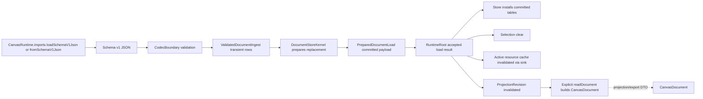
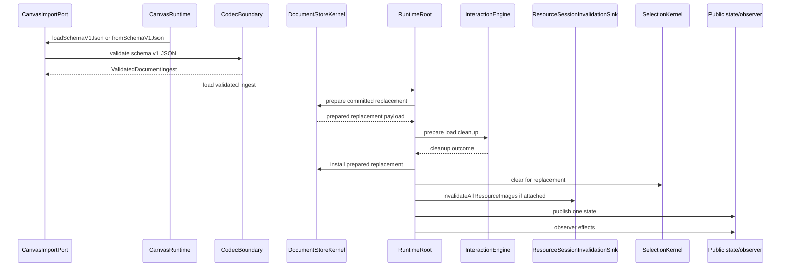

# Design: Load Projection Lifecycle

---
date: 2026-06-07
designer: Codex
commit: 968b297e
branch: new-architecture
design_question: "Design the cleanest and most effective architecture to close the load/projection lifecycle performance problem after the edit/store transaction path optimization."
---

## Disposition

READY_FOR_CONTRACT

## Product Outcome

Large-document import and load should use one validated ingest path that builds
the committed document representation directly. The engine should stop treating
public `CanvasDocument` as the canonical bulk-load input when the real load
source is schema data or an import stream. `CanvasDocument` remains the explicit
projection/export DTO returned by `readDocument`, not the mandatory intermediate
for runtime load.

Product decision from this workflow: public API compatibility is not a
constraint for this rebuild because there are no current users to protect. The
design therefore prioritizes a clean source-of-truth boundary and performance
over preserving `CanvasEditPort.loadDocument(CanvasDocument)`.

The clean public shape is part of this design, not a naming detail for later.
`CanvasRuntime.imports.loadSchemaV1Json(String json)` is the canonical public
replacement operation. `CanvasRuntime.fromSchemaV1Json(String json,
{CanvasRuntimeConfig config = const CanvasRuntimeConfig()})` is the canonical
initial large-document construction path. The ordinary `CanvasRuntime`
constructor creates an empty runtime. Public `CanvasDocument` is not a
canonical load, import, or initial seed input.

Non-goals:

- Do not eagerly warm `DocumentProjectionCache` during load.
- Do not introduce a long-lived second source of truth between import rows,
  committed store tables, and public projection DTOs.
- Do not couple `CodecBoundary` directly to `DocumentStoreKernel`.
- Do not optimize benchmark setup fixture generation in this design.
- Do not use benchmark-only production shortcuts.

This design intentionally changes public load/import API shape. A future Change
Contract must update source-of-truth docs, public API compile fixtures,
benchmarks, and adapters as part of the same migration.

## Target Contract Classification

- Profile: BEHAVIOR_CHANGE
- Obligations: BUG_FIX, SEAM_MIGRATION, PUBLIC_API_CHANGE

The future Change Contract changes public load/import behavior and internal
ownership. It also repairs existing staged-load drift: durable docs require a
prepared cleanup outcome and one atomic replacement boundary, while current
runtime code still performs imperative owner work around the install.

Performance success is locked to owner-observable metrics, not left to later
interpretation:

| Benchmark row / metric | Pixel 6 reference metric | Required second-track cap |
|---|---:|---:|
| `load_document.success/100k avg_us` | 967492 | <= 483746 |
| `load_document.success/100k p95_us` | 1035041 | <= 517520 |
| `load_document.success/100k max_us` | 1035041 | <= 517520 |
| `load_document.breakdown/50k avg_us` | 952821 | <= 476410 |
| `load_document.breakdown/50k decode_us` | 371778 | <= 185889 |
| `load_document.breakdown/50k load_document_us` | 499286 | <= 249643 |
| `load_document.breakdown/50k first_projection_us` | 51942 | <= 25971 |
| `projection.read_document/100k first_read_us` | 99466 | <= 49733 |
| `projection.read_document/100k avg_us` | 99237 | <= 49618 |
| `projection.read_document/100k allocation_bytes` | 13762560 | <= 6881280 |
| `projection.read_document/100k cache_hit_us` | 3 | <= 10 and must not regress into a scene-size operation |

If a fresh pre-change current report is used for implementation instead of the
listed reference report, the same rule applies as `current <= 50%` for the
listed owner metrics, with the cache-hit row capped as a bounded constant-time
operation rather than percentage-only proof.

## Research Inputs

- `.research/2026-06-06-pixel6-manual-baseline-hotspots.md` - existing hotspot
  analysis identifying load, projection, and benchmark-boundary facts before the
  edit/store optimization.
- No new `.research/` artifact was created by this workflow; current post-edit
  repository facts were confirmed through direct repository evidence below.

## Repository Evidence

`Evidence Consequence Link`: each fact below states the decision, boundary, unit,
proof surface, or review consequence it supports.

- Named exception: current user decision in this workflow, not repository-local
  evidence - no current users need API compatibility; this supports selecting a
  breaking import/load API when it produces a cleaner and faster architecture.
- `docs/contracts/public_api_v1.md:368` - current public runtime construction
  accepts `CanvasDocument? initialDocument`; this supports migrating initial
  large-document construction to the same schema ingest route as replacement
  load.
- `docs/contracts/public_api_v1.md:377` - `CanvasRuntime` currently exposes
  `CanvasEditPort` but no import/load port; this supports adding a dedicated
  public import port instead of hiding import semantics under edit.
- `tool/bench/manual/reference_reports/pixel6_android16_flutter_3_44_0.json:3399` - `projection.read_document/100k` is measured as a `projection_split` public read case; this supports keeping first projection as a direct proof target.
- `tool/bench/manual/reference_reports/pixel6_android16_flutter_3_44_0.json:3437` - `projection.read_document/100k` reports `first_read_us: 99466`, `cache_hit_us: 3`, and `allocation_bytes: 13762560`; this supports locking first-read/allocation caps while treating cache hit as a constant-time invariant.
- `tool/bench/manual/reference_reports/pixel6_android16_flutter_3_44_0.json:3682` - `load_document.success/100k` is the lifecycle public load benchmark row; this supports migrating the public benchmark to the new canonical load route.
- `tool/bench/manual/reference_reports/pixel6_android16_flutter_3_44_0.json:3720` - `load_document.success/100k` reports `loaded_element_count: 100000`, `avg_us: 967492`, `p95_us: 1035041`, and `max_us: 1035041`; this supports the load success performance cap.
- `tool/bench/manual/reference_reports/pixel6_android16_flutter_3_44_0.json:3857` - `load_document.breakdown/50k` is a lifecycle codec-fixture breakdown row; this supports making decode/import/load/projection phase proof explicit.
- `tool/bench/manual/reference_reports/pixel6_android16_flutter_3_44_0.json:3895` - `load_document.breakdown/50k` reports `decode_us: 371778`, `load_document_us: 499286`, and `first_projection_us: 51942`; this supports selecting a design that can attack codec/import work instead of treating decode as out of scope.
- `docs/_registry/benchmarks.yaml:523` - `projection.read_document` is registered as `new_only`, `query_read`, and `bulk_document_1k_10k_50k_100k`; this supports benchmark verification through the registry rather than an ad hoc probe.
- `docs/_registry/benchmarks.yaml:527` - `projection.read_document` uses `projection_split`, `per_sample_prepared_fixture`, primary timing `projection_action_total`, and primary memory `action`; this supports proving first-read behavior separately from setup.
- `docs/_registry/benchmarks.yaml:537` - `projection.read_document` requires `first_read_us` and `cache_hit_us`; this supports mandatory first-read and cache-hit proof.
- `docs/_registry/benchmarks.yaml:563` - `load_document.success` is registered as an `equivalent_legacy` bulk lifecycle case with allocation budget; this supports a future registry update because the selected design intentionally breaks legacy-equivalent public load shape.
- `docs/_registry/benchmarks.yaml:584` - `load_document.breakdown` is a `new_only` lifecycle breakdown case; this supports phase-level proof for decode/import/load/projection.
- `docs/_registry/benchmarks.yaml:598` - `load_document.breakdown` requires decode, runtime construction, load, first projection, loaded/projected counts, and allocation metrics; this supports retaining phase reporting after the benchmark route changes.
- `test/benchmarks/benchmark_probe_flutter.dart:1466` - the current success probe prepares an empty runtime and generated `CanvasDocument`, then measures `runtime.edits.loadDocument(document)`; this identifies the benchmark route that must migrate to the canonical ingest/load API.
- `test/benchmarks/benchmark_probe_flutter.dart:1512` - the current breakdown probe measures decode, runtime construction, load, and first projection separately; this supports preserving phase metrics while changing the decode/load path.
- `test/benchmarks/benchmark_probe_flutter.dart:1538` - current breakdown decode calls `decodeCanvasDocumentFromJson`; this identifies the public DTO materialization boundary to retire from canonical import.
- `test/benchmarks/benchmark_probe_flutter.dart:1555` - `_timedLoadDocument` wraps `runtime.edits.loadDocument(document)`; this identifies the load timing helper that must migrate to canonical ingest/load.
- `test/benchmarks/benchmark_probe_flutter.dart:1563` - `_timedFirstProjection` wraps `runtime.readDocument()`; this supports keeping first projection as explicit read-path proof.
- `test/benchmarks/benchmark_probe_flutter.dart:1838` - `projection.read_document` times first `runtime.readDocument()` and a second cache-hit read; this supports both first-read materialization and cache-hit invariants.
- `docs/contracts/codec_boundary.md:50` - codec entry points currently encode/decode `CanvasDocument`; this supports the PUBLIC_API_CHANGE/source-of-truth update requirement.
- `docs/contracts/public_api_v1.md:794` - the public schema v1 decode surface
  returns `CanvasDocument`; this supports retiring public DTO decode as the
  canonical runtime import route.
- `docs/contracts/codec_boundary.md:56` - documented decode algorithm validates schema and materializes a public immutable `CanvasDocument`; this identifies the source-of-truth rule that must change for canonical import.
- `docs/contracts/codec_boundary.md:72` - codec decode currently has no runtime/store side effects; this supports preserving no side effects while allowing codec to produce a store-neutral import payload.
- `docs/contracts/schema_v1.md:49` - schema v1 has a canonical JSON shape; this supports keeping schema v1 as the import wire format even if public DTO materialization is no longer mandatory.
- `docs/contracts/schema_v1.md:71` - schema v1 unknown-field and metadata roundtrip policy is documented; this supports keeping codec/schema validation as the owner of raw JSON policy.
- `docs/contracts/schema_v1.md:96` - schema decode rejects non-invertible transforms before public DTO materialization; this supports moving the same validation before import payload exposure.
- `docs/contracts/validation_limits.md:71` - validation is applied at schema decode and loadDocument materialization; this supports updating boundary wording to schema ingest and load replacement preparation.
- `docs/contracts/validation_limits.md:87` - transform admission must reject invalid transforms before runtime mutation/publication; this supports preserving rejection behavior in the new import path.
- `lib/src/codec/schema_v1_decoder.dart:24` - current schema v1 decoder materializes a `CanvasDocument`; this identifies the code owner to migrate or split.
- `lib/src/codec/schema_v1_decoder.dart:65` - decoder constructs `CanvasDocument` before reference validation; this supports replacing DTO construction with a validated import-row builder.
- `lib/src/codec/schema_v1_decoder.dart:78` - decoder validates document references after DTO materialization; this supports moving reference validation into the import builder before runtime/store effects.
- `lib/src/codec/validated_import_draft.dart:10` - current `ValidatedImportDraft` wraps a public `CanvasDocument`; this identifies the load validation helper to replace with import-row validation.
- `lib/src/codec/validated_import_draft.dart:27` - current validation checks duplicate resource ids and returns an unmodifiable set; this supports preserving diagnostics-compatible duplicate-id behavior in import validation.
- `lib/src/codec/validated_import_draft.dart:69` - current validation checks duplicate element ids, transform admission, and missing image resources; this supports preserving boundary validation while consolidating table construction.
- `lib/src/api/canvas_runtime.dart:40` - public `CanvasRuntime.readDocument()` delegates to `RuntimeRoot.readDocument`; this identifies the public projection entry boundary to keep.
- `lib/src/runtime/runtime_root.dart:737` - runtime `readDocument` delegates to `_store.readDocument`; this supports store ownership of public projection.
- `lib/src/store/document_store_kernel.dart:52` - `DocumentStoreKernel.readDocument` delegates to `DocumentProjectionCache.projectionFor`; this supports keeping projection cache in store.
- `lib/src/store/document_projection_cache.dart:12` - projection cache keys by committed `projectionRevision` and returns cached document on revision hit; this supports preserving one retained projection per revision.
- `lib/src/store/document_projection_cache.dart:20` - cache misses increment build count and build the public projection; this supports no-hidden-projection and first-read proof.
- `lib/src/store/document_projection_cache.dart:29` - `_buildProjection` materializes public `CanvasDocument` from committed store facts; this supports optimizing projection under store ownership.
- `lib/src/contracts/public/canvas_document.dart:23` - `CanvasDocument` freezes input collections with `List.unmodifiable`; this supports treating `CanvasDocument` as projection/export DTO with immutable public behavior.
- `lib/src/contracts/public/canvas_document.dart:41` - `CanvasDocument` validates total element count; this supports moving equivalent count validation into the schema/import boundary.
- `lib/src/store/committed_document.dart:16` - `CommittedDocument.withRevisions` currently builds committed resource and element tables from a public document; this identifies the conversion point to bypass for canonical import.
- `lib/src/store/committed_document.dart:20` - committed construction builds `ResourceTable` from `document.resources`; this supports moving replacement resource table construction into store-owned import consumption.
- `lib/src/store/committed_document.dart:29` - committed construction builds `ElementRegistry` from background elements, layers, and resource ids; this supports store ownership of bulk element admission/order facts.
- `lib/src/store/element_registry.dart:15` - `ElementRegistry` materializes one aligned committed element registry snapshot; this supports using a single store-owned builder for import replacement.
- `lib/src/store/element_registry.dart:20` - the registry constructor accepts background elements, layers, and resource ids and builds family/layer/order/admission facts; this supports reusing or replacing that logic behind a store-owned ingest builder.
- `lib/src/store/family_tables.dart:12` - family tables are the single admission and projection owner for all element kinds; this supports keeping element-family conversion under store, not public DTO constructors.
- `lib/src/store/resource_table.dart:7` - `ResourceTable` admits resources, copies rows, and builds descriptor facts; this supports replacement resource descriptor preparation in the store payload.
- `lib/src/edit/staged_document_load.dart:54` - current load preparation creates `ValidatedImportDraft.fromDocument`; this identifies the current DTO-based load preparation owner to migrate.
- `lib/src/edit/staged_document_load.dart:60` - current `PreparedDocumentLoad` stores a `CanvasDocument` plus id sets and revision delta; this supports replacing the DTO payload with a prepared committed replacement payload.
- `lib/src/edit/staged_document_load.dart:70` - prepared load consumption already has owner-token and one-shot checks; this supports preserving the one-shot prepared boundary while changing the payload type.
- `lib/src/edit/staged_document_load.dart:81` - current load consumption calls `_store.replaceDocument(load.document, load.revisionDelta)`; this identifies the install seam to retire.
- `lib/src/edit/edit_kernel.dart:161` - public `loadDocument` enters through `EditKernel.loadDocument`; this supports either migrating that method to a new import payload or retiring it behind a new load/import port.
- `docs/contracts/public_api_v1.md:1346` - `CanvasEditPort` currently owns
  `loadDocument(CanvasDocument)`; this supports retiring document replacement
  from the edit port and moving canonical import/load to `CanvasImportPort`.
- `lib/src/api/canvas_runtime.dart:28` - the public facade currently constructs
  `RuntimeRoot` from `initialDocument ?? CanvasDocument()`; this identifies the
  public constructor seam that must stop being the large-document ingest route.
- `lib/src/edit/edit_kernel.dart:163` - load is rejected inside an active edit callback; this supports preserving nested-mutation behavior for the new canonical load API.
- `lib/src/runtime/runtime_root.dart:211` - runtime composes `EditKernel` with store reads, sparse commits, edit delivery, and `_loadDocument`; this supports keeping runtime as cross-owner orchestrator after API migration.
- `lib/src/runtime/runtime_root.dart:1504` - current `_loadDocument` prepares, runs cleanup, consumes the prepared load, clears selection, initializes camera, advances epoch, and delivers effects; this identifies the ordering to repair and optimize.
- `lib/src/contracts/internal/load_interaction_boundary.dart:10` - the test/internal load interaction seam returns `LoadInteractionCleanupOutcome`; this supports using immutable prepared cleanup facts.
- `lib/src/interaction/interaction_engine.dart:233` - interaction cleanup returns `InteractionCleanupOutcome`; this supports adapting runtime to consume returned cleanup facts instead of relying on side effects alone.
- `lib/src/runtime/runtime_root.dart:2499` - load effects include projection, spatial document replacement, resource document replacement, repaint, selection, and public state effects; this supports preserving effect taxonomy.
- `docs/contracts/load_document.md:36` - current public contract names `CanvasEditPort.loadDocument(document)` as the external replacement operation; this supports mandatory source-of-truth update for the new canonical API.
- `docs/contracts/load_document.md:40` - runtime owns the atomic cross-owner replacement operation; this supports keeping runtime orchestration.
- `docs/contracts/load_document.md:52` - interaction boundary must return `LoadInteractionCleanupOutcome` before install; this supports making prepared cleanup an accepted-result input.
- `docs/contracts/load_document.md:56` - runtime must not call the interaction boundary after install; this supports preserving no post-install interaction owner calls.
- `docs/contracts/load_document.md:67` - success ordering validates input, materializes prepared load, requests cleanup, atomically installs replacement plus selection clear, initializes camera, invalidates caches, and publishes one state; this supports required execution order after API migration.
- `docs/contracts/load_document.md:86` - `PreparedDocumentLoad` owns replacement committed tables, id admission state, and replacement revision facts; this supports changing code from DTO payload to committed payload.
- `docs/contracts/load_document.md:97` - failure ordering leaves interaction, committed document, selection, camera, repaint, public state, and actions unchanged; this supports all-or-nothing failure proof.
- `docs/contracts/operation_matrix.md:294` - operation matrix defines `loadDocument success` as whole-document touch plus selection clear plus prepared interaction cleanup outcome; this supports semantic parity proof.
- `docs/contracts/operation_matrix.md:314` - load resource effect must replace descriptors, invalidate resource caches, and clear surface-session resource state; this supports including active resource-image cache invalidation in the accepted load result.
- `docs/contracts/resources.md:63` - runtime holds `SurfaceResourceSessionLifecycle`,
  which extends `ResourceSessionInvalidationSink` with `drop()`; this supports
  choosing the invalidation side, not the lifecycle-drop side, for document
  replacement.
- `docs/contracts/resources.md:115` - detach, dispose, runtime swap, and runtime
  disposal use `drop()`; this supports rejecting `drop()` for ordinary load
  replacement because load does not detach or swap the active surface.
- `docs/contracts/resources.md:200` - mark-all resource dirty clears the active
  session cache through the invalidation sink when attached; this supports using
  `invalidateAllResourceImages()` as the replacement resource-cache outcome.
- `lib/src/contracts/internal/resource_session_invalidation_sink.dart:3` -
  `ResourceSessionInvalidationSink` exposes targeted and all-resource cache
  invalidation; this identifies the seam load replacement must use.
- `lib/src/contracts/internal/surface_resource_session_lifecycle.dart:3` -
  `SurfaceResourceSessionLifecycle` adds `drop()` on top of invalidation; this
  identifies the lifecycle operation that load replacement must avoid.
- `lib/src/resources/surface_resource_session.dart:184` -
  `invalidateAllResourceImages()` clears the cache without clearing resolver or
  marking the session dropped; this supports preserving attached
  surface/resolver lifecycle across load.
- `lib/src/resources/surface_resource_session.dart:189` - `drop()` marks the
  session dropped, clears resolver state, and increments resolver generation;
  this supports rejecting drop semantics for document replacement.
- `lib/src/runtime/runtime_root.dart:1644` - runtime already forwards dirty
  resource outcomes to the active `ResourceSessionInvalidationSink`; this
  supports reusing the existing invalidation seam for load replacement.
- `lib/src/runtime/runtime_root.dart:1659` - runtime drops active surface
  resource sessions only through a distinct lifecycle helper; this supports a
  negative proof that load replacement does not call the drop helper.
- `docs/architecture/03_data_model.md:49` - store does not store public `CanvasDocument` as live mutable state and stores compact committed tables; this supports not retaining DTOs as prepared load state.
- `docs/architecture/03_data_model.md:68` - sparse edits already prepare and install against committed tables without creating or retaining public `CanvasDocument`; this supports extending the same source-of-truth principle to bulk import/load.
- `docs/architecture/03_data_model.md:150` - public runtime observation is one immutable state snapshot after a change reaches its owner; this supports one post-install load publication.
- `docs/architecture/03_data_model.md:216` - projection cache is lazy, one retained document per projection revision, and built only by explicit read/encode/test/draft-read paths; this supports rejecting eager projection warmup during load.
- `docs/contracts/cache_policy.md:43` - `DocumentProjectionCache` is store-owned, keyed by `projectionRevision`, and not allowed in pointer/paint/hit/edit commit hot paths; this supports preserving projection as explicit read-path behavior.
- `docs/contracts/edit_kernel.md:95` - ordinary edit routes open sparse sessions and avoid public projection; this supports avoiding regression of the completed edit/store track.
- `test/store/fixtures/no_projection_hot_path_fixture.dart:38` - existing fixture proves projection builds only through explicit `readDocument`; this supports adding load-specific no-hidden-projection proof.
- `test/runtime/fixtures/load_document_state_publication_fixture.dart:27` - runtime fixture proves successful load publishes one state/effects batch; this supports preserving single-publication behavior.
- `test/runtime/fixtures/load_document_state_publication_fixture.dart:84` - runtime fixture proves failed load has no side effects; this supports rollback/all-or-nothing proof.
- `test/runtime/fixtures/load_document_ordering_fixture.dart:26` - ordering fixture proves failed load does not call the interaction boundary; this supports preserving no-interrupt-before-success behavior.
- `test/runtime/fixtures/load_document_ordering_fixture.dart:55` - ordering fixture proves prepared cleanup failure has no state/effect/action side effects; this supports pre-irreversible cleanup failure handling.
- `test/runtime/fixtures/load_document_ordering_fixture.dart:97` - success ordering fixture records `prepared-cleanup`, `state`, then `observer`; this supports runtime observation order proof.
- `test/runtime/load_document_ordering_fixture_shape_test.dart:9` - fixture-shape test rejects deferred cleanup surfaces; this supports seam-level negative proof.
- `tool/guardrails/src/guardrail_executor.dart:297` - load guardrails map to ordering and fixture-shape tests; this supports reusing guardrail enforcement after seam migration.
- `tool/guardrails/src/store_projection_checks.dart:143` - projection guardrail is a structural scan, not whole-program flow proof; this supports adding semantic load/projection fixtures instead of relying only on AST checks.

## Design Form Candidates

### Candidate A. Tune Existing DTO Replacement

- Form: keep `PreparedDocumentLoad.document` as the install payload, remove only
  local inefficiencies from `ValidatedImportDraft` and `replaceDocument`.
- Why it could work: it is the smallest code change.
- Gate failures or risks: it preserves the wrong canonical boundary. Bulk import
  would still be JSON/schema -> public DTO -> validation draft -> committed
  tables -> public DTO projection. This fails the new product constraint because
  it protects a compatibility shape the user explicitly deprioritized.

### Candidate B. Store-Owned Prepared Replacement From Public DTO

- Form: keep `loadDocument(CanvasDocument)` as the canonical public load input,
  but prepare a store-owned replacement payload before install.
- Why it could work: it fixes the duplicate DTO install payload and aligns code
  with current load docs.
- Gate failures or risks: it still requires public DTO materialization before
  load. It cannot reduce the large `decode_us` component and keeps public
  `CanvasDocument` as the import input even though there is no compatibility
  reason to do so.

### Candidate C. Codec Directly Imports Store

- Form: make codec/schema decoder create `CommittedDocument` or
  `PreparedDocumentReplacement` directly by importing store.
- Why it could work: it is mechanically direct and attacks decode/load
  duplication.
- Gate failures or risks: it breaks dependency direction and source-of-truth
  separation. `CodecBoundary` currently owns schema validation with no
  runtime/store side effects (`docs/contracts/codec_boundary.md:72`); store owns
  committed tables (`docs/architecture/03_data_model.md:49`). Direct codec-store
  coupling would make schema parsing know committed-store internals.

### Candidate D. Canonical Document Ingest Boundary

- Form: introduce a store-neutral validated document ingest payload as the
  canonical import/load boundary. Public runtime exposes a dedicated
  `CanvasImportPort` through `CanvasRuntime.imports`, with
  `loadSchemaV1Json(String json)` as the canonical replacement operation.
  Initial large-document construction uses `CanvasRuntime.fromSchemaV1Json`
  through the same ingest boundary; the ordinary runtime constructor creates an
  empty document. Codec/schema decode validates raw schema v1 input into
  immutable import rows or streams them into a store-neutral builder interface.
  Store consumes that validated ingest payload to prepare a committed
  replacement snapshot and id-admission state. Runtime accepts that prepared
  replacement together with prepared interaction cleanup, selection clear,
  active resource-session cache invalidation, and projection invalidation as one
  atomic load result. Load replacement does not drop the attached
  `SurfaceResourceSession` and does not clear the app resolver. Public
  `CanvasDocument` is produced only by explicit projection reads or
  export/encode paths.
- Why it could work: it removes the unnecessary public DTO intermediate,
  preserves dependency direction, keeps codec validation and store committed
  ownership separate, allows full breakdown improvement including decode/import
  work, and aligns with the repository's compact committed-table model.
- Gate failures or risks: it is a breaking API and source-of-truth migration.
  Benchmarks, docs, public compile fixtures, and tests must move to the new
  canonical load/import route in the same contract.

## Known Future Pressures

| Pressure | Evidence | How the selected form responds | Accepted cost or risk |
|---|---|---|---|
| Public API compatibility is no longer a product constraint. | User decision in this workflow. | Selects a breaking canonical ingest boundary instead of preserving `loadDocument(CanvasDocument)` or `initialDocument` as bulk-load inputs. | Future contract must update public docs/tests/fixtures deliberately. |
| Current public API also accepts initial documents as DTOs. | `docs/contracts/public_api_v1.md:368`, `lib/src/api/canvas_runtime.dart:28` | Moves initial large-document construction to `CanvasRuntime.fromSchemaV1Json` so replacement and initial load share one ingest boundary. | Many tests that seed runtime through DTOs must move to fixtures, schema ingest, or internal builders. |
| Decode cost dominates enough that load-only changes may miss full breakdown 2x. | `tool/bench/manual/reference_reports/pixel6_android16_flutter_3_44_0.json:3895` | Moves schema decode/import into the selected optimization scope without coupling codec to store. | Larger migration than DTO-only store replacement. |
| Codec docs currently require public DTO materialization. | `docs/contracts/codec_boundary.md:56`, `docs/contracts/codec_boundary.md:71` | Future contract must update codec source of truth to validated ingest payload materialization. | Source-of-truth docs and codec tests must change together. |
| Store docs already reject public DTO as live state. | `docs/architecture/03_data_model.md:49`, `docs/architecture/03_data_model.md:68` | Extends committed-table source-of-truth from sparse edit to bulk import/load. | Requires a new import payload that is not a second committed source. |
| Current durable load docs describe prepared committed payloads, but code installs a DTO. | `docs/contracts/load_document.md:86`, `lib/src/edit/staged_document_load.dart:60`, `lib/src/edit/staged_document_load.dart:81` | Migrates implementation to prepared replacement payload and updates docs only for new public ingest names. | Existing load tests need route updates. |
| Current runtime ignores returned cleanup outcomes. | `docs/contracts/load_document.md:52`, `lib/src/runtime/runtime_root.dart:1516`, `lib/src/contracts/internal/load_interaction_boundary.dart:10` | Makes prepared cleanup outcome part of accepted load result. | Correctness alignment must precede performance claims. |
| Resource/session invalidation is documented but not directly delivered by current load code. | `docs/contracts/operation_matrix.md:314`, `docs/contracts/resources.md:63`, `lib/src/runtime/runtime_root.dart:1644` | Includes `ResourceSessionInvalidationSink.invalidateAllResourceImages()` in the accepted load result when a sink is attached. | Existing session/resolver attachment is preserved; tests must prove load does not call `SurfaceResourceSessionLifecycle.drop()`. |
| Public projection/export still needs a full DTO. | `docs/architecture/03_data_model.md:216`, `lib/src/store/document_projection_cache.dart:29` | Keeps `CanvasDocument` as explicit projection/export DTO and optimizes materialization there. | First read/export remains O(document), but must avoid avoidable churn. |

## Selected Form

Use Candidate D: canonical document ingest boundary.

The future implementation should change the architecture as follows:

1. Replace `CanvasDocument` as the canonical bulk-load input with a validated
   document ingest payload. Public replacement load must be exposed as
   `CanvasRuntime.imports.loadSchemaV1Json(String json)`, where
   `CanvasRuntime.imports` returns `CanvasImportPort`. Initial large-document
   construction must use `CanvasRuntime.fromSchemaV1Json(String json,
   {CanvasRuntimeConfig config = const CanvasRuntimeConfig()})` and the same
   ingest/store-preparation path. The ordinary constructor creates an empty
   document and no longer accepts `CanvasDocument? initialDocument`.
2. Keep `CanvasDocument` as the explicit projection/export DTO returned by
   `readDocument` and consumed by explicit export/encode APIs.
3. Split codec responsibility from store responsibility with a store-neutral
   ingest contract. Codec/schema code owns raw JSON parsing, schema validation,
   unknown-field policy, metadata validation, primitive limits, duplicate-id
   checks, transform admission, and missing-reference rejection. It returns
   immutable validated import rows or emits them through a store-neutral builder
   interface, with no runtime/store side effects.
4. `DocumentStoreKernel` owns conversion from validated import rows into
   committed `ResourceTable`, `ElementRegistry`, `FamilyTables`, `LayerTable`,
   descriptor facts, id admission state, revision state, summary, and persisted
   camera facts.
5. `PreparedDocumentLoad` owns a one-shot prepared committed replacement payload,
   not a public `CanvasDocument`. It carries store-prepared replacement facts,
   import summary, persisted camera facts, generated-id admission state,
   replacement revision facts, diagnostic-compatible failure behavior, owner
   token, and consumed flag.
6. `RuntimeRoot` remains the cross-owner orchestrator. It requests prepared
   interaction cleanup only after the replacement payload is ready, captures the
   returned cleanup outcome, captures the current
   `ResourceSessionInvalidationSink` for replacement cache invalidation, then
   accepts store replacement, selection clear, runtime view camera
   initialization, preview cleanup facts, active resource-cache invalidation, and
   delivery effects as one atomic load result. The resource outcome is
   `invalidateAllResourceImages()` on the attached sink, if present; load
   replacement must not call `SurfaceResourceSessionLifecycle.drop()` and must
   not clear or replace the app resolver.
7. The irreversible point is accepted runtime/store replacement. All fallible
   schema/import validation, committed-table preparation, and prepared cleanup
   happen before it.
8. After the irreversible point, delivery work is infallible, failure-contained,
   or already part of the accepted result: spatial rebuild, projection
   invalidation, active resource-cache invalidation through the attached
   invalidation sink, repaint scheduling, one public state publication, and
   observer delivery.
9. `DocumentProjectionCache` remains lazy and store-owned. Import/load
   invalidates projection by `projectionRevision`; it does not build public
   `CanvasDocument`.
10. Projection optimization happens inside the projection owner by reducing
    avoidable materialization churn in `_buildProjection` while preserving one
    retained immutable `CanvasDocument` per `projectionRevision`. It must not
    expose mutable committed-store internals or introduce a live DTO source of
    truth.
11. Benchmarks must migrate to the canonical ingest route. `load_document`
    timing should measure schema/import ingest plus accepted runtime load;
    `projection.read_document` should still measure explicit first projection
    and cache hit.

This design is intentionally more invasive than a DTO-preserving patch. It is
cleaner because each durable representation has one role: schema JSON is import
wire format, validated ingest rows are transient boundary data, committed store
tables are runtime truth, and `CanvasDocument` is projection/export output.

## Decision Trace

Preserve `Decision Chain Of Custody`: source inputs and locked decisions must
map to the future contract field, execution unit, or proof surface that carries
them forward.

| Decision ID | Decision | Evidence | Contract handoff target |
|---|---|---|---|
| D1 | Public load/import API compatibility is not a constraint; breaking API is allowed for cleaner import/load architecture. | User decision in this workflow, `docs/contracts/load_document.md:36`, `docs/contracts/codec_boundary.md:50`, `docs/contracts/public_api_v1.md:368`, `docs/contracts/public_api_v1.md:1346` | `Compatibility`, `Public API Change`, source-of-truth docs unit |
| D2 | Make validated document ingest, not public `CanvasDocument`, the canonical bulk-load boundary through `CanvasRuntime.imports.loadSchemaV1Json` and `CanvasRuntime.fromSchemaV1Json`. | `docs/contracts/codec_boundary.md:56`, `docs/contracts/public_api_v1.md:794`, `lib/src/codec/schema_v1_decoder.dart:65`, `lib/src/edit/staged_document_load.dart:60`, `tool/bench/manual/reference_reports/pixel6_android16_flutter_3_44_0.json:3895` | `Boundaries.Entry`, public import port unit, codec/import execution unit, benchmark route migration |
| D3 | Keep codec and store decoupled through a store-neutral import payload/builder. | `docs/contracts/codec_boundary.md:72`, `docs/architecture/03_data_model.md:49`, `lib/src/store/element_registry.dart:15` | `Boundaries.Dependency Direction`, ingest contract unit |
| D4 | Store owns committed replacement preparation from validated ingest rows. | `docs/architecture/03_data_model.md:49`, `lib/src/store/committed_document.dart:20`, `lib/src/store/committed_document.dart:29`, `lib/src/store/family_tables.dart:12` | `Boundaries.Source of Truth`, store replacement unit |
| D5 | Runtime remains cross-owner load orchestrator and consumes prepared interaction cleanup outcome before install. | `docs/contracts/load_document.md:40`, `docs/contracts/load_document.md:52`, `lib/src/runtime/runtime_root.dart:1504`, `lib/src/contracts/internal/load_interaction_boundary.dart:10` | `Execution Order`, prepared cleanup unit |
| D6 | Accepted load result includes store replacement, selection clear, view camera initialization, `ResourceSessionInvalidationSink.invalidateAllResourceImages()` without session drop, projection invalidation, and one public state publication. | `docs/contracts/load_document.md:67`, `docs/contracts/operation_matrix.md:294`, `docs/contracts/operation_matrix.md:314`, `docs/contracts/resources.md:63`, `docs/contracts/resources.md:115`, `lib/src/runtime/runtime_root.dart:1644`, `lib/src/runtime/runtime_root.dart:1659` | `All-Or-Nothing Failure Boundary`, runtime/resource/selection units |
| D7 | Keep projection lazy and explicit; import/load must not build `DocumentProjectionCache`. | `docs/architecture/03_data_model.md:216`, `docs/contracts/cache_policy.md:43`, `test/store/fixtures/no_projection_hot_path_fixture.dart:38` | no-hidden-projection proof surface |
| D8 | Optimize first projection only inside the store-owned projection materializer. | `lib/src/store/document_projection_cache.dart:20`, `lib/src/store/document_projection_cache.dart:29`, `lib/src/contracts/public/canvas_document.dart:23` | projection materializer unit |
| D9 | Migrate benchmarks to the canonical ingest route while preserving phase metrics and caps. | `docs/_registry/benchmarks.yaml:563`, `docs/_registry/benchmarks.yaml:584`, `test/benchmarks/benchmark_probe_flutter.dart:1466`, `test/benchmarks/benchmark_probe_flutter.dart:1512` | benchmark registry/probe unit, performance proof through `CanvasRuntime.imports.loadSchemaV1Json` |
| D10 | Update codec/load/cache/data-model docs and durable diagrams in the future contract. | `docs/contracts/codec_boundary.md:50`, `docs/contracts/load_document.md:36`, `docs/diagrams/seq_load_document_success.mmd:36`, `docs/diagrams/dfd_load_document_success_failure.mmd:74` | `Source-Of-Truth Updates`, docs/diagram unit |

## Outcome-Proof Fit

| Claim | Direct outcome | Proxy risk | Required proof surface or strategy |
|---|---|---|---|
| Canonical load no longer materializes public `CanvasDocument`. | Schema/import benchmark and load path produce a prepared committed replacement without constructing `CanvasDocument` before install. | Load could be faster from local tuning while still carrying DTO materialization. | Structural guardrail and semantic counters proving `CanvasRuntime.imports.loadSchemaV1Json` and `CanvasRuntime.fromSchemaV1Json` do not call `CanvasDocument` constructors or `decodeCanvasDocumentFromJson`; tests may allow explicit projection/export routes separately. |
| Codec remains decoupled from store. | Codec outputs a store-neutral ingest payload or calls a store-neutral builder interface; it imports no store/runtime modules. | Direct store imports could pass performance tests while corrupting layer ownership. | Import-boundary guardrail plus dependency scan for codec imports and positive tests for ingest payload validation. |
| Store remains the committed source of truth. | Store consumes validated ingest rows and creates the committed replacement snapshot, id admission, descriptor facts, and revisions. | A parallel import row cache could become another committed representation. | Store tests assert prepared payload is transient/one-shot and no long-lived import rows or public DTOs are retained as live state. |
| Load replacement stays all-or-nothing. | Failed schema/import validation or prepared cleanup failure leaves committed document, selection, camera, preview, interaction, projection cache, spatial index, active resource session/resolver, public state, actions, and observers unchanged. Successful load clears active resource-image cache through `invalidateAllResourceImages()` without dropping the session. | Checking only document content could miss selection, preview, resource cache, resolver attachment, or projection changes. | Extended load ordering/state/resource fixtures snapshot all owners around success/failure and assert no `drop()` call on load. |
| Runtime consumes prepared cleanup outcome. | Runtime derives preview publication/repaint facts from an immutable outcome captured before install; no interaction owner call runs after install. | Tests might pass because interaction side effects happened before install while outcome is ignored. | Fixture where boundary returns `previewChanged: true` without post-install access, plus fixture-shape guard rejecting deferred cleanup. |
| Import/load does not build public projection. | `projectionBuildCount` remains unchanged through successful and failed canonical load; first explicit `readDocument` builds once; second read hits cache. | Structural scan may miss indirect projection reads. | Semantic `projectionBuildCount` fixture plus projection guardrail expansion for ingest/load routes. |
| First projection is optimized without weakening DTO immutability. | First `readDocument` returns correct immutable `CanvasDocument` shape with lower time/allocation; cache hit returns same object for the revision. | Projection could improve by exposing mutable store lists or weakening public DTO ownership. | Projection tests assert equality, unmodifiable collections, cache-hit identity, new object after projection revision change, and no mutable store alias leak. |
| Performance proof is public and phase-complete. | Registered benchmark route hits the new canonical ingest/load path and meets the caps for success, breakdown phases, first projection, and cache hit. | Private helper microbenchmarks could pass while public import/load remains slow. | Update benchmark manifest/probe, run registered cases, and compare to pinned reference or fresh pre-change current report. |

## Hard Gate Check

| Gate | Result | Evidence |
|---|---|---|
| Owner-Level Fix | pass | The selected form changes the schema/import/load/store ownership chain identified by `lib/src/codec/schema_v1_decoder.dart:65`, `lib/src/edit/staged_document_load.dart:60`, and `lib/src/edit/staged_document_load.dart:81`, not individual benchmark callbacks. |
| Ownership | pass | Codec owns schema validation, store owns committed tables, runtime owns cross-owner acceptance, interaction owns cleanup, and projection remains store-owned (`docs/contracts/codec_boundary.md:72`, `docs/architecture/03_data_model.md:49`, `docs/contracts/load_document.md:40`, `docs/contracts/cache_policy.md:43`). |
| Source-Of-Truth Singularity | pass | Schema JSON is wire format, validated ingest payload is transient boundary data, committed tables are runtime truth, and `CanvasDocument` is explicit projection/export output. No long-lived duplicate committed state is introduced. |
| Boundary-Owned Policy | pass | Raw JSON/schema policy stays in codec/schema; committed-table admission stays in store; runtime orchestration stays in runtime; public observation stays after accepted owner changes. |
| Negative Proof And Fixture Quarantine | pass | Negative proof uses production seams, structural guardrails, public benchmark routes, projection counters, and load fixtures; fixture-only values do not enter public schemas or durable docs. |
| Dependency direction | pass | Codec must not import store/runtime; store must not import runtime/interaction/frame/tests; runtime composes owners through internal seams. |
| State/data | pass | Import payload is transient; committed replacement state/id admission/descriptors/revisions/projection cache stay in store; selection state stays in selection; cleanup outcome stays interaction-owned; resource session stays resource/runtime-owned. |
| Sequenced Migration And Retirement | pass | Successor seam is validated ingest payload -> store prepared replacement -> runtime accepted load. Retired seam is schema/public DTO as canonical load or initial input and `PreparedDocumentLoad.document -> replaceDocument(CanvasDocument)`. |
| Temporal Surface Closure | pass | Invariant: no public observation before accepted replacement. Synchronous surfaces are import/load call, prepared cleanup, active resource-cache invalidation, store install, selection clear, state listeners, action stream, and observer. Runtime mutation guard rejects reentrant public mutation with no mutation. |
| All-Or-Nothing Failure Boundary | pass | Irreversible point is accepted runtime/store replacement. Fallible schema/import validation, store replacement preparation, prepared cleanup, and persisted-camera capture happen before it; later delivery is infallible, contained, or accepted. |
| Outcome-Proof Fit | pass | Direct outcomes, proxy risks, and required proof surfaces are mapped in `Outcome-Proof Fit`. |
| Verification | pass | Existing load/projection fixtures plus targeted import-boundary, guardrail, API, and benchmark updates can prove the form. |
| Future pressure | pass | API break, codec docs, benchmark route migration, resource session cleanup, sparse edit regression, and projection/export needs are assessed in `Known Future Pressures`. |

## Lock-Required Facts

- Owner: `CodecBoundary` owns schema v1 raw JSON parsing and validation into a
  store-neutral ingest payload; `DocumentStoreKernel` owns committed replacement
  preparation and projection; `RuntimeRoot` owns accepted cross-owner load
  result; `InteractionEngine` owns prepared cleanup; `SelectionKernel` owns
  selection clear; runtime/resource owner owns active resource-cache
  invalidation through `ResourceSessionInvalidationSink`.
- Owning layer/module/document family: public import declarations under
  `lib/src/contracts/public/canvas_import_port.dart` and
  `lib/src/api/canvas_runtime.dart`; codec/schema code under `lib/src/codec`;
  store-neutral ingest contracts under
  `lib/src/contracts/internal/document_ingest.dart`; committed replacement under
  `lib/src/store`; load orchestration under `lib/src/runtime` and edit only
  where ordinary edit transactions remain.
- Seam: replace canonical `CanvasDocument` bulk-load input with validated
  document ingest payload; replace `PreparedDocumentLoad.document ->
  _store.replaceDocument` with `PreparedDocumentLoad.preparedReplacement ->
  _store.installPreparedReplacement`; keep `DocumentProjectionCache.projectionFor`
  as explicit read path.
- Dependency/import direction: codec may depend on public value validators and
  store-neutral ingest contracts, not store/runtime; store may consume ingest
  payload and public value types as row values, not codec internals; runtime
  composes load/interaction/selection/resource/store owners.
- State/data ownership: schema JSON is external input; ingest payload is
  transient and immutable; committed tables/id admission/descriptors/revisions
  are store truth; public `CanvasDocument` is projection/export output; selected
  ids remain selection state; cleanup outcome is interaction output.
- Entry boundaries: `CanvasRuntime.imports.loadSchemaV1Json(String json)` for
  replacement import/load; `CanvasRuntime.fromSchemaV1Json(String json,
  {CanvasRuntimeConfig config = const CanvasRuntimeConfig()})` for initial
  large-document construction; public read/export projection API; and test-only
  load interaction boundary. There is no canonical
  `loadDocument(CanvasDocument)` or `initialDocument` DTO entry.
- Exit boundaries: accepted store replacement, selection clear,
  `ResourceSessionInvalidationSink.invalidateAllResourceImages()` on the active
  sink if attached, projection invalidation, spatial replacement rebuild,
  repaint effects, one public state publication, observer effects, and explicit
  `readDocument` projection.
- File placement basis: public import port declaration under public contracts;
  runtime facade exposure under API; schema parsing/validation under codec;
  ingest contract under internal contracts; committed ingest consumption under
  store; load acceptance under runtime; projection materialization under store.
- Execution order constraints: import/load guard -> schema/import validation to
  transient ingest payload -> store prepares committed replacement -> runtime
  prepares interaction cleanup outcome -> runtime captures active
  `ResourceSessionInvalidationSink` -> irreversible accepted load result
  installs store replacement and selection clear -> initialize runtime view
  camera/revisions from prepared facts -> invalidate projection/spatial/frame
  owners -> call `invalidateAllResourceImages()` on the captured sink if
  attached -> publish one state -> observer delivery.
- `Temporal Surface Closure` invariant, synchronous callback surfaces,
  guard/boundary owner, public observation order, and expected rejection/no-
  mutation signal: No observer sees partial import/load state. Synchronous
  surfaces are import/load call, prepared cleanup boundary, active resource-cache
  invalidation sink call, state listeners, action stream, and commit-effect
  observer. Runtime mutation guard rejects reentrant public mutation with the
  existing guarded mutation signal and no mutation. Public order is prepared
  cleanup before install, then state, then observer; load emits no user action
  and does not call the app resource resolver.
- `All-Or-Nothing Failure Boundary` irreversible point, fallible-before-
  irreversible work, later infallible/failure-contained/accepted work, failure
  projection, and proof surface: Irreversible point is accepted replacement
  state swap across store/selection/runtime/resource owners. Fallible work
  before it includes schema/import validation, committed table construction,
  id/resource/transform checks, diagnostics recording, prepared interaction
  cleanup, and persisted-camera capture. Later work is projection invalidation,
  spatial rebuild, active resource-cache invalidation through
  `ResourceSessionInvalidationSink.invalidateAllResourceImages()`, repaint,
  state publication, and observer delivery; observer failure remains contained.
  Failure projection is existing public exception/no-op signal with unchanged
  owners, including unchanged active surface session/resolver attachment.
- Rejected alternatives: DTO tuning only; store-owned replacement while keeping
  `CanvasDocument` as canonical load or initial input; eager projection warmup
  during load; direct codec-store coupling.
- Verification strategy: import validation tests, dependency guardrails, load
  success/failure/order fixtures, active resource-cache invalidation without
  session drop, no hidden projection, projection immutability/cache identity,
  public API compile fixture updates, source-of-truth docs checks, and
  registered benchmarks against caps.

## Diagram Need Assessment

| Design question | Needed? | Diagram kind | Reason |
|---|---:|---|---|
| Does the design change ownership, layer, package, or component boundaries? | yes | c4 | It introduces a canonical ingest boundary between codec/schema and store while retiring public DTO as load input. |
| Does it change data flow, state ownership, cache ownership, resource movement, or lifecycle movement? | yes | data_flow | The main decision is data movement: schema JSON -> validated ingest -> committed replacement -> lazy projection. |
| Does it depend on call order, lifecycle order, sync/async ordering, failure ordering, or migration order? | yes | sequence | All-or-nothing load acceptance depends on exact ordering around validation, cleanup, store install, selection/resource cleanup, and publication. |
| Does it introduce or alter observer/listener/callback delivery, guard windows, public-state publication, or reentrancy-sensitive ordering? | yes | sequence | It preserves state/observer delivery order and mutation guard windows while changing accepted load inputs. |
| Does it introduce or alter modes, statuses, terminal states, sessions, or transition rules? | no | none | It adds no durable mode/status state; ingest and prepared replacement payloads are transient. |
| Does it create, replace, migrate, or retire a shared seam under `Sequenced Migration And Retirement`? | yes | c4/data_flow/sequence | It retires `CanvasDocument` as canonical load input and retires DTO install payload. |
| Does it change public API consumer flow, payload shape, or compatibility behavior? | yes | data_flow | The canonical public load/import route changes from DTO to ingest/schema input. |
| Does it introduce or change analyzer, guardrail, or structural-recognition pipeline behavior? | yes | data_flow | Future proof must add dependency and no-DTO-hot-import guardrails. |

## Provisional Diagrams

## Source-Of-Truth Impact

`Source-Of-Truth Singularity`: durable meaning must have one owning source of
truth and a real human or machine consumer. The future contract must update
these source-of-truth surfaces:

- `docs/contracts/public_api_v1.md`: replace `CanvasRuntime({initialDocument})`
  with empty construction plus `CanvasRuntime.fromSchemaV1Json`, add
  `CanvasRuntime.imports`, add `CanvasImportPort.loadSchemaV1Json(String json)`,
  and remove `CanvasEditPort.loadDocument(CanvasDocument)` from the canonical
  public replacement surface.
- `docs/contracts/codec_boundary.md`: change decode output from mandatory
  public `CanvasDocument` materialization to validated ingest payload for
  canonical import, while preserving explicit projection/export DTO APIs where
  needed.
- `docs/contracts/schema_v1.md` and `docs/contracts/validation_limits.md`:
  update boundary wording from DTO materialization to ingest validation where
  applicable.
- `docs/contracts/load_document.md` and `docs/implementation/p6_load_document.md`:
  update staged load contract around validated ingest, prepared committed
  replacement, prepared cleanup outcome consumption, and atomic acceptance.
- `docs/contracts/resources.md`: record that load replacement uses
  `ResourceSessionInvalidationSink.invalidateAllResourceImages()` for active
  session cache invalidation and does not call
  `SurfaceResourceSessionLifecycle.drop()` because active surface attachment and
  resolver lifecycle are unchanged.
- `docs/contracts/cache_policy.md` and `docs/architecture/03_data_model.md`:
  record that import/load does not build public projection and that
  `CanvasDocument` is projection/export output.
- `docs/_registry/benchmarks.yaml` and benchmark verification docs: migrate
  `load_document.*` case boundaries from DTO load route to canonical ingest
  route, preserving phase metrics.
- Durable load/codec diagrams:
  `docs/diagrams/seq_load_document_success.mmd`,
  `docs/diagrams/dfd_load_document_success_failure.mmd`,
  `docs/diagrams/dfd_schema_v1_decode_encode.mmd`, and
  `docs/diagrams/seq_schema_v1_decode_encode_order.mmd`.
- `docs/architecture/architecture_graph.yaml`: update only if the ingest
  boundary becomes a graph-recognized architecture owner.

No `.design/` diagram is durable source of truth.

## Verification Impact

Future Change Contract should require these proof surfaces:

- Codec/import tests: schema v1 validation emits validated ingest without
  `CanvasDocument` construction on canonical import; preserves unknown-field,
  metadata, limits, duplicate-id, transform, and missing-reference failures.
- Dependency guardrails: codec imports no store/runtime; store does not import
  codec internals; canonical import/load hot route does not construct
  `CanvasDocument`.
- Store ingest tests: prepared replacement summary, committed table facts,
  descriptor facts, id generator reset, one-shot consumption, stale/wrong-owner
  rejection, no retained ingest payload after install.
- Runtime load tests: failed import/load no boundary call, prepared cleanup
  failure no side effects, success order `prepared-cleanup -> state -> observer`,
  guarded reentrant public mutations, no post-install interaction owner call.
- Resource/session tests: active surface resource session receives
  `invalidateAllResourceImages()` on document replacement, does not receive
  `drop()`, remains attached after load, keeps the app resolver installed, and
  app resolver is not called during load.
- Projection tests: canonical load does not increment `projectionBuildCount`;
  first explicit read increments once; second read hits; projection after load
  has correct immutable `CanvasDocument` shape.
- Public API compile fixtures: update public API examples and app adapter
  compile fixtures to `CanvasRuntime.imports.loadSchemaV1Json` and
  `CanvasRuntime.fromSchemaV1Json`; reject `initialDocument` and
  `CanvasEditPort.loadDocument(CanvasDocument)` as canonical bulk-load examples.
- Benchmarks: registered `load_document.success`, `load_document.breakdown`,
  and `projection.read_document` rows on Pixel 6 or comparable fresh report,
  compared against the locked caps.
- Standard Dart/DCM checks and focused metrics for changed codec, edit, store,
  runtime, docs, benchmark, and test owners.

## Verification Strategy

Use correctness and source-of-truth proof before performance proof:

1. Update source-of-truth docs/fixtures for the intentional public API break:
   `CanvasRuntime.imports.loadSchemaV1Json`, `CanvasRuntime.fromSchemaV1Json`,
   no DTO initial/load entry as canonical bulk import.
2. Prove codec/import boundary validation without DTO materialization.
3. Prove store committed replacement and no second source of truth.
4. Prove runtime all-or-nothing load ordering, cleanup outcome consumption, and
   active resource-cache invalidation without session drop.
5. Prove no hidden projection and projection immutability/cache behavior.
6. Run analyzer/DCM/metrics and focused tests for changed owners.
7. Run registered public-route benchmarks and compare against locked caps.

## Change Contract Handoff

- Required profile: BEHAVIOR_CHANGE
- Required obligations: BUG_FIX, SEAM_MIGRATION, PUBLIC_API_CHANGE
- Decision IDs / Decision Trace rows to preserve: D1 through D10.
- Evidence to cite: user product decision, benchmark reference rows, benchmark
  registry/probe definitions, codec/schema/validation contracts,
  `LoadDocumentPipeline`, `DocumentStoreKernel`, `DocumentProjectionCache`,
  durable load/cache/data-model contracts, load ordering/state fixtures, and
  projection guardrails.
- Contract constraints or sequencing facts: public API/source-of-truth migration
  is intentional and the new public shape is already selected; dependency
  direction must keep codec store-neutral; correctness alignment and
  all-or-nothing prepared boundary must land before performance claims;
  import/load must not eagerly warm projection; benchmarks must move to
  `CanvasRuntime.imports.loadSchemaV1Json`.
- Required proof surfaces: codec/import tests, dependency guardrails, store
  ingest tests, runtime ordering/state tests, active resource-cache invalidation
  without session-drop tests, projection immutability/no-hidden-read tests,
  public API compile fixture updates, docs checks, and public-route benchmarks
  against caps.

## Open Decisions

None. The future contract must not decide whether to preserve
`loadDocument(CanvasDocument)` or `CanvasRuntime({initialDocument})` as canonical
bulk-load paths; this design rejects that compatibility constraint. The public
replacement API is `CanvasRuntime.imports.loadSchemaV1Json(String json)`, and
the public initial large-document construction API is
`CanvasRuntime.fromSchemaV1Json(String json, {CanvasRuntimeConfig config = const
CanvasRuntimeConfig()})`. Any retained DTO codec or adapter surface must be
explicitly projection/export-oriented and excluded from canonical import/load
benchmarks and examples.
