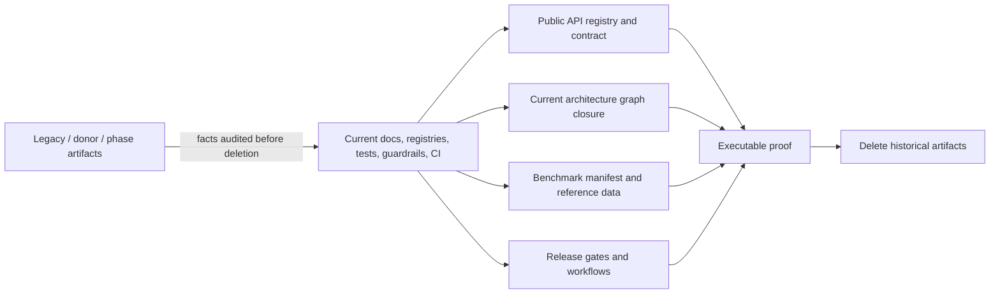
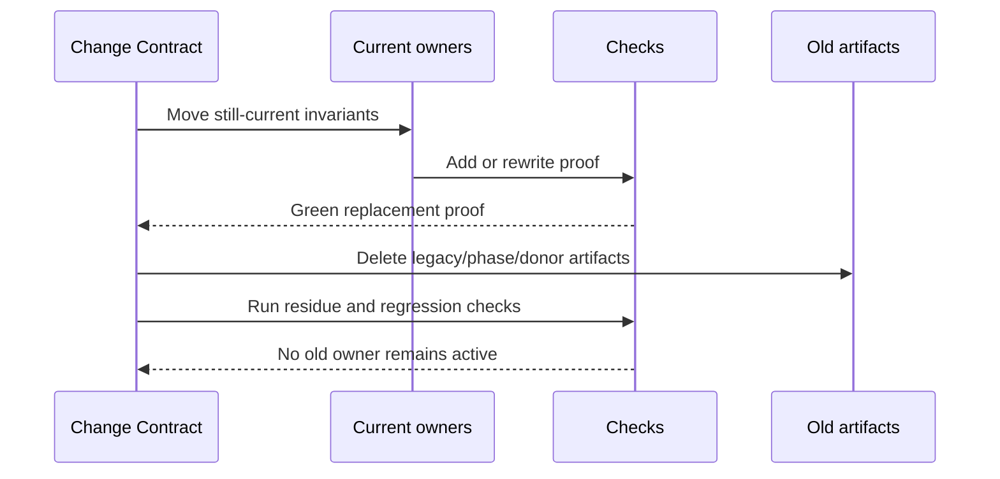

# Design: Legacy And Phase Cleanup

---
date: 2026-06-08
designer: Codex
commit: 81453c0d
branch: new-architecture
design_question: "Design the target repository state after completing the architecture rebuild so the active package no longer depends on the legacy package, legacy-parity scaffolding, donor migration records, phase-based roadmap documents, or rebuild-mode navigation."
---

## Disposition

READY_FOR_CONTRACT

## Product Outcome

The repository should read as a normal maintained `iwb_canvas_engine` package.
Current architecture, public API compatibility, verification policy, benchmark
policy, guardrails, tooling, and CI remain enforced directly from current owners.
The active tree should not keep historical migration, phase, donor, or legacy
package artifacts unless a later Change Contract proves that the artifact is a
current source of truth with a real machine or human consumer.
The `.design/` and `.research/` trees are the explicit exception: they remain as
current evidence and decision-source inputs for future contracts and reviews, not
as migration archives or active package behavior owners.

Non-goals:

- preserving the nested `legacy/iwb_canvas_engine` package as an in-repository
  archive;
- keeping `PLAN.md`, `plan/`, `docs/implementation/`, donor registries, or phase
  indexes as historical records;
- replacing `PLAN.md`/`plan/` with a new in-repository roadmap, contract index,
  or completed-contract archive;
- deleting `.design/` or `.research/`; both remain current source-input layers
  for design, contract, and review workflows;
- weakening public API compatibility or release checks while removing legacy
  vocabulary;
- creating prose-only archives of deleted migration decisions;
- rewriting or pruning git history. Deletion means removal from the active tree
  through normal versioned commits; deleted artifacts remain recoverable from
  earlier commits.

## Target Contract Classification

- Profile: `ANALYZER_RULE`
- Obligations: `SEAM_MIGRATION`

The future Change Contract will rewrite guardrails, architecture graph closure,
docs checks, generated navigation, benchmark schema readers, tests, CI command
expectations, and source-of-truth registries. The work is not a production
runtime behavior change, and it must preserve the current public package API.

## Research Inputs

- `.research/2026-06-08-legacy-phase-footprint.md` - fact supplied.

## Repository Evidence

`Evidence Consequence Link`: each fact below states the decision, boundary,
unit, proof surface, or review consequence it supports.

- `.research/2026-06-08-legacy-phase-footprint.md:13` - the nested legacy package is still present, but root package configuration only references it through analyzer exclusion and guardrail/test/documentation inputs; the direct executable dependency is the public API guardrail reading the legacy public symbol golden -> supports deleting the legacy package only after replacing that guardrail input.
- `.research/2026-06-08-legacy-phase-footprint.md:15` - `PLAN.md`, `plan/`, documentation registries, generated indexes, architecture graph, generated views, and documentation tools still encode phases P0-P14 and donor decisions -> supports a full source-of-truth/navigation rewrite, not only deleting `legacy/`.
- `.research/2026-06-08-legacy-phase-footprint.md:17` - executable legacy-related enforcement includes import bans, retired-shape bans, public API retired-symbol checks, geometry/frame legacy-pattern checks, benchmark legacy-equivalence metadata, release workflow legacy-path rejection, and selected-phase architecture closure -> supports preserving still-current invariants through positive current-architecture checks before deleting old artifacts.
- `.research/2026-06-08-legacy-phase-footprint.md:25` - scoped searches found no root dependency on the legacy package through root `pubspec.yaml`, lockfile, tests config, `.dart_tool`, or GitHub workflows -> supports treating nested `legacy/` as removable once checks no longer read files from it.
- `.research/2026-06-08-legacy-phase-footprint.md:29` - `analysis_options.yaml` excludes `legacy/**`, `core.no_legacy_imports` rejects legacy imports, the public API check reads `legacy/iwb_canvas_engine/tool/goldens/public_api_symbols.txt`, and release readiness rejects legacy paths -> supports replacing legacy-path special cases with current package boundary checks and removing the analyzer exclusion after directory deletion.
- `.research/2026-06-08-legacy-phase-footprint.md:31` - public API retired-symbol data flow is resolved exports intersected with the legacy golden file -> supports moving the retired-symbol deny set into the current public API registry.
- `.research/2026-06-08-legacy-phase-footprint.md:35` - example boundary tests scan `example/**` for retired symbols including `SceneController`, `SceneView`, `NodeSpec`, `NodePatch`, `Transform2D`, `encodeSceneToJson`, and `decodeSceneFromJson` -> supports keeping example public-boundary protection but renaming it around current package public-boundary rules.
- `.research/2026-06-08-legacy-phase-footprint.md:37` - donor mapping tests are constant inventory assertions and benchmark legacy-equivalence checks use manifest/report metadata, not direct legacy runtime execution -> supports deleting donor mapping tests after their still-current facts are represented in contract or behavior tests.
- `.research/2026-06-08-legacy-phase-footprint.md:41` - `PLAN.md` is an active plan index, contains 58 checked entries, and completed steps may reference retired paths, APIs, or checks -> supports deleting the roadmap/history model after source-of-truth docs and checks own current invariants.
- `.research/2026-06-08-legacy-phase-footprint.md:47` - `docs/_registry/sections.yaml` maps `section_08_legacy_capability_inventory` and `docs/_registry/donors.yaml` contains donor source paths, decisions, target phases, target owners, tests, blocks, and related sections -> supports replacing donor/legacy registry ownership with current section, contract, guardrail, test, and benchmark owners.
- `.research/2026-06-08-legacy-phase-footprint.md:53` - architecture graph encodes P0-P14, while P10 and P13 are `future` and P14 is `measurement` -> supports replacing selected-phase closure with current-architecture/release closure and resolving status drift before phase deletion.
- `.research/2026-06-08-legacy-phase-footprint.md:59` - docs generation hard-codes selected graph phase P14 and docs checks hard-code phase docs and phase read-first references -> supports rewriting docs tooling before deleting phase files and indexes.
- `.research/2026-06-08-legacy-phase-footprint.md:65` - benchmark tooling uses `equivalent_legacy`, `bootstrap_legacy_equivalence`, and `legacy_avg_us` in manifest/report/diff policy -> supports a benchmark schema migration with compatibility or mechanical data rewrite.
- `.research/2026-06-08-legacy-phase-footprint.md:118` - research leaves open the contradiction that graph P10/P13 are `future` while `PLAN.md` marks the corresponding steps checked -> supports making graph status reconciliation an early migration gate.
- `.agents/skills/architecture-design/SKILL.md:1` - repository design work produces
  `.design/YYYY-MM-DD-topic.md` artifacts before Change Contract authoring ->
  supports keeping `.design/` as a current decision-source layer.
- `.agents/skills/research-codebase/SKILL.md:1` - repository research work saves
  objective findings under `.research/` -> supports keeping `.research/` as a
  current evidence-source layer.
- `AGENTS.md:3` - repository root is the canonical target package -> supports making root package docs/checks the only active owners.
- `AGENTS.md:4` - current task is to build the new engine described in `docs/`, not maintain or extend the legacy package -> supports deleting nested legacy package after replacing current checks.
- `AGENTS.md:9` - `PLAN.md` is currently the active roadmap and source of truth for planned work -> supports updating repository instructions as part of removing `PLAN.md`.
- `AGENTS.md:18` - completed plan steps currently require checkbox updates in both `PLAN.md` and linked step documents -> supports deleting this workflow only after a new Change Contract route exists outside `PLAN.md`.
- `.agents/skills/change-contract/SKILL.md:8` - the repository-local
  Change Contract skill creates a short contract for the implementer rather than
  requiring a repository file path -> supports routing future implementation
  planning through a per-task execution artifact, not a committed roadmap index.
- `.agents/skills/change-contract/SKILL.md:21` - the contract must define source
  inputs, classification, decisions, scope, owner, order, and completion checks
  -> supports preserving planning rigor after deleting `PLAN.md`/`plan/`.
- `.agents/skills/change-contract/SKILL.md:112` - the skill has an explicit
  `against design DESIGN_FILE` source-input route -> supports using `.design/`
  artifacts plus current docs/registries as future contract inputs without a
  plan index.
- `AGENTS.md:58` - architecture graph checks currently use `dart run tool/architecture_graph/check.dart --phase Px` -> supports replacing repository verification instructions with non-phase closure commands.
- `PLAN.md:5` - `PLAN.md` declares itself the active plan index -> supports treating its deletion as a source-of-truth migration, not a file cleanup.
- `PLAN.md:12` - step order defines intended implementation order and detailed
  scope/closure/verification live only in linked step documents -> supports
  disposing the complete checked step set through an explicit current-owner
  transfer map before deleting `plan/`.
- `PLAN.md:15` - completed step contracts are historical records that may reference retired paths, APIs, or checks -> supports preferring git history over active in-repo archives.
- `PLAN.md:23` through `PLAN.md:80` - all 58 plan steps are checked complete ->
  supports treating every plan document as a historical execution record after
  its current invariants are owned by current docs, tests, guardrails, tools, or
  CI.
- `PLAN.md:69` - Step 47 P10 selection and move is checked -> supports graph status reconciliation before removing phase closure.
- `PLAN.md:73` - Step 51 P13 Flutter surface is checked -> supports graph status reconciliation before removing phase closure.
- `PLAN.md:74` - Step 52 legacy example full parity port is checked -> supports moving only current public-consumer/example boundary invariants forward, not keeping parity scaffolding.
- `docs/README.md:3` - docs portal routes work to current source-of-truth documentation while generated navigation handles reverse lookup and drift checks -> supports keeping a docs portal but changing its navigation model.
- `docs/README.md:10` - docs entrypoint currently routes "Implement a phase" to `docs/indexes/by_phase.md` -> supports deleting or rewriting phase navigation.
- `docs/README.md:15` - docs entrypoint routes donor decisions to `docs/indexes/donor_to_phase.md` -> supports deleting donor navigation.
- `docs/README.md:19` - docs entrypoint routes Change Contracts to `PLAN.md` and `plan/` -> supports replacing the Change Contract discovery route before deleting `PLAN.md`.
- `docs/README.md:23` - normative architecture lives under `docs/architecture/` -> supports making architecture docs the target owner for current architecture invariants.
- `docs/README.md:24` - normative contracts live under `docs/contracts/` -> supports moving still-current behavior invariants from legacy/donor docs into contracts.
- `docs/README.md:25` - verification policy lives under `docs/verification/` -> supports moving proof, guardrail, release, and benchmark invariants into verification docs.
- `docs/architecture/README.md:12` - the current architecture read path includes
  `docs/architecture/04_decisions_and_differences.md` -> supports treating its
  disposition as a read-path source-of-truth change, not incidental cleanup.
- `docs/architecture/04_decisions_and_differences.md:28` - the document is framed
  as accepted differences from the legacy engine -> supports removing the
  legacy-difference framing from the target active architecture read path.
- `docs/architecture/04_decisions_and_differences.md:32` - the table includes
  current public API decisions such as not preserving the legacy public API and
  omitting legacy controller/snapshot/spec/patch shapes -> supports transferring
  these facts into current public API, architecture, and retired-export owners
  before deleting the document.
- `docs/architecture/04_decisions_and_differences.md:38` - the table also includes
  current behavior/API decisions for palette, grid, resources, typed action
  payloads, and synchronous move resolver policy -> supports transferring those
  facts into current contracts rather than deleting them silently.
- `docs/_registry/sections.yaml:96` - `section_04_public_api_v1` maps to `docs/contracts/public_api_v1.md` -> supports using public API docs and registry as the current API owner.
- `docs/_registry/sections.yaml:127` - public API section lists `api.integration_surface_complete` and `api.public_exports_complete` guardrails -> supports preserving public API completeness checks.
- `docs/_registry/sections.yaml:160` - public API section lists `test.api_contract.no_legacy_public_symbols` -> supports renaming/replacing that test with a current retired-export invariant.
- `docs/_registry/sections.yaml:299` - a registry entry still owns `docs/verification/legacy_capability_inventory.md` -> supports deleting that section only after inventory facts are moved.
- `docs/_registry/sections.yaml:320` - a section still owns accepted differences from legacy engine -> supports rewriting accepted differences into current API/architecture decisions or deleting the section if redundant.
- `docs/_registry/sections.yaml:868` - guardrails section maps to `docs/verification/guardrails.md` -> supports making guardrail docs the current owner.
- `docs/_registry/sections.yaml:880` - guardrails section still lists donor `tooling_schema_family_parity` -> supports removing donor fields from current section metadata.
- `docs/_registry/sections.yaml:885` - guardrail metadata lists `api.integration_surface_complete` through other API guardrails -> supports preserving guardrail inventory in current terms.
- `docs/_registry/sections.yaml:903` - guardrail metadata lists `core.no_legacy_imports` -> supports rewriting it into a current package-boundary/path exclusion invariant.
- `docs/_registry/sections.yaml:936` - guardrail metadata lists `geometry.no_legacy_scene_order` -> supports renaming it to a positive committed-order invariant.
- `docs/_registry/sections.yaml:1215` - benchmark section maps to `docs/verification/benchmarks.md` -> supports keeping benchmark source-of-truth under verification.
- `docs/_registry/sections.yaml:1219` - benchmark section is tied to P14 -> supports removing phase metadata from benchmark docs.
- `docs/_registry/benchmarks.yaml:1` - benchmark manifest version is `p14_benchmark_measurement_boundary_v2` -> supports versioning a schema migration away from P14 naming.
- `docs/_registry/benchmarks.yaml:37` - manifest has `bootstrap_legacy_equivalence` -> supports replacing that top-level policy key.
- `docs/_registry/benchmarks.yaml:115` - benchmark case `edit.add_element` uses `classification: equivalent_legacy` -> supports replacing case classification vocabulary.
- `docs/_registry/benchmarks.yaml:242` - benchmark case `input.selected_move_preview` uses `classification: new_only` -> supports replacing both old classification values with current baseline policy values.
- `docs/verification/legacy_capability_inventory.md:25` - legacy capability inventory is evidence input for the P1 scope gate and not a release-proof mapping table -> supports not keeping it as an active current source of truth.
- `docs/verification/legacy_capability_inventory.md:35` - inventory lists synchronous and non-nested edit behavior -> supports ensuring `docs/contracts/edit_kernel.md` and edit tests own this invariant before deletion.
- `docs/verification/legacy_capability_inventory.md:38` - inventory lists rollback with no events, repaint, resource changes, or spatial updates -> supports moving rollback/no-effect invariants into edit and operation proof.
- `docs/verification/legacy_capability_inventory.md:39` - inventory lists staged document replacement ordering -> supports moving load ordering into load-document contract/tests.
- `docs/verification/legacy_capability_inventory.md:42` - inventory lists main paint capture and overlay repaint split -> supports moving frame/preview repaint invariants into frame and interaction contracts/tests.
- `docs/verification/legacy_capability_inventory.md:49` - inventory lists pointer policy values -> supports moving current pointer policy behavior into public API/interaction contracts/tests.
- `docs/verification/legacy_capability_inventory.md:61` - inventory lists validation limits for ids, text, paths, strokes, JSON, layers, and nodes -> supports moving validation-limit coverage into current validation contract/tests.
- `docs/verification/legacy_capability_inventory.md:63` - inventory lists geometry hit slop and bounds separation -> supports moving geometry invariants into `docs/contracts/geometry.md` and geometry tests.
- `docs/verification/legacy_capability_inventory.md:65` - inventory lists spatial constants and fallback behavior -> supports moving spatial invariants into `docs/contracts/spatial_kernel.md` and spatial tests.
- `docs/verification/legacy_capability_inventory.md:67` - inventory lists action-stream close on dispose and monotonic runtime-created timestamps -> supports moving lifecycle/event invariants into runtime/event tests.
- `docs/verification/legacy_capability_inventory.md:116` - inventory rows feed later behavior tests and accepted-difference decisions and must not be treated as public API completeness proof -> supports deleting it after current tests/contracts own the facts.
- `docs/donors/00_reuse_rules.md:13` - donor use treats current engine as a functional oracle and implementation donor, not a legacy dependency -> supports retiring donor model after rebuild completion.
- `docs/donors/00_reuse_rules.md:20` - no production import from legacy package/runtime paths is allowed -> supports preserving import/boundary checks outside donor docs.
- `docs/donors/00_reuse_rules.md:34` - every reused donor must carry at least one ported or equivalent test before implementation slice closes -> supports deleting donor records once current behavior tests own the proof.
- `docs/donors/00_reuse_rules.md:36` - if donor code conflicts with next API/layout/no-legacy rules, the next plan wins -> supports current contracts superseding donor docs.
- `docs/implementation/p14_benchmarks_diagrams_and_release_readiness.md:5` - P14 purpose is to prove guardrails, diagrams, benchmarks, donor use, phase alignment, and final release gates match target architecture -> supports moving only release readiness invariants forward and deleting phase wrapper prose.
- `docs/implementation/p14_benchmarks_diagrams_and_release_readiness.md:14` - P14 build scope includes benchmark baselines, diff tool, guardrails, runner closure, release checklist, and phase guardrail alignment -> supports moving benchmark/release/guardrail facts to verification owners.
- `docs/architecture/architecture_graph.yaml:2` - graph top-level key is `phases` -> supports schema rewrite to remove phase inventory.
- `docs/architecture/architecture_graph.yaml:61` - graph P10 status is `future` -> supports status reconciliation before phase removal.
- `docs/architecture/architecture_graph.yaml:79` - graph P13 status is `future` -> supports status reconciliation before phase removal.
- `docs/architecture/architecture_graph.yaml:85` - graph P14 status is `measurement` -> supports replacing phase state with current release closure.
- `docs/architecture/architecture_graph.yaml:122` - graph node `api.public_surface` owns public package surface -> supports keeping architecture graph as a current source of truth after phase fields are removed.
- `docs/architecture/architecture_graph.yaml:427` - node `interaction.engine` is marked `future` while actual declarations include `InteractionEngine`, `InteractionDiagnosticsSink`, `InteractionReadPort`, `PointerSession`, `PointerSampleNormalizer`, and `PointerToolCleanupCoordinator` -> supports early graph current-state repair.
- `docs/architecture/architecture_graph.yaml:483` - node `flutter.surface` is marked `future` while actual declarations include `CanvasSurface` -> supports early graph current-state repair.
- `docs/architecture/architecture_graph.yaml:499` - release measurement node is a tool/docs owner with isolation allowances, not runtime behavior -> supports keeping release readiness as verification/tooling, not public API.
- `tool/architecture_graph/check.dart:7` - graph checker requires `--phase` -> supports replacing CLI with a no-phase current closure command.
- `tool/architecture_graph/check.dart:28` - checker extracts actual graph and runs phase closure -> supports preserving expected-vs-actual extraction but replacing phase selection.
- `tool/architecture_graph/src/phase_closure.dart:116` - closure currently runs selected-phase required obligations, forbidden edges, placeholders, and unknown architecture declaration rules -> supports preserving these rule families.
- `tool/architecture_graph/src/phase_closure.dart:158` - active obligation logic compares selected phase index against phase ids -> supports removing phase-index semantics.
- `tool/architecture_graph/src/architecture_graph.dart:473` - graph validator expects phases P0-P14 -> supports schema migration and tests for no phase inventory.
- `docs/tool/sync_generated_docs.dart:15` - generated docs tool hard-codes selected architecture graph phase P14 -> supports removing selected-phase constant.
- `docs/tool/sync_generated_docs.dart:17` - generated indexes include `by_phase.md` and `donor_to_phase.md` -> supports deleting/replacing generated phase/donor indexes.
- `docs/tool/sync_generated_docs.dart:191` - docs generator delegates graph view generation with `--phase` and selected phase -> supports rewriting generator invocation.
- `docs/tool/check_docs.dart:34` - docs checker hard-codes phase document paths P0-P14 -> supports removing phase-doc checking.
- `docs/tool/check_docs.dart:63` - docs checker defines allowed donor decisions -> supports deleting donor registry validation after current invariants move.
- `docs/tool/check_docs.dart:82` - docs checker markdown roots include `docs/implementation` and `docs/donors` -> supports updating docs roots after deletion.
- `docs/tool/check_docs.dart:114` - root README expected task routes include phase and donor navigation plus `PLAN.md`/`plan/` -> supports docs checker expectation rewrite.
- `docs/diagrams/generated/current_phase.mmd:1` - generated file is derived output -> supports deleting/replacing it through generator, not preserving by hand.
- `docs/diagrams/generated/current_phase.mmd:4` - generated current phase view is selected phase P14 -> supports replacing phase-specific generated diagrams.
- `tool/guardrails/src/public_api_checks.dart:434` - `checkNoLegacyPublicTypes` resolves the public API surface -> supports reusing resolver for current retired-export checks.
- `tool/guardrails/src/public_api_checks.dart:472` - retired public symbols are read from the nested legacy package golden -> supports moving deny-list ownership to current registry.
- `tool/guardrails/src/core_boundary_checks.dart:385` - legacy import check reports `core.no_legacy_imports` -> supports preserving import denial under a current package-boundary guardrail.
- `tool/guardrails/src/core_boundary_checks.dart:620` - legacy URI detection is hard-coded around `legacy/` paths -> supports replacing path-specific logic with "no imports outside current package/private boundary" plus final no-legacy-path residue checks.
- `tool/guardrails/src/geometry_spatial_guardrail_checks.dart:17` - geometry guardrail scans production geometry sources -> supports preserving this proof surface.
- `tool/guardrails/src/geometry_spatial_guardrail_checks.dart:31` - guardrail forbids `SceneNode`, `NodeSnapshot`, `SceneController`, `sceneOrder`, `nodeOrder`, and `zOrder` tokens while message says committed handle order tokens are required -> supports renaming it to a positive committed-order invariant.
- `tool/guardrails/src/frame_cache_guardrail_checks.dart:14` - cache key guardrail id is `cache.keys_use_next_revisions_only` -> supports keeping positive current cache naming and only renaming tests/files that still say legacy snapshot shape.
- `tool/bench/src/benchmark_manifest.dart:5` - benchmark manifest path is `docs/_registry/benchmarks.yaml` -> supports keeping the manifest as current benchmark source of truth.
- `tool/bench/src/benchmark_manifest.dart:6` - benchmark manifest version is `p14_benchmark_measurement_boundary_v2` -> supports version bump away from phase naming.
- `tool/bench/src/benchmark_manifest.dart:19` - manifest model exposes `bootstrapLegacyEquivalence` -> supports replacing typed field name and report schema.
- `tool/bench/src/benchmark_manifest.dart:226` - parser accepts classifications `equivalent_legacy` and `new_only` -> supports schema migration to current `baseline_policy` vocabulary.
- `tool/bench/src/benchmark_diff.dart:1003` - diff validates legacy bootstrap metrics -> supports replacing bootstrap validation owner.
- `tool/bench/src/benchmark_diff.dart:1019` - diff reads `legacy_avg_us` -> supports replacing current report metric with `reference_avg_us`.
- `tool/bench/src/benchmark_report.dart:299` - generated report includes `bootstrap_legacy_equivalence` -> supports report schema migration.
- `tool/bench/manual/reference_decisions.json:1` - manual reference decisions are structured committed benchmark data -> supports preserving benchmark history as current data when it has a consumer.
- `tool/bench/manual/reference_decisions.json:6` - decision records point to committed manual reference reports -> supports keeping manual references and migrating their schema if needed.
- `tool/bench/manual/run_history/index.json:1` - manual run history index is structured committed data -> supports keeping history only if it remains machine-consumed by benchmark tools.
- `tool/bench/manual/run_history/2026-06-08_xiaomi_22081283g_schema_import_load_release_run_2.json:55` - run history stores manifest version `p14_benchmark_measurement_boundary_v2` -> supports benchmark data schema migration or compatibility reader.
- `tool/bench/manual/run_history/2026-06-08_xiaomi_22081283g_schema_import_load_release_run_2.json:65` - run history stores `classification: equivalent_legacy` -> supports migrating committed benchmark records or accepting a temporary compatibility reader with a retirement gate.
- `.github/workflows/root_package.yml:25` - root package CI checks generated docs and docs -> supports preserving docs checks after navigation rewrite.
- `.github/workflows/root_package.yml:43` - root package CI runs all non-benchmark Flutter tests -> supports preserving broad behavior proof after cleanup.
- `.github/workflows/root_package.yml:49` - root package CI runs guardrails -> supports making rewritten guardrails blocking.
- `.github/workflows/release_benchmarks.yml:24` - release benchmark workflow runs release benchmarks and diff -> supports preserving release benchmark gates.
- `.github/workflows/release_benchmarks.yml:30` - release benchmark workflow runs P14 architecture graph check -> supports CI command rewrite.
- `.github/workflows/release_benchmarks.yml:33` - release benchmark workflow checks P14 generated graph views -> supports CI command rewrite.
- `.github/workflows/update_benchmark_baseline.yml:25` - update workflow writes a release benchmark candidate and accepts baseline manually -> supports preserving benchmark baseline ownership while renaming vocabulary.
- `legacy/iwb_canvas_engine/pubspec.yaml:1` - nested package has the same package name as root -> supports deleting it to remove confusing dual package identity.
- `legacy/iwb_canvas_engine/pubspec.yaml:3` - nested package version is `5.1.0`, while root is a rebuilt package version -> supports not treating nested package as current package state.
- `legacy/iwb_canvas_engine/pubspec.yaml:40` - nested package owns legacy assets -> supports moving any still-current example asset to current example ownership before deletion.
- `legacy/iwb_canvas_engine/tool/goldens/public_api_symbols.txt:1` - legacy golden starts the retired public symbol list -> supports copying the deny-set data into a current registry before deleting legacy.
- `legacy/iwb_canvas_engine/tool/goldens/public_api_symbols.txt:49` - legacy golden includes `SceneController` -> supports continued retired-export denial under the current registry.
- `legacy/iwb_canvas_engine/tool/goldens/public_api_symbols.txt:69` - legacy golden includes `Transform2D` -> supports current deny-list behavior matching existing tests.
- `docs/_registry/public_api_v1.yaml:1` - current public API registry is machine-readable -> supports extending it with retired public exports instead of adding a standalone historical file.
- `docs/_registry/public_api_v1.yaml:3` - `public_exports` is the current allowed export set -> supports keeping public API compatibility proof anchored here.
- `docs/_registry/public_api_v1.yaml:114` - diagnostics public surface is a current metadata subset under the same registry -> supports adding another current metadata group for retired exports without creating a second owner.
- `docs/contracts/public_api_v1.md:95` - public barrel exports exactly the names in `docs/_registry/public_api_v1.yaml` -> supports public API registry singularity.
- `docs/contracts/public_api_v1.md:110` - contract currently points to the legacy package golden as the retired public symbol list -> supports rewriting this reference to the current registry.
- `docs/contracts/public_api_v1.md:134` - external adapter static proof imports only the public barrel -> supports preserving public-consumer proof while removing legacy wording.
- `docs/verification/guardrails.md:114` - guardrails are blocking architecture and release rules through one project-owned entrypoint -> supports keeping `tool/guardrails/run.dart` as the guardrail owner.
- `docs/verification/guardrails.md:129` - guardrail docs currently describe phase-aware graph checker with `--phase Px` -> supports docs rewrite to current graph closure.
- `docs/verification/guardrails.md:178` - guardrail table describes `api.no_legacy_public_types` as legacy public golden symbols not exported -> supports renaming to a current retired-export rule.
- `docs/verification/guardrails.md:229` - guardrail table describes `geometry.no_legacy_scene_order` as avoiding legacy traversal and order logic -> supports positive committed-order guardrail naming.
- `docs/verification/benchmarks.md:33` - benchmark section states `docs/_registry/benchmarks.yaml` is the structured source of truth -> supports benchmark schema migration in the manifest, not docs-only wording.
- `docs/verification/benchmarks.md:80` - current release reports are transient under `build/bench/current/` -> supports not preserving transient benchmark outputs.
- `docs/verification/benchmarks.md:82` - approved release baseline path is the committed baseline owner -> supports preserving current approved baseline model.
- `docs/verification/benchmarks.md:91` - manual device reference reports live under `tool/bench/manual/reference_reports/` and are accepted comparison inputs -> supports keeping benchmark reference reports when machine-consumed.
- `docs/verification/benchmarks.md:121` - manual benchmark history ledger stores accepted observations under `tool/bench/manual/run_history/` -> supports preserving and migrating machine-consumed benchmark history, not deleting it as migration clutter.
- `docs/verification/benchmarks.md:157` - benchmark CI routing is documented in verification docs -> supports moving release workflow command changes here.
- `docs/verification/release_gates.md:174` - release is blocked unless listed statements are true -> supports keeping release gates as the final current proof owner.
- `docs/verification/release_gates.md:176` - release gates currently depend on selected-phase graph closure -> supports replacing phase closure with current graph closure.
- `docs/verification/release_gates.md:238` - benchmark gates currently include P14 graph and generated-view checks -> supports CI and docs rewrite.

## Design Form Candidates

### Candidate A. Minimal Legacy Directory Removal

- Form: Delete `legacy/iwb_canvas_engine/` and update the public API guardrail to store retired symbols somewhere else, while leaving `PLAN.md`, `plan/`, phase docs, donor docs, phase generated indexes, and P14 graph closure in place.
- Why it could work: It removes the largest confusing nested package and resolves the only direct executable file dependency on legacy symbols.
- Gate failures or risks: It fails the product outcome because phase roadmap, donor migration records, rebuild-mode navigation, and legacy-negative guardrail wording remain active. `docs/README.md:10`, `docs/README.md:15`, and `docs/README.md:19` would still route users through phase, donor, and plan concepts.

### Candidate B. Medium Cleanup With Phase Roadmap Retained

- Form: Delete nested legacy package and donor docs/registries, but keep `PLAN.md`, `plan/`, `docs/implementation/`, P0-P14 graph fields, and selected-phase generated diagrams as release history.
- Why it could work: It lowers risk by keeping old execution contracts visible during the transition.
- Gate failures or risks: It violates the user's "no unnecessary active tree artifacts" constraint and preserves a second source of truth for completed work. `PLAN.md:15` already says completed step contracts are historical records that may reference retired paths, APIs, or checks; keeping them as active navigation would preserve stale truth.

### Candidate C. Full Cleanup With Current Owners Only

- Form: Move still-current invariants into existing current owners (`docs/contracts/`, `docs/architecture/`, `docs/verification/`, `docs/_registry/public_api_v1.yaml`, `docs/_registry/benchmarks.yaml`, guardrail/test/tool code, and CI), rewrite tooling from phase/donor/legacy concepts to current architecture/release concepts, then delete legacy package, roadmap, donor, phase, and parity artifacts.
- Why it could work: It matches the requested target, preserves invariants through executable owners, and makes git history the archive for migration records.
- Gate failures or risks: It has the highest migration surface. The Change Contract must enforce a strict order: replacement owner and proof first, deletion second, final residue scan last.

## Known Future Pressures

| Pressure | Evidence | How the selected form responds | Accepted cost or risk |
|---|---|---|---|
| Users should not see migration/rebuild navigation after cleanup. | `docs/README.md:10`, `docs/README.md:15`, `docs/README.md:19` | Delete phase/donor/plan routes and replace generated navigation with current subsystem, guardrail, test, benchmark, diagram, and release routes. | Larger docs-tool rewrite. |
| Current public API compatibility must remain stable. | `docs/contracts/public_api_v1.md:95`, `docs/_registry/public_api_v1.yaml:3`, `docs/contracts/public_api_v1.md:110` | Keep `public_exports` as allowed set and add a current `retired_public_exports` deny set in the same registry before deleting the legacy golden. | One-time schema/test migration for public API registry reader. |
| Architecture graph currently disagrees with completed plan state. | `PLAN.md:69`, `PLAN.md:73`, `docs/architecture/architecture_graph.yaml:61`, `docs/architecture/architecture_graph.yaml:79` | Reconcile current graph node statuses before removing phase model; the post-cleanup graph has only current required/release obligations. | Contract must not hide unresolved future/measurement status by deleting phase fields first. |
| Benchmark history is current machine-consumed data even though it contains legacy vocabulary. | `docs/verification/benchmarks.md:91`, `docs/verification/benchmarks.md:121`, `tool/bench/manual/run_history/2026-06-08_xiaomi_22081283g_schema_import_load_release_run_2.json:65` | Preserve benchmark history/reference reports, but migrate schema vocabulary or add a temporary compatibility reader with a retirement gate. | Mechanical data migration risk; requires focused benchmark tests. |
| Historical step contracts may contain facts that were not moved into current docs/tests. | `docs/verification/legacy_capability_inventory.md:35`, `docs/verification/legacy_capability_inventory.md:63`, `docs/donors/00_reuse_rules.md:34` | First migration slice maps still-current facts to current contracts/tests/guardrails, then deletes historical artifacts. | More up-front audit work, but prevents invariant loss. |
| Deleting legacy package may remove example asset donors. | `legacy/iwb_canvas_engine/pubspec.yaml:40`, `plan/step_52_legacy_example_full_parity_port.md:169` | Ensure any current example asset is owned under current `example/**` before deleting legacy. | If missing, deletion is blocked until current example owns it. |

## Selected Form

Selected cleanup scope: **full cleanup**.

The target repository state keeps only current, mechanically consumed owners:

| Concern | Current source of truth after cleanup | Consumer/proof |
|---|---|---|
| Public API allowed exports | `docs/_registry/public_api_v1.yaml` `public_exports` | `api.public_exports_complete`, public API compile/signature/dartdoc tests |
| Public API retired exports | `docs/_registry/public_api_v1.yaml` `retired_public_exports` | renamed retired-export guardrail and API contract tests |
| Public API semantics | `docs/contracts/public_api_v1.md` | focused API/runtime/surface tests and public consumer compile fixture |
| Package layout and import direction | `docs/architecture/02_package_boundaries.md`, guardrail registry/tooling | owner DAG, import-boundary, public/private source scans |
| Runtime/contract behavior | `docs/contracts/*.md`, `docs/architecture/*.md` | behavior tests and guardrails listed by current verification docs |
| Current architecture graph | `docs/architecture/architecture_graph.yaml` without P0-P14 phase inventory | no-phase architecture closure checker and generated current graph views |
| Guardrail inventory and runner | `docs/verification/guardrails.md`, `tool/guardrails/src/guardrail_registry.dart`, `tool/guardrails/run.dart` | root CI and guardrail runner tests |
| Test inventory | `docs/verification/tests.md` and actual test files | root CI and docs checks |
| Benchmark manifest/policy | `docs/_registry/benchmarks.yaml`, `docs/verification/benchmarks.md` | benchmark manifest/diff/runner/manual-reference tests |
| Benchmark committed history/reference data | `tool/bench/manual/reference_reports/`, `tool/bench/manual/run_history/`, `tool/bench/manual/reference_decisions.json` | manual benchmark history/reference tooling |
| Release gates | `docs/verification/release_gates.md`, `.github/workflows/*.yml` | root/release CI, release readiness guardrail |
| Generated navigation and diagrams | current-only `docs/indexes/`, `docs/diagrams/catalog.md`, generated non-phase graph views | `docs/tool/sync_generated_docs.dart --check`, `docs/tool/check_docs.dart`, graph view check |
| Future Change Contract route | `AGENTS.md`, `docs/README.md`, and the repository-local `change-contract` / `change-contract-check` skills describe the per-task workflow; no `PLAN.md`, `plan/`, roadmap, or completed-contract archive remains in the repository tree | docs checker rejects old plan/phase routes; final residue scan rejects `PLAN.md`/`plan/`; implementation/review consumes the explicit per-task contract from the work item, thread, or PR context |
| Design and research evidence | `.design/` and `.research/` | architecture-design, research-codebase, change-contract, contract-check, and review workflows consume these as source inputs; final residue scan treats legacy/phase/donor wording inside them as historical evidence, not active artifact residue |

Target artifact disposition:

| Artifact | Disposition | Evidence | Replacement owner or deletion gate |
|---|---|---|---|
| `legacy/iwb_canvas_engine/` | Delete | `.research/2026-06-08-legacy-phase-footprint.md:13`; `legacy/iwb_canvas_engine/pubspec.yaml:1` | Current checks must no longer read legacy golden/assets; current example owns any needed asset. |
| `analysis_options.yaml` `legacy/**` exclusion | Delete/rewrite | `analysis_options.yaml:3`; `.research/2026-06-08-legacy-phase-footprint.md:29` | Directory deletion plus final no-legacy-path residue scan. |
| `PLAN.md` | Delete | `PLAN.md:5`; `PLAN.md:15`; `.agents/skills/change-contract/SKILL.md:8` | `AGENTS.md` and `docs/README.md` route future implementation planning to a per-task Change Contract artifact in the work item/thread/PR context, with `.design/` and current docs/registries as source inputs. No in-repo roadmap or contract archive replaces it. |
| `.design/` | Keep | `.agents/skills/architecture-design/SKILL.md:1`; `.agents/skills/change-contract/SKILL.md:112` | Current design decision-source layer for future Change Contracts and reviews. Not a roadmap, archive, or package behavior owner. |
| `.research/` | Keep | `.agents/skills/research-codebase/SKILL.md:1`; `.research/2026-06-08-legacy-phase-footprint.md:13` | Current evidence-source layer for future design/contract/review work. Historical terms inside research are allowed as cited evidence. |
| `plan/` | Delete | `.research/2026-06-08-legacy-phase-footprint.md:41`; `PLAN.md:15` | Still-current invariants from completed contracts must be in current docs/tests/guardrails first. |
| `docs/implementation/` | Delete | `docs/README.md:26`; `docs/implementation/p14_benchmarks_diagrams_and_release_readiness.md:5` | Current release/architecture/contract docs own remaining invariants. |
| `docs/donors/` | Delete | `docs/donors/00_reuse_rules.md:13`; `docs/donors/00_reuse_rules.md:34` | Behavior tests and current contracts own reused behavior; no donor proof-only docs remain. |
| `docs/_registry/donors.yaml` | Delete | `docs/_registry/donors.yaml:1`; `.research/2026-06-08-legacy-phase-footprint.md:47` | Remove donor fields/indexes after all current target-owner facts are moved or proven redundant. |
| `docs/verification/legacy_capability_inventory.md` | Delete | `docs/verification/legacy_capability_inventory.md:25`; `docs/verification/legacy_capability_inventory.md:116` | Move still-current behavior facts to contracts/tests/release gates first. |
| `docs/architecture/04_decisions_and_differences.md` | Delete after transfer | `docs/architecture/README.md:12`; `docs/architecture/04_decisions_and_differences.md:28`; `docs/architecture/04_decisions_and_differences.md:32`; `docs/architecture/04_decisions_and_differences.md:38` | Move retained decisions to named current owners: legacy public API and retired shapes to `docs/contracts/public_api_v1.md` plus `retired_public_exports`; schema v7 target to `docs/contracts/schema_v1.md`/`docs/contracts/codec_boundary.md`; palette/grid/resources/action payloads/move resolver to `docs/contracts/public_api_v1.md`, `docs/contracts/resources.md`, and `docs/contracts/interaction_engine.md`. Remove it from `docs/architecture/README.md` read path. |
| `docs/_registry/sections.yaml` | Rewrite | `docs/_registry/sections.yaml:6`; `docs/_registry/sections.yaml:13`; `docs/_registry/sections.yaml:100`; `docs/_registry/sections.yaml:112` | Remove phase/donor schema fields or replace with current owner/subsystem/guardrail/test relationships consumed by docs generator. |
| `docs/indexes/by_phase.md` | Delete | `docs/indexes/by_phase.md:1`; `docs/tool/sync_generated_docs.dart:17` | Current generated indexes keep subsystem/guardrail/test routes only, or replace with current owner index. |
| `docs/indexes/donor_to_phase.md` | Delete | `docs/indexes/donor_to_phase.md:1`; `docs/tool/sync_generated_docs.dart:22` | No replacement unless a current machine-consumed owner index is needed. |
| `docs/diagrams/generated/current_phase.mmd` | Delete/replace | `docs/diagrams/generated/current_phase.mmd:4` | Replace with no-phase current architecture graph view if still useful. |
| `docs/diagrams/generated/future_target.mmd` | Delete | `docs/diagrams/generated/future_target.mmd:4` | Future work belongs to future Change Contracts, not active generated graph. |
| `docs/diagrams/generated/full_architecture.mmd` | Rewrite/rename | `docs/diagrams/generated/full_architecture.mmd:4` | Current graph view without selected-phase metadata. |
| `docs/diagrams/generated/actual_vs_expected_diff.mmd` | Rewrite | `docs/diagrams/generated/actual_vs_expected_diff.mmd:4` | Current expected-vs-actual diff without phase selection. |
| `docs/diagrams/generated/release_verification.mmd` | Rewrite | `docs/diagrams/generated/release_verification.mmd:4` | Current release verification view without P14. |
| `tool/architecture_graph/src/phase_closure.dart` | Rewrite/rename | `tool/architecture_graph/src/phase_closure.dart:116`; `tool/architecture_graph/src/phase_closure.dart:158` | Current closure checker preserving required nodes/edges, forbidden edges, placeholders, unknown seams. |
| `tool/architecture_graph/check.dart --phase` | Rewrite | `tool/architecture_graph/check.dart:7` | `dart run tool/architecture_graph/check.dart` or explicit `--profile=current` if a profile enum is needed. |
| `tool/architecture_graph/generate_views.dart --phase` | Rewrite | `tool/architecture_graph/generate_views.dart:7`; `docs/tool/sync_generated_docs.dart:191` | No-phase generated current views and `--check`. |
| `docs/tool/sync_generated_docs.dart` | Rewrite | `docs/tool/sync_generated_docs.dart:15`; `docs/tool/sync_generated_docs.dart:17` | Generate current indexes/catalog/views without phase/donor inputs. |
| `docs/tool/check_docs.dart` | Rewrite | `docs/tool/check_docs.dart:34`; `docs/tool/check_docs.dart:63`; `docs/tool/check_docs.dart:82`; `docs/tool/check_docs.dart:114` | Validate current docs roots, registries, graph views, benchmark projection, and no phase/donor routes. |
| `api.no_legacy_public_types` | Rewrite/rename | `tool/guardrails/src/public_api_checks.dart:434`; `tool/guardrails/src/public_api_checks.dart:472` | `api.no_retired_public_exports` reading `retired_public_exports` from current public API registry. |
| `test/api_contract/no_legacy_public_symbols_test.dart` | Rename/rewrite | `test/api_contract/no_legacy_public_symbols_test.dart:7` | Retired public exports test with current fixture naming. |
| `core.no_legacy_imports` | Rewrite/possibly rename | `tool/guardrails/src/core_boundary_checks.dart:385`; `tool/guardrails/src/core_boundary_checks.dart:620` | Current package-boundary/import guardrail plus final no `legacy/` path residue scan. |
| `geometry.no_legacy_scene_order` | Rename/rewrite | `tool/guardrails/src/geometry_spatial_guardrail_checks.dart:31`; `docs/verification/guardrails.md:229` | Positive committed handle-order/token guardrail. |
| `test/frame/cache_keys_do_not_use_legacy_snapshot_shape_test.dart` | Rename | `tool/guardrails/src/frame_cache_guardrail_checks.dart:14`; `test/frame/cache_keys_do_not_use_legacy_snapshot_shape_test.dart:6` | Positive cache key current-revision test. |
| Donor mapping tests | Delete/rewrite as behavior tests | `.research/2026-06-08-legacy-phase-footprint.md:37`; `test/frame/frame_donor_mapping_test.dart:4`; `test/geometry/geometry_spatial_donor_mapping_test.dart:4` | Current behavior/contract tests own copied/adapted behavior. |
| Benchmark `equivalent_legacy` / `new_only` | Rewrite | `tool/bench/src/benchmark_manifest.dart:226`; `docs/_registry/benchmarks.yaml:115`; `docs/_registry/benchmarks.yaml:242` | `baseline_policy: reference_comparison` and `baseline_policy: absolute_budget`. |
| Benchmark `legacy_avg_us` | Rewrite | `tool/bench/src/benchmark_diff.dart:1019` | `reference_avg_us`. |
| Benchmark `bootstrap_legacy_equivalence` | Rewrite | `docs/_registry/benchmarks.yaml:37`; `tool/bench/src/benchmark_report.dart:299` | `first_baseline_reference_limits`. |
| `.github/workflows/release_benchmarks.yml` P14 commands | Rewrite | `.github/workflows/release_benchmarks.yml:30`; `.github/workflows/release_benchmarks.yml:33` | Current architecture graph check and generated-view check. |

Current-invariant transfer map:

This map is part of the selected design, not future discovery. Completed plan
documents, donor rows, phase implementation docs, and the legacy inventory are
not current source-of-truth after cleanup. They are deletion inputs. A future
Change Contract must implement the replacement owners below, prove them, and
then delete the historical artifacts. It must not create a new in-repository
archive of the old records.

| Historical source group | Coverage | Current owner after cleanup | Still-current invariant to preserve | Deletion gate |
|---|---|---|---|---|
| Checked plan steps: public API, DTO, schema, validation, codec, public smoke | Steps 2, 3, 4, 11, 12, 13, 14, 21, 22, 23, 28, 31, 32, 58 from `PLAN.md:24` through `PLAN.md:54` and `PLAN.md:80` | `docs/_registry/public_api_v1.yaml`, `docs/contracts/public_api_v1.md`, `docs/contracts/schema_v1.md`, `docs/contracts/validation_limits.md`, `docs/contracts/operation_matrix.md`, `docs/contracts/codec_boundary.md`, `docs/contracts/load_document.md`, `test/api_contract/**`, `test/smoke/**` | Current public barrel compatibility, typed public DTO/state variants, metadata immutability, validation limits, error-code semantics, schema v1 roundtrip/load behavior, diagnostics public subset, and public-consumer proof. | Public API registry/contract tests, schema/codec/load tests, public smoke tests, and retired-export guardrail pass without reading `plan/` or `legacy/`. |
| Checked plan steps: runtime spine, edits, load, store, sparse edit seams, acyclic runtime/API architecture | Steps 24, 29, 30, 35, 36, 37, 38, 57 from `PLAN.md:46`, `PLAN.md:51` through `PLAN.md:60`, and `PLAN.md:79` | `docs/architecture/01_runtime_ownership.md`, `docs/architecture/03_data_model.md`, `docs/contracts/edit_kernel.md`, `docs/contracts/load_document.md`, `docs/contracts/operation_matrix.md`, runtime/edit/load tests, architecture graph | Single runtime ownership, committed read/store behavior, rollback-safe edit commits, effect delivery, load-document all-or-nothing behavior, prepared-load cleanup, acyclic API/runtime dependency shape, and sparse edit store expectations. | Edit/load/runtime behavior tests and no-phase architecture graph closure own the claims; no checked plan document is cited by active docs/checks. |
| Checked plan steps: interaction, preview, selection/move, drawing, eraser, context action, text editing, Flutter surface | Steps 5, 6, 9, 10, 18, 19, 47, 48, 49, 51, 53, 54 from `PLAN.md:27` through `PLAN.md:32`, `PLAN.md:40` through `PLAN.md:41`, and `PLAN.md:69` through `PLAN.md:76` | `docs/contracts/interaction_engine.md`, `docs/contracts/public_api_v1.md`, `docs/contracts/frame_rendering.md`, `docs/contracts/resources.md`, `docs/architecture/architecture_graph.yaml`, interaction/surface/widget tests | Public runtime state and camera ownership, preview state, stale text-edit request handling, pointer cleanup, context-action delivery, selection/move/draw/eraser/text-edit workflows, and public `CanvasSurface` behavior. | Interaction/surface tests, public API tests, graph current closure, and positive guardrails own the behavior; legacy parity wording is removed from active routes. |
| Checked plan steps: frame, cache, resources, geometry, spatial, diagnostics | Steps 7, 8, 15, 16, 17, 39, 40, 41, 42, 43, 46 from `PLAN.md:29` through `PLAN.md:30`, `PLAN.md:37` through `PLAN.md:39`, and `PLAN.md:61` through `PLAN.md:68` | `docs/contracts/frame_rendering.md`, `docs/contracts/cache_policy.md`, `docs/contracts/resources.md`, `docs/contracts/geometry.md`, `docs/contracts/spatial_kernel.md`, `docs/contracts/diagnostics.md`, frame/resource/geometry/spatial/diagnostics tests and guardrails | Frame facts/cache invalidation, resource resolver/session lifecycle, monotonic runtime-created timestamps, internal frame collaborators, resource dirty orchestration, diagnostics routing, geometry and spatial kernels, and frame findings closure. | Focused owner tests and positive guardrails own the facts; donor mapping tests may be deleted only after behavior tests cover copied/adapted behavior. |
| Checked plan steps: guardrail runner, docs portal, graph closure, naming/vocabulary cleanup, release readiness, benchmark measurement | Steps 1, 20, 25, 26, 27, 33, 34, 44, 45, 50, 55, 56 from `PLAN.md:23`, `PLAN.md:42`, `PLAN.md:47` through `PLAN.md:49`, `PLAN.md:55` through `PLAN.md:56`, `PLAN.md:66` through `PLAN.md:68`, `PLAN.md:72`, and `PLAN.md:77` through `PLAN.md:78` | `docs/verification/guardrails.md`, `docs/verification/tests.md`, `docs/verification/benchmarks.md`, `docs/verification/release_gates.md`, `docs/tool/*.dart`, `tool/guardrails/**`, `tool/architecture_graph/**`, `tool/bench/**`, `.github/workflows/**` | Package boundaries, guardrail inventory/runner behavior, graph closure, generated navigation, fixture naming, skill-rule vocabulary/proof normalization, release benchmark readiness, and benchmark measurement boundary semantics. | Docs checks, graph checks, guardrail runner/tests, benchmark tests, release-readiness guardrail, and CI command checks pass with no phase/donor/PLAN navigation. |
| Checked plan step: public example parity | Step 52 from `PLAN.md:74` | Current `example/**`, example tests, public API/resource/interaction/schema contracts, and example-specific structural import/retired-symbol checks | Runnable public-consumer example workflows, app-owned runtime lifecycle, app-owned cat image/resource resolver, schema v1 JSON workflow, and no `lib/src/**` or legacy imports from example code. | `example/**` owns any needed asset and behavior proof; legacy example/source files and parity docs are deleted after example tests and structural scans pass. |

Legacy inventory transfer:

| Legacy inventory facts | Evidence | Current owner after cleanup | Proof obligation |
|---|---|---|---|
| Synchronous non-nested edit behavior, rollback with no events/repaint/resources/spatial changes, staged document replacement ordering | `docs/verification/legacy_capability_inventory.md:35`; `docs/verification/legacy_capability_inventory.md:38`; `docs/verification/legacy_capability_inventory.md:39` | `docs/contracts/edit_kernel.md`, `docs/contracts/load_document.md`, `docs/contracts/operation_matrix.md`, edit/load behavior tests | Current edit/load tests prove these behaviors without citing the legacy inventory. |
| Main paint capture, overlay repaint split, preview/pointer policy | `docs/verification/legacy_capability_inventory.md:42`; `docs/verification/legacy_capability_inventory.md:49` | `docs/contracts/frame_rendering.md`, `docs/contracts/interaction_engine.md`, `docs/contracts/public_api_v1.md`, frame/interaction/surface tests | Public preview/surface and frame tests own repaint and pointer policy behavior. |
| Validation limits, geometry/hit slop/bounds, spatial constants/fallback | `docs/verification/legacy_capability_inventory.md:61`; `docs/verification/legacy_capability_inventory.md:63`; `docs/verification/legacy_capability_inventory.md:65` | `docs/contracts/validation_limits.md`, `docs/contracts/geometry.md`, `docs/contracts/spatial_kernel.md`, validation/geometry/spatial tests and guardrails | Current contract tests and guardrails own limits and math/spatial behavior. |
| Action stream disposal and monotonic runtime-created timestamps | `docs/verification/legacy_capability_inventory.md:67` | `docs/contracts/diagnostics.md`, `docs/architecture/03_data_model.md`, runtime/diagnostics/event tests | Current lifecycle/event/timestamp tests own the behavior. |
| Inventory rows as release proof | `docs/verification/legacy_capability_inventory.md:116` | No current owner as inventory table | Delete; release proof must cite current tests, guardrails, benchmark policy, release gates, and graph checks instead. |

Donor registry transfer:

| Donor source class | Evidence | Target disposition |
|---|---|---|
| `copy`, `copy_adapt`, `adapt`, `adapt_rewrite`, and `rewrite_reference` donor rows with `target_owner`, `required_tests`, and `related_sections` | `docs/_registry/donors.yaml:1`; `.research/2026-06-08-legacy-phase-footprint.md:47` | No donor rows remain active. Each row's still-current behavior must already be represented by its related current section (`docs/contracts/**`, `docs/architecture/**`, or `docs/verification/**`) and focused tests/guardrails before deletion. The Change Contract must fail the deletion slice if any donor row's `related_sections` points only to deleted historical sections. |
| `avoid` donor rows | `docs/_registry/donors.yaml:1366`; `docs/_registry/donors.yaml:1388`; `docs/_registry/donors.yaml:1409`; `docs/_registry/donors.yaml:1429`; `docs/_registry/donors.yaml:1449` | Delete as donor records; preserve only the current prohibition through retired-export, import-boundary, facade-shape, codec, store, and interaction guardrails/tests. |
| Donor proof rule "ported or equivalent test before close" | `docs/donors/00_reuse_rules.md:34`; `docs/donors/00_reuse_rules.md:36` | Delete donor workflow prose after current behavior tests own the proof. No replacement donor checklist is created. |

Accepted-differences transfer:

| Current decision in `docs/architecture/04_decisions_and_differences.md` | Evidence | Current owner after cleanup | Proof obligation |
|---|---|---|---|
| Legacy public API, `SceneController`, `SceneSnapshot`, `NodeSpec`, `NodePatch`, and legacy pointer input names are not preserved as public API. | `docs/architecture/04_decisions_and_differences.md:32`; `docs/architecture/04_decisions_and_differences.md:36` | `docs/contracts/public_api_v1.md`, `docs/_registry/public_api_v1.yaml` `retired_public_exports`, public API guardrails/tests | Public API export tests and retired-export guardrail prove the current API shape directly. |
| Schema v7 is not the production decode target. | `docs/architecture/04_decisions_and_differences.md:37` | `docs/contracts/schema_v1.md`, `docs/contracts/codec_boundary.md`, schema/codec tests | Schema v1 codec/load tests prove current payload support without a legacy difference table. |
| Palette, grid color, image resource identity, typed action payloads, and synchronous move resolver policy are current v1 behavior decisions. | `docs/architecture/04_decisions_and_differences.md:38`; `docs/architecture/04_decisions_and_differences.md:43` | `docs/contracts/public_api_v1.md`, `docs/contracts/resources.md`, `docs/contracts/interaction_engine.md`, frame/resource/interaction tests | Current contract and behavior tests own these semantics. |

Post-`PLAN.md` Change Contract route:

| Concern | Selected target |
|---|---|
| Owner | `AGENTS.md` states the repository is a normal maintained package and describes when to create a Change Contract; `docs/README.md` routes implementation planning to that workflow and to current docs/registries. |
| Place | No persistent repository roadmap, plan directory, contract index, or completed-contract archive. A future Change Contract is a per-task execution artifact in the work item, Codex thread, or PR context. If an implementation requires a design source input, the durable repository input is the relevant `.design/YYYY-MM-DD-topic.md` plus current docs/contracts/verification owners. |
| Consumer | The implementer, contract checker, code reviewer, and PR/review process consume the explicit per-task contract. Repository CI consumes the resulting current docs, tests, guardrails, graph checks, benchmark checks, and workflows, not historical contract files. |
| Check | `docs/tool/check_docs.dart` must reject README/architecture routes to `PLAN.md`, `plan/`, phase indexes, and donor indexes. The final residue scan rejects `PLAN.md`, `plan/`, and completed-contract archive paths. |

Replacement model for retired public symbols:

- `docs/_registry/public_api_v1.yaml` owns both `public_exports` and
  `retired_public_exports`.
- `docs/contracts/public_api_v1.md` explains the compatibility rule without
  referencing `legacy/iwb_canvas_engine/tool/goldens/public_api_symbols.txt`.
- The guardrail formerly named `api.no_legacy_public_types` becomes
  `api.no_retired_public_exports`.
- The test formerly named `test.api_contract.no_legacy_public_symbols` becomes a
  current retired-export test with a fixture that does not use "legacy" in file
  names except inside the denied symbol list if the symbol itself requires it.
- Deletion of `legacy/iwb_canvas_engine/tool/goldens/public_api_symbols.txt` is
  allowed only after the new registry deny set contains the retired symbols that
  current compatibility policy still denies and the renamed guardrail is green.

Replacement model for architecture/release closure after phase removal:

- `docs/architecture/architecture_graph.yaml` keeps graph-checkable owners,
  nodes, edges, forbidden edges, placeholders, sensitive throws, and actual
  evidence mapping, but removes `phases`, `phaseIntroduced`, and
  `phaseRequiredBy`.
- Node and edge status becomes current semantics only, for example `required`,
  `release_scope`, or `retired` only when a retired item has a current
  enforcement consumer. There is no `future` status in the active graph after
  rebuild cleanup.
- `tool/architecture_graph/check.dart` runs current closure without `--phase`.
  It preserves required node/edge checks, forbidden edge checks, placeholder
  checks, and unknown architecture seam checks from
  `tool/architecture_graph/src/phase_closure.dart:116`.
- Generated graph views are no-phase views. `current_phase.mmd` and
  `future_target.mmd` disappear; current expected/actual and release
  verification views remain only if generated from the current graph without P14
  metadata.
- Release readiness uses the no-phase graph check and guardrail runner in
  `.github/workflows/release_benchmarks.yml`; no release command names P14.

Replacement model for benchmark historical baselines:

- `docs/_registry/benchmarks.yaml` remains the benchmark source of truth.
- Manifest version changes away from `p14_benchmark_measurement_boundary_v2`.
- Case vocabulary changes from:
  - `classification: equivalent_legacy` to
    `baseline_policy: reference_comparison`;
  - `classification: new_only` to `baseline_policy: absolute_budget`.
- Metric vocabulary changes from `legacy_avg_us` to `reference_avg_us`.
- Top-level bootstrap policy changes from `bootstrap_legacy_equivalence` to
  `first_baseline_reference_limits`.
- Committed reference reports, run history, and reference decisions remain
  because `docs/verification/benchmarks.md:91` and
  `docs/verification/benchmarks.md:121` make them current benchmark data. They
  must either be mechanically migrated to the new schema or read through a
  compatibility reader that has an explicit retirement gate in the same Change
  Contract. The preferred route is mechanical migration plus tests.

Ordered migration slices:

1. Current-invariant capture: implement the transfer map above for checked plan
   steps, legacy inventory facts, donor rows, and P14 release docs. No artifact
   may be deleted until its replacement owner and proof surface exist; no new
   historical archive may be created.
2. Public API compatibility migration: extend the current public API registry
   with `retired_public_exports`, rewrite docs and guardrails to read it, rename
   tests/fixtures, and prove no public export changes.
3. Architecture closure migration: reconcile graph current statuses, remove
   phase fields, replace closure checker/generator CLI, regenerate current views,
   and update graph tests.
4. Docs navigation/tooling migration: rewrite docs entrypoints, section registry,
   generated indexes, diagram catalog checks, and docs checks to current owners.
5. Guardrail/test vocabulary migration: rename or rewrite legacy-negative
   guardrails/tests into current architecture-positive invariants and delete donor
   mapping tests after replacement proof.
6. Benchmark schema migration: rename manifest/report/diff/history vocabulary,
   migrate or compatibility-read committed benchmark data, and update benchmark
   tests plus release readiness guardrail.
7. CI and repository instruction migration: update root/release workflows,
   `AGENTS.md`, docs checks, release gates, and the post-`PLAN.md`
   Change Contract route to no-phase/no-legacy commands and no roadmap archive.
8. Deletion slice: remove `legacy/`, `PLAN.md`, `plan/`, `docs/donors/`,
   `docs/implementation/`, legacy inventory, donor registry, phase indexes, and
   phase generated diagrams only after replacement checks are green. Remove
   `docs/architecture/04_decisions_and_differences.md` in the same deletion
   family after its current decisions are transferred.
9. Final residue gate: run no-residue semantic searches for old paths and
   vocabulary, then run docs checks, graph checks, guardrails, focused tests,
   analyze/DCM, benchmark tests, and CI-equivalent workflow command checks.

## Decision Trace

Preserve `Decision Chain Of Custody`: source inputs and locked decisions must
map to the future contract field, execution unit, or proof surface that carries
them forward.

| Decision ID | Decision | Evidence | Contract handoff target |
|---|---|---|---|
| D1 | Select full cleanup: no active legacy package, roadmap, donor, phase, or rebuild-mode navigation remains unless mechanically consumed as current truth. | `.research/2026-06-08-legacy-phase-footprint.md:15`; `docs/README.md:10`; `docs/README.md:15`; `docs/README.md:19`; `PLAN.md:15` | `Boundaries.In Scope`, `Boundaries.Out of Scope`, deletion units, final residue proof |
| D2 | Public API compatibility stays current-owned by public API contract and registry; retired symbols move from legacy golden to `docs/_registry/public_api_v1.yaml`. | `docs/contracts/public_api_v1.md:95`; `docs/_registry/public_api_v1.yaml:3`; `tool/guardrails/src/public_api_checks.dart:472`; `legacy/iwb_canvas_engine/tool/goldens/public_api_symbols.txt:1` | public API migration unit; proof surfaces `api.public_exports_complete`, `api.no_retired_public_exports`, public API compile/signature tests |
| D3 | Phase closure is replaced by no-phase current architecture/release closure while preserving graph required-node, required-edge, forbidden-edge, placeholder, and unknown-seam checks. | `tool/architecture_graph/check.dart:7`; `tool/architecture_graph/src/phase_closure.dart:116`; `tool/architecture_graph/src/architecture_graph.dart:473`; `docs/architecture/architecture_graph.yaml:427`; `docs/architecture/architecture_graph.yaml:483` | architecture graph migration unit; proof surfaces graph checker tests and generated-view checks |
| D4 | Donor and legacy inventory records are deleted only after still-current facts are moved into contracts, behavior tests, guardrails, benchmark policy, or release gates. | `docs/verification/legacy_capability_inventory.md:116`; `docs/donors/00_reuse_rules.md:34`; `.research/2026-06-08-legacy-phase-footprint.md:37` | invariant-capture unit; artifact disposition checklist; final deletion gate |
| D5 | Benchmark history/reference data remains only because it is current machine-consumed data; legacy benchmark vocabulary is migrated to reference/baseline terminology. | `docs/verification/benchmarks.md:91`; `docs/verification/benchmarks.md:121`; `tool/bench/src/benchmark_manifest.dart:226`; `tool/bench/src/benchmark_diff.dart:1019`; `tool/bench/manual/run_history/2026-06-08_xiaomi_22081283g_schema_import_load_release_run_2.json:65` | benchmark schema migration unit; proof surfaces benchmark manifest/diff/runner/manual-reference/history tests |
| D6 | Guardrails/tests should be positive current-architecture invariants, not legacy-negative wording, except where a current retired-export deny set is the explicit claim. | `tool/guardrails/src/geometry_spatial_guardrail_checks.dart:31`; `tool/guardrails/src/frame_cache_guardrail_checks.dart:14`; `docs/verification/guardrails.md:178`; `docs/verification/guardrails.md:229` | guardrail/test rename/rewrite unit; proof surfaces guardrail registry, runner-backed tests, negative fixtures |
| D7 | Deletion order is replacement owner first, deletion second, residue scan last. | `.research/2026-06-08-legacy-phase-footprint.md:17`; `docs/tool/check_docs.dart:34`; `docs/tool/check_docs.dart:82`; `.github/workflows/release_benchmarks.yml:30` | execution order constraints; final verification plan |
| D8 | Cleanup must not rewrite or prune git history; removed migration artifacts remain available from previous commits. | User requirement on 2026-06-08: "главное из гита не удаляй"; `PLAN.md:15` | rollback boundary; deletion unit constraints; final handoff |
| D9 | Future Change Contracts do not get a new repository roadmap or archive after `PLAN.md` deletion; they are per-task execution artifacts consumed from the work item/thread/PR context, with `.design/` and current docs/registries as durable source inputs when needed. | `.agents/skills/change-contract/SKILL.md:8`; `.agents/skills/change-contract/SKILL.md:21`; `.agents/skills/change-contract/SKILL.md:112`; `docs/README.md:19` | repository instruction/docs migration unit; docs checker expectations; final residue proof |
| D10 | `docs/architecture/04_decisions_and_differences.md` is deleted after its current decisions move to named current owners; no renamed "legacy differences" document remains. | `docs/architecture/README.md:12`; `docs/architecture/04_decisions_and_differences.md:28`; `docs/architecture/04_decisions_and_differences.md:32`; `docs/architecture/04_decisions_and_differences.md:38` | accepted-differences transfer unit; architecture README/read-path update; public API/schema/resources/interaction proof |
| D11 | `.design/` and `.research/` remain in the active repository as current source-input/evidence layers, while cleanup deletes migration roadmap, phase, donor, legacy package, and parity scaffolding artifacts. | `.agents/skills/architecture-design/SKILL.md:1`; `.agents/skills/research-codebase/SKILL.md:1`; `.agents/skills/change-contract/SKILL.md:112` | source-of-truth policy unit; residue-scan exception list; contract/review source-input route |

## Outcome-Proof Fit

| Claim | Direct outcome | Proxy risk | Required proof surface or strategy |
|---|---|---|---|
| Full cleanup leaves no active migration artifacts. | Paths and generated navigation for `legacy/`, `PLAN.md`, `plan/`, donor docs, implementation phase docs, phase indexes, and phase generated views are absent or replaced by current owners. | Passing tests while stale docs remain discoverable. | Final no-residue path scan plus docs checker expectations that reject phase/donor/plan routes. |
| Public API compatibility is preserved. | Public barrel exports exactly `public_exports` and exports none of `retired_public_exports`. | Deleted legacy golden makes the old guardrail pass vacuously. | Registry-reader tests, public surface resolver guardrail, fixture with denied retired symbols, and public API compile/signature tests. |
| Architecture closure remains strong after phase removal. | Current graph checker fails missing required owners/edges, forbidden dependencies, stale placeholders, and unknown seams without `--phase`. | Generated views compile while closure no longer enforces selected obligations. | Graph unit tests porting each phase-closure rule to current closure plus release workflow command check. |
| Still-current legacy/donor facts are preserved. | Each retained fact has a current contract/test/guardrail/benchmark/release owner, or the fact is explicitly proven redundant by an existing current proof. | A mapping spreadsheet or prose table says facts were considered but no executable proof owns them. | Invariant-capture checklist in the Change Contract with owner/proof fields, and deletion blocked until every retained fact has a current owner. |
| Benchmark cleanup preserves usable historical baselines. | Benchmark tools can read current manifest/reports/history/reference data using new vocabulary, and committed benchmark reference decisions still point to valid data. | Only docs mention new names while old JSON fixtures keep passing through untested compatibility. | Manifest/report/diff/manual-history/reference tests over committed sample data after migration or explicit compatibility reader with retirement test. |
| Guardrail vocabulary becomes current-positive without weakening checks. | Renamed guardrails still reject representative bad inputs and pass current repository. | Renaming ids in docs only. | Runner-backed guardrail tests with positive current repository check and negative fixtures for retired exports, forbidden package boundaries, committed order, and cache key fields. |
| Future Change Contracts remain available without repository clutter. | README/AGENTS route future implementation planning to per-task contracts while no roadmap/archive path exists in the active tree. | Deleting `PLAN.md` leaves agents with no planning route, or a new archive recreates the same clutter. | Docs checker expectation for the post-`PLAN.md` route plus final residue scan rejecting `PLAN.md`, `plan/`, and replacement archive directories. |
| Current accepted-difference decisions are preserved without legacy framing. | Public API, schema, resource, action payload, and move resolver decisions move to named current owners. | Deleting the differences document drops current decisions, or renaming it keeps legacy framing active. | Accepted-differences transfer checklist plus current public API/schema/resource/interaction contract tests and architecture README read-path update. |
| Deletion is all-or-nothing at the artifact level. | No old artifact is deleted before new owner and proof pass; final state has no old references. | Partial deletion hides stale dependency until CI or docs generation fails later. | Ordered slices, per-slice focused tests, final residue scan, docs checks, graph checks, guardrails, analyze/DCM, and benchmark tests. |

## Hard Gate Check

| Gate | Result | Evidence |
|---|---|---|
| Owner-Level Fix | pass | The selected form moves retired symbols to the public API registry, graph closure to graph tooling, benchmark vocabulary to benchmark manifest/report/diff tooling, and release checks to verification/CI owners; see `docs/_registry/public_api_v1.yaml:1`, `tool/architecture_graph/src/phase_closure.dart:116`, `tool/bench/src/benchmark_manifest.dart:5`, `.github/workflows/release_benchmarks.yml:24`. |
| Ownership | pass | Target owner map assigns each concern to one current owner and deletes historical owners after replacement. |
| Source-Of-Truth Singularity | pass | Public API allowed/retired names share the current public API registry; benchmark policy stays in `docs/_registry/benchmarks.yaml`; architecture closure stays in `docs/architecture/architecture_graph.yaml`. |
| Boundary-Owned Policy | pass | Public API compatibility remains at public API boundary; import/package policy remains in guardrails; release/benchmark policy remains under verification/tooling. |
| Negative Proof And Fixture Quarantine | pass | Negative fixtures stay in tests/guardrail fixtures and current deny-list registries; legacy package files, donor rows, and phase docs do not become production/public source-of-truth fixtures. |
| Dependency direction | pass | The selected form removes nested same-name package and preserves root public barrel/private `src/**` boundary checks. Evidence: `legacy/iwb_canvas_engine/pubspec.yaml:1`, `docs/contracts/public_api_v1.md:134`, `tool/guardrails/src/core_boundary_checks.dart:385`. |
| State/data | pass | No runtime state changes. Committed benchmark history/reference data remains under benchmark tooling ownership; migration treats schema fields as data owned by benchmark readers. |
| Sequenced Migration And Retirement | pass | Ordered slices name successor owners, replacement paths, retirement gates, and final residue scan. |
| Temporal Surface Closure | not applicable | Cleanup changes repository source-of-truth and tooling, not runtime callback/public-state publication ordering. |
| All-Or-Nothing Failure Boundary | pass | Irreversible deletion happens only after replacement owners and checks pass; failure projection is a blocked cleanup slice with old artifacts still present. |
| Outcome-Proof Fit | pass | Each claim maps to direct outcomes and proof surfaces in `Outcome-Proof Fit`. |
| Verification | pass | Future proof uses docs checks, graph checks, guardrail runner, focused unit tests, benchmark tests, CI command checks, analyzer/DCM, and residue scans. |
| Future pressure | pass | Future pressures include public API compatibility, benchmark history migration, graph status drift, and user no-clutter constraint. |

## Lock-Required Facts

- Owner: current root `iwb_canvas_engine` package source-of-truth owners, not nested legacy package or rebuild roadmap artifacts.
- Owning layer/module/document family: `docs/contracts/`, `docs/architecture/`, `docs/verification/`, `docs/_registry/public_api_v1.yaml`, `docs/_registry/benchmarks.yaml`, `tool/guardrails/`, `tool/architecture_graph/`, `tool/bench/`, tests, and `.github/workflows/`.
- Seam: retire legacy package, donor registry, phase roadmap, selected-phase closure, and legacy-equivalence benchmark vocabulary; replace each with a current owner.
- Dependency/import direction: active package code cannot import legacy or app adapters; public consumers import only `package:iwb_canvas_engine/iwb_canvas_engine.dart`; tooling may inspect current repo files but must not read deleted legacy paths.
- State/data ownership: no runtime state changes; benchmark reference/history JSON remains benchmark-owned current committed data when machine-consumed.
- Entry boundaries: future Change Contract source inputs, public API registry reader, architecture graph loader, docs generator/checker, guardrail runner, benchmark manifest/report/diff/manual-history readers, CI workflows.
- Exit boundaries: generated docs/diagrams, guardrail violations, benchmark diff reports, CI command pass/fail, final residue scan.
- File placement basis: current truth goes under existing current owner directories; historical migration artifacts are deleted rather than archived.
- `.design/` and `.research/` placement basis: keep as current
  source-input/evidence layers for design, contract, and review workflows;
  they do not own runtime behavior, release gates, public API, guardrail policy,
  benchmark policy, or active navigation.
- Execution order constraints: replacement owner and proof before deletion; graph status reconciliation before phase field deletion; benchmark schema reader/data migration before legacy vocabulary removal; final residue scan after deletion.
- Rollback boundary: use normal file deletions in a commit only; do not rewrite,
  prune, filter, or otherwise remove historical commits or blobs from git.
- `Temporal Surface Closure` invariant, synchronous callback surfaces, guard/boundary owner, public observation order, and expected rejection/no-mutation signal: not applicable to runtime behavior; tooling order is enforced by migration slices and CI gates.
- `All-Or-Nothing Failure Boundary` irreversible point, fallible-before-irreversible work, later infallible/failure-contained/accepted work, failure projection, and proof surface: irreversible point is deleting legacy/phase/donor artifacts; fallible work is all replacement owner creation, schema migration, generated docs, graph/guardrail/benchmark/test updates; later work is residue scan and verification; failure projects as a blocked slice with old artifact retained.
- Rejected alternatives: minimal and medium cleanup rejected because they keep active migration artifacts.
- Verification strategy: executable checks first, docs/graph/guardrail/benchmark/schema tests, no-residue scans, and CI command checks.

## Diagram Need Assessment

| Design question | Needed? | Diagram kind | Reason |
|---|---:|---|---|
| Does the design change ownership, layer, package, or component boundaries? | no | none | It changes source-of-truth ownership, not runtime/package/component boundaries; the target owner map is more precise than a C4 diagram for this repository cleanup. |
| Does it change data flow, state ownership, cache ownership, resource movement, or lifecycle movement? | yes | data_flow | Public API retired symbols, graph data, and benchmark schema data move to current registries/readers. |
| Does it depend on call order, lifecycle order, sync/async ordering, failure ordering, or migration order? | yes | sequence | Safe deletion order is central to preserving invariants. |
| Does it introduce or alter observer/listener/callback delivery, guard windows, public-state publication, or reentrancy-sensitive ordering? | no | none | No runtime callback behavior changes. |
| Does it introduce or alter modes, statuses, terminal states, sessions, or transition rules? | no | none | Architecture graph statuses are schema cleanup from phase/future/measurement to current closure fields; no runtime or workflow state machine is introduced. |
| Does it create, replace, migrate, or retire a shared seam under `Sequenced Migration And Retirement`? | yes | sequence | Legacy package, donor registry, phase closure, and benchmark vocabulary are shared seams. |
| Does it change public API consumer flow, payload shape, or compatibility behavior? | no | none | Public API compatibility is preserved; only its guardrail source changes. |
| Does it introduce or change analyzer, guardrail, or structural-recognition pipeline behavior? | yes | data_flow | Guardrail and graph checker recognition pipelines are rewritten from legacy/phase inputs to current inputs. |

## Provisional Diagrams

## Source-Of-Truth Impact

Future Change Contract must update these current owners:

- `AGENTS.md`: remove architecture rebuild mode, active `PLAN.md` workflow, and
  phase-specific architecture check commands; replace with current package and
  no-phase verification instructions.
- `docs/README.md` and `docs/architecture/README.md`: remove phase/donor/plan
  navigation and route users to current architecture, contracts, verification,
  guardrails, benchmarks, release gates, diagrams, and generated current indexes.
- `AGENTS.md` and `docs/README.md`: define the post-`PLAN.md` Change Contract
  route as per-task work item/thread/PR context plus `.design/` and current
  docs/registries as source inputs when needed; do not create a replacement
  roadmap, contract index, or completed-contract archive.
- `AGENTS.md`, docs checker expectations, and residue-scan policy: keep
  `.design/` and `.research/` as current source-input/evidence layers while
  rejecting them as active package behavior, release, benchmark, guardrail,
  phase, donor, or roadmap owners.
- `docs/architecture/README.md`: remove
  `docs/architecture/04_decisions_and_differences.md` from the read path after
  the accepted-differences transfer lands.
- `docs/_registry/sections.yaml`: remove phase/donor metadata or replace it with
  current owner/subsystem/test/guardrail relationships consumed by docs tooling.
- `docs/_registry/public_api_v1.yaml`: add current `retired_public_exports`.
- `docs/contracts/public_api_v1.md`: replace legacy golden reference with current
  retired-export registry rule.
- `docs/architecture/architecture_graph.yaml`: remove phase inventory and phase
  fields, reconcile current statuses, keep graph-checkable current owners/edges.
- `docs/_registry/diagrams.yaml`, `docs/diagrams/catalog.md`, and generated graph
  views: remove selected-phase graph metadata and generated phase views.
- `docs/verification/guardrails.md`, `docs/verification/tests.md`,
  `docs/verification/benchmarks.md`, `docs/verification/release_gates.md`: rewrite
  current proof ownership without donor/phase/legacy vocabulary except explicit
  current retired-export deny sets.
- `docs/_registry/benchmarks.yaml`: migrate benchmark schema vocabulary.
- `docs/tool/sync_generated_docs.dart` and `docs/tool/check_docs.dart`: rewrite
  schema and validation to current docs roots and generated outputs.
- `tool/architecture_graph/`: no-phase closure checker and view generator.
- `tool/guardrails/`: renamed/reworked current guardrail ids, registry, executor,
  descriptions, and negative fixtures.
- `tool/bench/`: benchmark manifest/report/diff/manual-history schema migration.
- `.github/workflows/`: update release graph commands and preserve root/release
  gating.

Artifacts to delete only after replacement owners exist:

- `legacy/iwb_canvas_engine/`
- `PLAN.md`
- `plan/`
- `docs/donors/`
- `docs/implementation/`
- `docs/verification/legacy_capability_inventory.md`
- `docs/_registry/donors.yaml`
- `docs/indexes/by_phase.md`
- `docs/indexes/donor_to_phase.md`
- `docs/architecture/04_decisions_and_differences.md`
- generated selected-phase graph views that have no current replacement

## Verification Impact

Future proof surfaces:

- public API registry tests for `public_exports`, `diagnostics_public_surface`,
  and `retired_public_exports`;
- public API resolver guardrail proving current exports exclude retired names;
- no-phase architecture graph checker tests for required nodes, required edges,
  forbidden edges, placeholders, sensitive throws, and unknown seams;
- docs generator/checker tests rejecting phase/donor/plan routes after cleanup;
- docs checker tests rejecting any replacement roadmap/contract archive route and
  proving README routes future implementation planning to the per-task
  Change Contract workflow;
- guardrail runner inventory/route tests for renamed current guardrails;
- negative fixtures for retired public exports, boundary imports, committed
  handle order, and cache key ownership;
- benchmark manifest/report/diff/manual-history/reference tests over migrated or
  compatibility-read committed JSON;
- CI workflow structural tests or release readiness guardrail updates for
  no-phase graph commands;
- final residue scan for `legacy/iwb_canvas_engine`, `docs/donors`,
  `docs/implementation`, `PLAN.md`, `plan/`, `by_phase`, `donor_to_phase`,
  `--phase P`, `P14` release commands, `equivalent_legacy`, `legacy_avg_us`, and
  `bootstrap_legacy_equivalence`, with documented exceptions only for git history
  or explicitly current symbol names such as `CanvasPointerLifecyclePhase`.
  `.design/` and `.research/` are also documented residue-scan exceptions for
  historical evidence/source-input text; they must not be active navigation,
  tooling inputs, CI commands, guardrail policy, public API policy, benchmark
  policy, or release gates unless explicitly cited as source inputs by a current
  design/contract/review workflow.

## Verification Strategy

The Change Contract should verify every migration slice with focused tests before
deletion and with full repository checks after deletion:

- docs-only edits: `dart run docs/tool/sync_generated_docs.dart --check` and
  `dart run docs/tool/check_docs.dart`;
- architecture graph edits: no-phase `dart run tool/architecture_graph/check.dart`
  and `dart run tool/architecture_graph/generate_views.dart --check`;
- guardrail/tool/test code edits: `dart analyze`, `dcm analyze .`, scoped
  `dcm calculate-metrics`, focused tests, and `dart run tool/guardrails/run.dart`;
- benchmark edits: benchmark manifest/diff/runner/manual-history/reference tests
  plus docs projection checks;
- CI/workflow edits: release readiness guardrail tests and workflow command
  structural assertions;
- final cleanup: full residue scan and all relevant root checks.

## Change Contract Handoff

- Required profile: `ANALYZER_RULE`
- Required obligations: `SEAM_MIGRATION`
- Decision IDs / Decision Trace rows to preserve: `D1` through `D11`
- Evidence to cite: the repository evidence rows above, especially the direct
  legacy golden read, phase-hard-coded docs/graph tooling, benchmark legacy
  vocabulary, and current owner docs/registries.
- Contract constraints or sequencing facts:
  - replacement owner and executable proof must land before deleting any old
    artifact;
  - graph P10/P13/P14 status drift must be reconciled before removing phase
    fields;
  - public API allowed exports must not change unless a separate breaking-change
    decision is approved;
  - benchmark committed history/reference data must be migrated or compatibility
    read before old vocabulary is rejected;
  - future Change Contracts are per-task execution artifacts in the
    work item/thread/PR context; no in-repo roadmap, contract index, or completed
    contract archive replaces `PLAN.md`/`plan/`;
  - `docs/architecture/04_decisions_and_differences.md` is deleted after its
    current decisions move to named owners;
  - `.design/` and `.research/` remain as current source-input/evidence layers,
    not as active migration archives or package behavior owners;
  - no historical archive files should be added under the repository tree;
  - git history must not be rewritten or pruned; deletion is active-tree cleanup
    only.
- Required proof surfaces:
  - public API registry/retired-export tests and guardrail;
  - no-phase graph checker/generator tests;
  - docs generator/checker tests;
  - guardrail runner and negative fixture tests;
  - benchmark schema/history/reference tests;
  - CI workflow/release readiness tests;
  - final residue scan and root verification checks.

## Open Decisions

None. The selected design follows the user's full-cleanup target and the
additional requirement to avoid leaving unnecessary repository artifacts.
