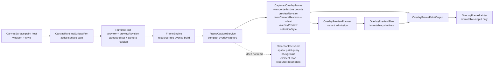
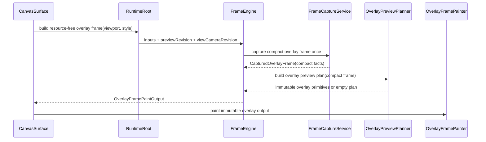

# Design: Overlay Frame Capture

---
date: 2026-06-10
designer: Codex
commit: 171a945b
branch: new-architecture
design_question: "Design an efficient, architecturally clean solution for overlay frame capture based on `.research/2026-06-10-overlay-frame-capture.md`."
---

## Disposition

READY_FOR_CONTRACT

## Product Outcome

Overlay-only interactions should stop paying the cost of a main-frame-style committed-scene capture while preserving the same visible overlay previews. Dragging marquee selection, drawing previews, line previews, and eraser previews should capture only the overlay facts they actually need: viewport/camera position, preview revision and payload, and captured selection style. The design must not change public preview DTO shapes, expose frame-private collaborators, move overlay rendering into the surface layer, or weaken the existing no-live-runtime-read painter boundary.

## Target Contract Classification

- Profile: BEHAVIOR_CHANGE
- Obligations:
  - BUG_FIX: current production overlay capture contradicts the compact overlay frame contract and performs unnecessary committed-scene reads.
  - SEAM_MIGRATION: migrate overlay capture consumers from `CapturedFrameSnapshot` reuse to a compact overlay-specific captured frame without replacing `FrameEngine`, `FrameCaptureService`, or `OverlayPreviewPlanner` as the owning seams.

## Research Inputs

- `.research/2026-06-10-overlay-frame-capture.md` - current overlay frame capture, planning, painting, and test structure for FRAME-001.

## Repository Evidence

`Evidence Consequence Link`: each fact below states the architecture decision, boundary, unit, proof surface, or review consequence it supports.

- `.research/2026-06-10-overlay-frame-capture.md:5` - research records that the contract describes `CapturedOverlayFrame` as preview revision, camera revision and offset, preview state, and selection style while code stores a shared `CapturedFrameSnapshot` plus nullable overlay preview -> supports treating this as contract drift at the overlay capture owner.
- `.research/2026-06-10-overlay-frame-capture.md:7` - research records the production overlay path through runtime surface bridge, `RuntimeRoot`, `FrameEngine`, `FrameCaptureService`, `OverlayPreviewPlanner`, and `OverlayFramePainter` -> supports keeping the fix inside the frame pipeline instead of patching the painter.
- `.research/2026-06-10-overlay-frame-capture.md:10` - research records that tests currently expect both main and overlay capture requests to read frame revisions, background, selected handles, resolved elements, resource descriptors, selection facts, and spatial queries -> supports future characterization and regression proof for the reduced overlay read surface.
- `docs/contracts/frame_rendering.md:85` - contract overlay frame field list begins separately from main frame -> supports a compact overlay frame model instead of reusing the full main snapshot shape.
- `docs/contracts/frame_rendering.md:88` - contract lists `CapturedOverlayFrame` as preview revision, view camera revision, view camera offset, preview state, and selection style -> supports required overlay fields and the missing revision repair.
- `docs/contracts/frame_rendering.md:96` - contract routes selected-move preview to the main-scene supplement path and routes marquee, stroke, pending line, line, and eraser previews to overlay capture -> supports preserving existing preview admission semantics while changing capture shape.
- `docs/contracts/frame_rendering.md:107` - frame rules require main and overlay paint to capture their respective frames once -> supports one overlay capture boundary, not planner-side live reads or repeated surface reads.
- `docs/contracts/frame_rendering.md:118` - painters must not live-read runtime -> supports carrying viewport/camera/style data in immutable overlay output after compact capture.
- `docs/contracts/frame_rendering.md:128` - camera changes repaint affected frame surfaces and must not invalidate ordinary committed element paint plans -> supports carrying `viewCameraRevision` for overlay output without touching ordinary cache identity.
- `docs/contracts/frame_rendering.md:154` - `FrameCaptureService` owns one-time capture into `CapturedMainFrame` and `CapturedOverlayFrame` and must not own planning or cache mutation -> supports making the compact capture in `FrameCaptureService`, not in `OverlayPreviewPlanner`.
- `docs/contracts/frame_rendering.md:160` - `OverlayPreviewPlanner` owns immutable overlay primitives admitted from `CapturedOverlayFrame` and must not own selected move, resource reads, cache invalidation, or repaint scheduling -> supports keeping preview variant mapping in the planner after capture shape changes.
- `docs/contracts/frame_rendering.md:175` - overlay primitives are immutable output from `CapturedOverlayFrame`, and marquee style is captured before painting -> supports preserving captured style as a direct overlay field or an overlay style value.
- `docs/contracts/frame_rendering.md:242` - ordinary spatial candidate reads are part of committed-frame ordinary paint planning -> supports excluding spatial paint query work from overlay capture.
- `docs/contracts/frame_rendering.md:250` - ordinary cache keys and records must exclude view camera, preview, selection, and style-only inputs -> supports not routing overlay efficiency through ordinary cache changes.
- `docs/architecture/01_runtime_ownership.md:142` - runtime ownership docs keep `FrameEngine` as frame orchestration facade with seven frame-private collaborators -> supports preserving the current owner split.
- `docs/architecture/01_runtime_ownership.md:155` - ownership table assigns one-time main/overlay capture to `FrameCaptureService` -> supports placing the model split in capture service.
- `docs/architecture/01_runtime_ownership.md:161` - ownership table assigns overlay primitive admission to `OverlayPreviewPlanner` and excludes selected move, resource reads, cache invalidation, and repaint scheduling -> supports keeping planner resource-free and capture-consumer-only.
- `docs/architecture/01_runtime_ownership.md:163` - committed facts stay store-owned through `FrameFactsPort`, selection facts through selection seams, and preview/camera facts stay runtime/interaction-owned and are captured at frame boundaries -> supports compact overlay capture as a boundary read, not duplicate state.
- `docs/architecture/architecture_graph.yaml:270` - architecture graph has `frame.renderer` as the required frame owner -> supports no new top-level overlay owner.
- `docs/architecture/architecture_graph.yaml:278` - graph evidence says `FrameEngine` owns frame capture, overlay planning, immutable output, repaint signals, and cache orchestration -> supports a frame-local behavior change.
- `docs/diagrams/dfd_overlay_frame.mmd:21` - current durable overlay data-flow diagram labels `FrameCaptureService` as overlay capture and single runtime read boundary -> supports future diagram repair if compact capture changes data flow.
- `docs/diagrams/dfd_overlay_frame.mmd:22` - diagram labels `CapturedOverlayFrame` as preview revision, view camera revision, view camera offset, preview state, and selection style -> supports compact overlay data fields and source-of-truth alignment.
- `docs/diagrams/seq_overlay_paint.mmd:16` - current durable sequence captures overlay frame once -> supports a single compact capture call.
- `docs/diagrams/seq_overlay_paint.mmd:23` - sequence note says `CapturedOverlayFrame` freezes preview revision, camera revision/offset, preview state, and selection style -> supports adding the missing code field and removing full snapshot dependence.
- `lib/src/frame/captured_frame.dart:35` - `CapturedFrameSnapshot` currently owns revisions, handles, resolved elements, descriptors, background, selection, inputs, spatial result, and spatial candidates -> supports the finding that this shape is too broad for overlay preview output.
- `lib/src/frame/captured_frame.dart:90` - `CapturedOverlayFrame` currently begins as a wrapper around shared snapshot and overlay preview -> supports changing the overlay model at the owning frame model file.
- `lib/src/frame/captured_frame.dart:96` - `CapturedOverlayFrame` currently stores `CapturedFrameSnapshot` -> supports future migration away from main snapshot reuse.
- `lib/src/frame/frame_capture_service.dart:40` - `captureOverlayFrame` currently calls the shared snapshot capture path -> supports the root-cause owner for unnecessary reads.
- `lib/src/frame/frame_capture_service.dart:52` - shared `_captureSnapshot` reads frame revisions, selection facts, spatial query, handles, element rows, descriptors, and background -> supports introducing a separate compact overlay capture path.
- `lib/src/frame/frame_engine.dart:152` - `FrameEngine.buildResourceFreeOverlayFrame` captures overlay frame then builds an overlay plan -> supports keeping `FrameEngine` orchestration order stable.
- `lib/src/frame/overlay_preview_planner.dart:99` - `OverlayPreviewPlanner.build` consumes `CapturedOverlayFrame` -> supports adapting the planner to the compact overlay shape rather than giving it runtime dependencies.
- `lib/src/frame/overlay_preview_planner.dart:146` - marquee primitive currently reads selection style through `frame.snapshot.inputs.selectionStyle` -> supports moving captured style to the overlay frame itself.
- `lib/src/surface/overlay_painter.dart:16` - overlay painter currently reads effective world bounds through `output.capturedFrame.snapshot.inputs` -> supports carrying overlay viewport/effective bounds in compact overlay output so painters stay immutable-output consumers.
- `lib/src/runtime/runtime_root.dart:413` - runtime exposes resource-free overlay frame build from viewport, DPR, selection style, and grid style -> supports adding camera revision to frame inputs at runtime boundary instead of exposing runtime to frame collaborators.
- `lib/src/runtime/runtime_root.dart:435` - runtime creates `FrameCaptureInputs` with viewport, DPR, selection style, grid style, preview, preview revision, camera offset, and text edit suppression -> supports splitting common input construction or adding overlay-specific fields at this boundary.
- `lib/src/runtime/runtime_root.dart:1214` - runtime increments `_viewCameraRevision` when camera offset changes -> supports using runtime's existing camera revision source for captured overlay output.
- `lib/src/runtime/runtime_root.dart:1497` - runtime state publication includes `viewCamera` and preview revisions -> supports compatibility with existing revision domains.
- `lib/src/contracts/public/canvas_runtime.dart:60` - public runtime revisions already include `viewCamera` and preview revision fields -> supports no public DTO shape change.
- `lib/src/surface/canvas_surface_widget.dart:187` - surface builds main frame output before overlay frame output for the same paint host -> supports preserving independent main and overlay capture calls while reducing overlay reads.
- `lib/src/surface/canvas_surface_widget.dart:200` - surface calls `buildSurfaceOverlayFrame` with the same viewport and styles used by the paint host -> supports using surface-provided viewport/style as overlay capture inputs.
- `test/frame/fixtures/main_overlay_capture_fixture.dart:118` - existing fixture expects duplicate main plus overlay frame revision/background/element/selection/spatial reads -> supports test updates that prove the read surface changed.
- `test/frame/fixtures/overlay_preview_admission_fixture.dart:46` - overlay preview admission tests build primitives from captured overlay frames for every overlay variant -> supports preserving variant admission proof after model migration.
- `test/frame/fixtures/marquee_captured_style_fixture.dart:18` - marquee test expects primitive style to match captured selection style -> supports retaining captured style proof.

## Design Form Candidates

### Candidate A. Keep shared snapshot and short-circuit only empty overlays

- Form: leave `CapturedOverlayFrame` as a `CapturedFrameSnapshot` wrapper, but have `FrameEngine` or `OverlayPreviewPlanner` avoid some work when there is no overlay preview.
- Why it could work: it is the smallest code change for the no-preview case.
- Gate failures or risks: it patches one downstream symptom while leaving the overlay model in contradiction with contract and diagrams. It cannot remove committed-scene reads for marquee, draw, line, or eraser previews because the overlay shape still depends on the shared snapshot. It also spreads preview-routing policy toward `FrameEngine` or the planner before the capture owner has built the right output.

### Candidate B. Split `CapturedOverlayFrame` into a compact overlay model owned by `FrameCaptureService`

- Form: keep `FrameEngine` as the facade, keep `FrameCaptureService` as the one-time capture owner, and change overlay capture to build a compact `CapturedOverlayFrame` that contains only overlay-required immutable facts: viewport/effective world bounds, device pixel ratio only if an overlay consumer proves it needs it, preview revision, view camera revision, view camera offset, overlay preview payload, and captured selection style. Main capture continues using `CapturedFrameSnapshot`.
- Why it could work: it aligns code with the contract's compact overlay frame, removes selection/spatial/background/element/resource reads from overlay capture, keeps overlay primitive admission in `OverlayPreviewPlanner`, and keeps painters immutable-output consumers by moving viewport/camera/style data into the compact overlay frame.
- Gate failures or risks: the contract and durable diagrams already describe a compact overlay frame but currently omit the viewport field the painter needs. The later Change Contract must repair `docs/contracts/frame_rendering.md`, `dfd_overlay_frame`, and `seq_overlay_paint` as mandatory source-of-truth updates before or with the code migration.

### Candidate C. Build overlay primitives directly at the runtime/surface boundary

- Form: bypass or shrink frame capture by creating overlay primitives in `RuntimeRoot` or `CanvasRuntimeSurfacePort`, then hand primitives directly to `OverlayFramePainter`.
- Why it could work: it removes full frame capture cost quickly.
- Gate failures or risks: it moves overlay admission out of the documented frame owner, gives runtime/surface preview rendering policy, makes `OverlayPreviewPlanner` decorative, and risks painter/surface live-read pressure. It fails ownership and dependency direction gates.

## Known Future Pressures

| Pressure | Evidence | How the selected form responds | Accepted cost or risk |
|---|---|---|---|
| Overlay preview interactions need lower paint-frame overhead without changing visual output. | `.research/2026-06-10-overlay-frame-capture.md:10`; `test/frame/fixtures/main_overlay_capture_fixture.dart:118` | Compact overlay capture removes committed-scene reads from overlay frame construction while keeping preview primitive output stable. | Existing read-count fixture must be rewritten to distinguish main full capture from overlay compact capture; broad "same reads twice" proof is retired. |
| Durable contract and diagrams already state compact overlay capture, but code currently does not. | `docs/contracts/frame_rendering.md:88`; `docs/diagrams/dfd_overlay_frame.mmd:22`; `lib/src/frame/captured_frame.dart:96` | Future contract must include source-of-truth repair and code alignment in the same execution path. | Documentation changes are mandatory; code-only optimization would leave stale verification guidance and should fail review. |
| Overlay painter still needs a stable translation viewport while avoiding live reads. | `lib/src/surface/overlay_painter.dart:16`; `docs/contracts/frame_rendering.md:118` | Compact overlay frame carries an overlay viewport/effective world bounds value captured at the same boundary. | The contract's overlay field list must be clarified to include viewport/effective bounds or an explicitly named overlay viewport value. |
| Camera revisions are required by contract but not currently captured in `FrameCaptureInputs`. | `docs/contracts/frame_rendering.md:90`; `lib/src/runtime/runtime_root.dart:435`; `lib/src/runtime/runtime_root.dart:1214` | Runtime passes existing `_viewCameraRevision` into frame inputs or an overlay-specific input object; overlay frame stores it. | Small signature migration across runtime/surface/frame tests is required, but no public runtime DTO changes are needed. |
| P10/P11 preview variants already depend on overlay admission staying frame-owned. | `docs/contracts/frame_rendering.md:96`; `test/frame/fixtures/overlay_preview_admission_fixture.dart:46` | `OverlayPreviewPlanner` keeps the variant matrix and consumes compact `CapturedOverlayFrame`. | Planner tests need helper migration, but public preview variant semantics remain unchanged. |
| Ordinary paint cache identity must not absorb overlay efficiency concerns. | `docs/contracts/frame_rendering.md:250`; `lib/src/frame/static_background_planner.dart:205` | Selected form avoids cache changes; main frame snapshot and ordinary/static planners remain as they are. | Performance gain is scoped to overlay capture, not a broader cache rewrite. |
| Surface builds main and overlay outputs separately in one paint host. | `lib/src/surface/canvas_surface_widget.dart:187`; `lib/src/surface/canvas_surface_widget.dart:200` | Main frame remains full capture; overlay frame becomes compact capture through the same bridge. | Main and overlay capture are still two calls; this design does not coalesce shared runtime inputs across them because that would introduce sync/caching risk. |

## Selected Form

Choose Candidate B: split overlay capture into a compact `CapturedOverlayFrame` built by `FrameCaptureService`, while leaving `FrameEngine` orchestration and `OverlayPreviewPlanner` variant admission intact.

The future implementation should make main and overlay capture intentionally asymmetric. `captureMainFrame` keeps using the full `CapturedFrameSnapshot` because ordinary paint, selected supplement, selection decoration, static background, and asset binding need committed-scene facts. `captureOverlayFrame` should not call `_captureSnapshot`; it should capture only overlay-required immutable facts and normalize the preview so `CanvasNoPreview` and `CanvasSelectedMovePreview` remain empty overlay output.

The compact overlay model must include an explicit overlay viewport value because the painter currently uses `effectiveWorldBounds` to translate overlay primitives. This is not a second source of truth: the viewport value is a captured paint-frame input, not cached state. The future Change Contract must update the frame-rendering contract and overlay diagrams so the durable overlay field list names this viewport/effective-bounds fact alongside preview revision, camera revision, camera offset, preview state, and selection style.

The migration should not introduce an overlay cache, a runtime-level primitive builder, or planner access to runtime/store/selection/spatial/resource seams. The useful efficiency gain comes from deleting unnecessary reads at the capture boundary, not from adding synchronization between main and overlay frames.

## Decision Trace

Preserve `Decision Chain Of Custody`: source inputs and locked decisions must map to the future contract field, execution unit, or proof surface that carries them forward.

| Decision ID | Decision | Evidence | Contract handoff target |
|---|---|---|---|
| D1 | Overlay capture must be compact and must not call the shared full `_captureSnapshot` path. | `docs/contracts/frame_rendering.md:88`; `lib/src/frame/frame_capture_service.dart:40`; `lib/src/frame/frame_capture_service.dart:52` | `Boundaries.Owner`; Unit for compact overlay capture; proof that overlay capture avoids selection/spatial/background/row/descriptor reads |
| D2 | `FrameCaptureService` remains the owner of one-time overlay capture; `OverlayPreviewPlanner` remains the owner of variant-to-primitive admission. | `docs/contracts/frame_rendering.md:154`; `docs/contracts/frame_rendering.md:160`; `lib/src/frame/overlay_preview_planner.dart:99` | `Boundaries.Owner`; `Execution order`; planner migration unit |
| D3 | Compact `CapturedOverlayFrame` must carry captured overlay viewport/effective bounds, preview revision, view camera revision, view camera offset, overlay preview payload, and selection style. | `docs/contracts/frame_rendering.md:88`; `lib/src/surface/overlay_painter.dart:16`; `lib/src/runtime/runtime_root.dart:1214`; `lib/src/frame/overlay_preview_planner.dart:146` | `Boundaries.Source of Truth`; captured model unit; contract/docs update unit |
| D4 | Runtime must pass the existing camera revision into frame capture without changing public runtime DTO shapes. | `lib/src/runtime/runtime_root.dart:1214`; `lib/src/runtime/runtime_root.dart:1497`; `lib/src/contracts/public/canvas_runtime.dart:60` | runtime/frame input migration unit; compatibility field |
| D5 | Public preview variant behavior remains unchanged: selected move is excluded from overlay, overlay variants still build immutable primitives, and marquee keeps captured style. | `docs/contracts/frame_rendering.md:96`; `test/frame/fixtures/overlay_preview_admission_fixture.dart:46`; `test/frame/fixtures/marquee_captured_style_fixture.dart:18` | focused frame tests; behavior-preservation proof |
| D6 | Source-of-truth repair is mandatory because current durable docs describe compact overlay capture but omit the viewport fact needed by painter output. | `docs/contracts/frame_rendering.md:88`; `docs/diagrams/dfd_overlay_frame.mmd:22`; `docs/diagrams/seq_overlay_paint.mmd:23`; `lib/src/surface/overlay_painter.dart:16` | `Source-Of-Truth Impact`; docs/diagram execution unit; docs checks |
| D7 | Ordinary/main frame capture and ordinary cache behavior must not be changed to achieve overlay efficiency. | `docs/contracts/frame_rendering.md:250`; `lib/src/surface/canvas_surface_widget.dart:187`; `lib/src/surface/canvas_surface_widget.dart:200` | scope constraints; regression tests for main capture and ordinary cache |

## Outcome-Proof Fit

| Claim | Direct outcome | Proxy risk | Required proof surface or strategy |
|---|---|---|---|
| Overlay capture no longer performs full committed-scene capture. | Calling overlay capture does not read selection facts, spatial paint query, background, element handles, element rows, or resource descriptors. | A visual overlay test could pass while the hidden read surface remains unchanged. | Focused capture fixture with read counters that asserts main capture reads full facts and overlay capture reads only compact overlay inputs. |
| Overlay previews render the same primitives after compact capture. | Each overlay preview variant still produces the same primitive kind and fields; selected move still produces no overlay primitive. | A reduced read-count test could pass while preview routing regresses. | Existing overlay admission fixture migrated to compact frame helper and retained variant matrix. |
| Marquee style remains captured, not live-read by painter. | Marquee primitive fields match the selection style captured in the overlay frame. | Painter screenshot or primitive count could pass with default style while custom style is lost. | Existing marquee captured style fixture migrated to compact frame shape. |
| Painter remains an immutable-output consumer. | `OverlayFramePainter` reads viewport/effective bounds and primitives from `OverlayFramePaintOutput` only; it does not receive runtime/store/selection/spatial/resource dependencies. | Import checks alone could miss a new callback or closure passed into output. | Surface/frame tests plus semantic/import guardrail or targeted search proving no live runtime/store/painter reads. |
| Camera revision is captured for overlay output without invalidating ordinary paint caches. | Overlay captured frame exposes the current view camera revision; ordinary paint plan/cache tests still show camera changes do not invalidate ordinary committed element plans. | Adding the field to inputs could accidentally feed ordinary cache identity. | Focused runtime/frame input test plus existing camera-pan ordinary cache proof. |
| Source-of-truth and implementation agree after migration. | Contract field list and overlay diagrams name compact overlay capture with viewport/effective bounds and match code. | Code tests could pass while durable docs keep misleading instructions for future work. | Documentation checks and architecture graph/diagram checks when docs/diagrams are updated. |

## Hard Gate Check

| Gate | Result | Evidence |
|---|---|---|
| Owner-Level Fix | pass | The root cause is `captureOverlayFrame` using `_captureSnapshot` (`lib/src/frame/frame_capture_service.dart:40`, `lib/src/frame/frame_capture_service.dart:52`), not a painter call-site issue. |
| Ownership | pass | `FrameCaptureService` owns capture and `OverlayPreviewPlanner` owns primitive admission (`docs/contracts/frame_rendering.md:154`, `docs/contracts/frame_rendering.md:160`). |
| Source-Of-Truth Singularity | pass | Compact overlay facts are captured paint-frame inputs; committed facts remain behind `FrameFactsPort`, selection facts remain selection-owned, and preview/camera facts stay runtime/interaction-owned (`docs/architecture/01_runtime_ownership.md:163`). |
| Boundary-Owned Policy | pass | Runtime supplies preview/camera/style/viewport inputs at the existing frame boundary, and frame capture freezes them before planning/painting (`lib/src/runtime/runtime_root.dart:435`, `docs/contracts/frame_rendering.md:107`, `docs/contracts/frame_rendering.md:118`). |
| Negative Proof And Fixture Quarantine | pass | Read-counter and import/semantic proof can use existing test fakes and frame/surface tests; no fixture-only names or data need to enter production contracts or public APIs (`test/frame/fixtures/main_overlay_capture_fixture.dart:118`, `docs/contracts/frame_rendering.md:21`). |
| Dependency direction | pass | The selected form stays under `lib/src/frame/**` and existing runtime/surface bridge calls; it does not add runtime/store/resource dependencies to planner or painter (`docs/architecture/architecture_graph.yaml:270`, `lib/src/frame/overlay_preview_planner.dart:99`, `lib/src/surface/overlay_painter.dart:16`). |
| State/data | pass | No new durable state or cache is introduced; overlay frame data is transient captured output for one paint frame (`docs/diagrams/seq_overlay_paint.mmd:23`). |
| Sequenced Migration And Retirement | pass | Successor seam is compact `CapturedOverlayFrame`; retired seam is overlay dependence on `CapturedFrameSnapshot`. Consumer order is model and capture service first, then planner/painter/test helpers, then docs/diagram alignment. Retirement gate is no overlay production/test access to `CapturedOverlayFrame.snapshot`. |
| Temporal Surface Closure | pass | Temporal invariant: overlay paint captures preview/camera/style/viewport once before primitive planning and painter consumption. Synchronous callback surfaces in this window are runtime/surface frame builders and `OverlayPreviewPlanner.build`; guard owner is `FrameEngine`/`FrameCaptureService`; public observation order remains runtime state publication before frame build; no reentrant/interleaved mutation is accepted through overlay capture because no mutation callbacks are introduced (`docs/contracts/frame_rendering.md:107`, `lib/src/frame/frame_engine.dart:152`, `lib/src/surface/canvas_surface_widget.dart:200`). |
| All-Or-Nothing Failure Boundary | pass | The irreversible point is publishing `OverlayFramePaintOutput` to `OverlayFramePainter`. Fallible or nullable work is preview normalization and primitive construction before output creation; later painter work is output consumption only. Failure projection is empty overlay plan for no overlay preview, not partial committed-scene capture (`lib/src/frame/frame_engine.dart:152`, `lib/src/frame/overlay_preview_planner.dart:99`). |
| Outcome-Proof Fit | pass | Direct outcome proofs are named for read surface, primitive fields, painter immutability, camera revision, and source-of-truth alignment in `Outcome-Proof Fit`. |
| Verification | pass | Existing focused frame fixtures already expose read counters and preview admission/style checks; docs list frame/surface required tests and guardrails (`test/frame/fixtures/main_overlay_capture_fixture.dart:118`, `docs/contracts/frame_rendering.md:21`). |
| Future pressure | pass | Future P10/P11 preview variants and P13 surface path remain compatible because admission stays in `OverlayPreviewPlanner` and surface still builds overlay frame through the bridge (`docs/contracts/frame_rendering.md:96`, `lib/src/surface/canvas_surface_widget.dart:200`). |

## Lock-Required Facts

- Owner: `FrameCaptureService` owns compact overlay capture; `FrameEngine` owns orchestration; `OverlayPreviewPlanner` owns overlay preview variant admission.
- Owning layer/module/document family: frame implementation under `lib/src/frame/**`, with source-of-truth updates later in `docs/contracts/frame_rendering.md`, `docs/diagrams/dfd_overlay_frame.mmd`, and `docs/diagrams/seq_overlay_paint.mmd`.
- Seam: existing `captureOverlayFrame(FrameCaptureInputs)` may either remain as the public frame-internal method with compact behavior or migrate to an overlay-specific input type; it must return a compact `CapturedOverlayFrame` and must not call `_captureSnapshot`.
- Dependency/import direction: frame capture may consume runtime-provided value inputs and public value types; overlay planner and painter must not import runtime, store, selection kernel, spatial kernel, resource session, or document projection.
- State/data ownership: committed document/background/element/resource facts remain main-frame capture concerns; selection facts remain selection-owned and are not read by overlay capture; preview and camera state remain runtime/interaction-owned and are copied into a transient overlay frame.
- Entry boundaries: `CanvasRuntimeSurfacePort.buildSurfaceOverlayFrame`, `RuntimeRoot.buildResourceFreeOverlayFrame`, `FrameCaptureInputs` or an overlay-specific equivalent, current preview, preview revision, camera offset, camera revision, viewport bounds, device pixel ratio only if needed by an overlay consumer, and captured selection style.
- Exit boundaries: compact `CapturedOverlayFrame`, `OverlayPreviewPlan`, `OverlayFramePaintOutput`, repaint signal, and immutable `OverlayFramePainter` input.
- File placement basis: update existing frame files (`captured_frame.dart`, `frame_capture_service.dart`, `frame_engine.dart`, `overlay_preview_planner.dart`, `frame_paint_output.dart`) only as needed; create a new frame-private file only if the compact overlay model would make `captured_frame.dart` incohesive.
- Execution order constraints: surface/runtime collect value inputs, runtime includes camera revision, `FrameEngine` calls compact `captureOverlayFrame`, capture normalizes overlay preview, planner maps compact frame to primitives, frame output is created, painter consumes output only.
- `Temporal Surface Closure` invariant, synchronous callback surfaces, guard/boundary owner, public observation order, and expected rejection/no-mutation signal: capture preview/camera/style/viewport once before planning; synchronous surfaces are bridge/root/engine/capture/planner calls; owner is frame capture boundary; public state publication order remains runtime-owned; reentrant mutation attempts are not introduced and no mutation API is accepted by overlay capture.
- `All-Or-Nothing Failure Boundary` irreversible point, fallible-before-irreversible work, later infallible/failure-contained/accepted work, failure projection, and proof surface: irreversible point is `OverlayFramePaintOutput`; preview normalization and primitive construction happen first; painter only consumes immutable output; no-preview/selected-move projection is empty plan; proof surface is focused output and primitive tests.
- Rejected alternatives: short-circuit-only shared snapshot; runtime/surface primitive construction; overlay cache; coalescing main and overlay capture through shared mutable state; ordinary cache key changes for overlay efficiency.
- Verification strategy: update frame capture read-counter tests, overlay preview admission tests, marquee style tests, overlay painter/surface no-live-read proof, camera revision capture proof, ordinary cache camera-preservation proof, docs checks, and architecture/diagram checks when source-of-truth files change.

## Diagram Need Assessment

| Design question | Needed? | Diagram kind | Reason |
|---|---:|---|---|
| Does the design change ownership, layer, package, or component boundaries? | no | none | Ownership remains `FrameEngine`/`FrameCaptureService`/`OverlayPreviewPlanner`; the change is inside existing frame boundaries. |
| Does it change data flow, state ownership, cache ownership, resource movement, or lifecycle movement? | yes | data_flow | Overlay capture data flow changes from shared full snapshot to compact overlay facts; durable overlay data-flow diagram must be updated later. |
| Does it depend on call order, lifecycle order, sync/async ordering, failure ordering, or migration order? | yes | sequence | Capture-before-plan-before-paint ordering is part of the invariant and durable overlay sequence must be updated later. |
| Does it introduce or alter observer/listener/callback delivery, guard windows, public-state publication, or reentrancy-sensitive ordering? | no | none | No observer or callback behavior changes; runtime state publication remains existing behavior. |
| Does it introduce or alter modes, statuses, terminal states, sessions, or transition rules? | no | none | No new modes, sessions, or terminal states are introduced. |
| Does it create, replace, migrate, or retire a shared seam under `Sequenced Migration And Retirement`? | yes | data_flow/sequence | It retires overlay dependence on `CapturedFrameSnapshot` and replaces it with compact `CapturedOverlayFrame`; data flow and sequence diagrams should reflect that. |
| Does it change public API consumer flow, payload shape, or compatibility behavior? | no | none | Public preview DTOs and surface API shapes remain compatible. |
| Does it introduce or change analyzer, guardrail, or structural-recognition pipeline behavior? | no | none | No analyzer pipeline is required; semantic/import checks may be used as verification but are not a new guardrail architecture. |

## Provisional Diagrams

## Source-Of-Truth Impact

`Source-Of-Truth Singularity`: durable overlay frame meaning should live in the frame-rendering contract and its registered diagrams. The code model should implement that meaning; tests should prove it. No duplicate runtime, surface, or planner-owned overlay truth should be introduced.

Future Change Contract must update:

- `docs/contracts/frame_rendering.md`: clarify `CapturedOverlayFrame` as compact and include the overlay viewport/effective-bounds fact needed by `OverlayFramePainter`; preserve preview/camera/style fields and selected-move exclusion.
- `docs/diagrams/dfd_overlay_frame.mmd`: remove any implication that overlay capture reads committed document, spatial, selection, background, or resource facts; include compact viewport/camera/preview/style flow.
- `docs/diagrams/seq_overlay_paint.mmd`: show compact capture and the absence of committed-scene reads before overlay planning.
- Generated docs/indexes only if repository documentation tooling updates them from those source files.

Do not update public API registries for DTO shape changes because this design does not change public API shapes.

## Verification Impact

Future Change Contract should use these proof surfaces:

- Focused frame capture test that asserts main capture still performs full committed-scene capture while overlay capture performs compact capture only.
- Overlay preview admission fixture migrated to compact `CapturedOverlayFrame`.
- Marquee captured style fixture migrated to compact `CapturedOverlayFrame`.
- Overlay painter or surface proof that viewport/effective bounds come from immutable output and no live runtime/store/document reads are introduced.
- Camera revision capture proof for overlay frame, plus existing ordinary camera-pan cache proof to prevent accidental cache key drift.
- Semantic/import check or targeted repository search showing overlay planner/painter do not gain runtime/store/selection/spatial/resource dependencies.
- Documentation checks after frame contract/diagram changes.
- Architecture graph checks if diagram or graph-derived generated views are touched.

## Verification Strategy

Use direct outcome checks rather than screenshot-only or proxy-only proof. The primary regression test should expose the hidden cost directly with read counters: overlay capture must not read selection facts, spatial paint, background, element rows, or resource descriptors. Existing primitive admission and captured style tests then prove visual behavior is preserved. Documentation and diagram checks are required because the selected form repairs contract/code drift, not only runtime behavior.

## Change Contract Handoff

- Required profile: BEHAVIOR_CHANGE
- Required obligations: BUG_FIX; SEAM_MIGRATION
- Decision IDs / Decision Trace rows to preserve: D1, D2, D3, D4, D5, D6, D7
- Evidence to cite: the `.research/2026-06-10-overlay-frame-capture.md` summary and detailed findings; `docs/contracts/frame_rendering.md:85`, `docs/contracts/frame_rendering.md:88`, `docs/contracts/frame_rendering.md:96`, `docs/contracts/frame_rendering.md:107`, `docs/contracts/frame_rendering.md:118`, `docs/contracts/frame_rendering.md:154`, `docs/contracts/frame_rendering.md:160`, `docs/diagrams/dfd_overlay_frame.mmd:22`, `docs/diagrams/seq_overlay_paint.mmd:23`, `lib/src/frame/captured_frame.dart:90`, `lib/src/frame/captured_frame.dart:96`, `lib/src/frame/frame_capture_service.dart:40`, `lib/src/frame/frame_capture_service.dart:52`, `lib/src/surface/overlay_painter.dart:16`, `lib/src/runtime/runtime_root.dart:1214`, and focused test fixtures.
- Contract constraints or sequencing facts: update source-of-truth contract/diagrams as mandatory scope; migrate compact model and capture owner before planner/painter/test helper changes; preserve main capture behavior; do not change public DTO shapes; do not add overlay cache or runtime/surface primitive builder; retire overlay access to `CapturedFrameSnapshot`.
- Required proof surfaces: compact overlay read-counter proof, variant admission proof, marquee style proof, painter immutability proof, camera revision proof, ordinary cache non-regression, docs checks, and architecture/diagram checks when triggered.

## Open Decisions

None. The future Change Contract may choose exact field names and whether compact overlay input is represented as `FrameCaptureInputs` plus camera revision or a separate overlay input type, but it must preserve D1-D7 and the source-of-truth repair.
