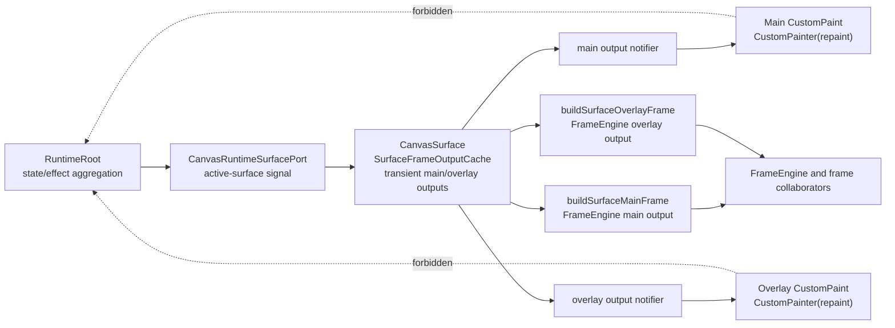
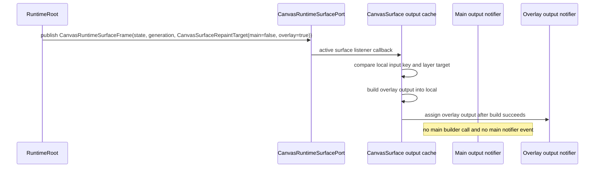

# Design: Layer-Aware Surface Repaint Routing

---
date: 2026-06-13
designer: Codex
commit: b6b59575
branch: new-architecture
design_question: "Choose the best architecture for FRAME-001 so repaint signals guide the real Flutter surface, improve performance, and do not worsen architecture."
---

## Disposition

READY_FOR_CONTRACT

## Product Outcome

The Flutter surface should stop doing main-layer work for overlay-only changes and stop doing overlay-layer work for main-only changes. Marquee, draw, line, and eraser previews should update the overlay layer without rebuilding or repainting the main scene. Selected-move previews, selection-only changes, and resource-dirty repaint should update the main layer without rebuilding or repainting overlay. Camera, load, runtime swap, and layout/style changes that affect both layers should still update both layers.

The design must preserve the public `CanvasSurface` API and visual behavior. It must not move frame planning into `CanvasSurface`, let painters read runtime/store state, introduce a second durable repaint source of truth, or add broad synchronization glue between duplicated state.

## Target Contract Classification

- Profile: BEHAVIOR_CHANGE
- Obligations:
- BUG_FIX: current production frame outputs contain repaint signals, but the surface has no pre-output layer target to consume before building and painting frame outputs.
  - SEAM_MIGRATION: migrate the runtime-surface bridge, surface paint host, and painter delegates from one state-driven paint host to a layer-aware internal surface repaint seam.

## Research Inputs

- `.research/2026-06-13-frame-repaint-signal-surface-usage.md` - current frame signal construction, runtime surface bridge, CanvasSurface paint host, painter repaint checks, and search coverage for signal consumption.

## Repository Evidence

`Evidence Consequence Link`: each fact below states the architecture decision, boundary, unit, proof surface, or review consequence it supports.

- `.research/2026-06-13-frame-repaint-signal-surface-usage.md:13` - research records `FrameRepaintSignal` fields for `mainCanvas`, `overlayCanvas`, and `reason` -> supports giving the internal surface target the same layer-target shape while keeping `FrameRepaintSignal` itself frame-owned.
- `.research/2026-06-13-frame-repaint-signal-surface-usage.md:21` - research records that `CanvasSurface` builds both main and overlay outputs inside the `ValueListenableBuilder` path -> supports moving layer selection before output construction.
- `.research/2026-06-13-frame-repaint-signal-surface-usage.md:29` - research records both painters compare output identity in `shouldRepaint` -> supports replacing identity-only repaint checks with layer-owned repaint triggers.
- `.research/2026-06-13-frame-repaint-signal-surface-usage.md:33` - research found production reads of `repaintSignal` only at construction/storage sites, not in surface scheduling -> supports treating surface consumption as the missing seam.
- `.research/2026-06-13-frame-repaint-signal-surface-usage.md:68` - research records main frame outputs currently have `mainCanvas: true` and `overlayCanvas: false` after the main output has already been built -> supports rejecting a solution that uses main output signals alone to skip main output construction.
- `.research/2026-06-13-frame-repaint-signal-surface-usage.md:87` - research records overlay output construction sets `overlayCanvas` from overlay primitive presence -> supports overlay-target proof but not pre-build main suppression.
- `.research/2026-06-13-frame-repaint-signal-surface-usage.md:150` - research records runtime state publication flows through `CanvasRuntimeSurfacePort.state` into `CanvasSurface` -> supports putting the internal surface frame signal on the runtime-surface bridge.
- `.research/2026-06-13-frame-repaint-signal-surface-usage.md:174` - research records the surface currently builds main output and overlay output before installing painter delegates -> supports introducing a surface-owned output cache/scheduler at that boundary.
- `.research/2026-06-13-frame-repaint-signal-surface-usage.md:189` - research records `MainFramePainter` paints from immutable output and compares output identity -> supports preserving immutable output consumption while changing repaint triggering.
- `.research/2026-06-13-frame-repaint-signal-surface-usage.md:218` - research records frame tests already assert selected-move and marquee signal fields -> supports retaining frame-level signal proof while adding surface-level proof.
- `docs/contracts/frame_rendering.md:112` - frame rendering rules state main and overlay paint each capture their frame once, committed facts enter through `FrameFactsPort`, and painters do not live-read runtime -> supports keeping frame output construction in frame/runtime boundaries and painter input immutable.
- `docs/contracts/frame_rendering.md:137` - runtime view camera changes repaint affected frame surfaces and must not invalidate ordinary committed element paint plans -> supports a both-layer runtime signal for camera without ordinary cache key drift.
- `docs/contracts/frame_rendering.md:156` - `FrameEngine` remains the frame-internal facade for orchestration, painter input assembly, and repaint bus coordination -> supports not moving repaint target meaning into painter code.
- `docs/contracts/frame_rendering.md:163` - `FrameCaptureService` owns one-time main/overlay capture and must not own planning or cache mutation -> supports leaving output construction behind existing frame calls.
- `docs/contracts/frame_rendering.md:169` - `OverlayPreviewPlanner` owns overlay primitives and must not own repaint scheduling -> supports keeping scheduling at the runtime-surface boundary, not inside overlay planning.
- `docs/contracts/frame_rendering.md:177` - `PaintAssetBindingService` is the only target frame collaborator that receives `SurfaceResourceSession` and painters never receive store/runtime/resolver access -> supports main-output rebuild staying in the surface resource session boundary.
- `docs/contracts/frame_rendering.md:324` - render primitive cache misses must not trigger repaint scheduling -> supports keeping repaint routing outside render primitive caches.
- `docs/architecture/01_runtime_ownership.md:63` - runtime ownership docs assign capture, planning, painter input assembly, and repaint buses to `FrameEngine` -> supports keeping `FrameRepaintSignal` frame-owned and introducing a separate runtime/surface target for pre-output scheduling.
- `docs/architecture/architecture_graph.yaml:278` - architecture graph evidence says `FrameEngine` owns frame capture, immutable painter output, repaint signals, and cache orchestration -> supports mandatory source-of-truth updates if the future contract changes the boundary between frame output signals and runtime/surface invalidation targets.
- `docs/contracts/interaction_engine.md:264` - `PointerCleanupOutcome` records repaint target and runtime/public signal aggregation may consume the paired outcome after cleanup -> supports runtime-owned aggregation of cleanup repaint targets.
- `docs/contracts/interaction_engine.md:304` - interaction contract lists preview repaint targets by preview variant -> supports runtime deriving preview layer signals from interaction-owned preview changes rather than surface inference.
- `docs/contracts/interaction_engine.md:312` - marquee, pencil, marker, pending line, line, and eraser previews are overlay only, while selected move is main scene only -> supports direct surface proof for overlay-only and main-only preview updates.
- `docs/contracts/operation_matrix.md:352` - selection changes publish `state.revisions.selection` when selected ids change -> supports main-layer invalidation for selection state changes.
- `docs/contracts/operation_matrix.md:363` - selection repaint target is main selection repaint -> supports main-only surface signal for selection set/toggle/clear/select-all operations.
- `docs/contracts/operation_matrix.md:441` - mode changes repaint main and overlay only for affected changed state -> supports runtime aggregation of affected-layer signals instead of surface guessing from revision deltas.
- `docs/contracts/operation_matrix.md:467` - draw style changes repaint overlay only if a pending draw preview must reflect changed style -> supports keeping pending-preview style policy in runtime/interaction owners.
- `docs/contracts/operation_matrix.md:566` - markResourceDirty repaint target is main -> supports main-only resource dirty surface signal.
- `docs/contracts/operation_matrix.md:592` - markAllResourcesDirty repaint target is main -> supports main-only all-resource dirty surface signal.
- `docs/contracts/public_api_v1.md:531` - a `CanvasSurface` is active only after successful runtime attachment until detach/dispose -> supports attaching internal repaint listeners only after active-surface acceptance.
- `docs/contracts/public_api_v1.md:533` - rejected second active surface throws before paint, repaint-listener, or resolver attachment side effects -> supports sequencing listener installation after the active-surface gate.
- `docs/contracts/public_api_v1.md:562` - `CanvasSurface.resourceResolver` is the app-owned synchronous image resolver for that surface -> supports main-output invalidation on resolver replacement as a surface-local input change.
- `docs/contracts/public_api_v1.md:563` - successful attach creates a `SurfaceResourceSession` before paint resolves image assets -> supports bootstrapping main output only after session installation.
- `docs/contracts/public_api_v1.md:567` - replacing `resourceResolver` refreshes session generation and prevents stale reuse -> supports main-layer rebuild on resolver replacement even without a runtime state revision change.
- `docs/contracts/public_api_v1.md:1880` - camera offset changes update `state.revisions.viewCamera` and repaint affected surfaces without document projection invalidation -> supports both-layer surface signal for camera.
- `docs/contracts/public_api_v1.md:1984` - markResourceDirty publishes main repaint intent and attached `CanvasSurface` observes it -> supports making main-only resource dirty observation executable in the surface.
- `docs/verification/benchmarks.md:80` - selected-move preview benchmark measures scene repaint count -> supports preserving selected-move as main-only and avoiding overlay work.
- `docs/verification/benchmarks.md:82` - marquee preview benchmark measures overlay repaint count -> supports overlay-only surface proof and future benchmark alignment.
- `docs/verification/benchmarks.md:87` - frame main capture benchmark measures main capture cost -> supports avoiding main capture on overlay-only previews.
- `docs/verification/benchmarks.md:88` - frame overlay capture benchmark measures overlay capture cost -> supports retaining compact overlay capture as the overlay-only path.
- `docs/verification/tests.md:773` - surface widget tests prove the public surface paint host stays stable while frame-owned outputs render through surface-owned painter adapters -> supports migrating focused surface tests with the same ownership intent.
- `docs/verification/tests.md:816` - no-live-runtime-read painter tests prove surface-owned painters consume immutable frame outputs and do not read runtime/store/document/resolver/session state during paint -> supports preserving this boundary with listenable output sources.
- `docs/verification/tests.md:902` - frame selected-move and marquee repaint tests prove main-only and overlay-only repaint through frame output fixtures -> supports keeping frame-level proof and adding missing surface-level proof.
- `docs/verification/guardrails.md:214` - `preview.selected_move_main_repaint` says selected move increments main repaint, not overlay -> supports main-only selected-move surface routing.
- `docs/verification/guardrails.md:216` - `preview.marquee_overlay_only` says marquee preview is routed only through overlay repaint domain -> supports overlay-only surface routing.
- `lib/src/contracts/internal/commit_delivery.dart:39` - `RepaintDeliveryEffect` already carries `mainCanvas` and `overlayCanvas` booleans -> supports reusing internal runtime effect aggregation as a source for surface signals.
- `lib/src/runtime/runtime_root.dart:1499` - runtime publishes public state by assigning `_state.value` -> supports adding or pairing an internal surface-frame notifier at the same owner that already publishes state.
- `lib/src/runtime/runtime_root.dart:2228` - runtime merges cleanup delivery effects through `_mergeRepaintEffects` -> supports aggregating multiple layer requests before surface observation.
- `lib/src/runtime/runtime_root.dart:2244` - runtime maps pointer cleanup repaint targets to `RepaintDeliveryEffect` values -> supports not making surface infer cleanup target from preview deltas.
- `lib/src/runtime/runtime_root.dart:2675` - load effects include `RepaintDeliveryEffect(mainCanvas: true, overlayCanvas: true)` -> supports both-layer rebuild for load/replacement.
- `lib/src/runtime/runtime_root.dart:2689` - resource dirty effects include `RepaintDeliveryEffect(mainCanvas: true)` -> supports main-only resource-dirty surface updates.
- `lib/src/resources/surface_resource_session.dart:33` - the active surface session exposes pending budget follow-up repaint state -> supports preserving main-layer budget follow-up scheduling when main output is rebuilt.
- `lib/src/resources/surface_resource_session.dart:167` - `replaceResolver` increments resolver generation, clears cache/suppression, and clears pending follow-up -> supports main-layer invalidation on resolver replacement.
- `lib/src/surface/canvas_surface_widget.dart:91` - current `CanvasSurface` listens to `port.state` with `ValueListenableBuilder` -> supports replacing state-driven rebuild with a surface-frame listener and layer notifiers.
- `lib/src/surface/canvas_surface_widget.dart:187` - current surface builds main output unconditionally in `_buildPaintHost` -> supports moving main output construction behind `mainCanvas` or local main-input invalidation.
- `lib/src/surface/canvas_surface_widget.dart:200` - current surface builds overlay output unconditionally in `_buildPaintHost` -> supports moving overlay output construction behind `overlayCanvas` or local overlay-input invalidation.
- `lib/src/surface/canvas_surface_widget.dart:208` - current surface uses one `CustomPaint` for main and foreground overlay painters -> supports splitting main and overlay into independent paint render objects for layer-isolated repaint.
- `lib/src/surface/main_painter.dart:31` - current main painter repaints when output identity changes -> supports replacing identity-only decisions with `CustomPainter(repaint: ...)` from a main output notifier.
- `lib/src/surface/overlay_painter.dart:28` - current overlay painter repaints when output identity changes -> supports replacing identity-only decisions with `CustomPainter(repaint: ...)` from an overlay output notifier.
- `test/surface/fixtures/widget_paint_fixture.dart:119` - surface widget tests already cover resource budget follow-up frames -> supports preserving budget follow-up behavior while making it main-layer scoped.
- `test/surface/fixtures/widget_paint_fixture.dart:175` - surface widget tests already cover selected-move and overlay preview routing -> supports extending this fixture to prove layer output build counts and identity retention.
- `test/surface/fixtures/surface_camera_frame_output_fixture.dart:13` - surface camera test proves camera pan keeps ordinary plan identity -> supports both-layer camera update without ordinary cache invalidation.

## Design Form Candidates

### Candidate A. Smarter `shouldRepaint` Only

- Form: keep the current `ValueListenableBuilder`, build both outputs every state change, and change `MainFramePainter.shouldRepaint` / `OverlayFramePainter.shouldRepaint` to inspect output repaint signals or output equality more deeply.
- Why it could work: it is the smallest edit to the two painter classes and may reduce some paint calls when output identity can be reused or compared semantically.
- Gate failures or risks: it fails the owner-level performance target because the surface still builds both outputs before the painter can decide anything (`lib/src/surface/canvas_surface_widget.dart:187`, `lib/src/surface/canvas_surface_widget.dart:200`). It also cannot use `MainFramePaintOutput.repaintSignal` to suppress main output construction because the signal exists only after main output construction and is always main-targeted for a built main output (`.research/2026-06-13-frame-repaint-signal-surface-usage.md:68`). Rejected.

### Candidate B. Surface-Derived Layer Routing From Public State Deltas

- Form: keep `CanvasRuntimeSurfacePort.state` as the only listenable and let `CanvasSurface` compare previous and next `CanvasRuntimeState` revisions plus current preview type to decide whether to rebuild main, overlay, or both.
- Why it could work: it avoids a runtime bridge change and can route common preview and camera cases.
- Gate failures or risks: it moves repaint policy into the Flutter surface, duplicates operation-matrix and interaction repaint-target meaning, and cannot reliably decide cleanup or pending-style cases that are owned by interaction/runtime effects (`docs/contracts/interaction_engine.md:264`, `docs/contracts/operation_matrix.md:467`). It would make the surface infer from public revisions instead of consuming the owning layer's repaint decision. Rejected.

### Candidate C. Internal Surface Frame Signal Plus Layer Output Cache

- Form: add an internal `CanvasRuntimeSurfaceFrame` value under the runtime-surface bridge that carries current public runtime state, a generation, and a `CanvasSurfaceRepaintTarget` before output construction. `RuntimeRoot` remains the aggregation owner for runtime/interaction/commit/resource repaint effects. `CanvasSurface` consumes that signal through the existing active-surface port, updates a surface-owned `SurfaceFrameOutputCache` only for targeted layers, and exposes each cached output through a layer-specific `ValueListenable` used by stable painter delegates.
- Why it could work: it applies the existing repaint target before building outputs, reuses runtime-owned repaint effects and interaction-owned preview target rules, keeps frame planning behind existing frame methods, keeps surface responsible only for Flutter lifecycle and transient paint-output caching, and gives direct proof seams for "unaffected layer was not rebuilt".
- Gate failures or risks: it changes a shared internal seam between runtime and surface and changes the paint host shape. The future Change Contract must sequence runtime signal publication, output cache introduction, painter migration, widget test migration, and source-of-truth updates together.

### Candidate D. Full Direct Painter Repaint Bus Without Surface Output Cache

- Form: expose per-layer `Listenable` repaint buses from runtime/frame directly to the painters and let each painter fetch or build its output on paint.
- Why it could work: it is closest to Flutter's most efficient repaint path and could avoid widget rebuilds.
- Gate failures or risks: it risks painter live reads or paint-time output construction, which conflicts with the no-live-runtime-read painter boundary (`docs/verification/tests.md:816`) and frame rules that painters consume immutable outputs (`docs/contracts/frame_rendering.md:127`). It also makes failure containment harder because fallible resolver/session work could occur inside paint. Rejected.

## Known Future Pressures

| Pressure | Evidence | How the selected form responds | Accepted cost or risk |
|---|---|---|---|
| Overlay previews need overlay-only work at large scene sizes. | `docs/verification/benchmarks.md:82`; `docs/verification/benchmarks.md:87`; `.research/2026-06-13-frame-repaint-signal-surface-usage.md:21` | Overlay-only frame signals update only overlay cached output and overlay painter notifier; main output build is skipped. | Adds a surface-owned cache and scheduler seam that must be tested directly. |
| Selected move is main-scene preview, not overlay. | `docs/contracts/interaction_engine.md:320`; `docs/verification/guardrails.md:214` | Selected-move preview signals update main cached output and leave overlay output unchanged. | Surface tests must prove overlay output identity/build count does not change for selected move. |
| Resource dirty and resolver replacement are main-layer concerns. | `docs/contracts/public_api_v1.md:567`; `docs/contracts/public_api_v1.md:1984`; `lib/src/resources/surface_resource_session.dart:167` | Runtime resource-dirty signal and surface resolver replacement both invalidate main only. | Resolver replacement has no runtime state event, so it remains a local surface input invalidation. |
| Camera changes affect both visible coordinate systems but must not invalidate ordinary element paint plans. | `docs/contracts/public_api_v1.md:1880`; `docs/contracts/frame_rendering.md:137`; `test/surface/fixtures/surface_camera_frame_output_fixture.dart:13` | Camera signal rebuilds both layer outputs, while focused frame/surface tests preserve ordinary plan/cache identity. | Both layer outputs still rebuild for camera; ordinary cache identity proof prevents broader cache churn. |
| Existing public surface attachment forbids repaint-listener side effects before successful attach. | `docs/contracts/public_api_v1.md:531`; `docs/contracts/public_api_v1.md:533` | The internal surface frame listener is installed only after active-surface attach and session installation; detach removes it before dropping cached outputs. | Lifecycle ordering becomes part of future proof, not an incidental widget detail. |
| Painters must not gain runtime, store, resolver, or session reads. | `docs/verification/tests.md:816`; `docs/contracts/frame_rendering.md:177` | Painters receive surface-owned layer output listenables whose values are immutable frame outputs; only surface builds outputs through existing frame/session boundaries. | Painter constructors and tests migrate from direct output fields to output-listenable fields. |
| Existing compact overlay capture must remain the overlay path. | `docs/contracts/frame_rendering.md:98`; `docs/verification/benchmarks.md:88` | Selected form skips main output on overlay-only changes and keeps overlay output built through existing compact overlay frame path. | It does not coalesce main and overlay capture inputs; both-layer events still build both outputs independently. |

## Selected Form

Choose Candidate C: an internal `CanvasRuntimeSurfaceFrame` signal carrying a `CanvasSurfaceRepaintTarget`, a surface-owned `SurfaceFrameOutputCache`, and independent main/overlay Flutter paint layers.

The future implementation should introduce non-public `CanvasRuntimeSurfaceFrame` and `CanvasSurfaceRepaintTarget` values in `lib/src/api/canvas_runtime_surface_bridge.dart`. `CanvasRuntimeSurfaceFrame` should carry the current `CanvasRuntimeState`, a monotonically increasing surface-frame generation, and exactly one `CanvasSurfaceRepaintTarget`. `CanvasSurfaceRepaintTarget` should carry `mainCanvas`, `overlayCanvas`, and `reason` fields so it can be mapped mechanically from runtime repaint effects and operation/interaction repaint policy without importing or reusing the frame-owned `FrameRepaintSignal` type. Runtime remains the aggregation owner for surface invalidation intent because it already merges commit, cleanup, load, resource, selection, camera, and interaction publication effects. Interaction remains the preview variant owner; frame remains the output construction owner and continues to own `FrameRepaintSignal` on frame outputs; surface only consumes the pre-output target to decide which cached output to rebuild.

`CanvasSurface` should replace the current "state notification builds both outputs" path with `SurfaceFrameOutputCache` in `lib/src/surface/surface_frame_output_cache.dart`. The cache owns only transient Flutter adapter state: the last main output, the last overlay output, local build inputs, and two layer output notifiers. It must not become a document, preview, frame-plan, resource, or cache-policy owner. It calls `buildSurfaceMainFrame` only when a main-targeted signal or main-affecting local input changes, and calls `buildSurfaceOverlayFrame` only when an overlay-targeted signal or overlay-affecting local input changes.

Main and overlay must render through separate Flutter paint render objects, not one `CustomPaint` with a foreground painter. Each layer painter should use `CustomPainter(repaint: ...)` with its layer output notifier so an overlay-only notification marks only the overlay render object dirty and a main-only notification marks only the main render object dirty. A `Stack` or equivalent fixed-size paint host can preserve the public surface as one widget while giving main and overlay independent repaint boundaries. The existing paint host key may stay on the wrapper, while new internal keys may identify layer hosts for tests.

Local Flutter inputs remain surface-owned invalidation sources. Runtime/frame signals handle runtime-owned repaint meaning. Layout size, viewport, device pixel ratio, selection style, grid style, runtime swap, attach/bootstrap, resource resolver replacement, and resource budget follow-up are local surface inputs. Their mapping is explicit: viewport/device-pixel-ratio/runtime swap/bootstrap affect both layers; selection style affects both layers; grid style affects main; resolver replacement and budget follow-up affect main. Unknown or unclassified runtime signals must conservatively rebuild both layers until a contract-backed mapping proves a narrower target.

The selected form intentionally does not implement a full painter-owned repaint bus. Painters still consume immutable `MainFramePaintOutput` and `OverlayFramePaintOutput` values, just from a surface-owned output source instead of constructor identity. Output construction remains outside paint. If a later performance step wants to bypass build/layout even further, this design leaves a clean upgrade path because the internal surface frame signal and layer output notifiers already separate runtime invalidation from Flutter painting.

## Decision Trace

Preserve `Decision Chain Of Custody`: source inputs and locked decisions must map to the future contract field, execution unit, or proof surface that carries them forward.

| Decision ID | Decision | Evidence | Contract handoff target |
|---|---|---|---|
| D1 | Runtime/surface must expose `CanvasRuntimeSurfaceFrame` with current state, generation, and `CanvasSurfaceRepaintTarget` before output construction; painter output signals alone are insufficient because they exist after output construction. `FrameRepaintSignal` stays frame-owned output metadata. | `.research/2026-06-13-frame-repaint-signal-surface-usage.md:21`; `.research/2026-06-13-frame-repaint-signal-surface-usage.md:68`; `lib/src/contracts/internal/commit_delivery.dart:39`; `docs/architecture/01_runtime_ownership.md:63` | `Boundaries.Owner`; runtime-surface bridge unit; proof: overlay-only signal skips main builder |
| D2 | RuntimeRoot owns repaint target aggregation for state/effect publication, while InteractionEngine owns preview variant target meaning. | `docs/contracts/interaction_engine.md:264`; `docs/contracts/interaction_engine.md:304`; `lib/src/runtime/runtime_root.dart:2228`; `lib/src/runtime/runtime_root.dart:2244` | `Boundaries.Source of Truth`; runtime aggregation unit; proof: cleanup/style/preview target tests |
| D3 | CanvasSurface owns only transient `SurfaceFrameOutputCache` state and Flutter lifecycle invalidation, not repaint policy meaning or frame planning. | `lib/src/surface/canvas_surface_widget.dart:187`; `lib/src/surface/canvas_surface_widget.dart:200`; `docs/contracts/frame_rendering.md:156`; `docs/contracts/frame_rendering.md:177` | surface output cache unit; `Boundaries.Owner`; proof: cache build counters and import checks |
| D4 | Main and overlay must be separate Flutter paint layers with separate repaint listenables. | `lib/src/surface/canvas_surface_widget.dart:208`; `lib/src/surface/main_painter.dart:31`; `lib/src/surface/overlay_painter.dart:28` | surface paint host/painter unit; proof: overlay-only repaint leaves main painter/build unchanged |
| D5 | Local surface inputs have explicit layer invalidation mapping separate from runtime repaint intent. | `docs/contracts/public_api_v1.md:562`; `docs/contracts/public_api_v1.md:567`; `lib/src/resources/surface_resource_session.dart:33`; `lib/src/resources/surface_resource_session.dart:167` | `Execution order`; surface local invalidation unit; proof: resolver replacement and budget follow-up main-only tests |
| D6 | Unknown or unclassified runtime changes conservatively rebuild both layers until narrowed by source-of-truth evidence. | `docs/contracts/operation_matrix.md:441`; `docs/contracts/frame_rendering.md:112` | compatibility constraint; fallback branch proof; review checklist |
| D7 | Source-of-truth updates must make the split between frame-owned output repaint signals and runtime/surface pre-output invalidation targets durable. | `docs/README.md:22`; `docs/contracts/frame_rendering.md:156`; `docs/architecture/01_runtime_ownership.md:63`; `docs/architecture/architecture_graph.yaml:278`; `docs/verification/tests.md:773` | `Source-Of-Truth Impact`; architecture/docs/diagram/test-index update unit; docs and architecture checks |

## Outcome-Proof Fit

| Claim | Direct outcome | Proxy risk | Required proof surface or strategy |
|---|---|---|---|
| Overlay-only preview does not rebuild main output. | A marquee/draw/line/eraser preview signal calls the overlay output builder and does not call the main output builder. | Inspecting painter output identity could pass if the code rebuilt main output and discarded it. | Surface output cache test with counting build callbacks plus widget fixture showing main output identity unchanged. |
| Overlay-only preview does not repaint main layer. | Overlay notifier fires and main layer notifier/render object does not. | Visual screenshot could pass while both layers repaint. | Focused surface widget or render-object test with layer paint counters, plus two-layer host structure inspection. |
| Selected-move preview does not rebuild or repaint overlay. | Selected-move signal calls main output builder only and leaves overlay output/notifier unchanged. | Frame-level signal tests can pass while surface still rebuilds overlay. | Surface output cache counter test and widget fixture extending selected-move routing proof. |
| Resource dirty and resolver replacement are main-only at the surface. | Resource-dirty runtime signal and resolver replacement rebuild main output only, preserving overlay output identity. | Resolver call counts alone could pass from session cache hits while main was still rebuilt at the wrong time. | Cache/scheduler build counter tests plus existing resource dirty/session invalidation tests. |
| Camera changes rebuild both layer outputs without invalidating ordinary committed element paint plans. | Main and overlay builders are called once for camera, and ordinary plan key/identity proof remains stable. | Repaint count proof could pass while ordinary cache churns. | Existing surface camera frame output proof plus new surface scheduler build-count assertion. |
| Painters remain immutable-output consumers. | Painter paint reads only current immutable output from its layer output source and never reads runtime/store/document/resolver/session. | Import checks alone could miss a closure or callback that live-reads runtime. | Existing no-live-runtime-read painter test updated for output listenables plus targeted semantic/import search. |
| Repaint listener lifecycle has no side effects before accepted attach. | Second active surface rejection happens before frame listener, session, pointer, paint, or resolver side effects. | A happy-path surface test could miss rejected attach ordering. | Existing single-active-surface/resource-session lifecycle tests extended for repaint listener installation/removal ordering. |
| All-or-nothing output cache publication preserves prior layer outputs on failed build. | For a one-layer signal, the cache assigns the new output only after that layer build succeeds; for both-layer signals, both new outputs are built before either notifier is updated. | A broad exception test could pass while one layer updates and the other stays stale after failure. | Surface output cache failure-injection test using build callbacks that throw before publication. |

## Hard Gate Check

| Gate | Result | Evidence |
|---|---|---|
| Owner-Level Fix | pass | The defect is at the shared runtime/surface scheduling boundary: both outputs are built before painters decide repaint (`lib/src/surface/canvas_surface_widget.dart:187`, `lib/src/surface/canvas_surface_widget.dart:200`), and production does not read layer flags in surface scheduling (`.research/2026-06-13-frame-repaint-signal-surface-usage.md:33`). Selected form fixes that owner boundary instead of only editing painter call sites. |
| Ownership | pass | Runtime owns state/effect publication (`lib/src/runtime/runtime_root.dart:1499`), interaction owns preview target rules (`docs/contracts/interaction_engine.md:304`), frame owns output construction (`docs/contracts/frame_rendering.md:156`), and surface owns Flutter lifecycle/adapters (`docs/verification/tests.md:773`). |
| Source-Of-Truth Singularity | pass | Surface target meaning is a transient runtime-surface event derived from existing operation/interaction/effect sources; `FrameRepaintSignal` remains the frame-owned output signal. Output cache is explicit performance duplication with an invariant that unchanged layers reuse prior immutable output until their runtime or local input invalidates. |
| Boundary-Owned Policy | pass | Runtime-surface bridge is the entry boundary for runtime repaint signals; `CanvasSurface` is the entry boundary for local Flutter inputs; frame methods remain the output construction exit boundary; painters receive output-only listenables. Evidence: `lib/src/api/canvas_runtime_surface_bridge.dart:34`, `lib/src/surface/canvas_surface_widget.dart:187`, `docs/contracts/frame_rendering.md:177`. |
| Negative Proof And Fixture Quarantine | pass | Negative proof uses a production surface output-cache seam with test build callbacks and existing surface widget fixtures; no fixture-only values need to enter public APIs, docs registries, schemas, or production source-of-truth files. Evidence: `test/surface/fixtures/widget_paint_fixture.dart:175`, `docs/verification/tests.md:773`. |
| Dependency direction | pass | Surface may depend on the API bridge, frame outputs, and resources session as existing allowed owner edges show (`test/guardrails/owner_dag_import_boundaries_test.dart:967`, `test/guardrails/owner_dag_import_boundaries_test.dart:997`, `test/guardrails/owner_dag_import_boundaries_test.dart:1046`). Painters still must not import runtime/store/resource session. |
| State/data | pass | Cached main/overlay outputs are transient surface adapter state; committed data remains store/frame-owned, preview/camera remains runtime/interaction-owned, and resource resolver/cache remains `SurfaceResourceSession`-owned (`docs/contracts/frame_rendering.md:177`, `lib/src/resources/surface_resource_session.dart:17`). |
| Sequenced Migration And Retirement | pass | Successor seam is internal surface frame signal plus surface layer output cache. Retired behavior is `CanvasSurface` using public runtime state notification to rebuild both outputs and one shared `CustomPaint` to repaint both layer delegates. Consumer order: runtime signal, cache, painters/paint host, tests/docs. Retirement gate: no production surface path builds both outputs for a single-layer runtime signal. |
| Temporal Surface Closure | pass | Invariant: runtime publishes layer signal after the owning mutation/effect decision and before surface output rebuild; surface listener updates output notifiers only after active-surface attach and before detach cleanup completes. Synchronous callback surfaces: runtime state/effect publication, surface frame listener, main asset binding through `SurfaceResourceSession`, and layer output notifier delivery. Guard owner: `RuntimeRoot` for mutation/repaint aggregation and `_CanvasSurfaceState` for active token/session identity. Public observation order: accepted runtime state remains published before user-action events; surface repaint follows the internal frame signal. Expected rejection/no-mutation signal: rejected second surface attach installs no repaint listener or session side effects (`docs/contracts/public_api_v1.md:533`). |
| All-Or-Nothing Failure Boundary | pass | Irreversible point is assigning a new layer output to its notifier. Fallible work is output building and resolver callback work before notifier assignment. For both-layer rebuilds, build both outputs into locals before publishing either notifier. Later painter repaint only consumes already-published immutable output. Failure projection is prior output retained and the same exception behavior as current frame build. Proof surface: surface output cache failure-injection test. |
| Outcome-Proof Fit | pass | Direct outcomes and proxy risks are listed in `Outcome-Proof Fit`; each selected-form claim has a proof surface that would fail if the claimed layer routing, output build, paint, lifecycle, or failure behavior is false. |
| Verification | pass | Existing frame/surface/resource tests provide starting proof, and selected form adds direct build-counter, notifier, lifecycle, and failure-injection proof surfaces. Evidence: `docs/verification/tests.md:773`, `docs/verification/tests.md:816`, `docs/verification/tests.md:902`. |
| Future pressure | pass | Benchmarks and guardrails already separate scene and overlay repaint domains (`docs/verification/benchmarks.md:80`, `docs/verification/benchmarks.md:82`, `docs/verification/guardrails.md:216`); selected form aligns the real surface with those domains without changing public API. |

## Lock-Required Facts

- Owner: `RuntimeRoot` owns internal layer repaint aggregation for surface observation; `CanvasRuntimeSurfacePort` exposes the active-surface signal; `_CanvasSurfaceState` owns transient layer output cache and Flutter listener lifecycle; `FrameEngine` and existing frame collaborators own output construction; `MainFramePainter` and `OverlayFramePainter` consume immutable output values only.
- Owning layer/module/document family: implementation under `lib/src/runtime/runtime_root.dart`, `lib/src/api/canvas_runtime_surface_bridge.dart`, `lib/src/surface/**`, and existing painter files; future source-of-truth updates under `docs/contracts/**`, `docs/diagrams/**`, and verification docs if proof ids or registered diagrams change.
- Seam: internal `CanvasRuntimeSurfaceFrame` carrying current runtime state, generation, and `CanvasSurfaceRepaintTarget`; `SurfaceFrameOutputCache` mapping runtime and local invalidations to main/overlay output builders; layer `ValueListenable` outputs consumed by painters through `CustomPainter(repaint: ...)`.
- Dependency/import direction: runtime may emit internal signal through API bridge; surface may consume API bridge, frame output types, and resource session; frame must not import surface/runtime widget code; painters must not import runtime/store/selection/resource session or public document projection.
- State/data ownership: committed document, spatial, resource descriptors, selection facts, preview state, camera state, and frame caches stay with current owners. Surface output cache duplicates only derived immutable frame outputs for performance; invariant is "a cached layer output is valid until its runtime layer signal or local input key invalidates it."
- Entry boundaries: runtime mutations/effects, interaction preview changes, cleanup outcomes, resource dirty outcomes, camera changes, surface attach/detach/runtime swap, layout/viewport/DPR, selection/grid style inputs, resolver replacement, and budget follow-up callbacks.
- Exit boundaries: main output notifier, overlay output notifier, independent main `CustomPaint`, independent overlay `CustomPaint`, and existing public `CanvasSurface` widget tree/pointer adapter.
- File placement basis: place `SurfaceFrameOutputCache` in `lib/src/surface/surface_frame_output_cache.dart`. Place both `CanvasRuntimeSurfaceFrame` and `CanvasSurfaceRepaintTarget` in `lib/src/api/canvas_runtime_surface_bridge.dart` so the existing named bridge remains the only API-to-frame/surface runtime bridge touched by this seam. Do not add an API companion file, broad `common`, `shared`, or phase/step-named files. Do not import `frame_repaint_signal.dart` into the bridge and do not add the signal to public contracts.
- Execution order constraints: active attach succeeds; session is installed; initial local inputs are known; both outputs are built for bootstrap; runtime/surface listener starts; layer signals rebuild targeted cached outputs into locals; output notifier assignment happens only after successful build; budget follow-up is scheduled only after main output build; detach removes listener, clears pending follow-up, drops cache outputs, then drops session.
- `Temporal Surface Closure` invariant, synchronous callback surfaces, guard/boundary owner, public observation order, and expected rejection/no-mutation signal: invariant is "surface observes a runtime-owned layer target after mutation/effect acceptance and applies it to output cache before notifying only affected layer painters." Synchronous surfaces are runtime publication, surface listener, frame builders, resolver callback guard, output notifier dispatch, and painter repaint. Guard owners are `RuntimeRoot` for mutation/repaint aggregation and `_CanvasSurfaceState` for active identity. Rejected attach or inactive token produces no listener/session/paint side effects.
- `All-Or-Nothing Failure Boundary` irreversible point, fallible-before-irreversible work, later infallible/failure-contained/accepted work, failure projection, and proof surface: notifier assignment is irreversible. Build output and resolver callback work happen before assignment. Painter work after assignment is output consumption. On failure, keep previous output and propagate failure consistently with current build behavior. Prove with cache failure-injection tests.
- Rejected alternatives: painter-only `shouldRepaint`; surface-derived state-delta policy; painter-owned direct runtime/frame repaint bus; new overlay cache in frame; ordinary cache key changes for preview/style; public API surface changes.
- Verification strategy: direct build-counter tests for surface output cache, layer notifier/paint tests for independent repaint, existing frame repaint signal tests, widget preview routing tests, resource dirty/resolver replacement tests, camera ordinary-plan preservation tests, lifecycle rejection tests, no-live-runtime-read painter tests, docs checks, architecture graph checks when diagrams are updated, and Dart/DCM checks for changed owners.

## Diagram Need Assessment

| Design question | Needed? | Diagram kind | Reason |
|---|---:|---|---|
| Does the design change ownership, layer, package, or component boundaries? | yes | c4 | It adds an internal runtime-surface signal and surface output-cache seam while preserving runtime/frame/surface ownership. A provisional component diagram clarifies boundaries. |
| Does it change data flow, state ownership, cache ownership, resource movement, or lifecycle movement? | yes | data_flow | Repaint data now flows from runtime signal to surface output cache to layer notifiers; cache ownership changes from implicit widget rebuild to explicit transient surface cache. |
| Does it depend on call order, lifecycle order, sync/async ordering, failure ordering, or migration order? | yes | sequence | Listener attach/detach, bootstrap, layer output build, notifier assignment, and failure containment are order-sensitive. |
| Does it introduce or alter observer/listener/callback delivery, guard windows, public-state publication, or reentrancy-sensitive ordering? | yes | sequence | The internal surface frame listener and output notifiers are observer surfaces with active-token and resolver-callback guard windows. |
| Does it introduce or alter modes, statuses, terminal states, sessions, or transition rules? | no | none | No user modes, sessions, or terminal states are added; existing active surface and resource session lifecycle are reused. |
| Does it create, replace, migrate, or retire a shared seam under `Sequenced Migration And Retirement`? | yes | c4/data_flow/sequence | It replaces `CanvasSurface` state-driven both-output scheduling with internal surface frame signal plus output cache. |
| Does it change public API consumer flow, payload shape, or compatibility behavior? | no | none | Public `CanvasSurface`, runtime state DTOs, preview DTOs, and resource resolver API stay source-compatible. |
| Does it introduce or change analyzer, guardrail, or structural-recognition pipeline behavior? | no | none | New proof may use targeted semantic/import checks, but no new analyzer pipeline is selected by the design. |

## Provisional Diagrams

## Source-Of-Truth Impact

`Source-Of-Truth Singularity`: frame output repaint meaning stays with `FrameEngine` and `FrameRepaintSignal`; pre-output surface invalidation meaning is owned by runtime/interaction/effect source-of-truth inputs and surfaced as one transient internal `CanvasSurfaceRepaintTarget`. The surface output cache is performance duplication of derived immutable frame outputs only. Its invariant and proof strategy must be documented in the future Change Contract and, if source-of-truth docs are changed, in the owning docs.

Future Change Contract must update or verify these source-of-truth surfaces:

- `docs/contracts/frame_rendering.md`: clarify that `FrameRepaintSignal` remains frame-owned output metadata, while the Flutter surface consumes `CanvasSurfaceRepaintTarget` before output construction and painters remain output-only consumers through layer output sources.
- `docs/architecture/01_runtime_ownership.md`: clarify the split between frame-owned output repaint signals and runtime-owned pre-output surface invalidation target aggregation.
- `docs/architecture/architecture_graph.yaml`: update graph evidence if the current `FrameEngine` repaint-signal ownership wording would otherwise contradict `CanvasSurfaceRepaintTarget`.
- `docs/contracts/public_api_v1.md`: update the surface contract only if the implementation changes repaint-listener lifecycle wording or stable paint-host expectations; preserve public constructor and DTO compatibility.
- `docs/contracts/operation_matrix.md` and `docs/contracts/interaction_engine.md`: do not duplicate repaint target tables unless the implementation changes their meaning; cite them as owners of runtime/interaction repaint target policy.
- `docs/diagrams/dfd_main_paint_frame.mmd`, `docs/diagrams/dfd_overlay_frame.mmd`, `docs/diagrams/seq_main_paint.mmd`, and `docs/diagrams/seq_overlay_paint.mmd`: update only if durable diagrams need to show surface layer signal/cache flow after the implementation.
- `docs/verification/tests.md`, `docs/verification/guardrails.md`, and registry/generated indexes only if the future contract adds or changes required proof ids, test ownership, or guardrail coverage.

Do not update public API registries for DTO shape changes because this design does not change public API shapes.

## Verification Impact

Future Change Contract should use these proof surfaces:

- Surface output cache unit tests with counting build callbacks for overlay-only, main-only, both-layer, local-input, unknown-signal fallback, and failure-injection cases.
- Surface widget tests extending `test/surface/fixtures/widget_paint_fixture.dart` to prove overlay-only preview keeps main output identity/build count stable, selected-move keeps overlay output identity/build count stable, and the stable paint host still renders.
- Resource tests proving markResourceDirty/markAllResourcesDirty and resolver replacement rebuild main only and preserve overlay output identity.
- Budget follow-up tests proving the existing pending budget follow-up schedules only main output rebuild and keeps stale runtime/session guards.
- Camera tests proving both layer outputs update for camera while ordinary plan identity remains stable.
- Lifecycle tests proving rejected second active surface installs no repaint listener/session/cache side effects, and detach/runtime swap removes listeners before dropping session/cache.
- Painter tests proving `MainFramePainter` and `OverlayFramePainter` still consume immutable output and do not read runtime/store/document/resolver/session state.
- Frame repaint signal tests remain as lower-level proof for selected-move main-only and marquee overlay-only routing.
- Documentation checks and architecture graph/diagram checks when source-of-truth docs or diagrams are changed; architecture graph checks are mandatory if `docs/architecture/architecture_graph.yaml` changes.
- Dart analysis, DCM analysis, DCM metrics for changed runtime/api/surface/frame/test scopes.

## Verification Strategy

Use direct outcome proof before visual or proxy proof. The primary correctness checks are build counters and notifier/paint counters that prove an unaffected layer is not rebuilt or repainted. Then use existing frame output, widget paint, resource dirty, camera, lifecycle, and no-live-read tests to prove compatibility. Documentation and diagram checks are required if the future contract changes durable source-of-truth text or registered diagrams.

## Change Contract Handoff

- Required profile: BEHAVIOR_CHANGE
- Required obligations: BUG_FIX; SEAM_MIGRATION
- Decision IDs / Decision Trace rows to preserve: D1, D2, D3, D4, D5, D6, D7.
- Evidence to cite: `.research/2026-06-13-frame-repaint-signal-surface-usage.md:21`, `.research/2026-06-13-frame-repaint-signal-surface-usage.md:33`, `.research/2026-06-13-frame-repaint-signal-surface-usage.md:68`, `docs/contracts/interaction_engine.md:312`, `docs/contracts/operation_matrix.md:363`, `docs/contracts/operation_matrix.md:566`, `docs/contracts/public_api_v1.md:533`, `docs/contracts/frame_rendering.md:156`, `lib/src/contracts/internal/commit_delivery.dart:39`, `lib/src/runtime/runtime_root.dart:2228`, `lib/src/surface/canvas_surface_widget.dart:187`, `lib/src/surface/canvas_surface_widget.dart:200`, `lib/src/surface/canvas_surface_widget.dart:208`, `lib/src/surface/main_painter.dart:31`, `lib/src/surface/overlay_painter.dart:28`.
- Contract constraints or sequencing facts: introduce `CanvasRuntimeSurfaceFrame` and `CanvasSurfaceRepaintTarget` in `lib/src/api/canvas_runtime_surface_bridge.dart` before surface consumes them; keep `FrameRepaintSignal` frame-owned and do not import it into the bridge; introduce `SurfaceFrameOutputCache` before painter migration; split paint host before claiming independent layer repaint; keep output building outside painter paint methods; install listeners only after accepted active-surface attach; publish cached outputs only after successful layer build; conservatively rebuild both layers for unknown/unclassified runtime signals; update architecture/docs/diagrams in the same contract when their durable meaning changes.
- Required proof surfaces: surface output cache build-counter tests, surface widget preview routing tests, resource dirty/resolver replacement tests, budget follow-up tests, camera ordinary-plan preservation tests, single-active-surface lifecycle tests, no-live-runtime-read painter tests, existing frame repaint signal tests, docs checks, architecture graph checks when triggered, semantic/import proof that `canvas_runtime_surface_bridge.dart` does not import `frame_repaint_signal.dart`, Dart/DCM checks.

## Open Decisions

- None. The architecture choice is locked for future Change Contract authoring.
