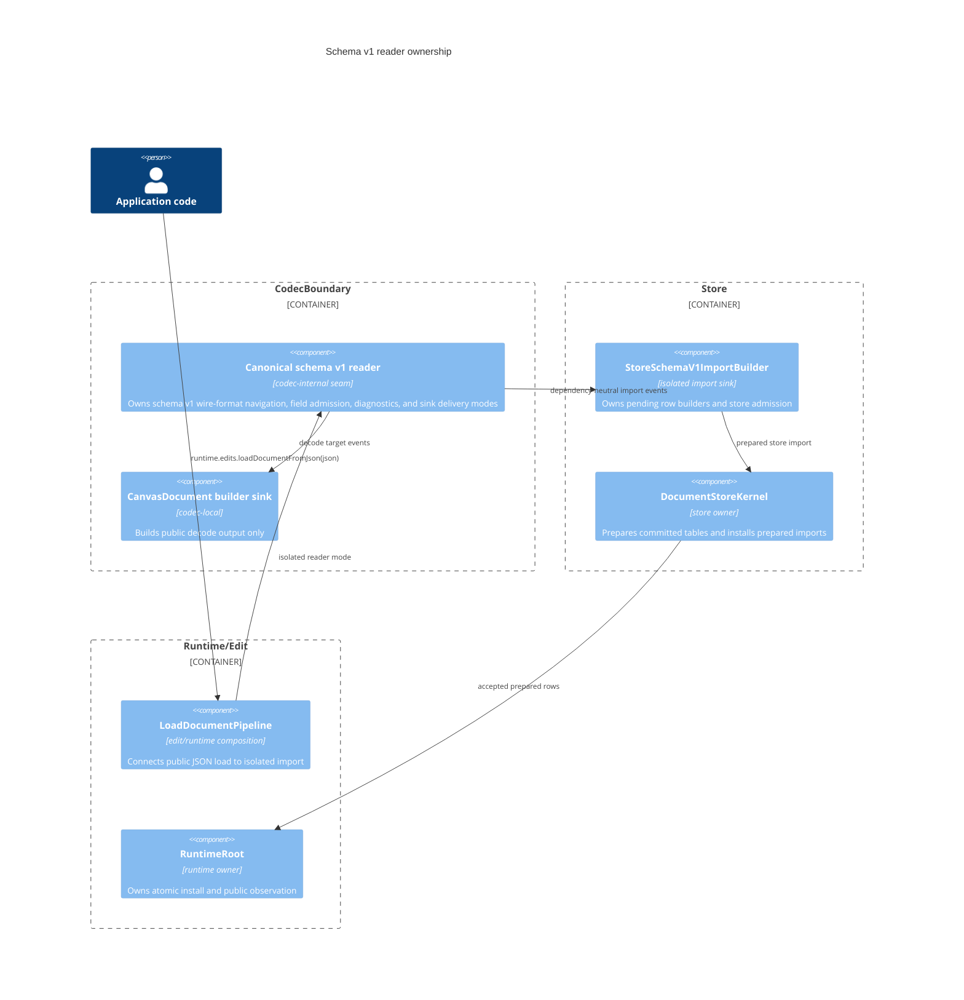
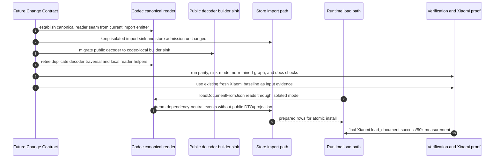
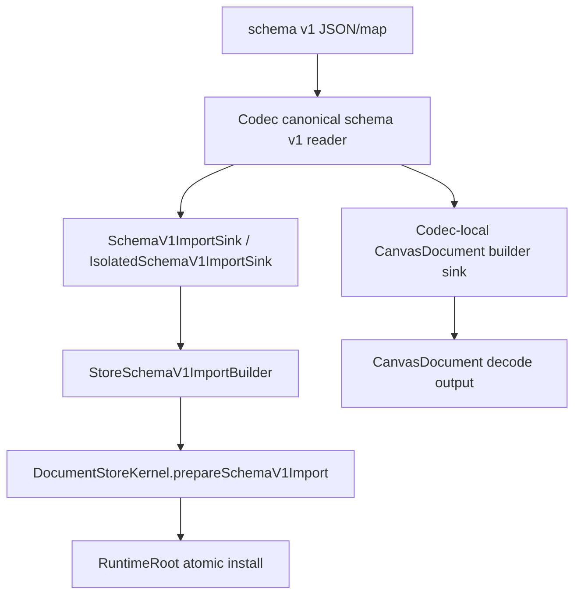

# Design: Schema V1 Reader Consolidation

---
date: 2026-06-14
designer: Codex
commit: 342d3fc1
branch: new-architecture
design_question: "Design a clean, fast architecture that removes duplicated schema v1 JSON reading between the public decoder and the fast import/load path without regressing load performance, using the existing fresh Xiaomi baseline for contract authoring and requiring a final Xiaomi measurement during implementation."
---

## Disposition

READY_FOR_CONTRACT

## Product Outcome

Schema v1 JSON reading has one codec-owned source of truth for wire-format
navigation and field admission. Runtime JSON load keeps the current fast shape:
JSON is read into dependency-neutral import events and consumed by store-owned
row builders without constructing a public `CanvasDocument`, public
`CanvasImageResource`, retained event list, or first public projection.

Non-goals: this design does not change public API names, schema v1 JSON shape,
store row ownership, runtime load atomicity, resource resolver behavior, or
benchmark fixture scale policy. It also does not implement code or draft a
Change Contract.

## Target Contract Classification

- Profile: REFACTOR
- Obligations: SEAM_MIGRATION

## Research Inputs

- `.research/2026-06-14-schema-v1-load-read-paths.md` - records the duplicated
  decoder/import-emitter read paths, current runtime/load/store flow, tests,
  guardrails, and benchmark surfaces.

## Repository Evidence

`Evidence Consequence Link`: each fact below states the decision, boundary,
unit, proof surface, or review consequence it supports.

- `.research/2026-06-14-schema-v1-load-read-paths.md:13` - current schema v1
  has two production read paths, one public decoder and one runtime import path
  -> supports selecting an owner-level consolidation instead of a local helper
  cleanup.
- `.research/2026-06-14-schema-v1-load-read-paths.md:25` - fast runtime load is
  an explicit architecture decision that avoids public DTOs and first projection
  -> supports the no-regression performance boundary.
- `.research/2026-06-14-schema-v1-load-read-paths.md:37` - duplicated surface
  is schema navigation and field validation across document sections, resources,
  layers, elements, metadata, transforms, and colors -> supports making
  wire-format reading the consolidated source of truth.
- `lib/src/codec/schema_v1_decoder.dart:24` - public decoder entry currently
  owns schema v1 map navigation -> supports moving decoder away from independent
  JSON traversal.
- `lib/src/codec/schema_v1_decoder.dart:65` - decoder materializes public
  `CanvasDocument` -> supports keeping public DTO assembly as decoder-local,
  not runtime-load-local.
- `lib/src/codec/schema_v1_decoder.dart:78` - decoder validates document
  references after public DTO materialization -> supports keeping public decode
  reference validation separate from runtime store row admission.
- `lib/src/codec/schema_v1_decoder.dart:821` - decoder has local schema map
  reader helpers -> supports structural proof that duplicate wire readers were
  retired.
- `lib/src/codec/schema_v1_import_emitter.dart:1` - import emitter is already
  described as the codec-owned load handoff that avoids public DTOs and
  store-owned row types -> supports using this existing path as the successor
  reader owner.
- `lib/src/codec/schema_v1_import_emitter.dart:32` - isolated import emitter is
  the JSON-to-sink runtime route -> supports preserving the fast entry point.
- `lib/src/codec/schema_v1_import_emitter.dart:50` - non-isolated import path
  validates before event delivery -> supports preserving public sink no-partial
  delivery semantics.
- `lib/src/codec/schema_v1_import_emitter.dart:190` - current emitter reads and
  emits document, resources, background elements, layers, and layer elements in
  one ordered pass -> supports making event emission the canonical reader flow.
- `lib/src/codec/schema_v1_import_emitter.dart:409` - emitter owns camera,
  background, palette, and metadata document-event reading -> supports
  consolidating document envelope reads.
- `lib/src/codec/schema_v1_import_emitter.dart:698` - emitter owns element-kind
  dispatch into import events -> supports consolidating element navigation.
- `lib/src/codec/schema_v1_import_emitter.dart:1099` - emitter has local map
  readers parallel to decoder readers -> supports removing duplicate read
  helpers from the decoder.
- `docs/contracts/codec_boundary.md:35` - `CodecBoundary` owns schema v1 encode
  and internal import validation -> supports keeping the consolidated reader in
  codec, not store/runtime.
- `docs/contracts/codec_boundary.md:65` - public decode helpers are not runtime
  load routes -> supports keeping runtime load on import events.
- `docs/contracts/codec_boundary.md:67` - codec side must not materialize
  `CanvasDocument`, `CanvasImageResource`, store rows, store sinks, or retained
  document-sized payloads for runtime load -> supports rejecting a retained
  intermediate model.
- `docs/contracts/codec_boundary.md:73` - public non-isolated sinks receive
  events only after validation succeeds, while runtime isolated import may
  stream and abort pending state -> supports preserving both sink modes.
- `docs/contracts/load_document.md:63` - load success starts with raw length,
  parse, schema validation, import events, store preparation, atomic install,
  invalidation, repaint, and one state publication -> supports preserving
  runtime load ordering.
- `docs/contracts/load_document.md:122` - failed load must not build public
  projection, create public resources, install partial rows, clear selection, or
  notify listeners -> supports all-or-nothing proof requirements.
- `docs/architecture/03_data_model.md:61` - schema v1 JSON load uses
  dependency-neutral events into store-owned prepared rows, not public
  `CanvasDocument` -> supports runtime data-flow boundary.
- `docs/architecture/03_data_model.md:127` - public DTOs are projections ->
  supports keeping `CanvasDocument` only on public decode/read output paths.
- `docs/architecture/03_data_model.md:216` - public document projection cache is
  lazy and built only by explicit read/encode/test/tool/draft paths -> supports
  no eager projection in the selected form.
- `lib/src/edit/staged_document_load.dart:123` - runtime prepare creates
  `StoreSchemaV1ImportBuilder`, imports JSON into isolated sink, and asks store
  to prepare rows -> supports keeping runtime load path one-pass and sink-based.
- `lib/src/store/schema_v1_store_import.dart:12` - store import builder is the
  single handoff from import events to committed store tables and splitting it
  would create another retained import graph -> supports not inserting a new
  runtime payload layer.
- `lib/src/store/schema_v1_store_import.dart:87` - store import preparation
  consumes pending import state into `PreparedStoreDocumentImport` -> supports
  store-owned row preparation remaining unchanged.
- `test/codec/schema_v1_import_emitter_test.dart:22` - structural test keeps
  the import emitter codec-owned and non-retained -> supports future structural
  proof for the new canonical reader.
- `test/codec/schema_v1_import_emitter_test.dart:356` - duplicate ids and
  missing resource references are not codec-owned policy for import events ->
  supports keeping cross-row admission in store for runtime load.
- `test/store/fixtures/schema_v1_store_import_fixture.dart:29` - valid import
  prepares and installs rows without projection -> supports performance and
  projection proof.
- `test/store/fixtures/schema_v1_store_import_fixture.dart:48` - store
  preparation owns duplicate/reference rejection -> supports the selected
  policy split.
- `docs/_registry/benchmarks.yaml:680` - `load_document.success` is a registered
  benchmark -> supports mandatory performance proof.
- `docs/_registry/benchmarks.yaml:694` - load success requires
  `schema_import_load_us` -> supports using that metric for no-regression.
- `test/benchmarks/benchmark_probe_flutter.dart:2086` - `_timedLoadDocument`
  measures `runtime.edits.loadDocumentFromJson(encodedJson)` -> supports
  measuring the public runtime load path, not an internal helper.
- `test/benchmarks/benchmark_probe_flutter.dart:2051` - breakdown measures load
  separately from first projection -> supports excluding first projection from
  load success acceptance.
- `docs/_registry/sections.yaml:175` - schema v1 contract registry links
  `dfd_schema_v1_import_encode` and `seq_schema_v1_import_encode_order` ->
  supports mandatory durable diagram impact assessment.
- `docs/_registry/sections.yaml:660` - `CodecBoundary` registry links the same
  schema v1 import/encode diagrams -> supports including diagram registry/docs
  checks in future proof.
- `docs/diagrams/dfd_schema_v1_import_encode.mmd:26` - current data-flow
  diagram names the schema v1 import event stream -> supports checking whether
  the canonical reader and decoder sink must be shown.
- `docs/diagrams/seq_schema_v1_import_encode_order.mmd:16` - current sequence
  diagram routes runtime load through `importSchemaV1DocumentFromJson(json,
  sink)` -> supports checking whether ordering language remains accurate after
  reader consolidation.
- `.design/2026-06-07-canonical-schema-v1-json-load-api.md:541` - prior design
  records validation extraction pressure and forbids codec-to-store imports or a
  retained import graph -> supports this design's extraction boundary.
- `.design/2026-06-07-canonical-schema-v1-json-load-api.md:634` - prior design
  names Xiaomi 22081283G Android 14 Flutter 3.44.0 as the performance
  acceptance contour -> supports mandatory Xiaomi measurement.
- `.research/2026-06-14-schema-v1-load-read-paths.md:556` - research records a
  mismatch between prior 574000 us Xiaomi gate and current 1500000 us diff cap
  -> supports mandatory benchmark source-of-truth reconciliation in the future
  Change Contract.

## Design Form Candidates

### Candidate A. Canonical Event Reader With Decoder Sink

- Form: move the current import-emitter reader core into one codec-owned
  canonical schema v1 reader seam. Existing import functions delegate to it.
  The public decoder becomes an internal sink/builder consumer of the same
  reader and owns only public DTO assembly plus decoder-specific
  post-materialization reference validation.
- Why it could work: the current fast load path already has the required
  streaming event shape, isolated abort behavior, and store-owned row consumer.
  Making the decoder consume that same seam removes duplicated JSON navigation
  while preserving runtime load's existing one-pass sink boundary.
- Gate failures or risks: requires careful migration so the decoder does not
  retain import events as a document-sized list and runtime load does not gain
  another per-element target callback beyond the existing sink call. Requires
  structural proof, the existing fresh Xiaomi baseline as contract input, and a
  final Xiaomi measurement after implementation.

### Candidate B. Shared Leaf Field Readers Only

- Form: extract scalar/map/list/color/metadata/transform helper functions into a
  shared codec utility while leaving decoder and import emitter traversal
  independent.
- Why it could work: small mechanical change with low compatibility risk.
- Gate failures or risks: not selected. It leaves two independent traversals for
  camera, background, resources, layers, element dispatch, and metadata budget
  policy. A future schema field could still drift between the decoder and fast
  load path, so the owner-level hole remains open.

### Candidate C. Retained Validated Schema Fact Graph

- Form: parse schema v1 JSON into one intermediate validated document/fact
  graph; both decoder and runtime load consume that graph.
- Why it could work: it would centralize all validation and make parity easy to
  inspect.
- Gate failures or risks: not selected. It violates the load boundary that
  forbids codec-side `CanvasDocument`, `CanvasImageResource`, store rows, store
  sinks, or retained document-sized validated fact/list/tree payloads
  (`docs/contracts/codec_boundary.md:67`). It would also add memory and
  traversal cost to the path that was intentionally made fast.

### Candidate D. Code Generation From Schema Declarations

- Form: define schema v1 fields once in a generator input and generate both
  decoder and import-emitter readers.
- Why it could work: generated code could preserve performance and avoid manual
  drift.
- Gate failures or risks: not selected. The repository currently has no
  schema-reader generator source of truth in this area, so the design would add
  a new tooling owner and generated-code lifecycle to solve a local two-consumer
  duplication. It is a larger source-of-truth migration than current evidence
  requires.

## Known Future Pressures

| Pressure | Evidence | How the selected form responds | Accepted cost or risk |
|---|---|---|---|
| Runtime load must stay fast and avoid public DTO/projection work. | `docs/contracts/load_document.md:65`; `docs/contracts/load_document.md:122`; `docs/architecture/03_data_model.md:216` | Keeps the current isolated sink path and forbids retained event lists, public DTOs, public resources, and first projection on runtime load. | Future contract must include structural no-retained-graph proof and Xiaomi benchmark proof. |
| Existing import emitter is already guarded as codec-owned and non-retained. | `test/codec/schema_v1_import_emitter_test.dart:22` | Reuses that shape as the canonical reader seam and extends the guard to the successor reader file/wrapper. | Structural tests will need to move from file-name-specific checks to owner/seam-specific checks. |
| Public decoder still needs public `CanvasDocument` output. | `lib/src/codec/schema_v1_decoder.dart:65`; `docs/architecture/03_data_model.md:127` | Public decoder becomes a builder sink over canonical events and then materializes `CanvasDocument`. | Public decoder may still retain DTO lists, but only on explicit public decode output, not runtime load. |
| Cross-row id/reference policy is intentionally store-owned for runtime import. | `docs/contracts/codec_boundary.md:69`; `test/codec/schema_v1_import_emitter_test.dart:356`; `test/store/fixtures/schema_v1_store_import_fixture.dart:48` | Does not move duplicate/missing-reference rejection into the canonical codec reader for runtime events; store remains runtime admission owner. Decoder keeps public decode reference validation after DTO materialization. | This is an intentional policy split, so future parity tests must distinguish field-shape validation from owner-specific row admission. |
| Public non-isolated sinks and runtime isolated sinks have different partial-delivery semantics. | `docs/contracts/codec_boundary.md:73`; `lib/src/codec/schema_v1_import_emitter.dart:50`; `lib/src/codec/schema_v1_import_emitter.dart:60` | Canonical reader preserves both modes: prevalidate-before-delivery for public sinks, streaming-with-abort for isolated sinks. | Migration must include forced-failure tests for both modes. |
| Benchmark source-of-truth currently has a cap mismatch. | `.research/2026-06-14-schema-v1-load-read-paths.md:556`; `tool/bench/src/benchmark_diff.dart:23` | Locks a stronger design requirement: future contract must cite the existing fresh Xiaomi baseline as input evidence, require a final Xiaomi measurement after implementation, and reconcile the benchmark gate so no regression is accepted. | Contract authoring cannot treat the existing 1500000 us cap alone as sufficient proof of no regression. |
| Registered durable diagrams already describe schema v1 import/encode flow. | `docs/_registry/sections.yaml:175`; `docs/_registry/sections.yaml:660`; `docs/diagrams/dfd_schema_v1_import_encode.mmd:26`; `docs/diagrams/seq_schema_v1_import_encode_order.mmd:16` | Future contract must review `dfd_schema_v1_import_encode` and `seq_schema_v1_import_encode_order` and either update them for canonical reader + decoder sink handoff or explicitly prove the existing diagrams remain accurate at their current abstraction level. | Diagram work may be a docs-only subunit, but it cannot be left for the contract author to rediscover. |
| Future schema versions may add fields or element families. | `docs/contracts/codec_boundary.md:35`; `.research/2026-06-14-schema-v1-load-read-paths.md:37` | New fields go through one canonical reader owner and then through target sinks/builders. | Adding a future target sink still requires sink/builder tests, but not a second JSON traversal. |

## Selected Form

Select Candidate A: canonical codec-owned schema v1 event reader with decoder
sink migration.

The successor seam is a single codec-internal schema v1 reader that owns
wire-format navigation and field admission for schema v1 JSON/map input:

```text
schema v1 JSON/map
  -> canonical codec reader
  -> dependency-neutral schema v1 import events
  -> target sink
```

The current import-emitter implementation is the starting point for this seam.
The future Change Contract may keep the public file name
`schema_v1_import_emitter.dart` as the wrapper or move the core into a more
accurately named codec-local file, but the architecture is fixed: there is one
reader core for schema v1 document envelope, resources, layers, element
dispatch, metadata budget, transform/color/value admission, and diagnostics
wrapping.

Runtime JSON load remains on the fast isolated sink route:

```text
runtime.edits.loadDocumentFromJson(json)
  -> LoadDocumentPipeline.prepareFromJson
  -> canonical reader in isolated mode
  -> StoreSchemaV1ImportBuilder
  -> DocumentStoreKernel.prepareSchemaV1Import
  -> RuntimeRoot atomic install
```

This route must not allocate a public `CanvasDocument`, public
`CanvasImageResource`, retained `List<SchemaV1...>` event graph, retained
document-sized fact graph, or first public projection. It may keep the parsed
raw JSON object that already exists in the current non-streaming JSON path, but
it must not add a second document-sized validated payload between parsed JSON and
store rows.

The public decoder becomes a target sink/builder over the canonical reader:

```text
decodeSchemaV1DocumentFromJson / decodeSchemaV1Document
  -> canonical reader
  -> codec-local CanvasDocument builder sink
  -> CanvasDocument materialization
  -> decoder-owned public DTO reference validation
```

That builder sink is allowed to collect public DTO lists because public decode
is an explicit object materialization route. The builder sink is not a runtime
load dependency, is not exported, and must not be reused by
`LoadDocumentPipeline`.

Policy boundary:

- Codec canonical reader owns raw length, JSON/root/map/list/scalar field
  navigation, schema version, known/unknown field policy, primitive/value
  admission, metadata budget, per-field diagnostics, document/resource/layer and
  element-family dispatch, and event delivery mode semantics.
- Public decoder owns public `CanvasDocument` assembly and the existing
  public-DTO reference validation needed for decode output.
- Store import owns runtime duplicate id admission, missing resource/reference
  checks, row placement, revision facts, prepared committed tables, and final
  install.

Migration order for the future Change Contract:

1. Establish the canonical reader seam from the current import emitter while
   keeping existing import entry points behaviorally equivalent.
2. Add or migrate structural tests so the canonical reader, not only the old
   emitter file name, is codec-owned, non-retained, and store/runtime-free.
3. Move the public decoder to a codec-local builder sink over the canonical
   reader; retire duplicate decoder JSON readers and element dispatch.
4. Add parity/characterization tests proving public decode and import reader
   agree on field-shape validation, diagnostics paths, defaults, metadata
   budget, color/transform/value admission, and valid fixture materialization.
5. Preserve store-owned duplicate/reference rejection tests and explicitly keep
   runtime import duplicate/missing-reference streams out of codec-owned policy.
6. Update source-of-truth docs/guardrails/benchmarks required by the selected
   seam.
7. During Change Contract authoring, cite the existing fresh Xiaomi 22081283G
   `load_document.success/50k` baseline for `schema_import_load_us` as input
   evidence. During implementation, capture the same Xiaomi measurement after
   the migration. The implementation cannot be accepted if the final
   `schema_import_load_us` regresses against that baseline or if the active
   benchmark gate remains contradictory or weaker than the no-regression
   requirement.

## Decision Trace

Preserve `Decision Chain Of Custody`: source inputs and locked decisions must
map to the future contract field, execution unit, or proof surface that carries
them forward.

| Decision ID | Decision | Evidence | Contract handoff target |
|---|---|---|---|
| D1 | Schema v1 wire-format navigation and field admission get one codec-owned canonical reader seam. | `.research/2026-06-14-schema-v1-load-read-paths.md:37`; `docs/contracts/codec_boundary.md:35` | `Boundaries.Owner`; reader migration execution unit; structural no-duplicate-reader proof |
| D2 | Runtime load continues to use isolated import events into `StoreSchemaV1ImportBuilder`, with no public DTO/projection or retained event graph. | `lib/src/edit/staged_document_load.dart:123`; `lib/src/store/schema_v1_store_import.dart:12`; `docs/contracts/codec_boundary.md:67` | `Boundaries.Exit`; performance constraints; retained-payload negative proof; Xiaomi benchmark proof |
| D3 | Public decoder becomes a codec-local builder sink over the canonical reader and owns only public DTO assembly plus public decode reference validation. | `lib/src/codec/schema_v1_decoder.dart:65`; `lib/src/codec/schema_v1_decoder.dart:78`; `docs/architecture/03_data_model.md:127` | Decoder migration unit; public decode characterization tests; source file structural search |
| D4 | Public non-isolated sink prevalidation and isolated sink abort semantics must remain distinct and preserved. | `docs/contracts/codec_boundary.md:73`; `lib/src/codec/schema_v1_import_emitter.dart:50`; `lib/src/codec/schema_v1_import_emitter.dart:60` | Sink-mode tests; failure ordering fixtures; `All-Or-Nothing Failure Boundary` proof |
| D5 | Duplicate id admission and missing-reference rejection remain store-owned for runtime import, while public decoder keeps decode-output reference validation. | `docs/contracts/codec_boundary.md:69`; `test/codec/schema_v1_import_emitter_test.dart:356`; `test/store/fixtures/schema_v1_store_import_fixture.dart:48`; `lib/src/codec/schema_v1_decoder.dart:78` | Boundary policy field; store/import tests; decoder reference-validation tests |
| D6 | Performance proof requires the existing fresh Xiaomi baseline as Change Contract input evidence and a final Xiaomi measurement during implementation. | `.design/2026-06-07-canonical-schema-v1-json-load-api.md:634`; `docs/_registry/benchmarks.yaml:694`; `test/benchmarks/benchmark_probe_flutter.dart:2086`; `.research/2026-06-14-schema-v1-load-read-paths.md:556` | Required proof surfaces; benchmark execution order; benchmark source-of-truth repair |
| D7 | Source-of-truth docs and guardrails must name the canonical reader owner and prevent reintroduction of a second schema v1 traversal. | `docs/contracts/codec_boundary.md:49`; `test/codec/schema_v1_import_emitter_test.dart:22`; `.research/2026-06-14-schema-v1-load-read-paths.md:530` | `Source-Of-Truth Impact`; docs/guardrail unit; structural regression test |
| D8 | Durable schema v1 import/encode diagrams and section registry references must be reviewed and either updated for the canonical reader + decoder sink flow or explicitly preserved with evidence that their abstraction remains accurate. | `docs/_registry/sections.yaml:175`; `docs/_registry/sections.yaml:660`; `docs/diagrams/dfd_schema_v1_import_encode.mmd:26`; `docs/diagrams/seq_schema_v1_import_encode_order.mmd:16` | Durable diagram/docs unit; generated docs checks; diagram semantic review proof |

## Outcome-Proof Fit

| Claim | Direct outcome | Proxy risk | Required proof surface or strategy |
|---|---|---|---|
| Schema v1 field navigation has one owner. | Decoder no longer contains independent schema section readers, element-kind dispatch, or local schema map/list reader helpers; both decode and import call the canonical reader seam. | Merely extracting scalar helpers could still leave two traversals that drift. | Structural source test for decoder/import files plus behavior parity tests over schema v1 valid and invalid fixture matrix. |
| Runtime load performance is not worsened. | Final Xiaomi post-implementation `load_document.success/50k schema_import_load_us` is not greater than the existing fresh Xiaomi baseline and still measures `runtime.edits.loadDocumentFromJson`. | Passing the current absolute cap alone could allow a real regression; internal helper timing could hide public route cost. | Existing fresh Xiaomi baseline cited in the contract, mandatory final Xiaomi measurement, benchmark probe call-site assertion, and benchmark diff/gate reconciliation. |
| Runtime load does not gain a retained graph or eager projection. | Runtime load path still streams canonical events into `StoreSchemaV1ImportBuilder`; projection build count does not increase until explicit read. | Load can appear fast in a benchmark while retaining an event list or building projection outside the measured scope. | Structural no-retained-payload checks, store projection build-count fixture, and benchmark boundary test excluding first projection. |
| Public decode preserves observable behavior. | `decodeSchemaV1Document` and `decodeSchemaV1DocumentFromJson` return equivalent `CanvasDocument` results and equivalent `CanvasDataException` codes/paths for covered fixtures. | Runtime import tests alone could pass while public decode defaults or diagnostics drift. | Public decoder characterization matrix comparing current fixtures before/after migration; diagnostics routing tests. |
| Public and isolated sink failure semantics remain correct. | Non-isolated sinks receive no partial events on invalid input; isolated sinks abort pending state on failure. | A single happy-path event test could miss partial delivery or failed abort cleanup. | Forced-failure sink fixtures for prevalidation, mid-stream validation failure, sink-thrown failure, and store-preparation failure. |
| Store-owned admission remains store-owned. | Duplicate/missing-reference schema streams still reach the import sink, and store preparation rejects them without projection or partial install. | Moving all validation into codec could break documented owner split while still rejecting bad documents. | Existing emitter non-policy test plus store preparation rejection tests and owner-DAG import checks. |
| Source-of-truth drift cannot recur silently. | Docs/guardrails/tests name the canonical reader seam and fail if a second schema v1 traversal is added. | A design note alone could be forgotten when adding schema fields. | Updated codec boundary docs, structural guardrail or focused source test, and parity fixture matrix tied to reader seam. |
| Durable diagrams remain truthful after seam migration. | `dfd_schema_v1_import_encode.mmd` and `seq_schema_v1_import_encode_order.mmd` either show the canonical reader + decoder sink handoff or are explicitly reviewed as still accurate at their current abstraction level. | Docs checks could pass while diagrams still imply the old direct import-emitter ownership. | Diagram semantic review plus `docs/tool/sync_generated_docs.dart --check` and `docs/tool/check_docs.dart`. |

## Hard Gate Check

| Gate | Result | Evidence |
|---|---|---|
| Owner-Level Fix | pass | The duplicated cause is two schema v1 read paths (`.research/2026-06-14-schema-v1-load-read-paths.md:13`), so the selected form consolidates the owning reader seam instead of editing one call site. |
| Ownership | pass | `CodecBoundary` owns schema v1 validation/import (`docs/contracts/codec_boundary.md:35`); store owns row preparation/reference checks (`docs/architecture/03_data_model.md:61`); decoder owns public object materialization (`lib/src/codec/schema_v1_decoder.dart:65`). |
| Source-Of-Truth Singularity | pass | Wire-format navigation becomes one codec reader; runtime committed truth remains store tables; public DTOs remain projections (`docs/architecture/03_data_model.md:61`; `docs/architecture/03_data_model.md:127`). No second retained schema graph is introduced (`docs/contracts/codec_boundary.md:67`). |
| Boundary-Owned Policy | pass | Codec owns field admission and diagnostics; store owns row/id/reference admission; public decoder owns decode-output reference validation (`docs/contracts/codec_boundary.md:51`; `docs/contracts/codec_boundary.md:69`; `lib/src/codec/schema_v1_decoder.dart:78`). |
| Negative Proof And Fixture Quarantine | pass | Negative proof uses source tests, existing schema fixtures, and contract-named fixture matrices; no fixture-only schema fields, resource kinds, or public API names need to enter durable source-of-truth files. |
| Dependency direction | pass | Canonical reader remains in codec and must not import store/runtime/edit/frame, matching current import emitter guard expectations (`test/codec/schema_v1_import_emitter_test.dart:22`). Store imports internal events through existing sink boundary (`lib/src/store/schema_v1_store_import.dart:15`). |
| State/data | pass | Runtime import state remains pending sink/builder state until store preparation/install; public projection remains lazy (`lib/src/store/schema_v1_store_import.dart:12`; `docs/architecture/03_data_model.md:216`). |
| Sequenced Migration And Retirement | pass | Successor seam, consumer order, replacement paths, retirement target for duplicate decoder readers, and structural retirement gate are named in Selected Form. |
| Temporal Surface Closure | pass | Sink delivery timing is part of the design: non-isolated sinks prevalidate before delivery and isolated sinks abort pending state on failure (`docs/contracts/codec_boundary.md:73`). Runtime public observation remains after atomic install only (`docs/contracts/load_document.md:100`). |
| All-Or-Nothing Failure Boundary | pass | Irreversible point remains runtime install after parse/validation/import/store preparation; failure projection is unchanged runtime state/no projection/no listeners (`docs/contracts/load_document.md:78`; `docs/contracts/load_document.md:105`; `docs/contracts/load_document.md:122`). |
| Outcome-Proof Fit | pass | Each selected-form claim maps to direct proof surfaces above; proxy-only signals such as absolute cap pass, final element count, or docs wording alone are explicitly insufficient. |
| Verification | pass | Future proof can be built from existing codec/import/store/runtime/benchmark tests plus new focused structural/parity tests (`test/codec/schema_v1_import_emitter_test.dart:22`; `test/store/fixtures/schema_v1_store_import_fixture.dart:29`; `docs/_registry/benchmarks.yaml:680`). |
| Future pressure | pass | Runtime performance, sink semantics, cross-row owner split, future schema fields, and benchmark source-of-truth mismatch are assessed in Known Future Pressures. |

## Lock-Required Facts

- Owner: `CodecBoundary` owns canonical schema v1 wire reading; public decoder
  owns public DTO assembly; `DocumentStoreKernel`/store import builder owns
  runtime row admission and prepared committed tables; `RuntimeRoot` owns load
  install/public observation.
- Owning layer/module/document family: codec production files under
  `lib/src/codec/`, internal schema v1 import events under
  `lib/src/contracts/internal/`, store import under `lib/src/store/`, runtime
  load orchestration under `lib/src/edit/` and `lib/src/runtime/`.
- Seam: successor seam is a codec-internal canonical schema v1 reader that emits
  dependency-neutral import events to target sinks; wrappers preserve existing
  import/decode entry points.
- Dependency/import direction: codec reader may depend on public value/metadata
  contracts and diagnostics, but must not import store/runtime/edit/frame or
  Flutter widgets; store may consume internal import events through the existing
  sink boundary.
- State/data ownership: runtime load pending state is isolated sink/store import
  builder state; committed state is store-owned rows; public `CanvasDocument`
  exists only on decode/read output paths; projection cache remains lazy.
- Entry boundaries: `decodeSchemaV1Document`,
  `decodeSchemaV1DocumentFromJson`, `importSchemaV1Document`,
  `importSchemaV1DocumentFromJson`,
  `importSchemaV1DocumentIntoIsolatedSink`, and
  `importSchemaV1DocumentFromJsonIntoIsolatedSink`.
- Exit boundaries: public decoder returns `CanvasDocument`; import emitter
  delivers dependency-neutral events; runtime load exits through
  `DocumentStoreKernel.prepareSchemaV1Import` and `RuntimeRoot` install.
- File placement basis: canonical reader core belongs in codec; decoder builder
  sink belongs in codec and is not exported; store sink remains in store.
- Execution order constraints: migrate/import-reader wrappers first, then
  decoder sink migration, then duplicate reader retirement, then source-of-truth
  and verification updates.
- `Temporal Surface Closure` invariant, synchronous callback surfaces,
  guard/boundary owner, public observation order, and expected
  rejection/no-mutation signal: invalid non-isolated import does not notify
  external sinks; invalid isolated import aborts pending sink state; runtime load
  failure throws and produces no state listener/effect/action observation.
- `All-Or-Nothing Failure Boundary` irreversible point, fallible-before-
  irreversible work, later infallible/failure-contained/accepted work, failure
  projection, and proof surface: irreversible point remains runtime install;
  raw length, parse, schema reading, event delivery, store row preparation, and
  prepared cleanup are before install; later state/effect delivery is post-
  commit; failure projection is previous runtime state with no projection build;
  proof is runtime load failure fixtures and sink abort tests.
- Rejected alternatives: shared leaf helpers only; retained validated fact graph;
  schema-reader generator.
- Verification strategy: structural no-duplicate-reader/no-retained-graph
  checks, decode/import parity fixtures, sink-mode failure fixtures, store
  admission/projection fixtures, owner-DAG checks, docs/registry checks, and
  existing fresh Xiaomi baseline plus mandatory final
  `schema_import_load_us` measurement.
- Durable diagram obligation: future Change Contract must inspect
  `docs/diagrams/dfd_schema_v1_import_encode.mmd`,
  `docs/diagrams/seq_schema_v1_import_encode_order.mmd`, and their
  `docs/_registry/sections.yaml` links, then either update them or record why
  their current abstraction still represents the canonical reader seam.

## Diagram Need Assessment

| Design question | Needed? | Diagram kind | Reason |
|---|---:|---|---|
| Does the design change ownership, layer, package, or component boundaries? | yes | c4 | It consolidates schema v1 reader ownership inside codec while preserving decoder/store/runtime owners. |
| Does it change data flow, state ownership, cache ownership, resource movement, or lifecycle movement? | yes | data_flow | The decoder changes from direct JSON traversal to target-sink consumption; runtime load must stay event-to-store. |
| Does it depend on call order, lifecycle order, sync/async ordering, failure ordering, or migration order? | yes | sequence | Sink modes and migration order affect partial delivery and load failure behavior. |
| Does it introduce or alter observer/listener/callback delivery, guard windows, public-state publication, or reentrancy-sensitive ordering? | no | none | Runtime public observation ordering is preserved, not changed. |
| Does it introduce or alter modes, statuses, terminal states, sessions, or transition rules? | no | none | It preserves existing isolated/non-isolated sink modes rather than adding new runtime states. |
| Does it create, replace, migrate, or retire a shared seam under `Sequenced Migration And Retirement`? | yes | data_flow | It replaces duplicated decoder/import traversal with one canonical reader seam. |
| Does it change public API consumer flow, payload shape, or compatibility behavior? | no | none | Public decode/import/load entry points and schema v1 JSON shape are preserved. |
| Does it introduce or change analyzer, guardrail, or structural-recognition pipeline behavior? | yes | data_flow | Structural checks must recognize the successor reader seam rather than only old file names. |

## Provisional Diagrams







## Source-Of-Truth Impact

`Source-Of-Truth Singularity`: durable meaning must have one owning source of
truth and a real human or machine consumer. Name cache/performance duplication
only when the invariant and proof strategy are explicit.

Future Change Contract must update the source-of-truth surfaces that describe
schema v1 reading ownership and verification:

- `docs/contracts/codec_boundary.md` must name the canonical reader owner and
  preserve the no public DTO/no retained graph runtime load constraint.
- `docs/contracts/load_document.md` may need wording that runtime load consumes
  the canonical reader through isolated import events without changing public
  observation order.
- `docs/architecture/03_data_model.md` may need a short alignment update if the
  decoder sink migration changes how public decode is described relative to
  projections.
- `docs/diagrams/dfd_schema_v1_import_encode.mmd` and
  `docs/diagrams/seq_schema_v1_import_encode_order.mmd` must be reviewed because
  the schema v1 and `CodecBoundary` registry sections already depend on them.
  The future Change Contract must either update these durable diagrams to show
  the canonical reader + decoder sink handoff, or explicitly prove and record
  that the existing diagrams remain correct at their current abstraction level.
- `docs/_registry/sections.yaml` diagram links for schema v1 and
  `CodecBoundary` must remain accurate after any diagram update.
- Codec/import structural tests or guardrails must be updated so they enforce
  the successor reader seam, not only the current `schema_v1_import_emitter.dart`
  file name.
- Benchmark source of truth must be reconciled so the future implementation
  cannot pass by staying below the current 1500000 us cap while regressing
  against the existing fresh Xiaomi baseline. The later contract must record
  that baseline as input evidence and the mandatory final Xiaomi measurement
  requirement.

No durable schema v1 JSON shape change is selected.

## Verification Impact

Future Change Contract should require:

- Structural proof that `schema_v1_decoder.dart` no longer owns independent
  schema section readers, map/list reader helpers, or element-kind dispatch.
- Structural proof that the canonical reader remains codec-owned, non-retained,
  and free of store/runtime/edit/frame/Flutter imports.
- Public decoder characterization tests for valid documents, defaults,
  diagnostics codes/paths, colors, metadata, transforms, resources, layers, and
  each element family.
- Import sink tests preserving non-isolated no-partial-delivery and isolated
  abort behavior.
- Store import tests preserving duplicate/reference store ownership and no
  projection during load.
- Runtime load tests preserving all-or-nothing failure and one-public-state
  success behavior.
- Durable diagram verification for `dfd_schema_v1_import_encode` and
  `seq_schema_v1_import_encode_order`, plus registry/doc checks proving their
  links and generated documentation remain accurate.
- Benchmark tests proving `load_document.success` still measures
  `runtime.edits.loadDocumentFromJson(encodedJson)` and excludes first
  projection.
- Xiaomi 22081283G performance proof: the Change Contract must cite the existing
  fresh `load_document.success/50k schema_import_load_us` baseline as input
  evidence, and implementation must capture one final post-implementation
  Xiaomi measurement for the same case and metric; implementation acceptance
  requires no regression.

## Verification Strategy

Use layered proof:

1. Characterize current decode/import behavior with focused fixtures before
   retiring duplicate decoder readers.
2. Migrate the decoder to the canonical reader sink and prove behavior with the
   same fixtures.
3. Use structural tests to prevent reintroducing direct schema traversal in the
   decoder and retained document-sized payloads in runtime load.
4. Use store/runtime fixtures to prove the fast path still has no public
   projection, no partial store install, and no public observation on failure.
5. Review or update durable schema v1 import/encode diagrams and run
   documentation checks so diagram source-of-truth stays aligned with the seam.
6. Use benchmark manifest/probe tests, the existing fresh Xiaomi baseline, and
   the final Xiaomi implementation measurement to prove the public load route
   did not regress.

## Change Contract Handoff

- Required profile: REFACTOR
- Required obligations: SEAM_MIGRATION
- Decision IDs / Decision Trace rows to preserve: D1, D2, D3, D4, D5, D6, D7, D8
- Evidence to cite:
  `.research/2026-06-14-schema-v1-load-read-paths.md:13`,
  `.research/2026-06-14-schema-v1-load-read-paths.md:37`,
  `docs/contracts/codec_boundary.md:35`,
  `docs/contracts/codec_boundary.md:67`,
  `docs/contracts/codec_boundary.md:73`,
  `docs/contracts/load_document.md:122`,
  `lib/src/edit/staged_document_load.dart:123`,
  `lib/src/store/schema_v1_store_import.dart:12`,
  `test/codec/schema_v1_import_emitter_test.dart:22`,
  `docs/_registry/benchmarks.yaml:694`,
  `test/benchmarks/benchmark_probe_flutter.dart:2086`,
  `docs/_registry/sections.yaml:175`,
  `docs/_registry/sections.yaml:660`,
  `docs/diagrams/dfd_schema_v1_import_encode.mmd:26`,
  `docs/diagrams/seq_schema_v1_import_encode_order.mmd:16`.
- Contract constraints or sequencing facts:
  canonical reader seam first, decoder sink migration second, duplicate decoder
  reader retirement third, source-of-truth/guardrail/benchmark reconciliation
  before completion. The source-of-truth unit must include a durable diagram
  decision for `dfd_schema_v1_import_encode` and
  `seq_schema_v1_import_encode_order`: update them for canonical reader +
  decoder sink, or explicitly prove their current abstraction remains accurate.
  Do not add a retained validated fact graph, public DTO runtime load route, or
  first projection to load success.
- Required proof surfaces:
  structural no-duplicate-reader/no-retained-graph tests, decode/import parity
  fixtures, sink failure-mode fixtures, store admission/projection fixtures,
  runtime all-or-nothing fixtures, docs/guardrail checks, durable diagram
  semantic review, generated docs checks, benchmark manifest/probe checks,
  existing fresh Xiaomi baseline evidence, and the final Xiaomi
  `load_document.success/50k schema_import_load_us` implementation
  measurement.

## Open Decisions

None. Exact file names for the canonical reader core and decoder builder sink
can be chosen in the future Change Contract as implementation planning details,
provided D1-D8 and the locked boundaries above are preserved.
