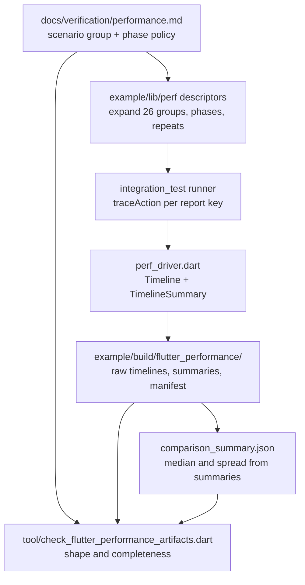
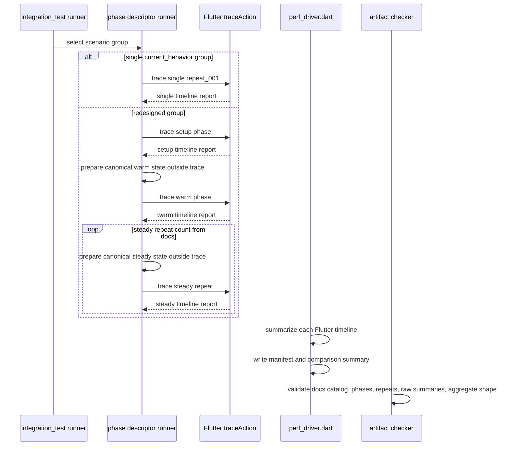

# Design: Android Flutter Performance Benchmark Redesign

---
date: 2026-06-16
designer: Codex
commit: 860722fd
branch: new-architecture
design_question: "Redesign the current Flutter Android performance benchmarks so future optimization work can be evaluated with higher confidence than the current short single-run timeline summaries, while preserving official Flutter-supported measurement routes and editing only `.design/` in this workflow."
---

## Disposition

READY_FOR_CONTRACT

## Product Outcome

The Android Flutter performance route will continue to use the official
Flutter `integration_test` plus `flutter drive --profile` measurement path, but
the benchmark shape will change from one short trace per scenario into
phase-aware, repeated measurements for the scenario groups that currently mix
large setup work with the action being evaluated.

The redesigned route will make local before/after optimization comparisons
clearer by showing setup cost, first-use/warm action cost, and repeated
steady-state action cost separately. It will not claim device-independent
precision, numeric regression gates, startup coverage, or Android
Macrobenchmark coverage.

Non-goals:

- no production runtime behavior change as part of the benchmark redesign;
- no custom frame scheduler, VM timeline collector, or unsupported Android
  performance infrastructure;
- no checked-in generated performance artifacts;
- no startup or Android Macrobenchmark implementation;
- no p95, p99, frame-budget, baseline-diff, or regression-threshold pass/fail
  gate until a later design explicitly owns device, environment, retention,
  and threshold policy.

## Target Contract Classification

- Profile: ANALYZER_RULE
- Obligations: SEAM_MIGRATION

The future Change Contract must update source-of-truth documentation and the
example route, but the highest-priority contract profile is `ANALYZER_RULE`
because the durable enforcement change is the repository-owned artifact
checker and route contract tests that recognize the benchmark catalog,
phase/repeat report keys, generated artifact shape, and unsupported-claim
boundaries.

## Research Inputs

- `.research/2026-06-16-android-performance-hotspot-paths.md` - factual
  research on current Android performance hot paths, trace shape, artifact
  semantics, and setup/action mixing.
- Existing source-of-truth docs and route code listed in the user request were
  inspected directly and cited below.

## Repository Evidence

`Evidence Consequence Link`: each fact below states the decision, boundary,
unit, proof surface, or review consequence it supports.

- `docs/verification/performance.md:30` - `docs/verification/performance.md`
  owns the official Flutter performance verification route -> supports keeping
  the durable benchmark semantics in that document through a later Change
  Contract, not in `.design/` or generated output.
- `docs/verification/performance.md:35` - the route runs the example app as an
  external public consumer through `integration_test` and
  `flutter drive --profile` -> supports preserving the official Flutter route
  as the measurement boundary.
- `docs/verification/performance.md:48` - route failure is completion,
  missing-report, missing-artifact, malformed-artifact, crash, hang, stale
  preview, or overlay failure -> supports keeping the release gate as
  completion plus artifact integrity rather than a numeric threshold.
- `docs/verification/performance.md:54` - every scenario id is currently also
  the required integration-test report key -> supports changing the route
  contract explicitly when phase/repeat report keys replace one report key per
  scenario group.
- `docs/verification/performance.md:55` - startup performance is future Android
  Macrobenchmark scope -> supports keeping startup and Android Macrobenchmark
  outside this redesign.
- `docs/verification/performance.md:63` - `load_document.100k` is a required
  catalog scenario with current-limit fixture proof -> supports retaining this
  scenario group while separating fixture preparation from load measurement.
- `docs/verification/performance.md:64` - `first_canvas_frame.50k` is required
  -> supports an explicit first-frame group instead of treating it as another
  load-document alias.
- `docs/verification/performance.md:66` - `camera_pan.100k` is required with
  current-limit fixture proof -> supports retaining the 100k pan group with
  setup, warm, and steady phases.
- `docs/verification/performance.md:69` - `selection_move.50k` is required ->
  supports a selected-element move group with setup, warm, and steady phases.
- `docs/verification/performance.md:70` - `marquee_select.50k` is required ->
  supports a marquee group with setup, warm preview/commit, and steady repeats.
- `docs/verification/performance.md:75` - `eraser_dense_50k` is required ->
  supports a dense eraser group with warm and steady pointer-drag variants.
- `docs/verification/performance.md:85` - `json_export.50k` is required ->
  supports a JSON export group where document setup is not part of the export
  action cost.
- `docs/verification/performance.md:94` - generated profile-drive outputs live
  under `example/build/flutter_performance/` -> supports keeping all generated
  benchmark artifacts out of source control and under the existing build path.
- `docs/verification/performance.md:108` - the current driver writes timeline
  files through Flutter `TimelineSummary.writeTimelineToFile(...)` -> supports
  continuing to derive raw measurement artifacts from Flutter timeline data.
- `docs/verification/performance.md:114` - the release gate verifies route
  completion and required artifact production only -> supports restricting
  future checker behavior to shape/inventory/statistical-summary integrity, not
  performance pass/fail thresholds.
- `docs/verification/performance.md:115` - p95, p99, frame-budget,
  baseline-diff, regression threshold, custom baseline, repeat-count, and
  manual-history pass/fail policy are not currently claimed -> supports adding
  repeat-count semantics without also adding unsupported pass/fail precision.
- `docs/verification/performance.md:122` - the former benchmark route remains
  retired and `tool/bench/**`, `test/benchmarks/**`, old benchmark ids, and a
  custom benchmark-result schema must not be restored -> supports extending the
  current Flutter route instead of reviving retired benchmark infrastructure.
- `docs/verification/tests.md:472` - docs identify the example integration
  performance route as a documented test surface -> supports carrying the
  redesign into documented test obligations.
- `docs/verification/tests.md:476` - the current route contract test proves
  catalog/report-key matching and traced-runner use -> supports updating that
  test as the structural proof for phase/repeat descriptors.
- `docs/verification/tests.md:486` - the artifact checker is documented as an
  inventory/JSON-shape check only -> supports keeping future checker
  enforcement about artifact shape and repeat completeness, not threshold
  results.
- `docs/verification/release_gates.md:167` - the release gate currently
  requires the full scenario catalog to complete through the profile-drive
  command and artifact checker -> supports keeping the same local release
  route, with updated artifact shape.
- `docs/verification/release_gates.md:173` - p95, p99, frame-budget,
  baseline-diff, and regression threshold gates remain unclaimed until a later
  design and contract establish policy -> supports explicitly limiting
  before/after comparisons to local evidence with spread, not a pass/fail gate.
- `.research/2026-06-16-android-performance-hotspot-paths.md:13` - current
  Android artifacts show largest build-side work in large-document scenarios
  and interactions that first load a 50k or 100k fixture inside the traced
  action -> supports setup/action phase separation as the owner-level fix.
- `.research/2026-06-16-android-performance-hotspot-paths.md:30` - current
  route is an artifact/completion gate and current traces do not provide
  CPU-sample attribution -> supports avoiding subsystem-level cost claims and
  keeping comparison claims scoped to route-observed timeline summaries.
- `.research/2026-06-16-android-performance-hotspot-paths.md:87` - the route
  uses a fixed settle window, scenario action frames, and bounded short traces
  -> supports repeating steady-state traces so one short run does not dominate
  conclusions.
- `.research/2026-06-16-android-performance-hotspot-paths.md:113` - current
  `load_document.*` and `first_canvas_frame.50k` share `_loadDocumentScenario`
  and mix JSON fixture encoding, load, and first frame -> supports splitting
  fixture preparation, load, and first canvas frame semantics.
- `.research/2026-06-16-android-performance-hotspot-paths.md:198` - current
  `camera_pan.100k` includes initial 100k document load plus repeated camera
  invalidation/paint planning in one trace -> supports separate setup, warm pan,
  and steady pan repeats.
- `.research/2026-06-16-android-performance-hotspot-paths.md:231` - current
  `selection_move.50k` and `marquee_select.50k` load fixtures before the
  interaction paths -> supports setup separation and warm/steady variants for
  selection move and marquee.
- `.research/2026-06-16-android-performance-hotspot-paths.md:280` - current
  eraser summaries cover large fixture setup, pointer routing, preview repaint,
  commit delivery, and corridor spatial reads -> supports setup separation plus
  warm/steady eraser pointer-drag traces.
- `.research/2026-06-16-android-performance-hotspot-paths.md:333` - current
  `json_export.50k` includes document load, draft materialization, and JSON
  encoding in one trace -> supports measuring export action cost after document
  setup is already complete.
- `example/lib/perf/performance_scenario.dart:96` - current traced runner wraps
  scenario action and settle in one `binding.traceAction` -> supports retaining
  Flutter `traceAction` as the raw measurement seam while changing what each
  report key represents.
- `example/lib/perf/performance_scenario.dart:107` - current catalog is one
  unmodifiable list of `PerformanceScenario` descriptors -> supports replacing
  or extending the descriptor model as the single source for phase/repeat
  execution, rather than scattering report keys in the integration test.
- `example/lib/perf/performance_scenario.dart:137` - `_loadDocumentScenario`
  currently encodes fixture JSON and loads it inside the action -> supports
  moving fixture preparation outside the measured load action for the
  redesigned `load_document.100k` group.
- `example/lib/perf/performance_scenario.dart:149` - `_cameraPanScenario`
  currently loads the fixture, pumps, then performs 12 pan steps in one action
  -> supports splitting `camera_pan.100k` into setup, warm, and steady phases.
- `example/lib/perf/performance_scenario.dart:177` - `_selectionMoveScenario`
  currently loads, selects, moves, and pumps in one action -> supports a setup
  phase that establishes the document and selection before action repeats.
- `example/lib/perf/performance_scenario.dart:196` - `_marqueeSelectScenario`
  currently loads 50k rects before a pointer drag -> supports a setup phase
  plus warm/steady pointer-drag phases.
- `example/lib/perf/performance_scenario.dart:213` - eraser uses the shared
  draw scenario helper, which selects 50k documents for non-10k ids -> supports
  preserving `eraser_dense_50k` coverage while splitting action phases.
- `example/lib/perf/performance_scenario.dart:424` - `json_export.50k` loads a
  50k document, reads the draft, and encodes JSON in one action -> supports
  moving load into setup and tracing export separately.
- `lib/src/runtime/runtime_root.dart:1264` - camera pan adds a delta to the
  current camera offset -> supports a steady-repeat reset rule so pan repeats
  do not compare different viewport positions.
- `lib/src/runtime/runtime_root.dart:812` - `moveSelection` delivers a
  translation transform -> supports a steady-repeat reset rule so selection
  move repeats do not start from already-moved elements.
- `lib/src/runtime/runtime_root.dart:2206` - marquee commit delivers a
  replacement selection plan -> supports a steady-repeat reset rule so marquee
  repeats do not inherit a previous selection result.
- `lib/src/runtime/runtime_root.dart:2427` - eraser commit removes each erased
  element id from the document -> supports a steady-repeat reset rule so eraser
  repeats do not measure progressively smaller documents.
- `example/integration_test/perf_canvas_surface_test.dart:21` - the
  integration route currently loops all scenarios and delegates to
  `scenario.runTraced` -> supports keeping integration-test ownership while
  moving phase/repeat policy into descriptors.
- `example/integration_test/perf_canvas_surface_test.dart:47` - the route owns
  the bounded settle helper -> supports keeping settle policy centralized for
  setup, warm, and steady phases.
- `example/test_driver/perf_driver.dart:11` - the driver writes performance
  timelines from integration driver response data -> supports keeping artifact
  materialization in the driver.
- `example/test_driver/perf_driver.dart:57` - the driver converts each report
  to `Timeline.fromJson` and summarizes through `TimelineSummary.summarize` ->
  supports a repository-owned aggregation/checking boundary over official
  Flutter timeline summaries, not a custom measurement collector.
- `example/test_driver/perf_driver.dart:35` - the driver resets
  `build/flutter_performance` before writing outputs -> supports keeping
  generated artifacts local and non-source-controlled.
- `tool/check_flutter_performance_artifacts.dart:249` - the checker reads
  required scenario ids from the docs catalog -> supports keeping docs as the
  durable catalog source that the checker consumes.
- `tool/check_flutter_performance_artifacts.dart:263` - the checker validates
  each expected scenario directory -> supports extending it to validate nested
  phase/repeat artifact directories.
- `tool/check_flutter_performance_artifacts.dart:341` - the checker validates
  timeline JSON shape through `traceEvents` -> supports preserving raw Flutter
  timeline artifact validation.
- `tool/check_flutter_performance_artifacts.dart:349` - the checker validates
  Flutter timeline summary shape -> supports preserving Flutter
  `TimelineSummary` as the base artifact shape for each repeat.
- `test/performance/flutter_performance_route_contract_test.dart:40` - the
  contract test currently verifies the integration route uses the single traced
  scenario runner -> supports updating this structural proof to a single
  phase/repeat runner instead of embedding trace policy in the test loop.
- `test/performance/flutter_performance_route_contract_test.dart:116` - the
  contract test parses scenario ids from `docs/verification/performance.md` ->
  supports updating docs parsing/tests when the source-of-truth catalog changes
  from single scenario ids to scenario group plus phase descriptors.
- `test/tool/flutter_performance_artifacts_checker_test.dart:13` - checker
  tests already prove accepted exact artifacts -> supports extending checker
  tests to cover nested phase/repeat artifacts and generated aggregate files.
- `test/tool/flutter_performance_artifacts_checker_test.dart:40` - checker
  tests already prove missing, malformed, and unexpected artifacts are rejected
  -> supports negative proof for missing repeats, malformed manifests, and
  unexpected checked-in-like artifacts.

## Design Form Candidates

### Candidate A. Phase-Aware Repeated Flutter Route

- Form: extend the existing Flutter performance route so the catalog describes
  scenario groups, each group expands to setup, warm, and steady report keys,
  each report key is measured through Flutter `traceAction`, and the driver
  writes raw timelines plus a repository-owned run manifest and aggregate
  summary under `example/build/flutter_performance/`.
- Why it could work: it preserves the official route, fixes setup/action mixing
  at the scenario descriptor owner, adds repeated steady-state evidence, and
  keeps generated artifacts out of source control.
- Gate failures or risks: the route takes longer to run; the aggregate summary
  must be explicitly documented as a local comparison aid, not a numeric release
  threshold.

### Candidate B. Android Macrobenchmark Rewrite

- Form: create an Android Macrobenchmark/startup benchmark suite outside the
  Flutter profile-drive route and use that as the primary Android performance
  source.
- Why it could work: Macrobenchmark is the Android-native direction for
  startup and app-level performance.
- Gate failures or risks: current docs explicitly leave startup as future
  Android Macrobenchmark scope and the user asked to preserve official
  Flutter-supported measurement routes unless a repository-owned boundary is
  justified. This would broaden scope, require new device/environment policy,
  and fail the requested non-goal for startup/Macrobenchmark.

### Candidate C. Keep Current Scenario Catalog And Add Manual Reruns

- Form: keep one report key per current scenario and document that developers
  should run the command multiple times before comparing optimizations.
- Why it could work: smallest implementation change and no artifact shape
  migration.
- Gate failures or risks: it leaves setup/action mixing in the measured traces,
  does not create stable repeat metadata, and lets one short trace continue to
  dominate conclusions. It fails the product goal.

### Candidate D. Restore Retired Custom Benchmark Infrastructure

- Form: revive `tool/bench/**`, `test/benchmarks/**`, old benchmark ids, or a
  custom benchmark result schema for internal engine benchmarks.
- Why it could work: a custom internal route could target engine seams more
  narrowly than the example app.
- Gate failures or risks: docs explicitly retire this boundary, and restoring
  it would violate the current source-of-truth route and the request to avoid
  unsupported/custom infrastructure unless justified. It would also stop
  measuring the example app as an external public consumer.

## Known Future Pressures

| Pressure | Evidence | How the selected form responds | Accepted cost or risk |
|---|---|---|---|
| Optimization work needs clearer before/after evidence for large Android scenarios. | `.research/2026-06-16-android-performance-hotspot-paths.md:13` | Separates setup, warm, and steady phases and records repeated steady-state raw summaries. | Longer local release runs; no exact cross-device precision claim. |
| Existing route is official and release-blocking. | `docs/verification/performance.md:30`, `docs/verification/release_gates.md:167` | Keeps the same route owner and release command family. | Docs, route contract tests, checker, and release-gate text must migrate together. |
| Startup is likely future Android Macrobenchmark scope. | `docs/verification/performance.md:55`, `test/performance/flutter_performance_route_contract_test.dart:31` | Explicitly excludes startup and Android Macrobenchmark from this redesign. | Future startup work will need a separate design and may add a second performance route. |
| Current artifacts do not claim numeric thresholds or baseline policy. | `docs/verification/performance.md:114`, `docs/verification/release_gates.md:173` | Adds repeat strategy and local aggregate summaries without pass/fail thresholds. | Before/after comparison remains advisory evidence until device/baseline policy exists. |
| Retired benchmark infrastructure must stay retired. | `docs/verification/performance.md:122` | Uses the existing Flutter driver/checker boundary and does not restore old benchmark paths or ids. | Some lower-level engine costs remain unisolated unless future targeted tests are designed separately. |
| Checker and docs currently assume one scenario id is one report key. | `docs/verification/performance.md:54`, `tool/check_flutter_performance_artifacts.dart:249` | Changes source-of-truth catalog semantics to scenario group plus phase/repeat descriptors and updates checker parsing accordingly. | Compatibility break for old generated artifact directories; acceptable because artifacts are generated and not checked in. |

## Selected Form

Choose Candidate A: a phase-aware repeated Flutter performance route.

The selected form keeps Flutter `traceAction`, `Timeline`, and
`TimelineSummary` as the only measurement source. The repository-owned boundary
is limited to descriptor expansion, artifact organization, manifest/aggregate
summarization of official Flutter outputs, and artifact-shape checking. That
boundary is justified because Flutter supplies raw timelines but does not own
this repository's scenario catalog, generated artifact inventory, local release
shape, or before/after comparison handoff.

The future route must define scenario groups separately from report keys. The
scenario group ids remain the current 26 catalog ids from
`docs/verification/performance.md`; this preserves release coverage while
allowing the seven high-signal Android groups to gain richer phase semantics.

Canonical phase grammar:

- `setup.<role>`: measured setup/preparation cost for a scenario group. Setup
  traces are retained for context, but setup cost is not included in warm or
  steady action comparisons.
- `warm.<action>`: the first measured action after a canonical prepared state.
  It captures first-use effects and always has `repeat_001`.
- `steady.<action>`: repeated measured action windows. Each repeat starts from
  the same canonical prepared state; reset/reseed cost is outside the steady
  trace and is not part of action comparison.
- `single.<current_behavior>`: migrated compatibility phase for existing
  required scenarios that are not part of this redesign's seven high-signal
  Android groups. It preserves current release completion coverage with
  `repeat_001` and carries no warm/steady statistical claim.

Report keys must be derived mechanically as:

```text
<scenario_group>__<phase_kind>.<phase_name>__repeat_<NNN>
```

The future contract must not introduce an `action.*` phase kind; action
comparison phases are `warm.*` and `steady.*`.

Full catalog migration policy:

| Current catalog scenario | Future scenario group fate |
|---|---|
| `load_document.1k` | migrate to `single.current_behavior`, `repeat_001` |
| `load_document.10k` | migrate to `single.current_behavior`, `repeat_001` |
| `load_document.50k` | migrate to `single.current_behavior`, `repeat_001` |
| `load_document.100k` | redesign with `setup.fixture_json`, `warm.load_document`, and repeated `steady.load_document` |
| `first_canvas_frame.50k` | redesign with `setup.preloaded_runtime`, `warm.first_canvas_frame`, and repeated `steady.first_canvas_frame` |
| `camera_pan.50k` | migrate to `single.current_behavior`, `repeat_001` |
| `camera_pan.100k` | redesign with `setup.loaded_document`, `warm.camera_pan`, and repeated `steady.camera_pan` |
| `selection_tap.10k` | migrate to `single.current_behavior`, `repeat_001` |
| `selection_move.10k` | migrate to `single.current_behavior`, `repeat_001` |
| `selection_move.50k` | redesign with `setup.loaded_selected_document`, `warm.selection_move`, and repeated `steady.selection_move` |
| `marquee_select.50k` | redesign with `setup.loaded_document`, `warm.marquee_select`, and repeated `steady.marquee_select` |
| `pencil_draw.10k` | migrate to `single.current_behavior`, `repeat_001` |
| `marker_draw.10k` | migrate to `single.current_behavior`, `repeat_001` |
| `line_two_tap.50k` | migrate to `single.current_behavior`, `repeat_001` |
| `eraser_normal.50k` | migrate to `single.current_behavior`, `repeat_001` |
| `eraser_dense_50k` | redesign with `setup.loaded_draw_mode_document`, `warm.eraser_dense`, and repeated `steady.eraser_dense` |
| `context_delete.10k` | migrate to `single.current_behavior`, `repeat_001` |
| `text_edit.open_commit` | migrate to `single.current_behavior`, `repeat_001` |
| `text_style_change.10k` | migrate to `single.current_behavior`, `repeat_001` |
| `resource_image_cold` | migrate to `single.current_behavior`, `repeat_001` |
| `resource_image_warm` | migrate to `single.current_behavior`, `repeat_001` |
| `resource_mark_dirty` | migrate to `single.current_behavior`, `repeat_001` |
| `missing_resource` | migrate to `single.current_behavior`, `repeat_001` |
| `surface_runtime_swap` | migrate to `single.current_behavior`, `repeat_001` |
| `dispose_during_preview` | migrate to `single.current_behavior`, `repeat_001` |
| `json_export.50k` | redesign with `setup.loaded_document`, `warm.json_export`, and repeated `steady.json_export` |

The seven redesigned scenario groups have these action comparison semantics:

| Scenario group | Required phases | Comparison intent |
|---|---|---|
| `load_document.100k` | `setup.fixture_json`, `warm.load_document`, `steady.load_document` repeats | Show fixture preparation separately from load/edit/publication cost; repeated load traces compare load optimizations without treating fixture generation as engine cost. |
| `first_canvas_frame.50k` | `setup.preloaded_runtime`, `warm.first_canvas_frame`, `steady.first_canvas_frame` repeats | Measure first surface-frame/render cost from a preloaded 50k document, not JSON fixture preparation. |
| `camera_pan.100k` | `setup.loaded_document`, `warm.camera_pan`, `steady.camera_pan` repeats | Separate 100k document load from first pan and repeated pan/frame-planning cost. |
| `selection_move.50k` | `setup.loaded_selected_document`, `warm.selection_move`, `steady.selection_move` repeats | Separate load/selection establishment from move action cost. |
| `marquee_select.50k` | `setup.loaded_document`, `warm.marquee_select`, `steady.marquee_select` repeats | Separate 50k load from first marquee interaction and repeated marquee preview/commit cost. |
| `json_export.50k` | `setup.loaded_document`, `warm.json_export`, `steady.json_export` repeats | Separate load from draft materialization and JSON encoding cost. |
| `eraser_dense_50k` | `setup.loaded_draw_mode_document`, `warm.eraser_dense`, `steady.eraser_dense` repeats | Separate 50k load/mode setup from first eraser path and repeated dense eraser pointer-drag cost. |

`setup.*` traces are measured and retained because setup cost still matters for
large documents, but they must not be mixed into action comparisons. `warm.*`
captures first-use behavior after setup. `steady.*` repeats use the same
official Flutter trace machinery and a fixed repeat count owned by the docs
catalog. The selected starting policy is at least five steady repeats per group
in the future contract; the contract may choose a higher count only if it
keeps local release runtime acceptable and records the cost.

Repeat-state invariant: every `steady.*` repeat begins from a canonical
prepared state equivalent to the state used before `warm.*`. Reset/reseed cost
is outside the steady trace. The route may use a fresh runtime, a replacement
runtime swapped into the host, or a deterministic public-API reset helper chosen
by the future implementation, but the descriptor must expose that as untraced
preparation, not as part of the measured steady action.

Per-group repeat reset rules:

| Scenario group | Canonical prepared state before warm and every steady repeat | Why reset is required |
|---|---|---|
| `load_document.100k` | Empty runtime/surface state plus canonical prepared JSON fixture; fixture construction is not inside `warm.load_document` or `steady.load_document`. | Loading writes document state, so each repeat must start from an unloaded target. |
| `first_canvas_frame.50k` | Fresh preloaded 50k runtime not yet rendered by the measured surface; action traces only attach/swap/pump the first canvas frame. | First-frame cost disappears after the document has already rendered. |
| `camera_pan.100k` | Fresh loaded 100k document, camera offset reset to the canonical origin, settled surface. | `panCameraBy` accumulates camera offset, so cumulative repeats would measure different viewports. |
| `selection_move.50k` | Fresh loaded 50k document with the same selected id and unchanged element positions. | `moveSelection` translates selected elements, so cumulative repeats would move different geometry. |
| `marquee_select.50k` | Fresh loaded 50k document, move mode, no inherited marquee selection, settled surface. | Marquee commit replaces selection, so cumulative repeats would inherit previous selection state. |
| `json_export.50k` | Fresh loaded 50k document with stable document order and no pending edit session. | Export is mostly read-only, but reset keeps all repeats comparable to mutating groups and catches accidental mutation. |
| `eraser_dense_50k` | Fresh loaded 50k document, draw mode with eraser selected, no erased elements from prior repeats. | Eraser commit removes elements, so cumulative repeats would measure progressively smaller documents. |
| `single.current_behavior` groups | Current one-shot scenario behavior, `repeat_001` only. | These groups preserve release coverage and do not claim steady-state comparison. |
 
Focused proof must target this invariant directly: descriptor tests should be
able to run two steady repeats and observe, through public route-visible state
or fixture metadata, that each repeat was prepared from the same canonical state
before the measured action begins.

Generated artifact shape must move from one directory per current scenario id
to one directory per scenario group with nested phases and repeats:

```text
example/build/flutter_performance/
  performance_run_manifest.json
  comparison_summary.json
  <scenario_group>/
    setup.<name>/
      repeat_001/
        <report_key>.timeline.json
        <report_key>.timeline_summary.json
    single.<name>/
      repeat_001/
        <report_key>.timeline.json
        <report_key>.timeline_summary.json
    warm.<name>/
      repeat_001/
        <report_key>.timeline.json
        <report_key>.timeline_summary.json
    steady.<name>/
      repeat_001/
        <report_key>.timeline.json
        <report_key>.timeline_summary.json
      repeat_002/
        <report_key>.timeline.json
        <report_key>.timeline_summary.json
      repeat_NNN/
        <report_key>.timeline.json
        <report_key>.timeline_summary.json
```

`performance_run_manifest.json` records generated-only metadata: schema
version, route name, route command family, scenario groups, phase names,
report keys, repeat count, and unsupported-claim flags. It must not be a source
artifact. `comparison_summary.json` is generated from the official Flutter
timeline summaries and may include median, min, max, and interquartile range for
selected Flutter summary fields. It must not introduce pass/fail thresholds or
claim CPU attribution.

Before/after optimization work compares the same scenario group, phase, repeat
count, route command, and local device/environment notes. The comparison uses
raw per-repeat summaries plus median and spread from `comparison_summary.json`.
The supported claim is directional local evidence, such as "the steady
`camera_pan.100k` median build time decreased on this run with this spread."
Unsupported claims remain forbidden: exact device-independent percentage wins,
p99 regression gates from a tiny sample, CPU ownership for a subsystem, or
release pass/fail thresholds.

## Decision Trace

Preserve `Decision Chain Of Custody`: source inputs and locked decisions must
map to the future contract field, execution unit, or proof surface that carries
them forward.

| Decision ID | Decision | Evidence | Contract handoff target |
|---|---|---|---|
| D1 | Keep `integration_test` plus `flutter drive --profile` and Flutter timeline summaries as the measurement boundary. | `docs/verification/performance.md:35`, `docs/verification/performance.md:108`, `example/test_driver/perf_driver.dart:57` | `Boundaries.Measurement route`; route implementation unit; profile-drive proof surface |
| D2 | Change the catalog from one report key per scenario id to scenario groups with canonical `setup`, `warm`, `steady`, and `single` phase descriptors. | `docs/verification/performance.md:54`, `.research/2026-06-16-android-performance-hotspot-paths.md:13`, `example/lib/perf/performance_scenario.dart:107` | `Boundaries.Source of Truth`; docs unit; scenario descriptor unit; route contract test |
| D3 | Separate fixture/document setup from action cost for the seven redesigned groups. | `.research/2026-06-16-android-performance-hotspot-paths.md:113`, `.research/2026-06-16-android-performance-hotspot-paths.md:198`, `.research/2026-06-16-android-performance-hotspot-paths.md:231`, `.research/2026-06-16-android-performance-hotspot-paths.md:280`, `.research/2026-06-16-android-performance-hotspot-paths.md:333` | Scenario descriptor execution unit; phase catalog proof; generated artifact checker |
| D4 | Add warm and repeated steady-state variants for pan, selection move, marquee, eraser, and also repeat load/first-frame/export action groups for comparable before/after evidence. | `docs/verification/performance.md:115`, `.research/2026-06-16-android-performance-hotspot-paths.md:87` | Docs statistical policy; route runner unit; checker repeat completeness proof |
| D5 | Keep generated artifacts under `example/build/flutter_performance/` and out of source control while defining a stable nested artifact shape. | `docs/verification/performance.md:94`, `example/test_driver/perf_driver.dart:35`, `tool/check_flutter_performance_artifacts.dart:263` | `Boundaries.Generated Artifacts`; driver unit; checker unit; release-gate handoff |
| D6 | Repository-owned manifest and aggregate summary are allowed only as organization and comparison summaries over official Flutter outputs, not as custom measurement infrastructure. | `example/test_driver/perf_driver.dart:57`, `tool/check_flutter_performance_artifacts.dart:349`, `docs/verification/performance.md:114` | Artifact driver/checker constraints; unsupported-claim tests; docs non-threshold policy |
| D7 | Before/after comparisons report raw repeats, median, and spread without threshold or device-independent precision claims. | `docs/verification/performance.md:115`, `docs/verification/release_gates.md:173`, `.research/2026-06-16-android-performance-hotspot-paths.md:30` | Verification strategy; comparison summary proof; source-of-truth docs |
| D8 | Startup and Android Macrobenchmark remain outside this redesign. | `docs/verification/performance.md:55`, `test/performance/flutter_performance_route_contract_test.dart:31` | Out-of-scope docs; route contract test negative proof |
| D9 | Retired benchmark infrastructure must not be restored. | `docs/verification/performance.md:122` | Negative proof surface; public/retired route guard in route contract test |
| D10 | All 26 current required scenarios remain in the Flutter release route: seven are redesigned, and the remaining nineteen migrate to `single.current_behavior` with `repeat_001`. | `docs/verification/performance.md:58`, `docs/verification/release_gates.md:167` | Full catalog migration field; docs unit; checker expected-shape unit; route contract test |
| D11 | Every `steady.*` repeat for redesigned groups starts from a canonical prepared state equivalent to warm state; reset/reseed cost is outside the steady trace. | `lib/src/runtime/runtime_root.dart:1264`, `lib/src/runtime/runtime_root.dart:812`, `lib/src/runtime/runtime_root.dart:2206`, `lib/src/runtime/runtime_root.dart:2427` | State/data boundary; temporal invariant; focused descriptor tests; checker manifest fields |

## Outcome-Proof Fit

| Claim | Direct outcome | Proxy risk | Required proof surface or strategy |
|---|---|---|---|
| Setup cost is separate from action cost. | Generated artifacts contain distinct setup, warm, steady, or single report keys according to each group's migration policy, and warm/steady action traces do not perform fixture/document setup internally. | Merely renaming directories could pass while action code still loads fixtures inside the measured trace. | Route contract test inspects descriptors for setup/action separation; focused scenario tests prove action phases use preloaded state; artifact checker verifies phase directories. |
| Warm and steady variants exist for interactions. | `camera_pan.100k`, `selection_move.50k`, `marquee_select.50k`, and `eraser_dense_50k` each emit warm and steady repeated artifacts. | One trace with a longer loop could still hide first-use effects and repeat variance. | Docs catalog parser plus route contract test verifies required phase descriptors; checker rejects missing warm or steady repeat directories. |
| Repeats prevent one short trace from dominating conclusions. | Each steady phase has the documented repeat count and raw per-repeat summaries; comparison summary reports median and spread. | Averaging one trace or overwriting repeats would look complete but still be single-run evidence. | Checker validates repeat cardinality and unique report keys; aggregate tests verify summary is derived from all repeats. |
| Steady repeats compare equivalent action windows. | Each steady repeat starts from the scenario group's canonical prepared state, with reset/reseed outside the measured trace. | Cumulative mutations could make later repeats look faster or slower for reasons unrelated to the optimization. | Descriptor tests run at least two repeats and prove canonical pre-action state; manifest records phase and repeat identity; route tests reject missing reset semantics. |
| The full release catalog remains covered. | All 26 current required scenario ids appear as scenario groups in the generated route shape. | Focusing only on seven redesigned groups could silently drop existing release coverage. | Docs parser, route contract test, and checker all verify full catalog migration, including `single.current_behavior` groups. |
| The route preserves Flutter-supported measurement infrastructure. | Raw measurements are still produced by Flutter `traceAction`, `Timeline`, and `TimelineSummary`. | A custom collector could produce similarly named JSON without Flutter timeline semantics. | Contract tests verify the route uses the traced runner and driver still calls `Timeline.fromJson` / `TimelineSummary.summarize`; checker validates raw timeline and summary shapes. |
| Generated artifacts stay out of source control but have stable local release shape. | Only `example/build/flutter_performance/` contains generated run output; checker validates the documented shape there. | A source fixture or checked-in baseline could accidentally become the real source of truth. | Docs source-of-truth text plus checker tests reject unexpected files in result roots; no future contract unit may add generated results outside build output. |
| Before/after comparison is useful without unsupported precision. | Docs and generated summaries expose raw repeats, median, min/max, and IQR while forbidding threshold/pass-fail precision. | Median summaries could be read as a release gate or device-independent truth. | Docs/release-gate text and tests preserve unsupported-claim language; aggregate schema has no threshold/pass-fail fields. |

## Hard Gate Check

| Gate | Result | Evidence |
|---|---|---|
| Owner-Level Fix | pass | The weakness is route-level measurement semantics, not one runtime subsystem; docs route ownership and current scenario helper mixing are shown by `docs/verification/performance.md:30` and `.research/2026-06-16-android-performance-hotspot-paths.md:13`. |
| Ownership | pass | `docs/verification/performance.md` owns durable route semantics; example descriptors own executable scenario expansion; driver/checker own generated artifact materialization and validation (`docs/verification/performance.md:30`, `example/lib/perf/performance_scenario.dart:107`, `example/test_driver/perf_driver.dart:11`, `tool/check_flutter_performance_artifacts.dart:83`). |
| Source-Of-Truth Singularity | pass | Docs remain the durable route/catalog source consumed by tests/checker; generated manifest and summaries are local run output under `example/build/flutter_performance/`, not source truth (`docs/verification/performance.md:94`, `tool/check_flutter_performance_artifacts.dart:249`). |
| Boundary-Owned Policy | pass | Measurement boundary stays in Flutter `traceAction`/TimelineSummary; repository policy boundary is catalog expansion and artifact shape (`example/lib/perf/performance_scenario.dart:96`, `example/test_driver/perf_driver.dart:57`, `docs/verification/performance.md:114`). |
| Negative Proof And Fixture Quarantine | pass | Negative proof belongs in route contract and checker tests; generated performance data remains under build output and retired benchmark paths stay forbidden (`test/performance/flutter_performance_route_contract_test.dart:40`, `test/tool/flutter_performance_artifacts_checker_test.dart:40`, `docs/verification/performance.md:122`). |
| Dependency direction | pass | The example route already imports the public package barrel and docs require no private `src` imports; no production runtime import direction changes are selected (`docs/verification/performance.md:35`, `example/lib/perf/performance_scenario.dart:4`). |
| State/data | pass | Durable state is docs catalog and code descriptors; generated run state is manifest, raw timelines, summaries, and aggregate under build output. Runtime state for every redesigned `steady.*` repeat is reset/reseeded to the canonical prepared state outside the measured trace (`docs/verification/performance.md:94`, `example/test_driver/perf_driver.dart:35`, `lib/src/runtime/runtime_root.dart:1264`, `lib/src/runtime/runtime_root.dart:2427`). |
| Sequenced Migration And Retirement | pass | The current one-key-per-scenario artifact shape is replaced by nested group/phase/repeat artifacts for all 26 current scenario ids; old generated artifacts are disposable because the driver already resets the build output; retired benchmark infrastructure stays retired (`docs/verification/performance.md:58`, `example/test_driver/perf_driver.dart:35`, `docs/verification/performance.md:122`). |
| Temporal Surface Closure | pass | The future runner must preserve current bounded settle ordering for every setup/warm/steady/single trace: untraced canonical preparation when required, phase action, bounded settle, optional after-settle when applicable, then report completion. Warm runs after canonical preparation; every steady repeat re-prepares the same canonical state before trace; reset/reseed cost is excluded from steady trace and recorded only through setup context. The integration route owns the settle helper (`example/lib/perf/performance_scenario.dart:96`, `example/integration_test/perf_canvas_surface_test.dart:47`). No runtime reentrancy/public-state semantics change is selected. |
| All-Or-Nothing Failure Boundary | pass | The all-or-nothing boundary is generated artifact publication: driver resets the output directory before writing and checker treats missing/malformed/extra outputs as route failure (`example/test_driver/perf_driver.dart:35`, `tool/check_flutter_performance_artifacts.dart:165`, `tool/check_flutter_performance_artifacts.dart:263`). Future contract must write manifest/summary after raw artifacts are materialized or fail the checker. |
| Outcome-Proof Fit | pass | Direct outcomes and proof surfaces are listed in `Outcome-Proof Fit`; proxy-only claims such as subsystem CPU attribution or threshold precision are explicitly rejected by `docs/verification/performance.md:115` and `.research/2026-06-16-android-performance-hotspot-paths.md:30`. |
| Verification | pass | Existing proof surfaces are route contract tests, checker tests, docs checks, focused example tests, and the profile-drive run (`docs/verification/tests.md:476`, `docs/verification/tests.md:486`, `docs/verification/tests.md:489`). |
| Future pressure | pass | Startup/Macrobenchmark, no-threshold policy, retired benchmark boundaries, longer route runtime, and one-key catalog migration are assessed in `Known Future Pressures`. |

## Lock-Required Facts

- Owner: `docs/verification/performance.md` owns durable route semantics and
  scenario catalog policy; example perf descriptors own executable scenario
  expansion; `example/test_driver/perf_driver.dart` owns generated raw and
  aggregate artifact writing; `tool/check_flutter_performance_artifacts.dart`
  owns artifact shape checking.
- Owning layer/module/document family: verification docs, example performance
  route, test/tool artifact checker, route contract tests.
- Seam: Flutter `IntegrationTestWidgetsFlutterBinding.traceAction` and
  `TimelineSummary` remain the raw measurement seam; repository-owned
  descriptor and artifact checker are policy/shape seams only.
- Dependency/import direction: example route remains a public consumer of
  `package:iwb_canvas_engine/iwb_canvas_engine.dart`; no
  `package:iwb_canvas_engine/src/**` imports and no production runtime source
  changes are selected.
- State/data ownership: docs catalog is durable source; descriptors are
  executable source; generated `performance_run_manifest.json`, raw timeline
  files, timeline summaries, and `comparison_summary.json` are local build
  artifacts and not source truth. For redesigned steady repeats, canonical
  prepared runtime/document state is transient route state owned by the
  descriptor runner and recreated outside the measured trace.
- Entry boundaries: future local release command remains the Flutter profile
  drive route from the example app, followed by
  `dart run tool/check_flutter_performance_artifacts.dart --catalog docs/verification/performance.md --results example/build/flutter_performance`.
- Exit boundaries: successful route produces all required group/phase/repeat
  raw timelines, timeline summaries, manifest, and comparison summary; checker
  success means shape and completeness only.
- File placement basis: docs updates under `docs/verification/`; executable
  route descriptors under `example/lib/perf/`; integration runner under
  `example/integration_test/`; driver under `example/test_driver/`; checker
  under `tool/`; focused tests under existing `test/performance`,
  `test/tool`, and `example/test` owners.
- Execution order constraints: all current catalog ids must be emitted as
  scenario groups; `single.current_behavior` groups emit only `repeat_001`;
  redesigned groups run setup before warm and steady; warm and every steady
  repeat start after untraced canonical preparation; each measured phase keeps
  bounded settle after action; aggregate summary is generated only after raw
  repeat artifacts are written.
- `Temporal Surface Closure` invariant, synchronous callback surfaces,
  guard/boundary owner, public observation order, and expected
  rejection/no-mutation signal: the invariant is "each trace observes only the
  selected phase action plus bounded settle from a declared pre-action state";
  the synchronous callback surface is the existing scenario action inside
  `traceAction`; the guard owner is the phase descriptor runner; public
  observation order is setup trace completion, canonical warm preparation,
  warm trace, canonical steady preparation before each steady repeat, then
  steady trace; rejected interleaving or missing reset semantics is route
  contract/checker failure through missing/malformed report keys or manifest
  state metadata, not runtime mutation behavior.
- `All-Or-Nothing Failure Boundary` irreversible point,
  fallible-before-irreversible work, later infallible/failure-contained/accepted
  work, failure projection, and proof surface: irreversible point is publishing
  a generated run directory after resetting previous output; fallible work is
  Flutter drive execution, timeline conversion, summary writing, manifest
  writing, and aggregate writing; later checker failures project as non-zero
  artifact check; proof surface is checker tests plus local checker run.
- Rejected alternatives: Android Macrobenchmark rewrite, manual repeated
  reruns over current short traces, retired custom benchmark infrastructure.
- Verification strategy: docs and release-gate checks for source-of-truth
  language; route contract tests for descriptor/report-key/unsupported-scope
  structure and full 26-scenario migration; checker tests for nested artifact
  shape, repeat cardinality, raw timeline shape, manifest, and aggregate
  schema; focused example tests for setup/action separation and repeat-state
  equivalence; profile-drive command for local release artifacts.

## Diagram Need Assessment

| Design question | Needed? | Diagram kind | Reason |
|---|---:|---|---|
| Does the design change ownership, layer, package, or component boundaries? | no | none | Ownership stays in existing docs, example route, driver, checker, and tests; prose names the boundary changes sufficiently. |
| Does it change data flow, state ownership, cache ownership, resource movement, or lifecycle movement? | yes | data_flow | The generated artifact flow changes from flat scenario directories to group/phase/repeat artifacts plus manifest and aggregate summary. |
| Does it depend on call order, lifecycle order, sync/async ordering, failure ordering, or migration order? | yes | sequence | Setup, warm, steady repeats, raw artifact writing, aggregate writing, and checking have required order. |
| Does it introduce or alter observer/listener/callback delivery, guard windows, public-state publication, or reentrancy-sensitive ordering? | yes | sequence | Runtime callbacks and public-state publication are not changed, but route measurement windows now depend on canonical preparation before warm and every steady repeat. |
| Does it introduce or alter modes, statuses, terminal states, sessions, or transition rules? | no | none | Benchmark phases are descriptors/report keys, not runtime modes or document lifecycle states. |
| Does it create, replace, migrate, or retire a shared seam under `Sequenced Migration And Retirement`? | yes | sequence | It replaces the generated artifact/report-key seam from one scenario id to group/phase/repeat descriptors. |
| Does it change public API consumer flow, payload shape, or compatibility behavior? | no | none | The example remains a public API consumer; generated artifact shape changes but package public API does not. |
| Does it introduce or change analyzer, guardrail, or structural-recognition pipeline behavior? | yes | data_flow | The artifact checker and route contract tests must recognize catalog phases, repeats, manifest, and aggregate summary. |

## Provisional Diagrams





## Source-Of-Truth Impact

`Source-Of-Truth Singularity`: durable benchmark meaning belongs in
`docs/verification/performance.md`, with real consumers in the route contract
test and artifact checker. Generated manifests and summaries are run output
only and must not become source truth or checked-in baselines.

Future Change Contract must update:

- `docs/verification/performance.md` to define scenario groups, required
  phases, canonical phase grammar, full 26-scenario migration policy, repeat
  count policy, artifact shape, comparison semantics, repeat-state semantics,
  and unsupported claims.
- `docs/verification/tests.md` to document updated route contract and checker
  proof responsibilities.
- `docs/verification/release_gates.md` to reference the new artifact checker
  shape while preserving non-threshold semantics.
- generated docs/indexes only through the existing docs sync if registry-owned
  docs content changes require it.

The future contract must not update or restore retired benchmark docs,
`tool/bench/**`, `test/benchmarks/**`, benchmark registries, or public runtime
API docs unless a separate design changes those owners.

## Verification Impact

Future proof surfaces:

- route contract tests must prove docs catalog groups expand to executable
  phase descriptors and report keys for all 26 current required scenarios,
  including `single.current_behavior` groups and the seven redesigned groups;
- route contract tests must prove startup and retired benchmark route names are
  still absent;
- focused example tests must prove setup phases establish state outside action
  traces for `load_document.100k`, `first_canvas_frame.50k`,
  `camera_pan.100k`, `selection_move.50k`, `marquee_select.50k`,
  `json_export.50k`, and `eraser_dense_50k`;
- focused example tests must prove two `steady.*` repeats for each redesigned
  group start from equivalent canonical prepared state before the measured
  action;
- artifact checker tests must accept the nested group/phase/repeat shape and
  reject missing catalog groups, missing single phases, missing repeats,
  malformed timelines, malformed manifest fields, malformed aggregate fields,
  unexpected directories, non-canonical phase names, and threshold/pass-fail
  fields;
- local release verification must run the existing Flutter profile-drive command
  family and then the updated checker command;
- docs checks must run for verification docs changes;
- Dart analyzer/DCM/focused tests must run for changed example, test, and tool
  code according to repository verification policy.

## Verification Strategy

Use executable structural proof for the new route contract and checker because
the redesign's durable behavior is catalog expansion, phase separation,
repeat completeness, and artifact shape. Use the actual Flutter profile-drive
route as the local release proof that official Flutter timeline artifacts are
produced.

Use generated aggregate summaries only for local comparison evidence. The
future contract must preserve this rule mechanically by excluding threshold,
pass/fail, baseline, or regression-status fields from the aggregate schema and
by keeping docs/release-gate text explicit that repeated summaries do not create
a numeric release gate.

## Change Contract Handoff

- Required profile: ANALYZER_RULE
- Required obligations: SEAM_MIGRATION
- Decision IDs / Decision Trace rows to preserve: D1, D2, D3, D4, D5, D6, D7,
  D8, D9, D10, D11
- Evidence to cite: the `Repository Evidence` rows above, especially route
  ownership, official Flutter route, current artifact contract, unsupported
  threshold policy, setup/action mixing, current scenario helpers, driver
  timeline summary boundary, checker parsing, and route contract tests.
- Contract constraints or sequencing facts:
  - update source-of-truth docs before or with executable route changes so
    checker/test expectations have one durable catalog source;
  - implement descriptor-level full-catalog phase/repeat expansion before
    updating the integration runner to emit phase report keys;
  - implement canonical state preparation/reset semantics before enabling
    steady repeats;
  - update driver artifact writing before checker enforcement;
  - update checker and tests before claiming the profile-drive route is green;
  - run docs checks for docs changes and Dart/DCM/focused tests for changed
    Dart owners;
  - do not edit production runtime behavior unless the future contract records a
    separate escalated reason.
- Required proof surfaces:
  - `test/performance/flutter_performance_route_contract_test.dart`;
  - `test/tool/flutter_performance_artifacts_checker_test.dart`;
  - focused example perf descriptor/host tests;
  - `dart run tool/check_flutter_performance_artifacts.dart --catalog docs/verification/performance.md --results example/build/flutter_performance`;
  - `cd example && flutter drive --driver=test_driver/perf_driver.dart --target=integration_test/perf_canvas_surface_test.dart --profile --no-dds`;
  - `dart run docs/tool/sync_generated_docs.dart --check`;
  - `dart run docs/tool/check_docs.dart`;
  - repository Dart/DCM checks scoped by the future contract's changed Dart
    owners.

## Open Decisions

None. The future Change Contract may choose the exact repeat count at or above
five steady repeats, but it must treat that as execution planning constrained by
this design, not a new architecture decision. Any request for numeric
thresholds, checked-in baselines, Android Macrobenchmark, startup performance,
CPU-sample attribution, or device/environment qualification requires a separate
design.
