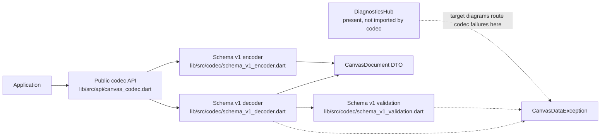
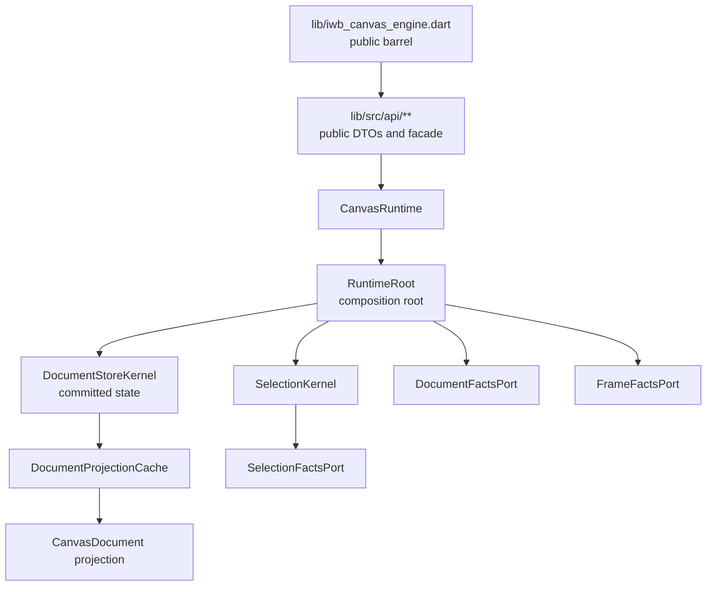
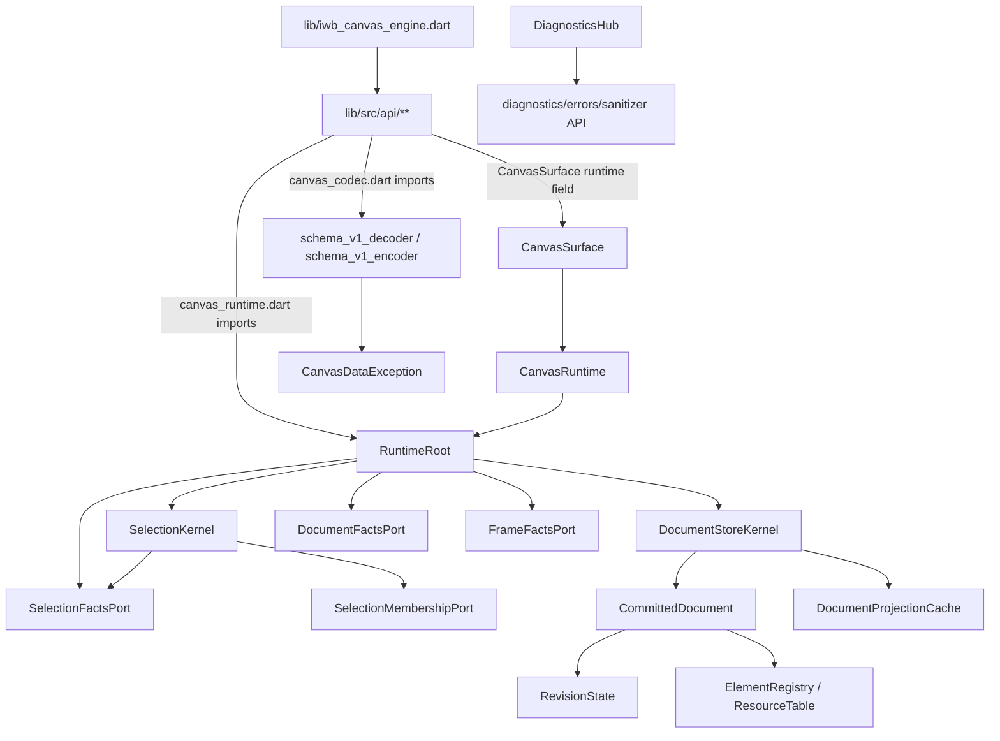

# Research: P0-P4 Architecture Closure

## Summary

The active roadmap marks P0 through P4 complete in `PLAN.md`: P0 is checked at `PLAN.md:23`, P1 at `PLAN.md:43`, P2 at `PLAN.md:44`, P3 at `PLAN.md:45`, and P4 at `PLAN.md:46`. The current code contains the expected public API barrel, public runtime facade, schema v1 codec, diagnostics hub, runtime root, committed document store, projection cache, frame/document/selection read ports, and selection kernel that correspond to the completed P0-P4 scope.

The final verification run is green: `dart analyze`, `dcm analyze .`, `dcm calculate-metrics .`, `dart run tool/guardrails/run.dart`, `dart run docs/tool/check_docs.dart`, and a final isolated `dart test` all passed. A previous concurrent `dart test` run timed out in a negative guardrail fixture path, but the production source check and then the full test suite passed when rerun without the concurrent load.

Two code-versus-target-diagram discrepancies are visible in the P0-P4 area. First, P3 schema diagrams route codec failures through `DiagnosticsHub`, while production codec code throws `CanvasDataException` directly and does not import `lib/src/diagnostics/**`. Second, P4 architecture and public API contracts assign runtime view camera ownership to `RuntimeRoot/CanvasCameraPort`, but `CanvasRuntime.camera` remains an `UnimplementedError` placeholder that is allowlisted with `ownerPhase: 'P4'`.

## Detailed Findings

### 1. Plan Index And Phase Closure Records

- **Location**: primary `PLAN.md:23`; additional references `PLAN.md:43`, `PLAN.md:44`, `PLAN.md:45`, `PLAN.md:46`.
- **Description**: The active plan index records P0, P1, P2, P3, and P4 as complete. The plan states that step order defines implementation order and that detailed scope, closure rules, and verification live in linked step documents (`PLAN.md:12`, `PLAN.md:13`).
- **Dependencies**: P1 depends on P0 package boundaries being enforced (`docs/implementation/p1_v1_scope_gate_before_public_api_freeze.md:20`), P2 depends on P1 remaining green (`docs/implementation/p2_public_api_v1_freeze.md:125`), P3 depends on the frozen public API and DTO validation (`docs/implementation/p3_schema_v1_dto_validation_and_codec_skeleton.md:21`), and P4 depends on P0, P2, and P3 foundations (`docs/implementation/p4_runtime_spine.md:34`, `docs/implementation/p4_runtime_spine.md:36`, `docs/implementation/p4_runtime_spine.md:37`).
- **Data flow**: Plan completion state in `PLAN.md` points to phase documents, phase documents list contract/test/guardrail obligations, and guardrail metadata routes those obligations to tests and structural checks (`tool/guardrails/src/guardrail_executor.dart:167`, `tool/guardrails/src/guardrail_executor.dart:223`).

### 2. P0-P2 Public Package And API Boundary

- **Location**: primary `lib/iwb_canvas_engine.dart:1`; additional references `lib/iwb_canvas_engine.dart:17`, `docs/architecture/02_package_boundaries.md:163`.
- **Description**: The root public barrel exports only `src/api/**` files (`lib/iwb_canvas_engine.dart:1`, `lib/iwb_canvas_engine.dart:17`). This matches the package boundary rule that `lib/iwb_canvas_engine.dart` exports only `src/api/**` (`docs/architecture/02_package_boundaries.md:163`).
- **Dependencies**: The public `CanvasRuntime` facade imports the runtime composition root (`lib/src/api/canvas_runtime.dart:22`) and delegates construction, reads, state, selection, id generation, and dispose into `RuntimeRoot` (`lib/src/api/canvas_runtime.dart:34`, `lib/src/api/canvas_runtime.dart:39`, `lib/src/api/canvas_runtime.dart:40`, `lib/src/api/canvas_runtime.dart:42`, `lib/src/api/canvas_runtime.dart:51`, `lib/src/api/canvas_runtime.dart:55`).
- **Data flow**: Application code imports the public barrel, obtains public DTOs and facade types, and the facade delegates implemented P4 behavior to `RuntimeRoot`. Public placeholders are detected from exported public API files and compared against the allowlist (`test/api_contract/public_api_no_unapproved_placeholders_test.dart:17`, `test/api_contract/public_api_no_unapproved_placeholders_test.dart:128`).

### 3. P3 Schema V1 Codec And Diagnostics

- **Location**: primary `lib/src/api/canvas_codec.dart:8`; additional references `lib/src/api/canvas_codec.dart:11`, `lib/src/api/canvas_codec.dart:14`, `lib/src/api/canvas_codec.dart:22`.
- **Description**: Public codec entrypoints are schema v1-only: `canvasSchemaVersionWrite` is `1`, `canvasSchemaVersionsRead` is `{1}`, encode delegates to `encodeSchemaV1Document`, and decode delegates to `decodeSchemaV1Document` (`lib/src/api/canvas_codec.dart:8`, `lib/src/api/canvas_codec.dart:11`, `lib/src/api/canvas_codec.dart:14`, `lib/src/api/canvas_codec.dart:22`).
- **Dependencies**: The public codec imports the schema v1 decoder and encoder (`lib/src/api/canvas_codec.dart:3`, `lib/src/api/canvas_codec.dart:4`). The decoder imports public DTO/error/value owners and shared validation (`lib/src/codec/schema_v1_decoder.dart:8`, `lib/src/codec/schema_v1_decoder.dart:10`, `lib/src/codec/schema_v1_decoder.dart:15`, `lib/src/codec/schema_v1_decoder.dart:16`). The decoder does not import `lib/src/diagnostics/**` in its import block (`lib/src/codec/schema_v1_decoder.dart:5`, `lib/src/codec/schema_v1_decoder.dart:16`).
- **Data flow**: Decode validates schema root, reads resources, background elements, layers, metadata, constructs `CanvasDocument`, validates references, and returns the document (`lib/src/codec/schema_v1_decoder.dart:18`, `lib/src/codec/schema_v1_decoder.dart:19`, `lib/src/codec/schema_v1_decoder.dart:21`, `lib/src/codec/schema_v1_decoder.dart:31`, `lib/src/codec/schema_v1_decoder.dart:33`, `lib/src/codec/schema_v1_decoder.dart:40`, `lib/src/codec/schema_v1_decoder.dart:43`, `lib/src/codec/schema_v1_decoder.dart:45`). JSON string decode checks raw length, parses JSON, and throws `CanvasDataException` directly for malformed JSON or non-object input (`lib/src/codec/schema_v1_decoder.dart:48`, `lib/src/codec/schema_v1_decoder.dart:49`, `lib/src/codec/schema_v1_decoder.dart:52`, `lib/src/codec/schema_v1_decoder.dart:54`, `lib/src/codec/schema_v1_decoder.dart:61`).

### 4. P3 Diagnostics Discrepancy Against Target Diagrams

- **Location**: primary `docs/diagrams/dfd_schema_v1_decode_encode.mmd:86`; additional references `docs/diagrams/dfd_schema_v1_decode_encode.mmd:89`, `docs/diagrams/seq_schema_v1_decode_encode_order.mmd:23`, `docs/diagrams/seq_schema_v1_decode_encode_order.mmd:54`.
- **Description**: The target schema v1 DFD routes unsupported version, unknown kind, invalid known field, and invalid DTO failures to `DiagnosticRecord`, then through a sanitizer to public `CanvasDataException` (`docs/diagrams/dfd_schema_v1_decode_encode.mmd:86`, `docs/diagrams/dfd_schema_v1_decode_encode.mmd:89`, `docs/diagrams/dfd_schema_v1_decode_encode.mmd:90`, `docs/diagrams/dfd_schema_v1_decode_encode.mmd:106`). The target sequence diagram also shows raw input, root-object, schema validation, and DTO validation failures creating codec diagnostics through `DiagnosticsHub` (`docs/diagrams/seq_schema_v1_decode_encode_order.mmd:23`, `docs/diagrams/seq_schema_v1_decode_encode_order.mmd:31`, `docs/diagrams/seq_schema_v1_decode_encode_order.mmd:54`, `docs/diagrams/seq_schema_v1_decode_encode_order.mmd:80`).
- **Dependencies**: `DiagnosticsHub` exists as an internal hub that records `DiagnosticEvent` values only when policy is enabled (`lib/src/diagnostics/diagnostics_hub.dart:19`, `lib/src/diagnostics/diagnostics_hub.dart:29`, `lib/src/diagnostics/diagnostics_hub.dart:30`, `lib/src/diagnostics/diagnostics_hub.dart:34`). It has `DiagnosticSource.codec` as one source variant (`lib/src/diagnostics/diagnostics_hub.dart:9`, `lib/src/diagnostics/diagnostics_hub.dart:10`).
- **Data flow**: Production codec failure paths use `CanvasDataException` directly in decoder and schema root validation (`lib/src/codec/schema_v1_decoder.dart:54`, `lib/src/codec/schema_v1_decoder.dart:61`, `lib/src/codec/schema_v1_validation.dart:17`). The P3 implementation therefore has a direct codec-to-public-error path in production code, while the target diagrams show a codec-to-diagnostics-to-public-error path.

### 5. P4 Runtime Root, Store, Projection, And Selection

- **Location**: primary `lib/src/runtime/runtime_root.dart:26`; additional references `docs/implementation/p4_runtime_spine.md:5`, `docs/implementation/p4_runtime_spine.md:12`.
- **Description**: P4 scope creates the runtime spine with one `RuntimeRoot`, committed document storage, revision facts, public projection, and narrow read boundaries for later phases (`docs/implementation/p4_runtime_spine.md:5`, `docs/implementation/p4_runtime_spine.md:6`, `docs/implementation/p4_runtime_spine.md:7`). Production `RuntimeRoot` implements `DocumentFactsPort` and `FrameFactsPort` (`lib/src/runtime/runtime_root.dart:26`) and constructs `DocumentStoreKernel`, `RuntimeConfig`, `SelectionKernel`, and `ValueNotifier<CanvasRuntimeState>` (`lib/src/runtime/runtime_root.dart:31`, `lib/src/runtime/runtime_root.dart:32`, `lib/src/runtime/runtime_root.dart:37`, `lib/src/runtime/runtime_root.dart:40`).
- **Dependencies**: `RuntimeRoot` imports public DTO/value owners, selection, store, and runtime ports (`lib/src/runtime/runtime_root.dart:12`, `lib/src/runtime/runtime_root.dart:15`, `lib/src/runtime/runtime_root.dart:16`, `lib/src/runtime/runtime_root.dart:17`, `lib/src/runtime/runtime_root.dart:18`, `lib/src/runtime/runtime_root.dart:20`, `lib/src/runtime/runtime_root.dart:21`). `DocumentStoreKernel` owns the committed document and projection cache (`lib/src/store/document_store_kernel.dart:34`, `lib/src/store/document_store_kernel.dart:35`). `SelectionKernel` owns selected ids and selection revision (`lib/src/selection/selection_kernel.dart:12`, `lib/src/selection/selection_kernel.dart:13`).
- **Data flow**: `CanvasRuntime.readDocument()` delegates to `RuntimeRoot.readDocument()` and then to `DocumentStoreKernel.readDocument()` (`lib/src/api/canvas_runtime.dart:39`, `lib/src/runtime/runtime_root.dart:86`, `lib/src/store/document_store_kernel.dart:40`). The store returns projections through `DocumentProjectionCache.projectionFor`, which caches by projection revision and builds a public `CanvasDocument` projection when needed (`lib/src/store/document_projection_cache.dart:12`, `lib/src/store/document_projection_cache.dart:13`, `lib/src/store/document_projection_cache.dart:20`, `lib/src/store/document_projection_cache.dart:21`, `lib/src/store/document_projection_cache.dart:29`).

### 6. P4 Frame And Document Read Ports

- **Location**: primary `lib/src/runtime/frame_facts_port.dart:138`; additional references `lib/src/runtime/document_facts_port.dart:24`.
- **Description**: `FrameFactsPort` exposes immutable frame-facing revision facts, element handles, resolved element facts, and resource descriptor facts (`lib/src/runtime/frame_facts_port.dart:138`, `lib/src/runtime/frame_facts_port.dart:139`, `lib/src/runtime/frame_facts_port.dart:140`, `lib/src/runtime/frame_facts_port.dart:141`, `lib/src/runtime/frame_facts_port.dart:142`). `DocumentFactsPort` exposes document summary/revision and immutable content/selectable id sets (`lib/src/runtime/document_facts_port.dart:3`, `lib/src/runtime/document_facts_port.dart:12`, `lib/src/runtime/document_facts_port.dart:24`).
- **Dependencies**: The P4 exit gate requires later owners to obtain committed facts through narrow immutable query ports, including `FrameFactsPort`, and not through concrete store tables (`docs/implementation/p4_runtime_spine.md:104`, `docs/implementation/p4_runtime_spine.md:105`, `docs/implementation/p4_runtime_spine.md:106`). Package boundary rules define `FrameFactsPort` under `lib/src/runtime/` as backed by `DocumentStoreKernel` through `RuntimeRoot` composition and forbid frame-owned code from importing store internals for frame capture, row snapshots, or descriptor snapshots (`docs/architecture/02_package_boundaries.md:193`, `docs/architecture/02_package_boundaries.md:194`, `docs/architecture/02_package_boundaries.md:195`, `docs/architecture/02_package_boundaries.md:196`, `docs/architecture/02_package_boundaries.md:198`).
- **Data flow**: `RuntimeRoot.frameRevisions` maps store revisions into `FrameRevisionFacts` (`lib/src/runtime/runtime_root.dart:74`, `lib/src/runtime/runtime_root.dart:76`, `lib/src/runtime/runtime_root.dart:83`). `RuntimeRoot.elementHandles`, `resolveElement`, and `resourceDescriptor` copy store facts into frame-facing facts without exposing store-owned fact objects (`lib/src/runtime/runtime_root.dart:106`, `lib/src/runtime/runtime_root.dart:122`, `lib/src/runtime/runtime_root.dart:135`, `lib/src/runtime/runtime_root.dart:178`, `lib/src/runtime/runtime_root.dart:184`).

### 7. P4 Selection Ownership

- **Location**: primary `lib/src/selection/selection_kernel.dart:7`; additional references `docs/architecture/03_data_model.md:140`.
- **Description**: `SelectionKernel` implements `SelectionFactsPort`, owns `_selectedIds` and `_selectionRevision`, and exposes selection facts as immutable sets (`lib/src/selection/selection_kernel.dart:7`, `lib/src/selection/selection_kernel.dart:12`, `lib/src/selection/selection_kernel.dart:13`, `lib/src/selection/selection_kernel.dart:18`, `lib/src/selection/selection_kernel.dart:20`). The data model says selection-only changes increment `selectionRevision` and do not increment `documentRevision`, evict `DocumentProjectionCache`, or update `SpatialKernel` (`docs/architecture/03_data_model.md:140`, `docs/architecture/03_data_model.md:141`, `docs/architecture/03_data_model.md:142`, `docs/architecture/03_data_model.md:143`).
- **Dependencies**: `SelectionKernel` depends on `SelectionMembershipPort` for normalization (`lib/src/selection/selection_kernel.dart:4`, `lib/src/selection/selection_kernel.dart:5`, `lib/src/selection/selection_kernel.dart:8`, `lib/src/selection/selection_kernel.dart:26`). `RuntimeRoot` wires that membership port to store-owned selectable/content ids through `_StoreSelectionMembership` (`lib/src/runtime/runtime_root.dart:274`, `lib/src/runtime/runtime_root.dart:280`, `lib/src/runtime/runtime_root.dart:285`).
- **Data flow**: Public selection operations enter through `CanvasRuntime.selection`, delegate to `RuntimeRoot`, normalize through store membership facts, update `SelectionKernel`, and publish runtime state only when membership changes (`lib/src/api/canvas_runtime.dart:42`, `lib/src/runtime/runtime_root.dart:196`, `lib/src/runtime/runtime_root.dart:198`, `lib/src/runtime/runtime_root.dart:239`, `lib/src/runtime/runtime_root.dart:243`, `lib/src/selection/selection_kernel.dart:60`, `lib/src/selection/selection_kernel.dart:68`).

### 8. P4 Runtime View Camera Discrepancy

- **Location**: primary `lib/src/api/canvas_runtime.dart:45`; additional references `tool/guardrails/src/public_api_placeholder_allowlist.dart:37`, `tool/guardrails/src/public_api_placeholder_allowlist.dart:38`.
- **Description**: `CanvasRuntime.camera` currently throws `UnimplementedError` (`lib/src/api/canvas_runtime.dart:45`). The placeholder allowlist includes `CanvasRuntime.camera` with `ownerPhase: 'P4'` and states that runtime camera mutation is owned by the runtime spine (`tool/guardrails/src/public_api_placeholder_allowlist.dart:37`, `tool/guardrails/src/public_api_placeholder_allowlist.dart:38`, `tool/guardrails/src/public_api_placeholder_allowlist.dart:39`, `tool/guardrails/src/public_api_placeholder_allowlist.dart:41`).
- **Dependencies**: The architecture ownership document says the runtime view camera is owned by `RuntimeRoot/CanvasCameraPort`, published through `state.revisions.viewCamera`, repaints affected surfaces, and does not dirty document state or invalidate projection (`docs/architecture/01_runtime_ownership.md:83`, `docs/architecture/01_runtime_ownership.md:86`, `docs/architecture/01_runtime_ownership.md:87`, `docs/architecture/01_runtime_ownership.md:88`, `docs/architecture/01_runtime_ownership.md:90`). The data model states that runtime view camera is not stored in `CommittedDocument`, is owned by `RuntimeRoot` through the camera boundary, and that runtime view camera changes increment `state.revisions.viewCamera` without document/projection effects (`docs/architecture/03_data_model.md:110`, `docs/architecture/03_data_model.md:111`, `docs/architecture/03_data_model.md:147`, `docs/architecture/03_data_model.md:148`, `docs/architecture/03_data_model.md:149`).
- **Data flow**: The current runtime state factory publishes `viewCamera: 0` and has no camera port backing path in `RuntimeRoot` (`lib/src/runtime/runtime_root.dart:255`, `lib/src/runtime/runtime_root.dart:260`). The operation matrix describes `CanvasCameraPort.setOffset/panBy` as runtime view camera operations that update `state.revisions.viewCamera` with no document/projection effects (`docs/contracts/operation_matrix.md:67`), while the public API contract describes `CanvasCameraPort` as owning runtime view camera and exposing current `camera` and `offset` (`docs/contracts/public_api_v1.md:1734`, `docs/contracts/public_api_v1.md:1737`, `docs/contracts/public_api_v1.md:1748`, `docs/contracts/public_api_v1.md:1751`).

### 9. Target Diagram Scope Beyond P0-P4

- **Location**: primary `docs/diagrams/README.md:24`; additional references `docs/diagrams/README.md:28`, `docs/implementation/p4_runtime_spine.md:29`.
- **Description**: Several target diagrams are related to P0-P4 but also include later phases. `c4_component_runtime` is related to P0, P4, P5, P6, P9, and P14 (`docs/diagrams/README.md:24`, `docs/diagrams/README.md:28`). `dfd_cache_invalidation` is related to P4, P5, P6, P7, P8, P9, P13, and P14 (`docs/diagrams/README.md:101`, `docs/diagrams/README.md:105`). P4 explicitly excludes edit session, load replacement, paint, resource resolver, pointer routing, and Flutter widget behavior (`docs/implementation/p4_runtime_spine.md:29`, `docs/implementation/p4_runtime_spine.md:30`).
- **Dependencies**: The C4 component diagram includes target future components such as `EditKernel`, `InteractionEngine`, `FrameEngine`, `SpatialKernel`, `ResourceKernel`, `SurfaceResourceSession`, and frame-private planners (`docs/diagrams/c4_component_runtime.mmd:10`, `docs/diagrams/c4_component_runtime.mmd:11`, `docs/diagrams/c4_component_runtime.mmd:14`, `docs/diagrams/c4_component_runtime.mmd:22`, `docs/diagrams/c4_component_runtime.mmd:23`, `docs/diagrams/c4_component_runtime.mmd:24`). P4 says it creates narrow read ports for later phases but does not create edit, load, frame, spatial, resource, interaction, or Flutter behavior (`plan/step_24_p4_runtime_spine_store_and_projection_cache.md:234`, `plan/step_24_p4_runtime_spine_store_and_projection_cache.md:235`, `plan/step_24_p4_runtime_spine_store_and_projection_cache.md:236`).
- **Data flow**: The actual P0-P4 code has `RuntimeRoot -> DocumentStoreKernel`, `RuntimeRoot -> SelectionKernel`, `RuntimeRoot -> FrameFactsPort`, and API-to-codec delegation. The target diagrams also include future edit/interaction/frame/resource/surface flows whose absence in P0-P4 code matches the P4 exclusion list.

### 10. C4 Context And Container Diagram Mapping

- **Location**: primary `docs/diagrams/c4_context.mmd:2`; additional references `docs/diagrams/c4_container.mmd:2`.
- **Description**: The context diagram maps application code to the public API, `CanvasSurface`, `CanvasRuntime`, Flutter, resource resolver, and JSON/storage boundaries (`docs/diagrams/c4_context.mmd:2`, `docs/diagrams/c4_context.mmd:10`). The container diagram maps `RuntimeRoot` to store, frame facts, selection, edit, interaction, frame, spatial, resource, codec, and diagnostics containers (`docs/diagrams/c4_container.mmd:4`, `docs/diagrams/c4_container.mmd:13`).
- **Dependencies**: Current production code maps the public barrel and API side of that target: the root barrel exports API files (`lib/iwb_canvas_engine.dart:1`, `lib/iwb_canvas_engine.dart:17`), `CanvasRuntime` creates `RuntimeRoot` (`lib/src/api/canvas_runtime.dart:28`, `lib/src/api/canvas_runtime.dart:34`), and `CanvasSurface` contains a `CanvasRuntime` plus optional `CanvasResourceResolver` (`lib/src/api/canvas_surface.dart:8`, `lib/src/api/canvas_surface.dart:18`, `lib/src/api/canvas_surface.dart:19`).
- **Data flow**: Current `RuntimeRoot` imports and composes store, selection, facts ports, and config (`lib/src/runtime/runtime_root.dart:15`, `lib/src/runtime/runtime_root.dart:16`, `lib/src/runtime/runtime_root.dart:17`, `lib/src/runtime/runtime_root.dart:21`). The current imports and fields do not include `EditKernel`, `InteractionEngine`, `FrameEngine`, `SpatialKernel`, or `ResourceKernel` (`lib/src/runtime/runtime_root.dart:12`, `lib/src/runtime/runtime_root.dart:21`, `lib/src/runtime/runtime_root.dart:42`, `lib/src/runtime/runtime_root.dart:47`).

### 11. Diagnostics Error Projection Diagram Mapping

- **Location**: primary `docs/diagrams/dfd_diagnostics_error_projection.mmd:6`; additional references `lib/src/diagnostics/diagnostics_hub.dart:19`.
- **Description**: The diagnostics projection diagram models public/runtime errors flowing through policy-gated `DiagnosticsHub`, `DiagnosticRecord`, sanitizer, and public exception projection (`docs/diagrams/dfd_diagnostics_error_projection.mmd:6`, `docs/diagrams/dfd_diagnostics_error_projection.mmd:84`). Production `DiagnosticsHub` imports the sanitizer, diagnostics policy, and public errors (`lib/src/diagnostics/diagnostics_hub.dart:1`, `lib/src/diagnostics/diagnostics_hub.dart:3`).
- **Dependencies**: The disabled policy check happens before record allocation (`lib/src/diagnostics/diagnostics_hub.dart:25`, `lib/src/diagnostics/diagnostics_hub.dart:29`, `lib/src/diagnostics/diagnostics_hub.dart:35`). `DiagnosticRecord` stores code, severity, source, details, path, revision, session id, and correlation id (`lib/src/diagnostics/diagnostics_hub.dart:84`, `lib/src/diagnostics/diagnostics_hub.dart:109`).
- **Data flow**: The diagnostics hub data flow exists for diagnostics-owned records. Codec failures currently bypass the hub and construct `CanvasDataException` directly in decoder/validation paths (`lib/src/codec/schema_v1_decoder.dart:54`, `lib/src/codec/schema_v1_validation.dart:17`).

### 12. Public Edit Diagram Mapping

- **Location**: primary `docs/diagrams/dfd_public_edit.mmd:6`; additional references `lib/src/api/canvas_runtime.dart:41`.
- **Description**: The public edit DFD models `CanvasEditPort.edit(fn)`, `EditKernel`, draft, touched set, commit compiler, commit plan, atomic install, selection effects, spatial/projection/resource invalidation, repaint bus, and diagnostics (`docs/diagrams/dfd_public_edit.mmd:6`, `docs/diagrams/dfd_public_edit.mmd:77`).
- **Dependencies**: Public edit interfaces exist in the frozen API (`lib/src/api/canvas_runtime.dart:173`, `lib/src/api/canvas_runtime.dart:177`, `lib/src/api/canvas_runtime.dart:183`, `lib/src/api/canvas_runtime.dart:203`). The public runtime facade still returns `UnimplementedError` for `CanvasRuntime.edits` (`lib/src/api/canvas_runtime.dart:41`).
- **Data flow**: No production `EditKernel`, `DraftDocument`, `TouchedSet`, `CommitCompiler`, or `CommitPlan` counterpart is present in the inspected P0-P4 implementation. This matches P4's exclusion of edit behavior (`docs/implementation/p4_runtime_spine.md:29`).

### 13. Cache Invalidation And Runtime Lifecycle Diagram Mapping

- **Location**: primary `docs/diagrams/dfd_cache_invalidation.mmd:7`; additional references `docs/diagrams/state_runtime_lifecycle.mmd:3`.
- **Description**: The cache invalidation DFD includes touched/load/resource/camera/interaction invalidation, store revisions, projection, spatial/resource/frame effects, and forbidden effects (`docs/diagrams/dfd_cache_invalidation.mmd:7`, `docs/diagrams/dfd_cache_invalidation.mmd:212`). The runtime lifecycle diagram models creating, active, disposing, and disposed states (`docs/diagrams/state_runtime_lifecycle.mmd:3`, `docs/diagrams/state_runtime_lifecycle.mmd:101`).
- **Dependencies**: Current code has `RevisionState` for document/projection/structural/bounds/visual/background/grid/resource counters (`lib/src/store/revision_state.dart:1`, `lib/src/store/revision_state.dart:21`) and `DocumentProjectionCache` keyed by projection revision (`lib/src/store/document_projection_cache.dart:12`, `lib/src/store/document_projection_cache.dart:26`). `CanvasRuntime` constructs default document/root and `RuntimeRoot` initializes store/config/selection/state (`lib/src/api/canvas_runtime.dart:29`, `lib/src/api/canvas_runtime.dart:35`, `lib/src/runtime/runtime_root.dart:27`, `lib/src/runtime/runtime_root.dart:40`).
- **Data flow**: Runtime state currently maps document and selection revisions from implemented owners while preview, viewCamera, resourceVisual, interaction, and epoch are zero (`lib/src/runtime/runtime_root.dart:255`, `lib/src/runtime/runtime_root.dart:264`). Implemented mutators call `_ensureNotDisposed`, and dispose is idempotent (`lib/src/runtime/runtime_root.dart:87`, `lib/src/runtime/runtime_root.dart:103`, `lib/src/runtime/runtime_root.dart:196`, `lib/src/runtime/runtime_root.dart:219`, `lib/src/runtime/runtime_root.dart:225`, `lib/src/runtime/runtime_root.dart:231`). Load, edit, command, pointer cleanup, resource cleanup, and stream behavior are absent or unimplemented in the P0-P4 code (`lib/src/api/canvas_runtime.dart:41`, `lib/src/api/canvas_runtime.dart:50`).

### 14. Actual Code Diagram From LSP Symbols And Imports

- **Location**: primary `lib/src/runtime/runtime_root.dart:26`; additional references `lib/src/store/document_store_kernel.dart:17`, `lib/src/selection/selection_kernel.dart:7`.
- **Description**: LSP document symbols and import scanning map the current production code to public API, codec, diagnostics, runtime, selection, and store owners. Current `lib/src` production counterparts exist for API, codec, diagnostics, runtime, selection, and store; P5+ production counterparts for edit, interaction, frame, spatial, and resources are not present in current `RuntimeRoot` imports/fields (`lib/src/runtime/runtime_root.dart:12`, `lib/src/runtime/runtime_root.dart:21`, `lib/src/runtime/runtime_root.dart:42`, `lib/src/runtime/runtime_root.dart:47`).
- **Dependencies**: `RuntimeRoot` imports actual current collaborators (`lib/src/runtime/runtime_root.dart:15`, `lib/src/runtime/runtime_root.dart:21`). Store owns projection read path (`lib/src/store/document_store_kernel.dart:35`, `lib/src/store/document_store_kernel.dart:40`). Selection owns selected ids/revision (`lib/src/selection/selection_kernel.dart:11`, `lib/src/selection/selection_kernel.dart:13`).
- **Data flow**: The actual graph below is derived from LSP `documentSymbol` output and import edges, then compared to the target diagram catalog.

### 15. CanvasSurface And Single Active Surface Scope

- **Location**: primary `lib/src/api/canvas_surface.dart:8`; additional references `lib/src/api/canvas_surface.dart:110`.
- **Description**: `CanvasSurface` exists as a public `StatefulWidget` with public constructor fields (`lib/src/api/canvas_surface.dart:8`, `lib/src/api/canvas_surface.dart:9`, `lib/src/api/canvas_surface.dart:18`, `lib/src/api/canvas_surface.dart:22`). Its state currently builds `SizedBox.shrink()` (`lib/src/api/canvas_surface.dart:110`, `lib/src/api/canvas_surface.dart:112`).
- **Dependencies**: The public API contract defines the single-active-surface behavior for v1 (`docs/contracts/public_api_v1.md:511`, `docs/contracts/public_api_v1.md:514`, `docs/contracts/public_api_v1.md:519`, `docs/contracts/public_api_v1.md:523`). The single-active-surface sequence diagram is related to P2, P13, and P14 (`docs/diagrams/README.md:45`, `docs/diagrams/README.md:49`), and P13 lists the single active `CanvasSurface` attachment gate as its own build scope (`docs/implementation/p13_flutter_surface.md:11`, `docs/implementation/p13_flutter_surface.md:12`).
- **Data flow**: The current P2 surface declaration exposes constructor and value shapes. The target sequence diagram shows attach/detach/session behavior for later surface phases (`docs/diagrams/seq_single_active_surface.mmd:13`, `docs/diagrams/seq_single_active_surface.mmd:14`, `docs/diagrams/seq_single_active_surface.mmd:20`, `docs/diagrams/seq_single_active_surface.mmd:31`, `docs/diagrams/seq_single_active_surface.mmd:36`).

## Code References

- `PLAN.md:23` - P0 is checked complete.
- `PLAN.md:43` - P1 is checked complete.
- `PLAN.md:44` - P2 is checked complete.
- `PLAN.md:45` - P3 is checked complete.
- `PLAN.md:46` - P4 is checked complete.
- `lib/iwb_canvas_engine.dart:1` - root public barrel starts with `src/api/**` exports.
- `lib/src/api/canvas_runtime.dart:34` - public runtime facade constructs `RuntimeRoot`.
- `lib/src/api/canvas_runtime.dart:39` - public runtime read path delegates to root.
- `lib/src/api/canvas_runtime.dart:40` - public runtime state delegates to root.
- `lib/src/api/canvas_runtime.dart:45` - `CanvasRuntime.camera` remains an `UnimplementedError` placeholder.
- `lib/src/api/canvas_codec.dart:8` - schema v1 write constant.
- `lib/src/api/canvas_codec.dart:22` - public decode delegates to schema v1 decoder.
- `lib/src/codec/schema_v1_decoder.dart:18` - schema v1 map decode entrypoint.
- `lib/src/codec/schema_v1_decoder.dart:54` - malformed JSON throws `CanvasDataException` directly.
- `lib/src/codec/schema_v1_validation.dart:17` - invalid schema version throws `CanvasDataException` directly.
- `lib/src/diagnostics/diagnostics_hub.dart:19` - `DiagnosticsHub` declaration.
- `lib/src/runtime/runtime_root.dart:26` - `RuntimeRoot` implements read ports.
- `lib/src/runtime/runtime_root.dart:31` - `RuntimeRoot` composes `DocumentStoreKernel`.
- `lib/src/runtime/runtime_root.dart:37` - `RuntimeRoot` composes `SelectionKernel`.
- `lib/src/runtime/runtime_root.dart:86` - runtime read path delegates to store.
- `lib/src/runtime/runtime_root.dart:260` - public runtime state currently publishes `viewCamera: 0`.
- `lib/src/store/document_store_kernel.dart:40` - store read path uses projection cache.
- `lib/src/store/document_projection_cache.dart:12` - projection cache entrypoint.
- `lib/src/selection/selection_kernel.dart:12` - selection kernel owns selected ids.
- `lib/src/selection/selection_kernel.dart:13` - selection kernel owns selection revision.
- `lib/src/runtime/frame_facts_port.dart:138` - frame facts query port.
- `tool/guardrails/src/public_api_placeholder_allowlist.dart:37` - `CanvasRuntime.camera` placeholder allowlist entry.
- `docs/diagrams/dfd_schema_v1_decode_encode.mmd:86` - target codec failures enter diagnostic record path.
- `docs/diagrams/seq_schema_v1_decode_encode_order.mmd:23` - target raw failure goes through diagnostics.
- `docs/architecture/01_runtime_ownership.md:86` - runtime view camera owner is `RuntimeRoot/CanvasCameraPort`.
- `docs/architecture/03_data_model.md:147` - runtime view camera changes increment `state.revisions.viewCamera`.
- `docs/implementation/p4_runtime_spine.md:104` - P4 exit gate requires narrow immutable committed fact ports.
- `docs/implementation/p4_runtime_spine.md:113` - P4 risk/tradeoff section states the phase must stop at runtime composition, config, storage, revisions, projection, and read boundaries.

## Observed Architecture Facts

- Pattern observed: public package consumers enter through `lib/iwb_canvas_engine.dart`, which exports public API files only (`lib/iwb_canvas_engine.dart:1`, `lib/iwb_canvas_engine.dart:17`, `docs/architecture/02_package_boundaries.md:163`).
- Pattern observed: P4 implemented one runtime composition root behind the public facade (`lib/src/api/canvas_runtime.dart:34`, `lib/src/runtime/runtime_root.dart:26`, `docs/implementation/p4_runtime_spine.md:5`).
- Pattern observed: committed state and public document projection are separated by `DocumentStoreKernel` and `DocumentProjectionCache` (`lib/src/store/document_store_kernel.dart:34`, `lib/src/store/document_store_kernel.dart:35`, `lib/src/store/document_store_kernel.dart:40`, `lib/src/store/document_projection_cache.dart:12`).
- Pattern observed: selection is owned outside committed document state by `SelectionKernel`, and public selection-only operations publish selection revision changes without document revision changes in the tested fixture (`lib/src/selection/selection_kernel.dart:12`, `lib/src/selection/selection_kernel.dart:13`, `test/selection/fixtures/runtime_owner_separation_fixture.dart:61`, `test/selection/fixtures/runtime_owner_separation_fixture.dart:64`).
- Pattern observed: frame/document facts are exposed through runtime-owned immutable ports, with `RuntimeRoot` copying store facts into port values (`lib/src/runtime/frame_facts_port.dart:138`, `lib/src/runtime/runtime_root.dart:74`, `lib/src/runtime/runtime_root.dart:122`, `lib/src/runtime/runtime_root.dart:184`).
- Pattern observed: P3 codec has no runtime/store side effects in the public codec proof (`test/codec/decode_encode_no_runtime_side_effects_test.dart:46`, `test/codec/decode_encode_no_runtime_side_effects_test.dart:57`, `test/codec/decode_encode_no_runtime_side_effects_test.dart:58`, `test/codec/decode_encode_no_runtime_side_effects_test.dart:68`).
- Discrepancy observed: target P3 diagrams include `DiagnosticsHub` on codec failure paths, while production codec failure code throws `CanvasDataException` directly (`docs/diagrams/dfd_schema_v1_decode_encode.mmd:86`, `docs/diagrams/seq_schema_v1_decode_encode_order.mmd:54`, `lib/src/codec/schema_v1_decoder.dart:54`, `lib/src/codec/schema_v1_validation.dart:17`).
- Discrepancy observed: target runtime camera ownership is documented under `RuntimeRoot/CanvasCameraPort`, while `CanvasRuntime.camera` is still a P4 allowlisted placeholder (`docs/architecture/01_runtime_ownership.md:86`, `docs/contracts/public_api_v1.md:1748`, `lib/src/api/canvas_runtime.dart:45`, `tool/guardrails/src/public_api_placeholder_allowlist.dart:37`).

## Verification

- Passed: `dart analyze`.
- Passed: `dcm analyze .`.
- Passed: `dcm calculate-metrics .`.
- Passed: `dart run tool/guardrails/run.dart`.
- Passed: `dart run docs/tool/check_docs.dart`.
- Passed: isolated `dart test test/guardrails/import_boundaries_test.dart` after a concurrent full-test timeout.
- Passed: final isolated `dart test` with 102 tests.

## Open Questions

- The current artifacts do not show whether P4 closure was intended to implement `CanvasRuntime.camera` immediately, or whether the P4-owned placeholder is a historical allowance that should have been retired during P4 closure (`lib/src/api/canvas_runtime.dart:45`, `tool/guardrails/src/public_api_placeholder_allowlist.dart:37`, `docs/architecture/01_runtime_ownership.md:86`).
- The current P3 diagrams show codec failures flowing through `DiagnosticsHub`, while production codec code uses direct `CanvasDataException` construction. The inspected code does not contain a codec-to-`DiagnosticsHub` production path (`docs/diagrams/dfd_schema_v1_decode_encode.mmd:86`, `docs/diagrams/seq_schema_v1_decode_encode_order.mmd:54`, `lib/src/codec/schema_v1_decoder.dart:54`, `lib/src/diagnostics/diagnostics_hub.dart:19`).
- The target diagrams contain future components and flows across P5-P14. The P4 contract explicitly excludes those behaviors, so the current code maps only the P0-P4 subset of those diagrams (`docs/diagrams/README.md:28`, `docs/diagrams/README.md:105`, `docs/implementation/p4_runtime_spine.md:29`, `plan/step_24_p4_runtime_spine_store_and_projection_cache.md:234`).
