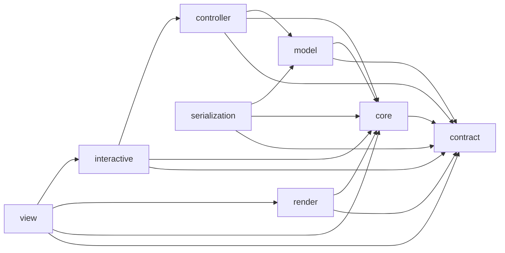

# Architecture

## 1. Purpose

This document describes the checked-in architecture of `iwb_canvas_engine`.

It is a maintainer document, not an API tutorial. Its job is to make the
package boundary, layer contracts, runtime building blocks, execution flows,
and non-negotiable invariants explicit enough that contributors can change the
code without accidentally weakening the design.

When this document and repository-backed enforcement disagree, the repository
wins. In practice, the source of truth is the combination of:

- `lib/iwb_canvas_engine.dart`
- `lib/src/**`
- `tool/invariant_registry.dart`
- `tool/check_import_boundaries.dart`
- `tool/check_guardrails.dart`
- architecture-facing tests under `test/**`

## 2. Package boundary

### Public boundary

- Public package entrypoint:
  `package:iwb_canvas_engine/iwb_canvas_engine.dart`
- Current write schema version:
  `schemaVersionWrite = 7`
- Current read schema versions:
  `schemaVersionsRead = {7}`

The supported public surface is exactly the symbol set exported from
`lib/iwb_canvas_engine.dart`.

### What the package owns

`iwb_canvas_engine` owns the whiteboard engine itself:

- immutable scene boundary types (`SceneSnapshot`, `NodeSnapshot`, specs,
  patches, validated values)
- mutable runtime scene graph and geometry
- transactional scene mutation and commit
- interactive controller/runtime behavior
- scene rendering
- pointer session routing between Flutter view hosting and the interactive
  runtime
- scene import/build validation and canonicalization
- JSON encode/decode

### What the package does not own

The package does **not** own application UI or product workflows. In
particular, it does not own:

- toolbars, dialogs, side panels, or app-specific widgets
- persistence, sync, collaboration, or backend logic
- application-level undo/redo storage
- business logic outside the scene engine boundary

## 3. Architectural goals

The current architecture is built around six goals.

1. **Stable public boundary.** There is one supported public import, and
   mutable internal runtime owners do not leak into public signatures.
2. **Immutable outside, mutable inside.** Callers exchange snapshots/specs/
   patches; the engine mutates an internal runtime scene graph.
3. **Explicit layer DAG.** `lib/src/**` is organized into layers with
   mechanically checked dependency rules.
4. **Transactional mutation.** Supported mutations go through a transactional
   write boundary and commit atomically.
5. **Frame-authoritative rendering.** The paint pipeline renders from one
   atomic frame read with one frozen frame-preview authority rather than
   mixing multiple read snapshots or live preview answers in one frame.
6. **Strict boundary validation.** Import, build, and serialization paths
   validate and canonicalize data, and failures use a stable
   `SceneDataException` contract.

## 4. Public API map

The package barrel currently exports the following architectural roots.

### Document and boundary contract

- `SceneSnapshot` and node snapshot types
- `NodeSpec` and node spec types
- `NodePatch` and patch-field types
- validated boundary value types
- `Transform2D`
- `PointerInputSettings`
- `SceneDataException`
- `SceneRenderState`
- `SceneWriteTxn`

### Import and serialization

- `SceneBuilder`
- `decodeScene`
- `decodeSceneFromJson`
- `encodeScene`
- `encodeSceneToJson`
- `schemaVersionWrite`
- `schemaVersionsRead`

### Runtime and view

- `SceneController`
- `SceneControllerInteraction`
- `SceneControllerSelection`
- `SceneControllerScene`
- `MoveCommitDeltaRequest`
- `MoveCommitDeltaResolver`
- `SceneView` / `SceneViewInteractive`

### Runtime events and interaction enums

- `ActionCommitted`
- `ActionCommittedDelta`
- `ActionType`
- `EditTextRequested`
- `CanvasMode`
- `DrawTool`

Anything imported from `package:iwb_canvas_engine/src/**` is an internal
package detail and is not part of the supported external integration contract.

## 5. Core architectural model

### 5.1 Two representations of the same document

The package intentionally keeps two representations of scene state.

#### Public boundary representation

The public boundary is immutable and validation-heavy:

- `SceneSnapshot` / `NodeSnapshot`
- `NodeSpec`
- `NodePatch`
- validated value objects
- JSON maps and JSON strings at the serialization boundary

This is the representation exchanged with application code and used for the
stable public contract.

#### Internal runtime representation

The runtime representation is mutable and optimized for engine ownership:

- `Scene`
- `BackgroundLayer`
- `ContentLayer`
- `SceneNode` and concrete runtime node classes

This representation exists only inside the engine.

#### Ownership rule

The **model layer owns the mapping between the two worlds**. It is responsible
for:

- importing snapshots and JSON into canonical runtime scenes
- exporting runtime scenes back to canonical snapshots
- structural validation and canonicalization
- node/spec/patch boundary mapping

A contributor should treat the mapping between public immutable documents and
internal mutable runtime documents as a first-class architectural boundary, not
as a convenience conversion.

### 5.2 Canonical document shape

There is one important distinction between runtime shape and public shape:

- runtime `Scene.backgroundLayer` may be `null`
- snapshot and JSON boundaries always canonicalize the same concept into a
  dedicated background layer

This means the nullable runtime background layer is an internal optimization,
not a competing public model.

### 5.3 Read side vs write side

The committed read side is snapshot-backed. The write side owns the mutable
runtime scene.

This split is deliberate:

- public reads resolve immutable snapshots
- transactional writes operate on internal mutable runtime state
- mutable `Scene` / `SceneNode` instances do not escape the write subsystem

### 5.4 The runtime seams exposed to view hosting

The view host does not talk directly to controller internals. The explicit seam
is:

- `SceneViewRuntime`
- `SceneViewPointerSession`
- `SceneViewRenderState`

That seam exists so the Flutter host shell can stay in `view/**`, while the
interactive/controller-owned runtime remains inside `interactive/**` and
`controller/**`.

## 6. Layered architecture

The repository is organized into eight top-level layers under `lib/src`.

| Layer | Responsibility | Allowed lower-layer dependencies | Key files / seams |
|---|---|---|---|
| `contract` | Public-facing document types, runtime contracts, validated values, stable boundary errors | none | `snapshot.dart`, `node_spec.dart`, `node_patch.dart`, `scene_write_txn.dart`, `scene_view_runtime.dart`, `scene_view_render_state.dart`, `scene_data_exception.dart` |
| `core` | Mutable scene graph, nodes, geometry, hit-testing, spatial index, text layout, revision primitives, shared enums | `contract` | `scene.dart`, `scene_node.dart`, `nodes.dart`, `hit_test.dart`, `scene_spatial_index.dart`, `text_layout.dart`, `action_events.dart`, `interaction_types.dart` |
| `model` | Import/build canonicalization, snapshot/runtime mapping, runtime document validation, document mutation helpers | `contract`, `core` | `scene_builder_api.dart`, `scene_builder.dart`, `scene_policy.dart`, `document.dart`, `scene_document_codec.dart`, `scene_snapshot_from_scene.dart`, `scene_from_snapshot.dart` |
| `controller` | Committed store, transactional writer, copy-on-write workspace, commit planning/execution, revision/index bookkeeping, controller-side commands | `contract`, `core`, `model` | `scene_store_controller.dart`, `scene_controller_commit_runtime.dart`, `scene_controller_commit_write_runner.dart`, `scene_writer.dart`, `txn_context.dart`, `store.dart` |
| `interactive` | Public controller facade, capability owners, gesture/draw/move runtime, mutation routing, controller-owned view-runtime assembly | `contract`, `core`, `controller` | `scene_controller.dart`, `scene_controller_interaction.dart`, `scene_controller_scene.dart`, `scene_controller_selection.dart`, `internal/scene_controller_graph.dart`, `internal/scene_controller_mutation_boundary.dart` |
| `render` | Scene painter, frame ownership, node/background/selection rendering, render caches | `contract`, `core` | `scene_painter.dart`, `scene_painter_frame.dart`, `scene_painter_node_renderer.dart`, `scene_painter_background.dart`, `scene_render_caches.dart` |
| `serialization` | Public JSON boundary and schema version constants, internal document encode/decode adapters | `contract`, `core`, `model` | `scene_codec.dart` |
| `view` | Flutter widget host, runtime host, pointer-event bridge, render surface, overlay painter | `contract`, `core`, `controller`, `interactive`, `render` | `scene_view_interactive.dart`, `scene_view_runtime_host.dart`, `scene_view_interactive_pointer_host.dart`, `scene_view_render_surface.dart`, `scene_view_pointer_router.dart` |

### Actual dependency direction

The current codebase follows this dependency direction:

Interpretation: `A --> B` means “A depends on B”.

### Important boundary rules

The following rules are architectural, not stylistic.

1. **No upward dependencies.** A layer may depend only on itself and on layers
   below it in the DAG.
2. **`contract` owns the public boundary.** Downstream layers may consume
   canonical contract surfaces, but external callers should use only the public
   barrel.
3. **`model` owns document conversion and structural canonicalization.**
   Downstream non-model code should use canonical model facades instead of
   reaching into internal model owners directly.
4. **`interactive` is model-free.** Interaction code does not own snapshot/
   runtime conversion logic.
5. **`SceneControllerMutationBoundary` is the interactive write owner.**
   Interaction/runtime code must not bypass it to perform committed scene or
   selection writes.
6. **The view shell reaches the engine through `SceneViewRuntime`.** The view
   host should not reopen concrete controller internals from `view/**`.
7. **The render layer is read-only.** Rendering consumes `SceneViewRenderState`
   and frame reads; it does not mutate scene state.

### Contract-internal bridge surfaces

Two contract-internal files are intentionally shared with `model` and
`serialization` as bridge surfaces:

- `lib/src/contract/internal/node_boundary_schema.dart`
- `lib/src/contract/internal/snapshot_fast_path.dart`

These are exceptions. Other contract-internal modules are not general-purpose
downstream extension points.

## 7. Runtime building blocks

### 7.1 Public roots

#### `SceneController`

`SceneController` is the public interactive runtime root. It owns:

- a `SceneStoreController`
- an assembled controller graph
- public capability owners:
  - `interaction`
  - `selection`
  - `scene`
- host-facing streams:
  - `actions`
  - `editTextRequests`

It is intentionally a facade. The concrete ownership graph lives behind it.

#### `SceneBuilder`

`SceneBuilder` is the supported non-controller import boundary for callers that
already have a typed snapshot or a parsed JSON-compatible map.

#### `SceneView`

`SceneView` / `SceneViewInteractive` is the public interactive widget boundary.
It adapts a `SceneController` into a `SceneViewRuntimeHost`.

### 7.2 Committed store and write subsystem

#### `SceneStoreController`

`SceneStoreController` is the committed store boundary. It provides:

- committed immutable snapshot materialization
- transactional write entrypoints
- committed selected-node view
- committed spatial query helpers
- committed revision counters

It implements `SceneRenderState`, **not** the full
`SceneViewRenderState`. That distinction is intentional: the committed store is
not the whole assembled view runtime.

#### `SceneControllerCommitRuntime`

This is the write-side orchestrator. It owns:

- `SceneControllerCommitWriteRunner`
- `SceneControllerPostCommitLifecycle`
- repaint flag handling
- buffered committed signals
- spatial-index cache ownership
- commit planning/execution entry

#### `SceneControllerCommitWriteRunner`

This is the transactional write runner. It is responsible for:

- creating a `TxnContext`
- rejecting nested writes
- rejecting asynchronous write callbacks
- closing the transaction after the callback
- handing the finalized transaction to commit planning

It closes handle lifetime at the callback boundary: any new transaction-handle
read after close must fail, while immutable values already materialized during
the callback remain usable.

#### `TxnContext`

`TxnContext` is the copy-on-write workspace. It carries:

- base runtime scene
- working selection
- node-id set
- node locator
- id/revision allocator state
- lazily materialized writable clones

The architecture depends on **copy-on-write**, not full-scene eager deep clone.

### 7.3 Interactive runtime

#### `SceneControllerGraph`

The controller graph wires together the public controller facade, interaction
runtime, selection owner, scene owner, and assembled view runtime.

#### `SceneControllerInteractionRuntime`

This is the public-side-effect gate and interactive runtime owner. It manages:

- public side-effect safety checks
- gesture lifetime
- move/draw preview state
- interaction events and timestamp resolution
- scheduling of public notifications, scene repaint, and overlay repaint
- pointer-session ownership tokens

#### `SceneControllerMutationBoundary`

This is the only interactive owner that performs committed mutation work. It
translates interaction intents into committed writes through
`SceneControllerCommittedMutationAccess`.

Its role is intentionally narrow and central:

- route supported public scene/selection mutations
- project action events for delete/clear/transform style operations
- schedule the correct post-commit invalidation channels
- freeze authoritative move-commit node snapshots once, construct
  `MoveCommitDeltaRequest`, and keep commit iteration ownership inside the
  mutation boundary
- keep gesture preview state separate from committed state until commit

### 7.4 View/runtime seam

#### `SceneControllerSceneViewRuntime`

This is the controller-owned adapter from `SceneController` into
`SceneViewRuntime`.

It exposes:

- `SceneViewRenderState`
- `SceneViewPointerSession` creation
- runtime-owned registration of each concrete pointer session so same-runtime
  semantic epoch breaks clear session-local tap history and controller
  disposal deactivates live sessions before late routed callbacks

#### `SceneControllerSceneViewRenderState`

This is the assembled read-side state used by both the main render surface and
the overlay. It adds to the committed store contract:

- `captureFrameRead()`
- `preparePaintPlan(...)`
- overlay repaint listenable
- live selection reads plus frame-preview capture for main-scene paint
- controller epoch / selection revision carriage for render invalidation

### 7.5 Rendering

#### `ScenePainter`

`ScenePainter` is the scene painter. It is a `CustomPainter` driven by
`SceneViewRenderState`.

Its contract is intentionally strict: it captures one atomic
`SceneViewFrameRead` and reuses that frame authority across the paint pipeline.

#### `ScenePainterFrameOwner`

This object computes:

- view rectangle and visibility rectangle
- selection halo budget
- paint-candidate admission query
- resolved node paint data, including text layout and preview delta

#### Render caches

The render subsystem owns caches for:

- text layout
- geometry
- stroke/path work
- static background/grid layers

Cache lifecycle belongs to the render/view shell and is invalidated by
controller epoch and runtime replacement events.

## 8. Main execution flows

### 8.1 Import and build flow

There are three public import shapes:

1. typed snapshot (`SceneBuilder.buildFromSnapshot(...)`)
2. parsed JSON-compatible map (`SceneBuilder.buildFromJson(...)`,
   `decodeScene(...)`)
3. raw JSON string (`decodeSceneFromJson(...)`)

The architectural rule is the same for all three: **validation and
canonicalization happen before the result becomes a supported public
document**.

Typical flow:

1. boundary data arrives as snapshot, map, or JSON string
2. the boundary selects the caller-visible import diagnostic surface
3. the boundary validates shape, values, limits, and schema version
4. the model validation owners apply invariants through that selected path
   surface
5. the model layer canonicalizes the document shape
6. runtime-scene materialization is performed only inside engine-owned paths
7. the supported public result is a canonical `SceneSnapshot`

Diagnostic-path rule:

- JSON import/build entrypoints keep alias-bearing line/stroke range paths such
  as `localA`, `localB`, and `localPoints`.
- Typed snapshot import/build entrypoints keep canonical `start`, `end`, and
  `points`.
- The path-selection seam is model-owned and internal; canonical draft/backing
  carriers do not store provenance metadata for those names.

### 8.2 Transactional write and commit flow

All supported mutation paths converge on the transactional writer/commit
pipeline.

Typical flow:

1. caller enters the write boundary through:
   - `controller.scene.write(...)`
   - `SceneWriteTxn`
   - convenience scene/selection/controller mutation APIs
2. the controller opens a `TxnContext`
3. the write callback mutates transaction-owned runtime state
4. copy-on-write clones are created only for mutated scene/layer/node owners
5. the callback returns synchronously
6. the commit runtime derives a commit plan
7. the committed store, revisions, locators, and spatial index are updated
   atomically
8. post-commit lifecycle dispatches notifications/signals after commit is
   finalized

Architectural consequences:

- nested writes are forbidden
- async write callbacks are forbidden
- transaction-owned mutable runtime state does not leak after callback close;
  transaction reads cross the boundary through runtime-owned helpers that
  return detached immutable values and reject stale handles
- snapshot materialization happens from the committed store boundary, not from
  escaped runtime state

### 8.3 Interactive input flow

Typical pointer flow:

1. `SceneViewInteractive` adapts `SceneController` into `SceneViewRuntimeHost`
2. `SceneViewRuntimeHost` creates a `SceneViewPointerSession`
3. `SceneViewInteractivePointerHost` converts Flutter `PointerEvent`s into
   routed pointer samples
4. `SceneViewPointerRouter` assigns/recycles pointer ids and gates signal
   tracking to one active tracked pointer
5. the pointer session forwards normalized samples into the interactive runtime
6. the interactive runtime updates ephemeral gesture state and previews
7. committed mutation happens only through `SceneControllerMutationBoundary`

Architectural consequences:

- Flutter pointer hosting stays in `view/**`
- controller-owned gesture state stays in `interactive/**`
- runtime-owned pointer-session lifecycle stays in `interactive/**`, while the
  concrete session keeps tracker/timer ownership
- gesture previews are ephemeral and are not committed scene state
- external public mutations are guarded during active gesture ownership
- successful same-runtime epoch breaks reset pending tap history synchronously,
  and controller disposal deactivates live sessions so late routed callbacks
  are ignored without mutating controller state

### 8.4 Render flow

Typical frame flow:

1. `ScenePainter` requests one `SceneViewFrameRead`
2. `ScenePainterFrameOwner` computes the viewport rect and widened visibility
   rect
3. `SceneViewRenderState.preparePaintPlan(...)` chooses the candidate
   enumeration strategy
4. the painter resolves node paint data from that frame authority
5. background, nodes, and selection visuals are painted from the same captured
   frame and the same frozen frame-preview snapshot
6. overlay rendering listens through the separate overlay repaint channel

There are two paint-admission modes:

- **committed fast path** when the captured frame snapshot is identical to the
  committed controller snapshot
- **snapshot-local enumeration** when the active frame snapshot differs from
  the committed store snapshot

This avoids mixing stale committed candidate data into a frame that is
authoritatively based on a different snapshot.

### 8.5 Serialization flow

The public serialization boundary is owned by `lib/src/serialization/scene_codec.dart`.

Encode flow:

1. `encodeScene(...)` canonicalizes through `SceneBuilder.buildFromSnapshot(...)`
2. the canonical snapshot is encoded to a JSON-compatible map
3. `encodeSceneToJson(...)` serializes that map to a string

Decode flow:

1. `decodeSceneFromJson(...)` validates transport-level JSON input and length
2. the decode path validates schema/version/values
3. the result is returned as a canonical `SceneSnapshot`

The architecture treats serialization as a boundary concern, not as direct
runtime-scene persistence exposed to application code.

## 9. Cross-cutting invariants

The repository enforces many invariants. The following ones are the most
important for architectural reasoning.

### Public boundary invariants

- there is one supported public package entrypoint
- public signatures do not expose mutable runtime owner types
- `SceneSnapshot` is the canonical public document boundary
- import/build/serialization failures use stable `SceneDataException`
  categories and structured details
- import/build diagnostics choose caller-visible path spelling at the boundary,
  and `scene_policy.dart` stays orchestration-only rather than rebuilding late
  node range paths

### Layering invariants

- the `lib/src/**` layer DAG is explicit and enforced
- contract and model architecture boundaries are guarded mechanically
- import diagnostic path selection stays model-internal and is guarded against
  direct non-model imports or policy-owned range reassembly
- interactive architecture remains split across facade, runtime, mutation
  boundary, and view-runtime assembly
- the view shell reaches the engine through `SceneViewRuntime`

### Data-model invariants

- node ids are unique across the full scene
- content layer ids are unique across content layers
- content layer z-order is defined by `scene.layers` list order
- runtime node geometry is local; `transform` is the placement authority
- runtime `backgroundLayer` may be absent internally, but snapshot/JSON
  boundaries always canonicalize a dedicated background layer

### Transaction and commit invariants

- writes are synchronous, non-nested, and atomic
- the controller uses scene/layer/node copy-on-write
- committed reads are snapshot-backed
- mutable runtime scene state does not escape the write subsystem
- selection revision changes stay aligned with committed selection membership

### Interaction and render invariants

- interactive previews remain ephemeral until commit
- interactive callback contracts expose immutable request/value boundaries, and
  exported callback typedef parameter shapes must not expose raw
  `List` / `Map` / `Set` types anywhere inside the callback parameter graph
- the render pipeline paints from one atomic frame read and one frozen
  frame-preview snapshot
- committed fast-path paint admission is used only when the frame snapshot
  matches the committed snapshot
- the public `SceneController.previewDeltaResolver` stays live and distinct
  from the frame-captured render preview seam
- overlay repaint ownership stays separate from the main scene render surface

Canonical invariant ids plus required-versus-regression proof declarations live
in `tool/invariant_registry.dart`. Executable verification steps, presets,
trigger filters, scope ids, and workflow expectations live in
`tool/src/verification_contract/verification_contract_registry.dart`.

## 10. Mechanical enforcement

Architecture is backed by repository-local enforcement, not by documentation
alone.

### Core architecture checks

- `tool/check_public_api_surface.dart`  
  Guards the exported symbol set of `lib/iwb_canvas_engine.dart`.
- `tool/check_import_boundaries.dart`  
  Guards layer DAG rules, import contracts, bridge surfaces, and view/runtime
  seams.
- `tool/check_guardrails.dart`  
  Guards public-surface hermeticity, controller/write boundaries, interactive
  mutation boundaries, raw callback-typedef collection leaks, contract/model
  architecture boundaries, and other structural rules.
- `tool/check_invariant_coverage.dart`  
  Checks that invariant ids, required/regression proof surfaces, and required
  verification-step reachability stay aligned.
- `tool/check_verification_contract.dart`  
  Checks hand-authored workflow YAML against the graph-owned verification
  contract.

### Contributor rule

A cross-cutting architecture change is usually incomplete unless it updates the
relevant combination of:

- code
- tests
- guardrails/import-boundary tools
- invariant registry entries
- public API surface golden data
- this document

## 11. Extension guidance

### 11.1 Adding a new node type

A new node family is a cross-layer feature. In practice it usually requires
coordinated changes in all of the following places:

1. **contract**
   - snapshot/spec/patch type
   - validated values and boundary schema helpers as needed
2. **core**
   - runtime node class
   - geometry and hit-test behavior
   - spatial-index eligibility if applicable
3. **model**
   - snapshot/runtime mapping
   - builder decode/import validation
   - patch/spec application and document mutation helpers
4. **render**
   - node paint logic
   - cache-key or render-geometry support if needed
5. **serialization**
   - JSON encode/decode support
6. **tests and invariants**
   - behavior tests
   - architecture/guardrail updates when the extension changes a structural rule

Adding only the runtime node class or only the serializer is not enough; the
feature must remain coherent across the public boundary, runtime scene,
rendering, and import/export paths.

### 11.2 Adding or changing public API

Public API changes must remain consistent with the “one public entrypoint”
rule.

Preferred process:

1. implement the internal behavior first
2. export intentionally from `lib/iwb_canvas_engine.dart`
3. update public-surface enforcement
4. update integration docs (`README.md`, `API_GUIDE.md`) when external usage
   changes
5. update this architecture document if the change affects boundaries or
   ownership

### 11.3 Adding interaction behavior

Keep these ownership rules:

- Flutter event hosting belongs in `view/**`
- pointer normalization, gesture state, and preview ownership belong in
  `interactive/**`
- committed writes from interaction paths belong in
  `SceneControllerMutationBoundary`
- scene/model conversion still belongs in `model/**`

### 11.4 Changing serialization or import behavior

Changes to schema or boundary validation must keep the public boundary stable
and explicit.

A serialization change usually requires coordinated updates to:

- schema version constants
- `scene_codec.dart`
- builder/model validation logic
- boundary errors (`SceneDataException`) if a new failure category is exposed
- tests covering both typed and JSON import paths

## 12. Decision records

Most checked-in architectural rationale is still encoded in code, comments,
tests, and invariant definitions.

The target-form rationale for future runtime simplification is recorded in:

- `docs/adr/0001_target_engine_architecture.md`
- `docs/adr/0002_post_target_optimization_scope.md`

This keeps `ARCHITECTURE.md` focused on the checked-in architecture while ADRs
carry “why” and “where we are intentionally going” for cross-cutting changes.

## 13. Summary

The architecture of `iwb_canvas_engine` is defined by four large structural
ideas:

1. one stable public boundary
2. immutable public documents vs mutable internal runtime state
3. an explicit, mechanically enforced layer DAG
4. transactional writes and frame-authoritative reads

Most implementation details in the repository are there to protect one or more
of those four ideas. When changing the engine, preserve them first.
