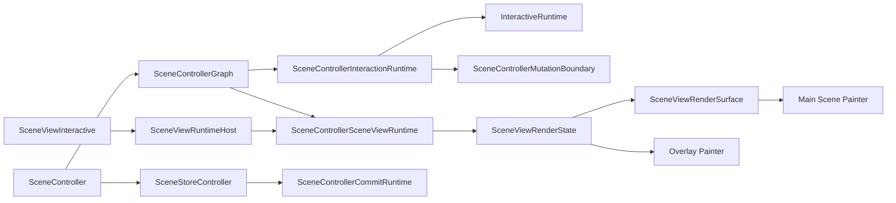
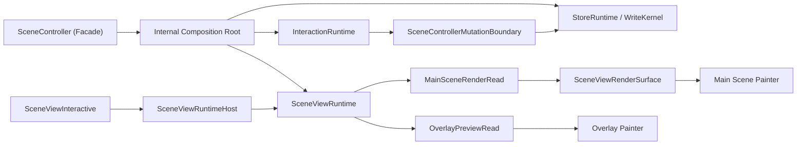

# ADR 0001: Target Engine Architecture

- Status: Accepted
- Date: 2026-04-22

## 1. Intent

This ADR defines the target architecture for `iwb_canvas_engine`.

`ARCHITECTURE.md` remains the checked-in architecture contract for the current
repository state. This ADR defines the accepted end-state for future
refactoring so maintainers can evaluate code changes against one explicit
target form instead of relying on local bug-fix direction alone.

## 2. Problem Statement

The package already has a strong outer shape:

- one public package entrypoint
- immutable public document boundary
- mutable internal runtime scene
- explicit layer DAG
- transactional write boundary
- frame-authoritative main-scene rendering

The main architectural weakness is inside the runtime center, not at the layer
graph.

Today the runtime center is harder to reason about than it should be because:

- runtime assembly is split across several peer owners instead of one clear
  composition root
- the view/runtime seam exposes both main-scene frame-read behavior and live
  overlay preview behavior through one contract
- some runtime owners coordinate multiple responsibilities at once, which
  makes ownership harder to infer during bug fixing and review

This shape is serviceable, but it increases the cost of change. Contributors
must often trace behavior across several owners before they can tell where a
bug should be fixed.

## 3. Decision

The target architecture keeps the existing package-level layer DAG and public
boundary, but simplifies runtime ownership.

The target form is:

1. `SceneController` remains a thin public facade.
2. One internal composition root assembles the store runtime, interaction
   runtime, and the controller-owned `SceneViewRuntime` boundary. This root is
   an assembly owner, not a new general-purpose logic bucket.
3. The committed store and write kernel remain the only owners of committed
   scene state.
4. The interaction runtime owns only ephemeral gesture and preview state plus
   pointer-session orchestration.
5. `SceneControllerMutationBoundary` remains the only bridge from
   interaction-owned state into committed writes.
6. Main-scene rendering and live overlay preview use separate read contracts
   or facets inside one controller-owned render-state family.
7. The view shell consumes the assembled `SceneViewRuntime` boundary and does
   not reconstruct engine ownership locally.

This ADR is normative about target ownership, but it does not require one
large rewrite. Migration may happen in slices as long as each slice moves the
code toward the target form.

## 4. Current Shape vs Target Shape

### 4.1 Current Shape

The current checked-in shape can be summarized like this:

This form has two practical drawbacks:

- the runtime center has several peer owners instead of one obvious
  composition root
- `SceneViewRenderState` carries two different read models:
  - atomic frame-owned main-scene render reads
  - live overlay preview reads

### 4.2 Target Shape

The target form is:

This is a logical ownership model. The exact class names may differ, but the
responsibility split must match this form.

## 5. Target Ownership Model

| Owner | Must own | Must not own |
|---|---|---|
| Public facade | public construction, public capability exposure, disposal | runtime assembly details, commit planning, live preview storage |
| Internal composition root | assembly of store, interaction, and view runtimes | public business logic, paint algorithms, document validation |
| Store runtime / write kernel | committed scene state, transactional writes, commit planning and execution, committed revisions and indexes | gesture state, live overlay preview state, view hosting |
| Interaction runtime | pointer routing, gesture lifetime, ephemeral move/draw preview state, interaction-side scheduling | committed scene ownership, snapshot/runtime conversion, paint planning |
| Mutation gateway | translation from interaction intents into committed writes, post-commit invalidation routing | gesture ownership, view hosting, general-purpose reads unrelated to mutation routing |
| SceneViewRuntime boundary | the single view-facing bridge that exposes render and pointer-session capabilities | direct committed mutation ownership, public facade duties |
| Main-scene render read | atomic frame capture, paint-plan preparation, frame-owned render reads, render invalidation epoch | live marquee/stroke/line preview state |
| Overlay preview read | marquee selection, stroke preview, line preview, overlay repaint signaling | main-scene frame capture, paint-plan preparation, committed candidate enumeration |
| View host | widget hosting, runtime installation and swap, pointer host wiring | engine assembly policy, committed state mutation, render-state recomposition rules |

The current checked-in owners map to the target form like this:

| Current checked-in owner | Target role | Migration implication |
|---|---|---|
| `createSceneControllerGraph` and `SceneControllerGraph` | Internal composition root | retain graph assembly outside the facade, but make the composition root more explicit and less peer-fragmented |
| `SceneControllerSceneViewRuntime` | `SceneViewRuntime` boundary | retain as the single view-facing runtime boundary |
| `SceneControllerSceneViewRenderState` | controller-owned render-state family with distinct main-scene and overlay read contracts or facets | split one mixed owner into two read responsibilities without moving them into `view/**` |
| `SceneControllerMutationBoundary` | Mutation gateway | retain as the only interactive committed-write owner and narrow to that role |
| `SceneStoreController` plus `SceneControllerCommitRuntime` | Store runtime and write kernel | retain as the committed-state owner and write executor |
| `SceneViewRuntimeHost` | View host | retain as runtime installation and pointer-host owner |

## 6. Repository Evidence

This target form is supported by a small set of slicing facts from checked-in
code:

- `SceneViewRenderState` and `SceneViewRuntime` are not exported from
  `lib/iwb_canvas_engine.dart`, so the render-seam split can remain an
  internal migration instead of a supported public API break.
- The mixed read seam is localized. `SceneViewRenderState` and
  `SceneControllerSceneViewRenderState` combine frame-read and
  overlay-preview members, while `SceneViewRuntimeHost` forwards one
  `renderState` instance to both `SceneViewRenderSurface` and
  `SceneViewInteractiveOverlayPainter`.
- Production consumers are already partitioned by role:
  - `ScenePainter` reads `captureFrameRead` only
  - `ScenePainterFrame` reads `preparePaintPlan` only
  - `SceneViewInteractiveOverlayPainter` reads only overlay-preview members
    plus `overlayRepaintListenable`
  - `SceneController` exposes only overlay-preview members on the
    controller-facing side
  - only the contract and `SceneControllerSceneViewRenderState` read both
    frame and overlay families
- Scene and overlay invalidation are already separate through the current
  runtime path:
  - `SceneControllerGraph` wires scene and overlay notifications separately
  - `SceneControllerSceneViewRenderState` owns
    `SceneControllerSceneRepaintChannel` and
    `SceneControllerOverlayRepaintChannel`
  - `SceneViewInteractiveOverlayPainter` already repaints from
    `overlayRepaintListenable`
- A committed-only render-state precedent already exists in
  `test/support/committed_scene_view_render_state.dart`, and
  `SceneViewRenderSurface` already runs against that shape in
  `test/view/scene_view_test.dart`.
- The critical runtime seams are centralized rather than replicated:
  - `SceneController` is the only production caller of
    `createSceneControllerGraph(...)`
  - `SceneControllerGraph` is the only production construction site for
    `SceneControllerSceneViewRuntime`
  - `SceneControllerInteractionRuntime` is the only production construction
    site for `SceneControllerMutationBoundary`
  - `SceneControllerSceneViewRuntime` is the only production implementation of
    `SceneViewRuntime`
  - `SceneControllerSceneViewRenderState` is the only production
    implementation of `SceneViewRenderState`
- Refactor pressure is concentrated in three owners rather than spread across
  the graph:
  - `SceneControllerSceneViewRenderState` is the mixed read owner
  - `createSceneControllerGraph` / `_assembleSceneControllerGraph` are the
    fragmented assembly owners
  - `SceneControllerMutationBoundary` is the overloaded write gateway
- Hot spots are filtered by ownership shape, not by metrics alone:
  - `SceneControllerSceneViewRenderState` and
    `SceneControllerMutationBoundary` are cut targets because high metrics
    coincide with mixed or overloaded responsibility
  - `SceneViewRuntimeHost` and `SceneViewRenderSurfaceState` are not primary
    cut targets even with elevated coupling because their checked-in role is
    already singular: host installation/swap and render-surface hosting
- `SceneController` already behaves mostly as a forwarding facade on the
  preview/read side: controller-facing preview getters delegate to
  `_viewRenderState`, while preview delta, action stream, and edit-text stream
  delegate through graph bridge functions. This supports facade compression as
  a structural cleanup rather than a behavior move.
- Current invariants already define what must stay stable while slicing:
  one assembled `SceneViewRuntime` boundary, thin `SceneController`, overlay
  ownership outside the render surface, and one interactive committed-write
  owner.
- The collapsed `view` / `render` / `interactive/internal` dependency graph
  stays one-way from `view` into `render`, so the cut belongs inside the
  runtime boundary rather than in the view shell.

These checked-in facts support the target form as an internal migration path
with three natural cut lines: mixed render seam, composition root, and write
gateway.

## 7. Architectural Rules

The following rules define the target form:

1. One public controller facade must remain the supported public interactive
   owner for package callers.
2. One assembled `SceneViewRuntime` boundary must remain the only view-facing
   bridge into interactive internals.
3. One internal composition root must assemble the interactive engine graph
   without reabsorbing the responsibilities of the owners it wires together.
4. Interaction-owned state must stay ephemeral until it crosses the mutation
   gateway.
5. The mutation gateway must remain the only interactive owner that performs
   committed writes.
6. Main-scene rendering must read from one atomic frame contract only.
7. Overlay rendering must read from a separate live-preview contract only.
8. Scene and overlay reads may live inside one controller-owned render-state
   family, but one owner must not mix both responsibilities behind one
   ambiguous interface forever.
9. Store-owned committed state must not depend on interaction-owned preview
   state.
10. The view layer must not reconstruct controller/runtime ownership locally.

## 8. Non-Goals

This ADR does not propose:

- a new public package entrypoint
- a reducer-first or event-sourcing redesign
- merging `interactive` and `controller` into one layer
- changing the immutable-public / mutable-runtime split
- changing schema/version ownership
- removing the current guardrail and import-boundary enforcement model

## 9. Guardrail Compatibility

This ADR intentionally preserves the repository-local constraints that already
match the desired end-state:

- `SceneController` stays a thin facade over assembled runtime owners
- `SceneViewInteractive` stays a thin adapter from `SceneController` into
  `SceneViewRuntime`
- `SceneViewRuntimeHost` stays the active-runtime and pointer-host owner
- `SceneControllerMutationBoundary` stays the only interactive committed-write
  owner
- `SceneViewRenderSurface` stays a render-state-only view surface
- no current import-boundary or guardrail rule requires
  `SceneViewRenderState` to remain one undifferentiated interface forever;
  current enforcement requires one assembled `SceneViewRuntime` boundary and
  one controller-owned render-state family

This ADR intentionally evolves one current checked-in seam:

- the current single `SceneViewRenderState` contract is allowed today because
  `INV-ENG-VIEW-RENDER-READ-STATE-BOUNDARY` still protects one
  controller-owned render-state family; the target is to preserve that family
  while splitting it into distinct main-scene and overlay read contracts or
  facets

## 10. Migration Strategy

The preferred migration order is:

1. split the current view/render seam into:
   - one main-scene render-read contract
   - one overlay/live-preview contract or facet
   while preserving one controller-owned render-state family behind
   `SceneViewRuntime`
2. introduce one explicit internal composition root that owns graph assembly
   while preserving the existing public facade and `SceneViewRuntime` boundary
3. reduce `SceneController` to a thin facade over that root
4. narrow the mutation gateway so it owns committed mutation routing and
   invalidation only

Each slice should preserve the public API unless a breaking change is
explicitly approved.

## 11. Contract-Planning Cut Map

This section is intentionally contract-oriented. It does not replace future
Change Contracts, but it fixes the cut lines that those contracts must reuse
instead of reopening the architectural decision.

### 11.1 Contract 1 Seed: Render-Seam Split

- current mixed owner:
  - `SceneViewRenderState`
  - `SceneControllerSceneViewRenderState`
- successor seam:
  - one main-scene render-read contract or facet
  - one overlay-preview read contract or facet
  - both still owned inside one controller-owned render-state family behind
    `SceneViewRuntime`
- consumer migration order:
  - lock current render and overlay behavior with characterization coverage
  - introduce the successor read contracts or facets inside the existing
    controller-owned render-state family
  - migrate `SceneViewRenderSurface` and render-side consumers to the
    main-scene read contract
  - migrate `SceneViewInteractiveOverlayPainter` and controller-facing preview
    consumers to the overlay read contract
  - migrate guardrails, fixtures, and architecture tests that still encode one
    mixed read interface
  - retire direct dependence on the old mixed read API
- retirement gate:
  - no production consumer depends on one undifferentiated mixed read
    interface
  - guardrails and architecture tests prove separate main-scene and overlay
    reads inside one render-state family
  - `SceneViewRuntime` remains the only view-facing runtime boundary
- current proof surface:
  - current repository inventory touches about 25 files in `test/**` and
    `tool/**`
  - the expected churn is concentrated in guardrails, render/view contract
    tests, and fixture support rather than in broad behavior changes
  - current enforcement anchors:
    - `INV-ENG-VIEW-RENDER-READ-STATE-BOUNDARY`
    - `test/contract/runtime_contract_interfaces_test.dart`
    - `test/interactive/core/scene_controller_architecture_boundary_test.dart`
    - `tool/src/guardrails/rules/interactive/interactive_architecture_boundary_rules.dart`
    - `tool/src/guardrails/rules/interactive/interactive_architecture_boundary_pointer_rules.dart`
    - `tool/src/guardrails/rules/interactive/interactive_architecture_boundary_view_surface_rules.dart`

### 11.2 Contract 2 Seed: Composition Root and Facade Compression

- current fragmented owners:
  - `createSceneControllerGraph(...)`
  - `_assembleSceneControllerGraph(...)`
  - `SceneController`
- successor seam:
  - one explicit internal composition root for runtime assembly
  - one thin public facade that delegates to assembled owners
- consumer migration order:
  - lock current assembly and facade behavior with characterization coverage
  - introduce the explicit composition root without changing the public API
  - move assembly responsibilities from fragmented graph/facade locations into
    that root
  - reduce `SceneController` to facade-only delegation over the assembled
    owners
  - migrate guardrails and architecture tests to enforce the new assembly
    location
  - retire the old fragmented assembly shape
- retirement gate:
  - `SceneController` no longer owns meaningful assembly logic beyond facade
    delegation
  - graph construction is mechanically constrained to the composition root
  - `SceneViewRuntime` remains assembled once and consumed as one boundary
- current proof surface:
  - current repository inventory touches about 11 files in `test/**` and
    `tool/**`
  - the expected churn is mainly structural guardrails, fixture manifests, and
    architecture boundary tests
  - current enforcement anchors:
    - `INV-ENG-INTERACTIVE-ARCHITECTURE-BOUNDARY`
    - `test/interactive/core/scene_controller_architecture_boundary_test.dart`
    - `tool/src/guardrails/rules/interactive/interactive_architecture_boundary_rules.dart`
    - `tool/src/guardrails/rules/interactive/interactive_architecture_boundary_graph_rules.dart`
    - `tool/src/guardrails/rules/interactive/interactive_architecture_boundary_facade_rules.dart`

### 11.3 Contract 3 Seed: Mutation-Gateway Narrowing

- current owner:
  - `SceneControllerMutationBoundary`
- successor seam:
  - the same boundary remains the only interactive committed-write owner
  - the boundary narrows to committed mutation routing and post-commit
    invalidation responsibilities only
- consumer migration order:
  - lock current mutation behavior and write-path invariants with
    characterization coverage
  - identify coordination logic in the boundary that belongs to adjacent
    owners instead
  - narrow the boundary while preserving it as the only interactive
    committed-write gateway
  - migrate mutation-specific guardrails and boundary tests to the narrower
    role
  - retire the extra coordination responsibilities from the boundary
- retirement gate:
  - interactive committed writes still cross exactly one mutation gateway
  - the boundary no longer owns unrelated orchestration or preview policy
  - mutation guardrails and boundary tests prove the narrowed role
- current proof surface:
  - current repository inventory touches about 12 files in `test/**` and
    `tool/**`
  - the expected churn is concentrated in mutation guardrails, runtime
    ownership cases, and mutation-boundary tests
  - current enforcement anchors:
    - `INV-ENG-INTERACTIVE-MUTATION-BOUNDARY`
    - `test/interactive/core/scene_controller_mutation_boundary_test.dart`
    - `tool/src/guardrails/rules/interactive/interactive_architecture_boundary_rules.dart`
    - `tool/src/guardrails/rules/interactive/interactive_architecture_boundary_mutation_rules.dart`
    - `tool/src/guardrails/rules/interactive/interactive_architecture_boundary_mutation_runtime_rules.dart`
    - `tool/src/guardrails/rules/interactive/interactive_architecture_boundary_mutation_shell_rules.dart`

### 11.4 Explicitly Deferred From the First Refactor Wave

The following hot or dense owners are still secondary debt, but they are not
separate first-wave contract cuts:

- `InteractiveRuntime`
- `SceneControllerInteractionRuntime`
- `SceneControllerCommitRuntime`
- `SceneViewRuntimeHost`
- `SceneViewRenderSurfaceState`

Future Change Contracts should treat them as follow-up evaluation targets
after the three primary cuts are complete, not as additional first-wave
architecture splits.

## 12. Alternatives Considered

### 12.1 Keep the current shape and continue seam-by-seam hardening

Rejected as the target form.

Reason:

- cheapest in the short term
- does not solve the unclear ownership inside the runtime center
- keeps bug fixing expensive because the same ambiguity remains

### 12.2 Only split files and helpers without changing ownership

Rejected as insufficient.

Reason:

- may improve local readability
- does not fix the mixed render seam
- does not create one obvious internal composition root

### 12.3 Full layer redesign

Rejected for now.

Reason:

- much higher migration cost
- much higher regression risk
- current evidence points to runtime-ownership problems, not a broken package
  layer DAG

## 13. Why This Decision

This target form is preferred because it improves the three things that are
currently most expensive:

- ownership clarity
- bug-fix placement
- reviewability of cross-cutting runtime changes

The goal is not to make the code merely smaller. The goal is to make the
engine easier to reason about by ensuring that each important kind of state
has one obvious owner.

## 14. Acceptance Signals

The migration can be considered complete when all of the following are true:

- there is one explicit internal composition root
- `SceneController` no longer owns meaningful assembly logic beyond facade
  delegation
- `SceneViewRuntime` remains the only view-facing interactive runtime boundary
- main-scene render reads and overlay preview reads use different contracts or
  facets inside one controller-owned family
- committed writes from interaction paths still pass through one mutation
  gateway
- guardrails and architecture tests prove the new ownership model

Until then, `ARCHITECTURE.md` remains the authoritative description of the
checked-in code, while this ADR remains the target-form reference.
