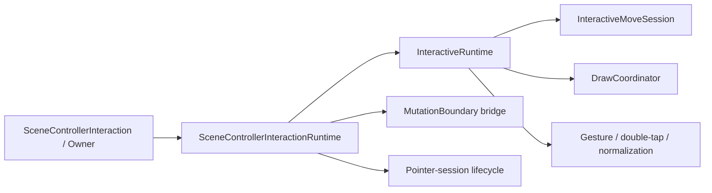
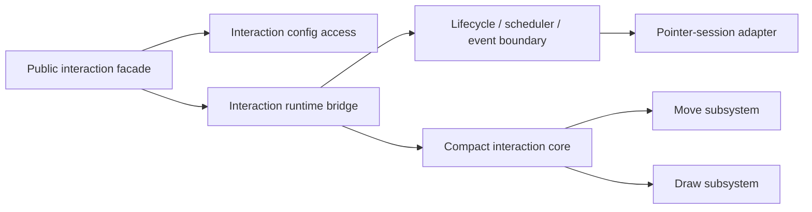
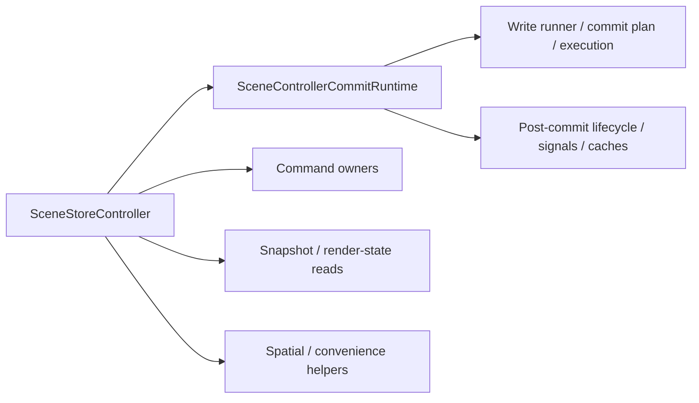
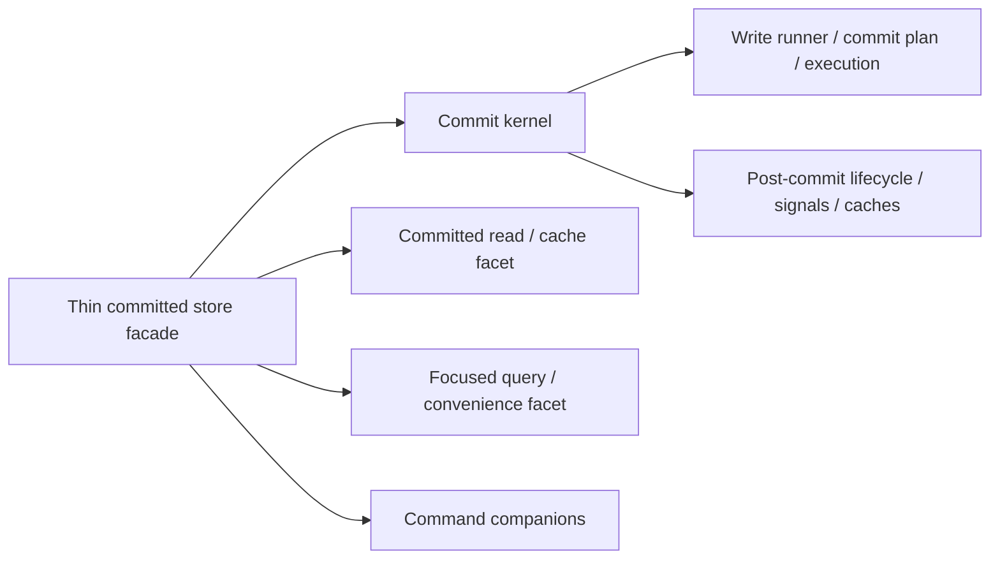

# ADR 0002: Post-Target Optimization Scope

- Status: Accepted
- Date: 2026-04-22

## 1. Intent

This ADR records the next optimization layer that remains after the target
architecture from ADR 0001 lands.

It is intentionally narrower than a roadmap and intentionally weaker than a
Change Contract. It does not authorize immediate edits to every file listed
here. It records which remaining hot spots survived mechanical review, which
ones are false positives for an architectural follow-up, and which ones must
wait for an explicit API decision.

## 2. Scope Gate

This ADR applies only after the three primary cuts from
`docs/adr/0001_target_engine_architecture.md` are complete:

1. render-seam split
2. composition-root and facade compression
3. mutation-gateway narrowing

No phase-2 Change Contract should be written before that first wave lands and
the relevant files are remeasured. Some current hot spots are expected to
shrink as a by-product of ADR 0001.

`Shrink` here does not mean guaranteed repository-wide line-count reduction.
It means that some current phase-2 candidates are inflated by transitional
responsibilities that ADR 0001 already intends to remove. After the first wave
lands, those candidates may no longer justify their own follow-up contract, or
their remaining scope may be materially smaller.

## 3. Mechanical Basis

The scope below is based on four checked-in evidence sources:

- targeted `dcm calculate-metrics` runs on remaining candidate owners
- `dcm analyze-structure lib/src --reporter=dot` and file-level fan-in/fan-out
  derived from that graph
- repository usage inventory from `rg` across `lib/**`, `test/**`, and
  `tool/**`
- direct code inspection of the candidate owners and their immediate neighbors

The reviewed files were:

- `lib/src/interactive/internal/interactive_runtime.dart`
- `lib/src/interactive/internal/scene_controller_interaction_runtime.dart`
- `lib/src/interactive/scene_controller_interaction.dart`
- `lib/src/interactive/internal/interactive_move_session.dart`
- `lib/src/interactive/internal/scene_controller_pointer_session.dart`
- `lib/src/controller/scene_store_controller.dart`
- `lib/src/controller/scene_controller_commit_runtime.dart`
- `lib/src/contract/scene_write_txn.dart`
- `lib/src/view/scene_view_runtime_host.dart`
- `lib/src/view/scene_view_render_surface.dart`

## 4. Confirmed Findings

### 4.1 Interaction Orchestration Remains the Main Secondary Debt

This is the strongest remaining phase-2 candidate family.

Mechanical signals:

- `InteractiveRuntime`: 37 methods, response set 53, weighted complexity 56,
  coupling 14
- `SceneControllerInteractionOwner`: 42 methods, response set 55, weighted
  complexity 79
- `SceneControllerInteraction`: 38 methods
- `InteractiveMoveSession`: 22 methods, response set 43, weighted complexity
  42
- `SceneControllerPointerSession`: 15 methods, weighted complexity 37
- interaction-family repository touch surface: about 38 files across `lib`,
  `test`, and `tool`
- dependency graph:
  - `interactive_runtime.dart` has one direct incoming file-level dependency
    and twelve outgoing ones
  - `scene_controller_interaction_runtime.dart` has five incoming and fifteen
    outgoing file-level dependencies
  - `interactive_move_session.dart` has two incoming and nine outgoing
    file-level dependencies

Code reading result:

- `InteractiveRuntime` is still one internal orchestration owner that wires
  move, draw, pointer normalization, gesture routing, and double-tap handling
  together while also re-exposing a large preview/read surface.
- `SceneControllerInteractionRuntime` is not a second independent engine. It is
  a bridge that owns schedulers, event dispatch, mutation-boundary wiring,
  pointer-session lifecycle, and two large extension surfaces.
- `SceneControllerInteractionOwner` is broad, but much of that breadth is
  forwarding public capability exposure over runtime/config access rather than
  a separate deep policy owner.
- `InteractiveMoveSession` is the heaviest local subsystem inside this family
  and is the most likely follow-up compression point after ADR 0001.

Decision:

- phase 2 should treat this as one interaction-family compression effort, not
  as another layer redesign
- the likely work belongs inside the existing interaction family:
  runtime surface compression, owner forwarding cleanup, and move-session
  simplification
- `SceneControllerPointerSession` is secondary debt inside the same family, not
  a separate contract seed by itself

### 4.2 Store and Commit Path Are Hot, but Only One Part Is a Likely Follow-Up

Mechanical signals:

- `SceneStoreController`: 16 methods, coupling 14, file imports 17
- `SceneControllerCommitRuntime`: 15 methods, coupling 17, file imports 16
- store/commit repository touch surface: about 41 files across `lib`, `test`,
  and `tool`
- dependency graph:
  - `scene_store_controller.dart` has six incoming and fifteen outgoing
    file-level dependencies
  - `scene_controller_commit_runtime.dart` has three incoming and fifteen
    outgoing file-level dependencies

Code reading result:

- `SceneControllerCommitRuntime` still reads as one coherent write kernel:
  it owns write execution, commit planning, post-commit lifecycle, signals, and
  spatial-index cache coordination in one place.
- `SceneStoreController` is broader and more mixed:
  it owns snapshot caching, command owners, committed-write facade methods,
  spatial query helpers, and replace-scene convenience access.
- The hotter follow-up target is therefore the store facade, not the write
  kernel itself.

Decision:

- phase 2 may include a store-facade cleanup
- phase 2 should not assume that `SceneControllerCommitRuntime` needs its own
  architecture split
- if post-ADR-0001 remeasurement still shows pain here, prefer slimming
  `SceneStoreController` before touching the write kernel

### 4.3 Public Contract Breadth Is Real but Should Not Be the Default Next Wave

Mechanical signals:

- `SceneWriteTxn`: 21 methods
- `SceneControllerInteraction` public surface is broad and contributes to the
  size of `SceneControllerInteractionOwner`
- public-contract repository touch surface: about 49 files across `lib`,
  `test`, and `tool`

Code reading result:

- `SceneWriteTxn` is a supported public transactional surface, not an accidental
  internal seam.
- The repository already treats it as a public contract through adapter tests,
  public-surface guardrails, and golden inventory.
- The public interaction surface has the same property: some size comes from
  supported capability exposure, not from an internal ownership leak.

Decision:

- public contract thinning is explicitly not the default phase-2 refactor
- any work on `SceneWriteTxn` or the supported public interaction surface must
  be handled as an explicit API-review track with compatibility consequences,
  not as opportunistic internal cleanup

### 4.4 View Host and Render Surface Are Not Phase-2 Architecture Targets

Mechanical signals:

- `_SceneViewRuntimeHostState`: coupling 17
- `SceneViewRenderSurfaceState`: coupling 15
- view-host/render-surface repository touch surface: about 17 files across
  `lib`, `test`, and `tool`
- dependency graph:
  - `scene_view_runtime_host.dart` has one incoming and six outgoing file-level
    dependencies
  - `scene_view_render_surface.dart` has one incoming and five outgoing
    file-level dependencies

Code reading result:

- `SceneViewRuntimeHost` remains a single-purpose runtime-installation and
  pointer-host owner.
- `SceneViewRenderSurfaceState` remains a single-purpose render-surface and
  cache-lifecycle owner.
- Their elevated coupling follows from their position in the view shell, not
  from the same mixed-ownership problem that justified ADR 0001.

Decision:

- neither file is a phase-2 architecture cut
- they may still receive local maintenance, but they should stay out of the
  next optimization scope unless later evidence changes materially

## 5. Phase-2 Target Shapes

Phase 2 does not define a new package architecture. It defines the desired
post-target local form for the two owner families that still look too broad
after ADR 0001.

### 5.1 Interaction Family

#### Current Shape

#### Target Shape

The exact type names may differ, but the responsibility split should match
this form:

- the public interaction owner remains a supported capability surface, but it
  should read as a facade instead of a second policy-heavy runtime
- the runtime bridge should own scheduler, event, mutation-boundary, and
  pointer-session lifecycle concerns, not a second broad state surface
- the interaction core should own gesture orchestration and preview state, but
  it should not remain a wide catch-all for every local interaction detail
- the move subsystem should stay an internal subsystem, but it should no longer
  behave like a second orchestration hub

### 5.2 Store and Commit Family

#### Current Shape

#### Target Shape

The exact type names may differ, but the responsibility split should match
this form:

- the commit kernel remains the coherent owner of write execution, planning,
  post-commit lifecycle, and commit-side caches
- the store facade should shrink toward committed read exposure and narrow
  delegation, instead of continuing to accumulate helper roles
- snapshot/materialization and spatial-query convenience logic may remain in
  the same family, but they should not continue to grow as anonymous facade
  baggage
- command owners should remain companion owners rather than being reabsorbed
  into the commit kernel

### 5.3 Explicitly Excluded From the Phase-2 Target Shape

The following areas do not currently have a phase-2 target shape:

- `SceneWriteTxn` and other supported public contract surfaces
- `SceneViewRuntimeHost`
- `SceneViewRenderSurfaceState`

These may still receive focused maintenance, but they are not part of the
default post-target architecture work.

## 6. Acceptance Signals

Phase 2 can be considered structurally successful only when all of the
following are true after remeasurement:

- the interaction family reads as one compressed owner family instead of a
  facade, a bridge, and a core that all expose broad overlapping surfaces
- `InteractiveMoveSession` no longer acts as a second heavy orchestration hub
  inside the interaction family
- the store family reads as a thin committed facade over a coherent commit
  kernel
- `SceneStoreController` no longer mixes snapshot/cache, query convenience,
  command exposure, and write facade behavior as one growing class body
- phase-2 work has not widened the public API surface by accident

## 7. Recommended Phase-2 Order

After ADR 0001 lands and the remaining files are remeasured, the preferred
order is:

1. interaction-family compression
2. store-facade cleanup if remeasurement still justifies it
3. explicit API-review track for public contract thinning only if separately
   approved

The likely unit of work is two follow-up Change Contracts, not another broad
multi-front architecture wave:

- one contract for interaction-family compression
- one optional contract for store-facade cleanup

Public contract thinning is intentionally outside that default pair.

## 8. Explicit Non-Goals

This ADR does not recommend:

- a second architecture redesign after ADR 0001
- a fourth primary cut on the view shell
- default follow-up work on `SceneWriteTxn`
- default follow-up work on the supported public interaction surface
- metric-only file splitting without clearer ownership

## 9. Entry Conditions for a Phase-2 Change Contract

Before writing a phase-2 Change Contract:

1. complete ADR 0001 first-wave cuts
2. remeasure the candidate files after those cuts land
3. confirm by code inspection that the same ownership problem still exists
4. reuse the existing invariants and guardrails instead of creating a parallel
   architecture story

If those checks do not still point to the same owner family, the phase-2
contract must be narrowed or dropped.
