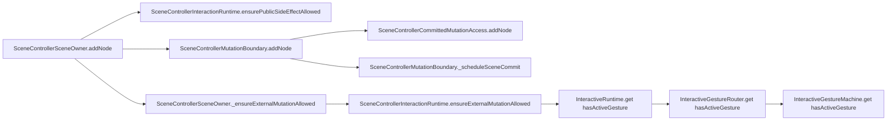

```mermaid
flowchart LR
  N0["SceneControllerSceneOwner.addNode"]
  N1["SceneControllerInteractionRuntime.ensurePublicSideEffectAllowed"]
  N0 --> N1
  N2["SceneControllerMutationBoundary.addNode"]
  N0 --> N2
  N3["SceneControllerCommittedMutationAccess.addNode"]
  N2 --> N3
  N4["SceneControllerMutationBoundary._scheduleSceneCommit"]
  N2 --> N4
  N5["SceneControllerSceneOwner._ensureExternalMutationAllowed"]
  N0 --> N5
  N6["SceneControllerInteractionRuntime.ensureExternalMutationAllowed"]
  N5 --> N6
  N7["InteractiveRuntime.get hasActiveGesture"]
  N6 --> N7
  N8["InteractiveGestureRouter.get hasActiveGesture"]
  N7 --> N8
  N9["InteractiveGestureMachine.get hasActiveGesture"]
  N8 --> N9

```
