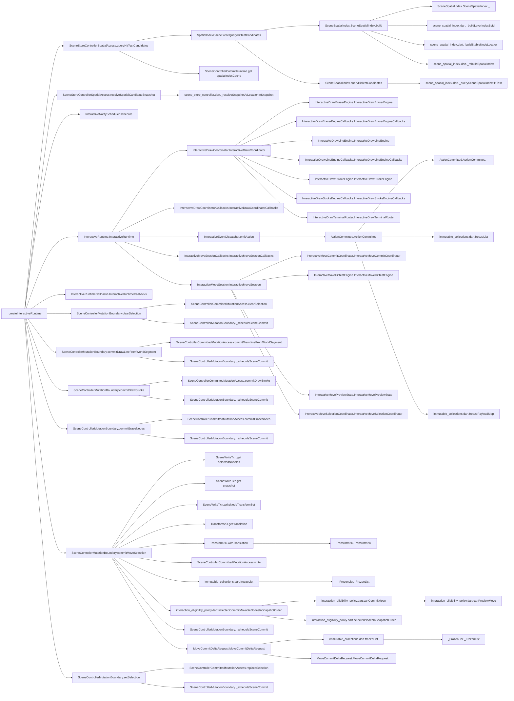

```mermaid
flowchart LR
  N0["_createInteractiveRuntime"]
  N1["SceneStoreControllerSpatialAccess.queryHitTestCandidates"]
  N0 --> N1
  N2["SpatialIndexCache.writeQueryHitTestCandidates"]
  N1 --> N2
  N3["SceneSpatialIndex.SceneSpatialIndex.build"]
  N2 --> N3
  N4["SceneSpatialIndex.SceneSpatialIndex._"]
  N3 --> N4
  N5["scene_spatial_index.dart._buildLayerIndexById"]
  N3 --> N5
  N6["scene_spatial_index.dart._buildStableNodeLocator"]
  N3 --> N6
  N7["scene_spatial_index.dart._rebuildSpatialIndex"]
  N3 --> N7
  N8["SceneSpatialIndex.queryHitTestCandidates"]
  N2 --> N8
  N9["scene_spatial_index.dart._querySceneSpatialIndexHitTest"]
  N8 --> N9
  N10["SceneControllerCommitRuntime.get spatialIndexCache"]
  N1 --> N10
  N11["SceneStoreControllerSpatialAccess.resolveSpatialCandidateSnapshot"]
  N0 --> N11
  N12["scene_store_controller.dart._resolveSnapshotAtLocationInSnapshot"]
  N11 --> N12
  N13["InteractiveNotifyScheduler.schedule"]
  N0 --> N13
  N14["InteractiveRuntime.InteractiveRuntime"]
  N0 --> N14
  N15["InteractiveDrawCoordinator.InteractiveDrawCoordinator"]
  N14 --> N15
  N16["InteractiveDrawEraserEngine.InteractiveDrawEraserEngine"]
  N15 --> N16
  N17["InteractiveDrawEraserEngineCallbacks.InteractiveDrawEraserEngineCallbacks"]
  N15 --> N17
  N18["InteractiveDrawLineEngine.InteractiveDrawLineEngine"]
  N15 --> N18
  N19["InteractiveDrawLineEngineCallbacks.InteractiveDrawLineEngineCallbacks"]
  N15 --> N19
  N20["InteractiveDrawStrokeEngine.InteractiveDrawStrokeEngine"]
  N15 --> N20
  N21["InteractiveDrawStrokeEngineCallbacks.InteractiveDrawStrokeEngineCallbacks"]
  N15 --> N21
  N22["InteractiveDrawTerminalRouter.InteractiveDrawTerminalRouter"]
  N15 --> N22
  N23["InteractiveDrawCoordinatorCallbacks.InteractiveDrawCoordinatorCallbacks"]
  N14 --> N23
  N24["InteractiveEventDispatcher.emitAction"]
  N14 --> N24
  N25["ActionCommitted.ActionCommitted"]
  N24 --> N25
  N26["ActionCommitted.ActionCommitted._"]
  N25 --> N26
  N27["immutable_collections.dart.freezeList"]
  N25 --> N27
  N28["immutable_collections.dart.freezePayloadMap"]
  N25 --> N28
  N29["InteractiveMoveSessionCallbacks.InteractiveMoveSessionCallbacks"]
  N14 --> N29
  N30["InteractiveMoveSession.InteractiveMoveSession"]
  N14 --> N30
  N31["InteractiveMoveCommitCoordinator.InteractiveMoveCommitCoordinator"]
  N30 --> N31
  N32["InteractiveMoveHitTestEngine.InteractiveMoveHitTestEngine"]
  N30 --> N32
  N33["InteractiveMovePreviewState.InteractiveMovePreviewState"]
  N30 --> N33
  N34["InteractiveMoveSelectionCoordinator.InteractiveMoveSelectionCoordinator"]
  N30 --> N34
  N35["InteractiveRuntimeCallbacks.InteractiveRuntimeCallbacks"]
  N0 --> N35
  N36["SceneControllerMutationBoundary.clearSelection"]
  N0 --> N36
  N37["SceneControllerCommittedMutationAccess.clearSelection"]
  N36 --> N37
  N38["SceneControllerMutationBoundary._scheduleSceneCommit"]
  N36 --> N38
  N39["SceneControllerMutationBoundary.commitDrawLineFromWorldSegment"]
  N0 --> N39
  N40["SceneControllerCommittedMutationAccess.commitDrawLineFromWorldSegment"]
  N39 --> N40
  N41["SceneControllerMutationBoundary._scheduleSceneCommit"]
  N39 --> N41
  N42["SceneControllerMutationBoundary.commitDrawStroke"]
  N0 --> N42
  N43["SceneControllerCommittedMutationAccess.commitDrawStroke"]
  N42 --> N43
  N44["SceneControllerMutationBoundary._scheduleSceneCommit"]
  N42 --> N44
  N45["SceneControllerMutationBoundary.commitEraseNodes"]
  N0 --> N45
  N46["SceneControllerCommittedMutationAccess.commitEraseNodes"]
  N45 --> N46
  N47["SceneControllerMutationBoundary._scheduleSceneCommit"]
  N45 --> N47
  N48["SceneControllerMutationBoundary.commitMoveSelection"]
  N0 --> N48
  N49["SceneWriteTxn.get selectedNodeIds"]
  N48 --> N49
  N50["SceneWriteTxn.get snapshot"]
  N48 --> N50
  N51["SceneWriteTxn.writeNodeTransformSet"]
  N48 --> N51
  N52["Transform2D.get translation"]
  N48 --> N52
  N53["Transform2D.withTranslation"]
  N48 --> N53
  N54["Transform2D.Transform2D"]
  N53 --> N54
  N55["SceneControllerCommittedMutationAccess.write"]
  N48 --> N55
  N56["immutable_collections.dart.freezeList"]
  N48 --> N56
  N57["_FrozenList._FrozenList"]
  N56 --> N57
  N58["interaction_eligibility_policy.dart.selectedCommitMovableNodesInSnapshotOrder"]
  N48 --> N58
  N59["interaction_eligibility_policy.dart.canCommitMove"]
  N58 --> N59
  N60["interaction_eligibility_policy.dart.canPreviewMove"]
  N59 --> N60
  N61["interaction_eligibility_policy.dart.selectedNodesInSnapshotOrder"]
  N58 --> N61
  N62["SceneControllerMutationBoundary._scheduleSceneCommit"]
  N48 --> N62
  N63["MoveCommitDeltaRequest.MoveCommitDeltaRequest"]
  N48 --> N63
  N64["immutable_collections.dart.freezeList"]
  N63 --> N64
  N65["_FrozenList._FrozenList"]
  N64 --> N65
  N66["MoveCommitDeltaRequest.MoveCommitDeltaRequest._"]
  N63 --> N66
  N67["SceneControllerMutationBoundary.setSelection"]
  N0 --> N67
  N68["SceneControllerCommittedMutationAccess.replaceSelection"]
  N67 --> N68
  N69["SceneControllerMutationBoundary._scheduleSceneCommit"]
  N67 --> N69

```
