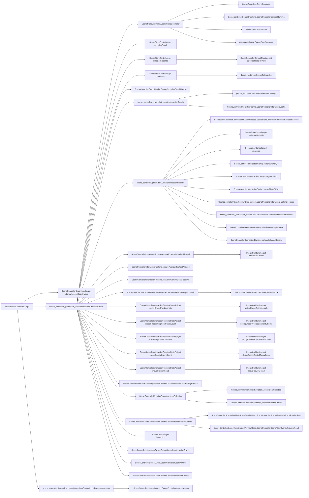

```mermaid
flowchart LR
  N0["createSceneControllerGraph"]
  N1["SceneControllerGraphHandle.get internalAccessRegistration"]
  N0 --> N1
  N2["scene_controller_graph.dart._assembleSceneControllerGraph"]
  N0 --> N2
  N3["SceneStoreController.SceneStoreController"]
  N2 --> N3
  N4["SceneSnapshot.SceneSnapshot"]
  N3 --> N4
  N5["SceneControllerCommitRuntime.SceneControllerCommitRuntime"]
  N3 --> N5
  N6["SceneStore.SceneStore"]
  N3 --> N6
  N7["document.dart.txnSceneFromSnapshot"]
  N3 --> N7
  N8["SceneStoreController.get controllerEpoch"]
  N2 --> N8
  N9["SceneStoreController.get selectedNodeIds"]
  N2 --> N9
  N10["SceneControllerCommitRuntime.get selectedNodeIdsView"]
  N9 --> N10
  N11["SceneStoreController.get snapshot"]
  N2 --> N11
  N12["document.dart.txnSceneToSnapshot"]
  N11 --> N12
  N13["SceneControllerGraphHandle.SceneControllerGraphHandle"]
  N2 --> N13
  N14["scene_controller_graph.dart._createInteractionConfig"]
  N2 --> N14
  N15["pointer_input.dart.validatePointerInputSettings"]
  N14 --> N15
  N16["SceneControllerInteractionConfig.SceneControllerInteractionConfig"]
  N14 --> N16
  N17["scene_controller_graph.dart._createInteractionRuntime"]
  N2 --> N17
  N18["SceneStoreControllerCommittedMutationAccess.SceneStoreControllerCommittedMutationAccess"]
  N17 --> N18
  N19["SceneStoreController.get selectedNodeIds"]
  N17 --> N19
  N20["SceneStoreController.get snapshot"]
  N17 --> N20
  N21["SceneControllerInteractionConfig.currentDrawStyle"]
  N17 --> N21
  N22["SceneControllerInteractionConfig.dragStartSlop"]
  N17 --> N22
  N23["SceneControllerInteractionConfig.requireFiniteOffset"]
  N17 --> N23
  N24["SceneControllerInteractionRuntimeRequest.SceneControllerInteractionRuntimeRequest"]
  N17 --> N24
  N25["scene_controller_interaction_runtime.dart.createSceneControllerInteractionRuntime"]
  N17 --> N25
  N26["SceneControllerSceneViewRuntime.scheduleOverlayRepaint"]
  N17 --> N26
  N27["SceneControllerSceneViewRuntime.scheduleSceneRepaint"]
  N17 --> N27
  N28["SceneControllerInteractionRuntime.ensureExternalMutationAllowed"]
  N2 --> N28
  N29["InteractiveRuntime.get hasActiveGesture"]
  N28 --> N29
  N30["SceneControllerInteractionRuntime.ensurePublicSideEffectAllowed"]
  N2 --> N30
  N31["SceneControllerInteractionRuntime.runMoveCommitDeltaResolver"]
  N2 --> N31
  N32["SceneControllerInteractionRuntimeMutationApi.setBeforePointerDispatchHook"]
  N2 --> N32
  N33["InteractiveRuntime.setBeforePointerDispatchHook"]
  N32 --> N33
  N34["SceneControllerInteractionRuntimeStateApi.get activeEraserPointsLength"]
  N2 --> N34
  N35["InteractiveRuntime.get activeEraserPointsLength"]
  N34 --> N35
  N36["SceneControllerInteractionRuntimeStateApi.get eraserPreciseSegmentCheckCount"]
  N2 --> N36
  N37["InteractiveRuntime.get debugEraserPreciseSegmentChecks"]
  N36 --> N37
  N38["SceneControllerInteractionRuntimeStateApi.get eraserProjectedPointCount"]
  N2 --> N38
  N39["InteractiveRuntime.get debugEraserProjectedPointCount"]
  N38 --> N39
  N40["SceneControllerInteractionRuntimeStateApi.get eraserSpatialQueryCount"]
  N2 --> N40
  N41["InteractiveRuntime.get debugEraserSpatialQueryCount"]
  N40 --> N41
  N42["SceneControllerInteractionRuntimeStateApi.get movePreviewRead"]
  N2 --> N42
  N43["InteractiveRuntime.get movePreviewRead"]
  N42 --> N43
  N44["SceneControllerInternalAccessRegistration.SceneControllerInternalAccessRegistration"]
  N2 --> N44
  N45["SceneControllerMutationBoundary.clearSelection"]
  N2 --> N45
  N46["SceneControllerCommittedMutationAccess.clearSelection"]
  N45 --> N46
  N47["SceneControllerMutationBoundary._scheduleSceneCommit"]
  N45 --> N47
  N48["SceneControllerSceneViewRuntime.SceneControllerSceneViewRuntime"]
  N2 --> N48
  N49["SceneControllerSceneViewMainSceneRenderRead.SceneControllerSceneViewMainSceneRenderRead"]
  N48 --> N49
  N50["SceneControllerSceneViewOverlayPreviewRead.SceneControllerSceneViewOverlayPreviewRead"]
  N48 --> N50
  N51["SceneController.get interaction"]
  N2 --> N51
  N52["SceneControllerInteractionOwner.SceneControllerInteractionOwner"]
  N2 --> N52
  N53["SceneControllerSceneOwner.SceneControllerSceneOwner"]
  N2 --> N53
  N54["SceneControllerSelectionOwner.SceneControllerSelectionOwner"]
  N2 --> N54
  N55["scene_controller_internal_access.dart.registerSceneControllerInternalAccess"]
  N0 --> N55
  N56["_SceneControllerInternalAccess._SceneControllerInternalAccess"]
  N55 --> N56

```
