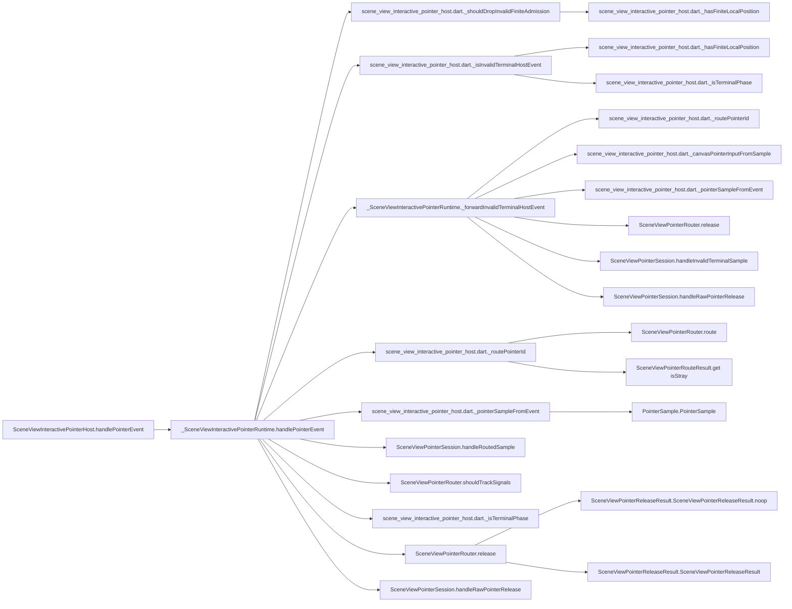

```mermaid
flowchart LR
  N0["SceneViewInteractivePointerHost.handlePointerEvent"]
  N1["_SceneViewInteractivePointerRuntime.handlePointerEvent"]
  N0 --> N1
  N2["scene_view_interactive_pointer_host.dart._shouldDropInvalidFiniteAdmission"]
  N1 --> N2
  N3["scene_view_interactive_pointer_host.dart._hasFiniteLocalPosition"]
  N2 --> N3
  N4["scene_view_interactive_pointer_host.dart._isInvalidTerminalHostEvent"]
  N1 --> N4
  N5["scene_view_interactive_pointer_host.dart._hasFiniteLocalPosition"]
  N4 --> N5
  N6["scene_view_interactive_pointer_host.dart._isTerminalPhase"]
  N4 --> N6
  N7["_SceneViewInteractivePointerRuntime._forwardInvalidTerminalHostEvent"]
  N1 --> N7
  N8["scene_view_interactive_pointer_host.dart._routePointerId"]
  N7 --> N8
  N9["scene_view_interactive_pointer_host.dart._canvasPointerInputFromSample"]
  N7 --> N9
  N10["scene_view_interactive_pointer_host.dart._pointerSampleFromEvent"]
  N7 --> N10
  N11["SceneViewPointerRouter.release"]
  N7 --> N11
  N12["SceneViewPointerSession.handleInvalidTerminalSample"]
  N7 --> N12
  N13["SceneViewPointerSession.handleRawPointerRelease"]
  N7 --> N13
  N14["scene_view_interactive_pointer_host.dart._routePointerId"]
  N1 --> N14
  N15["SceneViewPointerRouter.route"]
  N14 --> N15
  N16["SceneViewPointerRouteResult.get isStray"]
  N14 --> N16
  N17["scene_view_interactive_pointer_host.dart._pointerSampleFromEvent"]
  N1 --> N17
  N18["PointerSample.PointerSample"]
  N17 --> N18
  N19["SceneViewPointerSession.handleRoutedSample"]
  N1 --> N19
  N20["SceneViewPointerRouter.shouldTrackSignals"]
  N1 --> N20
  N21["scene_view_interactive_pointer_host.dart._isTerminalPhase"]
  N1 --> N21
  N22["SceneViewPointerRouter.release"]
  N1 --> N22
  N23["SceneViewPointerReleaseResult.SceneViewPointerReleaseResult.noop"]
  N22 --> N23
  N24["SceneViewPointerReleaseResult.SceneViewPointerReleaseResult"]
  N22 --> N24
  N25["SceneViewPointerSession.handleRawPointerRelease"]
  N1 --> N25

```
