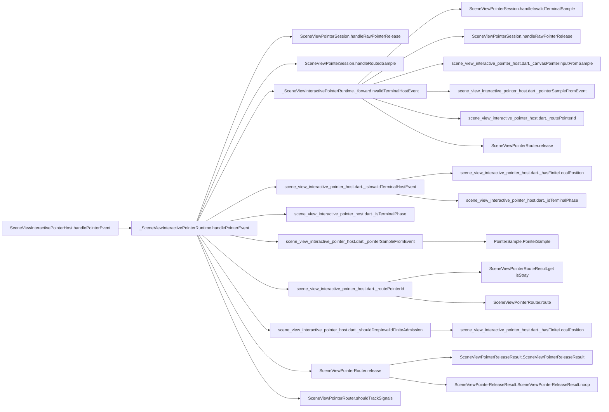

```mermaid
flowchart LR
  N0["SceneViewInteractivePointerHost.handlePointerEvent"]
  N1["_SceneViewInteractivePointerRuntime.handlePointerEvent"]
  N0 --> N1
  N2["SceneViewPointerSession.handleRawPointerRelease"]
  N1 --> N2
  N3["SceneViewPointerSession.handleRoutedSample"]
  N1 --> N3
  N4["_SceneViewInteractivePointerRuntime._forwardInvalidTerminalHostEvent"]
  N1 --> N4
  N5["SceneViewPointerSession.handleInvalidTerminalSample"]
  N4 --> N5
  N6["SceneViewPointerSession.handleRawPointerRelease"]
  N4 --> N6
  N7["scene_view_interactive_pointer_host.dart._canvasPointerInputFromSample"]
  N4 --> N7
  N8["scene_view_interactive_pointer_host.dart._pointerSampleFromEvent"]
  N4 --> N8
  N9["scene_view_interactive_pointer_host.dart._routePointerId"]
  N4 --> N9
  N10["SceneViewPointerRouter.release"]
  N4 --> N10
  N11["scene_view_interactive_pointer_host.dart._isInvalidTerminalHostEvent"]
  N1 --> N11
  N12["scene_view_interactive_pointer_host.dart._hasFiniteLocalPosition"]
  N11 --> N12
  N13["scene_view_interactive_pointer_host.dart._isTerminalPhase"]
  N11 --> N13
  N14["scene_view_interactive_pointer_host.dart._isTerminalPhase"]
  N1 --> N14
  N15["scene_view_interactive_pointer_host.dart._pointerSampleFromEvent"]
  N1 --> N15
  N16["PointerSample.PointerSample"]
  N15 --> N16
  N17["scene_view_interactive_pointer_host.dart._routePointerId"]
  N1 --> N17
  N18["SceneViewPointerRouteResult.get isStray"]
  N17 --> N18
  N19["SceneViewPointerRouter.route"]
  N17 --> N19
  N20["scene_view_interactive_pointer_host.dart._shouldDropInvalidFiniteAdmission"]
  N1 --> N20
  N21["scene_view_interactive_pointer_host.dart._hasFiniteLocalPosition"]
  N20 --> N21
  N22["SceneViewPointerRouter.release"]
  N1 --> N22
  N23["SceneViewPointerReleaseResult.SceneViewPointerReleaseResult"]
  N22 --> N23
  N24["SceneViewPointerReleaseResult.SceneViewPointerReleaseResult.noop"]
  N22 --> N24
  N25["SceneViewPointerRouter.shouldTrackSignals"]
  N1 --> N25

```
