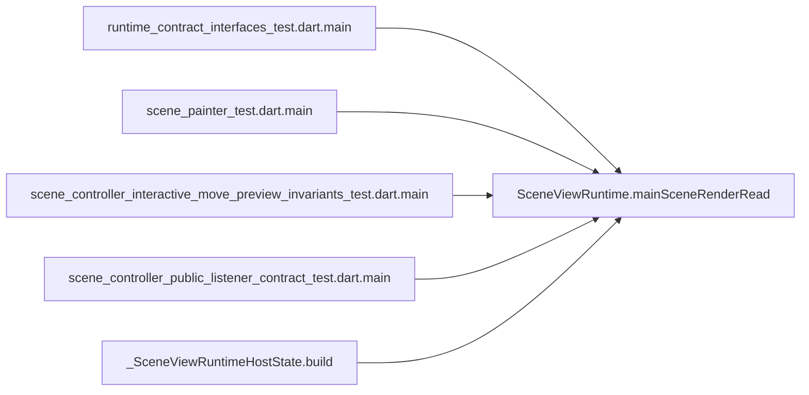

```mermaid
flowchart LR
  N0["SceneViewRuntime.mainSceneRenderRead"]
  N1["runtime_contract_interfaces_test.dart.main"]
  N1 --> N0
  N2["scene_painter_test.dart.main"]
  N2 --> N0
  N3["scene_controller_interactive_move_preview_invariants_test.dart.main"]
  N3 --> N0
  N4["scene_controller_public_listener_contract_test.dart.main"]
  N4 --> N0
  N5["_SceneViewRuntimeHostState.build"]
  N5 --> N0

```
