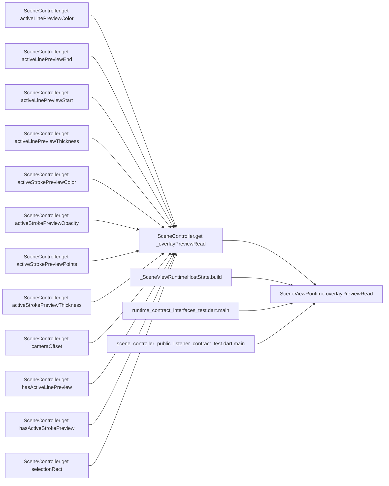

```mermaid
flowchart LR
  N0["SceneViewRuntime.overlayPreviewRead"]
  N1["SceneController.get _overlayPreviewRead"]
  N1 --> N0
  N2["SceneController.get activeLinePreviewColor"]
  N2 --> N1
  N3["SceneController.get activeLinePreviewEnd"]
  N3 --> N1
  N4["SceneController.get activeLinePreviewStart"]
  N4 --> N1
  N5["SceneController.get activeLinePreviewThickness"]
  N5 --> N1
  N6["SceneController.get activeStrokePreviewColor"]
  N6 --> N1
  N7["SceneController.get activeStrokePreviewOpacity"]
  N7 --> N1
  N8["SceneController.get activeStrokePreviewPoints"]
  N8 --> N1
  N9["SceneController.get activeStrokePreviewThickness"]
  N9 --> N1
  N10["SceneController.get cameraOffset"]
  N10 --> N1
  N11["SceneController.get hasActiveLinePreview"]
  N11 --> N1
  N12["SceneController.get hasActiveStrokePreview"]
  N12 --> N1
  N13["SceneController.get selectionRect"]
  N13 --> N1
  N14["_SceneViewRuntimeHostState.build"]
  N14 --> N0
  N15["runtime_contract_interfaces_test.dart.main"]
  N15 --> N0
  N16["scene_controller_public_listener_contract_test.dart.main"]
  N16 --> N0

```
