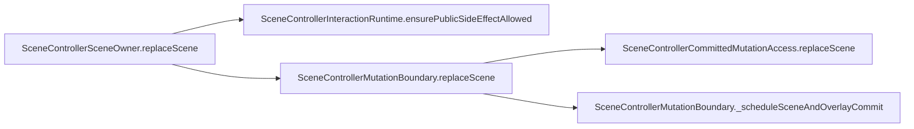

```mermaid
flowchart LR
  N0["SceneControllerSceneOwner.replaceScene"]
  N1["SceneControllerInteractionRuntime.ensurePublicSideEffectAllowed"]
  N0 --> N1
  N2["SceneControllerMutationBoundary.replaceScene"]
  N0 --> N2
  N3["SceneControllerCommittedMutationAccess.replaceScene"]
  N2 --> N3
  N4["SceneControllerMutationBoundary._scheduleSceneAndOverlayCommit"]
  N2 --> N4

```
