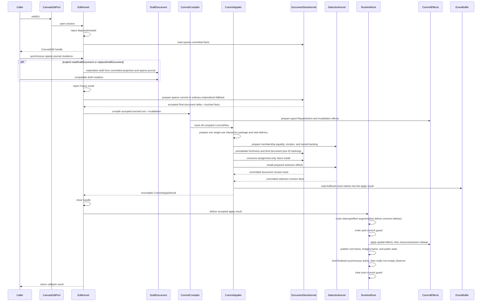
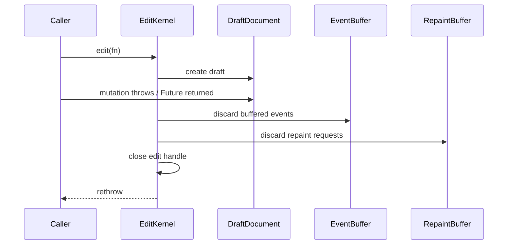

<!-- CONTEXT:BEGIN -->
Registry id: `section_11_edit_kernel`
Registry source: `docs/_registry/sections.yaml`
Document path: `docs/contracts/edit_kernel.md`
Owns:
- 11. EditKernel implementation contract
Must read before editing:
- `section_04_public_api_v1` -> `docs/contracts/public_api_v1.md`
- `section_10_runtime_data_model` -> `docs/architecture/03_data_model.md`
Current owners:
- `contract`
Related diagrams:
- `c4_code_edit_kernel`
- `dfd_public_edit`
- `seq_edit_success`
- `seq_edit_rollback`
- `state_edit_session`
Required tests:
- `test.edit.low_level_mutations_do_not_emit_actions`
- `test.runtime.runtime_state_publication`
- `test.edit.sync_non_nested_async_stale`
- `test.edit.rollback`
- `test.edit.field_update_admission_effects`
- `test.edit.exact_touched_invalidation`
- `test.edit.net_no_op_edit_commit`
- `test.store.store_commit_finalization`
- `test.guardrails.edit_accepted_finalization_guardrail`
- `test.edit.typed_effects_no_frame_dependency`
Guardrails:
- `edit.sync_non_nested`
- `edit.rollback_no_effects`
- `edit.stale_handle_rejected`
- `events.low_level_edit_no_user_actions`
- `edit.no_global_invalidation_except_replacement`
- `edit.typed_effects_no_frame_dependency`
Do not assume:
- no edit-session owner bypass
- no controller-shell owner bypass
- no async nested edit
<!-- CONTEXT:END -->

## 11. EditKernel implementation contract

### 11.1 Write sequence



Ordinary public edit, command, and interaction commit routes open a sparse edit
session. Every successful pre-materialization operation records exactly one
unchanged `StoreSparseMutation` in its callback-local journal. That one ordered
DTO list is consumed both by `DocumentStoreKernel` and by explicit promotion;
there is no closure or listener replay history. The session reads committed
facts without building a public `CanvasDocument` projection, and `draftSummary`
uses the committed summary plus sparse deltas. `readDraftDocument` and
`replaceDraftDocument` are explicit materialization fallbacks: they materialize
a rollback-safe `DraftDocument` and make one ordered traversal of the DTO
journal through Draft's exhaustive mutation application boundary. Sparse
structure now has one owner-local current placement view plus separate lazy
indexed orders for layers, background elements, and each content layer. Its
first location read comes from Store's committed `ElementLocationFacts`; local
add, remove, and clear transitions become authoritative immediately, and opened
orders are discarded on promotion or session close. Sparse resource decisions
combine Store's direct committed image/vector counts with session-local
affected-id deltas. Add, update, remove, remove/re-add, and clear transitions
update the split deltas immediately; descriptor changes do not. Thus an unused
resource decision is a direct current-count read, not an element scan or a
copied count inventory. A materialized Draft has one direct structural backing:
layer and element maps, a current element-placement view, and independent
indexed orders for layers, background elements, and content in each layer.
Ensure, add, update, remove, clear, summary, and explicit document projection
use that backing. Projection traverses each current order once to construct
public output lists; it does not retain a mutable list or nested-search mirror.
Draft also owns one insertion-ordered keyed descriptor state and exact split
image/vector counts from its current rows. Add, update, remove, remove/re-add,
and clear update only the affected count before the next resource decision;
upsert, remove-unused, and materialization read that descriptor owner directly.
Draft replacement keeps those scalar, structural, descriptor, split-count,
selection-validity, revision, and touched facts in one mutable backing.
After existing replacement validation succeeds, Draft prepares
a complete fresh backing and swaps its single backing reference once. Every
construction failure retains the prior backing unchanged; the new backing owns
its mutable structures and descriptors without caller or retired-backing
aliases. Draft's promotion target opens and owns the materialized document
around replay; the promotion owner receives only its write-only
sparse-mutation consumer, so it cannot inspect Draft collections or build a
Draft projection while replaying.
Ordinary sparse and materialized candidates then ask the store to finalize
accepted committed facts before `CommitCompiler` builds a plan. The compiler
consumes only the store-accepted revision delta and touched facts, not
provisional session or draft revision journals.

`CanvasEdit.setSelection` keeps one callback-local immutable desired-id
snapshot on the session. Repeated successful setters replace that one intent;
an iterable failure leaves the prior intent intact. The compiler makes it the
effective selection effect without changing the accepted `TouchedSet`. The
existing Store final-candidate membership boundary filters it once against the
final sparse, materialized, or replacement candidate; SelectionKernel then
prepares equality, revision, and its owned install backing during the shared
prepared-install boundary. Thus a document-final no-op can still use the
unchanged-document selection branch, while an omitted intent retains the
current implicit prune or replacement-validity behavior. Closing or rolling
back the session discards the intent; document load remains an independent
selection-clear path.

A callback that only calls `setSelection` leaves its sparse backing unopened.

`CanvasEdit.removeEmptyLayer` is a guarded structural mutation. Sparse sessions
check the current callback-local layer order and only open the requested
content order to establish emptiness; materialized Draft and direct Store
replay use the same guarded operation. An absent or nonempty layer leaves the
journal, revisions, selected intent, background elements, and resources
unchanged. Removing then ensuring the same empty layer within one edit retains
final-state equality, so finalization publishes no change when document and
selection return to their initial values.
Store membership checks only the desired IDs against indexed final-candidate
facts; Selection equality then visits only current selected IDs.

`CanvasEdit.updatePalette` validates and snapshots supplied fields at DTO
construction. Its stale-handle guard runs before backing access or merge. Each
backing merges supplied fields with its latest callback-local complete palette;
omitted fields retain that value and supplied empty lists clear only their own
field. A changed sparse call appends one existing complete
`StoreSparseSetPalette`; a materialized call transfers its merged immutable
value to Draft's shared private palette-application seam. The whole setter
defensively copies its caller-owned value before that same seam, so partial
application adds no second complete-palette copy. The existing complete Store
mutation, finalization, no-op, rollback, invalidation, publication, and
no-canvas-repaint path remains authoritative.

`CanvasEdit.updateGrid` validates supplied context-free scalar values at DTO
construction. Its stale-handle guard runs before backing access or merge. Each
backing merges non-null fields with its latest callback-local complete grid and
constructs one `CanvasGrid`, preserving complete enabled-grid validation at that
existing value boundary. A changed sparse call appends one existing complete
`StoreSparseSetBackground`; materialized and sparse routes reuse `setGrid` for
the same final equality, grid revision, projection invalidation, repaint,
rollback, and publication behavior.

`clearContent` has one layer-only semantic across materialized
`DraftDocument`, sparse-session DTO promotion, and direct
sparse-store preparation. It removes every ordinary-layer element without using
individual deletion eligibility, preserves background/grid values and ordered
background elements, and prunes selection only for the removed content. When
unused-resource cleanup is requested, retained image/vector descriptors are
determined from current split reference counts after ordinary rows are removed;
preserved background rows retain their descriptors and accepted resource facts
report only actual releases. Clear remains an ordered journal barrier: later element
or resource mutations observe the current post-clear candidate, and the same
atomic preparation, acceptance, rollback, and publication boundary applies to
every backing.

`DocumentStoreKernel` prepares accepted sparse and ordinary materialized commits
before the irreversible store swap. Duplicate ids, sealed descriptor
relationships against the final candidate, update-kind validation,
revision-family alignment, projection invalidation, and final committed-fact
equality are validated against the accepted committed tables. A candidate whose
final committed facts match the base becomes an empty
accepted document change: it advances no revisions, compiles no document plan,
skips interaction plan augmentation, installs nothing, delivers no typed
effects, and publishes no public state. `CommitApplier` prepares one immutable
apply state before either irreversible branch. It materializes a full accepted
document at most once and passes that same `CommittedDocument` to selection
normalization and the Store installer; sparse and prepared-materialized Store
payloads remain their existing immutable DTOs. It also seals typed delivery
effects and action inputs, then prepares selection equality, final revision, and
owned backing from accepted document facts before binding Store installation.
The document branch assigns Store/admission first and then the already-owned
prepared selection; neither assignment tail performs comparison, transfer, or
normalization. A selection-only branch invokes only the prepared selection
installer, and a true no-op invokes no installer or delivery preparation.
`SelectionKernel` installs only the prepared selected ids; it does not re-read
public document membership from the current store. Sparse
selection preparation retains the Store-owned prepared-commit stale check; a
stale payload fails before every installer and leaves accepted state unchanged.
For one-element stroke and line routes, RuntimeRoot supplies the Store's current
non-mutating ID candidate to preparation. The accepted Store installer admits
that element ID through its existing ledger; preparation rejection or a final
no-op installs nothing and leaves the candidate available for the next explicit
generation.

For direct sparse preparation, the Store keeps one private candidate over the
existing family, descriptor, and structural working owners plus scalar working
facts. It finalizes in this order: final relationships, provided revision-delta
shape, deferred update validations in journal order, accepted base-final facts,
coverage, normalization, owner freeze/publication, one immutable prepared
document, then accepted touched facts. It publishes no immutable document on a
failure or a final no-op. This is a Store-internal boundary: edit sessions,
drafts, `CommitApplier`, and runtime consumers receive only the finished
prepared payload and do not obtain candidate access.

A changed text edit seals its lengths-only action before installation from one
addressed pair projected from that finished sparse payload: the committed base
text row and the normalized candidate text row for the request target. The
projection reads neither a whole-document view nor a live post-install value;
it supplies the action id and both lengths from that exact-value pair. The
immutable facts are compared by their complete values, not by DTO identity.
Projection or
action sealing failure is still preparation failure, so no installer, request
consumption, session close, draft discard, or action delivery occurs and the
same live request may be retried.

After an accepted branch, `CommitApplier` assembles the contract-owned immutable
commit delivery payload only from its already sealed inputs; it does not invoke
callbacks, traverse effects, or rebuild selection or document values. The
runtime/applier seam lives in `lib/src/contracts/internal/commit_delivery.dart`:
it carries the public-state publication decision and typed post-install delivery
effects selected by the accepted edit plan. Spatial and resource delivery effects
carry the shared immutable `TouchedSet` from
`lib/src/contracts/internal/touched_set.dart`; edit keeps only the mutable
builder and store revision deltas private. Runtime route augmentation, cleanup,
and delivery ordering are RuntimeRoot-owned and consume no prepared state again.

Unified confirmations use the same private prepared interaction lifetime as
immediate edits. `EditKernel` prepares the sparse candidate; Store completes sparse validation
and binds the current revision and admitted-ID ledgers; `CommitApplier` seals
the document, revision, delivery, action, and `PreparedSelectionEffect` inputs.
Only then does `RuntimeRoot` construct the public immutable request and enter
the required unified resolver guard. A compatible accepted resolver consumes one private package:
the bound Store assignment/admission occurs first, then Selection receives the
already-owned backing without copying, validation, normalization, comparison,
or observer work. Cancel, incompatible acceptance, and ordinary resolver failure discard the package, aborting any returned lease exactly once, with
no committed mutation; the latter is contained and diagnosed only by
RuntimeRoot's bounded internal callback diagnostics route. The same RuntimeRoot
callback guard contains every unified commit resolver and lease callback: reads
and host-local work remain available, while public mutation, ID generation,
disposal, and nested confirmation reject before their owners change. A callback
may catch that rejection and still return its valid current decision. This does
not change the ordinary edit rollback boundary before any accepted install.

`EditKernel` closes and stales the active edit handle before `RuntimeRoot`
orchestrates the accepted result. For changed request-originated text,
RuntimeRoot consumes the request, silently clears only a matching active session
and its owned suppression/candidate state, and records the outer interaction
revision before capture. It completes outer common delivery, releases its guard,
then notifies session closure before returning. The listener may read final
state, complete a separate accepted mutation, or start another session without
the old closure clearing it. A direct live-request commit without an active
session has no close notification or interaction revision. Flutter notifier
failures are reported and do not roll back or suppress the accepted outer
delivery. For non-text interaction routes, `RuntimeRoot` receives that closed result,
performs the route-owned `publish: false` InteractionEngine cleanup, merges its
repaint effect, and only then enters one guarded common delivery. Its exact
order is spatial -> resource/session release -> root frame -> bridged frame ->
public state -> accepted commit lease -> synchronous finalized action ->
non-empty internal observer -> guard release. Every callback sees installed
facts and a closed edit handle. A lease is terminally committed only in this
post-install slot and is never aborted after installation.
Each recoverable frame bridge, notifier/error-reporter, action-listener, and
observer failure is contained at this one RuntimeRoot delivery boundary, so it
cannot roll back accepted state or prevent later state, action, and observer
attempts from the same sealed result. Resource/session release completes before
those fallible notifications and keeps its existing release containment.
The observer typedef and delivery payloads are owned by `contracts/internal/**`,
while edit keeps planning and install details private.

Empty effect lists are not delivered. Observer failures are contained
post-commit notification failures: they do not roll back accepted document,
selection, revision, projection, resource, or public-state changes; they do not
rethrow from public edit calls; and they do not replace the edit callback
result. Any future DiagnosticsHub record for these failures is runtime-owned
through `section_20_diagnostics_hub`; it is not an edit-owned writer and is not
a current graph obligation until a later contract adds the route. Observer
delivery is not a reentrant mutation window. Public runtime
mutations attempted while the observer is running are rejected with `StateError`
before draft creation, committed-state mutation, public-state publication, or
additional effect delivery.

### 11.2 Rollback sequence



Rollback obligations:

```text
- committed document identity unchanged;
- all revisions unchanged;
- projection cache unchanged;
- spatial index unchanged;
- resource cache unchanged;
- selection owner unchanged;
- preview unchanged unless the public operation itself was a successful external mutation;
- no actions emitted;
- no text edit event emitted;
- no public `CanvasRuntimeState` publication;
- no scene repaint;
- no overlay repaint.
```

### 11.3 Touched set

```text
TouchedSet
  addedElementIds
  removedElementIds
  updatedElementIds
  transformedElementIds
  geometryChangedElementIds
  visualChangedElementIds
  resourceDescriptorChangedIds
  resourceVisualChangedIds
  layerOrderChanged
  backgroundLayerChanged
  selectionChanged
  persistedCameraChanged
  backgroundChanged
  gridChanged
  paletteChanged
  documentReplaced
```

CommitCompiler must produce exact invalidation. Generic global invalidation is forbidden except `documentReplaced`.

CommitCompiler must not depend on concrete `FrameEngine`. It produces a
`CommitPlan` containing typed `RepaintIntent` and invalidation effects. The
post-install runtime/applier boundary dispatches those effects to frame,
spatial, resource, projection, and public state publication owners.

Sparse and materialized edit sessions both use `CommitCompiler` as the typed
taxonomy owner. Sparse sessions build `TouchedSet` and `StoreRevisionDelta`
directly from accepted sparse mutations; materialized sessions compile from the
`DraftDocument` touched set. Both routes must produce the same operation-matrix
effects for the same accepted public edit.

### 11.4 Element update field-effect taxonomy

`CommitCompiler` owns the field-effect taxonomy for
`CanvasEdit.updateElement`. It converts the changed fields in a
`CanvasElementUpdate` into typed `CommitPlan` effects after update-kind
validation and before atomic install. Every changed persisted element field
advances public `state.revisions.document`, increments the element revision,
and invalidates the public `CanvasDocument` projection through internal
`projectionRevision`.

No-op field updates, absent fields, and field values equal to the current value
produce no document, internal revision, spatial, projection, resource, repaint,
selection, event, or public state publication effects. If validation fails or
the edit rolls back, all effects listed below are discarded by the edit
rollback contract.

Field taxonomy:

| Field token | Internal revisions | Spatial effect | Projection effect | Resource effect | Repaint target | Selection normalization |
|---|---|---|---|---|---|---|
| `CanvasElementUpdate.transform` | bounds, elementVisual, projection | touched update | evict | none | main | none |
| `CanvasElementUpdate.opacity` | elementVisual, projection | none | evict | none | main | none |
| `CanvasElementUpdate.hitPadding` | bounds, projection | touched update | evict | none | none | none |
| `CanvasElementUpdate.isVisible` | bounds, elementVisual, projection | touched update | evict | none | main | prune selected id when it becomes invisible |
| `CanvasElementUpdate.isSelectable` | projection | touched update | evict | none | main when selection normalization prunes; otherwise none | prune selected id when it becomes non-selectable |
| `CanvasElementUpdate.isLocked` | projection | none | evict | none | none | none |
| `CanvasElementUpdate.isDeletable` | projection | none | evict | none | none | none |
| `CanvasElementUpdate.isTransformable` | projection | none | evict | none | none | none |
| `CanvasElementUpdate.metadata` | projection | none | evict | none | none | none |
| `CanvasImageElementUpdate.resourceId` | elementVisual, projection | none | evict | validate referenced resource id; no descriptor-table mutation | main | none |
| `CanvasImageElementUpdate.size` | bounds, elementVisual, projection | touched update | evict | none | main | none |
| `CanvasImageElementUpdate.naturalSize` | elementVisual, projection | none | evict | none | main | none |
| `CanvasVectorElementUpdate.resourceId` | elementVisual, projection | none | evict | validate final referenced descriptor kind; no descriptor-table mutation | main | none |
| `CanvasVectorElementUpdate.size` | bounds, elementVisual, projection | touched update | evict | none | main | none |
| `CanvasVectorElementUpdate.naturalSize` | elementVisual, projection | none | evict | none | main | none |
| `CanvasPathElementUpdate.svgPathData` | bounds, elementVisual, projection | touched update | evict | none | main | none |
| `CanvasPathElementUpdate.fillColor`, `CanvasPathElementUpdate.strokeColor`, `CanvasPathElementUpdate.strokeWidth`, `CanvasPathElementUpdate.fillRule` | elementVisual, projection; bounds also when stroke width changes paint bounds | touched update only when paint bounds change | evict | none | main | none |
| `CanvasTextElementUpdate.text`, `CanvasTextElementUpdate.fontSize`, `CanvasTextElementUpdate.align`, `CanvasTextElementUpdate.textDirection`, `CanvasTextElementUpdate.isBold`, `CanvasTextElementUpdate.isItalic`, `CanvasTextElementUpdate.fontFamily`, `CanvasTextElementUpdate.maxWidth`, `CanvasTextElementUpdate.lineHeight` | bounds, elementVisual, projection | touched update when layout or paint bounds change | evict | none | main | none |
| `CanvasTextElementUpdate.color`, `CanvasTextElementUpdate.isUnderline` | elementVisual, projection; bounds also when underline paint bounds change | touched update only when paint bounds change | evict | none | main | none |
| `CanvasStrokeElementUpdate.points`, `CanvasStrokeElementUpdate.thickness` | bounds, elementVisual, projection | touched update | evict | none | main | none |
| `CanvasStrokeElementUpdate.color` | elementVisual, projection | none | evict | none | main | none |
| `CanvasLineElementUpdate.start`, `CanvasLineElementUpdate.end`, `CanvasLineElementUpdate.thickness` | bounds, elementVisual, projection | touched update | evict | none | main | none |
| `CanvasLineElementUpdate.color` | elementVisual, projection | none | evict | none | main | none |
| `CanvasRectElementUpdate.size`, `CanvasRectElementUpdate.strokeWidth` | bounds, elementVisual, projection | touched update | evict | none | main | none |
| `CanvasRectElementUpdate.fillColor`, `CanvasRectElementUpdate.strokeColor` | elementVisual, projection | none | evict | none | main | none |

`CommitCompiler` may implement this taxonomy through an internal pure
field-effect subroutine, but `CommitCompiler` remains the source-of-truth owner
for typed invalidation. Resource reference validation is preflighted before
draft mutation is accepted. Selection normalization effects are installed by
the selection owner after any document install. `RuntimeRoot` publishes the
combined public state only after both owner installs succeed.

The store checks descriptor relationships once against the final sparse or
materialized candidate, rather than when either resource or element mutation is
recorded. Consequently an image/vector resource replacement and its referencing
element may be supplied in either callback order. A missing id is
`missingResourceReference`; an existing opposite descriptor kind is
`resourceKindMismatch` at the element reference path. Either rejection leaves
the committed document, revisions, selection, and frame output untouched.

Selection effects are not draft fields inside committed document state. Edits
that remove selected elements, clear content, delete selection, or commit a
marquee selection compile explicit selection-owner effects. `CommitApplier`
prepares both owners before mutation, then assigns document effects before
selection effects; both assignment tails use their already-prepared state.
`RuntimeRoot` publishes the resulting combined
`CanvasRuntimeState` only after both installs succeed and any route-owned
cleanup completes. A failure during shared preparation leaves both owners
unchanged.

After an accepted edit commit, `RuntimeRoot` publishes exactly one public state
snapshot that combines document, selection-prune, resource-visual, preview
cleanup, interaction, and epoch effects produced by the operation. A no-op edit,
including a compensating edit whose intermediate operations changed facts but
whose final committed facts equal the base, does not publish a new snapshot.
`CanvasEdit.replaceDraftDocument` is the explicit replacement exception:
replacing with an equivalent document still commits replacement effects.
`CanvasEdit.setCameraOffset` is the persisted document camera mutation path and
advances document/projection effects; it does not mutate runtime view camera
state.

---
