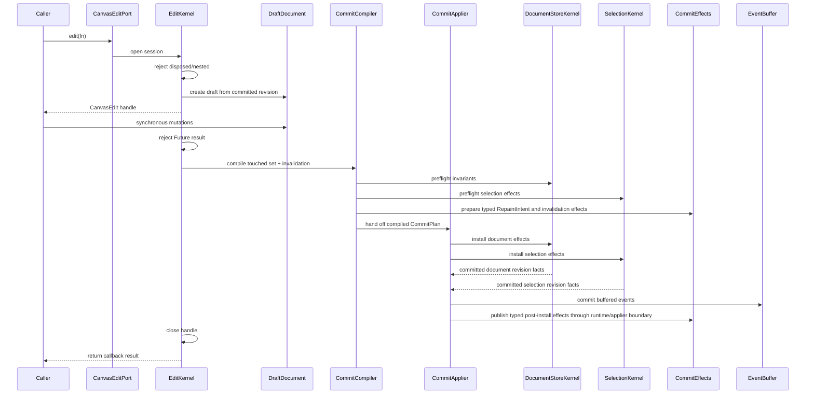
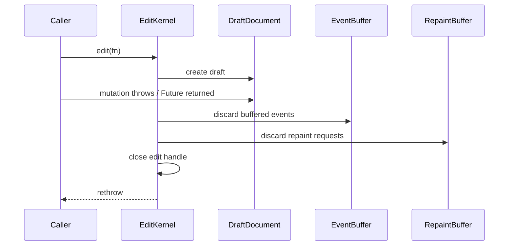

<!-- CONTEXT:BEGIN -->
Registry id: `section_11_edit_kernel`
Registry source: `docs/_registry/sections.yaml`
Document path: `docs/contracts/edit_kernel.md`
Owns:
- 11. EditKernel implementation contract
Must read before editing:
- `section_04_public_api_v1` -> `docs/contracts/public_api_v1.md`
- `section_10_runtime_data_model` -> `docs/architecture/03_data_model.md`
Feeds phases:
- `P5`
- `P6`
- `P10`
- `P11`
- `P12`
Related donors:
- `interaction_mutation_boundary`
- `staged_load_runtime_materialization`
- `validated_import_draft`
- `dto_document_helpers`
Related diagrams:
- `c4_code_edit_kernel`
- `dfd_public_edit`
- `seq_edit_success`
- `seq_edit_rollback`
- `state_edit_session`
Required tests:
- `test.edit.low_level_mutations_do_not_emit_actions`
- `test.runtime.runtime_state_publication`
- `test.edit.sync_non_nested_async_stale`
- `test.edit.rollback`
- `test.edit.field_update_nullable_semantics`
- `test.edit.exact_touched_invalidation`
- `test.edit.typed_effects_no_frame_dependency`
Guardrails:
- `edit.sync_non_nested`
- `edit.rollback_no_effects`
- `edit.stale_handle_rejected`
- `events.low_level_edit_no_user_actions`
- `edit.no_global_invalidation_except_replacement`
- `edit.typed_effects_no_frame_dependency`
Do not assume:
- no legacy SceneWriteTxn
- no legacy controller shell
- no async nested edit
<!-- CONTEXT:END -->

## 11. EditKernel implementation contract

### 11.1 Write sequence



### 11.2 Rollback sequence



Rollback obligations:

```text
- committed document identity unchanged;
- all revisions unchanged;
- projection cache unchanged;
- spatial index unchanged;
- resource cache unchanged;
- selection owner unchanged;
- preview unchanged unless the public operation itself was a successful external mutation;
- no actions emitted;
- no text edit event emitted;
- no public `CanvasRuntimeState` publication;
- no scene repaint;
- no overlay repaint.
```

### 11.3 Touched set

```text
TouchedSet
  addedElementIds
  removedElementIds
  updatedElementIds
  transformedElementIds
  geometryChangedElementIds
  visualChangedElementIds
  resourceDescriptorChangedIds
  resourceVisualChangedIds
  layerOrderChanged
  backgroundLayerChanged
  selectionChanged
  persistedCameraChanged
  backgroundChanged
  gridChanged
  paletteChanged
  documentReplaced
```

CommitCompiler must produce exact invalidation. Generic global invalidation is forbidden except `documentReplaced`.

CommitCompiler must not depend on concrete `FrameEngine`. It produces a
`CommitPlan` containing typed `RepaintIntent` and invalidation effects. The
post-install runtime/applier boundary dispatches those effects to frame,
spatial, resource, projection, and public state publication owners.

Selection effects are not draft fields inside committed document state. Edits
that remove selected elements, clear content, delete selection, or commit a
marquee selection compile explicit selection-owner effects. The applier
publishes document and selection effects as one atomic `CanvasRuntimeState`; if
preflight or rollback happens before that boundary, both owners remain
unchanged.

After an accepted edit commit, `RuntimeRoot` publishes exactly one public state
snapshot that combines document, selection-prune, resource-visual, preview
cleanup, interaction, and epoch effects produced by the operation. A no-op edit
does not publish a new snapshot. `CanvasEdit.setCameraOffset` is the persisted
document camera mutation path and advances document/projection effects; it does
not mutate runtime view camera state.

---
