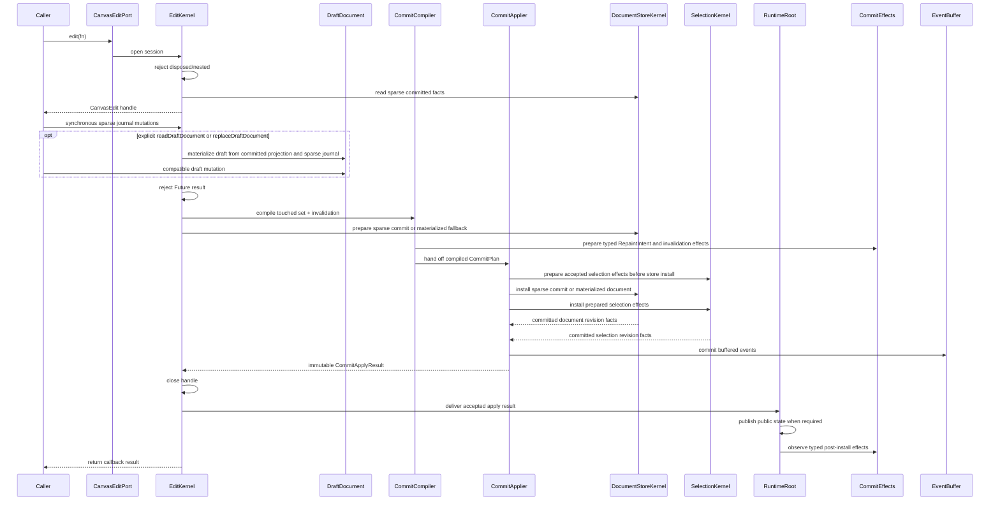
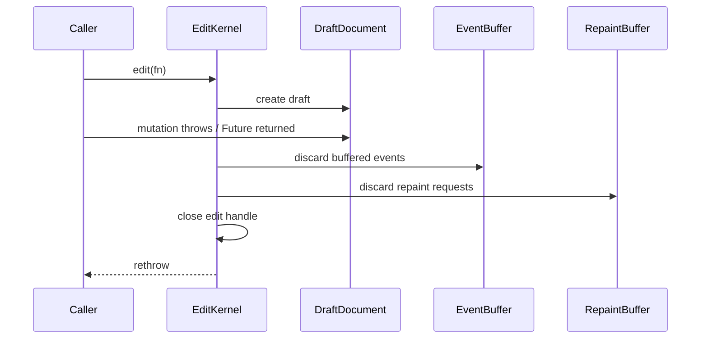

<!-- CONTEXT:BEGIN -->
Registry id: `section_11_edit_kernel`
Registry source: `docs/_registry/sections.yaml`
Document path: `docs/contracts/edit_kernel.md`
Owns:
- 11. EditKernel implementation contract
Must read before editing:
- `section_04_public_api_v1` -> `docs/contracts/public_api_v1.md`
- `section_10_runtime_data_model` -> `docs/architecture/03_data_model.md`
Current owners:
- `contract`
Benchmarks:
- `none`
Related diagrams:
- `c4_code_edit_kernel`
- `dfd_public_edit`
- `seq_edit_success`
- `seq_edit_rollback`
- `state_edit_session`
Required tests:
- `test.edit.low_level_mutations_do_not_emit_actions`
- `test.runtime.runtime_state_publication`
- `test.edit.sync_non_nested_async_stale`
- `test.edit.rollback`
- `test.edit.field_update_admission_effects`
- `test.edit.exact_touched_invalidation`
- `test.edit.typed_effects_no_frame_dependency`
Guardrails:
- `edit.sync_non_nested`
- `edit.rollback_no_effects`
- `edit.stale_handle_rejected`
- `events.low_level_edit_no_user_actions`
- `edit.no_global_invalidation_except_replacement`
- `edit.typed_effects_no_frame_dependency`
Do not assume:
- no legacy SceneWriteTxn
- no legacy controller shell
- no async nested edit
<!-- CONTEXT:END -->

## 11. EditKernel implementation contract

### 11.1 Write sequence



Ordinary public edit, command, and interaction commit routes open a sparse edit
session. The session records a callback-local sparse journal, reads committed
facts from `DocumentStoreKernel`, and compiles exact touched-set/revision
deltas without building a public `CanvasDocument` projection. `draftSummary`
uses the committed summary plus sparse deltas. `readDraftDocument` and
`replaceDraftDocument` are explicit compatibility fallbacks: they materialize a
rollback-safe `DraftDocument`, replay prior sparse mutations, and then commit
through the materialized payload path.

`DocumentStoreKernel` prepares accepted sparse commits before the irreversible
store swap. Duplicate ids, resource references, update-kind compatibility,
revision-family alignment, and projection invalidation are validated against
the accepted next committed tables. Selection effects are also prepared before
the swap from accepted next-document facts. After the swap, `SelectionKernel`
installs only the prepared selected ids; it does not re-read public document
membership from the current store.

`CommitApplier` returns the contract-owned immutable commit delivery payloads
after document and selection effects have both installed. The runtime/applier
seam lives in `lib/src/contracts/internal/commit_delivery.dart`: it carries the
accepted sparse/materialized document payload, public-state publication
decision, and immutable typed post-install delivery effects selected by the
accepted edit plan. Spatial and resource delivery effects carry the shared
immutable `TouchedSet` from `lib/src/contracts/internal/touched_set.dart`; edit
keeps only the mutable builder and store revision deltas private.

`EditKernel` closes and stales the active edit handle, clears the active-session
state, and only then asks `RuntimeRoot` to consume the accepted apply result.
`RuntimeRoot` publishes the public state snapshot first when the result requires
publication, then invokes the internal synchronous observer seam. The observer
typedef and delivery payloads are owned by `contracts/internal/**`, while edit
keeps planning and install details private.

Empty effect lists are not delivered. Observer failures are contained
post-commit notification failures: they do not roll back accepted document,
selection, revision, projection, resource, or public-state changes; they do not
rethrow from public edit calls; and they do not replace the edit callback
result. Any future DiagnosticsHub record for these failures is runtime-owned
through `section_20_diagnostics_hub`; it is not an edit-owned writer and is not
a current graph obligation until a later contract adds the route. Observer
delivery is not a reentrant mutation window. Public runtime
mutations attempted while the observer is running are rejected with `StateError`
before draft creation, committed-state mutation, public-state publication, or
additional effect delivery.

### 11.2 Rollback sequence



Rollback obligations:

```text
- committed document identity unchanged;
- all revisions unchanged;
- projection cache unchanged;
- spatial index unchanged;
- resource cache unchanged;
- selection owner unchanged;
- preview unchanged unless the public operation itself was a successful external mutation;
- no actions emitted;
- no text edit event emitted;
- no public `CanvasRuntimeState` publication;
- no scene repaint;
- no overlay repaint.
```

### 11.3 Touched set

```text
TouchedSet
  addedElementIds
  removedElementIds
  updatedElementIds
  transformedElementIds
  geometryChangedElementIds
  visualChangedElementIds
  resourceDescriptorChangedIds
  resourceVisualChangedIds
  layerOrderChanged
  backgroundLayerChanged
  selectionChanged
  persistedCameraChanged
  backgroundChanged
  gridChanged
  paletteChanged
  documentReplaced
```

CommitCompiler must produce exact invalidation. Generic global invalidation is forbidden except `documentReplaced`.

CommitCompiler must not depend on concrete `FrameEngine`. It produces a
`CommitPlan` containing typed `RepaintIntent` and invalidation effects. The
post-install runtime/applier boundary dispatches those effects to frame,
spatial, resource, projection, and public state publication owners.

Sparse and materialized edit sessions both use `CommitCompiler` as the typed
taxonomy owner. Sparse sessions build `TouchedSet` and `StoreRevisionDelta`
directly from accepted sparse mutations; materialized sessions compile from the
`DraftDocument` touched set. Both routes must produce the same operation-matrix
effects for the same accepted public edit.

### 11.4 Element update field-effect taxonomy

`CommitCompiler` owns the field-effect taxonomy for
`CanvasEdit.updateElement`. It converts the changed fields in a
`CanvasElementUpdate` into typed `CommitPlan` effects after update-kind
validation and before atomic install. Every changed persisted element field
advances public `state.revisions.document`, increments the element revision,
and invalidates the public `CanvasDocument` projection through internal
`projectionRevision`.

No-op field updates, absent fields, and field values equal to the current value
produce no document, internal revision, spatial, projection, resource, repaint,
selection, event, or public state publication effects. If validation fails or
the edit rolls back, all effects listed below are discarded by the edit
rollback contract.

Field taxonomy:

| Field token | Internal revisions | Spatial effect | Projection effect | Resource effect | Repaint target | Selection normalization |
|---|---|---|---|---|---|---|
| `CanvasElementUpdate.transform` | bounds, elementVisual, projection | touched update | evict | none | main | none |
| `CanvasElementUpdate.opacity` | elementVisual, projection | none | evict | none | main | none |
| `CanvasElementUpdate.hitPadding` | bounds, projection | touched update | evict | none | none | none |
| `CanvasElementUpdate.isVisible` | bounds, elementVisual, projection | touched update | evict | none | main | prune selected id when it becomes invisible |
| `CanvasElementUpdate.isSelectable` | projection | none | evict | none | main when selection normalization prunes; otherwise none | prune selected id when it becomes non-selectable |
| `CanvasElementUpdate.isLocked` | projection | none | evict | none | none | none |
| `CanvasElementUpdate.isDeletable` | projection | none | evict | none | none | none |
| `CanvasElementUpdate.isTransformable` | projection | none | evict | none | none | none |
| `CanvasElementUpdate.metadata` | projection | none | evict | none | none | none |
| `CanvasImageElementUpdate.resourceId` | elementVisual, projection | none | evict | validate referenced resource id; no descriptor-table mutation | main | none |
| `CanvasImageElementUpdate.size` | bounds, elementVisual, projection | touched update | evict | none | main | none |
| `CanvasImageElementUpdate.naturalSize` | elementVisual, projection | none | evict | none | main | none |
| `CanvasPathElementUpdate.svgPathData` | bounds, elementVisual, projection | touched update | evict | none | main | none |
| `CanvasPathElementUpdate.fillColor`, `CanvasPathElementUpdate.strokeColor`, `CanvasPathElementUpdate.strokeWidth`, `CanvasPathElementUpdate.fillRule` | elementVisual, projection; bounds also when stroke width changes paint bounds | touched update only when paint bounds change | evict | none | main | none |
| `CanvasTextElementUpdate.text`, `CanvasTextElementUpdate.fontSize`, `CanvasTextElementUpdate.align`, `CanvasTextElementUpdate.textDirection`, `CanvasTextElementUpdate.isBold`, `CanvasTextElementUpdate.isItalic`, `CanvasTextElementUpdate.fontFamily`, `CanvasTextElementUpdate.maxWidth`, `CanvasTextElementUpdate.lineHeight` | bounds, elementVisual, projection | touched update when layout or paint bounds change | evict | none | main | none |
| `CanvasTextElementUpdate.color`, `CanvasTextElementUpdate.isUnderline` | elementVisual, projection; bounds also when underline paint bounds change | touched update only when paint bounds change | evict | none | main | none |
| `CanvasStrokeElementUpdate.points`, `CanvasStrokeElementUpdate.thickness` | bounds, elementVisual, projection | touched update | evict | none | main | none |
| `CanvasStrokeElementUpdate.color` | elementVisual, projection | none | evict | none | main | none |
| `CanvasLineElementUpdate.start`, `CanvasLineElementUpdate.end`, `CanvasLineElementUpdate.thickness` | bounds, elementVisual, projection | touched update | evict | none | main | none |
| `CanvasLineElementUpdate.color` | elementVisual, projection | none | evict | none | main | none |
| `CanvasRectElementUpdate.size`, `CanvasRectElementUpdate.strokeWidth` | bounds, elementVisual, projection | touched update | evict | none | main | none |
| `CanvasRectElementUpdate.fillColor`, `CanvasRectElementUpdate.strokeColor` | elementVisual, projection | none | evict | none | main | none |

`CommitCompiler` may implement this taxonomy through an internal pure
field-effect subroutine, but `CommitCompiler` remains the source-of-truth owner
for typed invalidation. Resource reference validation is preflighted before
draft mutation is accepted. Selection normalization effects are installed by
the selection owner and published atomically with document effects.

Selection effects are not draft fields inside committed document state. Edits
that remove selected elements, clear content, delete selection, or commit a
marquee selection compile explicit selection-owner effects. The applier
publishes document and selection effects as one atomic `CanvasRuntimeState`; if
preflight or rollback happens before that boundary, both owners remain
unchanged.

After an accepted edit commit, `RuntimeRoot` publishes exactly one public state
snapshot that combines document, selection-prune, resource-visual, preview
cleanup, interaction, and epoch effects produced by the operation. A no-op edit
does not publish a new snapshot. `CanvasEdit.setCameraOffset` is the persisted
document camera mutation path and advances document/projection effects; it does
not mutate runtime view camera state.

---
