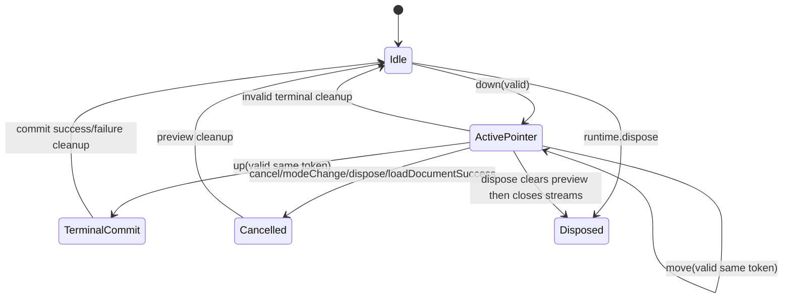

<!-- CONTEXT:BEGIN -->
Registry id: `section_14_interaction_engine`
Registry source: `docs/_registry/sections.yaml`
Document path: `docs/contracts/interaction_engine.md`
Owns:
- 14. InteractionEngine
Must read before editing:
- `section_11_edit_kernel` -> `docs/contracts/edit_kernel.md`
- `section_15_frame_render_contract` -> `docs/contracts/frame_rendering.md`
- `section_16_geometry_policy` -> `docs/contracts/geometry.md`
Current owners:
- `contract`
Related diagrams:
- `dfd_pointer_preview_commit`
- `seq_selected_move_preview_commit`
- `seq_selected_move_cancel`
- `seq_marquee_select`
- `seq_pencil_marker_commit`
- `seq_line_two_tap_commit`
- `seq_eraser_commit`
- `seq_context_action_request`
- `seq_dispose_during_gesture`
- `state_pointer_session`
- `state_select_marquee`
- `state_selected_move`
- `state_pencil_marker_draw`
- `state_two_tap_line`
- `state_eraser`
- `state_pending_context_action_request`
Required tests:
- `test.api.selection_port`
- `test.api.selection_transform_commands`
- `test.api.command_port_actions`
- `test.api.tool_port_settings`
- `test.api.typed_action_payloads`
- `test.api.runtime_timestamp_order`
- `test.interaction.runtime_created_timestamps_monotonic`
- `test.runtime.command_facts_port`
- `test.runtime.load_interaction_cleanup`
- `test.interaction.commands_emit_user_actions`
- `test.interaction.interaction_declarations`
- `test.interaction.pointer_session`
- `test.interaction.pointer_sample_normalizer`
- `test.interaction.interaction_read_port`
- `test.surface.interactive_false_pointer_routing`
- `test.surface.interactive_false_active_session_cancel`
- `test.surface.interactive_false_pending_line_preserved`
- `test.surface.interactive_false_state_isolation`
- `test.surface.pointer_adapter_finite_normalization`
- `test.api_contract.preview_state_sealed_union`
- `test.interaction.preview_public_state`
- `test.interaction.move_machine`
- `test.interaction.select_machine`
- `test.interaction.pointer_tool_cleanup_coordinator`
- `test.interaction.context_action_request`
- `test.interaction.text_edit_stale_commit_guard`
- `test.diagnostics.interaction_diagnostics`
- `test.guardrails.interaction_guardrail_enforcement`
- `test.guardrails.selection_boundary_checks`
- `test.surface.widget_paint`
Guardrails:
- `preview.selected_move_main_only`
- `preview.marquee_overlay_only`
- `api.preview_state_sealed_union_publicly_readable`
- `events.commands_emit_user_actions`
- `events.action_after_state_order`
- `events.runtime_created_timestamps_monotonic`
- `load.prepares_before_interrupt`
- `load.success_interrupts_before_install`
- `interaction.no_concrete_store_imports`
- `interaction.no_concrete_selection_imports`
- `interaction.read_port_immutable_facts`
- `interaction.no_command_facts_import`
- `interaction.cleanup_coordinator_dependency_bans`
- `interaction.no_resolver_on_cancel_paths`
- `interaction.no_stale_terminal_commit`
- `interaction.pointer_cleanup_coordinator_only`
- `tools.public_port_behavior`
- `surface.pointer_samples_normalized_before_runtime`
- `surface.interactive_false_pending_line_preserved`
Do not assume:
- no callback graph as structure
- no reentrant mutation from resolver
<!-- CONTEXT:END -->

## 14. InteractionEngine

### 14.1 Pointer session lifecycle



Rules:

```text
- one active routed pointer per runtime;
- pointerId is a routing token only;
- concurrent pointer sessions are not supported in v1;
- raw pointer routing belongs to the surface pointer adapter;
- InteractionEngine receives `CanvasPointerInput`;
- finite public pointer samples are normalized by
  `lib/src/interaction/pointer_sample_normalizer.dart`, which converts
  view-space positions to world-space positions by adding the current runtime
  view camera offset;
- `CanvasPointerTerminalCleanup` branches before sample normalization and
  routes through the invalid-terminal cleanup classifier without creating
  `NormalizedPointerSample` geometry;
- terminal admission requires the active pointer token and current
  `controllerEpoch`; stale token or epoch mismatch may clean up only and cannot
  create a commit intent;
- terminal exception clears preview and schedules correct repaint;
- cleanup-capable tool machines return typed cleanup requests to
  `InteractionEngine`; `InteractionEngine` is the only caller of the target
  `PointerToolCleanupCoordinator`;
- committed facts for gesture decisions are read through narrow read-only
  interaction query ports;
- selection facts for gesture decisions are read through narrow immutable
  selection query ports, not by importing or mutating the concrete selection
  owner;
- interaction query results are immutable, intent-specific facts and never
  expose store tables, selection internals, or mutation methods;
- InteractionEngine commits only through EditKernel.
- public interaction setting changes publish `state.revisions.interaction`;
- preview changes publish sealed `CanvasPreviewState` variants and
  `state.revisions.preview`;
- interaction cleanup that is already a no-op publishes no current public state
  snapshot.
```

Selection-related interaction reads must be batched by intent through
`InteractionReadPort`. Marquee start, marquee terminal commit,
selected-move start, and selected-move commit each read one immutable snapshot
that contains the selected ids plus the document facts needed for that intent,
such as content membership, visibility, lock state, transformability,
deletability, bounds, and document order. Context-action and hit-test reads use
the same read-only boundary for hit/order facts, immutable element snapshots,
`boundsWorld`, generation, `elementRevision`, `CanvasElementKind`, `controllerEpoch`,
visibility, and top-hit facts. Interaction must not loop over concrete owner
methods such as per-property `exists`, `isVisible`, or `isLocked` reads, and the
port must not expose mutation, draft access, `CanvasDocument` projection, store
internals, or resource/session internals.

Selected-move start admission is decided from one pointer-down snapshot. The
read-port facts preserve the ordinary exact topmost hit id/order, whether that
exact hit is a movable selected element, and whether the topmost hit is a
movable unselected element. For multi-select, the same read also derives
selected group union bounds, selected top order token, whether the pointer is
inside that union, and whether a higher-order exact content hit occludes
union-only admission. `MoveMachine` may start selected move from an exact
movable selected hit, from reliable multi-select group-union facts with no
higher-order occluder, or from a movable unselected topmost hit. Empty canvas
starts move-mode marquee. Locked, hidden, non-transformable, or otherwise
non-movable topmost hits do not start selected move and do not fall through to
marquee drag; their click selection behavior remains terminal tap behavior.
`MoveMachine` must reject empty selection, empty movable set, single-selection
bounds-only misses, stale or otherwise unreliable hit-query facts, non-finite
group bounds, and occluded union-only starts. Rejected selected-move starts
produce no selected-move preview, resolver call, action, or document mutation.

An admitted selected-move session retains its exact movable participant basis:
public ids, generation, element revision, transform, bounds, prior selection,
and pointer session/controller-epoch identity. Before any accepted document or
selection outcome is published, RuntimeRoot routes its touched ids and actual
selection outcome to that session. A touched participant (including a
remove/re-add with the same id), document replacement, or external selection
change cancels the whole gesture before a resolver/action can run. Unrelated
accepted edits and final no-ops leave the basis live. Terminal request facts and
start-relative transforms use that retained basis rather than re-reading a
current movable subset; cleanup releases it and only conditionally rolls back
provisional selection, so it cannot overwrite a newer external selection.

Unselected movable-hit drag uses provisional selection. Pointer-down captures
the hit as a pending single-object move candidate while preserving the previous
selection ids. Before the pointer exits effective drag-start slop the gesture is
still a tap candidate and must not emit a move action. When the first move exits
effective drag-start slop, runtime conditionally applies a provisional
selection replacement to the hit next to selected-move preview publication;
this replacement is not a select action and only applies if the previous
selection is still current. If the gesture later commits as a move, selection
remains on the dragged object and the only action is `moveSelection`. If the
pointer is cancelled, the mode/tool/pointer policy is changed, a resolver
cancels or throws, or edit application fails before a successful move commit,
cleanup conditionally restores the previous selection without emitting a select
action only while the provisional selection is still current; later public
selection changes are not overwritten by provisional rollback.

A move-mode click that stays within `tapSlop` is a point-selection commit
through the marquee/select owner, not a direct selection-owner mutation from
the surface. For zero-area marquee commit rectangles, the runtime interaction
read adapter performs a bounded point hit query, resolves immutable candidates,
uses the hit-test policy to choose the topmost selectable hit, and returns that
single id in document/action order. Non-zero marquee rectangles keep the
rectangle-overlap selection path.
If an unselected movable-hit gesture has already published provisional
selected-move preview but terminals within `tapSlop`, the terminal selection
target is still resolved through this zero-area read path at the terminal
point. It must not reuse the pointer-down hit capture as the terminal selection
target. The provisional selection may be rolled back first so the commit/action
records the original selection as the previous selection, while the terminal
topmost selectable hit determines the next selection.

Pointer threshold ownership is split by outcome. The effective drag-start slop
is `CanvasPointerPolicy.dragStartSlop ?? CanvasPointerPolicy.tapSlop` and
starts visible selected-move, marquee, and first-pointer line drag previews.
After a selected-move or marquee preview has started, drag-start slop no longer
suppresses move samples; the active preview continues to update when the
pointer returns inside the start radius or crosses the original start point.
Terminal point-selection and context-tap checks continue to use `tapSlop`, so a
gesture can publish a preview after effective drag-start slop and still resolve
as a tap if the finite terminal sample remains within `tapSlop`. Double-tap
matching uses `doubleTapSlop` only.

`interactive=false` cancels only an active routed pointer session. Pending line
start or line preview state that is not currently owned by an active routed
pointer session is preserved until a line-owned cleanup, mode/tool change,
prepared load cleanup, dispose, or terminal line decision.
If cancellation clears active pointer-owned preview, runtime publishes one
`CanvasRuntimeState` with an updated preview revision. If no active
pointer-owned preview changes, cancellation is public-state silent.

### 14.2 Pointer cleanup coordinator

The target `PointerToolCleanupCoordinator` is an internal
`InteractionEngine` collaborator under
`lib/src/interaction/pointer_tool_cleanup_coordinator.dart`. It is the cleanup
policy owner for pointer-tool cleanup, not a public API type, state store,
cache, resolver, edit owner, event dispatcher, context-request emitter, repaint
notifier, Flutter adapter, resource owner, or runtime publication owner.

Cleanup-capable tool machines recognize gestures and return terminal
commit intents or typed cleanup requests to `InteractionEngine`. The typed
cleanup request carries both cleanup reason and ownership context so the
coordinator can distinguish active pointer-owned state from non-owned pending
line state. Tool machines must not call the coordinator directly.

draw cancellation maps to `PointerCleanupReason.cancel` for every
user-cancelled pencil, marker, and line path. Pencil and marker cancellation
clears the active stroke preview/session without creating a commit, action, or
timestamp reservation. Line first-tap cancellation clears only the active
first-tap session and preserves any non-owned pending line state. Line endpoint
cancellation uses line-owned cleanup, clears the active line preview plus the
owned pending line, and emits no action or document mutation. Stale, invalid,
and no-op draw terminals use their specific stale, invalid, and no-op cleanup
reasons instead of `cancel`; those rejected terminals never create
`strokeCommit`, `lineCommit`, or draw output timestamps.

For a returned stroke or line commit intent, `RuntimeRoot` reads one current,
non-mutating element ID candidate from `DocumentStoreKernel` immediately before
the synchronous one-element preparation. The interaction owner neither reserves
that ID nor retains it: a failed or no-op preparation leaves it for the next
explicit generation, and accepted Store-ledger admission performs the only
route reservation.

The coordinator owns cleanup policy and outcome calculation for cancel, dispose,
prepared load success, mode/tool change, active-session `interactive=false`,
stale terminal, invalid terminal, no-op terminal, resolver cancel/error after
valid resolver entry, edit failure after a commit intent, and
post-successful-commit cleanup. It does not own final terminal normalization,
hit testing, spatial candidate selection, exact eraser checks, commit-intent
creation, committed document mutation, committed selection mutation, or resource
mutation.

An eraser session owns one mutable, interaction-private retained corridor. A
`PointerSession` carries only that capture reference; it does not snapshot or
replace it. Each distinct move and terminal point is admitted before any
overflow resample. Down snapshots the first captured point and publishes a
visual-only preview with the current draw style's eraser thickness. Each admitted
move snapshots and publishes its retained corridor in the same way. Neither
phase performs a scene read, envelope construction, spatial query, candidate
resolution, exact hit, or deletion projection. Terminal freezes one immutable
retained snapshot, performs one terminal read/evaluation from it, and derives the commit intent's
`corridorPointCount` from that same snapshot. A rejected terminal starts no
deletion preparation and uses the centralized cleanup route.

For a nonempty terminal eraser intent, RuntimeRoot receives the Unit-2 filtered
canonical Store entries and prepares the complete sparse deletion before calling
the required guarded resolver. That preparation includes Store validation and
revision/ledger binding, Selection backing, revision facts, sealed delivery, and
erase action inputs. Resolver cancel or ordinary failure discards the private
prepared state without a document, selection, timestamp, or action change; an
ordinary failure records only the bounded internal `{operation, errorKind}`
diagnostic. On accept, Store installs its bound state once, Selection installs
its already-owned backing once, and only then does RuntimeRoot ask the
coordinator for `publish: false` cleanup. Every terminal branch, including a
post-install state/action delivery failure, completes that cleanup before the
fallible delivery; accepted state remains final and is never rolled back.

For an accepted non-text terminal, `RuntimeRoot` first receives the already
closed EditKernel result, then asks InteractionEngine for cleanup with
publication suppressed, augments the sealed delivery effects with the cleanup
repaint, and only then enters common delivery. InteractionEngine remains the
cleanup-policy owner: it does not invoke a resolver, Store/EditKernel, frame,
state, action, or observer callback in that gap. A selected-move resolver is
also RuntimeRoot-owned: no configured callback or guard runs for the direct
finite non-zero path, while a configured finite acceptance completes its guard
before preparation; cancel, zero, invalid, thrown, and reentrant branches
never open preparation.

Common delivery remains RuntimeRoot composition, not an InteractionEngine
route: under one post-commit guard it performs spatial, resource/session
release, root-frame, bridged-frame, public-state, synchronous-action, and
non-empty-observer delivery in that order. Route cleanup is already complete
before the guard opens.

`PointerCleanupOutcome` is pointer-only and effect-only. It records previous
preview kind, whether preview changed, whether public state is needed, repaint
target, active token/session release, pending line cleared or preserved,
pending context tap cleared, and load/dispose sequencing facts. It must not
carry element ids, selection rollback intent, Flutter types, or
selection-owner dependencies. Interaction-level cleanup may pair that
pointer-only outcome with a conditional selection replacement for provisional
unselected-drag rollback, and runtime/public signal aggregation may consume the
paired outcome after cleanup completes. Runtime must not re-read stale active
session state to decide cleanup effects.
For successful `loadDocument`, the load cleanup outcome is produced before
RuntimeRoot crosses the document install commit point. RuntimeRoot may consume
that prepared outcome after install for publication and repaint aggregation, but
must not call back into the interaction owner after install to finish pointer
normalization or pending context tap cleanup.

Pending line preservation is part of the coordinator contract. Non-owned
pending line state is preserved on `interactive=false`. Pending line state is
cleared only by line-owned cleanup, mode/tool change, prepared load cleanup,
dispose, or a terminal line decision. Pending context tap cleanup clears tap
history without preview, repaint, action, context request, document, selection,
spatial, or projection effects.

The line tool supports two commit paths. A tap within `tapSlop` stores a
timestamped `CanvasPendingLineStartPreview` and waits for a later endpoint tap.
A first pointer drag that exits effective drag-start slop converts the active
first-tap session directly into a line endpoint session, publishes
`CanvasLinePreview`, and commits on the terminal up sample. Both paths keep
line previews overlay-only, create no document mutation before the terminal
commit intent,
and use line-owned cleanup for pending start or endpoint state.

The coordinator may depend only on interaction-owned state models and public
preview value types needed to calculate `CanvasNoPreview` outcomes. It must not
depend on concrete store internals, concrete selection internals, selected-move
resolver callbacks, `EditKernel`, action dispatchers, context-action streams,
frame engine, repaint buses, Flutter widgets/adapters, resource
resolver/session APIs, public runtime-state publication, or package-internal
paths.

### 14.3 Preview repaint target

InteractionEngine is the only producer of public preview variants. It publishes
`CanvasNoPreview` for cleanup, `CanvasSelectedMovePreview` for the main-scene
selected move path, and overlay preview variants for marquee, pencil, marker,
pending line start, line preview, and eraser corridor. Public preview payloads
do not include selected ids, pointer tokens, active pointer ids, or session ids.

| Preview variant | Repaint target |
|---|---|
| CanvasMarqueePreview | overlay only |
| CanvasPencilStrokePreview | overlay only |
| CanvasMarkerStrokePreview | overlay only |
| CanvasPendingLineStartPreview | overlay only |
| CanvasLinePreview | overlay only |
| CanvasEraserPreview | overlay only |
| CanvasSelectedMovePreview | main scene only |

This is mandatory. Selected move preview uses main-scene repaint through selected supplement staging; current behavior must preserve that result.

### 14.4 Double-tap context action

Double-tap context actions are interaction-owned. Direct double-tap delivery
through `CanvasToolPort.handleDoubleTap` is supported when the host surface has
already recognized the double-tap gesture and supplies the view position.
`CanvasRuntime.contextActionRequests` is a non-throwing broadcast stream that
closes on dispose.

Double-tap on an accepted context-action target queues exactly one asynchronous
`CanvasContextActionRequested` for `CanvasRuntime.contextActionRequests`. The
trigger is `CanvasContextActionTrigger.doubleTap`, and the accepted target is
either a content element or empty canvas after candidate spatial admission
succeeds and all candidate handles resolve to current immutable facts. The
queued request is delivered only if runtime load/dispose cleanup does not
suppress pending context requests before the scheduled delivery microtask.
The runtime resolves the request timestamp during that delivery turn only after
the pending batch survives load/dispose cleanup, is detached for delivery, and
the context-request stream remains open; it resolves immediately before
building the public `CanvasContextActionRequested`. Suppressed queued requests
discard their timestamp hint without advancing the runtime timestamp cursor.
Rejected invalid-index, stale-index, budget-exceeded, and
unresolved/skipped-candidate context target reads emit no public request.
Rejected stale-index, budget-exceeded, and unresolved/skipped-candidate reads
record bounded interaction diagnostics; rejected invalid-index reads record
none.
Request delivery has no document, selection, preview, repaint, spatial,
projection, resource, or action effect.

`CanvasToolPort.handleDoubleTap` is a direct host-recognized double-tap event,
not the second sample in engine-owned pointer-sample recognition. It accepts a
finite view position from the host surface and does not require pending
first-tap history, move mode, or absence of an active pointer preview/session.
On a valid direct double-tap, the interaction engine clears any pending context
tap history through `PointerToolCleanupCoordinator`, resolves the current
context-action target at the supplied position, admits only candidate spatial
results whose handles all resolve, issues a `CanvasInteractionRequestId`,
records live guard facts in `InteractionRequestRegistry`, and queues exactly
one asynchronous pending context-action request for the current content target
or empty canvas with the original timestamp hint. Load/dispose cleanup may
suppress that queued request before stream delivery and before any timestamp is
committed; disposal remains a stream-close-only path. Emitting the direct
request must not clear active pointer preview/session state by itself. A
non-finite position is rejected before target resolution and request emission.

Engine-owned pointer-sample recognition remains separate: the first tap may
store a pending context tap candidate, and the second tap must revalidate the
current target class and target facts before request emission. When the first
tap is also a move-mode selection tap, the selection commit may update
selection state and emit the normal select-marquee action, but post-commit
cleanup must preserve the pending context tap history so the next fast tap is
recognized as the second tap. Pointer-sample context taps remain guarded by
move-mode and pointer-session policy. Direct `handleDoubleTap` bypasses that
pending candidate requirement while still clearing stale pending context tap
history before it resolves the current target.
When one or both pointer samples omit a timestamp, double-tap delay cannot
reject the pair; target identity, controller epoch, and slop matching still
guard request admission, and the delivered request timestamp resolves through
the runtime cursor at stream delivery.

Content-element targets carry an immutable public `CanvasElement` snapshot and
`boundsWorld`. Empty-canvas targets carry no element snapshot. Text editing is
a separate runtime text-editing decision after delivery: the application may
open a context menu first, call `CanvasRuntime.textEditing.startFromContextAction`,
or mount `CanvasTextEditingOverlay` with inline auto-start when the content
target snapshot is a `CanvasTextElement`.

Context request emission records a live issued request in
`InteractionRequestRegistry` with a generated `CanvasInteractionRequestId`,
request target kind and controllerEpoch. For content-element targets, the
registry also stores target element id, element generation, elementRevision, and
element kind. Request facts are consumed and removed once; already-consumed
ids are absent rather than stored as durable registry state.

`documentRevision` is an observation and diagnostics fact only, not a
DiagnosticsHub write and not a stale commit guard. Unrelated document edits
after request emission do not reject a later text commit while the request id
is current and live, the request target is a text content element, and
controllerEpoch, element generation, elementRevision, and element kind remain
current.

The registry is not itself an active text-input session and not
CanvasPreviewState. `CanvasTextEditingPort` owns the single active text session
value and consumes registry facts only through the guarded request boundary.
The application owns context menus, optional custom editor decoration, IME
presentation, focus policy choices, accessibility presentation, and text
selection controls.

Request-originated text changes commit through
`CanvasCommandPort.commitTextEdit(requestId, newText, timestampMs: ...)`.
When there is no live `InteractionRequestRegistry` entry, a commitTextEdit
request id is unknown and returns false without document, selection, preview,
interaction, action, timestamp, repaint, or private request-consumption effects.
The command accepts only current live context request ids whose target is a
text content element. It consumes accepted no-op requests, consumes changed
requests only after successful edit preparation and EditKernel closure. Changed
text always enters common delivery after consumption. Only when the request
matches an active text session does RuntimeRoot synchronously clear the public
active-session value, record its interaction revision, and open the listener
window before that delivery. The listener may finish a separate accepted nested
mutation first; notifier errors are reported by Flutter and outer accepted
delivery continues. A direct live-request commit without an active session has
no dismissal/listener window or interaction revision. Rejected, failed, and
equal-text branches do not enter this listener window,
consumes known live rejected request ids, treats unknown and already-consumed
ids as no-ops, rejects empty-canvas, vector or other non-text, stale, missing,
or kind-mismatched request ids with no public state, document, selection,
preview, repaint, or action effect, validates `newText` before consumption or
draft mutation, and delegates changed text to EditKernel before emitting
`CanvasActionType.editText`. Direct
`CanvasEdit.updateElement(CanvasTextElementUpdate)` remains the programmatic
non-request synchronization API.

`CanvasElementKind` is the sole semantic interaction discriminator for context
target identity and stale request guards. No interaction behavior may branch on
MIME data or a resource descriptor subtype instead of immutable element kind.

---
