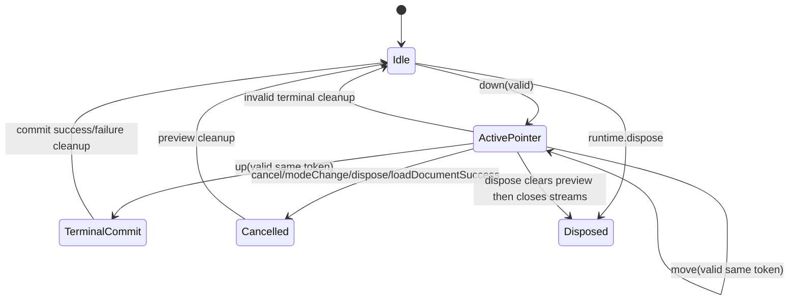

<!-- CONTEXT:BEGIN -->
Registry id: `section_14_interaction_engine`
Registry source: `docs/_registry/sections.yaml`
Document path: `docs/contracts/interaction_engine.md`
Owns:
- 14. InteractionEngine
Must read before editing:
- `section_11_edit_kernel` -> `docs/contracts/edit_kernel.md`
- `section_15_frame_render_contract` -> `docs/contracts/frame_rendering.md`
- `section_16_geometry_policy` -> `docs/contracts/geometry.md`
Feeds phases:
- `P10`
- `P11`
- `P12`
- `P13`
Related donors:
- `interaction_pointer_host`
- `interaction_pointer_session`
- `interaction_pointer_normalizer`
- `interaction_event_dispatcher`
- `interaction_double_tap_router`
- `interaction_gesture_runtime`
- `interaction_move_session`
- `interaction_draw_coordinator`
- `interaction_mutation_boundary`
Related diagrams:
- `dfd_pointer_preview_commit`
- `seq_selected_move_preview_commit`
- `seq_selected_move_cancel`
- `seq_marquee_select`
- `seq_pencil_marker_commit`
- `seq_line_two_tap_commit`
- `seq_eraser_commit`
- `seq_context_action_request`
- `seq_dispose_during_gesture`
- `state_pointer_session`
- `state_select_marquee`
- `state_selected_move`
- `state_pencil_marker_draw`
- `state_two_tap_line`
- `state_eraser`
- `state_pending_context_action_request`
Required tests:
- `test.api.selection_port`
- `test.api.selection_transform_commands`
- `test.api.command_port_actions`
- `test.api.tool_port_settings`
- `test.api.typed_action_payloads`
- `test.api.runtime_timestamp_order`
- `test.interaction.runtime_created_timestamps_monotonic`
- `test.runtime.command_facts_port`
- `test.runtime.load_interaction_cleanup`
- `test.interaction.commands_emit_user_actions`
- `test.interaction.interaction_declarations`
- `test.interaction.pointer_session`
- `test.interaction.pointer_sample_normalizer`
- `test.interaction.interaction_read_port`
- `test.flutter_bridge.interactive_false_pointer_routing`
- `test.flutter_bridge.interactive_false_active_session_cancel`
- `test.flutter_bridge.interactive_false_pending_line_preserved`
- `test.flutter_bridge.interactive_false_state_isolation`
- `test.flutter_bridge.pointer_adapter_finite_normalization`
- `test.runtime.interaction_settings_state`
- `test.api_contract.preview_state_sealed_union`
- `test.interaction.preview_public_state`
- `test.interaction.move_machine`
- `test.interaction.select_machine`
- `test.interaction.move_resolver_reentrancy`
- `test.interaction.move_resolver_not_called_on_cancel_cleanup`
- `test.interaction.pointer_tool_cleanup_coordinator`
- `test.interaction.context_action_request`
- `test.interaction.text_edit_stale_commit_guard`
- `test.diagnostics.interaction_diagnostics`
- `test.frame.selected_move_main_repaint`
- `test.frame.marquee_overlay_repaint`
- `test.guardrails.action_after_state`
- `test.guardrails.interaction_guardrail_enforcement`
- `test.guardrails.selection_boundary_imports`
- `test.flutter_bridge.widget_paint`
Guardrails:
- `preview.selected_move_main_repaint`
- `preview.selected_move_main_only`
- `preview.marquee_overlay_only`
- `api.preview_state_sealed_union_publicly_readable`
- `events.commands_emit_user_actions`
- `events.action_after_state_order`
- `events.runtime_created_timestamps_monotonic`
- `load.prepares_before_interrupt`
- `load.success_interrupts_before_install`
- `interaction.no_concrete_store_imports`
- `interaction.no_concrete_selection_imports`
- `interaction.read_port_immutable_facts`
- `interaction.no_command_facts_import`
- `interaction.cleanup_coordinator_dependency_bans`
- `interaction.no_resolver_on_cancel_paths`
- `interaction.no_stale_terminal_commit`
- `interaction.pointer_cleanup_coordinator_only`
- `interaction.text_edit_stale_commit_guard`
- `tools.p10_compatibility`
- `surface.pointer_samples_normalized_before_runtime`
- `surface.interactive_false_pending_line_preserved`
Do not assume:
- no legacy callback graph as structure
- no reentrant mutation from resolver
<!-- CONTEXT:END -->

## 14. InteractionEngine

### 14.1 Pointer session lifecycle



Rules:

```text
- one active routed pointer per runtime;
- pointerId is a routing token only;
- concurrent pointer sessions are not supported in v1;
- raw pointer routing belongs to Flutter bridge;
- InteractionEngine receives normalized CanvasPointerSample;
- public pointer samples are normalized by
  `lib/src/interaction/pointer_sample_normalizer.dart`, which converts
  view-space positions to world-space positions by adding the current runtime
  view camera offset;
- terminal admission requires the active pointer token and current
  `controllerEpoch`; stale token or epoch mismatch may clean up only and cannot
  create a commit intent;
- terminal exception clears preview and schedules correct repaint;
- cleanup-capable tool machines return typed cleanup requests to
  `InteractionEngine`; `InteractionEngine` is the only caller of the target
  `PointerToolCleanupCoordinator`;
- committed facts for gesture decisions are read through narrow read-only
  interaction query ports;
- selection facts for gesture decisions are read through narrow immutable
  selection query ports, not by importing or mutating the concrete selection
  owner;
- interaction query results are immutable, intent-specific facts and never
  expose store tables, selection internals, or mutation methods;
- InteractionEngine commits only through EditKernel.
- public interaction setting changes publish `state.revisions.interaction`;
- preview changes publish sealed `CanvasPreviewState` variants and
  `state.revisions.preview`;
- interaction cleanup that is already a no-op publishes no new public state
  snapshot.
```

Selection-related interaction reads must be batched by intent through
`InteractionReadPort`. Marquee start, marquee terminal commit,
selected-move start, and selected-move commit each read one immutable snapshot
that contains the selected ids plus the document facts needed for that intent,
such as content membership, visibility, lock state, transformability,
deletability, bounds, and document order. Context-action and hit-test reads use
the same read-only boundary for hit/order facts, immutable element snapshots,
`boundsWorld`, generation, `elementRevision`, family, `controllerEpoch`,
visibility, and top-hit facts. Interaction must not loop over concrete owner
methods such as per-property `exists`, `isVisible`, or `isLocked` reads, and the
port must not expose mutation, draft access, `CanvasDocument` projection, store
internals, or resource/session internals.

`interactive=false` cancels only an active routed pointer session. Pending line
start or line preview state that is not currently owned by an active routed
pointer session is preserved until a line-owned cleanup, mode/tool change,
prepared load cleanup, dispose, or terminal line decision.
If cancellation clears active pointer-owned preview, runtime publishes one
`CanvasRuntimeState` with an updated preview revision. If no active
pointer-owned preview changes, cancellation is public-state silent.

### 14.2 Pointer cleanup coordinator

The target `PointerToolCleanupCoordinator` is an internal
`InteractionEngine` collaborator under
`lib/src/interaction/pointer_tool_cleanup_coordinator.dart`. It is the cleanup
policy owner for pointer-tool cleanup, not a public API type, state store,
cache, resolver, edit owner, event dispatcher, context-request emitter, repaint
notifier, Flutter adapter, resource owner, or runtime publication owner.

Cleanup-capable tool machines recognize gestures and return terminal
commit intents or typed cleanup requests to `InteractionEngine`. The typed
cleanup request carries both cleanup reason and ownership context so the
coordinator can distinguish active pointer-owned state from non-owned pending
line state. Tool machines must not call the coordinator directly.

P11 draw cancellation maps to `PointerCleanupReason.cancel` for every
user-cancelled pencil, marker, and line path. Pencil and marker cancellation
clears the active stroke preview/session without creating a commit, action, or
timestamp reservation. Line first-tap cancellation clears only the active
first-tap session and preserves any non-owned pending line state. Line endpoint
cancellation uses line-owned cleanup, clears the active line preview plus the
owned pending line, and emits no action or document mutation. Stale, invalid,
and no-op draw terminals use their specific stale, invalid, and no-op cleanup
reasons instead of `cancel`; those rejected terminals never create
`strokeCommit`, `lineCommit`, or draw output timestamps.

The coordinator owns cleanup policy and outcome calculation for cancel, dispose,
prepared load success, mode/tool change, active-session `interactive=false`,
stale terminal, invalid terminal, no-op terminal, resolver cancel/error after
valid resolver entry, edit failure after a commit intent, and
post-successful-commit cleanup. It does not own final terminal normalization,
hit testing, spatial candidate selection, exact eraser checks, commit-intent
creation, committed document mutation, committed selection mutation, or resource
mutation.

`PointerCleanupOutcome` is effect-only. It records previous preview kind,
whether preview changed, whether public state is needed, repaint target, active
token/session release, pending line cleared or preserved, pending context tap
cleared, and load/dispose sequencing facts. Runtime/public signal aggregation
may consume the outcome after cleanup completes, but it must not re-read stale
active session state to decide cleanup effects.
For successful `loadDocument`, the load cleanup outcome is produced before
RuntimeRoot crosses the document install commit point. RuntimeRoot may consume
that prepared outcome after install for publication and repaint aggregation, but
must not call back into the interaction owner after install to finish pointer
normalization or pending context tap cleanup.

Pending line preservation is part of the coordinator contract. Non-owned
pending line state is preserved on `interactive=false`. Pending line state is
cleared only by line-owned cleanup, mode/tool change, prepared load cleanup,
dispose, or a terminal line decision. Pending context tap cleanup clears tap
history without preview, repaint, action, context request, document, selection,
spatial, or projection effects.

The coordinator may depend only on interaction-owned state models and public
preview value types needed to calculate `CanvasNoPreview` outcomes. It must not
depend on concrete store internals, concrete selection internals, selected-move
resolver callbacks, `EditKernel`, action dispatchers, context-action streams,
frame engine, repaint buses, Flutter widgets/adapters, resource
resolver/session APIs, public runtime-state publication, or legacy package
paths.

### 14.3 Preview repaint target

InteractionEngine is the only producer of public preview variants. It publishes
`CanvasNoPreview` for cleanup, `CanvasSelectedMovePreview` for the main-scene
selected move path, and overlay preview variants for marquee, pencil, marker,
pending line start, line preview, and eraser corridor. Public preview payloads
do not include selected ids, pointer tokens, active pointer ids, or session ids.

| Preview variant | Repaint target |
|---|---|
| CanvasMarqueePreview | overlay only |
| CanvasPencilStrokePreview | overlay only |
| CanvasMarkerStrokePreview | overlay only |
| CanvasPendingLineStartPreview | overlay only |
| CanvasLinePreview | overlay only |
| CanvasEraserPreview | overlay only |
| CanvasSelectedMovePreview | main scene only |

This is mandatory. The legacy selected move preview uses main-scene repaint
through selected supplement staging; next behavior must preserve that functional
result.

### 14.4 Double-tap context action

Double-tap context actions are P12-owned. In P10,
`CanvasToolPort.handleDoubleTap` throws an `UnsupportedError` naming P12
context actions and performs no request, document, selection, preview,
interaction, action, timestamp, repaint, or DiagnosticsHub effect.
`CanvasRuntime.contextActionRequests` is still non-throwing in P10, but it is
an empty broadcast stream that closes on dispose.

P12 double-tap on an accepted context-action target emits exactly one
asynchronous `CanvasContextActionRequested` through
`CanvasRuntime.contextActionRequests`. The trigger is
`CanvasContextActionTrigger.doubleTap`, and the accepted target is either a
content element or empty canvas after candidate spatial admission succeeds.
Rejected invalid-index, stale-index, and budget-exceeded context target reads
emit no public request. Rejected stale-index and budget-exceeded reads record
bounded interaction diagnostics; rejected invalid-index reads record none.
Request delivery has no document, selection, preview, repaint, spatial,
projection, resource, or action effect.

In P12, `CanvasToolPort.handleDoubleTap` is a direct host-recognized double-tap event,
not the second sample in engine-owned pointer-sample recognition. It accepts a
finite view position from the host surface and does not require pending
first-tap history. On a valid direct double-tap, the interaction engine clears
any pending context tap history through `PointerToolCleanupCoordinator`,
resolves the current context-action target at the supplied position, admits only
candidate spatial results, then resolves the request timestamp through the
runtime timestamp cursor, issues a `CanvasInteractionRequestId`, records live
guard facts in `InteractionRequestRegistry`, and emits exactly one asynchronous
context-action request for the current content target or empty canvas. A
non-finite position is rejected before target resolution and request emission.

Engine-owned pointer-sample recognition remains separate: the first tap may
store a pending context tap candidate, and the second tap must revalidate the
current target class and target facts before request emission. Direct
`handleDoubleTap` bypasses that pending candidate requirement while still
clearing stale pending context tap history before it resolves the current
target.

Content-element targets carry an immutable public `CanvasElement` snapshot and
`boundsWorld`. Empty-canvas targets carry no element snapshot. Text editing is
an application-owned choice after delivery: the application may open a context
menu first or immediately show a text editor when the content target snapshot
is a `CanvasTextElement`.

Context request emission records a live issued request in
`InteractionRequestRegistry` with a generated `CanvasInteractionRequestId`,
request target kind and controllerEpoch. For content-element targets, the
registry also stores target element id, element generation, elementRevision, and
element family. Request facts are consumed and removed once; already-consumed
ids are absent rather than stored as durable retired state.

`documentRevision` is an observation and diagnostics fact only, not a
DiagnosticsHub write and not a stale commit guard. Unrelated document edits
after request emission do not reject a later text commit while the request id
is current and live, the request target is a text content element, and
controllerEpoch, element generation, elementRevision, and element family remain
current.

The registry is not an active text-input session and not CanvasPreviewState.
The application owns context menus, the Flutter text editor overlay, IME,
focus, accessibility, text selection, hide/show policy, and editor lifetime.

Request-originated text changes commit through
`CanvasCommandPort.commitTextEdit(requestId, newText, timestampMs: ...)`.
Until P12 creates `InteractionRequestRegistry`, every P10 commitTextEdit
request id is unknown and returns false without document, selection, preview,
interaction, action, timestamp, repaint, or private-retirement effects. After
P12, the command accepts only current live context request ids whose target is a
text content element. It consumes accepted no-op requests, consumes changed
requests only after successful edit preparation and before public delivery,
consumes known live rejected request ids, treats unknown and already-consumed
ids as no-ops, rejects empty-canvas, non-text, stale, missing, or
family-mismatched request ids with no public state, document, selection,
preview, repaint, or action effect, validates `newText` before consumption or
draft mutation, and delegates changed text to EditKernel before emitting
`CanvasActionType.editText`. Direct
`CanvasEdit.updateElement(CanvasTextElementUpdate)` remains the programmatic
non-request synchronization API.

---
