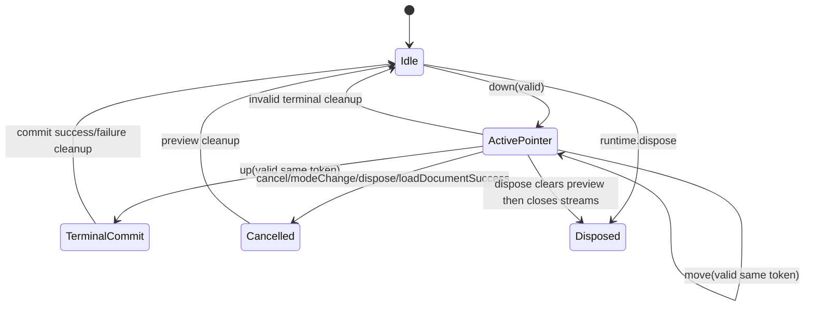

<!-- CONTEXT:BEGIN -->
Registry id: `section_14_interaction_engine`
Registry source: `docs/_registry/sections.yaml`
Document path: `docs/contracts/interaction_engine.md`
Owns:
- 14. InteractionEngine
Must read before editing:
- `section_11_edit_kernel` -> `docs/contracts/edit_kernel.md`
- `section_15_frame_render_contract` -> `docs/contracts/frame_rendering.md`
- `section_16_geometry_policy` -> `docs/contracts/geometry.md`
Feeds phases:
- `P10`
- `P11`
- `P12`
- `P13`
Related donors:
- `interaction_pointer_host`
- `interaction_pointer_session`
- `interaction_pointer_normalizer`
- `interaction_event_dispatcher`
- `interaction_double_tap_router`
- `interaction_gesture_runtime`
- `interaction_move_session`
- `interaction_draw_coordinator`
- `interaction_mutation_boundary`
Related diagrams:
- `dfd_pointer_preview_commit`
- `seq_selected_move_preview_commit`
- `seq_selected_move_cancel`
- `seq_marquee_select`
- `seq_pencil_marker_commit`
- `seq_line_two_tap_commit`
- `seq_eraser_commit`
- `seq_text_edit_request`
- `seq_dispose_during_gesture`
- `state_pointer_session`
- `state_select_marquee`
- `state_selected_move`
- `state_pencil_marker_draw`
- `state_two_tap_line`
- `state_eraser`
- `state_pending_text_edit_request`
Required tests:
- `test.api.typed_action_payloads`
- `test.interaction.commands_emit_user_actions`
- `test.flutter_bridge.interactive_false_pointer_routing`
- `test.flutter_bridge.interactive_false_active_session_cancel`
- `test.flutter_bridge.interactive_false_pending_line_preserved`
- `test.flutter_bridge.interactive_false_state_isolation`
- `test.flutter_bridge.pointer_adapter_finite_normalization`
- `test.runtime.interaction_settings_state`
- `test.api_contract.preview_state_sealed_union`
- `test.interaction.preview_public_state`
- `test.interaction.state_machines`
- `test.interaction.move_resolver_reentrancy`
- `test.interaction.move_resolver_not_called_on_cancel_cleanup`
- `test.interaction.no_stale_terminal_commit`
- `test.interaction.text_edit_stale_commit_guard`
- `test.guardrails.selection_boundary_imports`
- `test.flutter_bridge.widget_paint`
Guardrails:
- `preview.selected_move_main_repaint`
- `api.preview_state_sealed_union_publicly_readable`
- `events.commands_emit_user_actions`
- `load.prepares_before_interrupt`
- `load.success_interrupts_before_install`
- `interaction.no_concrete_store_imports`
- `interaction.no_concrete_selection_imports`
- `interaction.no_resolver_on_cancel_paths`
- `interaction.no_stale_terminal_commit`
- `interaction.text_edit_stale_commit_guard`
- `surface.pointer_samples_normalized_before_runtime`
- `surface.interactive_false_pending_line_preserved`
Do not assume:
- no legacy callback graph as structure
- no reentrant mutation from resolver
<!-- CONTEXT:END -->

## 14. InteractionEngine

### 14.1 Pointer session lifecycle



Rules:

```text
- one active routed pointer per runtime;
- pointerId is a routing token only;
- concurrent pointer sessions are not supported in v1;
- raw pointer routing belongs to Flutter bridge;
- InteractionEngine receives normalized CanvasPointerSample;
- terminal admission requires the active pointer token and current
  `controllerEpoch`; stale token or epoch mismatch may clean up only and cannot
  create a commit intent;
- terminal exception clears preview and schedules correct repaint;
- committed facts for gesture decisions are read through narrow read-only
  interaction query ports;
- selection facts for gesture decisions are read through narrow immutable
  selection query ports, not by importing or mutating the concrete selection
  owner;
- interaction query results are immutable, intent-specific facts and never
  expose store tables, selection internals, or mutation methods;
- InteractionEngine commits only through EditKernel.
- public interaction setting changes publish `state.revisions.interaction`;
- preview changes publish sealed `CanvasPreviewState` variants and
  `state.revisions.preview`;
- interaction cleanup that is already a no-op publishes no new public state
  snapshot.
```

Selection-related interaction reads must be batched by intent. Marquee start,
marquee terminal commit, selected-move start, and selected-move commit each read
one immutable snapshot that contains the selected ids plus the document facts
needed for that intent, such as content membership, visibility, lock state,
transformability, deletability, bounds, and document order. Interaction must not
loop over concrete owner methods such as per-property `exists`, `isVisible`, or
`isLocked` reads.

`interactive=false` cancels only an active routed pointer session. Pending line
start or line preview state that is not currently owned by an active routed
pointer session is preserved until a line-owned cleanup, mode/tool change,
successful load, dispose, or terminal line decision.
If cancellation clears active pointer-owned preview, runtime publishes one
`CanvasRuntimeState` with an updated preview revision. If no active
pointer-owned preview changes, cancellation is public-state silent.

### 14.2 Preview repaint target

InteractionEngine is the only producer of public preview variants. It publishes
`CanvasNoPreview` for cleanup, `CanvasSelectedMovePreview` for the main-scene
selected move path, and overlay preview variants for marquee, pencil, marker,
pending line start, line preview, and eraser corridor. Public preview payloads
do not include selected ids, pointer tokens, active pointer ids, or session ids.

| Preview variant | Repaint target |
|---|---|
| CanvasMarqueePreview | overlay only |
| CanvasPencilStrokePreview | overlay only |
| CanvasMarkerStrokePreview | overlay only |
| CanvasPendingLineStartPreview | overlay only |
| CanvasLinePreview | overlay only |
| CanvasEraserPreview | overlay only |
| CanvasSelectedMovePreview | main scene only |

This is mandatory. The legacy selected move preview uses main-scene repaint
through selected supplement staging; next behavior must preserve that functional
result.

### 14.3 Text double-tap

Double-tap on a visible selectable text element emits
`CanvasTextEditRequested`. It does not mutate document and does not
select/deselect by itself.

Text request emission records an issued request in `InteractionRequestRegistry`
with a generated `CanvasInteractionRequestId`, target element id,
controllerEpoch, element generation, elementRevision, element family, and
retired request status. The emitted `CanvasTextEditRequested` carries the
request id plus controllerEpoch, documentRevision, elementRevision, timestamp,
view/world positions, boundsWorld, and an immutable text snapshot.

`documentRevision` is an observation and diagnostics fact only, not a stale
commit guard. Unrelated document edits after request emission do not reject a
later text commit while the request id, controllerEpoch, element generation,
elementRevision, and text element family remain current.

The registry is not an active text-input session and not CanvasPreviewState.
The application owns the Flutter text editor overlay, IME, focus,
accessibility, text selection, hide/show policy, and editor lifetime.

Request-originated text changes commit through
`CanvasCommandPort.commitTextEdit(requestId, newText, timestampMs: ...)`.
The command retires accepted no-op and changed requests, rejects stale or
retired request ids with no document/repaint/action effect, validates `newText`
before retirement or draft mutation, and delegates changed text to EditKernel
before emitting `CanvasActionType.editText`. Direct
`CanvasEdit.updateElement(CanvasTextElementUpdate)` remains the programmatic
non-request synchronization API.

The generic `CanvasInteractionRequestId` is intentionally compatible with a
future contextual-action request API. This phase does not introduce a full
contextual-action event for shapes, images, lines, or empty canvas.

---
