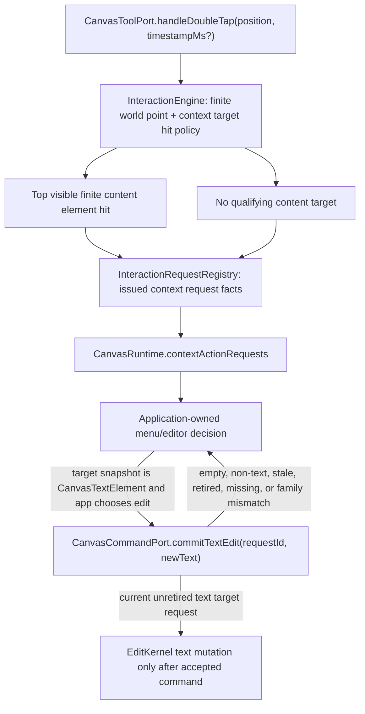
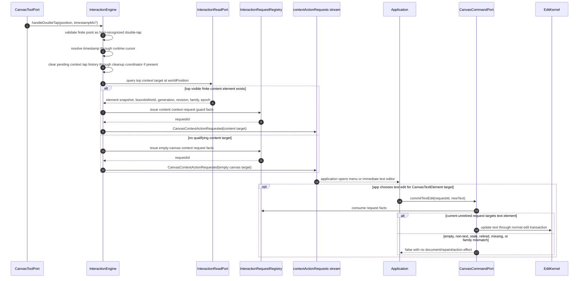
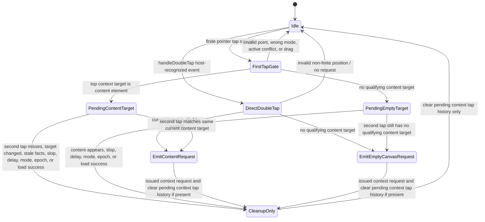

# Design: Double-Tap Context Action

---
date: 2026-05-19
designer: Codex
commit: 34d3d6b
branch: new-architecture
design_question: "Design the documentation follow-up that locks CanvasToolPort.handleDoubleTap as a host-recognized double-tap event inside the current context-action request contract."
---

## Disposition

READY_FOR_CONTRACT

## Product Outcome

The current docs already define double-tap as one application-facing
context-action request for content targets and empty canvas. This follow-up
design locks the missing input-boundary rule: `CanvasToolPort.handleDoubleTap`
is a host-recognized double-tap event, not "the second tap" of pending
pointer-sample recognition. It must work without pending first-tap history,
clear any old pending context tap privately, resolve the current target at the
provided position, and emit exactly one content-target or empty-canvas context
request.

Non-goals:

- No engine-owned context menu, Flutter overlay, focus, IME, or accessibility
  state.
- No document mutation, selection mutation, preview mutation, repaint, resource
  mutation, or user-action event from request delivery itself.
- No broad change to selection hit eligibility. Context-action target
  eligibility is a separate interaction policy.

## Target Contract Classification

- Profile: `SOURCE_OF_TRUTH_DOCS`
- Obligations: `PUBLIC_API_CHANGE`

The next step should update normative docs and registries only. Production code
and tests can follow after the source-of-truth docs are locked.

## Research Inputs

- `docs/history/research/2026-05-19-double-tap-docs-current-contract.md` - historical
  pre-migration text-only double-tap contract and affected source-of-truth
  surfaces. The current repository has already migrated the public request seam
  to context-action names, so this research is background only for why the seam
  exists.

## Repository Evidence

- `docs/history/research/2026-05-19-double-tap-docs-current-contract.md:13` - before the
  context-action migration, docs described double-tap as text-edit request only.
- `docs/history/research/2026-05-19-double-tap-docs-current-contract.md:140` - broadening
  double-tap touches registries, phase docs, verification docs, and release
  gates; this remains useful background for impact checking.
- `docs/contracts/interaction_engine.md:216` - current primary section is
  `Double-tap context action`.
- `docs/contracts/interaction_engine.md:218` - current behavior emits exactly
  one `CanvasContextActionRequested` on an accepted context-action target.
- `docs/contracts/interaction_engine.md:221` - current target is either a
  content element or empty canvas, and request delivery is effect-only.
- `docs/contracts/interaction_engine.md:224` - content targets carry an
  immutable public `CanvasElement` snapshot and `boundsWorld`.
- `docs/contracts/interaction_engine.md:230` - context request emission records
  issued request facts in `InteractionRequestRegistry`.
- `docs/contracts/interaction_engine.md:242` - the registry is not active
  text-input session or preview state.
- `docs/contracts/interaction_engine.md:246` - request-originated text changes
  still commit through `CanvasCommandPort.commitTextEdit`.
- `docs/contracts/public_api_v1.md:263` - `CanvasInteractionRequestId` is a
  public value type.
- `docs/contracts/public_api_v1.md:294` - the engine, not application code,
  generates interaction request ids.
- `docs/contracts/public_api_v1.md:361` - `CanvasRuntime` currently exposes
  `contextActionRequests`.
- `docs/contracts/public_api_v1.md:1683` - `CanvasToolPort.handleDoubleTap` is
  already the public double-tap entry boundary.
- `docs/contracts/public_api_v1.md:2212` - the current public section defines
  the context-action request event.
- `docs/contracts/public_api_v1.md:2215` - the current public trigger enum
  includes `CanvasContextActionTrigger.doubleTap`.
- `docs/contracts/public_api_v1.md:2217` - `CanvasContextActionRequested` is the
  current public request payload.
- `docs/contracts/public_api_v1.md:2243` - the current public target union has
  `CanvasContentElementContextActionTarget`.
- `docs/contracts/public_api_v1.md:2254` - the current public target union has
  `CanvasEmptyCanvasContextActionTarget`.
- `docs/contracts/public_api_v1.md:2263` - the current public model says the
  engine detects an accepted double-tap context target.
- `docs/contracts/public_api_v1.md:898` - `CanvasElement` is a public sealed DTO
  with common element facts.
- `docs/contracts/public_api_v1.md:913` - every public element snapshot exposes
  id, kind, revision, transform, visibility, selectability, lock, deletion,
  transformability, and metadata facts.
- `docs/contracts/public_api_v1.md:981` - `CanvasTextElement` is the public text
  element family and can serve as the text snapshot in the generalized target.
- `docs/contracts/public_api_v1.md:1409` - runtime-created timestamp behavior is
  documented as a public contract.
- `docs/contracts/public_api_v1.md:1414` - nullable timestamps on double-tap
  boundaries are hints.
- `docs/contracts/public_api_v1.md:1433` - current timestamp compatibility proof
  names `CanvasContextActionRequested.timestampMs`.
- `docs/contracts/geometry.md:54` - hit eligibility is currently defined as a
  policy.
- `docs/contracts/geometry.md:57` - current point hit eligibility requires
  `element.isSelectable`.
- `docs/contracts/geometry.md:63` - point hit scope is content layers only.
- `docs/contracts/geometry.md:67` - background elements are not
  pointer-selectable in v1.
- `docs/contracts/geometry.md:113` - paint admission is separate from hit
  bounds.
- `docs/contracts/geometry.md:118` - background elements remain paintable even
  though they are excluded from pointer selection.
- `docs/architecture/03_data_model.md:88` - committed element handles record
  `locationKind: background | content`.
- `docs/contracts/operation_matrix.md:85` - the current effect row is
  `context-action double-tap request`.
- `docs/contracts/operation_matrix.md:111` - current request delivery emits
  `CanvasContextActionRequested`.
- `docs/contracts/operation_matrix.md:116` - request delivery itself has no
  document, selection, preview, repaint, spatial, projection, resource, or
  action effect.
- `docs/architecture/01_runtime_ownership.md:153` - `InteractionRequestRegistry`
  is interaction-owned.
- `docs/architecture/01_runtime_ownership.md:156` - `RuntimeRoot` owns registry
  lifetime and `InteractionEngine` records issued request facts.
- `docs/architecture/01_runtime_ownership.md:159` - the registry is not active
  text-input session, app overlay state, or preview state.
- `docs/architecture/02_package_boundaries.md:92` - the current package-boundary
  map names `context_action_router.dart` under interaction.
- `docs/architecture/02_package_boundaries.md:247` - the current package-boundary
  contract makes `context_action_router.dart` the future interaction route owner
  for double-tap context-action target resolution and request emission.
- `docs/diagrams/seq_context_action_request.mmd:1` - current durable sequence is
  `Context-action double-tap request sequence`.
- `docs/diagrams/seq_context_action_request.mmd:23` - current durable sequence
  models pointer-sample first tap input.
- `docs/diagrams/seq_context_action_request.mmd:45` - current durable sequence
  models pointer-sample second tap input.
- `docs/diagrams/state_pending_context_action_request.mmd:1` - current durable
  state diagram is `Pending context-action request state diagram`.
- `docs/diagrams/state_pending_context_action_request.mmd:53` - current durable
  state diagram still says `second tap or explicit double-tap`, which can imply
  direct `handleDoubleTap` belongs to the pending-flow path.
- `docs/implementation/p12_eraser_and_context_action_request.md:20` - P12 currently scopes
  `CanvasContextActionRequested` emission for content-element and empty-canvas
  targets.
- `docs/implementation/p12_eraser_and_context_action_request.md:131` - the P12 exit gate
  currently requires eligible content double-tap to emit one content-target
  context request.
- `docs/implementation/p12_eraser_and_context_action_request.md:134` - the P12 exit gate
  currently requires empty-canvas double-tap to emit one empty-canvas target.
- `docs/verification/tests.md:263` - runtime-created timestamp tests currently
  include context-action requests.
- `docs/verification/tests.md:272` - context-action request tests currently
  cover content-element, empty-canvas, and text-target commit routing.
- `docs/verification/functional_ledger.md:66` - the functional ledger currently
  has a context-action request row.
- `docs/verification/functional_ledger.md:68` - timestamp monotonicity now names
  `CanvasContextActionRequested.timestampMs`.
- `PLAN.md:5` - the active roadmap is the plan index.
- `docs/README.md:3` - `docs/` is the durable source of truth for the new-engine
  transition and target architecture.
- `docs/README.md:75` - `docs/tool/check_docs.dart` checks documentation
  entrypoints, registries, ids, paths, diagram catalog membership, and phase
  navigation.

## Design Form Candidates

### Candidate A. Lock Direct `handleDoubleTap` Inside The Current Context Seam

- Form: keep the existing `CanvasContextActionRequested` /
  `contextActionRequests` seam and document `CanvasToolPort.handleDoubleTap` as
  a host-recognized double-tap event. Direct `handleDoubleTap` validates its
  finite position, resolves timestamp, clears stale pending context tap history,
  resolves the current target at the supplied position, and emits exactly one
  content-target or empty-canvas context request.
- Why it could work: it fixes the ambiguous public input boundary at its owner
  without introducing a new stream, new method, or second source of truth. It
  also keeps pointer-sample two-tap recognition separate from host-recognized
  double-tap input.
- Gate failures or risks: future docs must update the current context-action
  sequence/state diagrams, not retired text request diagrams, or the same
  ambiguity will remain in the durable source of truth.

### Candidate B. Treat `handleDoubleTap` As The Second Pending Tap

- Form: require `handleDoubleTap` to consume pending first-tap history and emit
  only when it matches an existing pending content or empty-canvas candidate.
- Why it could work: it reuses the pointer-sample pending state machine.
- Gate failures or risks: fails the public boundary. A host-recognized
  double-tap from Flutter would be dropped unless the engine happened to have
  seen and stored the first tap, producing host-dependent behavior.

### Candidate C. Add A Separate Host Double-Tap Method

- Form: keep `handleDoubleTap` as pending-flow input and add a new public method
  for host-recognized double-tap events.
- Why it could work: it makes the distinction explicit in API shape.
- Gate failures or risks: unnecessary public API expansion. The current public
  API already has `handleDoubleTap`, and adding a near-duplicate method increases
  compatibility and implementation surface without improving the product
  behavior.

### Candidate D. Leave `handleDoubleTap` Undefined And Rely On Diagrams

- Form: update only high-level prose and let implementers infer direct or
  pending behavior from context-action diagrams.
- Why it could work: smallest documentation change.
- Gate failures or risks: this is the current bug. The state diagram can be read
  as putting "explicit double-tap" inside pending-flow, while the public API does
  not specify whether pending first-tap history is required.

## Known Future Pressures

| Pressure | Evidence | How the selected form responds | Accepted cost or risk |
|---|---|---|---|
| Current public docs already expose context-action requests, so the remaining risk is not stream shape but ambiguous direct double-tap semantics. | `docs/contracts/public_api_v1.md:361`; `docs/contracts/public_api_v1.md:2217`; `docs/contracts/interaction_engine.md:216` | Keeps the current request seam and locks only the direct input-boundary rule. | The future docs change is narrower, but every current source-of-truth mention of `handleDoubleTap` must agree. |
| `CanvasToolPort.handleDoubleTap` can be implemented as either a second tap after pending first-tap history or as a host-recognized double-tap event unless the docs lock the boundary. | `docs/contracts/public_api_v1.md:1683`; `docs/diagrams/state_pending_context_action_request.mmd:53` | Locks `handleDoubleTap` as a host-recognized double-tap event that does not require pending first-tap history and resolves the current target at the supplied position. | Future docs and tests must cover direct `handleDoubleTap` separately from pointer-sample two-tap recognition. |
| The current durable state diagram still says pending content and empty-canvas targets can transition on "second tap or explicit double-tap". | `docs/diagrams/state_pending_context_action_request.mmd:53`; `docs/diagrams/state_pending_context_action_request.mmd:54` | Requires current context-action diagrams to separate direct `handleDoubleTap` from pointer-sample pending-flow. | The future docs change must update diagram text and section registry together if diagram IDs or titles change. |
| Direct `handleDoubleTap` may arrive while pending context tap history exists from pointer samples. | `docs/diagrams/state_pending_context_action_request.mmd:5`; `docs/diagrams/state_pending_context_action_request.mmd:143` | Requires direct `handleDoubleTap` to clear stale pending context tap history through `PointerToolCleanupCoordinator` before current-target emission. | Cleanup remains private and effect-only, so operation matrix and tests must distinguish cleanup from request emission. |
| Timestamp and effect contracts already name context-action requests. | `docs/contracts/public_api_v1.md:1433`; `docs/contracts/operation_matrix.md:111`; `docs/contracts/operation_matrix.md:116`; `docs/verification/tests.md:263` | Direct `handleDoubleTap` uses the same runtime timestamp cursor and the same no-effect request-delivery contract. | Verification must prove direct host-recognized double-tap emits a timestamped request while invalid/no-op paths do not. |
| Text editing must retain guarded stale commit behavior after context request delivery. | `docs/contracts/interaction_engine.md:246`; `docs/contracts/interaction_engine.md:248`; `docs/contracts/interaction_engine.md:250` | Keeps `commitTextEdit` unchanged and valid only for current, unretired text content target request ids. | The application must retain the context request id while its menu/editor is open. |

## Selected Form

Select Candidate A: lock direct `handleDoubleTap` semantics inside the current
context-action request seam.

The public surface should be documented as:

```dart
final class CanvasRuntime {
  Stream<CanvasContextActionRequested> get contextActionRequests;
}

enum CanvasContextActionTrigger { doubleTap }

final class CanvasContextActionRequested {
  CanvasContextActionRequested({
    required this.requestId,
    required this.trigger,
    required this.target,
    required this.controllerEpoch,
    required this.documentRevision,
    required this.timestampMs,
    required this.viewPosition,
    required this.worldPosition,
  });

  final CanvasInteractionRequestId requestId;
  final CanvasContextActionTrigger trigger;
  final CanvasContextActionTarget target;
  final int controllerEpoch;
  final int documentRevision;
  final int timestampMs;
  final Offset viewPosition;
  final Offset worldPosition;
}

sealed class CanvasContextActionTarget {}

final class CanvasContentElementContextActionTarget
    extends CanvasContextActionTarget {
  CanvasContentElementContextActionTarget({
    required this.elementSnapshot,
    required this.boundsWorld,
  });

  final CanvasElement elementSnapshot;
  final Rect boundsWorld;
}

final class CanvasEmptyCanvasContextActionTarget
    extends CanvasContextActionTarget {
  const CanvasEmptyCanvasContextActionTarget();
}
```

The future Change Contract may refine wording, but it must preserve these locked
semantics:

- `CanvasRuntime.contextActionRequests`, `CanvasContextActionRequested`,
  `CanvasContextActionTrigger`, and `CanvasContextActionTarget` remain the
  existing public request seam.
- `CanvasToolPort.handleDoubleTap` remains the public input boundary for a
  host-recognized double-tap event. It does not require pending first-tap
  history and must not be implemented as "the second tap" of engine-owned
  pointer-sample double-tap recognition.
- When `handleDoubleTap(position, timestampMs?)` is called, the engine validates
  the supplied finite view position, resolves `timestampMs` through the runtime
  timestamp cursor for the emitted request, clears any existing pending context
  tap history through `PointerToolCleanupCoordinator`, resolves the current
  context target at `position`, and emits one `CanvasContextActionRequested` for
  either the eligible content target or empty canvas.
- The application owns the context menu, text editor overlay, IME, focus,
  accessibility, text selection, hide/show policy, and menu/editor lifetime.
- The engine emits exactly one context request for a valid double-tap target:
  content element or empty canvas.
- Content target eligibility is: finite point, visible content element, finite
  invertible transform, exact geometry hit, topmost in content paint order.
  `element.isSelectable` does not gate context-action requests.
- Background elements never produce
  `CanvasContentElementContextActionTarget`. A double-tap with no qualifying
  content target, including a point covered only by background elements, emits
  `CanvasEmptyCanvasContextActionTarget`.
- First and second taps must match the same target class. For content, the
  second tap must revalidate the same current element id, generation,
  elementRevision, family, controllerEpoch, visibility, and top-hit status. For
  empty canvas, the second tap must still have no qualifying content target
  within the configured double-tap constraints. This matching rule applies to
  engine-owned two-tap recognition from pointer samples only; direct
  `handleDoubleTap` performs immediate current-target resolution without a
  pending first-tap candidate.
- Request delivery has no document, selection, preview, repaint, spatial,
  projection, resource, or action effect.
- `InteractionRequestRegistry` stores context request guard facts:
  request id, request target kind, controllerEpoch, retired status, and, for
  content targets, target element id, generation, elementRevision, and family.
- `commitTextEdit(requestId, newText)` remains the guarded text mutation seam.
  It accepts only current, unretired context request ids whose target is a text
  content element. It rejects empty-canvas, non-text, stale, retired, missing,
  or family-mismatched request ids without document/repaint/action effects.
- `documentRevision` on the context request is observation and diagnostics only,
  not a stale guard, preserving the current text edit stale-guard model.

This selected form resolves the product request at the owning public interaction
boundary instead of patching only the text editor path. It also avoids a second
source of truth for double-tap behavior: applications subscribe to one request
stream and choose their own menu/editor behavior from the target payload.

## Hard Gate Check

| Gate | Result | Evidence |
|---|---|---|
| Root cause | pass | Current root cause is ambiguous public input-boundary semantics for `handleDoubleTap`, not missing context-action payload shape: `docs/contracts/public_api_v1.md:1683`, `docs/diagrams/state_pending_context_action_request.mmd:53`, `docs/contracts/public_api_v1.md:2217`. |
| Ownership | pass | `InteractionEngine` owns request emission and records issued facts; the application owns overlays and UI: `docs/architecture/01_runtime_ownership.md:156`, `docs/contracts/interaction_engine.md:242`, `docs/contracts/interaction_engine.md:243`. |
| Source of truth | pass | Keeps the current single context request stream and adds the missing direct-input rule to the durable docs; docs are the durable source of truth: `docs/README.md:3`, `docs/contracts/public_api_v1.md:361`, `docs/contracts/public_api_v1.md:2212`. |
| Boundary | pass | Input boundary remains `CanvasToolPort.handleDoubleTap`, now locked as a host-recognized double-tap event with immediate target resolution; output boundary remains `contextActionRequests`; guarded text mutation remains `CanvasCommandPort.commitTextEdit`: `docs/contracts/public_api_v1.md:1683`, `docs/contracts/public_api_v1.md:361`, `docs/contracts/interaction_engine.md:246`. |
| Dependency direction | pass | Interaction already uses narrow read paths and registry facts, while command-port commits delegate accepted mutations to `EditKernel`: `docs/architecture/01_runtime_ownership.md:153`, `docs/architecture/01_runtime_ownership.md:156`, `docs/architecture/02_package_boundaries.md:247`. |
| State/data | pass | Pending tap history remains interaction state only; registry stores guard facts, not app overlay state; app UI state stays outside the engine: `docs/diagrams/state_pending_context_action_request.mmd:5`, `docs/architecture/01_runtime_ownership.md:159`, `docs/contracts/interaction_engine.md:242`. |
| Seam | pass | The current public request seam remains `contextActionRequests`/`CanvasContextActionRequested`; this design clarifies direct input into that seam rather than creating another one: `docs/contracts/public_api_v1.md:361`, `docs/contracts/public_api_v1.md:2217`. |
| Verification | pass | Docs checks exist for registries and navigation, and current verification surfaces already name context-action request tests that must gain direct `handleDoubleTap` coverage: `docs/README.md:75`, `docs/verification/tests.md:263`, `docs/verification/tests.md:272`. |
| Future pressure | pass | Known future pressure from direct host-recognized input, pending-flow diagram ambiguity, timestamp proof, and guarded text commit is addressed without adding a duplicate public API: `docs/contracts/public_api_v1.md:1683`, `docs/diagrams/state_pending_context_action_request.mmd:53`, `docs/contracts/public_api_v1.md:1433`, `docs/contracts/interaction_engine.md:246`. |

## Lock-Required Facts

- Owner: `InteractionEngine` owns double-tap target detection and context request
  emission; `CanvasCommandPort` owns guarded text commit acceptance; the
  application owns menu/editor UI.
- Owning layer/module/document family: `docs/contracts/interaction_engine.md`
  for behavior; `docs/contracts/public_api_v1.md` for public type shape;
  `docs/contracts/geometry.md` for target eligibility; `docs/contracts/operation_matrix.md`
  for effects; diagrams and registries for route/source-of-truth consistency.
- Seam: keep `CanvasRuntime.contextActionRequests`,
  `CanvasContextActionRequested`, `CanvasInteractionRequestId`, and
  `CanvasCommandPort.commitTextEdit`; clarify direct `handleDoubleTap` entry
  semantics into that existing seam.
- Dependency/import direction: interaction may use narrow read-only query ports
  and the interaction registry; command-port text commit consumes registry facts
  and delegates accepted changed text to `EditKernel`.
- State/data ownership: pending double-tap target history is interaction state;
  context request guard facts are registry state; context menu and text overlay
  state are application state; committed document and selection are not mutated
  by request delivery.
- Entry boundaries: `CanvasToolPort.handleDoubleTap({required Offset position,
  int? timestampMs})` as a host-recognized double-tap event, plus normalized
  finite tap samples from `CanvasSurface` for engine-owned two-tap recognition.
- Exit boundaries: `CanvasRuntime.contextActionRequests`; later optional
  `CanvasCommandPort.commitTextEdit` only for text content target request ids.
- File placement basis: future source docs must update the current
  context-action contract and current context-action diagrams; this design does
  not require a new public API file or a renamed request stream.
- Execution order constraints: direct `handleDoubleTap` validates the finite
  position, resolves the request timestamp, clears any pending context tap
  history through `PointerToolCleanupCoordinator`, resolves the current target at
  the supplied position, issues the request id, and emits exactly one context
  request. Engine-owned two-tap recognition from pointer samples still records a
  first-tap candidate and revalidates the second tap before request emission. No
  commit/effect occurs until a later command.
- Rejected alternatives: making `handleDoubleTap` depend on pending first-tap
  history; adding a second host double-tap method; leaving diagram wording to
  imply the behavior.
- Verification strategy: docs checks for source-of-truth consistency, semantic
  searches for `explicit double-tap` in pending-flow diagrams, and later runtime
  tests for direct `handleDoubleTap` content, empty-canvas, cleanup,
  no-effect delivery, and timestamp monotonicity.

## Diagram Need Assessment

| Design question | Needed? | Diagram kind | Reason |
|---|---:|---|---|
| Does the design change ownership, layer, package, or component boundaries? | no | none | Ownership stays with InteractionEngine, registry, command port, and application UI; only the public request seam changes. |
| Does it change data flow, state ownership, cache ownership, resource movement, or lifecycle movement? | yes | data_flow | Direct `handleDoubleTap` now has a locked path that clears pending context tap history, resolves the current target, and emits through the existing context request stream. |
| Does it depend on call order, lifecycle order, sync/async ordering, failure ordering, or migration order? | yes | sequence | Direct `handleDoubleTap` must validate, resolve timestamp, clear pending history, resolve target, issue id, and emit in that order. Pointer-sample two-tap recognition still revalidates the second target before emission. |
| Does it introduce or alter modes, statuses, terminal states, sessions, or transition rules? | yes | state | Direct host-recognized double-tap must bypass pending first-tap requirements while still clearing any existing pending context tap history. |
| Does it create, replace, migrate, or retire a shared seam? | no | none | The context request seam already exists; this design clarifies direct input semantics without replacing the seam. |
| Does it change public API consumer flow, payload shape, or compatibility behavior? | yes | sequence | Public method behavior is clarified: `handleDoubleTap` is host-recognized direct input and does not require pending first-tap history. |
| Does it introduce or change analyzer, guardrail, or structural-recognition pipeline behavior? | no | none | Future verification may update docs checks and tests, but no analyzer pipeline is designed here. |

## Provisional Diagrams







## Source-Of-Truth Impact

A later Change Contract must update these source-of-truth surfaces:

- `docs/contracts/interaction_engine.md`: add direct `handleDoubleTap`
  semantics to the current `Double-tap context action` contract, including
  no pending first-tap requirement, pending-history cleanup, current target
  resolution, and no-effect delivery.
- `docs/contracts/public_api_v1.md`: explicitly define
  `CanvasToolPort.handleDoubleTap` as a host-recognized double-tap event with no
  pending first-tap requirement while keeping the current
  `contextActionRequests` and `CanvasContextActionRequested` public seam.
- `docs/contracts/geometry.md`: no new target policy is required unless the
  future docs change needs a cross-reference; the current geometry contract
  already separates context-action target eligibility from selection hit
  eligibility.
- `docs/contracts/operation_matrix.md`: preserve the current context-action
  request row and distinguish direct `handleDoubleTap` pending-history cleanup
  from request emission effects.
- `docs/architecture/02_package_boundaries.md`: update only if the direct
  `handleDoubleTap` clarification changes the current `context_action_router.dart`
  boundary wording.
- `docs/diagrams/seq_context_action_request.mmd` and
  `docs/diagrams/state_pending_context_action_request.mmd`: update current
  durable diagrams to describe direct `handleDoubleTap` host-recognized flow
  separately from pointer-sample pending context target state.
- `docs/diagrams/README.md` if diagram filenames or titles change.
- `docs/_registry/sections.yaml`: keep diagram/test mapping aligned with the
  current context-action diagram names if titles or diagram ids change.
- `docs/implementation/p12_eraser_and_context_action_request.md`: update exit gates to
  require direct `handleDoubleTap` coverage when describing context-action
  request behavior.
- `docs/verification/tests.md`, `docs/indexes/by_test_area.md`,
  `docs/verification/functional_ledger.md`, `docs/verification/guardrails.md`,
  `docs/indexes/by_guardrail.md`, and `docs/verification/release_gates.md`:
  update proof names and expected behavior.
- `PLAN.md` and future `plan/step_*.md` only in the later Change Contract if the
  roadmap receives a new docs step.

Do not edit these files during this design workflow.

## Verification Impact

Future docs-only verification:

- `dart run docs/tool/generate_context_capsules.dart --check`
- `dart run docs/tool/check_docs.dart`
- Semantic search proving current context-action diagrams no longer place
  "explicit double-tap" inside pending-flow transitions.
- Semantic search proving every active `handleDoubleTap` description says it is
  a host-recognized event with no pending first-tap requirement.

Future implementation verification after code exists:

- Context request integration test for visible selectable content target.
- `test.interaction.handle_double_tap_direct_context_action`: proves
  `handleDoubleTap` without pending first-tap history emits one context request,
  privately clears existing pending context tap history, supports content and
  empty-canvas targets, treats invalid/non-finite position as the documented
  validation no-op or rejection path, and has no document, selection, preview,
  repaint, spatial, projection, resource, or action effect.
- Context request integration test for visible non-selectable content target.
- Empty-canvas double-tap request integration test.
- Background-only point produces empty-canvas target, not background target.
- Text target request can drive immediate editor UX through
  `commitTextEdit(requestId, newText)`.
- `commitTextEdit` rejects empty-canvas, non-text, stale, retired, missing, and
  family-mismatched context request ids without document/repaint/action effects.
- Runtime-created timestamp monotonicity covers
  `CanvasContextActionRequested.timestampMs`.
- Operation matrix effects prove request delivery has no document, selection,
  preview, repaint, spatial, projection, resource, or action effect.
- Cleanup tests prove pending context tap cleanup clears input history only.

## Verification Strategy

For the docs Change Contract, verification should be documentation-first:

1. Update all normative docs, registries, phase docs, diagrams, and verification
   indexes in one source-of-truth change.
2. Run the repository docs generators/checkers.
3. Use semantic searches to prove retired text-only request claims do not remain
   as active source of truth.
4. Confirm every public API registry entry and diagram catalog entry matches the
   new names.

For later implementation, verification should be behavior-first:

1. Characterize request emission across content, non-selectable content,
   background-only, empty-canvas, and text targets.
2. Preserve text stale guard behavior by consuming the same
   `CanvasInteractionRequestId` through `commitTextEdit`.
3. Prove request delivery remains effect-only until a later accepted command.
4. Prove timestamp and cleanup behavior for direct `handleDoubleTap` uses the
   same context request monotonicity and no-effect cleanup rules as the existing
   context-action seam.

## Change Contract Handoff

- Required profile: `SOURCE_OF_TRUTH_DOCS`
- Required obligations: `PUBLIC_API_CHANGE`
- Decisions to carry forward:
  - Keep `CanvasContextActionRequested` on
    `CanvasRuntime.contextActionRequests` as the current public request seam.
  - Define `CanvasToolPort.handleDoubleTap` as the direct host-recognized
    double-tap input boundary.
  - `handleDoubleTap` does not require pending first-tap history; it validates
    finite position, resolves the runtime timestamp, clears any pending context
    tap history through `PointerToolCleanupCoordinator`, resolves the current
    target at the supplied position, and emits exactly one content-target or
    empty-canvas context request.
  - Use a target union with content-element and empty-canvas variants.
  - Content target snapshot uses existing immutable public `CanvasElement`
    family DTOs plus `boundsWorld`.
  - Text editing is an application choice when the content target snapshot is
    `CanvasTextElement`; the later mutation remains guarded by
    `CanvasCommandPort.commitTextEdit`.
  - Context target eligibility excludes background and does not require
    `element.isSelectable`.
  - Empty-canvas request means no qualifying content target exists at the
    double-tap location.
  - Request delivery is effect-only and app UI-owned.
- Evidence to cite:
  - `docs/contracts/interaction_engine.md:216`
  - `docs/contracts/interaction_engine.md:218`
  - `docs/contracts/interaction_engine.md:221`
  - `docs/contracts/interaction_engine.md:230`
  - `docs/contracts/interaction_engine.md:242`
  - `docs/contracts/interaction_engine.md:246`
  - `docs/contracts/interaction_engine.md:248`
  - `docs/contracts/public_api_v1.md:263`
  - `docs/contracts/public_api_v1.md:294`
  - `docs/contracts/public_api_v1.md:361`
  - `docs/contracts/public_api_v1.md:1683`
  - `docs/contracts/public_api_v1.md:2212`
  - `docs/contracts/public_api_v1.md:2217`
  - `docs/contracts/public_api_v1.md:2243`
  - `docs/contracts/public_api_v1.md:2254`
  - `docs/contracts/public_api_v1.md:2263`
  - `docs/contracts/public_api_v1.md:898`
  - `docs/contracts/public_api_v1.md:981`
  - `docs/contracts/geometry.md:57`
  - `docs/contracts/geometry.md:63`
  - `docs/contracts/geometry.md:67`
  - `docs/architecture/03_data_model.md:88`
  - `docs/contracts/operation_matrix.md:85`
  - `docs/contracts/operation_matrix.md:111`
  - `docs/contracts/operation_matrix.md:116`
  - `docs/architecture/01_runtime_ownership.md:153`
  - `docs/architecture/02_package_boundaries.md:247`
  - `docs/diagrams/seq_context_action_request.mmd:1`
  - `docs/diagrams/state_pending_context_action_request.mmd:53`
  - `docs/implementation/p12_eraser_and_context_action_request.md:131`
  - `docs/verification/tests.md:263`
  - `docs/verification/tests.md:272`
- Contract constraints or sequencing facts:
  - Update `public_api_v1.md` and `interaction_engine.md` before
    phase/verification docs that reference direct `handleDoubleTap`.
  - Lock direct `handleDoubleTap` semantics before rewriting context-action
    diagrams so the sequence and state diagrams cannot imply a pending first-tap
    requirement.
  - Update diagrams and section registry together to avoid catalog drift.
  - Preserve no-effect request delivery in operation matrix before updating
    verification/release gates.
  - Keep `commitTextEdit` stale guard semantics tied to text content target
    request ids only.
  - Do not introduce an engine-owned menu/editor or duplicate request stream.

## Open Decisions

None. The design is locked enough for a future docs Change Contract.
