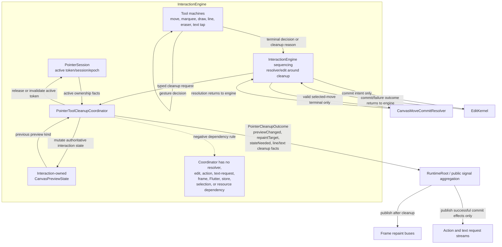

# Design: PointerToolCleanupCoordinator

---
date: 2026-05-19
designer: Codex
commit: 4b6ba7d
branch: new-architecture
design_question: "Design an internal PointerToolCleanupCoordinator that centralizes pointer-tool cleanup behavior across cancel, dispose, load success, mode/tool change, interactive=false, stale terminal, invalid terminal, and no-op terminal paths before the interaction implementation."
---

## Disposition

READY_FOR_CONTRACT

## Product Outcome

Pointer-tool cleanup should have one internal policy owner before move, draw,
eraser, line, marquee, and text-request interactions are implemented. Tool code
will recognize gestures and create terminal commit intents; the shared cleanup
coordinator will close owned interaction state, clear or preserve preview state
according to ownership, classify repaint targets, and return cleanup effects for
the runtime to publish in the documented order.

This is not a public API change. The coordinator must not become a second store
for pointer, preview, line, or text state, and it must not call move resolvers,
open edits, emit user actions, emit text requests, or publish runtime state
directly.

## Target Contract Classification

- Profile: `REFACTOR`
- Obligations: `SEAM_MIGRATION`

`REFACTOR` is the primary profile because the expected public behavior is already
specified by the interaction contracts and diagrams; the design changes internal
ownership and dependency shape. `SEAM_MIGRATION` is required because repeated
cleanup logic in tool machines should move behind one interaction-owned cleanup
seam while tool-specific gesture recognition and commit-intent construction stay
with the tool machines.

## Research Inputs

- `docs/history/research/2026-05-19-pointer-tool-cleanup-coordinator.md` - supplied factual
  map of documented cleanup paths, legacy cleanup distribution, repaint targets,
  token-owned pending line behavior, existing tests, and audit patterns.

## Repository Evidence

- `docs/README.md:3` - `docs/` is the durable source of truth for the
  new-engine transition and target architecture.
- `docs/README.md:35` - role-based files and `_registry/sections.yaml` are the
  active documentation source of truth.
- `docs/history/research/2026-05-19-pointer-tool-cleanup-coordinator.md:13` - the new
  architecture documents cleanup as a shared pointer-session concern plus
  tool-specific cleanup states, but no durable `docs/` source-of-truth
  `PointerToolCleanupCoordinator` symbol was found in the inspected docs.
- `todo.md:143` - the root backlog mentions introducing
  `PointerToolCleanupCoordinator`.
- `todo.md:177` - the root backlog proposes the `PointerToolCleanupCoordinator`
  name; this is product context, not the durable architecture source of truth.
- `docs/history/research/2026-05-19-pointer-tool-cleanup-coordinator.md:15` - legacy cleanup
  is distributed across draw coordination, terminal routing, line pending state,
  move terminal handling, runtime interruption, pointer-session detach, and event
  dispatch.
- `docs/history/research/2026-05-19-pointer-tool-cleanup-coordinator.md:17` - legacy
  verification covers cleanup after thrown commits, action emission failure,
  token-owned line cleanup, move cancel, marquee restore, dispose fail-fast, and
  zero-preview terminal no-repaint cases.
- `docs/architecture/01_runtime_ownership.md:58` - `InteractionEngine` owns
  pointer sessions, tools, preview state, terminal commit requests, and
  interaction request guard facts.
- `docs/architecture/01_runtime_ownership.md:89` - gesture decisions may need
  committed facts such as controller epoch, selection ids, movable flags, text
  snapshots, and bounds.
- `docs/architecture/01_runtime_ownership.md:91` - document facts enter
  `InteractionEngine` only through narrow read-only interaction query boundaries.
- `docs/architecture/01_runtime_ownership.md:94` - query boundaries return
  immutable, batched, intent-specific facts and never expose store tables,
  selection internals, or mutation methods.
- `docs/architecture/01_runtime_ownership.md:96` - committed mutations requested
  by interaction still go through `EditKernel`.
- `docs/architecture/02_package_boundaries.md:82` - the target interaction
  package layout currently lists `interaction_engine.dart`,
  `interaction_request_registry.dart`, `pointer_session.dart`, and the tool
  machine files under `lib/src/interaction/**`.
- `docs/architecture/02_package_boundaries.md:221` - interaction code may not
  import, read, or mutate concrete store or selection owner internals directly.
- `docs/architecture/02_package_boundaries.md:231` - committed document facts and
  runtime selection facts used by interaction are supplied through narrow
  read-only query ports.
- `docs/contracts/interaction_engine.md:107` - terminal admission requires the
  active pointer token and current `controllerEpoch`; stale token or epoch
  mismatch may clean up only and cannot create a commit intent.
- `docs/contracts/interaction_engine.md:118` - `InteractionEngine` commits only
  through `EditKernel`.
- `docs/contracts/interaction_engine.md:120` - preview changes publish sealed
  `CanvasPreviewState` variants and `state.revisions.preview`.
- `docs/contracts/interaction_engine.md:122` - cleanup that is already a no-op
  publishes no new public state snapshot.
- `docs/contracts/interaction_engine.md:134` - `interactive=false` cancels only
  an active routed pointer session.
- `docs/contracts/interaction_engine.md:135` - pending line start or preview state
  not owned by an active routed pointer session is preserved until an owning
  cleanup path.
- `docs/contracts/interaction_engine.md:138` - if cancellation clears
  pointer-owned preview, runtime publishes one state snapshot with an updated
  preview revision.
- `docs/contracts/interaction_engine.md:144` - `InteractionEngine` is the only
  producer of public preview variants.
- `docs/contracts/interaction_engine.md:150` - preview variants map to overlay or
  main-scene repaint targets.
- `docs/diagrams/state_pointer_session.mmd:99` - cleanup-only paths include
  cancel, load success, mode change, active-pointer `interactive=false`, dispose,
  stale terminal, invalid terminal, no-op, and non-committing paths.
- `docs/diagrams/state_pointer_session.mmd:103` - cleanup-only paths clear
  preview/session state only.
- `docs/diagrams/state_pointer_session.mmd:104` - the selected-move resolver is
  not called on cancel, load, mode, `interactive=false`, or dispose paths.
- `docs/diagrams/state_pointer_session.mmd:111` - preview/session cleanup
  completes and the active token is released before public runtime state, action,
  or repaint effects are published.
- `docs/diagrams/state_pointer_session.mmd:118` - after close, cleanup is
  classified by the cleared preview kind.
- `docs/diagrams/state_pointer_session.mmd:120` - selected-move cleanup uses the
  main-scene cleanup target, overlay preview cleanup uses overlay, and no-preview
  cleanup requests no repaint.
- `docs/diagrams/state_selected_move.mmd:78` - selected-move resolver output can
  route `CanvasMoveCancel` into resolver cleanup after a valid resolver gate.
- `docs/diagrams/state_selected_move.mmd:83` - resolver exceptions and invalid
  committed deltas enter resolver error cleanup after the resolver has already
  been called.
- `docs/diagrams/state_selected_move.mmd:127` - selected move has a pre-resolver
  cleanup state for cancel, mode change, load success, `interactive=false`, stale
  terminal, invalid terminal, zero move, empty movable set, and admission no-op.
- `docs/diagrams/state_selected_move.mmd:129` - selected-move pre-resolver
  cleanup paths have not called the resolver or opened an edit and emit no
  action.
- `docs/diagrams/state_selected_move.mmd:164` - selected-move cleanup clears the
  move preview/session, advances preview revision only when an active preview
  existed, and queues main-scene cleanup repaint.
- `docs/diagrams/state_select_marquee.mmd:114` - marquee cleanup clears overlay
  preview/session state only for cancel, mode, `interactive=false`, load success,
  dispose, stale terminal, invalid terminal, no-op, and edit failure paths.
- `docs/diagrams/state_select_marquee.mmd:125` - marquee cleanup requests overlay
  repaint only and never uses selected-move resolver or main-scene preview
  cleanup.
- `docs/diagrams/state_pencil_marker_draw.mmd:117` - pencil/marker cleanup-only
  paths clear only stroke preview and active stroke session.
- `docs/diagrams/state_pencil_marker_draw.mmd:145` - pencil/marker cleanup uses
  overlay repaint only and does not use selected-move resolver or main-scene
  cleanup.
- `docs/diagrams/state_two_tap_line.mmd:26` - pending line state outlives
  unrelated pointer-session terminal cleanup and `interactive=false` when no
  active routed pointer owns it.
- `docs/diagrams/state_two_tap_line.mmd:37` - cancel, mode/tool change, or
  loadDocument success clear pending line state.
- `docs/diagrams/state_two_tap_line.mmd:39` - `interactive=false` with no active
  routed pointer preserves pending line state and disables future routing only.
- `docs/diagrams/state_two_tap_line.mmd:110` - line cleanup-only paths clear
  pending start and overlay preview only, with no document effect, drawLine
  action, spatial delta, projection eviction, or main-scene preview.
- `docs/diagrams/state_eraser.mmd:111` - eraser cleanup-only paths include
  cancel, mode change, load success, `interactive=false`, dispose, stale or
  invalid terminal, empty erased ids, budget exceeded, and edit failure.
- `docs/diagrams/state_eraser.mmd:117` - eraser empty/no-op cleanup publishes no
  erase action or document state.
- `docs/diagrams/state_pending_text_edit_request.mmd:120` - text-request cleanup
  clears pending tap history only.
- `docs/diagrams/state_pending_text_edit_request.mmd:123` - text-request cleanup
  publishes no text request, action event, document revision, selection change,
  preview update, spatial update, projection eviction, or repaint.
- `docs/contracts/load_document.md:45` - P6 owns only the minimal early
  interaction boundary needed by staged replacement.
- `docs/contracts/load_document.md:49` - prepared load success requests
  interrupt/preview cleanup and may clear active preview state and pointer
  normalization facts.
- `docs/contracts/load_document.md:52` - the load interrupt boundary must not
  execute terminal resolver or commit paths.
- `docs/contracts/load_document.md:59` - successful load validation and
  materialization precede active interaction interrupt.
- `docs/contracts/load_document.md:76` - load publishes one runtime state after
  install.
- `docs/contracts/public_api_v1.md:449` - `CanvasRuntimeState` is atomic from the
  public API perspective.
- `docs/contracts/public_api_v1.md:514` - `interactive=false` disables pointer
  routing on `CanvasSurface` only.
- `docs/contracts/public_api_v1.md:517` - when `interactive` changes from true to
  false during an active pointer session, `CanvasSurface` routes cancel cleanup
  before disabling further routing.
- `docs/contracts/public_api_v1.md:519` - pending preview state not owned by an
  active routed pointer session is preserved when `interactive` becomes false.
- `docs/contracts/public_api_v1.md:1692` - pointer position is finite for
  down/move, while invalid terminal samples are routed to cleanup logic.
- `docs/contracts/public_api_v1.md:1698` - pointer id is only for routing samples
  and rejecting stale terminal samples.
- `docs/contracts/public_api_v1.md:1843` - `CanvasPreviewState` is a sealed public
  preview union.
- `docs/contracts/public_api_v1.md:2010` - preview state variants are the only
  valid preview payload shapes.
- `docs/contracts/public_api_v1.md:2014` - selected ids, pointer tokens, active
  pointer ids, and session ids are not public preview payload.
- `docs/diagrams/dfd_pointer_preview_commit.mmd:89` - terminal same-token up
  creates a terminal commit intent path.
- `docs/diagrams/dfd_pointer_preview_commit.mmd:90` - cancel terminal or external
  cancellation creates a cancel intent path.
- `docs/diagrams/dfd_pointer_preview_commit.mmd:91` - cancel intent discards
  preview without document mutation.
- `docs/diagrams/dfd_pointer_preview_commit.mmd:92` - terminal cleanup produces
  `CanvasNoPreview` and preview revision only when active preview existed.
- `docs/diagrams/dfd_pointer_preview_commit.mmd:93` - terminal cleanup also
  exposes the active preview kind.
- `docs/diagrams/dfd_pointer_preview_commit.mmd:94` - selected move cleanup maps
  to main repaint and overlay preview cleanup maps to overlay repaint.
- `docs/verification/guardrails.md:181` - interaction must use `EditKernel` and
  narrow read-only query ports, not concrete store imports or mutations.
- `docs/verification/guardrails.md:183` - selected-move resolver is not called on
  cancel, load, mode-change, `interactive=false`, stale terminal, or dispose
  paths.
- `docs/verification/guardrails.md:184` - stale or epoch-mismatched terminal
  samples cannot create commit intent.
- `docs/verification/guardrails.md:210` - Flutter surface adapters pass only
  normalized finite pointer samples into runtime routing.
- `docs/verification/guardrails.md:211` - `interactive=false` cancels active
  routed pointers, preserves non-owned pending line state, and does not mutate
  runtime mode, committed document, selection, or resources.
- `docs/verification/tests.md:439` - preview public-state tests must prove
  preview-only pointer changes publish `state.revisions.preview` without changing
  other revision domains or emitting action events.
- `docs/verification/tests.md:443` - cleanup against already-empty preview state
  is public-state silent.

## Design Form Candidates

### Candidate A. Interaction-owned cleanup coordinator with effect-only outcome

- Form: add an internal `PointerToolCleanupCoordinator` under
  `lib/src/interaction/**`, owned and composed by `InteractionEngine`. Tool
  machines submit typed cleanup requests; the coordinator applies cleanup to the
  single interaction-owned state graph and returns a `PointerCleanupOutcome` with
  preview change, repaint target, public-state need, token/session release facts,
  and pending-line/text-history cleanup facts.
- Why it could work: it matches `InteractionEngine` ownership of pointer
  sessions, tools, preview state, terminal commit requests, and request guard
  facts; it centralizes the documented cleanup-only paths; it can classify
  selected-move main-scene cleanup versus overlay cleanup from the single public
  preview kind; and it can avoid resolver, edit, action, or text-request side
  effects by not depending on those collaborators.
- Gate failures or risks: the future contract must state that the coordinator is
  not a state cache. It must mutate or clear only the authoritative
  interaction-owned state passed by the engine/tool machines, not mirror that
  state into a second cleanup model.

### Candidate B. Put cleanup ownership into `PointerSession`

- Form: make `pointer_session.dart` own cleanup across every tool, including
  preview clearing, pending line preservation, selected-move repaint selection,
  text-tap cleanup, and terminal no-op cleanup.
- Why it could work: pointer token admission and stale terminal rejection are
  already generic pointer-session concerns.
- Gate failures or risks: this gives a routing/token object too much tool
  knowledge. It would need to understand selected move, marquee, draw, line,
  eraser, and text pending state despite those responsibilities living in tool
  machines and `InteractionEngine`. It also makes pending line preservation and
  text tap cleanup look like pointer routing facts rather than interaction
  cleanup policy.

### Candidate C. Keep cleanup local in each tool machine plus tests

- Form: each tool machine implements its own cancel, dispose, load, mode,
  `interactive=false`, stale terminal, invalid terminal, no-op terminal, and edit
  failure cleanup, while shared tests and guardrails catch drift.
- Why it could work: it preserves maximal local readability for each state
  machine and avoids another internal file.
- Gate failures or risks: it does not fix the root cause. The same cleanup
  invariants would be repeated across selected move, marquee, pencil, marker,
  line, eraser, and text request handling. Tests would detect only sampled drift,
  while future tool code could still call a resolver, emit an action, or publish
  the wrong repaint target before cleanup.

### Candidate D. Let `RuntimeRoot` or public signal aggregation own cleanup

- Form: tool machines report cancellation or terminal outcomes to `RuntimeRoot`;
  runtime/public-state aggregation clears previews, releases sessions, and
  decides repaint targets while publishing state.
- Why it could work: cleanup effects ultimately become public state and repaint
  signals, and load/dispose orchestration is runtime-owned.
- Gate failures or risks: it mixes interaction-owned transient state with public
  publication. It also risks violating the documented order that cleanup and
  active-token release happen before public state, action, or repaint effects are
  published, and would pull tool-session knowledge out of `InteractionEngine`.

## Known Future Pressures

| Pressure | Evidence | How the selected form responds | Accepted cost or risk |
|---|---|---|---|
| P10-P12 implement interaction slices in sequence, so cleanup decisions made for selected move/marquee will be reused by draw, line, eraser, and text. | `docs/implementation/p10_selection_and_move.md:16`; `docs/implementation/p11_draw_tools.md:28`; `docs/implementation/p12_eraser_and_context_action_request.md:31` | Introduce the coordinator with P10 pointer-session/move work, then require P11 and P12 tool machines to route cleanup through the same seam. | P10 gets a slightly wider internal scope, but later tool phases avoid duplicating policy. |
| `interactive=false` must cancel active routed sessions while preserving pending line state not owned by the active session. | `docs/contracts/public_api_v1.md:517`; `docs/contracts/public_api_v1.md:519`; `docs/diagrams/state_two_tap_line.mmd:26`; `docs/diagrams/state_two_tap_line.mmd:39` | Cleanup requests must carry both reason and ownership context. `interactiveDisabledActiveSession` may clear only active pointer-owned state; mode/tool, successful load, dispose, terminal line, and explicit line-owned cleanup may clear pending line. | The request type is more explicit than a generic `cleanup()` call, but it prevents accidental pending-line loss. |
| Selected move cleanup uses main-scene repaint while all other pointer preview cleanup uses overlay or no repaint. | `docs/contracts/interaction_engine.md:150`; `docs/diagrams/state_selected_move.mmd:164`; `docs/diagrams/dfd_pointer_preview_commit.mmd:94` | The coordinator classifies cleanup target from the cleared preview kind before changing it to `CanvasNoPreview`. | The coordinator must capture previous preview kind as part of cleanup outcome before clearing state. |
| Cleanup must finish before public state, action, repaint, stream close, or load publication effects become visible. | `docs/diagrams/state_pointer_session.mmd:111`; `docs/contracts/load_document.md:76`; `docs/diagrams/seq_dispose_during_gesture.mmd:76`; `docs/diagrams/seq_dispose_during_gesture.mmd:82` | The coordinator returns an effect-only outcome. `InteractionEngine`/`RuntimeRoot` aggregate and publish after cleanup has already closed state and released tokens. | The outcome type must be complete enough that later publication code does not re-read stale active session state. |
| Resolver calls are legal only on valid selected-move terminal up paths. | `docs/diagrams/state_selected_move.mmd:69`; `docs/diagrams/state_selected_move.mmd:73`; `docs/diagrams/state_selected_move.mmd:78`; `docs/diagrams/state_selected_move.mmd:83`; `docs/verification/guardrails.md:183` | The coordinator must not receive a resolver dependency. Resolver invocation remains in the selected-move terminal decision path before any resolver-result cleanup request. | Resolver error cleanup still needs a coordinator path, but only after the resolver has already thrown or returned a cancellation. |
| Cleanup-only paths must not emit user actions or text edit requests. | `docs/diagrams/state_selected_move.mmd:129`; `docs/diagrams/state_eraser.mmd:117`; `docs/diagrams/state_pending_text_edit_request.mmd:123`; `docs/verification/tests.md:439` | The coordinator must not receive action dispatch or text-request stream dependencies and must return cleanup facts only. User-action publication remains tied to successful `EditKernel` outcomes outside the cleanup-only path. | Future tests must prove action/text streams stay silent on every cleanup reason, not just common cancel paths. |
| Current target package layout has tool machines but no cleanup coordinator file. | `docs/architecture/02_package_boundaries.md:82` | Future source-of-truth docs should add `pointer_tool_cleanup_coordinator.dart` under `lib/src/interaction/**` and describe its ownership. | The design cannot edit durable docs now; the future Change Contract must include docs/diagram updates. |
| Existing guardrails already cover no resolver on cancel and stale terminal no commit, but not "all cleanup paths use the coordinator." | `docs/verification/guardrails.md:183`; `docs/verification/guardrails.md:184` | The future contract should add either a structural guardrail or an interaction-state-machine test that fails when tool machines bypass the coordinator for preview/session cleanup. | A structural guardrail may require a small scanner once production interaction files exist. |

## Selected Form

Select Candidate A: an interaction-owned `PointerToolCleanupCoordinator` with
typed cleanup requests and an effect-only outcome.

The coordinator should be composed inside `InteractionEngine` and placed under
`lib/src/interaction/pointer_tool_cleanup_coordinator.dart`. It is an internal
policy seam, not a public API type and not a new state owner. It applies cleanup
to the authoritative interaction-owned state already held by `InteractionEngine`
and the tool machines: active pointer session, preview snapshot, selected-move
session/delta, marquee state, stroke draft, line pending/preview state, eraser
corridor/candidates, and pending text tap history.

The coordinator owns these policies:

- recognize cleanup reason categories: cancel, dispose, prepared load success,
  mode/tool change, active-session `interactive=false`, stale terminal, invalid
  terminal, no-op terminal, resolver cancel, resolver error, edit failure, and
  post-successful-commit cleanup;
- clear active preview/session state only when it is owned by the active cleanup
  request;
- preserve pending line state when `interactive=false` disables routing without
  an active routed pointer owning that pending line;
- clear pending line only for line-owned cleanup, mode/tool change, successful
  load, dispose, or terminal line decision;
- clear pending text tap history without producing preview, repaint, action, or
  text request effects;
- change public preview to `CanvasNoPreview` and advance preview revision only
  when the previous visible preview or pending preview state actually changed;
- classify cleanup repaint target from the previous preview kind before clearing
  it: selected move maps to main scene, overlay preview variants map to overlay,
  and no visible preview maps to no repaint;
- release or invalidate the active token/session before any public state, action,
  or repaint effect is published;
- return an outcome that records cleanup facts but does not publish them.

The coordinator must not own these responsibilities:

- gesture recognition;
- final terminal normalization;
- selected-move resolver invocation;
- hit testing, spatial candidate selection, or exact eraser checks;
- creating commit intents;
- opening `EditKernel` sessions;
- direct document, selection, or resource mutation;
- public runtime-state publication;
- repaint bus notification;
- user-action event emission;
- `CanvasTextEditRequested` emission.

Tool machines remain responsible for recognizing gestures and producing either a
commit intent or a typed cleanup request. `InteractionEngine` remains responsible
for sequencing resolver and edit paths around the coordinator: valid commit paths
may call the resolver or `EditKernel`, then must call the coordinator before
publishing successful commit effects; cleanup-only paths call the coordinator
without resolver, edit, action, or text-request dependencies.

## Hard Gate Check

| Gate | Result | Evidence |
|---|---|---|
| Root cause | pass | Repeated cleanup paths exist across generic and tool-specific diagrams, while no durable `docs/` source-of-truth coordinator exists today: `docs/README.md:3`; `docs/README.md:35`; `docs/history/research/2026-05-19-pointer-tool-cleanup-coordinator.md:13`. The non-normative root backlog already names `PointerToolCleanupCoordinator` as product context: `todo.md:143`; `todo.md:177`. Tool cleanup repetitions are visible in `docs/diagrams/state_selected_move.mmd:127`, `docs/diagrams/state_select_marquee.mmd:114`, `docs/diagrams/state_pencil_marker_draw.mmd:117`, `docs/diagrams/state_two_tap_line.mmd:110`, and `docs/diagrams/state_eraser.mmd:111`. |
| Ownership | pass | `InteractionEngine` owns pointer sessions, tools, preview state, terminal commit requests, and interaction request guard facts: `docs/architecture/01_runtime_ownership.md:58`. |
| Source of truth | pass | The coordinator does not store duplicate state; preview variants remain the only public payload shapes, and pointer/session ids are not public preview payload: `docs/contracts/public_api_v1.md:2010`; `docs/contracts/public_api_v1.md:2014`. |
| Boundary | pass | Entry boundaries are pointer handling, load success interrupt, mode/tool change, `interactive=false`, and dispose; invalid terminal samples route to cleanup: `docs/contracts/public_api_v1.md:517`; `docs/contracts/public_api_v1.md:1692`; `docs/contracts/load_document.md:49`. Exit is an effect-only cleanup outcome consumed before public publication: `docs/diagrams/state_pointer_session.mmd:111`. |
| Dependency direction | pass | Interaction code may not import concrete store or selection internals; committed facts use narrow query ports and mutations go through `EditKernel`: `docs/architecture/02_package_boundaries.md:221`; `docs/architecture/02_package_boundaries.md:231`; `docs/architecture/01_runtime_ownership.md:96`. |
| State/data | pass | Preview changes publish `state.revisions.preview`; no-op cleanup is public-state silent; pending non-owned line state is preserved: `docs/contracts/interaction_engine.md:120`; `docs/contracts/interaction_engine.md:122`; `docs/contracts/interaction_engine.md:135`. |
| Seam | pass | The successor seam is `PointerToolCleanupCoordinator`; consumers are P10 selected move/marquee first, then P11 draw/line, then P12 eraser/text. Retirement gate: no tool machine may directly publish cleanup effects or clear preview/session state outside the coordinator except through private state primitives owned by the coordinator call. |
| Verification | pass | Existing planned tests and guardrails prove preview revision isolation, no action on preview-only changes, empty cleanup silence, no resolver on cancel paths, stale terminal no commit, and `interactive=false` pending-line preservation: `docs/verification/tests.md:439`; `docs/verification/tests.md:443`; `docs/verification/guardrails.md:183`; `docs/verification/guardrails.md:184`; `docs/verification/guardrails.md:211`. |
| Future pressure | pass | P10-P12 phase ordering creates reuse pressure, but adding the coordinator in P10 lets later tool phases consume it: `docs/implementation/p10_selection_and_move.md:16`; `docs/implementation/p11_draw_tools.md:28`; `docs/implementation/p12_eraser_and_context_action_request.md:31`. |

## Lock-Required Facts

- Owner: `InteractionEngine`.
- Owning layer/module/document family: `lib/src/interaction/**` and
  `section_14_interaction_engine`.
- Seam: internal `PointerToolCleanupCoordinator` invoked by
  `InteractionEngine`/tool machines for cleanup-only, edit-failure, resolver
  cancellation/error, and post-commit cleanup paths.
- Dependency/import direction: the coordinator may depend on interaction state
  models and public API preview types, but must not depend on concrete store,
  concrete selection owner, resolver callback, `EditKernel`, action dispatcher,
  text request stream, frame engine, Flutter surface, or resource resolver.
- State/data ownership: active token/session and controllerEpoch remain pointer
  session facts; tool machines own gesture-specific draft/session data; public
  preview remains the interaction-owned sealed preview snapshot; the coordinator
  owns cleanup policy and outcome calculation only.
- Entry boundaries: pointer cancel; invalid/stale terminal cleanup; no-op
  terminal cleanup; mode/tool change; active-session `interactive=false`;
  prepared load success interrupt; dispose; selected-move resolver cancel/error;
  edit failure; post-successful-commit cleanup.
- Exit boundaries: `PointerCleanupOutcome` with previous preview kind, preview
  changed flag, public-state need, repaint target, active token/session release
  fact, pending line cleared/preserved fact, pending text tap cleared fact, and
  dispose/load sequencing notes.
- File placement basis: target package layout already owns interaction files
  under `lib/src/interaction/**`; future docs should add
  `pointer_tool_cleanup_coordinator.dart` beside `pointer_session.dart` and the
  tool machines.
- Execution order constraints: cleanup and active token release precede public
  runtime state, action, or repaint publication; load success cleanup happens
  after preparation succeeds and before install, while public state publishes only
  after install; dispose cleanup publishes any required preview cleanup before
  stream close and disposed transition.
- Rejected alternatives: `PointerSession` as tool cleanup owner; per-tool
  duplicate cleanup; `RuntimeRoot`/public signal aggregation as cleanup owner.
- Verification strategy: behavior tests for every cleanup reason, repaint target,
  preview revision change/no-change, line preservation, no resolver call, no user
  action/text request, and stale terminal no commit; structural guardrail or
  scanner once production tool machines exist.

## Diagram Need Assessment

| Design question | Needed? | Diagram kind | Reason |
|---|---:|---|---|
| Does the design change ownership, layer, package, or component boundaries? | yes | c4 | The design adds a new internal interaction seam and assigns cleanup ownership away from individual tool machines. |
| Does it change data flow, state ownership, cache ownership, resource movement, or lifecycle movement? | yes | data_flow | Cleanup now flows through one coordinator outcome before runtime publication; no cache/resource ownership changes. |
| Does it depend on call order, lifecycle order, sync/async ordering, failure ordering, or migration order? | yes | sequence | The key invariant is cleanup/token release before public state, actions, repaint, stream close, or load publication. |
| Does it introduce or alter modes, statuses, terminal states, sessions, or transition rules? | no | none | Existing terminal states and transition semantics are preserved; only the internal owner of cleanup policy changes. |
| Does it create, replace, migrate, or retire a shared seam? | yes | c4/data_flow | It creates a new cleanup seam and retires duplicate cleanup policy inside tool machines. |
| Does it change public API consumer flow, payload shape, or compatibility behavior? | no | none | `CanvasPreviewState`, `CanvasRuntimeState`, pointer APIs, action events, and text requests keep their documented public shape. |
| Does it introduce or change analyzer, guardrail, or structural-recognition pipeline behavior? | no | none | A future guardrail is recommended, but this design does not define the scanner pattern yet. |

## Provisional Diagrams

This provisional diagram answers the ownership/data-flow question. A future
Change Contract should update durable diagrams instead of preserving this sketch
as source of truth.

## Source-Of-Truth Impact

A later Change Contract should update these durable sources, if the coordinator
is implemented:

- `docs/architecture/01_runtime_ownership.md` - describe the coordinator as an
  internal `InteractionEngine` cleanup policy seam, not a new public/runtime
  owner.
- `docs/architecture/02_package_boundaries.md` - add
  `pointer_tool_cleanup_coordinator.dart` under `lib/src/interaction/**`.
- `docs/contracts/interaction_engine.md` - name the coordinator in the pointer
  session lifecycle and cleanup-only rules.
- `docs/diagrams/dfd_pointer_preview_commit.mmd` - route cleanup-only, terminal
  failure, and post-edit cleanup through the coordinator before public effects.
- `docs/diagrams/state_pointer_session.mmd` - clarify that cleanup states delegate
  to the coordinator for preview/session close and cleanup-target classification.
- `docs/diagrams/state_selected_move.mmd`,
  `docs/diagrams/state_select_marquee.mmd`,
  `docs/diagrams/state_pencil_marker_draw.mmd`,
  `docs/diagrams/state_two_tap_line.mmd`,
  `docs/diagrams/state_eraser.mmd`, and
  `docs/diagrams/state_pending_text_edit_request.mmd` - remove duplicated cleanup
  policy wording where possible and point to the shared cleanup seam while
  preserving tool-specific terminal/gesture rules.
- `docs/implementation/p10_selection_and_move.md`,
  `docs/implementation/p11_draw_tools.md`, and
  `docs/implementation/p12_eraser_and_context_action_request.md` - make coordinator use a
  phase requirement and exit-gate proof.
- `docs/verification/guardrails.md` and `docs/_registry/sections.yaml` - add or
  map a structural proof if the implementation contract chooses a durable
  `interaction.cleanup_paths_use_coordinator` guardrail.

Do not edit these durable files during this design step.

## Verification Impact

Future implementation should prove:

- every cleanup reason clears or preserves state according to ownership;
- cleanup against `CanvasNoPreview` is public-state silent;
- active preview cleanup advances preview revision exactly once;
- selected-move cleanup schedules main-scene repaint and not overlay repaint;
- overlay preview cleanup schedules overlay repaint and not main-scene repaint;
- pending line state is preserved for `interactive=false` when not owned by an
  active routed pointer session;
- mode/tool change, successful load, dispose, and terminal line decisions clear
  pending line when they own that cleanup;
- selected-move resolver is not called on cancel, load, mode/tool change,
  `interactive=false`, stale terminal, invalid terminal, zero move, empty movable
  set, no-op admission, or dispose;
- cleanup-only paths emit no user action and no text edit request;
- edit failure and resolver error still clean up owned preview/session before the
  runtime-safe error leaves the pointer boundary;
- load failure preserves active interaction state;
- load success performs cleanup after preparation succeeds and publishes one
  runtime state only after install;
- dispose publishes preview cleanup before stream close and repeated dispose is
  silent;
- tool machines cannot bypass the coordinator for preview/session cleanup once
  production files exist.

Proof surfaces should include `test/interaction/preview_public_state_test.dart`,
`test/interaction/eraser_context_action_routing_test.dart`,
`test/interaction/move_resolver_not_called_on_cancel_cleanup_test.dart`,
`test/interaction/no_stale_terminal_commit_test.dart`,
`test/flutter_bridge/interactive_false_active_session_cancel_test.dart`,
`test/flutter_bridge/interactive_false_pending_line_preserved_test.dart`,
`test/runtime/load_document_state_publication_test.dart`,
`test/runtime/dispose_lifecycle_test.dart`, and a structural guardrail or scanner
owned under `test/guardrails/**` plus reusable logic under `tool/guardrails/**`
if direct structural enforcement is added.

## Verification Strategy

Use behavior tests for state semantics and repaint/action effects, then add
structural proof only after production interaction files exist.

Behavior tests should cover a matrix of cleanup reason by active state:

- no preview;
- selected move preview;
- overlay preview;
- pending line not owned by an active routed pointer;
- pending line owned by the active line session;
- pending text tap candidate;
- resolver cancel/error after valid terminal entry;
- edit failure after a commit intent.

The tests should assert the public effects rather than implementation trivia:
`state.revisions.preview`, unchanged document/selection/resource/interaction
domains, no user action/text request, correct repaint target, active session
closed, and pending line preservation or clearing. The structural proof should
then assert that cleanup-capable tool machines call the coordinator for preview
and session cleanup instead of directly publishing cleanup effects.

## Change Contract Handoff

- Required profile: `REFACTOR`
- Required obligations: `SEAM_MIGRATION`
- Decisions to carry forward:
  - implement an internal `PointerToolCleanupCoordinator`;
  - place it under `lib/src/interaction/pointer_tool_cleanup_coordinator.dart`;
  - compose it inside `InteractionEngine`;
  - keep it out of the public barrel;
  - make tool machines produce typed cleanup requests and commit intents, not
    direct public cleanup effects;
  - make the coordinator return an effect-only outcome and avoid resolver, edit,
    action, text-request, frame, Flutter, store, selection, and resource
    dependencies;
  - classify repaint target from the previous preview kind before clearing;
  - preserve non-owned pending line on `interactive=false`;
  - clear pending text tap history without preview/repaint/action/text-request
    effects.
- Evidence to cite:
  - `docs/architecture/01_runtime_ownership.md:58`;
  - `docs/architecture/02_package_boundaries.md:82`;
  - `docs/contracts/interaction_engine.md:107`;
  - `docs/contracts/interaction_engine.md:120`;
  - `docs/contracts/interaction_engine.md:134`;
  - `docs/contracts/interaction_engine.md:150`;
  - `docs/diagrams/state_pointer_session.mmd:99`;
  - `docs/diagrams/state_pointer_session.mmd:111`;
  - `docs/diagrams/state_pointer_session.mmd:120`;
  - `docs/diagrams/state_selected_move.mmd:78`;
  - `docs/diagrams/state_selected_move.mmd:83`;
  - `docs/diagrams/state_selected_move.mmd:127`;
  - `docs/diagrams/state_two_tap_line.mmd:26`;
  - `docs/diagrams/state_pending_text_edit_request.mmd:120`;
  - `docs/contracts/load_document.md:49`;
  - `docs/contracts/load_document.md:76`;
  - `docs/verification/guardrails.md:183`;
  - `docs/verification/guardrails.md:211`;
  - `docs/verification/tests.md:439`;
  - `docs/verification/tests.md:443`.
- Contract constraints or sequencing facts:
  - introduce the coordinator with the first interaction implementation slice that
    owns generic pointer-session cleanup, likely P10;
  - migrate selected move and marquee cleanup first;
  - make P11 draw/line and P12 eraser/text consume the same coordinator instead
    of re-implementing cleanup policy;
  - update durable docs and diagrams in the same contract that introduces the
    production seam;
  - add tests before or alongside the first tool consumer so later tool work has a
    reusable proof surface.

## Open Decisions

None. The design is locked enough for Change Contract authoring.
