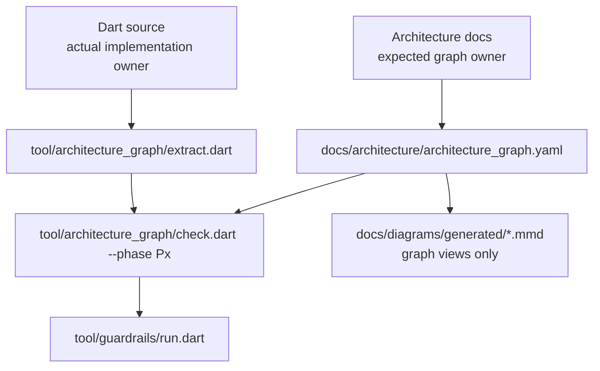
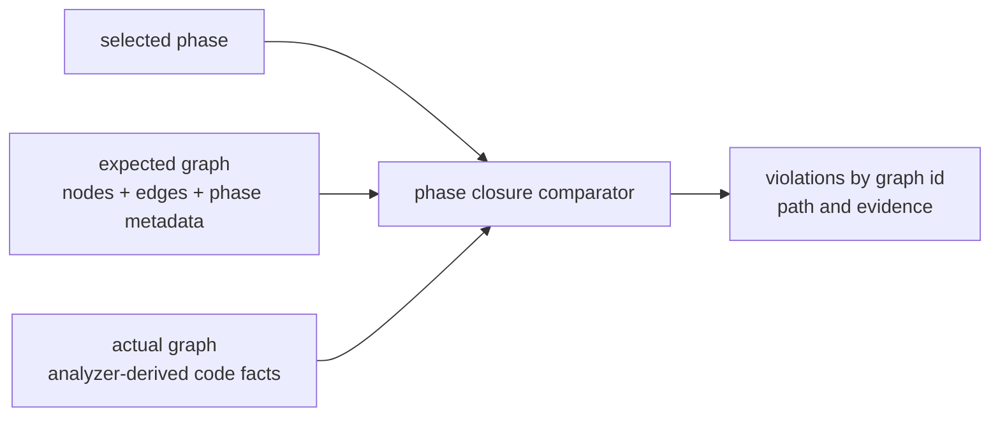
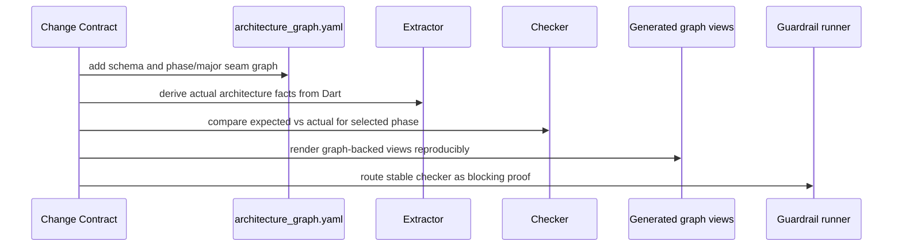
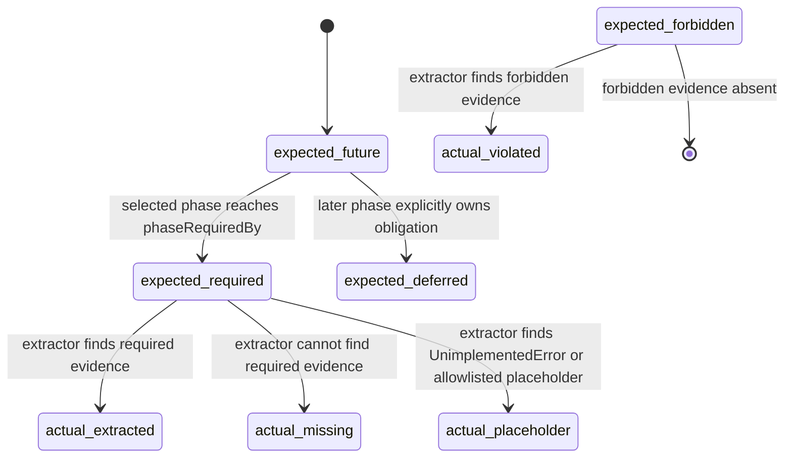

# Design: Architecture Graph Closure Checker

---
date: 2026-05-22
designer: Codex
commit: 591774dc
branch: new-architecture
design_question: "Design a project-wide machine-readable architecture graph and phase closure checker that prevents architecture drift such as implemented checks passing while required camera and codec diagnostics paths remain missing."
---

## Disposition

READY_FOR_CONTRACT

## Product Outcome

The project gets one phase-aware architecture contract that makes planned architecture, implemented seams, placeholders, forbidden dependencies, graph-backed diagram views, and phase closure gates comparable by tool. The expected graph is the machine-readable encoding of the repository's architecture SSOT for graph-checkable rules; it is not a report generated from code and not a replacement for code. It describes the architecture that code must satisfy, while an analyzer-backed extractor derives the actual implementation graph from source. The first implementation must use one uniform schema for P0-P14 and encode the planned phase owners, seams, forbidden dependencies, placeholders, and closure gates already present in the SSOT. More code-proven evidence may be available for already-closed phases during bootstrap, but that is an evidence availability limit, not a lower modeling-quality target for later phases.

Non-goals for the next contract: do not change production runtime behavior, do not fix the current camera or codec diagnostics drift in the graph-tooling slice, do not require every private helper import or call to be represented in the graph, do not let extracted actual code facts automatically rewrite expected graph obligations, do not claim that one architecture graph can generate every existing diagram kind, and do not make handwritten Mermaid diagrams the durable source of graph-checkable architecture truth.

## Target Contract Classification

- Profile: ANALYZER_RULE
- Obligations:
  - BUG_FIX
  - SEAM_MIGRATION

The future contract is primarily an analyzer/guardrail/tooling change because it adds structural recognition, expected-vs-actual comparison, and phase closure enforcement. It also has source-of-truth impact, but the proof owner is the executable architecture graph checker.

## Research Inputs

- `docs/history/research/2026-05-22-p0-p4-architecture-closure.md` - supplied fact input. It records that P0-P4 checks passed while two architecture drifts remained: codec failures bypass `DiagnosticsHub`, and `CanvasRuntime.camera` remained a P4 placeholder.

## Repository Evidence

- `docs/history/research/2026-05-22-p0-p4-architecture-closure.md:13` - P0-P4 are marked complete and the current code has the expected public API, runtime, codec, diagnostics, store, projection, read ports, and selection owners for the completed scope.
- `docs/history/research/2026-05-22-p0-p4-architecture-closure.md:15` - the normal verification stack passed despite the architecture drift.
- `docs/history/research/2026-05-22-p0-p4-architecture-closure.md:17` - the supplied research identifies the two current drifts: codec failures bypass diagnostics and runtime camera remains a P4 placeholder.
- `docs/history/research/2026-05-22-p0-p4-architecture-closure.md:23` - `PLAN.md` and linked step documents are the phase closure navigation source.
- `docs/history/research/2026-05-22-p0-p4-architecture-closure.md:39` - the schema v1 decoder imports public DTO/error/value owners and shared validation, not diagnostics.
- `docs/history/research/2026-05-22-p0-p4-architecture-closure.md:40` - schema v1 JSON decode currently throws `CanvasDataException` directly on malformed JSON or non-object input.
- `docs/history/research/2026-05-22-p0-p4-architecture-closure.md:150` - public edit interfaces exist but `CanvasRuntime.edits` remains a future placeholder, matching later-phase scope.
- `docs/history/research/2026-05-22-p0-p4-architecture-closure.md:151` - missing edit-core production components are future scope, not P0-P4 drift.
- `docs/history/research/2026-05-22-p0-p4-architecture-closure.md:158` - runtime state maps implemented domains while later owners remain absent or unimplemented in P0-P4.
- `docs/history/research/2026-05-22-p0-p4-architecture-closure.md:163` - actual code graph from symbols/imports contains current API, codec, diagnostics, runtime, selection, and store owners, while P5+ owners are absent.
- `PLAN.md:12` - step order defines intended implementation order.
- `PLAN.md:13` - detailed scope, closure rules, and verification live in linked step documents.
- `PLAN.md:15` - completed step contracts are historical and current navigation should use the current document map and active step contracts.
- `PLAN.md:23` - P0 package skeleton is checked complete.
- `PLAN.md:43` - P1 is checked complete.
- `PLAN.md:44` - P2 is checked complete.
- `PLAN.md:45` - P3 is checked complete.
- `PLAN.md:46` - P4 is checked complete.
- `docs/tool/check_docs.dart:1` - the docs checker is structural documentation checking only.
- `docs/tool/check_docs.dart:3` - it verifies documentation entrypoints, registries, navigation links, diagram catalog membership, and phase/read-first references.
- `docs/tool/check_docs.dart:5` - it explicitly must not add checks that match free-form Markdown wording, Mermaid edge text, or runtime architecture invariants.
- `docs/tool/check_docs.dart:6` - runtime architecture constraints belong in structured registries, generated documentation, analyzer/lint rules, Dart tests, or benchmarks.
- `docs/verification/guardrail_design_patterns.md:13` - guardrail design must choose the pattern from the invariant owner, not from easy syntax shape.
- `docs/verification/guardrail_design_patterns.md:16` - invariants encoded in a registry, phase file, or manifest should use parity checks against that source of truth.
- `docs/verification/guardrail_design_patterns.md:20` - exported API identity and indirection require analyzer resolution.
- `docs/verification/guardrail_design_patterns.md:22` - runtime behavior and state publication must be proven at the owning seam with Dart tests and dispatched by the guardrail runner.
- `docs/verification/guardrail_design_patterns.md:30` - the runner stays a dispatcher while shared scanners, manifests, and impact metadata may live under `tool/guardrails/**`.
- `docs/verification/guardrail_design_patterns.md:64` - fixed guardrail inventory plus fail-fast dispatcher is a proven pattern.
- `docs/verification/guardrail_design_patterns.md:65` - registry parity is the proven pattern for structured source-of-truth comparison.
- `docs/verification/guardrail_design_patterns.md:67` - resolved element identity is the proven pattern when real referenced symbols, owners, or source paths matter.
- `docs/verification/guardrails.md:98` - guardrails are blocking architecture and release rules.
- `docs/verification/guardrails.md:102` - `dart run tool/guardrails/run.dart` is the primary guardrail entrypoint.
- `docs/verification/guardrails.md:108` - a run without arguments executes the full blocking guardrail suite.
- `docs/verification/guardrails.md:109` - the runner is a thin dispatcher over existing proof commands and structural checks.
- `docs/verification/guardrails.md:110` - the runner must not become a second test framework or source of truth for required guardrails.
- `tool/guardrails/src/guardrail_registry.dart:8` - the current guardrail inventory is code-owned and queryable.
- `tool/guardrails/src/guardrail_registry.dart:23` - blocking guardrails are listed as fixed entries.
- `tool/guardrails/src/guardrail_executor.dart:42` - guardrails run through a single dispatcher function.
- `tool/guardrails/src/guardrail_executor.dart:71` - the runner can describe a guardrail route.
- `tool/guardrails/src/guardrail_executor.dart:77` - structural violation checks are already first-class guardrail routes.
- `tool/guardrails/src/guardrail_executor.dart:167` - proof tests are routed by guardrail id.
- `tool/guardrails/src/guardrail_executor.dart:223` - structural checks are routed by guardrail id.
- `docs/_registry/sections.yaml:29` - the architecture model section is already registry-owned.
- `docs/_registry/sections.yaml:33` - the architecture model feeds P0 and P4.
- `docs/_registry/sections.yaml:40` - the architecture model already references runtime/container/lifecycle diagrams.
- `docs/_registry/sections.yaml:45` - the architecture model owns current guardrails including single runtime root and selection separation.
- `docs/_registry/sections.yaml:160` - schema v1 contract has a registry entry.
- `docs/diagrams/README.md:87` - schema v1 decode/encode has a diagram catalog entry.
- `docs/diagrams/README.md:91` - that diagram relates to P3 and P14.
- `docs/diagrams/README.md:101` - cache invalidation has a diagram catalog entry.
- `docs/diagrams/README.md:105` - cache invalidation spans P4, P5, P6, P7, P8, P9, P13, and P14, proving that diagrams can intentionally include future scope.
- `docs/architecture/01_runtime_ownership.md:87` - runtime view camera is owned by `RuntimeRoot/CanvasCameraPort`.
- `docs/architecture/01_runtime_ownership.md:88` - runtime view camera is published through `state.revisions.viewCamera`.
- `docs/architecture/01_runtime_ownership.md:90` - runtime view camera does not dirty document state or invalidate `CanvasDocument` projection.
- `lib/src/api/canvas_runtime.dart:45` - `CanvasRuntime.camera` currently throws `UnimplementedError`.
- `tool/guardrails/src/public_api_placeholder_allowlist.dart:37` - `CanvasRuntime.camera` is allowlisted as a public API placeholder.
- `tool/guardrails/src/public_api_placeholder_allowlist.dart:38` - that placeholder is owned by P4.
- `docs/diagrams/dfd_schema_v1_decode_encode.mmd:86` - the target DFD routes unsupported-version codec failure to `DiagnosticRecord`.
- `docs/diagrams/dfd_schema_v1_decode_encode.mmd:89` - target codec failure records project through the sanitizer.
- `docs/diagrams/seq_schema_v1_decode_encode_order.mmd:23` - the target sequence diagram creates codec diagnostics for raw length or parse failures.
- `lib/src/codec/schema_v1_decoder.dart:54` - malformed JSON currently throws `CanvasDataException` directly.
- `docs/implementation/p14_benchmarks_diagrams_and_release_readiness.md:5` - P14 proves guardrails, diagrams, benchmarks, donor use, phase alignment, and release gates match the target architecture.
- `docs/implementation/p14_benchmarks_diagrams_and_release_readiness.md:11` - P14 includes required diagrams.
- `docs/implementation/p14_benchmarks_diagrams_and_release_readiness.md:14` - P14 includes benchmark baselines.
- `docs/implementation/p14_benchmarks_diagrams_and_release_readiness.md:24` - P14 depends on P0-P13 implementation phases being complete.
- `docs/implementation/p14_benchmarks_diagrams_and_release_readiness.md:104` - P14 proof includes tests and guardrails.
- `docs/implementation/p14_benchmarks_diagrams_and_release_readiness.md:109` - P14 proof includes the full blocking guardrail suite.
- `docs/_registry/sections.yaml:429` - operation matrix is a registry-owned section.
- `docs/contracts/operation_matrix.md:2` - the operation matrix document identifies itself as `section_13_operation_matrix`.
- `docs/verification/guardrails.md:166` - the `edit.operation_matrix_complete` guardrail requires executable assertions for every operation matrix row and effect dimension.

## Design Form Candidates

### Candidate A. Add targeted guardrails for the two known drifts

- Form: add one public-placeholder closure check for closed phases and one codec-diagnostics structural/behavioral check.
- Why it could work: it is the smallest direct repair for the two observed drift examples and fits the existing guardrail dispatcher.
- Gate failures or risks: it does not fix the root cause that architecture obligations live across plan docs, prose docs, diagrams, allowlists, and code. It would continue the pattern of adding isolated rules after each drift is found. It cannot generate durable diagrams or distinguish future-scope diagram content from current-phase obligations.

### Candidate B. Treat Mermaid diagrams as the source graph and compare code against parsed Mermaid

- Form: parse `docs/diagrams/*.mmd`, infer nodes/edges and phases from `docs/diagrams/README.md`, then compare actual code against those inferred edges.
- Why it could work: the current drift was discovered by comparing code against diagram flows, and P14 already requires diagram alignment.
- Gate failures or risks: repository rules reject free-form Mermaid edge text and runtime architecture invariants as docs-check input; those constraints must move into structured registries, generated docs, analyzer rules, tests, or benchmarks. Existing diagrams intentionally span future phases, so a direct diagram parser would either fail too early or need enough phase semantics to become a second graph format anyway. Mermaid is also weaker than YAML for status, required phase, forbidden edges, and evidence metadata.

### Candidate C. Add a phase-aware expected architecture graph plus analyzer-derived actual graph

- Form: create a structured expected graph under `docs/architecture/architecture_graph.yaml`, generate graph-backed architecture and diff views from it, extract an actual graph from Dart source using analyzer-backed recognition, and compare expected/current/future/forbidden obligations by selected phase.
- Why it could work: it moves architecture obligations into a structured source of truth, uses established guardrail patterns for registry parity and analyzer identity, preserves code as the source of implemented facts, and allows future nodes to exist without failing current phase checks.
- Gate failures or risks: this adds a new source-of-truth artifact that must be tightly scoped. If the checker requires every internal helper, import, field, or private call to be represented, it will become noisy and expensive. If generated views are positioned as replacements for all existing Mermaid diagrams, the graph will overclaim because sequence, lifecycle, state, and detailed data-flow diagrams encode ordering and behavioral semantics that a topology graph does not own. The first contract must therefore define graph coverage as architecture seams, public surface, owners, phase obligations, placeholders, forbidden edges, and graph-backed view facts, not exhaustive private implementation or all diagram semantics.

### Candidate D. Build a generated actual graph only and review diffs manually

- Form: generate actual Mermaid or JSON from analyzer output and rely on reviewers to compare it to docs and diagrams.
- Why it could work: it avoids a second expected registry and gives reviewers better visibility.
- Gate failures or risks: it is not a closure gate, cannot fail on missing required future/current obligations, cannot distinguish allowed placeholders from stale placeholders, and does not prevent the exact class of drift where tests are green but architecture intent is missing.

## Known Future Pressures

| Pressure | Evidence | How the selected form responds | Accepted cost or risk |
|---|---|---|---|
| Roadmap spans P0-P14, but P14 is release/measurement closure rather than a normal implementation owner | `docs/implementation/p14_benchmarks_diagrams_and_release_readiness.md:5`, `docs/implementation/p14_benchmarks_diagrams_and_release_readiness.md:24` | Model phases explicitly with phase kind and closure semantics. P0-P13 can own implementation nodes and edges; P14 can own measurement, diagram, benchmark, and final alignment obligations without making it a normal production component phase. | The graph schema must include phase metadata; relying only on lexicographic phase order is insufficient. |
| The graph must be an SSOT contract, not a hand-maintained code report | `docs/verification/guardrail_design_patterns.md:16`, `docs/verification/guardrail_design_patterns.md:65` | Populate expected graph obligations from repository SSOT artifacts: architecture docs, contracts, phase docs, operation matrix, guardrails, and diagram catalog phase metadata. The actual graph is extracted from code and compared against expected; it must not auto-update expected facts. | The graph must be changed only when the architecture SSOT changes or a phase contract adds/clarifies a graph-checkable architecture rule. |
| Existing diagrams intentionally contain future implementation scope | `docs/diagrams/README.md:105`, `docs/history/research/2026-05-22-p0-p4-architecture-closure.md:151` | Use `phaseIntroduced`, `phaseRequiredBy`, and `expectedStatus` on nodes/edges. Future nodes are visible in target diagrams but do not fail current-phase checks until required. | First graph authoring must classify future/deferred scope carefully to avoid false positives. |
| P5-P13 implementation owners are planned but not present in current code | `docs/history/research/2026-05-22-p0-p4-architecture-closure.md:151`, `docs/history/research/2026-05-22-p0-p4-architecture-closure.md:163` | Include P5-P13 planned owners and major seams in the graph as `expectedStatus: future` or `expectedStatus: deferred` with their own `phaseRequiredBy`. `check --phase P4` ignores their absence; `check --phase P5` or later starts enforcing only the obligations required by that selected phase. | Running the checker against a future phase before implementing that phase will fail by design. That is a useful planning signal, not a current-phase closure failure. |
| Current verification can be green while architecture drift remains | `docs/history/research/2026-05-22-p0-p4-architecture-closure.md:15`, `docs/history/research/2026-05-22-p0-p4-architecture-closure.md:17` | Make the checker a closure proof that fails when required graph obligations are missing, stale placeholders remain, or forbidden edges are present. | Initial rollout should intentionally report known P3/P4 drifts rather than silently suppress them. |
| Docs checker must stay structural and not absorb runtime invariants | `docs/tool/check_docs.dart:1`, `docs/tool/check_docs.dart:5`, `docs/tool/check_docs.dart:6` | Keep docs checking limited to registry/navigation symmetry. Put graph schema checks and generated graph-view reproducibility in the graph tool, and route closure through guardrails after stabilization. | Future contracts must avoid adding runtime edge checks to `docs/tool/check_docs.dart`. |
| Guardrail runner must stay a dispatcher, not a second framework | `docs/verification/guardrails.md:108`, `docs/verification/guardrails.md:109`, `docs/verification/guardrails.md:110` | Implement `tool/architecture_graph/check.dart --phase Px` as a strict standalone command first. Do not add it to the default blocking guardrail suite until the known P3/P4 drifts are fixed or the selected phase no longer includes known missing obligations. | The graph-tooling contract can be complete with a strict checker that reports known failures; blocking-suite integration is a later closure step after the code catches up. |
| Analyzer recognition can be noisy if it tries to model every implementation detail | `docs/verification/guardrail_design_patterns.md:20`, `docs/verification/guardrail_design_patterns.md:67` | Define extractor scope as architecture-level facts: exports, imports, declarations, implements, composition fields, placeholders, `UnimplementedError`, public exception throws, and stable delegations. Reject exhaustive helper-level graph closure. | Some code paths will remain outside graph coverage by design; this is acceptable when they are not architecture seams. |
| Existing diagram inventory has multiple semantic kinds that a topology graph cannot fully generate | `docs/implementation/p14_benchmarks_diagrams_and_release_readiness.md:49`, `docs/implementation/p14_benchmarks_diagrams_and_release_readiness.md:63`, `docs/implementation/p14_benchmarks_diagrams_and_release_readiness.md:79`, `docs/implementation/p14_benchmarks_diagrams_and_release_readiness.md:91` | Generate only graph-backed architecture/diff views from `architecture_graph.yaml`. Keep sequence, state, lifecycle, and detailed data-flow diagrams manually maintained or move them later to their own purpose-built structured manifests. | P14 diagram alignment remains broader than the graph checker. A later docs contract must define how manual diagrams link to graph ids without pretending the graph can render every behavior diagram. |

## Selected Form

Select Candidate C: a phase-aware expected architecture graph plus analyzer-derived actual graph, with graph-backed generated diagram views and a checker that compares expected and actual facts for a selected phase.

The expected graph is the only durable source for graph-checkable architecture obligations. It is not the only durable source for all diagram semantics. It should live at `docs/architecture/architecture_graph.yaml` because the architecture model is already registry-owned and feeds the roadmap, while P14 requires diagram and phase alignment. Code remains the source of implemented facts. The extractor must derive those facts from analyzer-backed Dart parsing and resolution where practical. The checker must compare these two worlds and report violations by graph id, file path, and evidence, but its first contract must keep coverage at architecture seams rather than every private code path.

The expected graph must be populated from existing SSOT rules, not from the current code shape. It should encode graph-checkable obligations already present in architecture docs, contracts, implementation phase documents, operation matrices, guardrail inventories, and diagram catalog phase metadata. Later graph edits are required only when the architecture SSOT changes or an active phase contract introduces or clarifies graph-checkable ownership, dependency, placeholder, forbidden-edge, or closure-gate rules. Normal code edits should change the actual graph extracted by tooling, not rewrite the expected graph.

The graph schema should include:

- `phases`: id, kind (`implementation`, `measurement`, `release_alignment`), order, closure source, and notes.
- `nodes`: id, kind, owner, `phaseIntroduced`, `phaseRequiredBy`, `expectedStatus` (`required`, `future`, `deferred`, `forbidden`), paths, sourceDocs, evidence, notes.
- `edges`: id, from, to, kind (`owns`, `imports`, `exports`, `delegates_to`, `reads_from`, `writes_to`, `reports_error_to`, `invalidates`, `publishes`, `forbids`), `phaseIntroduced`, `phaseRequiredBy`, `expectedStatus` (`required`, `future`, `deferred`, `forbidden`), sourceDocs, evidence, notes.
- checker output/diff facts: node or edge id, expected graph fact, extracted code evidence, `actualStatus` (`extracted`, `missing`, `placeholder`, `violated`), selected phase, and violation message.
- `coverage`: explicit seam-level scope for which actual code facts must be represented in the graph. This prevents the checker from requiring every helper-level edge.
- `diagramViews`: generated Mermaid view definitions for graph-backed architecture views such as full architecture, selected current phase, future target, and expected/actual diff. These are not replacements for all existing sequence, state, lifecycle, or detailed data-flow diagrams.

The actual graph extractor should initially recognize:

- public exports from the root barrel;
- imports and same-package relative import targets;
- class/interface declarations and implemented interfaces;
- constructors and public members relevant to public API placeholders;
- `UnimplementedError` and public API placeholders;
- direct `CanvasDataException` throws from architecture-sensitive owners such as codec;
- obvious composition fields and constructor initialization of owner seams;
- simple delegation calls where a public facade forwards to an owner field.

The checker should support `dart run tool/architecture_graph/check.dart --phase P4` and phase-aware comparison. Its rollout strictness is locked: the checker is strict for the selected phase and must not suppress known drift. Future phases are modeled in the same graph but are filtered by `phaseRequiredBy`.

- fail if a required node or edge with `phaseRequiredBy <= selectedPhase` is missing;
- fail if a forbidden edge is present;
- fail if a placeholder remains when its owner phase is closed, unless the graph explicitly marks the expected obligation as deferred to a later phase;
- fail if public API exposes a placeholder without graph-owned deferred expectation and phase evidence;
- fail if a graph-required docs/diagram/code path is missing for the selected phase;
- fail if an architecture seam exists in actual code but is not represented in the graph coverage scope;
- fail if a future component is required before its phase or P14 measurement status allows it.

For phases that are not yet implemented, graph entries use `expectedStatus: future` or `expectedStatus: deferred` and a later `phaseRequiredBy`. They appear in full/future graph views and in schema validation, but their absence in actual code is not a violation for earlier selected phases. A developer can intentionally run `check --phase P13` before P13 exists to see `actualStatus: missing` for planned work, but that failure must not be treated as P4 closure failure.

Rollout is also locked: the initial graph-tooling contract should create the strict standalone checker and prove that it reports the known P3/P4 failures. It should not wire that strict checker into the default blocking guardrail suite while those known failures remain in production. Blocking guardrail integration becomes a later contract step after the camera and codec diagnostics drift are fixed, or after the selected closure phase has no known graph violations.

The first future Change Contract should not require all P5-P13 implementation internals to be inferred from code before those phases exist. It should require uniform P0-P14 schema coverage from SSOT at the architecture-seam level. Already-closed phases may have richer verified evidence in the initial graph because implementation and research exist there, but that is a bootstrap limitation. As later phases become active or closed, their graph entries must reach the same enforceable quality as earlier phases.

## Hard Gate Check

| Gate | Result | Evidence |
|---|---|---|
| Root cause | pass | The known drift exists because current green checks do not compare phase-aware architecture obligations against code; research records green verification plus drift at `docs/history/research/2026-05-22-p0-p4-architecture-closure.md:15` and `docs/history/research/2026-05-22-p0-p4-architecture-closure.md:17`. |
| Ownership | pass | Expected architecture obligations are owned by `docs/architecture/architecture_graph.yaml`; actual implementation facts are owned by code; guardrail dispatch remains a runner responsibility per `docs/verification/guardrails.md:109`. |
| Source of truth | pass | The design creates one graph source for graph-checkable architecture obligations and generated graph views. Expected facts are populated from repository SSOT, while actual facts are extracted from code and never auto-promoted into expected obligations. It avoids using Mermaid as truth because `docs/tool/check_docs.dart:5` forbids that style of check. It does not claim ownership over all behavioral diagram semantics. |
| Boundary | pass | Entry boundary is the expected graph plus selected phase; extraction boundary is Dart source under analyzer; exit boundary is a checker report and graph-backed generated views. Existing guardrail patterns support registry parity and analyzer resolution at `docs/verification/guardrail_design_patterns.md:16` and `docs/verification/guardrail_design_patterns.md:20`. |
| Dependency direction | pass | Tooling reads docs and code; production code does not depend on graph tooling. The docs checker says runtime constraints belong in structured registries, analyzer/lint rules, Dart tests, or benchmarks at `docs/tool/check_docs.dart:6`. |
| State/data | pass | The graph is expected architecture data, generated graph-view Mermaid files are derived data, and extracted actual graph data is ephemeral tool output. Code remains the source of implemented behavior, and non-graph behavioral diagrams remain separate documentation artifacts. |
| Seam | pass | The selected form creates the `ExpectedArchitectureGraph -> ActualArchitectureGraph -> PhaseClosureChecker` seam. Manual diagrams may link to graph ids or coexist with generated graph views; retirement is not implied for sequence, state, lifecycle, or detailed data-flow diagrams without a later source-of-truth contract. |
| Verification | pass | Proof uses YAML schema validation, analyzer-backed extraction, graph parity checks, negative fixtures for forbidden/missing/placeholder cases, generated graph-view reproducibility checks, and guardrail runner integration. These match established patterns at `docs/verification/guardrail_design_patterns.md:64`, `docs/verification/guardrail_design_patterns.md:65`, and `docs/verification/guardrail_design_patterns.md:67`. |
| Future pressure | pass | P14 release alignment and benchmark scope is handled as phase metadata rather than implementation ownership, supported by `docs/implementation/p14_benchmarks_diagrams_and_release_readiness.md:5` and `docs/implementation/p14_benchmarks_diagrams_and_release_readiness.md:24`. Future implementation nodes remain visible but non-failing until their `phaseRequiredBy`. |

## Lock-Required Facts

- Owner: `docs/architecture/architecture_graph.yaml` owns expected/planned architecture graph obligations derived from repository SSOT; code owns actual implementation facts.
- Owning layer/module/document family: architecture docs own graph intent; `tool/architecture_graph/**` owns extraction, checking, report formatting, and graph-backed view generation.
- Seam: expected graph registry compared with analyzer-derived actual graph by selected phase.
- Dependency/import direction: tools may import analyzer/yaml and read docs/code; production `lib/**` must not import graph tooling.
- State/data ownership: expected graph is durable YAML populated from SSOT obligations; generated graph-view Mermaid files are derived artifacts; extracted actual graph is transient unless the contract explicitly writes a debug artifact under tool output. Existing non-graph diagrams retain their current document ownership until a separate contract changes them.
- Entry boundaries: `dart run tool/architecture_graph/check.dart --phase Px`; future generated graph-view command can be the same command or a sibling command under `tool/architecture_graph/`.
- Exit boundaries: clear report with graph node/edge ids, selected phase, source paths, and actual evidence; generated graph-view Mermaid under `docs/diagrams/generated/**` in the implementation contract.
- File placement basis: `docs/architecture/architecture_graph.yaml` because the architecture model is source-of-truth documentation; `tool/architecture_graph/**` because this is project-owned tooling; generated graph views under `docs/diagrams/generated/**` because P14 requires diagram alignment but only graph-derived views should be generated from the graph.
- Execution order constraints: graph schema and initial graph first; extractor second; checker third; generated graph views fourth; guardrail/verification integration only after checker output is stable.
- Rejected alternatives: targeted-only guardrails, Mermaid-as-source parser, and actual-graph-only review are rejected because they fail source-of-truth, phase, or closure enforcement gates.
- Verification strategy: structural unit tests for graph parsing/comparison, analyzer fixture tests for extraction, negative fixture tests for closed-phase placeholder and forbidden edge failures, report golden or stable text assertions, and command-level proof through the guardrail runner after standalone stabilization.

## Diagram Need Assessment

| Design question | Needed? | Diagram kind | Reason |
|---|---:|---|---|
| Does the design change ownership, layer, package, or component boundaries? | yes | c4 | The design introduces a new architecture source-of-truth artifact and tool boundary, so ownership among docs, code, extractor, checker, generated graph views, and guardrails must be clear. |
| Does it change data flow, state ownership, cache ownership, resource movement, or lifecycle movement? | yes | data_flow | The core design is an expected-graph/actual-graph comparison pipeline and generated graph-view data flow. |
| Does it depend on call order, lifecycle order, sync/async ordering, failure ordering, or migration order? | yes | sequence | The future contract must build schema/graph, extraction, comparison, generation, and guardrail integration in that order to avoid enforcing an empty or unstable graph. |
| Does it introduce or alter modes, statuses, terminal states, sessions, or transition rules? | yes | state | The graph introduces separate expected and actual status values: `expectedStatus` (`required`, `future`, `deferred`, `forbidden`) and checker-produced `actualStatus` (`extracted`, `missing`, `placeholder`, `violated`). |
| Does it create, replace, migrate, or retire a shared seam? | yes | c4/data_flow/sequence | It creates the architecture graph checking seam and begins migrating graph-checkable diagram views toward generation. It does not retire non-graph behavioral diagrams. |
| Does it change public API consumer flow, payload shape, or compatibility behavior? | no | none | The tooling slice does not change production public API behavior. It only detects whether API placeholders are valid for selected phase. |
| Does it introduce or change analyzer, guardrail, or structural-recognition pipeline behavior? | yes | data_flow/sequence | Analyzer extraction and guardrail routing are central to the selected form. |

## Provisional Diagrams

### Ownership View

### Phase-Aware Comparison Flow

### Implementation Sequence For The Future Contract

### Graph Status Lifecycle

## Source-Of-Truth Impact

A later Change Contract must update or add these durable artifacts:

- `docs/architecture/architecture_graph.yaml` as the expected architecture graph source of truth.
- `docs/architecture/README.md` or the relevant architecture index if navigation to the graph is required.
- `docs/diagrams/generated/full_architecture.mmd`.
- `docs/diagrams/generated/current_phase.mmd`.
- `docs/diagrams/generated/future_target.mmd`.
- `docs/diagrams/generated/actual_vs_expected_diff.mmd`.
- `docs/diagrams/README.md` if generated graph views become cataloged deliverables.
- Existing handwritten `docs/diagrams/*.mmd` files only if a later contract links them to graph ids, updates their phase references, or introduces separate structured manifests for sequence/state/data-flow semantics.
- `docs/verification/guardrails.md` if the graph checker becomes a mandatory guardrail.
- `docs/verification/guardrail_design_patterns.md` only if the future implementation introduces a new pattern beyond existing registry parity, analyzer identity, semantic sequence, and runner inventory patterns.
- `docs/verification/release_gates.md` if phase closure commands are updated there.
- `PLAN.md` and a linked plan step only if the user chooses to schedule this as a roadmap step.

This design intentionally does not edit those files.

## Verification Impact

A later Change Contract should add or update these proof surfaces:

- graph schema parse tests for required fields, enum values, phase references, sourceDocs paths, and path existence;
- checker tests for required node with `actualStatus: missing`, required edge with `actualStatus: missing`, forbidden edge with `actualStatus: violated`, closed-phase placeholder with `actualStatus: placeholder`, future node required too early, and unknown architecture seam within declared coverage;
- extractor fixture tests for exports, imports, classes/interfaces, implements, constructors, composition fields, `UnimplementedError`, direct public exception throws, and simple delegations;
- command-level test for `dart run tool/architecture_graph/check.dart --phase P4` with stable violation reporting;
- generated graph-view reproducibility test that rewrites or compares `docs/diagrams/generated/**`;
- guardrail runner route test once the checker is integrated;
- negative fixtures that prove the checker catches the two known drift classes without depending on the production code being broken forever.

## Verification Strategy

The future contract should prove the design in layers:

1. Validate `architecture_graph.yaml` as a structured expected graph: required fields, enum values, phase references, `expectedStatus` semantics, required/deferred consistency, sourceDocs/path existence, and graph id uniqueness.
2. Prove expected graph entries trace to SSOT evidence rather than extracted implementation facts. A graph entry may cite code as current evidence, but code cannot be the authority that creates or changes expected obligations.
3. Extract actual facts from analyzer-backed parsed/resolved Dart units where practical. Path-only scans are acceptable for file existence and generated graph-view reproducibility, but architecture-sensitive facts should use parsed AST or resolved elements.
4. Compare expected and actual by selected phase. Only nodes and edges whose `phaseRequiredBy` is at or before the selected phase are mandatory. Future/deferred nodes remain target-visible but non-failing.
5. Keep coverage explicit. The checker may require graph representation only for public API surface, architecture owners, phase gates, placeholders, forbidden dependencies, and declared architecture seams. It must not require every private helper edge.
6. Produce stable reports with graph ids, paths, and recognized evidence so review failures are product-legible and mechanically actionable.
7. Generate Mermaid architecture/diff views from the graph and verify reproducibility. Generated graph views are derived artifacts, not separate sources of truth, and they do not replace all existing diagram kinds.
8. Keep the initial checker standalone and strict. Do not add it to the default blocking guardrail suite until known selected-phase graph violations are fixed; a later contract may route it through `tool/guardrails/run.dart` as a blocking structural proof.

## Change Contract Handoff

- Required profile: ANALYZER_RULE.
- Required obligations:
  - BUG_FIX: close the process gap that allowed green checks with missing P3/P4 architecture obligations.
  - SEAM_MIGRATION: introduce the expected-graph/actual-extractor/checker seam and begin moving graph-checkable diagram views toward generation.
- Decisions to carry forward:
  - The expected graph is the machine-readable source of truth for graph-checkable planned architecture obligations derived from repository SSOT; code is source of truth for implemented facts.
  - Extracted actual graph facts must not automatically update expected graph facts.
  - Do not parse handwritten Mermaid as durable architecture truth.
  - Do not claim that the architecture graph can generate every current diagram; sequence, state, lifecycle, and detailed data-flow semantics remain outside the graph unless later modeled by dedicated structured manifests.
  - P0-P14 must be represented through one uniform schema and one uniform quality target. Initial evidence may be richer for already-closed phases, but that is a bootstrap evidence limitation, not a permanent design rule.
  - P14 must be modeled as measurement/release-alignment scope, not ordinary production component ownership.
  - Checker coverage is architecture-seam-level, not exhaustive private implementation graph closure.
  - Rollout strictness is selected: standalone strict checker first; it may fail on known P3/P4 drift and should report those failures clearly; default blocking guardrail integration waits until selected-phase graph violations are fixed.
- Evidence to cite:
  - `docs/history/research/2026-05-22-p0-p4-architecture-closure.md:15`
  - `docs/history/research/2026-05-22-p0-p4-architecture-closure.md:17`
  - `docs/tool/check_docs.dart:5`
  - `docs/tool/check_docs.dart:6`
  - `docs/verification/guardrail_design_patterns.md:16`
  - `docs/verification/guardrail_design_patterns.md:20`
  - `docs/verification/guardrail_design_patterns.md:64`
  - `docs/verification/guardrail_design_patterns.md:65`
  - `docs/verification/guardrail_design_patterns.md:67`
  - `docs/verification/guardrails.md:108`
  - `docs/verification/guardrails.md:109`
  - `docs/implementation/p14_benchmarks_diagrams_and_release_readiness.md:5`
  - `docs/implementation/p14_benchmarks_diagrams_and_release_readiness.md:24`
  - `docs/_registry/sections.yaml:429`
  - `docs/contracts/operation_matrix.md:2`
  - `docs/verification/guardrails.md:166`
  - `lib/src/api/canvas_runtime.dart:45`
  - `tool/guardrails/src/public_api_placeholder_allowlist.dart:37`
  - `tool/guardrails/src/public_api_placeholder_allowlist.dart:38`
  - `lib/src/codec/schema_v1_decoder.dart:54`
  - `docs/diagrams/dfd_schema_v1_decode_encode.mmd:86`
  - `docs/diagrams/seq_schema_v1_decode_encode_order.mmd:23`
- Contract constraints or sequencing facts:
  - Do not change production architecture in the graph-tooling contract except where needed for compilation.
  - Do not generate expected graph obligations from actual code. Expected graph entries must trace to architecture docs, contracts, implementation phase docs, operation matrix rows, guardrails, diagram catalog phase metadata, or a later approved phase contract.
  - Do not mark the first checker run green by suppressing known P3/P4 drifts.
  - If the graph checker is introduced before camera/codec fixes, the strict standalone run is expected to fail and must show those graph ids. The graph-tooling contract must stop before default blocking guardrail integration.
  - Update docs/diagrams/guardrails only through the future Change Contract, not during design.
  - Keep generated graph views separate from the existing manual diagram catalog unless the future contract explicitly defines catalog integration.

## Open Decisions

None. Rollout strictness is selected: the graph-tooling contract should build a strict standalone checker that enforces the selected phase and reports known P3/P4 drift as failures, while default blocking guardrail integration is deferred until those selected-phase violations are fixed.
