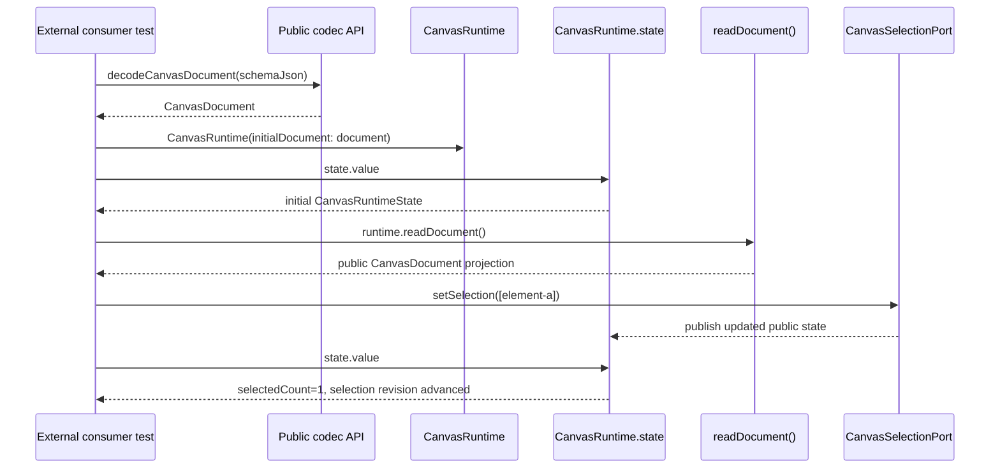

# Design: Public Incremental Smoke Test

---
date: 2026-05-23
designer: Codex
commit: e1fc8fdb
branch: new-architecture
design_question: "Design one incremental smoke test that verifies the implemented P0-P4 layers work together through the package public API: schema/json -> decodeCanvasDocument -> CanvasRuntime(initialDocument) -> state.value -> readDocument() -> camera/selection operation -> updated state. The test must stay small, avoid duplicating phase tests, and be extended after later phases with the next real user step."
---

## Disposition

READY_FOR_CONTRACT

## Product Outcome

The package should gain one fast confidence test that proves an application can take a small schema v1 document, decode it, start the runtime, observe state, read the public document projection, perform one user-facing runtime operation, and observe the updated public state without touching internals.

Non-goals: do not prove every schema field, projection-cache detail, runtime revision rule, selection edge case, camera edge case, invalid input path, internal read port, or later-phase placeholder. The smoke test is not a replacement for phase-owned unit, behavior, guardrail, or benchmark tests. It is a small public integration tripwire for "all green locally, but the engine does not run as a whole."

## Target Contract Classification

- Profile: SOURCE_OF_TRUTH_DOCS
- Obligations: None

The future Change Contract is verification-only: it adds an executable public smoke proof and updates the verification inventory/source-of-truth if required. It must not change production runtime behavior or public API shape.

## Research Inputs

- `docs/history/research/2026-05-23-p0-p4-smoke-test-facts.md` - supplied fact input. It maps the implemented P0-P4 public path, current placeholders, existing focused tests, and later phase pressures.

## Repository Evidence

- `docs/history/research/2026-05-23-p0-p4-smoke-test-facts.md:13` - P0-P4 are complete and cover package boundaries, public API freeze, schema v1 codec validation, and runtime spine.
- `docs/history/research/2026-05-23-p0-p4-smoke-test-facts.md:15` - the implemented public vertical path includes codec entrypoints, runtime construction, state observation, `readDocument()`, selection commands, and camera updates.
- `docs/history/research/2026-05-23-p0-p4-smoke-test-facts.md:17` - existing tests already cover the individual API, codec, runtime, projection, camera, and selection pieces.
- `docs/history/research/2026-05-23-p0-p4-smoke-test-facts.md:74` - external consumer behavior tests should use `test/support/flutter_consumer_test_harness.dart`; compile/static and guardrail tests have different ownership.
- `docs/history/research/2026-05-23-p0-p4-smoke-test-facts.md:114` - later phases introduce edit, load, resources, geometry/spatial, frame, interaction, draw, eraser/context-action request, Flutter surface, and release readiness pressure.
- `lib/iwb_canvas_engine.dart:1` - the root package barrel exports public API files.
- `lib/iwb_canvas_engine.dart:17` - the public barrel ends with API exports only.
- `lib/src/api/canvas_codec.dart:21` - `decodeCanvasDocument` is a public codec entrypoint.
- `lib/src/api/canvas_codec.dart:22` - the public decode entrypoint delegates to schema v1 decode.
- `lib/src/api/canvas_runtime.dart:29` - `CanvasRuntime` accepts an optional initial document.
- `lib/src/api/canvas_runtime.dart:39` - `CanvasRuntime.readDocument()` is a public runtime read path.
- `lib/src/api/canvas_runtime.dart:40` - `CanvasRuntime.state` exposes the public runtime state listenable.
- `lib/src/api/canvas_runtime.dart:42` - `CanvasRuntime.selection` exposes the public selection port.
- `lib/src/api/canvas_runtime.dart:45` - `CanvasRuntime.camera` exposes the public camera port.
- `lib/src/api/canvas_runtime.dart:41` - `CanvasRuntime.edits` remains unimplemented in the current code and must not be used in the P0-P4 smoke step.
- `lib/src/runtime/runtime_root.dart:31` - runtime construction creates the store from the initial document.
- `lib/src/runtime/runtime_root.dart:45` - runtime construction initializes the public state notifier.
- `lib/src/runtime/runtime_root.dart:99` - runtime document reads delegate to the store.
- `lib/src/runtime/runtime_root.dart:209` - `RuntimeRoot.setSelection` is the selection operation entry.
- `lib/src/runtime/runtime_root.dart:267` - selection changes publish runtime state only when they actually change.
- `lib/src/runtime/runtime_root.dart:292` - public runtime state is composed from document, selection, and view camera facts.
- `lib/src/store/document_store_kernel.dart:40` - store document reads go through the projection cache.
- `lib/src/store/document_store_kernel.dart:98` - selection normalization uses store-owned selectable ids.
- `lib/src/codec/schema_v1_decoder.dart:23` - schema v1 map decode starts at the codec boundary.
- `lib/src/codec/schema_v1_decoder.dart:27` - decode validates the schema root.
- `lib/src/codec/schema_v1_decoder.dart:66` - decode materializes a public `CanvasDocument`.
- `lib/src/codec/schema_v1_decoder.dart:77` - decode validates document references before returning.
- `docs/implementation/p4_runtime_spine.md:29` - P4 explicitly excludes edit, load, paint, resource resolver, pointer routing, and Flutter widget behavior.
- `docs/implementation/p4_runtime_spine.md:78` - P4 already has focused tests and guardrails for runtime, store, selection, projection, and read ports.
- `docs/verification/tests.md:351` - in-package tests, external consumer behavior tests, compile/static tests, and guardrail tests have distinct shapes.
- `docs/verification/tests.md:357` - external consumer behavior tests prove ordinary package users can import the public barrel and execute public behavior.
- `docs/verification/tests.md:360` - external consumer behavior tests use the shared Flutter consumer harness.
- `test/support/flutter_consumer_test_harness.dart:7` - the harness owns the external consumer test boundary.
- `test/support/flutter_consumer_test_harness.dart:31` - the harness runs `flutter test` inside the generated consumer package.
- `docs/contracts/public_api_v1.md:118` - external adapter proof is already a documented public API proof family.
- `docs/contracts/public_api_v1.md:126` - that proof must compile without `src/**`, legacy symbols, or internal runtime classes.
- `docs/contracts/public_api_v1.md:380` - `CanvasRuntime` may be used in tests without mounting UI.
- `docs/contracts/public_api_v1.md:460` - `CanvasRuntimeState` is atomic from the public API perspective.
- `docs/contracts/public_api_v1.md:2224` - public `selection.setSelection` emits no user action, which makes it a low-noise P0-P4 smoke operation.

## Design Form Candidates

### Candidate A. In-package smoke test importing the public barrel

- Form: add one ordinary package test that imports `package:iwb_canvas_engine/iwb_canvas_engine.dart` and runs the scenario.
- Why it could work: it is faster than creating an external temporary Flutter package and can keep a simple single test body.
- Gate failures or risks: it only relies on convention to prevent future internal imports. It would not mechanically prove ordinary consumer access from outside the package, which is the strongest meaning of "through the public API."

### Candidate B. External consumer behavior smoke through the shared harness

- Form: add one consumer-style test under a smoke-oriented test area. The repository test owns the generated package name, generated test file name, and source string. The generated test imports only `package:iwb_canvas_engine/iwb_canvas_engine.dart`, decodes a small schema v1 map, constructs `CanvasRuntime(initialDocument: decoded)`, reads `state.value`, calls `readDocument()`, performs one public selection operation, and checks the updated state.
- Why it could work: it uses the existing public-consumer harness, enforces the root barrel import mechanically, and keeps the smoke scenario independent from internal runtime/test fixtures.
- Gate failures or risks: it is a little slower than an in-package unit test because it runs a generated Flutter consumer package. The scenario must remain intentionally small so that cost stays acceptable.

### Candidate C. Extend an existing focused runtime or codec test

- Form: append the vertical path to `runtime_state_publication`, `runtime_camera_port`, `decode_encode_no_runtime_side_effects`, or selection tests.
- Why it could work: those files already cover adjacent behavior and already use consumer-style patterns in several places.
- Gate failures or risks: it hides the cross-layer smoke purpose inside a phase-owned proof file and increases duplication with tests that already prove individual behaviors.

### Candidate D. Extend the app adapter compile fixture

- Form: add runtime execution assertions to the external adapter compile fixture.
- Why it could work: that fixture already proves broad public integration surface importability.
- Gate failures or risks: the fixture is compile-oriented, very broad, and intentionally exercises many public types. Adding a small runtime happy path there would make the smoke less visible and less stable as a quick integration tripwire.

## Known Future Pressures

| Pressure | Evidence | How the selected form responds | Accepted cost or risk |
|---|---|---|---|
| The P0-P4 path is already covered by focused tests, so the smoke must avoid becoming a second suite of phase tests. | `docs/history/research/2026-05-23-p0-p4-smoke-test-facts.md:17`, `docs/implementation/p4_runtime_spine.md:78` | The selected form asserts one happy path and only a few public facts: decode succeeds, initial state summary/revisions are coherent, readDocument exposes decoded content, selection changes selected count and selection revision. | The smoke will not diagnose which layer failed; focused tests remain responsible for detail. |
| The test must use only public API. | `docs/verification/tests.md:357`, `docs/contracts/public_api_v1.md:126` | Run the behavior from a generated external consumer package and import only the root public barrel. | External consumer tests cost more than in-package tests, so the scenario must stay short. |
| P4 still has later-phase placeholders. | `lib/src/api/canvas_runtime.dart:41`, `docs/implementation/p4_runtime_spine.md:29` | The P0-P4 smoke uses only implemented public ports: decode, runtime construction, state, readDocument, and selection. | It cannot exercise edit/load/resources/tools/actions until their phases land. |
| Later phases P5-P14 should extend the same smoke test. | `docs/history/research/2026-05-23-p0-p4-smoke-test-facts.md:114`, `docs/verification/tests.md:580` | Keep one test body and append one real user step after the prior step, using the next public operation introduced by the completed phase. | Internal-only phases must not force private API usage. If a phase exposes no public user step, its Change Contract should record why the smoke append is deferred to the first public consumer of that phase. |
| P8 and P9 are primarily geometry/spatial/frame infrastructure before later user interaction and Flutter surface consumption. | `docs/implementation/p8_geometry_and_spatial.md:5`, `docs/implementation/p9_frame_rendering_and_caches.md:5`, `docs/implementation/p10_selection_and_move.md:5`, `docs/implementation/p13_flutter_surface.md:5` | The smoke expansion rule is public-consumer-first: append only public user actions, not internal geometry/frame probes. P8/P9 detail remains in focused tests until a later public step consumes those owners. | The smoke may not gain a new assertion in an internal-only phase; that is preferable to violating the public API rule. |
| P14 is release-readiness closure, not new feature behavior. | `docs/implementation/p14_benchmarks_diagrams_and_release_readiness.md:5`, `docs/implementation/p14_benchmarks_diagrams_and_release_readiness.md:137` | P14 should make the smoke part of final release proof or generated verification navigation rather than adding fake runtime behavior. | P14 append may be a verification/source-of-truth integration step, not a new user action. |

## Selected Form

Select Candidate B: one external consumer behavior smoke test through the shared Flutter consumer harness.

The future contract should add one clearly named smoke test file, preferably `test/smoke/public_incremental_smoke_test.dart`, and update `docs/verification/tests.md` or the relevant generated test inventory source if the repository requires a new required-test entry. The test file should own only the consumer package name, generated test file name, and generated test source, matching the existing harness pattern.

The generated consumer test must import only:

```dart
import 'dart:ui';

import 'package:flutter_test/flutter_test.dart';
import 'package:iwb_canvas_engine/iwb_canvas_engine.dart';
```

The current P0-P4 scenario is:

1. Build a tiny schema v1 map named `schemaJson` with one layer and one selectable rect element. Include camera, background, palette, empty resources, empty background layer, layers, and metadata so the schema shape is explicit.
2. Decode it with `decodeCanvasDocument(schemaJson)`.
3. Construct `CanvasRuntime(initialDocument: decodedDocument)` and register `addTearDown(runtime.dispose)`.
4. Read `runtime.state.value` and assert only coarse public facts: zero revisions, one element, one layer, zero resources, zero selected elements.
5. Call `runtime.readDocument()` and assert the public projection exposes the decoded camera and element id.
6. Perform one public selection operation: `runtime.selection.setSelection([CanvasElementId('element-a')])`.
7. Assert the updated public state: `selectedCount == 1`, `revisions.selection == 1`, and `revisions.document == 0`.
8. Optionally assert `runtime.selection.selectedElementIds` contains only the decoded element id and `runtime.readDocument()` still exposes the decoded document content. Do not assert projection cache identity, private revisions, or internal owner facts.

The P0-P4 smoke should use selection rather than camera movement as the first operation. Selection depends on decoded element ids, runtime store admission, selection membership normalization, and public state publication. Camera movement is still a valid future or fallback public step, but the existing camera behavior already has a focused consumer test.

Future expansion rule:

- Keep this as one readable scenario, not a list of separate phase cases.
- Append exactly one public user step when a completed phase exposes a real user operation that can follow the current scenario.
- Prefer operations that consume the state established by earlier steps.
- Do not import `src/**`, instantiate `RuntimeRoot`, inspect projection-cache counters, assert private revisions, or add invalid-input cases.
- If a phase is infrastructure-only from the public API perspective, do not fabricate a private smoke step; record the deferral in that phase's Change Contract and append when the first public operation consumes that infrastructure.
- Stop expanding when the test becomes hard to scan. If a later phase needs a materially different user journey, create a new design rather than turning this smoke into an omnibus suite.

Expected future append direction:

| Phase | Smoke append intent |
|---|---|
| P5 | Add one public edit step, such as adding or updating a rect through `runtime.edits.edit`, then assert document revision and readDocument content. |
| P6 | Load one second decoded document through `runtime.edits.loadDocument`, then assert one atomic public state update and new readDocument content. |
| P7 | Add or dirty one app-key image resource through the public resource/edit boundary, then assert the public resource-visible revision/effect that the phase owns. |
| P8 | Do not use private geometry/spatial APIs. Append only if P8 exposes a public user-level geometry-consuming operation; otherwise defer to P10/P12 public interaction. |
| P9 | Do not use private frame APIs. Append only through a public frame consumer when available; otherwise defer to P13 `CanvasSurface` paint. |
| P10 | Add one move-mode public user step, preferably a selection/move gesture through public tools once implemented. |
| P11 | Add one draw tool pointer sequence that commits one public element and updates state/actions through public APIs. |
| P12 | Add one eraser or context-action request step, whichever is the smallest stable public user path after P12. |
| P13 | Mount one `CanvasSurface` in a widget test and verify the same runtime can be observed through the public widget boundary without direct internals. |
| P14 | Include the smoke in release verification/source-of-truth closure rather than adding a fake feature step. |

## Hard Gate Check

| Gate | Result | Evidence |
|---|---|---|
| Root cause | pass | The gap is cross-layer integration confidence, not missing phase detail; focused tests already cover individual pieces at `docs/history/research/2026-05-23-p0-p4-smoke-test-facts.md:17`, while the implemented vertical path exists at `docs/history/research/2026-05-23-p0-p4-smoke-test-facts.md:15`. |
| Ownership | pass | The smoke is owned by a new smoke test file and the verification inventory. The runtime, codec, store, and selection owners remain unchanged. External consumer behavior tests are the documented owner shape for public runtime behavior at `docs/verification/tests.md:357` and `docs/verification/tests.md:360`. |
| Source of truth | pass | The test does not create a second truth for schema, runtime, projection, selection, camera, or later phases. It references public behavior only and leaves detailed contracts in phase-owned docs/tests. Any required listing belongs in `docs/verification/tests.md`. |
| Boundary | pass | Entry boundary is the generated external consumer package importing the public barrel. Runtime entry is `decodeCanvasDocument` and `CanvasRuntime(initialDocument:)`. Exit boundary is public `state.value`, `readDocument()`, and `selection.selectedElementIds`. |
| Dependency direction | pass | The consumer test depends on the package public barrel only. It does not import `src/**`, private runtime roots, store kernels, selection kernels, frame facts, or guardrail tooling. |
| State/data | pass | The test observes public immutable state snapshots and public document projections only. It does not assert private committed state, cache identity, internal revisions, or derived frame/spatial state. |
| Seam | pass | No shared production seam is created, replaced, or retired. The test creates a verification seam: public consumer scenario -> package public API -> public observations. The successor/extension rule is additive and public-only. |
| Verification | pass | The proof surface is one external consumer `flutter test` executed by the existing harness. It should be run through `dart test test/smoke/public_incremental_smoke_test.dart` as the focused check and by the normal project test suite once added. |
| Future pressure | pass | The selected form handles later public operations through append-only user steps and explicitly rejects private assertions for infrastructure-only phases, supported by P8/P9/P14 phase evidence. |

## Lock-Required Facts

- Owner: `test/smoke/public_incremental_smoke_test.dart` should own the smoke scenario; `docs/verification/tests.md` or the repository's generated test inventory should list it if required.
- Owning layer/module/document family: public consumer behavior tests using `test/support/flutter_consumer_test_harness.dart`.
- Seam: generated external consumer package imports only `package:iwb_canvas_engine/iwb_canvas_engine.dart` and exercises the package public API.
- Dependency/import direction: consumer test source may import `dart:ui`, `package:flutter_test/flutter_test.dart`, and the root public barrel only.
- State/data ownership: schema JSON map is test input; decoded `CanvasDocument` is public DTO output; `CanvasRuntime` owns runtime state; `readDocument()` returns public projection; `state.value` is the public observation snapshot.
- Entry boundaries: `decodeCanvasDocument(schemaJson)`, `CanvasRuntime(initialDocument: document)`, `runtime.state.value`, `runtime.readDocument()`, and `runtime.selection.setSelection(...)`.
- Exit boundaries: public state summary/revisions, public selected ids, and public document projection content.
- File placement basis: use `test/smoke/` because the test is cross-layer and intentionally not owned by codec, runtime, store, selection, or api_contract alone.
- Execution order constraints: decode first, construct runtime second, read initial state third, read public document fourth, perform one user operation fifth, assert updated public state last.
- Rejected alternatives: in-package smoke is weaker on public API enforcement; focused-test extension duplicates phase tests; adapter compile fixture is too broad and compile-oriented.
- Verification strategy: one external consumer behavior test plus normal project analysis/checks in the later implementation contract. Do not add separate guardrails for this unless repeated drift shows smoke coverage is being bypassed.

## Diagram Need Assessment

| Design question | Needed? | Diagram kind | Reason |
|---|---:|---|---|
| Does the design change ownership, layer, package, or component boundaries? | no | none | The design adds a verification scenario and does not move production ownership. |
| Does it change data flow, state ownership, cache ownership, resource movement, or lifecycle movement? | no | none | The test observes existing public data flow without changing runtime state ownership. |
| Does it depend on call order, lifecycle order, sync/async ordering, failure ordering, or migration order? | yes | sequence | The value of the smoke is the exact public call order from decode to runtime state to user operation. |
| Does it introduce or alter modes, statuses, terminal states, sessions, or transition rules? | no | none | No runtime modes or state machines are introduced by the design. |
| Does it create, replace, migrate, or retire a shared seam? | no | none | It creates only a test scenario over existing public seams. |
| Does it change public API consumer flow, payload shape, or compatibility behavior? | no | none | It proves an existing consumer flow; it does not change public API behavior. |
| Does it introduce or change analyzer, guardrail, or structural-recognition pipeline behavior? | no | none | No analyzer or guardrail pipeline changes are selected. |

## Provisional Diagrams



## Source-Of-Truth Impact

A later Change Contract must add the smoke test to the repository test inventory if required by the current verification source of truth. The likely source is `docs/verification/tests.md`, which currently owns required test listings and test shape rules. No production docs, diagrams, public API registry, or roadmap step should be edited during design.

## Verification Impact

Future implementation should add one executable test and run:

- `dart test test/smoke/public_incremental_smoke_test.dart`
- `dart analyze`
- `dcm analyze .`
- `dcm calculate-metrics .`

If the future contract updates verification documentation or generated inventory only, use the repository's documentation checks for that documentation portion as required by the then-current source of truth.

## Verification Strategy

The proof is intentionally coarse:

- external package import proves public API-only access;
- decode proves schema v1 can produce the document used by runtime;
- runtime construction proves decoded documents cross into the committed runtime spine;
- initial `state.value` proves public summary/revision observation is available immediately;
- `readDocument()` proves public projection can be read after runtime construction;
- selection proves a user-facing operation consumes decoded document ids and publishes updated public state.

The test should fail loudly if any layer is missing from the public path, but it should not identify the exact subsystem defect. Focused tests remain the diagnostic layer.

## Change Contract Handoff

- Required profile: SOURCE_OF_TRUTH_DOCS
- Required obligations: None
- Decisions to carry forward:
  - implement one external consumer smoke test, not an in-package internal-adjacent test;
  - use selection as the P0-P4 operation because it consumes decoded element identity and store-backed membership;
  - keep the scenario one happy path and avoid edge cases;
  - extend this same test only through public user steps as future phases expose them.
- Evidence to cite:
  - `docs/history/research/2026-05-23-p0-p4-smoke-test-facts.md:15`
  - `docs/history/research/2026-05-23-p0-p4-smoke-test-facts.md:17`
  - `docs/history/research/2026-05-23-p0-p4-smoke-test-facts.md:74`
  - `docs/verification/tests.md:357`
  - `docs/verification/tests.md:360`
  - `test/support/flutter_consumer_test_harness.dart:7`
  - `lib/src/api/canvas_codec.dart:21`
  - `lib/src/api/canvas_runtime.dart:29`
  - `lib/src/api/canvas_runtime.dart:39`
  - `lib/src/api/canvas_runtime.dart:40`
  - `lib/src/api/canvas_runtime.dart:42`
- Contract constraints or sequencing facts:
  - add test file first;
  - update verification inventory only if required;
  - do not edit production code unless the test reveals an actual defect and the contract is amended;
  - run the focused smoke test and required code checks after implementation.

## Open Decisions

None. The design is ready for a future Change Contract. The only future judgment call is phase-by-phase append timing for infrastructure-only phases; the selected rule is public-consumer-first and does not block the P0-P4 smoke contract.
