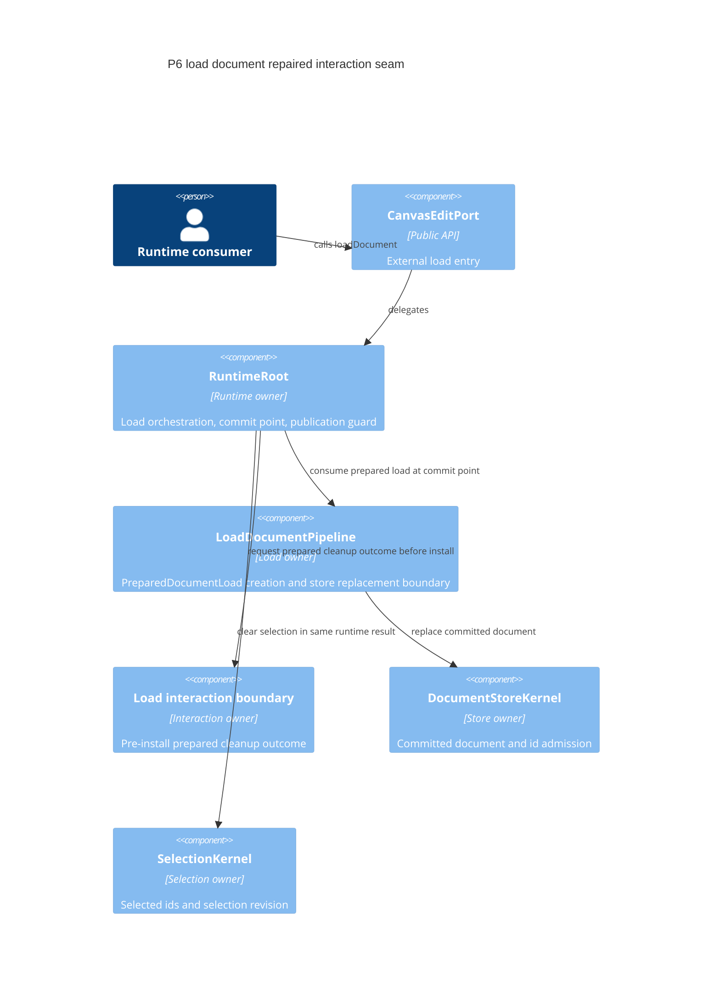
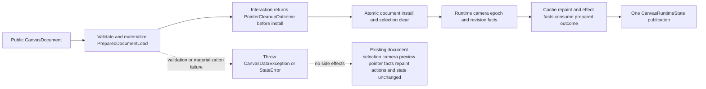
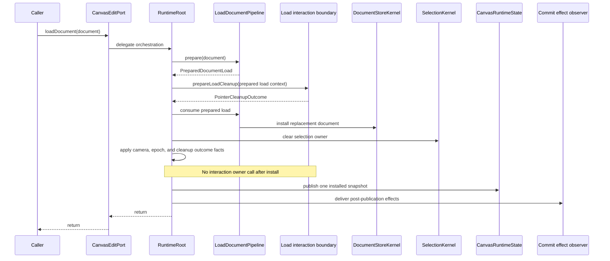
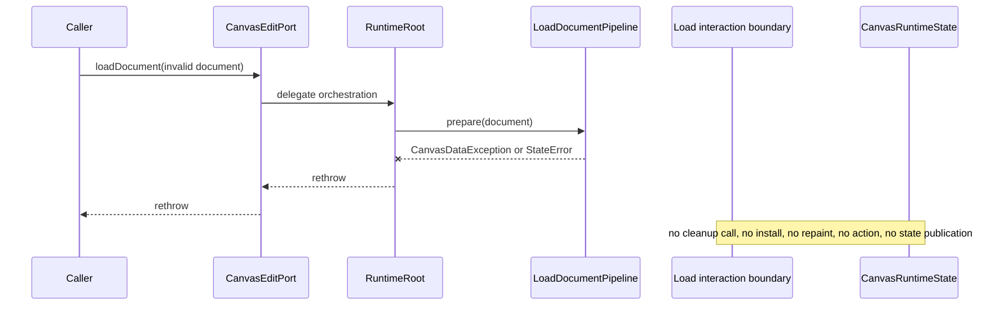

# Design: P6 Load Document

---
date: 2026-05-26
designer: Codex
commit: 4d5d6544
branch: new-architecture
design_question: "Repair the P6 loadDocument design after research found that the old design still allowed post-install interaction cleanup."
---

## Disposition

READY_FOR_CONTRACT

## Product Outcome

Full document loading remains a single reliable replacement operation: a valid
document is installed once, invalid input leaves the current runtime untouched,
and interaction cleanup cannot observe or fail after the replacement document is
already committed. This design repairs the old P6 design artifact only; it does
not implement code, draft a Change Contract, or edit durable source-of-truth
docs.

## Target Contract Classification

- Profile: BEHAVIOR_CHANGE
- Obligations: BUG_FIX, SEAM_MIGRATION

## Research Inputs

- `docs/history/research/2026-05-26-load-document-contract-review-gap.md` - identifies the
  remaining live gap after durable docs were repaired: runtime code and the
  ordering fixture still accept post-install interaction cleanup, while current
  load-document docs require a prepared cleanup outcome before install.

## Repository Evidence

- `docs/contracts/load_document.md:36` - `CanvasEditPort.loadDocument(document)`
  is the public external document replacement operation.
- `docs/contracts/load_document.md:38` - public API delegates load orchestration
  to `RuntimeRoot`.
- `docs/contracts/load_document.md:45` - P6 owns only the minimal early
  interaction boundary needed by staged replacement.
- `docs/contracts/load_document.md:49` - successful preparation leads to a
  runtime request for prepared load cleanup.
- `docs/contracts/load_document.md:52` - the interaction boundary returns a
  `PointerCleanupOutcome` before document install.
- `docs/contracts/load_document.md:53` - the prepared outcome covers preview,
  pointer-normalization, and pending-tap facts.
- `docs/contracts/load_document.md:56` - `RuntimeRoot` must not call the
  interaction boundary again after document install to finish load cleanup.
- `docs/contracts/load_document.md:67` - success ordering validates public input
  before materializing the prepared load.
- `docs/contracts/load_document.md:69` - only after preparation succeeds may
  runtime request prepared interaction cleanup.
- `docs/contracts/load_document.md:70` - the cleanup outcome must describe
  preview, pointer-normalization, and pending-tap cleanup before the commit
  point.
- `docs/contracts/load_document.md:73` - atomic install combines replacement
  document install and selection clear through the runtime/applier boundary.
- `docs/contracts/load_document.md:80` - cache invalidation and repaint happen
  after the atomic result.
- `docs/contracts/load_document.md:85` - `PreparedDocumentLoad` owns replacement
  committed tables, generated id admission state, and replacement revision facts.
- `docs/contracts/load_document.md:88` - pointer-normalization and pending-tap
  cleanup are not separate post-install owner calls.
- `docs/contracts/load_document.md:96` - failure ordering starts before any
  interaction side effect.
- `docs/implementation/p6_load_document.md:14` - the P6 success path prepares an
  interaction cleanup outcome before document install.
- `docs/implementation/p6_load_document.md:23` - failure leaves committed
  document, selection, preview, pointer normalization, repaint, events, and
  active gesture state unchanged.
- `docs/implementation/p6_load_document.md:96` - the P6 exit gate requires one
  atomic post-install state for the replacement.
- `docs/implementation/p6_load_document.md:99` - the P6 exit gate forbids a
  post-install interaction owner call to finish pointer-normalization or
  pending-tap cleanup.
- `docs/contracts/operation_matrix.md:274` - load success touches whole
  document, selection clear, prepared interaction cleanup outcome, and runtime
  view camera initialization.
- `docs/contracts/operation_matrix.md:307` - after successful install, runtime
  consumes the already prepared cleanup outcome and does not call interaction to
  finish cleanup.
- `docs/contracts/interaction_engine.md:177` - `PointerCleanupOutcome` is
  effect-only.
- `docs/contracts/interaction_engine.md:181` - runtime/public signal aggregation
  may consume the outcome after cleanup completes without re-reading stale active
  session state.
- `docs/contracts/interaction_engine.md:183` - successful `loadDocument`
  produces the cleanup outcome before the document install commit point.
- `docs/contracts/interaction_engine.md:185` - runtime may consume the prepared
  outcome after install for publication and repaint aggregation.
- `docs/contracts/interaction_engine.md:186` - runtime must not call back into
  the interaction owner after install to finish pointer-normalization or pending
  context-tap cleanup.
- `docs/architecture/01_runtime_ownership.md:83` - the target cleanup
  coordinator is an internal `InteractionEngine` collaborator.
- `docs/architecture/01_runtime_ownership.md:87` - the coordinator calculates an
  effect-only `PointerCleanupOutcome`.
- `docs/architecture/01_runtime_ownership.md:89` - the coordinator does not
  publish runtime state, emit actions, schedule repaints, call resolvers, open
  edits, or read store/selection internals.
- `docs/diagrams/seq_load_document_success.mmd:43` - the success sequence sends
  a success-only prepared load cleanup request before install.
- `docs/diagrams/seq_load_document_success.mmd:48` - the prepared cleanup outcome
  is queued until install.
- `docs/diagrams/seq_load_document_success.mmd:69` - the success sequence states
  that no interaction owner call runs after install.
- `docs/diagrams/dfd_load_document_success_failure.mmd:74` - the prepared cleanup
  outcome reaches atomic install before the replacement is committed.
- `docs/diagrams/dfd_load_document_success_failure.mmd:89` - repaint consumes
  prepared cleanup facts with no post-install interaction call.
- `docs/verification/guardrails.md:194` - failed load must not interrupt gesture.
- `docs/verification/guardrails.md:195` - successful load must prepare
  interaction cleanup before atomic install and perform no post-install
  interaction owner cleanup call.
- `docs/architecture/architecture_graph.yaml:288` - the graph declares the
  `load_document.pipeline` owner.
- `docs/architecture/architecture_graph.yaml:291` - the pipeline owner is
  `load_document`.
- `docs/architecture/architecture_graph.yaml:303` - the expected declaration is
  `LoadDocumentPipeline`.
- `docs/architecture/architecture_graph.yaml:588` - the graph declares the
  pipeline-to-store mutation boundary.
- `docs/architecture/architecture_graph.yaml:597` - load document admits
  validated replacements through the pipeline-owned store boundary.
- `lib/src/runtime/runtime_root.dart:373` - current runtime load orchestration
  prepares the load.
- `lib/src/runtime/runtime_root.dart:376` - current runtime calls the interaction
  boundary before consuming the prepared load.
- `lib/src/runtime/runtime_root.dart:377` - current runtime consumes the prepared
  load into the store after the pre-install interrupt.
- `lib/src/runtime/runtime_root.dart:382` - current runtime still calls
  `clearPostInstallFacts()` after install and runtime revision updates.
- `lib/src/runtime/runtime_root.dart:487` - current `LoadInteractionBoundary` is
  the load interaction seam.
- `lib/src/runtime/runtime_root.dart:489` - current seam still exposes
  `clearPostInstallFacts()`.
- `test/runtime/fixtures/load_document_ordering_fixture.dart:57` - current
  fixture expects `post-install-cleanup` after interrupt and before publication.
- `test/runtime/fixtures/load_document_ordering_fixture.dart:67` - current
  fixture callback observes the replacement document during post-install cleanup.
- `test/runtime/fixtures/load_document_ordering_fixture.dart:183` - current
  recording boundary implements the post-install cleanup method.

## Design Form Candidates

### Candidate A. Prepared Cleanup Outcome Seam

- Form: replace the two-method `LoadInteractionBoundary` shape with one
  success-only prepared-load cleanup call that returns a `PointerCleanupOutcome`
  before document install. `RuntimeRoot` carries that immutable outcome through
  the atomic install and consumes it later for preview revision, repaint, and
  state/effect facts without calling the interaction owner again.
- Why it could work: it directly matches the current load contract's pre-install
  cleanup rule (`docs/contracts/load_document.md:52`,
  `docs/contracts/load_document.md:56`), keeps `RuntimeRoot` as orchestrator
  (`docs/contracts/load_document.md:38`), preserves the graph-declared load
  owner (`docs/architecture/architecture_graph.yaml:288`), and fixes the current
  runtime/test gap at the shared seam rather than at one downstream assertion
  (`lib/src/runtime/runtime_root.dart:382`,
  `test/runtime/fixtures/load_document_ordering_fixture.dart:57`).
- Gate failures or risks: the future implementation must make the outcome
  payload concrete enough to drive preview revision and repaint/effect facts
  without importing full P10-P12 interaction state into P6. The interaction
  boundary must also complete cleanup/outcome calculation before returning; after
  it returns, runtime must not need any fallible interaction owner work to
  publish the load result.

### Candidate B. Keep Two Methods And Move The Second Call Earlier

- Form: keep `interruptPreparedLoad()` and `clearPostInstallFacts()`, but call
  both before document install.
- Why it could work: it would remove the post-install owner call from runtime
  order with a small code diff.
- Gate failures or risks: the seam name and method split would still encode a
  second cleanup phase, making future reviews and fixtures prone to reintroduce
  post-install cleanup. This fails the seam and source-of-truth gates because
  the contract describes one prepared cleanup outcome, not two imperative owner
  calls (`docs/contracts/load_document.md:49`,
  `docs/contracts/load_document.md:88`).

### Candidate C. Keep Post-Install Cleanup But Contain Failures

- Form: keep `clearPostInstallFacts()` after install and catch or ignore any
  interaction failure.
- Why it could work: it could prevent post-install cleanup exceptions from
  aborting public load delivery.
- Gate failures or risks: it preserves the root defect. The interaction owner
  would still observe the replacement document after commit, contradicting the
  explicit no-post-install-call rule (`docs/contracts/load_document.md:56`) and
  the current fixture evidence (`test/runtime/fixtures/load_document_ordering_fixture.dart:67`).

### Candidate D. Runtime-Owned Pointer Cleanup

- Form: remove the interaction boundary from load success and let `RuntimeRoot`
  clear pointer-normalization and pending-tap facts directly.
- Why it could work: it would eliminate the post-install interaction callback
  risk.
- Gate failures or risks: it moves interaction state ownership into runtime,
  contrary to the contract's interaction boundary and coordinator ownership
  (`docs/contracts/load_document.md:50`,
  `docs/contracts/load_document.md:61`). This fails ownership and dependency
  direction gates.

## Known Future Pressures

| Pressure | Evidence | How the selected form responds | Accepted cost or risk |
|---|---|---|---|
| P10-P12 interaction state machines consume the load ordering but are not P6 prerequisites. | `docs/contracts/load_document.md:61`; `docs/implementation/p6_load_document.md:14` | Keeps P6 at a narrow interaction boundary that returns an effect-only cleanup outcome. | The P6 adapter may initially return a minimal outcome; later interaction phases can enrich it without changing load order. |
| Current runtime and fixture still encode the old two-phase cleanup shape. | `lib/src/runtime/runtime_root.dart:382`; `test/runtime/fixtures/load_document_ordering_fixture.dart:57` | Migrates the shared seam and updates ordering proof to make post-install interaction cleanup unrepresentable. | Focused tests must change with the seam; old fixture expectations are intentionally invalidated. |
| Completed Step 36 still contains stale post-install wording even though durable docs now reject it. | `PLAN.md:58`; `plan/step_36_p6_load_document.md:104`; `docs/contracts/load_document.md:56` | Treats current contracts, diagrams, and guardrail inventory as the stronger source for new work and requires future planning to supersede or repair stale Step 36 wording before relying on it. | A future contract may need a small source-of-truth cleanup in `plan/step_36_p6_load_document.md` or a new superseding plan step. |
| Load success still needs one public publication after install and guarded callback windows. | `docs/contracts/load_document.md:80`; `lib/src/runtime/runtime_root.dart:418`; `lib/src/runtime/runtime_root.dart:421` | Preserves `RuntimeRoot` delivery ownership; only the interaction cleanup owner call moves before install. | The outcome must be immutable effect-only data after install so delivery can remain failure-contained. |
| Guardrails now require negative proof against post-install interaction owner cleanup. | `docs/verification/guardrails.md:195`; `docs/verification/guardrail_design_patterns.md:117` | Makes the negative proof a seam-level fixture requirement, not prose. | Future tests should fail if any load interaction boundary callback runs after install. |

## Selected Form

Use Candidate A: a prepared cleanup outcome seam.

The future implementation should repair the existing P6 architecture as follows:

1. `RuntimeRoot` still orchestrates external `loadDocument` and still prepares
   the replacement document before any side effect.
2. After `PreparedDocumentLoad` succeeds, `RuntimeRoot` calls the load
   interaction boundary once, before install, to interrupt active interaction and
   receive a `PointerCleanupOutcome`.
3. `RuntimeRoot` then commits the replacement document, selection clear, runtime
   camera initialization, and load revisions as one accepted runtime result.
4. After the commit point, runtime may consume the already prepared cleanup
   outcome for preview revision, repaint, state/effect publication, and observer
   delivery, but it must not call the interaction owner again to finish load
   cleanup.
5. Failed preparation must not call the interaction boundary and must leave the
   existing document, selection, camera, preview, pointer-normalization,
   pending-tap history, repaint, events, and public state unchanged.

This fixes the root cause at the shared load/interaction seam. It does not move
interaction state into runtime, does not make load a normal edit session, and
does not ask downstream fixtures to paper over a wrong owner boundary.

## Hard Gate Check

| Gate | Result | Evidence |
|---|---|---|
| Root cause | pass | The defect is a shared seam/order gap: current runtime calls `clearPostInstallFacts()` after install (`lib/src/runtime/runtime_root.dart:382`) while the contract forbids post-install interaction cleanup (`docs/contracts/load_document.md:56`). Candidate A retires that post-install seam. |
| Ownership | pass | `RuntimeRoot` owns orchestration (`docs/contracts/load_document.md:38`), load preparation belongs to `load_document.pipeline` (`docs/architecture/architecture_graph.yaml:288`), and interaction cleanup remains behind the interaction boundary (`docs/contracts/load_document.md:45`). |
| Source of truth | pass | Current durable contract, diagrams, operation matrix, and guardrail inventory agree on prepared cleanup before install and no post-install owner call (`docs/contracts/load_document.md:52`, `docs/diagrams/seq_load_document_success.mmd:69`, `docs/contracts/operation_matrix.md:307`, `docs/verification/guardrails.md:195`). |
| Boundary | pass | Entry boundary is public `CanvasEditPort.loadDocument` (`docs/contracts/load_document.md:36`); exit boundaries are one prepared cleanup outcome before install, one atomic runtime replacement result, and one public state publication after install (`docs/contracts/load_document.md:70`, `docs/contracts/load_document.md:73`, `docs/contracts/load_document.md:80`). |
| Dependency direction | pass | Public API delegates inward to runtime (`lib/src/api/canvas_runtime.dart:41`); the graph keeps load-to-store mutation under the pipeline owner (`docs/architecture/architecture_graph.yaml:588`); interaction does not mutate store (`docs/contracts/load_document.md:54`). |
| State/data | pass | `PreparedDocumentLoad` owns replacement payload facts (`docs/contracts/load_document.md:85`); `PointerCleanupOutcome` is effect-only cleanup data produced before install (`docs/contracts/interaction_engine.md:177`, `docs/contracts/interaction_engine.md:183`); current failure ordering leaves prior runtime and interaction state unchanged (`docs/contracts/load_document.md:96`). |
| Seam | pass | The successor seam is one prepared cleanup outcome returned before install. The retired seam is the current post-install `clearPostInstallFacts()` method (`lib/src/runtime/runtime_root.dart:489`), with negative proof that no interaction boundary callback runs after install. |
| Temporal/reentrancy | pass | Temporal invariant: validation/materialization and the only interaction owner call happen before the install commit point; after install, runtime consumes immutable effect-only prepared facts and publishes exactly one state. Callback surfaces after install are synchronous state listeners and commit-effect observer delivery (`lib/src/runtime/runtime_root.dart:418`, `lib/src/runtime/runtime_root.dart:421`, `lib/src/runtime/runtime_root.dart:423`); `RuntimeRoot` owns the guard for that window. |
| All-or-nothing behavior | pass | The irreversible point is atomic document install plus selection clear (`docs/contracts/load_document.md:73`). Validation, materialization, and prepared interaction cleanup/outcome calculation happen before that point (`docs/contracts/load_document.md:67`, `docs/contracts/load_document.md:70`). After the outcome is returned, runtime may consume it for publication/repaint without re-reading interaction state (`docs/contracts/interaction_engine.md:181`, `docs/contracts/interaction_engine.md:185`), and observer failure is already contained by runtime delivery (`lib/src/runtime/runtime_root.dart:425`). |
| Verification | pass | Existing guardrail IDs name the required positive and negative ordering proof (`docs/verification/guardrails.md:194`, `docs/verification/guardrails.md:195`); the current fixture names the stale behavior to replace (`test/runtime/fixtures/load_document_ordering_fixture.dart:57`). |
| Future pressure | pass | P10-P12 interaction ownership, stale Step 36 wording, runtime delivery guard windows, and guardrail proof pressure are identified above with a bounded response. |

## Lock-Required Facts

- Owner: `RuntimeRoot` orchestrates external load; `load_document.pipeline`
  prepares/consumes the document payload; interaction owns cleanup state behind a
  narrow boundary.
- Owning layer/module/document family: runtime/edit internal implementation, with
  durable source-of-truth in `docs/contracts/load_document.md`,
  `docs/contracts/operation_matrix.md`, load success/failure diagrams, and
  guardrail inventory.
- Seam: replace the two-method `LoadInteractionBoundary` with a single
  pre-install prepared cleanup call that returns `PointerCleanupOutcome`.
- Successor/retired seam: successor is the pre-install outcome-returning seam;
  retired seam is post-install `clearPostInstallFacts()`.
- Consumer order: prepare document -> request prepared interaction cleanup and
  capture outcome -> install document and selection clear atomically -> update
  camera/revisions -> consume prepared cleanup outcome for effects/publication ->
  publish one state -> deliver observer effects.
- Retirement gate: no runtime code, fixture, or guardrail proof may require or
  expose a load interaction owner call after document install.
- Dependency/import direction: public API -> runtime orchestration ->
  load-document pipeline and interaction boundary -> store/selection owners;
  interaction must not import or mutate `DocumentStoreKernel`.
- State/data ownership: committed document and id admission stay store-owned;
  selected ids stay selection-owned; camera, epoch, and publication stay
  runtime-owned; cleanup facts are transient interaction-owned effect-only
  outcome data.
- Entry boundaries: `CanvasEditPort.loadDocument(CanvasDocument)`.
- Exit boundaries: successful call returns after one installed runtime state and
  post-publication effects are delivered; failed preparation rethrows without
  mutation, repaint, action event, cleanup, or publication.
- File placement basis: future code changes should be near the existing runtime
  load seam and interaction boundary, with tests in load ordering/state
  publication fixtures. Do not create a broad runtime-owned pointer cleanup
  module.
- Execution order constraints: validate/materialize -> pre-install interaction
  cleanup and outcome calculation -> atomic install/selection clear -> runtime
  camera/revisions -> cache/effect/repaint from committed result plus prepared
  outcome -> one public state publication -> observer delivery.
- Rejected alternatives: moving only one fixture assertion, keeping two cleanup
  methods, swallowing post-install cleanup failures, or making runtime own
  pointer cleanup.
- Verification strategy: focused ordering tests must prove failure does not
  call interaction, success calls interaction only before install, the
  interaction callback cannot observe the replacement document, and no
  post-install interaction owner callback exists. Reentrancy tests must keep the
  existing load delivery guard over synchronous state listeners and observer
  callbacks.

## Diagram Need Assessment

| Design question | Needed? | Diagram kind | Reason |
|---|---:|---|---|
| Does the design change ownership, layer, package, or component boundaries? | yes | c4 | The design changes the load/interaction seam shape but keeps runtime, load pipeline, store, selection, and interaction owners separate. |
| Does it change data flow, state ownership, cache ownership, resource movement, or lifecycle movement? | yes | data_flow | Cleanup facts move from a post-install imperative call to a pre-install outcome consumed later by runtime. |
| Does it depend on call order, lifecycle order, sync/async ordering, failure ordering, or migration order? | yes | sequence | Correctness depends on the pre-install cleanup outcome, the install commit point, and no owner callback after install. |
| Does it introduce or alter modes, statuses, terminal states, sessions, or transition rules? | no | none | It does not introduce a durable state machine; it repairs ordering across existing load and interaction boundaries. |
| Does it create, replace, migrate, or retire a shared seam? | yes | sequence | It retires post-install `clearPostInstallFacts()` and replaces it with a prepared outcome seam. |
| Does it change public API consumer flow, payload shape, or compatibility behavior? | no | none | Public method signatures and return shape do not change; the observable success/failure contract remains the current load-document contract. |
| Does it introduce or change analyzer, guardrail, or structural-recognition pipeline behavior? | no | none | The design relies on existing guardrail IDs and focused tests, not a new analyzer pipeline. |

## Provisional Diagrams

## Source-Of-Truth Impact

A future Change Contract should treat the current load contract, operation
matrix, load diagrams, and guardrail inventory as the normative cleanup-ordering
source. Those durable docs already encode prepared cleanup before install and no
post-install interaction owner call.

Future source-of-truth work is limited to:

- Do not use the stale completed Step 36 cleanup wording as normative input for
  any future Change Contract. A future contract must either repair that wording,
  create a superseding plan step, or explicitly classify Step 36 as historical
  superseded evidence before relying on roadmap/plan evidence for cleanup order.
- Update `PLAN.md` only if the future workflow records this repair as new
  roadmap work or links to a superseding plan step.
- Update durable docs or generated diagrams only if implementation discovers new
  drift beyond the already-correct load cleanup ordering.

## Verification Impact

Future proof should include:

- Update load ordering tests so success proves the interaction cleanup callback
  runs before install and cannot observe the replacement document.
- Remove or replace fixture expectations for `post-install-cleanup`.
- Add negative proof that no load interaction boundary call can run after
  install to finish pointer-normalization or pending-tap cleanup.
- Preserve failure proof that invalid load does not interrupt interaction or
  mutate document, selection, camera, preview, pointer-normalization,
  pending-tap history, repaint, actions, or state.
- Preserve one-publication and observer/reentrancy proof for load success.
- Run `dart analyze`, `dcm analyze .`, `dcm calculate-metrics .`, and focused
  load runtime tests for the future Dart change.
- Run architecture graph and docs checks only if the future contract edits graph
  or documentation artifacts.

## Verification Strategy

Prove the repaired seam at the ordering fixture, not only through public smoke
tests. The success fixture should record a pre-install cleanup event, assert the
current document is still the old document inside that callback, then assert the
first public state publication observes the replacement document. The recording
boundary should no longer expose a post-install cleanup method. A negative test
or structural assertion should fail if `RuntimeRoot` can call an interaction
owner boundary after install. Failure fixtures should keep asserting no
interaction call and no runtime side effects before rethrow. Existing delivery
guard tests should continue to assert that public mutations are rejected during
synchronous state-listener and observer callbacks.

## Change Contract Handoff

- Required profile: BEHAVIOR_CHANGE
- Required obligations: BUG_FIX, SEAM_MIGRATION
- Decisions to carry forward:
  - Repair the load/interaction seam to return a `PointerCleanupOutcome` before
    document install.
  - Remove the post-install `clearPostInstallFacts()` load boundary from runtime
    code and fixtures.
  - Keep `RuntimeRoot` as orchestrator and keep interaction state behind the
    interaction boundary.
  - Treat prepared cleanup outcome data as immutable effect-only accepted facts
    after the install commit point.
  - Do not move pointer-normalization or pending-tap ownership into runtime.
  - Preserve one public state publication and existing post-publication delivery
    guard behavior.
  - Treat stale Step 36 post-install cleanup wording as superseded by current
    load contracts, operation matrix, diagrams, and guardrail inventory unless a
    future contract repairs or supersedes that plan artifact.
- Evidence to cite:
  - `docs/contracts/load_document.md:49`
  - `docs/contracts/load_document.md:52`
  - `docs/contracts/load_document.md:56`
  - `docs/contracts/load_document.md:70`
  - `docs/contracts/load_document.md:88`
  - `docs/contracts/operation_matrix.md:307`
  - `docs/contracts/interaction_engine.md:177`
  - `docs/contracts/interaction_engine.md:183`
  - `docs/contracts/interaction_engine.md:185`
  - `docs/diagrams/seq_load_document_success.mmd:69`
  - `docs/verification/guardrails.md:195`
  - `lib/src/runtime/runtime_root.dart:382`
  - `lib/src/runtime/runtime_root.dart:487`
  - `lib/src/runtime/runtime_root.dart:489`
  - `test/runtime/fixtures/load_document_ordering_fixture.dart:57`
  - `test/runtime/fixtures/load_document_ordering_fixture.dart:67`
  - `test/runtime/fixtures/load_document_ordering_fixture.dart:183`
- Contract constraints or sequencing facts:
  - Validation and materialization happen before interaction cleanup.
  - Failed preparation calls no interaction boundary and makes no runtime side
    effects.
  - Successful preparation calls the interaction boundary exactly once before
    install to obtain a `PointerCleanupOutcome`.
  - The document install commit point occurs only after the cleanup outcome is
    prepared.
  - After install, runtime consumes prepared cleanup facts but does not call the
    interaction owner to finish cleanup.
  - Public observation order is installed state publication, synchronous state
    listeners, post-publication effect observer, then return to caller.

## Open Decisions

None. The selected architecture is ready for future Change Contract authoring.
