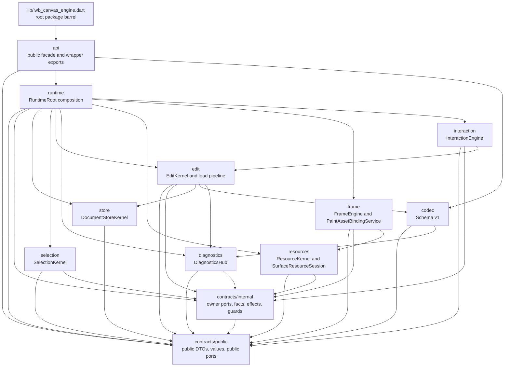
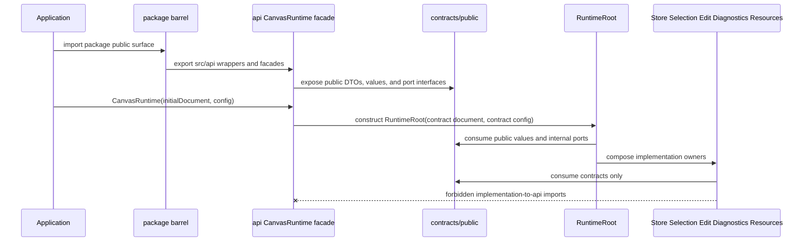
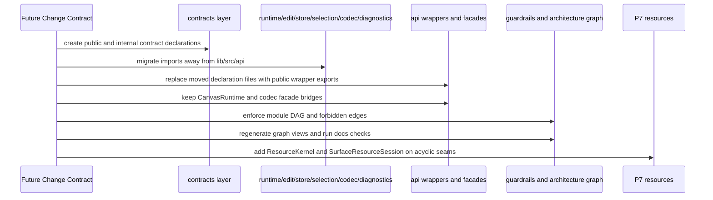

# Design: Acyclic Runtime Public API Architecture

---
date: 2026-05-27
designer: Codex
commit: 28e5e0bb
branch: new-architecture
design_question: "Design an acyclic architecture form that removes cycles between api, runtime, edit, store, selection, codec, and diagnostics before P7, including DTO/value/port ownership, CanvasRuntime to RuntimeRoot binding, target DAG, docs/graph/guardrail updates, and P7 resource/session/frame placement."
---

## Disposition

READY_FOR_CONTRACT

## Product Outcome

The engine keeps the same public package surface for applications, but its
internal modules stop importing the public API implementation as their shared
type library. A later Change Contract should introduce a contract layer beneath
the public facade, migrate internal imports to that layer, keep `CanvasRuntime`
as the public facade over `RuntimeRoot`, and enforce the resulting module DAG
before P7 resource work adds new runtime, resource, session, and frame edges.

Non-goals for this design: do not implement the refactor now; do not change
public payload shapes, command names, codec schema, runtime behavior, or P7
resource semantics; do not rely on allowlists or prose-only reminders to keep
the DAG acyclic.

## Target Contract Classification

- Profile: `ANALYZER_RULE`
- Obligations: `SEAM_MIGRATION`, `PUBLIC_API_CHANGE`

The future work is an ownership refactor, but the contract should use the
`ANALYZER_RULE` profile because the design is not complete unless the new target
DAG is machine-enforced by repository-local import, module-cycle, architecture
graph, and guardrail checks. `PUBLIC_API_CHANGE` is a proof obligation, not a
behavioral change: public declarations are re-homed behind the same root package
barrel, so consumers importing `package:iwb_canvas_engine/iwb_canvas_engine.dart`
must see unchanged signatures and type behavior.

## Research Inputs

- `docs/history/research/2026-05-27-cyclic-dependency-anchors.md` - records the current
  production source cycles, existing guardrail gaps, architecture graph anchors,
  diagram anchors, and future P7 resource/session/frame edges.

## Repository Evidence

- `docs/history/research/2026-05-27-cyclic-dependency-anchors.md:13` - the current source
  graph has cycles through `api -> runtime`, `runtime -> api/edit/selection/store`,
  `edit -> api/store/codec/diagnostics`, `selection -> api/runtime`,
  `store -> api`, `codec -> api/diagnostics`, and `diagnostics -> api`.
- `docs/history/research/2026-05-27-cyclic-dependency-anchors.md:15` - current enforcement
  checks public-API-internal cycles only and explicitly allows the
  `CanvasRuntime -> RuntimeRoot` import.
- `docs/history/research/2026-05-27-cyclic-dependency-anchors.md:17` - the same dependency
  shape is represented in docs, architecture graph registry, generated graph
  views, C4, DFD, sequence diagrams, and plan/design artifacts.
- `lib/iwb_canvas_engine.dart:1` - the package barrel exports public files from
  `lib/src/api/**`.
- `docs/architecture/02_package_boundaries.md:164` - the package layout states
  that `lib/iwb_canvas_engine.dart` exports only `src/api/**`.
- `lib/src/api/canvas_runtime.dart:22` - `CanvasRuntime` imports
  `../runtime/runtime_root.dart`.
- `lib/src/api/canvas_runtime.dart:34` - `CanvasRuntime` constructs a
  `RuntimeRoot`.
- `lib/src/api/canvas_runtime.dart:37` - `CanvasRuntime` stores `RuntimeRoot` as
  its backing runtime implementation.
- `lib/src/runtime/runtime_root.dart:13` - `RuntimeRoot` imports public
  diagnostics types from `lib/src/api`.
- `lib/src/runtime/runtime_root.dart:14` - `RuntimeRoot` imports public document
  types from `lib/src/api`.
- `lib/src/runtime/runtime_root.dart:16` - `RuntimeRoot` imports public runtime
  config, state, and port declarations from `lib/src/api`.
- `lib/src/runtime/runtime_root.dart:18` - `RuntimeRoot` imports edit internals.
- `lib/src/runtime/runtime_root.dart:23` - `RuntimeRoot` imports
  `SelectionKernel`.
- `lib/src/runtime/runtime_root.dart:24` - `RuntimeRoot` imports
  `DocumentStoreKernel`.
- `lib/src/runtime/runtime_root.dart:36` - `RuntimeRoot` is the composition root
  implementing runtime fact ports.
- `lib/src/runtime/runtime_root.dart:42` - `RuntimeRoot` constructs
  `DocumentStoreKernel`.
- `lib/src/runtime/runtime_root.dart:75` - `RuntimeRoot` constructs the
  `LoadDocumentPipeline`.
- `lib/src/runtime/runtime_root.dart:80` - `RuntimeRoot` constructs
  `SelectionKernel`.
- `lib/src/runtime/runtime_config.dart:1` - runtime config imports public action
  types.
- `lib/src/runtime/runtime_config.dart:4` - runtime config imports public
  runtime config declarations.
- `lib/src/runtime/runtime_config.dart:8` - `RuntimeConfig.from` adapts
  `CanvasRuntimeConfig`.
- `lib/src/runtime/document_facts_port.dart:1` - runtime document facts import
  public IDs from `lib/src/api`.
- `lib/src/runtime/frame_facts_port.dart:3` - runtime frame facts import public
  element types from `lib/src/api`.
- `lib/src/runtime/selection_facts_port.dart:1` - runtime selection facts import
  public IDs from `lib/src/api`.
- `lib/src/runtime/selection_membership_port.dart:1` - runtime selection
  membership imports public IDs from `lib/src/api`.
- `lib/src/edit/edit_kernel.dart:3` - edit kernel imports public document types.
- `lib/src/edit/edit_kernel.dart:5` - edit kernel imports public runtime ports.
- `lib/src/edit/draft_document.dart:12` - draft document imports public runtime
  edit result types.
- `lib/src/edit/edit_session.dart:13` - edit session imports public runtime edit
  handle declarations.
- `lib/src/edit/staged_document_load.dart:4` - staged load imports codec
  validation.
- `lib/src/edit/staged_document_load.dart:5` - staged load imports diagnostics.
- `lib/src/edit/staged_document_load.dart:6` - staged load imports store.
- `lib/src/selection/selection_kernel.dart:4` - selection imports runtime
  selection facts.
- `lib/src/selection/selection_kernel.dart:5` - selection imports runtime
  selection membership.
- `lib/src/store/document_store_kernel.dart:8` - store imports public document
  DTOs.
- `lib/src/store/document_store_kernel.dart:11` - store imports public ID types.
- `lib/src/store/committed_document.dart:1` - committed document imports public
  document DTOs.
- `lib/src/store/element_registry.dart:1` - element registry imports public
  document DTOs.
- `lib/src/store/family_tables.dart:6` - family tables import public element
  DTOs.
- `lib/src/store/resource_table.dart:4` - resource table imports public resource
  DTOs.
- `lib/src/api/canvas_codec.dart:3` - the public codec facade imports schema v1
  decoder implementation.
- `lib/src/api/canvas_codec.dart:4` - the public codec facade imports schema v1
  encoder implementation.
- `lib/src/codec/schema_v1_decoder.dart:8` - schema v1 decoder imports public
  contract limits.
- `lib/src/codec/schema_v1_decoder.dart:9` - schema v1 decoder imports public
  document DTOs.
- `lib/src/codec/schema_v1_decoder.dart:17` - schema v1 decoder imports
  diagnostics.
- `lib/src/codec/schema_v1_encoder.dart:7` - schema v1 encoder imports public
  document DTOs.
- `lib/src/codec/schema_v1_encoder.dart:12` - schema v1 encoder imports
  diagnostics.
- `lib/src/codec/validated_import_draft.dart:1` - validated import draft imports
  public document DTOs.
- `lib/src/codec/validated_import_draft.dart:7` - validated import draft imports
  diagnostics.
- `lib/src/diagnostics/diagnostics_hub.dart:1` - diagnostics imports public
  sanitizer declarations.
- `lib/src/diagnostics/diagnostics_hub.dart:2` - diagnostics imports public
  diagnostic policy declarations.
- `lib/src/diagnostics/diagnostics_hub.dart:3` - diagnostics imports public data
  error declarations.
- `docs/architecture/01_runtime_ownership.md:58` - current ownership docs say
  Public API owns stable DTOs, operations, events, and errors.
- `docs/architecture/01_runtime_ownership.md:71` - public runtime observation is
  owned by `RuntimeRoot`.
- `docs/architecture/01_runtime_ownership.md:181` - `RuntimeRoot` is the documented
  composition root for store, facts, selection, edit, interaction, frame, spatial,
  resources, codec, and diagnostics.
- `docs/architecture/02_package_boundaries.md:232` - package boundaries define
  the current forbidden import matrix.
- `docs/architecture/02_package_boundaries.md:235` - API imports to store, edit,
  and frame concrete internals are forbidden.
- `docs/architecture/02_package_boundaries.md:244` - resources may not import
  interaction state.
- `docs/architecture/02_package_boundaries.md:245` - codec may not import Flutter
  widgets or interaction state.
- `docs/architecture/02_package_boundaries.md:246` - diagnostics may not expose
  runtime objects or full scene dumps as public diagnostic data.
- `docs/contracts/public_api_v1.md:361` - the public contract declares
  `CanvasRuntime`.
- `docs/contracts/public_api_v1.md:397` - `state.value` is the single public
  runtime observation snapshot.
- `docs/contracts/public_api_v1.md:471` - `CanvasRuntimeState` is atomic from the
  public API perspective.
- `docs/contracts/public_api_v1.md:791` - public codec functions are API
  declarations for schema v1.
- `docs/contracts/public_api_v1.md:792` - the `CodecBoundary` contract owns
  schema v1 behavior.
- `docs/contracts/public_api_v1.md:1331` - public API owns update DTO field names
  while edit owns effects.
- `docs/contracts/public_api_v1.md:1539` - `CanvasSelectionPort` is the public
  boundary for selection commands.
- `docs/contracts/public_api_v1.md:1857` - runtime stores only resource
  descriptors and render cache references.
- `docs/contracts/public_api_v1.md:1858` - resolved image references live only
  inside the active `SurfaceResourceSession`.
- `docs/contracts/public_api_v1.md:2509` - public data exceptions must not expose
  runtime objects, images, handles, closures, canvases, or full document dumps.
- `docs/contracts/public_api_v1.md:2516` - no public diagnostics stream is
  exported in v1.
- `docs/contracts/codec_boundary.md:43` - production `CodecBoundary` owns schema
  v1 decode/encode only.
- `docs/contracts/codec_boundary.md:72` - decode has no runtime/store side
  effects.
- `docs/contracts/edit_kernel.md:91` - `CommitApplyResult` is the runtime/applier
  seam after document and selection effects install.
- `docs/contracts/edit_kernel.md:99` - `EditKernel` closes and stales the edit
  handle before asking `RuntimeRoot` to consume the apply result.
- `docs/contracts/edit_kernel.md:114` - observer delivery is not a reentrant
  mutation window.
- `docs/contracts/load_document.md:38` - public load orchestration delegates to
  `RuntimeRoot`, not directly to `DocumentStoreKernel`.
- `docs/contracts/load_document.md:64` - load success ordering is staged before
  public state publication.
- `docs/architecture/03_data_model.md:49` - `DocumentStoreKernel` stores compact
  committed tables, not live public `CanvasDocument` state.
- `docs/architecture/03_data_model.md:134` - public runtime observation is one
  immutable `CanvasRuntimeState` snapshot.
- `docs/architecture/03_data_model.md:164` - frame-facing committed facts enter
  frame through `FrameFactsPort`.
- `docs/architecture/03_data_model.md:176` - interaction setting changes,
  preview changes, and resource dirty operations publish through public runtime
  revision domains.
- `docs/contracts/resources.md:53` - `DocumentStoreKernel` owns resource
  descriptors as committed document state.
- `docs/contracts/resources.md:54` - `ResourceKernel` owns non-surface resource
  API and dirty-resource orchestration.
- `docs/contracts/resources.md:55` - each active `CanvasSurface` owns one
  `SurfaceResourceSession`.
- `docs/contracts/resources.md:77` - paint/resource resolution receives
  immutable descriptor snapshots and `resourceRevision` through `FrameFactsPort`.
- `docs/contracts/resources.md:79` - the resource module must not import, read,
  or mutate `DocumentStoreKernel`.
- `docs/contracts/resources.md:101` - `ImageResolveCache` is
  `SurfaceResourceSession` policy, not runtime-wide resource state.
- `docs/contracts/resources.md:166` - resource visual revision is runtime
  resource revision state.
- `docs/contracts/resources.md:168` - public resource port delegates revision
  increment to `ResourceKernel`/`RuntimeRoot`.
- `docs/contracts/resources.md:186` - resolver reentrant public runtime mutation
  must throw `StateError`.
- `docs/contracts/resources.md:208` - runtime resource orchestration marks the
  resolver call boundary active before app callback invocation.
- `docs/implementation/p7_resources_and_images.md:11` - P7 build scope includes
  `ResourceKernel`.
- `docs/implementation/p7_resources_and_images.md:12` - P7 build scope includes
  `SurfaceResourceSession`.
- `docs/implementation/p7_resources_and_images.md:20` - P7 must implement
  resource visual public state revision effects without document revision
  changes.
- `docs/implementation/p7_resources_and_images.md:27` - P7 must reject resolver
  reentrancy.
- `docs/implementation/p7_resources_and_images.md:108` - the P7 resource/session
  surface exposes image resolution only through `SurfaceResourceSession`.
- `docs/architecture/architecture_graph.yaml:456` - graph edge
  `api.public_surface.exports_runtime` exports runtime facade from the public
  package surface.
- `docs/architecture/architecture_graph.yaml:469` - graph edge
  `api.canvas_runtime.composes_runtime_root` records facade-to-runtime-root
  composition.
- `docs/architecture/architecture_graph.yaml:484` - graph edge
  `runtime.root.owns_store` records runtime-root-to-store composition.
- `docs/architecture/architecture_graph.yaml:497` - graph edge
  `runtime.root.owns_selection` records runtime-root-to-selection composition.
- `docs/architecture/architecture_graph.yaml:556` - graph edge
  `codec.schema_v1.uses_public_dto` currently points codec at the public surface.
- `docs/architecture/architecture_graph.yaml:570` - graph edge
  `codec.schema_v1.failures.report_to_diagnostics` records codec diagnostics
  routing.
- `docs/architecture/architecture_graph.yaml:589` - graph edge
  `edit.kernel.mutates_store` records edit-to-store mutation.
- `docs/architecture/architecture_graph.yaml:604` - graph edge
  `load_document.pipeline.replaces_store_document` records load-to-store
  replacement.
- `docs/architecture/architecture_graph.yaml:617` - future P7 graph edge records
  runtime root ownership of resource kernel.
- `docs/architecture/architecture_graph.yaml:632` - future P7 graph edge records
  resource kernel invalidation of surface session.
- `docs/architecture/architecture_graph.yaml:646` - future P9 graph edge records
  frame renderer use of surface resource session.
- `docs/architecture/architecture_graph.yaml:841` - the current graph has only
  one configured forbidden edge.
- `tool/guardrails/src/public_api_import_cycle_checks.dart:36` - current public
  API cycle checks filter to `lib/src/api/**` files.
- `tool/guardrails/src/public_api_import_cycle_checks.dart:50` - current public
  API cycle checks only add edges when targets are also public API files.
- `tool/guardrails/src/core_boundary_checks.dart:442` - current source boundary
  rules are encoded as direct forbidden targets.
- `tool/guardrails/src/core_boundary_checks.dart:256` - current export boundary
  checks reject production `export` directives outside the root public barrel.
- `tool/guardrails/src/core_boundary_checks.dart:592` - the only current allowed
  source-boundary exception is the `CanvasRuntime` facade importing
  `RuntimeRoot`.
- `test/guardrails/import_boundaries_test.dart:53` - tests currently expect that
  `CanvasRuntime` may import only the runtime composition root.
- `tool/architecture_graph/src/phase_closure.dart:253` - architecture graph
  closure checks configured forbidden edges.
- `tool/architecture_graph/src/phase_closure.dart:277` - forbidden edge proof is
  based on actual import facts.
- `docs/verification/guardrails.md:113` - architecture graph checking is the
  standalone strict closure command for selected-phase work.
- `docs/verification/guardrails.md:125` - the graph extractor is not a general
  Dart call-graph analyzer.
- `docs/verification/guardrails.md:170` - current `api.no_public_api_import_cycles`
  covers only the parsed public API import graph.
- `docs/architecture/README.md:30` - `docs/architecture/` owns target-system
  shape.
- `docs/architecture/README.md:32` - `docs/contracts/` owns subsystem behavior
  and invariants.
- `docs/architecture/README.md:34` - `docs/verification/` owns proof plans and
  guardrails.
- `docs/_registry/diagrams.yaml:578` - generated architecture graph views are
  registered from `docs/architecture/architecture_graph.yaml`.

## Design Form Candidates

### Candidate A. Contract Layer Under Public Facade

- Form: introduce `lib/src/contracts/` as the lower contract layer, split into
  public declaration files re-exported by `lib/src/api/**` and non-exported
  internal port/effect contracts used between engine owners. Internal owners
  import `contracts`, not `api`. `CanvasRuntime` remains the public facade in
  `lib/src/api/canvas_runtime.dart` and may construct `RuntimeRoot`; `RuntimeRoot`
  consumes contract types and never imports `api`.
- Why it could work: this removes the `runtime/edit/store/selection/codec/
  diagnostics -> api` back edges while preserving the documented root package
  barrel and public facade construction path. It also gives P7 resource/session
  work a place for resource DTOs, `CanvasResourcePort`, immutable frame/resource
  facts, and resolver reentrancy guard ports that does not point back at public
  API or runtime internals.
- Gate failures or risks: public API guardrails and registry traversal must learn
  that exported declarations can be declared below `api`; wrapper/export files
  must not accidentally expose internal ports. The migration must be sequenced so
  public signatures remain unchanged while internal imports move.

### Candidate B. Move `CanvasRuntime` Itself Into Runtime

- Form: make runtime own the public `CanvasRuntime` class and have the package
  barrel export it directly or through a thin `api` export file.
- Why it could work: it removes `api -> runtime` as a concrete class dependency.
- Gate failures or risks: it makes runtime own a public facade that docs
  currently place under the public API surface, weakens the package layout rule
  that the root barrel exports only `src/api/**`, and can make runtime a public
  declaration owner rather than an implementation owner. It does not by itself
  solve `edit/store/codec/diagnostics -> api` unless a contract layer is also
  introduced, so it has higher source-of-truth churn for less root-cause value.

### Candidate C. Keep DTOs In `api` And Add Adapter Interfaces

- Form: leave public DTOs, value types, and ports in `lib/src/api/**`; add
  runtime-side adapter interfaces or wrapper DTOs so runtime/edit/store/codec can
  avoid some direct imports.
- Why it could work: it avoids moving many declaration files.
- Gate failures or risks: it creates duplicate sources of truth for DTO shape and
  port semantics, risks sync glue between public and internal types, and still
  leaves downstream modules tempted to import `api` for the authoritative shape.
  It treats the current cycles as local import inconvenience rather than an owner
  problem.

### Candidate D. Keep Code Shape And Add Cycle Exceptions

- Form: preserve current imports and update guardrails, architecture graph, or
  allowlists to tolerate the cycles until after P7.
- Why it could work: it is the smallest immediate code movement.
- Gate failures or risks: it does not remove the cycles requested by the task,
  relies on known guardrail blind spots, and makes P7 add resource/session/frame
  edges onto a graph whose shared type owner is already inverted.

## Known Future Pressures

| Pressure | Evidence | How the selected form responds | Accepted cost or risk |
|---|---|---|---|
| P7 needs resource DTOs, a public resource port, dirty-resource public revision effects, session invalidation, and resolver reentrancy without adding resource/runtime/frame cycles. | `docs/contracts/resources.md:53`; `docs/contracts/resources.md:55`; `docs/contracts/resources.md:168`; `docs/contracts/resources.md:186`; `docs/implementation/p7_resources_and_images.md:11`; `docs/implementation/p7_resources_and_images.md:108` | Resource DTOs and `CanvasResourcePort` live in `contracts/public`. Resolver mutation-guard and session invalidation contracts live in `contracts/internal`. `RuntimeRoot` implements/provides guards and consumes resource outcomes; `ResourceKernel` and `SurfaceResourceSession` import contracts, not runtime or api. | P7 must introduce small explicit guard/outcome contracts before wiring resources. That adds a little upfront structure, but prevents session or resource code from calling back into runtime internals. |
| Frame rendering later needs descriptor facts and session access without frame importing store or resources importing frame. | `docs/contracts/resources.md:77`; `docs/contracts/resources.md:79`; `docs/architecture/03_data_model.md:164`; `docs/architecture/architecture_graph.yaml:646` | `FrameFactsPort` and immutable descriptor fact types move to `contracts/internal`; frame can consume `FrameFactsPort` and, later, `SurfaceResourceSession`. Store remains descriptor owner; resources remain session policy owner; neither imports frame. | The contract layer must keep frame fact DTOs narrow and non-public unless intentionally exported. |
| Public API is frozen for root-barrel consumers and public signatures are verified through API contract tests. | `lib/iwb_canvas_engine.dart:1`; `docs/contracts/public_api_v1.md:361`; `docs/contracts/public_api_v1.md:397`; `docs/verification/tests.md:97`; `docs/verification/tests.md:102` | Keep root exports through `lib/src/api/**`. Convert public API files that are pure declarations into wrapper exports from `contracts/public`; keep `api/canvas_runtime.dart` as the public facade and `api/canvas_codec.dart` as public codec wrappers. Run public compile, public type, signature, equality, and export parity checks. | Unsupported direct imports of `package:iwb_canvas_engine/src/api/...` may observe re-export files. The supported consumer surface remains the root package barrel. |
| Existing guardrails do not catch cycles that leave `api` and return through implementation modules. | `tool/guardrails/src/public_api_import_cycle_checks.dart:36`; `tool/guardrails/src/public_api_import_cycle_checks.dart:50`; `docs/verification/guardrails.md:170` | Add an owner-prefix module DAG guardrail and extend `core.import_boundaries` so implementation modules cannot import `lib/src/api/**`, `contracts/**` cannot import implementation owners, and `api` can reach only contract wrappers plus approved facade bridges. | A new structural check needs fixtures for positive and negative imports. The check must be owner-prefix based, not a broad call graph. |
| The architecture graph and generated views already encode public/runtime, codec/public DTO, edit/store, load/store, and future P7/P9 edges. | `docs/architecture/architecture_graph.yaml:469`; `docs/architecture/architecture_graph.yaml:556`; `docs/architecture/architecture_graph.yaml:589`; `docs/architecture/architecture_graph.yaml:617`; `docs/_registry/diagrams.yaml:578` | Update the graph to add `contracts.public` and `contracts.internal_ports`, replace `codec -> api.public_surface` DTO edges with `codec -> contracts.public`, add forbidden implementation-to-api and contracts-to-implementation edges, then regenerate graph-backed views. | Generated views and registry-derived docs will change in the same future contract; handwritten semantic diagrams need targeted updates rather than pretending the graph can replace them. |
| Edit/load correctness depends on ordering and post-commit publication, so the refactor must not alter runtime behavior while moving types. | `docs/contracts/edit_kernel.md:91`; `docs/contracts/edit_kernel.md:99`; `docs/contracts/load_document.md:64`; `docs/contracts/load_document.md:82` | Move type ownership without changing edit/load sequencing. Keep `EditKernel -> RuntimeRoot` result delivery through existing callbacks and contract-owned effect/result types where they cross owners. | Migration tests must be characterization-first: existing edit/load tests should remain behavior-preserving while import owners change. |

## Selected Form

Select Candidate A: a contract layer under the public facade.

The future architecture should add a new lower owner, `lib/src/contracts/`, with
two explicit responsibilities:

- `lib/src/contracts/public/**` owns public DTOs, public value types, public
  errors/diagnostic policies, public runtime state/config types, and public port
  interfaces that are part of the package contract.
- `lib/src/contracts/internal/**` owns non-exported cross-owner ports, immutable
  fact DTOs, effect/result seams, and small runtime guard contracts that are not
  public API.

`lib/src/api/**` remains the package-facing facade layer. Declaration-only API
files should become wrapper export files over `contracts/public/**`. Files that
perform public facade work, such as `api/canvas_runtime.dart` and
`api/canvas_codec.dart`, may import `contracts/public/**` and the owning
implementation seam they adapt:

- `api/canvas_runtime.dart -> runtime/runtime_root.dart` remains the single
  approved public-runtime implementation bridge.
- `api/canvas_codec.dart -> codec/schema_v1_encoder.dart` and
  `api/canvas_codec.dart -> codec/schema_v1_decoder.dart` remain public codec
  wrapper bridges.

`RuntimeRoot` must not import `lib/src/api/**`. It constructs store, selection,
edit, diagnostics, and future resource/session collaborators using
`contracts/public/**` value types and `contracts/internal/**` ports. The edge
`api -> runtime -> contracts` is acyclic because runtime no longer imports api.

Target owner DAG:

| Owner | May import | Must not import |
|---|---|---|
| `contracts/public/**` | Dart SDK, Flutter/Dart UI when public value shapes require it, sibling `contracts/public/**` | `api`, `runtime`, `edit`, `store`, `selection`, `codec`, `diagnostics`, `resources`, `frame`, `interaction`, `spatial`, `flutter_bridge` |
| `contracts/internal/**` | Dart SDK, Flutter/Dart UI when fact shapes require it, `contracts/public/**`, sibling `contracts/internal/**` | `api`, implementation owners, public facade wrappers |
| `diagnostics/**` | `contracts/public/**`, `contracts/internal/**` diagnostics fact shapes | `api`, `runtime`, `store`, `edit`, `frame`, `surface`, `codec` |
| `store/**` | `contracts/public/**`, store-private files | `api`, `runtime`, `selection`, `edit`, `interaction`, `frame`, `flutter_bridge`, `resources` |
| `selection/**` | `contracts/public/**`, `contracts/internal/**` selection membership/facts | `api`, `runtime`, `store`, `edit`, `interaction`, `frame`, `flutter_bridge` |
| `codec/**` | `contracts/public/**`, `contracts/internal/**` diagnostic payload shapes, `diagnostics/**` | `api`, `runtime`, `store`, `edit`, `frame`, `interaction`, `resources`, `flutter_bridge` |
| `edit/**` | `contracts/public/**`, `contracts/internal/**`, `store/**`, `codec/**`, `diagnostics/**` | `api`, `runtime`, `selection`, `interaction`, `frame`, `resources`, `flutter_bridge` |
| `resources/**` | `contracts/public/**`, `contracts/internal/**`, resource-private session/cache files, diagnostics/probe contracts if needed | `api`, `runtime`, `store`, `edit`, `selection`, `interaction`, `frame`, `flutter_bridge` |
| `frame/**` | `contracts/public/**`, `contracts/internal/**`, `resources/surface_resource_session.dart` after P9 binding, frame-private collaborators | `api`, `runtime`, `store`, `edit`, `selection`, `interaction`, `flutter_bridge`; no concrete public document projection as paint input |
| `interaction/**` | `contracts/public/**`, `contracts/internal/**`, `edit/**`, interaction-private collaborators | `api`, `runtime`, `store`, `selection`, `frame`, `resources` except explicitly allowed read/command ports in contracts |
| `runtime/**` | `contracts/public/**`, `contracts/internal/**`, `store/**`, `selection/**`, `edit/**`, `diagnostics/**`, and future `resources/**`, `interaction/**`, `frame/**`, `spatial/**` composition seams | `api`, `flutter_bridge`, public facade wrappers |
| `api/**` | `contracts/public/**`; approved implementation bridges from public facade files to `runtime/**` and `codec/**` | `contracts/internal/**`, concrete store/edit/selection/frame/interaction/resources/diagnostics/spatial/flutter_bridge internals except the named bridges |
| `flutter_bridge/**` | package public surface and approved runtime/surface attachment contracts | legacy package/runtime paths, contract-internal owner state unless exposed through public/surface contracts |

The target DAG is intentionally directional rather than symmetric. Public API
adapts into implementation; implementation owners consume lower contracts; lower
contracts cannot call back upward. Runtime composition points at implementation
owners, but implementation owners do not point back at runtime except through
contract-owned callback, guard, or result seams.

Diagnostics is a lower recording/projection owner, not a codec callback owner.
Codec may report failures to diagnostics through codec-owned call sites and
contract-owned event shapes; diagnostics must never import codec to understand a
codec-specific event.

For P7:

- `CanvasResource`, `CanvasResourceId`, `CanvasResourceSource`,
  `CanvasResourcePort`, and dirty-resource command payload shapes belong in
  `contracts/public/**` and are re-exported through `api/**`.
- `ResourceKernel` imports those contract types, owns dirty-resource orchestration,
  and returns a contract-owned `ResourceDirtyResult` or equivalent immutable
  outcome to `RuntimeRoot`; it does not import runtime or public facade files.
- `SurfaceResourceSession` stays under `resources/**`, owns resolver generation,
  cache, budget, and same-frame suppression, and imports only contract types plus
  resource-private files. It must not import runtime, frame, or api.
- Resolver reentrancy uses a `contracts/internal/**` guard seam implemented by
  `RuntimeRoot` and provided to the session/resource orchestration. The session
  marks resolver callback entry through the guard before invoking the app
  callback, and public runtime mutation checks the same guard before mutation.
- Frame rendering later consumes immutable descriptor facts through
  `FrameFactsPort` in `contracts/internal/**` and consumes
  `SurfaceResourceSession` only at `PaintAssetBindingService`. This preserves the
  future graph shape `runtime -> resources -> session` and
  `frame -> session` without `resources -> frame` or `resources -> runtime`.

## Hard Gate Check

| Gate | Result | Evidence |
|---|---|---|
| Root cause | pass | The cause is the public API directory doubling as the shared internal type owner, shown by implementation imports from runtime, edit, store, codec, and diagnostics into `lib/src/api/**`: `docs/history/research/2026-05-27-cyclic-dependency-anchors.md:13`; `lib/src/runtime/runtime_root.dart:13`; `lib/src/edit/edit_kernel.dart:5`; `lib/src/store/document_store_kernel.dart:8`; `lib/src/codec/schema_v1_decoder.dart:9`; `lib/src/diagnostics/diagnostics_hub.dart:1`. Candidate A moves that owner below all implementation modules. |
| Ownership | pass | Public behavior remains documented in the public API contract, while `RuntimeRoot` remains runtime observation owner and composition root: `docs/contracts/public_api_v1.md:361`; `docs/architecture/01_runtime_ownership.md:71`; `docs/architecture/01_runtime_ownership.md:181`. The new contract layer owns declaration placement and cross-owner type seams. |
| Source of truth | pass | The design keeps one declaration source for public DTOs/ports and re-exports it through `api`; it rejects adapter DTO duplication. Current docs show `lib/iwb_canvas_engine.dart` exports `src/api/**`, and the future contract must preserve that supported root-barrel surface: `lib/iwb_canvas_engine.dart:1`; `docs/architecture/02_package_boundaries.md:164`. |
| Boundary | pass | Entry boundaries stay public `CanvasRuntime` and public codec functions: `docs/contracts/public_api_v1.md:361`; `docs/contracts/public_api_v1.md:791`. Exit boundaries from the public facade are named implementation bridges to `RuntimeRoot` and schema v1 codec. Internal owner boundaries move to `contracts/internal/**` ports and immutable outcomes. |
| Dependency direction | pass | Target direction is `api -> implementation -> contracts` and `implementation -> contracts`, with no `implementation -> api` and no `contracts -> implementation`. Current guardrails already encode direct source-boundary checks and can be extended: `tool/guardrails/src/core_boundary_checks.dart:442`; `tool/guardrails/src/core_boundary_checks.dart:592`. |
| State/data | pass | Committed document state stays in `DocumentStoreKernel`, public runtime snapshots stay in `RuntimeRoot`, selection stays in `SelectionKernel`, and resource session cache stays in `SurfaceResourceSession`: `docs/architecture/03_data_model.md:49`; `docs/architecture/03_data_model.md:134`; `docs/contracts/public_api_v1.md:1539`; `docs/contracts/resources.md:101`. The contract layer owns value declarations, not live state. |
| Seam | pass | Successor seams are `contracts/public/**` for exported DTO/value/port declarations and `contracts/internal/**` for non-exported owner ports, effect/result types, and guards. Retired seams are implementation imports from `lib/src/api/**` and selection imports from `runtime/**`. Consumer order: contracts first, then internal import migration, then facade wrappers, then graph/docs/guardrails, then P7 resource/session code. Retirement gate: module DAG guardrail and architecture graph forbidden edges report no implementation-to-api imports. |
| Temporal/reentrancy | pass | The architecture refactor preserves existing edit/load ordering: edit apply result is delivered after atomic install and handle closure, and load publishes after staged install: `docs/contracts/edit_kernel.md:91`; `docs/contracts/edit_kernel.md:99`; `docs/contracts/load_document.md:64`; `docs/contracts/load_document.md:82`. P7 reentrancy pressure is routed through a contract-owned resolver mutation guard so `SurfaceResourceSession` does not import runtime: `docs/contracts/resources.md:186`; `docs/contracts/resources.md:208`. Synchronous callback surfaces to verify are edit callbacks, commit effect observers, load cleanup boundary callbacks, and resolver callbacks. Runtime remains the guard owner; public observation order remains post-accepted mutation snapshot publication. |
| All-or-nothing behavior | pass | No runtime all-or-nothing behavior changes are introduced by the architecture form. The future source migration has an irreversible point only when `api/**` wrappers replace moved declarations; fallible work before that point is analyzer-clean contract extraction and internal import migration. Later work is guarded by public compile/export/signature tests and module-DAG checks. Runtime edit/load all-or-nothing behavior remains owned by existing edit/load contracts: `docs/contracts/edit_kernel.md:91`; `docs/contracts/load_document.md:96`. |
| Verification | pass | Existing public-only cycle checks are insufficient, so verification must add module DAG proof plus boundary and architecture graph forbidden edges: `tool/guardrails/src/public_api_import_cycle_checks.dart:36`; `tool/guardrails/src/public_api_import_cycle_checks.dart:50`; `tool/architecture_graph/src/phase_closure.dart:253`; `docs/verification/guardrails.md:113`. |
| Future pressure | pass | P7 resource/session/frame edges are known and absorbed by the contracts layer and target DAG: `docs/architecture/architecture_graph.yaml:617`; `docs/architecture/architecture_graph.yaml:632`; `docs/architecture/architecture_graph.yaml:646`; `docs/implementation/p7_resources_and_images.md:108`. |

## Lock-Required Facts

- Owner: `lib/src/contracts/**` becomes the declaration and cross-owner contract
  owner for shared DTO/value/port types; `lib/src/api/**` remains the public
  facade/export owner; `RuntimeRoot` remains the runtime composition owner.
- Owning layer/module/document family: architecture docs own target-system
  shape; public API docs own consumer behavior; verification docs and guardrail
  tooling own executable proof. Evidence: `docs/architecture/README.md:30`;
  `docs/architecture/README.md:32`; `docs/architecture/README.md:34`.
- Seam: `contracts/public/**` for public contract declarations re-exported by
  API; `contracts/internal/**` for internal owner ports, immutable facts,
  effect/result seams, and P7 resolver mutation guard contracts.
- Dependency/import direction: lower contracts import no owner modules; internal
  implementation modules import contracts and allowed lower peers; runtime
  composes owner implementations without importing api; api bridges into runtime
  and codec only through named facade files.
- State/data ownership: contract files own declarations only; no mutable runtime,
  store, selection, resource, frame, interaction, diagnostic, or codec state moves
  into contracts. Store remains committed data owner, runtime remains public
  snapshot owner, selection remains selected-id owner, resources remain session
  policy owner.
- Entry boundaries: root package barrel; `CanvasRuntime` constructor and getters;
  public codec functions; public edit/selection/resource/camera/tool/command
  ports; future surface attachment/resolver entry.
- Exit boundaries: `CanvasRuntime -> RuntimeRoot`; `canvas_codec -> schema_v1`;
  `RuntimeRoot -> store/selection/edit/diagnostics/resources/session` composition;
  `ResourceKernel` outcomes back to `RuntimeRoot`; `FrameFactsPort` immutable
  facts into frame; `SurfaceResourceSession` asset binding into frame.
- File placement basis: public declarations currently under `api/**` move to
  `contracts/public/**` when they are stable public DTOs, public value types,
  public errors/diagnostic policies, public action/event payloads, or public port
  interfaces. Non-public `DocumentFactsPort`, `FrameFactsPort`,
  `SelectionFactsPort`, `SelectionMembershipPort`, `LoadInteractionBoundary`,
  commit observer/effect/result contracts when crossing owners, and future
  resolver mutation guard contracts move to `contracts/internal/**`.
- Execution order constraints: migrate contracts before moving internal imports;
  migrate runtime/edit/store/selection/codec/diagnostics away from api before
  tightening guardrails; preserve edit/load publication ordering; add P7 guard
  seams before resource/session resolver callbacks.
- Rejected alternatives: moving `CanvasRuntime` public class into runtime; keeping
  DTOs in `api` and adding adapters; tolerating cycles with allowlists.
- Verification strategy: public API compatibility tests, focused behavior
  characterization tests for edit/load/codec/diagnostics, `dart analyze`, DCM,
  guardrail runner, module DAG guardrail, architecture graph phase closure for
  P6/P7 as appropriate, generated graph view check, and docs checks when docs are
  updated.

## Diagram Need Assessment

| Design question | Needed? | Diagram kind | Reason |
|---|---:|---|---|
| Does the design change ownership, layer, package, or component boundaries? | yes | c4 | The central decision is adding `contracts/public` and `contracts/internal` below API and implementation owners. |
| Does it change data flow, state ownership, cache ownership, resource movement, or lifecycle movement? | yes | data_flow | Value declarations and fact/port flows move from `api` to contracts; live state ownership does not move. |
| Does it depend on call order, lifecycle order, sync/async ordering, failure ordering, or migration order? | yes | sequence | The migration must move contracts, then imports, then wrappers, then guardrails; P7 resolver guard ordering also matters. |
| Does it introduce or alter modes, statuses, terminal states, sessions, or transition rules? | no | none | It does not change runtime modes or session state machines; P7 session lifecycle semantics remain as already documented. |
| Does it create, replace, migrate, or retire a shared seam? | yes | c4/data_flow/sequence | It creates contract-layer seams and retires implementation imports from `api`. |
| Does it change public API consumer flow, payload shape, or compatibility behavior? | yes | data_flow | Consumer behavior should remain the same, but public declarations are re-homed behind wrappers, so compatibility proof is required. |
| Does it introduce or change analyzer, guardrail, or structural-recognition pipeline behavior? | yes | data_flow/sequence | A module DAG guardrail and graph forbidden-edge updates are required to enforce the target DAG. |

## Provisional Diagrams

### Target Owner DAG

Forbidden by design: every arrow from implementation owners back to `api`, every
arrow from `contracts/**` to implementation owners, `resources -> runtime`,
`resources -> frame`, `selection -> runtime`, and any `api` implementation import
outside named facade bridges.

### Public Facade Binding

### Migration Order

## Source-Of-Truth Impact

A later Change Contract must update these durable sources of truth:

- `docs/architecture/01_runtime_ownership.md` - split "Public API owns stable
  DTOs" into public facade ownership plus contract-layer declaration ownership;
  keep `RuntimeRoot` as public runtime observation/composition owner.
- `docs/architecture/02_package_boundaries.md` - add `lib/src/contracts/**` to
  package layout; document allowed owner DAG; document that API declaration files
  may be wrapper exports; remove or narrow the current one-off
  `CanvasRuntime -> RuntimeRoot` exception into named facade bridge policy.
- `docs/architecture/03_data_model.md` - clarify that public document/runtime
  DTO declarations live in contracts but committed data and projection ownership
  remain store/runtime owned.
- `docs/contracts/public_api_v1.md` - preserve public signatures while recording
  that public declarations can be declared in the contract layer and exported by
  the public barrel.
- `docs/contracts/codec_boundary.md` and schema v1 docs - replace "codec uses
  public DTOs" source dependency language with "codec uses public contract DTOs
  re-exported by the public API".
- `docs/contracts/edit_kernel.md` and `docs/contracts/load_document.md` - update
  seam wording where public runtime/edit types move to contract declarations,
  without changing sequencing.
- `docs/contracts/resources.md` and `docs/implementation/p7_resources_and_images.md`
  - place resource DTOs, resource public port, resource outcomes, resolver
  mutation guard, and session/frame facts on the new contract layer.
- `docs/architecture/architecture_graph.yaml` - add contract nodes and edges,
  replace `codec.schema_v1.uses_public_dto`, add implementation-to-api forbidden
  edges, add contracts-to-implementation forbidden edges, and update P7/P9
  resource/session/frame edges to point through contracts where appropriate.
- `docs/diagrams/c4_container.mmd`, `docs/diagrams/c4_component_runtime.mmd`,
  `docs/diagrams/c4_code_edit_kernel.mmd`, `docs/diagrams/dfd_public_edit.mmd`,
  `docs/diagrams/dfd_schema_v1_decode_encode.mmd`,
  `docs/diagrams/seq_schema_v1_decode_encode_order.mmd`,
  `docs/diagrams/dfd_resource_resolution.mmd`,
  `docs/diagrams/seq_resource_resolution.mmd`,
  `docs/diagrams/dfd_main_paint_frame.mmd`, and
  `docs/diagrams/dfd_cache_invalidation.mmd` - update semantic diagrams that
  currently show API as the DTO provider or omit the contract layer.
- `docs/_registry/sections.yaml`, `docs/_registry/diagrams.yaml`, generated
  indexes, generated diagram catalog, and generated architecture graph views -
  update relationships after source docs and graph change.
- `docs/verification/guardrails.md`,
  `docs/verification/guardrail_design_patterns.md`, and
  `docs/verification/tests.md` - document module-DAG enforcement, public wrapper
  export traversal, the changed export-boundary rule for API wrappers, and new
  guardrail/test coverage.
- `test/smoke/public_incremental_smoke_test.dart` and its existing
  `docs/_registry/sections.yaml` / `docs/verification/tests.md` inventory
  entries - keep the external-consumer smoke on the root public barrel after API
  files become wrapper exports. Update the smoke only if preserving the same
  public user path requires a source change; do not turn it into a private
  `src/**` probe.
- `PLAN.md` and the future linked step document only when a later Change Contract
  implements this design; this design workflow must not edit them now.

## Verification Impact

A later Change Contract should add or update these proof surfaces:

- A structural module DAG guardrail, for example
  `core.acyclic_owner_dependencies`, that maps production import and export
  directives by owner
  prefix (`contracts`, `api`, `runtime`, `edit`, `store`, `selection`, `codec`,
  `diagnostics`, `resources`, `frame`, `interaction`, `spatial`,
  `flutter_bridge`) and rejects SCC cycles plus directive edges not listed in the
  target DAG. If the implementation keeps the DAG checker import-only, the same
  contract must add an explicit export-boundary proof that covers wrapper export
  edges so the combined proof is equivalent to an import+export owner-dependency
  scan.
- `core.import_boundaries` updates to forbid implementation owners importing
  `lib/src/api/**`, forbid `contracts/**` importing implementation owners, forbid
  `api/**` importing or exporting `contracts/internal/**`, allow
  `lib/src/api/**` wrapper exports to `contracts/public/**`, and preserve only
  named facade bridges.
- `api.no_public_api_import_cycles` update or companion proof so wrapper `export`
  files are scanned consistently and public declarations re-exported from
  `contracts/public/**` remain reachable to public registry/signature checks.
- Architecture graph forbidden edges for implementation owners to
  `api.public_surface`, contract nodes to implementation owners, `resources` to
  runtime/frame, `selection` to runtime, and codec to runtime/store/edit/frame.
- Focused guardrail fixture tests for allowed and forbidden owner import/export
  directives, including positive fixtures for `api -> contracts/public` wrapper
  exports and negative fixtures for `runtime -> api`, `edit -> api`,
  `store -> api`, `selection -> runtime`, `codec -> api`, `diagnostics -> api`,
  `contracts -> runtime`, and `api -> contracts/internal` imports or exports.
- Public API compile/export/signature/equality/immutability tests to prove the
  root package public surface remains unchanged.
- `dart test test/smoke/public_incremental_smoke_test.dart` to prove an ordinary
  external Flutter consumer still reaches the decode-to-runtime-to-selection/load
  public path through `package:iwb_canvas_engine/iwb_canvas_engine.dart` after
  public declarations move behind wrapper exports.
- Existing codec roundtrip and no-runtime-side-effect tests to prove moving DTO
  declarations does not change schema behavior.
- Existing edit/load runtime publication tests to prove migration preserves
  sequencing and public snapshot behavior.
- P7 resource tests must prove resource dirty revision/public-state behavior,
  session invalidation, resolver frame budget, same-frame suppression, and
  resolver reentrancy through the contract-owned guard seam.
- Documentation checks:
  `dart run docs/tool/sync_generated_docs.dart --check` and
  `dart run docs/tool/check_docs.dart`.
- Architecture checks for the active phase:
  `dart run tool/architecture_graph/check.dart --phase P7` when P7 edges become
  active, and
  `dart run tool/architecture_graph/generate_views.dart --phase P5 --check` or
  the current repository-selected phase expected by the docs workflow after graph
  view updates.

## Verification Strategy

The future contract should prove behavior preservation first, then enforce the
new architecture:

1. Add `contracts/public/**` and `contracts/internal/**` with declarations moved
   from the current public API and runtime port files, keeping public names,
   constructors, equality, validation, and doc comments intact.
2. Migrate runtime/edit/store/selection/codec/diagnostics imports from
   `lib/src/api/**` and runtime port files to the contract layer.
3. Convert moved public API files into wrapper exports and keep
   `CanvasRuntime`/codec facade implementation bridges.
4. Run public API contract checks, the public incremental smoke test, and focused
   behavior tests before tightening boundaries, so failures identify accidental
   public behavior changes rather than guardrail noise.
5. Add/extend guardrails and architecture graph forbidden edges with positive and
   negative import/export fixtures. The negative proof must use test fixtures or
   injected source maps, not fixture-only directives written into production
   `lib/**`.
6. Update source-of-truth docs, graph, registry, and diagrams, regenerate generated
   outputs, and run docs/architecture checks.
7. Only after the DAG is clean should P7 resource/session implementation add
   resource edges, using contract-owned guards/outcomes to avoid new cycles.

## Change Contract Handoff

- Required profile: `ANALYZER_RULE`
- Required obligations: `SEAM_MIGRATION`, `PUBLIC_API_CHANGE`
- Decisions to carry forward:
  - Introduce `lib/src/contracts/public/**` for exported public DTO/value/port
    declarations.
  - Introduce `lib/src/contracts/internal/**` for non-exported owner ports,
    immutable facts, effect/result seams, and runtime mutation guard contracts.
  - Internal owners must not import `lib/src/api/**`.
  - API wrapper files may export `contracts/public/**`; API files must not import
    or export `contracts/internal/**`. The future contract must update the current
    export guard that otherwise rejects all non-root-barrel exports.
  - `RuntimeRoot` must not import `lib/src/api/**`; it imports contract types and
    composes implementation owners.
  - `CanvasRuntime` remains in `lib/src/api/canvas_runtime.dart` as the public
    facade and may construct `RuntimeRoot` through the single named bridge.
  - `api/canvas_codec.dart` remains the public codec wrapper and may call schema
    v1 codec implementation through named bridge functions.
  - Codec-specific diagnostic event or input shapes must live in
    `contracts/internal/**` or be built on the codec-to-diagnostics call side;
    `diagnostics/**` must not import `codec/**`.
  - P7 resources use contract-owned public resource declarations, resource dirty
    outcomes, and resolver mutation guard ports; `resources/**` must not import
    runtime, api, store, frame, edit, or selection.
  - Future frame binding may import `SurfaceResourceSession`; resources/session
    must not import frame.
  - The existing public incremental smoke must remain an external-consumer root
    barrel proof and must be run after wrapper-export migration; it may not be
    weakened into a private `src/**` or `RuntimeRoot` probe.
- Evidence to cite:
  - Current cycles: `docs/history/research/2026-05-27-cyclic-dependency-anchors.md:13`.
  - Current public facade bridge: `lib/src/api/canvas_runtime.dart:22`;
    `lib/src/api/canvas_runtime.dart:34`.
  - Current runtime back edge to API: `lib/src/runtime/runtime_root.dart:13`;
    `lib/src/runtime/runtime_root.dart:16`.
  - Current edit/store/selection/codec/diagnostics back edges:
    `lib/src/edit/edit_kernel.dart:5`;
    `lib/src/store/document_store_kernel.dart:8`;
    `lib/src/selection/selection_kernel.dart:4`;
    `lib/src/codec/schema_v1_decoder.dart:9`;
    `lib/src/diagnostics/diagnostics_hub.dart:1`.
  - Existing guardrail gap:
    `tool/guardrails/src/public_api_import_cycle_checks.dart:36`;
    `tool/guardrails/src/public_api_import_cycle_checks.dart:50`.
  - Existing allowed bridge:
    `tool/guardrails/src/core_boundary_checks.dart:592`.
  - Runtime ownership:
    `docs/architecture/01_runtime_ownership.md:71`;
    `docs/architecture/01_runtime_ownership.md:181`.
  - P7 resources:
    `docs/contracts/resources.md:53`;
    `docs/contracts/resources.md:55`;
    `docs/contracts/resources.md:186`;
    `docs/implementation/p7_resources_and_images.md:108`.
  - Architecture graph anchors:
    `docs/architecture/architecture_graph.yaml:469`;
    `docs/architecture/architecture_graph.yaml:556`;
    `docs/architecture/architecture_graph.yaml:617`;
    `docs/architecture/architecture_graph.yaml:646`;
    `docs/architecture/architecture_graph.yaml:841`.
- Contract constraints or sequencing facts:
  - Do not edit production behavior and guardrails in an order that blocks
    intermediate analyzer-clean states. Migrate contracts/imports first, then
    tighten guardrails.
  - Do not create adapter DTOs or synchronizers between public and internal types.
  - Do not make `contracts/**` a state owner.
  - Do not export `contracts/internal/**` through the public barrel.
  - Do not satisfy the design by adding allowlists for current cycles.
  - Preserve public root-barrel compatibility and prove it with consumer compile
    fixtures and signature/export checks.
  - Update source-of-truth docs, architecture graph, generated graph views, and
    guardrails in the same future contract that makes the target DAG true.

## Open Decisions

None. The design locks the architecture form for future Change Contract
authoring. Naming inside `contracts/public/**` and `contracts/internal/**` can be
refined during implementation as long as the locked ownership, DAG, public
compatibility, and guardrail requirements remain intact.
