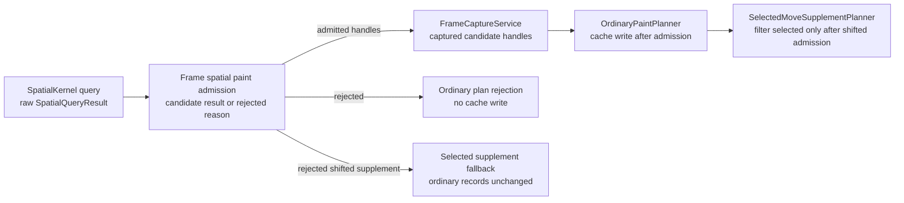
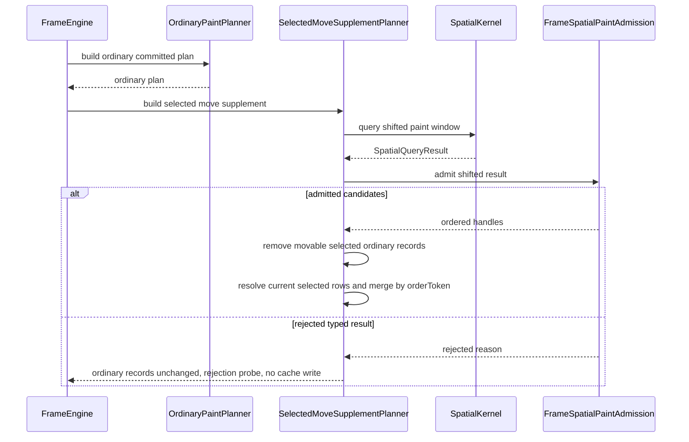
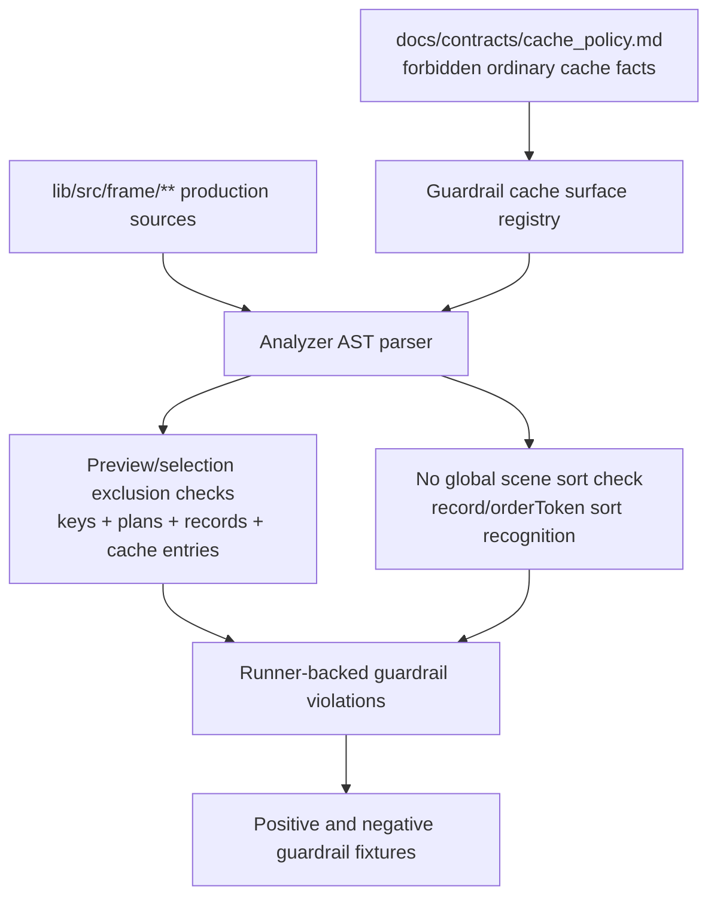

# Design: P9 Frame Rendering Findings Closure

## Disposition

READY_FOR_CONTRACT

## Product Outcome

Frame rendering should fail visibly and predictably at its own boundaries instead of silently dropping selected preview records, relying on ambiguous degenerate drawing behavior, or letting guardrails and source-of-truth docs drift behind implementation. The future implementation should preserve existing public API shapes and later P10/P13 ownership while making P9 frame output, cache policy, passive drawing, guardrail recognition, and documentation alignment directly provable.

Non-goals: do not add P10 interaction preview producers, do not add P13 active surface/session lifecycle, do not expose frame collaborators through the public package barrel, and do not rename cohesive implementation files only to match stale documentation names.

## Target Contract Classification

- Profile: ANALYZER_RULE
- Obligations:
  - BUG_FIX: selected-move shifted spatial failures must not silently produce an empty supplement after selected ordinary records are removed; degenerate accepted draw inputs must render through explicit frame-owned commands; source-of-truth drift must be repaired.
  - SEAM_MIGRATION: `SpatialQueryResult` candidate access must migrate from permissive base getters to explicit candidate-result admission, with frame consumers adopting a frame-owned admission boundary.

## Research Inputs

- `docs/history/research/2026-06-01-p9-frame-rendering-findings.md` - supplied findings covering P9 frame owner layout, selected-move supplement staging, spatial result handling, overlay/committed degenerate rendering, guardrail recognition, and source-of-truth drift.

## Repository Evidence

`Evidence Consequence Link`: each fact below states the decision, boundary, unit, proof surface, or review consequence it supports.

- `docs/history/research/2026-06-01-p9-frame-rendering-findings.md:26` - findings cluster around selected-move supplement staging, overlay eraser/passive painting, guardrail recognition, and source-of-truth layout naming -> supports a multi-surface design rather than a one-call-site patch.
- `docs/architecture/architecture_graph.yaml:398` - durable graph owns P9 as `frame.renderer` -> supports keeping the primary owner under the frame renderer/cache owner.
- `docs/architecture/architecture_graph.yaml:410` - graph evidence says `FrameEngine` owns capture, ordinary planning, selected supplement staging, background/overlay planning, painter output, repaint signals, and bounded cache orchestration -> supports using `FrameEngine` as the coordinating owner.
- `docs/architecture/architecture_graph.yaml:413` - graph actual declarations include `FrameEngine`, `FrameCaptureService`, `OrdinaryPaintPlanner`, and `SelectedMoveSupplementPlanner` -> supports preserving the implemented collaborator split instead of adding a replacement facade.
- `lib/src/frame/frame_engine.dart:33` - `FrameEngine` is the implemented frame facade -> supports placing frame hardening under this owner.
- `lib/src/frame/frame_engine.dart:97` - main frame capture runs before ordinary planning and selected supplement staging -> supports sequencing selected supplement fallback after capture but before selected-record removal.
- `lib/src/frame/frame_engine.dart:99` - selected supplement planning consumes the ordinary plan -> supports preserving ordinary planning as the committed cache boundary and making supplement failure frame-local.
- `lib/src/frame/frame_capture_service.dart:55` - frame capture reads a raw spatial query result -> supports migrating frame capture away from permissive result candidate getters.
- `lib/src/frame/frame_capture_service.dart:59` - capture currently consumes `spatialResult.candidates` directly -> supports an explicit spatial admission seam that prevents accidental non-candidate consumption.
- `lib/src/frame/frame_capture_service.dart:90` - capture adds selected ids after spatial candidates -> supports selected-move fallback preserving ordinary records when shifted supplement admission fails.
- `lib/src/geometry/spatial_query_result.dart:3` - `SpatialQueryResult` is the sealed spatial result root -> supports changing the internal result seam at the geometry owner.
- `lib/src/geometry/spatial_query_result.dart:6` - base spatial result exposes `hasCandidates => false` -> supports retiring permissive base candidate state.
- `lib/src/geometry/spatial_query_result.dart:7` - base spatial result exposes `candidates => const []` -> supports the root-cause migration because non-candidate results can look like valid empty candidate results.
- `lib/src/geometry/spatial_query_result.dart:19` - only `SpatialCandidatesResult` returns ordered candidates -> supports making candidate access explicit on candidate results.
- `lib/src/geometry/spatial_query_result.dart:27` - `SpatialBudgetExceededResult` is a non-candidate typed result -> supports negative proof for rejected shifted supplement admission.
- `lib/src/geometry/spatial_query_result.dart:41` - `SpatialInvalidIndexResult` is a non-candidate typed result -> supports negative proof for invalid-index fallback.
- `lib/src/geometry/spatial_query_result.dart:47` - `SpatialStaleCandidateResult` is a non-candidate typed result -> supports stale structural result proof.
- `docs/contracts/spatial_kernel.md:102` - spatial query hot path ends in typed results -> supports treating typed non-candidate results as explicit rejection, not empty success.
- `docs/contracts/spatial_kernel.md:105` - budget-exceeded results contain no partial candidates -> supports rejecting supplement admission instead of building partial shifted records.
- `lib/src/frame/ordinary_paint_planner.dart:83` - ordinary planning already rejects captured spatial results that are not `SpatialCandidatesResult` -> supports reusing this policy for selected supplement admission instead of inventing a different meaning.
- `test/frame/fixtures/paint_plan_write_all_or_nothing_fixture.dart:64` - ordinary tests inject failed spatial admission -> supports a focused selected-supplement analog.
- `test/frame/fixtures/paint_plan_write_all_or_nothing_fixture.dart:81` - ordinary failed admission is asserted as rejected -> supports direct proof that no ordinary cache write occurs on failed admission.
- `lib/src/frame/selected_move_supplement_planner.dart:65` - selected ordinary records are currently filtered before supplement records are built -> supports moving fallible shifted spatial admission before this irreversible per-frame removal.
- `lib/src/frame/selected_move_supplement_planner.dart:138` - selected supplement performs a shifted spatial query -> supports placing the new admission boundary at that shifted-query result.
- `lib/src/frame/selected_move_supplement_planner.dart:139` - selected supplement iterates `spatial.candidates` directly -> supports retiring raw candidate iteration in supplement staging.
- `test/frame/fixtures/selected_supplement_staging_no_global_sort_fixture.dart:73` - current supplement fixture only returns `SpatialCandidatesResult` -> supports adding non-candidate shifted-result fixtures.
- `docs/history/research/2026-06-01-p9-frame-rendering-findings.md:731` - research found no selected-supplement fixture injecting `SpatialBudgetExceededResult`, `SpatialInvalidIndexResult`, or `SpatialStaleCandidateResult` into the shifted query -> supports adding direct negative proof.
- `lib/src/contracts/public/canvas_preview.dart:47` - public eraser preview accepts an iterable corridor -> supports preserving public input shape while fixing rendering at the frame boundary.
- `lib/src/contracts/public/canvas_preview.dart:170` - eraser preview stores the copied corridor -> supports painter proof using immutable captured preview data.
- `lib/src/frame/overlay_preview_planner.dart:71` - eraser overlay primitive is frame-private -> supports changing frame primitive/painter behavior without public API churn.
- `lib/src/frame/overlay_preview_planner.dart:128` - eraser previews are admitted into overlay primitives -> supports proof at overlay primitive plus painter surfaces.
- `lib/src/frame/overlay_frame_painter.dart:77` - eraser primitive paints through `drawPoints` -> supports replacing ambiguous one-point corridor drawing with explicit frame-owned point/circle handling.
- `lib/src/frame/overlay_frame_painter.dart:78` - eraser drawing uses `PointMode.polygon` -> supports the degenerate-corridor bug-fix obligation.
- `test/frame/fixtures/overlay_preview_admission_fixture.dart:43` - one-point eraser previews are admitted today -> supports preserving admission and proving actual visual output.
- `docs/history/research/2026-06-01-p9-frame-rendering-findings.md:735` - research found no raster/golden/pixel/recorded-canvas assertion for one-point eraser output -> supports adding direct pixel or recorded paint proof.
- `lib/src/frame/overlay_preview_planner.dart:28` - stroke overlay primitives carry point lists -> supports applying the same degenerate drawable policy to pencil and marker previews.
- `lib/src/frame/overlay_frame_painter.dart:47` - pencil and marker previews also paint through `PointMode.polygon` -> supports closing the entire one-point overlay stroke class, not only eraser.
- `test/frame/fixtures/overlay_preview_admission_fixture.dart:18` - overlay admission includes one-point pencil input -> supports direct overlay point-rendering proof.
- `test/frame/fixtures/overlay_preview_admission_fixture.dart:25` - overlay admission includes one-point marker input -> supports direct overlay point-rendering proof.
- `lib/src/contracts/public/canvas_element.dart:235` - committed stroke elements allow non-empty point lists, including length one -> supports fixing committed one-point stroke rendering in frame paint, not by public validation.
- `lib/src/geometry/geometry_policy.dart:363` - one-point stroke bounds receive a minimum half-thickness floor -> supports the product expectation that one-point strokes are drawable/hittable.
- `docs/contracts/geometry.md:118` - geometry contract names one-point stroke as a circular hit -> supports drawing one-point strokes as circles for visual/hit consistency.
- `lib/src/frame/render_family_caches.dart:130` - committed stroke paths currently start with `moveTo` -> supports avoiding move-only paths as the sole render representation for one-point strokes.
- `lib/src/frame/main_frame_record_painter.dart:173` - committed strokes paint through cached paths -> supports either classified stroke render primitives or painter-side degenerate handling.
- `lib/src/contracts/public/canvas_element.dart:287` - committed line elements validate start/end without requiring different points -> supports preserving same-point line compatibility.
- `lib/src/geometry/geometry_policy.dart:349` - same-point line bounds receive a minimum half-thickness floor -> supports explicit same-point line drawing as a visible point.
- `lib/src/frame/main_frame_record_painter.dart:189` - committed lines paint through `drawLine` -> supports replacing ambiguous equal-endpoint drawing with explicit point handling.
- `docs/history/research/2026-06-01-p9-frame-rendering-findings.md:737` - research found no raster/golden/pixel/recorded-canvas assertion for one-point pencil/marker previews, committed one-point strokes, or same-point lines -> supports direct rendering tests for the whole degenerate class.
- `lib/src/frame/captured_frame.dart:24` - captured frame inputs include `selectionStyle` -> supports using captured style for marquee overlay output.
- `lib/src/contracts/public/canvas_surface_styles.dart:46` - `CanvasSelectionStyle` exposes color -> supports styled marquee stroke/fill.
- `lib/src/contracts/public/canvas_surface_styles.dart:47` - `CanvasSelectionStyle` exposes stroke width -> supports styled marquee stroke.
- `lib/src/contracts/public/canvas_surface_styles.dart:48` - `CanvasSelectionStyle` exposes marquee fill opacity -> supports styled marquee fill.
- `docs/diagrams/seq_overlay_paint.mmd:28` - overlay sequence expects marquee fill and stroke primitive construction -> supports repairing the rectangle-only/default-paint implementation.
- `docs/diagrams/seq_overlay_paint.mmd:46` - overlay sequence says primitive construction uses captured selectionStyle -> supports mandatory source-of-truth repair or implementation alignment.
- `lib/src/frame/overlay_preview_planner.dart:21` - current marquee primitive stores only a rectangle -> supports adding captured style fields to the primitive.
- `lib/src/frame/overlay_frame_painter.dart:32` - current marquee painter uses default stroke paint -> supports direct style proof.
- `docs/contracts/cache_policy.md:65` - ordinary cache policy says `OrdinaryPaintRecordCache` stores ordinary committed render records only -> supports making guardrail recognition cover keys, plans, records, and entries.
- `docs/contracts/cache_policy.md:72` - cache policy forbids selected-move supplement records and selected-move deltas in ordinary cache -> supports guardrail token/AST checks across all ordinary cache surfaces.
- `docs/contracts/cache_policy.md:74` - cache policy forbids selected ids, selection flags, and selectionRevision in ordinary cache -> supports guardrail negative fixtures for selection state.
- `tool/guardrails/src/frame_cache_guardrail_checks.dart:214` - cache exclusion guardrails currently use `_checkCachedPaintSurfacesExclude` -> supports repairing that scanner rather than adding prose-only rules.
- `tool/guardrails/src/frame_cache_guardrail_checks.dart:232` - cached paint surface list currently starts at `PaintPlanKey` -> supports using a single guardrail-local surface registry.
- `tool/guardrails/src/frame_cache_guardrail_checks.dart:238` - current cache scanner includes `PaintPlan` -> supports continuing to scan existing surfaces.
- `lib/src/frame/paint_plan.dart:102` - `OrdinaryPaintRecordCacheEntry` is a cache entry surface -> supports adding it to recognition because it stores cached records.
- `tool/guardrails/src/frame_cache_guardrail_checks.dart:305` - no-global-sort scanner starts from textual `.sort(` search -> supports migrating to analyzer AST recognition with bypass fixtures.
- `tool/guardrails/src/frame_cache_guardrail_checks.dart:321` - current no-global-sort guardrail reads only a local statement/fallback substring -> supports negative fixtures for multi-line, cascade, and named-comparator bypasses.
- `test/guardrails/frame_no_global_scene_sort_guardrail_test.dart:21` - existing guardrail rejects a direct inline comparator -> supports preserving the positive recognition case.
- `test/guardrails/frame_no_global_scene_sort_guardrail_test.dart:32` - existing guardrail allows a local string sort -> supports preserving false-positive control fixtures.
- `tool/guardrails/src/guardrail_registry.dart:196` - frame no-global-sort guardrail is registered in blocking/frame suites -> supports keeping the guardrail runner-backed.
- `tool/guardrails/src/guardrail_executor.dart:322` - guardrail executor routes `frame.no_global_scene_sort` to the frame/cache checker -> supports repairing the existing guardrail path.
- `docs/verification/guardrails.md:212` - guardrail docs describe selected supplement merge/no-global-sort -> supports source-of-truth repair when scanner semantics change.
- `docs/verification/guardrails.md:213` - guardrail docs describe preview exclusion -> supports updating docs to match actual recognized surfaces.
- `docs/verification/guardrails.md:214` - guardrail docs describe selection exclusion -> supports updating docs to match actual recognized surfaces.
- `docs/architecture/02_package_boundaries.md:115` - package layout lists `captured_main_frame.dart` -> supports source-of-truth file layout repair.
- `docs/architecture/02_package_boundaries.md:116` - package layout lists `captured_overlay_frame.dart` -> supports source-of-truth file layout repair.
- `docs/architecture/02_package_boundaries.md:125` - package layout lists `repaint_bus.dart` -> supports source-of-truth file layout repair.
- `docs/architecture/02_package_boundaries.md:188` - package boundary text says target frame collaborator file names are implementation layout names -> supports updating docs to actual cohesive names instead of renaming code mechanically.
- `lib/src/frame/captured_frame.dart:77` - actual file contains `CapturedMainFrame` -> supports documenting `captured_frame.dart` as the cohesive captured-frame owner.
- `lib/src/frame/captured_frame.dart:87` - actual file contains `CapturedOverlayFrame` -> supports keeping both captured frame models in the same cohesive file.
- `lib/src/frame/frame_repaint_signal.dart:1` - actual repaint output file is `frame_repaint_signal.dart` -> supports docs repair to actual signal file.
- `docs/architecture/01_runtime_ownership.md:200` - runtime ownership tree lists `SurfaceResourceSession` under `RuntimeRoot` while saying it is owned by active `CanvasSurface` -> supports source-of-truth correction.
- `docs/contracts/resources.md:63` - resource contract says `RuntimeRoot` holds the nullable active `ResourceSessionInvalidationSink` -> supports correcting runtime ownership docs.
- `docs/contracts/resources.md:65` - resource contract says active future `CanvasSurface` owns `SurfaceResourceSession` -> supports avoiding P13 lifecycle pull-forward.
- `docs/history/designs/2026-05-28-p7-resource-session-resolver-lifecycle.md:158` - P7 design records the nullable active sink split -> supports keeping resource-session ownership consistent.
- `docs/diagrams/seq_main_paint.mmd:100` - main paint sequence enters resource-session image binding without naming the frame-pass reset -> supports diagram/source-of-truth repair.
- `lib/src/frame/paint_asset_binding_service.dart:28` - implementation calls `session.beginFrameResourcePass()` before resolving images -> supports diagram update, not code invention.
- `lib/src/resources/surface_resource_session.dart:35` - frame-pass reset clears per-frame resolver budget and null suppression -> supports temporal surface closure.
- `docs/_registry/sections.yaml:619` - section 15 registry test inventory begins with a subset of P9 tests -> supports registry repair.
- `docs/implementation/p9_frame_rendering_and_caches.md:162` - P9 implementation note lists `test.frame.main_overlay_capture` -> supports registry inventory alignment.
- `docs/implementation/p9_frame_rendering_and_caches.md:165` - P9 implementation note lists `test.frame.paint_asset_binding_service` -> supports registry inventory alignment.
- `docs/implementation/p9_frame_rendering_and_caches.md:178` - P9 implementation note lists cache proof tests -> supports registry inventory alignment.
- `docs/verification/tests.md:307` - verification inventory lists frame P9 tests -> supports updating docs/registry through existing test source-of-truth flow.
- `docs/indexes/by_test_area.md:198` - generated index maps only registry-backed selected supplement test subset -> supports running generated-doc sync after registry repair.

## Design Form Candidates

### Candidate A. Patch Each Symptom In Place

- Form: add an `is SpatialCandidatesResult` check inside `SelectedMoveSupplementPlanner`, branch one-point eraser drawing inside `OverlayFramePainter`, add `OrdinaryPaintRecordCacheEntry` to the existing surface list, and edit stale docs directly.
- Why it could work: it is the smallest implementation diff and would close the specific examples named by the research.
- Gate failures or risks: it leaves the permissive `SpatialQueryResult.candidates` root cause available to future consumers, leaves pencil/marker/committed stroke/same-point line behavior split across painter call sites, leaves guardrail bypasses mostly textual, and treats source-of-truth drift as manual cleanup rather than a proof obligation.

### Candidate B. Owner-Level Frame Hardening With Explicit Seams

- Form: migrate spatial candidate access to explicit candidate admission, make frame consumers use a frame-owned spatial paint admission boundary, introduce one frame-owned drawable degenerate policy used by overlay and main painters, upgrade frame/cache guardrails to AST-backed recognition over a single ordinary-cache surface registry, and repair docs/registry/diagram source-of-truth drift through the future contract.
- Why it could work: it fixes each class at the owner where the weakness originates: geometry owns typed spatial results, frame owns frame admission/fallback and drawing commands, guardrails own executable recognition, and docs/registries own durable source-of-truth alignment.
- Gate failures or risks: it is broader than the narrow failing examples and requires careful sequencing so the spatial seam migration does not break unrelated spatial tests without replacement helpers.

### Candidate C. Public Input Tightening

- Form: reject one-point preview corridors, one-point stroke elements, and same-point line elements at public constructors, then keep current painter implementation mostly unchanged.
- Why it could work: it avoids ambiguous drawing behavior by preventing degenerate data from reaching frame painters.
- Gate failures or risks: it breaks existing public compatibility and contradicts geometry behavior that treats one-point strokes and same-point lines as meaningful bounded/hittable shapes (`docs/contracts/geometry.md:118`, `lib/src/geometry/geometry_policy.dart:349`, `lib/src/geometry/geometry_policy.dart:363`).

### Candidate D. Rename Implementation To Match Stale Docs

- Form: split `captured_frame.dart` into `captured_main_frame.dart` and `captured_overlay_frame.dart`, rename `frame_repaint_signal.dart` to `repaint_bus.dart`, and update imports.
- Why it could work: it would make current package-boundary docs appear correct.
- Gate failures or risks: it is a metric/name-only refactor that makes cohesive files less precise; `captured_frame.dart` owns an inseparable capture model group, and `frame_repaint_signal.dart` names the actual declaration more accurately than `repaint_bus.dart`.

## Known Future Pressures

| Pressure | Evidence | How the selected form responds | Accepted cost or risk |
|---|---|---|---|
| P10 selected-move previews will continue to rely on per-frame staging, but not ordinary cache mutation. | `docs/contracts/frame_rendering.md:224`; `docs/contracts/frame_rendering.md:236`; `docs/contracts/frame_rendering.md:241` | Selected supplement shifted spatial admission becomes explicit and failure-contained before selected ordinary records are removed. P10 can keep producing preview deltas without changing ordinary cache semantics. | A rejected shifted query renders the ordinary frame unchanged for that paint rather than a partially shifted preview; this is the safer no-mutation fallback. |
| P8 spatial query semantics forbid partial candidates on budget failure. | `docs/contracts/spatial_kernel.md:103`; `docs/contracts/spatial_kernel.md:105` | The frame admission seam treats typed non-candidate results as rejection, never as empty successful candidates. | Future contract must update spatial tests/helpers that currently call `result.candidates` on the base type. |
| P11/P12 drawing tools will create one-point or degenerate transient previews during normal user interaction. | `test/frame/fixtures/overlay_preview_admission_fixture.dart:18`; `test/frame/fixtures/overlay_preview_admission_fixture.dart:43`; `lib/src/contracts/public/canvas_element.dart:235` | A frame-owned drawable policy renders accepted degenerate draw inputs explicitly, so later tools do not need bespoke fixes. | The frame policy must define empty preview behavior as a no-op and positive thickness handling without changing public DTO constructors in this design. |
| P13 will own active surface/session lifecycle and resource resolver attachment. | `docs/contracts/resources.md:65`; `docs/contracts/resources.md:67`; `docs/architecture/01_runtime_ownership.md:200` | This design only repairs P9 source-of-truth and preserves `PaintAssetBindingService` as the explicit session consumer; it does not pull P13 lifecycle into P9. | Documentation repair must be precise: `RuntimeRoot` owns the active sink reference, not the session instance. |
| Guardrail checks will become false confidence if they remain narrower than the contract language. | `docs/contracts/cache_policy.md:72`; `docs/contracts/cache_policy.md:74`; `tool/guardrails/src/frame_cache_guardrail_checks.dart:232` | Guardrail recognition becomes AST-backed and owns a single ordinary-cache surface registry including cache entries, keys, plans, records, and future registered cache surfaces. | AST recognition is more work than token scan repair, but it gives negative fixtures a real enforcement target. |
| Generated docs and indexes can keep stale test inventories alive. | `docs/_registry/sections.yaml:619`; `docs/indexes/by_test_area.md:198`; `docs/verification/tests.md:307` | Future contract must update the registry/source docs and run generated-doc sync/checks so stale indexes cannot remain as separate truth. | Documentation-only follow-up work is required in the same future contract; chat-only explanation is insufficient. |
| Package boundary docs can pressure future agents into unnecessary file churn. | `docs/architecture/02_package_boundaries.md:188`; `lib/src/frame/captured_frame.dart:77`; `lib/src/frame/frame_repaint_signal.dart:1` | Source-of-truth repair updates docs to the cohesive implemented names instead of renaming implementation files. | If future implementation later splits files for real cohesion reasons, docs can change then; this design rejects rename-only churn now. |

## Selected Form

Choose Candidate B: owner-level frame hardening with explicit seams.

The selected form has four locked parts:

1. Spatial candidate access becomes explicit. `SpatialQueryResult` should no longer provide candidate-like success through base `candidates` or `hasCandidates` getters. Candidate lists are available only from `SpatialCandidatesResult` or through an explicit admission helper. Frame code adopts a frame-private spatial paint admission boundary that converts raw spatial results into either admitted ordered handles or a rejected typed reason.

2. Selected supplement staging becomes failure-contained before selected-record removal. The shifted spatial query for selected-move supplements must be admitted before movable selected ordinary records are filtered out. If shifted admission is rejected, the selected supplement plan returns the ordinary records unchanged, emits an internal probe/reason for the rejected supplement admission, writes no ordinary cache entry, and builds no partial shifted records. A valid `SpatialCandidatesResult` with an empty candidate list remains a successful empty shifted result; only typed non-candidate results reject the supplement preview for that frame.

3. Degenerate drawable behavior has one frame owner. A frame-private drawable policy classifies line-like and polyline-like drawing inputs before calling Flutter canvas APIs: empty point lists no-op, one-point corridors/strokes draw an explicit filled or stroked point/circle using the accepted thickness/color/opacity, same-point lines draw the same point/circle form, and multi-point paths/segments keep the existing path/line drawing path. Overlay eraser, overlay pencil/marker, committed stroke, and committed line painting must all use this policy or a single equivalent helper so one-point fixes cannot diverge. Marquee overlay primitives must also carry captured `CanvasSelectionStyle` fields used by the painter because the overlay sequence already treats marquee fill/stroke as captured-style output.

4. Enforcement and source-of-truth repair are mandatory, not optional cleanup. Frame/cache guardrails move from narrow text scans to analyzer-backed structural recognition with positive and bypass fixtures. The ordinary cache surface registry must include `OrdinaryPaintRecordCacheEntry` and any future frame cache value/key surface that can store ordinary records. Docs, diagrams, registry sections, and generated indexes must be updated to match implemented owners, file names, resource-session ordering, P9 tests, and the new explicit admission/draw-policy contract.

This form preserves public API compatibility: public preview and element constructors continue to accept existing shapes, and frame internals make those accepted shapes render or fail safely. It also preserves dependency direction: geometry owns typed spatial result shape, frame owns paint admission and drawing policy, guardrails own recognition, and docs/registries own durable architecture truth.

## Decision Trace

Preserve `Decision Chain Of Custody`: source inputs and locked decisions must map to the future contract field, execution unit, or proof surface that carries them forward.

| Decision ID | Decision | Evidence | Contract handoff target |
|---|---|---|---|
| D1 | Retire permissive base candidate access on `SpatialQueryResult`; candidate lists must be read from `SpatialCandidatesResult` or an explicit admission result. | `lib/src/geometry/spatial_query_result.dart:7`; `lib/src/geometry/spatial_query_result.dart:19`; `docs/contracts/spatial_kernel.md:102` | `Boundaries.Seam migration`; first execution unit; analyzer proof that frame/spatial helpers no longer consume base `SpatialQueryResult.candidates`. |
| D2 | Selected supplement shifted spatial admission must happen before selected ordinary records are removed; rejected shifted admission returns ordinary records unchanged for that frame. | `lib/src/frame/selected_move_supplement_planner.dart:65`; `lib/src/frame/selected_move_supplement_planner.dart:138`; `docs/contracts/spatial_kernel.md:105` | `Execution order`; `All-Or-Nothing Failure Boundary`; selected supplement negative tests for budget, invalid-index, and stale-result shifted queries. |
| D3 | Ordinary cache all-or-nothing behavior remains owned by `OrdinaryPaintPlanner`; supplement rejection must not write ordinary cache entries. | `lib/src/frame/ordinary_paint_planner.dart:83`; `test/frame/fixtures/paint_plan_write_all_or_nothing_fixture.dart:81`; `docs/contracts/cache_policy.md:65` | `Boundaries.Owner`; ordinary/supplement cache probe tests. |
| D4 | One frame-owned drawable policy must handle one-point overlay eraser, one-point pencil/marker previews, committed one-point strokes, and same-point committed lines. | `lib/src/frame/overlay_frame_painter.dart:77`; `lib/src/frame/overlay_frame_painter.dart:47`; `lib/src/frame/render_family_caches.dart:130`; `lib/src/frame/main_frame_record_painter.dart:189`; `docs/history/research/2026-06-01-p9-frame-rendering-findings.md:737` | `Unit: frame drawable policy`; pixel/recorded canvas proof surfaces. |
| D5 | Marquee overlay primitives must carry captured selection style and draw fill/stroke from that immutable style. | `lib/src/frame/captured_frame.dart:24`; `docs/diagrams/seq_overlay_paint.mmd:28`; `docs/diagrams/seq_overlay_paint.mmd:46`; `lib/src/frame/overlay_preview_planner.dart:21` | `Unit: overlay preview planner/painter`; primitive field and pixel/style tests. |
| D6 | Frame/cache guardrails must use analyzer-backed recognition and a single ordinary-cache surface registry that includes `OrdinaryPaintRecordCacheEntry`. | `tool/guardrails/src/frame_cache_guardrail_checks.dart:214`; `tool/guardrails/src/frame_cache_guardrail_checks.dart:232`; `lib/src/frame/paint_plan.dart:102`; `docs/contracts/cache_policy.md:74` | `Profile: ANALYZER_RULE`; guardrail checker update; positive/negative fixtures; runner-backed proof paths. |
| D7 | No-global-scene-sort recognition must catch structural bypasses while preserving local scalar sort allowance. | `tool/guardrails/src/frame_cache_guardrail_checks.dart:305`; `tool/guardrails/src/frame_cache_guardrail_checks.dart:321`; `test/guardrails/frame_no_global_scene_sort_guardrail_test.dart:32` | `Profile: ANALYZER_RULE`; guardrail fixtures for multi-line, cascade, named comparator, and allowed local scalar sort. |
| D8 | Source-of-truth repair must update docs/diagrams/registry to actual cohesive file names and resource-session ownership/order. | `docs/architecture/02_package_boundaries.md:115`; `lib/src/frame/captured_frame.dart:77`; `docs/architecture/01_runtime_ownership.md:200`; `lib/src/frame/paint_asset_binding_service.dart:28` | `Source-Of-Truth Impact`; docs execution unit; docs sync/checks and architecture graph checks when triggered. |
| D9 | Public API compatibility is preserved; degenerate accepted inputs are rendered at frame boundary rather than rejected at public constructors. | `lib/src/contracts/public/canvas_element.dart:235`; `lib/src/contracts/public/canvas_element.dart:287`; `docs/contracts/geometry.md:118` | `Boundaries.Compatibility`; API contract tests; no `PUBLIC_API_CHANGE` obligation. |

## Outcome-Proof Fit

| Claim | Direct outcome | Proxy risk | Required proof surface or strategy |
|---|---|---|---|
| Shifted selected supplement non-candidate spatial results no longer silently drop selected records. | Given `SpatialBudgetExceededResult`, `SpatialInvalidIndexResult`, or `SpatialStaleCandidateResult` from the shifted supplement query, merged records equal the ordinary plan, no shifted records are built, no ordinary cache write occurs, and a rejection probe/reason is observable in frame tests. | A test that only checks no crash or supplement count zero could pass while selected ordinary records disappear. | Focused selected-supplement tests injecting each typed non-candidate result and asserting unchanged ordinary records, zero cache writes during supplement, and rejected-admission probe. |
| Valid empty shifted candidates still mean a successful empty shifted result. | Given `SpatialCandidatesResult(orderedCandidates: [])`, selected ordinary records are removed when the preview moves selected elements outside the viewport and the result is not treated as a failure. | Treating all empty candidate lists as rejection would mask legitimate offscreen movement. | Focused test distinct from non-candidate rejection that asserts valid empty candidate admission follows the selected-preview path. |
| Frame code cannot accidentally consume non-candidate spatial results through base candidate getters. | Static analysis/analyzer compilation has no base `SpatialQueryResult.candidates` getter consumption, and frame consumers use explicit admission/switching. | Grepping for `.candidates` alone could miss aliases or helper wrappers that still accept raw base results. | Analyzer-backed or compile-enforced seam migration plus targeted structural test/semantic search over `lib/src/frame` and spatial test helpers. |
| One-point overlay eraser, pencil, and marker previews visibly render. | Pixel or recorded-canvas output contains the expected non-transparent paint at the one-point location for each preview kind. | Primitive admission tests can pass while Flutter receives a command that produces no visible pixel. | `PictureRecorder`/pixel tests or a recorded-canvas seam for overlay painter output using one-point eraser, pencil, and marker previews. |
| One-point committed strokes and same-point committed lines visibly render. | Main-frame painter output contains the expected non-transparent paint at the degenerate point for one-point stroke and same-point line records. | Bounds or cache tests can pass while `drawPath(moveTo only)` or `drawLine(equal endpoints)` produces no visible output. | Main-frame pixel/recorded-canvas tests for committed one-point stroke and same-point line records. |
| Marquee overlay uses captured selection style. | Overlay primitive/painter output reflects captured color, stroke width, and fill opacity from `CanvasSelectionStyle`. | Checking primitive kind or rect only could pass while default paint is still used. | Primitive field assertions and/or pixel/style proof using a non-default selection style. |
| Cache guardrails recognize every ordinary cache surface that can store forbidden selection/preview facts. | Negative fixtures placing preview/selection tokens in `PaintPlanKey`, `OrdinaryPaintRecordKey`, `PaintPlan`, `OrdinaryPaintRecordCacheEntry`, and `RenderElementRecord` are rejected by the runner-backed guardrail. | Testing only one key class could pass while cache entry or value surfaces drift. | Guardrail tests over the single ordinary-cache surface registry, including `OrdinaryPaintRecordCacheEntry`. |
| No-global-sort guardrail catches realistic bypass forms without banning unrelated local sorts. | Multi-line, cascade, named-comparator, and order-token record-stream sorts are rejected; local scalar/string sorts remain allowed. | Textual substring checks can miss comparator indirection or over-reject harmless sorts. | Analyzer AST guardrail tests with positive bypass fixtures and a preserved allowed local sort fixture. |
| Source-of-truth docs and generated indexes match the implemented P9 owner, file layout, resource-session order, and proof inventory. | Docs checks and generated-doc sync pass after registry/docs/diagram updates; architecture checks pass when graph/architecture-owned files are changed. | Updating prose only could leave generated indexes stale or diagrams contradictory. | `dart run docs/tool/sync_generated_docs.dart --check`, `dart run docs/tool/check_docs.dart`, and architecture graph checks when triggered by changed graph/architecture diagrams. |

## Hard Gate Check

| Gate | Result | Evidence |
|---|---|---|
| Owner-Level Fix | pass | The selected form fixes root owners: geometry result API (`lib/src/geometry/spatial_query_result.dart:7`), frame supplement admission (`lib/src/frame/selected_move_supplement_planner.dart:139`), frame painter policy (`lib/src/frame/overlay_frame_painter.dart:77`, `lib/src/frame/main_frame_record_painter.dart:189`), guardrail recognition (`tool/guardrails/src/frame_cache_guardrail_checks.dart:214`), and docs/registry truth (`docs/_registry/sections.yaml:619`). |
| Ownership | pass | `FrameEngine` is the durable frame owner (`docs/architecture/architecture_graph.yaml:410`) and implemented facade (`lib/src/frame/frame_engine.dart:33`); geometry retains typed spatial result ownership (`docs/contracts/spatial_kernel.md:102`); guardrails retain enforcement ownership (`tool/guardrails/src/guardrail_executor.dart:322`). |
| Source-Of-Truth Singularity | pass | Ordinary cache meaning stays in cache/frame contracts (`docs/contracts/cache_policy.md:65`); resource session ownership stays in resource contract (`docs/contracts/resources.md:63`, `docs/contracts/resources.md:65`); package layout truth is repaired to implemented cohesive files rather than duplicating file-name intent (`docs/architecture/02_package_boundaries.md:188`). |
| Boundary-Owned Policy | pass | Spatial result normalization is at geometry/frame admission boundaries, not inside downstream painter or cache call sites; draw degeneracy is owned by frame painter policy because public constructors already admit these shapes (`lib/src/contracts/public/canvas_element.dart:235`, `lib/src/contracts/public/canvas_element.dart:287`). |
| Negative Proof And Fixture Quarantine | pass | Negative proof belongs in focused test/guardrail fixtures: non-candidate shifted spatial results, cache-surface forbidden tokens, global-sort bypasses, and pixel/recorded-canvas draw cases. Fixture names/data do not enter production docs, public APIs, schemas, or registries except as normal test files and guardrail fixtures. |
| Dependency direction | pass | Frame continues to consume internal/public contract values and geometry/resource seams; source evidence already places frame under `lib/src/frame/**` and omits it from public barrel (`docs/architecture/02_package_boundaries.md:188`, `docs/architecture/02_package_boundaries.md:190`). |
| State/data | pass | Committed state remains store/runtime-backed frame facts; selection state remains `SelectionKernel` owned (`lib/src/selection/selection_kernel.dart:7`); spatial state remains `SpatialKernel` owned (`docs/contracts/spatial_kernel.md:48`); resource image cache remains `SurfaceResourceSession` owned (`docs/contracts/resources.md:65`). |
| Sequenced Migration And Retirement | pass | Successor seam is explicit spatial admission. Migration order: retire base candidate getters or stop using them, update spatial tests/helpers, update frame capture/ordinary/supplement consumers, then add guardrail/semantic proof. Retirement gate is no `SpatialQueryResult.candidates` base consumption and all focused tests passing. |
| Temporal Surface Closure | pass | Invariant: a frame may publish only a fully admitted frame output or a failure-contained fallback for that paint. Synchronous callback surfaces in this design are CustomPainter paint calls and resolver callbacks during `SurfaceResourceSession.resolveImage`; selected supplement admission has no callbacks. Guard owners are frame admission/draw policy and existing resolver mutation guard. Public observation order: failed shifted supplement admission shows the ordinary frame unchanged, with no cache mutation; resolver reentrancy remains `StateError`/no runtime effects under resource tests. |
| All-Or-Nothing Failure Boundary | pass | Irreversible points are ordinary cache write and selected-record removal from the per-frame ordinary stream. Fallible work occurs before them: ordinary spatial admission/row resolution before ordinary cache write; shifted supplement spatial admission before selected filtering. Later draw classification is infallible/no-op for empty inputs or explicit command construction. Failure projection is unchanged ordinary records for rejected supplement admission and no ordinary cache write. Proof surfaces are cache probe tests and selected supplement negative tests. |
| Outcome-Proof Fit | pass | The design maps each claim to direct outcomes: unchanged records on rejected shifted admission, visible pixels for degenerate drawing, AST guardrail rejections for forbidden structures, and docs/generated checks for source truth. |
| Verification | pass | Future proof surfaces include focused frame tests, pixel/recorded-canvas painter tests, guardrail runner tests, API compatibility tests, docs checks, and architecture checks when graph/architecture files are touched. |
| Future pressure | pass | P10 selected-move staging, P11/P12 degenerate drawing, P13 session lifecycle, and P14 guardrail/docs closure pressures are assessed and absorbed without public API churn or lifecycle pull-forward. |

## Lock-Required Facts

- Owner: Primary owner is `frame.renderer` / `FrameEngine` for P9 frame behavior; delegated seam owners are `geometry` for typed spatial results, `tool/guardrails` for executable recognition, and docs/registry owners for durable source-of-truth repair.
- Owning layer/module/document family: production frame changes under `lib/src/frame/**`, spatial seam migration under `lib/src/geometry/**`, guardrails under `tool/guardrails/**` plus `test/guardrails/**`, and source-of-truth updates under `docs/**` and generated docs/indexes when the future contract reaches implementation.
- Seam: new or equivalent frame-private spatial paint admission boundary converting `SpatialQueryResult` into admitted ordered handles or rejected typed reason; new or equivalent frame-private drawable policy for degenerate line/polyline drawing; existing guardrail runner and registry seams remain the enforcement route.
- Dependency/import direction: frame may import geometry spatial result/query types and public/internal contract values; geometry must not import frame; guardrail code may parse production sources but production code must not depend on guardrail/test fixtures; docs updates must describe implemented owners rather than introduce production dependencies.
- State/data ownership: committed records stay in store/runtime-backed `FrameFactsPort`; selected ids/revision stay in selection facts; spatial candidates stay typed query outputs; ordinary cache entries remain frame-derived cache state; selected supplement records remain transient per-frame output; drawable policy owns commands, not public DTO truth.
- Entry boundaries: raw spatial query results from `SpatialKernel`, captured frame snapshots, captured selection facts, ordinary plans, preview primitives, render records, and source text passed to guardrail checker functions.
- Exit boundaries: admitted candidate handles or rejected admission reason; selected supplement plan with merged records/probes; explicit drawing commands/pixels from main/overlay painters; guardrail violations; updated docs/registry/generated outputs in the future contract.
- File placement basis: keep `captured_frame.dart` as the cohesive captured frame model owner and `frame_repaint_signal.dart` as the repaint signal owner; add new frame-private helper files only if they own stable reusable policy (`frame_spatial_paint_admission.dart` or `frame_drawable_policy.dart` style names), not temporary implementation slices.
- Execution order constraints: migrate spatial result access first; update frame capture/ordinary/supplement consumers; move supplement shifted admission before selected filtering; then update drawing policy/painters; then update guardrails and docs/source-of-truth; finally run code, guardrail, docs, and architecture checks appropriate to changed files.
- `Temporal Surface Closure` invariant, synchronous callback surfaces, guard/boundary owner, public observation order, and expected rejection/no-mutation signal: a rejected shifted supplement query must not publish a partial preview and must not mutate ordinary cache; synchronous paint callbacks receive already-classified immutable output; resolver callbacks remain session/runtime guarded; public observation sees unchanged ordinary frame for rejected supplement admission and `StateError`/no runtime effects for resolver reentrancy.
- `All-Or-Nothing Failure Boundary` irreversible point, fallible-before-irreversible work, later infallible/failure-contained/accepted work, failure projection, and proof surface: irreversible ordinary cache write happens after ordinary admission; irreversible selected-record removal happens after shifted admission; draw command classification is deterministic and no-op/fallback-contained; failure projects as unchanged ordinary records plus rejection probe; proof is selected supplement negative tests and ordinary cache probe tests.
- Rejected alternatives: patching only named symptoms, rejecting public degenerate inputs, renaming cohesive files to stale docs, and adding prose-only reminders without guardrail/docs enforcement.
- Verification strategy: write focused direct tests for each outcome, upgrade guardrails with bypass fixtures, run Dart/DCM checks for changed code scopes, run focused frame/guardrail tests, run docs checks for docs changes, and run architecture checks if graph/architecture-owned seams or generated diagrams change.

## Diagram Need Assessment

| Design question | Needed? | Diagram kind | Reason |
|---|---:|---|---|
| Does the design change ownership, layer, package, or component boundaries? | yes | c4 | It preserves `FrameEngine` as owner while adding explicit geometry/frame admission and guardrail/source-of-truth responsibilities. |
| Does it change data flow, state ownership, cache ownership, resource movement, or lifecycle movement? | yes | data_flow | Spatial query results and draw inputs flow through new owner-owned normalization policies before frame output. |
| Does it depend on call order, lifecycle order, sync/async ordering, failure ordering, or migration order? | yes | sequence | Selected supplement correctness depends on admitting shifted spatial results before selected ordinary records are removed. |
| Does it introduce or alter observer/listener/callback delivery, guard windows, public-state publication, or reentrancy-sensitive ordering? | yes | sequence | Resolver callback/reentrancy ordering is preserved, and selected supplement failure publication must be unchanged ordinary frame/no mutation. |
| Does it introduce or alter modes, statuses, terminal states, sessions, or transition rules? | no | none | No new public modes, statuses, sessions, or terminal state machines are introduced; P13 retains session lifecycle ownership. |
| Does it create, replace, migrate, or retire a shared seam under `Sequenced Migration And Retirement`? | yes | c4/data_flow/sequence | It retires permissive base candidate access and replaces it with explicit candidate admission. |
| Does it change public API consumer flow, payload shape, or compatibility behavior? | no | none | Public constructors and payload shapes remain compatible; rendering behavior is fixed internally. |
| Does it introduce or change analyzer, guardrail, or structural-recognition pipeline behavior? | yes | data_flow | Frame/cache guardrail recognition moves to analyzer-backed structural scans over a single cache-surface registry. |

## Provisional Diagrams

## Source-Of-Truth Impact

`Source-Of-Truth Singularity`: durable meaning must have one owning source of truth and a real human or machine consumer. This design creates no duplicate truth; it requires later implementation to update the owning source and regenerate derived indexes/views when needed.

Future Change Contract must update these source-of-truth surfaces when implementing the design:

- `docs/contracts/frame_rendering.md`: document explicit spatial admission, selected supplement rejected-shifted-query fallback, degenerate drawable policy, and marquee captured-style primitive behavior.
- `docs/contracts/spatial_kernel.md`: clarify that typed non-candidate results are not empty candidate successes and that candidate access is explicit through candidate-result admission.
- `docs/contracts/cache_policy.md`: align ordinary cache surface language with guardrail-recognized surfaces, including `OrdinaryPaintRecordCacheEntry`.
- `docs/verification/guardrails.md`: update frame/cache guardrail descriptions to match analyzer-backed recognition and the cache surface registry.
- `docs/verification/tests.md`, `docs/_registry/sections.yaml`, and generated indexes under `docs/indexes/**`: align P9 proof inventory with actual focused frame and guardrail tests, then run generated docs sync/checks.
- `docs/architecture/02_package_boundaries.md`: replace stale `captured_main_frame.dart`, `captured_overlay_frame.dart`, and `repaint_bus.dart` layout names with the cohesive implemented names unless implementation later creates a real cohesive split.
- `docs/architecture/01_runtime_ownership.md`: represent `RuntimeRoot` as holding the nullable active invalidation sink, not owning the active `SurfaceResourceSession` instance.
- `docs/diagrams/seq_main_paint.mmd`: show `beginFrameResourcePass()` before per-record image resolution.
- `docs/diagrams/seq_overlay_paint.mmd`: keep the captured-style marquee primitive claim aligned with implementation.
- Architecture graph and generated architecture diagrams only if the future implementation adds/removes architecture-owned declarations or graph edges; otherwise do not churn graph files for local helper declarations.

## Verification Impact

Future implementation should use these proof surfaces:

- Focused frame tests for selected supplement shifted spatial rejection covering `SpatialBudgetExceededResult`, `SpatialInvalidIndexResult`, and `SpatialStaleCandidateResult`.
- Focused frame test for valid empty `SpatialCandidatesResult` shifted supplement admission so failure and valid empty are not conflated.
- Static/analyzer or semantic tests proving base `SpatialQueryResult.candidates` consumption is retired from frame/spatial test helpers.
- Overlay painter pixel or recorded-canvas tests for one-point eraser, pencil, marker, and marquee captured-style fill/stroke.
- Main painter pixel or recorded-canvas tests for committed one-point stroke and same-point line.
- Existing and updated cache tests proving no ordinary cache writes during rejected supplement admission.
- Guardrail tests for cache forbidden tokens across all ordinary cache surfaces, including `OrdinaryPaintRecordCacheEntry`.
- Guardrail tests for no-global-sort bypass forms: multi-line comparator, cascade sort, named comparator/helper, and existing allowed local scalar sort.
- API compatibility tests proving no public DTO shape or barrel export change.
- `dart analyze`, `dcm analyze .`, and targeted `dcm calculate-metrics` for changed production/test/tool owners.
- Focused Dart tests for changed frame, spatial, guardrail, and public API compatibility behavior.
- Documentation checks for docs changes: `dart run docs/tool/sync_generated_docs.dart --check` and `dart run docs/tool/check_docs.dart`, running sync first if generated output is stale.
- Architecture checks when architecture graph, architecture docs, architecture-owned production seams, or generated architecture diagrams are changed.

## Verification Strategy

Use direct outcome proof over proxy proof. The future contract should sequence implementation so each owner is verified at the boundary it owns:

1. Migrate spatial result access and frame admission first, with compile/semantic proof that raw base candidate access is gone.
2. Prove selected supplement rejection before selected filtering with focused negative fixtures and cache probes.
3. Add the shared frame drawable policy and prove actual output through pixels or a recorded-canvas seam.
4. Upgrade guardrails with AST-backed positive and negative fixtures before relying on them as completion evidence.
5. Repair source-of-truth docs/diagrams/registries and run generated-doc checks so registry/index drift cannot remain.

## Change Contract Handoff

- Required profile: ANALYZER_RULE
- Required obligations:
  - BUG_FIX
  - SEAM_MIGRATION
- Decision IDs / Decision Trace rows to preserve: D1, D2, D3, D4, D5, D6, D7, D8, D9.
- Evidence to cite: repository evidence rows for spatial result base getters, selected supplement current ordering, ordinary rejection behavior, overlay/committed degenerate drawing call sites, cache guardrail surface recognition, no-global-sort scanner behavior, package boundary file drift, resource-session ownership/order, and registry test inventory drift.
- Contract constraints or sequencing facts: spatial seam migration before frame consumers; shifted supplement admission before selected ordinary filtering; drawing policy before painter proof; guardrail recognition before claiming enforcement; docs/registry repair before completion; no public API shape change; no P10/P13 lifecycle pull-forward.
- Required proof surfaces: selected supplement negative and valid-empty tests, painter pixel/recorded-canvas tests, cache probe tests, guardrail bypass fixtures, API compatibility tests, focused code checks, docs checks, and architecture checks when triggered.

## Open Decisions

None. The design is locked enough for future Change Contract authoring.
