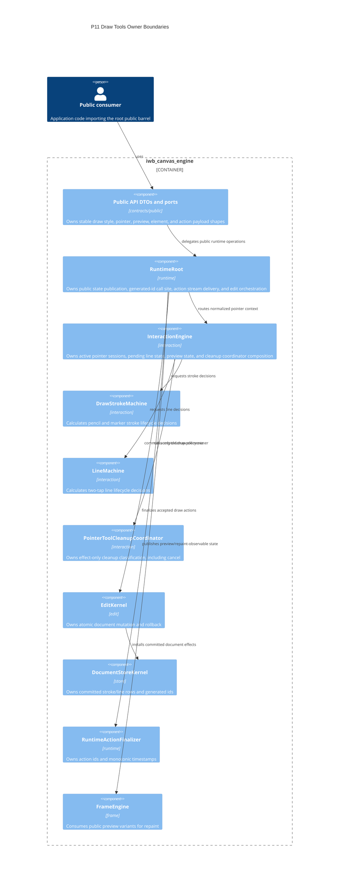
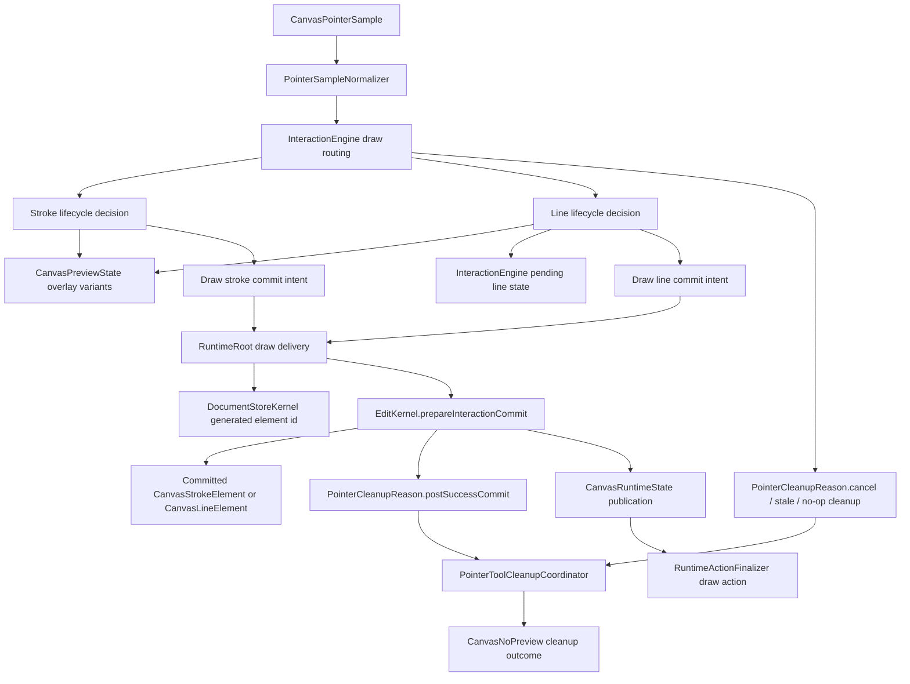
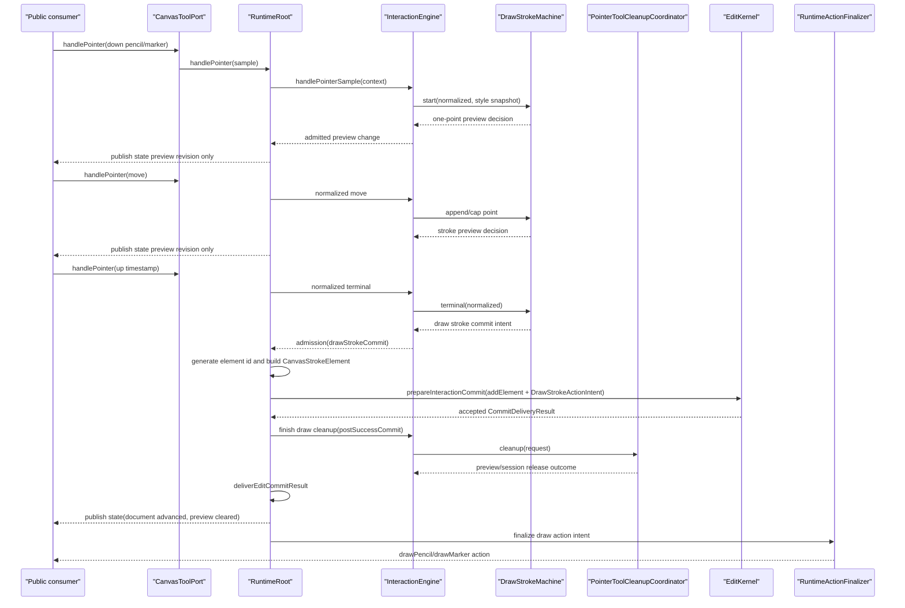
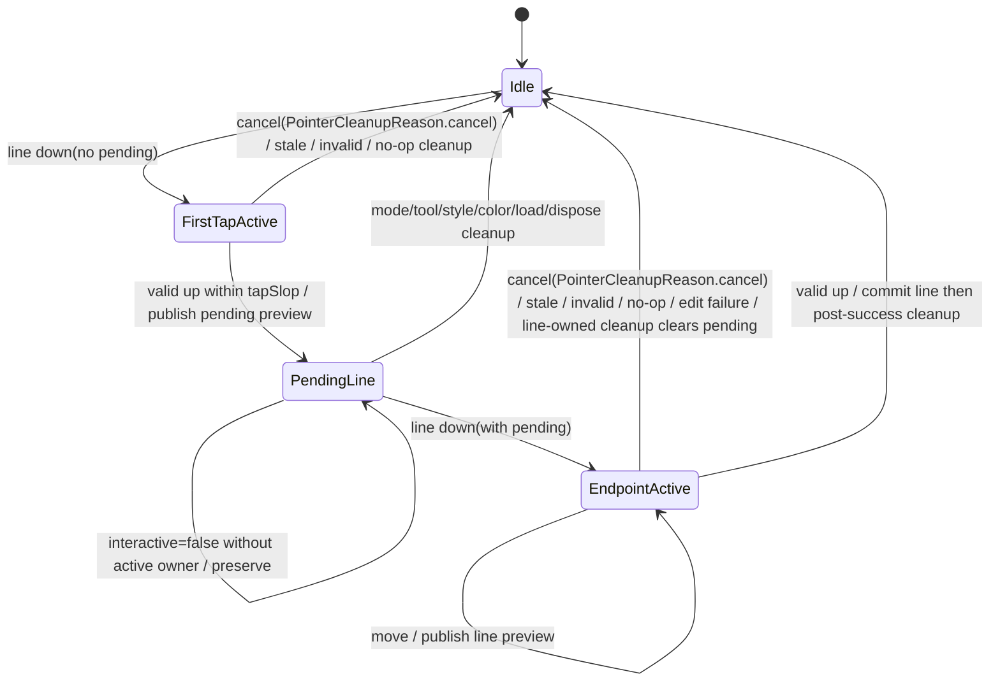

# Design: P11 Draw Tools

---
date: 2026-06-02
designer: Codex
commit: 2f560f99
branch: new-architecture
design_question: "Create a maximally detailed architecture design for docs/implementation/p11_draw_tools.md using docs/history/research/2026-06-02-p11-draw-tools-current-facts.md, including how test/smoke/public_incremental_smoke_test.dart must expand for P11."
---

## Disposition

READY_FOR_CONTRACT

P11 can proceed to Change Contract authoring once the future contract preserves every locked decision below. This design intentionally removes architectural discretion from implementation: the implementer may choose local variable names and exact private helper extraction only when those choices do not alter owner, boundary, state, sequence, cleanup, public payload, timestamp, repaint, verification, or source-of-truth decisions recorded here.

If repository code contradicts this design, the future Change Contract must stop before implementation and either repair the owning source of truth or repair this design with a new design-review pass. Implementation must not reinterpret P11 as a runtime-local shortcut, a public API expansion, a draw-local cleanup policy, or a direct store mutation path.

## Product Outcome

P11 makes the public draw tools usable. A consumer using only the package root import can enter draw mode, draw pencil strokes, draw marker strokes, create a two-tap line, observe public preview state while drawing, receive committed stroke/line document elements, and receive typed draw action events only after accepted document state has been installed.

The user-visible behavior is exact:

- Pencil down starts a one-pointer stroke preview; valid moves extend that preview; valid up commits one `CanvasStrokeElement` with pencil style and emits one `drawPencil` action.
- Marker down starts the same stroke lifecycle with marker thickness and opacity; valid up commits one `CanvasStrokeElement` whose common opacity is the marker opacity and emits one `drawMarker` action.
- Line first valid tap stores a pending line start, publishes `CanvasPendingLineStartPreview`, and emits no action.
- Line second valid pointer session publishes `CanvasLinePreview`; valid up commits one `CanvasLineElement` and emits one `drawLine` action.
- Draw previews change only preview state and overlay repaint; they never mutate the committed document before terminal commit.
- Cleanup, load, dispose, mode/tool/style/color changes, `interactive=false`, stale terminal samples, invalid terminal samples, no-op terminals, edit failure, and post-success cleanup all route through the existing P10 `PointerToolCleanupCoordinator` through `InteractionEngine`.

P11 does not implement eraser deletion, context-action requests, guarded text-edit request commits, new public API names, Flutter raw gesture recognition changes beyond consuming existing pointer routing, or new document/schema element families. P12 owns eraser and context-action request behavior.

## Target Contract Classification

Recommended Change Contract classification:

| Field | Required value |
|---|---|
| Profile | BEHAVIOR_CHANGE |
| Obligations | SEAM_MIGRATION, PUBLIC_API_CHANGE |
| Non-goal profiles | BUG_FIX, REFACTOR_ONLY, DOCS_ONLY, ANALYZER_RULE_ONLY |

Rationale:

- P11 changes externally observable behavior: current draw-mode pointer input is a compatibility no-op, while P11 makes pencil, marker, and line creation operational through the public `CanvasRuntime.tools`, `runtime.preview`, `runtime.state`, `runtime.readDocument`, and `runtime.actions` surfaces.
- P11 migrates the planned `draw.tools` architecture node from future/no-op behavior into production interaction ownership while consuming the P10 cleanup coordinator seam.
- P11 changes public API semantics without adding new public declarations: existing public draw DTOs, preview variants, action types, and action payloads become executable behavior. That is a `PUBLIC_API_CHANGE` obligation because external consumers observe new behavior through already-frozen names.
- P11 is not a bug fix because the repository intentionally left draw runtime behavior for this phase.

## Research Inputs

Primary research input:

- `docs/history/research/2026-06-02-p11-draw-tools-current-facts.md`

Relevant implementation source:

- `docs/implementation/p11_draw_tools.md`

Relevant source-of-truth documents:

- `docs/contracts/public_api_v1.md`
- `docs/contracts/interaction_engine.md`
- `docs/contracts/operation_matrix.md`
- `docs/contracts/edit_kernel.md`
- `docs/contracts/frame_rendering.md`
- `docs/contracts/geometry.md`
- `docs/contracts/load_document.md`
- `docs/architecture/01_runtime_ownership.md`
- `docs/architecture/03_data_model.md`
- `docs/architecture/architecture_graph.yaml`
- `docs/verification/tests.md`

Relevant implementation and tests:

- `lib/src/api/canvas_runtime.dart`
- `lib/src/runtime/runtime_root.dart`
- `lib/src/runtime/runtime_action_finalizer.dart`
- `lib/src/interaction/interaction_engine.dart`
- `lib/src/interaction/interaction_pointer_context.dart`
- `lib/src/interaction/pointer_session.dart`
- `lib/src/interaction/pointer_sample_normalizer.dart`
- `lib/src/interaction/pointer_tool_cleanup_coordinator.dart`
- `lib/src/contracts/internal/commit_action_intent.dart`
- `lib/src/contracts/public/canvas_tools.dart`
- `lib/src/contracts/public/canvas_preview.dart`
- `lib/src/contracts/public/canvas_actions.dart`
- `lib/src/contracts/public/canvas_element.dart`
- `lib/src/contracts/public/canvas_contract_limits.dart`
- `lib/src/edit/edit_kernel.dart`
- `lib/src/edit/draft_document.dart`
- `lib/src/store/document_store_kernel.dart`
- `lib/src/store/family_tables.dart`
- `test/smoke/public_incremental_smoke_test.dart`
- `test/api/fixtures/tool_port_settings_fixture.dart`
- `test/interaction/pointer_tool_cleanup_coordinator_test.dart`

## Donor Handoff

The future implementer must use the donor records below as behavior/test inputs only. Donor use must follow `docs/donors/00_reuse_rules.md`: no production import from legacy runtime paths is allowed, public API v1 wins over donor shape, `copy/adapt` changes names/owners/error types/public boundaries where needed, `adapt/rewrite` preserves behavior/tests while replacing the shell, and every reused donor must carry ported or equivalent tests before the implementation slice closes.

### Required Donors

| Donor id | Decision | Use exactly for P11 | Target implementation owner | Do not copy | Required proof |
|---|---|---|---|---|---|
| `foundation_pointer_input_contract` | `copy/adapt` | Pointer phase semantics, pointer policy validation, pointer device-kind handling, and lifecycle test expectations for draw-mode pointer samples. | Existing public `canvas_pointer.dart`, `canvas_tools.dart`, `PointerSampleNormalizer`, and `InteractionEngine` pointer routing. | Legacy pointer public boundary where v1 differs. | Pointer lifecycle tests for pencil, marker, line first tap, line endpoint, stale terminal, and second pointer down ignored. |
| `foundation_action_event_immutability` | `adapt` | Immutable draw action event facts, timestamp normalization expectations, and public typed payload read behavior. | `CommitActionIntent`, `RuntimeActionFinalizer`, `CanvasActionCommitted`, and draw action focused tests. | Legacy action event public names unless already in Public API v1. | `test/api/typed_action_payloads_test.dart` and draw action-after-state tests. |
| `geometry_interactive_geometry` | `copy/adapt` | Stroke/line point and segment helper behavior needed for capped stroke paths, segment bounds, and future eraser-compatible geometry helpers. | `DrawStrokeMachine` and any focused interaction geometry helper under `lib/src/interaction/` only if needed by the stroke/line machines. | Gesture soft-limit shell coupled to legacy input sampling; eraser exact-hit logic before P12. | Stroke point cap tests and line/stroke preview/commit geometry tests. |
| `interaction_pointer_session` | `adapt` | Session lifecycle, detach/dispose cleanup expectations, pending tap/line separation, and settings adoption only through cleanup when raw pointer state is safe. | `PointerSession` payload cohesion repair and `InteractionEngine` active/pending state. | Current `Listenable` wiring and legacy session shell. | Pointer session lifecycle tests for active stroke, first-tap line, endpoint line, dispose, prepared load, and `interactive=false`. |
| `interaction_pointer_normalizer` | `copy/adapt` | Normalized world-position flow and stale/invalid terminal recovery behavior for draw terminals. | Existing `PointerSampleNormalizer`; P11 should extend only if focused tests expose a missing draw terminal normalization case. | Wrong session-token keying or legacy normalizer ownership. | Pointer normalization tests for draw previews and stale terminal cleanup. |
| `interaction_event_dispatcher` | `adapt` | Monotonic timestamp resolution and event stream ownership for draw actions and accepted pending-line preview timestamp. | `RuntimeActionFinalizer`, `InteractionPointerContext` output timestamp resolver, and runtime action stream delivery. | Legacy sync/async notification contract before next-owned state-before-action order. | Timestamp monotonic tests proving no timestamp reservation on cancel/stale/no-op/load/dispose/rollback. |
| `interaction_gesture_runtime` | `adapt` | Dispatch order, reentrancy guard, terminal cleanup, external mutation interruption, and exception-safe terminal cleanup ordering. | `InteractionEngine` routing and `RuntimeRoot` draw delivery methods. | Legacy callback graph or whole `interactive_runtime.dart` structure. | Interaction state tests, terminal cleanup tests, edit failure cleanup/rethrow tests, and reentrant mutation guard tests if draw opens a new callback window. |
| `interaction_draw_coordinator` | `adapt/rewrite` | Primary P11 behavior donor: pencil/marker stroke lifecycle, two-tap line lifecycle, pending line state, terminal router behavior, and exception-safe draw terminal cleanup. | `draw_stroke_machine.dart`, `line_machine.dart`, `InteractionEngine` pending line state, and draw admission intents. | Eraser internals before P12, legacy draw coordinator shell, legacy action emitter structure, direct mutation callbacks, and legacy public names. | Draw lifecycle tests, line two-tap tests, pending line preservation/clear tests, and public smoke draw workflow. |
| `interaction_mutation_boundary` | `adapt` | Single interaction-owned bridge into committed writes. | `RuntimeRoot` draw delivery through `EditKernel.prepareInteractionCommit`. | Legacy bridge names, access types, callback structure, and direct store/controller writes. | Interaction commit tests proving `CanvasEdit.addElement`, rollback/no action on failure, and action-after-state order. |

### Forbidden Donor Structure

| Donor id | Decision | P11 rule |
|---|---|---|
| `avoid_scene_controller_facades` | `avoid` | Do not copy legacy public controller facade files, public method shapes, or controller architecture. Use only behavior evidence already routed through required donors. |
| `avoid_interactive_runtime_whole` | `avoid` | Do not copy `interactive_runtime.dart` as a whole. Use targeted dispatch semantics only through `interaction_gesture_runtime`. |
| `avoid_scene_builder_public_architecture` | `avoid` | Do not introduce scene builder public architecture, even if line/stroke element construction appears similar. Public draw creation remains pointer-tool behavior plus `CanvasEdit.addElement`. |
| `avoid_scene_codec_whole` | `avoid` | Do not touch codec architecture for P11 draw tools. Stroke/line schema support already exists as public element/document behavior. |
| `avoid_scene_store_controller_whole` | `avoid` | Do not copy store controller/facade structure or direct committed mutation paths. Store access remains through `EditKernel` and `DocumentStoreKernel` owners. |

### Implementation File Handoff

The future Change Contract must carry this file inventory forward. It may split execution into units, but it must not choose different owners without a new design repair.

Required new production files:

- `lib/src/interaction/draw_stroke_machine.dart`
- `lib/src/interaction/line_machine.dart`

Required production files to modify:

- `lib/src/interaction/interaction_engine.dart`
- `lib/src/interaction/interaction_pointer_context.dart`
- `lib/src/interaction/pointer_session.dart`
- `lib/src/interaction/pointer_tool_cleanup_coordinator.dart`
- `lib/src/runtime/runtime_root.dart`
- `lib/src/runtime/runtime_action_finalizer.dart`
- `lib/src/contracts/internal/commit_action_intent.dart`

Required test files to create or update:

- `test/smoke/public_incremental_smoke_test.dart`
- `test/interaction/draw_stroke_interaction_routing_test.dart` and `test/interaction/line_interaction_routing_test.dart`, or focused stroke/line machine test files with clearer file cohesion
- `test/interaction/preview_public_state_test.dart`
- `test/interaction/pointer_tool_cleanup_coordinator_test.dart`
- `test/interaction/commands_emit_user_actions_test.dart` or a focused draw action test file
- `test/runtime/load_interaction_cleanup_test.dart`
- `test/flutter_bridge/interactive_false_pending_line_preserved` or the current equivalent bridge test
- `test/api/fixtures/tool_port_settings_fixture.dart` and any owning public API settings test that currently asserts draw pointer no-op

Required source-of-truth files to update after implementation declarations exist:

- `docs/architecture/architecture_graph.yaml`
- the P11 durable diagrams listed in `Source-Of-Truth Impact`
- `docs/verification/tests.md`
- generated docs/index outputs as required by docs tooling

## Repository Evidence

`Evidence Consequence Link`: every fact below states the design decision, boundary, proof surface, or review consequence it supports.

### Phase Scope And Existing Gap

- `docs/implementation/p11_draw_tools.md:5` states P11 implements draw-mode creation tools after pointer sessions, edit commits, geometry helpers, and overlay frame capture exist -> P11 must be a behavior implementation that consumes P5/P8/P9/P10, not a public API design or standalone draw subsystem.
- `docs/implementation/p11_draw_tools.md:10` through `docs/implementation/p11_draw_tools.md:23` list pencil, marker, two-tap line, preview lifecycle, concrete preview variants, overlay repaint, `EditKernel` commit, cleanup coordinator consumption, style validation, interaction revision publication, typed action payloads, and stale terminal rejection -> the future contract must include all those surfaces as required execution and proof areas.
- `docs/implementation/p11_draw_tools.md:25` through `docs/implementation/p11_draw_tools.md:32` forbid draw-local cleanup policy and require cleanup requests to carry ownership context so non-owned pending line state survives `interactive=false` while line-owned cleanup clears it -> selected form must route every cleanup through `InteractionEngine` and `PointerToolCleanupCoordinator`, with explicit pending-line ownership state.
- `docs/implementation/p11_draw_tools.md:34` through `docs/implementation/p11_draw_tools.md:40` name P5, P8, P9, and P10 dependencies -> P11 must use existing edit, geometry, frame overlay, and pointer/session/load-interrupt owners instead of adding substitutes.
- `docs/implementation/p11_draw_tools.md:80` through `docs/implementation/p11_draw_tools.md:88` state P11 satisfies public draw API, shared stroke preview facts, pointer lifecycle, draw geometry helpers, and operation matrix rows -> the design must preserve public DTO semantics and operation-matrix effects.
- `docs/implementation/p11_draw_tools.md:90` through `docs/implementation/p11_draw_tools.md:105` list required tests and guardrails -> the verification strategy must include typed payloads, settings state, preview union, preview public state, action emission, state machines, cleanup coordinator, and guardrail proof.
- `docs/implementation/p11_draw_tools.md:107` through `docs/implementation/p11_draw_tools.md:126` define exit gates for pencil, marker, line, typed actions after atomic install, overlay-only previews, preview revision without document revision, stale terminal rejection, coordinator consumption, pending line preservation/clearing, load failure preservation, and prepared load cleanup -> the selected form must make those direct outcomes executable.
- `docs/history/research/2026-06-02-p11-draw-tools-current-facts.md:13` through `docs/history/research/2026-06-02-p11-draw-tools-current-facts.md:17` find that public draw DTOs and runtime surfaces exist while draw machines do not, and that public incremental smoke is the external compatibility path -> the design must avoid new public API and must extend the existing smoke test.
- `docs/history/research/2026-06-02-p11-draw-tools-current-facts.md:57` records current draw-mode pointer behavior as no-op and cites `InteractionEngine`'s `drawModePointer` branch with no preview handling -> P11 must replace that compatibility no-op at the interaction owner.
- `docs/history/research/2026-06-02-p11-draw-tools-current-facts.md:172` through `docs/history/research/2026-06-02-p11-draw-tools-current-facts.md:177` identify unresolved current facts for draw machine boundaries, generated ids, internal draw commit intents, and direct lifecycle tests -> this design must lock those decisions before contract authoring.

### Donor Inputs

- `docs/donors/00_reuse_rules.md:13` through `docs/donors/00_reuse_rules.md:16` define donors as functional oracles and implementation donors, not legacy dependencies -> P11 must use donor behavior/tests without importing legacy runtime or preserving legacy public API.
- `docs/donors/00_reuse_rules.md:24` through `docs/donors/00_reuse_rules.md:37` define `copy`, `copy/adapt`, `adapt`, `adapt/rewrite`, `rewrite-reference`, equivalent-test obligations, and next-plan precedence -> the donor handoff must name exact reuse decisions and tests.
- `docs/implementation/p11_draw_tools.md:48` through `docs/implementation/p11_draw_tools.md:58` list P11 required donors -> this design must carry those donor ids into Change Contract handoff.
- `docs/implementation/p11_draw_tools.md:60` through `docs/implementation/p11_draw_tools.md:66` list forbidden donor structure -> this design must forbid those legacy structures in P11.
- `docs/_registry/donors.yaml:332` through `docs/_registry/donors.yaml:359` define `foundation_pointer_input_contract` as `copy_adapt` for pointer phases, policy validation, and device kind handling -> P11 pointer lifecycle tests and public pointer routing must consume that donor.
- `docs/_registry/donors.yaml:361` through `docs/_registry/donors.yaml:385` define `foundation_action_event_immutability` as `adapt` for immutable events and timestamp normalization -> P11 draw action payloads and pending-line timestamp proof must consume that donor.
- `docs/_registry/donors.yaml:450` through `docs/_registry/donors.yaml:470` define `geometry_interactive_geometry` as `copy_adapt` for segment batching, segment bounds, and rect-distance prefilter -> P11 stroke/line geometry helper behavior must consume that donor without eraser exact-hit scope.
- `docs/_registry/donors.yaml:1100` through `docs/_registry/donors.yaml:1123` define `interaction_pointer_session` as `adapt` for session lifecycle and settings adoption safety -> P11 pointer-session payload repair and pending-line separation must consume that donor.
- `docs/_registry/donors.yaml:1125` through `docs/_registry/donors.yaml:1146` define `interaction_pointer_normalizer` as `copy_adapt` for non-finite sample filtering and terminal recovery -> P11 stale/invalid terminal proof must stay on that normalizer seam.
- `docs/_registry/donors.yaml:1148` through `docs/_registry/donors.yaml:1169` define `interaction_event_dispatcher` as `adapt` for timestamp resolution and stream ownership -> P11 must keep draw action and pending preview timestamp behavior under runtime event/timestamp ownership.
- `docs/_registry/donors.yaml:1190` through `docs/_registry/donors.yaml:1213` define `interaction_gesture_runtime` as `adapt` for dispatch order, reentrancy guard, terminal cleanup, and external mutation interruption, while forbidding the legacy callback graph -> P11 must preserve ordering without copying whole legacy runtime structure.
- `docs/_registry/donors.yaml:1236` through `docs/_registry/donors.yaml:1260` define `interaction_draw_coordinator` as `adapt_rewrite` for stroke, line, eraser lifecycle, pending line state, exception-safe terminal cleanup, and draw/line tests -> P11 stroke and line machine files must be the rewritten target shell for this donor.
- `docs/_registry/donors.yaml:1262` through `docs/_registry/donors.yaml:1285` define `interaction_mutation_boundary` as `adapt` for a single interaction-owned bridge into committed writes -> P11 runtime delivery must commit through `EditKernel.prepareInteractionCommit`.
- `docs/donors/07_donors_to_avoid.md:13` through `docs/donors/07_donors_to_avoid.md:22` forbid legacy scene controller facades, whole interactive runtime, scene builder public architecture, whole scene codec, and whole scene store controller as structure -> P11 must not create files or APIs shaped by those donors.

### Public API And DTO Surfaces

- `docs/contracts/public_api_v1.md:360` through `docs/contracts/public_api_v1.md:389` define `CanvasRuntime` public ports including `tools`, `preview`, `actions`, `readDocument`, and id generation -> P11 must be observable through existing public runtime ports.
- `docs/contracts/public_api_v1.md:424` through `docs/contracts/public_api_v1.md:455` define atomic `CanvasRuntimeState` and revision domains -> P11 proof must distinguish document, preview, interaction, and epoch revisions.
- `docs/contracts/public_api_v1.md:472` through `docs/contracts/public_api_v1.md:478` state `CanvasRuntimeState` is one atomic public observation and internal revisions are not public -> draw commit public state must be published once after accepted state install.
- `docs/contracts/public_api_v1.md:523` through `docs/contracts/public_api_v1.md:550` define `CanvasSurface` attachment and `interactive=false` pointer behavior, including preservation of non-owned pending line state -> pending line state must be modeled separately from an active routed pointer session.
- `docs/contracts/public_api_v1.md:1565` through `docs/contracts/public_api_v1.md:1725` define `CanvasInteractionMode`, `CanvasDrawTool`, `CanvasPointerSample`, `CanvasDrawStyle`, and `CanvasToolPort` -> P11 must use these public declarations directly and must not add draw-specific public entry points.
- `docs/contracts/public_api_v1.md:1728` through `docs/contracts/public_api_v1.md:1749` describe P10 draw-mode pointer input as no-op later-phase scope -> P11 is the phase that changes that public behavior.
- `docs/contracts/public_api_v1.md:1758` through `docs/contracts/public_api_v1.md:1767` define validation for pointer samples and draw style thickness/opacity -> draw machines may rely on public construction validation for style and non-terminal pointer samples, while invalid terminal samples must route to cleanup.
- `docs/contracts/public_api_v1.md:1769` through `docs/contracts/public_api_v1.md:1775` define pointer id as routing-only with one active pointer session -> P11 must keep one active routed pointer per runtime.
- `docs/contracts/public_api_v1.md:1899` through `docs/contracts/public_api_v1.md:1957` define public preview variants for pencil, marker, pending line start, and line preview -> P11 preview publication must use those existing variants.
- `docs/contracts/public_api_v1.md:1982` through `docs/contracts/public_api_v1.md:2030` define `CanvasStrokePreview` shared pencil/marker points, color, thickness, and opacity facts, with concrete pencil and marker variants -> P11 must share stroke preview behavior and only vary tool style.
- `docs/contracts/public_api_v1.md:2032` through `docs/contracts/public_api_v1.md:2064` define pending line start and line preview fields -> P11 must publish start/timestamp/color/thickness for pending start and start/end/color/thickness for active line preview.
- `docs/contracts/public_api_v1.md:2080` through `docs/contracts/public_api_v1.md:2097` define preview immutability, no public pointer/session ids, no document materialization in preview getters, epoch-bound pending line start, load cleanup and failure behavior -> P11 must keep pointer/session ids private and must route load success/failure exactly.
- `docs/contracts/public_api_v1.md:2102` through `docs/contracts/public_api_v1.md:2113` define `drawPencil`, `drawMarker`, and `drawLine` action types -> P11 action finalization must map internal draw intents to these existing public action types.
- `docs/contracts/public_api_v1.md:2187` through `docs/contracts/public_api_v1.md:2217` define draw stroke and draw line action payload fields -> P11 internal action intents must carry exactly those payload facts.
- `docs/contracts/public_api_v1.md:2258` through `docs/contracts/public_api_v1.md:2275` state pencil, marker, and line commits emit actions with the draw payload types -> P11 commit delivery must stage those actions only for accepted commits.
- `docs/contracts/public_api_v1.md:1044` through `docs/contracts/public_api_v1.md:1088` define public stroke and line element families -> P11 commits must add those existing element types rather than adding new document families.

### Current Public Implementations

- `lib/src/contracts/public/canvas_tools.dart:17` through `lib/src/contracts/public/canvas_tools.dart:82` implement `CanvasDrawStyle` validation and value equality -> P11 must snapshot already-validated style values at gesture admission and rely on equality for setter no-op behavior.
- `lib/src/contracts/public/canvas_tools.dart:110` through `lib/src/contracts/public/canvas_tools.dart:122` expose `CanvasToolPort` setters and pointer/double-tap entry points -> P11 must keep pointer handling behind `CanvasToolPort.handlePointer`.
- `lib/src/contracts/public/canvas_preview.dart:15` through `lib/src/contracts/public/canvas_preview.dart:52` implement the sealed preview union factories -> P11 must publish these public variants, not private preview payloads.
- `lib/src/contracts/public/canvas_preview.dart:78` through `lib/src/contracts/public/canvas_preview.dart:127` implement shared pencil/marker stroke preview facts and unmodifiable point copies -> P11 must pass immutable point lists into these public values.
- `lib/src/contracts/public/canvas_preview.dart:129` through `lib/src/contracts/public/canvas_preview.dart:160` implement pending line start and line preview variants -> P11 pending/line previews must use exact public fields.
- `lib/src/contracts/public/canvas_actions.dart:11` through `lib/src/contracts/public/canvas_actions.dart:23` implement public action types -> P11 action finalizer extension must not add new public action enum values.
- `lib/src/contracts/public/canvas_actions.dart:110` through `lib/src/contracts/public/canvas_actions.dart:142` implement draw action payload DTOs -> P11 internal commit intents must finalize to these classes.
- `lib/src/contracts/public/canvas_element.dart:218` through `lib/src/contracts/public/canvas_element.dart:266` implement `CanvasStrokeElement`, including non-empty finite point validation, max point count, positive thickness, color, common opacity, and unmodifiable points -> P11 stroke point collection must never attempt to commit empty or over-limit strokes.
- `lib/src/contracts/public/canvas_element.dart:268` through `lib/src/contracts/public/canvas_element.dart:302` implement `CanvasLineElement`, including finite endpoints and positive thickness -> P11 line terminal commits must use finite normalized world positions and existing thickness validation.
- `lib/src/contracts/public/canvas_contract_limits.dart:15` defines `canvasMaxStrokePointsPerElement` -> P11 stroke collection must cap point lists before constructing `CanvasStrokeElement`.

### Interaction, Cleanup, And Runtime Commit Path

- `docs/contracts/interaction_engine.md:125` through `docs/contracts/interaction_engine.md:157` define one active routed pointer, token/epoch terminal admission, cleanup-capable machine requests, `InteractionEngine` as cleanup coordinator caller, `EditKernel` commits, interaction setting revision, preview revision, and no-op cleanup silence -> P11 draw and line machines must stay inside this interaction owner.
- `docs/contracts/interaction_engine.md:172` through `docs/contracts/interaction_engine.md:178` define `interactive=false` cancellation and non-owned pending line preservation -> P11 must track pending line ownership independently from active pointer state.
- `docs/contracts/interaction_engine.md:180` through `docs/contracts/interaction_engine.md:229` define `PointerToolCleanupCoordinator` as internal cleanup policy owner with allowed cleanup reasons, effect-only outcome, pending line disposition, and dependency bans -> P11 must not add cleanup policy to draw machines or runtime.
- `docs/contracts/interaction_engine.md:231` through `docs/contracts/interaction_engine.md:248` define repaint targets: pencil, marker, pending line start, and line preview are overlay only -> P11 preview and cleanup proof must assert overlay-only paths and no main-scene preview for draw.
- `lib/src/interaction/interaction_engine.dart:18` through `lib/src/interaction/interaction_engine.dart:25` explain why pointer admission, public tool settings, and active session value ownership stay together in `InteractionEngine` -> P11 should extend this owner rather than split active pointer lifecycle.
- `lib/src/interaction/interaction_engine.dart:52` through `lib/src/interaction/interaction_engine.dart:69` show `InteractionEngine` owns mode, draw style, pointer policy, read port, active session, preview, interaction revision, preview revision, and tokens -> P11 must add draw state here or through interaction-owned private values composed by this owner.
- `lib/src/interaction/interaction_engine.dart:87` through `lib/src/interaction/interaction_engine.dart:99` implement preview replacement/clear and preview revision increments -> P11 must use this preview publication path.
- `lib/src/interaction/interaction_engine.dart:101` through `lib/src/interaction/interaction_engine.dart:106` show `InteractionEngine` calls the cleanup coordinator and applies the outcome -> P11 cleanup must enter through this method.
- `lib/src/interaction/interaction_engine.dart:144` through `lib/src/interaction/interaction_engine.dart:162` show draw style and pointer policy setter changes increment interaction revision and route cleanup -> P11 must keep style/tool/color changes as setting changes and cleanup pending/active draw state.
- `lib/src/interaction/interaction_engine.dart:164` through `lib/src/interaction/interaction_engine.dart:179` show public pointer samples are normalized before phase routing -> P11 must consume normalized world positions, not raw view positions.
- `lib/src/interaction/interaction_engine.dart:270` through `lib/src/interaction/interaction_engine.dart:310` show current move routing and the no-op `drawModePointer` move branch -> P11 must replace this no-op branch with stroke/line preview handling.
- `lib/src/interaction/interaction_engine.dart:313` through `lib/src/interaction/interaction_engine.dart:335` show terminal routing and the current generic draw terminal cleanup/admission behavior -> P11 must replace generic draw terminal handling with stroke/line terminal decisions.
- `lib/src/interaction/interaction_engine.dart:471` through `lib/src/interaction/interaction_engine.dart:490` show cleanup request creation and preview/session state application -> P11 must extend this request with pending line ownership and preview kind facts for draw variants.
- `lib/src/interaction/pointer_session.dart:7` defines `PointerSessionKind.drawModePointer` -> P11 should continue using one active session owner but must refine draw session payload rather than treating all draw pointers as no-op.
- `lib/src/interaction/pointer_tool_cleanup_coordinator.dart:1` through `lib/src/interaction/pointer_tool_cleanup_coordinator.dart:15` list existing cleanup reasons including `interactiveDisabled`, `preparedLoadSuccess`, `staleTerminal`, `invalidTerminal`, `noOpTerminal`, `editFailure`, and `postSuccessCommit`, but no generic cancel reason -> P11 must add a dedicated internal `PointerCleanupReason.cancel` to the existing coordinator seam instead of overloading no-op or tool-specific reasons.
- `lib/src/interaction/pointer_tool_cleanup_coordinator.dart:17` through `lib/src/interaction/pointer_tool_cleanup_coordinator.dart:26` include draw preview kinds in cleanup classification -> P11 must provide accurate preview kind facts.
- `lib/src/interaction/pointer_tool_cleanup_coordinator.dart:69` through `lib/src/interaction/pointer_tool_cleanup_coordinator.dart:87` define cleanup request ownership fields `ownsPendingLine` and `hasPendingLine` -> P11 pending line cleanup must set those fields deterministically.
- `lib/src/interaction/pointer_tool_cleanup_coordinator.dart:120` through `lib/src/interaction/pointer_tool_cleanup_coordinator.dart:133` map pencil, marker, pending line start, line preview, and eraser previews to overlay repaint -> P11 does not need a new repaint policy.
- `lib/src/interaction/pointer_tool_cleanup_coordinator.dart:136` through `lib/src/interaction/pointer_tool_cleanup_coordinator.dart:148` preserve non-owned pending line on `interactiveDisabled` and clear pending line otherwise -> P11 must make ownership context correct before coordinator invocation.
- `lib/src/interaction/interaction_pointer_context.dart:8` through `lib/src/interaction/interaction_pointer_context.dart:24` show current pointer admission can return selected move and marquee commit intents only -> P11 must extend this admission model with draw stroke and draw line commit intents rather than adding a new public pointer return path.
- `lib/src/interaction/pointer_sample_normalizer.dart:45` through `lib/src/interaction/pointer_sample_normalizer.dart:58` convert public view positions to world positions by adding current view camera offset and carrying controller epoch -> P11 style/action/document facts must use world positions from normalized samples.
- `lib/src/interaction/pointer_sample_normalizer.dart:61` through `lib/src/interaction/pointer_sample_normalizer.dart:90` decide invalid terminal cleanup for missing, stale pointer, and stale epoch terminals -> P11 stale terminal proof must use this shared normalizer decision instead of tool-local stale checks.
- `lib/src/runtime/runtime_root.dart:786` through `lib/src/runtime/runtime_root.dart:813` route public pointer handling through `InteractionEngine`, deliver selected move/marquee commit intents, and otherwise publish state for admitted/cleanup outcomes -> P11 must add draw commit delivery to this same runtime switch.
- `lib/src/runtime/runtime_root.dart:1007` through `lib/src/runtime/runtime_root.dart:1017` publish public state before emitting actions for accepted commit results -> P11 typed draw actions must reuse this order.
- `lib/src/runtime/runtime_root.dart:1072` through `lib/src/runtime/runtime_root.dart:1113` show selected move terminal delivery: prepare `EditKernel` commit, cleanup on success before delivery, deliver edit result, cleanup/publish/rethrow on edit failure -> P11 draw commit delivery must follow the same success/failure shape without resolver handling.
- `lib/src/runtime/runtime_root.dart:1182` through `lib/src/runtime/runtime_root.dart:1205` show marquee terminal delivery through `EditKernel.prepareInteractionPlan`, post-success cleanup, delivery, edit failure cleanup/publish/rethrow -> P11 line/stroke delivery must follow that cleanup and delivery ordering.
- `lib/src/runtime/runtime_action_finalizer.dart:5` through `lib/src/runtime/runtime_action_finalizer.dart:24` owns timestamp cursor, action id sequence, and action finalization -> P11 must extend this owner for draw actions and line pending preview timestamp reservation.
- `lib/src/contracts/internal/commit_action_intent.dart:8` through `lib/src/contracts/internal/commit_action_intent.dart:15` currently lacks draw action intent kinds -> P11 must add internal draw stroke and draw line action intents.
- `lib/src/edit/edit_kernel.dart:82` through `lib/src/edit/edit_kernel.dart:124` define `prepareInteractionCommit` for synchronous interaction-owned commits through `CanvasEdit` and `CommitPlan` augmentation -> P11 stroke/line additions must use this method.
- `lib/src/edit/draft_document.dart:95` through `lib/src/edit/draft_document.dart:107` admit and insert `CanvasEdit.addElement` into content layers, touch added element, and mark structural revision -> P11 commits must add stroke/line content elements through this path.
- `lib/src/store/document_store_kernel.dart:166` through `lib/src/store/document_store_kernel.dart:168` generate element ids from the committed store kernel -> P11 automatic draw-created element ids must be allocated by `RuntimeRoot`/`DocumentStoreKernel`, not by interaction machines.
- `lib/src/store/family_tables.dart:290` through `lib/src/store/family_tables.dart:293` admit stroke and line rows into committed family tables -> P11 needs no new committed table family.
- `lib/src/store/family_tables.dart:465` through `lib/src/store/family_tables.dart:520` convert stroke and line rows to public elements -> P11 committed draw elements are already readable through public document projection.

### Operation, Frame, Geometry, And Load Constraints

- `docs/contracts/operation_matrix.md:80` through `docs/contracts/operation_matrix.md:89` define tool setting, pointer dispatcher, load, pencil/marker preview, pencil/marker commit, line first tap, line preview, and line commit rows -> P11 must implement those effects exactly.
- `docs/contracts/operation_matrix.md:117` through `docs/contracts/operation_matrix.md:122` state `handlePointer` itself has no standalone effects; terminal effects are defined by selected tool rows -> P11 must keep behavior in tool state machine decisions and commit delivery, not in dispatcher validation.
- `docs/contracts/operation_matrix.md:150` through `docs/contracts/operation_matrix.md:158` require runtime-created timestamps for timestamped actions and previews, and forbid timestamp outputs on stale/no-op/cancel/load/dispose/rollback paths -> P11 line pending preview and draw actions must use the runtime timestamp cursor only on accepted output paths.
- `docs/contracts/frame_rendering.md:86` through `docs/contracts/frame_rendering.md:103` define overlay frame capture and draw preview variants admitted by overlay capture -> P11 preview proof can target existing overlay capture surfaces.
- `docs/contracts/frame_rendering.md:172` through `docs/contracts/frame_rendering.md:175` require one-point committed strokes, one-point stroke previews, and same-point committed/preview lines to render as explicit commands while empty point lists remain no-op draw inputs -> P11 must commit one-point tap strokes and same-point lines, but never empty strokes.
- `docs/contracts/geometry.md:114` through `docs/contracts/geometry.md:122` define stroke hit behavior and state that stroke points are capped/resampled to the max stroke limit at commit -> P11 stroke collection must cap before commit.
- `docs/contracts/load_document.md:48` through `docs/contracts/load_document.md:58` require successful prepared document load to request interaction cleanup before document install and never call interaction again after install -> P11 draw/pending line load cleanup must work in the existing prepared cleanup boundary.
- `docs/contracts/load_document.md:64` through `docs/contracts/load_document.md:83` define load success order, including optional preview revision, main repaint, overlay repaint, and one public state publication -> P11 draw preview cleanup must contribute only prepared cleanup outcome facts.
- `docs/contracts/load_document.md:97` through `docs/contracts/load_document.md:111` require load failure to preserve active gesture, preview, pending line, pointer normalization, committed document, selection, camera, repaint, state, and actions -> P11 must not clear draw or line state on failed load materialization.

### Architecture Graph, Tests, And Smoke

- `docs/architecture/01_runtime_ownership.md:58` through `docs/architecture/01_runtime_ownership.md:66` assign public DTOs to Public API, committed document state to `DocumentStoreKernel`, edit/rollback to `EditKernel`, pointer sessions/tools/preview/terminal commit requests to `InteractionEngine`, and rendering to `FrameEngine` -> P11 owner boundaries are already assigned.
- `docs/architecture/01_runtime_ownership.md:83` through `docs/architecture/01_runtime_ownership.md:91` define cleanup coordinator as effect-policy collaborator owned/called by `InteractionEngine` and not a state store/action emitter/edit layer -> P11 must not give draw machines cleanup authority.
- `docs/architecture/01_runtime_ownership.md:109` through `docs/architecture/01_runtime_ownership.md:122` require gesture facts through immutable `InteractionReadPort` and committed mutations through `EditKernel` -> P11 must not import concrete store/selection internals.
- `docs/architecture/03_data_model.md:140` through `docs/architecture/03_data_model.md:146` define public runtime state snapshots and revision domains -> P11 proof must assert direct public revision outcomes.
- `docs/architecture/03_data_model.md:176` through `docs/architecture/03_data_model.md:180` define preview cleanup increments only when preview changes and no-op runtime operations publish no state -> P11 cleanup/no-op tests must assert silence where preview is unchanged.
- `docs/architecture/03_data_model.md:182` through `docs/architecture/03_data_model.md:185` state interaction setting changes increment interaction revision and preview-producing pointer changes increment preview revision -> P11 must not use interaction revision as proof for draw preview correctness.
- `docs/architecture/architecture_graph.yaml:446` through `docs/architecture/architecture_graph.yaml:462` declare `draw.tools` as a P11 future architecture owner with actual placeholder `DrawToolController` -> P11 implementation must update graph actuals/source-of-truth later to the real internal owners selected here.
- `docs/architecture/architecture_graph.yaml:891` through `docs/architecture/architecture_graph.yaml:905` require draw tools to commit through `EditKernel` -> P11 commit design must route stroke/line additions through `EditKernel`.
- `docs/architecture/architecture_graph.yaml:905` through `docs/architecture/architecture_graph.yaml:918` require draw tools to produce preview intents for `InteractionEngine` instead of owning runtime publication -> P11 machine outputs must be preview/cleanup/commit decisions consumed by `InteractionEngine` and `RuntimeRoot`.
- `docs/indexes/by_phase.md:97` through `docs/indexes/by_phase.md:105` map P11 to Public API, EditKernel, loadDocument, operation matrix, InteractionEngine, Geometry, and Tests -> the future Change Contract must cite all of those contract families.
- `test/smoke/public_incremental_smoke_test.dart:18` through `test/smoke/public_incremental_smoke_test.dart:24` embed a Flutter consumer source that imports only the public root barrel -> P11 smoke expansion must remain in this embedded public consumer and must not use `src/**`.
- `test/smoke/public_incremental_smoke_test.dart:528` through `test/smoke/public_incremental_smoke_test.dart:694` exercise the public tool/action path for settings, draw-mode selection clearing, marquee, selected move, actions, commands, and cleanup -> P11 smoke expansion should append draw behavior to this public workflow or add a sibling public workflow in the same embedded source.
- `test/smoke/public_incremental_smoke_test.dart:696` through `test/smoke/public_incremental_smoke_test.dart:721` provide public pointer helper utilities in the embedded consumer source -> P11 smoke expansion must reuse or extend these helpers without internal imports.
- `docs/verification/tests.md:568` through `docs/verification/tests.md:589` define the public incremental smoke purpose and state it must expand only by appending the next real public user step after the public API exposes one -> P11 must extend this exact smoke test with public pencil/marker/line behavior.
- `test/api/fixtures/tool_port_settings_fixture.dart:21` through `test/api/fixtures/tool_port_settings_fixture.dart:24` name the current "draw pointer remains no-op" compatibility test -> P11 must replace this expectation with executable draw behavior in focused tests.
- `test/interaction/pointer_tool_cleanup_coordinator_test.dart:61` through `test/interaction/pointer_tool_cleanup_coordinator_test.dart:96` already verify prepared load clearing, interactive-disabled pending line preservation, and dispose facts -> P11 must extend coordinator/interaction tests to prove line-owned pending clear and draw preview cleanup mapping.

## Design Form Candidates

### Candidate A. Interaction-owned stroke and line machines consumed by existing runtime/edit seams

- Form: Add focused internal draw calculators under `lib/src/interaction/` for stroke and line lifecycle decisions. `InteractionEngine` remains the owner of active pointer session, pending line start, preview state, interaction revision, preview revision, and cleanup coordinator invocation. `RuntimeRoot` extends the existing pointer admission delivery switch to handle draw stroke and draw line commit intents, allocate generated element ids through `DocumentStoreKernel`, commit through `EditKernel.prepareInteractionCommit`, cleanup through `InteractionEngine`, and deliver accepted state/actions through existing commit delivery.
- Why it works: It matches documented ownership, consumes the existing public DTOs, uses the P10 cleanup coordinator, preserves one active routed pointer, keeps pending line state separate from active sessions for `interactive=false`, and reuses existing action-after-state and rollback paths.
- Gate result: Selected. It passes owner, boundary, source-of-truth, cleanup, dependency direction, temporal ordering, all-or-nothing, and verification gates.

### Candidate B. RuntimeRoot-local draw implementation

- Form: Put pencil, marker, line state, preview mutation, pending line state, cleanup decisions, and stroke/line commit construction directly in `RuntimeRoot`.
- Why it could work: It would be a small call-stack change because `RuntimeRoot` already owns public state publication and edit delivery.
- Gate failures or risks: Rejected. It contradicts `InteractionEngine` ownership of pointer sessions/tools/preview/terminal commit requests (`docs/architecture/01_runtime_ownership.md:63`), would duplicate cleanup policy outside `PointerToolCleanupCoordinator` (`docs/architecture/01_runtime_ownership.md:83` through `docs/architecture/01_runtime_ownership.md:91`), and would make future P12 eraser/text state compete with runtime composition responsibilities.

### Candidate C. Public API extension for draw commands

- Form: Add public command methods such as `drawStroke`, `drawLine`, or public controller objects and implement pointer tools as wrappers around those commands.
- Why it could work: It might make tests easy and allow application code to bypass pointer simulation.
- Gate failures or risks: Rejected. Public API v1 already defines draw DTOs, pointer samples, preview variants, action payloads, and `CanvasToolPort` (`docs/contracts/public_api_v1.md:1565` through `docs/contracts/public_api_v1.md:1725`); P11 is scoped to making that existing surface executable, not changing the public API. A new public command surface would require a product/API decision and registry update outside P11.

### Candidate D. Draw-local cleanup coordinator or stateful draw controller

- Form: Create a `DrawToolController` or draw-local cleanup object that owns active draw state, pending line state, preview cleanup, and commit cleanup, while `InteractionEngine` delegates to it.
- Why it could work: The architecture graph currently has a future placeholder `DrawToolController`, and grouping draw behavior may look cohesive.
- Gate failures or risks: Rejected as a state-owner form. `docs/implementation/p11_draw_tools.md:25` through `docs/implementation/p11_draw_tools.md:32` explicitly forbid draw-local cleanup policy. A draw controller may exist only as stateless calculation helpers or immutable private value definitions; it must not own cleanup policy, public preview state, interaction revision, active pointer lifecycle, or pending line cleanup disposition.

### Candidate E. Direct store/table mutation for generated stroke and line rows

- Form: Have draw tools construct store rows or mutate `DocumentStoreKernel`/family tables directly for faster commit.
- Why it could work: Stroke and line family tables already exist.
- Gate failures or risks: Rejected. `docs/contracts/interaction_engine.md:151` requires interaction commits only through `EditKernel`; `docs/architecture/01_runtime_ownership.md:121` through `docs/architecture/01_runtime_ownership.md:122` require committed mutations requested by interaction to go through `EditKernel`; `docs/architecture/architecture_graph.yaml:891` through `docs/architecture/architecture_graph.yaml:905` records the P11 draw-to-edit edge.

## Known Future Pressures

| Pressure | Evidence | How the selected form responds | Accepted cost or risk |
|---|---|---|---|
| P12 eraser must share pointer cleanup without draw-local policy. | `docs/implementation/p11_draw_tools.md:57` names `interaction_draw_coordinator` for draw, line, and eraser machines; `docs/contracts/interaction_engine.md:235` through `docs/contracts/interaction_engine.md:246` include eraser as overlay preview. | Stroke and line helpers are interaction-owned calculators and use the same cleanup request path that eraser can later consume. | P12 may add an eraser machine and exact-hit read requests, but must not replace the P11 cleanup owner. |
| Pending line must survive `interactive=false` when not active-session owned. | `docs/contracts/public_api_v1.md:542` through `docs/contracts/public_api_v1.md:547`; `docs/contracts/interaction_engine.md:172` through `docs/contracts/interaction_engine.md:178`. | Pending line start is a separate `InteractionEngine` state value, not part of `_activeSession` after first tap completes. Cleanup requests set `hasPendingLine=true` and `ownsPendingLine=false` for active-session `interactiveDisabled` when no line-owned active session exists. | More explicit state is required than a single active-session object, but this prevents sync glue and makes cleanup proofs direct. |
| Timestamped line pending preview is not an action but must use runtime monotonic timestamp semantics. | `docs/contracts/operation_matrix.md:150` through `docs/contracts/operation_matrix.md:153`; `docs/contracts/public_api_v1.md:2032` through `docs/contracts/public_api_v1.md:2043`. | Add a narrow runtime-owned output-clock callback in `InteractionPointerContext` for timestamped non-action outputs. `InteractionEngine` invokes it only when a first line tap is accepted and a pending preview will be published. | `InteractionEngine` gains a narrow dependency on timestamp reservation, but not on action streams or action ids. The contract must prove no timestamp reservation on cancel/stale/no-op/load/dispose. |
| Stroke point lists can become large during long pointer sessions. | `docs/contracts/geometry.md:121`; `lib/src/contracts/public/canvas_contract_limits.dart:15`. | `DrawStrokeMachine` caps stored preview/commit points at `canvasMaxStrokePointsPerElement`: append nonduplicate points until the cap; after the cap, replace the final point with the latest nonduplicate world position so the committed stroke never exceeds the limit and still ends at the terminal point. | This is a simple cap, not quality-preserving resampling. It satisfies v1 limits and can be replaced later only with a contract-backed resampling change and characterization tests. |
| Frame rendering already consumes draw preview variants as overlay primitives. | `docs/contracts/frame_rendering.md:97` through `docs/contracts/frame_rendering.md:103`. | P11 publishes existing public preview variants and schedules overlay cleanup through the coordinator. It does not add frame-owned draw state. | Focused frame tests remain responsible for primitive rendering; smoke stays coarse. |
| Public incremental smoke should grow without becoming a detailed interaction suite. | `docs/verification/tests.md:568` through `docs/verification/tests.md:589`. | Add one public draw workflow to `test/smoke/public_incremental_smoke_test.dart` that proves external consumer behavior for pencil, marker, and line through root barrel only. Focused tests own stale terminals, cleanup edge cases, and guardrails. | Smoke will be longer, but it remains an external compatibility path and avoids internal imports. |
| Architecture graph has a placeholder `DrawToolController`. | `docs/architecture/architecture_graph.yaml:446` through `docs/architecture/architecture_graph.yaml:462`. | Future P11 contract must update the graph actual declarations to the selected real owners: `DrawStrokeMachine`, `LineMachine`, and `InteractionEngine` pending line state, or equivalent exact declaration names if the contract locks a naming repair before implementation. | Source-of-truth graph update is mandatory later; design does not edit it now. |
| Existing `InteractionEngine` increments interaction revision on some pointer-session state changes. | `lib/src/interaction/interaction_engine.dart:197`, `lib/src/interaction/interaction_engine.dart:215`, `lib/src/interaction/interaction_engine.dart:305`, and `docs/architecture/03_data_model.md:182` through `docs/architecture/03_data_model.md:185`. | P11 draw preview and commit proofs must target `state.revisions.preview`, `state.revisions.document`, and actions directly; draw pointer preview/commit must not add new interaction-setting revision semantics. If current shared session revision logic would make draw previews increment `state.revisions.interaction`, the P11 Change Contract must repair that at `InteractionEngine` before accepting draw behavior. | This may require a shared interaction revision cleanup in the P11 execution order, but it prevents public revision drift from becoming a draw-local workaround. |

## Selected Form

Selected form: extend the existing interaction owner with two focused draw lifecycle calculators and route terminal commits through the existing runtime/edit delivery path.

The selected implementation shape is fixed:

1. Add `lib/src/interaction/draw_stroke_machine.dart`.
   - Primary owner: pencil and marker stroke lifecycle calculations.
   - Must be stateless or value-state-only; it must not own `CanvasRuntimeState`, `PointerToolCleanupCoordinator`, `EditKernel`, `RuntimeRoot`, action streams, frame repaint buses, concrete store tables, concrete selection internals, Flutter widgets, or resource sessions.
   - It returns typed decisions for start, preview update, terminal commit, and no-op cleanup.
   - It owns the deterministic stroke point cap policy for P11.

2. Add `lib/src/interaction/line_machine.dart`.
   - Primary owner: two-tap line lifecycle calculations and immutable pending-line value definitions.
   - It must separate pending line start state from active routed pointer sessions.
   - It returns typed decisions for first tap accepted, second-session preview, terminal line commit, and line-owned cleanup.
   - It must not call `PointerToolCleanupCoordinator`; it returns ownership context to `InteractionEngine`.

3. Extend `lib/src/interaction/pointer_session.dart` to avoid adding more unrelated nullable peer fields to the existing session value.
   - Required shape: keep one `PointerSession` active-session owner, but move tool-specific payloads into a sealed or enum-discriminated private session payload under the same file.
   - Required payloads after P11:
     - selected move payload with selected/movable/selection revision facts currently stored in `PointerSession`;
     - marquee payload with previous selection and marquee revision facts currently stored in `PointerSession`;
     - stroke payload with draw tool `pencil|marker`, style snapshot, capped points, and last preview;
     - line endpoint payload that owns an existing pending line start during the second pointer session.
   - `PointerSession` still carries common token, pointer id, controller epoch, session id, tool mode, start world, current world, and last preview.
   - This is a local cohesion repair, not a separate owner. The active session remains a single `_activeSession` field in `InteractionEngine`.

4. Add explicit pending line state to `InteractionEngine`.
   - Required private state: `_pendingLineStart` or equivalent under `InteractionEngine` ownership.
   - Required facts: start world, timestampMs, color, thickness, controller epoch, and an ownership marker that distinguishes non-owned pending state from active line endpoint session ownership.
   - It is not public state by itself. The public projection is `CanvasPendingLineStartPreview`.
   - It is cleared only by line-owned cleanup, mode/tool/style/color/pointer-policy cleanup, prepared load cleanup, dispose cleanup, terminal line decision, stale terminal cleanup that owns the active line session, invalid/no-op terminal cleanup that owns the active line session, edit failure after line commit intent, or post-success line commit cleanup.
   - It is preserved on `interactive=false` when no active routed line endpoint session owns it.

5. Extend `lib/src/interaction/interaction_pointer_context.dart`.
   - Add draw stroke and draw line commit intent fields to `InteractionPointerAdmission`.
   - Add a narrow output timestamp resolver to `InteractionPointerContext`, owned by `RuntimeRoot` and backed by `RuntimeActionFinalizer.reserveTimestamp`.
   - The resolver may be invoked only for accepted line first-tap pending preview. It must not be invoked for pencil/marker previews, line preview moves, stale terminals, invalid terminals, no-op terminals, cancel, load cleanup, dispose cleanup, or edit rollback.

6. Extend `InteractionEngine.handlePointerSample` routing.
   - Down in move mode keeps existing P10 behavior.
   - Down in draw mode with tool `pencil` or `marker` starts a stroke session and publishes a one-point `CanvasPencilStrokePreview` or `CanvasMarkerStrokePreview`.
   - Move for stroke session appends or caps the normalized world point, publishes the matching stroke preview when the point list changes, and is silent for duplicate latest points.
   - Up for stroke session appends/caps the terminal world point if needed, returns a draw stroke commit intent, and does not cleanup locally before the runtime commit path succeeds or fails.
   - Cancel for stroke session returns cleanup-only through `PointerCleanupReason.cancel`. It must not create a commit intent, generate an element id, reserve an action timestamp, or emit an action.
   - Down in draw mode with tool `line` and no pending line starts a first-tap session. No public pending preview is published until the valid first-tap terminal is accepted.
   - Up for first-tap session within `pointerPolicy.tapSlop` resolves a timestamp through the context output clock, stores pending line state, publishes `CanvasPendingLineStartPreview`, releases the active session through line-owned cleanup outcome as needed, and emits no action.
   - Up for first-tap session outside `pointerPolicy.tapSlop` is a no-op terminal cleanup: no pending line, no preview, no action, no timestamp reservation.
   - Down in draw mode with tool `line` and existing pending line starts a line endpoint session that owns the pending line, publishes `CanvasLinePreview(start: pending.startWorld, end: down.worldPosition, color: pending.color, thickness: pending.thickness)`, and keeps the pending state until terminal decision.
   - Move for line endpoint session updates `CanvasLinePreview` end to the normalized world point and is silent when end is unchanged.
   - Up for line endpoint session returns a draw line commit intent using pending start and terminal end world positions. Same-point lines are valid commits.
   - Cancel for first-tap line session returns cleanup-only through `PointerCleanupReason.cancel`; it clears only active first-tap session/preview state and does not create pending line state.
   - Cancel for line endpoint session returns cleanup-only through `PointerCleanupReason.cancel`; it is line-owned cleanup and clears pending line plus preview through the coordinator.
   - Any second pointer down while an active session exists remains ignored.

7. Extend `RuntimeRoot.handlePointer`.
   - Preserve selected move and marquee delivery order.
   - Add draw stroke commit delivery before generic state publication.
   - Add draw line commit delivery before generic state publication.
   - If an admission contains a draw commit intent, `RuntimeRoot` must call the corresponding draw delivery method and return without an extra generic `_publishRuntimeState()`.

8. Add internal commit action intents.
   - Extend `CommitActionIntentKind` with `drawPencil`, `drawMarker`, and `drawLine` only if the enum remains useful for tests; otherwise concrete classes are enough because finalizer switches on types.
   - Add `DrawStrokeActionIntent` with fields: `CanvasElementId elementId`, `CanvasDrawTool tool`, `Color color`, `double thickness`, `double opacity`, `int pointCount`, `int? timestampHintMs`.
   - Add `DrawLineActionIntent` with fields: `CanvasElementId elementId`, `Color color`, `double thickness`, `double opacity`, `Offset startWorld`, `Offset endWorld`, `int? timestampHintMs`.
   - `elementIds` for both intents is exactly `[elementId]`.
   - Runtime action finalizer maps pencil to `CanvasActionType.drawPencil`, marker to `CanvasActionType.drawMarker`, and line to `CanvasActionType.drawLine`.
   - Payloads are exactly `CanvasDrawStrokeActionPayload` and `CanvasDrawLineActionPayload`.

9. Commit construction is fixed.
   - Stroke commit element:
     - element id: generated by `RuntimeRoot` through `DocumentStoreKernel.generateElementId()` after terminal commit intent is accepted;
     - type: `CanvasStrokeElement`;
     - points: capped immutable world point list from stroke intent;
     - thickness: pencil uses `CanvasDrawStyle.pencilThickness`, marker uses `CanvasDrawStyle.markerThickness`;
     - color: style snapshot color from session start;
     - common opacity: pencil `1.0`, marker `CanvasDrawStyle.markerOpacity`;
     - layer: default `CanvasEdit.addElement(element)` content-layer behavior; P11 does not add a layer selection API.
   - Line commit element:
     - element id: generated by `RuntimeRoot` through `DocumentStoreKernel.generateElementId()` after terminal commit intent is accepted;
     - type: `CanvasLineElement`;
     - start: pending line start world position;
     - end: terminal world position from second session;
     - thickness: pending line style snapshot `lineThickness`;
     - color: pending line style snapshot color;
     - common opacity: `1.0`;
     - layer: default `CanvasEdit.addElement(element)` content-layer behavior.
   - Programmatic `CanvasEdit.addElement` still emits no action; P11 actions are only high-level pointer tool actions staged through internal action intents.

10. Runtime delivery sequence is fixed.
    - For stroke or line terminal commit:
      - terminal sample is normalized and validated by pointer token/epoch;
      - interaction machine returns a commit intent but does not mutate the document;
      - `RuntimeRoot` allocates the element id and constructs the public element from prevalidated values;
      - `RuntimeRoot` calls `EditKernel.prepareInteractionCommit`;
      - edit callback calls `edit.addElement(element)`;
      - `augmentPlan` appends exactly one draw action intent;
      - on accepted commit result, `RuntimeRoot` calls interaction cleanup with `PointerCleanupReason.postSuccessCommit` and `publish: false`;
      - `RuntimeRoot._deliverEditCommitResult` publishes public state and then emits action;
      - no extra public state snapshot is published after action emission.
    - On edit failure after a draw commit intent:
      - `RuntimeRoot` calls interaction cleanup with `PointerCleanupReason.editFailure`;
      - cleanup publishes only if cleanup outcome says public state is needed;
      - no action is emitted;
      - the original exception is rethrown.
    - On terminal no-op, stale terminal, invalid terminal, or cancel:
      - no `EditKernel` call;
      - no generated element id;
      - no action timestamp;
      - no action emission;
      - cancel uses `PointerCleanupReason.cancel`;
      - cleanup outcome alone decides preview/session/pending-line public state.

11. Style and revision semantics are fixed.
    - Setting mode, draw style, draw tool, draw color, or pointer policy remains a public interaction setting change and increments `state.revisions.interaction` only when the effective setting changes.
    - Any effective setting change must request cleanup before public state publication. Active stroke preview, active line preview, and pending line start are cleared through coordinator outcomes.
    - Draw pointer preview changes increment `state.revisions.preview` when preview changes.
    - Draw pointer preview changes must not require `state.revisions.document`.
    - Draw pointer preview and commit behavior must not introduce new interaction-setting revision semantics. If current shared session handling would increment `state.revisions.interaction` for draw preview-only changes, the Change Contract must repair the shared owner before accepting P11.

12. Public incremental smoke expansion is mandatory.
    - The future implementation must edit `test/smoke/public_incremental_smoke_test.dart`.
    - The added smoke coverage must live inside `_publicIncrementalSmokeSource`, import only `package:iwb_canvas_engine/iwb_canvas_engine.dart` plus Flutter public packages, and use only public runtime/surface/types.
    - The smoke must cover pencil, marker, and line behavior as public user steps. Exact required scenario is listed in `Verification Impact`.

## Decision Trace

Preserve `Decision Chain Of Custody`: source inputs and locked decisions must map to future contract fields, execution units, or proof surfaces.

| Decision ID | Decision | Evidence | Contract handoff target |
|---|---|---|---|
| D1 | P11 is a public behavior change using existing draw API declarations, not a new public API surface. | `docs/implementation/p11_draw_tools.md:10`; `docs/contracts/public_api_v1.md:1565` | Target classification; Public API compatibility constraints; smoke proof |
| D2 | `InteractionEngine` remains owner of active pointer sessions, draw preview state, pending line state, and cleanup coordinator invocation. | `docs/architecture/01_runtime_ownership.md:63`; `docs/contracts/interaction_engine.md:141` | Boundaries.Owner; execution unit for interaction routing |
| D3 | Add focused internal calculators `draw_stroke_machine.dart` and `line_machine.dart`; they return decisions and never own cleanup/runtime/edit/state publication. | `docs/implementation/p11_draw_tools.md:25`; `docs/contracts/interaction_engine.md:189` | File placement; execution units for stroke and line machines |
| D4 | Pending line start is separate from active routed pointer session after first tap completes. | `docs/contracts/public_api_v1.md:542`; `docs/contracts/interaction_engine.md:172` | State/data ownership; cleanup proof; surface `interactive=false` proof |
| D5 | Stroke previews and line previews publish existing public preview variants and are overlay-only. | `docs/contracts/public_api_v1.md:1899`; `docs/contracts/interaction_engine.md:239` | Preview proof surfaces; frame/overlay verification |
| D6 | Pencil and marker share stroke lifecycle and `CanvasStrokePreview` facts; style differences are thickness and opacity. | `docs/contracts/public_api_v1.md:1982`; `lib/src/contracts/public/canvas_tools.dart:21` | Stroke machine behavior; typed payload proof |
| D7 | Pencil commits `CanvasStrokeElement` with opacity `1.0`; marker commits `CanvasStrokeElement` with common opacity `markerOpacity`. | `docs/contracts/public_api_v1.md:2187`; `lib/src/contracts/public/canvas_element.dart:218` | Runtime draw stroke delivery unit; smoke assertions |
| D8 | Line commits existing `CanvasLineElement` with opacity `1.0`. | `docs/contracts/public_api_v1.md:1067`; `docs/contracts/public_api_v1.md:2203` | Runtime draw line delivery unit; smoke assertions |
| D9 | Stroke points are capped at `canvasMaxStrokePointsPerElement`; after cap, the final point is replaced by the latest nonduplicate point. | `docs/contracts/geometry.md:121`; `lib/src/contracts/public/canvas_contract_limits.dart:15` | Stroke machine proof; limit tests |
| D10 | Draw-created ids are generated by `RuntimeRoot`/`DocumentStoreKernel`, not by interaction machines or public callers. | `docs/contracts/public_api_v1.md:384`; `lib/src/store/document_store_kernel.dart:166` | Runtime delivery unit; all-or-nothing boundary |
| D11 | Stroke and line document mutation goes through `EditKernel.prepareInteractionCommit` and `CanvasEdit.addElement`. | `docs/contracts/interaction_engine.md:151`; `lib/src/edit/edit_kernel.dart:82`; `lib/src/edit/draft_document.dart:95` | Commit delivery unit; rollback tests |
| D12 | Typed draw action events are internal commit action intents finalized after state publication. | `docs/contracts/public_api_v1.md:2258`; `lib/src/runtime/runtime_root.dart:1007` | Action finalizer unit; action-after-state proof |
| D13 | Pending line first tap timestamp uses runtime timestamp cursor through a narrow context output clock and only on accepted pending preview. | `docs/contracts/operation_matrix.md:150`; `docs/contracts/public_api_v1.md:2032` | InteractionPointerContext extension; timestamp tests |
| D14 | Cleanup for cancel, mode/tool/style/color change, prepared load, `interactive=false`, stale/invalid/no-op terminal, edit failure, and post-success commit routes through the P10 coordinator; P11 adds exact internal `PointerCleanupReason.cancel` for draw/line cancel paths. | `docs/implementation/p11_draw_tools.md:25`; `lib/src/interaction/pointer_tool_cleanup_coordinator.dart:1` | Cleanup execution unit; coordinator tests; guardrails; source-of-truth update |
| D15 | Public incremental smoke must add pencil, marker, and line steps through root barrel only. | `docs/history/research/2026-06-02-p11-draw-tools-current-facts.md:17`; `docs/verification/tests.md:568`; `test/smoke/public_incremental_smoke_test.dart:18` | Required proof surface `test/smoke/public_incremental_smoke_test.dart` |
| D16 | Architecture graph and P11 diagrams are source-of-truth impacts for a later contract, not design-phase edits. | `docs/architecture/architecture_graph.yaml:446`; `docs/implementation/p11_draw_tools.md:68` | Source-of-truth update unit; architecture checks |
| D17 | Required P11 donors are fixed: use the nine required donor ids in `Donor Handoff`, preserve their reuse decisions, and do not copy forbidden donor structure. | `docs/implementation/p11_draw_tools.md:48`; `docs/donors/00_reuse_rules.md:24`; `docs/donors/07_donors_to_avoid.md:13` | Contract source inputs; donor execution constraints; donor-equivalent proof surfaces |
| D18 | Required file inventory is fixed: create `draw_stroke_machine.dart` and `line_machine.dart`; modify only the named owner files unless the Change Contract records a directly evidenced repository contradiction. | `docs/history/research/2026-06-02-p11-draw-tools-current-facts.md:172`; `docs/architecture/01_runtime_ownership.md:58`; `docs/architecture/architecture_graph.yaml:446` | Contract execution units; file placement; naming/cohesion review |

## Outcome-Proof Fit

| Claim | Direct outcome | Proxy risk | Required proof surface or strategy |
|---|---|---|---|
| Pencil tool draws a committed stroke. | After public pointer down/move/up in draw mode with pencil, `readDocument()` contains one new `CanvasStrokeElement` with expected points/color/thickness/opacity and `runtime.actions` emits `drawPencil`. | Seeing a preview or action alone could pass without committed document mutation. | Focused interaction/runtime test plus public smoke assertion on document element and action payload. |
| Marker tool draws a committed marker stroke. | After public pointer sequence with marker, committed stroke opacity equals `markerOpacity`, payload opacity equals `markerOpacity`, and action type is `drawMarker`. | A stroke with opacity `1.0` could visually ignore marker semantics while action still exists. | Focused runtime test and public smoke marker assertions. |
| Line tool is two-tap, not drag-from-first-down. | First valid tap publishes pending start preview with timestamp and no action; second valid pointer session previews line and terminal commits `CanvasLineElement`. | Only checking final line commit could miss pending preview or first-tap timestamp behavior. | Focused line machine tests and public smoke pending preview + line action assertions. |
| Draw previews are overlay-only preview state. | Preview changes increment `state.revisions.preview`, do not increment `state.revisions.document`, publish concrete draw preview variants, and use overlay repaint cleanup target. | A public preview getter assertion could pass while repaint target or document revision is wrong. | `test.interaction.preview_public_state`, frame overlay tests, cleanup coordinator repaint-target tests. |
| Cleanup is centralized. | Only `InteractionEngine` calls `PointerToolCleanupCoordinator`; draw machines return typed cleanup requests/ownership facts. | Cleanup behavior tests could pass while a draw-local coordinator call bypasses owner policy. | Existing `interaction.pointer_cleanup_coordinator_only` guardrail plus negative fixtures and focused coordinator tests. |
| Non-owned pending line survives `interactive=false`. | After first line tap and no active pointer session, disabling surface interaction preserves `CanvasPendingLineStartPreview` and pending line state. | A line preview could survive accidentally in public state while private pending state was lost and second tap fails. | Flutter bridge/focused interaction test plus public smoke optional preservation assertion before second tap. |
| Line-owned cleanup clears pending line. | During second line endpoint session, cancel/stale/no-op/edit failure/post-success cleanup clears pending state and preview. | Checking preview none alone could miss private pending line leaking into next line commit. | Focused line machine cleanup tests that attempt a subsequent endpoint after cleanup and prove no stale commit. |
| Stale terminal cannot commit. | Terminal pointer id/epoch mismatch returns cleanup-only or ignored outcome, no edit call, no id generation, no action. | No document change assertion alone could miss action timestamp reservation or pending state corruption. | `interaction.no_stale_terminal_commit`, state machine tests, timestamp tests. |
| Draw actions emit after accepted state. | State listener observes committed document/preview cleanup before action listener observes draw action. | Action payload could be correct while event order is wrong. | `events.action_after_state_order` or focused commands/action test around draw commit. |
| Stroke point cap is enforced. | Long stroke commit has `points.length <= canvasMaxStrokePointsPerElement`, first point preserved, final point equals terminal world point. | Constructor max validation could throw and cleanup path could hide the missing commit. | Focused stroke machine cap test and runtime commit test. |
| Public smoke remains a package-boundary proof. | Embedded consumer source imports root barrel only and drives public runtime/surface/tools/action APIs for P11. | Internal unit tests could pass while public export/root barrel behavior is broken. | `test/smoke/public_incremental_smoke_test.dart` extension through `runFlutterConsumerTest`. |

## Hard Gate Check

| Gate | Result | Evidence |
|---|---|---|
| Owner-Level Fix | pass | Draw no-op originates in the shared interaction pointer routing gap (`lib/src/interaction/interaction_engine.dart:296`); selected form fixes `InteractionEngine` and runtime/edit admission rather than one call site. |
| Ownership | pass | Public DTOs stay in Public API, active pointer/preview/pending line stay in `InteractionEngine`, cleanup policy stays in `PointerToolCleanupCoordinator`, commits stay in `EditKernel`, document facts stay in store (`docs/architecture/01_runtime_ownership.md:58` through `docs/architecture/01_runtime_ownership.md:66`). |
| Source-Of-Truth Singularity | pass | No new public DTO source, no second cleanup policy, no second document store, no duplicate repaint policy. `PointerCleanupReason.cancel` is an extension of the existing coordinator vocabulary, not a new cleanup owner. Future docs/graph updates are source-of-truth updates, not duplicate runtime truth. |
| Boundary-Owned Policy | pass | Pointer normalization remains at `PointerSampleNormalizer`, cleanup at coordinator, timestamp reservation at runtime output clock, mutation at `EditKernel`, action finalization at `RuntimeActionFinalizer`. |
| Negative Proof And Fixture Quarantine | pass | Negative stale/cleanup/import proof uses existing guardrails and test fixtures under test/tool surfaces; no fixture-only names or fake production registries are required. |
| Dependency direction | pass | Interaction may depend on public contracts and internal interaction helpers, not concrete store/selection/frame; runtime composes interaction and edit; edit/store remain below runtime. Evidence: `docs/architecture/01_runtime_ownership.md:109` through `docs/architecture/01_runtime_ownership.md:122`. |
| State/data | pass | Committed state owner: `DocumentStoreKernel`; transient active pointer session owner: `InteractionEngine`; pending line transient owner: `InteractionEngine`; preview public projection owner: `InteractionEngine`; action id/timestamp owner: `RuntimeActionFinalizer`; generated element id owner: `DocumentStoreKernel`. |
| Sequenced Migration And Retirement | pass | P10 draw pointer no-op is retired by replacing `drawModePointer` no-op move/terminal branches with stroke/line machine decisions. The cleanup coordinator seam is consumed, not replaced. Retirement gate: current "draw pointer remains no-op" test must be replaced with P11 executable draw tests. |
| Temporal Surface Closure | pass | Temporal invariant, callbacks, guard owner, public observation order, and rejection signals are locked in `Lock-Required Facts` and `Selected Form`: pointer handling is synchronous; state publishes before actions; stale/cancel/no-op reject with no edit/action/timestamp; reentrant mutation remains guarded by `RuntimeRoot.ensureRuntimeMutationAllowed`. |
| All-Or-Nothing Failure Boundary | pass | Draw commit irreversible point is `EditKernel` accepted install. Fallible validation/element construction happens before delivery; action emission happens only after accepted result. Edit failure cleanup clears preview without document/action mutation and rethrows. Generated id allocation is an accepted private reservation, not a committed document effect. |
| Outcome-Proof Fit | pass | Direct outcomes and proxy risks are listed above; proof surfaces target committed document, public preview, public revisions, action order, cleanup ownership, and smoke package boundary. |
| Verification | pass | Required proof can be built with existing public smoke, interaction/runtime tests, cleanup coordinator tests, action finalizer tests, guardrails, docs checks, and architecture graph checks. |
| Future pressure | pass | Future pressures for P12 eraser/text, pending line, timestamps, point caps, frame overlay, smoke, graph closure, and revision semantics are assessed and either absorbed or routed to mandatory contract work. |

## Lock-Required Facts

- Owner:
  - `InteractionEngine` owns active pointer sessions, pending line state, preview state, preview revision, interaction setting revision, and cleanup coordinator composition.
  - `RuntimeRoot` owns public state publication orchestration, generated draw element id allocation call site, action stream delivery, and commit delivery orchestration.
  - `EditKernel` owns atomic document mutation and rollback.
  - `DocumentStoreKernel` owns committed document state, family rows, public document projection, and generated id cursor.
  - `RuntimeActionFinalizer` owns action ids and monotonic timestamp reservation for actions and accepted timestamped preview outputs.

- Owning layer/module/document family:
  - New stroke lifecycle file: `lib/src/interaction/draw_stroke_machine.dart`.
  - New line lifecycle file: `lib/src/interaction/line_machine.dart`.
  - Active session payload cohesion repair: `lib/src/interaction/pointer_session.dart`.
  - Pointer admission extension: `lib/src/interaction/interaction_pointer_context.dart`.
  - Runtime delivery extension: `lib/src/runtime/runtime_root.dart`.
  - Internal action intent extension: `lib/src/contracts/internal/commit_action_intent.dart`.
  - Public action finalization extension: `lib/src/runtime/runtime_action_finalizer.dart`.

- Seam:
  - Public entry seam: `CanvasToolPort.handlePointer(CanvasPointerSample)`.
  - Normalization seam: `PointerSampleNormalizer.normalizePublicSample`.
  - Interaction decision seam: `InteractionEngine.handlePointerSample` returning `InteractionPointerAdmission`.
  - Cleanup seam: `InteractionEngine.cleanupPointerTool` calling `PointerToolCleanupCoordinator`.
  - Commit seam: `RuntimeRoot` draw delivery calling `EditKernel.prepareInteractionCommit`.
  - Action seam: `CommitActionIntent` to `RuntimeActionFinalizer`.
  - Public proof seam: `runtime.preview`, `runtime.state`, `runtime.readDocument()`, `runtime.actions`, and `test/smoke/public_incremental_smoke_test.dart`.

- Dependency/import direction:
  - `lib/src/interaction/**` may import public contract DTOs and internal interaction files.
  - `lib/src/interaction/**` must not import concrete store, concrete selection owner, frame, runtime root, edit kernel, action finalizer, Flutter widgets/adapters, resource sessions, or guardrail fixture names.
  - `RuntimeRoot` may compose interaction, edit, store, frame, resources, and actions.
  - Public contracts remain dependency-light and must not import interaction/runtime implementation.

- State/data ownership:
  - Committed stroke/line data: `CanvasStrokeElement`/`CanvasLineElement` in committed document via `DocumentStoreKernel` family tables.
  - Stroke in-progress data: active pointer session payload containing tool, style snapshot, capped world points, and last preview.
  - Pending line data: explicit `InteractionEngine` pending value containing start world, timestampMs, color, thickness, controller epoch.
  - Active line endpoint data: active pointer session payload that owns the pending line for second tap preview/commit.
  - Preview data: public immutable `CanvasPreviewState` variants, owned as current preview by `InteractionEngine`.
  - Cached or duplicated data: none. Point lists are transient session data and public preview/element constructors defensively copy them.

- Entry boundaries:
  - Public pointer samples enter through `CanvasToolPort.handlePointer`.
  - Surface pointer routing enters only when `CanvasSurface.interactive` is true; `interactive=false` surface cancellation enters through existing cleanup path.
  - Style/mode/tool/color/pointer-policy changes enter through `CanvasToolPort` setters.
  - Load success cleanup enters through `RuntimeRoot._prepareLoadInteractionCleanup` before document install.
  - Dispose cleanup enters through runtime dispose sequencing.

- Exit boundaries:
  - Preview exits through `runtime.preview` and `state.revisions.preview`.
  - Committed draw elements exit through `runtime.readDocument()`.
  - Actions exit through `runtime.actions` after state publication.
  - Cleanup outcomes exit as public state only when `PointerCleanupOutcome.publicStateNeeded` is true.
  - Repaint exits through existing main/overlay repaint observers, with draw previews overlay only.

- File placement basis:
  - `draw_stroke_machine.dart` is named by stable responsibility: pencil/marker stroke lifecycle.
  - `line_machine.dart` is named by stable responsibility: two-tap line lifecycle.
  - Do not create `phase_11_*`, `p11_*`, `step_*`, `draw_controller`, or umbrella `tool_common` files.
  - Do not add line state to a stroke file or stroke point collection to a line file.
  - Do not extend a mixed-purpose file with independent public/boundary-facing declarations when a focused file is required by this design.

- Execution order constraints:
  - Pointer sample public validation happens at `CanvasPointerSample` construction.
  - Runtime mutation guard runs before pointer handling.
  - Pointer sample normalization runs before any draw machine decision.
  - Terminal token/epoch validation runs before any terminal commit intent.
  - First line tap timestamp reservation happens only after valid first tap acceptance and before publishing `CanvasPendingLineStartPreview`.
  - Draw commit element id allocation happens only after terminal commit intent acceptance.
  - `EditKernel.prepareInteractionCommit` happens before post-success cleanup.
  - Post-success cleanup happens before `_deliverEditCommitResult` publishes accepted state/actions, matching existing selected move/marquee shape.
  - State publication happens before action emission.
  - Cancel paths use exact `PointerCleanupReason.cancel`.
  - No-op/stale/cancel/load/dispose/rollback paths emit no actions and reserve no action timestamps.

- `Temporal Surface Closure` invariant, synchronous callback surfaces, guard/boundary owner, public observation order, and expected rejection/no-mutation signal:
  - Invariant: public observers may see preview changes during pointer sessions and committed document/action changes only after accepted edit install; they must never see action before the corresponding public state.
  - Synchronous callback surfaces in the window: `CanvasToolPort.handlePointer`, `ValueListenable` state listeners triggered by `_publishRuntimeState`, `runtime.actions` stream listeners triggered by action stream add, commit effect observers, and any app code trying reentrant public runtime mutation during delivery.
  - Guard owner: `RuntimeRoot.ensureRuntimeMutationAllowed` and the existing resolver/commit delivery mutation guard.
  - Public observation order for accepted stroke/line commit: preview exists before terminal; terminal call installs document; cleanup clears preview; one public state snapshot shows document revision advanced and preview cleared; then one draw action is emitted.
  - Public observation order for accepted first line tap: terminal call resolves timestamp; pending preview is published; one public state snapshot shows preview revision advanced and document revision unchanged; no action.
  - Rejection/no-mutation signal: stale/invalid/no-op/cancel paths return cleanup-only or ignored admission, no edit call, no id generation, no action timestamp, no action event; cancel cleanup uses `PointerCleanupReason.cancel`; cleanup may publish only preview/session/pending-line cleanup state.

- `All-Or-Nothing Failure Boundary` irreversible point, fallible-before-irreversible work, later infallible/failure-contained/accepted work, failure projection, and proof surface:
  - Irreversible point: accepted `EditKernel` install through `CommitApplier` inside `prepareInteractionCommit`.
  - Fallible work before irreversible point: terminal validation, point cap, style snapshot lookup, timestamp hint validation, generated id allocation, public element construction, and edit plan preparation.
  - Later work after irreversible point: cleanup and public delivery are accepted post-commit effects. Observer failures are contained by existing runtime behavior; action finalization uses prevalidated intent fields.
  - Generated id reservation is accepted allocation work after terminal intent acceptance. The public API does not promise gapless generated ids; tests must not require id cursor rollback after edit failure.
  - Failure projection: edit failure clears active draw/line preview through `PointerCleanupReason.editFailure` when needed, publishes cleanup state if needed, emits no action, leaves committed document/selection/spatial/projection/resource state unchanged, and rethrows.
  - Proof surface: runtime edit failure test with injected failing add/duplicate path or focused contract seam; action list remains unchanged; document revision unchanged; preview cleanup outcome applied.

- Rejected alternatives:
  - RuntimeRoot-local draw state.
  - New public draw command API.
  - Draw-local cleanup coordinator/controller state.
  - Direct store/family-table mutation.
  - Treating pending line as active routed pointer session after first tap completes.
  - Using interaction revision as draw preview proof.

- Verification strategy:
  - Focused unit tests prove machines, cleanup, point cap, stale terminal, no-op, load success/failure, and action ordering.
  - Public smoke proves external package behavior for pencil, marker, line, preview, document, and action payloads.
  - Guardrails prove no forbidden cleanup callers or concrete owner imports.
  - Architecture graph and docs checks prove source-of-truth closure after implementation updates.

## Diagram Need Assessment

| Design question | Needed? | Diagram kind | Reason |
|---|---:|---|---|
| Does the design change ownership, layer, package, or component boundaries? | yes | c4 | P11 introduces focused draw/line interaction files and updates the graph owner actuals; the provisional C4 diagram below shows the selected owner boundaries. Durable C4 update belongs to future docs scope. |
| Does it change data flow, state ownership, cache ownership, resource movement, or lifecycle movement? | yes | data_flow | Pending line state moves from nonexistent/future behavior into explicit `InteractionEngine` ownership; the provisional data-flow diagram below shows committed, preview, action, and cleanup flow. |
| Does it depend on call order, lifecycle order, sync/async ordering, failure ordering, or migration order? | yes | sequence | Stroke/line commit ordering and line first-tap timestamp ordering are design-critical. |
| Does it introduce or alter observer/listener/callback delivery, guard windows, public-state publication, or reentrancy-sensitive ordering? | yes | sequence | State-before-action delivery and no mutation during delivery must be preserved. |
| Does it introduce or alter modes, statuses, terminal states, sessions, or transition rules? | yes | state | Two-tap line pending/active ownership and stroke active session transitions need explicit state closure. |
| Does it create, replace, migrate, or retire a shared seam under `Sequenced Migration And Retirement`? | yes | sequence | The P10 draw no-op branch is retired and replaced by draw commit admissions through existing runtime/edit seams. |
| Does it change public API consumer flow, payload shape, or compatibility behavior? | yes | sequence | Public consumer flow changes from no-op to executable draw behavior while payload shapes stay existing. |
| Does it introduce or change analyzer, guardrail, or structural-recognition pipeline behavior? | no | none | P11 consumes existing guardrails; any registry strengthening is future Change Contract verification scope, not a new analyzer pipeline design. |

## Provisional Diagrams

These diagrams are provisional design aids only. They are not durable `docs/diagrams/*.mmd` deliverables.

### Owner Boundary C4

### Draw Data Flow

### Stroke Commit Sequence

### Line State Machine

## Source-Of-Truth Impact

`Source-Of-Truth Singularity`: P11 implementation changes durable behavior owned by existing contracts and graph/docs. The future Change Contract must update these sources when implementation lands; this design must not edit them.

Mandatory future source-of-truth updates:

- `PLAN.md` and the future P11 step document when the P11 step is added or completed, following repository plan workflow.
- `docs/contracts/interaction_engine.md`: record the exact `PointerCleanupReason.cancel` mapping for draw/line cancel paths so cancel is not hidden as no-op cleanup.
- `docs/architecture/architecture_graph.yaml`:
  - update `draw.tools` actual declarations away from placeholder `DrawToolController` to the real selected owners;
  - update P11 graph edge closure for commit-through-edit and preview-intent-to-interaction;
  - regenerate/check generated graph views for P11.
- P11 diagrams listed by `docs/implementation/p11_draw_tools.md:68` through `docs/implementation/p11_draw_tools.md:76`:
  - `docs/diagrams/dfd_pointer_preview_commit.mmd`
  - `docs/diagrams/dfd_public_edit.mmd`
  - `docs/diagrams/seq_line_two_tap_commit.mmd`
  - `docs/diagrams/seq_pencil_marker_commit.mmd`
  - `docs/diagrams/state_pencil_marker_draw.mmd`
  - `docs/diagrams/state_pointer_session.mmd`
  - `docs/diagrams/state_two_tap_line.mmd`
- `docs/verification/tests.md`: update the public incremental smoke entry to mention P11 pencil/marker/line coverage after the test is expanded.
- Guardrail source of truth under `tool/guardrails/src/` and related negative fixtures must be inspected and updated when needed so stale/cancel/no-action paths for draw cannot bypass existing cleanup and stale-terminal enforcement.
- `docs/indexes/*` and generated docs outputs if documentation tools require regeneration after docs/graph changes.

No new durable source of truth may be created for temporary P11 reasoning. The implementation should enforce important constraints through tests/guardrails rather than prose-only notes.

## Verification Impact

The future Change Contract must require these proof surfaces.

### Public Incremental Smoke Expansion

`test/smoke/public_incremental_smoke_test.dart` must be expanded to P11. The expansion is mandatory, not optional.

Required shape:

- Add a new embedded public consumer workflow in `_publicIncrementalSmokeSource`, preferably a sibling test:
  - `testWidgets('public consumer draws pencil marker and line through runtime', (tester) async { ... })`
  - or a helper called from `main()` such as `_exercisePublicDrawToolsSurface(tester)`.
- The embedded source must keep importing only:
  - `dart:ui` / Flutter public packages already used by the smoke;
  - `package:iwb_canvas_engine/iwb_canvas_engine.dart`.
- It must not import `package:iwb_canvas_engine/src/**`.
- It must mount a `CanvasSurface` for the draw runtime at least once and verify the public paint host still exists, matching the smoke's public consumer role.
- It must use `runtime.tools.handlePointer` public samples for draw actions. It may use existing `_pointer` and `_dragPointer` helpers or add public-only helpers.

Required public scenario:

1. Create a `CanvasRuntime` with a simple public document that has one content layer and no dependency on internal ids.
2. Listen to `runtime.actions` into a public `List<CanvasActionCommitted>`.
3. Set `runtime.tools.setMode(CanvasInteractionMode.draw)`.
4. Set a `CanvasDrawStyle` with explicit values:
   - pencil color and thickness;
   - marker thickness and marker opacity;
   - line thickness.
5. Pencil:
   - set tool `CanvasDrawTool.pencil`;
   - send down, move, and up pointer samples with a terminal timestamp;
   - assert an intermediate `CanvasPencilStrokePreview` with public `CanvasStrokePreview` facts: points, color, thickness, opacity `1.0`;
   - assert preview changes do not advance document revision before terminal commit;
   - after up, await microtask action delivery if needed;
   - assert `runtime.preview is CanvasNoPreview`;
   - assert `runtime.readDocument()` contains one new `CanvasStrokeElement` with expected points/color/thickness/opacity;
   - assert one action with `CanvasActionType.drawPencil`, one element id matching the committed stroke id, and `CanvasDrawStrokeActionPayload(tool: pencil, color, thickness, opacity: 1.0, pointCount: committed.points.length)`.
6. Marker:
   - set tool `CanvasDrawTool.marker`;
   - draw a second stroke;
   - assert intermediate `CanvasMarkerStrokePreview`;
   - assert committed `CanvasStrokeElement.opacity == markerOpacity`;
   - assert one `drawMarker` action with `CanvasDrawStrokeActionPayload.tool == CanvasDrawTool.marker`, payload opacity equal to marker opacity, and element id matching the committed marker stroke.
7. Line:
   - set tool `CanvasDrawTool.line`;
   - first tap down/up with timestamp hint;
   - assert `CanvasPendingLineStartPreview` with expected start world, timestampMs, color, and thickness;
   - assert no new action and no new document element after first tap;
   - if a `CanvasSurface` is mounted, pump an `interactive:false` update and assert pending preview is preserved, then restore an interactive surface before continuing or call public tool port directly while noting surface routing is not involved;
   - second endpoint down/move asserts `CanvasLinePreview` with same start and moved end;
   - endpoint up with timestamp hint commits one `CanvasLineElement`;
   - assert `runtime.preview is CanvasNoPreview`;
   - assert one `drawLine` action with `CanvasDrawLineActionPayload(color, thickness, opacity: 1.0, startWorld, endWorld)`;
   - derive element ids from public action/document output and do not assert exact generated id strings.
8. Cancel the action subscription and dispose the runtime.

The smoke must stay coarse. It must not attempt to prove every stale terminal, every cleanup reason, point cap edge cases, or guardrail import policy. Those are focused-test responsibilities below.

### Focused Tests

Future contract must add or update focused tests:

- `test/api/typed_action_payloads_test.dart`
  - Public payload constructors and readable fields for draw stroke/line already exist; extend only if internal action finalizer tests need draw intent coverage.
- `test/runtime/interaction_settings_state_test.dart` or current settings fixtures:
  - Replace P10 draw-pointer no-op expectation with P11 behavior.
  - Prove mode/tool/style/color changes cleanup active stroke/line preview and pending line state.
  - Prove effective setting changes increment `state.revisions.interaction`; draw preview changes prove preview revision and not document revision.
- `test/api_contract/preview_state_sealed_union_test.dart`
  - Keep existing public variant pattern/readability proof; update only if P11 exposes additional compile paths, which this design forbids.
- `test/interaction/preview_public_state_test.dart`
  - Prove pencil, marker, pending line start, and line preview publish concrete public variants and preview revision without document revision before commit.
- `test/interaction/commands_emit_user_actions_test.dart`
  - Add draw actions or create focused `test/interaction/draw_actions_emit_user_actions_test.dart` if file cohesion is better; prove draw actions emit after accepted state and no actions on no-op/stale/cancel/edit failure.
- `test/interaction/draw_stroke_interaction_routing_test.dart`
- `test/interaction/line_interaction_routing_test.dart`
  - Add pencil down/move/up, marker down/move/up, first line tap, second line preview/commit, same-point stroke, same-point line, duplicate move silence, first-tap outside tap slop no-op, second pointer down ignored, and point cap tests.
- `test/interaction/pointer_tool_cleanup_coordinator_test.dart`
  - Prove `PointerCleanupReason.cancel` is classified by the coordinator and cannot allow action emission.
  - Extend preview repaint target coverage for pencil, marker, pending line, and line preview if not already direct enough.
  - Add line-owned pending clear, non-owned pending preserve on `interactiveDisabled`, prepared load clear, dispose clear, post-success clear, edit-failure clear.
- `test/runtime/load_interaction_cleanup_test.dart`
  - Add active stroke/line and pending line cases:
    - successful prepared load clears active draw/line state before install;
    - failed load preserves active gesture/preview/pending line and publishes no state/action.
- `test/flutter_bridge/interactive_false_pending_line_preserved` or existing bridge test:
  - Prove pending line start survives surface `interactive=false` when no active routed pointer owns it.
  - Prove active line endpoint session clears pending line on `interactive=false` because it is line-owned cleanup.
- Guardrail tests:
  - Ensure `interaction.pointer_cleanup_coordinator_only` still catches any direct coordinator caller outside `InteractionEngine`.
  - Ensure `interaction.no_concrete_store_imports` still covers new draw/line machine files.
  - Ensure `interaction.no_stale_terminal_commit` recognizes draw stroke and line commit paths.

### Commands And Checks

After Dart code changes, the future implementation must run:

- `dart analyze`
- `dcm analyze .`
- `dcm calculate-metrics lib/src/interaction`
- `dcm calculate-metrics lib/src/runtime`
- `dcm calculate-metrics lib/src/contracts/internal`
- `dcm calculate-metrics test/interaction`
- `dcm calculate-metrics test/runtime`
- `dcm calculate-metrics test/smoke`
- Focused tests covering the changed behavior, including the P11 smoke test.

After docs/graph changes, the future implementation must run:

- `dart run tool/architecture_graph/check.dart --phase P11`
- `dart run tool/architecture_graph/generate_views.dart --phase P11 --check`
- `dart run docs/tool/sync_generated_docs.dart --check`
- `dart run docs/tool/check_docs.dart`

## Verification Strategy

The future Change Contract must sequence verification from narrow owner proof to public integration proof:

1. Prove draw state machines in isolation:
   - stroke start/preview/terminal/no-op/cap;
   - line first tap/pending/second preview/terminal/no-op/cancel;
   - style snapshot behavior;
   - finite/capped point behavior.
2. Prove `InteractionEngine` integration:
   - normalized world positions;
   - active pointer token and epoch gates;
   - pending line ownership;
   - cleanup request facts;
   - preview revision and no document revision before commit.
3. Prove runtime commit delivery:
   - generated ids;
   - `EditKernel.prepareInteractionCommit`;
   - correct public element families;
   - post-success cleanup;
   - edit failure cleanup/rethrow/no action.
4. Prove action finalization:
   - exact action types;
   - exact payload fields;
   - elementIds exactly committed element id;
   - state before action.
5. Prove load/dispose/surface cleanup:
   - successful prepared load clear;
   - failed load preserve;
   - dispose clear/stream close;
   - `interactive=false` non-owned pending preserve and active line-owned clear.
6. Prove public package compatibility through `test/smoke/public_incremental_smoke_test.dart`.
7. Prove repository enforcement:
   - guardrails;
   - architecture graph checks;
   - docs checks when docs/graph are touched.

## Change Contract Handoff

- Required profile: BEHAVIOR_CHANGE
- Required obligations:
  - SEAM_MIGRATION
  - PUBLIC_API_CHANGE
- Decision IDs / Decision Trace rows to preserve:
  - D1 through D18.
- Donor source inputs to preserve:
  - all rows in `Donor Handoff.Required Donors`;
  - all rows in `Donor Handoff.Forbidden Donor Structure`;
  - donor-equivalent proof obligations from `docs/donors/00_reuse_rules.md`.
- Evidence to cite:
  - P11 phase scope and cleanup rules from `docs/implementation/p11_draw_tools.md`.
  - Public API draw DTOs/previews/actions/elements from `docs/contracts/public_api_v1.md` and `lib/src/contracts/public/**`.
  - Interaction/cleanup owner rules from `docs/contracts/interaction_engine.md` and `docs/architecture/01_runtime_ownership.md`.
  - Operation matrix rows from `docs/contracts/operation_matrix.md`.
  - Edit commit and rollback ordering from `docs/contracts/edit_kernel.md` and `lib/src/edit/edit_kernel.dart`.
  - Runtime delivery ordering from `lib/src/runtime/runtime_root.dart`.
  - Public smoke mandate from `docs/verification/tests.md` and `test/smoke/public_incremental_smoke_test.dart`.
- Contract constraints or sequencing facts:
  - Add exact internal `PointerCleanupReason.cancel` before implementing draw/line cancel handling; do not map cancel to `noOpTerminal`, `selectedMove`, `marquee`, `invalidTerminal`, or a tool-local reason.
  - First implement internal action intents/finalizer support or a testable path for draw action payloads before runtime draw commits.
  - Repair `PointerSession` payload cohesion before adding stroke/line state fields.
  - Implement stroke machine and tests before marker, because marker reuses stroke lifecycle with different style.
  - Implement line pending state and first-tap preview before line commit.
  - Integrate runtime commit delivery only after machines produce typed commit intents.
  - Update cleanup tests before relying on cleanup in load/surface tests.
  - Update public smoke after focused public draw behavior is stable.
  - Update architecture graph/docs after production declarations and tests exist.
- Required proof surfaces:
  - `test/smoke/public_incremental_smoke_test.dart` P11 expansion.
  - Focused interaction state machine tests.
  - Preview public state tests.
  - Runtime commit/action tests.
  - Cleanup coordinator tests.
  - Load/surface cleanup tests.
  - Guardrail tests.
  - Architecture graph and docs checks when source-of-truth files are updated.

## Open Decisions

None.

The design locks owner, boundary, source of truth, compatibility posture, execution order, proof seams, fixture strategy, source-of-truth updates, temporal/reentrancy behavior, all-or-nothing boundary, migration/retirement route, and completion signal. Future Change Contract authoring should translate this into execution units and proof IDs without making new architecture decisions.
