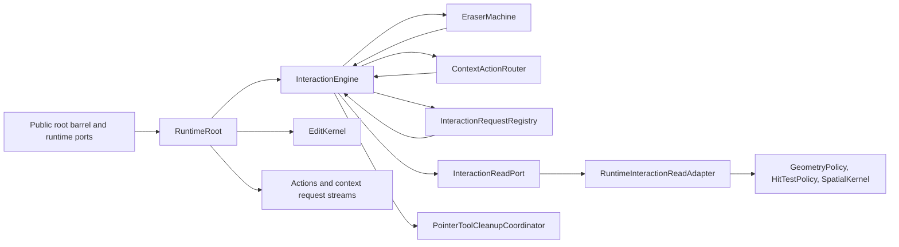
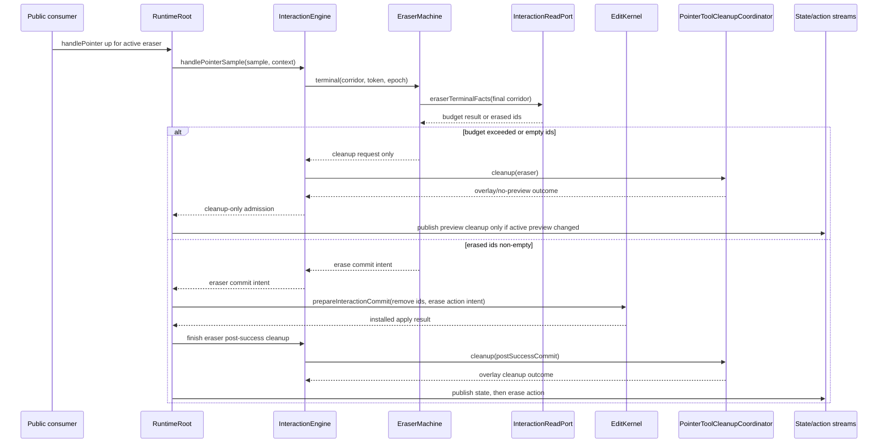
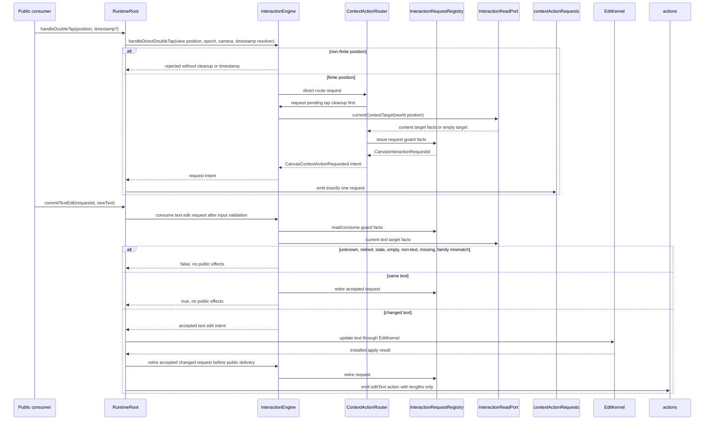

# Design: P12 Eraser And Context-Action Request

---
date: 2026-06-02
designer: Codex
commit: 4dfbb439
branch: new-architecture
design_question: "Create a maximally detailed design for docs/implementation/p12_eraser_and_context_action_request.md that leaves no choice for the implementer, using docs/history/research/2026-06-02-p12-eraser-context-action-request.md and including how test/smoke/public_incremental_smoke_test.dart must expand to P12."
---

## Disposition

READY_FOR_CONTRACT

## Product Outcome

P12 turns the currently documented but incomplete interaction surface into two public behaviors: users can erase committed canvas elements with a visible corridor preview and atomic deletion, and applications can receive double-tap context-action requests and optionally commit text changes back through a guarded command. The engine never owns context menus, editor overlays, IME, focus, accessibility, or text-editor lifetime; it only emits request events and accepts later request-originated text commits.

Non-goals:

- Do not create application UI for context menus or text editing.
- Do not turn context-action requests into preview state.
- Do not allow eraser preview refresh, exact-hit probing, context-target resolution, request emission, stale request rejection, or cleanup-only paths to mutate document, selection, spatial, projection, resource, or action state.
- Do not introduce a legacy scene/controller facade, scene-builder public architecture, scene codec, scene store controller, or legacy runtime dependency.
- Do not satisfy P12 by only patching `RuntimeRoot.handleDoubleTap` or `RuntimeRoot.commitTextEdit`; the owning interaction, request, cleanup, and mutation boundaries must be installed.

## Target Contract Classification

- Profile: BEHAVIOR_CHANGE
- Obligations: PUBLIC_API_CHANGE, SEAM_MIGRATION

The future Change Contract must treat this as a runtime/public behavior change because P12 changes public `CanvasToolPort.handleDoubleTap`, public `CanvasCommandPort.commitTextEdit`, public `CanvasRuntime.contextActionRequests`, public action delivery for erase/editText, and public smoke-test behavior. It also migrates planned P12 seams from unsupported placeholders into interaction-owned production seams.

## Research Inputs

- `docs/history/research/2026-06-02-p12-eraser-context-action-request.md` - factual repository map supplied by the user. It confirms that P12 scope already includes eraser preview/commit, exact-hit integration, no-partial budget behavior, context request routing, request id issuance, guarded text edit commit, terminal cleanup, and stale terminal rejection, and that current production placeholders still throw or return unsupported/no-op behavior.

## Repository Evidence

`Evidence Consequence Link`: each fact below states the decision, boundary, unit, proof surface, or review consequence it supports.

- `docs/implementation/p12_eraser_and_context_action_request.md:5` - P12 exists to implement eraser preview/commit with exact-check budgets and context-action double-tap routing -> supports selecting a single interaction behavior design rather than separate unrelated feature designs.
- `docs/implementation/p12_eraser_and_context_action_request.md:11` - build scope names the eraser state machine -> supports adding an eraser-specific machine/capture owner under interaction.
- `docs/implementation/p12_eraser_and_context_action_request.md:12` - build scope names `CanvasEraserPreview` corridor preview -> supports publishing immutable corridor preview through existing public preview state.
- `docs/implementation/p12_eraser_and_context_action_request.md:13` - build scope names eraser exact-hit engine integration -> supports extending interaction read ports to use spatial candidates plus geometry exact checks.
- `docs/implementation/p12_eraser_and_context_action_request.md:14` - terminal eraser commit goes through `EditKernel` -> supports forbidding direct store mutation by eraser code.
- `docs/implementation/p12_eraser_and_context_action_request.md:15` - budget-exceeded eraser behavior is corridor-only preview or terminal cleanup/no-op with no partial erase -> supports an all-or-nothing eraser failure boundary.
- `docs/implementation/p12_eraser_and_context_action_request.md:17` - typed erase action payload is in scope -> supports adding `CanvasEraseActionPayload` materialization only after successful atomic install.
- `docs/implementation/p12_eraser_and_context_action_request.md:18` - direct host-recognized `handleDoubleTap` and engine-owned pointer-sample two-tap recognition are both in scope -> supports two distinct context request entry paths sharing one target resolver and registry.
- `docs/implementation/p12_eraser_and_context_action_request.md:20` - context-action target read model must use narrow query ports -> supports extending `InteractionReadPort` instead of exposing store internals.
- `docs/implementation/p12_eraser_and_context_action_request.md:21` - request event emission must cover content-element and empty-canvas targets -> supports two target variants and matching registry facts.
- `docs/implementation/p12_eraser_and_context_action_request.md:23` - request ids must be issued through interaction request registry -> supports creating one registry owner instead of deriving request validity from public event data.
- `docs/implementation/p12_eraser_and_context_action_request.md:24` - `commitTextEdit` must guard request-originated text changes from text content-target requests -> supports request-fact guarded text mutation through command port.
- `docs/implementation/p12_eraser_and_context_action_request.md:26` - terminal cleanup and stale terminal rejection are in scope -> supports reusing pointer cleanup and invalid terminal gates for eraser/context routes.
- `docs/implementation/p12_eraser_and_context_action_request.md:28` - P12 must consume existing `PointerToolCleanupCoordinator` seam and must not call it directly from eraser/context routing or own shared cleanup policy -> supports routing typed cleanup requests to `InteractionEngine` and keeping only `InteractionEngine` as coordinator caller.
- `docs/implementation/p12_eraser_and_context_action_request.md:39` - P5 edit core owns deletion commits and rollback -> supports committing eraser removals and text edits through `EditKernel`.
- `docs/implementation/p12_eraser_and_context_action_request.md:40` - P8 geometry/spatial owns exact hit and candidate budget primitives -> supports using `GeometryPolicy`, `HitTestPolicy`, and `SpatialKernel` rather than duplicating geometry.
- `docs/implementation/p12_eraser_and_context_action_request.md:41` - P9 frame rendering owns overlay preview capture -> supports leaving eraser preview rendering in frame overlay planning.
- `docs/implementation/p12_eraser_and_context_action_request.md:42` - P10 pointer session and move safety are available -> supports extending the existing pointer-session owner instead of creating parallel pointer state.
- `docs/implementation/p12_eraser_and_context_action_request.md:43` - P11 draw-mode pointer and preview infrastructure are available -> supports modeling eraser as a draw-mode tool sibling to pencil/marker/line.
- `docs/implementation/p12_eraser_and_context_action_request.md:54` - required donors include pointer input contract, action event immutability, interactive geometry, eraser exact hit, pointer session, normalizer, dispatcher, double-tap router, gesture runtime, draw coordinator, and mutation boundary -> supports the exact implementation input list for the future contract.
- `docs/implementation/p12_eraser_and_context_action_request.md:68` - forbidden donor structure excludes scene controller facades and legacy scene structures -> supports guardrail proof that P12 does not import or recreate those shapes.
- `docs/implementation/p12_eraser_and_context_action_request.md:76` - P12 names pointer-preview/commit, eraser, context request, and pointer-session diagrams to read/update -> supports future docs/diagram source-of-truth update scope.
- `docs/implementation/p12_eraser_and_context_action_request.md:99` - P12 lists focused proof files and guardrail ids -> supports future verification matrix and execution units.
- `docs/implementation/p12_eraser_and_context_action_request.md:120` - exit gate requires eraser preview tests green and immutable `CanvasEraserPreview` -> supports preview proof.
- `docs/implementation/p12_eraser_and_context_action_request.md:123` - eraser preview/cleanup changes only preview revision and no unrelated effects -> supports effect-matrix tests.
- `docs/implementation/p12_eraser_and_context_action_request.md:126` - cleanup-capable eraser/context machines must consume the existing coordinator seam and not own shared cleanup policy -> supports `interaction.pointer_cleanup_coordinator_only` enforcement.
- `docs/implementation/p12_eraser_and_context_action_request.md:129` - exact-check budget exceeded produces no partial erase -> supports all-or-nothing terminal tests.
- `docs/implementation/p12_eraser_and_context_action_request.md:131` - content double tap emits one request for both direct and pointer-sample recognition, including non-selectable visible content -> supports target policy independent from selection eligibility.
- `docs/implementation/p12_eraser_and_context_action_request.md:134` - direct empty/background double tap emits one empty-canvas request without pending first-tap history -> supports direct route bypassing pending tap.
- `docs/implementation/p12_eraser_and_context_action_request.md:137` - direct non-finite positions reject before timestamped request emission, target resolution, cleanup, or effects -> supports boundary validation order.
- `docs/implementation/p12_eraser_and_context_action_request.md:139` - direct double tap clears pending context tap through cleanup before current-target resolution -> supports temporal ordering and cleanup integration.
- `docs/implementation/p12_eraser_and_context_action_request.md:142` - pointer-sample two-tap recognition must revalidate current target facts -> supports pending tap guard facts and second-tap requery.
- `docs/implementation/p12_eraser_and_context_action_request.md:148` - text commits reject stale facts, empty-canvas ids, non-text ids, retired ids, missing targets, family mismatches, and do not treat unrelated document revision changes as stale -> supports registry schema and stale-guard semantics.
- `docs/implementation/p12_eraser_and_context_action_request.md:153` - context request ids use generic `CanvasInteractionRequestId` -> supports no text-specific request id type.
- `docs/implementation/p12_eraser_and_context_action_request.md:155` - loadDocument prepared cleanup clears eraser/context gesture state on success and failure preserves it where required -> supports load cleanup ordering.
- `docs/contracts/interaction_engine.md:141` - cleanup-capable tool machines return typed cleanup requests to `InteractionEngine`, which is the only caller of `PointerToolCleanupCoordinator` -> supports extending machines without direct coordinator calls.
- `docs/contracts/interaction_engine.md:144` - committed facts for gesture decisions are read through narrow interaction query ports -> supports adding eraser/context read requests to `InteractionReadPort`.
- `docs/contracts/interaction_engine.md:151` - `InteractionEngine` commits only through `EditKernel` -> supports mutation boundary for eraser and text edits.
- `docs/contracts/interaction_engine.md:180` - coordinator is an internal `InteractionEngine` collaborator, not public API, state store, edit owner, event dispatcher, context-request emitter, or repaint notifier -> supports preserving owner separation.
- `docs/contracts/interaction_engine.md:206` - coordinator owns cleanup outcome calculation and explicitly does not own exact eraser checks, commit-intent creation, document/selection mutation, or resource mutation -> supports eraser machine owning hit decisions but not cleanup policy.
- `docs/contracts/interaction_engine.md:215` - cleanup outcome is effect-only and includes pending context tap cleared -> supports context cleanup without public effects.
- `docs/contracts/interaction_engine.md:221` - load cleanup outcome is produced before RuntimeRoot crosses the document install commit point -> supports prepared cleanup before load install.
- `docs/contracts/interaction_engine.md:227` - pending context tap cleanup clears tap history without preview, repaint, action, context request, document, selection, spatial, or projection effects -> supports no-effect cleanup proof.
- `docs/contracts/interaction_engine.md:244` - `InteractionEngine` is the only producer of public preview variants -> supports publishing eraser preview only from interaction.
- `docs/contracts/interaction_engine.md:257` - `CanvasEraserPreview` repaint target is overlay only -> supports overlay-only preview/cleanup.
- `docs/contracts/interaction_engine.md:266` - P10 direct double tap throws unsupported and has no effects -> supports replacing placeholder behavior.
- `docs/contracts/interaction_engine.md:273` - P12 double tap emits exactly one `CanvasContextActionRequested` with doubleTap trigger and content/empty target and no document/selection/preview/repaint/spatial/projection/resource/action effect -> supports request delivery effect boundary.
- `docs/contracts/interaction_engine.md:279` - direct `handleDoubleTap` is host-recognized, accepts finite view position, clears pending tap history through coordinator, resolves current target, issues request id, records registry facts, and rejects non-finite before target resolution/emission -> supports direct route execution order.
- `docs/contracts/interaction_engine.md:291` - engine-owned pointer-sample recognition stores first tap and revalidates second tap against current facts -> supports separate two-tap machine state.
- `docs/contracts/interaction_engine.md:298` - content targets carry immutable public `CanvasElement` snapshot and `boundsWorld`, while empty targets carry no element snapshot -> supports request payload shape and registry target kind.
- `docs/contracts/interaction_engine.md:304` - registry records generated id, target kind, controllerEpoch, retired status, and content target id/generation/elementRevision/family -> supports registry fields.
- `docs/contracts/interaction_engine.md:310` - documentRevision is observation-only and not a stale guard -> supports text commit stale rules.
- `docs/contracts/interaction_engine.md:317` - registry is not an active text-input session or preview state and application owns UI -> supports no engine UI session.
- `docs/contracts/interaction_engine.md:321` - request-originated text changes commit through `CanvasCommandPort.commitTextEdit` and, after P12, accept only current unretired text content requests while validating text before retirement/draft mutation -> supports command route and validation order.
- `docs/contracts/geometry.md:157` - eraser policy defines world-coordinate corridor, inflated envelope, exact segment-to-family checks, deletable-only content, and no background erase -> supports geometry read-policy shape.
- `docs/contracts/geometry.md:167` - exact-check budgets are 512/4096 preview per sample and 4096/32768 terminal per gesture, with preview corridor-only and terminal cleanup/no-op/no partial erase -> supports budget gates and tests.
- `docs/contracts/geometry.md:176` - eraser budget exceeded increments eraser-owned metric/probe counters only and is not a DiagnosticsHub write -> supports forbidding new P12 DiagnosticsHub allocation for eraser budget paths.
- `docs/contracts/diagnostics.md:89` - interaction-observed hit-test fallback, query budget, stale candidate, stale terminal, invalid cleanup, selected-move denial, and resolver reentrant mutation already route through the interaction diagnostics boundary without public API export and without mutating committed/public state -> supports reusing the existing interaction diagnostics route for P12 interaction-observed reliability events only.
- `docs/contracts/diagnostics.md:92` - DiagnosticsHub routing table classifies preview or terminal eraser budget exhaustion as `not a DiagnosticsHub write` and requires no `DiagnosticRecord` allocation -> supports P12 eraser budget proof as behavior/metric proof, not diagnostics-route work.
- `docs/contracts/operation_matrix.md:90` - eraser preview touches only preview revision, overlay repaint, and no actions -> supports effect matrix.
- `docs/contracts/operation_matrix.md:91` - eraser commit removes elements, prunes selection if needed, updates document/selection/preview/internal revisions, removes spatial ids, evicts projection, repaints main+overlay, and emits erase if removed -> supports post-install delivery order.
- `docs/contracts/operation_matrix.md:92` - P12 context request is stream-only and direct `handleDoubleTap` clears pending tap before current-target resolution while registry stores guard facts -> supports request route.
- `docs/contracts/operation_matrix.md:93` - stale text edit rejection only retires known request state privately and has no public effects -> supports registry retirement behavior.
- `docs/contracts/operation_matrix.md:95` - changed text edit commits through `EditKernel`, updates document/internal revisions, may touch spatial, evicts projection, repaints main, and emits editText -> supports text commit outcome.
- `docs/contracts/operation_matrix.md:123` - context request event includes request id, trigger, epoch, documentRevision, timestamp, view/world positions, and content or empty target -> supports public event construction.
- `docs/contracts/operation_matrix.md:133` - `commitTextEdit` rejects stale by request id, epoch, target kind, generation, elementRevision, missing element, empty-canvas, non-text, and family mismatch while documentRevision is observation-only -> supports stale check exact list.
- `docs/contracts/operation_matrix.md:143` - `commitTextEdit` validates `newText` before request retirement and before draft mutation, and action payload contains text lengths only -> supports input validation and security/privacy.
- `docs/contracts/public_api_v1.md:2066` - `CanvasEraserPreview` stores unmodifiable corridor and thickness -> supports immutable preview proof.
- `docs/contracts/public_api_v1.md:2219` - `CanvasEraseActionPayload` carries eraser thickness, erased ids, and corridor point count -> supports erase action payload.
- `docs/contracts/public_api_v1.md:2231` - `CanvasTextEditActionPayload` carries request id and previous/next text lengths -> supports text action payload without raw text.
- `docs/contracts/public_api_v1.md:2276` - eraser commit emits erase action only if removed -> supports no action on empty/budget cleanup.
- `docs/contracts/public_api_v1.md:2277` - guarded changed text edit emits editText and stale/no-op emits no action -> supports text command outcome.
- `docs/contracts/public_api_v1.md:2288` - public `CanvasContextActionRequested` has request id, trigger, target, epoch, documentRevision, timestamp, and view/world positions -> supports event construction.
- `docs/contracts/public_api_v1.md:2314` - content target carries immutable element snapshot and boundsWorld -> supports content target read model.
- `docs/contracts/public_api_v1.md:2325` - empty-canvas target has no element snapshot -> supports empty target payload.
- `docs/contracts/public_api_v1.md:2333` - context-action model says P10 producer absent and P12 emits exactly one request while app owns menu/editor UI and request-originated edits use `commitTextEdit` -> supports replacement and non-UI boundary.
- `docs/diagrams/seq_eraser_commit.mmd:27` - eraser starts on pointer down in draw mode with eraser tool -> supports draw-mode admission.
- `docs/diagrams/seq_eraser_commit.mmd:31` - session stores finite eraser thickness and world-space corridor points -> supports eraser capture fields.
- `docs/diagrams/seq_eraser_commit.mmd:48` - preview refresh queries spatial with inflated corridor envelope -> supports read-port query shape.
- `docs/diagrams/seq_eraser_commit.mmd:105` - terminal budget exceeded triggers typed cleanup and no partial erase -> supports all-or-nothing proof.
- `docs/diagrams/seq_eraser_commit.mmd:133` - non-empty erased ids open synchronous edit and remove through draft mutations -> supports mutation boundary.
- `docs/diagrams/seq_eraser_commit.mmd:158` - atomic install precedes action materialization and public signals -> supports delivery order.
- `docs/diagrams/seq_eraser_commit.mmd:184` - edit exception/preflight failure discards pending erase action and rolls back -> supports failure projection.
- `docs/diagrams/seq_context_action_request.mmd:23` - direct host-recognized double tap route is separate -> supports direct method route.
- `docs/diagrams/seq_context_action_request.mmd:27` - non-finite direct double tap rejects before target resolution or request emission -> supports validation order.
- `docs/diagrams/seq_context_action_request.mmd:31` - finite direct route resolves timestamp, clears pending tap, converts position, queries, registers, and emits -> supports temporal order.
- `docs/diagrams/seq_context_action_request.mmd:62` - pointer-sample first tap stores pending candidate -> supports pending context tap state.
- `docs/diagrams/seq_context_action_request.mmd:94` - second tap cleanup on target/slop/delay/epoch mismatch emits no request/effects -> supports revalidation proof.
- `docs/diagrams/seq_context_action_request.mmd:128` - later app text change uses `commitTextEdit` and registry/read-port facts before edit -> supports text command route.
- `docs/diagrams/seq_context_action_request.mmd:153` - request delivery forbids edit commit, draft, touched set, atomic install, state changes, repaint, action, and engine-owned app UI before later text commit -> supports effect isolation.
- `docs/diagrams/state_pending_context_action_request.mmd:17` - direct double-tap clears stale pending context tap before current target resolution -> supports direct route cleanup order.
- `docs/diagrams/state_pending_context_action_request.mmd:48` - context targeting uses visible content, finite invertible transforms, exact geometry, topmost content paint order, and not `isSelectable`; background-only is empty canvas -> supports target policy.
- `docs/diagrams/state_pending_context_action_request.mmd:60` - pending content state is input history only and not preview or store state -> supports state ownership.
- `docs/diagrams/state_pending_context_action_request.mmd:108` - content match requires same id, generation, elementRevision, family, epoch, visibility, and top-hit status -> supports second-tap and commit stale checks.
- `docs/diagrams/state_pending_context_action_request.mmd:152` - commitTextEdit accepted/rejected requests retire, load success makes ids stale, dispose makes later commit throw -> supports registry lifecycle.
- `docs/diagrams/state_pending_context_action_request.mmd:168` - context cleanup creates typed cleanup request to clear pending tap history only with no public effects -> supports cleanup proof.
- `docs/diagrams/state_eraser.mmd:16` - eraser down admission requires token, session id, epoch, draw mode, eraser tool, finite point, and finite thickness -> supports admission fields.
- `docs/diagrams/state_eraser.mmd:47` - candidate refresh is read-only and uses inflated envelope, committed candidates, exact checks for deletable non-background content, and preview budgets -> supports read-port and geometry checks.
- `docs/diagrams/state_eraser.mmd:62` - terminal gate requires same token, same epoch, finite terminal, final corridor facts, and terminal budgets -> supports terminal guard.
- `docs/diagrams/state_eraser.mmd:81` - edit commit removes through synchronous `EditKernel` draft mutation and never direct store mutation -> supports mutation boundary.
- `docs/diagrams/state_eraser.mmd:112` - cleanup-only paths include budget exceeded, empty ids, stale/invalid terminal, edit failure, external interruptions, and active preview cleanup publishes only preview revision -> supports failure matrix.
- `docs/architecture/architecture_graph.yaml:463` - architecture graph already has a future P12 `eraser_context.request` interaction owner -> supports implementing under interaction ownership and later updating graph status/declarations.
- `docs/architecture/architecture_graph.yaml:425` - interaction engine boundary already lists `InteractionEngine`, `InteractionReadPort`, `PointerSession`, `PointerSampleNormalizer`, and `PointerToolCleanupCoordinator` -> supports extending existing owners instead of adding a parallel runtime owner.
- `docs/architecture/02_package_boundaries.md:303` - package boundaries already name `lib/src/interaction/context_action_router.dart` as the future interaction route owner for direct `handleDoubleTap` and pointer-sample double-tap target resolution/request emission -> locks the router file name and rejects the alternative `context_action_request_router.dart`.
- `docs/architecture/02_package_boundaries.md:312` - package boundaries already name `lib/src/interaction/interaction_request_registry.dart` as the guard-fact registry for engine-issued request ids -> supports registry placement and source-of-truth alignment.
- `docs/diagrams/generated/future_target.mmd:15` - future graph shows P12 eraser/context-action request commits through edit kernel, delegates lifecycle and request decisions through interaction engine, streams context requests through public runtime, and uses geometry/spatial -> supports selected boundary shape.
- `lib/src/runtime/runtime_root.dart:157` - runtime already owns a broadcast context-action request stream controller -> supports emitting requests through existing runtime stream rather than adding a new public stream.
- `lib/src/runtime/runtime_root.dart:171` - runtime composes `RuntimeInteractionReadAdapter` with frame, document summary, selection, spatial, and epoch facts -> supports extending the adapter for eraser/context read requests.
- `lib/src/runtime/runtime_root.dart:179` - runtime composes `EditKernel` with mutation guard and commit delivery -> supports eraser/text command mutation through the existing edit path.
- `lib/src/runtime/runtime_root.dart:740` - `commitTextEdit` currently validates input and returns false -> supports replacing P10 placeholder with registry-guarded behavior.
- `lib/src/runtime/runtime_root.dart:836` - public pointer input currently routes through `InteractionEngine.handlePointerSample` and then RuntimeRoot delivers selected move, marquee, stroke, and line commits -> supports adding eraser and context admissions to the same dispatch/commit delivery path.
- `lib/src/runtime/runtime_root.dart:881` - `handleDoubleTap` currently throws unsupported P12 placeholder -> supports direct route replacement.
- `lib/src/runtime/runtime_root.dart:1621` - public tool port forwards `handleDoubleTap` to RuntimeRoot -> supports keeping public API shape unchanged.
- `lib/src/runtime/runtime_root.dart:1637` - public command port forwards `commitTextEdit` to RuntimeRoot -> supports keeping public API shape unchanged.
- `lib/src/interaction/interaction_engine.dart:24` - `InteractionEngine` already owns mode, draw style, pointer policy, normalizer, move/select/draw/line machines, cleanup coordinator, active session, pending line, preview, and revisions -> supports adding eraser and context state here.
- `lib/src/interaction/interaction_engine.dart:99` - preview replacement increments preview revision only on semantic preview change -> supports no duplicate preview states.
- `lib/src/interaction/interaction_engine.dart:132` - `InteractionEngine.cleanupPointerTool` is the coordinator call point -> supports only-engine cleanup calls.
- `lib/src/interaction/interaction_engine.dart:212` - pointer samples normalize and route down/move/up/cancel through the engine -> supports adding eraser/context pointer routes there.
- `lib/src/interaction/interaction_engine.dart:311` - draw-mode down currently routes line separately and other draw tools through `DrawStrokeMachine` -> supports inserting eraser before stroke-machine pencil/marker handling.
- `lib/src/interaction/interaction_engine.dart:451` - terminal routing gates invalid/stale/cancel before active terminal handling -> supports eraser stale terminal rejection.
- `lib/src/interaction/interaction_engine.dart:817` - cleanup request currently includes active preview, token/session, and pending line facts but not pending context tap -> supports extending cleanup request construction with context tap state.
- `lib/src/interaction/pointer_tool_cleanup_coordinator.dart:35` - coordinator already models pending context tap disposition -> supports P12 consuming, not reinventing, context cleanup outcome.
- `lib/src/interaction/pointer_tool_cleanup_coordinator.dart:111` - coordinator clears pending context tap when request says one exists -> supports InteractionEngine supplying `hasPendingContextTap`.
- `lib/src/interaction/pointer_tool_cleanup_coordinator.dart:148` - eraser preview cleanup repaints overlay -> supports eraser cleanup repaint target.
- `lib/src/interaction/draw_stroke_machine.dart:175` - stroke style returns null for eraser -> supports creating a separate `EraserMachine` rather than overloading stroke machine.
- `lib/src/interaction/line_machine.dart:7` - line behavior already lives in its own machine -> supports sibling `EraserMachine` and `ContextActionRequestMachine`/router.
- `lib/src/interaction/pointer_session.dart:8` - active pointer session variants do not yet include eraser or context tap -> supports extending pointer session variants/captures.
- `lib/src/interaction/pointer_sample_normalizer.dart:45` - sample normalizer converts view-space position to world-space by adding camera offset -> supports reusing same normalization for pointer-sample eraser/context routes.
- `lib/src/geometry/geometry_policy.dart:75` - geometry policy already builds finite eraser corridors with envelope and exact radius -> supports using this for preview and terminal routes.
- `lib/src/geometry/geometry_policy.dart:100` - geometry policy already exposes preview and terminal budget input limits -> supports no duplicate budget constants.
- `lib/src/geometry/hit_test_policy.dart:79` - hit-test policy already exposes exact eraser hit by family -> supports eraser exact-hit integration.
- `lib/src/geometry/spatial_kernel.dart:139` - spatial kernel exposes `queryEraser` through paint index -> supports eraser candidate reads from spatial owner.
- `docs/verification/tests.md:568` - public incremental smoke proves external Flutter consumers can import only the root public barrel and exercise public runtime behavior -> supports extending this smoke test for P12 as package-boundary proof.
- `docs/verification/tests.md:592` - public incremental smoke must expand only by appending the next real public user step after the public API exposes one -> supports appending P12 public scenarios, not replacing existing P10/P11 coverage.
- `docs/verification/tests.md:608` - existing P8 eraser budget input test intentionally leaves terminal cleanup/no-op commit behavior to P12 -> supports adding P12 terminal no-partial tests.
- `docs/verification/tests.md:648` - P10 public command/tool tests currently prove double tap remains unsupported and context requests are empty -> supports replacing this expectation in P12 focused and smoke coverage.
- `docs/verification/tests.md:700` - P11 smoke appended root-barrel public drawing, preview, and typed action behavior -> supports continuing the append-only public smoke style.
- `test/smoke/public_incremental_smoke_test.dart:9` - smoke uses package-boundary harness package name `iwb_canvas_engine_public_incremental_smoke` -> supports keeping P12 smoke through the external consumer harness.
- `test/smoke/public_incremental_smoke_test.dart:568` - smoke currently expects `handleDoubleTap` to throw `UnsupportedError` -> supports changing/relocating that P10 placeholder expectation when P12 lands.
- `test/smoke/public_incremental_smoke_test.dart:652` - smoke currently expects unknown `commitTextEdit` to return false -> supports preserving unknown-id no-op and adding issued-id accepted/rejected behavior.
- `test/smoke/public_incremental_smoke_test.dart:700` - smoke already has a P11 draw workflow helper using public `CanvasRuntime`, `CanvasSurface`, public pointer samples, preview reads, document reads, and action stream -> supports appending a P12 helper rather than creating a separate smoke file.
- `lib/iwb_canvas_engine.dart:1` - root barrel exports public API facades and contracts -> supports smoke test verifying only root-barrel imports.
- `docs/history/research/2026-06-02-p12-eraser-context-action-request.md:26` - research confirms current code already contains API shapes, geometry primitives, spatial query, edit rollback, overlay rendering, cleanup, stale terminal infrastructure, but no P12 producer/registry acceptance path -> supports implementation as seam completion rather than new public API invention.

## Design Form Candidates

### Candidate A. Extend Existing Interaction Owner With Eraser/Context Machines, Read-Port Queries, Registry, And Runtime Delivery

- Form: Add focused interaction-owned collaborators under `lib/src/interaction/` for eraser lifecycle, context-action targeting/tap recognition, and interaction request registry; extend `PointerSession`, `InteractionReadPort`, `RuntimeInteractionReadAdapter`, and `RuntimeRoot` delivery so the public tool/command ports keep their shapes while behavior lands behind the existing interaction and edit boundaries.
- Why it could work: It follows existing P10/P11 ownership: public inputs enter RuntimeRoot/tool ports, pointer samples route through `InteractionEngine`, focused tool machines create previews/commit intents/cleanup requests, `RuntimeRoot` performs edit delivery through `EditKernel`, and public streams/actions are emitted after accepted boundaries.
- Gate failures or risks: Requires several coordinated changes, but all are in the owning boundaries and can be proven by focused tests plus smoke. No hard-gate failure.

### Candidate B. Create A Runtime-Level `EraserTextRequestCoordinator` Around `InteractionEngine`

- Form: Implement P12 as a new runtime-owned coordinator composed by `RuntimeRoot`, with `InteractionEngine` only forwarding low-level events.
- Why it could work: The architecture graph future node currently names `EraserTextRequestCoordinator`, and runtime already owns streams/action delivery.
- Gate failures or risks: Fails ownership and boundary-owned policy for pointer lifecycle because P12 requires pointer sessions, preview revisions, pending context tap history, and cleanup requests to remain interaction-owned. It would either duplicate active-session state or force `RuntimeRoot` to reason about cleanup details that `PointerToolCleanupCoordinator` owns.

### Candidate C. Patch Public Facade Methods And Command Methods Directly

- Form: Implement direct double-tap and text edit behavior inside `RuntimeRoot.handleDoubleTap` and `RuntimeRoot.commitTextEdit`, and add eraser handling inside the existing draw stroke path with minimal new files.
- Why it could work: It changes the user-visible behavior quickly and can pass narrow public tests.
- Gate failures or risks: Fails owner-level fix, source-of-truth singularity, state ownership, and temporal closure. It leaves pointer-sample two-tap recognition, pending tap cleanup, eraser stale terminals, no-partial terminal behavior, and cleanup coordinator consumption scattered or missing.

### Candidate D. Treat Context Requests As Preview Or Selection State

- Form: Store the pending/later context target in `CanvasPreviewState` or selection state so public consumers can observe it through existing state.
- Why it could work: Reuses public state delivery mechanisms.
- Gate failures or risks: Fails public contract and operation matrix. Context-action requests are stream-only; request delivery must not mutate preview, document, selection, repaint, spatial, projection, resource, or action state.

## Known Future Pressures

| Pressure | Evidence | How the selected form responds | Accepted cost or risk |
|---|---|---|---|
| P13 Flutter surface will drive public runtime ports and may add host-recognized double tap from widgets | `docs/architecture/architecture_graph.yaml:479`, `docs/diagrams/generated/future_target.mmd:19` | Keeps `CanvasToolPort.handleDoubleTap` as the direct host-recognized entrypoint and does not bind context UI to engine internals. | P13 may need adapter wiring, but P12 API behavior is already stable. |
| P14 measurement will need eraser budget/exact-hit benchmarks and proof that partial erase count is zero | `docs/verification/benchmarks.md:52`, `docs/verification/benchmarks.md:53` | Uses geometry-owned budget inputs and a no-partial terminal cleanup branch that can be counted by future benchmarks without altering behavior. | P12 may add minimal eraser-owned counters/probes only; full DiagnosticsHub route remains deferred unless current contracts require it. |
| DiagnosticsHub routing must not expand accidentally through eraser budgets | `docs/contracts/diagnostics.md:89`, `docs/contracts/diagnostics.md:92`, `docs/contracts/geometry.md:176` | Keeps eraser budget exhaustion as `not a DiagnosticsHub write` while preserving the existing interaction diagnostics route for interaction-observed query/stale/invalid reliability events. | Future implementation must prove no `DiagnosticRecord` allocation on eraser budget paths; if product wants diagnostics for eraser budgets later, that is a separate diagnostics contract, not P12 behavior closure. |
| Architecture graph currently lists future `EraserTextRequestCoordinator` declaration | `docs/architecture/architecture_graph.yaml:477` | The future Change Contract must update graph declarations to the actual selected interaction-owned collaborators: `EraserMachine`, `ContextActionRouter`, and `InteractionRequestRegistry`, or name a single coordinator only if it is a thin interaction-owned orchestrator and not a runtime facade. | Requires source-of-truth graph/doc update in implementation contract; design does not edit graph now. |
| Public smoke test is append-only and must not become a detailed interaction matrix | `docs/verification/tests.md:592`, `test/smoke/public_incremental_smoke_test.dart:700` | Adds one P12 public workflow helper that exercises eraser preview/commit, direct content/empty request, issued text commit, and unknown-id no-op through root barrel, leaving stale/budget/revalidation matrices to focused tests. | Smoke grows, but remains coarse package-boundary proof rather than full diagnostics. |
| Context menu/text editor UI remains application-owned | `docs/contracts/interaction_engine.md:317`, `docs/contracts/public_api_v1.md:2363` | Registry records guard facts only and never stores editor lifetime, focus, IME, overlay visibility, or text selection. | Applications must manage UI lifetime; engine only validates final commit. |
| Text layout changes may alter bounds and require spatial/projection invalidation | `docs/contracts/operation_matrix.md:148` | Changed text commits use `EditKernel` and existing update-element/touched-set machinery so bounds revisions and spatial updates are compiled by the edit owner. | Implementation must rely on current text update infrastructure; if missing, future contract must add it in the edit-owned unit before command acceptance. |
| LoadDocument cleanup ordering spans interaction state and runtime commit point | `docs/contracts/interaction_engine.md:221`, `docs/implementation/p12_eraser_and_context_action_request.md:155` | Prepared cleanup is produced before install, consumed after successful install, and load failure preserves eraser/context state where required. | Requires focused load cleanup tests; cannot be proven by public smoke alone. |

## Selected Form

Select Candidate A.

The future implementation must extend the existing interaction owner with focused P12 collaborators and keep public ports unchanged. The selected shape is:

1. `InteractionEngine` remains the only active interaction state owner for pointer sessions, pending line state, pending context tap state, preview state, interaction revision, preview revision, and cleanup coordinator calls.
2. Add `lib/src/interaction/eraser_machine.dart` as a sibling to `draw_stroke_machine.dart` and `line_machine.dart`. It owns eraser capture values, eraser preview decisions, final eraser target decisions, exact-check budget branching, and eraser commit-intent payloads. It does not call `PointerToolCleanupCoordinator`, `EditKernel`, streams, frame, store, selection, resources, or runtime publication.
3. Add `lib/src/interaction/context_action_router.dart` as the interaction-owned router for direct host-recognized `handleDoubleTap` and pointer-sample two-tap recognition. This file name is locked by `docs/architecture/02_package_boundaries.md:303`; the future Change Contract must not introduce `context_action_request_router.dart` unless it first changes that source of truth. The router owns pending tap capture, direct-route validation, target-class matching, second-tap revalidation decisions, and request emission intent creation. It does not mutate document/selection/preview and does not own app UI.
4. Add `lib/src/interaction/interaction_request_registry.dart` as the interaction-owned registry for issued context request ids and guard facts. It owns generated id sequence, request target kind, retired/live state, controller epoch, content target id/generation/elementRevision/family, optional observation-only documentRevision, and request retirement. It is not public API and not preview state.
5. Extend `InteractionReadPort` with intent-specific read requests/results for eraser preview, eraser terminal, direct context target, pending context first tap, context second tap revalidation, and text commit guard facts. `RuntimeInteractionReadAdapter` implements those requests using `FrameFactsPort`, `SpatialKernel`, `HitTestPolicy`, `GeometryPolicy`, document summary/revision facts, and selection facts only where selection pruning proof needs them. It must not expose store tables, draft access, selection internals, mutation methods, frame cache internals, resource sessions, or public document projection.
6. Extend `PointerSession` with an eraser session payload rather than using `PointerStrokeCapture`. The eraser payload stores session id, token, pointer id, controller epoch, start/current world, finite eraser thickness, corridor points, and any read-only preview candidate facts allowed by the eraser machine. Context pending tap is not a `PointerSession`; it is separate interaction-owned input history because direct `handleDoubleTap` can exist without an active pointer session and because cleanup policy already has `pendingContextTapDisposition`.
7. Extend `InteractionPointerAdmission` with eraser commit intent and context request intent fields. RuntimeRoot handles these after `handlePointerSample` returns, just as it already handles selected move, marquee, stroke, and line commit intents.
8. `RuntimeRoot.handleDoubleTap` becomes the direct route adapter: it validates runtime mutability, calls a new `InteractionEngine.handleDirectDoubleTap(...)` or equivalent interaction entrypoint with the view position, camera offset, epoch, and timestamp resolver, then emits the returned context request through `_contextActionRequests` only if a request intent is returned. It must not resolve target data itself except by providing composed ports/context.
9. Eraser terminal non-empty commits are delivered by RuntimeRoot through a dedicated erase delivery method that calls `EditKernel.prepareInteractionCommit`, removes each erased id through `CanvasEdit.removeElement`, attaches `CanvasEraseActionPayload` action intent, applies cleanup through `InteractionEngine.finishEraser(PointerCleanupReason.postSuccessCommit)` after successful install or cleanup-only/error, and publishes one coherent public state after document/selection/preview effects are combined.
10. `RuntimeRoot.commitTextEdit` consumes the registry through an interaction-owned command entrypoint. It validates `newText` before request retirement or draft mutation, rejects unknown/retired as pure no-op false, privately retires known live stale/empty/non-text/missing/family-mismatched ids with false and no public effects, and accepts same-text current text with private retirement and true/no public effects. For changed text, RuntimeRoot must perform guard acceptance, run the `EditKernel` text update, require successful atomic install, privately retire the accepted request id after install and before any public state/action delivery, and only then publish the document state plus `CanvasTextEditActionPayload`. If the changed text edit fails before install, the request is not retired as an accepted changed request and no public state/action is emitted.

This form leaves no implementation choice about owners, boundaries, route order, state ownership, cleanup ownership, request guard facts, stale semantics, public effects, or proof surfaces.

## Decision Trace

Preserve `Decision Chain Of Custody`: source inputs and locked decisions must map to the future contract field, execution unit, or proof surface that carries them forward.

| Decision ID | Decision | Evidence | Contract handoff target |
|---|---|---|---|
| D1 | Implement P12 as one interaction-owner behavior slice, not separate eraser and text features. | `docs/implementation/p12_eraser_and_context_action_request.md:5`, `docs/implementation/p12_eraser_and_context_action_request.md:167` | Contract `Scope`, `Boundaries.Owner`, unit ordering |
| D2 | `InteractionEngine` owns active eraser sessions, pending context tap state, preview publication, registry access, and cleanup coordinator calls. | `docs/contracts/interaction_engine.md:141`, `docs/contracts/interaction_engine.md:244`, `lib/src/interaction/interaction_engine.dart:24` | `Boundaries.Owner`, `Boundaries.State`, Unit 1 and Unit 3 |
| D3 | Tool machines/router return typed cleanup requests/intents; only `InteractionEngine` calls `PointerToolCleanupCoordinator`. | `docs/implementation/p12_eraser_and_context_action_request.md:28`, `docs/contracts/interaction_engine.md:180`, `lib/src/interaction/interaction_engine.dart:132` | `Execution order`, `Guardrails`, proof `interaction.pointer_cleanup_coordinator_only` |
| D4 | Add `EraserMachine` instead of using `DrawStrokeMachine` for eraser. | `lib/src/interaction/draw_stroke_machine.dart:175`, `docs/implementation/p12_eraser_and_context_action_request.md:11`, `docs/diagrams/state_eraser.mmd:47` | Unit 1 implementation files, naming/cohesion check |
| D5 | Add `context_action_router.dart` and `interaction_request_registry.dart` under interaction, not runtime, preview, selection, or app UI. | `docs/contracts/interaction_engine.md:273`, `docs/contracts/interaction_engine.md:317`, `docs/diagrams/state_pending_context_action_request.mmd:60`, `docs/architecture/02_package_boundaries.md:303` | Unit 3 and Unit 4, `Boundaries.Source of Truth` |
| D6 | Eraser preview publishes immutable `CanvasEraserPreview(corridor, thickness)` and overlay-only repaint; preview refresh cannot mutate committed state. | `docs/contracts/public_api_v1.md:2066`, `docs/contracts/interaction_engine.md:257`, `docs/contracts/operation_matrix.md:90` | Unit 1, tests `preview_public_state`, smoke P12 eraser preview |
| D7 | Eraser geometry reads use `GeometryPolicy.corridorEnvelope`, `SpatialKernel.queryEraser`, and `HitTestPolicy.exactEraserHit`; no duplicate geometry constants. | `docs/contracts/geometry.md:157`, `lib/src/geometry/geometry_policy.dart:75`, `lib/src/geometry/spatial_kernel.dart:139`, `lib/src/geometry/hit_test_policy.dart:79` | Unit 1 and Unit 2, tests `eraser_exact_budget_no_partial_commit` |
| D8 | Preview budget overflow produces corridor-only preview and discards tentative ids; terminal budget overflow is cleanup/no-op with no partial erase. | `docs/contracts/geometry.md:167`, `docs/diagrams/seq_eraser_commit.mmd:105` | Unit 1, Unit 2, proof `geometry.eraser_exact_budget_no_partial` |
| D9 | Non-empty eraser terminal commits remove ids through `EditKernel` and action materializes only after atomic install. | `docs/implementation/p12_eraser_and_context_action_request.md:14`, `docs/diagrams/seq_eraser_commit.mmd:133`, `docs/diagrams/seq_eraser_commit.mmd:158` | Unit 2, tests `commands_emit_user_actions`, `runtime_owner_separation` |
| D10 | Direct `handleDoubleTap` is host-recognized, accepts finite view position, clears stale pending tap before target resolution, and bypasses pending first-tap requirement. | `docs/contracts/interaction_engine.md:279`, `docs/diagrams/state_pending_context_action_request.mmd:17` | Unit 3, tests `context_action_request` |
| D11 | Pointer-sample context recognition is separate: first tap stores input history only; second tap revalidates current target class and facts. | `docs/contracts/interaction_engine.md:291`, `docs/diagrams/seq_context_action_request.mmd:62`, `docs/diagrams/state_pending_context_action_request.mmd:108` | Unit 3, tests `eraser_context_action_routing`, `context_action_request` |
| D12 | Context targets use visible content, topmost paint order, exact geometry, and do not require selectable; background-only coverage is empty canvas. | `docs/implementation/p12_eraser_and_context_action_request.md:131`, `docs/diagrams/state_pending_context_action_request.mmd:48` | Unit 3, target read-model tests |
| D13 | Request registry guard facts are id, target kind, controllerEpoch, retired status, and for content target id/generation/elementRevision/family; documentRevision is observation-only. | `docs/contracts/interaction_engine.md:304`, `docs/contracts/interaction_engine.md:310`, `docs/contracts/operation_matrix.md:133` | Unit 4, tests `text_edit_stale_commit_guard` |
| D14 | `commitTextEdit` validates text before retirement/draft mutation, retires accepted no-op and known live stale rejections privately, commits changed text through `EditKernel`, and retires accepted changed request ids after successful install but before public state/action delivery. | `docs/contracts/interaction_engine.md:321`, `docs/contracts/operation_matrix.md:95`, `docs/contracts/operation_matrix.md:143`, `docs/diagrams/state_pending_context_action_request.mmd:152`, `lib/src/runtime/runtime_root.dart:740` | Unit 4, tests `text_edit_stale_commit_guard`, `typed_action_payloads` |
| D15 | Public smoke must append one P12 root-barrel workflow covering eraser preview/commit, direct content/empty request, issued text commit, and unknown-id no-op without duplicating focused matrices. | `docs/verification/tests.md:568`, `docs/verification/tests.md:592`, `test/smoke/public_incremental_smoke_test.dart:700` | Unit 6, `test/smoke/public_incremental_smoke_test.dart` |
| D16 | Load success prepared cleanup clears eraser/context state before install; load failure preserves state where required. | `docs/implementation/p12_eraser_and_context_action_request.md:155`, `docs/contracts/interaction_engine.md:221`, `docs/diagrams/state_pending_context_action_request.mmd:81` | Unit 5, tests `load_interaction_cleanup` |
| D17 | Future source-of-truth updates must include docs/diagrams/tests/architecture graph because P12 phase lists those as proving/diagram surfaces. | `docs/implementation/p12_eraser_and_context_action_request.md:74`, `docs/implementation/p12_eraser_and_context_action_request.md:97`, `docs/architecture/architecture_graph.yaml:463` | `Source-Of-Truth Impact`, docs/architecture checks |
| D18 | P12 must not add a DiagnosticsHub route for eraser budget exhaustion; eraser budgets are behavior/probe proof only, while interaction-observed reliability events continue through the existing interaction diagnostics route. | `docs/contracts/diagnostics.md:89`, `docs/contracts/diagnostics.md:92`, `docs/contracts/geometry.md:176` | Unit verification, diagnostics semantic search, no-allocation proof for eraser budget paths |

## Outcome-Proof Fit

| Claim | Direct outcome | Proxy risk | Required proof surface or strategy |
|---|---|---|---|
| Eraser preview is immutable, public, and overlay-only. | `runtime.preview is CanvasEraserPreview`, `corridor` cannot be mutated, only preview revision advances, overlay repaint requested. | Checking only that a preview object exists could miss mutable list or wrong revision/repaint effects. | `test/interaction/preview_public_state_test.dart`, `test/api_contract/preview_state_sealed_union_test.dart`, public smoke eraser preview assertions. |
| Eraser preview budget overflow does not create partial tentative ids. | Corridor preview remains visible and no document/selection/spatial/projection/action effect occurs. | Geometry budget input tests alone only prove constants, not runtime behavior. | `test/geometry/eraser_exact_budget_no_partial_commit_test.dart` plus interaction preview routing budget branch. |
| Eraser terminal budget overflow never partially erases. | After terminal overflow, all original elements remain, selected ids remain, document/selection revisions unchanged, preview clears if active, no erase action emitted. | Counting exact checks or seeing cleanup alone could still hide partial mutation. | Focused geometry/runtime test with dense candidates and action/state/spatial assertions; guardrail `geometry.eraser_exact_budget_no_partial`. |
| Eraser budget exhaustion is not a DiagnosticsHub write. | No `DiagnosticRecord` allocation, no DiagnosticsHub route, no public diagnostics effect; optional eraser-owned counters/probes stay outside DiagnosticsHub. | A diagnostics warning could be added while behavior still passes, violating the routing table and hot-path allocation expectations. | Diagnostics semantic search and focused no-allocation assertion for eraser budget paths; cite `docs/contracts/diagnostics.md:92`. |
| Non-empty eraser commit is atomic. | Removed ids disappear, selected erased ids prune in same state, spatial/projection invalidation and action happen after install; failures leave prior state unchanged. | Action event or document change alone could be emitted before cleanup or after partial install. | Runtime delivery tests that observe state publication before action, rollback path tests, `runtime_owner_separation`. |
| Cleanup-only eraser paths do not emit erase action or document state. | Active preview cleanup increments only preview revision; empty/no-preview cleanup is silent. | Testing cancel no-throw would miss revision/action leaks. | `test/interaction/pointer_tool_cleanup_coordinator_test.dart`, `draw_cleanup_integration`-style P12 cleanup test, operation matrix assertions. |
| Direct context double tap emits exactly one request and no state/effects. | One stream event with id/trigger/target/positions/epoch/revision, no runtime state snapshot, no action, no preview, no repaint. | Listening only to request stream could miss incidental state publication. | `test/interaction/context_action_request_test.dart`, public smoke direct content and empty requests with state/action checks. |
| Direct non-finite double tap rejects before timestamp, cleanup, target resolution, and request emission. | No event, no timestamp cursor advancement, pending tap not cleared, no read-port query. | No event alone could hide side effects. | Focused context test using pending tap + timestamp/action probes. |
| Pointer-sample two-tap recognition revalidates the second tap. | Stale/different/hidden/family-changed second tap clears pending only and emits no request; matching current facts emits one request. | Direct `handleDoubleTap` tests do not cover engine-owned two-tap path. | `test/interaction/eraser_context_action_routing_test.dart` and `test/interaction/context_action_request_test.dart`. |
| Text commit rejects stale and invalid requests without public effects. | Known live invalid requests retire privately and return false; unknown/retired return false with no private/public effects; state/action streams stay silent. | Return value alone could hide document mutation or action leak. | `test/interaction/text_edit_stale_commit_guard_test.dart`, `test/api/typed_action_payloads_test.dart`. |
| Changed text commit uses guarded request, retires accepted request id, and emits text lengths only. | Current text element changes through `EditKernel`; accepted request id is retired before public delivery; action is `editText` with request id and lengths only, no raw text. | Document text changed could still leak raw text in action payload or allow the same request id to commit twice. | Focused text action payload tests, text stale guard tests that retry the same id after changed commit, and public smoke issued text edit assertion. |
| Public smoke proves P12 root-barrel compatibility. | External Flutter consumer imports `package:iwb_canvas_engine/iwb_canvas_engine.dart` only and exercises P12 workflows through public runtime ports. | Focused internal tests could pass while public barrel exports or consumer package fail. | `test/smoke/public_incremental_smoke_test.dart` appended P12 workflow via shared harness. |

## Hard Gate Check

| Gate | Result | Evidence |
|---|---|---|
| Owner-Level Fix | pass | The selected form extends the interaction owner and edit boundary that contracts name for gesture decisions and commits: `docs/contracts/interaction_engine.md:141`, `docs/contracts/interaction_engine.md:151`. |
| Ownership | pass | `InteractionEngine` owns preview variants and cleanup coordinator calls, while geometry owns exact policy and edit owns committed mutation: `docs/contracts/interaction_engine.md:244`, `docs/contracts/geometry.md:157`, `docs/implementation/p12_eraser_and_context_action_request.md:39`. |
| Source-Of-Truth Singularity | pass | Registry is the only source of request guard facts; public events are delivery payloads, not commit authority: `docs/contracts/interaction_engine.md:304`, `docs/contracts/interaction_engine.md:317`. |
| Boundary-Owned Policy | pass | Public methods enter RuntimeRoot, interaction read requests cross narrow read ports, eraser/text mutations cross EditKernel, and cleanup crosses only InteractionEngine to coordinator: `lib/src/runtime/runtime_root.dart:1621`, `lib/src/runtime/runtime_root.dart:1637`, `docs/contracts/interaction_engine.md:144`, `docs/contracts/interaction_engine.md:151`. |
| Negative Proof And Fixture Quarantine | pass | Negative cases are production seams: budget overflow, stale terminal, invalid target, stale request, unknown request, and cleanup-only outcomes. Fixtures stay in test files and do not define production ids or schemas. Evidence: `docs/implementation/p12_eraser_and_context_action_request.md:99`, `docs/implementation/p12_eraser_and_context_action_request.md:108`. |
| Dependency direction | pass | Selected form keeps public contracts in contracts/public, interaction machines under interaction, geometry under geometry, runtime composition under runtime, and no legacy donors as dependencies: `docs/implementation/p12_eraser_and_context_action_request.md:66`, `docs/architecture/architecture_graph.yaml:425`. |
| State/data | pass | Committed document state remains Store/EditKernel-owned; derived spatial/projection state follows edit delivery; preview/pending tap/request registry state is interaction-owned; app UI state remains application-owned: `docs/contracts/interaction_engine.md:317`, `docs/contracts/operation_matrix.md:91`, `docs/contracts/operation_matrix.md:92`. |
| Sequenced Migration And Retirement | pass | P10 placeholders retire when P12 direct double-tap and text commit acceptance land; current unknown-id text no-op remains compatible: `docs/contracts/interaction_engine.md:266`, `docs/contracts/interaction_engine.md:321`, `test/smoke/public_incremental_smoke_test.dart:568`. |
| Temporal Surface Closure | pass | Direct route validation/timestamp/cleanup/target/registry/emission order is locked; eraser commit install/action/public state order is locked; load cleanup before install is locked: `docs/contracts/interaction_engine.md:279`, `docs/diagrams/seq_eraser_commit.mmd:158`, `docs/contracts/interaction_engine.md:221`. |
| All-Or-Nothing Failure Boundary | pass | Eraser terminal overflow and edit failure are cleanup/no-op without partial mutation; text commit validation happens before retirement/draft mutation; action materializes only after install: `docs/contracts/geometry.md:167`, `docs/diagrams/seq_eraser_commit.mmd:184`, `docs/contracts/operation_matrix.md:143`. |
| Outcome-Proof Fit | pass | Each behavior claim maps to direct state/action/request outcomes and focused proof above; smoke only proves public package compatibility, not budget/stale matrices. |
| Verification | pass | P12 phase lists focused tests and guardrails, and selected form names the missing public smoke extension: `docs/implementation/p12_eraser_and_context_action_request.md:97`, `docs/verification/tests.md:568`. |
| Future pressure | pass | P13 UI ownership, P14 benchmarking, architecture graph updates, and smoke growth are absorbed or explicitly assigned as future contract scope. |

## Lock-Required Facts

- Owner: `interaction` owns eraser/session/context/router/registry state; `runtime` composes public ports, streams, edit delivery, and action publication; `edit` owns committed document mutation/rollback; `geometry`/`spatial` own candidate/exact hit policy; `frame` owns overlay rendering.
- Owning layer/module/document family: production code under `lib/src/interaction/`, `lib/src/runtime/`, `lib/src/geometry/`, `lib/src/frame/`, and public contracts under `lib/src/contracts/public/`; source-of-truth docs under `docs/contracts/`, `docs/diagrams/`, `docs/verification/`, and architecture graph.
- Seam: public tool/command ports -> `RuntimeRoot` -> `InteractionEngine`/read port/registry -> `EditKernel` only for committed mutation; `InteractionEngine` -> `PointerToolCleanupCoordinator` only for cleanup outcome calculation.
- Dependency/import direction: `interaction` may depend on public contract value types and interaction internals; `runtime` composes interaction, edit, frame, selection, spatial, and streams; `geometry` does not depend on runtime or interaction; `frame` consumes public preview values; tests may use public root barrel for smoke and internal seams for focused tests.
- State/data ownership:
  - committed document elements, revisions, generations, family rows: store/edit owners;
  - spatial indexes and candidate query budgets: spatial/geometry owners;
  - eraser corridor preview, active eraser pointer session, pending context tap, preview/interaction revisions, request registry: interaction owner;
  - action stream and context request stream controllers: RuntimeRoot;
  - context menu/editor overlay/IME/focus/accessibility/text selection/hide-show lifetime: application.
- Entry boundaries:
  - eraser preview/commit enters through `CanvasToolPort.handlePointer(CanvasPointerSample)` while mode is draw and tool is eraser;
  - direct context request enters through `CanvasToolPort.handleDoubleTap(position, timestampMs?)`;
  - pointer-sample context recognition enters through `CanvasToolPort.handlePointer`;
  - request-originated text changes enter through `CanvasCommandPort.commitTextEdit(requestId, newText, timestampMs?)`;
  - cleanup enters through existing interaction cleanup entrypoints for mode/tool change, interactive false, load, dispose, cancel, stale/invalid terminal, no-op terminal, edit failure, post-success commit.
- Exit boundaries:
  - eraser preview exits as `CanvasEraserPreview` plus preview revision/overlay repaint only;
  - eraser cleanup-only exits as no effect or preview cleanup revision/overlay cleanup only;
  - eraser non-empty commit exits as one coherent public state plus erase action after atomic install and overlay cleanup;
  - context request exits as one stream event only;
  - stale/invalid text commit exits as false plus maybe private registry retirement only;
  - same-text accepted commit exits as true plus private request retirement only;
  - changed text commit exits as EditKernel-backed document commit plus private request retirement before public state/action delivery, then editText action after install.
- File placement basis:
  - `lib/src/interaction/eraser_machine.dart`: eraser capture, preview, terminal target decisions, budget/no-partial decisions, commit intent value types.
  - `lib/src/interaction/context_action_router.dart`: direct and pointer-sample context tap recognition, target match decisions, request intent value types. This placement follows the existing package-boundary source of truth and leaves no file-name choice for implementation.
  - `lib/src/interaction/interaction_request_registry.dart`: request id generation, live/retired facts, consume/retire semantics, request guard value types.
  - `lib/src/interaction/interaction_read_port.dart`: add read request/result types for eraser/context/text guard facts.
  - `lib/src/runtime/runtime_interaction_read_adapter.dart`: implement new read requests through frame/spatial/geometry/selection/document summary facts.
  - `lib/src/interaction/pointer_session.dart`: add eraser session kind/capture; do not store context pending tap here.
  - `lib/src/interaction/pointer_tool_cleanup_coordinator.dart`: only extend request/outcome handling if needed to represent context cleanup already modeled by `hasPendingContextTap`; do not move policy out.
  - `lib/src/interaction/interaction_engine.dart`: route eraser/context/direct double tap, apply cleanup outcomes, expose registry-backed command decision APIs to RuntimeRoot.
  - `lib/src/runtime/runtime_root.dart`: deliver eraser commits, context request emissions, and text edit commits through existing public stream/action/state machinery.
  - `test/smoke/public_incremental_smoke_test.dart`: append one P12 public workflow helper.
- Execution order constraints:
  1. Add/verify public payload/action/request value behavior first if any existing constructors/equality/copy semantics are incomplete.
  2. Add interaction read-model types and adapter methods for eraser and context target/guard facts before machine routing.
  3. Add eraser machine and pointer session variant; wire eraser down/move/terminal into `InteractionEngine`.
  4. Add RuntimeRoot eraser commit delivery through `EditKernel`.
  5. Add context action router and registry; wire pointer-sample recognition and direct `handleDoubleTap`.
  6. Add guarded text commit path through registry and `EditKernel`.
  7. Add load/dispose/settings/interactive cleanup coverage for eraser and pending context tap.
  8. Update docs/diagrams/architecture graph/source-of-truth after behavior is implemented.
  9. Append public smoke P12 workflow after focused behavior is green.
- `Temporal Surface Closure` invariant, synchronous callback surfaces, guard/boundary owner, public observation order, and expected rejection/no-mutation signal:
  - Eraser preview: during pointer down/move, public observers may see preview revision only after `InteractionEngine.replacePreview`; no document/selection/action callbacks occur.
  - Eraser terminal non-empty commit: RuntimeRoot must not emit erase action before `EditKernel` install succeeds and cleanup has been applied; public state must combine document/selection/preview effects before action event delivery. Reentrant mutation remains guarded by RuntimeRoot/EditKernel existing mutation guard.
  - Eraser stale/invalid/budget/empty/edit-failure terminal: expected signal is cleanup-only admission, no commit intent, no action, no document/selection/spatial/projection/main repaint.
  - Direct double tap: non-finite rejects before timestamp resolution, cleanup, target query, registry issue, or stream emission. Finite direct double tap resolves timestamp, clears pending tap through coordinator, resolves current target, issues registry id, emits exactly one stream event, and publishes no runtime state/action/repaint.
  - Pointer-sample context recognition: first tap stores private input history only; second tap revalidates current facts before issue; mismatch signal is pending cleanup only and no request.
  - Text commit: `newText` validation happens before request retirement and before draft mutation; unknown/retired signal is false no-op; known stale/invalid signal is false plus private retirement only; accepted same-text signal is true plus private retirement only; accepted changed signal requires successful EditKernel install, then private request retirement before public `CanvasRuntimeState` or `CanvasActionCommitted` delivery. Public observers and later command calls after the changed commit returns must observe the request id as retired.
- `All-Or-Nothing Failure Boundary` irreversible point, fallible-before-irreversible work, later infallible/failure-contained/accepted work, failure projection, and proof surface:
  - Eraser: irreversible point is `CommitApplier` install of removed ids. All fallible exact budget checks, candidate resolution, edit preflight, and draft mutation happen before install. After install, selection prune, spatial remove, projection eviction, main repaint intent, overlay cleanup, public state, and erase action are accepted commit effects. Failure before install projects as cleanup-only with prior document/selection/spatial/projection/action unchanged.
  - Text commit: irreversible point is EditKernel install of the text update. Validation, registry guard read, stale guard reads, same-text no-op decision, and draft update preflight happen before install. For changed text, the registry must not retire before validation or before a successful install, because invalid input or failed preinstall work must not consume a live request as an accepted changed commit. Immediately after successful install and before any public state publication, action delivery, repaint delivery, observer callback, or method return, RuntimeRoot/InteractionEngine must privately retire the request id. Failure before install projects as false or thrown validation error according to existing public validation rules, with no document/action/public effect and no accepted-changed retirement. If public delivery later fails in a failure-contained observer path, the document commit and private retirement remain accepted results.
  - Direct context request: irreversible point is stream emission after registry issue. Non-finite and target resolution failures must happen before registry issue. Once emitted, live registry request is accepted state; later invalidation happens by epoch/guard facts, not by retracting stream events.
- Rejected alternatives:
  - runtime-level P12 coordinator outside interaction;
  - direct placeholder patching in RuntimeRoot;
  - context requests as preview/selection/document state;
  - eraser through `DrawStrokeMachine`;
  - text-specific public request id type;
  - documentRevision as stale guard;
  - direct coordinator calls from eraser/context machines.
- Verification strategy: focused unit/integration tests for machines, read ports, runtime delivery, action payloads, cleanup, stale guards, load cleanup, architecture/guardrail checks, and one appended public smoke workflow.

## Diagram Need Assessment

| Design question | Needed? | Diagram kind | Reason |
|---|---:|---|---|
| Does the design change ownership, layer, package, or component boundaries? | yes | c4 | The selected form changes the future P12 owner from a vague graph placeholder into concrete interaction collaborators; the design includes a provisional C4-style component diagram. |
| Does it change data flow, state ownership, cache ownership, resource movement, or lifecycle movement? | yes | data_flow | Registry, pending tap, eraser preview, committed edit, and stream/action flows need explicit state ownership. |
| Does it depend on call order, lifecycle order, sync/async ordering, failure ordering, or migration order? | yes | sequence | Direct double tap, eraser terminal, text commit, and load cleanup rely on strict ordering. Existing diagrams are authoritative future docs, but the design includes abbreviated provisional sequence diagrams for handoff clarity. |
| Does it introduce or alter observer/listener/callback delivery, guard windows, public-state publication, or reentrancy-sensitive ordering? | yes | sequence | Public state/action/request ordering is a hard gate for eraser/text correctness. |
| Does it introduce or alter modes, statuses, terminal states, sessions, or transition rules? | yes | state | The existing state diagrams already define eraser and pending context request states; the design references them instead of duplicating all states. |
| Does it create, replace, migrate, or retire a shared seam under `Sequenced Migration And Retirement`? | yes | c4/data_flow/sequence | P10 unsupported double tap and no-op text edit retire into P12 registry/router behavior. |
| Does it change public API consumer flow, payload shape, or compatibility behavior? | yes | sequence/data_flow | Public method behavior changes while shapes stay stable; smoke must prove consumer flow. |
| Does it introduce or change analyzer, guardrail, or structural-recognition pipeline behavior? | yes | data_flow | Existing guardrails must expand to P12 seams; no new analyzer pipeline is required unless implementation lacks enforcement for cleanup/direct imports. |

## Provisional Diagrams

## Source-Of-Truth Impact

Future Change Contract must update these stable source-of-truth surfaces as part of implementation, after behavior exists and before closure:

- `PLAN.md` and the linked P12 step document, once a plan step is authored, must mark completed checklist items after implementation.
- `docs/implementation/p12_eraser_and_context_action_request.md` may need no semantic change unless the implementation discovers a contradiction; if edited, docs checks must run.
- `docs/contracts/interaction_engine.md` must reflect the exact final class names and route details if they differ from current planned prose.
- `docs/contracts/operation_matrix.md` must remain aligned with runtime effects for eraser/context/text commit.
- `docs/contracts/public_api_v1.md` must remain aligned with public payload constructors/fields and action/request semantics if any API doc examples are adjusted.
- `docs/architecture/02_package_boundaries.md` must remain aligned with the selected P12 interaction files, especially `lib/src/interaction/context_action_router.dart` and `lib/src/interaction/interaction_request_registry.dart`. If implementation changes those names or responsibilities, this source of truth must be updated in the same future Change Contract before implementation can close.
- `docs/contracts/geometry.md` must remain the only source for eraser budget constants and hit policy.
- `docs/contracts/diagnostics.md` must remain aligned with P12 diagnostics behavior: eraser budget exhaustion is `not a DiagnosticsHub write`, while interaction-observed reliability events may use only the existing interaction diagnostics route. A new eraser DiagnosticsHub writer is out of P12 scope unless a future diagnostics contract changes the routing table first.
- `docs/verification/tests.md` must add/adjust P12 proof descriptions, including the public incremental smoke P12 append.
- `docs/verification/guardrails.md`, `docs/indexes/by_guardrail.md`, and relevant guardrail tests must reflect P12 enforcement for cleanup coordinator ownership, no stale terminal commit, text edit stale guard, and no concrete store imports.
- `docs/architecture/architecture_graph.yaml` must update P12 `eraser_context.request` from future/placeholder declaration to actual P12 declarations and edges; generated graph views must be regenerated/checked for P12.
- `docs/diagrams/seq_eraser_commit.mmd`, `docs/diagrams/seq_eraser_exact_budget.mmd`, `docs/diagrams/seq_context_action_request.mmd`, `docs/diagrams/state_eraser.mmd`, `docs/diagrams/state_pending_context_action_request.mmd`, and `docs/diagrams/catalog.md` must be updated only if implementation names/order materially diverge from existing diagrams.

No duplicated source of truth is allowed. Budget constants remain in geometry policy/contracts; request validity remains in `InteractionRequestRegistry`; public event payloads are delivery data, not validity data; public smoke is compatibility proof, not behavioral spec.

## Verification Impact

Future Change Contract must require these proof surfaces:

- `test/geometry/eraser_exact_budget_no_partial_commit_test.dart`: prove preview budget overflow produces corridor-only preview/no tentative partial ids and terminal budget overflow produces cleanup/no-op with no partial document/selection/spatial/projection/action effects.
- `test/api/typed_action_payloads_test.dart`: extend for `CanvasEraseActionPayload` defensive copy/public fields and `CanvasTextEditActionPayload` request id plus text lengths only.
- `test/api_contract/preview_state_sealed_union_test.dart`: prove `CanvasEraserPreview` is publicly readable, immutable, kind-discriminated, and copied.
- `test/interaction/preview_public_state_test.dart`: prove eraser preview/cleanup revision domains and overlay-only behavior.
- `test/interaction/eraser_context_action_routing_test.dart`: extend for eraser state machine and pending context tap state machine.
- `test/interaction/context_action_request_test.dart`: prove direct content, direct empty, direct invalid non-finite, direct cleanup-before-target, pointer-sample first/second tap, target revalidation, non-selectable visible content, background-only empty target, exactly-one event, no state/effect mutation.
- `test/interaction/text_edit_stale_commit_guard_test.dart`: prove unknown, retired, empty-canvas, non-text, stale epoch, missing target, generation mismatch, elementRevision mismatch, family mismatch, unrelated documentRevision change, same-text no-op, changed text commit, validation-before-retirement, and dispose behavior.
- `test/interaction/pointer_tool_cleanup_coordinator_test.dart`: extend for eraser overlay cleanup and pending context tap cleanup dispositions.
- `test/interaction/commands_emit_user_actions_test.dart`: prove eraser and editText actions publish only after accepted installs.
- `test/runtime/load_interaction_cleanup_test.dart`: extend for eraser and pending context tap prepared cleanup success/failure semantics.
- `test/selection/runtime_owner_separation_test.dart`: extend eraser path to prove document+selection effects publish atomically when erased ids intersect selection.
- `test/guardrails/interaction_guardrail_enforcement_test.dart`: prove `interaction.no_concrete_store_imports`, `interaction.no_stale_terminal_commit`, `interaction.pointer_cleanup_coordinator_only`, and `interaction.text_edit_stale_commit_guard` cover P12 files.
- Diagnostics proof for P12 eraser budgets: semantic search or focused test must show preview/terminal eraser budget exhaustion does not allocate `DiagnosticRecord`, does not call DiagnosticsHub, and does not add a graph edge beyond the existing interaction diagnostics route for interaction-observed reliability events.
- `test/smoke/public_incremental_smoke_test.dart`: append P12 public workflow through root barrel:
  - keep existing package-boundary harness and root import only;
  - replace the P10 expectation that `handleDoubleTap` throws with P12 behavior in an appended helper or update the existing command/tool helper so it no longer asserts the retired placeholder;
  - preserve unknown `commitTextEdit(CanvasInteractionRequestId('unknown'), ...) == false`;
  - add `_exercisePublicEraserAndContextRequestWorkflow(WidgetTester tester)` and call it from a new `testWidgets('public consumer erases and handles context requests', ...)`;
  - create a runtime with at least one deletable content element, one non-deletable/background or background-only area, and one text element;
  - subscribe to `runtime.actions` and `runtime.contextActionRequests`;
  - set draw mode and eraser style through public `runtime.tools.setMode`/`setDrawStyle`;
  - send public pointer down/move/up samples for eraser;
  - assert `runtime.preview is CanvasEraserPreview` during the gesture, corridor is immutable/unmodifiable, document revision does not advance during preview, preview revision advances, and after terminal commit the erased element is gone and one erase action with `CanvasEraseActionPayload` arrives;
  - call direct `runtime.tools.handleDoubleTap` on a visible non-selectable content element and assert exactly one `CanvasContextActionRequested` content target with `CanvasContextActionTrigger.doubleTap`, public element snapshot, boundsWorld, finite view/world positions, request id type, epoch, and documentRevision, with no document/selection/preview/action change from request delivery;
  - call direct `runtime.tools.handleDoubleTap` on empty/background-only canvas and assert exactly one empty target request and no public state/action effects;
  - use the content text request id to call `runtime.commands.commitTextEdit(requestId, 'new text', timestampMs: ...)`, assert `true`, text content changed, one `editText` action arrives after state update, payload contains request id and lengths only, and no raw text;
  - call `commitTextEdit` again with the same retired id and assert `false` with no new action/state;
  - keep detailed stale/budget/two-tap matrices out of smoke and in focused tests.
- Focused commands/checks after Dart changes:
  - `dart analyze`
  - `dcm analyze .`
  - `dcm calculate-metrics lib/src/interaction`
  - `dcm calculate-metrics lib/src/runtime`
  - `dcm calculate-metrics test/interaction`
  - `dcm calculate-metrics test/runtime`
  - `dcm calculate-metrics test/smoke`
  - focused test commands for all tests above.
- Architecture/docs checks when source-of-truth docs/graph update:
  - `dart run tool/architecture_graph/check.dart --phase P12`
  - `dart run tool/architecture_graph/generate_views.dart --phase P12 --check`
  - `dart run docs/tool/sync_generated_docs.dart --check`
  - `dart run docs/tool/check_docs.dart`

## Verification Strategy

The future implementation must verify direct outcomes, not proxies:

1. Machine tests prove eraser and context decisions without runtime side effects.
2. Read-port tests prove target/candidate/guard facts are immutable and come from current committed state through narrow ports.
3. Runtime delivery tests prove public state/action/request ordering and rollback/no-op behavior.
4. Guardrail tests prove no owner bypass: no concrete store imports from interaction machines, no direct cleanup coordinator calls outside `InteractionEngine`, no stale terminal commit path, and no unguarded text edit command route.
5. Diagnostics proof shows eraser budget paths remain outside DiagnosticsHub while existing interaction diagnostics routing remains bounded and non-public.
6. Public smoke proves an external Flutter consumer can use the P12 feature through `package:iwb_canvas_engine/iwb_canvas_engine.dart` only.
7. Docs/architecture checks prove durable source-of-truth surfaces match implemented owners and generated views.

## Change Contract Handoff

- Required profile: BEHAVIOR_CHANGE
- Required obligations: PUBLIC_API_CHANGE, SEAM_MIGRATION
- Decision IDs / Decision Trace rows to preserve: D1 through D18.
- Evidence to cite:
  - P12 phase request: `docs/implementation/p12_eraser_and_context_action_request.md:5`, `docs/implementation/p12_eraser_and_context_action_request.md:11`, `docs/implementation/p12_eraser_and_context_action_request.md:28`, `docs/implementation/p12_eraser_and_context_action_request.md:97`, `docs/implementation/p12_eraser_and_context_action_request.md:118`.
  - Interaction contract: `docs/contracts/interaction_engine.md:141`, `docs/contracts/interaction_engine.md:180`, `docs/contracts/interaction_engine.md:273`, `docs/contracts/interaction_engine.md:304`, `docs/contracts/interaction_engine.md:321`.
  - Geometry contract: `docs/contracts/geometry.md:157`, `docs/contracts/geometry.md:167`.
  - Diagnostics contract: `docs/contracts/diagnostics.md:89`, `docs/contracts/diagnostics.md:92`.
  - Operation matrix: `docs/contracts/operation_matrix.md:90`, `docs/contracts/operation_matrix.md:91`, `docs/contracts/operation_matrix.md:92`, `docs/contracts/operation_matrix.md:133`.
  - Public API contract: `docs/contracts/public_api_v1.md:2066`, `docs/contracts/public_api_v1.md:2219`, `docs/contracts/public_api_v1.md:2288`, `docs/contracts/public_api_v1.md:2333`.
  - Current placeholders and seams: `lib/src/runtime/runtime_root.dart:740`, `lib/src/runtime/runtime_root.dart:881`, `lib/src/interaction/interaction_engine.dart:24`, `lib/src/interaction/pointer_tool_cleanup_coordinator.dart:35`, `test/smoke/public_incremental_smoke_test.dart:568`.
- Contract constraints or sequencing facts:
  - Implement focused tests first for each behavior branch before production acceptance.
  - Do not change public method signatures for `handleDoubleTap` or `commitTextEdit`.
  - Do not introduce context-specific public request id type.
  - Do not let documentRevision reject text commits.
  - Do not emit raw text in action payloads.
  - For accepted changed `commitTextEdit`, retire the request id after successful EditKernel install and before public state/action/repaint/observer delivery; if install fails before the commit point, do not retire the id as an accepted changed request.
  - Do not call `PointerToolCleanupCoordinator` from `EraserMachine`, `ContextActionRouter`, RuntimeRoot delivery methods, or tests outside coordinator-focused tests.
  - Do not duplicate eraser budget constants outside geometry policy/contract.
  - Do not add a DiagnosticsHub writer, `DiagnosticRecord` allocation, or new diagnostics graph edge for eraser budget exhaustion in P12.
  - Do not mutate document/selection/spatial/projection/resource/action state on request delivery or cleanup-only paths.
  - Retire P10 direct double-tap unsupported expectation where P12 public behavior replaces it.
  - Append P12 smoke coverage only after focused tests establish detailed semantics.
- Required proof surfaces:
  - focused tests listed under Verification Impact;
  - public incremental smoke P12 helper;
  - interaction guardrail enforcement;
  - diagnostics semantic search/no-allocation proof for eraser budget paths;
  - Dart analyze/DCM/metrics for changed owners;
  - architecture graph and docs checks if docs/graph are changed.

## Open Decisions

None. The future Change Contract may choose exact private class/member names only when they preserve the locked owners and responsibilities above. It may not change owner, boundary, source of truth, execution order, stale-guard semantics, cleanup ownership, public effect matrix, or proof surfaces without returning to design.
